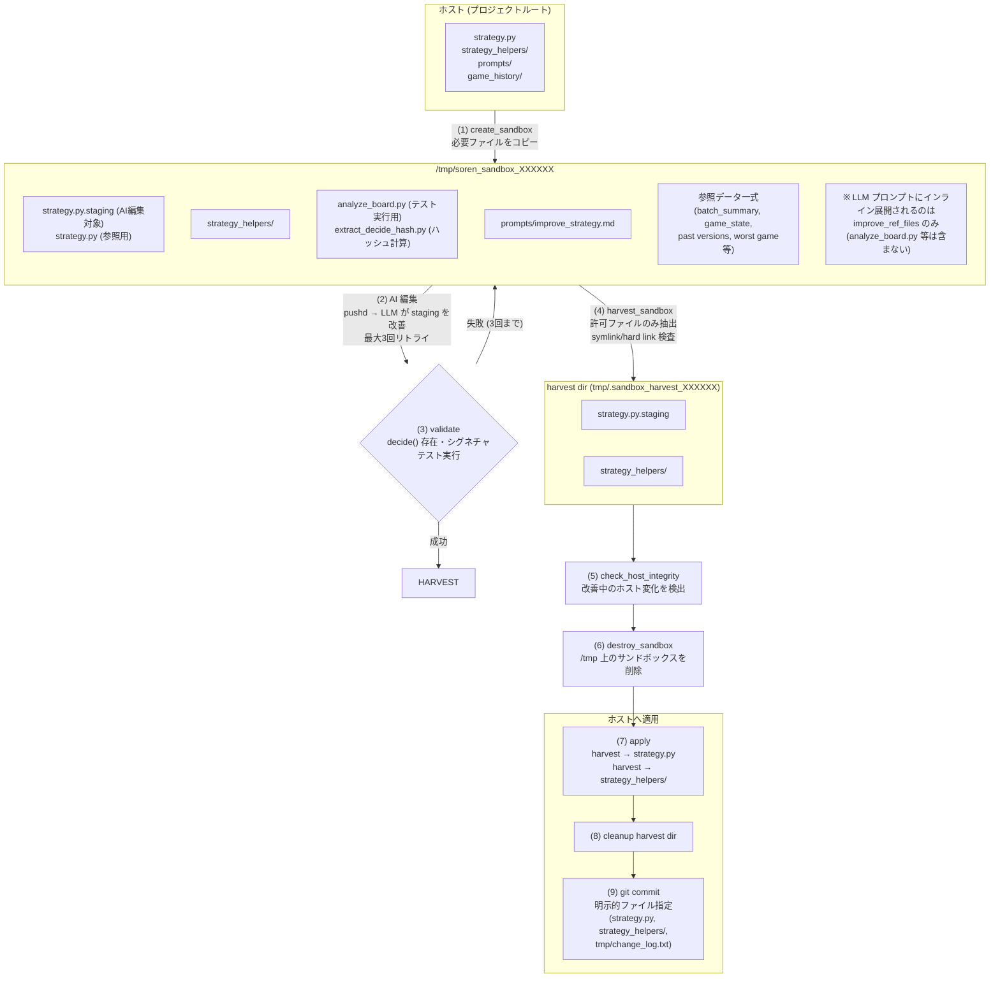

# Soren Game AI

Soviet/Soren パズルゲーム（ソ連共和国）の AI 自動プレイプロジェクト。

同typeのピース2個が接触すると併合進歩する (`type_N + type_N → type_{N+1}`)。
プレイヤーはドロップX座標のみ指定可能。デッドライン超えでゲームオーバー。
ロシアピースを二つ併合してソ連を作ることが目標。

## アーキテクチャ

```
soviet_local.mjs          ← ゲーム実行環境 (HTTP server + Playwright + Unity WebGL, stateのみ更新)
    ↕ commands.txt / game_state.json
AI ループ (3種類から選択)
    ├── soren_loop.sh      ← 自己改善ループ (推奨、eloop.sh/eloop_lib.sh/eloop_improve.sh を統括)
    ├── jloop.sh           ← JSON構造データ版ループ
    └── sloop.sh           ← 画像認識版ループ (レガシー)

soren91/                   ← 91人対戦版 (メリケンAI) 自動プレイヤー (スクリーンショットベース)
    ├── main.mjs           ← エントリポイント: ブラウザ制御 + ゲームループ
    ├── strategy.mjs       ← ドロップ位置決定 (AI改変対象)
    ├── improve.mjs        ← AI改善ループ
    └── soren91_control.sh ← 親ループからの起動・停止・改善キック管理
```

## AI ループ

### soren_loop.sh — Self-Improving Strategy Loop (推奨)

Python スクリプト (`strategy.py`) が1試合を自律プレイし、試合終了後に AI がスクリプトを改善する「メタ学習ループ」。

```bash
node soviet_local.mjs &    # ゲーム起動
./soren_loop.sh            # AI ループ開始
```

**アーキテクチャ:**
```
soren_loop.sh (親スクリプト・エントリーポイント、AI書き換え対象外)
  └── 毎試合 source で eloop.sh を読み込み
        ├── strategy_runner.py  → 1試合を自律プレイ
        │     ├── game_state.json を読む
        │     ├── analyze_board.py で盤面解析
        │     ├── strategy.py の decide() でドロップX決定
        │     ├── commands.txt に書き込み
        │     └── game_history/latest.jsonl にターンログ記録
        ├── GAMEOVER 検知 → スコア取得
        ├── バージョン保存 (strategy_versions/vNNN_scoreXXX_strategy.py)
        ├── eloop_improve.sh (バックグラウンド)
        │     ├── サンドボックス内で AI が strategy.py を改善
        │     ├── バリデーション → 失敗時は自動復元
        │     └── git commit
        └── 次の試合へ
```

**主要ファイル:**

| ファイル | 役割 |
|---------|------|
| `soren_loop.sh` | 親スクリプト（エントリーポイント）。メインループ・初期化・シグナル制御（SIGINT/SIGTERM）・多重起動防止。AI書き換え対象外 |
| `eloop.sh` | 1試合のゲームプレイ関数。毎試合 source で読み込み、AI書き換え可 |
| `eloop_lib.sh` | 全モジュールを source する shim (~40行) |
| `eloop_improve.sh` | バックグラウンド改善サブプロセス |
| `improve_daemon.sh` | 改善ループ独立デーモン。soren_loop.sh とは別ターミナルで起動し、ファイルベース IPC (tmp/state/) で連携 |
| `strategy.py` | AI が改善する決定関数。`decide(game_state, analysis) -> {x, reason}` |
| `strategy_runner.py` | 内側ループ。strategy.py で1試合プレイ + JSONL履歴記録 |
| `analyze_board.py` | 盤面解析。併合判定・着地予測・期待値計算 |
| `prompts/improve_strategy.md` | AI改善用プロンプト |
| `strategy_versions/` | strategy.py のバージョン履歴 |
| `strategy_versions/protected/` | 特に優秀な戦略の保護領域（自動クリーンアップ対象外） |
| `game_history/` | 試合ごとのターンログ (JSONL) |
| `best_score.txt` | ハイスコア記録 |
| `score_history.txt` | rawスコア履歴 (TSV: timestamp, score) |
| `eval_score_history.txt` | EVAL_SCORE履歴 (rawスコア+建国ボーナス) |
| `say_enqueue.sh` | VOICEVOX/COEIROINK TTS のFIFOキュー管理（mkdirロック排他・ストリーミング合成・異常終了リトライ・voice sidecar永続化）。事前合成セクションはトップレベルスコープで実行される点に注意 |
| `voicevox_tts.sh` | VOICEVOX TTS wrapper（チャンク分割合成・ピッチ/テンポ/抑揚調整） |
| `voicevox_sing.sh` | VOICEVOX 歌声合成（中華AI=九州そら、メリケンAI=冥鳴ひまり） |
| `coeiroink_tts.sh` | COEIROINK v2 TTS wrapper（話者一覧・テスト音声生成） |
| `google_tts.sh` | Google Cloud TTS wrapper（gcloud認証、開発/テスト用） |
| `obs_control.sh` | OBS WebSocket v5 wrapper（シーン・ソースの show/hide 制御） |
| `manual_meriken_mode.sh` | メリケンAI手動固定 (`on` で soren91 維持、`off` で通常運用) |
| `soren91_control.sh` | soren91の起動・停止・改善キック・手動メリケンモード・OBS連携 |

- `soren91` の既定は standalone `Google Chrome for Testing` です。`soren91_stop` / `soren91_cleanup` / `soren91_start` は共有タブの close だけでなく、`soren91/tmp/standalone_chromium_profile` または `SOREN91_STANDALONE_CDP_PORT` に紐づく stale standalone Chromium も掃除する。改善終了後に `新しいタブ` の残骸ウィンドウが積み上がるのを防ぐため。
- `soren91/main.mjs` の standalone 起動引数は `soviet_local.mjs` と揃え、`--password-store=basic` と `--use-mock-keychain` を常に付ける。macOS の "Chromium Safe Storage" キーチェーン許可ダイアログを毎回出さないため。

soren_loop の多重起動ロック:

- `kill -0` が macOS の制限で `Operation not permitted` を返す PID は「生存中」と扱う。実行中ループのロックを stale と誤判定すると、二重起動や早期脱出 preflight の競合につながるため。
- ロック所有者が消えた場合だけ、実行中の自身のメイン PID で `tmp/.soren_loop.lock/pid` を再採用する。
- `start_all.sh` は `soren_loop` の lock pidfile を通常 worker pidfile として上書きしない。起動直後も lock owner PID を監視対象に採用し、supervisor がロック所有者を書き換えて試合終了後の score 登録前に duplicate 判定で落ちる事故を防ぐ。
- `start_all.sh` は各 poll で worker 実プロセス数を `tmp/state/worker_duplicates.json` に書き、同じ worker が複数見えたら `logs/start_all.log` に `worker duplicate detected` を一度だけ出す。`show_status.sh` は新鮮な duplicate state があれば CORE に `Duplicates DETECTED` / `none` を表示する。検知は観測用で、余分な PID の自動 kill はしない。
- `workers/chat_worker.sh` / `workers/youtube_worker.sh` / `workers/audio_worker.sh` / `workers/radio_worker.sh` は既存 pidfile の worker が生存している時、外部からの再起動試行を no-op 成功として終了する。自動起動側の冪等チェックで `ERROR: 既に起動中` や停止ログが積み上がっても、実 duplicate がない状態を不安定と誤読しないため。
- `strategy_runner.py` が `commands未消化` を3連続で検出した場合は `bridge_desync` として試合を中断し、`eloop.sh` が `soviet_local.mjs` bridge を再起動して次周回で復旧する。1回の未消化は `MOVE状態待ち` 120秒 + command timeout を消費するため、6連続まで待つと十数分空転する。

**シェルモジュール構成:**

`eloop_lib.sh` が以下のモジュールを source する:

| ディレクトリ | モジュール | 役割 |
|---|---|---|
| `core/` | `config.sh`, `helpers.sh`, `game_state.sh`, `version.sh`, `phyrogenetic.sh` | 定数・ヘルパー・状態管理・バージョン管理 |
| `strategy/` | `ai.sh`, `sandbox.sh`, `regression.sh`, `improve.sh` | AI実行・サンドボックス・回帰検出・改善管理 |
| `broadcast/` | `radio_engine.sh`, `radio_persona.sh`, `radio_themes.sh`, `radio_news.sh`, `radio_factcheck.sh`, `radio_corners.sh`, `radio_state.sh`, `radio_celebration.sh`, `comment.sh`, `comment_worker.sh`, `scheduler.sh` | ラジオ・コメント・スケジューリング |
| `infra/` | `cleanup.sh` | PID停止・クリーンアップ |

**粛清後の改善フロー:**

粛清後の目的は、単に低スコア戦略を戻すことではなく、ロシア建国ルートを失ったまま粛清連鎖に入るのを止めること。`check_regression` が粛清を検出したら、`soren_loop.sh` は次ゲームへ進む前に粛清理由と復帰先の目的進捗を分類する。

**strategy_runner 安全ガード:**

- `enforce_deadline_safety` は、盤面全体の precontact pressure が低い場合でも、選択候補が `crosses_deadline=true` かつ `merge_grade=NO` で、同じ analysis set に非 crossing の safe 候補があるなら `safe_far_below_crossing` として差し替える。これは「大きい国の合体を塞ぐ」戦略評価を直接変えず、明らかなデッドライン超え NO merge 配置だけを実行直前に退避するための境界ガード。
- `enforce_deadline_safety` の最終 postcondition は、deadline crossing の `DIRECT` / `NEAR` 併合候補を deadline crossing の `NO` 候補へ downgrade しない。全候補が deadline を越える局面でも、併合で危険ピースを消せる候補を NO 配置より優先する。
- `enforce_deadline_safety` は `risk_top_y_after_drop` だけに依存せず、live `game_state.pieces` と `next.r` / type 半径から候補Xの実着地 top を再推定する。`risk_top` が近く見えても実形状では高い柱へ積む候補なら、より低い safe 候補または all-crossing の最小 geometry top 候補へ戻し、デッドライン直前の見かけ上安全な高積みを避ける。
- `enforce_deadline_safety` の all-crossing fallback は、全候補が `crosses_deadline=true` かつ NO merge の場合でも、最小リスクと同程度の非エッジ候補があれば `non_edge_postcondition` で寄せる。これにより、戦略側の DEADLINE_GUARD が NO_MERGE の壁寄り配置を避けても、runner 側の最終安全弁が `NO/cross -> NO/cross` の壁落としを再導入することを防ぐ。
- all-crossing fallback は、戦略側がすでに非エッジの `NO/cross` を選んでいて、その候補が最小リスク帯に残っている場合も `preserve_non_edge_no_postcondition` で保持する。わずかな `risk_top` 差だけで runner が `x=3.0` などの壁寄り `NO/cross` へ動かし、終盤の揺れを増やすのを避けるため。
- all-crossing 局面で `visual_deadline_same_country` が同国接触候補を拾っても、盤面 top が deadline を十分に超えている場合は視覚推定を保存せず、最小 risk_top の候補へ戻す。これにより、直近の deadline fallback 改善が NO_MERGE の高積みを選んだ場合でも、実行時により低い崩壊リスクへ寄せる。
- `visual_deadline_same_country` が all-crossing の中で候補を保存する場合でも、実形状 top と `risk_top_y_after_drop` の両方でより低い crossing 候補があるなら `geometry_min_top_postcondition` で差し替える。全候補が deadline を越える局面でも、同国接触の名目だけで高い積み上げを固定しないための最終ガード。
- `deadline_misplacement_monitor.py` は履歴スナップショットで追加されたピースが床または既存ピースに物理接触している場合だけ deadline misplacement を評価する。落下途中の transient snapshot を「実着地」と誤認し、改善ループへ存在しないデッドライン違反を渡す false positive を避けるため。
- 対応テストは `tests.test_escape_mechanisms.TestSovietObjectiveImproveInputs.test_deadline_safety_replaces_crossing_choice_when_safe_exists_far_below_deadline`、`test_deadline_safety_geometry_headroom_overrides_underestimated_safe_choice`、`test_deadline_safety_visual_same_country_falls_back_when_geometry_is_worse`。all-crossing noise を無視する既存テストと合わせて、safe 候補がある時だけ発火することと、形状再推定が高積み候補を退避することを確認する。

判定順:

1. 粛清が起きたら、`REGRESSION_ROLLBACK_RESULT` の理由を読む。
2. `objective_regression` / `lost_russia_path` / `curr_russia=0` / `best_max_type` 後退は、スコア問題ではなくロシア建国ルート喪失として扱う。
3. 復帰先に `russia_count > 0` または `best_max_type >= 15` がある場合は、脱出ではなく rollback target の再検証を優先する。`current_strategy_run.json` が rollback 直後の fresh cycle で空でも、同じハッシュの `rolling_scores.json` 上のロシア実績を参照して誤脱出を防ぐ。
4. ただし rollback target の fresh cycle が `MIN_GAMES_BEFORE_IMPROVE` に達した後は、過去の rolling 実績だけではロシア進捗ありとみなさない。current run / improve lock にロシア再現がなく、`regression_streak >= WILDCARD_REGRESSION_STREAK` の場合は脱出ルーティングへ戻す。
5. 復帰先にロシア進捗がなく、かつ `regression_streak >= WILDCARD_REGRESSION_STREAK` の場合は、次ゲームへ進まず `post_regression_direct_escape` ロックを作る。
6. それ以外は粛清前の失敗バッチを改善入力に使わない。rollback 後の戦略は別 hash なので、`current_strategy_run` を復帰先 hash の fresh cycle として回し、そのワンサイクル結果で通常改善する。

rollback 候補が validation 後に別 hash へ正規化された場合は、元 hash を `rejected_hashes.txt` と `rejected_hash_metrics.json` の両方へ `rollback_target_normalized` として記録する。メタがない rejected hash は legacy として再許可されるため、`normalized_to_hash` を保存して同じ古い候補が何度も同じ実体 hash へ rollback されるループを防ぐ。`last_rollback_pair.json` / rollback analysis / commit target note には `normalized_from=<requested> actual_hash=<applied>` を残し、停滞監視で「候補 hash」と「実際に復帰した hash」を取り違えないようにする。後から `strategy_versions/by_hash/<hash>.py` が本来の hash に復旧した場合は、行単位一致で stale normalized reject を外して rollback 候補へ戻す。

通常サイクル中の早期脱出:

- rollback 直後の再検証ではない通常改善 hash で `consecutive_no_improve >= WILDCARD_TRIGGER_STAGNATION` または `regression_streak >= WILDCARD_REGRESSION_STREAK` になり、蓄積ゲーム数が `WILDCARD_EARLY_ESCAPE_MIN_GAMES` 以上なら、`MIN_GAMES_BEFORE_IMPROVE` を待たず `early_escape_lock` を作る。
- 逆に停滞/回帰閾値に達していても、通常改善 hash の蓄積が `WILDCARD_EARLY_ESCAPE_MIN_GAMES` 未満なら発火は延期する。停滞監視では `current_strategy_run.hash` と `accumulated_games.json count` を確認し、`show_status.sh --once` の `defer=early2/4` のような表示を見て次の発火条件を明記する。
- 早期脱出ロックは `improve_reason=normal` として作られ、改善 daemon 側で `archive_restart` / `wildcard` / `escape_ai` の最終ルーティングを判定する。
- `strategy/improve.sh` 側の Russia recovery / regression streak ルーティングも `WILDCARD_REGRESSION_STREAK` の既定値は `2` に統一する。設定未読込の単体確認やログ文言でも `show_status.sh` の `Escape stag=x/y` と同じ閾値として読む。
- 同じ判定は post-game 直後だけでなく next-game preflight でも再実行する。これにより、閾値到達済みの `accumulated_games.json` が残ったまま通常プレイへ流れ続ける取りこぼしを止める。
- `monitor_improve_runtime.sh` も idle watchdog として同じ早期脱出判定を再実行する。メインループの post-game / preflight が取りこぼしても、`regression_streak >= WILDCARD_REGRESSION_STREAK` または停滞閾値到達済みの蓄積を検出し、ロシア進捗・batch quality・rollback fresh cycle でなければ `tmp/improve.lock` を作る。`show_status.sh --once` の `Escape` 行は `stag=x/y reg=a/b` を表示するため、回帰閾値だけで発火すべき状態も見落とさない。
- WILDCARD が `no_candidate` で終わった直後も、現行 batch の composite が leader 比 `EARLY_COMP_TOP_GAP_MIN_RATIO` 以上なら即再発火せず `EARLY_ESCAPE_BATCH_OK` として延期する。停滞カウンタは残るため、次の発火条件は batch quality が下限を割る、ロシア進捗が出ないまま回帰閾値へ戻る、または 12/12 完走で通常改善へ進むこと。
- rollback target の fresh cycle 中、または rank1 hot streak 中は早期脱出を延期する。これは過去 rolling 実績の再検証や上振れ保護を優先するため。
- 前ハッシュ由来の `regression_streak` / `consecutive_no_improve` が残っていても、現行 `accumulated_games.json` が `russia_count > 0` / `soviet_count > 0` / `best_max_type >= 15` を示す場合は早期脱出を延期し、現在のロシア進捗を優先して評価を続ける。
- `current_strategy_run.hash` が `best_strategy_anchor.hash` と同一の rollback 再検証中は、`show_status.sh` の `Escape stag=x/y` だけで停滞発火と判定しない。`current_strategy_run.games_total` が成熟閾値に届くまでは rolling 上の `russia_count` / `best_max_type` を保護情報として扱い、成熟後も current run にロシア再現がない時だけ regression streak から脱出へ戻す。
- 現行 `v369 congestion-aware proximity` は reactive level だけでは分岐しない。frontier 近接誘導は piece_count / 横距離 / 高さで調整しつつ、`max_y >= 3.0 && deadline_crossed` または `reactive_pair_count >= 5 && max_y >= 2.5` の混雑局面では `proximity_bonus = 0.0` にして、危険域の高さ制御を優先する。
- 改善プロンプトと review prompt は、`rp_guidance_suppressed` が true の時に「倍率追加を止める」だけでなく、既に計算した `proximity_bonus` 自体を0へ落とすことを必須化している。直近の自動戦略がここを漏らすと `tests.test_escape_mechanisms.TestCommentReplyDepthPrompt.test_frontier_proximity_guidance_keeps_congestion_suppression` が失敗するため、次の通常改善で strategy 本体側を直す対象になる。

直接脱出ロックのルーティング順:

1. `archive_restart`: 評価済みアーカイブから、near-anchor かつロシア再現性または type14/15 frontier を持つ候補へ戻す。`best_max_type >= 15` だけを `russia_count=1` とみなさない。候補は `ARCHIVE_RESTART_MIN_RUSSIA_COUNT` / `ARCHIVE_RESTART_MIN_RUSSIA_RATE` / `ARCHIVE_RESTART_FRONTIER_MIN_BEST_TYPE` で絞る。
2. `wildcard`: archive 候補がない、または cooldown 中なら使う。目的はランダムなスコア改善ではなく、type14→15 frontier やロシア建国経路の再獲得。
3. `escape_ai`: 最後の手段。評価済み WILDCARD seed があり、その seed が `russia_count > 0` または `best_max_type >= WILDCARD_ESCAPE_AI_SEED_MIN_BEST_TYPE` を満たす場合だけ使う。seed なしの `escape_ai` は通常改善と同じなので、WILDCARD連続失敗が `WILDCARD_AI_ESCALATE_STREAK` 以上で archive候補もseedもない時、または archive_restart fallback 後に seed が見つからない時は、同じWILDCARD/escape_aiを再試行せず通常AI改善へ戻す。seed の探索先は `_archive_restart_has_candidate` と同様に `STRATEGY_HASH_ARCHIVE_DIR` (by_hash) と `STRATEGY_HASH_PERMANENT_ARCHIVE_DIR` (`ARCHIVE_RESTART_INCLUDE_PERMANENT=1`) の両方。by_hash は刈り取られて十数件しか残らず、wildcard origin の大半は permanent archive にあるため、by_hash だけを見ると seed 枯渇で `escape_ai` が永久に発火しない。

`archive_restart` が候補を選んでも validation 後に現行 hash と同一へ正規化され、実効的な hash 変更がない場合は、その候補を cooldown/quarantine に入れて `escape_ai` へフォールバックする。評価済み WILDCARD seed があればそこから構造変異へ進め、seed がない場合は `escape_ai` 失敗で停止せず通常AI改善へ戻す。

エスカレーション streak の保持: `consecutive_wildcards`（archive_restart / escape_ai へ昇格させるための脱出失敗カウント）は、**wildcard / archive_restart / escape_ai の origin が昇格した「脱出成功」時のみ** 0 にリセットする。素の incumbent（rolling_top）が PROMOTE しただけでは維持する。これは `regression_streak` が非 origin PROMOTE で 0 リセットせず減衰のみする扱いと対称。incumbent の PROMOTE でリセットしてしまうと、`no_candidate` に終わった機械的脱出の失敗が一度も蓄積されず、`WILDCARD_AI_ESCALATE_STREAK` / `ARCHIVE_RESTART_STREAK` に到達できないため、強い局所最適が勝ち続ける限り構造変異を生む `escape_ai` に永久に到達できなくなる。

ステータス監視:

- `show_status.sh --once` の `ArchiveNext` は最有力候補だけを短く表示する。
- `show_status.sh --once` の `ROLLBACKS` は git の auto-revert commit 履歴だけでなく、ライブの `tmp/state/last_rollback_pair.json` も読む。直近 rollback がまだ commit 履歴に現れていない時も `last=` と `RB1` が現実の rollback 時刻/hash を示す。
- `show_status.sh --once` の `Escape` 行は、停滞カウンタが閾値到達済みでも現行 `current_strategy_run.json` がロシア/ソ連/Type15以上を再現中なら `defer=R1,T15 11/12` のように延期理由と成熟度を併記する。これにより `stag=3/3` だけで WILDCARD 発火漏れと誤読せず、再評価完走を待つべき状態を確認できる。
- `tmp/state/improve_state.json` は実行中の `improve_reason` を監視の一次情報として扱う。running state を更新する時に理由が空なら既存理由、なければ `normal` を保持し、archive_restart/escape_ai fallback 後の通常AI改善を理由不明にしない。
- メインループの改善中判定は `tmp/improve.lock` だけに依存しない。lock が欠落しても `tmp/state/improve_state.json` が新鮮な `running` / `manual` を示す間はゲーム進行を止め、stale state は `IMPROVE_STATE_RUNNING_FRESH_SEC` 経過後に無視する。
- `run_cmd` の長時間 heartbeat も `RUN_CMD_IMPROVE_REASON` を渡して `improve_state.json` を更新する。AI待機中に archive_restart/escape_ai 起点の通常改善が `normal` や空 reason へ戻り、完了時の fast-escape 判定だけ lock 復元に頼る状態を防ぐ。
- `monitor_improve_runtime.sh` は改善 idle 復帰時に `improveOverlay` / `wildcardParallelOverlay` を必ず hide し、ゲーム中なら `dashboard` も hide して `sorengame` / `statsOverlay` / `opsOverlay` を再表示する。`soren91_is_running` が false になる stale soren91 player も回収し、メリケンAIや並列評価の表示が本線プレイ画面へ重なり続ける状態を残さない。
- `wildcard_parallel.py` の隔離評価は各ゲームに `WILDCARD_PARALLEL_GAME_TIMEOUT` を適用する。status には `started_at` / `updated_at` を書き、`_is_improve_running` は `WILDCARD_PARALLEL_MAIN_BLOCK_MAX_SEC` を超えた古い running status だけで本線ゲームを止め続けない。
- `status_dashboard.py` / `generate_status_overlay.sh` のステータス overlay は、WILDCARD status の直後に `ArchiveRestart candidates` として上位10候補の `hash` / `comp` / `p25` / `n` / `ru` / `sv` / `t` / origin retry を表示する。
- `WILDCARD origins` は現戦略が WILDCARD origin と一致している時だけ表示する。archive_restart origin の戦略では archive候補一覧を主表示にし、古い WILDCARD origin を誤って現状説明に混ぜない。
- 候補がない場合は `threshold` や `R0` / `cool` / `reject` などの blocker を表示し、`escape_ai direct` へ落ちる条件を確認できるようにする。
- `wildcard` / `archive_restart` の隔離改善中は soren91 を自動起動せず、非メリケン表示を保つ。通常改善だけが従来どおり meriken tab / soren91 presentation を復帰させる。
- `wildcard` 並列評価の OBS overlay は、候補なし・winner欠落・validation失敗・SIGTERM でも trap で status/dashboard 表示へ復元する。SIGTERM/SIGINT 時も status に完走済み winner が残っていれば result file へ best-effort で保存し、外側の timeout だけで `parallel_no_candidate` に落とさない。`show_status.sh` の `WildParFail` は直近1時間の失敗診断であり、`improve_state.json` が idle なら脱出ロックが詰まっている状態ではない。
- `workers/radio_worker.sh` は標準出力を自前で `tee >(...)` しない。`start_all.sh` が `logs/radio_worker.log` へ保存する前提にし、macOS/Codex sandbox の `/dev/fd` 制限で duplicate 起動時に `Operation not permitted` を出さない。
- `wildcard` 並列評価は既定で 6 候補を隔離実行し、各候補は既定 6 ゲームで評価する。OBS では `wildcardParallelCand1..6` を 3列x2行に配置する。候補数を増やした時は overlay の show/hide 対象、候補 source transform、`WILDCARD_PARALLEL_JOBS` の既定値を同時に揃える。
- 通常改善後の `post_improve_param_parallel` は `POST_IMPROVE_PARAM_PARALLEL_JOBS` で候補数を個別に調整する。WILDCARD 脱出本線の `WILDCARD_PARALLEL_JOBS` と分け、slot1 baseline を含む追加パラメータ試行だけを増減できるようにする。改善中は本線 game loop を止め、winner の即時適用で評価中 hash がずれないようにする。
- `wildcard` 並列評価のカリングは既定で1ゲームごとに有効で、現 leader composite の 90% 未満に落ちた候補を補充する。ただし比較先 leader は既定で2ゲーム以上走った候補に限り、1ゲームだけの上振れで他候補を早期に落としすぎない。`WILDCARD_PARALLEL_CULL_AFTER_GAMES=0` にした時だけカリングを無効化して全候補を指定ゲーム数まで走らせる。
- `wildcard` 並列評価の slot ごとの補充回数上限は既定で無効 (`WILDCARD_PARALLEL_LINGERING_SLOT_MAX_CULLS=0`)。壊れる戦略が続いても、各 slot は完走候補が出るまで探索を粘る。
- `wildcard_parallel.py` はセッション開始時と各候補ゲームの起動直前に WILDCARD 専用 game server port (`WILDCARD_PARALLEL_SERVE_BASE_PORT` から候補数分) の古い listener を掃除する。前回の隔離ブラウザが残っても `EADDRINUSE` で候補全体が 0 game 失敗にならないようにするため。
- `wildcard_parallel.py --cleanup-stale` は古い候補ウィンドウ/port の掃除だけでなく、WILDCARD overlay を `restored` へ更新して候補カードを消す。status に残った `serve_base_port` / candidate `serve_port` も掃除対象に入れ、post-improve 用の 18180+ port が残っても次回の候補起動を妨げないようにする。
- `wildcard_parallel.py --cleanup-sessions` は実行中 status の `session_dir` と直近 `WILDCARD_PARALLEL_KEEP_RECENT_RUNS` 件を残して古い run directory だけを掃除する。既定は3件保持で、停滞監視に必要な直近の候補履歴を消さずに、完了/失敗後の隔離ブラウザ残骸だけを減らす。
- `wildcardParallelOverlay` は 1920x900 の進捗・状況表示で、候補6本を3列x2行に並べる。候補 Chrome には `Wildcard Parallel Slot N` の window title を付け、`obs_window_capture_source.sh` が該当 window を source に再バインドする。
- `wildcardParallelOverlay` は環境変数 `WILDCARD_PARALLEL_OVERLAY_TITLE` で見出しを切り替え、候補別 game 数と status counts を進捗バーで表示する。WILDCARD 脱出と post-improve 追加試行を同じ overlay で見ても、どちらの評価かを取り違えないための表示である。
- `obs_control.sh transform` は既定では OBS 側で手調整済みの transform を保持し、初期値のままの source だけを配置する。自動配置が必要な `wildcardParallelOverlay` / `wildcardParallelCandN` は `OBS_CONTROL_TRANSFORM_MODE=force` を付けて明示的に上書きする。
- `wildcard` 並列評価中は親 `eloop_improve.sh` が `WILDCARD_PARALLEL_HEARTBEAT_SEC` ごとに `improve_state.json` を更新する。隔離評価が長くても runtime monitor が stale lock と誤認しないようにし、終了・SIGTERM・候補なしでは heartbeat を止めて OBS を復元する。
- `wildcard` 並列評価の進捗は、実行中は `tmp/state/wildcard_parallel_status.json` を一次情報にする。候補 workdir 内の `game_count.txt` / `score_history.txt` / `eval_score_history.txt` は初期化値や書き込みタイミングで遅れて見える場合があるため、停滞監視では status file の `games` / `scores` / `russia_count` / `comp` と実プロセスを優先して判断する。
- `wildcard_parallel.py` が result file に winner を書いた後で外側の timeout / TERM により非ゼロ終了した場合は、result file の winner を優先して採用処理へ進める。winner があるのに `rc=143` だけで `parallel_no_candidate` に落とすと、停滞脱出が空振りで終わるため。
- `wildcard_parallel.py` は全候補が 0 game のまま `bridge exited` / `SIGABRT` / port 競合で失敗した時、性能比較上の候補なしではなく `infra_failed` として status/result に出す。停滞監視では `no_candidate` と区別し、ブラウザ/bridge 側の失敗として扱う。
- `wildcard` 並列評価が `infra_failed` で winner を返せない場合は、旧来の直接 `wildcard_perturb.py` にフォールバックして脱出自体は進める。`no_candidate` は性能上の候補なしなので従来どおり no-op/延期扱いに残す。
- `post_improve_param_parallel` の `infra_failed` は、通常改善後の追加パラメータ試行が 0 game で空振りした診断であり、`improve_state.json` が idle かつ現 hash の本線評価が進んでいるなら脱出ロック詰まりではない。`show_status.sh --once` はこの失敗を `PostParamFail` と表示し、WILDCARD 停滞脱出本線の `WildParFail` と分ける。WILDCARD 停滞脱出の `infra_failed` だけが direct fallback 対象。
- `post_improve_param_parallel` は WILDCARD 並列評価と同じ隔離ブラウザ基盤を使うが、通常改善後に Chrome 候補を複数起動して OBS 候補ソースまで更新すると配信面の巻き込みが大きいため、既定は無効にする。使う時だけ `POST_IMPROVE_PARAM_PARALLEL_ENABLED=1` を明示する。OBS 候補 window/browser source も既定は無効で、表示検証したい時だけ `WILDCARD_PARALLEL_OBS_WINDOW_SOURCES=1` / `WILDCARD_PARALLEL_OBS_BROWSER_SOURCES=1` を明示する。
- `wildcard` 並列評価 overlay は候補を暫定 composite 順に表示し、leader と相対バーを出す。rolling score 反映前でも `wildcard_origin.json` の `parallel_result` に trial scores が残っていれば status dashboard は `trial` として n/max と composite を表示する。
- `wildcard` 並列評価ブラウザは `SOREN_BGM_VOLUME=0` / `SOREN_SE_VOLUME=1.5` を既定で渡す。Unity の scene load 後に音量が戻ることがあるため、`soviet_local.mjs` は `SOREN_UNITY_VOLUME_REAPPLY_MS` 間隔で指定音量を再適用する。
- `wildcard` / `post_improve_param_parallel` の隔離ブラウザは既定で、この repo の Playwright が返す Chrome for Testing (`chromium.executablePath()`) を使う。macOS の system Chrome や cache 内の未対応 Chromium は Crashpad がユーザー本体プロファイルへ触れて 0 game `infra_failed` になりやすいため、必要な時だけ `WILDCARD_PARALLEL_USE_SYSTEM_CHROME=1` で明示する。
- macOS の候補 Chrome 事前起動は、まず LaunchServices の `open -g -n` を試し、失敗したら同じ隔離 `HOME` / `XDG_*` / `TMPDIR` で Chrome executable を直接起動してから CDP attach する。CDP port が応答してから attach-only にすることで、起動直後の `ECONNREFUSED` で Playwright launch に戻って短命ウィンドウを量産しない。`open` が `kLSNoExecutableErr` で失敗しても Node 側の Playwright launch に落とさず、Crashpad がユーザー本体プロファイルへ触る経路を避けるため。
- macOS の候補 bridge は既定で tmux セッション (`soren_wp_*`) 内に起動する。Codex や改善プロセスの実行コンテキストから直接 Chrome を起動すると Mach port / Crashpad 権限で落ちることがあるため、本線 bridge 復旧と同じ tmux 側の権限コンテキストへ寄せる。切り分け時だけ `WILDCARD_PARALLEL_BRIDGE_TMUX=0` で従来の direct `Popen` に戻せる。
- `wildcard` / `post_improve_param_parallel` の候補 Unity HTML title は `Wildcard Parallel Slot N` に書き換える。本線 OBS の `sorengame` window capture が `Unity WebGL Player | soren-game` を掴むため、候補ウィンドウを同名にすると本線キャプチャが候補へ誤バインドする。
- 本線 `soviet_local.mjs` は `SOREN_UNITY_AUDIO_WATCHDOG_MS` 間隔で Unity WebAudio 状態を `tmp/state/local_audio_health.json` に書き、mute 中でないのに AudioContext が `suspended` / `interrupted` のままなら実入力クリックと `resume()` を自動投入する。CDP 権限付与や page evaluate は短い timeout で抜けるため、音声ルーティングの一時停止が game loop / health 更新を固めない。BGM が戻らない場合はこの health file と `tmp/audio_diag.log` の `[AUDIO-WATCHDOG-RECOVER]` を確認する。
- bridge recovery はゲーム進行が fresh でも、`tmp/audio_diag.log` に `[AUDIO-WATCHDOG-RECOVER]` が短時間に複数回続き、`local_audio_health.json` が `muted=false` かつ `suspended` / `interrupted` のままなら `soviet_local.mjs` を再起動して AudioContext を作り直す。閾値は `BRIDGE_AUDIO_STUCK_RECOVER_COUNT` と `BRIDGE_AUDIO_STUCK_WINDOW_SEC` で調整する。
- `soren_bridge` tmux 内の本線 bridge が port 8080 を掴んだまま AudioContext stuck 復旧へ入る場合は、port 解放待ちの前に tmux session を落とす。macOS の privacy/sandbox 境界で PID の cwd/command が隠れても、古い tmux pane が残って復旧前に `port 8080 解放不可` へ落ちるのを防ぐ。
- 復旧後検証も PID attribution だけに依存しない。port 8080 が再び LISTEN している、または `game_state.json` が fresh なら成功扱いにし、音声が戻っているのに cooldown だけが指数的に伸びる状態を避ける。
- `wildcard` / `archive_restart` の fast escape では親 `eloop_improve.sh` が候補採用と状態遷移を担う。親 PID が見えない running state は、通常改善のように長時間 fresh log 扱いで保護せず、短い猶予後に `monitor_improve_runtime.sh` が harvest して stale lock を解放する。early escape の lock は作成時 `normal` でも、改善起動時に最終 reason を書き戻すため、失敗後の再試行・表示・代打制御も fast escape として扱われる。
- `wildcard_parallel` / `post_improve_param_parallel` の隔離評価中は、`phase` / `detail` も見て soren91 代打を止める。pid file が消えた孤児 `node main.mjs` や stale runner lock は `soren91_control.sh` が tmux/log writer/process table から回収し、隔離評価や通常復帰時に meriken 側が残って本線表示を隠さないようにする。通常改善で soren91 を起動する時も、pid file / runner lock がなく `soren91.log` と `in_game` が古い回収プロセスは stale とみなし、cleanup 後に直接 kill fallback してから新規起動する。
- rollback/overlay の候補順位は `strategy_versions/by_hash` と `strategy_versions_archive/by_hash` のどちらにも実ファイルがない hash を除外する。rolling score だけ残っている復元不能候補を top や rollback target として表示・選択し、archive_restart/rollback が空振りするのを避ける。
- `improve_daemon` は `tmp/improve.lock` があるのに `logs/improve_daemon.log` / `tmp/state/improve_state.json` が進まない場合、supervisor が `IMPROVE_DAEMON_LOCK_STALL_SEC` 後に stale とみなして再起動する。pidfile の heartbeat だけを worker 生存と見なすと、メインループが `改善ロック待ち` のまま止まるため、lock age / log age / state age を同時に見る。
- AI 実行中の `opencode thinking...` スピナーは TTY 表示時だけ出す。`improve_daemon` や supervisor 配下の headless 実行では `logs/improve_daemon.log` を WILDCARD/archive_restart/escape_ai 監視に使うため、制御文字を流さない。切り分け時だけ `RUN_CMD_SPINNER_FORCE=1` で非TTYにも強制表示できる。
- Twitch 予想の結果が `粛清` の場合は、`soren_loop.sh` が `REGRESSION_ROLLBACK_RESULT` から `regression_reason_raw` / `regression_reason_label` を予想 state に保存し、`twitch_predictions.sh` が結果文に理由を付ける。粛清が出た時は「粛清」だけでなく、`comp比率低下` / `top対比comp不足` / `前段階到達率低下` / `ソ連経路喪失` などの原因が視聴者に見える。
- 回帰理由は `lost_soviet_path` だけでなく、ロシア前段階の `lost_turkmenistan_gate` / `lost_ukraine_gate` / `lost_kazakhstan_gate` も段階到達率で判定する。ロシア到達(type15)だけは rollback/anchor 保護の直接理由にせず、archive_restart / escape の候補選別と改善入力の強い signal として扱う。一方で anchor がソ連到達済み(`soviet_count > 0`)なら、current がソ連未到達へ戻る `lost_soviet_path` は早期目的退行として保護する。rolling score が上位 grace 内の時は段階ゲートでの粛清を抑制し、上位外で frontier を失った時だけ目的後退として扱う。
- ダッシュボードの `Purge Target` は `best_strategy_anchor.json` と `rolling_scores.json` から次に守るべき段階到達率 target を表示し、`Founding r100` は直近100ゲームの type15(ロシア) / type14(カザフスタン) / type13(ウクライナ) 到達率を表示する。soren91 ランキングコメントは視聴者向けに現行 hash の `current_strategy_run.json` 由来の建国率だけを短く出し、粛清基準 target はダッシュボード側へ分離する。これによりロシア建国率の低下・停滞と、現在の rollback / purge target を混同せず確認できる。
- Stage 3 のレビューは会話上の PASS ではなく `tmp/review_result.md` の実ファイル作成を完了条件にする。レビューAIが PASS 本文だけを返してファイルを書かない場合は no-edit retry / verdict repair の対象で、同じレビューを無駄に増やさないためプロンプト側でも最終応答前のファイル確認を必須化している。`Read tmp/review_result.md` が初回 `File not found` になった場合は、質問せず `Write` でテンプレートを作成する。
- 粛清ポストモーテムは診断専用なので、opencode slot を握っている間に Stage 3 review / analyze 側の `IMPROVE_OPENCODE_LOCK_MAX_WAIT_SEC` が先に尽きる場合は、待ち上限直前で stale lock として解放して改善本線を優先する。`opencode slot wait exceeded` が先に出ると同じ review attempt を無駄に消費するため、`stale rollback-postmortem run lock cleared` が先行するのが期待挙動。
- AI改善の validation は、起動不能・`decide()` 契約違反・完全無変更・`decide()` 実質無変更・コメント/reason文言だけの変更を強く止める。過去 rejected hash、固定ターンゲート、Stage 3 レビュー FAIL は観測ログに残すが、余計な validation で探索を止めないため採用後の実ゲーム評価に委ねる。
- Stage 3 のレビューは `height_mult` / `merge_mult` / penalty係数を変える diff では、説明文の「強化/緩和」だけでなく周辺の最終式まで追って係数方向を検算する。たとえば `height_penalty = landing_y * ... * height_mult` なら `height_mult` 増加は penalty 増、低下は penalty 減として扱い、コメントと実挙動の逆転を FAIL にする。
- Stage 3 のレビューは、比較閾値を変える diff でも比較演算子込みで効果方向を検算する。たとえば `margin < 0.5` を `margin < 0.3` に下げると発火範囲は狭まるため、「より多く捕まえる」「強化」と説明しているなら FAIL にする。
- Stage 3 の verdict validation も同じ閾値方向ミスを検出してログに残す。レビュー本文が PASS でも、`0.5 -> 0.3` のような閾値縮小を「より多く捕まえる」「強化」と説明している場合は advisory failure として扱い、起動検証OKなら apply は継続する。
- Stage 3 のレビューは、`low placement` / 低配置 / 高積み回避 / 盤面圧縮などをうたう新規 bonus / penalty でも単調方向を検算する。低配置を好む説明なのに `max_y` が大きいほど加点する、piece_count を減らしたい説明なのに piece_count 増加で報酬が増える、といった実式の逆向きは FAIL にする。
- Stage 3 のレビューは、`lowest-y` / 低配置 / 高積み回避をうたう新規 bonus が候補ごとの高さ値に依存しているかも確認する。条件成立候補へ `+500` のような定数加点を足すだけでは候補間の高さ順位を変えないため、低い候補と高い候補の2例で相対 score 差が低い候補側へ増えることを示せない場合は FAIL にする。
- Stage 3 の verdict validation は、定数加点を修正前説明として引用しているだけの PASS を誤検出しない。`landing_y` / `top_y` / `height` などの候補別値と `factor` / 相対差分の説明が同じ verdict 内にある場合は、定数加点 claim ではなく「定数加点を差分式へ直した証拠」として扱う。
- Stage 3 のレビューは、新規 axis / reason / bonus / penalty が、根拠にした worst/best game log や `tmp/batch_summary.txt` の実データで到達可能かも確認する。新 reason が発火不能な条件や、引用した turn 値と条件が食い違う変更は PASS させない。
- Stage 3 のレビューは、新しく `analysis` / `game_state` / `reactor` のキーや tuple/list/dict 添字を読む diff では、既存コード・`strategy_runner.py`・入力サンプルの runtime shape と照合する。未確認の型・添字仮定で通すと、今回のような frontier 誘導ロジックが実データで不発になっても PASS してしまうため、shape 未確認は FAIL として扱う。
- Stage 3 のレビューは、availability / flags / grade 判定で `dict.get(...) != "NO"` のように欠損キーを真扱いする diff を FAIL にする。`merge_available` や `merge_grade` などはキー存在・許容値・欠損時の扱いを入力サンプルで確認し、欠損を「利用可能」と解釈しない。

関連設定:

| 変数 | 既定 | 役割 |
|---|---:|---|
| `POST_REGRESSION_DIRECT_ESCAPE_ENABLED` | `1` | 粛清連鎖でロシア建国ルートを失った場合、次ゲームを待たず直接脱出ロックを作る |
| `WILDCARD_TRIGGER_STAGNATION` | `3` | 通常サイクル中の停滞で WILDCARD / archive_restart / escape_ai ルーティングへ進む閾値 |
| `WILDCARD_EARLY_ESCAPE_MIN_GAMES` | `4` | 停滞閾値到達時に 12試合を待たず早期脱出ロックを作れる最小蓄積ゲーム数 |
| `WILDCARD_REGRESSION_STREAK` | `2` | 直接脱出や WILDCARD 発火の回帰ストリーク閾値 |
| `WILDCARD_PARALLEL_GAMES` | `6` | WILDCARD 並列候補1本あたりの既定評価ゲーム数 |
| `WILDCARD_PARALLEL_CULL_AFTER_GAMES` | `1` | WILDCARD 並列候補を leader 比で補充判定し始めるゲーム数。0 ならカリング無効 |
| `WILDCARD_PARALLEL_CULL_LEADER_MIN_GAMES` | `2` | カリング比較先 leader として扱う最小ゲーム数 |
| `WILDCARD_PARALLEL_CULL_COMP_RATIO` | `0.90` | leader composite に対してこの比率未満の候補を補充する閾値 |
| `WILDCARD_PARALLEL_LINGERING_SLOT_MAX_CULLS` | `0` | slot ごとの補充回数上限。0 なら無制限 |
| `POST_IMPROVE_PARAM_PARALLEL_SERVE_BASE_PORT` | `18180` | post-improve 追加試行の候補 game server port 起点 |
| `POST_IMPROVE_PARAM_PARALLEL_CDP_BASE_PORT` | `19320` | post-improve 追加試行の候補 Chrome CDP port 起点 |
| `OBJECTIVE_ANCHOR_PRIORITY_ENABLED` | `0` | rollback anchor 選定 (`_refresh_best_strategy_anchor`) と rollback target 選定 (`_pick_best_rollback_candidate`) の両方で、目的進捗を score 近傍候補 (`near_score_leader`) の優先度に使う。優先順位は段階ラダー: ソ連到達 > **2nd-Russia/ソ連フロンティア再現** > その他。**単発ロシア(T15x1単独)は対象外** — score-only anchor を押しのけるのは 2026-05-25 のスコア崩壊の原因だったため。default 0 (安全)、本番は `.env=1` で有効。`near_score_leader` 帯 (comp比≥`OBJECTIVE_ANCHOR_MIN_COMP_RATIO` または gap≤`OBJECTIVE_ANCHOR_MAX_COMP_GAP`) の外の候補は保護しないので、大幅低comp戦略は昇格しない |
| `OBJECTIVE_FRONTIER_MIN_GAMES` | `2` | 戦略を「ソ連フロンティア」とみなすのに必要な、2nd-Russia フロンティア局面 (一盤面に `T15x2`、または `T15x1`+`T14x2`) を達成した最小ゲーム数。`1` だと一発フロックも保護され局所解に固着するため `>=2` の再現性を要求する。`peak_high_type_counts` から判定 |
| `ARCHIVE_RESTART_MIN_RUSSIA_COUNT` | `2` | archive候補をロシア再現性ありとみなす最小建国回数 |
| `ARCHIVE_RESTART_MIN_RUSSIA_RATE` | `0.15` | archive候補をロシア再現性ありとみなす最小建国率 |
| `ARCHIVE_RESTART_FRONTIER_MIN_BEST_TYPE` | `15` | ロシア未再現でも frontier候補として扱う最小到達type |
| `ARCHIVE_RESTART_OBJECTIVE_FAIL_PERMANENT` | `1` | archive_restart後にロシアを再現できず粛清された source を候補から外す |
| `WILDCARD_ESCAPE_AI_SEED_MIN_BEST_TYPE` | `14` | `escape_ai` seed として許す最小 frontier 到達type |

`EARLY_COMP_TOP_GAP_MIN_GAMES=4` は低スコア崩壊の短絡用であり、4試合でロシア(type15)未達というだけでは粛清しない。current が type14 以上の frontier に届いている間は、通常の `MIN_GAMES_BEFORE_REGRESSION` まで見てから回帰判定する。

**ラジオDJ機能:**

soren_loop にはソ連ラジオDJ機能が組み込まれている。試合終了後に AI がトークを生成し、macOS `say` で読み上げる。

- **トーク本文**: 試合結果・雑談・ソ連ネタを生成 → `say_enqueue.sh` で再生
- **コメント返し**: Twitchチャットのコメントに対する返事を生成 → `say_enqueue.sh --no-preempt` で再生（途中で切られない）
- **say_enqueue.sh**: mkdirロックベースの排他FIFOキュー。従来どおり順次再生しつつ、`say` / `ffmpeg` 異常終了時は自動リトライ
- コメント返しプロセスは `disown` で親プロセスから独立しており、次のゲーム開始時にトーク生成が kill されても再生が中断されない
- `RADIO_SAY_RATE=180` で読み上げ速度を制御（macOS `say -r` に渡される）
- `SAY_AUDIO_DEVICE` を設定すると `say` で生成したAIFFを `ffmpeg -f audiotoolbox` で指定デバイス（例: `BlackHole 2ch`）へ出力
- VOICEVOX WAV 再生で `SAY_AUDIO_DEVICE` の CoreAudio index 解決に失敗した場合は、`chrome_audio_player.mjs` が既存 Chrome CDP に接続して Audio element の `setSinkId` で BlackHole/対象ラベルへ再生する。CDP 接続前に失敗しても finally は安全に抜けるため、音声 worker のリトライを壊さない。
- USB機器（例: GoPro）の抜き差しでCoreAudio再列挙が起きた際の途中切断に備え、再生実時間が想定尺より短すぎる場合は失敗扱いで自動リトライ
- リトライ挙動は `SAY_RETRY_MAX` / `SAY_RETRY_SLEEP_SEC` / `SAY_RETRY_MAX_SLEEP_SEC` で調整可能
- 途中切断判定は `SAY_TRUNCATE_RATIO` / `SAY_TRUNCATE_GRACE_SEC` / `SAY_TRUNCATE_MIN_EXPECTED_SEC` で調整可能
- Unity ブラウザ音声は `soviet_local.mjs` が `tmp/state/local_audio_health.json` に WebAudio 状態を書き出す。`suspended` / `interrupted` を検出した場合はゲームページだけを前面化して AudioContext resume を試み、macOS の既定音声出力は変更しない。
- ニュースコーナーは既読タイトルに加えて話題キー（例: カイロス、iPS など）も保持し、同一トピックの連投を抑制する。未読がない場合やRSS取得失敗時は再読せずスキップする（再読を許可したい場合のみ `NEWS_ALLOW_STALE_CACHE=1`）
- コメントキュー（`tmp/.comment_queue`）が混雑している間もラジオ生成は継続し、再生のみ `tmp/.radio_deferred_queue` に退避してコメント再生の後ろに並べる（コメント消化後に順次再生）
- コメント返しは `twitch_chat.sh fetch` で未読を取得し、生成が成功したときだけ `ack-batch` で処理済み行のみを pending から削除する。生成失敗やサニタイズ失敗時は pending を維持し、同一バッチで再生成をリトライする
- コメント返しの生成中に別プロセスが同じコメント行を先に処理済みにした場合は、古い返答をキューへ入れずに破棄する。これにより pending 再試行や mode 切替後の遅延生成が、同じ視聴者コメントへ二重返答する事故を防ぐ。
- コメント返しは、画面・現在状況・スコアなどを参照するコメントだけ配信サムネイルOCRを使う。通常雑談ではOCRを省略し、改善中は短い timeout と少ない retry で fallback へ早めに進めて pending 滞留を抑える。
- コメント返しが抽出する `ADVICE` / `COMMENT_ADVICE` / `CODEX_ADVICE` は、元コメントの分類が助言系のときだけ保存する。ガチャ、短い反応、通常雑談では返信本文だけを使い、構造抽出候補や生成ブロックも含めて、戦略・コメント改善・Codex改善メモへは混ぜない。
- `stream_bug_report` は「無音になってる？」「BGM聞こえない？」「ゲーム音なし」「すぐゲーム音でなくなるね」「動いてねえんだわ」のような疑問形・口語の短文・再発報告でも配信不具合として扱い、`tmp/codex_bug_queue` 経由で Codex 側へ渡す。通常の一般質問や短文リアクションへ落とすと音声/表示トラブルが再現中に埋もれるため。
- **サブスク/ビッツ検出**: Twitch IRC の USERNOTICE (sub/resub/subgift) と PRIVMSG の bits タグを検出し、`[SUB]` / `[BITS]` タグ付きでコメントキューに入れる。コメント応答AIが名前を呼んでお礼する（金額には言及しない）
- **歌声シンガー固定**: 歌リクエスト時、中華AIは九州そら(id=3016)、メリケンAIは冥鳴ひまり(id=3014)で歌う
- ラジオ原稿は生成後に別AIでファクトチェック兼リライトを行う。必要なら `RADIO_FACT_CHECK_ENABLED=0` で無効化できる
- `rollback` / `strategy` / `celebration` コーナーはファクトチェックをスキップ（自己生成データのみで外部事実の検証不要）
- ファクトチェックの判定範囲は「事実誤認・嘘・でっちあげ」のみ。政治・戦争・軍事の話題は事実に基づく限り通す。ブロック対象は性的コンテンツのみ
- ファクトチェック出力の書式が崩れても、本文抽出をやり直して極力再生する。最終的に検証出力が使えない場合でも、無音スキップせず元原稿で続行する
- `theme` / `soviet` / `news` はファクトチェック前に Web 由来の資料も取得して検証AIへ渡す。既定では `fetch_radio_grounding.py` が Wikipedia と Google News RSS を引く
- 検証モデルは `RADIO_FACT_CHECK_AGENT` / `RADIO_FACT_CHECK_FALLBACK` / `RADIO_FACT_CHECK_CLAUDE_MODEL` で調整できる
- Web資料取得は `RADIO_WEB_GROUNDING_ENABLED=0` で無効化できる。キャッシュや量は `RADIO_WEB_GROUNDING_TTL_SEC` / `RADIO_WEB_GROUNDING_MAX_SOURCES` で調整できる
- WebFetch / WebSearch の権限確認や失敗ログが読み上げ・overlay へ漏れていないかは `monitor_webfetch_failure.sh` で確認する。`tmp/debug`、`tmp/.radio_deferred_queue`、`tmp/.say_queue`、`tmp/state/overlay_events.jsonl` を対象にし、prompt や opencode raw log は監視対象から外す
- ニュース見出しや試合終了後のスコア進捗などの自動チャット投稿は `lib/outbound_queue.sh` の outbound queue を経由して Twitch へ送る。Twitch は `TWITCH_CLIENT_ID` / `TWITCH_BROADCASTER_ID` がある場合 `chat/messages` API を優先し、失敗時は `tmp/debug/outbound_chat_twitch.log` と `show_status.sh` の `OutboundErr` に残して pending へ戻す。Twitch OAuth が無効な場合は `tmp/.outbound_chat_queue/twitch_backoff_until` / `twitch_backoff_count` で指数的に再送間隔を伸ばし、同じ古い投稿でチャット worker を毎分詰まらせない。成功したら Twitch backoff state は消える。`YOUTUBE_CHAT_SEND_ENABLED=1` の時だけ YouTube へミラーする。YouTube の cached `live_chat_id` が 403 を返した場合や `YOUTUBE_VIDEO_ID` の配信が終了している場合は stale とみなし、保存済み/設定済みの channel ID から現在ライブ中の video ID を探して `activeLiveChatId` を再取得する。send 経路では OAuth access token を取得してから live chat ID を解決し、API key の `videos.list` / `search.list` が 403 の場合でも bearer 認証で送信先解決を試す。poll 経路も API key の `liveChatMessages.list` が 403 の時は OAuth bearer で live chat ID を再解決して読み取りを再試行し、API quota / 403 が続く時は `tmp/.youtube_chat/web_live_chat_continuation` を使う YouTube web live chat fallback で読み取りだけ継続する。再解決も web fallback も使えない場合は `tmp/.youtube_chat/api_backoff_until` で短期 backoff し、`show_status.sh` の YouTube 行を `DEGRADED` にして、送信停止を「接続中」に見せない。outbound mirror も同じ backoff を読んで、期限中は YouTube 送信だけをスキップするため、Twitch 側の自動投稿成功を YouTube quota 失敗ログで汚さない。
- YouTube 送信 mirror は curl の stderr と API response の両方を `tmp/.youtube_chat/last_send_error.txt` に残す。403 の時は stale `live_chat_id` / page token を破棄し、channel live discovery で一度だけ再解決して再送する。これにより YouTube 側だけ止まっている状態を Twitch outbound 成功と混同しない。
- `tmp/.manual_audio_triggers/*.cmd` に `news` / `soviet` / `strategy` / `theme` のコマンドファイルを置くと、常駐ループが数秒以内に拾って手動起動する
- 便利スクリプト [`enqueue_audio_trigger.sh`](enqueue_audio_trigger.sh) で `./enqueue_audio_trigger.sh news` のようにキュー投入できる
- メリケンAIを手動固定したいときは [`manual_meriken_mode.sh`](manual_meriken_mode.sh) を使う。`./manual_meriken_mode.sh on` で `soren91` を維持し、`off` で通常運用へ戻す

**ラジオスケジュール:**

12ゲーム1サイクルでスケジューリング (`broadcast/scheduler.sh`)。

サイクルベース（改善サイクル内の蓄積ゲーム数 `accumulated_games.json count`）:

| サイクル位置 | コーナー | 備考 |
|---|---|---|
| Game 2 | 雑談テーマ | 1/2でソ連テーマ。時刻コーナー発火時はスキップ |
| Game 5 | ニュース読み上げ | `fetch_and_play_news()` |
| Game 8 | 時事ニュース（jiji） | AI Web検索でトレンド紹介。改善タイミング付近はスキップ |

時刻ベース（±15分ウィンドウ、1日1回のみ）:

| 時刻 | コーナー | 内容 |
|---|---|---|
| 01:00 | rakugo | 深夜の落語創作 |
| 05:00 | danger_zone | 世界危険地域 |
| 06:00 | health | 健康情報 |
| 07:00 | breakfast | 世界の朝食 |
| 08:00 | weather | ソ連天気予報 |
| 09:00 | wiki | きょうのWikipedia |
| 10:00 | sightseeing | おすすめ観光地 |
| 11:30 | lunch | 世界の昼食 |
| 12:00 | fortune | ソ連占い |
| 13:00 | devil_dict | 悪魔の辞典 |
| 14:00 | soviet_quiz | ソ連クイズ |
| 15:30 | market | 株価・経済 |
| 16:00 | bluegrass | ブルーグラス音楽紹介 |
| 17:00 | dinner | 今日の献立 |
| 17:30 | redefine | 概念の再定義 |
| 18:00 | soviet_lifehack | ソビエト式生活改善 |
| 19:00 | world_dinner | 世界の夕食 |
| 20:00 | whatday | 今日は何の日？ |
| 20:30 | zaitech | 財テクコーナー |
| 21:00 | deals | お得情報 |
| 21:30 | fudosan | 不動産コーナー |
| 22:00 | survival | サバイバル知識 |
| 22:30 | night_snack | 世界の夜食 |
| 23:30 | local_japan | 日本地域情報 |

コメントキューがあるとラジオ再生は deferred queue に回し、コメント消化後に再生。

### soren91 — 91人対戦版自動プレイヤー (メリケンAI)

`soren91/` ディレクトリに独立したサブプロジェクト。unityroom の91人対戦版ソ連ゲームをスクリーンショットベースで自動プレイする。

```bash
cd soren91
npm install          # 初回のみ
node main.mjs        # ゲーム起動 → 自動プレイ → 12ゲームごとにAI改善
```

| ファイル | 役割 |
|---------|------|
| `soren91/run_player_loop.sh` | 自動再起動ラッパー（main.mjs の異常終了時に3秒後に再起動） |
| `soren91/main.mjs` | エントリポイント: ブラウザ制御 + ゲームループ（複数ラウンドを1プロセスで処理） |
| `soren91/screenshot_analyzer.mjs` | スクリーンショット → 盤面状態 (Sharp) |
| `soren91/strategy.mjs` | ドロップ位置決定 (AI改変対象) |
| `soren91/improve.mjs` | ラウンド後AI改善ループ (claude -p --model haiku)。スモークテスト3ケース + ESLint no-undef 静的解析でバリデーション |
| `soren91/comment.mjs` | コメント生成 (ランキング画面 + 試合中盤面)。プロンプトは `soren91/prompts/` に分離 |
| `soren91/result_screen_ocr.mjs` | ランキング画面OCR (Tesseract、複数画像変換＋赤星検出) |
| `soren91/calibration.mjs` | ゲームキャンバスの座標キャリブレーション（ボード境界検出・座標変換） |
| `soren91/lineage.mjs` | 系統樹改善基盤。rank を主指標にした戦略の進化系統管理 |
| `soren91/hall_of_fame.mjs` | 現行戦略の殿堂入り保存ユーティリティ |
| `soren91/radio_bridge.sh` | 親プロジェクトの定時ラジオコーナーを soren91 から呼び出すブリッジ |
| `soren91/backfill_result_ranks.mjs` | 過去サマリーのrank情報をOCRで補完するユーティリティ |
| `soren91_control.sh` | 親ループからの起動・停止・改善キック・手動メリケンモード・OBS連携 |

親プロジェクトの `soren_loop.sh` から `soren91_control.sh` 経由で連携。`SOREN91_ENABLED=1` (.env) で有効化。詳細は `soren91/CLAUDE.md` を参照。
OBS 表示は `sorengame` window capture を `obs_window_capture_source.sh` で切り替える。soren91 は既定で専用 Chrome ウィンドウ (`SOREN91_SHARED_BROWSER=0`) に出し、meriken 表示では `【91人対戦】ソ連ゲーム91` へ再バインドした `sorengame` を表示したままにする。通常復帰では `Unity WebGL Player | soren-game` へ再バインドする。同一 Chrome ウィンドウの別タブ運用に戻す場合は、OBS が現在タブを掴まず通常ゲームに固定されるため、91 専用 OBS source を別途用意する。
専用 soren91 Chrome は通常の作業画面に残らないよう、既定で画面外寄りの位置 (`SOREN91_STANDALONE_WINDOW_POSITION=2400,1200`) に起動する。OBS capture が掴めない環境ではこの値を表示内座標に上書きする。
メインループ / soren91 の Chrome は、配信中の操作を邪魔しないよう macOS で `open -g` による背面起動を既定にし、改善モード切替時の CDP `/json/activate` タブ前面化も既定無効 (`SOREN_BROWSER_TAB_ACTIVATE=0`) にしている。手元デバッグでタブ自動前面化が必要な場合だけ `SOREN_BROWSER_TAB_ACTIVATE=1` を指定する。
本線 `soviet_local.mjs` は Playwright fallback 起動でも `--remote-debugging-port` を保持し、`/json/version` が実際に返るまで CDP endpoint file を公開しない。soren91 停止/掃除は pid file だけでなく tmux pane と `soren91.log` の writer も確認し、残った `soren91_runner` session を kill して meriken 側の孤児表示を残さない。

### jloop.sh — JSON-based State Loop

毎ターン AI (LLM) を呼び出して盤面判断→ドロップを行う。`analyze_board.py` の解析レポートを入力とする。

```bash
node soviet_local.mjs &
bash jloop.sh
```

**ステートマシン:** `WAIT_READY → DECIDE → EXECUTE → WAIT_READY`
- DECIDE: `analyze_board.py` で盤面解析 → AI にプロンプト → `tmp/plan.md` / `tmp/plan.json` 出力
- EXECUTE: plan からドロップ座標抽出 → `commands.txt` 書き込み
- GAME_OVER: AI に振り返り → retry

### sloop.sh — Simple State Loop (レガシー)

画像認識ベース。`OBSERVE → DECIDE → EXECUTE` の3段構成。スクリーンショットから盤面を読み取る。

```bash
node soviet_game.mjs &
bash sloop.sh
```

## セットアップ

### 前提条件

- **ゲームソースコード**: [ソ連パズル（BOOTH）](https://chemicalpudding.booth.pm/items/5222746) から購入・ダウンロード
- **Unity**: 2022.3.62f3 LTS (Unity Hub 経由でインストール)
- **Unity WebGL Build Support**: Unity Hub → Installs → Add Modules → WebGL Build Support
- **Node.js**: v18+ (Playwright 依存)
- **Python**: 3.10+ (`analyze_board.py`, `strategy.py` 用)
- **LLM CLI ツール** (AI ループで使用):
  - [opencode](https://github.com/opencode-ai/opencode) — GLM 系モデルをエージェントとして実行
  - [Claude Code](https://docs.anthropic.com/en/docs/claude-code) (`claude`) — Anthropic Claude を CLI から実行
  - [Gemini CLI](https://github.com/google-gemini/gemini-cli) (`gemini`) — Google Gemini を CLI から実行

### LLM モデル設定

AI ループ (`soren_loop.sh`, `jloop.sh`, `sloop.sh`) は複数の LLM CLI ツールを統一的に呼び分ける `run_cmd()` 関数を持つ。

#### モデル変数

```bash
MODEL_PRIMARY="zai"              # デフォルト（ラジオ改善用は MODEL_IMPROVE を参照）
MODEL_FALLBACK="haiku"
MODEL_IMPROVE="zai"              # 改善primary
MODEL_FALLBACK_IMPROVE="qwen36f" # 改善fallback
MODEL_LAST_RESORT="opencode:glmflash"
ROLLBACK_POSTMORTEM_MODEL="qwen36f"
ROLLBACK_POSTMORTEM_FALLBACK="opencode:glmflash"
```

`run_ai()` は PRIMARY でまず実行し、期待出力が得られなければ FALLBACK に切り替える。
`eloop_improve.sh` では `RUN_AI_PRIMARY_RETRIES=10` がデフォルトで設定されており、改善フェーズでは PRIMARY を最大10回試行してから FALLBACK に切り替える。

```bash
# 例: PRIMARYの試行回数を上書き
RUN_AI_PRIMARY_RETRIES=5 ./soren_loop.sh
```

#### 各チャンネルのフォールバックチェーン

| チャンネル | Primary | 2nd | 3rd | Last Resort |
|-----------|---------|-----|-----|-------------|
| **改善** | `zai` | `qwen36f` | `opencode:glmflash` | - |
| **ラジオ生成** | `qwen36f` | `ollama` | `glmflash` | `haiku` |
| **コメント返し** | `qwen36f` | `ollama` | `glmflash` | `haiku` |
| **コメント(改善中)** | `ollama` (gemma4e) | →通常モードへ | - | - |
| **コメント(!claude)** | `haiku` | →通常モードへ | - | - |
| **粛清ポストモーテム** | `qwen36f` | `opencode:glmflash` | - | - |
| **メリケンAI(全コメント)** | `ollama` (gemma4e) | `haiku` | - | - |

#### スペック別詳細

| スペック | 実装 | 説明 |
|---------|------|------|
| `zai` | `claude -p --model=haiku` (z.ai経由) | z.ai API (GLM-5.1) via Claude Code |
| `qwen36f` | `claude -p --model=qwen/qwen3.6-plus:free` (OpenRouter経由) | OpenRouter free tier. `OPENROUTER_API_KEY` が必要 |
| `glmflash` | `opencode run --agent="glmflash"` | GLM-4-Flash (軽量フォールバック) |
| `opencode:glmflash` | `opencode run --agent="glmflash"` | GLM-4-Flash 同上 |
| `ollama` | `claude -p --model=$RADIO_OLLAMA_MODEL` (OLLAMA_BASE_URL) | デフォルト `qwen3.5:9b`. ローカルOllama |
| `gemma4e` | `claude -p --model=gemma4:latest` (OLLAMA_BASE_URL) | ローカルOllama Gemma4 |
| `haiku` | `claude -p --model=haiku` | Claude Haiku 直実行 |

#### 必要なAPIキー

```bash
OPENROUTER_API_KEY=sk-or-v1-...  # qwen36f用 (.env)
```

#### モデルスペックと CLI マッピング

`run_cmd()` はスペック文字列を解析して対応する CLI を呼び出す:

| スペック | CLI コマンド | 説明 |
|---------|------------|------|
| `zai` | `claude -p --model=haiku` (z.ai API経由) | z.ai エンドポイント (GLM-5.1)。`ANTHROPIC_BASE_URL` を差し替えて claude CLI で実行 |
| `glm` | `opencode run --agent="zai"` | GLM-4.7 (zhipu) — opencode の **zai エージェント**として設定済み |
| `opencode:glmflash` | `opencode run --agent="glmflash"` | GLM-4-Flash (軽量フォールバック) |
| `opencode:<agent>` | `opencode run --agent="<agent>"` | 任意の opencode エージェント |
| `sonnet` | `claude -p --model=sonnet --permission-mode=acceptEdits` | Claude Sonnet |
| `opus` | `claude -p --model=opus --permission-mode=acceptEdits` | Claude Opus |
| `claude` | `claude -p --model=Haiku --permission-mode=acceptEdits` | Claude Haiku |
| `gemini` | `gemini -p -y -s` | Gemini (デフォルトモデル) |
| `gemini-flash` | `gemini -p -y -s --model=gemini-2.5-flash` | Gemini 2.5 Flash |

#### opencode のエージェント設定

opencode は `.opencode/agents/` ディレクトリにエージェント設定ファイルを配置して使用する。本プロジェクトでは:

- **zai** — GLM-4.7 (zhipu/glm-4.7) を使用するメインエージェント。`MODEL_PRIMARY="glm"` で呼び出される
- **glmflash** — GLM-4-Flash を使用する軽量エージェント。`MODEL_FALLBACK="opencode:glmflash"` で呼び出される

`opencode run --agent="zai"` のように `--agent` フラグでエージェント名を指定すると、対応するモデル設定で LLM が実行される。

#### Claude Code の使い方

Claude Code (`claude`) は `-p` (パイプモード) でプロンプトを渡し、`--permission-mode=acceptEdits` でファイル編集を自動許可する:

```bash
claude -p "$prompt" --model=sonnet --permission-mode=acceptEdits
```

対話的に使う場合は引数なしで `claude` を実行。本プロジェクトの `CLAUDE.md` が自動読み込みされ、プロジェクト固有の指示が適用される。

### 1. ゲームのビルド

本プロジェクトはゲームの Unity ソースコードに **JS Bridge を注入した改造ビルド**を使用する。
JS Bridge (`SorenBridge.cs` + `SorenBridge.jslib`) が Unity と Playwright の間で盤面データとコマンドを双方向通信する。

> **詳細は `sorengame/BUILD_GUIDE.md` を参照。** 以下は概要のみ。

#### ソースコード展開

BOOTH からダウンロードした ZIP を展開。**日本語ファイル名を含むため `ditto` を使用する**（`unzip` は文字化けする）:

```bash
ditto -x -k --sequesterRsrc soren-game.zip /tmp/soren-original/
ditto -x -k --sequesterRsrc soren-game-fixed.zip /tmp/soren-fixed/
```

#### アセット補完

展開済みプロジェクト (`sorengame/_extracted/soren-game-fixed/`) には以下が不足している。**2つの ZIP から補完が必要**:

| 補完元 | コピー対象 | 理由 |
|--------|-----------|------|
| `soren-game.zip` | `Texture/Republic/` (001-016.png + .meta) | Prefab の GUID が元 ZIP のテクスチャを参照 |
| `soren-game.zip` | `Texture/Stage/`, `Texture/Hammer and Sickle/` | UI 背景・槌鎌マーク |
| `soren-game.zip` | `Assets/TextMesh Pro/` | TMP シェーダー（なければテキストがマゼンタ） |
| `soren-game-fixed.zip` | `Texture/` (Background, Circle, Effect, Flag Animation) | テクスチャ補完 |
| `soren-game-fixed.zip` | `Sound/` (BGM, SE) | 音声ファイル（日本語ファイル名） |

#### JS Bridge 注入

本リポジトリの以下のファイルがブリッジ機構:

- `Assets/SORENGAMEFIXED/Script/SorenBridge.cs` — Unity 側: `MainManager.GetBridgeState()` / `ExecuteBridgeCommand()` を 0.1秒ごとに呼び出し
- `Assets/Plugins/WebGL/SorenBridge.jslib` — JS 側: `window.__sorenGameState` / `window.__sorenCommand` を介してブラウザとやり取り
- `Assets/Editor/WebGLBuilder.cs` — ビルド時に `SorenBridge` コンポーネントを Main Manager に自動アタッチ

#### ビルド実行

**macOS NAS 上ではビルド不可**（`._*` リソースフォークファイルが il2cpp エラーを引き起こす）。必ずローカルディスクで作業:

```bash
# ローカルにコピー + AppleDouble 除去
rm -rf /tmp/soren-unity
cp -R sorengame/_extracted/soren-game-fixed/* /tmp/soren-unity/
dot_clean /tmp/soren-unity/

# バッチビルド
WEBGL_BUILD_PATH=/tmp/soren-build \
/Applications/Unity/Hub/Editor/2022.3.62f3/Unity.app/Contents/MacOS/Unity \
  -quit -batchmode -nographics \
  -projectPath /tmp/soren-unity \
  -buildTarget WebGL \
  -executeMethod WebGLBuilder.BuildWebGL \
  -logFile /tmp/unity_build.log

# ビルド結果をデプロイ
cp -R /tmp/soren-build/* sorengame/build/
```

#### トラブルシューティング

| 症状 | 原因 | 解決策 |
|------|------|--------|
| マゼンタの国ピース | `Texture/Republic/` 未配置 | `soren-game.zip` から Republic/ をコピー |
| マゼンタの UI テキスト | `TextMesh Pro/` 未配置 | `soren-game.zip` から `Assets/TextMesh Pro/` をコピー |
| il2cpp コンパイルエラー | NAS 上の `._*` ファイル | ローカルディスクにコピー + `dot_clean` |
| unzip で音声ファイル破損 | 日本語ファイル名の文字化け | `ditto -x -k --sequesterRsrc` を使用 |
| wasm-opt SIGABRT | Library キャッシュ不整合 | `rm -rf /tmp/soren-unity/Library` して再ビルド |

### 2. Node.js 依存インストール

```bash
npm install        # playwright, sharp 等
npx playwright install chromium
```

### 3. 起動

```bash
# ゲーム起動 (ローカルビルド)
node soviet_local.mjs &

# AI ループ開始 (いずれか選択)
./soren_loop.sh    # 自己改善ループ (推奨)
bash jloop.sh      # JSON構造データ版
bash sloop.sh      # 画像認識版 (レガシー)
```

オンライン版 (unityroom.com) を使う場合:
```bash
node soviet_game.mjs &
```

### 4. Twitch Bot 設定（CC表記チャット投稿用）

ニュースコーナーでCCライセンス対象ソース（ウィキニュース、Global Voices）を読み上げた際のCC表記や、試合終了後のスコア進捗をTwitchチャットに自動投稿する。設定しなくても動作に影響はない（投稿がリトライ待ちになるか、API未設定時はIRC送信へフォールバックする）。

#### トークン取得手順

1. https://dev.twitch.tv/console にログインし「アプリケーションを登録」
   - 名前: 任意（例: `soren-cc-bot`）
   - OAuth リダイレクト URL: `http://localhost`
   - カテゴリ: Chat Bot
2. 登録後、アプリの「Client ID」を控える
3. ブラウザで以下のURLを開く（`CLIENT_ID` を置換）:
   ```
   https://id.twitch.tv/oauth2/authorize?response_type=token&client_id=CLIENT_ID&redirect_uri=http://localhost&scope=chat:edit+chat:read+user:write:chat
   ```
4. 「Authorize」をクリック
5. リダイレクト先のアドレスバーから `access_token=` の値をコピー

#### `.env` に設定

```bash
TWITCH_BOT_TOKEN=xxxxxxxxxxxxxxxxxxxxxxxxxxxxxxx
TWITCH_BOT_NICK=azumagdev
TWITCH_CHANNEL=azumagbanjo
TWITCH_CLIENT_ID=xxxxxxxxxxxxxxxxxxxxxxxxxxxxxx
TWITCH_BROADCASTER_ID=123456789
```

`TWITCH_BOT_NICK` は、トークンを取得したTwitchアカウント名に合わせること。未設定時は `azumagdev` を既定値として使う。`TWITCH_CLIENT_ID` と `TWITCH_BROADCASTER_ID` がある場合は、成功判定を返す Twitch `chat/messages` API を優先する。

`soren_loop.sh` 起動時に `.env` が自動で読み込まれる。`eloop_lib.sh` を直接 source する補助スクリプトやテストでも、core/config の既定値を展開する前に同じ `.env` を読み込む。

#### 動作確認

```bash
source .env && export TWITCH_BOT_TOKEN TWITCH_CHANNEL
./twitch_chat.sh send "テスト投稿"
```

#### CC表記の投稿形式

CCライセンス対象ソースの場合のみ投稿される:
```
記事タイトル | by 著者名 | Global Voices | https://... | (CC BY 3.0)
```

### 5. ステータス表示

AI ループの稼働状況は以下で監視できる。

```bash
./show-status 3      # 軽量ステータス表示 (3秒更新)
./show-status-g 5    # グラフ付きダッシュボード (5秒更新)
```

- `Ctrl+C` で終了
- 互換コマンドとして `./show_status.sh` / `./show_status_g.sh` も引き続き利用可能
- `show-status` は改善中の `tmp/improve_ai.log` から **最新AI実行の出力を複数行**表示する（`AIOutput`）
- 表示調整:
  - `SHOW_STATUS_AI_OUTPUT_LINES` (既定: `6`) — 表示する `AIOutput` 行数
  - `SHOW_STATUS_AI_TAIL_LINES` (既定: `400`) — ログ解析時に末尾から読む行数

## コマンドインターフェース

`commands.txt` に書き込むとゲーム操作が実行される。

```bash
# キャンバス座標でドロップ (x: 410-830, y: 350固定)
echo "620,350" > commands.txt

# ゲームオーバー時にリトライ
echo "retry" > commands.txt

# JSON形式
echo '[{"action":"cmd","value":"FIXUI"}]' > commands.txt
```

### game_state.json

JS Bridge 経由で Unity から読み出した構造データ。

```json
{
  "state": "MOVE",
  "score": 1572,
  "next": {"type": 5, "r": 0.477},
  "nextNext": {"type": 9, "r": 1.068},
  "pieces": [{"id": 2, "type": 8, "x": -2.369, "y": -3.739, "r": 0.846, ...}],
  "shapes": {"8": [[x,y], ...]}
}
```

- `state`: MOVE / DROP / GAMEOVER / STOP
- `type`: 1-16 (共和国番号、1=最小、16=ソ連)
- `pieces`: 全ピースの位置・半径・速度・回転
- `shapes`: ピース種別ごとの凸ポリゴン頂点

## 戦略: 人工化学フレームワーク

### ゲームの本質 — 物理挙動を伴う項書き換え系

このゲームは**空間に埋め込まれた項書き換え系 (Term Rewriting System) としての人工化学**である。

項書き換え系では、記号列（項）に対して書き換え規則を繰り返し適用して計算を進める。本ゲームでは「ピース」が項、「同種併合」が書き換え規則に対応する。通常の項書き換え系との決定的な違いは、**書き換えの発火条件が物理空間上の接触**であること — つまり書き換え規則の適用可能性が空間的配置に依存する。

| 人工化学の構成要素 | ゲームにおける対応 | 項書き換え系との対比 |
|---|---|---|
| 分子種 S | type 1〜16 のピース（極度に異方性を持った粒子） | 項のアルファベット |
| 反応規則 R | `type_N + type_N → type_{N+1}` | 書き換え規則 |
| 反応器 A | 物理エンジン (重力・衝突・回転・爆発) + 箱型容器 | 書き換え戦略 + 空間制約 |
| 反応物供給 | next/nextNext のドロップ | 項の入力 |

標準的な人工化学の三つ組 `(S, R, A)` に加えて、このシステムは以下の特性を持つ:

- **空間的局所性**: 反応（書き換え）は物理的に接触したペアのみで発生。同じ分子種でも空間的に離れていれば反応不可能
- **重力による非対称性**: ピースは下方に蓄積し、上方から供給される。これが反応器の空間構造を支配する
- **爆発衝撃波**: 反応（併合）成功時に force=450, radius=2.0 の衝撃波が発生し、周囲の分子の空間配置を擾乱する。これが連鎖反応（多段書き換え）の主因
- **極度の異方性**: ピースは円ではなく国土形状の凸ポリゴンであり、極度に異方性を持った粒子である。着地後に回転・転がりが発生し、最終位置が予測困難

### プレイヤーの役割 = 反応器管理者

プレイヤーはドロップX座標のみ制御可能。反応規則 R は固定されており変更できない。したがってプレイヤーの役割は**反応器 A の管理** — 反応物の空間配置を制御して反応効率を最大化すること。

これは化学工学における反応器設計問題と同構造:

```
入力: ランダムな分子種が順次供給される (next/nextNext)
制御変数: 供給位置 (ドロップX座標, -3.0〜+3.0)
目的関数: 総反応収量（スコア）の最大化
制約: 容器溢れ (デッドライン超え) で停止
```

### 人工化学から導出される戦略原則

この理論的枠組みから、以下の戦略が自然に導出される:

#### 1. 濃度管理（同type集約）

化学反応速度は反応物の濃度に比例する（質量作用の法則の空間版）。同typeピースが空間的に散在すると「希薄溶液」状態となり、反応（併合）確率が事実上ゼロに低下する。**同typeピースの空間的密度を最大化する**ことが反応効率の基本。

`analyze_board.py` の `calc_reactor_state()` がこれを定量化:
- `reactive_pairs`: 接触圏内の同typeペア数（即時反応可能）
- `near_pairs`: 近接ペア（触媒操作で反応誘導可能）
- `type_count`: 分子種ごとの濃度

#### 2. パイプライン維持（反応経路の接続性）

項書き換え系では `type1 → type2 → ... → type16` という書き換え列が最大得点経路。この経路が成立するには、各段階の反応物（typeN と typeN+1）が空間的に近接している必要がある。パイプラインの「断絶」（隣接typeが空間的に分離）は連鎖反応の停止を意味する。

`analyze_board.py` の `pipeline` がこれを監視:
- `[OK]`: typeN と typeN+1 が距離 3.0 以内
- `[WARN]`: 距離 3.0-5.0（連鎖困難）
- `[BROKEN]`: 距離 5.0 超（経路断絶、即時修復が必要）

#### 3. 触媒操作（間接的反応誘発）

直接接触していなくても、小ピースの投入による物理衝撃（シェイク）や、併合時の爆発衝撃波で間接的に反応を誘発できる。これは化学における触媒の役割に相当する:

- **シェイク触媒**: 小ピース(type1〜4)は比較的重量がある。 盤面ピースの重量バランスに不均衡がおきると、ピースが重みで振動し、攪拌効果があり、接触誘発
- **爆発連鎖**: typeN-1 ペアを typeN の近くに配置 → N-1 併合の衝撃波で typeN ペアも接触 → 多段連鎖
- **壁バウンド**: 壁際併合の射出で新ピースが反対方向に飛び、離れたピースと予期せぬ反応

#### 4. 国側集約（空間的対称性の自発的破れ）

大型ピース (type9+) は半径が大きく移動困難。容器の左右に分散すると二度と合流できない。これは相分離（空間的対称性の自発的破れ）として理解できる: 最初の type9+ が置かれた側（国側）に以後の大型ピースを全て集約することで、高type反応の空間的条件を維持する。

国側集約は本プロジェクトで最も強い実証的根拠を持つ原則であり、49個の確定済み原則の多くが国側管理に関連する。

#### 5. 連鎖設計（多段書き換えの仕込み）

項書き換え系の最大の特徴は**一つの書き換えが次の書き換えの発火条件を満たす**連鎖。ゲームでは `N-1+N-1→N` の生成物が既存の typeN と接触して `N+N→N+1` を誘発する多段連鎖がこれに対応する。

連鎖設計 = typeN-1 ペアを typeN の近くに事前配置しておくこと。爆発衝撃波による空間擾乱が連鎖の確率を高める。

#### 6. 先読み併合（next/nextNext の未来予測）

next が type N の場合、盤面に type N-1 のペアがあればいずれ併合して type N が生まれる。その生成予定地点の近くに今の next(type N) を置くことで、将来の連鎖併合を仕込める。nextNext も同様に考慮することで、2手先までの期待値を最大化する。

### 実装における理論の反映

| 理論的概念 | analyze_board.py での実装 | strategy.py での利用 |
|---|---|---|
| 反応確率 | `MERGE_PROB`: DIRECT=0.90, NEAR=0.50 | 期待値ベースのドロップ位置選択 |
| 連鎖反応期待値 | `calc_chain_potential()` | 併合後のtype+1連鎖確率 |
| 触媒効果 | `calc_shake_ev()` | シェイクによる間接併合期待値 |
| 爆発衝撃波 | `estimate_explosion_displacement()` | 併合後の周囲ピース移動予測 |
| パイプライン健全性 | `calc_reactor_state()` の `pipeline` | 断絶検知→修復優先 |
| 空間的濃度 | `reactive_pairs`, `near_pairs` | 即時反応可能ペアへの触媒投入判断 |

## サンドボックス改善機構

soren_loop の AI 改善フローでは、AI がホストのファイルを直接編集するリスクを排除するため、**サンドボックス隔離**を導入している。

### フロー概要



### 各フェーズの詳細

#### (1) create_sandbox — 隔離環境の構築

`eloop_lib.sh` の `create_sandbox()` が `/tmp/soren_sandbox_XXXXXX` にファイルをコピーする。

- **許可リスト方式**: 呼び出し側が渡したファイルのみコピー
- **symlink 除外**: シンボリックリンクはスキップ (`[ -L "$src" ] && continue`)
- **パストラバーサル防御**: `../` を含むパスは拒否
- **fallback**: `rsync -a --no-links` 優先、失敗時は `cp -RL`（symlink 展開コピー）
- `strategy.py` を `strategy.py.staging` として複製し、AI はこの staging ファイルのみ編集する
- `analyze_board.py` と `extract_decide_hash.py` もコピー（バリデーション・ハッシュ計算用。LLM プロンプトにはインライン展開されない）

#### (2) AI 編集 — sandbox 内で LLM を実行

`eloop_improve.sh` が `pushd "$SANDBOX_DIR"` でサンドボックスに移動してから `run_ai` を呼び出す。AI のカレントディレクトリは `/tmp` 配下なので、ホストのファイルに直接アクセスできない。

- 最大3回 fresh リトライ × 各最大6回 continue リトライ（起動不能・返り値契約違反などの構造エラー時は staging をリセットして再試行）
- リトライ時には前回のエラーメッセージをプロンプトに含めて修正を促す
- AI 実行タイムアウト: デフォルト1100秒（`IMPROVE_RUN_CMD_TIMEOUT_SEC` で変更可）。全体のウォールタイムアウトは2400秒（`IMPROVE_WALL_TIMEOUT`）

#### (3) validate — staging ファイルの検証

`validate_strategy_with_helpers()` がサンドボックス内で検証:

- `decide(game_state, analysis)` 関数の存在とシグネチャ
- Python テスト実行 — `strategy.py.staging` を `game_state.json` で実行し、実データで起動できることを確認
- `x` と `reason` の最低限の返り値契約
- `strategy_helpers/` 内の symlink 検査
- `__init__.py` の存在確認

固定局面の期待手、deadline guard の方針、過去リジェクト済み hash、固定ターンゲート、Stage 3 レビュー FAIL は、現在は観測ログとして残すだけで適用を止めない。`failed_no_apply` で建国導線の探索が止まることを避けるため、戦略が起動できて最低限の出力契約を満たすなら採用後の実ゲーム評価に委ねる。ただし `decide()` 実質無変更や文字列・reason だけの変更は実ゲーム探索を進めないため、continue/fresh retry の対象にする。

#### (4) harvest_sandbox — 許可ファイルのみ抽出

`harvest_sandbox()` がサンドボックスから**決められたファイルのみ**を別ディレクトリに取り出す。

- **取得対象**: `strategy.py.staging` と `strategy_helpers/` のみ（AI が他のファイルを生成しても無視される）
- **harvest 先**: `tmp/.sandbox_harvest_XXXXXX`（ホスト側の tmp/）
- **symlink 検査**: `find -type l` で混入を検出 → 発見時は harvest 全体を破棄
- **hard link 検査**: `find -type f -links +1` で検出 → 発見時は harvest 全体を破棄
- **パス検証**: harvest ディレクトリがプロジェクト内 `tmp/` 配下であることを確認

#### (5) check_host_integrity — ホスト変化の検出

改善前後の `git status --porcelain` を比較し、AI 改善中にホスト側で予期しない変更がないか検出する。

- 変化検出時は警告ログを出力（commit は続行）
- 並行実行中の `strategy_runner.py` による `game_state.json` 等の変更は正常動作なので、ブロックはしない

#### (6) destroy_sandbox — サンドボックスの破棄

- パス検証: `/tmp/soren_sandbox_*` パターンに一致する場合のみ `rm -rf`
- harvest ディレクトリは別パスなので影響を受けない

#### (7-9) apply, cleanup, git commit

- harvest から `strategy.py` と `strategy_helpers/` をホストにコピー
- harvest ディレクトリを削除
- `git add` は **明示的ファイル指定** (`strategy.py strategy_helpers/ tmp/change_log.txt`) — `git add -A` による無関係ファイルの巻き込みを防止

### 防御層の一覧

| 防御層 | 場所 | 防ぐもの |
|--------|------|----------|
| sandbox 隔離 | create_sandbox | AI がホストファイルを直接変更 |
| symlink 除外 (入力) | create_sandbox | sandbox に symlink が混入 |
| `../` パス拒否 | create_sandbox | パストラバーサルで sandbox 外を参照 |
| `cp -RL` fallback | create/harvest | rsync 失敗時にも symlink を展開 |
| staging ファイル方式 | sandbox 内 | AI が strategy.py 本体を変更 |
| バリデーション | validate_strategy_with_helpers | 起動不能・シグネチャ不正・返り値契約違反 |
| ハッシュ反復観測 | eloop_improve.sh | 同じ失敗戦略の再出現をログに残す |
| 許可リスト harvest | harvest_sandbox | AI が作成した予期しないファイルの混入 |
| symlink 検査 (出力) | harvest_sandbox | harvest に symlink が混入 |
| hard link 検査 | harvest_sandbox | harvest に hard link が混入 |
| パス検証 | harvest/destroy | 不正なパスへの操作 |
| ホスト整合性チェック | check_host_integrity | 改善中のホスト変化 |
| 明示的 git add | eloop_improve.sh | 無関係ファイルの commit 混入 |
| コンテキスト分離 | sandbox_ref_files / improve_ref_files | テスト用ファイル (analyze_board.py 等) が LLM プロンプトに混入してトークンを浪費 |

### 設計ノート: sandbox_ref_files と improve_ref_files の分離

sandbox にコピーするファイルリスト (`sandbox_ref_files`) と LLM プロンプトにインライン展開するファイルリスト (`improve_ref_files`) は意図的に分離されている。

- **`sandbox_ref_files`** → `create_sandbox()` でファイルシステムにコピー。`analyze_board.py` (26KB) や `extract_decide_hash.py` など、バリデーション・ハッシュ計算に必要だが LLM に読ませる必要がないファイルを含む
- **`improve_ref_files`** → `build_prompt()` でプロンプトにインライン展開。batch_summary、game_state、過去バージョン等、LLM が改善判断に必要なデータのみ

これにより LLM のコンテキストウィンドウを節約しつつ、sandbox 内のテスト実行環境を完備する。

### 実装ファイル

| ファイル | サンドボックス関連の関数 |
|---------|------------------------|
| `eloop_lib.sh` | `create_sandbox()`, `harvest_sandbox()`, `destroy_sandbox()`, `check_host_integrity()`, `validate_strategy_with_helpers()` |
| `eloop_improve.sh` | サンドボックスフローの呼び出し元（create → AI 編集 → validate → harvest → apply → destroy） |

### 関連文献

- `strategy_versions/best_score*_strategy.py` — ハイスコア時の戦略 (殿堂入り)
- `strategy_versions/protected/*_strategy.py` — 中央値が特に高かった優秀戦略の保護コピー（AI改善プロンプトでも参照される）
