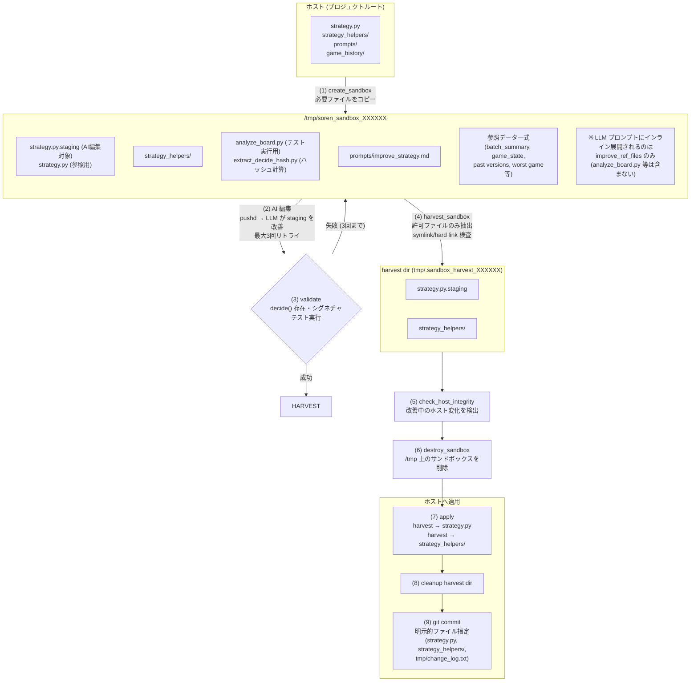

# Soren Game AI

Soviet/Soren パズルゲーム（ソ連共和国）の AI 自動プレイプロジェクト。

同typeのピース2個が接触すると併合進歩する (`type_N + type_N → type_{N+1}`)。
プレイヤーはドロップX座標のみ指定可能。デッドライン超えでゲームオーバー。
ロシアピースを二つ併合してソ連を作ることが目標。

## アーキテクチャ

```
soviet_local.mjs          ← ゲーム実行環境 (HTTP server + Playwright + Unity WebGL, stateのみ更新)
    ↕ commands.txt / game_state.json
AI ループ (3種類から選択)
    ├── soren_loop.sh      ← 自己改善ループ (推奨、eloop.sh/eloop_lib.sh/eloop_improve.sh を統括)
    ├── jloop.sh           ← JSON構造データ版ループ
    └── sloop.sh           ← 画像認識版ループ (レガシー)

soren91/                   ← 91人対戦版 (メリケンAI) 自動プレイヤー (スクリーンショットベース)
    ├── main.mjs           ← エントリポイント: ブラウザ制御 + ゲームループ
    ├── strategy.mjs       ← ドロップ位置決定 (AI改変対象)
    ├── improve.mjs        ← AI改善ループ
    └── soren91_control.sh ← 親ループからの起動・停止・改善キック管理
```

## AI ループ

### soren_loop.sh — Self-Improving Strategy Loop (推奨)

Python スクリプト (`strategy.py`) が1試合を自律プレイし、試合終了後に AI がスクリプトを改善する「メタ学習ループ」。

```bash
node soviet_local.mjs &    # ゲーム起動
./soren_loop.sh            # AI ループ開始
```

**アーキテクチャ:**
```
soren_loop.sh (親スクリプト・エントリーポイント、AI書き換え対象外)
  └── 毎試合 source で eloop.sh を読み込み
        ├── strategy_runner.py  → 1試合を自律プレイ
        │     ├── game_state.json を読む
        │     ├── analyze_board.py で盤面解析
        │     ├── strategy.py の decide() でドロップX決定
        │     ├── commands.txt に書き込み
        │     └── game_history/latest.jsonl にターンログ記録
        ├── GAMEOVER 検知 → スコア取得
        ├── バージョン保存 (strategy_versions/vNNN_scoreXXX_strategy.py)
        ├── eloop_improve.sh (バックグラウンド)
        │     ├── サンドボックス内で AI が strategy.py を改善
        │     ├── バリデーション → 失敗時は自動復元
        │     └── git commit
        └── 次の試合へ
```

**主要ファイル:**

| ファイル | 役割 |
|---------|------|
| `soren_loop.sh` | 親スクリプト（エントリーポイント）。メインループ・初期化。AI書き換え対象外 |
| `eloop.sh` | 1試合のゲームプレイ関数。毎試合 source で読み込み、AI書き換え可 |
| `eloop_lib.sh` | 全モジュールを source する shim (~40行) |
| `eloop_improve.sh` | バックグラウンド改善サブプロセス |
| `strategy.py` | AI が改善する決定関数。`decide(game_state, analysis) -> {x, reason}` |
| `strategy_runner.py` | 内側ループ。strategy.py で1試合プレイ + JSONL履歴記録 |
| `analyze_board.py` | 盤面解析。併合判定・着地予測・期待値計算 |
| `prompts/improve_strategy.md` | AI改善用プロンプト |
| `strategy_versions/` | strategy.py のバージョン履歴 |
| `game_history/` | 試合ごとのターンログ (JSONL) |
| `best_score.txt` | ハイスコア記録 |
| `say_enqueue.sh` | macOS `say` のFIFOキュー管理（排他制御・異常終了/途中切断リトライ付き） |
| `google_tts.sh` | Google Cloud TTS wrapper（gcloud認証、開発/テスト用）。`./google_tts.sh "テキスト"`, `--list`, `--demo` |
| `soren91_control.sh` | soren91 (メリケンAI) の起動・停止・改善キック管理 |

**シェルモジュール構成:**

`eloop_lib.sh` が以下のモジュールを source する:

| ディレクトリ | モジュール | 役割 |
|---|---|---|
| `core/` | `config.sh`, `helpers.sh`, `game_state.sh`, `version.sh`, `phyrogenetic.sh` | 定数・ヘルパー・状態管理・バージョン管理 |
| `strategy/` | `ai.sh`, `sandbox.sh`, `regression.sh`, `improve.sh` | AI実行・サンドボックス・回帰検出・改善管理 |
| `broadcast/` | `radio_engine.sh`, `radio_persona.sh`, `radio_themes.sh`, `radio_news.sh`, `radio_factcheck.sh`, `radio_corners.sh`, `radio_state.sh`, `radio_celebration.sh`, `comment.sh`, `comment_worker.sh`, `scheduler.sh` | ラジオ・コメント・スケジューリング |
| `infra/` | `cleanup.sh` | PID停止・クリーンアップ |

**ラジオDJ機能:**

soren_loop にはソ連ラジオDJ機能が組み込まれている。試合終了後に AI がトークを生成し、macOS `say` で読み上げる。

- **トーク本文**: 試合結果・雑談・ソ連ネタを生成 → `say_enqueue.sh` で再生
- **コメント返し**: Twitchチャットのコメントに対する返事を生成 → `say_enqueue.sh --no-preempt` で再生（途中で切られない）
- **say_enqueue.sh**: mkdirロックベースの排他FIFOキュー。従来どおり順次再生しつつ、`say` / `ffmpeg` 異常終了時は自動リトライ
- コメント返しプロセスは `disown` で親プロセスから独立しており、次のゲーム開始時にトーク生成が kill されても再生が中断されない
- `RADIO_SAY_RATE=180` で読み上げ速度を制御（macOS `say -r` に渡される）
- `SAY_AUDIO_DEVICE` を設定すると `say` で生成したAIFFを `ffmpeg -f audiotoolbox` で指定デバイス（例: `BlackHole 2ch`）へ出力
- USB機器（例: GoPro）の抜き差しでCoreAudio再列挙が起きた際の途中切断に備え、再生実時間が想定尺より短すぎる場合は失敗扱いで自動リトライ
- リトライ挙動は `SAY_RETRY_MAX` / `SAY_RETRY_SLEEP_SEC` / `SAY_RETRY_MAX_SLEEP_SEC` で調整可能
- 途中切断判定は `SAY_TRUNCATE_RATIO` / `SAY_TRUNCATE_GRACE_SEC` / `SAY_TRUNCATE_MIN_EXPECTED_SEC` で調整可能
- ニュースコーナーは既読タイトルに加えて話題キー（例: カイロス、iPS など）も保持し、同一トピックの連投を抑制する。未読がない場合やRSS取得失敗時は再読せずスキップする（再読を許可したい場合のみ `NEWS_ALLOW_STALE_CACHE=1`）
- コメントキュー（`tmp/.comment_queue`）が混雑している間もラジオ生成は継続し、再生のみ `tmp/.radio_deferred_queue` に退避してコメント再生の後ろに並べる（コメント消化後に順次再生）
- コメント返しは `twitch_chat.sh fetch` で未読を取得し、生成が成功したときだけ `ack-batch` で処理済み行のみを pending から削除する。生成失敗やサニタイズ失敗時は pending を維持し、同一バッチで再生成をリトライする
- ラジオ原稿は生成後に別AIでファクトチェック兼リライトを行う。必要なら `RADIO_FACT_CHECK_ENABLED=0` で無効化できる
- ファクトチェック出力の書式が崩れても、本文抽出をやり直して極力再生する。最終的に検証出力が使えない場合でも、無音スキップせず元原稿で続行する
- `theme` / `soviet` / `news` はファクトチェック前に Web 由来の資料も取得して検証AIへ渡す。既定では `fetch_radio_grounding.py` が Wikipedia と Google News RSS を引く
- 検証モデルは `RADIO_FACT_CHECK_AGENT` / `RADIO_FACT_CHECK_FALLBACK` / `RADIO_FACT_CHECK_CLAUDE_MODEL` で調整できる
- Web資料取得は `RADIO_WEB_GROUNDING_ENABLED=0` で無効化できる。キャッシュや量は `RADIO_WEB_GROUNDING_TTL_SEC` / `RADIO_WEB_GROUNDING_MAX_SOURCES` で調整できる
- `tmp/.manual_audio_triggers/*.cmd` に `news` / `soviet` / `strategy` / `theme` / `recap` のコマンドファイルを置くと、常駐ループが数秒以内に拾って手動起動する
- 便利スクリプト [`enqueue_audio_trigger.sh`](/Users/azumag/work/sandbox/soren/enqueue_audio_trigger.sh) で `./enqueue_audio_trigger.sh news` のようにキュー投入できる
- メリケンAIを手動固定したいときは [`manual_meriken_mode.sh`](/Users/azumag/work/sandbox/soren/manual_meriken_mode.sh) を使う。`./manual_meriken_mode.sh on` で `soren91` を維持し、`off` で通常運用へ戻す

**ラジオスケジュール:**

12ゲーム1サイクルでスケジューリング (`broadcast/scheduler.sh`)。

サイクルベース（ゲーム番号 % 12）:

| サイクル位置 | コーナー | 備考 |
|---|---|---|
| Game 2 | 雑談テーマ | 1/3でソ連テーマ。時刻コーナー発火時はスキップ |
| Game 5 | ニュース読み上げ | `fetch_and_play_news()` |
| Game 8 | 時事ニュース（jiji） | AI Web検索でトレンド紹介。改善タイミング付近はスキップ |

時刻ベース（±15分ウィンドウ、1日1回のみ）:

| 時刻 | コーナー | 内容 |
|---|---|---|
| 01:00 | rakugo | 深夜の落語創作 |
| 07:00 | breakfast | 世界の朝食 |
| 08:00 | weather | ソ連天気予報 |
| 11:30 | lunch | 世界の昼食 |
| 12:00 | fortune | ソ連占い |
| 13:00 | devil_dict | 悪魔の辞典 |
| 14:00 | soviet_quiz | ソ連クイズ |
| 15:30 | market | 株価・経済 |
| 16:00 | bluegrass | ブルーグラス音楽紹介 |
| 17:00 | dinner | 今日の献立 |
| 17:30 | redefine | 概念の再定義 |
| 18:00 | soviet_lifehack | ソビエト式生活改善 |
| 19:00 | world_dinner | 世界の夕食 |
| 21:00 | deals | お得情報 |
| 21:30 | night_snack | 世界の夜食 |
| 22:00 | survival | サバイバル知識 |

コメントキューがあるとラジオ再生は deferred queue に回し、コメント消化後に再生。

### soren91 — 91人対戦版自動プレイヤー (メリケンAI)

`soren91/` ディレクトリに独立したサブプロジェクト。unityroom の91人対戦版ソ連ゲームをスクリーンショットベースで自動プレイする。

```bash
cd soren91
npm install          # 初回のみ
node main.mjs        # ゲーム起動 → 自動プレイ → 12ゲームごとにAI改善
```

| ファイル | 役割 |
|---------|------|
| `soren91/main.mjs` | エントリポイント: ブラウザ制御 + ゲームループ |
| `soren91/screenshot_analyzer.mjs` | スクリーンショット → 盤面状態 (Sharp) |
| `soren91/strategy.mjs` | ドロップ位置決定 (AI改変対象) |
| `soren91/improve.mjs` | ラウンド後AI改善ループ (claude CLI) |
| `soren91/ranking_comment.mjs` | ランキング画面コメント生成 + 試合中盤面コメント (Claude vision + TTS) |
| `soren91_control.sh` | 親ループ (`soren_loop.sh`) からの起動・停止・改善キック管理 |

親プロジェクトの `soren_loop.sh` から `soren91_control.sh` 経由で連携。`SOREN91_ENABLED=1` (.env) で有効化。詳細は `soren91/CLAUDE.md` を参照。

### jloop.sh — JSON-based State Loop

毎ターン AI (LLM) を呼び出して盤面判断→ドロップを行う。`analyze_board.py` の解析レポートを入力とする。

```bash
node soviet_local.mjs &
bash jloop.sh
```

**ステートマシン:** `WAIT_READY → DECIDE → EXECUTE → WAIT_READY`
- DECIDE: `analyze_board.py` で盤面解析 → AI にプロンプト → `tmp/plan.md` / `tmp/plan.json` 出力
- EXECUTE: plan からドロップ座標抽出 → `commands.txt` 書き込み
- GAME_OVER: AI に振り返り → retry

### sloop.sh — Simple State Loop (レガシー)

画像認識ベース。`OBSERVE → DECIDE → EXECUTE` の3段構成。スクリーンショットから盤面を読み取る。

```bash
node soviet_game.mjs &
bash sloop.sh
```

## セットアップ

### 前提条件

- **ゲームソースコード**: [ソ連パズル（BOOTH）](https://chemicalpudding.booth.pm/items/5222746) から購入・ダウンロード
- **Unity**: 2022.3.62f3 LTS (Unity Hub 経由でインストール)
- **Unity WebGL Build Support**: Unity Hub → Installs → Add Modules → WebGL Build Support
- **Node.js**: v18+ (Playwright 依存)
- **Python**: 3.10+ (`analyze_board.py`, `strategy.py` 用)
- **LLM CLI ツール** (AI ループで使用):
  - [opencode](https://github.com/opencode-ai/opencode) — GLM 系モデルをエージェントとして実行
  - [Claude Code](https://docs.anthropic.com/en/docs/claude-code) (`claude`) — Anthropic Claude を CLI から実行
  - [Gemini CLI](https://github.com/google-gemini/gemini-cli) (`gemini`) — Google Gemini を CLI から実行

### LLM モデル設定

AI ループ (`soren_loop.sh`, `jloop.sh`, `sloop.sh`) は複数の LLM CLI ツールを統一的に呼び分ける `run_cmd()` 関数を持つ。

#### モデル変数

`eloop_lib.sh` / `jloop.sh` の冒頭で使用モデルを設定:

```bash
MODEL_PRIMARY="glm"              # 主要モデル
MODEL_FALLBACK="opencode:glmflash"  # フォールバック
```

`run_ai()` は PRIMARY でまず実行し、期待出力が得られなければ FALLBACK に切り替える。
`eloop_improve.sh` では `RUN_AI_PRIMARY_RETRIES=10` がデフォルトで設定されており、改善フェーズでは PRIMARY を最大10回試行してから FALLBACK に切り替える。

```bash
# 例: PRIMARYの試行回数を上書き
RUN_AI_PRIMARY_RETRIES=5 ./soren_loop.sh
```

#### モデルスペックと CLI マッピング

`run_cmd()` はスペック文字列を解析して対応する CLI を呼び出す:

| スペック | CLI コマンド | 説明 |
|---------|------------|------|
| `glm` | `opencode run --agent="zai"` | GLM-4.7 (zhipu) — **zai エージェント**として設定済み |
| `opencode:glmflash` | `opencode run --agent="glmflash"` | GLM-4-Flash (軽量フォールバック) |
| `opencode:<agent>` | `opencode run --agent="<agent>"` | 任意の opencode エージェント |
| `sonnet` | `claude -p --model=sonnet --permission-mode=acceptEdits` | Claude Sonnet |
| `opus` | `claude -p --model=opus --permission-mode=acceptEdits` | Claude Opus |
| `claude` | `claude -p --model=Haiku --permission-mode=acceptEdits` | Claude Haiku |
| `gemini` | `gemini -p -y -s` | Gemini (デフォルトモデル) |
| `gemini-flash` | `gemini -p -y -s --model=gemini-2.5-flash` | Gemini 2.5 Flash |

#### opencode のエージェント設定

opencode は `.opencode/agents/` ディレクトリにエージェント設定ファイルを配置して使用する。本プロジェクトでは:

- **zai** — GLM-4.7 (zhipu/glm-4.7) を使用するメインエージェント。`MODEL_PRIMARY="glm"` で呼び出される
- **glmflash** — GLM-4-Flash を使用する軽量エージェント。`MODEL_FALLBACK="opencode:glmflash"` で呼び出される

`opencode run --agent="zai"` のように `--agent` フラグでエージェント名を指定すると、対応するモデル設定で LLM が実行される。

#### Claude Code の使い方

Claude Code (`claude`) は `-p` (パイプモード) でプロンプトを渡し、`--permission-mode=acceptEdits` でファイル編集を自動許可する:

```bash
claude -p "$prompt" --model=sonnet --permission-mode=acceptEdits
```

対話的に使う場合は引数なしで `claude` を実行。本プロジェクトの `CLAUDE.md` が自動読み込みされ、プロジェクト固有の指示が適用される。

### 1. ゲームのビルド

本プロジェクトはゲームの Unity ソースコードに **JS Bridge を注入した改造ビルド**を使用する。
JS Bridge (`SorenBridge.cs` + `SorenBridge.jslib`) が Unity と Playwright の間で盤面データとコマンドを双方向通信する。

> **詳細は `sorengame/BUILD_GUIDE.md` を参照。** 以下は概要のみ。

#### ソースコード展開

BOOTH からダウンロードした ZIP を展開。**日本語ファイル名を含むため `ditto` を使用する**（`unzip` は文字化けする）:

```bash
ditto -x -k --sequesterRsrc soren-game.zip /tmp/soren-original/
ditto -x -k --sequesterRsrc soren-game-fixed.zip /tmp/soren-fixed/
```

#### アセット補完

展開済みプロジェクト (`sorengame/_extracted/soren-game-fixed/`) には以下が不足している。**2つの ZIP から補完が必要**:

| 補完元 | コピー対象 | 理由 |
|--------|-----------|------|
| `soren-game.zip` | `Texture/Republic/` (001-016.png + .meta) | Prefab の GUID が元 ZIP のテクスチャを参照 |
| `soren-game.zip` | `Texture/Stage/`, `Texture/Hammer and Sickle/` | UI 背景・槌鎌マーク |
| `soren-game.zip` | `Assets/TextMesh Pro/` | TMP シェーダー（なければテキストがマゼンタ） |
| `soren-game-fixed.zip` | `Texture/` (Background, Circle, Effect, Flag Animation) | テクスチャ補完 |
| `soren-game-fixed.zip` | `Sound/` (BGM, SE) | 音声ファイル（日本語ファイル名） |

#### JS Bridge 注入

本リポジトリの以下のファイルがブリッジ機構:

- `Assets/SORENGAMEFIXED/Script/SorenBridge.cs` — Unity 側: `MainManager.GetBridgeState()` / `ExecuteBridgeCommand()` を 0.1秒ごとに呼び出し
- `Assets/Plugins/WebGL/SorenBridge.jslib` — JS 側: `window.__sorenGameState` / `window.__sorenCommand` を介してブラウザとやり取り
- `Assets/Editor/WebGLBuilder.cs` — ビルド時に `SorenBridge` コンポーネントを Main Manager に自動アタッチ

#### ビルド実行

**macOS NAS 上ではビルド不可**（`._*` リソースフォークファイルが il2cpp エラーを引き起こす）。必ずローカルディスクで作業:

```bash
# ローカルにコピー + AppleDouble 除去
rm -rf /tmp/soren-unity
cp -R sorengame/_extracted/soren-game-fixed/* /tmp/soren-unity/
dot_clean /tmp/soren-unity/

# バッチビルド
WEBGL_BUILD_PATH=/tmp/soren-build \
/Applications/Unity/Hub/Editor/2022.3.62f3/Unity.app/Contents/MacOS/Unity \
  -quit -batchmode -nographics \
  -projectPath /tmp/soren-unity \
  -buildTarget WebGL \
  -executeMethod WebGLBuilder.BuildWebGL \
  -logFile /tmp/unity_build.log

# ビルド結果をデプロイ
cp -R /tmp/soren-build/* sorengame/build/
```

#### トラブルシューティング

| 症状 | 原因 | 解決策 |
|------|------|--------|
| マゼンタの国ピース | `Texture/Republic/` 未配置 | `soren-game.zip` から Republic/ をコピー |
| マゼンタの UI テキスト | `TextMesh Pro/` 未配置 | `soren-game.zip` から `Assets/TextMesh Pro/` をコピー |
| il2cpp コンパイルエラー | NAS 上の `._*` ファイル | ローカルディスクにコピー + `dot_clean` |
| unzip で音声ファイル破損 | 日本語ファイル名の文字化け | `ditto -x -k --sequesterRsrc` を使用 |
| wasm-opt SIGABRT | Library キャッシュ不整合 | `rm -rf /tmp/soren-unity/Library` して再ビルド |

### 2. Node.js 依存インストール

```bash
npm install        # playwright, sharp 等
npx playwright install chromium
```

### 3. 起動

```bash
# ゲーム起動 (ローカルビルド)
node soviet_local.mjs &

# AI ループ開始 (いずれか選択)
./soren_loop.sh    # 自己改善ループ (推奨)
bash jloop.sh      # JSON構造データ版
bash sloop.sh      # 画像認識版 (レガシー)
```

オンライン版 (unityroom.com) を使う場合:
```bash
node soviet_game.mjs &
```

### 4. Twitch Bot 設定（CC表記チャット投稿用）

ニュースコーナーでCCライセンス対象ソース（ウィキニュース、Global Voices）を読み上げた際、CC表記をTwitchチャットに自動投稿する。設定しなくても動作に影響はない（投稿がスキップされるだけ）。

#### トークン取得手順

1. https://dev.twitch.tv/console にログインし「アプリケーションを登録」
   - 名前: 任意（例: `soren-cc-bot`）
   - OAuth リダイレクト URL: `http://localhost`
   - カテゴリ: Chat Bot
2. 登録後、アプリの「Client ID」を控える
3. ブラウザで以下のURLを開く（`CLIENT_ID` を置換）:
   ```
   https://id.twitch.tv/oauth2/authorize?response_type=token&client_id=CLIENT_ID&redirect_uri=http://localhost&scope=chat:edit+chat:read
   ```
4. 「Authorize」をクリック
5. リダイレクト先のアドレスバーから `access_token=` の値をコピー

#### `.env` に設定

```bash
TWITCH_BOT_TOKEN=xxxxxxxxxxxxxxxxxxxxxxxxxxxxxxx
TWITCH_BOT_NICK=azumagdev
TWITCH_CHANNEL=azumagbanjo
```

`TWITCH_BOT_NICK` は、トークンを取得したTwitchアカウント名に合わせること。未設定時は `azumagdev` を既定値として使う。

`soren_loop.sh` 起動時に `.env` が自動で読み込まれる。

#### 動作確認

```bash
source .env && export TWITCH_BOT_TOKEN TWITCH_CHANNEL
./twitch_chat.sh send "テスト投稿"
```

#### CC表記の投稿形式

CCライセンス対象ソースの場合のみ投稿される:
```
記事タイトル | by 著者名 | Global Voices | https://... | (CC BY 3.0)
```

### 5. ステータス表示

AI ループの稼働状況は以下で監視できる。

```bash
./show-status 3      # 軽量ステータス表示 (3秒更新)
./show-status-g 5    # グラフ付きダッシュボード (5秒更新)
```

- `Ctrl+C` で終了
- 互換コマンドとして `./show_status.sh` / `./show_status_g.sh` も引き続き利用可能
- `show-status` は改善中の `tmp/improve_ai.log` から **最新AI実行の出力を複数行**表示する（`AIOutput`）
- 表示調整:
  - `SHOW_STATUS_AI_OUTPUT_LINES` (既定: `6`) — 表示する `AIOutput` 行数
  - `SHOW_STATUS_AI_TAIL_LINES` (既定: `400`) — ログ解析時に末尾から読む行数

## コマンドインターフェース

`commands.txt` に書き込むとゲーム操作が実行される。

```bash
# キャンバス座標でドロップ (x: 410-830, y: 350固定)
echo "620,350" > commands.txt

# ゲームオーバー時にリトライ
echo "retry" > commands.txt

# JSON形式
echo '[{"action":"cmd","value":"FIXUI"}]' > commands.txt
```

### game_state.json

JS Bridge 経由で Unity から読み出した構造データ。

```json
{
  "state": "MOVE",
  "score": 1572,
  "next": {"type": 5, "r": 0.477},
  "nextNext": {"type": 9, "r": 1.068},
  "pieces": [{"id": 2, "type": 8, "x": -2.369, "y": -3.739, "r": 0.846, ...}],
  "shapes": {"8": [[x,y], ...]}
}
```

- `state`: MOVE / DROP / GAMEOVER / STOP
- `type`: 1-16 (共和国番号、1=最小、16=ソ連)
- `pieces`: 全ピースの位置・半径・速度・回転
- `shapes`: ピース種別ごとの凸ポリゴン頂点

## 戦略: 人工化学フレームワーク

### ゲームの本質 — 物理挙動を伴う項書き換え系

このゲームは**空間に埋め込まれた項書き換え系 (Term Rewriting System) としての人工化学**である。

項書き換え系では、記号列（項）に対して書き換え規則を繰り返し適用して計算を進める。本ゲームでは「ピース」が項、「同種併合」が書き換え規則に対応する。通常の項書き換え系との決定的な違いは、**書き換えの発火条件が物理空間上の接触**であること — つまり書き換え規則の適用可能性が空間的配置に依存する。

| 人工化学の構成要素 | ゲームにおける対応 | 項書き換え系との対比 |
|---|---|---|
| 分子種 S | type 1〜16 のピース（極度に異方性を持った粒子） | 項のアルファベット |
| 反応規則 R | `type_N + type_N → type_{N+1}` | 書き換え規則 |
| 反応器 A | 物理エンジン (重力・衝突・回転・爆発) + 箱型容器 | 書き換え戦略 + 空間制約 |
| 反応物供給 | next/nextNext のドロップ | 項の入力 |

標準的な人工化学の三つ組 `(S, R, A)` に加えて、このシステムは以下の特性を持つ:

- **空間的局所性**: 反応（書き換え）は物理的に接触したペアのみで発生。同じ分子種でも空間的に離れていれば反応不可能
- **重力による非対称性**: ピースは下方に蓄積し、上方から供給される。これが反応器の空間構造を支配する
- **爆発衝撃波**: 反応（併合）成功時に force=450, radius=2.0 の衝撃波が発生し、周囲の分子の空間配置を擾乱する。これが連鎖反応（多段書き換え）の主因
- **極度の異方性**: ピースは円ではなく国土形状の凸ポリゴンであり、極度に異方性を持った粒子である。着地後に回転・転がりが発生し、最終位置が予測困難

### プレイヤーの役割 = 反応器管理者

プレイヤーはドロップX座標のみ制御可能。反応規則 R は固定されており変更できない。したがってプレイヤーの役割は**反応器 A の管理** — 反応物の空間配置を制御して反応効率を最大化すること。

これは化学工学における反応器設計問題と同構造:

```
入力: ランダムな分子種が順次供給される (next/nextNext)
制御変数: 供給位置 (ドロップX座標, -3.0〜+3.0)
目的関数: 総反応収量（スコア）の最大化
制約: 容器溢れ (デッドライン超え) で停止
```

### 人工化学から導出される戦略原則

この理論的枠組みから、以下の戦略が自然に導出される:

#### 1. 濃度管理（同type集約）

化学反応速度は反応物の濃度に比例する（質量作用の法則の空間版）。同typeピースが空間的に散在すると「希薄溶液」状態となり、反応（併合）確率が事実上ゼロに低下する。**同typeピースの空間的密度を最大化する**ことが反応効率の基本。

`analyze_board.py` の `calc_reactor_state()` がこれを定量化:
- `reactive_pairs`: 接触圏内の同typeペア数（即時反応可能）
- `near_pairs`: 近接ペア（触媒操作で反応誘導可能）
- `type_count`: 分子種ごとの濃度

#### 2. パイプライン維持（反応経路の接続性）

項書き換え系では `type1 → type2 → ... → type16` という書き換え列が最大得点経路。この経路が成立するには、各段階の反応物（typeN と typeN+1）が空間的に近接している必要がある。パイプラインの「断絶」（隣接typeが空間的に分離）は連鎖反応の停止を意味する。

`analyze_board.py` の `pipeline` がこれを監視:
- `[OK]`: typeN と typeN+1 が距離 3.0 以内
- `[WARN]`: 距離 3.0-5.0（連鎖困難）
- `[BROKEN]`: 距離 5.0 超（経路断絶、即時修復が必要）

#### 3. 触媒操作（間接的反応誘発）

直接接触していなくても、小ピースの投入による物理衝撃（シェイク）や、併合時の爆発衝撃波で間接的に反応を誘発できる。これは化学における触媒の役割に相当する:

- **シェイク触媒**: 小ピース(type1〜4)は比較的重量がある。 盤面ピースの重量バランスに不均衡がおきると、ピースが重みで振動し、攪拌効果があり、接触誘発
- **爆発連鎖**: typeN-1 ペアを typeN の近くに配置 → N-1 併合の衝撃波で typeN ペアも接触 → 多段連鎖
- **壁バウンド**: 壁際併合の射出で新ピースが反対方向に飛び、離れたピースと予期せぬ反応

#### 4. 国側集約（空間的対称性の自発的破れ）

大型ピース (type9+) は半径が大きく移動困難。容器の左右に分散すると二度と合流できない。これは相分離（空間的対称性の自発的破れ）として理解できる: 最初の type9+ が置かれた側（国側）に以後の大型ピースを全て集約することで、高type反応の空間的条件を維持する。

国側集約は本プロジェクトで最も強い実証的根拠を持つ原則であり、49個の確定済み原則の多くが国側管理に関連する。

#### 5. 連鎖設計（多段書き換えの仕込み）

項書き換え系の最大の特徴は**一つの書き換えが次の書き換えの発火条件を満たす**連鎖。ゲームでは `N-1+N-1→N` の生成物が既存の typeN と接触して `N+N→N+1` を誘発する多段連鎖がこれに対応する。

連鎖設計 = typeN-1 ペアを typeN の近くに事前配置しておくこと。爆発衝撃波による空間擾乱が連鎖の確率を高める。

#### 6. 先読み併合（next/nextNext の未来予測）

next が type N の場合、盤面に type N-1 のペアがあればいずれ併合して type N が生まれる。その生成予定地点の近くに今の next(type N) を置くことで、将来の連鎖併合を仕込める。nextNext も同様に考慮することで、2手先までの期待値を最大化する。

### 実装における理論の反映

| 理論的概念 | analyze_board.py での実装 | strategy.py での利用 |
|---|---|---|
| 反応確率 | `MERGE_PROB`: DIRECT=0.90, NEAR=0.50 | 期待値ベースのドロップ位置選択 |
| 連鎖反応期待値 | `calc_chain_potential()` | 併合後のtype+1連鎖確率 |
| 触媒効果 | `calc_shake_ev()` | シェイクによる間接併合期待値 |
| 爆発衝撃波 | `estimate_explosion_displacement()` | 併合後の周囲ピース移動予測 |
| パイプライン健全性 | `calc_reactor_state()` の `pipeline` | 断絶検知→修復優先 |
| 空間的濃度 | `reactive_pairs`, `near_pairs` | 即時反応可能ペアへの触媒投入判断 |

## サンドボックス改善機構

soren_loop の AI 改善フローでは、AI がホストのファイルを直接編集するリスクを排除するため、**サンドボックス隔離**を導入している。

### フロー概要



### 各フェーズの詳細

#### (1) create_sandbox — 隔離環境の構築

`eloop_lib.sh` の `create_sandbox()` が `/tmp/soren_sandbox_XXXXXX` にファイルをコピーする。

- **許可リスト方式**: 呼び出し側が渡したファイルのみコピー
- **symlink 除外**: シンボリックリンクはスキップ (`[ -L "$src" ] && continue`)
- **パストラバーサル防御**: `../` を含むパスは拒否
- **fallback**: `rsync -a --no-links` 優先、失敗時は `cp -RL`（symlink 展開コピー）
- `strategy.py` を `strategy.py.staging` として複製し、AI はこの staging ファイルのみ編集する
- `analyze_board.py` と `extract_decide_hash.py` もコピー（バリデーション・ハッシュ計算用。LLM プロンプトにはインライン展開されない）

#### (2) AI 編集 — sandbox 内で LLM を実行

`eloop_improve.sh` が `pushd "$SANDBOX_DIR"` でサンドボックスに移動してから `run_ai` を呼び出す。AI のカレントディレクトリは `/tmp` 配下なので、ホストのファイルに直接アクセスできない。

- 最大3回リトライ（バリデーション失敗時は staging をリセットして再試行）
- リトライ時には前回のエラーメッセージをプロンプトに含めて修正を促す

#### (3) validate — staging ファイルの検証

`validate_strategy_with_helpers()` がサンドボックス内で検証:

- `decide(game_state, analysis)` 関数の存在とシグネチャ
- Python テスト実行 — `strategy.py.staging` を `game_state.json` + `analyze_board.py` で実行し、実データでの動作を確認
- `strategy_helpers/` 内の symlink 検査
- `__init__.py` の存在確認
- `extract_decide_hash.py` によるハッシュベースの反復防止（過去にリジェクトされた戦略と同一なら拒否）

#### (4) harvest_sandbox — 許可ファイルのみ抽出

`harvest_sandbox()` がサンドボックスから**決められたファイルのみ**を別ディレクトリに取り出す。

- **取得対象**: `strategy.py.staging` と `strategy_helpers/` のみ（AI が他のファイルを生成しても無視される）
- **harvest 先**: `tmp/.sandbox_harvest_XXXXXX`（ホスト側の tmp/）
- **symlink 検査**: `find -type l` で混入を検出 → 発見時は harvest 全体を破棄
- **hard link 検査**: `find -type f -links +1` で検出 → 発見時は harvest 全体を破棄
- **パス検証**: harvest ディレクトリがプロジェクト内 `tmp/` 配下であることを確認

#### (5) check_host_integrity — ホスト変化の検出

改善前後の `git status --porcelain` を比較し、AI 改善中にホスト側で予期しない変更がないか検出する。

- 変化検出時は警告ログを出力（commit は続行）
- 並行実行中の `strategy_runner.py` による `game_state.json` 等の変更は正常動作なので、ブロックはしない

#### (6) destroy_sandbox — サンドボックスの破棄

- パス検証: `/tmp/soren_sandbox_*` パターンに一致する場合のみ `rm -rf`
- harvest ディレクトリは別パスなので影響を受けない

#### (7-9) apply, cleanup, git commit

- harvest から `strategy.py` と `strategy_helpers/` をホストにコピー
- harvest ディレクトリを削除
- `git add` は **明示的ファイル指定** (`strategy.py strategy_helpers/ tmp/change_log.txt`) — `git add -A` による無関係ファイルの巻き込みを防止

### 防御層の一覧

| 防御層 | 場所 | 防ぐもの |
|--------|------|----------|
| sandbox 隔離 | create_sandbox | AI がホストファイルを直接変更 |
| symlink 除外 (入力) | create_sandbox | sandbox に symlink が混入 |
| `../` パス拒否 | create_sandbox | パストラバーサルで sandbox 外を参照 |
| `cp -RL` fallback | create/harvest | rsync 失敗時にも symlink を展開 |
| staging ファイル方式 | sandbox 内 | AI が strategy.py 本体を変更 |
| バリデーション | validate_strategy_with_helpers | 構文エラー・シグネチャ不正 |
| ハッシュ反復防止 | eloop_improve.sh | 同じ失敗戦略の繰り返し適用 |
| 許可リスト harvest | harvest_sandbox | AI が作成した予期しないファイルの混入 |
| symlink 検査 (出力) | harvest_sandbox | harvest に symlink が混入 |
| hard link 検査 | harvest_sandbox | harvest に hard link が混入 |
| パス検証 | harvest/destroy | 不正なパスへの操作 |
| ホスト整合性チェック | check_host_integrity | 改善中のホスト変化 |
| 明示的 git add | eloop_improve.sh | 無関係ファイルの commit 混入 |
| コンテキスト分離 | sandbox_ref_files / improve_ref_files | テスト用ファイル (analyze_board.py 等) が LLM プロンプトに混入してトークンを浪費 |

### 設計ノート: sandbox_ref_files と improve_ref_files の分離

sandbox にコピーするファイルリスト (`sandbox_ref_files`) と LLM プロンプトにインライン展開するファイルリスト (`improve_ref_files`) は意図的に分離されている。

- **`sandbox_ref_files`** → `create_sandbox()` でファイルシステムにコピー。`analyze_board.py` (26KB) や `extract_decide_hash.py` など、バリデーション・ハッシュ計算に必要だが LLM に読ませる必要がないファイルを含む
- **`improve_ref_files`** → `build_prompt()` でプロンプトにインライン展開。batch_summary、game_state、過去バージョン等、LLM が改善判断に必要なデータのみ

これにより LLM のコンテキストウィンドウを節約しつつ、sandbox 内のテスト実行環境を完備する。

### 実装ファイル

| ファイル | サンドボックス関連の関数 |
|---------|------------------------|
| `eloop_lib.sh` | `create_sandbox()`, `harvest_sandbox()`, `destroy_sandbox()`, `check_host_integrity()`, `validate_strategy_with_helpers()` |
| `eloop_improve.sh` | サンドボックスフローの呼び出し元（create → AI 編集 → validate → harvest → apply → destroy） |

### 関連文献

- `strategy_versions/best_score*_strategy.py` — ハイスコア時の戦略 (殿堂入り)
