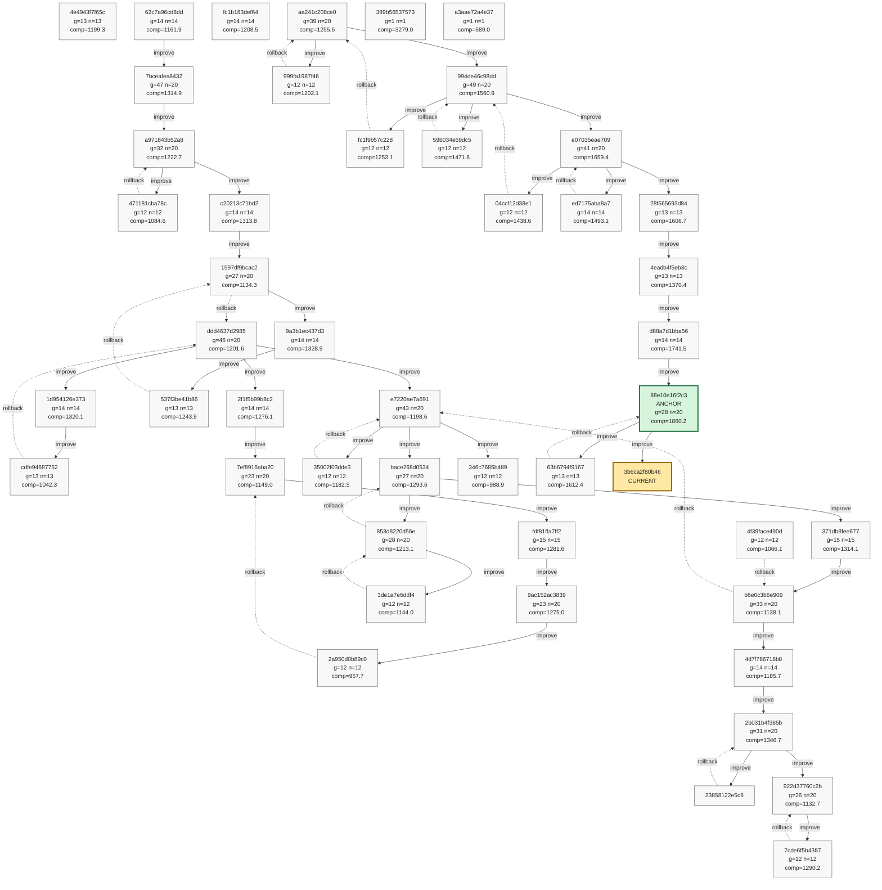

# Strategy Phyrogenetic Tree

- Updated: `2026-03-19 11:36:12 JST`
- Nodes: `608`
- Edges: `853`
- Current: `3b6ca2f80b46`
- Anchor: `88e10e16f2c3`
- Solid edge: mutation/improvement
- Dashed edge: rollback
- Older history is backfilled from `git log -- strategy.py` when local rolling data is incomplete.
- GitHub Mermaid size limit is avoided by splitting the full history into multiple smaller diagrams.

## Overview

- Contains tagged nodes and the latest `60` nodes.

```mermaid
flowchart TD
    h_5c442079edc8["5c442079edc8<br/>g=12 n=12<br/>comp=1226.9"]
    h_b1f764752264["b1f764752264<br/>g=13 n=13<br/>comp=1176.8"]
    h_f4a86d6cf2f4["f4a86d6cf2f4<br/>g=44 n=20<br/>comp=1317.9"]
    h_f45c1115e925["f45c1115e925<br/>g=12 n=12<br/>comp=1200.9"]
    h_0d1cb89482eb["0d1cb89482eb<br/>g=12 n=12<br/>comp=824.0"]
    h_67ca531a9e2c["67ca531a9e2c<br/>g=12 n=12<br/>comp=1050.4"]
    h_597dde8a9032["597dde8a9032<br/>g=12 n=12<br/>comp=1264.3"]
    h_1fab86e56ddc["1fab86e56ddc<br/>g=12 n=12<br/>comp=1402.1"]
    h_7f3bfa93dbef["7f3bfa93dbef<br/>g=43 n=20<br/>comp=1340.7"]
    h_a9b396182ae6["a9b396182ae6<br/>g=22 n=20<br/>comp=1364.1"]
    h_7df607868da2["7df607868da2<br/>g=12 n=12<br/>comp=894.6"]
    h_424c0fa79ba4["424c0fa79ba4<br/>g=12 n=12<br/>comp=964.7"]
    h_4e4943f7f65c["4e4943f7f65c<br/>g=13 n=13<br/>comp=1199.3"]
    h_ddd4637d2985["ddd4637d2985<br/>g=46 n=20<br/>comp=1201.6"]
    h_1d954126e373["1d954126e373<br/>g=14 n=14<br/>comp=1320.1"]
    h_cdfe94687752["cdfe94687752<br/>g=13 n=13<br/>comp=1042.3"]
    h_2f1f5b99b8c2["2f1f5b99b8c2<br/>g=14 n=14<br/>comp=1276.1"]
    h_7ef8916aba20["7ef8916aba20<br/>g=23 n=20<br/>comp=1149.0"]
    h_fdf81ffa7ff2["fdf81ffa7ff2<br/>g=15 n=15<br/>comp=1281.6"]
    h_9ac152ac3839["9ac152ac3839<br/>g=23 n=20<br/>comp=1275.0"]
    h_2a950d0b89c0["2a950d0b89c0<br/>g=12 n=12<br/>comp=957.7"]
    h_62c7a96cd8dd["62c7a96cd8dd<br/>g=14 n=14<br/>comp=1161.9"]
    h_7bceafea8432["7bceafea8432<br/>g=47 n=20<br/>comp=1314.9"]
    h_a971843b52a8["a971843b52a8<br/>g=32 n=20<br/>comp=1222.7"]
    h_471181cba78c["471181cba78c<br/>g=12 n=12<br/>comp=1084.6"]
    h_c20213c71bd2["c20213c71bd2<br/>g=14 n=14<br/>comp=1313.8"]
    h_1597df9bcac2["1597df9bcac2<br/>g=27 n=20<br/>comp=1134.3"]
    h_9a3b1ec437d3["9a3b1ec437d3<br/>g=14 n=14<br/>comp=1328.9"]
    h_537f3be41b86["537f3be41b86<br/>g=13 n=13<br/>comp=1243.9"]
    h_e7220ae7a691["e7220ae7a691<br/>g=43 n=20<br/>comp=1198.6"]
    h_35002f03dde3["35002f03dde3<br/>g=12 n=12<br/>comp=1182.5"]
    h_bace268d0534["bace268d0534<br/>g=27 n=20<br/>comp=1293.6"]
    h_853d8220d56e["853d8220d56e<br/>g=28 n=20<br/>comp=1213.1"]
    h_3de1a7e6ddf4["3de1a7e6ddf4<br/>g=12 n=12<br/>comp=1144.0"]
    h_371db8fee677["371db8fee677<br/>g=15 n=15<br/>comp=1314.1"]
    h_b6e0c3b6e909["b6e0c3b6e909<br/>g=33 n=20<br/>comp=1138.1"]
    h_4d7f786718b8["4d7f786718b8<br/>g=14 n=14<br/>comp=1185.7"]
    h_2b031b4f385b["2b031b4f385b<br/>g=31 n=20<br/>comp=1346.7"]
    h_23858122e5c6["23858122e5c6"]
    h_922d37760c2b["922d37760c2b<br/>g=26 n=20<br/>comp=1132.7"]
    h_7cde6f5b4387["7cde6f5b4387<br/>g=12 n=12<br/>comp=1290.2"]
    h_fc1b183def64["fc1b183def64<br/>g=14 n=14<br/>comp=1208.5"]
    h_4f39face490d["4f39face490d<br/>g=12 n=12<br/>comp=1066.1"]
    h_346c7685b489["346c7685b489<br/>g=12 n=12<br/>comp=988.9"]
    h_aa241c208ce0["aa241c208ce0<br/>g=39 n=20<br/>comp=1255.6"]
    h_999fa1987f46["999fa1987f46<br/>g=12 n=12<br/>comp=1202.1"]
    h_994de46c98dd["994de46c98dd<br/>g=49 n=20<br/>comp=1560.9"]
    h_fc1f9b57c228["fc1f9b57c228<br/>g=12 n=12<br/>comp=1253.1"]
    h_59b034e69dc5["59b034e69dc5<br/>g=12 n=12<br/>comp=1471.6"]
    h_e07035eae709["e07035eae709<br/>g=41 n=20<br/>comp=1659.4"]
    h_04ccf12d38e1["04ccf12d38e1<br/>g=12 n=12<br/>comp=1438.6"]
    h_ed7175aba8a7["ed7175aba8a7<br/>g=14 n=14<br/>comp=1493.1"]
    h_28f565693d84["28f565693d84<br/>g=13 n=13<br/>comp=1606.7"]
    h_4eadb4f5eb3c["4eadb4f5eb3c<br/>g=13 n=13<br/>comp=1370.4"]
    h_d88a7d1bba56["d88a7d1bba56<br/>g=14 n=14<br/>comp=1741.5"]
    h_88e10e16f2c3["88e10e16f2c3<br/>ANCHOR<br/>g=28 n=20<br/>comp=1860.2"]
    h_63b6794f9167["63b6794f9167<br/>g=13 n=13<br/>comp=1612.4"]
    h_389b56537573["389b56537573<br/>g=1 n=1<br/>comp=3279.0"]
    h_a3aae72a4e37["a3aae72a4e37<br/>g=1 n=1<br/>comp=689.0"]
    h_3b6ca2f80b46["3b6ca2f80b46<br/>CURRENT"]

    h_f4a86d6cf2f4 -->|improve| h_f45c1115e925
    h_f45c1115e925 -. rollback .-> h_f4a86d6cf2f4
    h_f4a86d6cf2f4 -->|improve| h_0d1cb89482eb
    h_0d1cb89482eb -. rollback .-> h_f4a86d6cf2f4
    h_f4a86d6cf2f4 -->|improve| h_67ca531a9e2c
    h_7f3bfa93dbef -->|improve| h_a9b396182ae6
    h_a9b396182ae6 -->|improve| h_7df607868da2
    h_7df607868da2 -. rollback .-> h_7f3bfa93dbef
    h_7f3bfa93dbef -->|improve| h_424c0fa79ba4
    h_ddd4637d2985 -->|improve| h_1d954126e373
    h_1d954126e373 -->|improve| h_cdfe94687752
    h_cdfe94687752 -. rollback .-> h_ddd4637d2985
    h_ddd4637d2985 -->|improve| h_2f1f5b99b8c2
    h_2f1f5b99b8c2 -->|improve| h_7ef8916aba20
    h_7ef8916aba20 -->|improve| h_fdf81ffa7ff2
    h_fdf81ffa7ff2 -->|improve| h_9ac152ac3839
    h_9ac152ac3839 -->|improve| h_2a950d0b89c0
    h_2a950d0b89c0 -. rollback .-> h_7ef8916aba20
    h_7ef8916aba20 -. rollback .-> h_7f3bfa93dbef
    h_7f3bfa93dbef -->|improve| h_62c7a96cd8dd
    h_62c7a96cd8dd -->|improve| h_7bceafea8432
    h_7bceafea8432 -->|improve| h_a971843b52a8
    h_a971843b52a8 -->|improve| h_471181cba78c
    h_471181cba78c -. rollback .-> h_a971843b52a8
    h_a971843b52a8 -->|improve| h_c20213c71bd2
    h_c20213c71bd2 -->|improve| h_1597df9bcac2
    h_1597df9bcac2 -->|improve| h_9a3b1ec437d3
    h_9a3b1ec437d3 -->|improve| h_537f3be41b86
    h_537f3be41b86 -. rollback .-> h_1597df9bcac2
    h_1597df9bcac2 -. rollback .-> h_ddd4637d2985
    h_ddd4637d2985 -->|improve| h_e7220ae7a691
    h_e7220ae7a691 -->|improve| h_35002f03dde3
    h_35002f03dde3 -. rollback .-> h_e7220ae7a691
    h_e7220ae7a691 -->|improve| h_bace268d0534
    h_bace268d0534 -->|improve| h_853d8220d56e
    h_853d8220d56e -->|improve| h_3de1a7e6ddf4
    h_3de1a7e6ddf4 -. rollback .-> h_853d8220d56e
    h_853d8220d56e -. rollback .-> h_bace268d0534
    h_bace268d0534 -->|improve| h_371db8fee677
    h_371db8fee677 -->|improve| h_b6e0c3b6e909
    h_b6e0c3b6e909 -->|improve| h_4d7f786718b8
    h_4d7f786718b8 -->|improve| h_2b031b4f385b
    h_2b031b4f385b -->|improve| h_23858122e5c6
    h_23858122e5c6 -. rollback .-> h_2b031b4f385b
    h_2b031b4f385b -->|improve| h_922d37760c2b
    h_922d37760c2b -->|improve| h_7cde6f5b4387
    h_7cde6f5b4387 -. rollback .-> h_922d37760c2b
    h_4f39face490d -. rollback .-> h_b6e0c3b6e909
    h_b6e0c3b6e909 -. rollback .-> h_e7220ae7a691
    h_e7220ae7a691 -->|improve| h_346c7685b489
    h_aa241c208ce0 -->|improve| h_999fa1987f46
    h_999fa1987f46 -. rollback .-> h_aa241c208ce0
    h_aa241c208ce0 -->|improve| h_994de46c98dd
    h_994de46c98dd -->|improve| h_fc1f9b57c228
    h_fc1f9b57c228 -. rollback .-> h_aa241c208ce0
    h_994de46c98dd -->|improve| h_59b034e69dc5
    h_59b034e69dc5 -. rollback .-> h_994de46c98dd
    h_994de46c98dd -->|improve| h_e07035eae709
    h_e07035eae709 -->|improve| h_04ccf12d38e1
    h_04ccf12d38e1 -. rollback .-> h_994de46c98dd
    h_e07035eae709 -->|improve| h_ed7175aba8a7
    h_ed7175aba8a7 -. rollback .-> h_e07035eae709
    h_e07035eae709 -->|improve| h_28f565693d84
    h_28f565693d84 -->|improve| h_4eadb4f5eb3c
    h_4eadb4f5eb3c -->|improve| h_d88a7d1bba56
    h_d88a7d1bba56 -->|improve| h_88e10e16f2c3
    h_88e10e16f2c3 -->|improve| h_63b6794f9167
    h_63b6794f9167 -. rollback .-> h_88e10e16f2c3
    h_88e10e16f2c3 -->|improve| h_3b6ca2f80b46

    classDef plain fill:#f8f8f8,stroke:#666,stroke-width:1px,color:#222;
    classDef current fill:#ffe8a3,stroke:#9a6700,stroke-width:3px,color:#222;
    classDef anchor fill:#d7f5dd,stroke:#1f6f43,stroke-width:3px,color:#222;
    classDef current_anchor fill:#f3e4a8,stroke:#1f6f43,stroke-width:4px,color:#222;

    class h_5c442079edc8 plain;
    class h_b1f764752264 plain;
    class h_f4a86d6cf2f4 plain;
    class h_f45c1115e925 plain;
    class h_0d1cb89482eb plain;
    class h_67ca531a9e2c plain;
    class h_597dde8a9032 plain;
    class h_1fab86e56ddc plain;
    class h_7f3bfa93dbef plain;
    class h_a9b396182ae6 plain;
    class h_7df607868da2 plain;
    class h_424c0fa79ba4 plain;
    class h_4e4943f7f65c plain;
    class h_ddd4637d2985 plain;
    class h_1d954126e373 plain;
    class h_cdfe94687752 plain;
    class h_2f1f5b99b8c2 plain;
    class h_7ef8916aba20 plain;
    class h_fdf81ffa7ff2 plain;
    class h_9ac152ac3839 plain;
    class h_2a950d0b89c0 plain;
    class h_62c7a96cd8dd plain;
    class h_7bceafea8432 plain;
    class h_a971843b52a8 plain;
    class h_471181cba78c plain;
    class h_c20213c71bd2 plain;
    class h_1597df9bcac2 plain;
    class h_9a3b1ec437d3 plain;
    class h_537f3be41b86 plain;
    class h_e7220ae7a691 plain;
    class h_35002f03dde3 plain;
    class h_bace268d0534 plain;
    class h_853d8220d56e plain;
    class h_3de1a7e6ddf4 plain;
    class h_371db8fee677 plain;
    class h_b6e0c3b6e909 plain;
    class h_4d7f786718b8 plain;
    class h_2b031b4f385b plain;
    class h_23858122e5c6 plain;
    class h_922d37760c2b plain;
    class h_7cde6f5b4387 plain;
    class h_fc1b183def64 plain;
    class h_4f39face490d plain;
    class h_346c7685b489 plain;
    class h_aa241c208ce0 plain;
    class h_999fa1987f46 plain;
    class h_994de46c98dd plain;
    class h_fc1f9b57c228 plain;
    class h_59b034e69dc5 plain;
    class h_e07035eae709 plain;
    class h_04ccf12d38e1 plain;
    class h_ed7175aba8a7 plain;
    class h_28f565693d84 plain;
    class h_4eadb4f5eb3c plain;
    class h_d88a7d1bba56 plain;
    class h_88e10e16f2c3 anchor;
    class h_63b6794f9167 plain;
    class h_389b56537573 plain;
    class h_a3aae72a4e37 plain;
    class h_3b6ca2f80b46 current;
```

## Detail 1/8

- Range: `b0936e9e200b` .. `d3f6c63419da`
- Nodes in this diagram: `80`
- Internal edges in this diagram: `83`
- Cross-chunk link: `d3f6c63419da --improve--> 155d2f3c99f8`
- Cross-chunk link: `f95349dcd93f -.rollback.-> f1210d388d1b`
- Cross-chunk link: `f1210d388d1b --improve--> 0b19b373ba4d`
- Cross-chunk link: `b2b45b43facd -.rollback.-> f1210d388d1b`
- Cross-chunk link: `f1210d388d1b --improve--> 96365599213f`
- Cross-chunk link: `03f7524cf920 -.rollback.-> f1210d388d1b`
- Cross-chunk link: `f1210d388d1b -.rollback.-> 03f7524cf920`
- Cross-chunk link: `21ae73918a7d -.rollback.-> f1210d388d1b`
- Cross-chunk link: `f1210d388d1b --improve--> 740922d923ba`
- Cross-chunk link: `b6063324187b -.rollback.-> f1210d388d1b`
- Cross-chunk link: `f1210d388d1b --improve--> 596e96ba354b`
- Cross-chunk link: `596e96ba354b -.rollback.-> f1210d388d1b`
- Cross-chunk link: `... and 5 more`

```mermaid
flowchart TD
    h_b0936e9e200b["b0936e9e200b"]
    h_e4bc59608c67["e4bc59608c67"]
    h_2d1f9a38d00e["2d1f9a38d00e"]
    h_e039059b8d8d["e039059b8d8d"]
    h_fdceff1f6bf5["fdceff1f6bf5"]
    h_c9b196cd1b06["c9b196cd1b06"]
    h_6531f513b51c["6531f513b51c"]
    h_dd76e5e22525["dd76e5e22525"]
    h_3c486868eba8["3c486868eba8"]
    h_f9472aa40675["f9472aa40675"]
    h_57e912814720["57e912814720"]
    h_0f400e55dcef["0f400e55dcef"]
    h_09433570a203["09433570a203"]
    h_de37f45f9fb8["de37f45f9fb8"]
    h_94c92247fae3["94c92247fae3"]
    h_95f998a02a93["95f998a02a93"]
    h_dbc40f74967b["dbc40f74967b"]
    h_0b3a6ab12dbe["0b3a6ab12dbe"]
    h_39546d1ae02a["39546d1ae02a"]
    h_c1848320ea63["c1848320ea63"]
    h_a7c3e3f29132["a7c3e3f29132"]
    h_f0b02b8d5913["f0b02b8d5913"]
    h_7976770d022a["7976770d022a"]
    h_aaa2fbd9c4f0["aaa2fbd9c4f0"]
    h_e2f2ddedd462["e2f2ddedd462"]
    h_799f09359e5e["799f09359e5e"]
    h_44b5d8fdecaa["44b5d8fdecaa"]
    h_31b6dddd1967["31b6dddd1967"]
    h_57ebcaf98924["57ebcaf98924"]
    h_ad1cef65257e["ad1cef65257e"]
    h_20d803959cf9["20d803959cf9"]
    h_873e46ebaa6c["873e46ebaa6c"]
    h_70d2e37e16af["70d2e37e16af"]
    h_f1ce25c980ed["f1ce25c980ed"]
    h_97fed1385efb["97fed1385efb"]
    h_dda27d8bf077["dda27d8bf077"]
    h_84d8f61180c4["84d8f61180c4"]
    h_7b8e05157fe0["7b8e05157fe0"]
    h_102c5c2a0dde["102c5c2a0dde"]
    h_898f42a7166a["898f42a7166a"]
    h_f9c83a79bf99["f9c83a79bf99"]
    h_13749b02e9be["13749b02e9be"]
    h_ab769ecc78fa["ab769ecc78fa"]
    h_dfc6a1058b5d["dfc6a1058b5d"]
    h_3cce155c16ca["3cce155c16ca"]
    h_dcbff9abb0a5["dcbff9abb0a5"]
    h_45e6c92f7948["45e6c92f7948"]
    h_0b9c35838965["0b9c35838965"]
    h_3da291dbd1d1["3da291dbd1d1"]
    h_90eac5f01c92["90eac5f01c92"]
    h_f1210d388d1b["f1210d388d1b<br/>g=13 n=13<br/>comp=931.0"]
    h_bf4a9f45d1d4["bf4a9f45d1d4"]
    h_f040df248b1a["f040df248b1a"]
    h_e3aff4b458c5["e3aff4b458c5"]
    h_db325ac46be1["db325ac46be1"]
    h_096caa6e60e5["096caa6e60e5"]
    h_b9ced5d01685["b9ced5d01685"]
    h_05288cd67986["05288cd67986"]
    h_712ab51231b6["712ab51231b6"]
    h_314f8f06e79a["314f8f06e79a"]
    h_d8e15a466aac["d8e15a466aac"]
    h_5ad20b7a3c69["5ad20b7a3c69"]
    h_ec17cfa3fd50["ec17cfa3fd50"]
    h_7c8bf7070075["7c8bf7070075"]
    h_3eb7c63147ce["3eb7c63147ce"]
    h_e4ae11cd8ad1["e4ae11cd8ad1"]
    h_b1f788954e68["b1f788954e68"]
    h_540082274e98["540082274e98"]
    h_4de801d63903["4de801d63903"]
    h_6b61b12b54a0["6b61b12b54a0"]
    h_8f31d1847d3f["8f31d1847d3f"]
    h_517ecf455d49["517ecf455d49"]
    h_4f9ac51a30d1["4f9ac51a30d1"]
    h_de12063f125e["de12063f125e"]
    h_f7e26af5507d["f7e26af5507d"]
    h_c9d42d442d7e["c9d42d442d7e"]
    h_7d7672c4e6fa["7d7672c4e6fa"]
    h_6dfb2ead5f94["6dfb2ead5f94"]
    h_66d961be6f61["66d961be6f61"]
    h_d3f6c63419da["d3f6c63419da"]

    h_b0936e9e200b -->|improve| h_e4bc59608c67
    h_e4bc59608c67 -->|improve| h_2d1f9a38d00e
    h_2d1f9a38d00e -->|improve| h_e039059b8d8d
    h_e039059b8d8d -->|improve| h_fdceff1f6bf5
    h_fdceff1f6bf5 -->|improve| h_c9b196cd1b06
    h_c9b196cd1b06 -->|improve| h_6531f513b51c
    h_6531f513b51c -->|improve| h_dd76e5e22525
    h_dd76e5e22525 -->|improve| h_3c486868eba8
    h_3c486868eba8 -->|improve| h_f9472aa40675
    h_f9472aa40675 -->|improve| h_57e912814720
    h_57e912814720 -->|improve| h_0f400e55dcef
    h_0f400e55dcef -->|improve| h_09433570a203
    h_09433570a203 -->|improve| h_de37f45f9fb8
    h_de37f45f9fb8 -->|improve| h_94c92247fae3
    h_94c92247fae3 -->|improve| h_95f998a02a93
    h_95f998a02a93 -->|improve| h_dbc40f74967b
    h_dbc40f74967b -->|improve| h_0b3a6ab12dbe
    h_0b3a6ab12dbe -->|improve| h_39546d1ae02a
    h_39546d1ae02a -->|improve| h_c1848320ea63
    h_c1848320ea63 -->|improve| h_a7c3e3f29132
    h_a7c3e3f29132 -->|improve| h_f0b02b8d5913
    h_f0b02b8d5913 -->|improve| h_7976770d022a
    h_7976770d022a -. rollback .-> h_f0b02b8d5913
    h_f0b02b8d5913 -->|improve| h_aaa2fbd9c4f0
    h_aaa2fbd9c4f0 -->|improve| h_e2f2ddedd462
    h_e2f2ddedd462 -->|improve| h_799f09359e5e
    h_799f09359e5e -->|improve| h_44b5d8fdecaa
    h_44b5d8fdecaa -->|improve| h_31b6dddd1967
    h_31b6dddd1967 -->|improve| h_57ebcaf98924
    h_57ebcaf98924 -->|improve| h_ad1cef65257e
    h_ad1cef65257e -->|improve| h_20d803959cf9
    h_20d803959cf9 -->|improve| h_873e46ebaa6c
    h_873e46ebaa6c -->|improve| h_70d2e37e16af
    h_70d2e37e16af -->|improve| h_f1ce25c980ed
    h_f1ce25c980ed -->|improve| h_97fed1385efb
    h_97fed1385efb -->|improve| h_dda27d8bf077
    h_dda27d8bf077 -->|improve| h_84d8f61180c4
    h_84d8f61180c4 -->|improve| h_7b8e05157fe0
    h_7b8e05157fe0 -->|improve| h_102c5c2a0dde
    h_102c5c2a0dde -->|improve| h_898f42a7166a
    h_898f42a7166a -->|improve| h_f9c83a79bf99
    h_f9c83a79bf99 -->|improve| h_13749b02e9be
    h_13749b02e9be -->|improve| h_ab769ecc78fa
    h_ab769ecc78fa -->|improve| h_dfc6a1058b5d
    h_dfc6a1058b5d -->|improve| h_3cce155c16ca
    h_3cce155c16ca -->|improve| h_dcbff9abb0a5
    h_dcbff9abb0a5 -->|improve| h_45e6c92f7948
    h_45e6c92f7948 -->|improve| h_0b9c35838965
    h_0b9c35838965 -->|improve| h_3da291dbd1d1
    h_3da291dbd1d1 -->|improve| h_90eac5f01c92
    h_90eac5f01c92 -->|improve| h_f1210d388d1b
    h_f1210d388d1b -->|improve| h_bf4a9f45d1d4
    h_bf4a9f45d1d4 -->|improve| h_f040df248b1a
    h_f040df248b1a -->|improve| h_e3aff4b458c5
    h_e3aff4b458c5 -->|improve| h_db325ac46be1
    h_db325ac46be1 -->|improve| h_096caa6e60e5
    h_096caa6e60e5 -->|improve| h_b9ced5d01685
    h_b9ced5d01685 -->|improve| h_05288cd67986
    h_05288cd67986 -->|improve| h_712ab51231b6
    h_712ab51231b6 -->|improve| h_314f8f06e79a
    h_314f8f06e79a -->|improve| h_d8e15a466aac
    h_d8e15a466aac -->|improve| h_5ad20b7a3c69
    h_5ad20b7a3c69 -->|improve| h_ec17cfa3fd50
    h_ec17cfa3fd50 -->|improve| h_7c8bf7070075
    h_7c8bf7070075 -->|improve| h_3eb7c63147ce
    h_3eb7c63147ce -->|improve| h_e4ae11cd8ad1
    h_e4ae11cd8ad1 -. rollback .-> h_f1210d388d1b
    h_f1210d388d1b -->|improve| h_b1f788954e68
    h_b1f788954e68 -->|improve| h_540082274e98
    h_540082274e98 -->|improve| h_4de801d63903
    h_4de801d63903 -->|improve| h_6b61b12b54a0
    h_6b61b12b54a0 -. rollback .-> h_f1210d388d1b
    h_f1210d388d1b -->|improve| h_8f31d1847d3f
    h_8f31d1847d3f -. rollback .-> h_3cce155c16ca
    h_3cce155c16ca -->|improve| h_517ecf455d49
    h_517ecf455d49 -->|improve| h_4f9ac51a30d1
    h_4f9ac51a30d1 -->|improve| h_de12063f125e
    h_de12063f125e -->|improve| h_f7e26af5507d
    h_f7e26af5507d -->|improve| h_c9d42d442d7e
    h_c9d42d442d7e -->|improve| h_7d7672c4e6fa
    h_7d7672c4e6fa -->|improve| h_6dfb2ead5f94
    h_6dfb2ead5f94 -->|improve| h_66d961be6f61
    h_66d961be6f61 -->|improve| h_d3f6c63419da

    classDef plain fill:#f8f8f8,stroke:#666,stroke-width:1px,color:#222;
    classDef current fill:#ffe8a3,stroke:#9a6700,stroke-width:3px,color:#222;
    classDef anchor fill:#d7f5dd,stroke:#1f6f43,stroke-width:3px,color:#222;
    classDef current_anchor fill:#f3e4a8,stroke:#1f6f43,stroke-width:4px,color:#222;

    class h_b0936e9e200b plain;
    class h_e4bc59608c67 plain;
    class h_2d1f9a38d00e plain;
    class h_e039059b8d8d plain;
    class h_fdceff1f6bf5 plain;
    class h_c9b196cd1b06 plain;
    class h_6531f513b51c plain;
    class h_dd76e5e22525 plain;
    class h_3c486868eba8 plain;
    class h_f9472aa40675 plain;
    class h_57e912814720 plain;
    class h_0f400e55dcef plain;
    class h_09433570a203 plain;
    class h_de37f45f9fb8 plain;
    class h_94c92247fae3 plain;
    class h_95f998a02a93 plain;
    class h_dbc40f74967b plain;
    class h_0b3a6ab12dbe plain;
    class h_39546d1ae02a plain;
    class h_c1848320ea63 plain;
    class h_a7c3e3f29132 plain;
    class h_f0b02b8d5913 plain;
    class h_7976770d022a plain;
    class h_aaa2fbd9c4f0 plain;
    class h_e2f2ddedd462 plain;
    class h_799f09359e5e plain;
    class h_44b5d8fdecaa plain;
    class h_31b6dddd1967 plain;
    class h_57ebcaf98924 plain;
    class h_ad1cef65257e plain;
    class h_20d803959cf9 plain;
    class h_873e46ebaa6c plain;
    class h_70d2e37e16af plain;
    class h_f1ce25c980ed plain;
    class h_97fed1385efb plain;
    class h_dda27d8bf077 plain;
    class h_84d8f61180c4 plain;
    class h_7b8e05157fe0 plain;
    class h_102c5c2a0dde plain;
    class h_898f42a7166a plain;
    class h_f9c83a79bf99 plain;
    class h_13749b02e9be plain;
    class h_ab769ecc78fa plain;
    class h_dfc6a1058b5d plain;
    class h_3cce155c16ca plain;
    class h_dcbff9abb0a5 plain;
    class h_45e6c92f7948 plain;
    class h_0b9c35838965 plain;
    class h_3da291dbd1d1 plain;
    class h_90eac5f01c92 plain;
    class h_f1210d388d1b plain;
    class h_bf4a9f45d1d4 plain;
    class h_f040df248b1a plain;
    class h_e3aff4b458c5 plain;
    class h_db325ac46be1 plain;
    class h_096caa6e60e5 plain;
    class h_b9ced5d01685 plain;
    class h_05288cd67986 plain;
    class h_712ab51231b6 plain;
    class h_314f8f06e79a plain;
    class h_d8e15a466aac plain;
    class h_5ad20b7a3c69 plain;
    class h_ec17cfa3fd50 plain;
    class h_7c8bf7070075 plain;
    class h_3eb7c63147ce plain;
    class h_e4ae11cd8ad1 plain;
    class h_b1f788954e68 plain;
    class h_540082274e98 plain;
    class h_4de801d63903 plain;
    class h_6b61b12b54a0 plain;
    class h_8f31d1847d3f plain;
    class h_517ecf455d49 plain;
    class h_4f9ac51a30d1 plain;
    class h_de12063f125e plain;
    class h_f7e26af5507d plain;
    class h_c9d42d442d7e plain;
    class h_7d7672c4e6fa plain;
    class h_6dfb2ead5f94 plain;
    class h_66d961be6f61 plain;
    class h_d3f6c63419da plain;
```

## Detail 2/8

- Range: `155d2f3c99f8` .. `b5cd8a7be86d`
- Nodes in this diagram: `80`
- Internal edges in this diagram: `83`
- Cross-chunk link: `d3f6c63419da --improve--> 155d2f3c99f8`
- Cross-chunk link: `f95349dcd93f -.rollback.-> f1210d388d1b`
- Cross-chunk link: `f1210d388d1b --improve--> 0b19b373ba4d`
- Cross-chunk link: `b2b45b43facd -.rollback.-> f1210d388d1b`
- Cross-chunk link: `f1210d388d1b --improve--> 96365599213f`
- Cross-chunk link: `03f7524cf920 -.rollback.-> f1210d388d1b`
- Cross-chunk link: `f1210d388d1b -.rollback.-> 03f7524cf920`
- Cross-chunk link: `21ae73918a7d -.rollback.-> f1210d388d1b`
- Cross-chunk link: `f1210d388d1b --improve--> 740922d923ba`
- Cross-chunk link: `b6063324187b -.rollback.-> f1210d388d1b`
- Cross-chunk link: `f1210d388d1b --improve--> 596e96ba354b`
- Cross-chunk link: `596e96ba354b -.rollback.-> f1210d388d1b`
- Cross-chunk link: `... and 26 more`

```mermaid
flowchart TD
    h_155d2f3c99f8["155d2f3c99f8"]
    h_76750ce3bc91["76750ce3bc91"]
    h_af049000deba["af049000deba"]
    h_6e43379039b7["6e43379039b7"]
    h_137b80b86ae0["137b80b86ae0"]
    h_d2a4001a5cb5["d2a4001a5cb5"]
    h_b4b1fad0af72["b4b1fad0af72"]
    h_96b9174334c3["96b9174334c3"]
    h_1a4875df7f84["1a4875df7f84"]
    h_ac14e5420133["ac14e5420133"]
    h_f95349dcd93f["f95349dcd93f"]
    h_0b19b373ba4d["0b19b373ba4d"]
    h_4206dffdc6a9["4206dffdc6a9"]
    h_ff6414af1d82["ff6414af1d82"]
    h_cd4c8a75ed6f["cd4c8a75ed6f"]
    h_d3f31ef77a32["d3f31ef77a32"]
    h_88fbdca1db21["88fbdca1db21"]
    h_dd74c894ff2c["dd74c894ff2c"]
    h_1d21660f933d["1d21660f933d"]
    h_db97bede877a["db97bede877a"]
    h_91aa7df9c822["91aa7df9c822"]
    h_a6a7ca2b3767["a6a7ca2b3767"]
    h_8ec1c75f54b0["8ec1c75f54b0"]
    h_2758f552da0c["2758f552da0c"]
    h_69b91a20c5a5["69b91a20c5a5"]
    h_b09cfc52736b["b09cfc52736b"]
    h_3d0912ffe7e8["3d0912ffe7e8"]
    h_29699f85e206["29699f85e206"]
    h_d20f0d105236["d20f0d105236"]
    h_b2b45b43facd["b2b45b43facd"]
    h_96365599213f["96365599213f"]
    h_9719f1fe4df0["9719f1fe4df0"]
    h_1355172e74bc["1355172e74bc"]
    h_b76cafcff26a["b76cafcff26a"]
    h_63497d665228["63497d665228"]
    h_1c981acaa1bb["1c981acaa1bb"]
    h_e95c5e5ca60b["e95c5e5ca60b"]
    h_3b4cfec753d6["3b4cfec753d6"]
    h_b525d59f10a3["b525d59f10a3"]
    h_7dfba30e72dc["7dfba30e72dc"]
    h_03f7524cf920["03f7524cf920<br/>g=18 n=18<br/>comp=897.5"]
    h_1a960aadeb8b["1a960aadeb8b"]
    h_1d2ab254c766["1d2ab254c766"]
    h_9f78d1ae4860["9f78d1ae4860"]
    h_efd6456c1390["efd6456c1390"]
    h_548cbf464126["548cbf464126"]
    h_1e8c3113cb4a["1e8c3113cb4a"]
    h_21ae73918a7d["21ae73918a7d"]
    h_740922d923ba["740922d923ba"]
    h_be0e735d8f11["be0e735d8f11"]
    h_6d44a3d2a50f["6d44a3d2a50f"]
    h_d6f554d054d7["d6f554d054d7"]
    h_bfe2f811651c["bfe2f811651c"]
    h_62be6dfb62c1["62be6dfb62c1"]
    h_0254d566dd46["0254d566dd46"]
    h_720e4a7cf279["720e4a7cf279"]
    h_b9da441828e4["b9da441828e4"]
    h_658826b27199["658826b27199"]
    h_d0b41afada2f["d0b41afada2f"]
    h_2e23c3d9329f["2e23c3d9329f"]
    h_a92ea3595895["a92ea3595895"]
    h_d906d8ce74ec["d906d8ce74ec"]
    h_cc738c7952e1["cc738c7952e1"]
    h_ef0217fb36b5["ef0217fb36b5"]
    h_b6063324187b["b6063324187b"]
    h_596e96ba354b["596e96ba354b"]
    h_2d98ed37337d["2d98ed37337d"]
    h_f3da681bc8ed["f3da681bc8ed"]
    h_a88f4a3fd7aa["a88f4a3fd7aa"]
    h_a131b78a5192["a131b78a5192"]
    h_71b35a2913a4["71b35a2913a4"]
    h_229ab640574a["229ab640574a"]
    h_9f137e10711f["9f137e10711f"]
    h_811226ca0556["811226ca0556"]
    h_e24195f7a194["e24195f7a194"]
    h_4eba9dba67d0["4eba9dba67d0"]
    h_2da4858b2c01["2da4858b2c01"]
    h_2512ecc005e1["2512ecc005e1"]
    h_a755765d5b7b["a755765d5b7b"]
    h_b5cd8a7be86d["b5cd8a7be86d"]

    h_155d2f3c99f8 -->|improve| h_76750ce3bc91
    h_76750ce3bc91 -->|improve| h_af049000deba
    h_af049000deba -->|improve| h_6e43379039b7
    h_6e43379039b7 -->|improve| h_137b80b86ae0
    h_137b80b86ae0 -->|improve| h_d2a4001a5cb5
    h_d2a4001a5cb5 -->|improve| h_b4b1fad0af72
    h_b4b1fad0af72 -->|improve| h_96b9174334c3
    h_96b9174334c3 -->|improve| h_1a4875df7f84
    h_1a4875df7f84 -->|improve| h_ac14e5420133
    h_ac14e5420133 -->|improve| h_f95349dcd93f
    h_0b19b373ba4d -->|improve| h_4206dffdc6a9
    h_4206dffdc6a9 -->|improve| h_ff6414af1d82
    h_ff6414af1d82 -->|improve| h_cd4c8a75ed6f
    h_cd4c8a75ed6f -->|improve| h_d3f31ef77a32
    h_d3f31ef77a32 -->|improve| h_88fbdca1db21
    h_88fbdca1db21 -->|improve| h_dd74c894ff2c
    h_dd74c894ff2c -->|improve| h_1d21660f933d
    h_1d21660f933d -->|improve| h_db97bede877a
    h_db97bede877a -->|improve| h_91aa7df9c822
    h_91aa7df9c822 -->|improve| h_a6a7ca2b3767
    h_a6a7ca2b3767 -->|improve| h_8ec1c75f54b0
    h_8ec1c75f54b0 -. rollback .-> h_a6a7ca2b3767
    h_a6a7ca2b3767 -->|improve| h_2758f552da0c
    h_2758f552da0c -->|improve| h_69b91a20c5a5
    h_69b91a20c5a5 -->|improve| h_b09cfc52736b
    h_b09cfc52736b -->|improve| h_3d0912ffe7e8
    h_3d0912ffe7e8 -->|improve| h_29699f85e206
    h_29699f85e206 -->|improve| h_d20f0d105236
    h_d20f0d105236 -->|improve| h_b2b45b43facd
    h_96365599213f -->|improve| h_9719f1fe4df0
    h_9719f1fe4df0 -->|improve| h_1355172e74bc
    h_1355172e74bc -->|improve| h_b76cafcff26a
    h_b76cafcff26a -->|improve| h_63497d665228
    h_63497d665228 -->|improve| h_1c981acaa1bb
    h_1c981acaa1bb -->|improve| h_e95c5e5ca60b
    h_e95c5e5ca60b -->|improve| h_3b4cfec753d6
    h_3b4cfec753d6 -->|improve| h_b525d59f10a3
    h_b525d59f10a3 -->|improve| h_7dfba30e72dc
    h_7dfba30e72dc -->|improve| h_03f7524cf920
    h_03f7524cf920 -->|improve| h_1a960aadeb8b
    h_1a960aadeb8b -. rollback .-> h_03f7524cf920
    h_03f7524cf920 -->|improve| h_1d2ab254c766
    h_1d2ab254c766 -->|improve| h_9f78d1ae4860
    h_9f78d1ae4860 -->|improve| h_efd6456c1390
    h_efd6456c1390 -->|improve| h_548cbf464126
    h_548cbf464126 -->|improve| h_1e8c3113cb4a
    h_1e8c3113cb4a -->|improve| h_21ae73918a7d
    h_740922d923ba -->|improve| h_be0e735d8f11
    h_be0e735d8f11 -->|improve| h_6d44a3d2a50f
    h_6d44a3d2a50f -->|improve| h_d6f554d054d7
    h_d6f554d054d7 -->|improve| h_bfe2f811651c
    h_bfe2f811651c -->|improve| h_62be6dfb62c1
    h_62be6dfb62c1 -. rollback .-> h_03f7524cf920
    h_03f7524cf920 -->|improve| h_0254d566dd46
    h_0254d566dd46 -->|improve| h_720e4a7cf279
    h_720e4a7cf279 -->|improve| h_b9da441828e4
    h_b9da441828e4 -. rollback .-> h_03f7524cf920
    h_03f7524cf920 -->|improve| h_658826b27199
    h_658826b27199 -. rollback .-> h_03f7524cf920
    h_03f7524cf920 -->|improve| h_d0b41afada2f
    h_d0b41afada2f -->|improve| h_2e23c3d9329f
    h_2e23c3d9329f -. rollback .-> h_03f7524cf920
    h_03f7524cf920 -->|improve| h_a92ea3595895
    h_a92ea3595895 -->|improve| h_d906d8ce74ec
    h_d906d8ce74ec -->|improve| h_cc738c7952e1
    h_cc738c7952e1 -->|improve| h_ef0217fb36b5
    h_ef0217fb36b5 -. rollback .-> h_03f7524cf920
    h_03f7524cf920 -->|improve| h_b6063324187b
    h_2d98ed37337d -->|improve| h_f3da681bc8ed
    h_f3da681bc8ed -->|improve| h_a88f4a3fd7aa
    h_a88f4a3fd7aa -. rollback .-> h_03f7524cf920
    h_03f7524cf920 -->|improve| h_a131b78a5192
    h_a131b78a5192 -->|improve| h_71b35a2913a4
    h_71b35a2913a4 -->|improve| h_229ab640574a
    h_229ab640574a -->|improve| h_9f137e10711f
    h_9f137e10711f -->|improve| h_811226ca0556
    h_811226ca0556 -->|improve| h_e24195f7a194
    h_e24195f7a194 -. rollback .-> h_03f7524cf920
    h_03f7524cf920 -->|improve| h_4eba9dba67d0
    h_4eba9dba67d0 -->|improve| h_2da4858b2c01
    h_2da4858b2c01 -->|improve| h_2512ecc005e1
    h_2512ecc005e1 -. rollback .-> h_03f7524cf920
    h_a755765d5b7b -->|improve| h_b5cd8a7be86d

    classDef plain fill:#f8f8f8,stroke:#666,stroke-width:1px,color:#222;
    classDef current fill:#ffe8a3,stroke:#9a6700,stroke-width:3px,color:#222;
    classDef anchor fill:#d7f5dd,stroke:#1f6f43,stroke-width:3px,color:#222;
    classDef current_anchor fill:#f3e4a8,stroke:#1f6f43,stroke-width:4px,color:#222;

    class h_155d2f3c99f8 plain;
    class h_76750ce3bc91 plain;
    class h_af049000deba plain;
    class h_6e43379039b7 plain;
    class h_137b80b86ae0 plain;
    class h_d2a4001a5cb5 plain;
    class h_b4b1fad0af72 plain;
    class h_96b9174334c3 plain;
    class h_1a4875df7f84 plain;
    class h_ac14e5420133 plain;
    class h_f95349dcd93f plain;
    class h_0b19b373ba4d plain;
    class h_4206dffdc6a9 plain;
    class h_ff6414af1d82 plain;
    class h_cd4c8a75ed6f plain;
    class h_d3f31ef77a32 plain;
    class h_88fbdca1db21 plain;
    class h_dd74c894ff2c plain;
    class h_1d21660f933d plain;
    class h_db97bede877a plain;
    class h_91aa7df9c822 plain;
    class h_a6a7ca2b3767 plain;
    class h_8ec1c75f54b0 plain;
    class h_2758f552da0c plain;
    class h_69b91a20c5a5 plain;
    class h_b09cfc52736b plain;
    class h_3d0912ffe7e8 plain;
    class h_29699f85e206 plain;
    class h_d20f0d105236 plain;
    class h_b2b45b43facd plain;
    class h_96365599213f plain;
    class h_9719f1fe4df0 plain;
    class h_1355172e74bc plain;
    class h_b76cafcff26a plain;
    class h_63497d665228 plain;
    class h_1c981acaa1bb plain;
    class h_e95c5e5ca60b plain;
    class h_3b4cfec753d6 plain;
    class h_b525d59f10a3 plain;
    class h_7dfba30e72dc plain;
    class h_03f7524cf920 plain;
    class h_1a960aadeb8b plain;
    class h_1d2ab254c766 plain;
    class h_9f78d1ae4860 plain;
    class h_efd6456c1390 plain;
    class h_548cbf464126 plain;
    class h_1e8c3113cb4a plain;
    class h_21ae73918a7d plain;
    class h_740922d923ba plain;
    class h_be0e735d8f11 plain;
    class h_6d44a3d2a50f plain;
    class h_d6f554d054d7 plain;
    class h_bfe2f811651c plain;
    class h_62be6dfb62c1 plain;
    class h_0254d566dd46 plain;
    class h_720e4a7cf279 plain;
    class h_b9da441828e4 plain;
    class h_658826b27199 plain;
    class h_d0b41afada2f plain;
    class h_2e23c3d9329f plain;
    class h_a92ea3595895 plain;
    class h_d906d8ce74ec plain;
    class h_cc738c7952e1 plain;
    class h_ef0217fb36b5 plain;
    class h_b6063324187b plain;
    class h_596e96ba354b plain;
    class h_2d98ed37337d plain;
    class h_f3da681bc8ed plain;
    class h_a88f4a3fd7aa plain;
    class h_a131b78a5192 plain;
    class h_71b35a2913a4 plain;
    class h_229ab640574a plain;
    class h_9f137e10711f plain;
    class h_811226ca0556 plain;
    class h_e24195f7a194 plain;
    class h_4eba9dba67d0 plain;
    class h_2da4858b2c01 plain;
    class h_2512ecc005e1 plain;
    class h_a755765d5b7b plain;
    class h_b5cd8a7be86d plain;
```

## Detail 3/8

- Range: `e3676607049d` .. `e24d1084d5ef`
- Nodes in this diagram: `80`
- Internal edges in this diagram: `77`
- Cross-chunk link: `b5cd8a7be86d --improve--> e3676607049d`
- Cross-chunk link: `e3676607049d -.rollback.-> 03f7524cf920`
- Cross-chunk link: `03f7524cf920 --improve--> c924c81022f5`
- Cross-chunk link: `c6c5812169bf -.rollback.-> 03f7524cf920`
- Cross-chunk link: `03f7524cf920 --improve--> 5ff6de32e6a5`
- Cross-chunk link: `5ff6de32e6a5 -.rollback.-> 03f7524cf920`
- Cross-chunk link: `03f7524cf920 --improve--> f020b7b4c6ec`
- Cross-chunk link: `f020b7b4c6ec -.rollback.-> 03f7524cf920`
- Cross-chunk link: `03f7524cf920 --improve--> 52dec2d240b4`
- Cross-chunk link: `ae6fa6d87a06 -.rollback.-> 03f7524cf920`
- Cross-chunk link: `03f7524cf920 --improve--> f30307f557e2`
- Cross-chunk link: `31709ff6533d -.rollback.-> 03f7524cf920`
- Cross-chunk link: `... and 17 more`

```mermaid
flowchart TD
    h_e3676607049d["e3676607049d"]
    h_c924c81022f5["c924c81022f5"]
    h_0058714043a7["0058714043a7"]
    h_d6cae27ed802["d6cae27ed802"]
    h_8294dea52a70["8294dea52a70"]
    h_c6c5812169bf["c6c5812169bf"]
    h_5ff6de32e6a5["5ff6de32e6a5"]
    h_f020b7b4c6ec["f020b7b4c6ec"]
    h_52dec2d240b4["52dec2d240b4"]
    h_78921e4f842e["78921e4f842e"]
    h_ae6fa6d87a06["ae6fa6d87a06"]
    h_f30307f557e2["f30307f557e2"]
    h_0961bfe98bc8["0961bfe98bc8<br/>g=8 n=8<br/>comp=1032.6"]
    h_59dbe2e99e83["59dbe2e99e83"]
    h_292b8d838624["292b8d838624"]
    h_aab5cfdabaa9["aab5cfdabaa9"]
    h_178c797a7762["178c797a7762"]
    h_ae0e500b9534["ae0e500b9534"]
    h_4ecccd5b3ce0["4ecccd5b3ce0"]
    h_80963a2974aa["80963a2974aa"]
    h_3793ec65f0a8["3793ec65f0a8"]
    h_9555c5d7b8ed["9555c5d7b8ed"]
    h_491005bdda14["491005bdda14"]
    h_dc79266c4642["dc79266c4642"]
    h_83458ea60e45["83458ea60e45"]
    h_6db63b792b4e["6db63b792b4e"]
    h_1d2f0657ca4f["1d2f0657ca4f"]
    h_1d73791b0408["1d73791b0408"]
    h_43bb9dd7218f["43bb9dd7218f"]
    h_30b1059145b2["30b1059145b2"]
    h_736eaa7a621e["736eaa7a621e"]
    h_0d84c249c34a["0d84c249c34a"]
    h_c94941f9c53c["c94941f9c53c"]
    h_e57c64a0b32f["e57c64a0b32f"]
    h_c0c9d9b71bea["c0c9d9b71bea"]
    h_446f8d51b619["446f8d51b619"]
    h_3d43b5c4b339["3d43b5c4b339"]
    h_31709ff6533d["31709ff6533d"]
    h_f0ce05373605["f0ce05373605"]
    h_e199cc8496ef["e199cc8496ef"]
    h_7e7feffb4acf["7e7feffb4acf"]
    h_2146c1000ebe["2146c1000ebe"]
    h_4266bc4d5404["4266bc4d5404"]
    h_521e2a6f7514["521e2a6f7514"]
    h_a530a40a918f["a530a40a918f"]
    h_17a089b8bb9a["17a089b8bb9a"]
    h_9d672f0df0c7["9d672f0df0c7"]
    h_419ab6257d92["419ab6257d92"]
    h_7297204b0bd5["7297204b0bd5"]
    h_59be602676c6["59be602676c6"]
    h_1bd7aa5a5785["1bd7aa5a5785"]
    h_ede5bfcf82d4["ede5bfcf82d4<br/>g=1 n=1<br/>comp=1681.0"]
    h_5a5c38cc0be2["5a5c38cc0be2<br/>g=3 n=3<br/>comp=531.5"]
    h_fd5fa021e976["fd5fa021e976<br/>g=5 n=5<br/>comp=651.2"]
    h_33f610967019["33f610967019<br/>g=5 n=5<br/>comp=928.6"]
    h_7bf31489e393["7bf31489e393<br/>g=6 n=6<br/>comp=1012.4"]
    h_0606e0423a11["0606e0423a11<br/>g=3 n=3<br/>comp=1038.2"]
    h_68ddbe9c93d1["68ddbe9c93d1<br/>g=4 n=4<br/>comp=1418.8"]
    h_ca8bbfc1d73b["ca8bbfc1d73b<br/>g=3 n=3<br/>comp=1623.3"]
    h_80cc6a42986e["80cc6a42986e<br/>g=3 n=3<br/>comp=1124.2"]
    h_575df14d63ab["575df14d63ab"]
    h_3d3038a910f5["3d3038a910f5<br/>g=3 n=3<br/>comp=536.4"]
    h_f7288a3a5270["f7288a3a5270<br/>g=1 n=1<br/>comp=959.0"]
    h_4694cefc0245["4694cefc0245<br/>g=1 n=1<br/>comp=1045.0"]
    h_39e98cdf0a0a["39e98cdf0a0a<br/>g=14 n=14<br/>comp=1097.1"]
    h_e4ed6ecc175e["e4ed6ecc175e<br/>g=1 n=1<br/>comp=1089.0"]
    h_11809cd47dd4["11809cd47dd4<br/>g=5 n=5<br/>comp=1022.9"]
    h_fcd7bf3cb003["fcd7bf3cb003<br/>g=18 n=18<br/>comp=1163.4"]
    h_2431bfe1b371["2431bfe1b371<br/>g=1 n=1<br/>comp=1188.0"]
    h_1b7384c61008["1b7384c61008<br/>g=18 n=18<br/>comp=916.9"]
    h_07e1f0e9538b["07e1f0e9538b<br/>g=15 n=15<br/>comp=957.7"]
    h_893ac47e50d0["893ac47e50d0<br/>g=17 n=17<br/>comp=918.2"]
    h_332dcb70e676["332dcb70e676<br/>g=1 n=1<br/>comp=1446.0"]
    h_97ffedbeb342["97ffedbeb342<br/>g=1 n=1<br/>comp=1136.0"]
    h_d23b57ac1e1f["d23b57ac1e1f<br/>g=17 n=17<br/>comp=1128.3"]
    h_7bd194238b84["7bd194238b84<br/>g=1 n=1<br/>comp=970.0"]
    h_780869025e24["780869025e24<br/>g=2 n=2<br/>comp=609.9"]
    h_c97cee797739["c97cee797739<br/>g=6 n=6<br/>comp=892.2"]
    h_34edcc78882b["34edcc78882b<br/>g=1 n=1<br/>comp=790.0"]
    h_e24d1084d5ef["e24d1084d5ef<br/>g=1 n=1<br/>comp=674.0"]

    h_c924c81022f5 -->|improve| h_0058714043a7
    h_0058714043a7 -->|improve| h_d6cae27ed802
    h_d6cae27ed802 -->|improve| h_8294dea52a70
    h_8294dea52a70 -->|improve| h_c6c5812169bf
    h_52dec2d240b4 -->|improve| h_78921e4f842e
    h_78921e4f842e -->|improve| h_ae6fa6d87a06
    h_f30307f557e2 -->|improve| h_0961bfe98bc8
    h_0961bfe98bc8 -->|improve| h_59dbe2e99e83
    h_59dbe2e99e83 -->|improve| h_292b8d838624
    h_292b8d838624 -->|improve| h_aab5cfdabaa9
    h_aab5cfdabaa9 -->|improve| h_178c797a7762
    h_178c797a7762 -->|improve| h_ae0e500b9534
    h_ae0e500b9534 -->|improve| h_4ecccd5b3ce0
    h_4ecccd5b3ce0 -->|improve| h_80963a2974aa
    h_80963a2974aa -->|improve| h_3793ec65f0a8
    h_3793ec65f0a8 -->|improve| h_9555c5d7b8ed
    h_9555c5d7b8ed -. rollback .-> h_3793ec65f0a8
    h_3793ec65f0a8 -->|improve| h_491005bdda14
    h_491005bdda14 -->|improve| h_dc79266c4642
    h_dc79266c4642 -->|improve| h_83458ea60e45
    h_83458ea60e45 -->|improve| h_6db63b792b4e
    h_6db63b792b4e -. rollback .-> h_dc79266c4642
    h_dc79266c4642 -->|improve| h_1d2f0657ca4f
    h_1d2f0657ca4f -->|improve| h_1d73791b0408
    h_1d73791b0408 -->|improve| h_43bb9dd7218f
    h_43bb9dd7218f -->|improve| h_30b1059145b2
    h_30b1059145b2 -->|improve| h_736eaa7a621e
    h_736eaa7a621e -->|improve| h_0d84c249c34a
    h_0d84c249c34a -->|improve| h_c94941f9c53c
    h_c94941f9c53c -->|improve| h_e57c64a0b32f
    h_e57c64a0b32f -->|improve| h_c0c9d9b71bea
    h_c0c9d9b71bea -->|improve| h_446f8d51b619
    h_446f8d51b619 -->|improve| h_3d43b5c4b339
    h_3d43b5c4b339 -->|improve| h_31709ff6533d
    h_7e7feffb4acf -->|improve| h_2146c1000ebe
    h_2146c1000ebe -->|improve| h_4266bc4d5404
    h_4266bc4d5404 -->|improve| h_521e2a6f7514
    h_521e2a6f7514 -->|improve| h_a530a40a918f
    h_a530a40a918f -->|improve| h_17a089b8bb9a
    h_17a089b8bb9a -->|improve| h_9d672f0df0c7
    h_9d672f0df0c7 -->|improve| h_419ab6257d92
    h_419ab6257d92 -->|improve| h_7297204b0bd5
    h_7297204b0bd5 -->|improve| h_59be602676c6
    h_1bd7aa5a5785 -->|improve| h_ede5bfcf82d4
    h_ede5bfcf82d4 -->|improve| h_5a5c38cc0be2
    h_5a5c38cc0be2 -->|improve| h_fd5fa021e976
    h_fd5fa021e976 -->|improve| h_33f610967019
    h_33f610967019 -->|improve| h_7bf31489e393
    h_0606e0423a11 -->|improve| h_68ddbe9c93d1
    h_68ddbe9c93d1 -->|improve| h_ca8bbfc1d73b
    h_ca8bbfc1d73b -->|improve| h_80cc6a42986e
    h_80cc6a42986e -->|improve| h_575df14d63ab
    h_575df14d63ab -->|improve| h_3d3038a910f5
    h_3d3038a910f5 -->|improve| h_f7288a3a5270
    h_f7288a3a5270 -->|improve| h_4694cefc0245
    h_4694cefc0245 -->|improve| h_39e98cdf0a0a
    h_39e98cdf0a0a -->|improve| h_e4ed6ecc175e
    h_e4ed6ecc175e -->|improve| h_11809cd47dd4
    h_11809cd47dd4 -->|improve| h_fcd7bf3cb003
    h_fcd7bf3cb003 -->|improve| h_2431bfe1b371
    h_2431bfe1b371 -. rollback .-> h_fcd7bf3cb003
    h_fcd7bf3cb003 -->|improve| h_1b7384c61008
    h_1b7384c61008 -->|improve| h_07e1f0e9538b
    h_07e1f0e9538b -. rollback .-> h_1b7384c61008
    h_07e1f0e9538b -->|improve| h_893ac47e50d0
    h_893ac47e50d0 -->|improve| h_332dcb70e676
    h_332dcb70e676 -. rollback .-> h_893ac47e50d0
    h_893ac47e50d0 -->|improve| h_97ffedbeb342
    h_97ffedbeb342 -. rollback .-> h_893ac47e50d0
    h_893ac47e50d0 -->|improve| h_d23b57ac1e1f
    h_d23b57ac1e1f -->|improve| h_7bd194238b84
    h_7bd194238b84 -. rollback .-> h_d23b57ac1e1f
    h_d23b57ac1e1f -->|improve| h_780869025e24
    h_780869025e24 -. rollback .-> h_d23b57ac1e1f
    h_d23b57ac1e1f -->|improve| h_c97cee797739
    h_c97cee797739 -->|improve| h_34edcc78882b
    h_34edcc78882b -->|improve| h_e24d1084d5ef

    classDef plain fill:#f8f8f8,stroke:#666,stroke-width:1px,color:#222;
    classDef current fill:#ffe8a3,stroke:#9a6700,stroke-width:3px,color:#222;
    classDef anchor fill:#d7f5dd,stroke:#1f6f43,stroke-width:3px,color:#222;
    classDef current_anchor fill:#f3e4a8,stroke:#1f6f43,stroke-width:4px,color:#222;

    class h_e3676607049d plain;
    class h_c924c81022f5 plain;
    class h_0058714043a7 plain;
    class h_d6cae27ed802 plain;
    class h_8294dea52a70 plain;
    class h_c6c5812169bf plain;
    class h_5ff6de32e6a5 plain;
    class h_f020b7b4c6ec plain;
    class h_52dec2d240b4 plain;
    class h_78921e4f842e plain;
    class h_ae6fa6d87a06 plain;
    class h_f30307f557e2 plain;
    class h_0961bfe98bc8 plain;
    class h_59dbe2e99e83 plain;
    class h_292b8d838624 plain;
    class h_aab5cfdabaa9 plain;
    class h_178c797a7762 plain;
    class h_ae0e500b9534 plain;
    class h_4ecccd5b3ce0 plain;
    class h_80963a2974aa plain;
    class h_3793ec65f0a8 plain;
    class h_9555c5d7b8ed plain;
    class h_491005bdda14 plain;
    class h_dc79266c4642 plain;
    class h_83458ea60e45 plain;
    class h_6db63b792b4e plain;
    class h_1d2f0657ca4f plain;
    class h_1d73791b0408 plain;
    class h_43bb9dd7218f plain;
    class h_30b1059145b2 plain;
    class h_736eaa7a621e plain;
    class h_0d84c249c34a plain;
    class h_c94941f9c53c plain;
    class h_e57c64a0b32f plain;
    class h_c0c9d9b71bea plain;
    class h_446f8d51b619 plain;
    class h_3d43b5c4b339 plain;
    class h_31709ff6533d plain;
    class h_f0ce05373605 plain;
    class h_e199cc8496ef plain;
    class h_7e7feffb4acf plain;
    class h_2146c1000ebe plain;
    class h_4266bc4d5404 plain;
    class h_521e2a6f7514 plain;
    class h_a530a40a918f plain;
    class h_17a089b8bb9a plain;
    class h_9d672f0df0c7 plain;
    class h_419ab6257d92 plain;
    class h_7297204b0bd5 plain;
    class h_59be602676c6 plain;
    class h_1bd7aa5a5785 plain;
    class h_ede5bfcf82d4 plain;
    class h_5a5c38cc0be2 plain;
    class h_fd5fa021e976 plain;
    class h_33f610967019 plain;
    class h_7bf31489e393 plain;
    class h_0606e0423a11 plain;
    class h_68ddbe9c93d1 plain;
    class h_ca8bbfc1d73b plain;
    class h_80cc6a42986e plain;
    class h_575df14d63ab plain;
    class h_3d3038a910f5 plain;
    class h_f7288a3a5270 plain;
    class h_4694cefc0245 plain;
    class h_39e98cdf0a0a plain;
    class h_e4ed6ecc175e plain;
    class h_11809cd47dd4 plain;
    class h_fcd7bf3cb003 plain;
    class h_2431bfe1b371 plain;
    class h_1b7384c61008 plain;
    class h_07e1f0e9538b plain;
    class h_893ac47e50d0 plain;
    class h_332dcb70e676 plain;
    class h_97ffedbeb342 plain;
    class h_d23b57ac1e1f plain;
    class h_7bd194238b84 plain;
    class h_780869025e24 plain;
    class h_c97cee797739 plain;
    class h_34edcc78882b plain;
    class h_e24d1084d5ef plain;
```

## Detail 4/8

- Range: `7daa4348391b` .. `57de365479a0`
- Nodes in this diagram: `80`
- Internal edges in this diagram: `114`
- Cross-chunk link: `e24d1084d5ef --improve--> 7daa4348391b`
- Cross-chunk link: `f83ca82c4967 -.rollback.-> f1210d388d1b`
- Cross-chunk link: `f1210d388d1b --improve--> 57b1cc3a6290`
- Cross-chunk link: `f83ca82c4967 -.rollback.-> 03f7524cf920`
- Cross-chunk link: `0961bfe98bc8 --improve--> f06cac30a7a8`
- Cross-chunk link: `f06cac30a7a8 -.rollback.-> 0961bfe98bc8`
- Cross-chunk link: `0961bfe98bc8 --improve--> 4faa93ab3781`
- Cross-chunk link: `57de365479a0 --improve--> 1fa254eca81f`
- Cross-chunk link: `1fa254eca81f -.rollback.-> 2c8a1cdc292f`
- Cross-chunk link: `2c8a1cdc292f --improve--> 4f7f77e9c388`
- Cross-chunk link: `4b307f9145f4 -.rollback.-> 570c0acc1f48`
- Cross-chunk link: `2c8a1cdc292f --improve--> 3434e8b1f997`
- Cross-chunk link: `... and 16 more`

```mermaid
flowchart TD
    h_7daa4348391b["7daa4348391b<br/>g=11 n=11<br/>comp=945.6"]
    h_94011b7212f0["94011b7212f0<br/>g=1 n=1<br/>comp=1336.0"]
    h_71a4babcea76["71a4babcea76<br/>g=1 n=1<br/>comp=1688.0"]
    h_edc49a0733b7["edc49a0733b7<br/>g=18 n=18<br/>comp=872.2"]
    h_fefe71d1927b["fefe71d1927b<br/>g=1 n=1<br/>comp=1126.0"]
    h_b0872a2ce8a2["b0872a2ce8a2<br/>g=14 n=14<br/>comp=821.3"]
    h_611bf1316847["611bf1316847<br/>g=1 n=1<br/>comp=773.0"]
    h_7d3218bdb0b4["7d3218bdb0b4<br/>g=1 n=1<br/>comp=968.0"]
    h_c37fbbfe2d61["c37fbbfe2d61<br/>g=7 n=7<br/>comp=1028.3"]
    h_e1a90f467348["e1a90f467348<br/>g=4 n=4<br/>comp=853.6"]
    h_215d20b343f4["215d20b343f4<br/>g=12 n=12<br/>comp=806.5"]
    h_f83ca82c4967["f83ca82c4967<br/>g=12 n=12<br/>comp=839.2"]
    h_57b1cc3a6290["57b1cc3a6290"]
    h_f06cac30a7a8["f06cac30a7a8<br/>g=4 n=4<br/>comp=872.7"]
    h_4faa93ab3781["4faa93ab3781<br/>g=1 n=1<br/>comp=1354.0"]
    h_01853899494d["01853899494d<br/>g=14 n=14<br/>comp=1116.9"]
    h_ddb0e9cd7c87["ddb0e9cd7c87<br/>g=11 n=11<br/>comp=950.6"]
    h_f77a5d0ca40e["f77a5d0ca40e<br/>g=12 n=12<br/>comp=889.0"]
    h_c3f00169bde1["c3f00169bde1<br/>g=20 n=20<br/>comp=863.6"]
    h_ab5803e4d3f9["ab5803e4d3f9<br/>g=12 n=12<br/>comp=834.9"]
    h_ae39c3c17bba["ae39c3c17bba<br/>g=34 n=20<br/>comp=895.9"]
    h_98b6f5b1e1a5["98b6f5b1e1a5<br/>g=9 n=9<br/>comp=942.5"]
    h_6ebffca5cd79["6ebffca5cd79<br/>g=9 n=9<br/>comp=636.1"]
    h_624cb6ba6eef["624cb6ba6eef<br/>g=7 n=7<br/>comp=629.3"]
    h_7184250eac7f["7184250eac7f"]
    h_c85d9d1989c1["c85d9d1989c1<br/>g=2 n=2<br/>comp=1924.8"]
    h_5d17725cfbc9["5d17725cfbc9<br/>g=10 n=10<br/>comp=914.7"]
    h_0ff5d88e1767["0ff5d88e1767<br/>g=11 n=11<br/>comp=843.3"]
    h_305fc060a340["305fc060a340<br/>g=13 n=13<br/>comp=1137.4"]
    h_dc9a73d0e9ac["dc9a73d0e9ac<br/>g=16 n=16<br/>comp=1027.6"]
    h_d0dc1084ea03["d0dc1084ea03<br/>g=1 n=1<br/>comp=1446.0"]
    h_16dc4eca5732["16dc4eca5732<br/>g=13 n=13<br/>comp=967.1"]
    h_df01ab33e232["df01ab33e232<br/>g=26 n=20<br/>comp=894.8"]
    h_489e140c12f6["489e140c12f6<br/>g=1 n=1<br/>comp=831.0"]
    h_0290083baf6e["0290083baf6e<br/>g=9 n=9<br/>comp=892.2"]
    h_1f879565e86a["1f879565e86a<br/>g=42 n=20<br/>comp=992.3"]
    h_3f8bfb887f91["3f8bfb887f91<br/>g=9 n=9<br/>comp=883.0"]
    h_ec1c724d375a["ec1c724d375a<br/>g=11 n=11<br/>comp=866.1"]
    h_bdd661475d6f["bdd661475d6f<br/>g=22 n=20<br/>comp=902.3"]
    h_fa7f167772ca["fa7f167772ca<br/>g=12 n=12<br/>comp=988.2"]
    h_275c44370cc1["275c44370cc1<br/>g=12 n=12<br/>comp=1000.8"]
    h_2444d816d61d["2444d816d61d<br/>g=21 n=20<br/>comp=1025.4"]
    h_94ffb332c4bd["94ffb332c4bd<br/>g=78 n=20<br/>comp=895.0"]
    h_efa83280c5ee["efa83280c5ee<br/>g=24 n=20<br/>comp=1177.9"]
    h_3707c23e28de["3707c23e28de<br/>g=9 n=9<br/>comp=1115.6"]
    h_c4ac35277b92["c4ac35277b92<br/>g=23 n=20<br/>comp=1016.3"]
    h_6c53cb703cb0["6c53cb703cb0<br/>g=10 n=10<br/>comp=821.4"]
    h_49d1d464b70e["49d1d464b70e<br/>g=14 n=14<br/>comp=1077.6"]
    h_77f44dd4c76f["77f44dd4c76f<br/>g=17 n=17<br/>comp=908.3"]
    h_547c25f1085a["547c25f1085a<br/>g=9 n=9<br/>comp=1046.0"]
    h_066eac67e8d1["066eac67e8d1<br/>g=9 n=9<br/>comp=903.8"]
    h_930be7852ee6["930be7852ee6<br/>g=9 n=9<br/>comp=972.7"]
    h_6f01e1ab6f07["6f01e1ab6f07<br/>g=9 n=9<br/>comp=704.9"]
    h_d28a029231d5["d28a029231d5<br/>g=62 n=20<br/>comp=1138.4"]
    h_4f5dc3ecdfa1["4f5dc3ecdfa1<br/>g=13 n=13<br/>comp=949.3"]
    h_f1a7fe514e71["f1a7fe514e71<br/>g=9 n=9<br/>comp=912.2"]
    h_570c0acc1f48["570c0acc1f48<br/>g=27 n=20<br/>comp=1085.9"]
    h_dc762c50fd79["dc762c50fd79<br/>g=9 n=9<br/>comp=864.7"]
    h_0d44982cc8b8["0d44982cc8b8<br/>g=9 n=9<br/>comp=1212.8"]
    h_9181a8ddd58e["9181a8ddd58e<br/>g=40 n=20<br/>comp=1223.6"]
    h_c83b25d1536c["c83b25d1536c<br/>g=19 n=19<br/>comp=1098.7"]
    h_07626300e5bc["07626300e5bc<br/>g=10 n=10<br/>comp=1137.2"]
    h_7e68deb48ecc["7e68deb48ecc<br/>g=32 n=20<br/>comp=1073.9"]
    h_57db7dea8ffa["57db7dea8ffa<br/>g=9 n=9<br/>comp=1019.3"]
    h_3860da1bac3d["3860da1bac3d<br/>g=11 n=11<br/>comp=945.4"]
    h_2c8a1cdc292f["2c8a1cdc292f<br/>g=39 n=20<br/>comp=1162.5"]
    h_e7d5892fef90["e7d5892fef90<br/>g=5 n=5<br/>comp=827.8"]
    h_ce138f0e5794["ce138f0e5794<br/>g=9 n=9<br/>comp=972.9"]
    h_50bf73635a3b["50bf73635a3b<br/>g=9 n=9<br/>comp=978.6"]
    h_b36cae25fcce["b36cae25fcce<br/>g=24 n=20<br/>comp=1105.7"]
    h_304f6aaeb9f8["304f6aaeb9f8<br/>g=11 n=11<br/>comp=947.2"]
    h_4a9819ed51bf["4a9819ed51bf<br/>g=18 n=18<br/>comp=892.6"]
    h_103eeeb8ca08["103eeeb8ca08<br/>g=11 n=11<br/>comp=890.5"]
    h_3ce33e882fff["3ce33e882fff<br/>g=11 n=11<br/>comp=1116.8"]
    h_1041e616066b["1041e616066b<br/>g=15 n=15<br/>comp=1180.4"]
    h_aa3c82eaaf04["aa3c82eaaf04<br/>g=11 n=11<br/>comp=1115.1"]
    h_e179674c686d["e179674c686d<br/>g=11 n=11<br/>comp=991.5"]
    h_2ad526c6f94f["2ad526c6f94f<br/>g=12 n=12<br/>comp=1016.7"]
    h_57b53c4d7cfc["57b53c4d7cfc<br/>g=11 n=11<br/>comp=947.1"]
    h_57de365479a0["57de365479a0<br/>g=16 n=16<br/>comp=1079.1"]

    h_7daa4348391b -->|improve| h_94011b7212f0
    h_94011b7212f0 -->|improve| h_71a4babcea76
    h_71a4babcea76 -->|improve| h_edc49a0733b7
    h_edc49a0733b7 -->|improve| h_fefe71d1927b
    h_fefe71d1927b -. rollback .-> h_edc49a0733b7
    h_edc49a0733b7 -->|improve| h_b0872a2ce8a2
    h_b0872a2ce8a2 -->|improve| h_611bf1316847
    h_611bf1316847 -->|improve| h_7d3218bdb0b4
    h_7d3218bdb0b4 -->|improve| h_c37fbbfe2d61
    h_c37fbbfe2d61 -->|improve| h_e1a90f467348
    h_e1a90f467348 -->|improve| h_215d20b343f4
    h_215d20b343f4 -->|improve| h_f83ca82c4967
    h_57b1cc3a6290 -. rollback .-> h_f83ca82c4967
    h_4faa93ab3781 -->|improve| h_01853899494d
    h_01853899494d -->|improve| h_ddb0e9cd7c87
    h_ddb0e9cd7c87 -->|improve| h_f77a5d0ca40e
    h_f77a5d0ca40e -->|improve| h_c3f00169bde1
    h_c3f00169bde1 -->|improve| h_ab5803e4d3f9
    h_ab5803e4d3f9 -->|improve| h_ae39c3c17bba
    h_ae39c3c17bba -->|improve| h_98b6f5b1e1a5
    h_98b6f5b1e1a5 -. rollback .-> h_ae39c3c17bba
    h_ae39c3c17bba -->|improve| h_6ebffca5cd79
    h_6ebffca5cd79 -. rollback .-> h_ae39c3c17bba
    h_ae39c3c17bba -->|improve| h_624cb6ba6eef
    h_624cb6ba6eef -. rollback .-> h_7184250eac7f
    h_7184250eac7f -. rollback .-> h_624cb6ba6eef
    h_624cb6ba6eef -->|improve| h_c85d9d1989c1
    h_c85d9d1989c1 -->|improve| h_5d17725cfbc9
    h_5d17725cfbc9 -->|improve| h_0ff5d88e1767
    h_0ff5d88e1767 -->|improve| h_305fc060a340
    h_305fc060a340 -->|improve| h_dc9a73d0e9ac
    h_dc9a73d0e9ac -->|improve| h_d0dc1084ea03
    h_d0dc1084ea03 -->|improve| h_16dc4eca5732
    h_16dc4eca5732 -->|improve| h_df01ab33e232
    h_df01ab33e232 -->|improve| h_489e140c12f6
    h_489e140c12f6 -->|improve| h_0290083baf6e
    h_0290083baf6e -. rollback .-> h_df01ab33e232
    h_df01ab33e232 -->|improve| h_1f879565e86a
    h_1f879565e86a -->|improve| h_3f8bfb887f91
    h_3f8bfb887f91 -. rollback .-> h_1f879565e86a
    h_1f879565e86a -->|improve| h_ec1c724d375a
    h_ec1c724d375a -->|improve| h_bdd661475d6f
    h_bdd661475d6f -->|improve| h_fa7f167772ca
    h_fa7f167772ca -. rollback .-> h_bdd661475d6f
    h_bdd661475d6f -->|improve| h_275c44370cc1
    h_275c44370cc1 -->|improve| h_2444d816d61d
    h_2444d816d61d -->|improve| h_94ffb332c4bd
    h_94ffb332c4bd -->|improve| h_efa83280c5ee
    h_efa83280c5ee -->|improve| h_3707c23e28de
    h_3707c23e28de -. rollback .-> h_efa83280c5ee
    h_efa83280c5ee -. rollback .-> h_94ffb332c4bd
    h_94ffb332c4bd -->|improve| h_c4ac35277b92
    h_c4ac35277b92 -->|improve| h_6c53cb703cb0
    h_6c53cb703cb0 -. rollback .-> h_c4ac35277b92
    h_c4ac35277b92 -->|improve| h_49d1d464b70e
    h_49d1d464b70e -->|improve| h_77f44dd4c76f
    h_77f44dd4c76f -->|improve| h_547c25f1085a
    h_547c25f1085a -. rollback .-> h_94ffb332c4bd
    h_94ffb332c4bd -. rollback .-> h_77f44dd4c76f
    h_77f44dd4c76f -. rollback .-> h_94ffb332c4bd
    h_94ffb332c4bd -->|improve| h_066eac67e8d1
    h_066eac67e8d1 -. rollback .-> h_94ffb332c4bd
    h_94ffb332c4bd -->|improve| h_930be7852ee6
    h_930be7852ee6 -. rollback .-> h_94ffb332c4bd
    h_94ffb332c4bd -->|improve| h_6f01e1ab6f07
    h_6f01e1ab6f07 -->|improve| h_d28a029231d5
    h_d28a029231d5 -->|improve| h_4f5dc3ecdfa1
    h_4f5dc3ecdfa1 -. rollback .-> h_d28a029231d5
    h_d28a029231d5 -->|improve| h_f1a7fe514e71
    h_f1a7fe514e71 -. rollback .-> h_d28a029231d5
    h_d28a029231d5 -->|improve| h_570c0acc1f48
    h_570c0acc1f48 -->|improve| h_dc762c50fd79
    h_dc762c50fd79 -. rollback .-> h_570c0acc1f48
    h_570c0acc1f48 -->|improve| h_0d44982cc8b8
    h_0d44982cc8b8 -. rollback .-> h_570c0acc1f48
    h_570c0acc1f48 -->|improve| h_9181a8ddd58e
    h_9181a8ddd58e -->|improve| h_c83b25d1536c
    h_c83b25d1536c -->|improve| h_07626300e5bc
    h_07626300e5bc -. rollback .-> h_570c0acc1f48
    h_570c0acc1f48 -. rollback .-> h_d28a029231d5
    h_d28a029231d5 -->|improve| h_7e68deb48ecc
    h_7e68deb48ecc -->|improve| h_57db7dea8ffa
    h_57db7dea8ffa -. rollback .-> h_d28a029231d5
    h_d28a029231d5 -. rollback .-> h_6f01e1ab6f07
    h_d28a029231d5 -->|improve| h_3860da1bac3d
    h_3860da1bac3d -. rollback .-> h_d28a029231d5
    h_d28a029231d5 -->|improve| h_2c8a1cdc292f
    h_2c8a1cdc292f -->|improve| h_e7d5892fef90
    h_e7d5892fef90 -->|improve| h_ce138f0e5794
    h_ce138f0e5794 -. rollback .-> h_2c8a1cdc292f
    h_2c8a1cdc292f -->|improve| h_50bf73635a3b
    h_50bf73635a3b -. rollback .-> h_2c8a1cdc292f
    h_2c8a1cdc292f -->|improve| h_b36cae25fcce
    h_b36cae25fcce -->|improve| h_304f6aaeb9f8
    h_304f6aaeb9f8 -. rollback .-> h_2c8a1cdc292f
    h_2c8a1cdc292f -->|improve| h_4a9819ed51bf
    h_4a9819ed51bf -->|improve| h_103eeeb8ca08
    h_103eeeb8ca08 -. rollback .-> h_2c8a1cdc292f
    h_4a9819ed51bf -. rollback .-> h_2c8a1cdc292f
    h_2c8a1cdc292f -->|improve| h_3ce33e882fff
    h_3ce33e882fff -. rollback .-> h_2c8a1cdc292f
    h_2c8a1cdc292f -->|improve| h_1041e616066b
    h_1041e616066b -->|improve| h_aa3c82eaaf04
    h_aa3c82eaaf04 -->|improve| h_e179674c686d
    h_e179674c686d -. rollback .-> h_2c8a1cdc292f
    h_2c8a1cdc292f -->|improve| h_2ad526c6f94f
    h_2ad526c6f94f -. rollback .-> h_d28a029231d5
    h_d28a029231d5 -->|improve| h_57b53c4d7cfc
    h_57b53c4d7cfc -. rollback .-> h_d28a029231d5
    h_d28a029231d5 -. rollback .-> h_b36cae25fcce
    h_b36cae25fcce -. rollback .-> h_d28a029231d5
    h_570c0acc1f48 -->|improve| h_57de365479a0
    h_570c0acc1f48 -. rollback .-> h_2c8a1cdc292f
    h_1041e616066b -. rollback .-> h_2444d816d61d

    classDef plain fill:#f8f8f8,stroke:#666,stroke-width:1px,color:#222;
    classDef current fill:#ffe8a3,stroke:#9a6700,stroke-width:3px,color:#222;
    classDef anchor fill:#d7f5dd,stroke:#1f6f43,stroke-width:3px,color:#222;
    classDef current_anchor fill:#f3e4a8,stroke:#1f6f43,stroke-width:4px,color:#222;

    class h_7daa4348391b plain;
    class h_94011b7212f0 plain;
    class h_71a4babcea76 plain;
    class h_edc49a0733b7 plain;
    class h_fefe71d1927b plain;
    class h_b0872a2ce8a2 plain;
    class h_611bf1316847 plain;
    class h_7d3218bdb0b4 plain;
    class h_c37fbbfe2d61 plain;
    class h_e1a90f467348 plain;
    class h_215d20b343f4 plain;
    class h_f83ca82c4967 plain;
    class h_57b1cc3a6290 plain;
    class h_f06cac30a7a8 plain;
    class h_4faa93ab3781 plain;
    class h_01853899494d plain;
    class h_ddb0e9cd7c87 plain;
    class h_f77a5d0ca40e plain;
    class h_c3f00169bde1 plain;
    class h_ab5803e4d3f9 plain;
    class h_ae39c3c17bba plain;
    class h_98b6f5b1e1a5 plain;
    class h_6ebffca5cd79 plain;
    class h_624cb6ba6eef plain;
    class h_7184250eac7f plain;
    class h_c85d9d1989c1 plain;
    class h_5d17725cfbc9 plain;
    class h_0ff5d88e1767 plain;
    class h_305fc060a340 plain;
    class h_dc9a73d0e9ac plain;
    class h_d0dc1084ea03 plain;
    class h_16dc4eca5732 plain;
    class h_df01ab33e232 plain;
    class h_489e140c12f6 plain;
    class h_0290083baf6e plain;
    class h_1f879565e86a plain;
    class h_3f8bfb887f91 plain;
    class h_ec1c724d375a plain;
    class h_bdd661475d6f plain;
    class h_fa7f167772ca plain;
    class h_275c44370cc1 plain;
    class h_2444d816d61d plain;
    class h_94ffb332c4bd plain;
    class h_efa83280c5ee plain;
    class h_3707c23e28de plain;
    class h_c4ac35277b92 plain;
    class h_6c53cb703cb0 plain;
    class h_49d1d464b70e plain;
    class h_77f44dd4c76f plain;
    class h_547c25f1085a plain;
    class h_066eac67e8d1 plain;
    class h_930be7852ee6 plain;
    class h_6f01e1ab6f07 plain;
    class h_d28a029231d5 plain;
    class h_4f5dc3ecdfa1 plain;
    class h_f1a7fe514e71 plain;
    class h_570c0acc1f48 plain;
    class h_dc762c50fd79 plain;
    class h_0d44982cc8b8 plain;
    class h_9181a8ddd58e plain;
    class h_c83b25d1536c plain;
    class h_07626300e5bc plain;
    class h_7e68deb48ecc plain;
    class h_57db7dea8ffa plain;
    class h_3860da1bac3d plain;
    class h_2c8a1cdc292f plain;
    class h_e7d5892fef90 plain;
    class h_ce138f0e5794 plain;
    class h_50bf73635a3b plain;
    class h_b36cae25fcce plain;
    class h_304f6aaeb9f8 plain;
    class h_4a9819ed51bf plain;
    class h_103eeeb8ca08 plain;
    class h_3ce33e882fff plain;
    class h_1041e616066b plain;
    class h_aa3c82eaaf04 plain;
    class h_e179674c686d plain;
    class h_2ad526c6f94f plain;
    class h_57b53c4d7cfc plain;
    class h_57de365479a0 plain;
```

## Detail 5/8

- Range: `1fa254eca81f` .. `d062adad419a`
- Nodes in this diagram: `80`
- Internal edges in this diagram: `106`
- Cross-chunk link: `57de365479a0 --improve--> 1fa254eca81f`
- Cross-chunk link: `1fa254eca81f -.rollback.-> 2c8a1cdc292f`
- Cross-chunk link: `2c8a1cdc292f --improve--> 4f7f77e9c388`
- Cross-chunk link: `4b307f9145f4 -.rollback.-> 570c0acc1f48`
- Cross-chunk link: `2c8a1cdc292f --improve--> 3434e8b1f997`
- Cross-chunk link: `3434e8b1f997 -.rollback.-> 9181a8ddd58e`
- Cross-chunk link: `9181a8ddd58e --improve--> 633b07c78b7c`
- Cross-chunk link: `e94cff719028 -.rollback.-> 9181a8ddd58e`
- Cross-chunk link: `9181a8ddd58e --improve--> ca5c86778711`
- Cross-chunk link: `47d22fb8e1c8 -.rollback.-> 7e68deb48ecc`
- Cross-chunk link: `7e68deb48ecc --improve--> 7c5ddf2ab986`
- Cross-chunk link: `d062adad419a --improve--> 82d52dfb6031`
- Cross-chunk link: `... and 51 more`

```mermaid
flowchart TD
    h_1fa254eca81f["1fa254eca81f<br/>g=11 n=11<br/>comp=924.9"]
    h_4f7f77e9c388["4f7f77e9c388<br/>g=15 n=15<br/>comp=1149.4"]
    h_4b307f9145f4["4b307f9145f4<br/>g=18 n=18<br/>comp=1068.0"]
    h_3434e8b1f997["3434e8b1f997<br/>g=11 n=11<br/>comp=917.4"]
    h_633b07c78b7c["633b07c78b7c<br/>g=65 n=20<br/>comp=1004.1"]
    h_a2ef3e1663d0["a2ef3e1663d0<br/>g=49 n=20<br/>comp=1083.5"]
    h_cf161a6bf453["cf161a6bf453<br/>g=13 n=13<br/>comp=917.7"]
    h_ff348585731f["ff348585731f<br/>g=14 n=14<br/>comp=998.9"]
    h_93e147d90306["93e147d90306<br/>g=13 n=13<br/>comp=1172.0"]
    h_35ef58c471da["35ef58c471da<br/>g=42 n=20<br/>comp=1218.8"]
    h_22643c90ebe2["22643c90ebe2<br/>g=11 n=11<br/>comp=1083.3"]
    h_2f70abf898f2["2f70abf898f2<br/>g=159 n=20<br/>comp=948.9"]
    h_5170cbc2db08["5170cbc2db08<br/>g=13 n=13<br/>comp=1146.8"]
    h_c7a8cf98b118["c7a8cf98b118<br/>g=11 n=11<br/>comp=1025.5"]
    h_0fac9e29c7ee["0fac9e29c7ee<br/>g=48 n=20<br/>comp=955.1"]
    h_c3f6b73379b9["c3f6b73379b9<br/>g=28 n=20<br/>comp=1100.1"]
    h_a95c2ebe63d7["a95c2ebe63d7<br/>g=107 n=20<br/>comp=1035.6"]
    h_0c52c9debe03["0c52c9debe03<br/>g=13 n=13<br/>comp=1036.9"]
    h_7fa3a96724fb["7fa3a96724fb<br/>g=11 n=11<br/>comp=1049.1"]
    h_0bca424209e2["0bca424209e2<br/>g=13 n=13<br/>comp=1158.6"]
    h_6b4954ce2d96["6b4954ce2d96<br/>g=6 n=6<br/>comp=828.1"]
    h_7cc3ff27b86f["7cc3ff27b86f<br/>g=7 n=7<br/>comp=1135.3"]
    h_f29cdeb981e4["f29cdeb981e4<br/>g=12 n=12<br/>comp=872.3"]
    h_257d93883650["257d93883650<br/>g=11 n=11<br/>comp=1194.8"]
    h_6b3e65432022["6b3e65432022<br/>g=15 n=15<br/>comp=1177.9"]
    h_bb38531ed624["bb38531ed624<br/>g=30 n=20<br/>comp=1053.1"]
    h_74fdeb0c05a8["74fdeb0c05a8<br/>g=13 n=13<br/>comp=1117.1"]
    h_5af024c7a632["5af024c7a632<br/>g=41 n=20<br/>comp=1036.7"]
    h_a3ba4917a1a9["a3ba4917a1a9<br/>g=15 n=15<br/>comp=1118.0"]
    h_e2d6bfc5caa0["e2d6bfc5caa0<br/>g=52 n=20<br/>comp=1141.3"]
    h_2846744edc29["2846744edc29<br/>g=13 n=13<br/>comp=1075.2"]
    h_c6f303ae2504["c6f303ae2504<br/>g=14 n=14<br/>comp=1056.1"]
    h_569583580ed0["569583580ed0<br/>g=13 n=13<br/>comp=1175.7"]
    h_1a590c69380a["1a590c69380a<br/>g=13 n=13<br/>comp=1164.6"]
    h_c828ff8ed1f4["c828ff8ed1f4<br/>g=29 n=20<br/>comp=1151.7"]
    h_4b478262246c["4b478262246c<br/>g=1 n=1<br/>comp=0.0"]
    h_17c59d580ae6["17c59d580ae6<br/>g=14 n=14<br/>comp=1115.3"]
    h_fef15a82602a["fef15a82602a<br/>g=11 n=11<br/>comp=972.5"]
    h_410eb12ba19a["410eb12ba19a<br/>g=24 n=20<br/>comp=962.8"]
    h_ce89a06098d1["ce89a06098d1<br/>g=17 n=17<br/>comp=1127.9"]
    h_e473e6d8c471["e473e6d8c471<br/>g=39 n=20<br/>comp=1014.8"]
    h_807f556f3b2a["807f556f3b2a<br/>g=58 n=20<br/>comp=1279.7"]
    h_2732e18d6274["2732e18d6274<br/>g=12 n=12<br/>comp=1029.4"]
    h_2c88f2b85387["2c88f2b85387<br/>g=28 n=20<br/>comp=1217.7"]
    h_05fe5ad12cfb["05fe5ad12cfb<br/>g=13 n=13<br/>comp=943.3"]
    h_935d6c33aacf["935d6c33aacf<br/>g=1 n=1<br/>comp=0.0"]
    h_e2c491c41a93["e2c491c41a93<br/>g=18 n=18<br/>comp=1031.2"]
    h_e94cff719028["e94cff719028<br/>g=13 n=13<br/>comp=938.9"]
    h_ca5c86778711["ca5c86778711<br/>g=13 n=13<br/>comp=1123.9"]
    h_e86eec882211["e86eec882211<br/>g=27 n=20<br/>comp=1159.4"]
    h_aa23327b6c8b["aa23327b6c8b<br/>g=13 n=13<br/>comp=1175.1"]
    h_2827c558dddb["2827c558dddb<br/>g=12 n=12<br/>comp=1077.7"]
    h_7974f11184da["7974f11184da<br/>g=14 n=14<br/>comp=1146.9"]
    h_47d22fb8e1c8["47d22fb8e1c8<br/>g=11 n=11<br/>comp=882.4"]
    h_7c5ddf2ab986["7c5ddf2ab986<br/>g=25 n=20<br/>comp=1083.8"]
    h_d319a9731adc["d319a9731adc<br/>g=14 n=14<br/>comp=1104.5"]
    h_8ce084a6af43["8ce084a6af43<br/>g=13 n=13<br/>comp=1073.8"]
    h_7fa35914fb44["7fa35914fb44<br/>g=15 n=15<br/>comp=1135.9"]
    h_83ce9c5bf20d["83ce9c5bf20d<br/>g=11 n=11<br/>comp=984.7"]
    h_4616c26993ec["4616c26993ec<br/>g=15 n=15<br/>comp=951.8"]
    h_50142e222e6b["50142e222e6b<br/>g=16 n=16<br/>comp=1065.9"]
    h_774bcbabc16f["774bcbabc16f<br/>g=17 n=17<br/>comp=1167.9"]
    h_ff510be65274["ff510be65274<br/>g=19 n=19<br/>comp=1067.6"]
    h_1227b1656ac6["1227b1656ac6<br/>g=13 n=13<br/>comp=1068.2"]
    h_d3ece5beec98["d3ece5beec98<br/>g=21 n=20<br/>comp=1043.0"]
    h_114aba9a051c["114aba9a051c<br/>g=13 n=13<br/>comp=969.4"]
    h_3187cbf2ebf2["3187cbf2ebf2<br/>g=47 n=20<br/>comp=1101.1"]
    h_3f4439e3956a["3f4439e3956a<br/>g=1 n=1<br/>comp=0.0"]
    h_a5c9ec05d604["a5c9ec05d604<br/>g=15 n=15<br/>comp=1329.2"]
    h_90c8b1116783["90c8b1116783<br/>g=41 n=20<br/>comp=1218.2"]
    h_136ff0008493["136ff0008493<br/>g=11 n=11<br/>comp=1141.4"]
    h_198e34690dc0["198e34690dc0<br/>g=14 n=14<br/>comp=1104.3"]
    h_9ef713c648df["9ef713c648df<br/>g=13 n=13<br/>comp=1071.8"]
    h_cd20b7ba973d["cd20b7ba973d<br/>g=16 n=16<br/>comp=1166.0"]
    h_ad479cb00afd["ad479cb00afd<br/>g=14 n=14<br/>comp=1042.5"]
    h_78267e7f2835["78267e7f2835<br/>g=41 n=20<br/>comp=1029.5"]
    h_b5e98ff77ba4["b5e98ff77ba4<br/>g=18 n=18<br/>comp=1191.2"]
    h_672ea2ecc04c["672ea2ecc04c<br/>g=13 n=13<br/>comp=1099.2"]
    h_20c7ebbabe2a["20c7ebbabe2a<br/>g=11 n=11<br/>comp=883.6"]
    h_d062adad419a["d062adad419a<br/>g=19 n=19<br/>comp=1042.7"]

    h_4f7f77e9c388 -->|improve| h_4b307f9145f4
    h_633b07c78b7c -->|improve| h_a2ef3e1663d0
    h_a2ef3e1663d0 -->|improve| h_cf161a6bf453
    h_cf161a6bf453 -->|improve| h_ff348585731f
    h_ff348585731f -->|improve| h_93e147d90306
    h_93e147d90306 -->|improve| h_35ef58c471da
    h_35ef58c471da -->|improve| h_22643c90ebe2
    h_22643c90ebe2 -. rollback .-> h_35ef58c471da
    h_35ef58c471da -->|improve| h_2f70abf898f2
    h_2f70abf898f2 -->|improve| h_5170cbc2db08
    h_5170cbc2db08 -->|improve| h_c7a8cf98b118
    h_c7a8cf98b118 -. rollback .-> h_2f70abf898f2
    h_2f70abf898f2 -->|improve| h_0fac9e29c7ee
    h_0fac9e29c7ee -->|improve| h_c3f6b73379b9
    h_c3f6b73379b9 -->|improve| h_a95c2ebe63d7
    h_a95c2ebe63d7 -->|improve| h_0c52c9debe03
    h_0c52c9debe03 -->|improve| h_7fa3a96724fb
    h_7fa3a96724fb -. rollback .-> h_c3f6b73379b9
    h_c3f6b73379b9 -->|improve| h_0bca424209e2
    h_0bca424209e2 -->|improve| h_6b4954ce2d96
    h_6b4954ce2d96 -->|improve| h_7cc3ff27b86f
    h_7cc3ff27b86f -->|improve| h_f29cdeb981e4
    h_f29cdeb981e4 -. rollback .-> h_0fac9e29c7ee
    h_0fac9e29c7ee -->|improve| h_257d93883650
    h_257d93883650 -. rollback .-> h_0fac9e29c7ee
    h_0fac9e29c7ee -. rollback .-> h_35ef58c471da
    h_35ef58c471da -->|improve| h_6b3e65432022
    h_6b3e65432022 -->|improve| h_bb38531ed624
    h_bb38531ed624 -->|improve| h_74fdeb0c05a8
    h_74fdeb0c05a8 -->|improve| h_5af024c7a632
    h_5af024c7a632 -->|improve| h_a3ba4917a1a9
    h_a3ba4917a1a9 -->|improve| h_e2d6bfc5caa0
    h_e2d6bfc5caa0 -->|improve| h_2846744edc29
    h_2846744edc29 -->|improve| h_c6f303ae2504
    h_c6f303ae2504 -->|improve| h_569583580ed0
    h_569583580ed0 -->|improve| h_1a590c69380a
    h_1a590c69380a -->|improve| h_c828ff8ed1f4
    h_c828ff8ed1f4 -->|improve| h_4b478262246c
    h_4b478262246c -. rollback .-> h_c828ff8ed1f4
    h_c828ff8ed1f4 -->|improve| h_17c59d580ae6
    h_17c59d580ae6 -->|improve| h_fef15a82602a
    h_fef15a82602a -. rollback .-> h_e2d6bfc5caa0
    h_e2d6bfc5caa0 -->|improve| h_410eb12ba19a
    h_410eb12ba19a -->|improve| h_ce89a06098d1
    h_ce89a06098d1 -->|improve| h_e473e6d8c471
    h_e473e6d8c471 -->|improve| h_807f556f3b2a
    h_807f556f3b2a -->|improve| h_2732e18d6274
    h_2732e18d6274 -. rollback .-> h_410eb12ba19a
    h_410eb12ba19a -. rollback .-> h_2f70abf898f2
    h_2f70abf898f2 -->|improve| h_2c88f2b85387
    h_2c88f2b85387 -->|improve| h_05fe5ad12cfb
    h_05fe5ad12cfb -. rollback .-> h_5af024c7a632
    h_5af024c7a632 -->|improve| h_935d6c33aacf
    h_935d6c33aacf -. rollback .-> h_5af024c7a632
    h_5af024c7a632 -->|improve| h_e2c491c41a93
    h_e2c491c41a93 -->|improve| h_e94cff719028
    h_ca5c86778711 -->|improve| h_e86eec882211
    h_e86eec882211 -->|improve| h_aa23327b6c8b
    h_aa23327b6c8b -->|improve| h_2827c558dddb
    h_2827c558dddb -. rollback .-> h_e86eec882211
    h_e86eec882211 -->|improve| h_7974f11184da
    h_7974f11184da -->|improve| h_47d22fb8e1c8
    h_7c5ddf2ab986 -->|improve| h_d319a9731adc
    h_d319a9731adc -->|improve| h_8ce084a6af43
    h_8ce084a6af43 -->|improve| h_7fa35914fb44
    h_7fa35914fb44 -->|improve| h_83ce9c5bf20d
    h_83ce9c5bf20d -. rollback .-> h_807f556f3b2a
    h_807f556f3b2a -->|improve| h_4616c26993ec
    h_4616c26993ec -->|improve| h_50142e222e6b
    h_50142e222e6b -->|improve| h_774bcbabc16f
    h_774bcbabc16f -->|improve| h_ff510be65274
    h_ff510be65274 -->|improve| h_1227b1656ac6
    h_1227b1656ac6 -->|improve| h_d3ece5beec98
    h_d3ece5beec98 -->|improve| h_114aba9a051c
    h_114aba9a051c -->|improve| h_3187cbf2ebf2
    h_3187cbf2ebf2 -->|improve| h_3f4439e3956a
    h_3f4439e3956a -. rollback .-> h_3187cbf2ebf2
    h_3187cbf2ebf2 -->|improve| h_a5c9ec05d604
    h_a5c9ec05d604 -->|improve| h_90c8b1116783
    h_90c8b1116783 -->|improve| h_136ff0008493
    h_136ff0008493 -. rollback .-> h_90c8b1116783
    h_90c8b1116783 -->|improve| h_198e34690dc0
    h_198e34690dc0 -->|improve| h_9ef713c648df
    h_9ef713c648df -->|improve| h_cd20b7ba973d
    h_cd20b7ba973d -->|improve| h_ad479cb00afd
    h_ad479cb00afd -. rollback .-> h_90c8b1116783
    h_90c8b1116783 -->|improve| h_78267e7f2835
    h_78267e7f2835 -->|improve| h_b5e98ff77ba4
    h_b5e98ff77ba4 -->|improve| h_672ea2ecc04c
    h_672ea2ecc04c -->|improve| h_20c7ebbabe2a
    h_20c7ebbabe2a -. rollback .-> h_3187cbf2ebf2
    h_3187cbf2ebf2 -->|improve| h_d062adad419a
    h_7c5ddf2ab986 -. rollback .-> h_a2ef3e1663d0
    h_bb38531ed624 -. rollback .-> h_2f70abf898f2
    h_2f70abf898f2 -. rollback .-> h_a95c2ebe63d7
    h_a95c2ebe63d7 -. rollback .-> h_2f70abf898f2
    h_a95c2ebe63d7 -. rollback .-> h_0fac9e29c7ee
    h_0fac9e29c7ee -. rollback .-> h_2f70abf898f2
    h_2f70abf898f2 -. rollback .-> h_e473e6d8c471
    h_e473e6d8c471 -. rollback .-> h_2f70abf898f2
    h_e473e6d8c471 -. rollback .-> h_0fac9e29c7ee
    h_0fac9e29c7ee -. rollback .-> h_e473e6d8c471
    h_e473e6d8c471 -. rollback .-> h_a95c2ebe63d7
    h_a95c2ebe63d7 -. rollback .-> h_e473e6d8c471
    h_807f556f3b2a -. rollback .-> h_35ef58c471da
    h_633b07c78b7c -. rollback .-> h_78267e7f2835

    classDef plain fill:#f8f8f8,stroke:#666,stroke-width:1px,color:#222;
    classDef current fill:#ffe8a3,stroke:#9a6700,stroke-width:3px,color:#222;
    classDef anchor fill:#d7f5dd,stroke:#1f6f43,stroke-width:3px,color:#222;
    classDef current_anchor fill:#f3e4a8,stroke:#1f6f43,stroke-width:4px,color:#222;

    class h_1fa254eca81f plain;
    class h_4f7f77e9c388 plain;
    class h_4b307f9145f4 plain;
    class h_3434e8b1f997 plain;
    class h_633b07c78b7c plain;
    class h_a2ef3e1663d0 plain;
    class h_cf161a6bf453 plain;
    class h_ff348585731f plain;
    class h_93e147d90306 plain;
    class h_35ef58c471da plain;
    class h_22643c90ebe2 plain;
    class h_2f70abf898f2 plain;
    class h_5170cbc2db08 plain;
    class h_c7a8cf98b118 plain;
    class h_0fac9e29c7ee plain;
    class h_c3f6b73379b9 plain;
    class h_a95c2ebe63d7 plain;
    class h_0c52c9debe03 plain;
    class h_7fa3a96724fb plain;
    class h_0bca424209e2 plain;
    class h_6b4954ce2d96 plain;
    class h_7cc3ff27b86f plain;
    class h_f29cdeb981e4 plain;
    class h_257d93883650 plain;
    class h_6b3e65432022 plain;
    class h_bb38531ed624 plain;
    class h_74fdeb0c05a8 plain;
    class h_5af024c7a632 plain;
    class h_a3ba4917a1a9 plain;
    class h_e2d6bfc5caa0 plain;
    class h_2846744edc29 plain;
    class h_c6f303ae2504 plain;
    class h_569583580ed0 plain;
    class h_1a590c69380a plain;
    class h_c828ff8ed1f4 plain;
    class h_4b478262246c plain;
    class h_17c59d580ae6 plain;
    class h_fef15a82602a plain;
    class h_410eb12ba19a plain;
    class h_ce89a06098d1 plain;
    class h_e473e6d8c471 plain;
    class h_807f556f3b2a plain;
    class h_2732e18d6274 plain;
    class h_2c88f2b85387 plain;
    class h_05fe5ad12cfb plain;
    class h_935d6c33aacf plain;
    class h_e2c491c41a93 plain;
    class h_e94cff719028 plain;
    class h_ca5c86778711 plain;
    class h_e86eec882211 plain;
    class h_aa23327b6c8b plain;
    class h_2827c558dddb plain;
    class h_7974f11184da plain;
    class h_47d22fb8e1c8 plain;
    class h_7c5ddf2ab986 plain;
    class h_d319a9731adc plain;
    class h_8ce084a6af43 plain;
    class h_7fa35914fb44 plain;
    class h_83ce9c5bf20d plain;
    class h_4616c26993ec plain;
    class h_50142e222e6b plain;
    class h_774bcbabc16f plain;
    class h_ff510be65274 plain;
    class h_1227b1656ac6 plain;
    class h_d3ece5beec98 plain;
    class h_114aba9a051c plain;
    class h_3187cbf2ebf2 plain;
    class h_3f4439e3956a plain;
    class h_a5c9ec05d604 plain;
    class h_90c8b1116783 plain;
    class h_136ff0008493 plain;
    class h_198e34690dc0 plain;
    class h_9ef713c648df plain;
    class h_cd20b7ba973d plain;
    class h_ad479cb00afd plain;
    class h_78267e7f2835 plain;
    class h_b5e98ff77ba4 plain;
    class h_672ea2ecc04c plain;
    class h_20c7ebbabe2a plain;
    class h_d062adad419a plain;
```

## Detail 6/8

- Range: `82d52dfb6031` .. `e2a889360de0`
- Nodes in this diagram: `80`
- Internal edges in this diagram: `90`
- Cross-chunk link: `d062adad419a --improve--> 82d52dfb6031`
- Cross-chunk link: `6c7115f48299 -.rollback.-> 807f556f3b2a`
- Cross-chunk link: `807f556f3b2a --improve--> 1d5e98d73854`
- Cross-chunk link: `3bc61278c800 -.rollback.-> d062adad419a`
- Cross-chunk link: `cffc0644c1fb -.rollback.-> 807f556f3b2a`
- Cross-chunk link: `807f556f3b2a --improve--> af010e4e7088`
- Cross-chunk link: `af010e4e7088 -.rollback.-> 7c5ddf2ab986`
- Cross-chunk link: `a2ef3e1663d0 --improve--> 8dd849e1c259`
- Cross-chunk link: `8dd849e1c259 -.rollback.-> a2ef3e1663d0`
- Cross-chunk link: `a2ef3e1663d0 --improve--> 7c37a8c3a71d`
- Cross-chunk link: `7c37a8c3a71d -.rollback.-> e2d6bfc5caa0`
- Cross-chunk link: `e2d6bfc5caa0 --improve--> 261c231383b9`
- Cross-chunk link: `... and 41 more`

## Detail 7/8

- Range: `6d9586d182e0` .. `424c0fa79ba4`
- Nodes in this diagram: `80`
- Internal edges in this diagram: `114`
- Cross-chunk link: `e2a889360de0 --improve--> 6d9586d182e0`
- Cross-chunk link: `cf42a97de4d5 -.rollback.-> 9d6fe31baf81`
- Cross-chunk link: `9d6fe31baf81 --improve--> f2e07b06f8f1`
- Cross-chunk link: `467e45d0adc3 --improve--> 4e4943f7f65c`
- Cross-chunk link: `4e4943f7f65c -.rollback.-> 4da6ecce5bb9`
- Cross-chunk link: `467e45d0adc3 --improve--> ddd4637d2985`
- Cross-chunk link: `7ef8916aba20 -.rollback.-> 7f3bfa93dbef`
- Cross-chunk link: `7f3bfa93dbef --improve--> 62c7a96cd8dd`
- Cross-chunk link: `922d37760c2b -.rollback.-> 923af923a304`
- Cross-chunk link: `923af923a304 --improve--> fc1b183def64`
- Cross-chunk link: `fc1b183def64 -.rollback.-> 923af923a304`
- Cross-chunk link: `923af923a304 --improve--> 4f39face490d`
- Cross-chunk link: `... and 2 more`

```mermaid
flowchart TD
    h_6d9586d182e0["6d9586d182e0<br/>g=14 n=14<br/>comp=853.7"]
    h_8c79ef457733["8c79ef457733<br/>g=14 n=14<br/>comp=1244.7"]
    h_51d6d7502cab["51d6d7502cab<br/>g=14 n=14<br/>comp=1045.9"]
    h_8783d96fea8f["8783d96fea8f<br/>g=14 n=14<br/>comp=1270.3"]
    h_e4a3ff55afbf["e4a3ff55afbf<br/>g=20 n=20<br/>comp=912.4"]
    h_f93db007ea2d["f93db007ea2d<br/>g=15 n=15<br/>comp=1157.0"]
    h_8cecce8bb7c6["8cecce8bb7c6<br/>g=17 n=17<br/>comp=1226.5"]
    h_c61f446bc071["c61f446bc071<br/>g=19 n=19<br/>comp=1130.1"]
    h_67f84a19927e["67f84a19927e<br/>g=18 n=18<br/>comp=998.2"]
    h_faae21cf61e0["faae21cf61e0<br/>g=21 n=20<br/>comp=1224.1"]
    h_04234237c864["04234237c864<br/>g=17 n=17<br/>comp=965.8"]
    h_8c76e22ff7c8["8c76e22ff7c8<br/>g=15 n=15<br/>comp=1143.0"]
    h_cf42a97de4d5["cf42a97de4d5<br/>g=22 n=20<br/>comp=985.1"]
    h_f2e07b06f8f1["f2e07b06f8f1<br/>g=14 n=14<br/>comp=1213.4"]
    h_b778f2a512ef["b778f2a512ef<br/>g=13 n=13<br/>comp=1206.8"]
    h_e94c0f0ab470["e94c0f0ab470<br/>g=14 n=14<br/>comp=1029.7"]
    h_9d94bf5a9aec["9d94bf5a9aec<br/>g=14 n=14<br/>comp=1361.4"]
    h_80c9a9c65f4f["80c9a9c65f4f<br/>g=16 n=16<br/>comp=1257.5"]
    h_c3d205b91761["c3d205b91761<br/>g=19 n=19<br/>comp=1198.0"]
    h_73df06b7c8b4["73df06b7c8b4<br/>g=15 n=15<br/>comp=1237.8"]
    h_e8c175933cd7["e8c175933cd7<br/>g=29 n=20<br/>comp=1280.3"]
    h_fccc64cd2326["fccc64cd2326<br/>g=72 n=20<br/>comp=1347.0"]
    h_0c419a7e906c["0c419a7e906c<br/>g=15 n=15<br/>comp=1131.9"]
    h_a4ad3ca358d9["a4ad3ca358d9<br/>g=13 n=13<br/>comp=1188.2"]
    h_229f1b115fd9["229f1b115fd9<br/>g=13 n=13<br/>comp=1246.4"]
    h_4162271548a1["4162271548a1<br/>g=14 n=14<br/>comp=1207.2"]
    h_aadc74dd62a7["aadc74dd62a7<br/>g=26 n=20<br/>comp=1327.5"]
    h_92d45dc0ae05["92d45dc0ae05<br/>g=13 n=13<br/>comp=1222.5"]
    h_f121c3a5c869["f121c3a5c869<br/>g=13 n=13<br/>comp=1080.2"]
    h_69fb91cb8907["69fb91cb8907<br/>g=13 n=13<br/>comp=1257.6"]
    h_a3e1051a0c6d["a3e1051a0c6d<br/>g=13 n=13<br/>comp=1166.8"]
    h_e8fe85e17249["e8fe85e17249<br/>g=14 n=14<br/>comp=1218.1"]
    h_c32336e8228a["c32336e8228a<br/>g=16 n=16<br/>comp=1312.0"]
    h_b645f6da7910["b645f6da7910<br/>g=42 n=20<br/>comp=1275.2"]
    h_9ea35a35fc54["9ea35a35fc54<br/>g=12 n=12<br/>comp=1085.0"]
    h_340d4a08b62a["340d4a08b62a<br/>g=15 n=15<br/>comp=1265.8"]
    h_6fc76d37f76a["6fc76d37f76a<br/>g=13 n=13<br/>comp=1237.7"]
    h_b6bfeb3b27ac["b6bfeb3b27ac<br/>g=75 n=20<br/>comp=1202.8"]
    h_8013dc80e4f3["8013dc80e4f3<br/>g=29 n=20<br/>comp=1207.7"]
    h_d6fe29751fc9["d6fe29751fc9<br/>g=12 n=12<br/>comp=776.1"]
    h_6e0f0a2c7486["6e0f0a2c7486<br/>g=41 n=20<br/>comp=1292.5"]
    h_857a8f93be44["857a8f93be44<br/>g=20 n=20<br/>comp=1237.8"]
    h_5e9735de41ac["5e9735de41ac<br/>g=27 n=20<br/>comp=1147.4"]
    h_9eb59f4bcdd8["9eb59f4bcdd8<br/>g=12 n=12<br/>comp=1100.3"]
    h_5559d0b91da6["5559d0b91da6<br/>g=12 n=12<br/>comp=1079.1"]
    h_cc74585d1fa6["cc74585d1fa6<br/>g=13 n=13<br/>comp=1261.5"]
    h_b3c32d709d62["b3c32d709d62<br/>g=45 n=20<br/>comp=1148.8"]
    h_eb2461c06609["eb2461c06609<br/>g=12 n=12<br/>comp=904.3"]
    h_870fabf058b5["870fabf058b5<br/>g=26 n=20<br/>comp=1147.8"]
    h_3835dc75df3f["3835dc75df3f<br/>g=12 n=12<br/>comp=1169.7"]
    h_55357f97ee00["55357f97ee00<br/>g=12 n=12<br/>comp=1050.2"]
    h_25e0ff7f9225["25e0ff7f9225<br/>g=12 n=12<br/>comp=1128.6"]
    h_c76be42c2045["c76be42c2045<br/>g=12 n=12<br/>comp=1065.4"]
    h_a35784f5c9d6["a35784f5c9d6<br/>g=13 n=13<br/>comp=1292.0"]
    h_a1c73824d54e["a1c73824d54e<br/>g=47 n=20<br/>comp=1227.3"]
    h_923af923a304["923af923a304<br/>g=49 n=20<br/>comp=1196.9"]
    h_27e29e219aba["27e29e219aba<br/>g=12 n=12<br/>comp=1171.2"]
    h_d0a0985c1de6["d0a0985c1de6<br/>g=12 n=12<br/>comp=1058.6"]
    h_938fb6a1a482["938fb6a1a482<br/>g=14 n=14<br/>comp=1301.0"]
    h_23864d38e12b["23864d38e12b<br/>g=14 n=14<br/>comp=1132.8"]
    h_c54079cc16e3["c54079cc16e3<br/>g=12 n=12<br/>comp=1095.5"]
    h_087de14c986d["087de14c986d<br/>g=29 n=20<br/>comp=1124.0"]
    h_f6e3395deb71["f6e3395deb71<br/>g=12 n=12<br/>comp=1284.7"]
    h_467e45d0adc3["467e45d0adc3<br/>g=119 n=20<br/>comp=1323.1"]
    h_53d0278dac36["53d0278dac36<br/>g=45 n=20<br/>comp=1231.0"]
    h_4da6ecce5bb9["4da6ecce5bb9<br/>g=36 n=20<br/>comp=1192.4"]
    h_8f22f3e3c974["8f22f3e3c974<br/>g=12 n=12<br/>comp=1222.3"]
    h_5052b939f23f["5052b939f23f<br/>g=13 n=13<br/>comp=1293.6"]
    h_5c442079edc8["5c442079edc8<br/>g=12 n=12<br/>comp=1226.9"]
    h_b1f764752264["b1f764752264<br/>g=13 n=13<br/>comp=1176.8"]
    h_f4a86d6cf2f4["f4a86d6cf2f4<br/>g=44 n=20<br/>comp=1317.9"]
    h_f45c1115e925["f45c1115e925<br/>g=12 n=12<br/>comp=1200.9"]
    h_0d1cb89482eb["0d1cb89482eb<br/>g=12 n=12<br/>comp=824.0"]
    h_67ca531a9e2c["67ca531a9e2c<br/>g=12 n=12<br/>comp=1050.4"]
    h_597dde8a9032["597dde8a9032<br/>g=12 n=12<br/>comp=1264.3"]
    h_1fab86e56ddc["1fab86e56ddc<br/>g=12 n=12<br/>comp=1402.1"]
    h_7f3bfa93dbef["7f3bfa93dbef<br/>g=43 n=20<br/>comp=1340.7"]
    h_a9b396182ae6["a9b396182ae6<br/>g=22 n=20<br/>comp=1364.1"]
    h_7df607868da2["7df607868da2<br/>g=12 n=12<br/>comp=894.6"]
    h_424c0fa79ba4["424c0fa79ba4<br/>g=12 n=12<br/>comp=964.7"]

    h_6d9586d182e0 -->|improve| h_8c79ef457733
    h_8c79ef457733 -->|improve| h_51d6d7502cab
    h_51d6d7502cab -->|improve| h_8783d96fea8f
    h_8783d96fea8f -->|improve| h_e4a3ff55afbf
    h_e4a3ff55afbf -->|improve| h_f93db007ea2d
    h_f93db007ea2d -->|improve| h_8cecce8bb7c6
    h_8cecce8bb7c6 -->|improve| h_c61f446bc071
    h_c61f446bc071 -->|improve| h_67f84a19927e
    h_67f84a19927e -->|improve| h_faae21cf61e0
    h_faae21cf61e0 -->|improve| h_04234237c864
    h_04234237c864 -->|improve| h_8c76e22ff7c8
    h_8c76e22ff7c8 -->|improve| h_cf42a97de4d5
    h_f2e07b06f8f1 -->|improve| h_b778f2a512ef
    h_b778f2a512ef -->|improve| h_e94c0f0ab470
    h_e94c0f0ab470 -->|improve| h_9d94bf5a9aec
    h_9d94bf5a9aec -->|improve| h_80c9a9c65f4f
    h_80c9a9c65f4f -->|improve| h_c3d205b91761
    h_c3d205b91761 -->|improve| h_73df06b7c8b4
    h_73df06b7c8b4 -->|improve| h_e8c175933cd7
    h_e8c175933cd7 -->|improve| h_fccc64cd2326
    h_fccc64cd2326 -->|improve| h_0c419a7e906c
    h_0c419a7e906c -->|improve| h_a4ad3ca358d9
    h_a4ad3ca358d9 -->|improve| h_229f1b115fd9
    h_229f1b115fd9 -->|improve| h_4162271548a1
    h_4162271548a1 -->|improve| h_aadc74dd62a7
    h_aadc74dd62a7 -->|improve| h_92d45dc0ae05
    h_92d45dc0ae05 -->|improve| h_f121c3a5c869
    h_f121c3a5c869 -->|improve| h_69fb91cb8907
    h_69fb91cb8907 -->|improve| h_a3e1051a0c6d
    h_a3e1051a0c6d -->|improve| h_e8fe85e17249
    h_e8fe85e17249 -->|improve| h_c32336e8228a
    h_c32336e8228a -->|improve| h_b645f6da7910
    h_b645f6da7910 -->|improve| h_9ea35a35fc54
    h_9ea35a35fc54 -. rollback .-> h_b645f6da7910
    h_b645f6da7910 -->|improve| h_340d4a08b62a
    h_340d4a08b62a -->|improve| h_6fc76d37f76a
    h_6fc76d37f76a -. rollback .-> h_b645f6da7910
    h_b645f6da7910 -->|improve| h_b6bfeb3b27ac
    h_b6bfeb3b27ac -. rollback .-> h_b645f6da7910
    h_b6bfeb3b27ac -->|improve| h_8013dc80e4f3
    h_8013dc80e4f3 -->|improve| h_d6fe29751fc9
    h_d6fe29751fc9 -. rollback .-> h_b6bfeb3b27ac
    h_b6bfeb3b27ac -->|improve| h_6e0f0a2c7486
    h_6e0f0a2c7486 -->|improve| h_857a8f93be44
    h_857a8f93be44 -->|improve| h_5e9735de41ac
    h_5e9735de41ac -->|improve| h_9eb59f4bcdd8
    h_9eb59f4bcdd8 -. rollback .-> h_b6bfeb3b27ac
    h_b6bfeb3b27ac -->|improve| h_5559d0b91da6
    h_5559d0b91da6 -. rollback .-> h_b6bfeb3b27ac
    h_b6bfeb3b27ac -. rollback .-> h_857a8f93be44
    h_857a8f93be44 -. rollback .-> h_aadc74dd62a7
    h_aadc74dd62a7 -->|improve| h_cc74585d1fa6
    h_cc74585d1fa6 -->|improve| h_b3c32d709d62
    h_b3c32d709d62 -->|improve| h_eb2461c06609
    h_eb2461c06609 -. rollback .-> h_c3d205b91761
    h_c3d205b91761 -. rollback .-> h_fccc64cd2326
    h_fccc64cd2326 -->|improve| h_870fabf058b5
    h_870fabf058b5 -->|improve| h_3835dc75df3f
    h_3835dc75df3f -. rollback .-> h_870fabf058b5
    h_870fabf058b5 -. rollback .-> h_6e0f0a2c7486
    h_6e0f0a2c7486 -->|improve| h_55357f97ee00
    h_55357f97ee00 -. rollback .-> h_6e0f0a2c7486
    h_6e0f0a2c7486 -->|improve| h_25e0ff7f9225
    h_25e0ff7f9225 -. rollback .-> h_b3c32d709d62
    h_b3c32d709d62 -->|improve| h_c76be42c2045
    h_c76be42c2045 -. rollback .-> h_8013dc80e4f3
    h_8013dc80e4f3 -. rollback .-> h_b3c32d709d62
    h_b3c32d709d62 -. rollback .-> h_5e9735de41ac
    h_5e9735de41ac -. rollback .-> h_fccc64cd2326
    h_fccc64cd2326 -->|improve| h_a35784f5c9d6
    h_a35784f5c9d6 -->|improve| h_a1c73824d54e
    h_a1c73824d54e -->|improve| h_923af923a304
    h_923af923a304 -->|improve| h_27e29e219aba
    h_27e29e219aba -. rollback .-> h_a1c73824d54e
    h_a1c73824d54e -->|improve| h_d0a0985c1de6
    h_d0a0985c1de6 -. rollback .-> h_a1c73824d54e
    h_a1c73824d54e -->|improve| h_938fb6a1a482
    h_938fb6a1a482 -->|improve| h_23864d38e12b
    h_23864d38e12b -. rollback .-> h_fccc64cd2326
    h_fccc64cd2326 -->|improve| h_c54079cc16e3
    h_c54079cc16e3 -. rollback .-> h_fccc64cd2326
    h_fccc64cd2326 -->|improve| h_087de14c986d
    h_087de14c986d -->|improve| h_f6e3395deb71
    h_f6e3395deb71 -. rollback .-> h_087de14c986d
    h_087de14c986d -->|improve| h_467e45d0adc3
    h_467e45d0adc3 -->|improve| h_53d0278dac36
    h_53d0278dac36 -->|improve| h_4da6ecce5bb9
    h_4da6ecce5bb9 -->|improve| h_8f22f3e3c974
    h_8f22f3e3c974 -. rollback .-> h_53d0278dac36
    h_53d0278dac36 -->|improve| h_5052b939f23f
    h_5052b939f23f -. rollback .-> h_53d0278dac36
    h_53d0278dac36 -->|improve| h_5c442079edc8
    h_5c442079edc8 -. rollback .-> h_4da6ecce5bb9
    h_4da6ecce5bb9 -->|improve| h_b1f764752264
    h_b1f764752264 -. rollback .-> h_53d0278dac36
    h_53d0278dac36 -. rollback .-> h_467e45d0adc3
    h_467e45d0adc3 -->|improve| h_f4a86d6cf2f4
    h_f4a86d6cf2f4 -->|improve| h_f45c1115e925
    h_f45c1115e925 -. rollback .-> h_f4a86d6cf2f4
    h_f4a86d6cf2f4 -->|improve| h_0d1cb89482eb
    h_0d1cb89482eb -. rollback .-> h_f4a86d6cf2f4
    h_f4a86d6cf2f4 -->|improve| h_67ca531a9e2c
    h_67ca531a9e2c -. rollback .-> h_467e45d0adc3
    h_467e45d0adc3 -->|improve| h_597dde8a9032
    h_597dde8a9032 -. rollback .-> h_467e45d0adc3
    h_467e45d0adc3 -->|improve| h_1fab86e56ddc
    h_1fab86e56ddc -. rollback .-> h_467e45d0adc3
    h_467e45d0adc3 -->|improve| h_7f3bfa93dbef
    h_7f3bfa93dbef -->|improve| h_a9b396182ae6
    h_a9b396182ae6 -->|improve| h_7df607868da2
    h_7df607868da2 -. rollback .-> h_7f3bfa93dbef
    h_7f3bfa93dbef -->|improve| h_424c0fa79ba4
    h_424c0fa79ba4 -. rollback .-> h_467e45d0adc3
    h_4da6ecce5bb9 -. rollback .-> h_467e45d0adc3

    classDef plain fill:#f8f8f8,stroke:#666,stroke-width:1px,color:#222;
    classDef current fill:#ffe8a3,stroke:#9a6700,stroke-width:3px,color:#222;
    classDef anchor fill:#d7f5dd,stroke:#1f6f43,stroke-width:3px,color:#222;
    classDef current_anchor fill:#f3e4a8,stroke:#1f6f43,stroke-width:4px,color:#222;

    class h_6d9586d182e0 plain;
    class h_8c79ef457733 plain;
    class h_51d6d7502cab plain;
    class h_8783d96fea8f plain;
    class h_e4a3ff55afbf plain;
    class h_f93db007ea2d plain;
    class h_8cecce8bb7c6 plain;
    class h_c61f446bc071 plain;
    class h_67f84a19927e plain;
    class h_faae21cf61e0 plain;
    class h_04234237c864 plain;
    class h_8c76e22ff7c8 plain;
    class h_cf42a97de4d5 plain;
    class h_f2e07b06f8f1 plain;
    class h_b778f2a512ef plain;
    class h_e94c0f0ab470 plain;
    class h_9d94bf5a9aec plain;
    class h_80c9a9c65f4f plain;
    class h_c3d205b91761 plain;
    class h_73df06b7c8b4 plain;
    class h_e8c175933cd7 plain;
    class h_fccc64cd2326 plain;
    class h_0c419a7e906c plain;
    class h_a4ad3ca358d9 plain;
    class h_229f1b115fd9 plain;
    class h_4162271548a1 plain;
    class h_aadc74dd62a7 plain;
    class h_92d45dc0ae05 plain;
    class h_f121c3a5c869 plain;
    class h_69fb91cb8907 plain;
    class h_a3e1051a0c6d plain;
    class h_e8fe85e17249 plain;
    class h_c32336e8228a plain;
    class h_b645f6da7910 plain;
    class h_9ea35a35fc54 plain;
    class h_340d4a08b62a plain;
    class h_6fc76d37f76a plain;
    class h_b6bfeb3b27ac plain;
    class h_8013dc80e4f3 plain;
    class h_d6fe29751fc9 plain;
    class h_6e0f0a2c7486 plain;
    class h_857a8f93be44 plain;
    class h_5e9735de41ac plain;
    class h_9eb59f4bcdd8 plain;
    class h_5559d0b91da6 plain;
    class h_cc74585d1fa6 plain;
    class h_b3c32d709d62 plain;
    class h_eb2461c06609 plain;
    class h_870fabf058b5 plain;
    class h_3835dc75df3f plain;
    class h_55357f97ee00 plain;
    class h_25e0ff7f9225 plain;
    class h_c76be42c2045 plain;
    class h_a35784f5c9d6 plain;
    class h_a1c73824d54e plain;
    class h_923af923a304 plain;
    class h_27e29e219aba plain;
    class h_d0a0985c1de6 plain;
    class h_938fb6a1a482 plain;
    class h_23864d38e12b plain;
    class h_c54079cc16e3 plain;
    class h_087de14c986d plain;
    class h_f6e3395deb71 plain;
    class h_467e45d0adc3 plain;
    class h_53d0278dac36 plain;
    class h_4da6ecce5bb9 plain;
    class h_8f22f3e3c974 plain;
    class h_5052b939f23f plain;
    class h_5c442079edc8 plain;
    class h_b1f764752264 plain;
    class h_f4a86d6cf2f4 plain;
    class h_f45c1115e925 plain;
    class h_0d1cb89482eb plain;
    class h_67ca531a9e2c plain;
    class h_597dde8a9032 plain;
    class h_1fab86e56ddc plain;
    class h_7f3bfa93dbef plain;
    class h_a9b396182ae6 plain;
    class h_7df607868da2 plain;
    class h_424c0fa79ba4 plain;
```

## Detail 8/8

- Range: `4e4943f7f65c` .. `3b6ca2f80b46`
- Nodes in this diagram: `48`
- Internal edges in this diagram: `58`
- Cross-chunk link: `467e45d0adc3 --improve--> 4e4943f7f65c`
- Cross-chunk link: `4e4943f7f65c -.rollback.-> 4da6ecce5bb9`
- Cross-chunk link: `467e45d0adc3 --improve--> ddd4637d2985`
- Cross-chunk link: `7ef8916aba20 -.rollback.-> 7f3bfa93dbef`
- Cross-chunk link: `7f3bfa93dbef --improve--> 62c7a96cd8dd`
- Cross-chunk link: `922d37760c2b -.rollback.-> 923af923a304`
- Cross-chunk link: `923af923a304 --improve--> fc1b183def64`
- Cross-chunk link: `fc1b183def64 -.rollback.-> 923af923a304`
- Cross-chunk link: `923af923a304 --improve--> 4f39face490d`
- Cross-chunk link: `346c7685b489 -.rollback.-> e8c175933cd7`
- Cross-chunk link: `e8c175933cd7 --improve--> aa241c208ce0`
- Cross-chunk link: `80cc6a42986e --improve--> 389b56537573`
- Cross-chunk link: `... and 2 more`

## Transition Notes

### Improve Game#7637 `88e10e16 -> 3b6ca2f8`

- scores: `2089 2879 2910 3059 2218 1506 2019 2286 1470 2026 1321 1972`
- deadline_crossed: danger zone status (for strict merge enforcement)
- deadline_crossed = reactor.get("deadline_crossed", False)
- v276 fix: deadline_crossed時はheight_multリラックスを禁止し、axis 8.5の-800.0ペナルティを厳格適用
- if not deadline_crossed and reactive_pair_count >= 1 and merge_grade == "NO":
- deadline_crossed時は緩和禁止（axis 8.5の-800.0ペナルティで即時併合を強制）

### Rollback Game#7625 `63b6794f -> 88e10e16`

- - rollback from 63b6794f9167 to 88e10e16f2c3 at game 7625
- - reasons: hard_fail+branch
- - current comp/p50/p25=1571.2/1737.0/1309.8 vs target 1846.1/1886.0/1756.2
- - bad recent scores: 1881 2068 1330 1780 1541 1694 940 1837
- anchor 比で明確な悪化が出て即時停止条件に触れた。
- 単一戦略ではなく branch 全体の失敗として判定した。
- current: comp=1571.2 p50=1737.0 p25=1309.8 mean=1652.3 n=12
- rollback_target: comp=1846.1 p50=1886.0 p25=1756.2 mean=2118.7 n=14
- metric_gap_vs_target: comp=-274.9 p50=-149.0 p25=-446.5 mean=-466.4
- recent12_avg: bad=1652.3 target=2209.3
- recent12_floor: bad=931 target=1502
- anchor 比で急激に悪化した局面を重点的に調べること。特に p25 を落とした試合群の共通条件を抽出する。

### Improve Game#7611 `88e10e16 -> 63b6794f`

- scores: `2141 1908 4033 2445 2421 1746 1583 1787 2571 1861 1502 2791`
- ----- evaluation axis 8.5: danger zone immediate merge priority (v276: deadline_crossed時無条件即時併合最優先版) -----
- v275の危険ピース数増強ボーナスでは、deadline_crossed時の即時併合強化が不十分だった。
- ワーストゲーム(score1151)終盤turns 68-71でdeadline_crossed=true, merge_available=trueが連続し、
- SAME_TYPE_STACK_MERGE_PRIORITY_REACTIVE（高配置での同タイプ積み上げ）を優先して即時併合機会を取りこぼした。
- 即時併合機会を取りこぼさないため、deadline_crossed時の危険ピース数に関わらず、
- 即時併合（DIRECT/NEAR）を強制的に最優先し、高配置での同タイプ積み上げを抑制する。

### Improve Game#7596 `d88a7d1b -> 88e10e16`

- scores: `1862 5659 2919 2738 1779 1451 1592 1906 1058 2652 3212 1680`
- [PROJECT STATUS 2026-03-19] ELOOP INFRASTRUCTURE NOT YET DEPLOYED
- - Missing: soren_loop.sh, eloop.sh, strategy_runner.py (inner loop)
- - Present: strategy.py (v274), analyze_board.py, strategy_versions/
- - Task: Implement strategy_runner.py for self-improving AI loop
- v275: 危険域危険ピース多数即時併合優先版 - deadline_crossed=danger_piece_count>0でのHEIGHT_CONTROL禁止・危険ピース多数で即時併合優先
- 中間スコアゲーム（score1227, score1511）終盤でdeadline_crossed=trueでdanger_piece_count=2-5ありながら即時併合がなく、戦略的配置が続きmax_yを2.2-2.4で安定せず、危険ピース増加でゲームオーバー。

### Improve Game#7583 `4eadb4f5 -> d88a7d1b`

- scores: `2053 2236 1009 1138 2156 2573 2331 805 2083 1339 754 1474`
- v274: 危険ピース数増強即時併合優先版 - ワーストゲーム(score0508)終盤危険エリア即時併合取りこぼし潰し
- ワーストゲーム(score0508)終盤turns 58-61でdanger_piece_count=1-4増加中に即時併合なし→max_y=3.1でオーバー。
- ベストゲーム(score2160)終盤turns 102-106でdanger_piece_count=5-7あり、即時併合3回成功→score_delta=166で延命。
- batch_summaryでHEIGHT_CONTROLが12.6%選択(avg_score_delta=0.0)と過剰、NEAR_MERGE系が3.0-4.2%選択(avg_score_delta=22.3-37.9)と低選択率を確認。
- v273の固定+800.0ボーナスでは、danger_piece_countの緊急性を十分反映できていなかった問題を解消。
- danger_piece_countに応じて即時併合ボーナスを段階的に強化: 1個+800.0, 2個+1000.0, 3個以上+1200.0

### Improve Game#7570 `28f56569 -> 4eadb4f5`

- scores: `1545 1610 1406 1734 1057 1489 1220 2690 1688 2191 1691 1850`
- v273: danger_piece_countベース即時併合優先版 - d2176809 rollback failure mode (danger zone HEIGHT_CONTROL) 潰し
- last_rollback_postmortemの「deadline_crossed=true && danger_piece_count>0でHEIGHT_CONTROL優先禁止」制約を遵守。
- v272のaxis 8.5はdeadline_marginベースで判断していたが、danger_piece_countを直接活用していない問題を解消。
- danger_piece_count > 0の時は即時併合に+800.0ボーナスを付与し、危険領域での即時併合優先を強化。
- 即時併合機会がない場合はheight_multを0.6に緩和し、戦略的配置の余地を確保。
- ワーストゲーム(score0728)終盤でdeadline_crossed時の即時併合取りこぼしでゲームオーバー。

### Improve Game#7557 `e07035ea -> 28f56569`

- scores: `3394 1765 1606 1782 1211 1820 2245 2111 773 1118 1588 528`
- Decision Logic (10 evaluation axes):
- 1. Merge bonus - High score for immediate merge (DIRECT > NEAR > FAR)
- 2. Height penalty - Penalty for high landing position (varies by phase)
- 3. Drift penalty - Penalty for post-landing drift due to polygon shape
- 4. Left-right balance correction - Bonus for correcting piece count bias
- 5. nextNext centering - Center for next merge opportunity if nextNext same type

### Rollback Game#7545 `ed7175ab -> e07035ea`

- - rollback from ed7175aba8a7 to e07035eae709 at game 7545
- - reasons: hard_fail+branch
- - current comp/p50/p25=1493.1/1621.5/1271.5 vs target 1722.1/1844.5/1486.2
- - bad recent scores: 2315 1027 1891 1315 2171 1571 687 1257
- anchor 比で明確な悪化が出て即時停止条件に触れた。
- 単一戦略ではなく branch 全体の失敗として判定した。
- current: comp=1493.1 p50=1621.5 p25=1271.5 mean=1625.4 n=14
- rollback_target: comp=1722.1 p50=1844.5 p25=1486.2 mean=1934.7 n=20
- metric_gap_vs_target: comp=-229.0 p50=-223.0 p25=-214.8 mean=-309.3
- recent12_avg: bad=1615.9 target=2052.4
- recent12_floor: bad=687 target=996
- anchor 比で急激に悪化した局面を重点的に調べること。特に p25 を落とした試合群の共通条件を抽出する。

### Improve Game#7529 `e07035ea -> ed7175ab`

- scores: `1322 1478 2062 3829 1862 1822 996 2133 1216 1489 2397 1827`
- batch_summaryでHEIGHT_CONTROLが23.8%選択(avg_score_delta=1.2)と過剛であることを確認。
- 構造的変更（評価軸強化）であり、数値微調整ではない。v201 rollback failure mode (即時併合候補があるのにHIGH_TOWER) を潰す。
- v272: reactive_pairs>=2でNEAR_MERGE優先化 - 即時併合機会取りこぼし削減
- last_rollback_postmortem: REACTIVE_PAIRS_COMPRESSIONを連続選択して即時併合機会を取りこぼす failure mode を潰す
- NEAR_MERGE系（avg_score_delta=40.4-40.6, 高価値）が選択率3.9-6.2%と低選択率
- REACTIVE_PAIRS_COMPRESSION（avg_score_delta=3.2）が8.4%選択と過剰選択

### Rollback Game#7517 `994de46c -> e07035ea`

- - rollback from 994de46c98dd to e07035eae709 at game 7517
- - reasons: hard_fail+anchor_direct
- - current comp/p50/p25=1560.9/1658.5/1332.5 vs target 1768.9/1877.0/1606.8
- - bad recent scores: 1193 1650 2072 1546 973 1372 1667 1349
- anchor 比で明確な悪化が出て即時停止条件に触れた。
- branch 状態なしで anchor 比の即時悪化として判定した。
- current: comp=1560.9 p50=1658.5 p25=1332.5 mean=1864.9 n=20
- rollback_target: comp=1768.9 p50=1877.0 p25=1606.8 mean=1889.6 n=14
- metric_gap_vs_target: comp=-208.0 p50=-218.5 p25=-274.2 mean=-24.7
- recent12_avg: bad=1502.9 target=1837.6
- recent12_floor: bad=973 target=1042
- anchor 比で急激に悪化した局面を重点的に調べること。特に p25 を落とした試合群の共通条件を抽出する。

### Rollback Game#7509 `04ccf12d -> 994de46c`

- - rollback from 04ccf12d38e1 to 994de46c98dd at game 7509
- - reasons: hard_fail+branch
- - current comp/p50/p25=1438.6/1543.5/1247.5 vs target 1771.3/1918.5/1435.8
- - bad recent scores: 1739 1104 2026 1632 1501 1262 1169 2218
- anchor 比で明確な悪化が出て即時停止条件に触れた。
- 単一戦略ではなく branch 全体の失敗として判定した。
- current: comp=1438.6 p50=1543.5 p25=1247.5 mean=1581.5 n=12
- rollback_target: comp=1771.3 p50=1918.5 p25=1435.8 mean=2167.7 n=20
- metric_gap_vs_target: comp=-332.7 p50=-375.0 p25=-188.2 mean=-586.2
- recent12_avg: bad=1581.5 target=2123.0
- recent12_floor: bad=1104 target=1091
- anchor 比で急激に悪化した局面を重点的に調べること。特に p25 を落とした試合群の共通条件を抽出する。

### Improve Game#7495 `e07035ea -> 04ccf12d`

- scores: `2070 2333 1907 1847 1736 3103 1042 1152 1663 1588 2397 2171`
- v272: 危険領域reactive_pairs即時併合優先強化 - v270失敗モード（強制配置・不連続挙動）潰し
- ワーストゲーム(score0696)終盤turns 54-61でdeadline_margin=0.31→-1.16、reactive_pairs=3-2-2-2-3-4、danger_piece_count=1-3あり、即時併合取りこぼしでmax_y=2.88でゲームオーバー。
- ベストゲーム(score2644)終盤turns 119-126でdeadline_margin=-0.71→-2.57、reactive_pairs=2-2-2-3、即時併合3回成功でmax_y=3.94で延命成功。
- batch_summaryでHIGH_TOWER_DANGER_ZONE_IMMEDIATE_MERGE_PRIORITYがavg_score_delta=20.0（高価値）だが選択率7.2%と低いことを確認。
- advice.md: 盤面が低いうちから積極的に併合を狙う。高さに関係なく即時併合を優先する。
- v270失敗教訓: max_y>=2.0で+2000.0ボーナスによる強制的即時併合は不連続な挙動を引き起こす。

### Improve Game#7482 `994de46c -> e07035ea`

- scores: `2430 2355 3134 3429 1789 1936 2107 1283 3230 1173 1091 1432`
- v271: Reactive pairs non-merge height penalty relaxation - v270 failure mode fix
- ワーストゲーム(score0797)終盤turns 47-52でreactive_pairs=3, merge_available=falseが続き、
- DANGER_ZONE_IMMEDIATE_MERGE_PRIORITYペナルティにより強制的に高配置となりmax_y=2.31でゲームオーバー。
- v269/v270の-1500.0ペナルティは全候補一律に下げるため、「強制配置」問題が残っていた。
- reactive_pair_count >= 1 && merge_grade == "NO" の場合、height_multを0.8に緩和し、
- 戦略的配置の余地を確保しつつdeadline緊急性を維持。

### Rollback Game#7470 `59b034e6 -> 994de46c`

- - rollback from 59b034e69dc5 to 994de46c98dd at game 7470
- - reasons: hard_fail+branch
- - current comp/p50/p25=1471.6/1632.5/1148.0 vs target 2313.4/2588.0/1752.2
- - bad recent scores: 3202 1693 1015 1168 1802 2582 1088 1321
- anchor 比で明確な悪化が出て即時停止条件に触れた。
- 単一戦略ではなく branch 全体の失敗として判定した。
- current: comp=1471.6 p50=1632.5 p25=1148.0 mean=1802.6 n=12
- rollback_target: comp=2313.4 p50=2588.0 p25=1752.2 mean=2834.9 n=20
- metric_gap_vs_target: comp=-841.8 p50=-955.5 p25=-604.2 mean=-1032.4
- recent12_avg: bad=1802.6 target=2258.1
- recent12_floor: bad=912 target=936
- anchor 比で急激に悪化した局面を重点的に調べること。特に p25 を落とした試合群の共通条件を抽出する。

### Improve Game#7456 `994de46c -> 59b034e6`

- scores: `3942 1329 1889 1240 2182 2338 4001 3000 4694 1901 936 1437`
- Decision Logic (9 evaluation axes):
- 1. Merge bonus - High score for immediate merge (DIRECT > NEAR > FAR)
- 2. Height penalty - Penalty for high landing position (varies by phase)
- 3. Drift penalty - Penalty for post-landing drift due to polygon shape
- 4. Left-right balance correction - Bonus for correcting piece count bias
- 5. nextNext centering - Center for next merge opportunity if nextNext same type

### Rollback Game#7444 `aa241c20 -> 994de46c`

- - rollback from aa241c208ce0 to 994de46c98dd at game 7444
- - reasons: hard_fail+anchor_direct
- - current comp/p50/p25=2746.6/2905.5/2513.2 vs target 3038.0/3154.5/2775.0
- - bad recent scores: 2858 2662 5622 2568 3637 1180 2241 1035
- anchor 比で明確な悪化が出て即時停止条件に触れた。
- branch 状態なしで anchor 比の即時悪化として判定した。
- current: comp=2746.6 p50=2905.5 p25=2513.2 mean=2893.1 n=20
- rollback_target: comp=3038.0 p50=3154.5 p25=2775.0 mean=3506.7 n=14
- metric_gap_vs_target: comp=-291.4 p50=-249.0 p25=-261.8 mean=-613.6
- recent12_avg: bad=2816.8 target=3592.1
- recent12_floor: bad=1035 target=2202
- anchor 比で急激に悪化した局面を重点的に調べること。特に p25 を落とした試合群の共通条件を抽出する。

### Rollback Game#7439 `fc1f9b57 -> aa241c20`

- - rollback from fc1f9b57c228 to aa241c208ce0 at game 7439
- - reasons: hard_fail+branch
- - current comp/p50/p25=2753.1/2802.0/2606.5 vs target 3088.5/3216.0/2877.5
- - bad recent scores: 4628 2374 3170 5275 2652 2689 2738 2470
- anchor 比で明確な悪化が出て即時停止条件に触れた。
- 単一戦略ではなく branch 全体の失敗として判定した。
- current: comp=2753.1 p50=2802.0 p25=2606.5 mean=3197.7 n=12
- rollback_target: comp=3088.5 p50=3216.0 p25=2877.5 mean=3291.1 n=20
- metric_gap_vs_target: comp=-335.4 p50=-414.0 p25=-271.0 mean=-93.4
- recent12_avg: bad=3197.7 target=3201.8
- recent12_floor: bad=2374 target=2349
- anchor 比で急激に悪化した局面を重点的に調べること。特に p25 を落とした試合群の共通条件を抽出する。

### Improve Game#7425 `994de46c -> fc1f9b57`

- scores: `2754 3235 3284 3836 2202 4197 2560 2695 2930 4763 4265 2838`
- Decision Logic (10 evaluation axes):
- 8.5. Critical deadline immediate merge priority - Enhanced penalty for ultra-critical zone (v270)
- v270: deadline_margin< -0.5超危険領域即時併合強化 - v268失敗モード解消
- ワーストゲーム(score0625)終盤turns 51-55でdeadline_margin=-0.99〜-2.69, reactive_pairs=2-3, merge_available=false続き→max_y=3.65でオーバー
- ベストゲーム(score2477)終盤turns 124-127でdeadline_margin=-0.98〜-1.55, reactive_pairs=4, 即時併合3回成功→max_y=2.77で延命
- v268の失敗モード（deadline_margin < 0.5 で -5000.0ペナルティによる強制配置）を回避しつつ、

### Improve Game#7404 `aa241c20 -> 994de46c`

- scores: `3345 3335 2951 3269 5781 3285 2296 3163 3320 3328 3301 3377`
- v202: reactive pairsボーナス強化版 - 即時併合機会取りこぼし削減
- """v269: Improved deadline handling with reactive merge availability check (v268 fix)
- v268の失敗モード（deadline_margin < 0.5 で -5000.0 ペナルティによる強制配置）を修正。
- deadline接近時（reactor_margin < 1.0）にreactive_pairsがある場合、即時併合が可能かどうかを確認し、
- 即時併合不可能（danger_direct_merge_available == false）の場合はペナルティを緩和して強制配置を回避。
- ワーストゲーム(score0732)終盤turns 54-61でdeadline_marginが-0.67〜-0.51、reactive_pairs=2-3あるのに

### Rollback Game#7392 `999fa198 -> aa241c20`

- - rollback from 999fa1987f46 to aa241c208ce0 at game 7392
- - reasons: hard_fail+branch
- - current comp/p50/p25=1202.1/1254.0/1087.0 vs target 1621.2/1774.0/1377.0
- - bad recent scores: 2018 1303 1205 1078 2534 1090 1118 1388
- anchor 比で明確な悪化が出て即時停止条件に触れた。
- 単一戦略ではなく branch 全体の失敗として判定した。
- current: comp=1202.1 p50=1254.0 p25=1087.0 mean=1437.7 n=12
- rollback_target: comp=1621.2 p50=1774.0 p25=1377.0 mean=1697.5 n=13
- metric_gap_vs_target: comp=-419.1 p50=-520.0 p25=-290.0 mean=-259.8
- recent12_avg: bad=1437.7 target=1726.5
- recent12_floor: bad=699 target=943
- anchor 比で急激に悪化した局面を重点的に調べること。特に p25 を落とした試合群の共通条件を抽出する。

### Improve Game#7379 `aa241c20 -> 999fa198`

- scores: `1349 1377 943 1998 2099 2414 1553 1774 1540 1821 2260 1804`
- v268: deadline_margin<0.5超危険域即時併合強化 - reactive_pairsある非併合選択を潰す
- ワーストゲーム(score0943)終盤turns 76-83でdeadline_margin=-0.7~-1.53, reactive_pairs=5-7あるのにmerge_available=falseでHIGH_TOWER選択が続きmax_y=2.76まで悪化。
- ベストゲーム(score2414)終盤turns 121-128でdeadline_margin=-0.57~-2.78, reactive_pairs=2-3で即時併合を確実に捉えmax_y=3.6でも延命成功。
- axis 8.5を強化：deadline_margin < 0.5 && reactive_pairs >= 1で-5000.0ペナルティ、deadline_margin < 1.0で-3000.0ペナルティを適用。
- これにより危険域での非併合選択を完全に抑制し、last_rollback_postmortemの「超危険域での即時併合機会逃し」を潰す。
- ----- evaluation axis 8.5: critical deadline reactive pairs priority (ENHANCED: reactive_pairs immediate merge enforcement) -----

### Improve Game#7364 `e8c17593 -> aa241c20`

- scores: `931 1703 2631 1801 878 1899 1343 997 1279 1763 1266 1281`
- ----- evaluation axis 8.5: danger zone immediate merge priority (NEW: deadline_margin reactive pairs priority) -----
- last_rollback_analysis: anchor比でp25=-77.8と悪化。
- ワーストゲーム(score0878)終盤turns 76-83でdeadline_margin=-1.48〜-0.85, reactive_pairs=1あるのにmerge_available=falseでHIGH_TOWER選択が続きmax_y=2.42まで悪化。
- ベストゲーム(score2631)終盤turns 113-116でmax_y=3.84でもDIRECT_MERGEを優先し、危険域での延命に成功。
- batch_summary: NEAR_MERGE_HIGH_LAYER_CHAIN_MERGE_REACTIVE_MERGE_PRIORITYが4.1%選択(avg_score_delta=57.4)と高価値だが選択率が低い。
- axis 8.5の実装誤りを修正：merge_grade in ["DIRECT", "NEAR"]でscore -= 3000.0となっていたのを、

### Rollback Game#7352 `346c7685 -> e8c17593`

- - rollback from 346c7685b489 to e8c175933cd7 at game 7352
- - reasons: hard_fail+branch
- - current comp/p50/p25=988.9/1042.0/872.2 vs target 1371.6/1416.0/1268.2
- - bad recent scores: 884 638 940 1454 2075 1794 1658 890
- anchor 比で明確な悪化が出て即時停止条件に触れた。
- 単一戦略ではなく branch 全体の失敗として判定した。
- current: comp=988.9 p50=1042.0 p25=872.2 mean=1193.2 n=12
- rollback_target: comp=1371.6 p50=1416.0 p25=1268.2 mean=1738.2 n=14
- metric_gap_vs_target: comp=-382.8 p50=-374.0 p25=-396.0 mean=-545.0
- recent12_avg: bad=1193.2 target=1860.7
- recent12_floor: bad=638 target=370
- anchor 比で急激に悪化した局面を重点的に調べること。特に p25 を落とした試合群の共通条件を抽出する。

### Improve Game#7338 `e7220ae7 -> 346c7685`

- scores: `1766 1066 2266 1257 2369 1216 862 694 1583 999 2813 1232`
- ----- evaluation axis 9: safe zone reactive pairs priority (NEW: expanded board compression for danger zone) -----
- last_rollback_analysis: anchor比でp25=-77.8と悪化。reactive_pairsがあるのに非併合で下振れしている。
- ワーストゲーム(score0694)終盤: reactive_pairs=6あるのにmerge_available=falseが続き、即時併合機会を取りこぼしている。
- ベストゲーム(score2813)終盤: 危険域でも即時併合を確実に捉え、max_y=3.28でも延命成功。
- batch_summary: REACTIVE_PAIRS_COMPRESSION系がavg_score_delta=48.4と高価値だが選択率が低い(8.1%)。
- advice.md: 高さに関係なく併合を優先する必要がある。

### Rollback Game#7326 `b6e0c3b6 -> e7220ae7`

- - rollback from b6e0c3b6e909 to e7220ae7a691 at game 7326
- - reasons: hard_fail+anchor_direct
- - current comp/p50/p25=1138.1/1196.5/1013.0 vs target 1372.5/1514.0/1090.8
- - bad recent scores: 1159 1615 536 995 1019 2162 2294 401
- anchor 比で明確な悪化が出て即時停止条件に触れた。
- branch 状態なしで anchor 比の即時悪化として判定した。
- current: comp=1138.1 p50=1196.5 p25=1013.0 mean=1350.3 n=20
- rollback_target: comp=1372.5 p50=1514.0 p25=1090.8 mean=1689.8 n=20
- metric_gap_vs_target: comp=-234.4 p50=-317.5 p25=-77.8 mean=-339.4
- recent12_avg: bad=1263.0 target=1677.7
- recent12_floor: bad=401 target=650
- anchor 比で急激に悪化した局面を重点的に調べること。特に p25 を落とした試合群の共通条件を抽出する。

### Rollback Game#7309 `4f39face -> b6e0c3b6`

- - rollback from 4f39face490d to b6e0c3b6e909 at game 7309
- - reasons: hard_fail+branch
- - current comp/p50/p25=1066.1/1128.0/953.2 vs target 1375.6/1450.5/1219.8
- - bad recent scores: 1085 885 1489 1171 1335 1946 976 1353
- anchor 比で明確な悪化が出て即時停止条件に触れた。
- 単一戦略ではなく branch 全体の失敗として判定した。
- current: comp=1066.1 p50=1128.0 p25=953.2 mean=1383.2 n=12
- rollback_target: comp=1375.6 p50=1450.5 p25=1219.8 mean=1615.9 n=16
- metric_gap_vs_target: comp=-309.5 p50=-322.5 p25=-266.5 mean=-232.7
- recent12_avg: bad=1383.2 target=1700.8
- recent12_floor: bad=677 target=669
- anchor 比で急激に悪化した局面を重点的に調べること。特に p25 を落とした試合群の共通条件を抽出する。

### Improve Game#7286 `923af923 -> 4f39face`

- scores: `2867 1024 1154 1204 1057 1860 1374 655 1012 1215 1005 1237`
- --- Change History ---
- [BEST:3689] v126: v42-based HIGH phase merge enhancement
- [BEST:4026] v155: chain_distance 4.5→5.0, chain_bonus 400.0→450.0 achieved best score 4026
- [BEST:5310] v156: v42/v126成功構造復帰・CHAIN_MERGE_MERGE削除版
- v239: 高さに関わらず併合を優先する戦略強化 - LOW phase merge priority enhancement
- improve_brief.md: 直近12試合の中央値・下振れ耐性を優先。特に初期段階での併合優先戦略への回帰を検討。

### Rollback Game#7274 `fc1b183d -> 923af923`

- - rollback from fc1b183def64 to 923af923a304 at game 7274
- - reasons: hard_fail+branch
- - current comp/p50/p25=1143.1/1161.0/1001.0 vs target 1413.2/1519.5/1188.0
- - bad recent scores: 934 4055 1001 1161 3858 1414 1073 855
- anchor 比で明確な悪化が出て即時停止条件に触れた。
- 単一戦略ではなく branch 全体の失敗として判定した。
- current: comp=1143.1 p50=1161.0 p25=1001.0 mean=1747.3 n=13
- rollback_target: comp=1413.2 p50=1519.5 p25=1188.0 mean=1694.2 n=20
- metric_gap_vs_target: comp=-270.1 p50=-358.5 p25=-187.0 mean=53.2
- recent12_avg: bad=1702.9 target=1688.8
- recent12_floor: bad=835 target=662
- anchor 比で急激に悪化した局面を重点的に調べること。特に p25 を落とした試合群の共通条件を抽出する。

### Improve Game#7259 `923af923 -> fc1b183d`

- scores: `837 1790 1524 662 1571 1495 3432 1515 1688 1391 3289 949`
- Decision Logic (10 evaluation axes):
- 8. Early game merge priority - Strong bonus for merge opportunities in early game
- 8.2. Near pairs bonus - Bonus for merges when reactor near_pairs available (v238: added)
- 8.3. Reactive pairs non-merge penalty - Strong penalty for non-merge when reactive_pairs >=1 in danger zone (v239: added, rollback failure mode fix)
- 8.5. Reactive pairs board compression - Bonus for dense placement when reactive_pairs >= 3 and no immediate merge (v206: reduced)
- --- Change History ---

### Rollback Game#7247 `922d3776 -> 923af923`

- - rollback from 922d37760c2b to 923af923a304 at game 7247
- - reasons: hard_fail+anchor_direct
- - current comp/p50/p25=1132.7/1224.0/904.8 vs target 1377.4/1427.0/1262.0
- - bad recent scores: 1398 538 1377 1179 981 1217 906 724
- anchor 比で明確な悪化が出て即時停止条件に触れた。
- branch 状態なしで anchor 比の即時悪化として判定した。
- current: comp=1132.7 p50=1224.0 p25=904.8 mean=1502.9 n=20
- rollback_target: comp=1377.4 p50=1427.0 p25=1262.0 mean=1638.0 n=13
- metric_gap_vs_target: comp=-244.6 p50=-203.0 p25=-357.2 mean=-135.1
- recent12_avg: bad=1110.9 target=1661.2
- recent12_floor: bad=538 target=935
- anchor 比で急激に悪化した局面を重点的に調べること。特に p25 を落とした試合群の共通条件を抽出する。

### Rollback Game#7237 `7cde6f5b -> 922d3776`

- - rollback from 7cde6f5b4387 to 922d37760c2b at game 7237
- - reasons: hard_fail+branch
- - current comp/p50/p25=1290.2/1378.5/1120.0 vs target 1732.3/2007.0/1215.2
- - bad recent scores: 1316 1022 1834 1902 1130 749 1703 1441
- anchor 比で明確な悪化が出て即時停止条件に触れた。
- 単一戦略ではなく branch 全体の失敗として判定した。
- current: comp=1290.2 p50=1378.5 p25=1120.0 mean=1478.5 n=12
- rollback_target: comp=1732.3 p50=2007.0 p25=1215.2 mean=2073.0 n=16
- metric_gap_vs_target: comp=-442.0 p50=-628.5 p25=-95.2 mean=-594.5
- recent12_avg: bad=1478.5 target=2041.6
- recent12_floor: bad=749 target=901
- anchor 比で急激に悪化した局面を重点的に調べること。特に p25 を落とした試合群の共通条件を抽出する。

### Improve Game#7221 `922d3776 -> 7cde6f5b`

- scores: `2325 965 1168 4211 1813 2338 1581 1037 2585 901 2545 1231`
- v267: axis 9削除・axis 8.8 deadline_margin条件厳格化 - 即時併合優先構造変更
- ワーストゲーム(score0901): deadline crossed(max_y=1.62-2.61, deadline_margin=-0.47〜-1.48)でreactive_pairs=1あるのにmerge_available=falseの選択が続き悪化
- batch_summary: FUTURE_MERGE_OPPORTUNITYが3.0%選択(avg_score_delta=0.1)と低価値、即時併合の取りこぼしを削減する必要
- axis 9を削除し、将来の併合機会評価を廃止。即時併合機会を最優先する構造変更。
- axis 8.8のdeadline_margin条件を2.0から1.0へ厳格化し、deadline接近時の即時併合優先を強制。
- Condition: max_y < 0.8 AND deadline_margin < 1.0 AND reactive_pairs >= 1 AND merge_grade == "NO"

### Improve Game#7204 `2b031b4f -> 922d3776`

- scores: `1443 1283 1218 1218 2208 1156 2189 1869 1564 2413 1367 1187`
- Phases (determined by board max Y):
- LOW (max_y < 0.8) : Early game. Merge priority (merge_mult=1.2)
- MEDIUM (0.8 <= max_y < 1.8) : Mid game. Height management (height_mult=1.4)
- HIGH (1.8 <= max_y < 3.0) : Late game. Merge opportunity (height_mult=1.8)
- CRITICAL (3.0 <= max_y) : Danger. DIRECT merge priority, board compression (NEAR carefully)
- 修正: merge_grade == "NO"でscore -= 3000.0へ変更。max_y < 0.8 && deadline_margin < 1.0 && reactive_pairs >= 2の場合、

### Improve Game#7190 `2b031b4f -> 23858122`

- scores: `2152 2171 1399 845 3113 1416 1755 1063 936 2070 1686 1685`
- Decision Logic (10 evaluation axes):
- 1. Merge bonus - High score for immediate merge (DIRECT > NEAR > FAR)
- 2. Height penalty - Penalty for high landing position (varies by phase)
- 3. Drift penalty - Penalty for post-landing drift due to polygon shape
- 4. Left-right balance correction - Bonus for correcting piece count bias
- 5. nextNext centering - Center for next merge opportunity if nextNext same type

### Improve Game#7176 `4d7f7867 -> 2b031b4f`

- scores: `1405 3334 3464 998 1116 1153 1790 936 1683 883 1291 1456`
- --- Change History ---
- v265: axis 8.8実装誤り修正 - deadline_margin接近時の非併合ペナルティ化
- ワーストゲーム(score0883): 終盤turns 68-71でreactive_pairs=1-2あるのにmerge_available=falseでHIGH_TOWER選択が続きmax_y=2.42まで悪化
- extra_low(score0936): 終盤turns 70-74でreactive_pairs=3-5あるのにmerge_available=falseでHIGH_TOWER選択が続きmax_y=3.34まで悪化
- ベストゲーム(score3464): 危険域でreactive_pairsがある場合、即時併合を確実に捉え、max_y=3.84でも延命成功
- batch_summary: NEAR_MERGE_HIGH_LAYER_CHAIN_MERGE_REACTIVE_MERGE_PRIORITYが4.1%選択(avg_score_delta=57.1)と高価値だが選択率が低い

### Improve Game#7161 `b6e0c3b6 -> 4d7f7867`

- scores: `1220 2413 878 1369 669 1782 1219 1338 1532 2687 1756 1923`
- ----- evaluation axis 8.8: deadline-based immediate merge priority (NEW: safety zone reactive_pairs non-merge suppression) -----
- v264: axis 8.8 deadline_margin-only detection failed. Reverted to v262 (max_y-based detection).
- v263: axis 8.5/8.6/8.7/8.9 are active for max_y >= 0.8 && reactive_pairs >= 1.
- v264's failure: max_y < 1.8 (safe zone) but deadline_margin critical (0.35 or -0.07) while reactive_pairs=4-6 available.
- New axis 8.8: Add deadline_margin-based detection to cover gap where max_y-based detection doesn't trigger.
- Condition: deadline_margin < 1.0 AND reactive_pairs >= 1 AND merge_grade in ["DIRECT", "NEAR"]

### Improve Game#7146 `371db8fe -> b6e0c3b6`

- scores: `1772 1115 1550 1916 926 1473 906 960 1292 1446 817 3905`
- 8. Early game merge priority - Strong bonus for merge opportunities in early game
- 8.5. Danger zone immediate merge force priority - Immediate merge force priority when max_y>=0.8 and reactive_pairs>=1 (v263: condition relaxed)
- 8.6. Danger zone no merge penalty - No merge penalty when max_y>=0.8 and reactive_pairs>=1 (v264: condition relaxed from max_y>=1.8 && reactive_pairs>=2)
- 8.7. Expanded danger zone absolute merge priority - Scaled penalty -(3000.0 + reactive_pairs * 500.0) when max_y>=1.8 and reactive_pairs>=3
- --- Change History ---
- v264: axis 8.6発動条件緩和・ペナルティ強化 - 中盤での非併合抑制

### Improve Game#7129 `bace268d -> 371db8fe`

- scores: `1499 1086 2591 969 1758 1156 1054 1760 1198 1497 1861 958`
- --- Change History ---
- v263: axis 8.5発動条件緩和 - 中盤での即時併合強化・axis 9との競合解消
- ワーストゲーム(score0958): 終盤8ターンで即時併合機会なし、FUTURE_MERGE_OPPORTUNITY選択で即時併合見逃し
- extra_low(score0969): 危険域でreactive_pairs=5-7あるが即時併合が見つからず、max_y=4.08まで悪化
- ベストゲーム(score2591): 危険域でreactive_pairsが少ないが、即時併合を確実に捉え、危険域でも延命成功
- batch_summary: NEAR_MERGE_HIGH_LAYER_CHAIN_MERGE_REACTIVE_MERGE_PRIORITY avg_score_delta=53.4だが選択率4.7%と低い

### Rollback Game#7117 `853d8220 -> bace268d`

- - rollback from 853d8220d56e to bace268d0534 at game 7117
- - reasons: hard_fail+anchor_direct
- - current comp/p50/p25=1213.1/1290.0/1031.0 vs target 1464.8/1670.0/1109.8
- - bad recent scores: 3932 1161 1217 525 558 1034 841 1022
- anchor 比で明確な悪化が出て即時停止条件に触れた。
- branch 状態なしで anchor 比の即時悪化として判定した。
- current: comp=1213.1 p50=1290.0 p25=1031.0 mean=1532.2 n=20
- rollback_target: comp=1464.8 p50=1670.0 p25=1109.8 mean=1616.4 n=14
- metric_gap_vs_target: comp=-251.7 p50=-380.0 p25=-78.8 mean=-84.2
- recent12_avg: bad=1346.3 target=1624.8
- recent12_floor: bad=525 target=780
- anchor 比で急激に悪化した局面を重点的に調べること。特に p25 を落とした試合群の共通条件を抽出する。

### Rollback Game#7104 `3de1a7e6 -> 853d8220`

- - rollback from 3de1a7e6ddf4 to 853d8220d56e at game 7104
- - reasons: hard_fail+branch
- - current comp/p50/p25=1144.0/1197.0/999.2 vs target 1474.7/1574.0/1289.5
- - bad recent scores: 1178 2358 2550 3078 1425 1031 1080 904
- anchor 比で明確な悪化が出て即時停止条件に触れた。
- 単一戦略ではなく branch 全体の失敗として判定した。
- current: comp=1144.0 p50=1197.0 p25=999.2 mean=1514.9 n=12
- rollback_target: comp=1474.7 p50=1574.0 p25=1289.5 mean=1679.4 n=15
- metric_gap_vs_target: comp=-330.7 p50=-377.0 p25=-290.2 mean=-164.5
- recent12_avg: bad=1514.9 target=1823.5
- recent12_floor: bad=638 target=1010
- anchor 比で急激に悪化した局面を重点的に調べること。特に p25 を落とした試合群の共通条件を抽出する。

### Improve Game#7090 `853d8220 -> 3de1a7e6`

- scores: `1043 1486 1280 2481 1720 1010 2184 3111 1574 1643 1403 1995`
- Decision Logic (10 evaluation axes):
- 1. Merge bonus - High score for immediate merge (DIRECT > NEAR > FAR)
- 2. Height penalty - Penalty for high landing position (varies by phase)
- 3. Drift penalty - Penalty for post-landing drift due to polygon shape
- 4. Left-right balance correction - Bonus for correcting piece count bias
- 5. nextNext centering - Center for next merge opportunity if nextNext same type

### Improve Game#7075 `bace268d -> 853d8220`

- scores: `1316 1815 2348 1672 780 2015 2665 2122 1668 1041 810 2029`
- Decision Logic (9 evaluation axes):
- 1. Merge bonus - High score for immediate merge (DIRECT > NEAR > FAR)
- 2. Height penalty - Penalty for high landing position (varies by phase)
- 3. Drift penalty - Penalty for post-landing drift due to polygon shape
- 4. Left-right balance correction - Bonus for correcting piece count bias
- 5. nextNext centering - Center for next merge opportunity if nextNext same type

### Improve Game#7061 `e7220ae7 -> bace268d`

- scores: `1303 1236 991 1511 2035 4690 871 2187 1804 875 1796 1205`
- v262: axis 9将来の併合機会最大化への再設計 - reactive_pairs盤面圧縮からnextNext戦略配置へ
- last_rollback_analysis: anchor比でcomp=-228.9 p50=-368.5 p25=-23.2と悪化。「reactive_pairsがあるのに非併合」が敗因。
- ワーストゲーム(score0871)終盤turns 56-63: max_y=1.94-2.87, reactive_pairs=3-4あるのにmerge_available=falseで
- HIGH_TOWER_DANGER_ZONE_NO_MERGE_PENALTY_EXPANDED_DANGER_ZONE_ABSOLUTE_MERGE_PRIORITY選択が続きmax_y悪化。
- ベストゲーム(score4690)終盤turns 172-179: reactive_pairs=1-4だが、即時併合を確実に捉え、危険域(max_y>=2.19)でも延命成功。
- batch_summaryでREACTIVE_PAIRS_COMPRESSIONはavg_score_delta=7.6と低価値だが低スコア群で14.9%使用。即時併合がない状況での盤面圧縮はスコアに寄与せず、下振れ要因。

### Rollback Game#7049 `35002f03 -> e7220ae7`

- - rollback from 35002f03dde3 to e7220ae7a691 at game 7049
- - reasons: hard_fail+branch
- - current comp/p50/p25=1182.5/1241.5/1062.2 vs target 1411.4/1610.0/1085.5
- - bad recent scores: 1682 1175 1208 1067 1501 537 2091 1275
- anchor 比で明確な悪化が出て即時停止条件に触れた。
- 単一戦略ではなく branch 全体の失敗として判定した。
- current: comp=1182.5 p50=1241.5 p25=1062.2 mean=1406.5 n=12
- rollback_target: comp=1411.4 p50=1610.0 p25=1085.5 mean=1573.7 n=15
- metric_gap_vs_target: comp=-228.9 p50=-368.5 p25=-23.2 mean=-167.2
- recent12_avg: bad=1406.5 target=1672.4
- recent12_floor: bad=537 target=329
- anchor 比で急激に悪化した局面を重点的に調べること。特に p25 を落とした試合群の共通条件を抽出する。

### Improve Game#7034 `e7220ae7 -> 35002f03`

- scores: `790 1610 1137 1933 1095 1076 2044 1953 844 2527 1754 3102`
- last_rollback_analysis: anchor比でcomp=-230.1 p50=-236.5 p25=-249.2と明確に悪化。
- ワーストゲーム(score0878)終盤turns 58-65: reactive_pairs=3-4あるのにmerge_available=falseでHIGH_TOWER選択が続きmax_y=3.10に悪化しゲームオーバー。
- ベストゲーム(score2703)終盤turns 106-113: 終盤でもreactive_pairs>=2あれば即時併合を確実に捉え、max_y=3.60の危険域でも延命成功。
- v250のmax_y>=2.0 & reactive_pairs>=2条件では、reactive_pairs>=4の超危険域で即時併合機会を見逃している問題があった。
- axis 8.9のボーナス発動条件をmax_y>=2.0からmax_y>=1.8へ緩和し、axis 8.7のペナルティをreactive_pairsに応じて-(3000.0 + reactive_pairs * 500.0)に動的強化。
- これによりreactive_pairs=3で-4500.0、reactive_pairs=4で-5000.0のペナルティが適用され、reactive_pairsが多いほど即時併合を強制。

### Improve Game#7018 `ddd4637d -> e7220ae7`

- scores: `1470 1161 1264 1996 942 505 2300 1288 1531 2089 1165 1836`
- ----- evaluation axis 9: safe zone reactive pairs priority (NEW: force board compression in safe zones) -----
- batch_summaryでHEIGHT_CONTROLが12.6%選択(avg_score_delta=0.1)と低価値であり、reactive_pairsがある状況では「何もしない」HEIGHT_CONTROLではなく、
- last_rollback_postmortemの教訓: deadline_margin>=0.5の安全域で盤面圧縮を行うことは成功パターン。max_y<1.8の安全域でreactive_pairs>=1がある場合、
- 盤面圧縮を優先し、HEIGHT_CONTROLやHIGH_TOWERなどの非圧縮選択を抑制する構造的変更。
- 危険域(max_y>=1.8)では既存のaxis 8.5/8.6/8.7が即時併合を強制するため、axis 9は安全域での盤面圧縮に専念。
- if max_y < 1.8 and reactive_pair_count >= 1:

### Rollback Game#7006 `1597df9b -> ddd4637d`

- - rollback from 1597df9bcac2 to ddd4637d2985 at game 7006
- - reasons: hard_fail+anchor_direct
- - current comp/p50/p25=1134.3/1216.0/968.0 vs target 1378.2/1522.0/1069.8
- - bad recent scores: 1189 1403 686 1072 1581 799 1338 1243
- anchor 比で明確な悪化が出て即時停止条件に触れた。
- branch 状態なしで anchor 比の即時悪化として判定した。
- current: comp=1134.3 p50=1216.0 p25=968.0 mean=1306.3 n=20
- rollback_target: comp=1378.2 p50=1522.0 p25=1069.8 mean=1723.5 n=20
- metric_gap_vs_target: comp=-243.9 p50=-306.0 p25=-101.8 mean=-417.2
- recent12_avg: bad=1272.0 target=1541.2
- recent12_floor: bad=686 target=488
- anchor 比で急激に悪化した局面を重点的に調べること。特に p25 を落とした試合群の共通条件を抽出する。

### Rollback Game#6993 `537f3be4 -> 1597df9b`

- - rollback from 537f3be41b86 to 1597df9bcac2 at game 6993
- - reasons: hard_fail+branch
- - current comp/p50/p25=1193.3/1333.0/919.8 vs target 1479.4/1580.0/1328.2
- - bad recent scores: 1392 1578 2555 976 3289 674 924 814
- anchor 比で明確な悪化が出て即時停止条件に触れた。
- 単一戦略ではなく branch 全体の失敗として判定した。
- current: comp=1193.3 p50=1333.0 p25=919.8 mean=1517.3 n=12
- rollback_target: comp=1479.4 p50=1580.0 p25=1328.2 mean=1565.3 n=14
- metric_gap_vs_target: comp=-286.1 p50=-247.0 p25=-408.5 mean=-48.0
- recent12_avg: bad=1517.3 target=1562.3
- recent12_floor: bad=674 target=803
- anchor 比で急激に悪化した局面を重点的に調べること。特に p25 を落とした試合群の共通条件を抽出する。

### Improve Game#6978 `9a3b1ec4 -> 537f3be4`

- scores: `1085 2848 1555 2590 2079 1128 1149 2066 1134 2025 920 1404`
- v263: 安全域reactive_pairs非併合ペナルティ2倍強化版 - axis 8.8ペナルティ軸復活・強化
- last_rollback_analysis: anchor比でcomp=-344.6 p50=-419.5 p25=-225.2と明確に悪化。「reactive_pairsがあるのに非併合」が敗因。
- ワーストゲーム(score0803)終盤turns 61-68: deadline_margin=-0.22〜-2.33（危険域）でreactive_pairs=4-6あるのにmerge_available=falseでHIGH_TOWER選択が続きmax_y=2.21→3.28に悪化しゲームオーバー。
- extra_low(score1010)終盤turns 62-69: deadline_margin=-0.58〜-1.84（危険域）でreactive_pairs=3-4あるのにmerge_available=falseでMEDIUM_TOWER選択が続きmax_y=1.39→2.6に悪化しゲームオーバー。
- v262のaxis 8.8は「deadline_margin>=0.5での即時併合ボーナス」評価軸だったが、ボーナス強化のみでは構造変更として不十分と判定された。
- advice.md「シンプルで確実な合体優先に戻すべき」「高さに関わらず併合を優先しないと盤面圧縮できずにゲームオーバーになる」を踏まえ、ペナルティ軸に戻す。

### Improve Game#6964 `1597df9b -> 9a3b1ec4`

- scores: `1371 1795 1676 1470 1484 1846 2399 803 1314 1921 2148 1010`
- v262: 安全域・危険境境界明確化・axis 8.8安全域単一化版 - safe zone判定 deadline_margin>=0.5統一
- last_rollback_analysis: anchor比でcomp=-344.6 p50=-419.5 p25=-225.2と明確に悪化。「reactive_pairsがあるのに非併合」が敗因。
- ワーストゲーム(score0803)終盤turns 61-68: deadline_margin=-0.22〜-2.33（危険域）でreactive_pairs=4-6あるのにmerge_available=falseでHIGH_TOWER選択が続きmax_y=2.21→3.28に悪化しゲームオーバー。
- extra_low(score1010)終盤turns 62-69: deadline_margin=-0.58〜-1.84（危険域）でreactive_pairs=3-4あるのにmerge_available=falseでMEDIUM_TOWER選択が続きmax_y=1.39→2.6に悪化しゲームオーバー。
- v261のaxis 8.8はdeadline_margin>=0.5 && reactive_pair_count>=1 && merge_grade=="NO"だが、max_y>=1.8の危険域では物理的安全性が問われるためdeadline_margin>=0.5を安全域と呼ぶのは誤解を招く。
- axis 8.8を「deadline_margin>=0.5の安全域での即時併合優先」評価軸として明確化し、条件をdeadline_margin>=0.5 && reactive_pair_count>=1 && merge_grade=="NO"に単一化。

### Improve Game#6950 `c20213c7 -> 1597df9b`

- scores: `850 883 1133 771 1779 1777 1094 2759 1596 1645 1450 2063`
- v261: 安全域reactive_pairs非併合ペナルティ条件緩和版 - reactive_pairs==1対応・p25悪化抑制
- last_rollback_analysis: anchor比でcomp=-344.6 p50=-419.5 p25=-225.2と明確に悪化。「reactive_pairsがあるのに非併合」が敗因。
- ワーストゲーム(score0771)終盤turns 56-60: deadline_margin=0.13-0.17（安全域）でreactive_pairs=4-5あるのにmerge_available=falseでMEDIUM_TOWER/HIGH_TOWER選択が続きmax_y=1.38→2.40に悪化しゲームオーバー。
- v260のaxis 8.8条件がdeadline_margin>=0.5 && reactive_pair_count>=2 && merge_grade=="NO"であり、reactive_pairs==1の非併合選択を抑制できていなかった問題を解消。
- axis 8.8条件をreactive_pair_count>=2から>=1に緩和し、安全域（deadline_margin>=0.5）でのreactive_pairs==1非併合選択も抑制。
- 動的ペナルティ: reactive_pairs==1→-1500.0, reactive_pairs==2→-2000.0, reactive_pairs==3→-2500.0, reactive_pairs>=4→-3000.0（v260より弱体化）

### Improve Game#6933 `a971843b -> c20213c7`

- scores: `844 1479 1071 2111 1658 1730 1447 461 1277 872 466 1134`
- Decision Logic (13 evaluation axes):
- 1. Merge bonus - High score for immediate merge (DIRECT > NEAR > FAR)
- 2. Height penalty - Penalty for high landing position (varies by phase)
- 3. Drift penalty - Penalty for post-landing drift due to polygon shape
- 4. Left-right balance correction - Bonus for correcting piece count bias
- 5. nextNext centering - Center for next merge opportunity if nextNext same type

### Rollback Game#6921 `471181cb -> a971843b`

- - rollback from 471181cba78c to a971843b52a8 at game 6921
- - reasons: hard_fail+branch
- - current comp/p50/p25=1084.6/1136.5/969.8 vs target 1429.2/1556.0/1195.0
- - bad recent scores: 1088 2565 1820 1628 1131 982 1944 1142
- anchor 比で明確な悪化が出て即時停止条件に触れた。
- 単一戦略ではなく branch 全体の失敗として判定した。
- current: comp=1084.6 p50=1136.5 p25=969.8 mean=1322.6 n=12
- rollback_target: comp=1429.2 p50=1556.0 p25=1195.0 mean=1637.5 n=15
- metric_gap_vs_target: comp=-344.6 p50=-419.5 p25=-225.2 mean=-315.0
- recent12_avg: bad=1322.6 target=1539.5
- recent12_floor: bad=551 target=323
- anchor 比で急激に悪化した局面を重点的に調べること。特に p25 を落とした試合群の共通条件を抽出する。

### Improve Game#6906 `a971843b -> 471181cb`

- scores: `2184 2010 1895 2403 323 1458 1203 1482 1556 1849 969 1058`
- v260: axis 8.7物理的危険域判定導入・axis 9危険域対応強化 - reactive_pairsある非併合問題の構造的解消
- last_rollback_analysis: anchor比でcomp=-235.9 p50=-219.0 p25=-267.0と明確に悪化。「reactive_pairsがあるのに非併合」が敗因。
- last_rollback_postmortem: axis 8.5がmax_y>=2.0を使用しており、物理的に安全な局面でも即時併合を強制してしまう問題を解消。
- ワーストゲーム(score0323)終盤turns 55-62: reactive_pairs=3-4あるのにmerge_available=falseでHIGH_TOWER選択が続きmax_y=3.77に悪化しゲームオーバー。
- ベストゲーム(score2403)終盤turns 104-111: reactive_pairs=1でも即時併合を確実に捉え、max_y=4.08の危険域でも延命成功。
- extra_low(score0969)終盤turns 60-77: deadline_margin>=0の安全域でもreactive_pairs=2-4あるのにmerge_available=falseでHIGH_TOWER選択が続きmax_y=2.75に悪化しゲームオーバー。

### Improve Game#6891 `7bceafea -> a971843b`

- scores: `1352 2906 1558 1162 1062 989 1863 1445 837 649 1382 1543 2107 781 2647 1548 1116 1204 1321 1128 1577 1870 1318 1594 2513 1456 1397 833 735 1264 1345 789`
- Decision Logic (12 evaluation axes):
- 1. Merge bonus - High score for immediate merge (DIRECT > NEAR > FAR)
- 2. Height penalty - Penalty for high landing position (varies by phase)
- 3. Drift penalty - Penalty for post-landing drift due to polygon shape
- 4. Left-right balance correction - Bonus for correcting piece count bias
- 5. nextNext centering - Center for next merge opportunity if nextNext same type

### Improve Game#6845 `62c7a96c -> 7bceafea`

- scores: `1281 976 2336 935 2142 501 820 2180 2702 1285 1224 1848`
- v257: deadline_margin based danger zone detection - axis 8.5物理的危険域判定への変更
- last_rollback_postmortem: axis 8.5がmax_y>=2.0を使用しており、物理的に安全な局面(deadline_margin>0)でも即時併合を強制してしまう問題を解消。
- ワーストゲーム(score0501)終盤turns 46-48: deadline_margin>=1.0の安全域でもreactive_pairs=4, merge_available=falseでHIGH_TOWER選択が続きmax_y=2.80に悪化しゲームオーバー。
- ベストゲーム(score2702)終盤turns 103-112: deadline_margin<0の危険域でも即時併合を確実に捉え、max_y=3.20の危険域でも延命成功。
- max_y>=2.0は盤面が高いが物理的に安全な状況(deadline_margin>0)でも発火する問題を解消。
- deadline_margin<0（盤面がデッドラインを超えている）を真の危険域とし、既存のaxis 8.6と整合。

### Improve Game#6831 `7f3bfa93 -> 62c7a96c`

- scores: `576 1451 947 2657 1627 704 1820 3884 1426 1396 1820 755`
- Decision Logic (13 evaluation axes):
- 1. Merge bonus - High score for immediate merge (DIRECT > NEAR > FAR)
- 2. Height penalty - Penalty for high landing position (varies by phase)
- 3. Drift penalty - Penalty for post-landing drift due to polygon shape
- 4. Left-right balance correction - Bonus for correcting piece count bias
- 5. nextNext centering - Center for next merge opportunity if nextNext same type

### Rollback Game#6819 `7ef8916a -> 7f3bfa93`

- - rollback from 7ef8916aba20 to 7f3bfa93dbef at game 6819
- - reasons: hard_fail+anchor_direct
- - current comp/p50/p25=1149.0/1247.0/947.2 vs target 1384.9/1466.0/1214.2
- - bad recent scores: 1347 697 1233 1537 1025 2189 597 555
- anchor 比で明確な悪化が出て即時停止条件に触れた。
- branch 状態なしで anchor 比の即時悪化として判定した。
- current: comp=1149.0 p50=1247.0 p25=947.2 mean=1335.3 n=20
- rollback_target: comp=1384.9 p50=1466.0 p25=1214.2 mean=1649.3 n=20
- metric_gap_vs_target: comp=-235.9 p50=-219.0 p25=-267.0 mean=-314.0
- recent12_avg: bad=1168.0 target=1498.7
- recent12_floor: bad=555 target=619
- anchor 比で急激に悪化した局面を重点的に調べること。特に p25 を落とした試合群の共通条件を抽出する。

### Rollback Game#6809 `2a950d0b -> 7ef8916a`

- - rollback from 2a950d0b89c0 to 7ef8916aba20 at game 6809
- - reasons: hard_fail+branch
- - current comp/p50/p25=957.7/1014.5/834.0 vs target 1438.9/1560.0/1228.0
- - bad recent scores: 722 883 993 1046 1036 1085 837 2079
- anchor 比で明確な悪化が出て即時停止条件に触れた。
- 単一戦略ではなく branch 全体の失敗として判定した。
- current: comp=957.7 p50=1014.5 p25=834.0 mean=1203.2 n=12
- rollback_target: comp=1438.9 p50=1560.0 p25=1228.0 mean=1557.6 n=13
- metric_gap_vs_target: comp=-481.2 p50=-545.5 p25=-394.0 mean=-354.4
- recent12_avg: bad=1203.2 target=1590.4
- recent12_floor: bad=692 target=949
- anchor 比で急激に悪化した局面を重点的に調べること。特に p25 を落とした試合群の共通条件を抽出する。

### Improve Game#6786 `9ac152ac -> 2a950d0b`

- scores: `4323 2989 1332 1575 2560 1599 1283 641 979 852 1424 1570`
- v259: reactive_pairs>=1即時併合10000.0ボーナス・危険域非併合強制版 - 即時併合取りこぼし削減・p25悪化抑制
- last_rollback_analysis: anchor比でcomp=-343.9 p50=-420.5 p25=-235.8と明確に悪化。reactive_pairsがあるのに非併合選択を繰り返し下振れしている。
- ワーストゲーム(score0641)終盤turns 64-71: reactive_pairs=8-9あるのにHEIGHT_CONTROL/HIGH_LAYER選択が続きmax_y=1.53→2.88に悪化しゲームオーバー。
- extra_low(score0852)終盤turns 70-75: reactive_pairs=5あるのにHEIGHT_CONTROL/HIGH_LAYER選択が続きmax_y=2.01→3.10に悪化しゲームオーバー。
- ベストゲーム(score4323)終盤turns 144-166: reactive_pairs=2-4あるが即時併合を確実に捉え、max_y=3.02の危険域でも延命成功。
- v257のダブルペナルティ問題を解消し、axis 8.6をreactive_pairs==0に限定し、axis 8.7を完全書き換え。

### Improve Game#6772 `fdf81ffa -> 9ac152ac`

- scores: `2849 1504 2445 1173 1296 2604 1291 873 1571 1080 2406 574`
- v257: 危険域全非併合一律ペナルティ化・HEIGHT_CONTROL抑制版 - 即時併合取りこぼし削減・p25悪化抑制
- batch_summaryでHEIGHT_CONTROLが25.9%選択(avg_score_delta=2.9)と過剰であり、終盤高危険域での即時併合優先が弱い。
- ワーストゲーム(score0574)終盤turns 55-62: reactive_pairs=8-9あるのにHEIGHT_CONTROL選択が続きmax_y=1.53→3.06に悪化しゲームオーバー。
- extra_low(score0873)終盤turns 63-70: reactive_pairs=5あるのにHEIGHT_CONTROL選択が続きmax_y=2.12→3.84に悪化しゲームオーバー。
- ベストゲーム(score2849)終盤turns 126-133: reactive_pairs=3-4あるが即時併合を確実に捉え、max_y=2.50→3.17で延命成功。
- axis 8.6の発動条件をmax_y>=1.8 & reactive_pair_count==0 & merge_grade=="NO"からmax_y>=1.8 & merge_grade=="NO"に緩和。

### Improve Game#6758 `7ef8916a -> fdf81ffa`

- scores: `1164 1248 2084 1942 1880 1848 1261 949 2023 1560 1228 1089`
- v256: 危険域即時併合強制・ダブルペナルティ解消版 - 即時併合取りこぼし削減・p25悪化抑制
- last_rollback_analysis: anchor比でcomp=-343.9 p50=-420.5 p25=-235.8と明確に悪化。reactive_pairsがあるのに非併合選択を繰り返し下振れしている。
- ワーストゲーム(score0949)終盤turns 62-66: reactive_pairs=4-5あるのにmerge_available=falseでHIGH_TOWER選択が続きmax_y=2.02→2.66に悪化しゲームオーバー。
- extra_low(score1089)終盤turns 65-69: reactive_pairs=3-5あるのにmerge_available=falseでHIGH_TOWER選択が続きmax_y=2.01→2.98に悪化しゲームオーバー。
- ベストゲーム(score2084)終盤turns 100-103: reactive_pairs=3-5あるが即時併合を確実に捉え、max_y=2.41→2.95で延命成功。
- advice.md「高さに関わらず併合を優先しないと盤面圧縮できずにゲームオーバーになる」を踏まえ、即時併合を優先。

### Improve Game#6744 `2f1f5b99 -> 7ef8916a`

- scores: `1522 627 1127 812 2792 2024 1932 517 2493 2295 769 1933`
- v255: 危険域即時併合強制・reactive_pairs無視版 - 即時併合取りこぼし削減・p25悪化抑制
- batch_summaryでHEIGHT_CONTROLが13.5%選択(avg_score_delta=0.2)と過剰であり、終盤高危険域(max_y>=2.0)での即時併合優先が弱い。
- ワーストゲーム(score0517)終盤turns 53-60: reactive_pairs=5あるのにmerge_available=falseでHIGH_TOWER選択が続きmax_y=2.76に悪化しゲームオーバー。
- ベストゲーム(score2792)終盤turns 112-119: reactive_pairs=1でも即時併合を確実に捉え、max_y=3.35の危険域でも延命成功。
- advice.md「高さに関わらず併合を優先しないと盤面圧縮できずにゲームオーバーになる」を踏まえ、即時併合を優先。
- last_rollback_analysisの「reactive_pairsがあるのに非併合」を潰す構造的変更。

### Improve Game#6730 `ddd4637d -> 2f1f5b99`

- scores: `4125 2487 488 3446 2250 1171 2118 991 1467 2250 1096 772`
- ----- evaluation axis 8: reactive pairs bonus (v254: 即時併合優先強化・振動併合抑制版) -----
- batch_summaryでREACTIVE_PAIRS_COMPRESSIONが低スコア群で12.8%選択(avg_score_delta=12.3)と過剰であることを確認。
- ワーストゲーム(score0488)終盤turns 47-54: reactive_pairs=4-8あるのにmerge_available=falseでHIGH_LAYER/HIGH_TOWER選択が続きmax_y=5.63に悪化しゲームオーバー。
- advice.md「振動併合に注力しすぎているため、着実な一国ずつの併合とのバランスを取る」を踏まえ、即時併合を優先。
- reactive_bonusを強化し、即時併合の誘導性を高めることで、着実な一国ずつの併合を優先する戦略へ転換。
- reactive_pair_count=1: +800.0, reactive_pair_count=2: +1200.0, reactive_pair_count>=3: +1600.0 に強化。

### Rollback Game#6718 `cdfe9468 -> ddd4637d`

- - rollback from cdfe94687752 to ddd4637d2985 at game 6718
- - reasons: hard_fail+branch
- - current comp/p50/p25=1062.5/1101.5/979.8 vs target 1406.3/1522.0/1215.5
- - bad recent scores: 896 1585 815 1285 996 4034 1374 1106
- anchor 比で明確な悪化が出て即時停止条件に触れた。
- 単一戦略ではなく branch 全体の失敗として判定した。
- current: comp=1062.5 p50=1101.5 p25=979.8 mean=1391.3 n=12
- rollback_target: comp=1406.3 p50=1522.0 p25=1215.5 mean=1517.9 n=16
- metric_gap_vs_target: comp=-343.9 p50=-420.5 p25=-235.8 mean=-126.6
- recent12_avg: bad=1391.3 target=1511.8
- recent12_floor: bad=815 target=799
- anchor 比で急激に悪化した局面を重点的に調べること。特に p25 を落とした試合群の共通条件を抽出する。

### Improve Game#6703 `1d954126 -> cdfe9468`

- scores: `1253 1745 1169 2473 1541 1665 1044 1830 1180 2054 986 1686`
- v253: reactive_pairs==0時のdanger zone no merge penalty削除版 - 盤面構築許容
- last_rollback_analysis: anchor比でcomp=-230.1 p50=-236.5 p25=-249.2と明確に悪化。reactive_pairs==0の状況でも盤面構築が抑制され下振れ。
- ワーストゲーム(score0986)終盤turns 57-64: reactive_pairs=0のままHEIGHT_CONTROL選択が続きmax_y=2.97に悪化しゲームオーバー。
- ベストゲーム(score2473)終盤turns 103-118: reactive_pairs>=1あれば即時併合を確実に捉え、max_y=3.42の危険域でも延命成功。
- v252のaxis 8.7はmax_y>=1.8 & reactive_pairs>=3 & merge_grade=="NO"条件で発動していたが、reactive_pairs==0の状況でもpenalty=-3000.0が適用され、安全な盤面構築を抑制していた。
- reactive_pairs==0（振動併合が不可能）の場合、penalty=0.0にし盤面構築（HEIGHT_CONTROL）を許容する。reactive_pairs>=1なら即時併合強制を維持。

### Improve Game#6688 `ddd4637d -> 1d954126`

- scores: `1139 2413 704 1241 1557 1916 993 1273 1798 1554 799 1490`
- Decision Logic (11 evaluation axes):
- 1. Merge bonus - High score for immediate merge (DIRECT > NEAR > FAR)
- 2. Height penalty - Penalty for high landing position (varies by phase)
- 3. Drift penalty - Penalty for post-landing drift due to polygon shape
- 4. Left-right balance correction - Bonus for correcting piece count bias
- 5. nextNext centering - Center for next merge opportunity if nextNext same type

### Improve Game#6673 `467e45d0 -> ddd4637d`

- scores: `1018 2703 1871 1688 1227 1215 2327 1744 1348 1506 1406 878`
- Decision Logic (10 evaluation axes):
- 1. Merge bonus - High score for immediate merge (DIRECT > NEAR > FAR)
- 2. Height penalty - Penalty for high landing position (varies by phase)
- 3. Drift penalty - Penalty for post-landing drift due to polygon shape
- 4. Left-right balance correction - Bonus for correcting piece count bias
- 5. nextNext centering - Center for next merge opportunity if nextNext same type

### Rollback Game#6661 `4da6ecce -> 467e45d0`

- - rollback from 4da6ecce5bb9 to 467e45d0adc3 at game 6661
- - reasons: hard_fail+anchor_direct
- - current comp/p50/p25=1192.4/1317.0/928.5 vs target 1422.4/1553.5/1177.8
- - bad recent scores: 916 1749 985 697 1780 1216 929 1178
- anchor 比で明確な悪化が出て即時停止条件に触れた。
- branch 状態なしで anchor 比の即時悪化として判定した。
- current: comp=1192.4 p50=1317.0 p25=928.5 mean=1424.7 n=20
- rollback_target: comp=1422.4 p50=1553.5 p25=1177.8 mean=1574.9 n=20
- metric_gap_vs_target: comp=-230.1 p50=-236.5 p25=-249.2 mean=-150.2
- recent12_avg: bad=1175.8 target=1506.4
- recent12_floor: bad=661 target=806
- anchor 比で急激に悪化した局面を重点的に調べること。特に p25 を落とした試合群の共通条件を抽出する。

### Rollback Game#6652 `4e4943f7 -> 4da6ecce`

- - rollback from 4e4943f7f65c to 4da6ecce5bb9 at game 6652
- - reasons: hard_fail+branch
- - current comp/p50/p25=1186.8/1345.0/908.2 vs target 1426.2/1539.5/1193.5
- - bad recent scores: 1348 1460 1837 749 795 2661 873 1342
- anchor 比で明確な悪化が出て即時停止条件に触れた。
- 単一戦略ではなく branch 全体の失敗として判定した。
- current: comp=1186.8 p50=1345.0 p25=908.2 mean=1360.5 n=12
- rollback_target: comp=1426.2 p50=1539.5 p25=1193.5 mean=1647.5 n=20
- metric_gap_vs_target: comp=-239.4 p50=-194.5 p25=-285.2 mean=-287.0
- recent12_avg: bad=1360.5 target=1788.0
- recent12_floor: bad=749 target=661
- anchor 比で急激に悪化した局面を重点的に調べること。特に p25 を落とした試合群の共通条件を抽出する。

### Improve Game#6634 `467e45d0 -> 4e4943f7`

- scores: `962 2590 1863 1144 1665 2388 1920 1445 1528 1219 806 1189`
- Decision Logic (9 evaluation axes):
- 6. Chain merge bonus - Evaluate possibility of further merges after merge
- 7. Reactive pairs bonus - Bonus for multiple merge opportunities (reactor info utilization, v206: enhanced)
- 8.6. Danger zone direct merge priority - Direct merge priority when max_y>=2.0 and reactive_pairs>=2
- 8.7. Expanded danger zone absolute merge priority - Absolute merge priority when max_y>=1.8 and reactive_pairs>=3
- --- Change History ---

### Rollback Game#6622 `424c0fa7 -> 467e45d0`

- - rollback from 424c0fa79ba4 to 467e45d0adc3 at game 6622
- - reasons: hard_fail+branch
- - current comp/p50/p25=964.7/1058.5/772.2 vs target 1433.0/1493.5/1298.8
- - bad recent scores: 1215 1326 940 1129 1700 767 605 988
- anchor 比で明確な悪化が出て即時停止条件に触れた。
- 単一戦略ではなく branch 全体の失敗として判定した。
- current: comp=964.7 p50=1058.5 p25=772.2 mean=1174.8 n=12
- rollback_target: comp=1433.0 p50=1493.5 p25=1298.8 mean=1639.0 n=20
- metric_gap_vs_target: comp=-468.3 p50=-435.0 p25=-526.5 mean=-464.2
- recent12_avg: bad=1174.8 target=1470.3
- recent12_floor: bad=605 target=624
- anchor 比で急激に悪化した局面を重点的に調べること。特に p25 を落とした試合群の共通条件を抽出する。

### Improve Game#6608 `7f3bfa93 -> 424c0fa7`

- scores: `2278 2619 1033 1302 619 2738 1107 1393 1767 1536 1557 2286`
- Decision Logic (12 evaluation axes):
- 8.7. Expanded danger zone absolute merge priority - Absolute merge priority when max_y>=1.8 and reactive_pairs>=3
- 9. High type proximity bonus (NEW v257) - Bonus for landing near same-type high pieces (type>=12) to facilitate future merges
- 10. Reactive pairs default - Default reason when no other reason applies (v256: simplified)
- --- Change History ---
- v257: 高type近接配置評価軸追加 - 即時併合機会の取りこぼし削減

### Rollback Game#6596 `7df60786 -> 7f3bfa93`

- - rollback from 7df607868da2 to 7f3bfa93dbef at game 6596
- - reasons: hard_fail+branch
- - current comp/p50/p25=894.6/944.0/792.0 vs target 1552.1/1697.0/1293.0
- - bad recent scores: 1012 595 1671 876 774 798 670 1113
- anchor 比で明確な悪化が出て即時停止条件に触れた。
- 単一戦略ではなく branch 全体の失敗として判定した。
- current: comp=894.6 p50=944.0 p25=792.0 mean=1082.1 n=12
- rollback_target: comp=1552.1 p50=1697.0 p25=1293.0 mean=1853.9 n=15
- metric_gap_vs_target: comp=-657.5 p50=-753.0 p25=-501.0 mean=-771.9
- recent12_avg: bad=1082.1 target=1595.7
- recent12_floor: bad=595 target=668
- anchor 比で急激に悪化した局面を重点的に調べること。特に p25 を落とした試合群の共通条件を抽出する。

### Improve Game#6574 `a9b39618 -> 7df60786`

- scores: `1741 2248 2182 983 1984 1540 1082 327 1505 2483 1485 1289`
- v178: axis 8.7 reactive_pairs>=2緩和・v253動的ペナルティ修正版 - axis 8.7発動頻度改善によるp25悪化潰し
- last_rollback_postmortem: v253動的ペナルティ（-(2000.0 + reactive_pairs * 500.0)）がp25=-371.0の主因
- failure_mode: axis 8.7発動頻度が低い（reactive_pairs>=3条件が厳しすぎる）ため、非併合が続きゲームオーバー
- ワーストゲーム(score0327)終盤turns 44-51: reactive_pairs=7-8, merge_available=falseで非併合続きmax_y=3.07に悪化
- axis 8.7閾値をreactive_pairs>=3から>=2に緩和し、中危険域（max_y>=1.8）での非併合をより早期に抑制
- """v178: axis 8.7 reactive_pairs>=2緩和・v253動的ペナルティ修正版

### Improve Game#6559 `7f3bfa93 -> a9b39618`

- scores: `3898 2190 2573 1539 1851 692 1697 1258 2006 1722 1593 884`
- Decision Logic (8 evaluation axes):
- 1. Merge bonus - High score for immediate merge (DIRECT > NEAR > FAR)
- 2. Height penalty - Penalty for high landing position (varies by phase, early_game: max_y < -2.0)
- 3. Drift penalty - Penalty for post-landing drift due to polygon shape
- 4. Left-right balance correction - Bonus for correcting piece count bias
- 5. nextNext centering - Center for next merge opportunity if nextNext same type

### Improve Game#6544 `467e45d0 -> 7f3bfa93`

- scores: `904 1363 2505 1789 2074 1591 1360 1299 624 1298 1058 1354`
- Decision Logic (12 evaluation axes):
- 1. Merge bonus - High score for immediate merge (DIRECT > NEAR > FAR)
- 2. Height penalty - Penalty for high landing position (varies by phase)
- 3. Drift penalty - Penalty for post-landing drift due to polygon shape
- 4. Left-right balance correction - Bonus for correcting piece count bias
- 5. nextNext centering - Center for next merge opportunity if nextNext same type

### Rollback Game#6532 `1fab86e5 -> 467e45d0`

- - rollback from 1fab86e56ddc to 467e45d0adc3 at game 6532
- - reasons: hard_fail+branch
- - current comp/p50/p25=1402.1/1627.5/984.8 vs target 1669.0/1858.5/1355.8
- - bad recent scores: 2623 556 1749 972 2085 2464 2227 783
- anchor 比で明確な悪化が出て即時停止条件に触れた。
- 単一戦略ではなく branch 全体の失敗として判定した。
- current: comp=1402.1 p50=1627.5 p25=984.8 mean=1670.8 n=12
- rollback_target: comp=1669.0 p50=1858.5 p25=1355.8 mean=1789.4 n=20
- metric_gap_vs_target: comp=-266.8 p50=-231.0 p25=-371.0 mean=-118.7
- recent12_avg: bad=1670.8 target=1836.7
- recent12_floor: bad=556 target=631
- anchor 比で急激に悪化した局面を重点的に調べること。特に p25 を落とした試合群の共通条件を抽出する。

### Improve Game#6518 `467e45d0 -> 1fab86e5`

- scores: `2023 1237 1586 631 1393 1244 2933 1015 2873 1396 1799 2809`
- 8.7. Expanded danger zone absolute merge priority - Reactive pair-based scaled penalty when max_y>=1.8 and reactive_pairs>=3 (v253)
- v253: reactive_pairsに応じた段階的ペナルティ強化 - reactive_pairs>=3でunconditional_reactive_pair_penalty_in_safe_zone failure mode潰し
- ワーストゲーム(score0631)終盤turns 55-62: reactive_pairs=8, merge_available=falseで非併合が続きmax_y=3.25に悪化しゲームオーバー。
- reactive_pairsが多い状況での非併合をより強く抑制するため、ペナルティをreactive_pairsに応じて-(2000.0 + reactive_pairs * 500.0)に変更。
- これによりreactive_pairs=3で-3500.0、reactive_pairs=8で-6000.0のペナルティが適用され、reactive_pairsが多いほど即時併合を強制。
- 構造的変更（ペナルティ動的化）であり、数値微調整ではない。last_rollback_postmortemのunconditional_reactive_pair_penalty_in_safe_zoneをmax_y依存維持で潰す。

### Rollback Game#6506 `597dde8a -> 467e45d0`

- - rollback from 597dde8a9032 to 467e45d0adc3 at game 6506
- - reasons: hard_fail+branch
- - current comp/p50/p25=1264.3/1421.0/993.5 vs target 1546.0/1680.5/1317.0
- - bad recent scores: 1530 3256 1312 288 2051 968 1002 1994
- anchor 比で明確な悪化が出て即時停止条件に触れた。
- 単一戦略ではなく branch 全体の失敗として判定した。
- current: comp=1264.3 p50=1421.0 p25=993.5 mean=1513.2 n=12
- rollback_target: comp=1546.0 p50=1680.5 p25=1317.0 mean=1703.3 n=20
- metric_gap_vs_target: comp=-281.7 p50=-259.5 p25=-323.5 mean=-190.0
- recent12_avg: bad=1513.2 target=1761.0
- recent12_floor: bad=288 target=546
- anchor 比で急激に悪化した局面を重点的に調べること。特に p25 を落とした試合群の共通条件を抽出する。

### Improve Game#6490 `467e45d0 -> 597dde8a`

- scores: `1621 1423 1260 2080 2854 1642 546 1719 827 3056 2192 1918`
- v251: 即時併合機会ペナルティ強化版 - max_y依存廃止・reactive_pairs>=2非併合潰し
- last_rollback_analysis: anchor比でp25=-460.5と悪化。reactive_pairsがあるのに非併合選択を繰り返し下振れしている。
- worst game(score0546) turns 55-62: reactive_pairs=5-6あるのにmerge_available=falseでHIGH_TOWER選択が続きmax_y=3.59に悪化しゲームオーバー。
- best game(score3056) turns 130-137: 終盤でもreactive_pairs>=2あれば即時併合を確実に捉え、max_y=2.79の危険域でも延命成功。
- v250のmax_y依存の危険域判定では、reactive_pairsが増加する前に即時併合機会を優先できない問題があった。
- axis 8.6を「reactive_pairs>=2かつ非併合」のmax_y依存なしペナルティに変更し、axis 8.7を「reactive_pairs>=3かつ非併合」のより強力なペナルティに変更。

### Rollback Game#6466 `67ca531a -> 467e45d0`

- - rollback from 67ca531a9e2c to 467e45d0adc3 at game 6466
- - reasons: hard_fail+branch
- - current comp/p50/p25=1050.4/1180.0/814.2 vs target 1465.4/1559.0/1274.8
- - bad recent scores: 629 867 899 2624 391 1107 2245 1253
- anchor 比で明確な悪化が出て即時停止条件に触れた。
- 単一戦略ではなく branch 全体の失敗として判定した。
- current: comp=1050.4 p50=1180.0 p25=814.2 mean=1285.8 n=12
- rollback_target: comp=1465.4 p50=1559.0 p25=1274.8 mean=1675.2 n=20
- metric_gap_vs_target: comp=-415.1 p50=-379.0 p25=-460.5 mean=-389.4
- recent12_avg: bad=1285.8 target=1517.8
- recent12_floor: bad=391 target=766
- anchor 比で急激に悪化した局面を重点的に調べること。特に p25 を落とした試合群の共通条件を抽出する。

### Improve Game#6451 `f4a86d6c -> 67ca531a`

- scores: `1001 917 1775 1394 1341 1446 1227 2040 1139 2348 1404 1670`
- v252: 危険域判定緩和・即時併合早期優先版 - 併合率向上による下振れ耐性強化
- batch_summary: 高スコア群merge_rate=39.7% vs 低スコア群merge_rate=33.2%（6.5ポイント差）。併合率向上が必要。
- 変更1: axis 8.5 max_y>=1.8 → >=1.5、即時併合ボーナス適用範囲を拡張
- 変更2: axis 8.6 max_y>=1.8 → >=1.5、非併合ペナルティ適用範囲を拡張
- 変更3: axis 8.7 新規追加、max_y>=1.5 & reactive_pairs>=3 & 即時併合で+3000.0ボーナス（超危険域対応）
- これによりmax_y>=1.5から即時併合優先を強制し、より早い段階から併合機会を優先することでp25悪化を抑制。

### Rollback Game#6439 `0d1cb894 -> f4a86d6c`

- - rollback from 0d1cb89482eb to f4a86d6cf2f4 at game 6439
- - reasons: hard_fail+branch
- - current comp/p50/p25=824.0/927.0/632.5 vs target 1777.5/1977.0/1417.8
- - bad recent scores: 901 2339 512 953 648 415 1622 1191
- anchor 比で明確な悪化が出て即時停止条件に触れた。
- 単一戦略ではなく branch 全体の失敗として判定した。
- current: comp=824.0 p50=927.0 p25=632.5 mean=1021.2 n=12
- rollback_target: comp=1777.5 p50=1977.0 p25=1417.8 mean=1948.7 n=20
- metric_gap_vs_target: comp=-953.5 p50=-1050.0 p25=-785.2 mean=-927.5
- recent12_avg: bad=1021.2 target=2012.3
- recent12_floor: bad=415 target=1068
- anchor 比で急激に悪化した局面を重点的に調べること。特に p25 を落とした試合群の共通条件を抽出する。

### Improve Game#6424 `f4a86d6c -> 0d1cb894`

- scores: `1467 2883 861 2518 1529 2390 3430 1929 2334 2275 1259 2292`
- Decision Logic (9 evaluation axes):
- 1. Merge bonus - High score for immediate merge (DIRECT > NEAR > FAR)
- 2. Height penalty - Penalty for high landing position (varies by phase)
- 3. Drift penalty - Penalty for post-landing drift due to polygon shape
- 4. Left-right balance correction - Bonus for correcting piece count bias
- 5. nextNext centering - Center for next merge opportunity if nextNext same type

### Rollback Game#6412 `f45c1115 -> f4a86d6c`

- - rollback from f45c1115e925 to f4a86d6cf2f4 at game 6412
- - reasons: hard_fail+branch
- - current comp/p50/p25=1200.9/1308.0/1022.2 vs target 1615.7/1744.0/1377.2
- - bad recent scores: 778 2360 1917 1445 1131 1332 1027 1008
- anchor 比で明確な悪化が出て即時停止条件に触れた。
- 単一戦略ではなく branch 全体の失敗として判定した。
- current: comp=1200.9 p50=1308.0 p25=1022.2 mean=1327.8 n=12
- rollback_target: comp=1615.7 p50=1744.0 p25=1377.2 mean=1820.6 n=14
- metric_gap_vs_target: comp=-414.8 p50=-436.0 p25=-355.0 mean=-492.7
- recent12_avg: bad=1327.8 target=1684.8
- recent12_floor: bad=769 target=1215
- anchor 比で急激に悪化した局面を重点的に調べること。特に p25 を落とした試合群の共通条件を抽出する。

### Improve Game#6398 `f4a86d6c -> f45c1115`

- scores: `3412 1858 1215 1925 1372 1535 1393 1931 1232 1630 2457 1260`
- Decision Logic (11 evaluation axes):
- 1. Merge bonus - High score for immediate merge (DIRECT > NEAR > FAR)
- 2. Height penalty - Penalty for high landing position (varies by phase)
- 3. Drift penalty - Penalty for post-landing drift due to polygon shape
- 4. Left-right balance correction - Bonus for correcting piece count bias
- 5. nextNext centering - Center for next merge opportunity if nextNext same type

### Improve Game#6382 `467e45d0 -> f4a86d6c`

- scores: `2195 916 2491 1795 798 1567 2226 1551 1551 2196 1727 1494`
- --- Change History ---
- v251: 危険域判定全層拡張・即時併合絶対優先強化版 - reactive_pairs>=3+merge_available=false failure mode潰し
- last_rollback_postmortem: reactive_pairs>=3 + merge_available=false → height_penalty 4x → HEIGHT_CONTROL over-selection
- ワーストゲーム(score0490, score0695)終盤turns 60-68: reactive_pairs=5-7, merge_available=falseでHEIGHT_CONTROLが続きmax_y=3.3-3.4に悪化しゲームオーバー。
- ベストゲーム(score2754, score2731)終盤max_y>=2.3-2.4, reactive_pairs>=2-3あってもDIRECT_MERGE選択で延命成功。
- batch_summary: HEIGHT_CONTROL=18.2%(低スコア) vs 11.8%(高スコア)。危険域での即時併合機会取りこぼしを構造的に潰す。

### Rollback Game#6370 `53d0278d -> 467e45d0`

- - rollback from 53d0278dac36 to 467e45d0adc3 at game 6370
- - reasons: hard_fail+anchor_direct
- - current comp/p50/p25=1231.0/1291.0/1104.8 vs target 1473.6/1719.0/1043.5
- - bad recent scores: 1684 996 1297 1357 695 490 1285 1201
- anchor 比で明確な悪化が出て即時停止条件に触れた。
- branch 状態なしで anchor 比の即時悪化として判定した。
- current: comp=1231.0 p50=1291.0 p25=1104.8 mean=1424.2 n=20
- rollback_target: comp=1473.6 p50=1719.0 p25=1043.5 mean=1648.7 n=15
- metric_gap_vs_target: comp=-242.7 p50=-428.0 p25=61.2 mean=-224.5
- recent12_avg: bad=1329.3 target=1738.1
- recent12_floor: bad=490 target=631
- anchor 比で急激に悪化した局面を重点的に調べること。特に p25 を落とした試合群の共通条件を抽出する。

### Rollback Game#6365 `b1f76475 -> 53d0278d`

- - rollback from b1f764752264 to 53d0278dac36 at game 6365
- - reasons: hard_fail+branch
- - current comp/p50/p25=1097.1/1206.5/875.5 vs target 1494.7/1633.0/1246.2
- - bad recent scores: 2113 799 1325 1088 2259 1347 1549 705
- anchor 比で明確な悪化が出て即時停止条件に触れた。
- 単一戦略ではなく branch 全体の失敗として判定した。
- current: comp=1097.1 p50=1206.5 p25=875.5 mean=1335.1 n=12
- rollback_target: comp=1494.7 p50=1633.0 p25=1246.2 mean=1632.2 n=20
- metric_gap_vs_target: comp=-397.6 p50=-426.5 p25=-370.8 mean=-297.2
- recent12_avg: bad=1335.1 target=1668.8
- recent12_floor: bad=705 target=996
- anchor 比で急激に悪化した局面を重点的に調べること。特に p25 を落とした試合群の共通条件を抽出する。

### Improve Game#6350 `4da6ecce -> b1f76475`

- scores: `1200 1151 3144 1174 1945 2477 1729 927 2518 1418 2195 1838`
- Decision Logic (12 evaluation axes):
- 1. Merge bonus - High score for immediate merge (DIRECT > NEAR > FAR)
- 2. Height penalty - Penalty for high landing position (varies by phase, v251: 4x enhancement for danger zone reactive_pairs>=3, v253: LOW phase height_mult=0.7)
- 3. Drift penalty - Penalty for post-landing drift due to polygon shape
- 4. Left-right balance correction - Bonus for correcting piece count bias
- 5. nextNext centering - Center for next merge opportunity if nextNext same type

### Rollback Game#6338 `5c442079 -> 4da6ecce`

- - rollback from 5c442079edc8 to 4da6ecce5bb9 at game 6338
- - reasons: hard_fail+branch
- - current comp/p50/p25=1226.9/1465.0/791.2 vs target 1578.1/1649.0/1415.0
- - bad recent scores: 589 3152 2127 1903 1450 2375 1585 702
- anchor 比で明確な悪化が出て即時停止条件に触れた。
- 単一戦略ではなく branch 全体の失敗として判定した。
- current: comp=1226.9 p50=1465.0 p25=791.2 mean=1502.2 n=12
- rollback_target: comp=1578.1 p50=1649.0 p25=1415.0 mean=1894.1 n=13
- metric_gap_vs_target: comp=-351.2 p50=-184.0 p25=-623.8 mean=-391.9
- recent12_avg: bad=1502.2 target=1886.7
- recent12_floor: bad=589 target=992
- anchor 比で急激に悪化した局面を重点的に調べること。特に p25 を落とした試合群の共通条件を抽出する。

### Improve Game#6325 `53d0278d -> 5c442079`

- scores: `866 1141 2301 1259 1653 2747 2248 1977 1514 1208 1684 996`
- Decision Logic (11 evaluation axes):
- 1. Merge bonus - High score for immediate merge (DIRECT > NEAR > FAR)
- 2. Height penalty - Penalty for high landing position (varies by phase, v252: 4x enhancement for danger zone reactive_pairs>=3, threshold lowered to 1.5)
- 3. Drift penalty - Penalty for post-landing drift due to polygon shape
- 4. Left-right balance correction - Bonus for correcting piece count bias
- 5. nextNext centering - Center for next merge opportunity if nextNext same type

### Rollback Game#6313 `5052b939 -> 53d0278d`

- - rollback from 5052b939f23f to 53d0278dac36 at game 6313
- - reasons: hard_fail+branch
- - current comp/p50/p25=1267.6/1424.0/965.0 vs target 1637.7/1761.5/1398.5
- - bad recent scores: 2529 881 983 2667 2182 1458 818 1307
- anchor 比で明確な悪化が出て即時停止条件に触れた。
- 単一戦略ではなく branch 全体の失敗として判定した。
- current: comp=1267.6 p50=1424.0 p25=965.0 mean=1523.8 n=12
- rollback_target: comp=1637.7 p50=1761.5 p25=1398.5 mean=1865.2 n=20
- metric_gap_vs_target: comp=-370.1 p50=-337.5 p25=-433.5 mean=-341.4
- recent12_avg: bad=1523.8 target=1865.1
- recent12_floor: bad=818 target=774
- anchor 比で急激に悪化した局面を重点的に調べること。特に p25 を落とした試合群の共通条件を抽出する。

### Improve Game#6299 `53d0278d -> 5052b939`

- scores: `644 3697 2551 1417 1277 1685 2111 2046 1343 1613 2075 1792`
- Decision Logic (12 evaluation axes):
- 1. Merge bonus - High score for immediate merge (DIRECT > NEAR > FAR)
- 2. Height penalty - Penalty for high landing position (varies by phase, v251: 4x enhancement for danger zone reactive_pairs>=3)
- 3. Drift penalty - Penalty for post-landing drift due to polygon shape
- 4. Left-right balance correction - Bonus for correcting piece count bias
- 5. nextNext centering - Center for next merge opportunity if nextNext same type

### Rollback Game#6287 `8f22f3e3 -> 53d0278d`

- - rollback from 8f22f3e3c974 to 53d0278dac36 at game 6287
- - reasons: hard_fail+branch
- - current comp/p50/p25=1222.3/1382.5/935.2 vs target 1763.8/1903.0/1487.5
- - bad recent scores: 819 1776 1482 974 4052 732 1372 798
- anchor 比で明確な悪化が出て即時停止条件に触れた。
- 単一戦略ではなく branch 全体の失敗として判定した。
- current: comp=1222.3 p50=1382.5 p25=935.2 mean=1532.1 n=12
- rollback_target: comp=1763.8 p50=1903.0 p25=1487.5 mean=2026.4 n=14
- metric_gap_vs_target: comp=-541.5 p50=-520.5 p25=-552.2 mean=-494.3
- recent12_avg: bad=1532.1 target=2084.2
- recent12_floor: bad=732 target=1303
- anchor 比で急激に悪化した局面を重点的に調べること。特に p25 を落とした試合群の共通条件を抽出する。

### Improve Game#6274 `4da6ecce -> 8f22f3e3`

- scores: `1983 3526 1415 1617 2058 3262 1619 992 1843 1977 1373 1309`
- Decision Logic (12 evaluation axes):
- 1. Merge bonus - High score for immediate merge (DIRECT > NEAR > FAR)
- 2. Height penalty - Penalty for high landing position (varies by phase, v251: 4x enhancement for danger zone reactive_pairs>=3)
- 3. Drift penalty - Penalty for post-landing drift due to polygon shape
- 4. Left-right balance correction - Bonus for correcting piece count bias
- 5. nextNext centering - Center for next merge opportunity if nextNext same type

### Improve Game#6260 `53d0278d -> 4da6ecce`

- scores: `2083 1277 1567 2107 3575 1446 2036 1303 1753 2876 1770 1461`
- Decision Logic (11 evaluation axes):
- 1. Merge bonus - High score for immediate merge (DIRECT > NEAR > FAR)
- 2. Height penalty - Penalty for high landing position (varies by phase, v251: 4x enhancement for danger zone reactive_pairs>=3)
- 3. Drift penalty - Penalty for post-landing drift due to polygon shape
- 4. Left-right balance correction - Bonus for correcting piece count bias
- 5. nextNext centering - Center for next merge opportunity if nextNext same type

### Improve Game#6245 `467e45d0 -> 53d0278d`

- scores: `1074 836 1964 1991 631 2433 1013 1719 1726 1863 1588 2754`
- Decision Logic (10 evaluation axes):
- 1. Merge bonus - High score for immediate merge (DIRECT > NEAR > FAR)
- 2. Height penalty - Penalty for high landing position (varies by phase, v251: 4x enhancement for danger zone reactive_pairs>=3)
- 3. Drift penalty - Penalty for post-landing drift due to polygon shape
- 4. Left-right balance correction - Bonus for correcting piece count bias
- 5. nextNext centering - Center for next merge opportunity if nextNext same type

### Improve Game#6230 `087de14c -> 467e45d0`

- scores: `1182 1023 2382 996 565 2028 1283 914 1012 2383 2157 1106`
- Decision Logic (10 evaluation axes):
- 1. Merge bonus - High score for immediate merge (DIRECT > NEAR > FAR)
- 2. Height penalty - Penalty for high landing position (varies by phase)
- 3. Drift penalty - Penalty for post-landing drift due to polygon shape
- 4. Left-right balance correction - Bonus for correcting piece count bias
- 5. nextNext centering - Center for next merge opportunity if nextNext same type

### Rollback Game#6218 `f6e3395d -> 087de14c`

- - rollback from f6e3395deb71 to 087de14c986d at game 6218
- - reasons: hard_fail+branch
- - current comp/p50/p25=1284.7/1416.0/1070.0 vs target 1508.0/1563.0/1405.8
- - bad recent scores: 959 1438 1405 1388 856 1107 1430 1766
- anchor 比で明確な悪化が出て即時停止条件に触れた。
- 単一戦略ではなく branch 全体の失敗として判定した。
- current: comp=1284.7 p50=1416.0 p25=1070.0 mean=1344.2 n=12
- rollback_target: comp=1508.0 p50=1563.0 p25=1405.8 mean=1603.6 n=14
- metric_gap_vs_target: comp=-223.4 p50=-147.0 p25=-335.8 mean=-259.4
- recent12_avg: bad=1344.2 target=1576.2
- recent12_floor: bad=856 target=1152
- anchor 比で急激に悪化した局面を重点的に調べること。特に p25 を落とした試合群の共通条件を抽出する。

### Improve Game#6204 `087de14c -> f6e3395d`

- scores: `1474 2062 2076 1536 1915 1777 1592 1456 1389 1371 1757 1590`
- Decision Logic (10 evaluation axes):
- 1. Merge bonus - High score for immediate merge (DIRECT > NEAR > FAR)
- 2. Height penalty - Penalty for high landing position (varies by phase)
- 3. Drift penalty - Penalty for post-landing drift due to polygon shape
- 4. Left-right balance correction - Bonus for correcting piece count bias
- 5. nextNext centering - Center for next merge opportunity if nextNext same type

### Improve Game#6189 `fccc64cd -> 087de14c`

- scores: `811 1743 1304 2609 873 614 1439 1053 2674 904 1552 2391`
- v249: 危険域reactive_pairs即時併合強制ペナルティ追加版 - 即時併合機会取りこぼし構造的解消
- ワーストゲーム(score0823)終盤turns 54-57でreactive_pairs=2あるのにMEDIUM_TOWERを選択し、併合機会を取りこぼしている失敗パターンを解消。
- batch_summaryで低スコア群がREACTIVE_PAIRS_COMPRESSIONを18.9%使用（高スコア群は9.2%）しており、即時併合機会を逃している失敗が多い。
- max_y>=2.0の危険域かつreactive_pairs>=2の場合、即時併合がない配置は極めて危険であるため、強力なペナルティ(-2000.0)を与える評価軸を新規追加。
- これにより危険域でのHIGH_TOWER/MEDIUM_TOWER選択を強力に抑制し、即時併合機会を優先する構造的改善を行う。
- 構造的変更（新規評価軸axis 8.6追加）であり、数値微調整ではない。即時併合候補があるのにHIGH_TOWER/MEDIUM_TOWERを選ぶ失敗モードを構造的に潰す。

### Rollback Game#6177 `c54079cc -> fccc64cd`

- - rollback from c54079cc16e3 to fccc64cd2326 at game 6177
- - reasons: hard_fail+branch
- - current comp/p50/p25=1095.5/1203.5/875.5 vs target 1454.5/1590.5/1191.0
- - bad recent scores: 2630 595 1265 656 4225 1213 1814 1194
- anchor 比で明確な悪化が出て即時停止条件に触れた。
- 単一戦略ではなく branch 全体の失敗として判定した。
- current: comp=1095.5 p50=1203.5 p25=875.5 mean=1505.0 n=12
- rollback_target: comp=1454.5 p50=1590.5 p25=1191.0 mean=1638.3 n=20
- metric_gap_vs_target: comp=-358.9 p50=-387.0 p25=-315.5 mean=-133.3
- recent12_avg: bad=1505.0 target=1581.9
- recent12_floor: bad=595 target=955
- anchor 比で急激に悪化した局面を重点的に調べること。特に p25 を落とした試合群の共通条件を抽出する。

### Improve Game#6162 `fccc64cd -> c54079cc`

- scores: `1278 1070 823 2496 1129 1209 1702 1587 1137 1775 955 1328`
- v245: v243 rollback recovery - last_rollback_postmortem danger_zone_bonus_overreach fix
- last_rollback_postmortem failure mode: v243 removed conditional height_penalty doubling and
- replaced with absolute danger zone bonuses (+4000/+3000), causing death spirals when
- merge_available=false with reactive_pairs=6-8.
- Postmortem constraints:
- - FORBID: Removing conditional height_penalty doubling for reactive_pairs>=1 & merge_grade=="NO"

### Rollback Game#6150 `23864d38 -> fccc64cd`

- - rollback from 23864d38e12b to fccc64cd2326 at game 6150
- - reasons: hard_fail+branch
- - current comp/p50/p25=1132.8/1211.0/970.8 vs target 1381.2/1527.5/1083.2
- - bad recent scores: 941 828 2059 1321 2065 1130 1077 893
- anchor 比で明確な悪化が出て即時停止条件に触れた。
- 単一戦略ではなく branch 全体の失敗として判定した。
- current: comp=1132.8 p50=1211.0 p25=970.8 mean=1325.1 n=14
- rollback_target: comp=1381.2 p50=1527.5 p25=1083.2 mean=1623.3 n=20
- metric_gap_vs_target: comp=-248.3 p50=-316.5 p25=-112.5 mean=-298.3
- recent12_avg: bad=1373.0 target=1883.3
- recent12_floor: bad=828 target=991
- anchor 比で急激に悪化した局面を重点的に調べること。特に p25 を落とした試合群の共通条件を抽出する。

### Improve Game#6134 `938fb6a1 -> 23864d38`

- scores: `1507 1360 1765 1193 1375 2149 997 1161 2270 595 2078 1392`
- --- Change History ---
- v243: 危険域reactive_pairs即時併合絶対優先化版 - last_rollback_analysis failure mode潰し・即時併合機会強制
- ベストゲーム(score2393)終盤turns 108-115: 即時併合を選択しmax_y=2.03→3.35→2.84と延命成功。
- batch_summaryでREACTIVE_PAIRS_HEIGHT_RELAXEDが14.4%選択(avg_score_delta=6.0)と過剰で、即時併合機会を取りこぼしている問題を特定。
- 危険域(max_y>=2.0)かつreactive_pairs>=1で即時併合が可能な場合、即時併合を強制する絶対優先評価軸を追加。
- これにより危険域で「reactive_pairsがあるのに非併合」問題を構造的に解決し、p25悪化を抑制。

### Improve Game#6115 `a1c73824 -> 938fb6a1`

- scores: `2393 1875 828 879 1472 1691 1416 337 811 2165 1528 1487`
- 8. Early game merge priority - Strong bonus for merge opportunities in early game
- 8.5. Reactive pairs board compression - Bonus for dense placement when reactive_pairs >= 3 and no immediate merge (v206: reduced)
- --- Change History ---
- v241: 危険域reactive_pairs非併合heightペナルティ抑制版 - 即時併合機会優先強化・last_rollback_analysis failure mode潰し
- last_rollback_analysis: anchor比でcomp=-559.7 p50=-642.5 p25=-446.8と明確に悪化。
- ワーストゲーム(score0337)終盤turns 54-63: reactive_pairs=2、merge_available=falseでREACTIVE_PAIRS_HEIGHT_RELAXED_DANGER_HIGH_TOWERが続きmax_y=1.94→2.98に上昇しゲームオーバー。

### Rollback Game#6103 `d0a0985c -> a1c73824`

- - rollback from d0a0985c1de6 to a1c73824d54e at game 6103
- - reasons: hard_fail+branch
- - current comp/p50/p25=1058.6/1100.5/921.2 vs target 1618.3/1743.0/1368.0
- - bad recent scores: 1436 950 1139 1992 1015 1062 2417 788
- anchor 比で明確な悪化が出て即時停止条件に触れた。
- 単一戦略ではなく branch 全体の失敗として判定した。
- current: comp=1058.6 p50=1100.5 p25=921.2 mean=1520.2 n=12
- rollback_target: comp=1618.3 p50=1743.0 p25=1368.0 mean=1903.2 n=20
- metric_gap_vs_target: comp=-559.7 p50=-642.5 p25=-446.8 mean=-383.1
- recent12_avg: bad=1520.2 target=1817.4
- recent12_floor: bad=686 target=606
- anchor 比で急激に悪化した局面を重点的に調べること。特に p25 を落とした試合群の共通条件を抽出する。

### Improve Game#6089 `a1c73824 -> d0a0985c`

- scores: `1736 2978 1747 1384 4793 1538 1610 2443 1063 1876 606 1268`
- v240: reactive_pairs段階的軽減版 - 危険域盤面圧迫緩和・last_rollback_postmortem failure mode潰し
- last_rollback_postmortem: v239のreactive_pairs非併合heightペナルティ漸増(1.5-2.5倍)は即時併合機会を取りこぼし悪化
- ワーストゲーム(score0606)終盤turns 53-60: reactive_pairs=2-4、merge_available=falseでREACTIVE_PAIRS_HEIGHT_RELAXED_DANGERが続きmax_y=2.42→2.94に悪化
- ワーストゲーム(score1063)終盤turns 62-72: reactive_pairs=3-6、merge_available=falseでDANGER_ZONE_HEIGHT_RELAXEDが続きmax_y=2.24→3.22に悪化
- ベストゲーム(score4793)終盤turns 194-201: reactive_pairs=0-1、max_y=2.88-2.97で安定。即時併合ありターンとないターンが分かれている
- ベストゲーム(score2978)終盤turns 121-128: reactive_pairs=1-2、max_y=2.38-3.38で即時併合を選択したターンでmax_y低下

### Rollback Game#6077 `27e29e21 -> a1c73824`

- - rollback from 27e29e219aba to a1c73824d54e at game 6077
- - reasons: hard_fail+branch
- - current comp/p50/p25=1171.2/1324.5/861.8 vs target 1499.5/1653.0/1218.5
- - bad recent scores: 1920 3215 883 1302 1754 955 649 3668
- anchor 比で明確な悪化が出て即時停止条件に触れた。
- 単一戦略ではなく branch 全体の失敗として判定した。
- current: comp=1171.2 p50=1324.5 p25=861.8 mean=1571.6 n=12
- rollback_target: comp=1499.5 p50=1653.0 p25=1218.5 mean=1661.8 n=14
- metric_gap_vs_target: comp=-328.2 p50=-328.5 p25=-356.8 mean=-90.2
- recent12_avg: bad=1571.6 target=1719.8
- recent12_floor: bad=649 target=1032
- anchor 比で急激に悪化した局面を重点的に調べること。特に p25 を落とした試合群の共通条件を抽出する。

### Improve Game#6064 `923af923 -> 27e29e21`

- scores: `1359 1009 935 1996 1953 1262 1264 1641 1427 2460 947 2969`
- --- Change History ---
- [BEST:3689] v126: v42-based HIGH phase merge enhancement
- [BEST:4026] v155: chain_distance 4.5→5.0, chain_bonus 400.0→450.0 achieved best score 4026
- [BEST:5310] v156: v42/v126成功構造復帰・CHAIN_MERGE_MERGE削除版
- v239: reactive_pairs非併合ペナルティ漸増版 - rollback failure mode潰し・即時併合機会優先強化
- last_rollback_analysis: anchor比でcomp=-234.4 p50=-197.0 p25=-278.8と明確に悪化。

### Improve Game#6050 `a1c73824 -> 923af923`

- scores: `1567 1060 2404 1199 1167 1032 1277 2017 1739 1314 1879 2294`
- --- Change History ---
- [BEST:3689] v126: v42-based HIGH phase merge enhancement
- [BEST:4026] v155: chain_distance 4.5→5.0, chain_bonus 400.0→450.0 achieved best score 4026
- [BEST:5310] v156: v42/v126成功構造復帰・CHAIN_MERGE_MERGE削除版
- v238: 未活用情報near_pairs活用による即時併合強化版 - HEIGHT_CONTROL過剰選択解消・rollback failure mode潰し
- last_rollback_analysis: anchor比でcomp=-234.4 p50=-197.0 p25=-278.8と明確に悪化。

### Improve Game#6037 `a35784f5 -> a1c73824`

- scores: `1509 1286 1127 1090 1514 1472 748 1396 1253 2414 859 1704`
- v236: 危険域reactive_pairs>=3でのheightペナルティ軽減強化版 - 危険域延命戦略改善・last_rollback_analysis failure mode潰し
- last_rollback_analysis: anchor比でcomp=-234.4 p50=-197.0 p25=-278.8と明確に悪化。
- ワーストゲーム(score0748)終盤turns 62-69: reactive_pairs=4-5、max_y=1.86→4.21、merge_available=falseでREACTIVE_PAIRS_HEIGHT_RELAXEDが続き危険域拡大。
- ベストゲーム(score2414)終盤turns 112-119: max_y=2.15→3.18、reactive_pairs=2-3で即時併合または盤面圧縮選択を交互に行い延命成功。
- v235のreactive_pairs>=1一律0.5倍軽減では、reactive_pairsが多い危険域(max_y>=2.0)で盤面圧迫緩和が不十分。
- 危険域(max_y>=2.0)かつreactive_pairs>=3の場合、height_penaltyを0.25倍にさらに軽減し、盤面圧迫を大幅緩和して縦方向の積み上げ優先。

### Improve Game#6024 `fccc64cd -> a35784f5`

- scores: `1192 2554 1728 1209 1918 2364 991 1223 1654 2045 1594 2647`
- v235: reactive_pairs少な時縦積み優先・盤面圧迫緩和版 - last_rollback_analysis failure mode潰し・縦方向積み上げ優先
- last_rollback_analysis: anchor比でcomp=-308.7 p50=-456.5 p25=-124.0と明確に悪化。
- ワーストゲーム(score0991)終盤turns 55-62でmax_y=0.86→2.87、reactive_pairs=4→3あるのにmerge_available=falseでHIGH_TOWER選択が続きゲームオーバー。
- ベストゲーム(score2647)終盤turns 112-119でmax_y=2.15→3.18、即時併合を選択したターンと非併合を選択したターンが分かれている。
- advice.md「高さがリスクになる局面はほぼ詰みの状態が多く、高さによる危険回避の重要性は低く見てよい」「盤面が詰まっても即時併合を狙うべきだ」を踏まえ、reactive_pairsがある状況での盤面圧迫を緩和。
- v210のreactive_pairs>=1でheight_penaltyを2倍に強化するロジックは、reactive_pairsが少ない状況で盤面圧迫を進行させ、悪循環に陥る原因になっている。

### Rollback Game#6012 `5e9735de -> fccc64cd`

- - rollback from 5e9735de41ac to fccc64cd2326 at game 6012
- - reasons: hard_fail+anchor_direct
- - current comp/p50/p25=1147.4/1325.5/804.5 vs target 1381.8/1522.5/1083.2
- - bad recent scores: 1641 1349 1349 1533 1340 784 784 810
- anchor 比で明確な悪化が出て即時停止条件に触れた。
- branch 状態なしで anchor 比の即時悪化として判定した。
- current: comp=1147.4 p50=1325.5 p25=804.5 mean=1385.3 n=20
- rollback_target: comp=1381.8 p50=1522.5 p25=1083.2 mean=1651.2 n=20
- metric_gap_vs_target: comp=-234.4 p50=-197.0 p25=-278.8 mean=-266.0
- recent12_avg: bad=1155.2 target=1514.8
- recent12_floor: bad=784 target=676
- anchor 比で急激に悪化した局面を重点的に調べること。特に p25 を落とした試合群の共通条件を抽出する。

### Rollback Game#5998 `b3c32d70 -> 5e9735de`

- - rollback from b3c32d709d62 to 5e9735de41ac at game 5998
- - reasons: hard_fail+anchor_direct
- - current comp/p50/p25=1148.8/1283.5/857.0 vs target 1403.9/1461.0/1248.0
- - bad recent scores: 579 1176 1646 1976 1288 899 584 568
- anchor 比で明確な悪化が出て即時停止条件に触れた。
- branch 状態なしで anchor 比の即時悪化として判定した。
- current: comp=1148.8 p50=1283.5 p25=857.0 mean=1423.8 n=20
- rollback_target: comp=1403.9 p50=1461.0 p25=1248.0 mean=1819.8 n=13
- metric_gap_vs_target: comp=-255.0 p50=-177.5 p25=-391.0 mean=-396.0
- recent12_avg: bad=1301.4 target=1740.6
- recent12_floor: bad=568 target=669
- anchor 比で急激に悪化した局面を重点的に調べること。特に p25 を落とした試合群の共通条件を抽出する。

### Rollback Game#5983 `8013dc80 -> b3c32d70`

- - rollback from 8013dc80e4f3 to b3c32d709d62 at game 5983
- - reasons: hard_fail+anchor_direct
- - current comp/p50/p25=1207.7/1290.5/1015.0 vs target 1430.2/1566.0/1187.5
- - bad recent scores: 1109 778 1291 1162 1021 2153 1104 997
- anchor 比で明確な悪化が出て即時停止条件に触れた。
- branch 状態なしで anchor 比の即時悪化として判定した。
- current: comp=1207.7 p50=1290.5 p25=1015.0 mean=1495.2 n=20
- rollback_target: comp=1430.2 p50=1566.0 p25=1187.5 mean=1550.2 n=20
- metric_gap_vs_target: comp=-222.5 p50=-275.5 p25=-172.5 mean=-55.0
- recent12_avg: bad=1342.8 target=1676.5
- recent12_floor: bad=649 target=1102
- anchor 比で急激に悪化した局面を重点的に調べること。特に p25 を落とした試合群の共通条件を抽出する。

### Rollback Game#5970 `c76be42c -> 8013dc80`

- - rollback from c76be42c2045 to 8013dc80e4f3 at game 5970
- - reasons: hard_fail+branch
- - current comp/p50/p25=1065.4/1231.0/765.2 vs target 1432.1/1524.0/1262.0
- - bad recent scores: 1583 1173 712 1599 1151 1751 783 1441
- anchor 比で明確な悪化が出て即時停止条件に触れた。
- 単一戦略ではなく branch 全体の失敗として判定した。
- current: comp=1065.4 p50=1231.0 p25=765.2 mean=1248.3 n=12
- rollback_target: comp=1432.1 p50=1524.0 p25=1262.0 mean=1624.6 n=16
- metric_gap_vs_target: comp=-366.6 p50=-293.0 p25=-496.8 mean=-376.2
- recent12_avg: bad=1248.3 target=1458.1
- recent12_floor: bad=513 target=862
- anchor 比で急激に悪化した局面を重点的に調べること。特に p25 を落とした試合群の共通条件を抽出する。

### Improve Game#5957 `b3c32d70 -> c76be42c`

- scores: `975 2006 1577 1102 1186 1365 2364 1666 2113 2394 1747 1357`
- v235: reactive_pairs少な時縦積み優先・盤面圧迫緩和版 - last_rollback_analysis failure mode潰し・縦方向積み上げ優先
- last_rollback_analysis: anchor比でcomp=-308.7 p50=-456.5 p25=-124.0と明確に悪化。
- ワーストゲーム(score0975)終盤turns 65-72でmax_y=2.03、reactive_pairs=1-3あるのにmerge_available=falseでHEIGHT_CONTROL選択が続きゲームオーバー。
- ベストゲーム(score2394)終盤turns 109-116でmax_y=2.0-4.22、即時併合を選択したターンと非併合を選択したターンが分かれている。
- advice.mdで「上に積めば併合できるチャンスを平らにしようとして横に並べてしまう癖を指摘」「縦方向の積み上げを優先する判断へ改善が必要」というアドバイスがある。
- batch_summaryでHEIGHT_CONTROLが25.4%選択(avg_score_delta=1.9)と過剰。NEAR_MERGE系が高価値(avg_score_delta=76.1, 51.5)だが選択率低い(4.8%, 3.2%)。

### Rollback Game#5945 `25e0ff7f -> b3c32d70`

- - rollback from 25e0ff7f9225 to b3c32d709d62 at game 5945
- - reasons: hard_fail+branch
- - current comp/p50/p25=1128.6/1144.5/1064.0 vs target 1437.3/1601.0/1188.0
- - bad recent scores: 1860 1286 1092 1129 1116 1160 935 3530
- anchor 比で明確な悪化が出て即時停止条件に触れた。
- 単一戦略ではなく branch 全体の失敗として判定した。
- current: comp=1128.6 p50=1144.5 p25=1064.0 mean=1471.0 n=12
- rollback_target: comp=1437.3 p50=1601.0 p25=1188.0 mean=1496.5 n=17
- metric_gap_vs_target: comp=-308.7 p50=-456.5 p25=-124.0 mean=-25.5
- recent12_avg: bad=1471.0 target=1293.6
- recent12_floor: bad=700 target=546
- anchor 比で急激に悪化した局面を重点的に調べること。特に p25 を落とした試合群の共通条件を抽出する。

### Improve Game#5932 `6e0f0a2c -> 25e0ff7f`

- scores: `790 1038 1159 1262 2266 1467 1241 2205 1284 1424 951 732`
- v234: reactive_pairs>=5での非併合heightペナルティ軽減版 - 即時併合機会がない状況での盤面圧迫緩和・延命戦略優先（v229 rollback failure mode潰し）
- last_rollback_postmortem: v229が非併合ペナルティを-3500/-4500に強化したため、reactive_pairsがあるのに即時併合機会がない局面でペナルティが暴走
- ワーストゲーム(score0732)終盤turns 54-61でreactive_pairs=3-4あるのにmerge_available=falseでHIGH_TOWER選択が続き、max_y=0.52→2.73に上昇しゲームオーバー
- ベストゲーム(score2266)終盤turns 108-118ではreactive_pairs=1-3で、即時併合を選択したターンと非併合を選択したターンが分かれている
- reactive_pairsが非常に多い(>=5)場合、即時併合機会がない状況でも盤面圧迫が進行し、悪循環に陥る可能性がある。
- reactive_pairs>=5かつmerge_grade=="NO"の場合、height_multiplierを0.5倍に軽減し、盤面圧迫を緩和して延命戦略を優先。

### Rollback Game#5920 `55357f97 -> 6e0f0a2c`

- - rollback from 55357f97ee00 to 6e0f0a2c7486 at game 5920
- - reasons: hard_fail+branch
- - current comp/p50/p25=1050.2/1162.5/885.8 vs target 1519.6/1582.0/1310.0
- - bad recent scores: 209 1639 1100 1225 1830 717 954 1286
- anchor 比で明確な悪化が出て即時停止条件に触れた。
- 単一戦略ではなく branch 全体の失敗として判定した。
- current: comp=1050.2 p50=1162.5 p25=885.8 mean=1131.2 n=12
- rollback_target: comp=1519.6 p50=1582.0 p25=1310.0 mean=1996.2 n=20
- metric_gap_vs_target: comp=-469.4 p50=-419.5 p25=-424.2 mean=-865.0
- recent12_avg: bad=1131.2 target=1953.8
- recent12_floor: bad=209 target=858
- anchor 比で急激に悪化した局面を重点的に調べること。特に p25 を落とした試合群の共通条件を抽出する。

### Improve Game#5906 `6e0f0a2c -> 55357f97`

- scores: `1292 1502 1964 858 1351 4068 1765 1235 1641 1423 1099 3032`
- Decision Logic (10 evaluation axes):
- 1. Merge bonus - High score for immediate merge (DIRECT > NEAR > FAR)
- 2. Height penalty - Penalty for high landing position (varies by phase)
- 3. Drift penalty - Penalty for post-landing drift due to polygon shape
- 4. Left-right balance correction - Bonus for correcting piece count bias
- 5. nextNext centering - Center for next merge opportunity if nextNext same type

### Rollback Game#5894 `870fabf0 -> 6e0f0a2c`

- - rollback from 870fabf058b5 to 6e0f0a2c7486 at game 5894
- - reasons: hard_fail+anchor_direct
- - current comp/p50/p25=1147.8/1259.5/890.2 vs target 1443.1/1513.0/1272.2
- - bad recent scores: 655 2136 1114 906 1387 756 1116 784
- anchor 比で明確な悪化が出て即時停止条件に触れた。
- branch 状態なしで anchor 比の即時悪化として判定した。
- current: comp=1147.8 p50=1259.5 p25=890.2 mean=1427.5 n=20
- rollback_target: comp=1443.1 p50=1513.0 p25=1272.2 mean=1851.4 n=14
- metric_gap_vs_target: comp=-295.2 p50=-253.5 p25=-382.0 mean=-423.9
- recent12_avg: bad=1152.3 target=1967.8
- recent12_floor: bad=655 target=1139
- anchor 比で急激に悪化した局面を重点的に調べること。特に p25 を落とした試合群の共通条件を抽出する。

### Rollback Game#5884 `3835dc75 -> 870fabf0`

- - rollback from 3835dc75df3f to 870fabf058b5 at game 5884
- - reasons: hard_fail+branch
- - current comp/p50/p25=1169.7/1274.0/983.0 vs target 1689.5/1949.5/1267.5
- - bad recent scores: 938 1560 1528 671 1210 866 1135 2213
- anchor 比で明確な悪化が出て即時停止条件に触れた。
- 単一戦略ではなく branch 全体の失敗として判定した。
- current: comp=1169.7 p50=1274.0 p25=983.0 mean=1314.9 n=12
- rollback_target: comp=1689.5 p50=1949.5 p25=1267.5 mean=1750.9 n=16
- metric_gap_vs_target: comp=-519.8 p50=-675.5 p25=-284.5 mean=-436.0
- recent12_avg: bad=1314.9 target=1722.7
- recent12_floor: bad=671 target=558
- anchor 比で急激に悪化した局面を重点的に調べること。特に p25 を落とした試合群の共通条件を抽出する。

### Improve Game#5868 `870fabf0 -> 3835dc75`

- scores: `1755 1977 1277 2334 1239 2020 558 2302 2135 2245 1922 2107`
- Decision Logic (10 evaluation axes):
- 1. Merge bonus - High score for immediate merge (DIRECT > NEAR > FAR)
- 2. Height penalty - Penalty for high landing position (varies by phase)
- 3. Drift penalty - Penalty for post-landing drift due to polygon shape
- 4. Left-right balance correction - Bonus for correcting piece count bias
- 5. nextNext centering - Center for next merge opportunity if nextNext same type

### Improve Game#5853 `fccc64cd -> 870fabf0`

- scores: `1414 1896 2553 1584 942 2034 2960 1982 915 1461 2563 676`
- v211: 危険域即時併合優先軸追加 - 危険域でのHIGH_TOWER回避（v201 rollback failure mode潰し）- last_rollback_postmortemのFailure Mode潰し
- ワーストゲーム(score0752)turns 51-52でmax_y=2.2, reactive_pairs=6, merge grade=DIRECT/NEARなのにHIGH_TOWER判断でmax_y→2.91→game over
- ワーストゲーム(score0829)turns 62-63でmax_y=3.04, reactive_pairs=7, 併合したが危険域HIGH_LAYER判断でmax_y→3.13→game over
- v211欠如により危険域(max_y>=2.0)でreactive_pairs>=2の場合にHIGH_TOWER判断を上書きする即時併合優先が機能せず、危険域延長失敗。
- """v211: 危険域即時併合優先軸追加 - 危険域でのHIGH_TOWER回避（v201 rollback failure mode潰し・last_rollback_postmortemのFailure Mode潰し）
- v210欠如によりreactive_pairsがある状況での非併合配置のheightペナルティが弱く、reactive_pairsがあるのにHIGH_TOWER選択で積み増し継続

### Rollback Game#5841 `c3d205b9 -> fccc64cd`

- - rollback from c3d205b91761 to fccc64cd2326 at game 5841
- - reasons: hard_fail+anchor_direct
- - current comp/p50/p25=1198.0/1367.0/842.0 vs target 1454.2/1542.5/1277.2
- - bad recent scores: 1252 1609 1367 1881 847 752 837 829
- anchor 比で明確な悪化が出て即時停止条件に触れた。
- branch 状態なしで anchor 比の即時悪化として判定した。
- current: comp=1198.0 p50=1367.0 p25=842.0 mean=1560.5 n=19
- rollback_target: comp=1454.2 p50=1542.5 p25=1277.2 mean=1662.1 n=14
- metric_gap_vs_target: comp=-256.3 p50=-175.5 p25=-435.2 mean=-101.7
- recent12_avg: bad=1365.8 target=1691.7
- recent12_floor: bad=446 target=907
- anchor 比で急激に悪化した局面を重点的に調べること。特に p25 を落とした試合群の共通条件を抽出する。

### Rollback Game#5835 `eb2461c0 -> c3d205b9`

- - rollback from eb2461c06609 to c3d205b91761 at game 5835
- - reasons: hard_fail+branch
- - current comp/p50/p25=904.3/978.5/743.0 vs target 1457.0/1609.0/1195.0
- - bad recent scores: 4155 899 2068 659 771 570 1862 1154
- anchor 比で明確な悪化が出て即時停止条件に触れた。
- 単一戦略ではなく branch 全体の失敗として判定した。
- current: comp=904.3 p50=978.5 p25=743.0 mean=1315.6 n=12
- rollback_target: comp=1457.0 p50=1609.0 p25=1195.0 mean=1779.7 n=13
- metric_gap_vs_target: comp=-552.7 p50=-630.5 p25=-452.0 mean=-464.1
- recent12_avg: bad=1315.6 target=1567.4
- recent12_floor: bad=469 target=446
- anchor 比で急激に悪化した局面を重点的に調べること。特に p25 を落とした試合群の共通条件を抽出する。

### Improve Game#5818 `b3c32d70 -> eb2461c0`

- scores: `2500 1633 2321 1746 1717 546 1246 1230 1601 989 1555 1188`
- v233: 危険域定義修正・reactive_pairs>=4延命戦略復活版 - v232即時悪化モード潰し・危険域(max_y>=2.5)復帰・reactive_pairs>=4盤面圧迫緩和
- last_rollback_analysis: anchor比でcomp=-220.7 p50=-251.5 p25=-156.0と明確に悪化。即時悪化停止条件に触れた。
- v232の問題点: 危険域定義max_y>=2.0が緩すぎ、max_y=2.0-2.5の範囲で即時併合機会を取りこぼしている。
- - ワーストゲーム(score0546)turns 64-71: max_y=2.29でreactive_pairs=6-7あるのにmerge_available=falseでHEIGHT_CONTROL選択が続き、max_yが上昇してゲームオーバー。
- - ワーストゲーム(score0989)turns 61-68: max_y=2.0-3.55、reactive_pairs=2-5あるのにmerge_available=falseでHIGH_TOWER/HIGH_LAYER選択が続き。
- - ベストゲーム(score2500)turns 109-116: max_y=2.57でも即時併合を選択し、スコア稼ぎ。

### Improve Game#5805 `cc74585d -> b3c32d70`

- scores: `2542 1817 514 1636 1624 1116 716 753 842 2296 1890 1500`
- Decision Logic (9 evaluation axes):
- 2. Height penalty - Penalty for high landing position (varies by phase, v232: danger zone max_y>=2.0)
- Phases (determined by board max Y):
- HIGH (1.8 <= max_y < 2.0) : Late game. Merge opportunity (height_mult=1.8)
- CRITICAL (2.0 <= max_y) : Danger. DIRECT merge priority, board compression (NEAR carefully)
- v232: 危険域定義緩和・即時併合強化版 - anchor比即時悪化モード潰し・max_y>=2.0危険域定義化

### Improve Game#5792 `aadc74dd -> cc74585d`

- scores: `3270 1154 1184 1179 1944 765 1547 1070 2094 2794 1318 1492`
- v231: reactive_pairs>=5での非併合heightペナルティ軽減版 - 即時併合機会がない状況での盤面圧迫緩和・延命戦略優先（v201 rollback failure mode潰し）
- ワーストゲーム(score0765)終盤turns 60-67でreactive_pairs=5-9あるのにmerge_available=falseでHIGH_TOWER選択が続きゲームオーバー。
- ベストゲーム(score3270)終盤turns 132-139ではreactive_pairs=2で、即時併合を選択したターンと非併合を選択したターンが分かれている。
- reactive_pairsが非常に多い(>=5)場合、即時併合機会がない状況でも盤面圧迫が進行し、悪循環に陥る可能性がある。
- reactive_pairs>=5かつmerge_grade=="NO"の場合、非併合heightペナルティを軽減し、盤面圧迫を緩和して延命戦略を優先。
- 危険域(max_y>=2.5)でreactive_pairs>=5の場合、非併合heightペナルティを4.0倍から2.0倍に軽減。

### Rollback Game#5780 `857a8f93 -> aadc74dd`

- - rollback from 857a8f93be44 to aadc74dd62a7 at game 5780
- - reasons: hard_fail+anchor_direct
- - current comp/p50/p25=1237.8/1375.5/941.0 vs target 1458.5/1627.0/1097.0
- - bad recent scores: 2074 1811 2292 721 547 3628 1365 533
- anchor 比で明確な悪化が出て即時停止条件に触れた。
- branch 状態なしで anchor 比の即時悪化として判定した。
- current: comp=1237.8 p50=1375.5 p25=941.0 mean=1559.0 n=20
- rollback_target: comp=1458.5 p50=1627.0 p25=1097.0 mean=1900.7 n=13
- metric_gap_vs_target: comp=-220.7 p50=-251.5 p25=-156.0 mean=-341.7
- recent12_avg: bad=1440.2 target=1967.7
- recent12_floor: bad=533 target=990
- anchor 比で急激に悪化した局面を重点的に調べること。特に p25 を落とした試合群の共通条件を抽出する。

### Rollback Game#5775 `b6bfeb3b -> 857a8f93`

- - rollback from b6bfeb3b27ac to 857a8f93be44 at game 5775
- - reasons: hard_fail+anchor_direct
- - current comp/p50/p25=1202.8/1269.0/1061.0 vs target 1515.2/1811.0/1022.5
- - bad recent scores: 1615 438 1049 991 1255 1298 1098 2033
- anchor 比で明確な悪化が出て即時停止条件に触れた。
- branch 状態なしで anchor 比の即時悪化として判定した。
- current: comp=1202.8 p50=1269.0 p25=1061.0 mean=1388.6 n=20
- rollback_target: comp=1515.2 p50=1811.0 p25=1022.5 mean=1625.7 n=15
- metric_gap_vs_target: comp=-312.4 p50=-542.0 p25=38.5 mean=-237.1
- recent12_avg: bad=1328.1 target=1649.8
- recent12_floor: bad=438 target=932
- anchor 比で急激に悪化した局面を重点的に調べること。特に p25 を落とした試合群の共通条件を抽出する。

### Rollback Game#5766 `5559d0b9 -> b6bfeb3b`

- - rollback from 5559d0b91da6 to b6bfeb3b27ac at game 5766
- - reasons: hard_fail+branch
- - current comp/p50/p25=1079.1/1194.5/849.0 vs target 1265.8/1372.0/1045.0
- - bad recent scores: 902 1204 976 690 2155 2978 1185 414
- anchor 比で明確な悪化が出て即時停止条件に触れた。
- 単一戦略ではなく branch 全体の失敗として判定した。
- current: comp=1079.1 p50=1194.5 p25=849.0 mean=1393.1 n=12
- rollback_target: comp=1265.8 p50=1372.0 p25=1045.0 mean=1518.5 n=20
- metric_gap_vs_target: comp=-186.7 p50=-177.5 p25=-196.0 mean=-125.4
- recent12_avg: bad=1393.1 target=1397.9
- recent12_floor: bad=414 target=707
- anchor 比で急激に悪化した局面を重点的に調べること。特に p25 を落とした試合群の共通条件を抽出する。

### Improve Game#5746 `b6bfeb3b -> 5559d0b9`

- scores: `1291 2432 1489 1639 2554 3043 632 514 707 943 1813 2844`
- - Score table: type1=1, type2=3, type3=6, ..., typeN = N*(N+1)/2
- - Board: x in [-3.0, +3.0], floor y=-4.48, deadline y=3.32
- Decision Logic (10 evaluation axes):
- 8.7. Reactive pairs non-merge penalty (v231: tiered penalty -1400/-1900 or -2000/-2400 in danger zone)
- 8.8. Reactive pairs multiple merge bonus (v226: tiered bonus +2000/+2800 or +2800/+3500 in danger zone)
- --- Change History ---

### Rollback Game#5734 `9eb59f4b -> b6bfeb3b`

- - rollback from 9eb59f4bcdd8 to b6bfeb3b27ac at game 5734
- - reasons: hard_fail+branch
- - current comp/p50/p25=1100.3/1200.0/933.0 vs target 1397.9/1620.5/1004.2
- - bad recent scores: 971 2318 433 1122 1460 1278 1480 819
- anchor 比で明確な悪化が出て即時停止条件に触れた。
- 単一戦略ではなく branch 全体の失敗として判定した。
- current: comp=1100.3 p50=1200.0 p25=933.0 mean=1297.0 n=12
- rollback_target: comp=1397.9 p50=1620.5 p25=1004.2 mean=1617.0 n=20
- metric_gap_vs_target: comp=-297.6 p50=-420.5 p25=-71.2 mean=-320.0
- recent12_avg: bad=1297.0 target=1788.8
- recent12_floor: bad=387 target=779
- anchor 比で急激に悪化した局面を重点的に調べること。特に p25 を落とした試合群の共通条件を抽出する。

### Improve Game#5721 `5e9735de -> 9eb59f4b`

- scores: `2770 679 2367 2361 1342 1461 994 3611 2944 669 1831 1248`
- v230: v229評価軸整理・危険域HEIGHT_CONTROL抑制 - v201 rollback failure mode潰し・危険域reactive_pairs時の即時併合優先
- ワーストゲーム(score0669)終盤turns 56-63でreactive_pairs=4-6あるのにmerge_available=falseでHIGH_TOWER選択が続きゲームオーバー。
- ベストゲーム(score3611)終盤turns 144-160でreactive_pairs=4-6ある場合、即時併合を選択しスコア稼ぎ。
- batch_summaryでHEIGHT_CONTROLが13.5%選択(avg_score_delta=0.7)と過剰、NEAR_MERGE系が高価値(avg_score_delta=46.7-62.4)だが選択率が低い(2.6-4.7%)。
- v229の評価軸8.7・8.8・8.9・9.0は重複しており、危険域でpenaltyが多重適用されていた。
- v230では評価軸を整理し、reactive_pairs>=1かつmerge_grade=="NO"の場合のpenaltyを強化し、即時併合を優先するシンプルなロジックに置換。

### Improve Game#5707 `857a8f93 -> 5e9735de`

- scores: `1386 2683 2549 1905 1881 2042 932 944 1322 1074 971 2074`
- Decision Logic (11 evaluation axes):
- 1. Merge bonus - High score for immediate merge (v229: DIRECT+50%, NEAR+100%, FAR+100%)
- 2. Height penalty - Penalty for high landing position (v229: HIGH_TOWER 2.0→1.5, MEDIUM_TOWER 1.8→1.3)
- 3. Drift penalty - Penalty for post-landing drift due to polygon shape
- 4. Left-right balance correction - Bonus for correcting piece count bias
- 5. nextNext centering - Center for next merge opportunity if nextNext same type

### Improve Game#5692 `6e0f0a2c -> 857a8f93`

- scores: `1120 1185 1700 2425 1258 1503 1728 1315 1928 4655 1523 1316`
- 8.9. Danger zone reactive pairs non-merge penalty (v227: danger zone special enhanced -3000/-4000, v201 rollback failure mode潰し・危険域高さ回避抑制)
- 9.0. Additional merge opportunity validation (v228: recent game analysis continuation)
- """v228: Additional merge opportunity validation - Continued analysis from recent games
- v227構造を維持しつつ、直近ゲーム(score 4655など)の分析に基づき評価を継続中。
- 危険域でのreactive_pairs即時併合強制アプローチ（評価軸8.9: -3000/-4000）は有効に機能中。
- v228: HIGH_LAYERペナルティを0.8倍に緩和し、不要なHEIGHT_CONTROL選択を抑制

### Improve Game#5677 `b6bfeb3b -> 6e0f0a2c`

- scores: `504 1002 1620 3792 2243 1103 1070 1774 1407 3132 1621 1718`
- Decision Logic (10 evaluation axes):
- 1. Merge bonus - High score for immediate merge (DIRECT > NEAR > FAR)
- 2. Height penalty - Penalty for high landing position (varies by phase)
- 3. Drift penalty - Penalty for post-landing drift due to polygon shape
- 4. Left-right balance correction - Bonus for correcting piece count bias
- 5. nextNext centering - Center for next merge opportunity if nextNext same type

### Rollback Game#5665 `d6fe2975 -> b6bfeb3b`

- - rollback from d6fe29751fc9 to b6bfeb3b27ac at game 5665
- - reasons: hard_fail+branch
- - current comp/p50/p25=776.1/954.5/481.8 vs target 1129.8/1280.5/863.0
- - bad recent scores: 905 193 1574 1004 1059 861 1323 1182
- anchor 比で明確な悪化が出て即時停止条件に触れた。
- 単一戦略ではなく branch 全体の失敗として判定した。
- current: comp=776.1 p50=954.5 p25=481.8 mean=866.2 n=12
- rollback_target: comp=1129.8 p50=1280.5 p25=863.0 mean=1297.8 n=20
- metric_gap_vs_target: comp=-353.6 p50=-326.0 p25=-381.2 mean=-431.7
- recent12_avg: bad=866.2 target=1282.2
- recent12_floor: bad=193 target=180
- anchor 比で急激に悪化した局面を重点的に調べること。特に p25 を落とした試合群の共通条件を抽出する。

### Improve Game#5649 `8013dc80 -> d6fe2975`

- scores: `1608 2819 2534 1535 949 1178 1872 925 1665 1513 2792 1403`
- """
- Soren Game Strategy - AI decision-making for drop position.
- This file contains the core AI logic for determining the best column to drop
- the current piece in the Soviet puzzle game.
- def find_best_drop_position(game_state, analysis):
- Find the best column to drop the current piece based on game state and analysis.

### Improve Game#5633 `b6bfeb3b -> 8013dc80`

- scores: `306 867 456 1839 1236 851 1332 571 1325 1174 1149 180`
- Decision Logic (9 evaluation axes):
- 1. Merge bonus - High score for immediate merge (DIRECT > NEAR > FAR)
- 2. Height penalty - Penalty for high landing position (varies by phase)
- 3. Drift penalty - Penalty for post-landing drift due to polygon shape
- 4. Left-right balance correction - Bonus for correcting piece count bias
- 5. nextNext centering - Center for next merge opportunity if nextNext same type

### Rollback Game#5621 `b645f6da -> b6bfeb3b`

- - rollback from b645f6da7910 to b6bfeb3b27ac at game 5621
- - reasons: hard_fail+anchor_direct
- anchor 比で明確な悪化が出て即時停止条件に触れた。
- branch 状態なしで anchor 比の即時悪化として判定した。
- rollback_target: comp=1548.7 p50=1727.0 p25=1264.0 mean=1630.8 n=15
- compared_anchor: hash=b6bfeb3b27ac comp=1548.7 p50=1727.0 p25=1264.0 n=15
- anchor 比で急激に悪化した局面を重点的に調べること。特に p25 を落とした試合群の共通条件を抽出する。

### Improve Game#5618 `b6bfeb3b -> b645f6da`

- scores: `1412 2057 1215 1727 2226 1068 2370 1250 2219 1278 537 2024`
- 8.7. Reactive pairs non-merge penalty (v224: tiered penalty -1500/-2000 or -2000/-2500 in danger zone)
- v224: 評価軸8.6削除・危険域特別ペナルティ追加版 - 即時併合機会取りこぼし削減（v201 rollback failure mode潰し）
- ワーストゲーム(score0764)終盤turns 55-60でmax_y=2.02-2.11、reactive_pairs=7あるにもかかわらずmerge_available=falseでHIGH_TOWER選択が続きゲームオーバー。
- ワーストゲーム(score0776)終盤turns 60-67でmax_y=2.26-3.43、reactive_pairs=4-7あるにもかかわらずmerge_available=falseでHIGH_TOWER/HIGH_LAYER選択が続きゲームオーバー。
- ベストゲーム(score2904)終盤turns 120-127でもmax_y=1.45-3.03、reactive_pairs=2-3あるのにmerge_available=falseでHIGH_TOWER/HIGH_LAYER選択が続き。
- v223の評価軸8.6（危険域reactive非併合ペナルティ）は評価軸8.7に統合され、コード簡素化とロジックの一貫性向上を図る。

### Improve Game#5602 `b645f6da -> b6bfeb3b`

- scores: `2224 1635 688 1073 1709 881 1565 2537 1662 1431 2338 915`
- Decision Logic (9 evaluation axes):
- 1. Merge bonus - High score for immediate merge (DIRECT > NEAR > FAR)
- 2. Height penalty - Penalty for high landing position (varies by phase)
- 3. Drift penalty - Penalty for post-landing drift due to polygon shape
- 4. Left-right balance correction - Bonus for correcting piece count bias
- 5. nextNext centering - Center for next merge opportunity if nextNext same type

### Rollback Game#5590 `6fc76d37 -> b645f6da`

- - rollback from 6fc76d37f76a to b645f6da7910 at game 5590
- - reasons: hard_fail+branch
- - current comp/p50/p25=1237.7/1360.0/1008.0 vs target 1305.9/1347.0/1160.8
- - bad recent scores: 1251 1729 1008 1182 1827 671 1360 963
- anchor 比で明確な悪化が出て即時停止条件に触れた。
- 単一戦略ではなく branch 全体の失敗として判定した。
- current: comp=1237.7 p50=1360.0 p25=1008.0 mean=1415.8 n=13
- rollback_target: comp=1305.9 p50=1347.0 p25=1160.8 mean=1655.3 n=20
- metric_gap_vs_target: comp=-68.2 p50=13.0 p25=-152.8 mean=-239.5
- recent12_avg: bad=1348.5 target=1629.6
- recent12_floor: bad=671 target=787
- anchor 比で急激に悪化した局面を重点的に調べること。特に p25 を落とした試合群の共通条件を抽出する。

### Improve Game#5574 `340d4a08 -> 6fc76d37`

- scores: `1586 1079 2223 917 1367 1409 1569 761 861 1163 1586 3496`
- Decision Logic (8 evaluation axes):
- 1. Merge bonus - High score for immediate merge (DIRECT > NEAR > FAR)
- 2. Height penalty - Penalty for high landing position (varies by phase)
- 3. Drift penalty - Penalty for post-landing drift due to polygon shape
- 4. Left-right balance correction - Bonus for correcting piece count bias
- 5. nextNext centering - Center for next merge opportunity if nextNext same type

### Improve Game#5561 `b645f6da -> 340d4a08`

- scores: `863 787 1132 1504 1258 1163 3057 2473 1352 1332 858 1342`
- v225: next same type merge priority全フェーズ拡張版 - 即時併合機会取りこぼし削減（v201 rollback failure mode潰し）
- ----- evaluation axis 7: next same type merge priority (v225: 全フェーズ拡張版) -----
- batch_summaryでHEIGHT_CONTROLが16.4%選択(avg_score_delta=0.1)と過剰であり、
- ワーストゲーム(score0787)終盤turns 64-71でreactive_pairs=0のまま進み、HIGH_TOWER選択が続きゲームオーバー。
- ベストゲーム(score3057)終盤turns 147-154でreactive_pairs=4-6あり、即時併合機会を確実に捉えてスコア稼ぎ。
- advice.mdで「国typeAの上に来るtypeAを活用し、盤面圧迫を回避する」という提案がある。

### Rollback Game#5549 `9ea35a35 -> b645f6da`

- - rollback from 9ea35a35fc54 to b645f6da7910 at game 5549
- - reasons: hard_fail+branch
- - current comp/p50/p25=1085.0/1130.0/1031.5 vs target 1694.6/1849.0/1431.0
- - bad recent scores: 708 1878 1155 1588 1064 1062 1151 1109
- anchor 比で明確な悪化が出て即時停止条件に触れた。
- 単一戦略ではなく branch 全体の失敗として判定した。
- current: comp=1085.0 p50=1130.0 p25=1031.5 mean=1162.8 n=12
- rollback_target: comp=1694.6 p50=1849.0 p25=1431.0 mean=1839.6 n=13
- metric_gap_vs_target: comp=-609.6 p50=-719.0 p25=-399.5 mean=-676.9
- recent12_avg: bad=1162.8 target=1837.6
- recent12_floor: bad=509 target=1154
- anchor 比で急激に悪化した局面を重点的に調べること。特に p25 を落とした試合群の共通条件を抽出する。

### Improve Game#5536 `b645f6da -> 9ea35a35`

- scores: `1864 1269 2163 2651 1431 1849 2821 1607 2340 1653 1174 1154`
- Decision Logic (10 evaluation axes):
- 1. Merge bonus - High score for immediate merge (DIRECT > NEAR > FAR)
- 2. Height penalty - Penalty for high landing position (varies by phase)
- 3. Drift penalty - Penalty for post-landing drift due to polygon shape
- 4. Left-right balance correction - Bonus for correcting piece count bias
- 5. nextNext centering - Center for next merge opportunity if nextNext same type

### Improve Game#5519 `c32336e8 -> b645f6da`

- scores: `990 1181 2904 2474 1146 2011 764 965 917 3695 776 2388`
- Decision Logic (9 evaluation axes):
- 1. Merge bonus - High score for immediate merge (DIRECT > NEAR > FAR)
- 2. Height penalty - Penalty for high landing position (varies by phase)
- 3. Drift penalty - Penalty for post-landing drift due to polygon shape
- 4. Left-right balance correction - Bonus for correcting piece count bias
- 5. nextNext centering - Center for next merge opportunity if nextNext same type

### Improve Game#5506 `e8fe85e1 -> c32336e8`

- scores: `1239 591 1317 1521 1465 1412 1383 962 860 1139 1506 3124`
- v222: 初期段階DIRECTマージ優先強化版 - 即時併合機会取りこぼし削減（v201 rollback failure mode潰し）
- ワーストゲーム(score0591)終盤turns 48-55でreactive_pairs=0のまま進み、即時併合機会を取りこぼしてゲームオーバー。
- ベストゲーム(score3124)終盤turns 126-133でreactive_pairs=1-3あり、REACTIVE_NON_MERGE_PENALティが発動し即時併合優先。
- v221の評価軸7はpiece_count <= 12 && merge_grade == "NEAR"のみで、DIRECTマージは除外されていたため、初期段階での即時併合機会の最大化が不足していた。
- batch_summaryでHEIGHT_CONTROLが16.4%選択(avg_score_delta=0.1)と依然として過剰、NEAR_MERGE系が高価値(avg_score_delta=16-54)だが選択率が低い。
- 初期段階(max_y < 0.0かつpiece_count <= 12)でDIRECT/NEARマージがある場合、reactive_pairsがなくても強力なボーナス(+1000.0)を与え、HEIGHT_CONTROL選択を抑制。

### Improve Game#5492 `a3e1051a -> e8fe85e1`

- scores: `747 761 1489 1799 1761 1490 1218 1015 1264 2672 1001 1579`
- [BEST:5310] v156: v42/v126成功構造復帰・CHAIN_MERGE_MERGE削除版
- v221: 全フェーズ即時併合優先版 - 即時併合機会取りこぼし削減（v201 rollback failure mode潰し）
- ワーストゲーム(score0747)終盤turns 57-64でreactive_pairs=4-6あるにもかかわらずmerge_available=falseでHIGH_LAYER/HIGH_TOWER選択が続きゲームオーバー。
- ベストゲーム(score2672)終盤turns 113-120でもmax_y=2.38-3.32の危険域でmerge_hits=0、reactive_pairs=3-4あるにもかかわらずHIGH_TOWER/HIGH_LAYER選択が続き。
- v220の危険域reactive_pairs非併合時ペナルティ(max_y>=2.0)は危険域でのみ発動し、全フェーズでの即時併合優先が不足している。
- batch_summaryでHEIGHT_CONTROLが25.5%選択(avg_score_delta=1.3)と過剰、NEAR_MERGE系が高価値(avg_score_delta=16-52)だが選択率が低い。

### Improve Game#5479 `69fb91cb -> a3e1051a`

- scores: `1864 1213 1946 1339 1113 1917 1097 2104 757 1541 1517 1025`
- Decision Logic (11 evaluation axes):
- 1. Merge bonus - High score for immediate merge (DIRECT > NEAR > FAR)
- 2. Height penalty - Penalty for high landing position (varies by phase)
- 3. Drift penalty - Penalty for post-landing drift due to polygon shape
- 4. Left-right balance correction - Bonus for correcting piece count bias
- 5. nextNext centering - Center for next merge opportunity if nextNext same type

### Improve Game#5466 `f121c3a5 -> 69fb91cb`

- scores: `813 1547 1415 1011 1125 686 2073 694 1039 1242 996 1293`
- Decision Logic (10 evaluation axes):
- 8. Danger zone reactive merge priority (v219: threshold relaxed to 2.0, tiered bonus 2500/3000 for reactive_pairs>=1/2)
- v219: 危険域閾値緩和・reactive_pairs段階的ボーナス版 - 即時併合機会取りこぼし削減（v201 rollback failure mode潰し）
- ワーストゲーム(score0686)終盤turns 41-49でmax_y=1.3→2.94、reactive_pairs=5-6あるにもかかわらずmerge_available=falseでMEDIUM_TOWER/HIGH_TOWER選択が続きゲームオーバー。
- v218の危険域定義(max_y>=2.5)は厳しすぎ、max_y=1.3-2.49の範囲で即時併合優先が発動しない失敗パターンが続出。
- batch_summaryでHEIGHT_CONTROLが28.7%選択(avg_score_delta=1.8)と過剰、NEAR_MERGE系が6.2%選択(avg_score_delta=50.7)と高価値だが選択率が低い。

### Improve Game#5453 `92d45dc0 -> f121c3a5`

- scores: `1849 1737 1314 1408 1294 1548 964 896 1059 776 1941 1544`
- Decision Logic (9 evaluation axes):
- 1. Merge bonus - High score for immediate merge (DIRECT > NEAR > FAR)
- 2. Height penalty - Penalty for high landing position (varies by phase)
- 3. Drift penalty - Penalty for post-landing drift due to polygon shape
- 4. Left-right balance correction - Bonus for correcting piece count bias
- 5. nextNext centering - Center for next merge opportunity if nextNext same type

### Improve Game#5440 `aadc74dd -> 92d45dc0`

- scores: `1097 2622 3860 1627 1890 1300 2304 1055 2144 990 3668 1015`
- Decision Logic (10 evaluation axes):
- 6. Chain merge bonus - Evaluate possibility of further merges after merge
- 7. Reactive pairs bonus - Bonus for multiple merge opportunities (reactor info utilization, v217: exponential scaling 800/1600/2400)
- 8. Reactive pairs opportunity - Penalty for missed merge opportunities when reactive_pairs available (v217: phase-based penalty)
- 8.5. Danger zone direct merge priority (v215: bonus enhanced to +2000.0 for reactive_pairs>=1)
- 9. Early game merge priority - Strong bonus for merge opportunities in early game

### Improve Game#5426 `41622715 -> aadc74dd`

- scores: `1459 2062 1308 1184 1478 971 1324 904 874 899 3246 1805`
- Decision Logic (9 evaluation axes):
- 1. Merge bonus - High score for immediate merge (DIRECT > NEAR > FAR)
- 2. Height penalty - Penalty for high landing position (varies by phase, v216: danger zone non-merge penalty 4x)
- 3. Drift penalty - Penalty for post-landing drift due to polygon shape
- 4. Left-right balance correction - Bonus for correcting piece count bias
- 5. nextNext centering - Center for next merge opportunity if nextNext same type

### Improve Game#5413 `229f1b11 -> 41622715`

- scores: `1317 1382 1466 1022 2121 1781 779 1080 1235 1189 3013 879`
- 1. Merge bonus - High score for immediate merge (DIRECT > NEAR > FAR)
- 2. Height penalty - Penalty for high landing position (varies by phase)
- 3. Drift penalty - Penalty for post-landing drift due to polygon shape
- 4. Left-right balance correction - Bonus for correcting piece count bias
- 5. nextNext centering - Center for next merge opportunity if nextNext same type
- 5.5. Avoid blocking nextNext merge - Penalty for landing on same-type piece when nextNext matches (v213: penalty adjusted)

### Improve Game#5400 `a4ad3ca3 -> 229f1b11`

- scores: `1201 1588 1368 847 3773 2020 1706 2638 233 750 1659 773`
- v214: 危険域reactive_pairs非併合時HIGH_TOWER抑制版 - 即時併合機会取りこぼし削減（v201 rollback failure mode潰し）
- ワーストゲーム(score0233)終盤turns 56-59でmax_y=2.78→2.79、reactive_pairs=4あるにもかかわらずmerge_available=falseでHIGH_TOWER選択が続きゲームオーバー。
- score2638ゲーム終盤turns 123-127でmax_y=2.14→3.11、reactive_pairs=1-2あるにもかかわらずmerge_available=falseでHIGH_TOWER/HIGH_LAYER選択が続き。
- score0750ゲーム終盤turns 65-71でmax_y=2.42→3.09、reactive_pairs=6あるにもかかわらずmerge_available=falseでHIGH_TOWER/HIGH_LAYER選択が続き。
- batch_summaryでHEIGHT_CONTROLが15.6%選択(avg_score_delta=0.2)と依然として過剰、REACTIVE_PAIRS_COMPRESSION(13.1%)が低価値。
- v213の危険域即時併合優先ボーナス(+1600.0)はreactive_pairs>=2かつDIRECT/NEARマージがある場合に発動するが、merge_available=falseの状況では機能しない。

### Improve Game#5385 `0c419a7e -> a4ad3ca3`

- scores: `1815 1413 2639 707 1163 1612 1526 1049 1176 1798 1024 900`
- Decision Logic (10 evaluation axes):
- 1. Merge bonus - High score for immediate merge (DIRECT > NEAR > FAR)
- 2. Height penalty - Penalty for high landing position (varies by phase)
- 3. Drift penalty - Penalty for post-landing drift due to polygon shape
- 4. Left-right balance correction - Bonus for correcting piece count bias
- 5. nextNext centering - Center for next merge opportunity if nextNext same type

### Improve Game#5371 `fccc64cd -> 0c419a7e`

- scores: `1302 1668 1121 907 1444 1470 2433 2325 1615 2583 1745 1126`
- v212: 危険域即時併合優先条件緩和版 - reactive_pairs>=1で発動条件を緩和し、即時併合機会取りこぼし削減（v201 rollback failure mode潰し）
- ワーストゲーム(score0907)終盤turns 70-77でmax_y=2.44→3.82、reactive_pairs=4-6あるにもかかわらずmerge_available=falseでHIGH_LAYER/HIGH_TOWER選択が続きゲームオーバー。
- ベストゲーム(score2583)終盤turns 119-126でmax_y=2.46→3.40、reactive_pairs=6-8でもmerge_available=trueなら即時併合を選択しスコア稼ぎ。
- batch_summaryでHEIGHT_CONTROLが14.6%選択(avg_score_delta=0.3)と過剰、NEAR_MERGE系が5.1%選択(avg_score_delta=59.0)と高価値だが選択率が低い。
- v211のmax_y>=2.0かつreactive_pairs>=2の条件では、reactive_pairs=4-6でも発動しない事例が多数存在する。
- 危険域の定義をmax_y>=2.5に厳格化し、reactive_pairs>=1 かつDIRECT/NEARマージがある場合、強力なボーナス(1500.0)を与え、v210の非併合height_penalty強化を危険域にも適用。

### Improve Game#5357 `e8c17593 -> fccc64cd`

- scores: `871 1136 1847 1357 2513 1296 4173 1301 1596 1986 1259 3155`
- height_mult = 1.0 # v177: LOW phase height_mult (best score 5310)
- ----- evaluation axis 8: reactive pairs bonus (SIMPLIFIED: exponential scaling) -----
- v177-style simple logic with exponential scaling for immediate merge priority
- reactive_pair_count >= 1 かつ merge_grade in ["DIRECT", "NEAR"] の場合、指数関数的にボーナスを与える
- reactive_pair_count=1: +400.0, reactive_pair_count=2: +800.0, reactive_pair_count>=3: +1200.0
- これにより、reactive_pairsが多い状況で即時併合を最優先し、HEIGHT_CONTROL過剰選択を抑制

### Improve Game#5342 `73df06b7 -> e8c17593`

- scores: `1933 1572 1440 1270 927 1237 1627 1004 1021 1470 1357 1173`
- v211: 危険域即時併合優先軸追加 - 危険域でのHIGH_TOWER回避（v201 rollback failure mode潰し）
- ワーストゲーム(score0927)終盤turns 55-62でreactive_pairs=2-3あるのにmerge_available=falseでHIGH_TOWER/MEDIUM_TOWER選択が続きゲームオーバー。
- ベストゲーム(score1933)終盤turns 97-100でmax_y=2.38-2.73の危険域でもDIRECT_MERGEを優先し、即時併合を確実に捉えている。
- batch_summaryでHEIGHT_CONTROLが13.8%選択(avg_score_delta=0.3)と過剰であり、終盤高危険域(max_y>=2.0)での即時併合優先が弱いことを確認。
- v210で「reactive_pairs>=1かつmerge_grade=="NO"でheight_penaltyを2倍に強化」が導入されたが、max_y>=2.0の危険域ではHIGH_TOWER判断を完全に抑制できていない問題を解消。
- 危純に「max_y>=2.0かつreactive_pairs>=2かつDIRECT/NEARマージ」で強力なボーナス(1200.0)を与え、危険なHIGH_TOWER判断を上書きする評価軸を追加。

### Improve Game#5329 `c3d205b9 -> 73df06b7`

- scores: `4327 1793 756 1169 1195 2252 1768 3338 1450 1781 446 1252`
- --- Change History ---
- v210: reactive_pairsあり時の非併合heightペナルティ強化版 - 即時併合機会取りこぼし削減（v201 rollback failure mode潰し）
- ワーストゲーム(score0446)終盤turns 61-68でreactive_pairs=7-8あるのにmerge_available=falseでHIGH_TOWER/MEDIUM_TOWER選択が続いている失敗パターンを解消。
- advice.md「盤面が詰まっても即時併合を狙うべきだ」とbatch_summary HEIGHT_CONTROL過剰選択（13.8%）を踏まえ、reactive_pairsがある状況で即時併合機会を優先する構造的改善。
- v201 rollback教訓: 複雑な危険局面判定ロジックは禁止。reactive_pairsを活用したシンプルな改善を採用。
- reactive_pair_count >= 1 かつ merge_grade == "NO" の場合、height_penaltyを2倍に強化し、即時併合機会を優先する配置を選択する。

### Improve Game#5313 `80c9a9c6 -> c3d205b9`

- scores: `1105 2756 2363 1590 2823 1850 690 1603 793 946 1115 956`
- v209: reactive_pairs>=3で即時併合なしの場合のcompression_bonusロジックを削除
- avg_score_delta=2.3と低効果であり、即時併合優先ボーナス(+1000.0)と競合して不整合を招いていた
- 即時併合がない場合は、既存の評価軸（height/drift/balance/chainなど）で判断する
- removed: elif reactive_pair_count >= 3 and merge_grade == "NO":
- removed: v206: reactive_pairs>=3で即時併合なし（NO）の場合、盤面密度ボーナスを削減（+50.0）
- removed: 即時併合機会がない場合でも、盤面密度を高める配置を優先するが、ボーナスを大幅に削減して即時併合優先を維持

### Improve Game#5299 `9d94bf5a -> 80c9a9c6`

- scores: `1322 2460 1887 4925 1549 814 1489 1409 1518 1027 2156 2095`
- v207: reactive_pairsあり時のデフォルト選択を戦略的思考へ変更 - HEIGHT_CONTROL過剰選択の解消
- batch_summaryでHEIGHT_CONTROLが22.8%選択(avg_score_delta=2.1)と過剰であり、reactive_pairsがある状況では即時併合がないときの「何もしない」HEIGHT_CONTROLではなく、
- reactive_pairs活用で盤面圧縮を図る戦略的思考へ切り替える必要がある。
- ワーストゲーム(score0814)終盤turns 54-57でreactive_pairs=2あるのにMEDIUM_TOWER選択で併合機会を取りこぼしている失敗パターンを解消。
- ベストゲーム(score4925)はreactive_pairsが少ないが即時併合機会を確実に捉えている。
- v201 rollback教訓: 複雑な危険局面判定ロジックは禁止。reactive_pairsを活用したシンプルな改善を採用。

### Improve Game#5285 `e94c0f0a -> 9d94bf5a`

- scores: `1044 947 1493 761 2603 931 905 1136 1106 1367 1491 2257`
- 7. Reactive pairs bonus - Bonus for multiple merge opportunities (reactor info utilization, v206: enhanced)
- 8.5. Reactive pairs board compression - Bonus for dense placement when reactive_pairs >= 3 and no immediate merge (v206: reduced)
- --- Change History ---
- v206: reactive_pairs>=3で即時併合優先強化版 - 即時併合機会取りこぼし削減
- ワーストゲーム(score0761)終盤でreactive_pairs=3-5あるのにmerge_available=falseでHIGH_TOWER_REACTIVE_PAIRS_COMPRESSION選択。
- ベストゲーム(score2603)終盤でもreactive_pairs=4-5あるのにmerge_available=falseでHIGH_TOWER_REACTIVE_PAIRS_COMPRESSION選択。

### Improve Game#5272 `b778f2a5 -> e94c0f0a`

- scores: `1346 922 2332 1470 793 2673 1024 2147 1478 2690 1262 781`
- Decision Logic (9 evaluation axes):
- 5.5. Avoid blocking nextNext merge - Penalty for landing on same-type piece when nextNext matches
- 7. Reactive pairs bonus - Bonus for multiple merge opportunities (reactor info utilization)
- 8. Early game merge priority - Strong bonus for merge opportunities in early game
- 8.5. Reactive pairs board compression - Bonus for dense placement when reactive_pairs >= 3 and no immediate merge (NEW: density enhancement)
- LOW (max_y < 0.8) : Early game. Merge priority (merge_mult=1.2)

### Improve Game#5258 `f2e07b06 -> b778f2a5`

- scores: `1135 1121 1554 1979 1195 1235 1223 1180 2256 1340 1362 322`
- v204: reactive_pairs==1 即時併合優先ボーナス追加 - 即時併合機会取りこぼし削減
- batch_summaryでHEIGHT_CONTROLが26.5%選択(avg_score_delta=0.7)と過剰、NEAR_MERGE系が3.3-9.2%選択(avg_score_delta=28-57)と低選択率を確認。
- ワーストゲーム(score0322, score1121)終盤でreactive_pairs=1-2あるにもかかわらずHIGH_TOWER/HIGH_LAYER選択で下振れ。
- v201 rollback教訓: 複雑な危険局面判定ロジックは禁止。シンプルなマージ重視戦略を維持。
- reactive_pairs>=2での既存800.0ボーナスに加え、reactive_pairs==1でも即時併合時に400.0ボーナスを付与。
- これによりreactive_pairs==1のケースでの即時併合機会取りこぼし削減し、p25悪化の主要因である「併合機会があるのにHEIGHT_CONTROL」問題を解消。

### Improve Game#5242 `9d6fe31b -> f2e07b06`

- scores: `1073 2082 1159 1680 1284 1328 3037 932 1252 2411 1741 1653`
- Decision Logic (8 evaluation axes):
- 5. nextNext centering - Center for next merge opportunity if nextNext same type
- 5.5. Avoid blocking nextNext merge - Penalty for landing on same-type piece when nextNext matches (NEW: nextNext utilization)
- 6. Chain merge bonus - Evaluate possibility of further merges after merge
- [BEST:5310] v156: v42/v126成功構造復帰・CHAIN_MERGE_MERGE削除版
- v203: nextNextブロック回避評価軸追加 - 2手先併合機会最大化

### Rollback Game#5230 `cf42a97d -> 9d6fe31b`

- - rollback from cf42a97de4d5 to 9d6fe31baf81 at game 5230
- - reasons: hard_fail+anchor_direct
- - current comp/p50/p25=985.1/1064.5/837.0 vs target 1347.9/1506.5/1053.2
- - bad recent scores: 1849 861 920 659 897 1240 1054 765
- anchor 比で明確な悪化が出て即時停止条件に触れた。
- branch 状態なしで anchor 比の即時悪化として判定した。
- current: comp=985.1 p50=1064.5 p25=837.0 mean=1093.3 n=20
- rollback_target: comp=1347.9 p50=1506.5 p25=1053.2 mean=1592.4 n=14
- metric_gap_vs_target: comp=-362.8 p50=-442.0 p25=-216.2 mean=-499.1
- recent12_avg: bad=1061.0 target=1641.6
- recent12_floor: bad=579 target=536
- anchor 比で急激に悪化した局面を重点的に調べること。特に p25 を落とした試合群の共通条件を抽出する。

### Improve Game#5205 `8c76e22f -> cf42a97d`

- scores: `455 1810 1392 1397 1286 1235 1208 921 2835 962 1341 1016`
- Decision Logic (13 evaluation axes):
- 1. Merge bonus - High score for immediate merge (DIRECT > NEAR > FAR)
- 1.5. Dangerous situation merge enhancement - Bonus for merge opportunities in dangerous situations
- 1.6. Dangerous situation nextNext enhancement - Bonus when nextNext matches merged type in dangerous situations
- 1.7. Deadline margin based merge priority - In dangerous situations, prioritize merge more aggressively when deadline_margin is small
- 2. Height penalty - Penalty for high landing position (varies by phase)

### Improve Game#5188 `04234237 -> 8c76e22f`

- scores: `985 1437 2526 953 1163 681 1356 962 746 1245 1556 952`
- v202: 排出ロジックの適用条件を厳格化 - 危険的ピースが3個以上の場合にのみ排出を優先
- ワーストゲーム(score0681)でreactive_pairs=4-6あるのに排出が機能せず即時併合を逃している失敗パターンを解消
- and danger_piece_count >= 3
- v202: reactive_pairs > 0 の場合、排出ボーナスを緩和減衰（80%→50%）して、即時併合を優先
- edge_bonus *= 0.5
- deadline_bonus *= 0.5

### Improve Game#5167 `faae21cf -> 04234237`

- scores: `1458 947 1005 1065 1517 789 1595 1057 1565 1417 1979 1688`
- --- Change History ---
- [BEST:3689] v126: v42-based HIGH phase merge enhancement
- [BEST:4026] v155: chain_distance 4.5→5.0, chain_bonus 400.0→450.0 achieved best score 4026
- [BEST:4319] v156: v42/v126成功構造復帰・CHAIN_MERGE削除版
- [BEST:4324] v162: MEDIUMフェーズバランス補正強化版 - balance_strength 35.0→40.0
- v201: reactive_pairs creation bonusとnextNext future bonus削除版 - rollback failure mode (p25=-249.8) の解消

### Improve Game#5149 `67f84a19 -> faae21cf`

- scores: `2398 1063 805 3728 765 3407 1125 976 1376 962 499 694`
- --- Change History ---
- [BEST:3689] v126: v42-based HIGH phase merge enhancement
- [BEST:4026] v155: chain_distance 4.5→5.0, chain_bonus 400.0→450.0 achieved best score 4026
- [BEST:4319] v156: v42/v126成功構造復帰・CHAIN_MERGE削除版
- [BEST:4324] v162: MEDIUMフェーズバランス補正強化版 - balance_strength 35.0→40.0
- v200: deadline_margin活用による危険局面判定強化版 - rollback failure mode (p25=-249.8) の解消

### Improve Game#5130 `c61f446b -> 67f84a19`

- scores: `1158 1177 1292 738 935 2289 1482 2761 717 514 1549 1569`
- v199: Reactive pair creation bonus enhancement - 即時併合と盤面圧縮の両立
- 危険局面で即時併合がある場合にもreactive_pairs創出ボーナスを適用し、即時併合と盤面圧縮の両立を図る。
- ワーストゲーム(score0514)の終盤8ターン分析で、max_y=2.57-3.41かつreactive_pairs=3-6あるにもかかわらず
- 即時併合機会を逃している失敗パターンを特定。
- v198のreactive_pairs創出ボーナスは即時併合がない場合にのみ適用されていたが、即時併合がある場合にも適用することで、
- 即時併合を取りつつ将来の盤面圧縮も考慮できる配置を優先する。

### Improve Game#5113 `8cecce8b -> c61f446b`

- scores: `1639 1582 953 1752 870 709 1434 1033 646 1444 1078 1842`
- Decision Logic (13 evaluation axes):
- 1. Merge bonus - High score for immediate merge (DIRECT > NEAR > FAR)
- 1.5. Dangerous situation merge enhancement - Bonus for merge opportunities in dangerous situations
- 1.6. Dangerous situation nextNext enhancement - Bonus when nextNext matches merged type in dangerous situations
- 1.7. Deadline margin based merge priority - In dangerous situations, prioritize merge more aggressively when deadline_margin is small
- 2. Height penalty - Penalty for high landing position (varies by phase)

### Improve Game#5098 `f93db007 -> 8cecce8b`

- scores: `898 1447 1325 1213 1705 1743 953 819 1078 1290 873 1517`
- else:
- 盤面A・nextB・nextNextAの状況で、A上にBを置くとnextNextの併合を逃す問題への対処
- 併合候補がない場合、typeA上へのnextBの配置を回避し、nextNext(typeA)と同じ近くに置くことを優先
- Check if we are blocking nextNext merge
- Find all pieces on board with type == nextNext_type (A)
- If current drop (type next) is dropped on top of type A, it blocks A from merging with nextNext A

### Improve Game#5078 `e4a3ff55 -> f93db007`

- scores: `916 854 586 1039 740 2711 2010 1661 667 1311 597 921`
- 2.6. Dangerous situation danger piece ejection (v197: CORRECTED) - In dangerous situations without immediate merge, eject danger pieces (above deadline) off board with REDUCED prio
- 2.7. nextNext future bonus - Bonus for positioning near nextNext type pieces when immediate merge unavailable
- 3. Drift penalty - Penalty for post-landing drift due to polygon shape
- 4. Left-right balance correction - Bonus for correcting piece count bias
- 5. nextNext centering - Center for next merge opportunity if nextNext same type
- 6. Chain merge bonus - Evaluate possibility of further merges after merge
