# Strategy Phyrogenetic Tree

- Updated: `2026-06-23 21:29:38 JST`
- Nodes: `3091`
- Edges: `308`
- Current: `24528ec4bd35`
- Anchor: `35729075cdbb`
- Solid edge: mutation/improvement
- Dashed edge: rollback
- Git history backfill is bounded to the latest `80` `strategy.py` commits; rolling/archive state still supplies older known nodes.
- GitHub Mermaid size limit is avoided by splitting the full history into multiple smaller diagrams.

## Overview

- Contains tagged nodes and the latest `60` nodes.


## Detail 1/39

- Range: `b385d8cb336b` .. `0a2cf20caa4b`
- Nodes in this diagram: `80`
- Internal edges in this diagram: `78`
- Cross-chunk link: `0e899ca31b42 --improve--> 151b3f6a0061`
- Cross-chunk link: `0e899ca31b42 --improve--> 19b772b1ac66`
- Cross-chunk link: `0e899ca31b42 --improve--> 1a499eef5d15`
- Cross-chunk link: `0e899ca31b42 --improve--> 54aa249e59cc`
- Cross-chunk link: `8ccf8f222bc0 --improve--> 71880cd47617`
- Cross-chunk link: `0e899ca31b42 --improve--> d875a4e21e0d`
- Cross-chunk link: `58ba0322e4c5 --improve--> d88fc8bfd580`
- Cross-chunk link: `d88fc8bfd580 --improve--> 5e8af46ecf5a`
- Cross-chunk link: `9dbeae8b1a4a --improve--> dc1586607983`
- Cross-chunk link: `bcf6915c6c58 --improve--> 573c053bad7b`
- Cross-chunk link: `d88fc8bfd580 --improve--> f58dbc119477`
- Cross-chunk link: `fcc3fd0c8d7e --improve--> d2ae34821730`
- Cross-chunk link: `... and 14 more`

```mermaid
flowchart TD
    h_b385d8cb336b["b385d8cb336b<br/>g=0"]
    h_2c8ef1d6978f["2c8ef1d6978f<br/>g=1 n=1<br/>comp=8568.0"]
    h_dd326517d64f["dd326517d64f<br/>g=12 n=12<br/>comp=10408.3"]
    h_71880cd47617["71880cd47617<br/>g=4 n=4<br/>comp=13716.3"]
    h_d88fc8bfd580["d88fc8bfd580<br/>g=535 n=20<br/>comp=10519.1"]
    h_6672652e0a7c["6672652e0a7c<br/>g=8 n=8<br/>comp=10229.7"]
    h_a10075482c12["a10075482c12<br/>g=8 n=8<br/>comp=11110.7"]
    h_cca273b0d6c0["cca273b0d6c0<br/>g=8 n=8<br/>comp=12083.1"]
    h_98c76417e0b1["98c76417e0b1<br/>g=8 n=8<br/>comp=12184.0"]
    h_29d23e8e054f["29d23e8e054f<br/>g=8 n=8<br/>comp=10047.9"]
    h_bb65caa85939["bb65caa85939<br/>g=8 n=8<br/>comp=10925.6"]
    h_d7d6dd4301e7["d7d6dd4301e7<br/>g=8 n=8<br/>comp=9829.2"]
    h_e7d12aea8204["e7d12aea8204<br/>g=66 n=20<br/>comp=10157.6"]
    h_5ef5b067bb0b["5ef5b067bb0b<br/>g=28 n=20<br/>comp=10356.6"]
    h_d6bd7ed2290b["d6bd7ed2290b<br/>g=35 n=20<br/>comp=10343.9"]
    h_bf4a4195ab16["bf4a4195ab16<br/>g=173 n=20<br/>comp=11460.9"]
    h_ea3a20af9e11["ea3a20af9e11<br/>g=15 n=15<br/>comp=9783.6"]
    h_979c6daccb27["979c6daccb27<br/>g=2580 n=20<br/>comp=10128.2"]
    h_0a3519ae2aab["0a3519ae2aab<br/>g=14 n=14<br/>comp=10660.9"]
    h_6113e2749dfb["6113e2749dfb<br/>g=34 n=20<br/>comp=10587.7"]
    h_e551027bfabb["e551027bfabb<br/>g=34 n=20<br/>comp=10349.9"]
    h_4a2d8076cb12["4a2d8076cb12<br/>g=65 n=20<br/>comp=9509.9"]
    h_1b21afeca602["1b21afeca602<br/>g=36 n=20<br/>comp=10542.9"]
    h_444b1f9d1814["444b1f9d1814<br/>g=17 n=17<br/>comp=11266.8"]
    h_f81635d02363["f81635d02363<br/>g=1029 n=20<br/>comp=10317.4"]
    h_d096f0e8685b["d096f0e8685b<br/>g=62 n=20<br/>comp=9523.0"]
    h_30440399f4e5["30440399f4e5<br/>g=20 n=20<br/>comp=10135.0"]
    h_d5fff9501436["d5fff9501436<br/>g=1112 n=20<br/>comp=9633.4"]
    h_dbb2291c2878["dbb2291c2878<br/>g=21 n=20<br/>comp=10456.8"]
    h_35139805a2ef["35139805a2ef<br/>g=38 n=20<br/>comp=10888.3"]
    h_a4b6bfb84d88["a4b6bfb84d88<br/>g=21 n=20<br/>comp=10693.5"]
    h_d841bdcb3a42["d841bdcb3a42<br/>g=20 n=20<br/>comp=10182.6"]
    h_ff80c0b2fce6["ff80c0b2fce6<br/>g=33 n=20<br/>comp=10497.3"]
    h_ba5935ce2a9a["ba5935ce2a9a<br/>g=1441 n=20<br/>comp=11064.6"]
    h_2da8233f49d5["2da8233f49d5<br/>g=32 n=20<br/>comp=9894.1"]
    h_5f2a6937363c["5f2a6937363c<br/>g=34 n=20<br/>comp=11253.5"]
    h_886af98a2733["886af98a2733<br/>g=20 n=20<br/>comp=10855.4"]
    h_0aa915cae9ca["0aa915cae9ca<br/>g=45 n=20<br/>comp=9403.4"]
    h_5f19d630a16b["5f19d630a16b<br/>g=49 n=20<br/>comp=9831.7"]
    h_ace48c65ebac["ace48c65ebac<br/>g=46 n=20<br/>comp=10246.8"]
    h_53075ef87980["53075ef87980<br/>g=27 n=20<br/>comp=11215.1"]
    h_18bb114d0435["18bb114d0435<br/>g=48 n=20<br/>comp=9953.0"]
    h_f4678ad85218["f4678ad85218<br/>g=23 n=20<br/>comp=10577.0"]
    h_fe0a6e6ab496["fe0a6e6ab496<br/>g=190 n=20<br/>comp=10625.3"]
    h_96f11ac0bc0c["96f11ac0bc0c<br/>g=18 n=18<br/>comp=11317.7"]
    h_8f510119ea5d["8f510119ea5d<br/>g=18 n=18<br/>comp=11114.8"]
    h_dc1586607983["dc1586607983<br/>g=20 n=20<br/>comp=11424.6"]
    h_e10ceec4e58e["e10ceec4e58e<br/>g=31 n=20<br/>comp=11514.1"]
    h_d2ae34821730["d2ae34821730<br/>g=20 n=20<br/>comp=11405.5"]
    h_b82a96df2781["b82a96df2781<br/>g=15 n=15<br/>comp=11435.4"]
    h_c8482579bf2a["c8482579bf2a<br/>g=21 n=20<br/>comp=11527.8"]
    h_839930b44612["839930b44612<br/>g=21 n=20<br/>comp=11587.3"]
    h_8ce7fb12ca41["8ce7fb12ca41<br/>g=18 n=18<br/>comp=11362.6"]
    h_bcf6915c6c58["bcf6915c6c58<br/>g=14 n=14<br/>comp=12010.2"]
    h_b9ca9ac970b9["b9ca9ac970b9<br/>g=41 n=20<br/>comp=10891.1"]
    h_24528ec4bd35["24528ec4bd35<br/>CURRENT<br/>g=6 n=6<br/>comp=11807.2"]
    h_00276c327ece["00276c327ece<br/>g=12 n=12<br/>comp=1450.8"]
    h_003e9883e188["003e9883e188<br/>g=25 n=20<br/>comp=11410.8"]
    h_007f02d1457f["007f02d1457f<br/>g=20 n=20<br/>comp=10701.2"]
    h_01124af99ba1["01124af99ba1<br/>g=12 n=12<br/>comp=10146.6"]
    h_017f868809b0["017f868809b0<br/>g=12 n=12<br/>comp=11110.5"]
    h_01d6aa2ac906["01d6aa2ac906<br/>g=12 n=12<br/>comp=11795.1"]
    h_02114ebfe43e["02114ebfe43e<br/>g=20 n=20<br/>comp=11513.5"]
    h_026dad83a186["026dad83a186<br/>g=4 n=4<br/>comp=9735.5"]
    h_0e899ca31b42["0e899ca31b42<br/>g=20 n=20<br/>comp=10059.1"]
    h_02819de60a04["02819de60a04<br/>g=20 n=20<br/>comp=10506.7"]
    h_036bd1b24fea["036bd1b24fea<br/>g=12 n=12<br/>comp=11066.8"]
    h_039e38921fb6["039e38921fb6<br/>g=20 n=20<br/>comp=11289.3"]
    h_03a3722d0f51["03a3722d0f51<br/>g=12 n=12<br/>comp=11123.3"]
    h_03f7524cf920["03f7524cf920<br/>g=1 n=1<br/>comp=3689.0"]
    h_03f81b18e120["03f81b18e120<br/>g=2 n=2<br/>comp=10097.7"]
    h_04234237c864["04234237c864<br/>g=12 n=12<br/>comp=1032.4"]
    h_05d29166cb4e["05d29166cb4e<br/>g=12 n=12<br/>comp=10782.8"]
    h_064563030cb5["064563030cb5<br/>g=12 n=12<br/>comp=10769.5"]
    h_08043cbeaaef["08043cbeaaef<br/>g=2 n=2<br/>comp=10573.6"]
    h_087de14c986d["087de14c986d<br/>g=20 n=20<br/>comp=1310.8"]
    h_0923a69d1f67["0923a69d1f67<br/>g=12 n=12<br/>comp=11745.1"]
    h_09d2c8063925["09d2c8063925<br/>g=20 n=20<br/>comp=9712.4"]
    h_0a1b5dfabf95["0a1b5dfabf95<br/>g=12 n=12<br/>comp=11274.1"]
    h_0a2cf20caa4b["0a2cf20caa4b<br/>g=12 n=12<br/>comp=9193.0"]

    h_b385d8cb336b -->|improve| h_2c8ef1d6978f
    h_2c8ef1d6978f -->|improve| h_dd326517d64f
    h_dd326517d64f -->|improve| h_71880cd47617
    h_71880cd47617 -->|improve| h_d88fc8bfd580
    h_d88fc8bfd580 -->|improve| h_6672652e0a7c
    h_6672652e0a7c -->|improve| h_a10075482c12
    h_a10075482c12 -->|improve| h_cca273b0d6c0
    h_cca273b0d6c0 -->|improve| h_98c76417e0b1
    h_98c76417e0b1 -->|improve| h_29d23e8e054f
    h_29d23e8e054f -->|improve| h_bb65caa85939
    h_bb65caa85939 -->|improve| h_d7d6dd4301e7
    h_d7d6dd4301e7 -->|improve| h_e7d12aea8204
    h_e7d12aea8204 -->|improve| h_5ef5b067bb0b
    h_5ef5b067bb0b -->|improve| h_d6bd7ed2290b
    h_d6bd7ed2290b -->|improve| h_bf4a4195ab16
    h_bf4a4195ab16 -->|improve| h_ea3a20af9e11
    h_ea3a20af9e11 -. rollback .-> h_bf4a4195ab16
    h_bf4a4195ab16 -->|improve| h_979c6daccb27
    h_979c6daccb27 -->|improve| h_0a3519ae2aab
    h_0a3519ae2aab -->|improve| h_6113e2749dfb
    h_6113e2749dfb -->|improve| h_e551027bfabb
    h_e551027bfabb -->|improve| h_4a2d8076cb12
    h_4a2d8076cb12 -->|improve| h_1b21afeca602
    h_1b21afeca602 -->|improve| h_444b1f9d1814
    h_444b1f9d1814 -->|improve| h_f81635d02363
    h_f81635d02363 -->|improve| h_d096f0e8685b
    h_d096f0e8685b -. rollback .-> h_f81635d02363
    h_f81635d02363 -->|improve| h_30440399f4e5
    h_30440399f4e5 -. rollback .-> h_f81635d02363
    h_f81635d02363 -->|improve| h_d5fff9501436
    h_d5fff9501436 -->|improve| h_dbb2291c2878
    h_dbb2291c2878 -. rollback .-> h_d5fff9501436
    h_d5fff9501436 -->|improve| h_35139805a2ef
    h_35139805a2ef -. rollback .-> h_d5fff9501436
    h_d5fff9501436 -->|improve| h_a4b6bfb84d88
    h_a4b6bfb84d88 -. rollback .-> h_d5fff9501436
    h_d5fff9501436 -->|improve| h_d841bdcb3a42
    h_d841bdcb3a42 -. rollback .-> h_d5fff9501436
    h_d5fff9501436 -->|improve| h_ff80c0b2fce6
    h_ff80c0b2fce6 -. rollback .-> h_d5fff9501436
    h_d5fff9501436 -->|improve| h_ba5935ce2a9a
    h_ba5935ce2a9a -->|improve| h_2da8233f49d5
    h_2da8233f49d5 -. rollback .-> h_ba5935ce2a9a
    h_ba5935ce2a9a -->|improve| h_5f2a6937363c
    h_5f2a6937363c -. rollback .-> h_ba5935ce2a9a
    h_ba5935ce2a9a -->|improve| h_886af98a2733
    h_886af98a2733 -. rollback .-> h_ba5935ce2a9a
    h_ba5935ce2a9a -->|improve| h_0aa915cae9ca
    h_0aa915cae9ca -. rollback .-> h_ba5935ce2a9a
    h_ba5935ce2a9a -->|improve| h_5f19d630a16b
    h_5f19d630a16b -. rollback .-> h_ba5935ce2a9a
    h_ba5935ce2a9a -->|improve| h_ace48c65ebac
    h_ace48c65ebac -. rollback .-> h_ba5935ce2a9a
    h_ba5935ce2a9a -->|improve| h_53075ef87980
    h_53075ef87980 -->|improve| h_18bb114d0435
    h_18bb114d0435 -. rollback .-> h_ba5935ce2a9a
    h_ba5935ce2a9a -. rollback .-> h_d5fff9501436
    h_ba5935ce2a9a -->|improve| h_f4678ad85218
    h_f4678ad85218 -. rollback .-> h_ba5935ce2a9a
    h_ba5935ce2a9a -->|improve| h_fe0a6e6ab496
    h_fe0a6e6ab496 -. rollback .-> h_d88fc8bfd580
    h_d88fc8bfd580 -->|improve| h_96f11ac0bc0c
    h_96f11ac0bc0c -. rollback .-> h_d88fc8bfd580
    h_d88fc8bfd580 -->|improve| h_8f510119ea5d
    h_8f510119ea5d -. rollback .-> h_dc1586607983
    h_dc1586607983 -. rollback .-> h_e10ceec4e58e
    h_e10ceec4e58e -. rollback .-> h_d2ae34821730
    h_d2ae34821730 -. rollback .-> h_b82a96df2781
    h_b82a96df2781 -. rollback .-> h_c8482579bf2a
    h_c8482579bf2a -. rollback .-> h_839930b44612
    h_839930b44612 -. rollback .-> h_d88fc8bfd580
    h_d88fc8bfd580 -->|improve| h_8ce7fb12ca41
    h_8ce7fb12ca41 -. rollback .-> h_bcf6915c6c58
    h_bcf6915c6c58 -. rollback .-> h_d88fc8bfd580
    h_d88fc8bfd580 -. rollback .-> h_b9ca9ac970b9
    h_b9ca9ac970b9 -. rollback .-> h_d88fc8bfd580
    h_0e899ca31b42 -->|improve| h_026dad83a186
    h_d88fc8bfd580 -->|improve| h_24528ec4bd35

    classDef plain fill:#f8f8f8,stroke:#666,stroke-width:1px,color:#222;
    classDef current fill:#ffe8a3,stroke:#9a6700,stroke-width:3px,color:#222;
    classDef anchor fill:#d7f5dd,stroke:#1f6f43,stroke-width:3px,color:#222;
    classDef current_anchor fill:#f3e4a8,stroke:#1f6f43,stroke-width:4px,color:#222;

    class h_b385d8cb336b plain;
    class h_2c8ef1d6978f plain;
    class h_dd326517d64f plain;
    class h_71880cd47617 plain;
    class h_d88fc8bfd580 plain;
    class h_6672652e0a7c plain;
    class h_a10075482c12 plain;
    class h_cca273b0d6c0 plain;
    class h_98c76417e0b1 plain;
    class h_29d23e8e054f plain;
    class h_bb65caa85939 plain;
    class h_d7d6dd4301e7 plain;
    class h_e7d12aea8204 plain;
    class h_5ef5b067bb0b plain;
    class h_d6bd7ed2290b plain;
    class h_bf4a4195ab16 plain;
    class h_ea3a20af9e11 plain;
    class h_979c6daccb27 plain;
    class h_0a3519ae2aab plain;
    class h_6113e2749dfb plain;
    class h_e551027bfabb plain;
    class h_4a2d8076cb12 plain;
    class h_1b21afeca602 plain;
    class h_444b1f9d1814 plain;
    class h_f81635d02363 plain;
    class h_d096f0e8685b plain;
    class h_30440399f4e5 plain;
    class h_d5fff9501436 plain;
    class h_dbb2291c2878 plain;
    class h_35139805a2ef plain;
    class h_a4b6bfb84d88 plain;
    class h_d841bdcb3a42 plain;
    class h_ff80c0b2fce6 plain;
    class h_ba5935ce2a9a plain;
    class h_2da8233f49d5 plain;
    class h_5f2a6937363c plain;
    class h_886af98a2733 plain;
    class h_0aa915cae9ca plain;
    class h_5f19d630a16b plain;
    class h_ace48c65ebac plain;
    class h_53075ef87980 plain;
    class h_18bb114d0435 plain;
    class h_f4678ad85218 plain;
    class h_fe0a6e6ab496 plain;
    class h_96f11ac0bc0c plain;
    class h_8f510119ea5d plain;
    class h_dc1586607983 plain;
    class h_e10ceec4e58e plain;
    class h_d2ae34821730 plain;
    class h_b82a96df2781 plain;
    class h_c8482579bf2a plain;
    class h_839930b44612 plain;
    class h_8ce7fb12ca41 plain;
    class h_bcf6915c6c58 plain;
    class h_b9ca9ac970b9 plain;
    class h_24528ec4bd35 current;
    class h_00276c327ece plain;
    class h_003e9883e188 plain;
    class h_007f02d1457f plain;
    class h_01124af99ba1 plain;
    class h_017f868809b0 plain;
    class h_01d6aa2ac906 plain;
    class h_02114ebfe43e plain;
    class h_026dad83a186 plain;
    class h_0e899ca31b42 plain;
    class h_02819de60a04 plain;
    class h_036bd1b24fea plain;
    class h_039e38921fb6 plain;
    class h_03a3722d0f51 plain;
    class h_03f7524cf920 plain;
    class h_03f81b18e120 plain;
    class h_04234237c864 plain;
    class h_05d29166cb4e plain;
    class h_064563030cb5 plain;
    class h_08043cbeaaef plain;
    class h_087de14c986d plain;
    class h_0923a69d1f67 plain;
    class h_09d2c8063925 plain;
    class h_0a1b5dfabf95 plain;
    class h_0a2cf20caa4b plain;
```



## Detail 2/39

- Range: `0a4a4352cd60` .. `23a95e22f7f6`
- Nodes in this diagram: `80`
- Internal edges in this diagram: `4`
- Cross-chunk link: `0e899ca31b42 --improve--> 151b3f6a0061`
- Cross-chunk link: `0e899ca31b42 --improve--> 19b772b1ac66`
- Cross-chunk link: `0e899ca31b42 --improve--> 1a499eef5d15`
- Cross-chunk link: `0a8ad191f188 --improve--> 2eb8df8c5d76`
- Cross-chunk link: `1f3b5cffaff5 --improve--> 30890250a407`
- Cross-chunk link: `0a8ad191f188 --improve--> 33261ce43a8a`
- Cross-chunk link: `8cde5038d8a6 --improve--> 4fc480bd9d3a`
- Cross-chunk link: `0a8ad191f188 --improve--> 6a617fdda672`
- Cross-chunk link: `0a8ad191f188 --improve--> 7258749977ce`
- Cross-chunk link: `8cde5038d8a6 --improve--> 7b994b0502ad`
- Cross-chunk link: `8cde5038d8a6 --improve--> 9db7c99981e9`
- Cross-chunk link: `8cde5038d8a6 --improve--> e25add30a506`
- Cross-chunk link: `... and 3 more`



```mermaid
flowchart TD
    h_0a4a4352cd60["0a4a4352cd60<br/>g=4 n=4<br/>comp=8471.1"]
    h_8cde5038d8a6["8cde5038d8a6<br/>g=20 n=20<br/>comp=11089.1"]
    h_0a8ad191f188["0a8ad191f188<br/>g=20 n=20<br/>comp=9429.9"]
    h_0aa88b190240["0aa88b190240<br/>g=12 n=12<br/>comp=11153.0"]
    h_0ac322bb0b01["0ac322bb0b01<br/>g=20 n=20<br/>comp=11101.3"]
    h_0b044788c9f1["0b044788c9f1<br/>g=20 n=20<br/>comp=9995.3"]
    h_0b09e6f9213f["0b09e6f9213f<br/>g=20 n=20<br/>comp=1653.3"]
    h_0c419a7e906c["0c419a7e906c<br/>g=12 n=12<br/>comp=1207.2"]
    h_0cfa3526635b["0cfa3526635b<br/>g=20 n=20<br/>comp=9718.2"]
    h_0d0fc4a9fde7["0d0fc4a9fde7<br/>g=20 n=20<br/>comp=10977.3"]
    h_0d6f3ca799fe["0d6f3ca799fe<br/>g=20 n=20<br/>comp=11251.4"]
    h_0d997f667104["0d997f667104<br/>g=12 n=12<br/>comp=10321.3"]
    h_0dc7d69854cc["0dc7d69854cc<br/>g=20 n=20<br/>comp=10285.7"]
    h_0e06d456a6c9["0e06d456a6c9<br/>g=20 n=20<br/>comp=1552.8"]
    h_0e22dd519bbf["0e22dd519bbf<br/>g=20 n=20<br/>comp=11961.2"]
    h_0e24bff87c81["0e24bff87c81<br/>g=3 n=3<br/>comp=12001.0"]
    h_5f1036c9e3cf["5f1036c9e3cf"]
    h_0e5bda808d88["0e5bda808d88<br/>g=7 n=7<br/>comp=10767.7"]
    h_6631d2da812d["6631d2da812d"]
    h_0f5a89c3e696["0f5a89c3e696<br/>g=20 n=20<br/>comp=11473.4"]
    h_0fac9e29c7ee["0fac9e29c7ee<br/>g=1 n=1<br/>comp=4999.0"]
    h_0fd45d7afdde["0fd45d7afdde<br/>g=12 n=12<br/>comp=10226.6"]
    h_0fe801339bf1["0fe801339bf1<br/>g=12 n=12<br/>comp=1804.4"]
    h_0ff7f425d879["0ff7f425d879<br/>g=20 n=20<br/>comp=11474.0"]
    h_1015e03235fa["1015e03235fa<br/>g=32 n=20<br/>comp=9404.9"]
    h_10b331a30057["10b331a30057<br/>g=12 n=12<br/>comp=11249.4"]
    h_10d72f1047f4["10d72f1047f4<br/>g=12 n=12<br/>comp=10160.5"]
    h_10e2128c3467["10e2128c3467<br/>g=12 n=12<br/>comp=11437.2"]
    h_11e54fb5a8f0["11e54fb5a8f0<br/>g=12 n=12<br/>comp=11354.7"]
    h_127c12556064["127c12556064<br/>g=20 n=20<br/>comp=10925.6"]
    h_128f831aab73["128f831aab73<br/>g=12 n=12<br/>comp=10024.8"]
    h_13084f72a598["13084f72a598<br/>g=12 n=12<br/>comp=9970.2"]
    h_1325437f1dee["1325437f1dee<br/>g=20 n=20<br/>comp=10168.8"]
    h_14798af73897["14798af73897<br/>g=12 n=12<br/>comp=11914.5"]
    h_151b3f6a0061["151b3f6a0061<br/>g=4 n=4<br/>comp=12370.9"]
    h_152efdf4068b["152efdf4068b<br/>g=12 n=12<br/>comp=9696.2"]
    h_1534cccd7585["1534cccd7585<br/>g=12 n=12<br/>comp=1625.2"]
    h_153b75113ea2["153b75113ea2<br/>g=20 n=20<br/>comp=10765.4"]
    h_1597df9bcac2["1597df9bcac2<br/>g=12 n=12<br/>comp=1492.3"]
    h_161970edb74c["161970edb74c<br/>g=12 n=12<br/>comp=10818.4"]
    h_16bc5b207f52["16bc5b207f52<br/>g=12 n=12<br/>comp=11193.3"]
    h_16e0ca9a82d5["16e0ca9a82d5<br/>g=20 n=20<br/>comp=10343.1"]
    h_177e228d6908["177e228d6908<br/>g=12 n=12<br/>comp=1484.1"]
    h_1813ba4eef44["1813ba4eef44<br/>g=20 n=20<br/>comp=11433.2"]
    h_19255e00c73d["19255e00c73d<br/>g=20 n=20<br/>comp=10724.9"]
    h_19541065acc3["19541065acc3<br/>g=20 n=20<br/>comp=11684.0"]
    h_19b772b1ac66["19b772b1ac66<br/>g=4 n=4<br/>comp=11438.1"]
    h_19c035bdd84a["19c035bdd84a<br/>g=20 n=20<br/>comp=11207.8"]
    h_1a499eef5d15["1a499eef5d15<br/>g=4 n=4<br/>comp=10878.1"]
    h_1a68d7f422e4["1a68d7f422e4<br/>g=3 n=3<br/>comp=11765.8"]
    h_1a8122f8cd5b["1a8122f8cd5b<br/>g=12 n=12<br/>comp=11124.9"]
    h_1aa464cc23d4["1aa464cc23d4<br/>g=20 n=20<br/>comp=11300.0"]
    h_1ad338ca58c4["1ad338ca58c4<br/>g=20 n=20<br/>comp=11356.9"]
    h_1b31990bacd2["1b31990bacd2<br/>g=12 n=12<br/>comp=10869.7"]
    h_1b80b364988d["1b80b364988d<br/>g=12 n=12<br/>comp=11445.6"]
    h_1c835dcc2ea2["1c835dcc2ea2<br/>g=20 n=20<br/>comp=10111.2"]
    h_1ccd69078373["1ccd69078373<br/>g=12 n=12<br/>comp=10217.6"]
    h_1d954126e373["1d954126e373<br/>g=12 n=12<br/>comp=1443.9"]
    h_1d9b85a22a22["1d9b85a22a22<br/>g=20 n=20<br/>comp=9742.6"]
    h_1dc1a2cfda77["1dc1a2cfda77<br/>g=20 n=20<br/>comp=11539.9"]
    h_1e00ebfbb96a["1e00ebfbb96a<br/>g=12 n=12<br/>comp=11280.1"]
    h_1e1496aefa66["1e1496aefa66<br/>g=12 n=12<br/>comp=10206.8"]
    h_1e1d507e2bf2["1e1d507e2bf2<br/>g=20 n=20<br/>comp=10423.0"]
    h_1e3a09db9b72["1e3a09db9b72<br/>g=12 n=12<br/>comp=10064.8"]
    h_1ed49b30fbf8["1ed49b30fbf8<br/>g=20 n=20<br/>comp=10560.9"]
    h_1ee78f712e54["1ee78f712e54<br/>g=20 n=20<br/>comp=10371.7"]
    h_1f3b5cffaff5["1f3b5cffaff5<br/>g=12 n=12<br/>comp=9896.6"]
    h_1f44ac770607["1f44ac770607<br/>g=12 n=12<br/>comp=10948.6"]
    h_1fa4f1bdb308["1fa4f1bdb308<br/>g=20 n=20<br/>comp=11128.7"]
    h_1fab86e56ddc["1fab86e56ddc<br/>g=15 n=15<br/>comp=10376.8"]
    h_200a7fefef4f["200a7fefef4f<br/>g=20 n=20<br/>comp=11242.6"]
    h_2075f303f717["2075f303f717<br/>g=12 n=12<br/>comp=11380.2"]
    h_20d2d0cf31f3["20d2d0cf31f3<br/>g=4 n=4<br/>comp=10764.1"]
    h_216f251b5089["216f251b5089<br/>g=20 n=20<br/>comp=10462.5"]
    h_21a90c8429a9["21a90c8429a9<br/>g=20 n=20<br/>comp=11496.0"]
    h_22337984f747["22337984f747<br/>g=20 n=20<br/>comp=9686.9"]
    h_229f1b115fd9["229f1b115fd9<br/>g=12 n=12<br/>comp=1204.3"]
    h_22ad2bcc59f1["22ad2bcc59f1<br/>g=12 n=12<br/>comp=10941.4"]
    h_2336cf8cd405["2336cf8cd405<br/>g=12 n=12<br/>comp=10620.9"]
    h_23a95e22f7f6["23a95e22f7f6<br/>g=20 n=20<br/>comp=10070.1"]

    h_8cde5038d8a6 -->|improve| h_0a4a4352cd60
    h_5f1036c9e3cf -->|improve| h_0e24bff87c81
    h_6631d2da812d -->|improve| h_0e5bda808d88
    h_8cde5038d8a6 -->|improve| h_20d2d0cf31f3

    classDef plain fill:#f8f8f8,stroke:#666,stroke-width:1px,color:#222;
    classDef current fill:#ffe8a3,stroke:#9a6700,stroke-width:3px,color:#222;
    classDef anchor fill:#d7f5dd,stroke:#1f6f43,stroke-width:3px,color:#222;
    classDef current_anchor fill:#f3e4a8,stroke:#1f6f43,stroke-width:4px,color:#222;

    class h_0a4a4352cd60 plain;
    class h_8cde5038d8a6 plain;
    class h_0a8ad191f188 plain;
    class h_0aa88b190240 plain;
    class h_0ac322bb0b01 plain;
    class h_0b044788c9f1 plain;
    class h_0b09e6f9213f plain;
    class h_0c419a7e906c plain;
    class h_0cfa3526635b plain;
    class h_0d0fc4a9fde7 plain;
    class h_0d6f3ca799fe plain;
    class h_0d997f667104 plain;
    class h_0dc7d69854cc plain;
    class h_0e06d456a6c9 plain;
    class h_0e22dd519bbf plain;
    class h_0e24bff87c81 plain;
    class h_5f1036c9e3cf plain;
    class h_0e5bda808d88 plain;
    class h_6631d2da812d plain;
    class h_0f5a89c3e696 plain;
    class h_0fac9e29c7ee plain;
    class h_0fd45d7afdde plain;
    class h_0fe801339bf1 plain;
    class h_0ff7f425d879 plain;
    class h_1015e03235fa plain;
    class h_10b331a30057 plain;
    class h_10d72f1047f4 plain;
    class h_10e2128c3467 plain;
    class h_11e54fb5a8f0 plain;
    class h_127c12556064 plain;
    class h_128f831aab73 plain;
    class h_13084f72a598 plain;
    class h_1325437f1dee plain;
    class h_14798af73897 plain;
    class h_151b3f6a0061 plain;
    class h_152efdf4068b plain;
    class h_1534cccd7585 plain;
    class h_153b75113ea2 plain;
    class h_1597df9bcac2 plain;
    class h_161970edb74c plain;
    class h_16bc5b207f52 plain;
    class h_16e0ca9a82d5 plain;
    class h_177e228d6908 plain;
    class h_1813ba4eef44 plain;
    class h_19255e00c73d plain;
    class h_19541065acc3 plain;
    class h_19b772b1ac66 plain;
    class h_19c035bdd84a plain;
    class h_1a499eef5d15 plain;
    class h_1a68d7f422e4 plain;
    class h_1a8122f8cd5b plain;
    class h_1aa464cc23d4 plain;
    class h_1ad338ca58c4 plain;
    class h_1b31990bacd2 plain;
    class h_1b80b364988d plain;
    class h_1c835dcc2ea2 plain;
    class h_1ccd69078373 plain;
    class h_1d954126e373 plain;
    class h_1d9b85a22a22 plain;
    class h_1dc1a2cfda77 plain;
    class h_1e00ebfbb96a plain;
    class h_1e1496aefa66 plain;
    class h_1e1d507e2bf2 plain;
    class h_1e3a09db9b72 plain;
    class h_1ed49b30fbf8 plain;
    class h_1ee78f712e54 plain;
    class h_1f3b5cffaff5 plain;
    class h_1f44ac770607 plain;
    class h_1fa4f1bdb308 plain;
    class h_1fab86e56ddc plain;
    class h_200a7fefef4f plain;
    class h_2075f303f717 plain;
    class h_20d2d0cf31f3 plain;
    class h_216f251b5089 plain;
    class h_21a90c8429a9 plain;
    class h_22337984f747 plain;
    class h_229f1b115fd9 plain;
    class h_22ad2bcc59f1 plain;
    class h_2336cf8cd405 plain;
    class h_23a95e22f7f6 plain;
```

## Detail 3/39

- Range: `23c0ac0a5fa6` .. `4069eb84b458`
- Nodes in this diagram: `80`
- Internal edges in this diagram: `2`
- Cross-chunk link: `0a8ad191f188 --improve--> 2eb8df8c5d76`
- Cross-chunk link: `1f3b5cffaff5 --improve--> 30890250a407`
- Cross-chunk link: `0a8ad191f188 --improve--> 33261ce43a8a`
- Cross-chunk link: `35729075cdbb --improve--> 82789c2a1f26`
- Cross-chunk link: `276633ae46c0 --improve--> ce268081d79a`
- Cross-chunk link: `0032381a7233 --improve--> b8124b290915`
- Cross-chunk link: `0032381a7233 --improve--> 938185e07929`



```mermaid
flowchart TD
    h_23c0ac0a5fa6["23c0ac0a5fa6<br/>g=12 n=12<br/>comp=9908.4"]
    h_23cb1f623799["23cb1f623799<br/>g=12 n=12<br/>comp=10932.4"]
    h_2434cfa6a923["2434cfa6a923<br/>g=12 n=12<br/>comp=11376.1"]
    h_2537fc9be12e["2537fc9be12e<br/>g=12 n=12<br/>comp=1733.5"]
    h_2557979ccf35["2557979ccf35<br/>g=12 n=12<br/>comp=10537.9"]
    h_25963b5f93e2["25963b5f93e2<br/>g=12 n=12<br/>comp=10228.4"]
    h_25b49c2bfa9c["25b49c2bfa9c<br/>g=1 n=1<br/>comp=9631.0"]
    h_ae06b037a7c5["ae06b037a7c5<br/>g=20 n=20<br/>comp=10759.9"]
    h_262985c74a33["262985c74a33<br/>g=12 n=12<br/>comp=10777.9"]
    h_26b781b24775["26b781b24775<br/>g=20 n=20<br/>comp=9566.1"]
    h_0032381a7233["0032381a7233<br/>g=56 n=20<br/>comp=10045.8"]
    h_276633ae46c0["276633ae46c0<br/>g=4 n=4<br/>comp=8351.9"]
    h_27ce39e51504["27ce39e51504<br/>g=20 n=20<br/>comp=1611.2"]
    h_27dda80f2559["27dda80f2559<br/>g=12 n=12<br/>comp=10861.9"]
    h_28517835a26d["28517835a26d<br/>g=12 n=12<br/>comp=10459.1"]
    h_28747cec42cd["28747cec42cd<br/>g=12 n=12<br/>comp=9679.1"]
    h_28f565693d84["28f565693d84<br/>g=12 n=12<br/>comp=1576.7"]
    h_29199c40687a["29199c40687a<br/>g=12 n=12<br/>comp=10737.9"]
    h_294aa2554fbf["294aa2554fbf<br/>g=20 n=20<br/>comp=11002.6"]
    h_298414c4ba49["298414c4ba49<br/>g=12 n=12<br/>comp=9142.3"]
    h_29da0ac9811f["29da0ac9811f<br/>g=20 n=20<br/>comp=10601.4"]
    h_2ad5850b541e["2ad5850b541e<br/>g=12 n=12<br/>comp=11990.2"]
    h_2b031b4f385b["2b031b4f385b<br/>g=20 n=20<br/>comp=1416.0"]
    h_2b5c5a7c0f4e["2b5c5a7c0f4e<br/>g=20 n=20<br/>comp=10731.7"]
    h_2bd22650c034["2bd22650c034<br/>g=20 n=20<br/>comp=11317.7"]
    h_2bd87d0c19d1["2bd87d0c19d1<br/>g=12 n=12<br/>comp=10073.4"]
    h_2d049f416cc2["2d049f416cc2<br/>g=12 n=12<br/>comp=10527.5"]
    h_2df66e5a3e28["2df66e5a3e28<br/>g=15 n=15<br/>comp=10417.7"]
    h_2e8948ea5fce["2e8948ea5fce<br/>g=20 n=20<br/>comp=10531.8"]
    h_2e9780eb6d5b["2e9780eb6d5b<br/>g=12 n=12<br/>comp=10288.8"]
    h_2e9fe5d1f791["2e9fe5d1f791<br/>g=20 n=20<br/>comp=1585.4"]
    h_2eb8df8c5d76["2eb8df8c5d76<br/>g=4 n=4<br/>comp=9643.9"]
    h_2ec1eec32a77["2ec1eec32a77<br/>g=20 n=20<br/>comp=9755.4"]
    h_2f1f5b99b8c2["2f1f5b99b8c2<br/>g=12 n=12<br/>comp=1384.2"]
    h_2f70abf898f2["2f70abf898f2<br/>g=1 n=1<br/>comp=4319.0"]
    h_2fa04adcbfbd["2fa04adcbfbd<br/>g=12 n=12<br/>comp=10751.1"]
    h_2ffec13b0141["2ffec13b0141<br/>g=32 n=20<br/>comp=11008.2"]
    h_301434b90c7a["301434b90c7a<br/>g=20 n=20<br/>comp=11553.0"]
    h_30890250a407["30890250a407<br/>g=4 n=4<br/>comp=10954.3"]
    h_313672506cb6["313672506cb6<br/>g=20 n=20<br/>comp=10020.3"]
    h_31ed85d3565b["31ed85d3565b<br/>g=12 n=12<br/>comp=10242.2"]
    h_32ef1ca432b8["32ef1ca432b8<br/>g=12 n=12<br/>comp=11271.4"]
    h_330472aff644["330472aff644<br/>g=20 n=20<br/>comp=10633.3"]
    h_33261ce43a8a["33261ce43a8a<br/>g=5 n=5<br/>comp=9272.5"]
    h_3350586ff646["3350586ff646<br/>g=24 n=20<br/>comp=10649.2"]
    h_340d4a08b62a["340d4a08b62a<br/>g=12 n=12<br/>comp=1260.5"]
    h_344d7c0281f1["344d7c0281f1<br/>g=20 n=20<br/>comp=11210.8"]
    h_3472f78364fc["3472f78364fc<br/>g=20 n=20<br/>comp=9450.7"]
    h_355868eaf8ab["355868eaf8ab<br/>g=12 n=12<br/>comp=10138.9"]
    h_35729075cdbb["35729075cdbb<br/>ANCHOR<br/>g=12 n=12<br/>comp=11501.8"]
    h_3576acaea706["3576acaea706<br/>g=20 n=20<br/>comp=10383.1"]
    h_358c1f400dc9["358c1f400dc9<br/>g=20 n=20<br/>comp=10784.9"]
    h_35a31ad32371["35a31ad32371<br/>g=20 n=20<br/>comp=10937.4"]
    h_3625f6994e3f["3625f6994e3f<br/>g=20 n=20<br/>comp=10836.1"]
    h_365cc261af05["365cc261af05<br/>g=20 n=20<br/>comp=10981.2"]
    h_371db8fee677["371db8fee677<br/>g=12 n=12<br/>comp=1220.1"]
    h_3860da1bac3d["3860da1bac3d<br/>g=1 n=1<br/>comp=4026.0"]
    h_387030d5fa23["387030d5fa23<br/>g=20 n=20<br/>comp=9441.2"]
    h_38aed3eb1f4e["38aed3eb1f4e<br/>g=20 n=20<br/>comp=11167.4"]
    h_39b6da4c414b["39b6da4c414b<br/>g=12 n=12<br/>comp=1655.3"]
    h_3a3987c92448["3a3987c92448<br/>g=20 n=20<br/>comp=10980.4"]
    h_3a4fcc10c7d9["3a4fcc10c7d9<br/>g=12 n=12<br/>comp=10531.7"]
    h_3a90bd2a643d["3a90bd2a643d<br/>g=24 n=20<br/>comp=10362.1"]
    h_3ab5fc0e3461["3ab5fc0e3461<br/>g=20 n=20<br/>comp=10488.7"]
    h_3b2635e96711["3b2635e96711<br/>g=1 n=1<br/>comp=15651.0"]
    h_3b3c2479f429["3b3c2479f429<br/>g=20 n=20<br/>comp=1683.2"]
    h_3b6eea04b24f["3b6eea04b24f<br/>g=12 n=12<br/>comp=10958.1"]
    h_3bdbaee6d05d["3bdbaee6d05d<br/>g=12 n=12<br/>comp=11541.5"]
    h_3be2ff0f8381["3be2ff0f8381<br/>g=12 n=12<br/>comp=11480.7"]
    h_3c62c43bbac4["3c62c43bbac4<br/>g=12 n=12<br/>comp=11366.4"]
    h_3d47ee834ec4["3d47ee834ec4<br/>g=20 n=20<br/>comp=9637.5"]
    h_3e054a962eda["3e054a962eda<br/>g=12 n=12<br/>comp=11015.7"]
    h_3e3bcec53bef["3e3bcec53bef<br/>g=12 n=12<br/>comp=12012.0"]
    h_3e8d0e52a172["3e8d0e52a172<br/>g=12 n=12<br/>comp=10170.9"]
    h_3f16df55898c["3f16df55898c<br/>g=20 n=20<br/>comp=9828.4"]
    h_3f33e29a4133["3f33e29a4133<br/>g=20 n=20<br/>comp=11300.4"]
    h_3f5d04fbf3e5["3f5d04fbf3e5<br/>g=20 n=20<br/>comp=1554.5"]
    h_3f85249e1f78["3f85249e1f78<br/>g=12 n=12<br/>comp=11453.7"]
    h_4052d8dd8449["4052d8dd8449<br/>g=12 n=12<br/>comp=11150.4"]
    h_4069eb84b458["4069eb84b458<br/>g=12 n=12<br/>comp=10739.2"]

    h_ae06b037a7c5 -->|improve| h_25b49c2bfa9c
    h_0032381a7233 -->|improve| h_276633ae46c0

    classDef plain fill:#f8f8f8,stroke:#666,stroke-width:1px,color:#222;
    classDef current fill:#ffe8a3,stroke:#9a6700,stroke-width:3px,color:#222;
    classDef anchor fill:#d7f5dd,stroke:#1f6f43,stroke-width:3px,color:#222;
    classDef current_anchor fill:#f3e4a8,stroke:#1f6f43,stroke-width:4px,color:#222;

    class h_23c0ac0a5fa6 plain;
    class h_23cb1f623799 plain;
    class h_2434cfa6a923 plain;
    class h_2537fc9be12e plain;
    class h_2557979ccf35 plain;
    class h_25963b5f93e2 plain;
    class h_25b49c2bfa9c plain;
    class h_ae06b037a7c5 plain;
    class h_262985c74a33 plain;
    class h_26b781b24775 plain;
    class h_0032381a7233 plain;
    class h_276633ae46c0 plain;
    class h_27ce39e51504 plain;
    class h_27dda80f2559 plain;
    class h_28517835a26d plain;
    class h_28747cec42cd plain;
    class h_28f565693d84 plain;
    class h_29199c40687a plain;
    class h_294aa2554fbf plain;
    class h_298414c4ba49 plain;
    class h_29da0ac9811f plain;
    class h_2ad5850b541e plain;
    class h_2b031b4f385b plain;
    class h_2b5c5a7c0f4e plain;
    class h_2bd22650c034 plain;
    class h_2bd87d0c19d1 plain;
    class h_2d049f416cc2 plain;
    class h_2df66e5a3e28 plain;
    class h_2e8948ea5fce plain;
    class h_2e9780eb6d5b plain;
    class h_2e9fe5d1f791 plain;
    class h_2eb8df8c5d76 plain;
    class h_2ec1eec32a77 plain;
    class h_2f1f5b99b8c2 plain;
    class h_2f70abf898f2 plain;
    class h_2fa04adcbfbd plain;
    class h_2ffec13b0141 plain;
    class h_301434b90c7a plain;
    class h_30890250a407 plain;
    class h_313672506cb6 plain;
    class h_31ed85d3565b plain;
    class h_32ef1ca432b8 plain;
    class h_330472aff644 plain;
    class h_33261ce43a8a plain;
    class h_3350586ff646 plain;
    class h_340d4a08b62a plain;
    class h_344d7c0281f1 plain;
    class h_3472f78364fc plain;
    class h_355868eaf8ab plain;
    class h_35729075cdbb anchor;
    class h_3576acaea706 plain;
    class h_358c1f400dc9 plain;
    class h_35a31ad32371 plain;
    class h_3625f6994e3f plain;
    class h_365cc261af05 plain;
    class h_371db8fee677 plain;
    class h_3860da1bac3d plain;
    class h_387030d5fa23 plain;
    class h_38aed3eb1f4e plain;
    class h_39b6da4c414b plain;
    class h_3a3987c92448 plain;
    class h_3a4fcc10c7d9 plain;
    class h_3a90bd2a643d plain;
    class h_3ab5fc0e3461 plain;
    class h_3b2635e96711 plain;
    class h_3b3c2479f429 plain;
    class h_3b6eea04b24f plain;
    class h_3bdbaee6d05d plain;
    class h_3be2ff0f8381 plain;
    class h_3c62c43bbac4 plain;
    class h_3d47ee834ec4 plain;
    class h_3e054a962eda plain;
    class h_3e3bcec53bef plain;
    class h_3e8d0e52a172 plain;
    class h_3f16df55898c plain;
    class h_3f33e29a4133 plain;
    class h_3f5d04fbf3e5 plain;
    class h_3f85249e1f78 plain;
    class h_4052d8dd8449 plain;
    class h_4069eb84b458 plain;
```

## Detail 4/39

- Range: `413548ba9827` .. `595e0230c990`
- Nodes in this diagram: `80`
- Internal edges in this diagram: `1`
- Cross-chunk link: `8cde5038d8a6 --improve--> 4fc480bd9d3a`
- Cross-chunk link: `0e899ca31b42 --improve--> 54aa249e59cc`
- Cross-chunk link: `89c436411f12 --improve--> 6ebc1466efdf`
- Cross-chunk link: `89c436411f12 --improve--> 92a72501e911`
- Cross-chunk link: `54aa249e59cc --improve--> c5a1e0ae2887`
- Cross-chunk link: `89c436411f12 --improve--> f2628f6f164a`
- Cross-chunk link: `4c6723246c49 --improve--> 7e097b7dc358`
- Cross-chunk link: `5209b0724d36 --improve--> 20e5a04b7fc2`
- Cross-chunk link: `5209b0724d36 --improve--> e198e2015af1`
- Cross-chunk link: `5209b0724d36 --improve--> 3cc661646f78`
- Cross-chunk link: `5209b0724d36 --improve--> 1d04e36b33ea`
- Cross-chunk link: `5209b0724d36 --improve--> e10ceec4e58e`


## Detail 5/39

- Range: `59a951e3137f` .. `71413461e56e`
- Nodes in this diagram: `80`
- Internal edges in this diagram: `7`
- Cross-chunk link: `0a8ad191f188 --improve--> 6a617fdda672`
- Cross-chunk link: `89c436411f12 --improve--> 6ebc1466efdf`
- Cross-chunk link: `e326d295873e --improve--> 89139809fdbb`


## Detail 6/39

- Range: `8ccf8f222bc0` .. `8bad92ca8197`
- Nodes in this diagram: `80`
- Internal edges in this diagram: `0`
- Cross-chunk link: `8ccf8f222bc0 --improve--> 71880cd47617`
- Cross-chunk link: `0a8ad191f188 --improve--> 7258749977ce`
- Cross-chunk link: `8cde5038d8a6 --improve--> 7b994b0502ad`
- Cross-chunk link: `35729075cdbb --improve--> 82789c2a1f26`
- Cross-chunk link: `e326d295873e --improve--> 89139809fdbb`
- Cross-chunk link: `fe979882761c --improve--> 8ccf8f222bc0`
- Cross-chunk link: `866d86d2740e --improve--> a17c392dc016`
- Cross-chunk link: `b453868211b3 --improve--> e326d295873e`
- Cross-chunk link: `866d86d2740e --improve--> e34cbbaccd0c`
- Cross-chunk link: `7b0ba5f60459 --improve--> 3604187b7514`


## Detail 7/39

- Range: `8bb16b7dbe3b` .. `a4ad3ca358d9`
- Nodes in this diagram: `80`
- Internal edges in this diagram: `1`
- Cross-chunk link: `fe979882761c --improve--> 8ccf8f222bc0`
- Cross-chunk link: `89c436411f12 --improve--> 92a72501e911`
- Cross-chunk link: `8cde5038d8a6 --improve--> 9db7c99981e9`
- Cross-chunk link: `866d86d2740e --improve--> a17c392dc016`
- Cross-chunk link: `9e078e59f687 --improve--> ccc84872ebad`


## Detail 8/39

- Range: `a4fb085329bc` .. `c03fef7d5685`
- Nodes in this diagram: `80`
- Internal edges in this diagram: `1`
- Cross-chunk link: `b453868211b3 --improve--> e326d295873e`
- Cross-chunk link: `8cde5038d8a6 --improve--> f427f6a14236`


## Detail 9/39

- Range: `c06979d29d37` .. `e07035eae709`
- Nodes in this diagram: `80`
- Internal edges in this diagram: `1`
- Cross-chunk link: `54aa249e59cc --improve--> c5a1e0ae2887`
- Cross-chunk link: `9e078e59f687 --improve--> ccc84872ebad`
- Cross-chunk link: `276633ae46c0 --improve--> ce268081d79a`
- Cross-chunk link: `0e899ca31b42 --improve--> d875a4e21e0d`
- Cross-chunk link: `ddd04687999b --improve--> f656badfb0fe`
- Cross-chunk link: `ccc84872ebad --improve--> 71f614c44a5c`
- Cross-chunk link: `ccc84872ebad --improve--> f7b048d15820`
- Cross-chunk link: `ccc84872ebad --improve--> ec0d6d6dab64`
- Cross-chunk link: `ccc84872ebad --improve--> 3e98c15b514b`
- Cross-chunk link: `ccc84872ebad --improve--> 413d0f313ed3`
- Cross-chunk link: `ccc84872ebad --improve--> 93ee526a5d08`


## Detail 10/39

- Range: `e0794c23cf9f` .. `fb98ea45e664`
- Nodes in this diagram: `80`
- Internal edges in this diagram: `1`
- Cross-chunk link: `8cde5038d8a6 --improve--> e25add30a506`
- Cross-chunk link: `866d86d2740e --improve--> e34cbbaccd0c`
- Cross-chunk link: `0a8ad191f188 --improve--> e63b05230092`
- Cross-chunk link: `0a8ad191f188 --improve--> f06d0a72bb00`
- Cross-chunk link: `89c436411f12 --improve--> f2628f6f164a`
- Cross-chunk link: `ddd04687999b --improve--> f656badfb0fe`


## Detail 11/39

- Range: `fc36b52375f9` .. `f6562f6bfb81`
- Nodes in this diagram: `80`
- Internal edges in this diagram: `22`
- Cross-chunk link: `ccc84872ebad --improve--> 71f614c44a5c`
- Cross-chunk link: `ccc84872ebad --improve--> f7b048d15820`
- Cross-chunk link: `ccc84872ebad --improve--> ec0d6d6dab64`
- Cross-chunk link: `ccc84872ebad --improve--> 3e98c15b514b`
- Cross-chunk link: `ccc84872ebad --improve--> 413d0f313ed3`
- Cross-chunk link: `ccc84872ebad --improve--> 93ee526a5d08`
- Cross-chunk link: `58ba0322e4c5 --improve--> d88fc8bfd580`
- Cross-chunk link: `d88fc8bfd580 --improve--> 5e8af46ecf5a`
- Cross-chunk link: `0032381a7233 --improve--> b8124b290915`
- Cross-chunk link: `0032381a7233 --improve--> 938185e07929`
- Cross-chunk link: `7b0ba5f60459 --improve--> 3604187b7514`
- Cross-chunk link: `9dbeae8b1a4a --improve--> dc1586607983`
- Cross-chunk link: `... and 5 more`


## Detail 12/39

- Range: `28bb5798bdd1` .. `985538e8fdba`
- Nodes in this diagram: `80`
- Internal edges in this diagram: `0`


## Detail 13/39

- Range: `aa7e35c0e8d5` .. `30ba8e9063b4`
- Nodes in this diagram: `80`
- Internal edges in this diagram: `0`
- Cross-chunk link: `020680563e84 --improve--> 73dbf30de97b`


## Detail 14/39

- Range: `0e61f61caa8c` .. `357f3b6cedff`
- Nodes in this diagram: `80`
- Internal edges in this diagram: `0`


## Detail 15/39

- Range: `7ac4afc51742` .. `41f39489d49e`
- Nodes in this diagram: `80`
- Internal edges in this diagram: `21`
- Cross-chunk link: `bcf6915c6c58 --improve--> 573c053bad7b`
- Cross-chunk link: `020680563e84 --improve--> 73dbf30de97b`
- Cross-chunk link: `d88fc8bfd580 --improve--> f58dbc119477`
- Cross-chunk link: `fcc3fd0c8d7e --improve--> 58ddf76b5d9b`
- Cross-chunk link: `d2ae34821730 --improve--> 081a39845b24`
- Cross-chunk link: `d2a63be8d1b4 --improve--> f73689735a0d`
- Cross-chunk link: `d2a63be8d1b4 --improve--> 03f92f60e47c`
- Cross-chunk link: `f58dbc119477 --improve--> 704eeb1a8587`
- Cross-chunk link: `f58dbc119477 --improve--> 2c8967253541`
- Cross-chunk link: `f58dbc119477 --improve--> c99340cba2ac`
- Cross-chunk link: `f58dbc119477 --improve--> e6615c647c5e`

```mermaid
flowchart TD
    h_7ac4afc51742["7ac4afc51742<br/>g=1 n=1<br/>comp=12365.0"]
    h_4d37cf37fa0e["4d37cf37fa0e<br/>g=1 n=1<br/>comp=9915.0"]
    h_b337bdce148f["b337bdce148f<br/>g=5 n=5<br/>comp=12878.7"]
    h_ff935d42bdaa["ff935d42bdaa<br/>g=1 n=1<br/>comp=117.0"]
    h_c5ac0c851360["c5ac0c851360<br/>g=1 n=1<br/>comp=8464.0"]
    h_bbe7ecf2c7fa["bbe7ecf2c7fa<br/>g=1 n=1<br/>comp=10977.0"]
    h_5be5a66ffb51["5be5a66ffb51<br/>g=1 n=1<br/>comp=11477.0"]
    h_dfb2cd3435a9["dfb2cd3435a9<br/>g=2 n=2<br/>comp=12796.1"]
    h_6a0895fa8858["6a0895fa8858<br/>g=1 n=1<br/>comp=11182.0"]
    h_9fc017777ce4["9fc017777ce4<br/>g=1 n=1<br/>comp=11831.0"]
    h_afdf37ba18a8["afdf37ba18a8<br/>g=2 n=2<br/>comp=12477.7"]
    h_130ad32301f4["130ad32301f4<br/>g=1 n=1<br/>comp=10509.0"]
    h_db2c89e5f2db["db2c89e5f2db<br/>g=1 n=1<br/>comp=10523.0"]
    h_fe0fa954b748["fe0fa954b748<br/>g=1 n=1<br/>comp=9057.0"]
    h_8825b1f9d2f6["8825b1f9d2f6<br/>g=1 n=1<br/>comp=8835.0"]
    h_70ea28fc1c2e["70ea28fc1c2e<br/>g=1 n=1<br/>comp=9503.0"]
    h_537f4021851a["537f4021851a<br/>g=1 n=1<br/>comp=8865.0"]
    h_67f64d752e31["67f64d752e31<br/>g=1 n=1<br/>comp=7779.0"]
    h_2df95370a20b["2df95370a20b<br/>g=3 n=3<br/>comp=12216.9"]
    h_e10769a150d6["e10769a150d6<br/>g=1 n=1<br/>comp=12471.0"]
    h_3f8944c15f78["3f8944c15f78<br/>g=1 n=1<br/>comp=11204.0"]
    h_681b649061ff["681b649061ff<br/>g=1 n=1<br/>comp=12176.0"]
    h_dc55f8d9693f["dc55f8d9693f<br/>g=2 n=2<br/>comp=13243.6"]
    h_b52eb9253d09["b52eb9253d09<br/>g=2 n=2<br/>comp=10959.7"]
    h_8caf391481f7["8caf391481f7<br/>g=1 n=1<br/>comp=11525.0"]
    h_4b57780f3410["4b57780f3410<br/>g=1 n=1<br/>comp=13651.0"]
    h_123e6e257149["123e6e257149<br/>g=1 n=1<br/>comp=9971.0"]
    h_6462d8f199e4["6462d8f199e4<br/>g=1 n=1<br/>comp=10163.0"]
    h_c2631ebb9ec3["c2631ebb9ec3<br/>g=2 n=2<br/>comp=12272.6"]
    h_bf8adf41ce49["bf8adf41ce49<br/>g=1 n=1<br/>comp=8462.0"]
    h_4444f7584a13["4444f7584a13<br/>g=5 n=5<br/>comp=12864.8"]
    h_a1712b5e9c6f["a1712b5e9c6f<br/>g=1 n=1<br/>comp=8057.0"]
    h_4abd855d6b53["4abd855d6b53<br/>g=1 n=1<br/>comp=10150.0"]
    h_4996e2817fb5["4996e2817fb5<br/>g=1 n=1<br/>comp=9088.0"]
    h_ef86ee4d4caf["ef86ee4d4caf<br/>g=1 n=1<br/>comp=5544.0"]
    h_d7bde3bd61a9["d7bde3bd61a9<br/>g=1 n=1<br/>comp=9211.0"]
    h_9d010d10e04a["9d010d10e04a<br/>g=1 n=1<br/>comp=8333.0"]
    h_573c053bad7b["573c053bad7b<br/>g=12 n=12<br/>comp=11151.7"]
    h_12c74ce30010["12c74ce30010<br/>g=6 n=6<br/>comp=9878.5"]
    h_7520b8eb4a89["7520b8eb4a89<br/>g=3 n=3<br/>comp=8875.2"]
    h_b273a8d0a004["b273a8d0a004<br/>g=3 n=3<br/>comp=8079.4"]
    h_8f058171e2fb["8f058171e2fb<br/>g=6 n=6<br/>comp=10512.6"]
    h_017ae8d843cb["017ae8d843cb<br/>g=3 n=3<br/>comp=9667.5"]
    h_9a29966de4b1["9a29966de4b1<br/>g=3 n=3<br/>comp=8219.0"]
    h_b824aa4fc957["b824aa4fc957<br/>g=6 n=6<br/>comp=10742.8"]
    h_3b0f3ad2f756["3b0f3ad2f756<br/>g=6 n=6<br/>comp=10513.4"]
    h_1f9f90781a51["1f9f90781a51<br/>g=1 n=1<br/>comp=9756.0"]
    h_1c0064091620["1c0064091620<br/>g=1 n=1<br/>comp=7097.0"]
    h_fa7ba90aa922["fa7ba90aa922<br/>g=6 n=6<br/>comp=11837.5"]
    h_e77c6195d977["e77c6195d977<br/>g=3 n=3<br/>comp=9362.4"]
    h_f3fb6456e03a["f3fb6456e03a<br/>g=6 n=6<br/>comp=11531.8"]
    h_74f641af7787["74f641af7787<br/>g=2 n=2<br/>comp=9436.7"]
    h_99f905a3f904["99f905a3f904<br/>g=1 n=1<br/>comp=8384.0"]
    h_eb5225e269e7["eb5225e269e7<br/>g=1 n=1<br/>comp=7553.0"]
    h_8563a8837963["8563a8837963<br/>g=6 n=6<br/>comp=11953.0"]
    h_73dbf30de97b["73dbf30de97b<br/>g=4 n=4<br/>comp=9654.5"]
    h_f58dbc119477["f58dbc119477<br/>g=98 n=20<br/>comp=9694.7"]
    h_1c2e3d2d1c45["1c2e3d2d1c45<br/>g=12 n=12<br/>comp=8349.8"]
    h_0be5bfe8831e["0be5bfe8831e<br/>g=17 n=17<br/>comp=11294.5"]
    h_216b82593ad5["216b82593ad5<br/>g=12 n=12<br/>comp=11469.2"]
    h_d1dd7cf57962["d1dd7cf57962<br/>g=12 n=12<br/>comp=10886.9"]
    h_4ddc00d9e027["4ddc00d9e027<br/>g=12 n=12<br/>comp=10932.8"]
    h_9e6754459c2f["9e6754459c2f<br/>g=12 n=12<br/>comp=9552.0"]
    h_0ae2dddd8e43["0ae2dddd8e43<br/>g=12 n=12<br/>comp=9347.3"]
    h_6f85a849fa03["6f85a849fa03<br/>g=12 n=12<br/>comp=8935.2"]
    h_d2a63be8d1b4["d2a63be8d1b4<br/>g=39 n=20<br/>comp=9836.2"]
    h_30245a9e7467["30245a9e7467<br/>g=12 n=12<br/>comp=10554.4"]
    h_1b743f986031["1b743f986031<br/>g=24 n=20<br/>comp=10513.2"]
    h_186ae80ddf4f["186ae80ddf4f<br/>g=1 n=1<br/>comp=10417.0"]
    h_c568e026c293["c568e026c293<br/>g=12 n=12<br/>comp=9951.0"]
    h_58ddf76b5d9b["58ddf76b5d9b<br/>g=12 n=12<br/>comp=10137.5"]
    h_081a39845b24["081a39845b24<br/>g=12 n=12<br/>comp=11054.5"]
    h_75c38e41e873["75c38e41e873<br/>g=12 n=12<br/>comp=11554.0"]
    h_8944918a5c8d["8944918a5c8d<br/>g=12 n=12<br/>comp=11300.7"]
    h_f0177476e014["f0177476e014<br/>g=12 n=12<br/>comp=10263.3"]
    h_8dc319d4345c["8dc319d4345c<br/>g=36 n=20<br/>comp=10269.9"]
    h_3f7f86b54034["3f7f86b54034<br/>g=12 n=12<br/>comp=9663.6"]
    h_25834ff93712["25834ff93712<br/>g=8 n=8<br/>comp=10934.0"]
    h_863092eac2bb["863092eac2bb<br/>g=12 n=12<br/>comp=8565.1"]
    h_41f39489d49e["41f39489d49e<br/>g=22 n=20<br/>comp=11320.7"]

    h_f58dbc119477 -->|improve| h_1c2e3d2d1c45
    h_f58dbc119477 -->|improve| h_0be5bfe8831e
    h_0be5bfe8831e -->|improve| h_216b82593ad5
    h_216b82593ad5 -->|improve| h_d1dd7cf57962
    h_d1dd7cf57962 -->|improve| h_4ddc00d9e027
    h_4ddc00d9e027 -->|improve| h_9e6754459c2f
    h_f58dbc119477 -->|improve| h_0ae2dddd8e43
    h_f58dbc119477 -->|improve| h_6f85a849fa03
    h_f58dbc119477 -->|improve| h_d2a63be8d1b4
    h_d2a63be8d1b4 -->|improve| h_30245a9e7467
    h_30245a9e7467 -->|improve| h_1b743f986031
    h_1b743f986031 -->|improve| h_186ae80ddf4f
    h_1b743f986031 -->|improve| h_c568e026c293
    h_081a39845b24 -->|improve| h_75c38e41e873
    h_75c38e41e873 -->|improve| h_8944918a5c8d
    h_8944918a5c8d -->|improve| h_f0177476e014
    h_f0177476e014 -->|improve| h_8dc319d4345c
    h_8dc319d4345c -->|improve| h_3f7f86b54034
    h_8dc319d4345c -->|improve| h_25834ff93712
    h_8dc319d4345c -->|improve| h_863092eac2bb
    h_f58dbc119477 -->|improve| h_41f39489d49e

    classDef plain fill:#f8f8f8,stroke:#666,stroke-width:1px,color:#222;
    classDef current fill:#ffe8a3,stroke:#9a6700,stroke-width:3px,color:#222;
    classDef anchor fill:#d7f5dd,stroke:#1f6f43,stroke-width:3px,color:#222;
    classDef current_anchor fill:#f3e4a8,stroke:#1f6f43,stroke-width:4px,color:#222;

    class h_7ac4afc51742 plain;
    class h_4d37cf37fa0e plain;
    class h_b337bdce148f plain;
    class h_ff935d42bdaa plain;
    class h_c5ac0c851360 plain;
    class h_bbe7ecf2c7fa plain;
    class h_5be5a66ffb51 plain;
    class h_dfb2cd3435a9 plain;
    class h_6a0895fa8858 plain;
    class h_9fc017777ce4 plain;
    class h_afdf37ba18a8 plain;
    class h_130ad32301f4 plain;
    class h_db2c89e5f2db plain;
    class h_fe0fa954b748 plain;
    class h_8825b1f9d2f6 plain;
    class h_70ea28fc1c2e plain;
    class h_537f4021851a plain;
    class h_67f64d752e31 plain;
    class h_2df95370a20b plain;
    class h_e10769a150d6 plain;
    class h_3f8944c15f78 plain;
    class h_681b649061ff plain;
    class h_dc55f8d9693f plain;
    class h_b52eb9253d09 plain;
    class h_8caf391481f7 plain;
    class h_4b57780f3410 plain;
    class h_123e6e257149 plain;
    class h_6462d8f199e4 plain;
    class h_c2631ebb9ec3 plain;
    class h_bf8adf41ce49 plain;
    class h_4444f7584a13 plain;
    class h_a1712b5e9c6f plain;
    class h_4abd855d6b53 plain;
    class h_4996e2817fb5 plain;
    class h_ef86ee4d4caf plain;
    class h_d7bde3bd61a9 plain;
    class h_9d010d10e04a plain;
    class h_573c053bad7b plain;
    class h_12c74ce30010 plain;
    class h_7520b8eb4a89 plain;
    class h_b273a8d0a004 plain;
    class h_8f058171e2fb plain;
    class h_017ae8d843cb plain;
    class h_9a29966de4b1 plain;
    class h_b824aa4fc957 plain;
    class h_3b0f3ad2f756 plain;
    class h_1f9f90781a51 plain;
    class h_1c0064091620 plain;
    class h_fa7ba90aa922 plain;
    class h_e77c6195d977 plain;
    class h_f3fb6456e03a plain;
    class h_74f641af7787 plain;
    class h_99f905a3f904 plain;
    class h_eb5225e269e7 plain;
    class h_8563a8837963 plain;
    class h_73dbf30de97b plain;
    class h_f58dbc119477 plain;
    class h_1c2e3d2d1c45 plain;
    class h_0be5bfe8831e plain;
    class h_216b82593ad5 plain;
    class h_d1dd7cf57962 plain;
    class h_4ddc00d9e027 plain;
    class h_9e6754459c2f plain;
    class h_0ae2dddd8e43 plain;
    class h_6f85a849fa03 plain;
    class h_d2a63be8d1b4 plain;
    class h_30245a9e7467 plain;
    class h_1b743f986031 plain;
    class h_186ae80ddf4f plain;
    class h_c568e026c293 plain;
    class h_58ddf76b5d9b plain;
    class h_081a39845b24 plain;
    class h_75c38e41e873 plain;
    class h_8944918a5c8d plain;
    class h_f0177476e014 plain;
    class h_8dc319d4345c plain;
    class h_3f7f86b54034 plain;
    class h_25834ff93712 plain;
    class h_863092eac2bb plain;
    class h_41f39489d49e plain;
```



## Detail 16/39

- Range: `f73689735a0d` .. `b7e189a9e4ab`
- Nodes in this diagram: `80`
- Internal edges in this diagram: `23`
- Cross-chunk link: `d2a63be8d1b4 --improve--> f73689735a0d`
- Cross-chunk link: `d2a63be8d1b4 --improve--> 03f92f60e47c`
- Cross-chunk link: `4c6723246c49 --improve--> 7e097b7dc358`
- Cross-chunk link: `f58dbc119477 --improve--> 704eeb1a8587`
- Cross-chunk link: `5209b0724d36 --improve--> 20e5a04b7fc2`
- Cross-chunk link: `5209b0724d36 --improve--> e198e2015af1`
- Cross-chunk link: `5209b0724d36 --improve--> 3cc661646f78`
- Cross-chunk link: `3cc661646f78 --improve--> b82a96df2781`
- Cross-chunk link: `b82a96df2781 --improve--> 8b14977b4471`
- Cross-chunk link: `b82a96df2781 --improve--> 0ad76e9d3bf3`
- Cross-chunk link: `5209b0724d36 --improve--> 1d04e36b33ea`
- Cross-chunk link: `f58dbc119477 --improve--> 2c8967253541`
- Cross-chunk link: `... and 3 more`



```mermaid
flowchart TD
    h_f73689735a0d["f73689735a0d<br/>g=12 n=12<br/>comp=10519.2"]
    h_d0f6ea0fa226["d0f6ea0fa226<br/>g=1 n=1<br/>comp=0.0"]
    h_b391702ad954["b391702ad954<br/>g=3 n=3<br/>comp=8432.2"]
    h_c4db28c359a7["c4db28c359a7<br/>g=1 n=1<br/>comp=215.0"]
    h_5a7bd31240e5["5a7bd31240e5<br/>g=1 n=1<br/>comp=0.0"]
    h_64b5fbb3bdd7["64b5fbb3bdd7<br/>g=14 n=14<br/>comp=10838.2"]
    h_237d15515bba["237d15515bba<br/>g=2 n=2<br/>comp=10958.6"]
    h_2d385816e252["2d385816e252<br/>g=3 n=3<br/>comp=11844.9"]
    h_2d15d813217e["2d15d813217e<br/>g=1 n=1<br/>comp=0.0"]
    h_272c94dc9cf9["272c94dc9cf9<br/>g=1 n=1<br/>comp=8532.0"]
    h_df2fa54ecaa1["df2fa54ecaa1<br/>g=1 n=1<br/>comp=6482.0"]
    h_03f92f60e47c["03f92f60e47c<br/>g=13 n=13<br/>comp=10735.0"]
    h_7e097b7dc358["7e097b7dc358<br/>g=12 n=12<br/>comp=10199.8"]
    h_704eeb1a8587["704eeb1a8587<br/>g=17 n=17<br/>comp=10841.6"]
    h_46c9fc8c66a7["46c9fc8c66a7<br/>g=13 n=13<br/>comp=10486.4"]
    h_20e5a04b7fc2["20e5a04b7fc2<br/>g=13 n=13<br/>comp=10560.8"]
    h_e198e2015af1["e198e2015af1<br/>g=1 n=1<br/>comp=10152.0"]
    h_3cc661646f78["3cc661646f78<br/>g=12 n=12<br/>comp=10659.2"]
    h_8b14977b4471["8b14977b4471<br/>g=2 n=2<br/>comp=11196.1"]
    h_0ad76e9d3bf3["0ad76e9d3bf3<br/>g=12 n=12<br/>comp=9881.1"]
    h_1d04e36b33ea["1d04e36b33ea<br/>g=14 n=14<br/>comp=10221.9"]
    h_0501ebcab24b["0501ebcab24b<br/>g=0"]
    h_eca74fe35bf7["eca74fe35bf7<br/>g=12 n=12<br/>comp=10568.4"]
    h_2d98e23ccf43["2d98e23ccf43<br/>g=25 n=20<br/>comp=11387.8"]
    h_db333d0cf210["db333d0cf210<br/>g=1 n=1<br/>comp=11801.0"]
    h_5b595c9ff20c["5b595c9ff20c<br/>g=1 n=1<br/>comp=13698.0"]
    h_63b2be857c6b["63b2be857c6b<br/>g=12 n=12<br/>comp=10468.6"]
    h_dd3b3edc6c3b["dd3b3edc6c3b<br/>g=0"]
    h_9dc918f10510["9dc918f10510<br/>g=20 n=20<br/>comp=10772.9"]
    h_b114a1fa2680["b114a1fa2680<br/>g=0"]
    h_4da2cd0b0e71["4da2cd0b0e71<br/>g=23 n=20<br/>comp=10976.8"]
    h_aaebef44aa43["aaebef44aa43<br/>g=13 n=13<br/>comp=9384.3"]
    h_2c8967253541["2c8967253541<br/>g=0"]
    h_c99340cba2ac["c99340cba2ac<br/>g=16 n=16<br/>comp=11106.4"]
    h_a04fd67c95d3["a04fd67c95d3<br/>g=2 n=2<br/>comp=17112.9"]
    h_df98eae59185["df98eae59185<br/>g=12 n=12<br/>comp=10486.0"]
    h_81bd2c4e711b["81bd2c4e711b<br/>g=2 n=2<br/>comp=10222.4"]
    h_813f3512fb49["813f3512fb49<br/>g=7 n=7<br/>comp=12939.8"]
    h_f44ca8aad673["f44ca8aad673<br/>g=6 n=6<br/>comp=8331.1"]
    h_54811b9a47a0["54811b9a47a0<br/>g=12 n=12<br/>comp=10549.2"]
    h_337c21653aac["337c21653aac<br/>g=1 n=1<br/>comp=6190.0"]
    h_ed93e91fa01d["ed93e91fa01d<br/>g=12 n=12<br/>comp=10587.1"]
    h_6d4967246765["6d4967246765<br/>g=2 n=2<br/>comp=10334.7"]
    h_177d95081d93["177d95081d93<br/>g=12 n=12<br/>comp=11483.5"]
    h_5ba0b1dde9be["5ba0b1dde9be<br/>g=1 n=1<br/>comp=13012.0"]
    h_fae1568fcc56["fae1568fcc56<br/>g=11 n=11<br/>comp=9778.3"]
    h_5d5ef57ece33["5d5ef57ece33<br/>g=12 n=12<br/>comp=9666.2"]
    h_e27ade667b48["e27ade667b48<br/>g=9 n=9<br/>comp=9398.2"]
    h_3fe08bede422["3fe08bede422<br/>g=12 n=12<br/>comp=11370.7"]
    h_46cc21fa8996["46cc21fa8996<br/>g=1 n=1<br/>comp=10054.0"]
    h_20dc2c37bc37["20dc2c37bc37<br/>g=11 n=11<br/>comp=10918.2"]
    h_33f5dffb1cbb["33f5dffb1cbb<br/>g=13 n=13<br/>comp=9385.6"]
    h_596a7b8f05a4["596a7b8f05a4<br/>g=1 n=1<br/>comp=12347.0"]
    h_3dee9b843def["3dee9b843def<br/>g=1 n=1<br/>comp=27309.0"]
    h_a0298af5bcc7["a0298af5bcc7<br/>g=2 n=2<br/>comp=8057.8"]
    h_2535e6289d8a["2535e6289d8a<br/>g=3 n=3<br/>comp=9256.2"]
    h_e69a082e4cf2["e69a082e4cf2<br/>g=4 n=4<br/>comp=8353.8"]
    h_eb014c6b2492["eb014c6b2492<br/>g=1 n=1<br/>comp=10451.0"]
    h_328647aafe6e["328647aafe6e<br/>g=1 n=1<br/>comp=11335.0"]
    h_f1d19421f92b["f1d19421f92b<br/>g=1 n=1<br/>comp=10679.0"]
    h_7670472eb796["7670472eb796<br/>g=3 n=3<br/>comp=10809.5"]
    h_e6615c647c5e["e6615c647c5e<br/>g=8 n=8<br/>comp=11038.0"]
    h_b84236bd738c["b84236bd738c<br/>g=1 n=1<br/>comp=6346.0"]
    h_2f124f59435a["2f124f59435a<br/>g=2 n=2<br/>comp=8395.9"]
    h_e9228117d14a["e9228117d14a<br/>g=1 n=1<br/>comp=10599.0"]
    h_f73ffec5636a["f73ffec5636a<br/>g=2 n=2<br/>comp=9904.5"]
    h_bc204e231f02["bc204e231f02<br/>g=3 n=3<br/>comp=15217.2"]
    h_c28fa1c47606["c28fa1c47606<br/>g=2 n=2<br/>comp=7547.6"]
    h_6306d8cc4f73["6306d8cc4f73<br/>g=1 n=1<br/>comp=16.0"]
    h_830e2dd775d2["830e2dd775d2<br/>g=2 n=2<br/>comp=10774.5"]
    h_a826eb84833e["a826eb84833e<br/>g=1 n=1<br/>comp=37.0"]
    h_c511e7f56ba6["c511e7f56ba6<br/>g=2 n=2<br/>comp=3039.3"]
    h_69f6f3ee5884["69f6f3ee5884<br/>g=1 n=1<br/>comp=60.0"]
    h_7c0245a5a506["7c0245a5a506<br/>g=1 n=1<br/>comp=19.0"]
    h_bd16a9f5b546["bd16a9f5b546<br/>g=1 n=1<br/>comp=472.0"]
    h_c91d9ed33408["c91d9ed33408<br/>g=2 n=2<br/>comp=13145.8"]
    h_cbd007fcc889["cbd007fcc889<br/>g=1 n=1<br/>comp=1.0"]
    h_98f383391c76["98f383391c76<br/>g=1 n=1<br/>comp=0.0"]
    h_bc3c3234b330["bc3c3234b330<br/>g=1 n=1<br/>comp=643.0"]
    h_b7e189a9e4ab["b7e189a9e4ab<br/>g=1 n=1<br/>comp=216.0"]

    h_704eeb1a8587 -->|improve| h_46c9fc8c66a7
    h_1d04e36b33ea -->|improve| h_0501ebcab24b
    h_1d04e36b33ea -->|improve| h_eca74fe35bf7
    h_eca74fe35bf7 -->|improve| h_2d98e23ccf43
    h_2d98e23ccf43 -->|improve| h_db333d0cf210
    h_2d98e23ccf43 -->|improve| h_5b595c9ff20c
    h_63b2be857c6b -->|improve| h_dd3b3edc6c3b
    h_63b2be857c6b -->|improve| h_9dc918f10510
    h_9dc918f10510 -->|improve| h_b114a1fa2680
    h_9dc918f10510 -->|improve| h_4da2cd0b0e71
    h_4da2cd0b0e71 -->|improve| h_aaebef44aa43
    h_c99340cba2ac -->|improve| h_a04fd67c95d3
    h_c99340cba2ac -->|improve| h_df98eae59185
    h_2d98e23ccf43 -->|improve| h_81bd2c4e711b
    h_2d98e23ccf43 -->|improve| h_813f3512fb49
    h_54811b9a47a0 -->|improve| h_337c21653aac
    h_54811b9a47a0 -->|improve| h_ed93e91fa01d
    h_ed93e91fa01d -->|improve| h_6d4967246765
    h_ed93e91fa01d -->|improve| h_177d95081d93
    h_177d95081d93 -->|improve| h_5ba0b1dde9be
    h_177d95081d93 -->|improve| h_fae1568fcc56
    h_3fe08bede422 -->|improve| h_46cc21fa8996
    h_3fe08bede422 -->|improve| h_20dc2c37bc37

    classDef plain fill:#f8f8f8,stroke:#666,stroke-width:1px,color:#222;
    classDef current fill:#ffe8a3,stroke:#9a6700,stroke-width:3px,color:#222;
    classDef anchor fill:#d7f5dd,stroke:#1f6f43,stroke-width:3px,color:#222;
    classDef current_anchor fill:#f3e4a8,stroke:#1f6f43,stroke-width:4px,color:#222;

    class h_f73689735a0d plain;
    class h_d0f6ea0fa226 plain;
    class h_b391702ad954 plain;
    class h_c4db28c359a7 plain;
    class h_5a7bd31240e5 plain;
    class h_64b5fbb3bdd7 plain;
    class h_237d15515bba plain;
    class h_2d385816e252 plain;
    class h_2d15d813217e plain;
    class h_272c94dc9cf9 plain;
    class h_df2fa54ecaa1 plain;
    class h_03f92f60e47c plain;
    class h_7e097b7dc358 plain;
    class h_704eeb1a8587 plain;
    class h_46c9fc8c66a7 plain;
    class h_20e5a04b7fc2 plain;
    class h_e198e2015af1 plain;
    class h_3cc661646f78 plain;
    class h_8b14977b4471 plain;
    class h_0ad76e9d3bf3 plain;
    class h_1d04e36b33ea plain;
    class h_0501ebcab24b plain;
    class h_eca74fe35bf7 plain;
    class h_2d98e23ccf43 plain;
    class h_db333d0cf210 plain;
    class h_5b595c9ff20c plain;
    class h_63b2be857c6b plain;
    class h_dd3b3edc6c3b plain;
    class h_9dc918f10510 plain;
    class h_b114a1fa2680 plain;
    class h_4da2cd0b0e71 plain;
    class h_aaebef44aa43 plain;
    class h_2c8967253541 plain;
    class h_c99340cba2ac plain;
    class h_a04fd67c95d3 plain;
    class h_df98eae59185 plain;
    class h_81bd2c4e711b plain;
    class h_813f3512fb49 plain;
    class h_f44ca8aad673 plain;
    class h_54811b9a47a0 plain;
    class h_337c21653aac plain;
    class h_ed93e91fa01d plain;
    class h_6d4967246765 plain;
    class h_177d95081d93 plain;
    class h_5ba0b1dde9be plain;
    class h_fae1568fcc56 plain;
    class h_5d5ef57ece33 plain;
    class h_e27ade667b48 plain;
    class h_3fe08bede422 plain;
    class h_46cc21fa8996 plain;
    class h_20dc2c37bc37 plain;
    class h_33f5dffb1cbb plain;
    class h_596a7b8f05a4 plain;
    class h_3dee9b843def plain;
    class h_a0298af5bcc7 plain;
    class h_2535e6289d8a plain;
    class h_e69a082e4cf2 plain;
    class h_eb014c6b2492 plain;
    class h_328647aafe6e plain;
    class h_f1d19421f92b plain;
    class h_7670472eb796 plain;
    class h_e6615c647c5e plain;
    class h_b84236bd738c plain;
    class h_2f124f59435a plain;
    class h_e9228117d14a plain;
    class h_f73ffec5636a plain;
    class h_bc204e231f02 plain;
    class h_c28fa1c47606 plain;
    class h_6306d8cc4f73 plain;
    class h_830e2dd775d2 plain;
    class h_a826eb84833e plain;
    class h_c511e7f56ba6 plain;
    class h_69f6f3ee5884 plain;
    class h_7c0245a5a506 plain;
    class h_bd16a9f5b546 plain;
    class h_c91d9ed33408 plain;
    class h_cbd007fcc889 plain;
    class h_98f383391c76 plain;
    class h_bc3c3234b330 plain;
    class h_b7e189a9e4ab plain;
```

## Detail 17/39

- Range: `1e740b7ff9ab` .. `935883bbbf81`
- Nodes in this diagram: `80`
- Internal edges in this diagram: `0`


## Detail 18/39

- Range: `378fce35d4ac` .. `90602b2fa002`
- Nodes in this diagram: `80`
- Internal edges in this diagram: `0`


## Detail 19/39

- Range: `b97e7fdb2c6b` .. `57fb193444f1`
- Nodes in this diagram: `80`
- Internal edges in this diagram: `0`


## Detail 20/39

- Range: `1a225adb9f43` .. `90c5e2aaf1df`
- Nodes in this diagram: `80`
- Internal edges in this diagram: `0`

```mermaid
flowchart TD
    h_1a225adb9f43["1a225adb9f43<br/>g=1 n=1<br/>comp=288.0"]
    h_74ddebd5a1e8["74ddebd5a1e8<br/>g=1 n=1<br/>comp=439.0"]
    h_7324c1644e96["7324c1644e96<br/>g=1 n=1<br/>comp=91.0"]
    h_fa47015837d4["fa47015837d4<br/>g=1 n=1<br/>comp=781.0"]
    h_0aaaed2fc2a4["0aaaed2fc2a4<br/>g=1 n=1<br/>comp=0.0"]
    h_0a0dac7e2e42["0a0dac7e2e42<br/>g=1 n=1<br/>comp=11436.0"]
    h_b763fdb575bc["b763fdb575bc<br/>g=1 n=1<br/>comp=147.0"]
    h_3dd769b1b833["3dd769b1b833<br/>g=1 n=1<br/>comp=251.0"]
    h_b5fcc87d3637["b5fcc87d3637<br/>g=1 n=1<br/>comp=36.0"]
    h_24363be44b46["24363be44b46<br/>g=1 n=1<br/>comp=327.0"]
    h_53649f4b42e9["53649f4b42e9<br/>g=1 n=1<br/>comp=0.0"]
    h_7e2b7c41fd6a["7e2b7c41fd6a<br/>g=1 n=1<br/>comp=0.0"]
    h_cff8f9c17ef9["cff8f9c17ef9<br/>g=1 n=1<br/>comp=25.0"]
    h_3d085ab023b5["3d085ab023b5<br/>g=1 n=1<br/>comp=55.0"]
    h_bed922fc5e58["bed922fc5e58<br/>g=1 n=1<br/>comp=11439.0"]
    h_3b759abad132["3b759abad132<br/>g=1 n=1<br/>comp=21.0"]
    h_5281f86cee17["5281f86cee17<br/>g=1 n=1<br/>comp=0.0"]
    h_3c4eb00de26d["3c4eb00de26d<br/>g=1 n=1<br/>comp=230.0"]
    h_f7f765d2c516["f7f765d2c516<br/>g=1 n=1<br/>comp=74.0"]
    h_c54f7f4be815["c54f7f4be815<br/>g=1 n=1<br/>comp=227.0"]
    h_9f3863582cc5["9f3863582cc5<br/>g=1 n=1<br/>comp=0.0"]
    h_276a24838347["276a24838347<br/>g=1 n=1<br/>comp=293.0"]
    h_b73197d185a6["b73197d185a6<br/>g=1 n=1<br/>comp=164.0"]
    h_f33e099f430f["f33e099f430f<br/>g=1 n=1<br/>comp=0.0"]
    h_aab61e12bd80["aab61e12bd80<br/>g=1 n=1<br/>comp=62.0"]
    h_4480e81c4911["4480e81c4911<br/>g=1 n=1<br/>comp=520.0"]
    h_20323eed6641["20323eed6641<br/>g=1 n=1<br/>comp=172.0"]
    h_2831fda42a16["2831fda42a16<br/>g=1 n=1<br/>comp=55.0"]
    h_7a03400d26a6["7a03400d26a6<br/>g=1 n=1<br/>comp=355.0"]
    h_e3a4f4b530d4["e3a4f4b530d4<br/>g=1 n=1<br/>comp=22.0"]
    h_d8f5a0fd6797["d8f5a0fd6797<br/>g=1 n=1<br/>comp=64.0"]
    h_75af5d256a5e["75af5d256a5e<br/>g=1 n=1<br/>comp=714.0"]
    h_63820cbb944a["63820cbb944a<br/>g=1 n=1<br/>comp=10.0"]
    h_5202a00e5970["5202a00e5970<br/>g=1 n=1<br/>comp=8773.0"]
    h_29c954beea2a["29c954beea2a<br/>g=1 n=1<br/>comp=0.0"]
    h_ee4ec65b3552["ee4ec65b3552<br/>g=1 n=1<br/>comp=21.0"]
    h_dd532db576a0["dd532db576a0<br/>g=1 n=1<br/>comp=145.0"]
    h_d7554d201294["d7554d201294<br/>g=1 n=1<br/>comp=534.0"]
    h_dc6e2d1f07aa["dc6e2d1f07aa<br/>g=1 n=1<br/>comp=148.0"]
    h_1fe8d8412076["1fe8d8412076<br/>g=1 n=1<br/>comp=9023.0"]
    h_f8f1c538413d["f8f1c538413d<br/>g=1 n=1<br/>comp=0.0"]
    h_13c25bbbe8db["13c25bbbe8db<br/>g=1 n=1<br/>comp=111.0"]
    h_1eff17217bcb["1eff17217bcb<br/>g=1 n=1<br/>comp=0.0"]
    h_07602f0635a6["07602f0635a6<br/>g=1 n=1<br/>comp=313.0"]
    h_bd3dfc3086b4["bd3dfc3086b4<br/>g=1 n=1<br/>comp=64.0"]
    h_fe866b63339e["fe866b63339e<br/>g=1 n=1<br/>comp=0.0"]
    h_1c8ebd7666ea["1c8ebd7666ea<br/>g=1 n=1<br/>comp=9.0"]
    h_9df6d1c08eb6["9df6d1c08eb6<br/>g=1 n=1<br/>comp=66.0"]
    h_9d5e3dd9c9ca["9d5e3dd9c9ca<br/>g=1 n=1<br/>comp=0.0"]
    h_1a6f21439f8d["1a6f21439f8d<br/>g=1 n=1<br/>comp=0.0"]
    h_d296faddfa66["d296faddfa66<br/>g=2 n=2<br/>comp=11768.9"]
    h_8b7becf1fcbf["8b7becf1fcbf<br/>g=1 n=1<br/>comp=81.0"]
    h_fd0e32b2bef5["fd0e32b2bef5<br/>g=1 n=1<br/>comp=145.0"]
    h_5b810f483de6["5b810f483de6<br/>g=1 n=1<br/>comp=49.0"]
    h_17813f69732a["17813f69732a<br/>g=1 n=1<br/>comp=0.0"]
    h_e2d91ade1ec6["e2d91ade1ec6<br/>g=1 n=1<br/>comp=70.0"]
    h_cd3fa5c7b63f["cd3fa5c7b63f<br/>g=1 n=1<br/>comp=13125.0"]
    h_d1f6ed63acd7["d1f6ed63acd7<br/>g=1 n=1<br/>comp=88.0"]
    h_b9968ef71efb["b9968ef71efb<br/>g=1 n=1<br/>comp=26.0"]
    h_e03eb67ba783["e03eb67ba783<br/>g=1 n=1<br/>comp=828.0"]
    h_b56cc6776196["b56cc6776196<br/>g=1 n=1<br/>comp=136.0"]
    h_28b4a906923b["28b4a906923b<br/>g=1 n=1<br/>comp=284.0"]
    h_5ece15ab767b["5ece15ab767b<br/>g=1 n=1<br/>comp=73.0"]
    h_4eb55f22d835["4eb55f22d835<br/>g=1 n=1<br/>comp=0.0"]
    h_3812a690d1fe["3812a690d1fe<br/>g=1 n=1<br/>comp=0.0"]
    h_270fdd4d4dee["270fdd4d4dee<br/>g=1 n=1<br/>comp=134.0"]
    h_e4cf6f5628b7["e4cf6f5628b7<br/>g=1 n=1<br/>comp=0.0"]
    h_98cb5edc33b2["98cb5edc33b2<br/>g=1 n=1<br/>comp=8564.0"]
    h_0955b4048a47["0955b4048a47<br/>g=1 n=1<br/>comp=0.0"]
    h_74cb066e3b8e["74cb066e3b8e<br/>g=1 n=1<br/>comp=1292.0"]
    h_379877b59d1a["379877b59d1a<br/>g=1 n=1<br/>comp=0.0"]
    h_c9e5672720a2["c9e5672720a2<br/>g=4 n=4<br/>comp=12735.2"]
    h_9e9b18dccbbd["9e9b18dccbbd<br/>g=1 n=1<br/>comp=0.0"]
    h_c851c8bbb509["c851c8bbb509<br/>g=1 n=1<br/>comp=8896.0"]
    h_017a12fc70b6["017a12fc70b6<br/>g=1 n=1<br/>comp=309.0"]
    h_ee7fa4cf7591["ee7fa4cf7591<br/>g=1 n=1<br/>comp=0.0"]
    h_ce280d5d018d["ce280d5d018d<br/>g=1 n=1<br/>comp=10.0"]
    h_0c603d955eeb["0c603d955eeb<br/>g=1 n=1<br/>comp=0.0"]
    h_e1a473d738cb["e1a473d738cb<br/>g=1 n=1<br/>comp=0.0"]
    h_90c5e2aaf1df["90c5e2aaf1df<br/>g=4 n=4<br/>comp=13630.1"]


    classDef plain fill:#f8f8f8,stroke:#666,stroke-width:1px,color:#222;
    classDef current fill:#ffe8a3,stroke:#9a6700,stroke-width:3px,color:#222;
    classDef anchor fill:#d7f5dd,stroke:#1f6f43,stroke-width:3px,color:#222;
    classDef current_anchor fill:#f3e4a8,stroke:#1f6f43,stroke-width:4px,color:#222;

    class h_1a225adb9f43 plain;
    class h_74ddebd5a1e8 plain;
    class h_7324c1644e96 plain;
    class h_fa47015837d4 plain;
    class h_0aaaed2fc2a4 plain;
    class h_0a0dac7e2e42 plain;
    class h_b763fdb575bc plain;
    class h_3dd769b1b833 plain;
    class h_b5fcc87d3637 plain;
    class h_24363be44b46 plain;
    class h_53649f4b42e9 plain;
    class h_7e2b7c41fd6a plain;
    class h_cff8f9c17ef9 plain;
    class h_3d085ab023b5 plain;
    class h_bed922fc5e58 plain;
    class h_3b759abad132 plain;
    class h_5281f86cee17 plain;
    class h_3c4eb00de26d plain;
    class h_f7f765d2c516 plain;
    class h_c54f7f4be815 plain;
    class h_9f3863582cc5 plain;
    class h_276a24838347 plain;
    class h_b73197d185a6 plain;
    class h_f33e099f430f plain;
    class h_aab61e12bd80 plain;
    class h_4480e81c4911 plain;
    class h_20323eed6641 plain;
    class h_2831fda42a16 plain;
    class h_7a03400d26a6 plain;
    class h_e3a4f4b530d4 plain;
    class h_d8f5a0fd6797 plain;
    class h_75af5d256a5e plain;
    class h_63820cbb944a plain;
    class h_5202a00e5970 plain;
    class h_29c954beea2a plain;
    class h_ee4ec65b3552 plain;
    class h_dd532db576a0 plain;
    class h_d7554d201294 plain;
    class h_dc6e2d1f07aa plain;
    class h_1fe8d8412076 plain;
    class h_f8f1c538413d plain;
    class h_13c25bbbe8db plain;
    class h_1eff17217bcb plain;
    class h_07602f0635a6 plain;
    class h_bd3dfc3086b4 plain;
    class h_fe866b63339e plain;
    class h_1c8ebd7666ea plain;
    class h_9df6d1c08eb6 plain;
    class h_9d5e3dd9c9ca plain;
    class h_1a6f21439f8d plain;
    class h_d296faddfa66 plain;
    class h_8b7becf1fcbf plain;
    class h_fd0e32b2bef5 plain;
    class h_5b810f483de6 plain;
    class h_17813f69732a plain;
    class h_e2d91ade1ec6 plain;
    class h_cd3fa5c7b63f plain;
    class h_d1f6ed63acd7 plain;
    class h_b9968ef71efb plain;
    class h_e03eb67ba783 plain;
    class h_b56cc6776196 plain;
    class h_28b4a906923b plain;
    class h_5ece15ab767b plain;
    class h_4eb55f22d835 plain;
    class h_3812a690d1fe plain;
    class h_270fdd4d4dee plain;
    class h_e4cf6f5628b7 plain;
    class h_98cb5edc33b2 plain;
    class h_0955b4048a47 plain;
    class h_74cb066e3b8e plain;
    class h_379877b59d1a plain;
    class h_c9e5672720a2 plain;
    class h_9e9b18dccbbd plain;
    class h_c851c8bbb509 plain;
    class h_017a12fc70b6 plain;
    class h_ee7fa4cf7591 plain;
    class h_ce280d5d018d plain;
    class h_0c603d955eeb plain;
    class h_e1a473d738cb plain;
    class h_90c5e2aaf1df plain;
```

## Detail 21/39

- Range: `9c5b1e8d5bf7` .. `5a650d925e8c`
- Nodes in this diagram: `80`
- Internal edges in this diagram: `0`

```mermaid
flowchart TD
    h_9c5b1e8d5bf7["9c5b1e8d5bf7<br/>g=1 n=1<br/>comp=270.0"]
    h_956da0dcfe97["956da0dcfe97<br/>g=1 n=1<br/>comp=17.0"]
    h_80b7db7c7a06["80b7db7c7a06<br/>g=1 n=1<br/>comp=168.0"]
    h_e0e3ace46cc3["e0e3ace46cc3<br/>g=1 n=1<br/>comp=0.0"]
    h_78b7d3ca46c9["78b7d3ca46c9<br/>g=1 n=1<br/>comp=66.0"]
    h_0587ddc27333["0587ddc27333<br/>g=1 n=1<br/>comp=636.0"]
    h_6fcc0a7d9de2["6fcc0a7d9de2<br/>g=1 n=1<br/>comp=0.0"]
    h_311034893dd1["311034893dd1<br/>g=1 n=1<br/>comp=0.0"]
    h_4f3d38cc6d01["4f3d38cc6d01<br/>g=1 n=1<br/>comp=120.0"]
    h_87320aac30e3["87320aac30e3<br/>g=1 n=1<br/>comp=170.0"]
    h_25845fc91014["25845fc91014<br/>g=1 n=1<br/>comp=0.0"]
    h_d6036b21d4bd["d6036b21d4bd<br/>g=1 n=1<br/>comp=121.0"]
    h_901c91983638["901c91983638<br/>g=1 n=1<br/>comp=189.0"]
    h_93baf21936e3["93baf21936e3<br/>g=1 n=1<br/>comp=426.0"]
    h_b3e9b8afa8f3["b3e9b8afa8f3<br/>g=1 n=1<br/>comp=49.0"]
    h_58017824fe03["58017824fe03<br/>g=1 n=1<br/>comp=0.0"]
    h_30209615861c["30209615861c<br/>g=1 n=1<br/>comp=70.0"]
    h_630971a9ed45["630971a9ed45<br/>g=1 n=1<br/>comp=85.0"]
    h_f22ed0846d89["f22ed0846d89<br/>g=1 n=1<br/>comp=61.0"]
    h_01f494dec058["01f494dec058<br/>g=1 n=1<br/>comp=378.0"]
    h_0a2259b6dee3["0a2259b6dee3<br/>g=1 n=1<br/>comp=168.0"]
    h_d1e641783532["d1e641783532<br/>g=1 n=1<br/>comp=0.0"]
    h_1d66d1b7cb48["1d66d1b7cb48<br/>g=1 n=1<br/>comp=0.0"]
    h_68d1a88b290e["68d1a88b290e<br/>g=1 n=1<br/>comp=6.0"]
    h_403a2dac96b3["403a2dac96b3<br/>g=1 n=1<br/>comp=140.0"]
    h_cba43d59d795["cba43d59d795<br/>g=1 n=1<br/>comp=201.0"]
    h_1752901aadfa["1752901aadfa<br/>g=1 n=1<br/>comp=42.0"]
    h_58dfefa2f074["58dfefa2f074<br/>g=1 n=1<br/>comp=55.0"]
    h_ec5f229f72ea["ec5f229f72ea<br/>g=1 n=1<br/>comp=51.0"]
    h_9d551d28ccab["9d551d28ccab<br/>g=1 n=1<br/>comp=0.0"]
    h_b7304237292f["b7304237292f<br/>g=1 n=1<br/>comp=0.0"]
    h_8c175bec8f78["8c175bec8f78<br/>g=1 n=1<br/>comp=0.0"]
    h_d036494ef4a0["d036494ef4a0<br/>g=1 n=1<br/>comp=17.0"]
    h_942fedadd73d["942fedadd73d<br/>g=1 n=1<br/>comp=102.0"]
    h_a68a4c96eb68["a68a4c96eb68<br/>g=1 n=1<br/>comp=153.0"]
    h_b1bb7948de86["b1bb7948de86<br/>g=1 n=1<br/>comp=246.0"]
    h_74f8e535e878["74f8e535e878<br/>g=1 n=1<br/>comp=181.0"]
    h_fb4b965b12a8["fb4b965b12a8<br/>g=1 n=1<br/>comp=119.0"]
    h_0cac2a3d0c62["0cac2a3d0c62<br/>g=1 n=1<br/>comp=0.0"]
    h_67b1981d1edb["67b1981d1edb<br/>g=1 n=1<br/>comp=94.0"]
    h_3600671c9503["3600671c9503<br/>g=1 n=1<br/>comp=0.0"]
    h_7eb01f3b3806["7eb01f3b3806<br/>g=1 n=1<br/>comp=0.0"]
    h_09fa237133fa["09fa237133fa<br/>g=1 n=1<br/>comp=80.0"]
    h_f079e6c0a416["f079e6c0a416<br/>g=2 n=2<br/>comp=13028.9"]
    h_3dd5a70c077f["3dd5a70c077f<br/>g=2 n=2<br/>comp=12522.9"]
    h_c72601550faa["c72601550faa<br/>g=2 n=2<br/>comp=9846.8"]
    h_9a2cfc71e533["9a2cfc71e533<br/>g=2 n=2<br/>comp=11557.0"]
    h_23c017d1ef02["23c017d1ef02<br/>g=1 n=1<br/>comp=12259.0"]
    h_5ff6807e0ed0["5ff6807e0ed0<br/>g=2 n=2<br/>comp=11588.6"]
    h_c28c70896436["c28c70896436<br/>g=2 n=2<br/>comp=12557.8"]
    h_19debefe00e3["19debefe00e3<br/>g=2 n=2<br/>comp=8579.8"]
    h_113b5fb04fe0["113b5fb04fe0<br/>g=1 n=1<br/>comp=10370.0"]
    h_00749bacf335["00749bacf335<br/>g=2 n=2<br/>comp=14340.6"]
    h_4ccf89675d2d["4ccf89675d2d<br/>g=2 n=2<br/>comp=7880.2"]
    h_ec629da13d48["ec629da13d48<br/>g=2 n=2<br/>comp=15018.5"]
    h_2b1921cb9c8a["2b1921cb9c8a<br/>g=3 n=3<br/>comp=12546.8"]
    h_ac99bd5695f3["ac99bd5695f3<br/>g=2 n=2<br/>comp=13871.9"]
    h_cc9468b3833a["cc9468b3833a<br/>g=2 n=2<br/>comp=12691.8"]
    h_a0683c9ae067["a0683c9ae067<br/>g=1 n=1<br/>comp=14048.0"]
    h_78c5ee7b57ab["78c5ee7b57ab<br/>g=2 n=2<br/>comp=12538.2"]
    h_1261d1f90f8d["1261d1f90f8d<br/>g=2 n=2<br/>comp=10357.0"]
    h_aaaf9d9687f7["aaaf9d9687f7<br/>g=3 n=3<br/>comp=9788.8"]
    h_645ddce6e8fa["645ddce6e8fa<br/>g=2 n=2<br/>comp=12627.4"]
    h_dc7aa52dae5e["dc7aa52dae5e<br/>g=1 n=1<br/>comp=11786.0"]
    h_23154b8cb84e["23154b8cb84e<br/>g=1 n=1<br/>comp=11954.0"]
    h_c1e837896362["c1e837896362<br/>g=1 n=1<br/>comp=5959.0"]
    h_673fac27a780["673fac27a780<br/>g=2 n=2<br/>comp=8172.4"]
    h_521ffad61ae2["521ffad61ae2<br/>g=2 n=2<br/>comp=11695.7"]
    h_05a78342e5b9["05a78342e5b9<br/>g=2 n=2<br/>comp=11404.7"]
    h_589d18b1d074["589d18b1d074<br/>g=2 n=2<br/>comp=11059.7"]
    h_73efb79372ed["73efb79372ed<br/>g=2 n=2<br/>comp=11113.3"]
    h_feb5c635f112["feb5c635f112<br/>g=3 n=3<br/>comp=15302.7"]
    h_c54e8f8976be["c54e8f8976be<br/>g=1 n=1<br/>comp=9678.0"]
    h_1e530dad0608["1e530dad0608<br/>g=2 n=2<br/>comp=9902.8"]
    h_266ac2d67ec2["266ac2d67ec2<br/>g=1 n=1<br/>comp=9584.0"]
    h_9ae48ddec6a1["9ae48ddec6a1<br/>g=2 n=2<br/>comp=9855.8"]
    h_0e53c471bc79["0e53c471bc79<br/>g=1 n=1<br/>comp=9756.0"]
    h_d49e5e69687b["d49e5e69687b<br/>g=1 n=1<br/>comp=17799.0"]
    h_2c2bcebbcaae["2c2bcebbcaae<br/>g=1 n=1<br/>comp=8390.0"]
    h_5a650d925e8c["5a650d925e8c<br/>g=1 n=1<br/>comp=11307.0"]


    classDef plain fill:#f8f8f8,stroke:#666,stroke-width:1px,color:#222;
    classDef current fill:#ffe8a3,stroke:#9a6700,stroke-width:3px,color:#222;
    classDef anchor fill:#d7f5dd,stroke:#1f6f43,stroke-width:3px,color:#222;
    classDef current_anchor fill:#f3e4a8,stroke:#1f6f43,stroke-width:4px,color:#222;

    class h_9c5b1e8d5bf7 plain;
    class h_956da0dcfe97 plain;
    class h_80b7db7c7a06 plain;
    class h_e0e3ace46cc3 plain;
    class h_78b7d3ca46c9 plain;
    class h_0587ddc27333 plain;
    class h_6fcc0a7d9de2 plain;
    class h_311034893dd1 plain;
    class h_4f3d38cc6d01 plain;
    class h_87320aac30e3 plain;
    class h_25845fc91014 plain;
    class h_d6036b21d4bd plain;
    class h_901c91983638 plain;
    class h_93baf21936e3 plain;
    class h_b3e9b8afa8f3 plain;
    class h_58017824fe03 plain;
    class h_30209615861c plain;
    class h_630971a9ed45 plain;
    class h_f22ed0846d89 plain;
    class h_01f494dec058 plain;
    class h_0a2259b6dee3 plain;
    class h_d1e641783532 plain;
    class h_1d66d1b7cb48 plain;
    class h_68d1a88b290e plain;
    class h_403a2dac96b3 plain;
    class h_cba43d59d795 plain;
    class h_1752901aadfa plain;
    class h_58dfefa2f074 plain;
    class h_ec5f229f72ea plain;
    class h_9d551d28ccab plain;
    class h_b7304237292f plain;
    class h_8c175bec8f78 plain;
    class h_d036494ef4a0 plain;
    class h_942fedadd73d plain;
    class h_a68a4c96eb68 plain;
    class h_b1bb7948de86 plain;
    class h_74f8e535e878 plain;
    class h_fb4b965b12a8 plain;
    class h_0cac2a3d0c62 plain;
    class h_67b1981d1edb plain;
    class h_3600671c9503 plain;
    class h_7eb01f3b3806 plain;
    class h_09fa237133fa plain;
    class h_f079e6c0a416 plain;
    class h_3dd5a70c077f plain;
    class h_c72601550faa plain;
    class h_9a2cfc71e533 plain;
    class h_23c017d1ef02 plain;
    class h_5ff6807e0ed0 plain;
    class h_c28c70896436 plain;
    class h_19debefe00e3 plain;
    class h_113b5fb04fe0 plain;
    class h_00749bacf335 plain;
    class h_4ccf89675d2d plain;
    class h_ec629da13d48 plain;
    class h_2b1921cb9c8a plain;
    class h_ac99bd5695f3 plain;
    class h_cc9468b3833a plain;
    class h_a0683c9ae067 plain;
    class h_78c5ee7b57ab plain;
    class h_1261d1f90f8d plain;
    class h_aaaf9d9687f7 plain;
    class h_645ddce6e8fa plain;
    class h_dc7aa52dae5e plain;
    class h_23154b8cb84e plain;
    class h_c1e837896362 plain;
    class h_673fac27a780 plain;
    class h_521ffad61ae2 plain;
    class h_05a78342e5b9 plain;
    class h_589d18b1d074 plain;
    class h_73efb79372ed plain;
    class h_feb5c635f112 plain;
    class h_c54e8f8976be plain;
    class h_1e530dad0608 plain;
    class h_266ac2d67ec2 plain;
    class h_9ae48ddec6a1 plain;
    class h_0e53c471bc79 plain;
    class h_d49e5e69687b plain;
    class h_2c2bcebbcaae plain;
    class h_5a650d925e8c plain;
```

## Detail 22/39

- Range: `ae3e6ec020b1` .. `42655ff240db`
- Nodes in this diagram: `80`
- Internal edges in this diagram: `0`
- Cross-chunk link: `08a830d2756a --improve--> d8799b2deb03`

```mermaid
flowchart TD
    h_ae3e6ec020b1["ae3e6ec020b1<br/>g=1 n=1<br/>comp=16698.0"]
    h_b647a8a70525["b647a8a70525<br/>g=1 n=1<br/>comp=17830.0"]
    h_2f4d92e3f73b["2f4d92e3f73b<br/>g=1 n=1<br/>comp=17787.0"]
    h_ba78ee57d552["ba78ee57d552<br/>g=2 n=2<br/>comp=10647.6"]
    h_d2239bb094f0["d2239bb094f0<br/>g=1 n=1<br/>comp=13102.0"]
    h_77d27b72be40["77d27b72be40<br/>g=1 n=1<br/>comp=8492.0"]
    h_0f50a90f63ad["0f50a90f63ad<br/>g=1 n=1<br/>comp=10373.0"]
    h_77ffd68e9753["77ffd68e9753<br/>g=1 n=1<br/>comp=12535.0"]
    h_62e223664161["62e223664161<br/>g=1 n=1<br/>comp=14367.0"]
    h_f3ed35882471["f3ed35882471<br/>g=1 n=1<br/>comp=9933.0"]
    h_1e69a8378d38["1e69a8378d38<br/>g=1 n=1<br/>comp=10217.0"]
    h_ed9b3979a9ba["ed9b3979a9ba<br/>g=1 n=1<br/>comp=12608.0"]
    h_c6a248253b9a["c6a248253b9a<br/>g=2 n=2<br/>comp=11295.1"]
    h_bef679c976ec["bef679c976ec<br/>g=3 n=3<br/>comp=12489.7"]
    h_981bea894c85["981bea894c85<br/>g=1 n=1<br/>comp=13446.0"]
    h_debd398f4658["debd398f4658<br/>g=1 n=1<br/>comp=6682.0"]
    h_9a6cb4bd991f["9a6cb4bd991f<br/>g=1 n=1<br/>comp=11056.0"]
    h_baec5f845cab["baec5f845cab<br/>g=1 n=1<br/>comp=11029.0"]
    h_915ee20b7a44["915ee20b7a44<br/>g=1 n=1<br/>comp=14586.0"]
    h_009648295a8d["009648295a8d<br/>g=1 n=1<br/>comp=8298.0"]
    h_abfb61dea8ae["abfb61dea8ae<br/>g=2 n=2<br/>comp=9937.8"]
    h_84d5817afb51["84d5817afb51<br/>g=2 n=2<br/>comp=16069.2"]
    h_a21939149add["a21939149add<br/>g=1 n=1<br/>comp=9251.0"]
    h_43684ac35d53["43684ac35d53<br/>g=2 n=2<br/>comp=11914.5"]
    h_98c9a44983e6["98c9a44983e6<br/>g=1 n=1<br/>comp=9979.0"]
    h_dd1c23805dee["dd1c23805dee<br/>g=1 n=1<br/>comp=8593.0"]
    h_1b4d70b429c0["1b4d70b429c0<br/>g=1 n=1<br/>comp=11240.0"]
    h_c52ac432bceb["c52ac432bceb<br/>g=1 n=1<br/>comp=9887.0"]
    h_5af743c39ef7["5af743c39ef7<br/>g=1 n=1<br/>comp=12020.0"]
    h_d0de765d2b52["d0de765d2b52<br/>g=2 n=2<br/>comp=10941.4"]
    h_93dd2c4c1113["93dd2c4c1113<br/>g=2 n=2<br/>comp=11925.6"]
    h_75d37d965071["75d37d965071<br/>g=2 n=2<br/>comp=12508.9"]
    h_bffb16a9d5e3["bffb16a9d5e3<br/>g=1 n=1<br/>comp=12642.0"]
    h_628b9b2e1926["628b9b2e1926<br/>g=1 n=1<br/>comp=12963.0"]
    h_f46cd4f74dc6["f46cd4f74dc6<br/>g=1 n=1<br/>comp=12521.0"]
    h_4ca1993f4d69["4ca1993f4d69<br/>g=2 n=2<br/>comp=14208.1"]
    h_8b48bd9a913b["8b48bd9a913b<br/>g=2 n=2<br/>comp=17444.0"]
    h_ebbc590dae7e["ebbc590dae7e<br/>g=1 n=1<br/>comp=8908.0"]
    h_46ece1c42505["46ece1c42505<br/>g=1 n=1<br/>comp=12557.0"]
    h_7403edac2e49["7403edac2e49<br/>g=1 n=1<br/>comp=10098.0"]
    h_57b26d5426e1["57b26d5426e1<br/>g=2 n=2<br/>comp=9660.3"]
    h_5a2b02a76c7c["5a2b02a76c7c<br/>g=1 n=1<br/>comp=23393.0"]
    h_cb8e73f53e92["cb8e73f53e92<br/>g=1 n=1<br/>comp=8798.0"]
    h_8b077072d7a1["8b077072d7a1<br/>g=1 n=1<br/>comp=9154.0"]
    h_792bde331f40["792bde331f40<br/>g=2 n=2<br/>comp=13578.2"]
    h_77caa9eea465["77caa9eea465<br/>g=1 n=1<br/>comp=7226.0"]
    h_4337de754f46["4337de754f46<br/>g=2 n=2<br/>comp=11291.9"]
    h_94f00c90fc31["94f00c90fc31<br/>g=1 n=1<br/>comp=14350.0"]
    h_335f320b1023["335f320b1023<br/>g=1 n=1<br/>comp=27211.0"]
    h_61928f7484b2["61928f7484b2<br/>g=1 n=1<br/>comp=21476.0"]
    h_6b4e02840bd4["6b4e02840bd4<br/>g=1 n=1<br/>comp=13658.0"]
    h_f8b7595b92b3["f8b7595b92b3<br/>g=1 n=1<br/>comp=12749.0"]
    h_1f9e03baac63["1f9e03baac63<br/>g=1 n=1<br/>comp=8920.0"]
    h_6f4d5ceb4a49["6f4d5ceb4a49<br/>g=1 n=1<br/>comp=15084.0"]
    h_7cc200304c00["7cc200304c00<br/>g=1 n=1<br/>comp=11331.0"]
    h_ca4b403cc8ad["ca4b403cc8ad<br/>g=1 n=1<br/>comp=10245.0"]
    h_3c06471fa167["3c06471fa167<br/>g=2 n=2<br/>comp=9068.1"]
    h_d8799b2deb03["d8799b2deb03<br/>g=10 n=10<br/>comp=12623.3"]
    h_84283100f13b["84283100f13b<br/>g=1 n=1<br/>comp=1.0"]
    h_689bcb333e91["689bcb333e91<br/>g=1 n=1<br/>comp=713.0"]
    h_4acfc82786eb["4acfc82786eb<br/>g=1 n=1<br/>comp=0.0"]
    h_baaa342f6f15["baaa342f6f15<br/>g=1 n=1<br/>comp=1505.0"]
    h_f6f83636f49e["f6f83636f49e<br/>g=1 n=1<br/>comp=115.0"]
    h_661cf6d355de["661cf6d355de<br/>g=1 n=1<br/>comp=9744.0"]
    h_bd1c982f53f6["bd1c982f53f6<br/>g=1 n=1<br/>comp=0.0"]
    h_8f3cf4e5d5de["8f3cf4e5d5de<br/>g=1 n=1<br/>comp=11133.0"]
    h_1f15b6640964["1f15b6640964<br/>g=1 n=1<br/>comp=685.0"]
    h_ca9248516de2["ca9248516de2<br/>g=2 n=2<br/>comp=5205.0"]
    h_f43d13e61446["f43d13e61446<br/>g=1 n=1<br/>comp=1505.0"]
    h_cef4dd1fd1e3["cef4dd1fd1e3<br/>g=1 n=1<br/>comp=86.0"]
    h_3f7c502438b9["3f7c502438b9<br/>g=1 n=1<br/>comp=900.0"]
    h_3f39e4d5a74c["3f39e4d5a74c<br/>g=2 n=2<br/>comp=12904.7"]
    h_a4e82f370a16["a4e82f370a16<br/>g=1 n=1<br/>comp=45.0"]
    h_7d6fc1830129["7d6fc1830129<br/>g=1 n=1<br/>comp=597.0"]
    h_037f61310731["037f61310731<br/>g=1 n=1<br/>comp=1050.0"]
    h_98ca0a4a99ed["98ca0a4a99ed<br/>g=1 n=1<br/>comp=8510.0"]
    h_d89af1802400["d89af1802400<br/>g=1 n=1<br/>comp=12.0"]
    h_d81afca946c1["d81afca946c1<br/>g=1 n=1<br/>comp=0.0"]
    h_1e273e88eac0["1e273e88eac0<br/>g=1 n=1<br/>comp=783.0"]
    h_42655ff240db["42655ff240db<br/>g=1 n=1<br/>comp=124.0"]


    classDef plain fill:#f8f8f8,stroke:#666,stroke-width:1px,color:#222;
    classDef current fill:#ffe8a3,stroke:#9a6700,stroke-width:3px,color:#222;
    classDef anchor fill:#d7f5dd,stroke:#1f6f43,stroke-width:3px,color:#222;
    classDef current_anchor fill:#f3e4a8,stroke:#1f6f43,stroke-width:4px,color:#222;

    class h_ae3e6ec020b1 plain;
    class h_b647a8a70525 plain;
    class h_2f4d92e3f73b plain;
    class h_ba78ee57d552 plain;
    class h_d2239bb094f0 plain;
    class h_77d27b72be40 plain;
    class h_0f50a90f63ad plain;
    class h_77ffd68e9753 plain;
    class h_62e223664161 plain;
    class h_f3ed35882471 plain;
    class h_1e69a8378d38 plain;
    class h_ed9b3979a9ba plain;
    class h_c6a248253b9a plain;
    class h_bef679c976ec plain;
    class h_981bea894c85 plain;
    class h_debd398f4658 plain;
    class h_9a6cb4bd991f plain;
    class h_baec5f845cab plain;
    class h_915ee20b7a44 plain;
    class h_009648295a8d plain;
    class h_abfb61dea8ae plain;
    class h_84d5817afb51 plain;
    class h_a21939149add plain;
    class h_43684ac35d53 plain;
    class h_98c9a44983e6 plain;
    class h_dd1c23805dee plain;
    class h_1b4d70b429c0 plain;
    class h_c52ac432bceb plain;
    class h_5af743c39ef7 plain;
    class h_d0de765d2b52 plain;
    class h_93dd2c4c1113 plain;
    class h_75d37d965071 plain;
    class h_bffb16a9d5e3 plain;
    class h_628b9b2e1926 plain;
    class h_f46cd4f74dc6 plain;
    class h_4ca1993f4d69 plain;
    class h_8b48bd9a913b plain;
    class h_ebbc590dae7e plain;
    class h_46ece1c42505 plain;
    class h_7403edac2e49 plain;
    class h_57b26d5426e1 plain;
    class h_5a2b02a76c7c plain;
    class h_cb8e73f53e92 plain;
    class h_8b077072d7a1 plain;
    class h_792bde331f40 plain;
    class h_77caa9eea465 plain;
    class h_4337de754f46 plain;
    class h_94f00c90fc31 plain;
    class h_335f320b1023 plain;
    class h_61928f7484b2 plain;
    class h_6b4e02840bd4 plain;
    class h_f8b7595b92b3 plain;
    class h_1f9e03baac63 plain;
    class h_6f4d5ceb4a49 plain;
    class h_7cc200304c00 plain;
    class h_ca4b403cc8ad plain;
    class h_3c06471fa167 plain;
    class h_d8799b2deb03 plain;
    class h_84283100f13b plain;
    class h_689bcb333e91 plain;
    class h_4acfc82786eb plain;
    class h_baaa342f6f15 plain;
    class h_f6f83636f49e plain;
    class h_661cf6d355de plain;
    class h_bd1c982f53f6 plain;
    class h_8f3cf4e5d5de plain;
    class h_1f15b6640964 plain;
    class h_ca9248516de2 plain;
    class h_f43d13e61446 plain;
    class h_cef4dd1fd1e3 plain;
    class h_3f7c502438b9 plain;
    class h_3f39e4d5a74c plain;
    class h_a4e82f370a16 plain;
    class h_7d6fc1830129 plain;
    class h_037f61310731 plain;
    class h_98ca0a4a99ed plain;
    class h_d89af1802400 plain;
    class h_d81afca946c1 plain;
    class h_1e273e88eac0 plain;
    class h_42655ff240db plain;
```

## Detail 23/39

- Range: `2d9799acca24` .. `b62600d77dba`
- Nodes in this diagram: `80`
- Internal edges in this diagram: `0`

```mermaid
flowchart TD
    h_2d9799acca24["2d9799acca24<br/>g=2 n=2<br/>comp=10353.4"]
    h_087d9a709b49["087d9a709b49<br/>g=1 n=1<br/>comp=417.0"]
    h_5c50ea5383d3["5c50ea5383d3<br/>g=1 n=1<br/>comp=11426.0"]
    h_314149318063["314149318063<br/>g=1 n=1<br/>comp=412.0"]
    h_c169c26239c2["c169c26239c2<br/>g=1 n=1<br/>comp=820.0"]
    h_7fef5ae3eebd["7fef5ae3eebd<br/>g=1 n=1<br/>comp=0.0"]
    h_2959e23008c3["2959e23008c3<br/>g=1 n=1<br/>comp=522.0"]
    h_7569c8bdaf32["7569c8bdaf32<br/>g=1 n=1<br/>comp=964.0"]
    h_fc983b3b2d38["fc983b3b2d38<br/>g=1 n=1<br/>comp=0.0"]
    h_bc3de450a1e5["bc3de450a1e5<br/>g=1 n=1<br/>comp=28.0"]
    h_2f8dfd092d84["2f8dfd092d84<br/>g=1 n=1<br/>comp=608.0"]
    h_92a16cb693a2["92a16cb693a2<br/>g=1 n=1<br/>comp=148.0"]
    h_a837ecaa45a3["a837ecaa45a3<br/>g=1 n=1<br/>comp=654.0"]
    h_0f7622e78165["0f7622e78165<br/>g=1 n=1<br/>comp=0.0"]
    h_d9d4cabbde49["d9d4cabbde49<br/>g=1 n=1<br/>comp=10290.0"]
    h_4e0ae9ef1390["4e0ae9ef1390<br/>g=1 n=1<br/>comp=657.0"]
    h_d9ac900b16b2["d9ac900b16b2<br/>g=1 n=1<br/>comp=25.0"]
    h_d14a5cfa0d1e["d14a5cfa0d1e<br/>g=2 n=2<br/>comp=10466.0"]
    h_e2eb4dd27bff["e2eb4dd27bff<br/>g=1 n=1<br/>comp=2458.0"]
    h_7f8a3affddba["7f8a3affddba<br/>g=1 n=1<br/>comp=0.0"]
    h_51555d02d414["51555d02d414<br/>g=1 n=1<br/>comp=873.0"]
    h_e3e8011af004["e3e8011af004<br/>g=1 n=1<br/>comp=1212.0"]
    h_caf10471c391["caf10471c391<br/>g=1 n=1<br/>comp=77.0"]
    h_7fe644315b98["7fe644315b98<br/>g=1 n=1<br/>comp=64.0"]
    h_ce8b35ec0453["ce8b35ec0453<br/>g=1 n=1<br/>comp=167.0"]
    h_a6521fb2173b["a6521fb2173b<br/>g=1 n=1<br/>comp=981.0"]
    h_8fb05f2c08d7["8fb05f2c08d7<br/>g=1 n=1<br/>comp=1160.0"]
    h_a6c809a8ed20["a6c809a8ed20<br/>g=1 n=1<br/>comp=28.0"]
    h_3c7f1d3cbbb5["3c7f1d3cbbb5<br/>g=1 n=1<br/>comp=237.0"]
    h_82578d445907["82578d445907<br/>g=1 n=1<br/>comp=0.0"]
    h_ca153dce89cc["ca153dce89cc<br/>g=1 n=1<br/>comp=288.0"]
    h_79ca15ab0bf6["79ca15ab0bf6<br/>g=1 n=1<br/>comp=89.0"]
    h_717bbcda231c["717bbcda231c<br/>g=1 n=1<br/>comp=10456.0"]
    h_f31d9ec0e620["f31d9ec0e620<br/>g=1 n=1<br/>comp=634.0"]
    h_5da036f6f30c["5da036f6f30c<br/>g=1 n=1<br/>comp=836.0"]
    h_796ee33f5b33["796ee33f5b33<br/>g=1 n=1<br/>comp=895.0"]
    h_6905cc3e3bb6["6905cc3e3bb6<br/>g=1 n=1<br/>comp=10208.0"]
    h_fea44dbf0591["fea44dbf0591<br/>g=1 n=1<br/>comp=579.0"]
    h_f4231926e498["f4231926e498<br/>g=1 n=1<br/>comp=9894.0"]
    h_232ce87fd587["232ce87fd587<br/>g=1 n=1<br/>comp=55.0"]
    h_478613f25a42["478613f25a42<br/>g=1 n=1<br/>comp=66.0"]
    h_ac68a4d77dec["ac68a4d77dec<br/>g=1 n=1<br/>comp=774.0"]
    h_a353d0eafef5["a353d0eafef5<br/>g=1 n=1<br/>comp=1352.0"]
    h_509fbb656b28["509fbb656b28<br/>g=1 n=1<br/>comp=255.0"]
    h_4d3d766ba58b["4d3d766ba58b<br/>g=1 n=1<br/>comp=700.0"]
    h_b34ec63d6335["b34ec63d6335<br/>g=2 n=2<br/>comp=10314.2"]
    h_30a72fa9a720["30a72fa9a720<br/>g=1 n=1<br/>comp=0.0"]
    h_bc71e36e6cbf["bc71e36e6cbf<br/>g=1 n=1<br/>comp=1881.0"]
    h_4e31b9477910["4e31b9477910<br/>g=1 n=1<br/>comp=10019.0"]
    h_f7594c786508["f7594c786508<br/>g=1 n=1<br/>comp=1048.0"]
    h_991eec0358e0["991eec0358e0<br/>g=1 n=1<br/>comp=706.0"]
    h_df878047ae13["df878047ae13<br/>g=1 n=1<br/>comp=797.0"]
    h_7a0be8dea067["7a0be8dea067<br/>g=1 n=1<br/>comp=91.0"]
    h_f711faa6d903["f711faa6d903<br/>g=1 n=1<br/>comp=415.0"]
    h_16186cd8d2fa["16186cd8d2fa<br/>g=1 n=1<br/>comp=1048.0"]
    h_af36729183ac["af36729183ac<br/>g=1 n=1<br/>comp=1383.0"]
    h_d95015f8f9d6["d95015f8f9d6<br/>g=1 n=1<br/>comp=9913.0"]
    h_257429c3493f["257429c3493f<br/>g=1 n=1<br/>comp=0.0"]
    h_78507775dcfa["78507775dcfa<br/>g=1 n=1<br/>comp=1.0"]
    h_affa97b8460a["affa97b8460a<br/>g=1 n=1<br/>comp=0.0"]
    h_92e375353404["92e375353404<br/>g=1 n=1<br/>comp=785.0"]
    h_5a07a90cab4c["5a07a90cab4c<br/>g=1 n=1<br/>comp=858.0"]
    h_f01de7fcf271["f01de7fcf271<br/>g=1 n=1<br/>comp=1095.0"]
    h_f764caaed906["f764caaed906<br/>g=1 n=1<br/>comp=318.0"]
    h_da40b422be95["da40b422be95<br/>g=1 n=1<br/>comp=1242.0"]
    h_8be5bb667b57["8be5bb667b57<br/>g=1 n=1<br/>comp=1043.0"]
    h_cf2311fb7619["cf2311fb7619<br/>g=1 n=1<br/>comp=1300.0"]
    h_996fa62203b5["996fa62203b5<br/>g=1 n=1<br/>comp=812.0"]
    h_c92e7bbf1c95["c92e7bbf1c95<br/>g=1 n=1<br/>comp=554.0"]
    h_a8fcccb97450["a8fcccb97450<br/>g=1 n=1<br/>comp=1479.0"]
    h_5da7a7cd1fff["5da7a7cd1fff<br/>g=1 n=1<br/>comp=581.0"]
    h_19b22a2fba2c["19b22a2fba2c<br/>g=1 n=1<br/>comp=1256.0"]
    h_33d952f8686a["33d952f8686a<br/>g=1 n=1<br/>comp=352.0"]
    h_4045b460ef73["4045b460ef73<br/>g=1 n=1<br/>comp=7798.0"]
    h_21a25fcdcee9["21a25fcdcee9<br/>g=1 n=1<br/>comp=9609.0"]
    h_34fc060d4f67["34fc060d4f67<br/>g=1 n=1<br/>comp=0.0"]
    h_93a81db6ff70["93a81db6ff70<br/>g=1 n=1<br/>comp=0.0"]
    h_9119841ec2dc["9119841ec2dc<br/>g=1 n=1<br/>comp=10018.0"]
    h_2f7c99436013["2f7c99436013<br/>g=1 n=1<br/>comp=0.0"]
    h_b62600d77dba["b62600d77dba<br/>g=1 n=1<br/>comp=1054.0"]


    classDef plain fill:#f8f8f8,stroke:#666,stroke-width:1px,color:#222;
    classDef current fill:#ffe8a3,stroke:#9a6700,stroke-width:3px,color:#222;
    classDef anchor fill:#d7f5dd,stroke:#1f6f43,stroke-width:3px,color:#222;
    classDef current_anchor fill:#f3e4a8,stroke:#1f6f43,stroke-width:4px,color:#222;

    class h_2d9799acca24 plain;
    class h_087d9a709b49 plain;
    class h_5c50ea5383d3 plain;
    class h_314149318063 plain;
    class h_c169c26239c2 plain;
    class h_7fef5ae3eebd plain;
    class h_2959e23008c3 plain;
    class h_7569c8bdaf32 plain;
    class h_fc983b3b2d38 plain;
    class h_bc3de450a1e5 plain;
    class h_2f8dfd092d84 plain;
    class h_92a16cb693a2 plain;
    class h_a837ecaa45a3 plain;
    class h_0f7622e78165 plain;
    class h_d9d4cabbde49 plain;
    class h_4e0ae9ef1390 plain;
    class h_d9ac900b16b2 plain;
    class h_d14a5cfa0d1e plain;
    class h_e2eb4dd27bff plain;
    class h_7f8a3affddba plain;
    class h_51555d02d414 plain;
    class h_e3e8011af004 plain;
    class h_caf10471c391 plain;
    class h_7fe644315b98 plain;
    class h_ce8b35ec0453 plain;
    class h_a6521fb2173b plain;
    class h_8fb05f2c08d7 plain;
    class h_a6c809a8ed20 plain;
    class h_3c7f1d3cbbb5 plain;
    class h_82578d445907 plain;
    class h_ca153dce89cc plain;
    class h_79ca15ab0bf6 plain;
    class h_717bbcda231c plain;
    class h_f31d9ec0e620 plain;
    class h_5da036f6f30c plain;
    class h_796ee33f5b33 plain;
    class h_6905cc3e3bb6 plain;
    class h_fea44dbf0591 plain;
    class h_f4231926e498 plain;
    class h_232ce87fd587 plain;
    class h_478613f25a42 plain;
    class h_ac68a4d77dec plain;
    class h_a353d0eafef5 plain;
    class h_509fbb656b28 plain;
    class h_4d3d766ba58b plain;
    class h_b34ec63d6335 plain;
    class h_30a72fa9a720 plain;
    class h_bc71e36e6cbf plain;
    class h_4e31b9477910 plain;
    class h_f7594c786508 plain;
    class h_991eec0358e0 plain;
    class h_df878047ae13 plain;
    class h_7a0be8dea067 plain;
    class h_f711faa6d903 plain;
    class h_16186cd8d2fa plain;
    class h_af36729183ac plain;
    class h_d95015f8f9d6 plain;
    class h_257429c3493f plain;
    class h_78507775dcfa plain;
    class h_affa97b8460a plain;
    class h_92e375353404 plain;
    class h_5a07a90cab4c plain;
    class h_f01de7fcf271 plain;
    class h_f764caaed906 plain;
    class h_da40b422be95 plain;
    class h_8be5bb667b57 plain;
    class h_cf2311fb7619 plain;
    class h_996fa62203b5 plain;
    class h_c92e7bbf1c95 plain;
    class h_a8fcccb97450 plain;
    class h_5da7a7cd1fff plain;
    class h_19b22a2fba2c plain;
    class h_33d952f8686a plain;
    class h_4045b460ef73 plain;
    class h_21a25fcdcee9 plain;
    class h_34fc060d4f67 plain;
    class h_93a81db6ff70 plain;
    class h_9119841ec2dc plain;
    class h_2f7c99436013 plain;
    class h_b62600d77dba plain;
```

## Detail 24/39

- Range: `ca3acf39b822` .. `fae11b19a6d8`
- Nodes in this diagram: `80`
- Internal edges in this diagram: `0`

```mermaid
flowchart TD
    h_ca3acf39b822["ca3acf39b822<br/>g=1 n=1<br/>comp=100.0"]
    h_84892106338c["84892106338c<br/>g=1 n=1<br/>comp=0.0"]
    h_65984b866b56["65984b866b56<br/>g=1 n=1<br/>comp=75.0"]
    h_d7970d3b0854["d7970d3b0854<br/>g=1 n=1<br/>comp=991.0"]
    h_628d2f6e5d2a["628d2f6e5d2a<br/>g=1 n=1<br/>comp=36.0"]
    h_c9afd275d300["c9afd275d300<br/>g=1 n=1<br/>comp=0.0"]
    h_590e4495ce8f["590e4495ce8f<br/>g=1 n=1<br/>comp=430.0"]
    h_a1b00dcefeb0["a1b00dcefeb0<br/>g=1 n=1<br/>comp=1043.0"]
    h_c7fba90b88ff["c7fba90b88ff<br/>g=1 n=1<br/>comp=10655.0"]
    h_970da8400002["970da8400002<br/>g=1 n=1<br/>comp=1367.0"]
    h_8b7e636c242b["8b7e636c242b<br/>g=1 n=1<br/>comp=171.0"]
    h_7cf818b78aab["7cf818b78aab<br/>g=1 n=1<br/>comp=800.0"]
    h_100d834b6a8d["100d834b6a8d<br/>g=1 n=1<br/>comp=464.0"]
    h_361e3daac96d["361e3daac96d<br/>g=1 n=1<br/>comp=380.0"]
    h_fd8a26453f0f["fd8a26453f0f<br/>g=1 n=1<br/>comp=936.0"]
    h_87bd3429c120["87bd3429c120<br/>g=1 n=1<br/>comp=696.0"]
    h_579d6a78a00e["579d6a78a00e<br/>g=1 n=1<br/>comp=2182.0"]
    h_cf9f89c20e9e["cf9f89c20e9e<br/>g=1 n=1<br/>comp=7384.0"]
    h_5e6bec636ddf["5e6bec636ddf<br/>g=2 n=2<br/>comp=11491.9"]
    h_bb83e424fc80["bb83e424fc80<br/>g=1 n=1<br/>comp=1907.0"]
    h_23be99cb9135["23be99cb9135<br/>g=1 n=1<br/>comp=936.0"]
    h_182a071ae1d1["182a071ae1d1<br/>g=1 n=1<br/>comp=0.0"]
    h_02a9d326a245["02a9d326a245<br/>g=1 n=1<br/>comp=0.0"]
    h_87a41df35285["87a41df35285<br/>g=1 n=1<br/>comp=26.0"]
    h_aecac03685b9["aecac03685b9<br/>g=1 n=1<br/>comp=7310.0"]
    h_e35854c6bf16["e35854c6bf16<br/>g=1 n=1<br/>comp=60.0"]
    h_a41bd4878822["a41bd4878822<br/>g=1 n=1<br/>comp=66.0"]
    h_19d511bd01c2["19d511bd01c2<br/>g=1 n=1<br/>comp=559.0"]
    h_f011947b9c09["f011947b9c09<br/>g=1 n=1<br/>comp=0.0"]
    h_4f66bdeb7d7a["4f66bdeb7d7a<br/>g=1 n=1<br/>comp=494.0"]
    h_fc08cacdd4c4["fc08cacdd4c4<br/>g=1 n=1<br/>comp=66.0"]
    h_72c6690a3dd4["72c6690a3dd4<br/>g=1 n=1<br/>comp=441.0"]
    h_09bad48930f2["09bad48930f2<br/>g=1 n=1<br/>comp=0.0"]
    h_a7ef60b1b9d3["a7ef60b1b9d3<br/>g=1 n=1<br/>comp=0.0"]
    h_ad5a532d6152["ad5a532d6152<br/>g=1 n=1<br/>comp=104.0"]
    h_8a72cdcccf77["8a72cdcccf77<br/>g=1 n=1<br/>comp=409.0"]
    h_ab494227b19d["ab494227b19d<br/>g=1 n=1<br/>comp=937.0"]
    h_d63ae0ff5396["d63ae0ff5396<br/>g=1 n=1<br/>comp=42.0"]
    h_d212fad2d6a8["d212fad2d6a8<br/>g=1 n=1<br/>comp=389.0"]
    h_1cb090a2b700["1cb090a2b700<br/>g=1 n=1<br/>comp=1690.0"]
    h_0499219a0a57["0499219a0a57<br/>g=1 n=1<br/>comp=832.0"]
    h_7dca72e6caf3["7dca72e6caf3<br/>g=1 n=1<br/>comp=238.0"]
    h_3bc7a459cdcd["3bc7a459cdcd<br/>g=1 n=1<br/>comp=227.0"]
    h_8f2d46e535d5["8f2d46e535d5<br/>g=1 n=1<br/>comp=396.0"]
    h_43ad96c9dc9f["43ad96c9dc9f<br/>g=1 n=1<br/>comp=866.0"]
    h_097eb9602c2f["097eb9602c2f<br/>g=1 n=1<br/>comp=16.0"]
    h_d21e2b306c0d["d21e2b306c0d<br/>g=1 n=1<br/>comp=797.0"]
    h_1266cac4b3c2["1266cac4b3c2<br/>g=1 n=1<br/>comp=788.0"]
    h_8bbf616a6afc["8bbf616a6afc<br/>g=1 n=1<br/>comp=727.0"]
    h_bb47e1fdd51e["bb47e1fdd51e<br/>g=1 n=1<br/>comp=550.0"]
    h_fd17e2ee0467["fd17e2ee0467<br/>g=1 n=1<br/>comp=620.0"]
    h_038c4d8e7aac["038c4d8e7aac<br/>g=1 n=1<br/>comp=1843.0"]
    h_7935a5ef987e["7935a5ef987e<br/>g=1 n=1<br/>comp=980.0"]
    h_455a0e00c219["455a0e00c219<br/>g=1 n=1<br/>comp=815.0"]
    h_b58807600222["b58807600222<br/>g=1 n=1<br/>comp=55.0"]
    h_b0d17e0472b8["b0d17e0472b8<br/>g=1 n=1<br/>comp=121.0"]
    h_daf7e6e5bb7b["daf7e6e5bb7b<br/>g=1 n=1<br/>comp=392.0"]
    h_9e64a128b0ce["9e64a128b0ce<br/>g=1 n=1<br/>comp=131.0"]
    h_f0cfa2016459["f0cfa2016459<br/>g=1 n=1<br/>comp=980.0"]
    h_63b64fa073e8["63b64fa073e8<br/>g=1 n=1<br/>comp=11562.0"]
    h_49c0f104b1b5["49c0f104b1b5<br/>g=1 n=1<br/>comp=0.0"]
    h_8c01851a72f2["8c01851a72f2<br/>g=1 n=1<br/>comp=202.0"]
    h_61b3565bd4d7["61b3565bd4d7<br/>g=1 n=1<br/>comp=0.0"]
    h_7292f7943563["7292f7943563<br/>g=1 n=1<br/>comp=307.0"]
    h_fb952e32d230["fb952e32d230<br/>g=1 n=1<br/>comp=11413.0"]
    h_2782c251bfb5["2782c251bfb5<br/>g=1 n=1<br/>comp=0.0"]
    h_f72e49c5680d["f72e49c5680d<br/>g=1 n=1<br/>comp=723.0"]
    h_049ea74cd85f["049ea74cd85f<br/>g=1 n=1<br/>comp=10343.0"]
    h_4b515516269a["4b515516269a<br/>g=1 n=1<br/>comp=0.0"]
    h_4eda6b939b02["4eda6b939b02<br/>g=1 n=1<br/>comp=1406.0"]
    h_723c04de2109["723c04de2109<br/>g=1 n=1<br/>comp=3.0"]
    h_290d8bebac64["290d8bebac64<br/>g=1 n=1<br/>comp=546.0"]
    h_765ee37b3bab["765ee37b3bab<br/>g=1 n=1<br/>comp=15.0"]
    h_88bb85610b12["88bb85610b12<br/>g=2 n=2<br/>comp=10768.2"]
    h_67f6dea461ab["67f6dea461ab<br/>g=1 n=1<br/>comp=10689.0"]
    h_93d4715cd7d6["93d4715cd7d6<br/>g=5 n=5<br/>comp=12860.8"]
    h_e033741925b5["e033741925b5<br/>g=1 n=1<br/>comp=8388.0"]
    h_4c0e4da0ce9f["4c0e4da0ce9f<br/>g=2 n=2<br/>comp=8774.9"]
    h_f4e05fc2922c["f4e05fc2922c<br/>g=1 n=1<br/>comp=9669.0"]
    h_fae11b19a6d8["fae11b19a6d8<br/>g=2 n=2<br/>comp=8975.0"]


    classDef plain fill:#f8f8f8,stroke:#666,stroke-width:1px,color:#222;
    classDef current fill:#ffe8a3,stroke:#9a6700,stroke-width:3px,color:#222;
    classDef anchor fill:#d7f5dd,stroke:#1f6f43,stroke-width:3px,color:#222;
    classDef current_anchor fill:#f3e4a8,stroke:#1f6f43,stroke-width:4px,color:#222;

    class h_ca3acf39b822 plain;
    class h_84892106338c plain;
    class h_65984b866b56 plain;
    class h_d7970d3b0854 plain;
    class h_628d2f6e5d2a plain;
    class h_c9afd275d300 plain;
    class h_590e4495ce8f plain;
    class h_a1b00dcefeb0 plain;
    class h_c7fba90b88ff plain;
    class h_970da8400002 plain;
    class h_8b7e636c242b plain;
    class h_7cf818b78aab plain;
    class h_100d834b6a8d plain;
    class h_361e3daac96d plain;
    class h_fd8a26453f0f plain;
    class h_87bd3429c120 plain;
    class h_579d6a78a00e plain;
    class h_cf9f89c20e9e plain;
    class h_5e6bec636ddf plain;
    class h_bb83e424fc80 plain;
    class h_23be99cb9135 plain;
    class h_182a071ae1d1 plain;
    class h_02a9d326a245 plain;
    class h_87a41df35285 plain;
    class h_aecac03685b9 plain;
    class h_e35854c6bf16 plain;
    class h_a41bd4878822 plain;
    class h_19d511bd01c2 plain;
    class h_f011947b9c09 plain;
    class h_4f66bdeb7d7a plain;
    class h_fc08cacdd4c4 plain;
    class h_72c6690a3dd4 plain;
    class h_09bad48930f2 plain;
    class h_a7ef60b1b9d3 plain;
    class h_ad5a532d6152 plain;
    class h_8a72cdcccf77 plain;
    class h_ab494227b19d plain;
    class h_d63ae0ff5396 plain;
    class h_d212fad2d6a8 plain;
    class h_1cb090a2b700 plain;
    class h_0499219a0a57 plain;
    class h_7dca72e6caf3 plain;
    class h_3bc7a459cdcd plain;
    class h_8f2d46e535d5 plain;
    class h_43ad96c9dc9f plain;
    class h_097eb9602c2f plain;
    class h_d21e2b306c0d plain;
    class h_1266cac4b3c2 plain;
    class h_8bbf616a6afc plain;
    class h_bb47e1fdd51e plain;
    class h_fd17e2ee0467 plain;
    class h_038c4d8e7aac plain;
    class h_7935a5ef987e plain;
    class h_455a0e00c219 plain;
    class h_b58807600222 plain;
    class h_b0d17e0472b8 plain;
    class h_daf7e6e5bb7b plain;
    class h_9e64a128b0ce plain;
    class h_f0cfa2016459 plain;
    class h_63b64fa073e8 plain;
    class h_49c0f104b1b5 plain;
    class h_8c01851a72f2 plain;
    class h_61b3565bd4d7 plain;
    class h_7292f7943563 plain;
    class h_fb952e32d230 plain;
    class h_2782c251bfb5 plain;
    class h_f72e49c5680d plain;
    class h_049ea74cd85f plain;
    class h_4b515516269a plain;
    class h_4eda6b939b02 plain;
    class h_723c04de2109 plain;
    class h_290d8bebac64 plain;
    class h_765ee37b3bab plain;
    class h_88bb85610b12 plain;
    class h_67f6dea461ab plain;
    class h_93d4715cd7d6 plain;
    class h_e033741925b5 plain;
    class h_4c0e4da0ce9f plain;
    class h_f4e05fc2922c plain;
    class h_fae11b19a6d8 plain;
```

## Detail 25/39

- Range: `98ade3ba2f0a` .. `a2232235aec1`
- Nodes in this diagram: `80`
- Internal edges in this diagram: `0`

```mermaid
flowchart TD
    h_98ade3ba2f0a["98ade3ba2f0a<br/>g=1 n=1<br/>comp=8030.0"]
    h_183a32bc1b2e["183a32bc1b2e<br/>g=6 n=6<br/>comp=11412.0"]
    h_9706239903b2["9706239903b2<br/>g=1 n=1<br/>comp=6449.0"]
    h_e7b4c8b7defe["e7b4c8b7defe<br/>g=6 n=6<br/>comp=11790.9"]
    h_8ca670cbfb98["8ca670cbfb98<br/>g=2 n=2<br/>comp=9522.4"]
    h_d56f8a6ecce7["d56f8a6ecce7<br/>g=2 n=2<br/>comp=10724.8"]
    h_3f25d8afb3f4["3f25d8afb3f4<br/>g=1 n=1<br/>comp=7172.0"]
    h_feb24f7ad9b7["feb24f7ad9b7<br/>g=1 n=1<br/>comp=8584.0"]
    h_7a40e368f229["7a40e368f229<br/>g=2 n=2<br/>comp=11387.6"]
    h_4eecef700d26["4eecef700d26<br/>g=1 n=1<br/>comp=7351.0"]
    h_9e9cb12cf310["9e9cb12cf310<br/>g=3 n=3<br/>comp=9386.7"]
    h_2cf0fb6e9c9a["2cf0fb6e9c9a<br/>g=2 n=2<br/>comp=10281.9"]
    h_c72ee695f9b1["c72ee695f9b1<br/>g=1 n=1<br/>comp=9189.0"]
    h_012a87984871["012a87984871<br/>g=1 n=1<br/>comp=10727.0"]
    h_be4dad2c12b6["be4dad2c12b6<br/>g=2 n=2<br/>comp=9904.2"]
    h_7a580e053c5d["7a580e053c5d<br/>g=1 n=1<br/>comp=9194.0"]
    h_6c8c43176dbe["6c8c43176dbe<br/>g=1 n=1<br/>comp=8709.0"]
    h_a2e8a6c2ec2e["a2e8a6c2ec2e<br/>g=1 n=1<br/>comp=10914.0"]
    h_3395febb30d4["3395febb30d4<br/>g=3 n=3<br/>comp=9675.5"]
    h_a38fd19e798d["a38fd19e798d<br/>g=1 n=1<br/>comp=7825.0"]
    h_f941be878efa["f941be878efa<br/>g=1 n=1<br/>comp=11099.0"]
    h_be00507d2ddd["be00507d2ddd<br/>g=1 n=1<br/>comp=9225.0"]
    h_834126346aa5["834126346aa5<br/>g=1 n=1<br/>comp=7450.0"]
    h_1dd34ea1dd35["1dd34ea1dd35<br/>g=2 n=2<br/>comp=11642.9"]
    h_cb08030029cc["cb08030029cc<br/>g=2 n=2<br/>comp=10017.1"]
    h_fe23e48d1419["fe23e48d1419<br/>g=1 n=1<br/>comp=14164.0"]
    h_968269712a75["968269712a75<br/>g=6 n=6<br/>comp=11830.8"]
    h_edbc431c20d4["edbc431c20d4<br/>g=1 n=1<br/>comp=0.0"]
    h_dc9f7e1aa0d8["dc9f7e1aa0d8<br/>g=1 n=1<br/>comp=29.0"]
    h_c5553ca71b6b["c5553ca71b6b<br/>g=2 n=2<br/>comp=10854.0"]
    h_ab39ddcc5588["ab39ddcc5588<br/>g=4 n=4<br/>comp=10561.7"]
    h_4646767a93e7["4646767a93e7<br/>g=2 n=2<br/>comp=8849.9"]
    h_4f5d31693d23["4f5d31693d23<br/>g=1 n=1<br/>comp=624.0"]
    h_1c6041ecb4b3["1c6041ecb4b3<br/>g=2 n=2<br/>comp=6773.7"]
    h_1aa2cef55049["1aa2cef55049<br/>g=1 n=1<br/>comp=9502.0"]
    h_d41ae0a77d2f["d41ae0a77d2f<br/>g=1 n=1<br/>comp=709.0"]
    h_823bea53a3d7["823bea53a3d7<br/>g=4 n=4<br/>comp=11123.1"]
    h_7f8085d72925["7f8085d72925<br/>g=1 n=1<br/>comp=10256.0"]
    h_10b1c64a55af["10b1c64a55af<br/>g=1 n=1<br/>comp=195.0"]
    h_a7ee45dadb39["a7ee45dadb39<br/>g=2 n=2<br/>comp=10838.9"]
    h_e6264438251e["e6264438251e<br/>g=1 n=1<br/>comp=10874.0"]
    h_e7e78fb34edd["e7e78fb34edd<br/>g=1 n=1<br/>comp=9895.0"]
    h_a8089acb25b7["a8089acb25b7<br/>g=1 n=1<br/>comp=0.0"]
    h_701cbc134362["701cbc134362<br/>g=1 n=1<br/>comp=0.0"]
    h_7b0782641ad0["7b0782641ad0<br/>g=7 n=7<br/>comp=12701.3"]
    h_a8f60512b4c3["a8f60512b4c3<br/>g=1 n=1<br/>comp=8879.0"]
    h_fee23ec34a77["fee23ec34a77<br/>g=1 n=1<br/>comp=0.0"]
    h_1af32e418dd9["1af32e418dd9<br/>g=1 n=1<br/>comp=6847.0"]
    h_962f39ea33d2["962f39ea33d2<br/>g=1 n=1<br/>comp=9116.0"]
    h_533ad8722132["533ad8722132<br/>g=1 n=1<br/>comp=574.0"]
    h_b6eaac3ed6d4["b6eaac3ed6d4<br/>g=2 n=2<br/>comp=9952.8"]
    h_b2c61eedd28f["b2c61eedd28f<br/>g=2 n=2<br/>comp=10561.7"]
    h_69c2c6b3d366["69c2c6b3d366<br/>g=1 n=1<br/>comp=8881.0"]
    h_8e3e14baf306["8e3e14baf306<br/>g=1 n=1<br/>comp=9656.0"]
    h_6f104fd5757a["6f104fd5757a<br/>g=1 n=1<br/>comp=9528.0"]
    h_3d117420a9ce["3d117420a9ce<br/>g=1 n=1<br/>comp=9675.0"]
    h_28a8f4fd09c8["28a8f4fd09c8<br/>g=1 n=1<br/>comp=10217.0"]
    h_6134ad4db9e2["6134ad4db9e2<br/>g=21 n=20<br/>comp=10483.0"]
    h_0fe6df2d73e7["0fe6df2d73e7<br/>g=1 n=1<br/>comp=9386.0"]
    h_f02fd12da94f["f02fd12da94f<br/>g=1 n=1<br/>comp=8488.0"]
    h_93af509c4a4b["93af509c4a4b<br/>g=6 n=6<br/>comp=11223.4"]
    h_ed404440133b["ed404440133b<br/>g=2 n=2<br/>comp=10379.8"]
    h_f78859439904["f78859439904<br/>g=5 n=5<br/>comp=11281.6"]
    h_34cb7dd66050["34cb7dd66050<br/>g=2 n=2<br/>comp=9303.9"]
    h_ab91f7542225["ab91f7542225<br/>g=2 n=2<br/>comp=8596.0"]
    h_d4bd53466da5["d4bd53466da5<br/>g=2 n=2<br/>comp=10669.0"]
    h_b3bea0c808a0["b3bea0c808a0<br/>g=1 n=1<br/>comp=6093.0"]
    h_60329f59529d["60329f59529d<br/>g=1 n=1<br/>comp=11087.0"]
    h_4311aa016f33["4311aa016f33<br/>g=1 n=1<br/>comp=8258.0"]
    h_a80331e8bd18["a80331e8bd18<br/>g=1 n=1<br/>comp=10467.0"]
    h_9fb56a055081["9fb56a055081<br/>g=3 n=3<br/>comp=10568.3"]
    h_2d8e28c1f19b["2d8e28c1f19b<br/>g=2 n=2<br/>comp=9951.6"]
    h_00a890e99ce9["00a890e99ce9<br/>g=3 n=3<br/>comp=12101.4"]
    h_83fe7199c7e9["83fe7199c7e9<br/>g=1 n=1<br/>comp=7215.0"]
    h_21f8e35c441f["21f8e35c441f<br/>g=10 n=10<br/>comp=10442.5"]
    h_899ed245e60b["899ed245e60b<br/>g=1 n=1<br/>comp=8929.0"]
    h_ccf193abd102["ccf193abd102<br/>g=1 n=1<br/>comp=6950.0"]
    h_a8efac4cb950["a8efac4cb950<br/>g=6 n=6<br/>comp=12072.5"]
    h_a561ffcd9029["a561ffcd9029<br/>g=1 n=1<br/>comp=9236.0"]
    h_a2232235aec1["a2232235aec1<br/>g=1 n=1<br/>comp=9816.0"]


    classDef plain fill:#f8f8f8,stroke:#666,stroke-width:1px,color:#222;
    classDef current fill:#ffe8a3,stroke:#9a6700,stroke-width:3px,color:#222;
    classDef anchor fill:#d7f5dd,stroke:#1f6f43,stroke-width:3px,color:#222;
    classDef current_anchor fill:#f3e4a8,stroke:#1f6f43,stroke-width:4px,color:#222;

    class h_98ade3ba2f0a plain;
    class h_183a32bc1b2e plain;
    class h_9706239903b2 plain;
    class h_e7b4c8b7defe plain;
    class h_8ca670cbfb98 plain;
    class h_d56f8a6ecce7 plain;
    class h_3f25d8afb3f4 plain;
    class h_feb24f7ad9b7 plain;
    class h_7a40e368f229 plain;
    class h_4eecef700d26 plain;
    class h_9e9cb12cf310 plain;
    class h_2cf0fb6e9c9a plain;
    class h_c72ee695f9b1 plain;
    class h_012a87984871 plain;
    class h_be4dad2c12b6 plain;
    class h_7a580e053c5d plain;
    class h_6c8c43176dbe plain;
    class h_a2e8a6c2ec2e plain;
    class h_3395febb30d4 plain;
    class h_a38fd19e798d plain;
    class h_f941be878efa plain;
    class h_be00507d2ddd plain;
    class h_834126346aa5 plain;
    class h_1dd34ea1dd35 plain;
    class h_cb08030029cc plain;
    class h_fe23e48d1419 plain;
    class h_968269712a75 plain;
    class h_edbc431c20d4 plain;
    class h_dc9f7e1aa0d8 plain;
    class h_c5553ca71b6b plain;
    class h_ab39ddcc5588 plain;
    class h_4646767a93e7 plain;
    class h_4f5d31693d23 plain;
    class h_1c6041ecb4b3 plain;
    class h_1aa2cef55049 plain;
    class h_d41ae0a77d2f plain;
    class h_823bea53a3d7 plain;
    class h_7f8085d72925 plain;
    class h_10b1c64a55af plain;
    class h_a7ee45dadb39 plain;
    class h_e6264438251e plain;
    class h_e7e78fb34edd plain;
    class h_a8089acb25b7 plain;
    class h_701cbc134362 plain;
    class h_7b0782641ad0 plain;
    class h_a8f60512b4c3 plain;
    class h_fee23ec34a77 plain;
    class h_1af32e418dd9 plain;
    class h_962f39ea33d2 plain;
    class h_533ad8722132 plain;
    class h_b6eaac3ed6d4 plain;
    class h_b2c61eedd28f plain;
    class h_69c2c6b3d366 plain;
    class h_8e3e14baf306 plain;
    class h_6f104fd5757a plain;
    class h_3d117420a9ce plain;
    class h_28a8f4fd09c8 plain;
    class h_6134ad4db9e2 plain;
    class h_0fe6df2d73e7 plain;
    class h_f02fd12da94f plain;
    class h_93af509c4a4b plain;
    class h_ed404440133b plain;
    class h_f78859439904 plain;
    class h_34cb7dd66050 plain;
    class h_ab91f7542225 plain;
    class h_d4bd53466da5 plain;
    class h_b3bea0c808a0 plain;
    class h_60329f59529d plain;
    class h_4311aa016f33 plain;
    class h_a80331e8bd18 plain;
    class h_9fb56a055081 plain;
    class h_2d8e28c1f19b plain;
    class h_00a890e99ce9 plain;
    class h_83fe7199c7e9 plain;
    class h_21f8e35c441f plain;
    class h_899ed245e60b plain;
    class h_ccf193abd102 plain;
    class h_a8efac4cb950 plain;
    class h_a561ffcd9029 plain;
    class h_a2232235aec1 plain;
```

## Detail 26/39

- Range: `877e13e8e12f` .. `b5d3dec32478`
- Nodes in this diagram: `80`
- Internal edges in this diagram: `0`

```mermaid
flowchart TD
    h_877e13e8e12f["877e13e8e12f<br/>g=3 n=3<br/>comp=10111.4"]
    h_304fcc2cebd8["304fcc2cebd8<br/>g=1 n=1<br/>comp=5797.0"]
    h_1e8c7599bb8e["1e8c7599bb8e<br/>g=1 n=1<br/>comp=8247.0"]
    h_cbc96efc057b["cbc96efc057b<br/>g=2 n=2<br/>comp=12500.9"]
    h_286c227ed87a["286c227ed87a<br/>g=2 n=2<br/>comp=10538.2"]
    h_1199230c7a17["1199230c7a17<br/>g=1 n=1<br/>comp=8896.0"]
    h_87ce85eb4a6a["87ce85eb4a6a<br/>g=1 n=1<br/>comp=10230.0"]
    h_7fe53f99b011["7fe53f99b011<br/>g=6 n=6<br/>comp=11971.2"]
    h_49ca2f9d9299["49ca2f9d9299<br/>g=1 n=1<br/>comp=9866.0"]
    h_db64d6a08886["db64d6a08886<br/>g=6 n=6<br/>comp=11341.2"]
    h_372e29c279b7["372e29c279b7<br/>g=2 n=2<br/>comp=10773.7"]
    h_9a4653bec3bb["9a4653bec3bb<br/>g=8 n=8<br/>comp=11956.2"]
    h_9c8633090a50["9c8633090a50<br/>g=2 n=2<br/>comp=12375.8"]
    h_3a4bbfa87bbc["3a4bbfa87bbc<br/>g=3 n=3<br/>comp=10189.5"]
    h_65acf4e4a92b["65acf4e4a92b<br/>g=2 n=2<br/>comp=11550.6"]
    h_f70ffefc4a03["f70ffefc4a03<br/>g=1 n=1<br/>comp=8412.0"]
    h_d6a99923bc9c["d6a99923bc9c<br/>g=1 n=1<br/>comp=9597.0"]
    h_af415727fe3c["af415727fe3c<br/>g=1 n=1<br/>comp=7600.0"]
    h_42ddcc373ce8["42ddcc373ce8<br/>g=2 n=2<br/>comp=9500.0"]
    h_bcdf2636b0d2["bcdf2636b0d2<br/>g=1 n=1<br/>comp=9556.0"]
    h_87cbdb58fa2a["87cbdb58fa2a<br/>g=2 n=2<br/>comp=11430.6"]
    h_f27cfa735993["f27cfa735993<br/>g=1 n=1<br/>comp=11529.0"]
    h_f8ada7b8ed2f["f8ada7b8ed2f<br/>g=2 n=2<br/>comp=11636.6"]
    h_2e0953111b92["2e0953111b92<br/>g=3 n=3<br/>comp=11848.6"]
    h_4de3f813a9b8["4de3f813a9b8<br/>g=1 n=1<br/>comp=9725.0"]
    h_c8468466ae62["c8468466ae62<br/>g=2 n=2<br/>comp=9936.9"]
    h_78772f609b6a["78772f609b6a<br/>g=1 n=1<br/>comp=9426.0"]
    h_c967a6f13733["c967a6f13733<br/>g=1 n=1<br/>comp=10397.0"]
    h_843f07a2de4d["843f07a2de4d<br/>g=1 n=1<br/>comp=8233.0"]
    h_eac548cfc968["eac548cfc968<br/>g=2 n=2<br/>comp=9763.2"]
    h_a2db23c89af6["a2db23c89af6<br/>g=1 n=1<br/>comp=7990.0"]
    h_6dec32904f1e["6dec32904f1e<br/>g=1 n=1<br/>comp=6784.0"]
    h_a9d59a5c4690["a9d59a5c4690<br/>g=1 n=1<br/>comp=8453.0"]
    h_ce02c9c45b5d["ce02c9c45b5d<br/>g=1 n=1<br/>comp=7307.0"]
    h_e63ed2547a35["e63ed2547a35<br/>g=4 n=4<br/>comp=11220.3"]
    h_169349735c68["169349735c68<br/>g=2 n=2<br/>comp=10648.2"]
    h_298dc8b97702["298dc8b97702<br/>g=1 n=1<br/>comp=10037.0"]
    h_5e37a89d10f7["5e37a89d10f7<br/>g=1 n=1<br/>comp=8910.0"]
    h_7179b681d104["7179b681d104<br/>g=1 n=1<br/>comp=7217.0"]
    h_4f42fd0c60df["4f42fd0c60df<br/>g=3 n=3<br/>comp=7884.2"]
    h_27bc2bd1e8cd["27bc2bd1e8cd<br/>g=2 n=2<br/>comp=13515.9"]
    h_cbbc39f2aaf8["cbbc39f2aaf8<br/>g=2 n=2<br/>comp=11959.2"]
    h_9638316368da["9638316368da<br/>g=2 n=2<br/>comp=10481.3"]
    h_977e98d7a184["977e98d7a184<br/>g=2 n=2<br/>comp=11292.0"]
    h_39c16bba02b0["39c16bba02b0<br/>g=1 n=1<br/>comp=10270.0"]
    h_adada18452b6["adada18452b6<br/>g=1 n=1<br/>comp=10106.0"]
    h_409403dbef15["409403dbef15<br/>g=1 n=1<br/>comp=9332.0"]
    h_141fae26a7c2["141fae26a7c2<br/>g=2 n=2<br/>comp=9852.6"]
    h_df081082831e["df081082831e<br/>g=1 n=1<br/>comp=9450.0"]
    h_0254fc73051d["0254fc73051d<br/>g=1 n=1<br/>comp=11860.0"]
    h_1afd117663a0["1afd117663a0<br/>g=1 n=1<br/>comp=8601.0"]
    h_2757e2fc309e["2757e2fc309e<br/>g=3 n=3<br/>comp=11916.6"]
    h_5e86ea7e0831["5e86ea7e0831<br/>g=4 n=4<br/>comp=10322.8"]
    h_af35cfb44519["af35cfb44519<br/>g=2 n=2<br/>comp=10064.4"]
    h_62548978a2da["62548978a2da<br/>g=1 n=1<br/>comp=6969.0"]
    h_702ea8d002a9["702ea8d002a9<br/>g=3 n=3<br/>comp=9326.1"]
    h_582f09eea4a6["582f09eea4a6<br/>g=1 n=1<br/>comp=8796.0"]
    h_84e7d701ec20["84e7d701ec20<br/>g=1 n=1<br/>comp=10327.0"]
    h_c09efacd5d75["c09efacd5d75<br/>g=1 n=1<br/>comp=8587.0"]
    h_a6e928715139["a6e928715139<br/>g=2 n=2<br/>comp=4612.9"]
    h_add578774e25["add578774e25<br/>g=1 n=1<br/>comp=382.0"]
    h_26379ff5d170["26379ff5d170<br/>g=1 n=1<br/>comp=62.0"]
    h_e2e22d4ce069["e2e22d4ce069<br/>g=1 n=1<br/>comp=230.0"]
    h_ae9cfe65dae2["ae9cfe65dae2<br/>g=1 n=1<br/>comp=166.0"]
    h_ea4b5454993c["ea4b5454993c<br/>g=2 n=2<br/>comp=4689.1"]
    h_eaa3e87899e8["eaa3e87899e8<br/>g=1 n=1<br/>comp=6660.0"]
    h_8da869e2fdd2["8da869e2fdd2<br/>g=1 n=1<br/>comp=6677.0"]
    h_c3f36e64d212["c3f36e64d212<br/>g=1 n=1<br/>comp=1914.0"]
    h_3e8f57544b76["3e8f57544b76<br/>g=1 n=1<br/>comp=681.0"]
    h_46f3174aee6f["46f3174aee6f<br/>g=1 n=1<br/>comp=163.0"]
    h_de4d63990e18["de4d63990e18<br/>g=1 n=1<br/>comp=638.0"]
    h_fdb613201f0d["fdb613201f0d<br/>g=2 n=2<br/>comp=11592.5"]
    h_530308d76814["530308d76814<br/>g=3 n=3<br/>comp=10879.9"]
    h_face6aab98de["face6aab98de<br/>g=1 n=1<br/>comp=9994.0"]
    h_0ccbadee7fae["0ccbadee7fae<br/>g=1 n=1<br/>comp=8788.0"]
    h_163efe40c4ad["163efe40c4ad<br/>g=3 n=3<br/>comp=11453.4"]
    h_338424d34490["338424d34490<br/>g=2 n=2<br/>comp=10195.0"]
    h_b65b5dd4e860["b65b5dd4e860<br/>g=3 n=3<br/>comp=10355.3"]
    h_467b6c0e4e48["467b6c0e4e48<br/>g=5 n=5<br/>comp=12421.7"]
    h_b5d3dec32478["b5d3dec32478<br/>g=1 n=1<br/>comp=6487.0"]


    classDef plain fill:#f8f8f8,stroke:#666,stroke-width:1px,color:#222;
    classDef current fill:#ffe8a3,stroke:#9a6700,stroke-width:3px,color:#222;
    classDef anchor fill:#d7f5dd,stroke:#1f6f43,stroke-width:3px,color:#222;
    classDef current_anchor fill:#f3e4a8,stroke:#1f6f43,stroke-width:4px,color:#222;

    class h_877e13e8e12f plain;
    class h_304fcc2cebd8 plain;
    class h_1e8c7599bb8e plain;
    class h_cbc96efc057b plain;
    class h_286c227ed87a plain;
    class h_1199230c7a17 plain;
    class h_87ce85eb4a6a plain;
    class h_7fe53f99b011 plain;
    class h_49ca2f9d9299 plain;
    class h_db64d6a08886 plain;
    class h_372e29c279b7 plain;
    class h_9a4653bec3bb plain;
    class h_9c8633090a50 plain;
    class h_3a4bbfa87bbc plain;
    class h_65acf4e4a92b plain;
    class h_f70ffefc4a03 plain;
    class h_d6a99923bc9c plain;
    class h_af415727fe3c plain;
    class h_42ddcc373ce8 plain;
    class h_bcdf2636b0d2 plain;
    class h_87cbdb58fa2a plain;
    class h_f27cfa735993 plain;
    class h_f8ada7b8ed2f plain;
    class h_2e0953111b92 plain;
    class h_4de3f813a9b8 plain;
    class h_c8468466ae62 plain;
    class h_78772f609b6a plain;
    class h_c967a6f13733 plain;
    class h_843f07a2de4d plain;
    class h_eac548cfc968 plain;
    class h_a2db23c89af6 plain;
    class h_6dec32904f1e plain;
    class h_a9d59a5c4690 plain;
    class h_ce02c9c45b5d plain;
    class h_e63ed2547a35 plain;
    class h_169349735c68 plain;
    class h_298dc8b97702 plain;
    class h_5e37a89d10f7 plain;
    class h_7179b681d104 plain;
    class h_4f42fd0c60df plain;
    class h_27bc2bd1e8cd plain;
    class h_cbbc39f2aaf8 plain;
    class h_9638316368da plain;
    class h_977e98d7a184 plain;
    class h_39c16bba02b0 plain;
    class h_adada18452b6 plain;
    class h_409403dbef15 plain;
    class h_141fae26a7c2 plain;
    class h_df081082831e plain;
    class h_0254fc73051d plain;
    class h_1afd117663a0 plain;
    class h_2757e2fc309e plain;
    class h_5e86ea7e0831 plain;
    class h_af35cfb44519 plain;
    class h_62548978a2da plain;
    class h_702ea8d002a9 plain;
    class h_582f09eea4a6 plain;
    class h_84e7d701ec20 plain;
    class h_c09efacd5d75 plain;
    class h_a6e928715139 plain;
    class h_add578774e25 plain;
    class h_26379ff5d170 plain;
    class h_e2e22d4ce069 plain;
    class h_ae9cfe65dae2 plain;
    class h_ea4b5454993c plain;
    class h_eaa3e87899e8 plain;
    class h_8da869e2fdd2 plain;
    class h_c3f36e64d212 plain;
    class h_3e8f57544b76 plain;
    class h_46f3174aee6f plain;
    class h_de4d63990e18 plain;
    class h_fdb613201f0d plain;
    class h_530308d76814 plain;
    class h_face6aab98de plain;
    class h_0ccbadee7fae plain;
    class h_163efe40c4ad plain;
    class h_338424d34490 plain;
    class h_b65b5dd4e860 plain;
    class h_467b6c0e4e48 plain;
    class h_b5d3dec32478 plain;
```

## Detail 27/39

- Range: `0615eb6e8219` .. `9c6a80b45e04`
- Nodes in this diagram: `80`
- Internal edges in this diagram: `34`
- Cross-chunk link: `dc1586607983 --improve--> 06abfc50bc6e`
- Cross-chunk link: `c37f7b21cad7 --improve--> 4acae10b42f8`
- Cross-chunk link: `c37f7b21cad7 --improve--> 68c97d843c88`
- Cross-chunk link: `71880cd47617 --improve--> eacbe2b29ef4`
- Cross-chunk link: `9c6a80b45e04 --improve--> f4f36b1a87f4`

```mermaid
flowchart TD
    h_0615eb6e8219["0615eb6e8219<br/>g=1 n=1<br/>comp=8862.0"]
    h_4685bd70b596["4685bd70b596<br/>g=2 n=2<br/>comp=9531.7"]
    h_8c0a5ac59a44["8c0a5ac59a44<br/>g=1 n=1<br/>comp=8475.0"]
    h_a2f7c4cb3511["a2f7c4cb3511<br/>g=1 n=1<br/>comp=9511.0"]
    h_debf8ce9f84c["debf8ce9f84c<br/>g=1 n=1<br/>comp=9915.0"]
    h_7c73167926bb["7c73167926bb<br/>g=3 n=3<br/>comp=11938.7"]
    h_8842891a41a8["8842891a41a8<br/>g=3 n=3<br/>comp=10842.8"]
    h_b714a64ae8dc["b714a64ae8dc<br/>g=2 n=2<br/>comp=11971.7"]
    h_bae6c92be451["bae6c92be451<br/>g=6 n=6<br/>comp=11787.0"]
    h_897988edd2cc["897988edd2cc<br/>g=2 n=2<br/>comp=10541.2"]
    h_43041560dd08["43041560dd08<br/>g=1 n=1<br/>comp=10451.0"]
    h_29e0ff36457a["29e0ff36457a<br/>g=6 n=6<br/>comp=10600.5"]
    h_ece8c18bb56e["ece8c18bb56e<br/>g=2 n=2<br/>comp=9755.3"]
    h_22dd2f0afc84["22dd2f0afc84<br/>g=2 n=2<br/>comp=9566.8"]
    h_4c4278521cf1["4c4278521cf1<br/>g=3 n=3<br/>comp=12178.3"]
    h_d47393c70d5e["d47393c70d5e<br/>g=6 n=6<br/>comp=11539.6"]
    h_8b7272b36741["8b7272b36741<br/>g=2 n=2<br/>comp=9230.4"]
    h_770811dbf505["770811dbf505<br/>g=6 n=6<br/>comp=11120.2"]
    h_c5b3c63793e9["c5b3c63793e9<br/>g=2 n=2<br/>comp=10314.2"]
    h_22dfcf4e127b["22dfcf4e127b<br/>g=1 n=1<br/>comp=5482.0"]
    h_9b2a4c820b56["9b2a4c820b56<br/>g=1 n=1<br/>comp=8913.0"]
    h_c9d3706b5a26["c9d3706b5a26<br/>g=1 n=1<br/>comp=8737.0"]
    h_7a0511c250c4["7a0511c250c4<br/>g=10 n=10<br/>comp=11211.4"]
    h_db9054660f83["db9054660f83<br/>g=1 n=1<br/>comp=9262.0"]
    h_176ec8912212["176ec8912212<br/>g=1 n=1<br/>comp=11424.0"]
    h_3f45910c53e2["3f45910c53e2<br/>g=2 n=2<br/>comp=9081.9"]
    h_5a85490f41e2["5a85490f41e2<br/>g=1 n=1<br/>comp=7806.0"]
    h_3c987bc94bb2["3c987bc94bb2<br/>g=1 n=1<br/>comp=7854.0"]
    h_36d9224771f1["36d9224771f1<br/>g=1 n=1<br/>comp=9357.0"]
    h_cee818610d67["cee818610d67<br/>g=1 n=1<br/>comp=11398.0"]
    h_a7c6316ec837["a7c6316ec837<br/>g=8 n=8<br/>comp=12850.8"]
    h_277685f3eb21["277685f3eb21<br/>g=1 n=1<br/>comp=12367.0"]
    h_52c5d482d339["52c5d482d339<br/>g=8 n=8<br/>comp=10942.3"]
    h_b7a028942b94["b7a028942b94<br/>g=5 n=5<br/>comp=10605.5"]
    h_38559dd0937c["38559dd0937c<br/>g=1 n=1<br/>comp=8747.0"]
    h_16e92d495e8c["16e92d495e8c<br/>g=9 n=9<br/>comp=11716.8"]
    h_f05b02d60308["f05b02d60308<br/>g=2 n=2<br/>comp=12799.0"]
    h_1b9f20bc673a["1b9f20bc673a<br/>g=12 n=12<br/>comp=9718.7"]
    h_ecacc86e36bd["ecacc86e36bd<br/>g=3 n=3<br/>comp=11375.8"]
    h_183f8c897c70["183f8c897c70<br/>g=1 n=1<br/>comp=12915.0"]
    h_e8a84859c8b6["e8a84859c8b6<br/>g=3 n=3<br/>comp=11468.8"]
    h_06abfc50bc6e["06abfc50bc6e<br/>g=2 n=2<br/>comp=12105.7"]
    h_444408823ee6["444408823ee6<br/>g=4 n=4<br/>comp=10410.7"]
    h_3eb31a1c5824["3eb31a1c5824<br/>g=7 n=7<br/>comp=10784.1"]
    h_646fcb48c9dc["646fcb48c9dc<br/>g=0"]
    h_d5c9a4d9b765["d5c9a4d9b765<br/>g=4 n=4<br/>comp=11514.8"]
    h_551d847f6f12["551d847f6f12<br/>g=3 n=3<br/>comp=10750.2"]
    h_5cadd95982da["5cadd95982da<br/>g=4 n=4<br/>comp=10597.8"]
    h_d6789f7cc794["d6789f7cc794<br/>g=7 n=7<br/>comp=9877.4"]
    h_1c9bf52ba86d["1c9bf52ba86d<br/>g=0"]
    h_f4c28acf69ed["f4c28acf69ed<br/>g=3 n=3<br/>comp=8907.9"]
    h_4acae10b42f8["4acae10b42f8<br/>g=0"]
    h_68c97d843c88["68c97d843c88<br/>g=3 n=3<br/>comp=8915.1"]
    h_b28b99a718ff["b28b99a718ff<br/>g=4 n=4<br/>comp=10617.5"]
    h_bdba6bafbabf["bdba6bafbabf<br/>g=3 n=3<br/>comp=6756.9"]
    h_edd6ed6a382f["edd6ed6a382f<br/>g=3 n=3<br/>comp=12309.9"]
    h_5fe2a8bff2b4["5fe2a8bff2b4<br/>g=7 n=7<br/>comp=11882.5"]
    h_126d6cf7b1a9["126d6cf7b1a9<br/>g=3 n=3<br/>comp=9681.4"]
    h_eacbe2b29ef4["eacbe2b29ef4<br/>g=3 n=3<br/>comp=8030.7"]
    h_b73941f57ca1["b73941f57ca1<br/>g=3 n=3<br/>comp=9330.4"]
    h_d4662db8406d["d4662db8406d<br/>g=4 n=4<br/>comp=14417.9"]
    h_c3b698a8d70b["c3b698a8d70b<br/>g=6 n=6<br/>comp=9555.1"]
    h_d44138fcd05b["d44138fcd05b<br/>g=3 n=3<br/>comp=10699.1"]
    h_aea2803a46a9["aea2803a46a9<br/>g=3 n=3<br/>comp=9222.8"]
    h_312839b9ed81["312839b9ed81<br/>g=2 n=2<br/>comp=10313.3"]
    h_24648efdec1f["24648efdec1f<br/>g=3 n=3<br/>comp=10651.5"]
    h_a67430588b97["a67430588b97<br/>g=2 n=2<br/>comp=10824.9"]
    h_1438160a728b["1438160a728b<br/>g=3 n=3<br/>comp=11921.8"]
    h_77b51e1431f1["77b51e1431f1<br/>g=2 n=2<br/>comp=11626.8"]
    h_024501b967b2["024501b967b2<br/>g=2 n=2<br/>comp=11824.5"]
    h_011dd2c0a9e9["011dd2c0a9e9<br/>g=1 n=1<br/>comp=9910.0"]
    h_a8a72d3ac91a["a8a72d3ac91a<br/>g=1 n=1<br/>comp=21907.0"]
    h_5e01e82685c3["5e01e82685c3<br/>g=2 n=2<br/>comp=14177.2"]
    h_6a236197395d["6a236197395d<br/>g=1 n=1<br/>comp=12752.0"]
    h_832f018c139f["832f018c139f<br/>g=1 n=1<br/>comp=7330.0"]
    h_70446e9001bd["70446e9001bd<br/>g=0"]
    h_4c550646bd6b["4c550646bd6b<br/>g=1 n=1<br/>comp=8510.0"]
    h_a113e7dfef7f["a113e7dfef7f<br/>g=1 n=1<br/>comp=17874.0"]
    h_bb0fad567960["bb0fad567960<br/>g=0"]
    h_9c6a80b45e04["9c6a80b45e04<br/>g=1 n=1<br/>comp=7510.0"]

    h_7a0511c250c4 -->|improve| h_52c5d482d339
    h_52c5d482d339 -->|improve| h_b7a028942b94
    h_16e92d495e8c -->|improve| h_f05b02d60308
    h_16e92d495e8c -->|improve| h_1b9f20bc673a
    h_06abfc50bc6e -->|improve| h_444408823ee6
    h_444408823ee6 -->|improve| h_3eb31a1c5824
    h_3eb31a1c5824 -->|improve| h_646fcb48c9dc
    h_3eb31a1c5824 -->|improve| h_d5c9a4d9b765
    h_d5c9a4d9b765 -->|improve| h_551d847f6f12
    h_551d847f6f12 -->|improve| h_5cadd95982da
    h_5cadd95982da -->|improve| h_d6789f7cc794
    h_d6789f7cc794 -->|improve| h_1c9bf52ba86d
    h_68c97d843c88 -->|improve| h_b28b99a718ff
    h_b28b99a718ff -->|improve| h_bdba6bafbabf
    h_bdba6bafbabf -->|improve| h_edd6ed6a382f
    h_edd6ed6a382f -->|improve| h_5fe2a8bff2b4
    h_5fe2a8bff2b4 -->|improve| h_126d6cf7b1a9
    h_eacbe2b29ef4 -->|improve| h_b73941f57ca1
    h_b73941f57ca1 -->|improve| h_d4662db8406d
    h_d4662db8406d -->|improve| h_c3b698a8d70b
    h_d44138fcd05b -->|improve| h_aea2803a46a9
    h_aea2803a46a9 -->|improve| h_312839b9ed81
    h_312839b9ed81 -->|improve| h_24648efdec1f
    h_24648efdec1f -->|improve| h_a67430588b97
    h_a67430588b97 -->|improve| h_1438160a728b
    h_1438160a728b -->|improve| h_77b51e1431f1
    h_77b51e1431f1 -->|improve| h_024501b967b2
    h_a8a72d3ac91a -->|improve| h_5e01e82685c3
    h_5e01e82685c3 -->|improve| h_6a236197395d
    h_6a236197395d -->|improve| h_832f018c139f
    h_70446e9001bd -->|improve| h_4c550646bd6b
    h_4c550646bd6b -->|improve| h_a113e7dfef7f
    h_a113e7dfef7f -->|improve| h_bb0fad567960
    h_bb0fad567960 -->|improve| h_9c6a80b45e04

    classDef plain fill:#f8f8f8,stroke:#666,stroke-width:1px,color:#222;
    classDef current fill:#ffe8a3,stroke:#9a6700,stroke-width:3px,color:#222;
    classDef anchor fill:#d7f5dd,stroke:#1f6f43,stroke-width:3px,color:#222;
    classDef current_anchor fill:#f3e4a8,stroke:#1f6f43,stroke-width:4px,color:#222;

    class h_0615eb6e8219 plain;
    class h_4685bd70b596 plain;
    class h_8c0a5ac59a44 plain;
    class h_a2f7c4cb3511 plain;
    class h_debf8ce9f84c plain;
    class h_7c73167926bb plain;
    class h_8842891a41a8 plain;
    class h_b714a64ae8dc plain;
    class h_bae6c92be451 plain;
    class h_897988edd2cc plain;
    class h_43041560dd08 plain;
    class h_29e0ff36457a plain;
    class h_ece8c18bb56e plain;
    class h_22dd2f0afc84 plain;
    class h_4c4278521cf1 plain;
    class h_d47393c70d5e plain;
    class h_8b7272b36741 plain;
    class h_770811dbf505 plain;
    class h_c5b3c63793e9 plain;
    class h_22dfcf4e127b plain;
    class h_9b2a4c820b56 plain;
    class h_c9d3706b5a26 plain;
    class h_7a0511c250c4 plain;
    class h_db9054660f83 plain;
    class h_176ec8912212 plain;
    class h_3f45910c53e2 plain;
    class h_5a85490f41e2 plain;
    class h_3c987bc94bb2 plain;
    class h_36d9224771f1 plain;
    class h_cee818610d67 plain;
    class h_a7c6316ec837 plain;
    class h_277685f3eb21 plain;
    class h_52c5d482d339 plain;
    class h_b7a028942b94 plain;
    class h_38559dd0937c plain;
    class h_16e92d495e8c plain;
    class h_f05b02d60308 plain;
    class h_1b9f20bc673a plain;
    class h_ecacc86e36bd plain;
    class h_183f8c897c70 plain;
    class h_e8a84859c8b6 plain;
    class h_06abfc50bc6e plain;
    class h_444408823ee6 plain;
    class h_3eb31a1c5824 plain;
    class h_646fcb48c9dc plain;
    class h_d5c9a4d9b765 plain;
    class h_551d847f6f12 plain;
    class h_5cadd95982da plain;
    class h_d6789f7cc794 plain;
    class h_1c9bf52ba86d plain;
    class h_f4c28acf69ed plain;
    class h_4acae10b42f8 plain;
    class h_68c97d843c88 plain;
    class h_b28b99a718ff plain;
    class h_bdba6bafbabf plain;
    class h_edd6ed6a382f plain;
    class h_5fe2a8bff2b4 plain;
    class h_126d6cf7b1a9 plain;
    class h_eacbe2b29ef4 plain;
    class h_b73941f57ca1 plain;
    class h_d4662db8406d plain;
    class h_c3b698a8d70b plain;
    class h_d44138fcd05b plain;
    class h_aea2803a46a9 plain;
    class h_312839b9ed81 plain;
    class h_24648efdec1f plain;
    class h_a67430588b97 plain;
    class h_1438160a728b plain;
    class h_77b51e1431f1 plain;
    class h_024501b967b2 plain;
    class h_011dd2c0a9e9 plain;
    class h_a8a72d3ac91a plain;
    class h_5e01e82685c3 plain;
    class h_6a236197395d plain;
    class h_832f018c139f plain;
    class h_70446e9001bd plain;
    class h_4c550646bd6b plain;
    class h_a113e7dfef7f plain;
    class h_bb0fad567960 plain;
    class h_9c6a80b45e04 plain;
```

## Detail 28/39

- Range: `f4f36b1a87f4` .. `34809d826573`
- Nodes in this diagram: `80`
- Internal edges in this diagram: `35`
- Cross-chunk link: `9c6a80b45e04 --improve--> f4f36b1a87f4`
- Cross-chunk link: `6ba9cf8ea3da --improve--> b385d8cb336b`
- Cross-chunk link: `b385d8cb336b --improve--> 3a24c0de675b`
- Cross-chunk link: `8255e7f35377 --improve--> 2c8ef1d6978f`
- Cross-chunk link: `2c8ef1d6978f --improve--> 6430315e6cba`
- Cross-chunk link: `6430315e6cba --improve--> dd326517d64f`
- Cross-chunk link: `71880cd47617 --improve--> fff0d53b869f`

```mermaid
flowchart TD
    h_f4f36b1a87f4["f4f36b1a87f4<br/>g=1 n=1<br/>comp=10904.0"]
    h_520799071f1e["520799071f1e<br/>g=3 n=3<br/>comp=11456.6"]
    h_d6b256bebc32["d6b256bebc32<br/>g=2 n=2<br/>comp=10285.3"]
    h_522e07948ef2["522e07948ef2<br/>g=1 n=1<br/>comp=9298.0"]
    h_0cc160b22823["0cc160b22823<br/>g=2 n=2<br/>comp=10359.5"]
    h_a77e7e6e8999["a77e7e6e8999<br/>g=1 n=1<br/>comp=11026.0"]
    h_c32c513bb4e7["c32c513bb4e7<br/>g=2 n=2<br/>comp=12967.3"]
    h_ac3356c75d3e["ac3356c75d3e<br/>g=4 n=4<br/>comp=9555.6"]
    h_0de64fffda7e["0de64fffda7e<br/>g=0"]
    h_4a2ab0b8764e["4a2ab0b8764e<br/>g=0"]
    h_c46eb2a5f60b["c46eb2a5f60b<br/>g=1 n=1<br/>comp=10508.0"]
    h_8ab7fa6115c0["8ab7fa6115c0<br/>g=3 n=3<br/>comp=11904.5"]
    h_7784dcd0d148["7784dcd0d148<br/>g=1 n=1<br/>comp=7381.0"]
    h_5a428132a503["5a428132a503<br/>g=1 n=1<br/>comp=20698.0"]
    h_8235d161d265["8235d161d265<br/>g=1 n=1<br/>comp=5749.0"]
    h_0f09ffa70905["0f09ffa70905<br/>g=0"]
    h_2dc01c8482df["2dc01c8482df<br/>g=1 n=1<br/>comp=12811.0"]
    h_2f2fcbc8a5d7["2f2fcbc8a5d7<br/>g=2 n=2<br/>comp=13861.0"]
    h_4969d6f8bbc9["4969d6f8bbc9<br/>g=1 n=1<br/>comp=7859.0"]
    h_8bcf7d5aa22a["8bcf7d5aa22a<br/>g=3 n=3<br/>comp=9594.5"]
    h_859e23be5835["859e23be5835<br/>g=0"]
    h_bc7bafa6f20d["bc7bafa6f20d<br/>g=3 n=3<br/>comp=8602.0"]
    h_b157dc053110["b157dc053110<br/>g=1 n=1<br/>comp=10156.0"]
    h_d77fe5605850["d77fe5605850<br/>g=2 n=2<br/>comp=9060.7"]
    h_aedbc788d79f["aedbc788d79f<br/>g=2 n=2<br/>comp=7716.4"]
    h_728e66782820["728e66782820<br/>g=1 n=1<br/>comp=10347.0"]
    h_3a0136058519["3a0136058519<br/>g=2 n=2<br/>comp=11242.0"]
    h_e46b85a674ae["e46b85a674ae<br/>g=1 n=1<br/>comp=15066.0"]
    h_1ee7d0a05011["1ee7d0a05011<br/>g=6 n=6<br/>comp=11252.2"]
    h_99616a85243c["99616a85243c<br/>g=2 n=2<br/>comp=14326.3"]
    h_638f0ed92da5["638f0ed92da5<br/>g=2 n=2<br/>comp=10647.7"]
    h_1ccf2c0501f5["1ccf2c0501f5<br/>g=2 n=2<br/>comp=5542.6"]
    h_f9c61b26734d["f9c61b26734d<br/>g=1 n=1<br/>comp=9054.0"]
    h_34efe04fb9e1["34efe04fb9e1<br/>g=1 n=1<br/>comp=7081.0"]
    h_b8be0be2902a["b8be0be2902a<br/>g=2 n=2<br/>comp=11706.4"]
    h_c62cfd48b681["c62cfd48b681<br/>g=1 n=1<br/>comp=10666.0"]
    h_e7a3593ebd0d["e7a3593ebd0d<br/>g=1 n=1<br/>comp=8881.0"]
    h_0239920d77f3["0239920d77f3<br/>g=3 n=3<br/>comp=10475.9"]
    h_77903d47bd2b["77903d47bd2b<br/>g=1 n=1<br/>comp=5814.0"]
    h_4076a5b15ee0["4076a5b15ee0<br/>g=0"]
    h_6ba9cf8ea3da["6ba9cf8ea3da<br/>g=2 n=2<br/>comp=9898.8"]
    h_3a24c0de675b["3a24c0de675b<br/>g=0"]
    h_07f1a8f9bc76["07f1a8f9bc76<br/>g=0"]
    h_20de8ea2700b["20de8ea2700b<br/>g=0"]
    h_437b78c3af6b["437b78c3af6b<br/>g=2 n=2<br/>comp=2833.4"]
    h_f610e9a00e5a["f610e9a00e5a<br/>g=1 n=1<br/>comp=8534.0"]
    h_fa5ebb70108b["fa5ebb70108b<br/>g=0"]
    h_8255e7f35377["8255e7f35377<br/>g=1 n=1<br/>comp=11194.0"]
    h_6430315e6cba["6430315e6cba<br/>g=3 n=3<br/>comp=9811.0"]
    h_fff0d53b869f["fff0d53b869f<br/>g=3 n=3<br/>comp=10022.7"]
    h_eacaa24626c2["eacaa24626c2<br/>g=6 n=6<br/>comp=8031.4"]
    h_13f96698a0d8["13f96698a0d8<br/>g=1 n=1<br/>comp=387.0"]
    h_d52bce927378["d52bce927378<br/>g=1 n=1<br/>comp=0.0"]
    h_2d6aec4298db["2d6aec4298db<br/>g=1 n=1<br/>comp=96.0"]
    h_f4a85db1a65b["f4a85db1a65b<br/>g=1 n=1<br/>comp=6.0"]
    h_bf931b1658d9["bf931b1658d9<br/>g=1 n=1<br/>comp=197.0"]
    h_a175a6e09518["a175a6e09518<br/>g=1 n=1<br/>comp=0.0"]
    h_f9abee0a3cb1["f9abee0a3cb1<br/>g=1 n=1<br/>comp=0.0"]
    h_cd744fc6f4b4["cd744fc6f4b4<br/>g=1 n=1<br/>comp=56.0"]
    h_727f046fb226["727f046fb226<br/>g=1 n=1<br/>comp=0.0"]
    h_4cf15fbf261c["4cf15fbf261c<br/>g=1 n=1<br/>comp=0.0"]
    h_64d844940334["64d844940334<br/>g=1 n=1<br/>comp=0.0"]
    h_00e99cadf71c["00e99cadf71c<br/>g=1 n=1<br/>comp=64.0"]
    h_6df57673eebb["6df57673eebb<br/>g=1 n=1<br/>comp=0.0"]
    h_4623d8f74c44["4623d8f74c44<br/>g=1 n=1<br/>comp=57.0"]
    h_4be35bedf7ca["4be35bedf7ca<br/>g=5 n=5<br/>comp=9690.7"]
    h_7cb9eb3a0af2["7cb9eb3a0af2<br/>g=1 n=1<br/>comp=0.0"]
    h_a7bd04242bc8["a7bd04242bc8<br/>g=1 n=1<br/>comp=72.0"]
    h_cc50630c88ed["cc50630c88ed<br/>g=1 n=1<br/>comp=0.0"]
    h_e60bb814ca11["e60bb814ca11<br/>g=1 n=1<br/>comp=0.0"]
    h_8727da86da3e["8727da86da3e<br/>g=1 n=1<br/>comp=0.0"]
    h_1d867b59ce69["1d867b59ce69<br/>g=1 n=1<br/>comp=0.0"]
    h_90201126798d["90201126798d<br/>g=1 n=1<br/>comp=148.0"]
    h_d15a947c6760["d15a947c6760<br/>g=1 n=1<br/>comp=26.0"]
    h_6388e55bbf5a["6388e55bbf5a<br/>g=1 n=1<br/>comp=0.0"]
    h_784352b7d690["784352b7d690<br/>g=1 n=1<br/>comp=0.0"]
    h_d4d24f1e2939["d4d24f1e2939<br/>g=1 n=1<br/>comp=0.0"]
    h_167435e419ae["167435e419ae<br/>g=1 n=1<br/>comp=28.0"]
    h_fe497efe5893["fe497efe5893<br/>g=1 n=1<br/>comp=21.0"]
    h_34809d826573["34809d826573<br/>g=1 n=1<br/>comp=21.0"]

    h_f4f36b1a87f4 -->|improve| h_520799071f1e
    h_520799071f1e -->|improve| h_d6b256bebc32
    h_d6b256bebc32 -->|improve| h_522e07948ef2
    h_522e07948ef2 -->|improve| h_0cc160b22823
    h_0cc160b22823 -->|improve| h_a77e7e6e8999
    h_a77e7e6e8999 -->|improve| h_c32c513bb4e7
    h_c32c513bb4e7 -->|improve| h_ac3356c75d3e
    h_ac3356c75d3e -->|improve| h_0de64fffda7e
    h_0de64fffda7e -->|improve| h_4a2ab0b8764e
    h_4a2ab0b8764e -->|improve| h_c46eb2a5f60b
    h_c46eb2a5f60b -->|improve| h_8ab7fa6115c0
    h_8ab7fa6115c0 -->|improve| h_7784dcd0d148
    h_7784dcd0d148 -->|improve| h_5a428132a503
    h_5a428132a503 -->|improve| h_8235d161d265
    h_8235d161d265 -->|improve| h_0f09ffa70905
    h_0f09ffa70905 -->|improve| h_2dc01c8482df
    h_2dc01c8482df -->|improve| h_2f2fcbc8a5d7
    h_2f2fcbc8a5d7 -->|improve| h_4969d6f8bbc9
    h_4969d6f8bbc9 -->|improve| h_8bcf7d5aa22a
    h_8bcf7d5aa22a -->|improve| h_859e23be5835
    h_859e23be5835 -->|improve| h_bc7bafa6f20d
    h_bc7bafa6f20d -->|improve| h_b157dc053110
    h_1ee7d0a05011 -->|improve| h_99616a85243c
    h_b8be0be2902a -->|improve| h_c62cfd48b681
    h_c62cfd48b681 -->|improve| h_e7a3593ebd0d
    h_e7a3593ebd0d -->|improve| h_0239920d77f3
    h_0239920d77f3 -->|improve| h_77903d47bd2b
    h_77903d47bd2b -->|improve| h_4076a5b15ee0
    h_77903d47bd2b -->|improve| h_6ba9cf8ea3da
    h_3a24c0de675b -->|improve| h_07f1a8f9bc76
    h_07f1a8f9bc76 -->|improve| h_20de8ea2700b
    h_20de8ea2700b -->|improve| h_437b78c3af6b
    h_437b78c3af6b -->|improve| h_f610e9a00e5a
    h_f610e9a00e5a -->|improve| h_fa5ebb70108b
    h_fa5ebb70108b -->|improve| h_8255e7f35377

    classDef plain fill:#f8f8f8,stroke:#666,stroke-width:1px,color:#222;
    classDef current fill:#ffe8a3,stroke:#9a6700,stroke-width:3px,color:#222;
    classDef anchor fill:#d7f5dd,stroke:#1f6f43,stroke-width:3px,color:#222;
    classDef current_anchor fill:#f3e4a8,stroke:#1f6f43,stroke-width:4px,color:#222;

    class h_f4f36b1a87f4 plain;
    class h_520799071f1e plain;
    class h_d6b256bebc32 plain;
    class h_522e07948ef2 plain;
    class h_0cc160b22823 plain;
    class h_a77e7e6e8999 plain;
    class h_c32c513bb4e7 plain;
    class h_ac3356c75d3e plain;
    class h_0de64fffda7e plain;
    class h_4a2ab0b8764e plain;
    class h_c46eb2a5f60b plain;
    class h_8ab7fa6115c0 plain;
    class h_7784dcd0d148 plain;
    class h_5a428132a503 plain;
    class h_8235d161d265 plain;
    class h_0f09ffa70905 plain;
    class h_2dc01c8482df plain;
    class h_2f2fcbc8a5d7 plain;
    class h_4969d6f8bbc9 plain;
    class h_8bcf7d5aa22a plain;
    class h_859e23be5835 plain;
    class h_bc7bafa6f20d plain;
    class h_b157dc053110 plain;
    class h_d77fe5605850 plain;
    class h_aedbc788d79f plain;
    class h_728e66782820 plain;
    class h_3a0136058519 plain;
    class h_e46b85a674ae plain;
    class h_1ee7d0a05011 plain;
    class h_99616a85243c plain;
    class h_638f0ed92da5 plain;
    class h_1ccf2c0501f5 plain;
    class h_f9c61b26734d plain;
    class h_34efe04fb9e1 plain;
    class h_b8be0be2902a plain;
    class h_c62cfd48b681 plain;
    class h_e7a3593ebd0d plain;
    class h_0239920d77f3 plain;
    class h_77903d47bd2b plain;
    class h_4076a5b15ee0 plain;
    class h_6ba9cf8ea3da plain;
    class h_3a24c0de675b plain;
    class h_07f1a8f9bc76 plain;
    class h_20de8ea2700b plain;
    class h_437b78c3af6b plain;
    class h_f610e9a00e5a plain;
    class h_fa5ebb70108b plain;
    class h_8255e7f35377 plain;
    class h_6430315e6cba plain;
    class h_fff0d53b869f plain;
    class h_eacaa24626c2 plain;
    class h_13f96698a0d8 plain;
    class h_d52bce927378 plain;
    class h_2d6aec4298db plain;
    class h_f4a85db1a65b plain;
    class h_bf931b1658d9 plain;
    class h_a175a6e09518 plain;
    class h_f9abee0a3cb1 plain;
    class h_cd744fc6f4b4 plain;
    class h_727f046fb226 plain;
    class h_4cf15fbf261c plain;
    class h_64d844940334 plain;
    class h_00e99cadf71c plain;
    class h_6df57673eebb plain;
    class h_4623d8f74c44 plain;
    class h_4be35bedf7ca plain;
    class h_7cb9eb3a0af2 plain;
    class h_a7bd04242bc8 plain;
    class h_cc50630c88ed plain;
    class h_e60bb814ca11 plain;
    class h_8727da86da3e plain;
    class h_1d867b59ce69 plain;
    class h_90201126798d plain;
    class h_d15a947c6760 plain;
    class h_6388e55bbf5a plain;
    class h_784352b7d690 plain;
    class h_d4d24f1e2939 plain;
    class h_167435e419ae plain;
    class h_fe497efe5893 plain;
    class h_34809d826573 plain;
```

## Detail 29/39

- Range: `b3c812435329` .. `2301275362bb`
- Nodes in this diagram: `80`
- Internal edges in this diagram: `0`

```mermaid
flowchart TD
    h_b3c812435329["b3c812435329<br/>g=1 n=1<br/>comp=49.0"]
    h_e76950c49071["e76950c49071<br/>g=1 n=1<br/>comp=127.0"]
    h_a85550509ad3["a85550509ad3<br/>g=1 n=1<br/>comp=210.0"]
    h_11aa54899ba9["11aa54899ba9<br/>g=1 n=1<br/>comp=0.0"]
    h_56d95d0e83bb["56d95d0e83bb<br/>g=1 n=1<br/>comp=381.0"]
    h_00ca02e95d22["00ca02e95d22<br/>g=1 n=1<br/>comp=140.0"]
    h_33b52b016926["33b52b016926<br/>g=1 n=1<br/>comp=130.0"]
    h_dec6ecce7a5c["dec6ecce7a5c<br/>g=1 n=1<br/>comp=25.0"]
    h_7cfed1d769cd["7cfed1d769cd<br/>g=1 n=1<br/>comp=32.0"]
    h_199915ae2d1f["199915ae2d1f<br/>g=1 n=1<br/>comp=3.0"]
    h_b352cd5fe500["b352cd5fe500<br/>g=1 n=1<br/>comp=0.0"]
    h_2dfe8e08829f["2dfe8e08829f<br/>g=3 n=3<br/>comp=8276.2"]
    h_51e78046475e["51e78046475e<br/>g=1 n=1<br/>comp=36.0"]
    h_cc227ee01992["cc227ee01992<br/>g=1 n=1<br/>comp=0.0"]
    h_296ae4afafe9["296ae4afafe9<br/>g=1 n=1<br/>comp=0.0"]
    h_2d11a07b7294["2d11a07b7294<br/>g=1 n=1<br/>comp=21.0"]
    h_edd36ae18922["edd36ae18922<br/>g=1 n=1<br/>comp=150.0"]
    h_0372e9e09092["0372e9e09092<br/>g=1 n=1<br/>comp=102.0"]
    h_30e8a576567d["30e8a576567d<br/>g=1 n=1<br/>comp=229.0"]
    h_647db145be26["647db145be26<br/>g=1 n=1<br/>comp=0.0"]
    h_bb0a794d7fc4["bb0a794d7fc4<br/>g=3 n=3<br/>comp=9634.6"]
    h_435362ce17f4["435362ce17f4<br/>g=1 n=1<br/>comp=51.0"]
    h_ed8b99282520["ed8b99282520<br/>g=1 n=1<br/>comp=16.0"]
    h_dac0484b9a84["dac0484b9a84<br/>g=1 n=1<br/>comp=172.0"]
    h_69b7588df8d3["69b7588df8d3<br/>g=1 n=1<br/>comp=232.0"]
    h_9b745f5c0b3a["9b745f5c0b3a<br/>g=1 n=1<br/>comp=45.0"]
    h_56eec1ddb826["56eec1ddb826<br/>g=1 n=1<br/>comp=1471.0"]
    h_859c99fbc169["859c99fbc169<br/>g=1 n=1<br/>comp=31.0"]
    h_b2216b7c2196["b2216b7c2196<br/>g=1 n=1<br/>comp=12177.0"]
    h_492b9e95efda["492b9e95efda<br/>g=1 n=1<br/>comp=7.0"]
    h_7e04ad56cb6e["7e04ad56cb6e<br/>g=1 n=1<br/>comp=459.0"]
    h_457178379c89["457178379c89<br/>g=1 n=1<br/>comp=0.0"]
    h_294361c87587["294361c87587<br/>g=1 n=1<br/>comp=0.0"]
    h_2dfc6597b46e["2dfc6597b46e<br/>g=1 n=1<br/>comp=0.0"]
    h_e925f6fbde26["e925f6fbde26<br/>g=1 n=1<br/>comp=0.0"]
    h_44bc5424acbd["44bc5424acbd<br/>g=1 n=1<br/>comp=31.0"]
    h_a3eb0a6ee56b["a3eb0a6ee56b<br/>g=1 n=1<br/>comp=3.0"]
    h_5a0b8a36ac21["5a0b8a36ac21<br/>g=1 n=1<br/>comp=228.0"]
    h_dca5fd64aea1["dca5fd64aea1<br/>g=1 n=1<br/>comp=57.0"]
    h_ffd5b25dfed1["ffd5b25dfed1<br/>g=1 n=1<br/>comp=405.0"]
    h_fdd154f8c43b["fdd154f8c43b<br/>g=1 n=1<br/>comp=110.0"]
    h_f0f39c94ea12["f0f39c94ea12<br/>g=1 n=1<br/>comp=45.0"]
    h_f143a56846e5["f143a56846e5<br/>g=1 n=1<br/>comp=0.0"]
    h_5e395c7d2704["5e395c7d2704<br/>g=1 n=1<br/>comp=55.0"]
    h_043ce00afbcc["043ce00afbcc<br/>g=1 n=1<br/>comp=6569.0"]
    h_70f5e6e453ef["70f5e6e453ef<br/>g=1 n=1<br/>comp=3.0"]
    h_49f41df5e3b0["49f41df5e3b0<br/>g=1 n=1<br/>comp=3.0"]
    h_9f7f62a34100["9f7f62a34100<br/>g=1 n=1<br/>comp=98.0"]
    h_b897822dd44c["b897822dd44c<br/>g=1 n=1<br/>comp=0.0"]
    h_af5e1ee317de["af5e1ee317de<br/>g=1 n=1<br/>comp=69.0"]
    h_e53b22c88e1d["e53b22c88e1d<br/>g=1 n=1<br/>comp=43.0"]
    h_22915e4c99c4["22915e4c99c4<br/>g=1 n=1<br/>comp=0.0"]
    h_ce93cf448e90["ce93cf448e90<br/>g=1 n=1<br/>comp=0.0"]
    h_3912b3187d81["3912b3187d81<br/>g=1 n=1<br/>comp=0.0"]
    h_4d5e496cb9b8["4d5e496cb9b8<br/>g=1 n=1<br/>comp=0.0"]
    h_2f31847e6273["2f31847e6273<br/>g=1 n=1<br/>comp=0.0"]
    h_4eb00b423470["4eb00b423470<br/>g=1 n=1<br/>comp=0.0"]
    h_ad05c0868f62["ad05c0868f62<br/>g=1 n=1<br/>comp=0.0"]
    h_9bec1f8238d4["9bec1f8238d4<br/>g=1 n=1<br/>comp=0.0"]
    h_c6ff7faf890e["c6ff7faf890e<br/>g=1 n=1<br/>comp=2532.0"]
    h_6c7eada585c9["6c7eada585c9<br/>g=6 n=6<br/>comp=8298.4"]
    h_c2e9d1d5931e["c2e9d1d5931e<br/>g=1 n=1<br/>comp=0.0"]
    h_f549df4b126a["f549df4b126a<br/>g=1 n=1<br/>comp=70.0"]
    h_937b70da7e20["937b70da7e20<br/>g=1 n=1<br/>comp=0.0"]
    h_03bb68cc0819["03bb68cc0819<br/>g=1 n=1<br/>comp=0.0"]
    h_fd6f53bf0ca2["fd6f53bf0ca2<br/>g=3 n=3<br/>comp=9743.3"]
    h_4d05639a43ec["4d05639a43ec<br/>g=1 n=1<br/>comp=6.0"]
    h_6a00d20aa932["6a00d20aa932<br/>g=1 n=1<br/>comp=15.0"]
    h_288a2bb9bbb7["288a2bb9bbb7<br/>g=1 n=1<br/>comp=66.0"]
    h_f1c53cc97449["f1c53cc97449<br/>g=1 n=1<br/>comp=64.0"]
    h_c6bae47247a6["c6bae47247a6<br/>g=1 n=1<br/>comp=176.0"]
    h_c32638d22fd0["c32638d22fd0<br/>g=1 n=1<br/>comp=39.0"]
    h_f89d1093b23d["f89d1093b23d<br/>g=1 n=1<br/>comp=66.0"]
    h_d31914ec1c7e["d31914ec1c7e<br/>g=1 n=1<br/>comp=102.0"]
    h_614d158da931["614d158da931<br/>g=1 n=1<br/>comp=0.0"]
    h_f8fbc333f64d["f8fbc333f64d<br/>g=1 n=1<br/>comp=0.0"]
    h_fcdd113833f9["fcdd113833f9<br/>g=1 n=1<br/>comp=0.0"]
    h_5aedbf1c25e8["5aedbf1c25e8<br/>g=1 n=1<br/>comp=28.0"]
    h_e3fe45901a43["e3fe45901a43<br/>g=1 n=1<br/>comp=869.0"]
    h_2301275362bb["2301275362bb<br/>g=1 n=1<br/>comp=0.0"]


    classDef plain fill:#f8f8f8,stroke:#666,stroke-width:1px,color:#222;
    classDef current fill:#ffe8a3,stroke:#9a6700,stroke-width:3px,color:#222;
    classDef anchor fill:#d7f5dd,stroke:#1f6f43,stroke-width:3px,color:#222;
    classDef current_anchor fill:#f3e4a8,stroke:#1f6f43,stroke-width:4px,color:#222;

    class h_b3c812435329 plain;
    class h_e76950c49071 plain;
    class h_a85550509ad3 plain;
    class h_11aa54899ba9 plain;
    class h_56d95d0e83bb plain;
    class h_00ca02e95d22 plain;
    class h_33b52b016926 plain;
    class h_dec6ecce7a5c plain;
    class h_7cfed1d769cd plain;
    class h_199915ae2d1f plain;
    class h_b352cd5fe500 plain;
    class h_2dfe8e08829f plain;
    class h_51e78046475e plain;
    class h_cc227ee01992 plain;
    class h_296ae4afafe9 plain;
    class h_2d11a07b7294 plain;
    class h_edd36ae18922 plain;
    class h_0372e9e09092 plain;
    class h_30e8a576567d plain;
    class h_647db145be26 plain;
    class h_bb0a794d7fc4 plain;
    class h_435362ce17f4 plain;
    class h_ed8b99282520 plain;
    class h_dac0484b9a84 plain;
    class h_69b7588df8d3 plain;
    class h_9b745f5c0b3a plain;
    class h_56eec1ddb826 plain;
    class h_859c99fbc169 plain;
    class h_b2216b7c2196 plain;
    class h_492b9e95efda plain;
    class h_7e04ad56cb6e plain;
    class h_457178379c89 plain;
    class h_294361c87587 plain;
    class h_2dfc6597b46e plain;
    class h_e925f6fbde26 plain;
    class h_44bc5424acbd plain;
    class h_a3eb0a6ee56b plain;
    class h_5a0b8a36ac21 plain;
    class h_dca5fd64aea1 plain;
    class h_ffd5b25dfed1 plain;
    class h_fdd154f8c43b plain;
    class h_f0f39c94ea12 plain;
    class h_f143a56846e5 plain;
    class h_5e395c7d2704 plain;
    class h_043ce00afbcc plain;
    class h_70f5e6e453ef plain;
    class h_49f41df5e3b0 plain;
    class h_9f7f62a34100 plain;
    class h_b897822dd44c plain;
    class h_af5e1ee317de plain;
    class h_e53b22c88e1d plain;
    class h_22915e4c99c4 plain;
    class h_ce93cf448e90 plain;
    class h_3912b3187d81 plain;
    class h_4d5e496cb9b8 plain;
    class h_2f31847e6273 plain;
    class h_4eb00b423470 plain;
    class h_ad05c0868f62 plain;
    class h_9bec1f8238d4 plain;
    class h_c6ff7faf890e plain;
    class h_6c7eada585c9 plain;
    class h_c2e9d1d5931e plain;
    class h_f549df4b126a plain;
    class h_937b70da7e20 plain;
    class h_03bb68cc0819 plain;
    class h_fd6f53bf0ca2 plain;
    class h_4d05639a43ec plain;
    class h_6a00d20aa932 plain;
    class h_288a2bb9bbb7 plain;
    class h_f1c53cc97449 plain;
    class h_c6bae47247a6 plain;
    class h_c32638d22fd0 plain;
    class h_f89d1093b23d plain;
    class h_d31914ec1c7e plain;
    class h_614d158da931 plain;
    class h_f8fbc333f64d plain;
    class h_fcdd113833f9 plain;
    class h_5aedbf1c25e8 plain;
    class h_e3fe45901a43 plain;
    class h_2301275362bb plain;
```

## Detail 30/39

- Range: `c5ee0f3dd4a0` .. `b255689d4c49`
- Nodes in this diagram: `80`
- Internal edges in this diagram: `0`

```mermaid
flowchart TD
    h_c5ee0f3dd4a0["c5ee0f3dd4a0<br/>g=1 n=1<br/>comp=0.0"]
    h_5960bc0f78c6["5960bc0f78c6<br/>g=1 n=1<br/>comp=0.0"]
    h_d8b30b037ae0["d8b30b037ae0<br/>g=1 n=1<br/>comp=0.0"]
    h_3357aedf308e["3357aedf308e<br/>g=1 n=1<br/>comp=66.0"]
    h_791f2a91fef6["791f2a91fef6<br/>g=1 n=1<br/>comp=66.0"]
    h_1cc5187ad11b["1cc5187ad11b<br/>g=1 n=1<br/>comp=135.0"]
    h_81f8c0cb17a9["81f8c0cb17a9<br/>g=1 n=1<br/>comp=66.0"]
    h_564ff39bd3ff["564ff39bd3ff<br/>g=1 n=1<br/>comp=0.0"]
    h_b4380d1633c4["b4380d1633c4<br/>g=1 n=1<br/>comp=124.0"]
    h_0acc42742fec["0acc42742fec<br/>g=1 n=1<br/>comp=246.0"]
    h_179464bd0257["179464bd0257<br/>g=1 n=1<br/>comp=363.0"]
    h_672d584ea6b3["672d584ea6b3<br/>g=1 n=1<br/>comp=67.0"]
    h_2881581988fb["2881581988fb<br/>g=1 n=1<br/>comp=28.0"]
    h_278f6fb5140f["278f6fb5140f<br/>g=1 n=1<br/>comp=758.0"]
    h_80bbfc3f63a9["80bbfc3f63a9<br/>g=1 n=1<br/>comp=67.0"]
    h_b3f2c6a0dbe3["b3f2c6a0dbe3<br/>g=1 n=1<br/>comp=267.0"]
    h_9ce43426e2cc["9ce43426e2cc<br/>g=1 n=1<br/>comp=0.0"]
    h_5c5101f6f306["5c5101f6f306<br/>g=1 n=1<br/>comp=16.0"]
    h_40cd75b21df7["40cd75b21df7<br/>g=1 n=1<br/>comp=0.0"]
    h_2388e071e1dc["2388e071e1dc<br/>g=1 n=1<br/>comp=94.0"]
    h_00be70915d60["00be70915d60<br/>g=1 n=1<br/>comp=0.0"]
    h_1d0c02d99c06["1d0c02d99c06<br/>g=1 n=1<br/>comp=0.0"]
    h_22b006e7c415["22b006e7c415<br/>g=1 n=1<br/>comp=166.0"]
    h_4f062e38928f["4f062e38928f<br/>g=1 n=1<br/>comp=0.0"]
    h_277f23a8389c["277f23a8389c<br/>g=1 n=1<br/>comp=100.0"]
    h_91b19ee60810["91b19ee60810<br/>g=1 n=1<br/>comp=223.0"]
    h_592d440b7d7e["592d440b7d7e<br/>g=1 n=1<br/>comp=9690.0"]
    h_e5bcad1ce9f6["e5bcad1ce9f6<br/>g=1 n=1<br/>comp=0.0"]
    h_e88d04ea1454["e88d04ea1454<br/>g=3 n=3<br/>comp=9551.0"]
    h_000ce73006c9["000ce73006c9<br/>g=1 n=1<br/>comp=10320.0"]
    h_fb2de254bd94["fb2de254bd94<br/>g=1 n=1<br/>comp=507.0"]
    h_22238127d56a["22238127d56a<br/>g=1 n=1<br/>comp=0.0"]
    h_a7bbff15b6ad["a7bbff15b6ad<br/>g=1 n=1<br/>comp=0.0"]
    h_9d413c32cf81["9d413c32cf81<br/>g=1 n=1<br/>comp=0.0"]
    h_8f8b506527dc["8f8b506527dc<br/>g=1 n=1<br/>comp=0.0"]
    h_8b583f2ca7b2["8b583f2ca7b2<br/>g=1 n=1<br/>comp=45.0"]
    h_62779c157929["62779c157929<br/>g=1 n=1<br/>comp=455.0"]
    h_e75d160d247b["e75d160d247b<br/>g=1 n=1<br/>comp=0.0"]
    h_1c166ea55559["1c166ea55559<br/>g=1 n=1<br/>comp=0.0"]
    h_94b8c710bf4d["94b8c710bf4d<br/>g=1 n=1<br/>comp=0.0"]
    h_795038b3974f["795038b3974f<br/>g=1 n=1<br/>comp=110.0"]
    h_31b8f481a0e0["31b8f481a0e0<br/>g=1 n=1<br/>comp=0.0"]
    h_527039cb4ab6["527039cb4ab6<br/>g=1 n=1<br/>comp=3.0"]
    h_816944c9f461["816944c9f461<br/>g=1 n=1<br/>comp=0.0"]
    h_0c89cbb5a57a["0c89cbb5a57a<br/>g=1 n=1<br/>comp=0.0"]
    h_5a30995f0589["5a30995f0589<br/>g=1 n=1<br/>comp=258.0"]
    h_f19cdcb3de3d["f19cdcb3de3d<br/>g=3 n=3<br/>comp=11530.2"]
    h_70bc33453c72["70bc33453c72<br/>g=1 n=1<br/>comp=0.0"]
    h_35460aa6b0d7["35460aa6b0d7<br/>g=2 n=2<br/>comp=10296.5"]
    h_95ea781f9d65["95ea781f9d65<br/>g=3 n=3<br/>comp=8964.5"]
    h_543a93d866cc["543a93d866cc<br/>g=2 n=2<br/>comp=10151.9"]
    h_eb6d6a4cbbd7["eb6d6a4cbbd7<br/>g=6 n=6<br/>comp=10063.4"]
    h_93363c451c66["93363c451c66<br/>g=1 n=1<br/>comp=97.0"]
    h_7d7886fd9620["7d7886fd9620<br/>g=1 n=1<br/>comp=21.0"]
    h_e8616ac0838e["e8616ac0838e<br/>g=1 n=1<br/>comp=66.0"]
    h_98a0a6c92ea9["98a0a6c92ea9<br/>g=1 n=1<br/>comp=1811.0"]
    h_db2dc3b0bc7b["db2dc3b0bc7b<br/>g=1 n=1<br/>comp=89.0"]
    h_746f57135201["746f57135201<br/>g=1 n=1<br/>comp=167.0"]
    h_2dd9883576d6["2dd9883576d6<br/>g=1 n=1<br/>comp=10.0"]
    h_76e150bc6c12["76e150bc6c12<br/>g=1 n=1<br/>comp=49.0"]
    h_5333a2230933["5333a2230933<br/>g=1 n=1<br/>comp=282.0"]
    h_dbc4710d3cb4["dbc4710d3cb4<br/>g=1 n=1<br/>comp=0.0"]
    h_2f6d3c02aada["2f6d3c02aada<br/>g=1 n=1<br/>comp=48.0"]
    h_ab72c7e02bab["ab72c7e02bab<br/>g=1 n=1<br/>comp=3.0"]
    h_7b3af4ef4a2a["7b3af4ef4a2a<br/>g=1 n=1<br/>comp=0.0"]
    h_a24426f914c0["a24426f914c0<br/>g=1 n=1<br/>comp=0.0"]
    h_43ff6363eca0["43ff6363eca0<br/>g=1 n=1<br/>comp=0.0"]
    h_f4fb43e87bd3["f4fb43e87bd3<br/>g=1 n=1<br/>comp=81.0"]
    h_2a3a420f4117["2a3a420f4117<br/>g=1 n=1<br/>comp=0.0"]
    h_3e720134ef4c["3e720134ef4c<br/>g=1 n=1<br/>comp=0.0"]
    h_284ab1795039["284ab1795039<br/>g=1 n=1<br/>comp=0.0"]
    h_8d27e5ee270c["8d27e5ee270c<br/>g=1 n=1<br/>comp=3.0"]
    h_d6b7a8afaaf6["d6b7a8afaaf6<br/>g=1 n=1<br/>comp=82.0"]
    h_05c727505447["05c727505447<br/>g=1 n=1<br/>comp=88.0"]
    h_6f2db6955c29["6f2db6955c29<br/>g=1 n=1<br/>comp=186.0"]
    h_03534b536a9c["03534b536a9c<br/>g=1 n=1<br/>comp=193.0"]
    h_c5105fa56a4f["c5105fa56a4f<br/>g=1 n=1<br/>comp=0.0"]
    h_7a56768fcec1["7a56768fcec1<br/>g=1 n=1<br/>comp=0.0"]
    h_375e30704d90["375e30704d90<br/>g=1 n=1<br/>comp=317.0"]
    h_b255689d4c49["b255689d4c49<br/>g=1 n=1<br/>comp=121.0"]


    classDef plain fill:#f8f8f8,stroke:#666,stroke-width:1px,color:#222;
    classDef current fill:#ffe8a3,stroke:#9a6700,stroke-width:3px,color:#222;
    classDef anchor fill:#d7f5dd,stroke:#1f6f43,stroke-width:3px,color:#222;
    classDef current_anchor fill:#f3e4a8,stroke:#1f6f43,stroke-width:4px,color:#222;

    class h_c5ee0f3dd4a0 plain;
    class h_5960bc0f78c6 plain;
    class h_d8b30b037ae0 plain;
    class h_3357aedf308e plain;
    class h_791f2a91fef6 plain;
    class h_1cc5187ad11b plain;
    class h_81f8c0cb17a9 plain;
    class h_564ff39bd3ff plain;
    class h_b4380d1633c4 plain;
    class h_0acc42742fec plain;
    class h_179464bd0257 plain;
    class h_672d584ea6b3 plain;
    class h_2881581988fb plain;
    class h_278f6fb5140f plain;
    class h_80bbfc3f63a9 plain;
    class h_b3f2c6a0dbe3 plain;
    class h_9ce43426e2cc plain;
    class h_5c5101f6f306 plain;
    class h_40cd75b21df7 plain;
    class h_2388e071e1dc plain;
    class h_00be70915d60 plain;
    class h_1d0c02d99c06 plain;
    class h_22b006e7c415 plain;
    class h_4f062e38928f plain;
    class h_277f23a8389c plain;
    class h_91b19ee60810 plain;
    class h_592d440b7d7e plain;
    class h_e5bcad1ce9f6 plain;
    class h_e88d04ea1454 plain;
    class h_000ce73006c9 plain;
    class h_fb2de254bd94 plain;
    class h_22238127d56a plain;
    class h_a7bbff15b6ad plain;
    class h_9d413c32cf81 plain;
    class h_8f8b506527dc plain;
    class h_8b583f2ca7b2 plain;
    class h_62779c157929 plain;
    class h_e75d160d247b plain;
    class h_1c166ea55559 plain;
    class h_94b8c710bf4d plain;
    class h_795038b3974f plain;
    class h_31b8f481a0e0 plain;
    class h_527039cb4ab6 plain;
    class h_816944c9f461 plain;
    class h_0c89cbb5a57a plain;
    class h_5a30995f0589 plain;
    class h_f19cdcb3de3d plain;
    class h_70bc33453c72 plain;
    class h_35460aa6b0d7 plain;
    class h_95ea781f9d65 plain;
    class h_543a93d866cc plain;
    class h_eb6d6a4cbbd7 plain;
    class h_93363c451c66 plain;
    class h_7d7886fd9620 plain;
    class h_e8616ac0838e plain;
    class h_98a0a6c92ea9 plain;
    class h_db2dc3b0bc7b plain;
    class h_746f57135201 plain;
    class h_2dd9883576d6 plain;
    class h_76e150bc6c12 plain;
    class h_5333a2230933 plain;
    class h_dbc4710d3cb4 plain;
    class h_2f6d3c02aada plain;
    class h_ab72c7e02bab plain;
    class h_7b3af4ef4a2a plain;
    class h_a24426f914c0 plain;
    class h_43ff6363eca0 plain;
    class h_f4fb43e87bd3 plain;
    class h_2a3a420f4117 plain;
    class h_3e720134ef4c plain;
    class h_284ab1795039 plain;
    class h_8d27e5ee270c plain;
    class h_d6b7a8afaaf6 plain;
    class h_05c727505447 plain;
    class h_6f2db6955c29 plain;
    class h_03534b536a9c plain;
    class h_c5105fa56a4f plain;
    class h_7a56768fcec1 plain;
    class h_375e30704d90 plain;
    class h_b255689d4c49 plain;
```

## Detail 31/39

- Range: `b7caba45e50e` .. `96228af63049`
- Nodes in this diagram: `80`
- Internal edges in this diagram: `0`

```mermaid
flowchart TD
    h_b7caba45e50e["b7caba45e50e<br/>g=1 n=1<br/>comp=3.0"]
    h_7296c9956b8b["7296c9956b8b<br/>g=1 n=1<br/>comp=0.0"]
    h_7f3ba98d02a8["7f3ba98d02a8<br/>g=1 n=1<br/>comp=167.0"]
    h_ea4843da9965["ea4843da9965<br/>g=1 n=1<br/>comp=6.0"]
    h_450be87df041["450be87df041<br/>g=1 n=1<br/>comp=3.0"]
    h_6dd708a0d394["6dd708a0d394<br/>g=1 n=1<br/>comp=0.0"]
    h_026cf7a82046["026cf7a82046<br/>g=1 n=1<br/>comp=55.0"]
    h_921f109e5209["921f109e5209<br/>g=1 n=1<br/>comp=121.0"]
    h_970b2a10f802["970b2a10f802<br/>g=6 n=6<br/>comp=11028.1"]
    h_c8223c8ba186["c8223c8ba186<br/>g=1 n=1<br/>comp=61.0"]
    h_7e5145f1b478["7e5145f1b478<br/>g=1 n=1<br/>comp=0.0"]
    h_1212f23124f7["1212f23124f7<br/>g=1 n=1<br/>comp=0.0"]
    h_cb2f2124e1df["cb2f2124e1df<br/>g=1 n=1<br/>comp=169.0"]
    h_088b96de7ea3["088b96de7ea3<br/>g=1 n=1<br/>comp=15.0"]
    h_9006137cd2da["9006137cd2da<br/>g=1 n=1<br/>comp=82.0"]
    h_ebd789bad200["ebd789bad200<br/>g=1 n=1<br/>comp=42.0"]
    h_651910015bd9["651910015bd9<br/>g=1 n=1<br/>comp=336.0"]
    h_dbad7e830888["dbad7e830888<br/>g=1 n=1<br/>comp=28.0"]
    h_ad6a8e6efe5c["ad6a8e6efe5c<br/>g=1 n=1<br/>comp=11185.0"]
    h_28a02c59169e["28a02c59169e<br/>g=1 n=1<br/>comp=164.0"]
    h_4fa67eaf20fa["4fa67eaf20fa<br/>g=1 n=1<br/>comp=0.0"]
    h_fa65350ae648["fa65350ae648<br/>g=1 n=1<br/>comp=36.0"]
    h_4fad1ca8d104["4fad1ca8d104<br/>g=1 n=1<br/>comp=364.0"]
    h_f1fa58b77ea6["f1fa58b77ea6<br/>g=1 n=1<br/>comp=11643.0"]
    h_cf40ef062737["cf40ef062737<br/>g=1 n=1<br/>comp=3.0"]
    h_8b59717b85ee["8b59717b85ee<br/>g=1 n=1<br/>comp=98.0"]
    h_d5948707f5d1["d5948707f5d1<br/>g=1 n=1<br/>comp=0.0"]
    h_e92fcdc07f50["e92fcdc07f50<br/>g=1 n=1<br/>comp=9508.0"]
    h_4def01f139e2["4def01f139e2<br/>g=1 n=1<br/>comp=0.0"]
    h_0056b7389efe["0056b7389efe<br/>g=1 n=1<br/>comp=0.0"]
    h_7936be042015["7936be042015<br/>g=1 n=1<br/>comp=112.0"]
    h_60ba932de1a4["60ba932de1a4<br/>g=1 n=1<br/>comp=1.0"]
    h_531fdc5df4e0["531fdc5df4e0<br/>g=1 n=1<br/>comp=45.0"]
    h_49ccae0f0993["49ccae0f0993<br/>g=1 n=1<br/>comp=0.0"]
    h_c9007ba90dbf["c9007ba90dbf<br/>g=1 n=1<br/>comp=56.0"]
    h_94f69e545cc9["94f69e545cc9<br/>g=1 n=1<br/>comp=28.0"]
    h_9e624a3dc9d6["9e624a3dc9d6<br/>g=1 n=1<br/>comp=55.0"]
    h_f8522d0f11f2["f8522d0f11f2<br/>g=1 n=1<br/>comp=9121.0"]
    h_39cedb829a31["39cedb829a31<br/>g=1 n=1<br/>comp=0.0"]
    h_3aad6b826c74["3aad6b826c74<br/>g=1 n=1<br/>comp=0.0"]
    h_dcef42635131["dcef42635131<br/>g=1 n=1<br/>comp=6566.0"]
    h_3bfe769e8d37["3bfe769e8d37<br/>g=1 n=1<br/>comp=654.0"]
    h_94b721c19baa["94b721c19baa<br/>g=1 n=1<br/>comp=339.0"]
    h_6ba4ff5639f0["6ba4ff5639f0<br/>g=1 n=1<br/>comp=31.0"]
    h_3798c5d17539["3798c5d17539<br/>g=1 n=1<br/>comp=0.0"]
    h_518ee8695933["518ee8695933<br/>g=1 n=1<br/>comp=0.0"]
    h_03148fc996a0["03148fc996a0<br/>g=1 n=1<br/>comp=300.0"]
    h_af55870069ef["af55870069ef<br/>g=1 n=1<br/>comp=36.0"]
    h_c476dabad56f["c476dabad56f<br/>g=1 n=1<br/>comp=102.0"]
    h_007587de351a["007587de351a<br/>g=1 n=1<br/>comp=0.0"]
    h_b87f12affa40["b87f12affa40<br/>g=1 n=1<br/>comp=72.0"]
    h_5864bd711316["5864bd711316<br/>g=1 n=1<br/>comp=85.0"]
    h_cfa1f8c15550["cfa1f8c15550<br/>g=1 n=1<br/>comp=0.0"]
    h_4dce85d0cc63["4dce85d0cc63<br/>g=1 n=1<br/>comp=163.0"]
    h_45ac18e1ff69["45ac18e1ff69<br/>g=1 n=1<br/>comp=185.0"]
    h_e89ee7a3097e["e89ee7a3097e<br/>g=1 n=1<br/>comp=69.0"]
    h_1a6e7950cae1["1a6e7950cae1<br/>g=1 n=1<br/>comp=246.0"]
    h_22e67f83d998["22e67f83d998<br/>g=1 n=1<br/>comp=61.0"]
    h_c0d34334e696["c0d34334e696<br/>g=1 n=1<br/>comp=0.0"]
    h_96aec6ad47dd["96aec6ad47dd<br/>g=1 n=1<br/>comp=66.0"]
    h_3eccd8f57a67["3eccd8f57a67<br/>g=1 n=1<br/>comp=0.0"]
    h_754fa419d388["754fa419d388<br/>g=1 n=1<br/>comp=81.0"]
    h_24c69ad1a859["24c69ad1a859<br/>g=1 n=1<br/>comp=808.0"]
    h_e2effeb3fb40["e2effeb3fb40<br/>g=1 n=1<br/>comp=0.0"]
    h_54d5dca74af4["54d5dca74af4<br/>g=1 n=1<br/>comp=0.0"]
    h_f56308a21396["f56308a21396<br/>g=1 n=1<br/>comp=217.0"]
    h_644751737512["644751737512<br/>g=1 n=1<br/>comp=100.0"]
    h_99163f72fc64["99163f72fc64<br/>g=2 n=2<br/>comp=9231.8"]
    h_31b5681843f1["31b5681843f1<br/>g=1 n=1<br/>comp=9046.0"]
    h_eaaea6472965["eaaea6472965<br/>g=1 n=1<br/>comp=114.0"]
    h_1c8a24f2c0d1["1c8a24f2c0d1<br/>g=1 n=1<br/>comp=0.0"]
    h_a502f66cbe1a["a502f66cbe1a<br/>g=1 n=1<br/>comp=52.0"]
    h_ce645f59541c["ce645f59541c<br/>g=1 n=1<br/>comp=0.0"]
    h_c1df780cc606["c1df780cc606<br/>g=1 n=1<br/>comp=117.0"]
    h_90aaeb5b3b62["90aaeb5b3b62<br/>g=6 n=6<br/>comp=10872.0"]
    h_ab999cd99e84["ab999cd99e84<br/>g=1 n=1<br/>comp=137.0"]
    h_e07787acfb48["e07787acfb48<br/>g=1 n=1<br/>comp=92.0"]
    h_17c8af863ec0["17c8af863ec0<br/>g=1 n=1<br/>comp=0.0"]
    h_d1d7c5a6e894["d1d7c5a6e894<br/>g=1 n=1<br/>comp=0.0"]
    h_96228af63049["96228af63049<br/>g=1 n=1<br/>comp=248.0"]


    classDef plain fill:#f8f8f8,stroke:#666,stroke-width:1px,color:#222;
    classDef current fill:#ffe8a3,stroke:#9a6700,stroke-width:3px,color:#222;
    classDef anchor fill:#d7f5dd,stroke:#1f6f43,stroke-width:3px,color:#222;
    classDef current_anchor fill:#f3e4a8,stroke:#1f6f43,stroke-width:4px,color:#222;

    class h_b7caba45e50e plain;
    class h_7296c9956b8b plain;
    class h_7f3ba98d02a8 plain;
    class h_ea4843da9965 plain;
    class h_450be87df041 plain;
    class h_6dd708a0d394 plain;
    class h_026cf7a82046 plain;
    class h_921f109e5209 plain;
    class h_970b2a10f802 plain;
    class h_c8223c8ba186 plain;
    class h_7e5145f1b478 plain;
    class h_1212f23124f7 plain;
    class h_cb2f2124e1df plain;
    class h_088b96de7ea3 plain;
    class h_9006137cd2da plain;
    class h_ebd789bad200 plain;
    class h_651910015bd9 plain;
    class h_dbad7e830888 plain;
    class h_ad6a8e6efe5c plain;
    class h_28a02c59169e plain;
    class h_4fa67eaf20fa plain;
    class h_fa65350ae648 plain;
    class h_4fad1ca8d104 plain;
    class h_f1fa58b77ea6 plain;
    class h_cf40ef062737 plain;
    class h_8b59717b85ee plain;
    class h_d5948707f5d1 plain;
    class h_e92fcdc07f50 plain;
    class h_4def01f139e2 plain;
    class h_0056b7389efe plain;
    class h_7936be042015 plain;
    class h_60ba932de1a4 plain;
    class h_531fdc5df4e0 plain;
    class h_49ccae0f0993 plain;
    class h_c9007ba90dbf plain;
    class h_94f69e545cc9 plain;
    class h_9e624a3dc9d6 plain;
    class h_f8522d0f11f2 plain;
    class h_39cedb829a31 plain;
    class h_3aad6b826c74 plain;
    class h_dcef42635131 plain;
    class h_3bfe769e8d37 plain;
    class h_94b721c19baa plain;
    class h_6ba4ff5639f0 plain;
    class h_3798c5d17539 plain;
    class h_518ee8695933 plain;
    class h_03148fc996a0 plain;
    class h_af55870069ef plain;
    class h_c476dabad56f plain;
    class h_007587de351a plain;
    class h_b87f12affa40 plain;
    class h_5864bd711316 plain;
    class h_cfa1f8c15550 plain;
    class h_4dce85d0cc63 plain;
    class h_45ac18e1ff69 plain;
    class h_e89ee7a3097e plain;
    class h_1a6e7950cae1 plain;
    class h_22e67f83d998 plain;
    class h_c0d34334e696 plain;
    class h_96aec6ad47dd plain;
    class h_3eccd8f57a67 plain;
    class h_754fa419d388 plain;
    class h_24c69ad1a859 plain;
    class h_e2effeb3fb40 plain;
    class h_54d5dca74af4 plain;
    class h_f56308a21396 plain;
    class h_644751737512 plain;
    class h_99163f72fc64 plain;
    class h_31b5681843f1 plain;
    class h_eaaea6472965 plain;
    class h_1c8a24f2c0d1 plain;
    class h_a502f66cbe1a plain;
    class h_ce645f59541c plain;
    class h_c1df780cc606 plain;
    class h_90aaeb5b3b62 plain;
    class h_ab999cd99e84 plain;
    class h_e07787acfb48 plain;
    class h_17c8af863ec0 plain;
    class h_d1d7c5a6e894 plain;
    class h_96228af63049 plain;
```

## Detail 32/39

- Range: `f59cc97ef7f1` .. `d115e34562d0`
- Nodes in this diagram: `80`
- Internal edges in this diagram: `0`

```mermaid
flowchart TD
    h_f59cc97ef7f1["f59cc97ef7f1<br/>g=1 n=1<br/>comp=0.0"]
    h_915203f61d51["915203f61d51<br/>g=1 n=1<br/>comp=28.0"]
    h_10b855b3f009["10b855b3f009<br/>g=1 n=1<br/>comp=55.0"]
    h_4289ef1a1ae5["4289ef1a1ae5<br/>g=1 n=1<br/>comp=0.0"]
    h_95b2ecac68d1["95b2ecac68d1<br/>g=1 n=1<br/>comp=20.0"]
    h_b760fa1a14e1["b760fa1a14e1<br/>g=1 n=1<br/>comp=1.0"]
    h_a1a676a7a3f0["a1a676a7a3f0<br/>g=1 n=1<br/>comp=36.0"]
    h_65380dbce2a2["65380dbce2a2<br/>g=1 n=1<br/>comp=0.0"]
    h_9b76e9d13ec0["9b76e9d13ec0<br/>g=1 n=1<br/>comp=58.0"]
    h_6fb213924a09["6fb213924a09<br/>g=1 n=1<br/>comp=0.0"]
    h_8f67ffb636b8["8f67ffb636b8<br/>g=1 n=1<br/>comp=1529.0"]
    h_d21cd21fc71a["d21cd21fc71a<br/>g=2 n=2<br/>comp=8820.5"]
    h_976166971df7["976166971df7<br/>g=1 n=1<br/>comp=0.0"]
    h_2b679ed33442["2b679ed33442<br/>g=1 n=1<br/>comp=0.0"]
    h_4f321433a279["4f321433a279<br/>g=1 n=1<br/>comp=75.0"]
    h_d125ae8a24c6["d125ae8a24c6<br/>g=1 n=1<br/>comp=226.0"]
    h_ce2fb8f01917["ce2fb8f01917<br/>g=1 n=1<br/>comp=9083.0"]
    h_8229b39e44ae["8229b39e44ae<br/>g=1 n=1<br/>comp=239.0"]
    h_ec63d905a735["ec63d905a735<br/>g=1 n=1<br/>comp=0.0"]
    h_19abe0c7c9a0["19abe0c7c9a0<br/>g=1 n=1<br/>comp=0.0"]
    h_5aefa11cee8e["5aefa11cee8e<br/>g=1 n=1<br/>comp=8285.0"]
    h_92da26b878d7["92da26b878d7<br/>g=1 n=1<br/>comp=188.0"]
    h_ebb5b975d3f5["ebb5b975d3f5<br/>g=1 n=1<br/>comp=0.0"]
    h_c084a96160f6["c084a96160f6<br/>g=1 n=1<br/>comp=0.0"]
    h_b1fd37b6645e["b1fd37b6645e<br/>g=1 n=1<br/>comp=45.0"]
    h_45087718ab86["45087718ab86<br/>g=1 n=1<br/>comp=1221.0"]
    h_cc594b77ba45["cc594b77ba45<br/>g=1 n=1<br/>comp=15.0"]
    h_0bb618940c98["0bb618940c98<br/>g=1 n=1<br/>comp=0.0"]
    h_f90154214a65["f90154214a65<br/>g=1 n=1<br/>comp=798.0"]
    h_2b0d68ac329d["2b0d68ac329d<br/>g=1 n=1<br/>comp=0.0"]
    h_55ddfb0d50a9["55ddfb0d50a9<br/>g=1 n=1<br/>comp=277.0"]
    h_2027e8cf9171["2027e8cf9171<br/>g=1 n=1<br/>comp=4.0"]
    h_dfd6b29bf867["dfd6b29bf867<br/>g=1 n=1<br/>comp=10.0"]
    h_2c37d191ca51["2c37d191ca51<br/>g=1 n=1<br/>comp=0.0"]
    h_46085bf305f4["46085bf305f4<br/>g=1 n=1<br/>comp=44.0"]
    h_3f08c127d92d["3f08c127d92d<br/>g=1 n=1<br/>comp=25.0"]
    h_8e3ced69f63f["8e3ced69f63f<br/>g=1 n=1<br/>comp=579.0"]
    h_fd8d19875617["fd8d19875617<br/>g=1 n=1<br/>comp=0.0"]
    h_4951142882dc["4951142882dc<br/>g=1 n=1<br/>comp=0.0"]
    h_937a40cbf83b["937a40cbf83b<br/>g=1 n=1<br/>comp=0.0"]
    h_c49ee97643d8["c49ee97643d8<br/>g=3 n=3<br/>comp=10250.0"]
    h_8213be7f15b3["8213be7f15b3<br/>g=1 n=1<br/>comp=0.0"]
    h_4178dee4f1ef["4178dee4f1ef<br/>g=1 n=1<br/>comp=0.0"]
    h_1c88c5293273["1c88c5293273<br/>g=1 n=1<br/>comp=0.0"]
    h_ee314938eef4["ee314938eef4<br/>g=1 n=1<br/>comp=28.0"]
    h_6525a1b44e72["6525a1b44e72<br/>g=1 n=1<br/>comp=30.0"]
    h_01c877ffa014["01c877ffa014<br/>g=1 n=1<br/>comp=148.0"]
    h_5a57eb9bc3a6["5a57eb9bc3a6<br/>g=1 n=1<br/>comp=331.0"]
    h_b600b58a20e9["b600b58a20e9<br/>g=1 n=1<br/>comp=194.0"]
    h_dd8909a2b55f["dd8909a2b55f<br/>g=3 n=3<br/>comp=12211.4"]
    h_c50041ece518["c50041ece518<br/>g=1 n=1<br/>comp=187.0"]
    h_98a2c8af346f["98a2c8af346f<br/>g=2 n=2<br/>comp=12557.5"]
    h_2580eebd1bff["2580eebd1bff<br/>g=1 n=1<br/>comp=1.0"]
    h_717f15085842["717f15085842<br/>g=1 n=1<br/>comp=66.0"]
    h_44cf075c4d07["44cf075c4d07<br/>g=1 n=1<br/>comp=0.0"]
    h_7a4b9646da3f["7a4b9646da3f<br/>g=1 n=1<br/>comp=10.0"]
    h_626322e2201b["626322e2201b<br/>g=1 n=1<br/>comp=64.0"]
    h_690a2073cdfc["690a2073cdfc<br/>g=2 n=2<br/>comp=12677.0"]
    h_51b771521681["51b771521681<br/>g=1 n=1<br/>comp=0.0"]
    h_42cbe767bb94["42cbe767bb94<br/>g=1 n=1<br/>comp=1.0"]
    h_5f46a732df01["5f46a732df01<br/>g=1 n=1<br/>comp=0.0"]
    h_c65161372711["c65161372711<br/>g=1 n=1<br/>comp=362.0"]
    h_9a994fd589b2["9a994fd589b2<br/>g=1 n=1<br/>comp=0.0"]
    h_efa7247562d7["efa7247562d7<br/>g=1 n=1<br/>comp=0.0"]
    h_716a1c905b91["716a1c905b91<br/>g=1 n=1<br/>comp=0.0"]
    h_3953c9d74619["3953c9d74619<br/>g=1 n=1<br/>comp=412.0"]
    h_cd0338ece479["cd0338ece479<br/>g=1 n=1<br/>comp=0.0"]
    h_bccfd7dd1d54["bccfd7dd1d54<br/>g=1 n=1<br/>comp=9698.0"]
    h_f7cde488679c["f7cde488679c<br/>g=1 n=1<br/>comp=0.0"]
    h_eae13c004995["eae13c004995<br/>g=1 n=1<br/>comp=6.0"]
    h_9c618c8589e5["9c618c8589e5<br/>g=1 n=1<br/>comp=0.0"]
    h_5e28e620d547["5e28e620d547<br/>g=1 n=1<br/>comp=504.0"]
    h_7da31bc7bcc4["7da31bc7bcc4<br/>g=1 n=1<br/>comp=0.0"]
    h_c8cdc0b0bf97["c8cdc0b0bf97<br/>g=1 n=1<br/>comp=195.0"]
    h_51e495d787e9["51e495d787e9<br/>g=6 n=6<br/>comp=8761.8"]
    h_a38dc5747666["a38dc5747666<br/>g=1 n=1<br/>comp=0.0"]
    h_6a485da84d38["6a485da84d38<br/>g=1 n=1<br/>comp=6.0"]
    h_a696bbb3a7f5["a696bbb3a7f5<br/>g=1 n=1<br/>comp=162.0"]
    h_b232934b879e["b232934b879e<br/>g=1 n=1<br/>comp=65.0"]
    h_d115e34562d0["d115e34562d0<br/>g=1 n=1<br/>comp=0.0"]


    classDef plain fill:#f8f8f8,stroke:#666,stroke-width:1px,color:#222;
    classDef current fill:#ffe8a3,stroke:#9a6700,stroke-width:3px,color:#222;
    classDef anchor fill:#d7f5dd,stroke:#1f6f43,stroke-width:3px,color:#222;
    classDef current_anchor fill:#f3e4a8,stroke:#1f6f43,stroke-width:4px,color:#222;

    class h_f59cc97ef7f1 plain;
    class h_915203f61d51 plain;
    class h_10b855b3f009 plain;
    class h_4289ef1a1ae5 plain;
    class h_95b2ecac68d1 plain;
    class h_b760fa1a14e1 plain;
    class h_a1a676a7a3f0 plain;
    class h_65380dbce2a2 plain;
    class h_9b76e9d13ec0 plain;
    class h_6fb213924a09 plain;
    class h_8f67ffb636b8 plain;
    class h_d21cd21fc71a plain;
    class h_976166971df7 plain;
    class h_2b679ed33442 plain;
    class h_4f321433a279 plain;
    class h_d125ae8a24c6 plain;
    class h_ce2fb8f01917 plain;
    class h_8229b39e44ae plain;
    class h_ec63d905a735 plain;
    class h_19abe0c7c9a0 plain;
    class h_5aefa11cee8e plain;
    class h_92da26b878d7 plain;
    class h_ebb5b975d3f5 plain;
    class h_c084a96160f6 plain;
    class h_b1fd37b6645e plain;
    class h_45087718ab86 plain;
    class h_cc594b77ba45 plain;
    class h_0bb618940c98 plain;
    class h_f90154214a65 plain;
    class h_2b0d68ac329d plain;
    class h_55ddfb0d50a9 plain;
    class h_2027e8cf9171 plain;
    class h_dfd6b29bf867 plain;
    class h_2c37d191ca51 plain;
    class h_46085bf305f4 plain;
    class h_3f08c127d92d plain;
    class h_8e3ced69f63f plain;
    class h_fd8d19875617 plain;
    class h_4951142882dc plain;
    class h_937a40cbf83b plain;
    class h_c49ee97643d8 plain;
    class h_8213be7f15b3 plain;
    class h_4178dee4f1ef plain;
    class h_1c88c5293273 plain;
    class h_ee314938eef4 plain;
    class h_6525a1b44e72 plain;
    class h_01c877ffa014 plain;
    class h_5a57eb9bc3a6 plain;
    class h_b600b58a20e9 plain;
    class h_dd8909a2b55f plain;
    class h_c50041ece518 plain;
    class h_98a2c8af346f plain;
    class h_2580eebd1bff plain;
    class h_717f15085842 plain;
    class h_44cf075c4d07 plain;
    class h_7a4b9646da3f plain;
    class h_626322e2201b plain;
    class h_690a2073cdfc plain;
    class h_51b771521681 plain;
    class h_42cbe767bb94 plain;
    class h_5f46a732df01 plain;
    class h_c65161372711 plain;
    class h_9a994fd589b2 plain;
    class h_efa7247562d7 plain;
    class h_716a1c905b91 plain;
    class h_3953c9d74619 plain;
    class h_cd0338ece479 plain;
    class h_bccfd7dd1d54 plain;
    class h_f7cde488679c plain;
    class h_eae13c004995 plain;
    class h_9c618c8589e5 plain;
    class h_5e28e620d547 plain;
    class h_7da31bc7bcc4 plain;
    class h_c8cdc0b0bf97 plain;
    class h_51e495d787e9 plain;
    class h_a38dc5747666 plain;
    class h_6a485da84d38 plain;
    class h_a696bbb3a7f5 plain;
    class h_b232934b879e plain;
    class h_d115e34562d0 plain;
```

## Detail 33/39

- Range: `91eedab1e950` .. `2437d5b4150e`
- Nodes in this diagram: `80`
- Internal edges in this diagram: `0`

```mermaid
flowchart TD
    h_91eedab1e950["91eedab1e950<br/>g=2 n=2<br/>comp=10582.1"]
    h_f2d1672eea7a["f2d1672eea7a<br/>g=1 n=1<br/>comp=0.0"]
    h_c98a5a40ea31["c98a5a40ea31<br/>g=1 n=1<br/>comp=193.0"]
    h_66d104a6badb["66d104a6badb<br/>g=1 n=1<br/>comp=0.0"]
    h_ddf3983519c5["ddf3983519c5<br/>g=1 n=1<br/>comp=283.0"]
    h_9f22ae933a3a["9f22ae933a3a<br/>g=1 n=1<br/>comp=0.0"]
    h_4645af739de1["4645af739de1<br/>g=1 n=1<br/>comp=0.0"]
    h_4a6b63453013["4a6b63453013<br/>g=2 n=2<br/>comp=8939.3"]
    h_b3a56a13bad9["b3a56a13bad9<br/>g=1 n=1<br/>comp=0.0"]
    h_bdb45fe2738b["bdb45fe2738b<br/>g=1 n=1<br/>comp=0.0"]
    h_3e3f11b555e6["3e3f11b555e6<br/>g=1 n=1<br/>comp=0.0"]
    h_244c33c6a086["244c33c6a086<br/>g=1 n=1<br/>comp=0.0"]
    h_8cfd80e797df["8cfd80e797df<br/>g=1 n=1<br/>comp=49.0"]
    h_7a0c189dd6cc["7a0c189dd6cc<br/>g=1 n=1<br/>comp=127.0"]
    h_594ca4c1561f["594ca4c1561f<br/>g=1 n=1<br/>comp=7905.0"]
    h_fc11b5b7d67a["fc11b5b7d67a<br/>g=1 n=1<br/>comp=208.0"]
    h_de12ed29fcb8["de12ed29fcb8<br/>g=1 n=1<br/>comp=0.0"]
    h_5bb8c4f41f44["5bb8c4f41f44<br/>g=1 n=1<br/>comp=211.0"]
    h_99d7c77d4364["99d7c77d4364<br/>g=1 n=1<br/>comp=0.0"]
    h_e2855de7a0b4["e2855de7a0b4<br/>g=1 n=1<br/>comp=10.0"]
    h_2bfa046d8d01["2bfa046d8d01<br/>g=1 n=1<br/>comp=136.0"]
    h_0627cd91593c["0627cd91593c<br/>g=1 n=1<br/>comp=37.0"]
    h_f8eecc024aec["f8eecc024aec<br/>g=4 n=4<br/>comp=10478.6"]
    h_0605b1c0482c["0605b1c0482c<br/>g=1 n=1<br/>comp=207.0"]
    h_2e2245e115ef["2e2245e115ef<br/>g=1 n=1<br/>comp=0.0"]
    h_e17260a4e0f2["e17260a4e0f2<br/>g=1 n=1<br/>comp=36.0"]
    h_3e472aed8ae0["3e472aed8ae0<br/>g=1 n=1<br/>comp=81.0"]
    h_2391d90c6e13["2391d90c6e13<br/>g=1 n=1<br/>comp=18.0"]
    h_7371a9c6df58["7371a9c6df58<br/>g=1 n=1<br/>comp=0.0"]
    h_1248cfb66755["1248cfb66755<br/>g=1 n=1<br/>comp=0.0"]
    h_6d32931c57d5["6d32931c57d5<br/>g=1 n=1<br/>comp=0.0"]
    h_59df28497335["59df28497335<br/>g=3 n=3<br/>comp=11118.4"]
    h_f6f3c7c7ab3f["f6f3c7c7ab3f<br/>g=1 n=1<br/>comp=0.0"]
    h_b7f9ca57b481["b7f9ca57b481<br/>g=1 n=1<br/>comp=0.0"]
    h_552775371ecb["552775371ecb<br/>g=1 n=1<br/>comp=7337.0"]
    h_f6de01ac3313["f6de01ac3313<br/>g=1 n=1<br/>comp=493.0"]
    h_28c2e0bd8b90["28c2e0bd8b90<br/>g=1 n=1<br/>comp=0.0"]
    h_19e222c4e9c1["19e222c4e9c1<br/>g=1 n=1<br/>comp=0.0"]
    h_84e8ea2aa7ff["84e8ea2aa7ff<br/>g=1 n=1<br/>comp=340.0"]
    h_032f16f2b6de["032f16f2b6de<br/>g=1 n=1<br/>comp=74.0"]
    h_a946074c6c3f["a946074c6c3f<br/>g=1 n=1<br/>comp=0.0"]
    h_5e0e63dac020["5e0e63dac020<br/>g=1 n=1<br/>comp=0.0"]
    h_2c9dd2f2eb75["2c9dd2f2eb75<br/>g=1 n=1<br/>comp=110.0"]
    h_4472c8a68a11["4472c8a68a11<br/>g=1 n=1<br/>comp=3.0"]
    h_564b0038790f["564b0038790f<br/>g=1 n=1<br/>comp=57.0"]
    h_6fc109d19c3e["6fc109d19c3e<br/>g=1 n=1<br/>comp=48.0"]
    h_8c39f3f2ed76["8c39f3f2ed76<br/>g=1 n=1<br/>comp=115.0"]
    h_47763a646f53["47763a646f53<br/>g=1 n=1<br/>comp=54.0"]
    h_6a021cbf3cb3["6a021cbf3cb3<br/>g=1 n=1<br/>comp=0.0"]
    h_6ffaf9b38097["6ffaf9b38097<br/>g=1 n=1<br/>comp=64.0"]
    h_06bd509a49a1["06bd509a49a1<br/>g=1 n=1<br/>comp=36.0"]
    h_a03ab180c4f0["a03ab180c4f0<br/>g=1 n=1<br/>comp=94.0"]
    h_270a1f60427c["270a1f60427c<br/>g=1 n=1<br/>comp=0.0"]
    h_1f3cab0a8f8f["1f3cab0a8f8f<br/>g=1 n=1<br/>comp=36.0"]
    h_b29afea2e66a["b29afea2e66a<br/>g=1 n=1<br/>comp=0.0"]
    h_c250a9d21f5a["c250a9d21f5a<br/>g=1 n=1<br/>comp=0.0"]
    h_6851202f273e["6851202f273e<br/>g=1 n=1<br/>comp=91.0"]
    h_a8b2b67948b9["a8b2b67948b9<br/>g=1 n=1<br/>comp=0.0"]
    h_848b739982d9["848b739982d9<br/>g=1 n=1<br/>comp=178.0"]
    h_6a808d04263c["6a808d04263c<br/>g=1 n=1<br/>comp=28.0"]
    h_eba0d5a29121["eba0d5a29121<br/>g=1 n=1<br/>comp=3.0"]
    h_6327d90c44e6["6327d90c44e6<br/>g=1 n=1<br/>comp=0.0"]
    h_1230bfaf472c["1230bfaf472c<br/>g=1 n=1<br/>comp=0.0"]
    h_99781bb4722e["99781bb4722e<br/>g=1 n=1<br/>comp=495.0"]
    h_3502cbe79a72["3502cbe79a72<br/>g=1 n=1<br/>comp=1.0"]
    h_3f50e52241ea["3f50e52241ea<br/>g=1 n=1<br/>comp=0.0"]
    h_20e02772c39c["20e02772c39c<br/>g=1 n=1<br/>comp=0.0"]
    h_b9e7c0ff965e["b9e7c0ff965e<br/>g=1 n=1<br/>comp=0.0"]
    h_fd6b59727d7a["fd6b59727d7a<br/>g=1 n=1<br/>comp=0.0"]
    h_67b51905563b["67b51905563b<br/>g=1 n=1<br/>comp=0.0"]
    h_81649140101a["81649140101a<br/>g=1 n=1<br/>comp=36.0"]
    h_7e49eefc62a8["7e49eefc62a8<br/>g=1 n=1<br/>comp=0.0"]
    h_148697a0add7["148697a0add7<br/>g=1 n=1<br/>comp=0.0"]
    h_d032d3a76e56["d032d3a76e56<br/>g=1 n=1<br/>comp=49.0"]
    h_f0de43691351["f0de43691351<br/>g=1 n=1<br/>comp=0.0"]
    h_5d288eca00ce["5d288eca00ce<br/>g=1 n=1<br/>comp=0.0"]
    h_dd4c2c0f3de2["dd4c2c0f3de2<br/>g=1 n=1<br/>comp=126.0"]
    h_bbb9850d46af["bbb9850d46af<br/>g=1 n=1<br/>comp=0.0"]
    h_d46f7efd288e["d46f7efd288e<br/>g=1 n=1<br/>comp=158.0"]
    h_2437d5b4150e["2437d5b4150e<br/>g=1 n=1<br/>comp=69.0"]


    classDef plain fill:#f8f8f8,stroke:#666,stroke-width:1px,color:#222;
    classDef current fill:#ffe8a3,stroke:#9a6700,stroke-width:3px,color:#222;
    classDef anchor fill:#d7f5dd,stroke:#1f6f43,stroke-width:3px,color:#222;
    classDef current_anchor fill:#f3e4a8,stroke:#1f6f43,stroke-width:4px,color:#222;

    class h_91eedab1e950 plain;
    class h_f2d1672eea7a plain;
    class h_c98a5a40ea31 plain;
    class h_66d104a6badb plain;
    class h_ddf3983519c5 plain;
    class h_9f22ae933a3a plain;
    class h_4645af739de1 plain;
    class h_4a6b63453013 plain;
    class h_b3a56a13bad9 plain;
    class h_bdb45fe2738b plain;
    class h_3e3f11b555e6 plain;
    class h_244c33c6a086 plain;
    class h_8cfd80e797df plain;
    class h_7a0c189dd6cc plain;
    class h_594ca4c1561f plain;
    class h_fc11b5b7d67a plain;
    class h_de12ed29fcb8 plain;
    class h_5bb8c4f41f44 plain;
    class h_99d7c77d4364 plain;
    class h_e2855de7a0b4 plain;
    class h_2bfa046d8d01 plain;
    class h_0627cd91593c plain;
    class h_f8eecc024aec plain;
    class h_0605b1c0482c plain;
    class h_2e2245e115ef plain;
    class h_e17260a4e0f2 plain;
    class h_3e472aed8ae0 plain;
    class h_2391d90c6e13 plain;
    class h_7371a9c6df58 plain;
    class h_1248cfb66755 plain;
    class h_6d32931c57d5 plain;
    class h_59df28497335 plain;
    class h_f6f3c7c7ab3f plain;
    class h_b7f9ca57b481 plain;
    class h_552775371ecb plain;
    class h_f6de01ac3313 plain;
    class h_28c2e0bd8b90 plain;
    class h_19e222c4e9c1 plain;
    class h_84e8ea2aa7ff plain;
    class h_032f16f2b6de plain;
    class h_a946074c6c3f plain;
    class h_5e0e63dac020 plain;
    class h_2c9dd2f2eb75 plain;
    class h_4472c8a68a11 plain;
    class h_564b0038790f plain;
    class h_6fc109d19c3e plain;
    class h_8c39f3f2ed76 plain;
    class h_47763a646f53 plain;
    class h_6a021cbf3cb3 plain;
    class h_6ffaf9b38097 plain;
    class h_06bd509a49a1 plain;
    class h_a03ab180c4f0 plain;
    class h_270a1f60427c plain;
    class h_1f3cab0a8f8f plain;
    class h_b29afea2e66a plain;
    class h_c250a9d21f5a plain;
    class h_6851202f273e plain;
    class h_a8b2b67948b9 plain;
    class h_848b739982d9 plain;
    class h_6a808d04263c plain;
    class h_eba0d5a29121 plain;
    class h_6327d90c44e6 plain;
    class h_1230bfaf472c plain;
    class h_99781bb4722e plain;
    class h_3502cbe79a72 plain;
    class h_3f50e52241ea plain;
    class h_20e02772c39c plain;
    class h_b9e7c0ff965e plain;
    class h_fd6b59727d7a plain;
    class h_67b51905563b plain;
    class h_81649140101a plain;
    class h_7e49eefc62a8 plain;
    class h_148697a0add7 plain;
    class h_d032d3a76e56 plain;
    class h_f0de43691351 plain;
    class h_5d288eca00ce plain;
    class h_dd4c2c0f3de2 plain;
    class h_bbb9850d46af plain;
    class h_d46f7efd288e plain;
    class h_2437d5b4150e plain;
```

## Detail 34/39

- Range: `2e89ba51fbe9` .. `71309fe2f891`
- Nodes in this diagram: `80`
- Internal edges in this diagram: `0`

```mermaid
flowchart TD
    h_2e89ba51fbe9["2e89ba51fbe9<br/>g=1 n=1<br/>comp=54.0"]
    h_46951a70c392["46951a70c392<br/>g=1 n=1<br/>comp=334.0"]
    h_b5e29263bde9["b5e29263bde9<br/>g=1 n=1<br/>comp=0.0"]
    h_ae07ff126324["ae07ff126324<br/>g=6 n=6<br/>comp=7215.5"]
    h_1db0e394b94e["1db0e394b94e<br/>g=1 n=1<br/>comp=0.0"]
    h_d1878781a20c["d1878781a20c<br/>g=1 n=1<br/>comp=28.0"]
    h_8f9a38ff2a8f["8f9a38ff2a8f<br/>g=1 n=1<br/>comp=0.0"]
    h_a54c5bf27b6a["a54c5bf27b6a<br/>g=5 n=5<br/>comp=8956.4"]
    h_e8e1ed66f3f6["e8e1ed66f3f6<br/>g=1 n=1<br/>comp=0.0"]
    h_2dd4460a0876["2dd4460a0876<br/>g=1 n=1<br/>comp=0.0"]
    h_7ba9e1327ffb["7ba9e1327ffb<br/>g=1 n=1<br/>comp=0.0"]
    h_13972c9a1efc["13972c9a1efc<br/>g=1 n=1<br/>comp=0.0"]
    h_a7d6d3801efe["a7d6d3801efe<br/>g=1 n=1<br/>comp=131.0"]
    h_862b4a74511a["862b4a74511a<br/>g=1 n=1<br/>comp=0.0"]
    h_5be6dab03341["5be6dab03341<br/>g=1 n=1<br/>comp=45.0"]
    h_9d915f8eb672["9d915f8eb672<br/>g=1 n=1<br/>comp=0.0"]
    h_f3ff91ef7e97["f3ff91ef7e97<br/>g=1 n=1<br/>comp=0.0"]
    h_fb069823549c["fb069823549c<br/>g=1 n=1<br/>comp=0.0"]
    h_29d062558108["29d062558108<br/>g=1 n=1<br/>comp=0.0"]
    h_979013590453["979013590453<br/>g=1 n=1<br/>comp=266.0"]
    h_94f17050e633["94f17050e633<br/>g=1 n=1<br/>comp=1.0"]
    h_d18513851d78["d18513851d78<br/>g=1 n=1<br/>comp=0.0"]
    h_0ef41fce60cc["0ef41fce60cc<br/>g=1 n=1<br/>comp=187.0"]
    h_3abe5f59ab21["3abe5f59ab21<br/>g=1 n=1<br/>comp=94.0"]
    h_68ea0555a50a["68ea0555a50a<br/>g=1 n=1<br/>comp=0.0"]
    h_5852dbad8d55["5852dbad8d55<br/>g=1 n=1<br/>comp=0.0"]
    h_abbdb038665e["abbdb038665e<br/>g=1 n=1<br/>comp=2.0"]
    h_0ec3a3555c5c["0ec3a3555c5c<br/>g=1 n=1<br/>comp=0.0"]
    h_17206150e212["17206150e212<br/>g=1 n=1<br/>comp=0.0"]
    h_d82388587592["d82388587592<br/>g=1 n=1<br/>comp=1.0"]
    h_516f649d4b96["516f649d4b96<br/>g=1 n=1<br/>comp=321.0"]
    h_97055f0e0a4a["97055f0e0a4a<br/>g=1 n=1<br/>comp=121.0"]
    h_b7add0ce41b1["b7add0ce41b1<br/>g=1 n=1<br/>comp=121.0"]
    h_71d9f086af90["71d9f086af90<br/>g=1 n=1<br/>comp=0.0"]
    h_67b20a5d3f50["67b20a5d3f50<br/>g=1 n=1<br/>comp=0.0"]
    h_8bca6bc4560f["8bca6bc4560f<br/>g=1 n=1<br/>comp=7327.0"]
    h_b8a46272b07f["b8a46272b07f<br/>g=1 n=1<br/>comp=7.0"]
    h_d2146064ad31["d2146064ad31<br/>g=1 n=1<br/>comp=0.0"]
    h_3cbba1bb51c4["3cbba1bb51c4<br/>g=1 n=1<br/>comp=0.0"]
    h_f7d2257dd823["f7d2257dd823<br/>g=1 n=1<br/>comp=0.0"]
    h_dd220f351a9f["dd220f351a9f<br/>g=1 n=1<br/>comp=0.0"]
    h_5cfc3b323e8f["5cfc3b323e8f<br/>g=1 n=1<br/>comp=0.0"]
    h_38ba22b69fe2["38ba22b69fe2<br/>g=1 n=1<br/>comp=264.0"]
    h_edcf74946484["edcf74946484<br/>g=1 n=1<br/>comp=8842.0"]
    h_9f50863b800d["9f50863b800d<br/>g=1 n=1<br/>comp=151.0"]
    h_e486c6a0f3fe["e486c6a0f3fe<br/>g=1 n=1<br/>comp=60.0"]
    h_68e865ee36b4["68e865ee36b4<br/>g=1 n=1<br/>comp=36.0"]
    h_01678f784835["01678f784835<br/>g=1 n=1<br/>comp=0.0"]
    h_ddf9930543a2["ddf9930543a2<br/>g=1 n=1<br/>comp=79.0"]
    h_cbda19901285["cbda19901285<br/>g=1 n=1<br/>comp=0.0"]
    h_7dde97c7de7f["7dde97c7de7f<br/>g=1 n=1<br/>comp=85.0"]
    h_0a528c5b6389["0a528c5b6389<br/>g=1 n=1<br/>comp=31.0"]
    h_d80aa44c9398["d80aa44c9398<br/>g=1 n=1<br/>comp=0.0"]
    h_72aa980e31bb["72aa980e31bb<br/>g=1 n=1<br/>comp=293.0"]
    h_23cf092c452a["23cf092c452a<br/>g=1 n=1<br/>comp=164.0"]
    h_2457df32a5aa["2457df32a5aa<br/>g=3 n=3<br/>comp=7512.4"]
    h_320a2fa22dcd["320a2fa22dcd<br/>g=1 n=1<br/>comp=36.0"]
    h_6b2b1835ed1c["6b2b1835ed1c<br/>g=1 n=1<br/>comp=0.0"]
    h_8f727dab11a7["8f727dab11a7<br/>g=1 n=1<br/>comp=0.0"]
    h_94f584caf243["94f584caf243<br/>g=2 n=2<br/>comp=8934.7"]
    h_9d34fbb029b2["9d34fbb029b2<br/>g=1 n=1<br/>comp=28.0"]
    h_b74655a516a2["b74655a516a2<br/>g=1 n=1<br/>comp=385.0"]
    h_b615f8b60932["b615f8b60932<br/>g=1 n=1<br/>comp=0.0"]
    h_afa80ece01aa["afa80ece01aa<br/>g=1 n=1<br/>comp=25.0"]
    h_7e0790ef8a27["7e0790ef8a27<br/>g=1 n=1<br/>comp=1.0"]
    h_ddf1d8385540["ddf1d8385540<br/>g=1 n=1<br/>comp=0.0"]
    h_777492ac343a["777492ac343a<br/>g=1 n=1<br/>comp=462.0"]
    h_19e431709c59["19e431709c59<br/>g=1 n=1<br/>comp=0.0"]
    h_629d9dd60365["629d9dd60365<br/>g=1 n=1<br/>comp=0.0"]
    h_8c117c260f01["8c117c260f01<br/>g=1 n=1<br/>comp=0.0"]
    h_0b34260e8ad3["0b34260e8ad3<br/>g=1 n=1<br/>comp=194.0"]
    h_2a79cf382c60["2a79cf382c60<br/>g=1 n=1<br/>comp=514.0"]
    h_636f2e2b2620["636f2e2b2620<br/>g=1 n=1<br/>comp=139.0"]
    h_35f16a0c9bc7["35f16a0c9bc7<br/>g=1 n=1<br/>comp=0.0"]
    h_8ee289c3f22e["8ee289c3f22e<br/>g=1 n=1<br/>comp=122.0"]
    h_40a518070155["40a518070155<br/>g=1 n=1<br/>comp=0.0"]
    h_af5fc8c4aa4b["af5fc8c4aa4b<br/>g=1 n=1<br/>comp=55.0"]
    h_bfb2760daf23["bfb2760daf23<br/>g=1 n=1<br/>comp=0.0"]
    h_4e707721325b["4e707721325b<br/>g=1 n=1<br/>comp=3.0"]
    h_71309fe2f891["71309fe2f891<br/>g=1 n=1<br/>comp=270.0"]


    classDef plain fill:#f8f8f8,stroke:#666,stroke-width:1px,color:#222;
    classDef current fill:#ffe8a3,stroke:#9a6700,stroke-width:3px,color:#222;
    classDef anchor fill:#d7f5dd,stroke:#1f6f43,stroke-width:3px,color:#222;
    classDef current_anchor fill:#f3e4a8,stroke:#1f6f43,stroke-width:4px,color:#222;

    class h_2e89ba51fbe9 plain;
    class h_46951a70c392 plain;
    class h_b5e29263bde9 plain;
    class h_ae07ff126324 plain;
    class h_1db0e394b94e plain;
    class h_d1878781a20c plain;
    class h_8f9a38ff2a8f plain;
    class h_a54c5bf27b6a plain;
    class h_e8e1ed66f3f6 plain;
    class h_2dd4460a0876 plain;
    class h_7ba9e1327ffb plain;
    class h_13972c9a1efc plain;
    class h_a7d6d3801efe plain;
    class h_862b4a74511a plain;
    class h_5be6dab03341 plain;
    class h_9d915f8eb672 plain;
    class h_f3ff91ef7e97 plain;
    class h_fb069823549c plain;
    class h_29d062558108 plain;
    class h_979013590453 plain;
    class h_94f17050e633 plain;
    class h_d18513851d78 plain;
    class h_0ef41fce60cc plain;
    class h_3abe5f59ab21 plain;
    class h_68ea0555a50a plain;
    class h_5852dbad8d55 plain;
    class h_abbdb038665e plain;
    class h_0ec3a3555c5c plain;
    class h_17206150e212 plain;
    class h_d82388587592 plain;
    class h_516f649d4b96 plain;
    class h_97055f0e0a4a plain;
    class h_b7add0ce41b1 plain;
    class h_71d9f086af90 plain;
    class h_67b20a5d3f50 plain;
    class h_8bca6bc4560f plain;
    class h_b8a46272b07f plain;
    class h_d2146064ad31 plain;
    class h_3cbba1bb51c4 plain;
    class h_f7d2257dd823 plain;
    class h_dd220f351a9f plain;
    class h_5cfc3b323e8f plain;
    class h_38ba22b69fe2 plain;
    class h_edcf74946484 plain;
    class h_9f50863b800d plain;
    class h_e486c6a0f3fe plain;
    class h_68e865ee36b4 plain;
    class h_01678f784835 plain;
    class h_ddf9930543a2 plain;
    class h_cbda19901285 plain;
    class h_7dde97c7de7f plain;
    class h_0a528c5b6389 plain;
    class h_d80aa44c9398 plain;
    class h_72aa980e31bb plain;
    class h_23cf092c452a plain;
    class h_2457df32a5aa plain;
    class h_320a2fa22dcd plain;
    class h_6b2b1835ed1c plain;
    class h_8f727dab11a7 plain;
    class h_94f584caf243 plain;
    class h_9d34fbb029b2 plain;
    class h_b74655a516a2 plain;
    class h_b615f8b60932 plain;
    class h_afa80ece01aa plain;
    class h_7e0790ef8a27 plain;
    class h_ddf1d8385540 plain;
    class h_777492ac343a plain;
    class h_19e431709c59 plain;
    class h_629d9dd60365 plain;
    class h_8c117c260f01 plain;
    class h_0b34260e8ad3 plain;
    class h_2a79cf382c60 plain;
    class h_636f2e2b2620 plain;
    class h_35f16a0c9bc7 plain;
    class h_8ee289c3f22e plain;
    class h_40a518070155 plain;
    class h_af5fc8c4aa4b plain;
    class h_bfb2760daf23 plain;
    class h_4e707721325b plain;
    class h_71309fe2f891 plain;
```

## Detail 35/39

- Range: `a65065193bda` .. `d504177ae271`
- Nodes in this diagram: `80`
- Internal edges in this diagram: `0`

```mermaid
flowchart TD
    h_a65065193bda["a65065193bda<br/>g=1 n=1<br/>comp=76.0"]
    h_45ed4b3e8878["45ed4b3e8878<br/>g=1 n=1<br/>comp=172.0"]
    h_62b4380345b7["62b4380345b7<br/>g=1 n=1<br/>comp=0.0"]
    h_d12510083508["d12510083508<br/>g=1 n=1<br/>comp=0.0"]
    h_cf923f41a057["cf923f41a057<br/>g=1 n=1<br/>comp=823.0"]
    h_6086d37e113a["6086d37e113a<br/>g=1 n=1<br/>comp=9807.0"]
    h_f4cef7968e91["f4cef7968e91<br/>g=1 n=1<br/>comp=8862.0"]
    h_a36daaf497e6["a36daaf497e6<br/>g=6 n=6<br/>comp=8652.7"]
    h_22f35ffe643f["22f35ffe643f<br/>g=1 n=1<br/>comp=0.0"]
    h_e6cafcd6569d["e6cafcd6569d<br/>g=1 n=1<br/>comp=0.0"]
    h_7ebaa260cdba["7ebaa260cdba<br/>g=1 n=1<br/>comp=271.0"]
    h_e8ef562ebba5["e8ef562ebba5<br/>g=1 n=1<br/>comp=0.0"]
    h_19dbbc2296aa["19dbbc2296aa<br/>g=1 n=1<br/>comp=0.0"]
    h_a19b28b40a4e["a19b28b40a4e<br/>g=3 n=3<br/>comp=8580.2"]
    h_db2f9ddf736f["db2f9ddf736f<br/>g=1 n=1<br/>comp=0.0"]
    h_fa5b6d5490ea["fa5b6d5490ea<br/>g=3 n=3<br/>comp=10881.8"]
    h_bffe8ab1ed06["bffe8ab1ed06<br/>g=1 n=1<br/>comp=0.0"]
    h_1c1dcee451e7["1c1dcee451e7<br/>g=1 n=1<br/>comp=66.0"]
    h_fb3b4aa88eae["fb3b4aa88eae<br/>g=1 n=1<br/>comp=87.0"]
    h_b6884d01ec2e["b6884d01ec2e<br/>g=1 n=1<br/>comp=0.0"]
    h_23f2928f2e1d["23f2928f2e1d<br/>g=1 n=1<br/>comp=91.0"]
    h_af55f442a50e["af55f442a50e<br/>g=1 n=1<br/>comp=0.0"]
    h_25a15fb1fd02["25a15fb1fd02<br/>g=1 n=1<br/>comp=0.0"]
    h_e566a75bf5d2["e566a75bf5d2<br/>g=1 n=1<br/>comp=0.0"]
    h_3bbfec3afa96["3bbfec3afa96<br/>g=1 n=1<br/>comp=0.0"]
    h_ba5ca8d5db11["ba5ca8d5db11<br/>g=1 n=1<br/>comp=0.0"]
    h_929ed9e657ad["929ed9e657ad<br/>g=1 n=1<br/>comp=0.0"]
    h_3b6432ccd51d["3b6432ccd51d<br/>g=1 n=1<br/>comp=0.0"]
    h_1cfdfcea66cf["1cfdfcea66cf<br/>g=1 n=1<br/>comp=0.0"]
    h_27cd3ec7b0aa["27cd3ec7b0aa<br/>g=1 n=1<br/>comp=0.0"]
    h_e4922739af95["e4922739af95<br/>g=1 n=1<br/>comp=100.0"]
    h_f9bea5ae8e54["f9bea5ae8e54<br/>g=1 n=1<br/>comp=21.0"]
    h_a3c1ae999042["a3c1ae999042<br/>g=1 n=1<br/>comp=108.0"]
    h_fbe684a362fb["fbe684a362fb<br/>g=1 n=1<br/>comp=0.0"]
    h_a8ac124ac632["a8ac124ac632<br/>g=1 n=1<br/>comp=0.0"]
    h_0af948751392["0af948751392<br/>g=2 n=2<br/>comp=9091.8"]
    h_4e912b9be549["4e912b9be549<br/>g=1 n=1<br/>comp=0.0"]
    h_36ed63bbb1ba["36ed63bbb1ba<br/>g=1 n=1<br/>comp=0.0"]
    h_0cc8d42d2f7e["0cc8d42d2f7e<br/>g=1 n=1<br/>comp=36.0"]
    h_6c13ede487e9["6c13ede487e9<br/>g=1 n=1<br/>comp=0.0"]
    h_12d58d858a2d["12d58d858a2d<br/>g=1 n=1<br/>comp=0.0"]
    h_b9717c4002b2["b9717c4002b2<br/>g=1 n=1<br/>comp=671.0"]
    h_3160d4df0db8["3160d4df0db8<br/>g=2 n=2<br/>comp=7748.2"]
    h_13dbf608f5a1["13dbf608f5a1<br/>g=1 n=1<br/>comp=8149.0"]
    h_fde1ccb3ffb3["fde1ccb3ffb3<br/>g=1 n=1<br/>comp=0.0"]
    h_b6085cb63acf["b6085cb63acf<br/>g=1 n=1<br/>comp=0.0"]
    h_a0e3405e0640["a0e3405e0640<br/>g=1 n=1<br/>comp=55.0"]
    h_7571323b9d8e["7571323b9d8e<br/>g=1 n=1<br/>comp=0.0"]
    h_589729c14335["589729c14335<br/>g=1 n=1<br/>comp=0.0"]
    h_35075f864ab5["35075f864ab5<br/>g=1 n=1<br/>comp=0.0"]
    h_6397cce9ce3e["6397cce9ce3e<br/>g=1 n=1<br/>comp=0.0"]
    h_1668608306c0["1668608306c0<br/>g=1 n=1<br/>comp=179.0"]
    h_0af59b5b2788["0af59b5b2788<br/>g=1 n=1<br/>comp=122.0"]
    h_6ca112362bbf["6ca112362bbf<br/>g=1 n=1<br/>comp=9621.0"]
    h_f047a2f78f01["f047a2f78f01<br/>g=1 n=1<br/>comp=308.0"]
    h_6b437c5eed3e["6b437c5eed3e<br/>g=1 n=1<br/>comp=0.0"]
    h_1206d8813ab1["1206d8813ab1<br/>g=1 n=1<br/>comp=66.0"]
    h_279443da5843["279443da5843<br/>g=1 n=1<br/>comp=16.0"]
    h_84e42a913a16["84e42a913a16<br/>g=1 n=1<br/>comp=0.0"]
    h_22fcf7cdbcce["22fcf7cdbcce<br/>g=1 n=1<br/>comp=0.0"]
    h_d18dda706b4d["d18dda706b4d<br/>g=1 n=1<br/>comp=0.0"]
    h_4d7997afcbc7["4d7997afcbc7<br/>g=1 n=1<br/>comp=0.0"]
    h_7c1a3bb46b77["7c1a3bb46b77<br/>g=1 n=1<br/>comp=1.0"]
    h_71cea9e850f6["71cea9e850f6<br/>g=1 n=1<br/>comp=298.0"]
    h_06d34a4d29cd["06d34a4d29cd<br/>g=1 n=1<br/>comp=0.0"]
    h_95b56fc3583b["95b56fc3583b<br/>g=1 n=1<br/>comp=38.0"]
    h_63745aaaad3d["63745aaaad3d<br/>g=1 n=1<br/>comp=822.0"]
    h_e73c91badafa["e73c91badafa<br/>g=1 n=1<br/>comp=0.0"]
    h_d74e17bbf1dc["d74e17bbf1dc<br/>g=1 n=1<br/>comp=0.0"]
    h_0d847bd668ac["0d847bd668ac<br/>g=1 n=1<br/>comp=0.0"]
    h_946815d953ba["946815d953ba<br/>g=1 n=1<br/>comp=64.0"]
    h_e0308cbc4f93["e0308cbc4f93<br/>g=1 n=1<br/>comp=34.0"]
    h_e1d115e71aae["e1d115e71aae<br/>g=1 n=1<br/>comp=28.0"]
    h_e184f11917d5["e184f11917d5<br/>g=1 n=1<br/>comp=10.0"]
    h_cb8562b002fa["cb8562b002fa<br/>g=1 n=1<br/>comp=0.0"]
    h_7dce896122db["7dce896122db<br/>g=1 n=1<br/>comp=10.0"]
    h_c9a59e5e6c1c["c9a59e5e6c1c<br/>g=1 n=1<br/>comp=0.0"]
    h_747f0cdaa24c["747f0cdaa24c<br/>g=1 n=1<br/>comp=10.0"]
    h_69f9eeabe184["69f9eeabe184<br/>g=1 n=1<br/>comp=45.0"]
    h_d504177ae271["d504177ae271<br/>g=1 n=1<br/>comp=55.0"]


    classDef plain fill:#f8f8f8,stroke:#666,stroke-width:1px,color:#222;
    classDef current fill:#ffe8a3,stroke:#9a6700,stroke-width:3px,color:#222;
    classDef anchor fill:#d7f5dd,stroke:#1f6f43,stroke-width:3px,color:#222;
    classDef current_anchor fill:#f3e4a8,stroke:#1f6f43,stroke-width:4px,color:#222;

    class h_a65065193bda plain;
    class h_45ed4b3e8878 plain;
    class h_62b4380345b7 plain;
    class h_d12510083508 plain;
    class h_cf923f41a057 plain;
    class h_6086d37e113a plain;
    class h_f4cef7968e91 plain;
    class h_a36daaf497e6 plain;
    class h_22f35ffe643f plain;
    class h_e6cafcd6569d plain;
    class h_7ebaa260cdba plain;
    class h_e8ef562ebba5 plain;
    class h_19dbbc2296aa plain;
    class h_a19b28b40a4e plain;
    class h_db2f9ddf736f plain;
    class h_fa5b6d5490ea plain;
    class h_bffe8ab1ed06 plain;
    class h_1c1dcee451e7 plain;
    class h_fb3b4aa88eae plain;
    class h_b6884d01ec2e plain;
    class h_23f2928f2e1d plain;
    class h_af55f442a50e plain;
    class h_25a15fb1fd02 plain;
    class h_e566a75bf5d2 plain;
    class h_3bbfec3afa96 plain;
    class h_ba5ca8d5db11 plain;
    class h_929ed9e657ad plain;
    class h_3b6432ccd51d plain;
    class h_1cfdfcea66cf plain;
    class h_27cd3ec7b0aa plain;
    class h_e4922739af95 plain;
    class h_f9bea5ae8e54 plain;
    class h_a3c1ae999042 plain;
    class h_fbe684a362fb plain;
    class h_a8ac124ac632 plain;
    class h_0af948751392 plain;
    class h_4e912b9be549 plain;
    class h_36ed63bbb1ba plain;
    class h_0cc8d42d2f7e plain;
    class h_6c13ede487e9 plain;
    class h_12d58d858a2d plain;
    class h_b9717c4002b2 plain;
    class h_3160d4df0db8 plain;
    class h_13dbf608f5a1 plain;
    class h_fde1ccb3ffb3 plain;
    class h_b6085cb63acf plain;
    class h_a0e3405e0640 plain;
    class h_7571323b9d8e plain;
    class h_589729c14335 plain;
    class h_35075f864ab5 plain;
    class h_6397cce9ce3e plain;
    class h_1668608306c0 plain;
    class h_0af59b5b2788 plain;
    class h_6ca112362bbf plain;
    class h_f047a2f78f01 plain;
    class h_6b437c5eed3e plain;
    class h_1206d8813ab1 plain;
    class h_279443da5843 plain;
    class h_84e42a913a16 plain;
    class h_22fcf7cdbcce plain;
    class h_d18dda706b4d plain;
    class h_4d7997afcbc7 plain;
    class h_7c1a3bb46b77 plain;
    class h_71cea9e850f6 plain;
    class h_06d34a4d29cd plain;
    class h_95b56fc3583b plain;
    class h_63745aaaad3d plain;
    class h_e73c91badafa plain;
    class h_d74e17bbf1dc plain;
    class h_0d847bd668ac plain;
    class h_946815d953ba plain;
    class h_e0308cbc4f93 plain;
    class h_e1d115e71aae plain;
    class h_e184f11917d5 plain;
    class h_cb8562b002fa plain;
    class h_7dce896122db plain;
    class h_c9a59e5e6c1c plain;
    class h_747f0cdaa24c plain;
    class h_69f9eeabe184 plain;
    class h_d504177ae271 plain;
```

## Detail 36/39

- Range: `0a5d62df5d8c` .. `95aeb4a57e55`
- Nodes in this diagram: `80`
- Internal edges in this diagram: `0`

```mermaid
flowchart TD
    h_0a5d62df5d8c["0a5d62df5d8c<br/>g=1 n=1<br/>comp=7408.0"]
    h_1a3828a11f50["1a3828a11f50<br/>g=1 n=1<br/>comp=0.0"]
    h_bd0d54893228["bd0d54893228<br/>g=1 n=1<br/>comp=94.0"]
    h_f3c60afbf0b4["f3c60afbf0b4<br/>g=1 n=1<br/>comp=0.0"]
    h_3db7d3a74330["3db7d3a74330<br/>g=1 n=1<br/>comp=0.0"]
    h_f15edb633ad6["f15edb633ad6<br/>g=1 n=1<br/>comp=0.0"]
    h_57607a62c18a["57607a62c18a<br/>g=1 n=1<br/>comp=190.0"]
    h_1088c2d4fce2["1088c2d4fce2<br/>g=1 n=1<br/>comp=94.0"]
    h_388abf553909["388abf553909<br/>g=1 n=1<br/>comp=0.0"]
    h_51989ea68f46["51989ea68f46<br/>g=1 n=1<br/>comp=0.0"]
    h_b7c56e3b101f["b7c56e3b101f<br/>g=1 n=1<br/>comp=15.0"]
    h_7b62947490bc["7b62947490bc<br/>g=1 n=1<br/>comp=0.0"]
    h_64b1d49da1a3["64b1d49da1a3<br/>g=1 n=1<br/>comp=0.0"]
    h_7c7fd2f6e056["7c7fd2f6e056<br/>g=1 n=1<br/>comp=0.0"]
    h_3ff07b5555ed["3ff07b5555ed<br/>g=1 n=1<br/>comp=21.0"]
    h_9c66d64d2da8["9c66d64d2da8<br/>g=1 n=1<br/>comp=55.0"]
    h_19e4a6a61fbe["19e4a6a61fbe<br/>g=1 n=1<br/>comp=0.0"]
    h_ed835d0d13b4["ed835d0d13b4<br/>g=1 n=1<br/>comp=430.0"]
    h_a4b0358f81c0["a4b0358f81c0<br/>g=1 n=1<br/>comp=27.0"]
    h_1f1e7cf52aa0["1f1e7cf52aa0<br/>g=1 n=1<br/>comp=0.0"]
    h_23891a03a77e["23891a03a77e<br/>g=1 n=1<br/>comp=0.0"]
    h_18b718be35ea["18b718be35ea<br/>g=1 n=1<br/>comp=0.0"]
    h_a48da48562a6["a48da48562a6<br/>g=1 n=1<br/>comp=0.0"]
    h_3cd85c3337d9["3cd85c3337d9<br/>g=1 n=1<br/>comp=79.0"]
    h_11bf7ae41793["11bf7ae41793<br/>g=1 n=1<br/>comp=1.0"]
    h_a26c1bfe37a8["a26c1bfe37a8<br/>g=1 n=1<br/>comp=0.0"]
    h_85b812912864["85b812912864<br/>g=1 n=1<br/>comp=0.0"]
    h_fc83e707c327["fc83e707c327<br/>g=1 n=1<br/>comp=0.0"]
    h_e35fc2cd0fc1["e35fc2cd0fc1<br/>g=1 n=1<br/>comp=936.0"]
    h_42e7a6ffa38d["42e7a6ffa38d<br/>g=1 n=1<br/>comp=0.0"]
    h_c4956028c400["c4956028c400<br/>g=1 n=1<br/>comp=10.0"]
    h_670e827c5e80["670e827c5e80<br/>g=1 n=1<br/>comp=130.0"]
    h_62f72eddce70["62f72eddce70<br/>g=1 n=1<br/>comp=0.0"]
    h_aef4abf6558e["aef4abf6558e<br/>g=18 n=18<br/>comp=10957.3"]
    h_82443b56bfb7["82443b56bfb7<br/>g=19 n=19<br/>comp=11038.7"]
    h_d3e3e8b26eb8["d3e3e8b26eb8<br/>g=39 n=20<br/>comp=11017.0"]
    h_1a1865bcaf18["1a1865bcaf18<br/>g=53 n=20<br/>comp=9658.0"]
    h_f427d3e455a9["f427d3e455a9<br/>g=1 n=1<br/>comp=7867.0"]
    h_fa6316a4d9bb["fa6316a4d9bb<br/>g=1 n=1<br/>comp=69.0"]
    h_2a3934a24a17["2a3934a24a17<br/>g=1 n=1<br/>comp=0.0"]
    h_086285d2b67f["086285d2b67f<br/>g=1 n=1<br/>comp=167.0"]
    h_3efc9b01d2f0["3efc9b01d2f0<br/>g=1 n=1<br/>comp=0.0"]
    h_8955751d88e6["8955751d88e6<br/>g=1 n=1<br/>comp=11804.0"]
    h_f4a76bbcb7e3["f4a76bbcb7e3<br/>g=1 n=1<br/>comp=0.0"]
    h_0e16b693bc55["0e16b693bc55<br/>g=1 n=1<br/>comp=0.0"]
    h_3b14b3c04281["3b14b3c04281<br/>g=1 n=1<br/>comp=55.0"]
    h_b87cd933eaaa["b87cd933eaaa<br/>g=1 n=1<br/>comp=66.0"]
    h_0aa4d45baf18["0aa4d45baf18<br/>g=1 n=1<br/>comp=66.0"]
    h_a70c60a8f68c["a70c60a8f68c<br/>g=1 n=1<br/>comp=0.0"]
    h_e690e8abfba1["e690e8abfba1<br/>g=1 n=1<br/>comp=0.0"]
    h_6bd1d15b29d1["6bd1d15b29d1<br/>g=1 n=1<br/>comp=6.0"]
    h_acc617bd9ef6["acc617bd9ef6<br/>g=1 n=1<br/>comp=57.0"]
    h_3090e5d2432a["3090e5d2432a<br/>g=1 n=1<br/>comp=81.0"]
    h_88a10fa4d4a1["88a10fa4d4a1<br/>g=1 n=1<br/>comp=0.0"]
    h_c15bfe8e6af3["c15bfe8e6af3<br/>g=1 n=1<br/>comp=62.0"]
    h_5bc2b6f0d356["5bc2b6f0d356<br/>g=1 n=1<br/>comp=0.0"]
    h_6d09af25ea25["6d09af25ea25<br/>g=1 n=1<br/>comp=179.0"]
    h_a15ff5431a38["a15ff5431a38<br/>g=1 n=1<br/>comp=76.0"]
    h_b746ccbbf150["b746ccbbf150<br/>g=1 n=1<br/>comp=0.0"]
    h_0bd9ccc5bcb4["0bd9ccc5bcb4<br/>g=1 n=1<br/>comp=10.0"]
    h_9f89852aa47e["9f89852aa47e<br/>g=1 n=1<br/>comp=66.0"]
    h_62f0c86cd3fb["62f0c86cd3fb<br/>g=1 n=1<br/>comp=0.0"]
    h_cc0d099f0e8f["cc0d099f0e8f<br/>g=1 n=1<br/>comp=0.0"]
    h_634a9e337391["634a9e337391<br/>g=2 n=2<br/>comp=9843.0"]
    h_0f8376abe374["0f8376abe374<br/>g=1 n=1<br/>comp=591.0"]
    h_4650e40435fc["4650e40435fc<br/>g=1 n=1<br/>comp=0.0"]
    h_95501b7ca430["95501b7ca430<br/>g=2 n=2<br/>comp=10638.6"]
    h_7fc12fdc79c8["7fc12fdc79c8<br/>g=1 n=1<br/>comp=10.0"]
    h_b1b8a3dcd04a["b1b8a3dcd04a<br/>g=1 n=1<br/>comp=0.0"]
    h_185dfaf0d3c2["185dfaf0d3c2<br/>g=1 n=1<br/>comp=39.0"]
    h_9550399f9ebc["9550399f9ebc<br/>g=1 n=1<br/>comp=0.0"]
    h_1f93336b0794["1f93336b0794<br/>g=1 n=1<br/>comp=135.0"]
    h_b4763eb624d4["b4763eb624d4<br/>g=1 n=1<br/>comp=0.0"]
    h_a01a328216e4["a01a328216e4<br/>g=1 n=1<br/>comp=46.0"]
    h_950c98490b3a["950c98490b3a<br/>g=1 n=1<br/>comp=0.0"]
    h_96f148798f7f["96f148798f7f<br/>g=1 n=1<br/>comp=70.0"]
    h_ad517660eb8d["ad517660eb8d<br/>g=1 n=1<br/>comp=0.0"]
    h_8d9c29dd39bb["8d9c29dd39bb<br/>g=1 n=1<br/>comp=0.0"]
    h_dd25bc1124f7["dd25bc1124f7<br/>g=1 n=1<br/>comp=709.0"]
    h_95aeb4a57e55["95aeb4a57e55<br/>g=1 n=1<br/>comp=285.0"]


    classDef plain fill:#f8f8f8,stroke:#666,stroke-width:1px,color:#222;
    classDef current fill:#ffe8a3,stroke:#9a6700,stroke-width:3px,color:#222;
    classDef anchor fill:#d7f5dd,stroke:#1f6f43,stroke-width:3px,color:#222;
    classDef current_anchor fill:#f3e4a8,stroke:#1f6f43,stroke-width:4px,color:#222;

    class h_0a5d62df5d8c plain;
    class h_1a3828a11f50 plain;
    class h_bd0d54893228 plain;
    class h_f3c60afbf0b4 plain;
    class h_3db7d3a74330 plain;
    class h_f15edb633ad6 plain;
    class h_57607a62c18a plain;
    class h_1088c2d4fce2 plain;
    class h_388abf553909 plain;
    class h_51989ea68f46 plain;
    class h_b7c56e3b101f plain;
    class h_7b62947490bc plain;
    class h_64b1d49da1a3 plain;
    class h_7c7fd2f6e056 plain;
    class h_3ff07b5555ed plain;
    class h_9c66d64d2da8 plain;
    class h_19e4a6a61fbe plain;
    class h_ed835d0d13b4 plain;
    class h_a4b0358f81c0 plain;
    class h_1f1e7cf52aa0 plain;
    class h_23891a03a77e plain;
    class h_18b718be35ea plain;
    class h_a48da48562a6 plain;
    class h_3cd85c3337d9 plain;
    class h_11bf7ae41793 plain;
    class h_a26c1bfe37a8 plain;
    class h_85b812912864 plain;
    class h_fc83e707c327 plain;
    class h_e35fc2cd0fc1 plain;
    class h_42e7a6ffa38d plain;
    class h_c4956028c400 plain;
    class h_670e827c5e80 plain;
    class h_62f72eddce70 plain;
    class h_aef4abf6558e plain;
    class h_82443b56bfb7 plain;
    class h_d3e3e8b26eb8 plain;
    class h_1a1865bcaf18 plain;
    class h_f427d3e455a9 plain;
    class h_fa6316a4d9bb plain;
    class h_2a3934a24a17 plain;
    class h_086285d2b67f plain;
    class h_3efc9b01d2f0 plain;
    class h_8955751d88e6 plain;
    class h_f4a76bbcb7e3 plain;
    class h_0e16b693bc55 plain;
    class h_3b14b3c04281 plain;
    class h_b87cd933eaaa plain;
    class h_0aa4d45baf18 plain;
    class h_a70c60a8f68c plain;
    class h_e690e8abfba1 plain;
    class h_6bd1d15b29d1 plain;
    class h_acc617bd9ef6 plain;
    class h_3090e5d2432a plain;
    class h_88a10fa4d4a1 plain;
    class h_c15bfe8e6af3 plain;
    class h_5bc2b6f0d356 plain;
    class h_6d09af25ea25 plain;
    class h_a15ff5431a38 plain;
    class h_b746ccbbf150 plain;
    class h_0bd9ccc5bcb4 plain;
    class h_9f89852aa47e plain;
    class h_62f0c86cd3fb plain;
    class h_cc0d099f0e8f plain;
    class h_634a9e337391 plain;
    class h_0f8376abe374 plain;
    class h_4650e40435fc plain;
    class h_95501b7ca430 plain;
    class h_7fc12fdc79c8 plain;
    class h_b1b8a3dcd04a plain;
    class h_185dfaf0d3c2 plain;
    class h_9550399f9ebc plain;
    class h_1f93336b0794 plain;
    class h_b4763eb624d4 plain;
    class h_a01a328216e4 plain;
    class h_950c98490b3a plain;
    class h_96f148798f7f plain;
    class h_ad517660eb8d plain;
    class h_8d9c29dd39bb plain;
    class h_dd25bc1124f7 plain;
    class h_95aeb4a57e55 plain;
```

## Detail 37/39

- Range: `d8fe4b02db5a` .. `2f4399bb04be`
- Nodes in this diagram: `80`
- Internal edges in this diagram: `0`

```mermaid
flowchart TD
    h_d8fe4b02db5a["d8fe4b02db5a<br/>g=1 n=1<br/>comp=173.0"]
    h_54a02814555b["54a02814555b<br/>g=1 n=1<br/>comp=80.0"]
    h_d8f360212a7e["d8f360212a7e<br/>g=1 n=1<br/>comp=0.0"]
    h_e3957148f52e["e3957148f52e<br/>g=1 n=1<br/>comp=560.0"]
    h_6d62abbbb580["6d62abbbb580<br/>g=1 n=1<br/>comp=0.0"]
    h_e31999da943f["e31999da943f<br/>g=1 n=1<br/>comp=448.0"]
    h_519510fdd4d6["519510fdd4d6<br/>g=1 n=1<br/>comp=0.0"]
    h_a08afe1aba1c["a08afe1aba1c<br/>g=1 n=1<br/>comp=10.0"]
    h_1a4ee85b08f4["1a4ee85b08f4<br/>g=1 n=1<br/>comp=72.0"]
    h_0120ddcb1156["0120ddcb1156<br/>g=1 n=1<br/>comp=0.0"]
    h_dcd2c08e3b8b["dcd2c08e3b8b<br/>g=1 n=1<br/>comp=64.0"]
    h_79d5c4aff11c["79d5c4aff11c<br/>g=1 n=1<br/>comp=0.0"]
    h_9c21438cdaed["9c21438cdaed<br/>g=1 n=1<br/>comp=55.0"]
    h_802181ab9b1c["802181ab9b1c<br/>g=1 n=1<br/>comp=446.0"]
    h_ddc2e142efeb["ddc2e142efeb<br/>g=1 n=1<br/>comp=0.0"]
    h_79a6e01b3600["79a6e01b3600<br/>g=1 n=1<br/>comp=209.0"]
    h_62509faa90ff["62509faa90ff<br/>g=1 n=1<br/>comp=77.0"]
    h_587755a6c633["587755a6c633<br/>g=1 n=1<br/>comp=67.0"]
    h_b57b642ba1be["b57b642ba1be<br/>g=1 n=1<br/>comp=55.0"]
    h_224d0d7103aa["224d0d7103aa<br/>g=1 n=1<br/>comp=112.0"]
    h_907714fa7451["907714fa7451<br/>g=1 n=1<br/>comp=0.0"]
    h_df2f76c211cd["df2f76c211cd<br/>g=1 n=1<br/>comp=95.0"]
    h_7516809165a8["7516809165a8<br/>g=1 n=1<br/>comp=0.0"]
    h_b5b2858ccd06["b5b2858ccd06<br/>g=1 n=1<br/>comp=0.0"]
    h_8f57feb118f6["8f57feb118f6<br/>g=1 n=1<br/>comp=0.0"]
    h_59b2c54b08d9["59b2c54b08d9<br/>g=6 n=6<br/>comp=11387.4"]
    h_5b924fcb2f30["5b924fcb2f30<br/>g=1 n=1<br/>comp=74.0"]
    h_b379a2e73186["b379a2e73186<br/>g=1 n=1<br/>comp=0.0"]
    h_a3b92427be69["a3b92427be69<br/>g=1 n=1<br/>comp=336.0"]
    h_cf7a995cb9cc["cf7a995cb9cc<br/>g=1 n=1<br/>comp=534.0"]
    h_fb32233a2ed4["fb32233a2ed4<br/>g=1 n=1<br/>comp=167.0"]
    h_0dddc31ec0d9["0dddc31ec0d9<br/>g=1 n=1<br/>comp=0.0"]
    h_4e7dec36f87c["4e7dec36f87c<br/>g=1 n=1<br/>comp=0.0"]
    h_841912e5e51b["841912e5e51b<br/>g=1 n=1<br/>comp=10874.0"]
    h_c35a12cdbe9e["c35a12cdbe9e<br/>g=1 n=1<br/>comp=46.0"]
    h_bcc272edb056["bcc272edb056<br/>g=1 n=1<br/>comp=10.0"]
    h_1796a465849a["1796a465849a<br/>g=1 n=1<br/>comp=0.0"]
    h_d50b4218387e["d50b4218387e<br/>g=1 n=1<br/>comp=171.0"]
    h_cb55eb52bc89["cb55eb52bc89<br/>g=1 n=1<br/>comp=315.0"]
    h_f0295ceefaaf["f0295ceefaaf<br/>g=1 n=1<br/>comp=0.0"]
    h_4e22f1c78f6f["4e22f1c78f6f<br/>g=2 n=2<br/>comp=10628.8"]
    h_239d5f571a63["239d5f571a63<br/>g=1 n=1<br/>comp=212.0"]
    h_74827acf9e9f["74827acf9e9f<br/>g=1 n=1<br/>comp=456.0"]
    h_190cb383012b["190cb383012b<br/>g=1 n=1<br/>comp=0.0"]
    h_3aa2498eac93["3aa2498eac93<br/>g=1 n=1<br/>comp=120.0"]
    h_5dec2aefe679["5dec2aefe679<br/>g=1 n=1<br/>comp=100.0"]
    h_273265fbf843["273265fbf843<br/>g=1 n=1<br/>comp=109.0"]
    h_2a55c20e113f["2a55c20e113f<br/>g=1 n=1<br/>comp=0.0"]
    h_5a8ce8a93ffd["5a8ce8a93ffd<br/>g=2 n=2<br/>comp=8673.3"]
    h_91a010489e72["91a010489e72<br/>g=1 n=1<br/>comp=73.0"]
    h_365cad033ce4["365cad033ce4<br/>g=1 n=1<br/>comp=756.0"]
    h_868f00632964["868f00632964<br/>g=1 n=1<br/>comp=157.0"]
    h_4e12cdbf1b37["4e12cdbf1b37<br/>g=1 n=1<br/>comp=21.0"]
    h_2fdfd2c3a502["2fdfd2c3a502<br/>g=1 n=1<br/>comp=36.0"]
    h_0ce6a016d5bc["0ce6a016d5bc<br/>g=1 n=1<br/>comp=0.0"]
    h_223fdbdfbd67["223fdbdfbd67<br/>g=1 n=1<br/>comp=58.0"]
    h_0c207f057531["0c207f057531<br/>g=1 n=1<br/>comp=569.0"]
    h_54c2dcb84853["54c2dcb84853<br/>g=1 n=1<br/>comp=57.0"]
    h_9f1c42d8ed29["9f1c42d8ed29<br/>g=1 n=1<br/>comp=8699.0"]
    h_b331f973100e["b331f973100e<br/>g=1 n=1<br/>comp=212.0"]
    h_e0f1b9ac345b["e0f1b9ac345b<br/>g=1 n=1<br/>comp=0.0"]
    h_685184a17ee0["685184a17ee0<br/>g=1 n=1<br/>comp=0.0"]
    h_468b3026fcb9["468b3026fcb9<br/>g=1 n=1<br/>comp=0.0"]
    h_e893e3cfde39["e893e3cfde39<br/>g=1 n=1<br/>comp=160.0"]
    h_1f8833fcffb2["1f8833fcffb2<br/>g=1 n=1<br/>comp=0.0"]
    h_439e444c7747["439e444c7747<br/>g=1 n=1<br/>comp=0.0"]
    h_b843b2bcc65f["b843b2bcc65f<br/>g=1 n=1<br/>comp=218.0"]
    h_3d7a42a53b75["3d7a42a53b75<br/>g=1 n=1<br/>comp=0.0"]
    h_2d6758275e27["2d6758275e27<br/>g=1 n=1<br/>comp=0.0"]
    h_0210613a7194["0210613a7194<br/>g=1 n=1<br/>comp=28.0"]
    h_6e1004715ea2["6e1004715ea2<br/>g=1 n=1<br/>comp=0.0"]
    h_42b0e8aff41d["42b0e8aff41d<br/>g=1 n=1<br/>comp=0.0"]
    h_2e59d2991dd9["2e59d2991dd9<br/>g=1 n=1<br/>comp=0.0"]
    h_64edc36100b2["64edc36100b2<br/>g=3 n=3<br/>comp=10177.6"]
    h_8aa9c02b6b32["8aa9c02b6b32<br/>g=1 n=1<br/>comp=10.0"]
    h_b888fd481960["b888fd481960<br/>g=6 n=6<br/>comp=11991.5"]
    h_62e36ba5a765["62e36ba5a765<br/>g=1 n=1<br/>comp=0.0"]
    h_8c23f31aa3f8["8c23f31aa3f8<br/>g=1 n=1<br/>comp=15.0"]
    h_4f5e341a369d["4f5e341a369d<br/>g=1 n=1<br/>comp=76.0"]
    h_2f4399bb04be["2f4399bb04be<br/>g=1 n=1<br/>comp=55.0"]


    classDef plain fill:#f8f8f8,stroke:#666,stroke-width:1px,color:#222;
    classDef current fill:#ffe8a3,stroke:#9a6700,stroke-width:3px,color:#222;
    classDef anchor fill:#d7f5dd,stroke:#1f6f43,stroke-width:3px,color:#222;
    classDef current_anchor fill:#f3e4a8,stroke:#1f6f43,stroke-width:4px,color:#222;

    class h_d8fe4b02db5a plain;
    class h_54a02814555b plain;
    class h_d8f360212a7e plain;
    class h_e3957148f52e plain;
    class h_6d62abbbb580 plain;
    class h_e31999da943f plain;
    class h_519510fdd4d6 plain;
    class h_a08afe1aba1c plain;
    class h_1a4ee85b08f4 plain;
    class h_0120ddcb1156 plain;
    class h_dcd2c08e3b8b plain;
    class h_79d5c4aff11c plain;
    class h_9c21438cdaed plain;
    class h_802181ab9b1c plain;
    class h_ddc2e142efeb plain;
    class h_79a6e01b3600 plain;
    class h_62509faa90ff plain;
    class h_587755a6c633 plain;
    class h_b57b642ba1be plain;
    class h_224d0d7103aa plain;
    class h_907714fa7451 plain;
    class h_df2f76c211cd plain;
    class h_7516809165a8 plain;
    class h_b5b2858ccd06 plain;
    class h_8f57feb118f6 plain;
    class h_59b2c54b08d9 plain;
    class h_5b924fcb2f30 plain;
    class h_b379a2e73186 plain;
    class h_a3b92427be69 plain;
    class h_cf7a995cb9cc plain;
    class h_fb32233a2ed4 plain;
    class h_0dddc31ec0d9 plain;
    class h_4e7dec36f87c plain;
    class h_841912e5e51b plain;
    class h_c35a12cdbe9e plain;
    class h_bcc272edb056 plain;
    class h_1796a465849a plain;
    class h_d50b4218387e plain;
    class h_cb55eb52bc89 plain;
    class h_f0295ceefaaf plain;
    class h_4e22f1c78f6f plain;
    class h_239d5f571a63 plain;
    class h_74827acf9e9f plain;
    class h_190cb383012b plain;
    class h_3aa2498eac93 plain;
    class h_5dec2aefe679 plain;
    class h_273265fbf843 plain;
    class h_2a55c20e113f plain;
    class h_5a8ce8a93ffd plain;
    class h_91a010489e72 plain;
    class h_365cad033ce4 plain;
    class h_868f00632964 plain;
    class h_4e12cdbf1b37 plain;
    class h_2fdfd2c3a502 plain;
    class h_0ce6a016d5bc plain;
    class h_223fdbdfbd67 plain;
    class h_0c207f057531 plain;
    class h_54c2dcb84853 plain;
    class h_9f1c42d8ed29 plain;
    class h_b331f973100e plain;
    class h_e0f1b9ac345b plain;
    class h_685184a17ee0 plain;
    class h_468b3026fcb9 plain;
    class h_e893e3cfde39 plain;
    class h_1f8833fcffb2 plain;
    class h_439e444c7747 plain;
    class h_b843b2bcc65f plain;
    class h_3d7a42a53b75 plain;
    class h_2d6758275e27 plain;
    class h_0210613a7194 plain;
    class h_6e1004715ea2 plain;
    class h_42b0e8aff41d plain;
    class h_2e59d2991dd9 plain;
    class h_64edc36100b2 plain;
    class h_8aa9c02b6b32 plain;
    class h_b888fd481960 plain;
    class h_62e36ba5a765 plain;
    class h_8c23f31aa3f8 plain;
    class h_4f5e341a369d plain;
    class h_2f4399bb04be plain;
```

## Detail 38/39

- Range: `57954559e8fe` .. `f6a226fd2ae9`
- Nodes in this diagram: `80`
- Internal edges in this diagram: `0`

```mermaid
flowchart TD
    h_57954559e8fe["57954559e8fe<br/>g=1 n=1<br/>comp=0.0"]
    h_c597686e7238["c597686e7238<br/>g=1 n=1<br/>comp=75.0"]
    h_4f78c230de60["4f78c230de60<br/>g=1 n=1<br/>comp=128.0"]
    h_bcfbad93c73c["bcfbad93c73c<br/>g=1 n=1<br/>comp=45.0"]
    h_ecde661692f6["ecde661692f6<br/>g=1 n=1<br/>comp=215.0"]
    h_359e51326130["359e51326130<br/>g=1 n=1<br/>comp=55.0"]
    h_6f977f1b0661["6f977f1b0661<br/>g=1 n=1<br/>comp=0.0"]
    h_07a16d66fc34["07a16d66fc34<br/>g=1 n=1<br/>comp=0.0"]
    h_4e6f481e9eb9["4e6f481e9eb9<br/>g=1 n=1<br/>comp=10911.0"]
    h_8fa14a12ee66["8fa14a12ee66<br/>g=1 n=1<br/>comp=6932.0"]
    h_e0a3a2718d4f["e0a3a2718d4f<br/>g=1 n=1<br/>comp=0.0"]
    h_1d08e1e8bb6f["1d08e1e8bb6f<br/>g=1 n=1<br/>comp=0.0"]
    h_1feb015cb0b8["1feb015cb0b8<br/>g=1 n=1<br/>comp=25.0"]
    h_0b83cd4c6539["0b83cd4c6539<br/>g=1 n=1<br/>comp=431.0"]
    h_f38fd73c3550["f38fd73c3550<br/>g=1 n=1<br/>comp=9211.0"]
    h_c005b42c37a3["c005b42c37a3<br/>g=1 n=1<br/>comp=36.0"]
    h_abc646a0a55b["abc646a0a55b<br/>g=1 n=1<br/>comp=34.0"]
    h_deb344525d04["deb344525d04<br/>g=1 n=1<br/>comp=0.0"]
    h_3188994b3d55["3188994b3d55<br/>g=1 n=1<br/>comp=21.0"]
    h_140a8653f2e5["140a8653f2e5<br/>g=1 n=1<br/>comp=255.0"]
    h_8953b1b52643["8953b1b52643<br/>g=1 n=1<br/>comp=55.0"]
    h_7e742fd3ed01["7e742fd3ed01<br/>g=2 n=2<br/>comp=6997.9"]
    h_346025380fd3["346025380fd3<br/>g=1 n=1<br/>comp=10.0"]
    h_20bad86fa712["20bad86fa712<br/>g=1 n=1<br/>comp=216.0"]
    h_cb12d898d9ef["cb12d898d9ef<br/>g=5 n=5<br/>comp=12394.8"]
    h_c9c7ca16c2e8["c9c7ca16c2e8<br/>g=1 n=1<br/>comp=0.0"]
    h_9faeabbc168f["9faeabbc168f<br/>g=1 n=1<br/>comp=0.0"]
    h_de0987ef7dfa["de0987ef7dfa<br/>g=1 n=1<br/>comp=197.0"]
    h_fdcab9ea1e29["fdcab9ea1e29<br/>g=1 n=1<br/>comp=1.0"]
    h_3c65f428a795["3c65f428a795<br/>g=1 n=1<br/>comp=46.0"]
    h_9804613ff3d5["9804613ff3d5<br/>g=1 n=1<br/>comp=102.0"]
    h_7591d33ad03c["7591d33ad03c<br/>g=1 n=1<br/>comp=240.0"]
    h_7ee8bf058959["7ee8bf058959<br/>g=1 n=1<br/>comp=0.0"]
    h_6641f9fead65["6641f9fead65<br/>g=1 n=1<br/>comp=0.0"]
    h_d07e612291c0["d07e612291c0<br/>g=1 n=1<br/>comp=109.0"]
    h_373382ae61f7["373382ae61f7<br/>g=1 n=1<br/>comp=0.0"]
    h_79b4c3339627["79b4c3339627<br/>g=1 n=1<br/>comp=0.0"]
    h_1263da9af37a["1263da9af37a<br/>g=1 n=1<br/>comp=0.0"]
    h_55981376fb4f["55981376fb4f<br/>g=1 n=1<br/>comp=1.0"]
    h_871de80fd607["871de80fd607<br/>g=1 n=1<br/>comp=15.0"]
    h_01e168c4fd8f["01e168c4fd8f<br/>g=1 n=1<br/>comp=0.0"]
    h_e96182cdd264["e96182cdd264<br/>g=1 n=1<br/>comp=49.0"]
    h_c1f92fa55334["c1f92fa55334<br/>g=1 n=1<br/>comp=36.0"]
    h_a87041eed7ce["a87041eed7ce<br/>g=1 n=1<br/>comp=10422.0"]
    h_bf79b88e3621["bf79b88e3621<br/>g=1 n=1<br/>comp=0.0"]
    h_34271bb7f123["34271bb7f123<br/>g=1 n=1<br/>comp=133.0"]
    h_6a248fe8fa5d["6a248fe8fa5d<br/>g=6 n=6<br/>comp=10543.0"]
    h_369d22288144["369d22288144<br/>g=1 n=1<br/>comp=1.0"]
    h_17186d2b3c8b["17186d2b3c8b<br/>g=1 n=1<br/>comp=371.0"]
    h_941fbc5f3094["941fbc5f3094<br/>g=1 n=1<br/>comp=543.0"]
    h_012b238dd559["012b238dd559<br/>g=1 n=1<br/>comp=219.0"]
    h_fc2826af8a87["fc2826af8a87<br/>g=1 n=1<br/>comp=0.0"]
    h_f1c60db57e5f["f1c60db57e5f<br/>g=1 n=1<br/>comp=285.0"]
    h_89de8b6ac566["89de8b6ac566<br/>g=1 n=1<br/>comp=0.0"]
    h_0ee7d1cd365f["0ee7d1cd365f<br/>g=1 n=1<br/>comp=10.0"]
    h_2897bc908bff["2897bc908bff<br/>g=1 n=1<br/>comp=0.0"]
    h_088f070fa97b["088f070fa97b<br/>g=1 n=1<br/>comp=0.0"]
    h_3bd777c643dd["3bd777c643dd<br/>g=1 n=1<br/>comp=141.0"]
    h_053ed0d8c467["053ed0d8c467<br/>g=1 n=1<br/>comp=0.0"]
    h_5c4d647d6b29["5c4d647d6b29<br/>g=1 n=1<br/>comp=0.0"]
    h_0038bac08246["0038bac08246<br/>g=1 n=1<br/>comp=21.0"]
    h_191bfd6d4eda["191bfd6d4eda<br/>g=1 n=1<br/>comp=0.0"]
    h_2e02d14e07df["2e02d14e07df<br/>g=1 n=1<br/>comp=36.0"]
    h_34f592de0e06["34f592de0e06<br/>g=1 n=1<br/>comp=76.0"]
    h_81b179167f3f["81b179167f3f<br/>g=1 n=1<br/>comp=9281.0"]
    h_bd549a4d3d2d["bd549a4d3d2d<br/>g=2 n=2<br/>comp=9328.3"]
    h_3dd9e829c47b["3dd9e829c47b<br/>g=1 n=1<br/>comp=0.0"]
    h_115623c8422a["115623c8422a<br/>g=1 n=1<br/>comp=0.0"]
    h_fff2cc020d57["fff2cc020d57<br/>g=2 n=2<br/>comp=8819.1"]
    h_9fd0d86c3171["9fd0d86c3171<br/>g=1 n=1<br/>comp=9226.0"]
    h_3a557ab5e46a["3a557ab5e46a<br/>g=1 n=1<br/>comp=6.0"]
    h_01544661e88c["01544661e88c<br/>g=1 n=1<br/>comp=36.0"]
    h_e059026d1dc0["e059026d1dc0<br/>g=6 n=6<br/>comp=10070.0"]
    h_a1bae40c4307["a1bae40c4307<br/>g=1 n=1<br/>comp=66.0"]
    h_1e21c67e0701["1e21c67e0701<br/>g=1 n=1<br/>comp=277.0"]
    h_ae3f7e7d11ef["ae3f7e7d11ef<br/>g=1 n=1<br/>comp=21.0"]
    h_5e4ff4c5449c["5e4ff4c5449c<br/>g=2 n=2<br/>comp=9590.1"]
    h_8a8c6ba8be5c["8a8c6ba8be5c<br/>g=1 n=1<br/>comp=15.0"]
    h_3111792f8e61["3111792f8e61<br/>g=1 n=1<br/>comp=0.0"]
    h_f6a226fd2ae9["f6a226fd2ae9<br/>g=6 n=6<br/>comp=9547.6"]


    classDef plain fill:#f8f8f8,stroke:#666,stroke-width:1px,color:#222;
    classDef current fill:#ffe8a3,stroke:#9a6700,stroke-width:3px,color:#222;
    classDef anchor fill:#d7f5dd,stroke:#1f6f43,stroke-width:3px,color:#222;
    classDef current_anchor fill:#f3e4a8,stroke:#1f6f43,stroke-width:4px,color:#222;

    class h_57954559e8fe plain;
    class h_c597686e7238 plain;
    class h_4f78c230de60 plain;
    class h_bcfbad93c73c plain;
    class h_ecde661692f6 plain;
    class h_359e51326130 plain;
    class h_6f977f1b0661 plain;
    class h_07a16d66fc34 plain;
    class h_4e6f481e9eb9 plain;
    class h_8fa14a12ee66 plain;
    class h_e0a3a2718d4f plain;
    class h_1d08e1e8bb6f plain;
    class h_1feb015cb0b8 plain;
    class h_0b83cd4c6539 plain;
    class h_f38fd73c3550 plain;
    class h_c005b42c37a3 plain;
    class h_abc646a0a55b plain;
    class h_deb344525d04 plain;
    class h_3188994b3d55 plain;
    class h_140a8653f2e5 plain;
    class h_8953b1b52643 plain;
    class h_7e742fd3ed01 plain;
    class h_346025380fd3 plain;
    class h_20bad86fa712 plain;
    class h_cb12d898d9ef plain;
    class h_c9c7ca16c2e8 plain;
    class h_9faeabbc168f plain;
    class h_de0987ef7dfa plain;
    class h_fdcab9ea1e29 plain;
    class h_3c65f428a795 plain;
    class h_9804613ff3d5 plain;
    class h_7591d33ad03c plain;
    class h_7ee8bf058959 plain;
    class h_6641f9fead65 plain;
    class h_d07e612291c0 plain;
    class h_373382ae61f7 plain;
    class h_79b4c3339627 plain;
    class h_1263da9af37a plain;
    class h_55981376fb4f plain;
    class h_871de80fd607 plain;
    class h_01e168c4fd8f plain;
    class h_e96182cdd264 plain;
    class h_c1f92fa55334 plain;
    class h_a87041eed7ce plain;
    class h_bf79b88e3621 plain;
    class h_34271bb7f123 plain;
    class h_6a248fe8fa5d plain;
    class h_369d22288144 plain;
    class h_17186d2b3c8b plain;
    class h_941fbc5f3094 plain;
    class h_012b238dd559 plain;
    class h_fc2826af8a87 plain;
    class h_f1c60db57e5f plain;
    class h_89de8b6ac566 plain;
    class h_0ee7d1cd365f plain;
    class h_2897bc908bff plain;
    class h_088f070fa97b plain;
    class h_3bd777c643dd plain;
    class h_053ed0d8c467 plain;
    class h_5c4d647d6b29 plain;
    class h_0038bac08246 plain;
    class h_191bfd6d4eda plain;
    class h_2e02d14e07df plain;
    class h_34f592de0e06 plain;
    class h_81b179167f3f plain;
    class h_bd549a4d3d2d plain;
    class h_3dd9e829c47b plain;
    class h_115623c8422a plain;
    class h_fff2cc020d57 plain;
    class h_9fd0d86c3171 plain;
    class h_3a557ab5e46a plain;
    class h_01544661e88c plain;
    class h_e059026d1dc0 plain;
    class h_a1bae40c4307 plain;
    class h_1e21c67e0701 plain;
    class h_ae3f7e7d11ef plain;
    class h_5e4ff4c5449c plain;
    class h_8a8c6ba8be5c plain;
    class h_3111792f8e61 plain;
    class h_f6a226fd2ae9 plain;
```

## Detail 39/39

- Range: `c1ffcf1b8797` .. `635a0c4a368b`
- Nodes in this diagram: `51`
- Internal edges in this diagram: `0`

```mermaid
flowchart TD
    h_c1ffcf1b8797["c1ffcf1b8797<br/>g=1 n=1<br/>comp=0.0"]
    h_0932832302e5["0932832302e5<br/>g=1 n=1<br/>comp=266.0"]
    h_3489d814b75b["3489d814b75b<br/>g=1 n=1<br/>comp=38.0"]
    h_f316e106375f["f316e106375f<br/>g=1 n=1<br/>comp=0.0"]
    h_272a0e869cdb["272a0e869cdb<br/>g=1 n=1<br/>comp=41.0"]
    h_5a32606762ea["5a32606762ea<br/>g=1 n=1<br/>comp=8524.0"]
    h_ece1e10243a1["ece1e10243a1<br/>g=1 n=1<br/>comp=3.0"]
    h_98a430d81eac["98a430d81eac<br/>g=1 n=1<br/>comp=0.0"]
    h_86605aee4a38["86605aee4a38<br/>g=1 n=1<br/>comp=0.0"]
    h_5938b2cab93d["5938b2cab93d<br/>g=1 n=1<br/>comp=0.0"]
    h_b0993065bc39["b0993065bc39<br/>g=1 n=1<br/>comp=9267.0"]
    h_2ef187e96a79["2ef187e96a79<br/>g=1 n=1<br/>comp=55.0"]
    h_b5a22b6a52c8["b5a22b6a52c8<br/>g=1 n=1<br/>comp=154.0"]
    h_90d85a8f6c33["90d85a8f6c33<br/>g=1 n=1<br/>comp=222.0"]
    h_50c87b19a5b2["50c87b19a5b2<br/>g=1 n=1<br/>comp=6.0"]
    h_f723002eb693["f723002eb693<br/>g=1 n=1<br/>comp=42.0"]
    h_c0ebeb347ff1["c0ebeb347ff1<br/>g=1 n=1<br/>comp=45.0"]
    h_0f831385e212["0f831385e212<br/>g=1 n=1<br/>comp=1.0"]
    h_c94d7de37393["c94d7de37393<br/>g=1 n=1<br/>comp=0.0"]
    h_ad39c8fe6263["ad39c8fe6263<br/>g=1 n=1<br/>comp=10.0"]
    h_8b56f5f381e9["8b56f5f381e9<br/>g=1 n=1<br/>comp=133.0"]
    h_2c0d3e3cc4c3["2c0d3e3cc4c3<br/>g=1 n=1<br/>comp=0.0"]
    h_846ed56835dd["846ed56835dd<br/>g=1 n=1<br/>comp=15.0"]
    h_b0b990f85ed1["b0b990f85ed1<br/>g=1 n=1<br/>comp=0.0"]
    h_859d6041ed50["859d6041ed50<br/>g=1 n=1<br/>comp=31.0"]
    h_bd34915f9a51["bd34915f9a51<br/>g=1 n=1<br/>comp=298.0"]
    h_9770950af00f["9770950af00f<br/>g=1 n=1<br/>comp=161.0"]
    h_d873ab198a01["d873ab198a01<br/>g=1 n=1<br/>comp=3.0"]
    h_6d37ab4deea7["6d37ab4deea7<br/>g=1 n=1<br/>comp=0.0"]
    h_36e5b8209cd9["36e5b8209cd9<br/>g=1 n=1<br/>comp=22.0"]
    h_654c2bcbea04["654c2bcbea04<br/>g=1 n=1<br/>comp=0.0"]
    h_4b36c675920b["4b36c675920b<br/>g=1 n=1<br/>comp=1.0"]
    h_1ae4be95ef00["1ae4be95ef00<br/>g=1 n=1<br/>comp=3.0"]
    h_edb54e0e053a["edb54e0e053a<br/>g=1 n=1<br/>comp=36.0"]
    h_8ca435397d2d["8ca435397d2d<br/>g=1 n=1<br/>comp=0.0"]
    h_d39b7b2a270f["d39b7b2a270f<br/>g=1 n=1<br/>comp=1.0"]
    h_cda2539fe01d["cda2539fe01d<br/>g=1 n=1<br/>comp=0.0"]
    h_d99c340f9d4e["d99c340f9d4e<br/>g=1 n=1<br/>comp=9912.0"]
    h_1485414ef9a6["1485414ef9a6<br/>g=1 n=1<br/>comp=0.0"]
    h_f4c4ed0adf3a["f4c4ed0adf3a<br/>g=1 n=1<br/>comp=0.0"]
    h_9420a92a8753["9420a92a8753<br/>g=1 n=1<br/>comp=491.0"]
    h_58a7ba53a241["58a7ba53a241<br/>g=1 n=1<br/>comp=1.0"]
    h_a6ef8ed5675a["a6ef8ed5675a<br/>g=1 n=1<br/>comp=0.0"]
    h_9d97abcc8647["9d97abcc8647<br/>g=1 n=1<br/>comp=28.0"]
    h_366bab628011["366bab628011<br/>g=1 n=1<br/>comp=318.0"]
    h_4e2564701e3a["4e2564701e3a<br/>g=1 n=1<br/>comp=46.0"]
    h_4041ccf5a6af["4041ccf5a6af<br/>g=1 n=1<br/>comp=166.0"]
    h_60934116453f["60934116453f<br/>g=1 n=1<br/>comp=31.0"]
    h_051aa8208504["051aa8208504<br/>g=1 n=1<br/>comp=0.0"]
    h_feddb80e5f5c["feddb80e5f5c<br/>g=1 n=1<br/>comp=469.0"]
    h_635a0c4a368b["635a0c4a368b<br/>g=1 n=1<br/>comp=0.0"]


    classDef plain fill:#f8f8f8,stroke:#666,stroke-width:1px,color:#222;
    classDef current fill:#ffe8a3,stroke:#9a6700,stroke-width:3px,color:#222;
    classDef anchor fill:#d7f5dd,stroke:#1f6f43,stroke-width:3px,color:#222;
    classDef current_anchor fill:#f3e4a8,stroke:#1f6f43,stroke-width:4px,color:#222;

    class h_c1ffcf1b8797 plain;
    class h_0932832302e5 plain;
    class h_3489d814b75b plain;
    class h_f316e106375f plain;
    class h_272a0e869cdb plain;
    class h_5a32606762ea plain;
    class h_ece1e10243a1 plain;
    class h_98a430d81eac plain;
    class h_86605aee4a38 plain;
    class h_5938b2cab93d plain;
    class h_b0993065bc39 plain;
    class h_2ef187e96a79 plain;
    class h_b5a22b6a52c8 plain;
    class h_90d85a8f6c33 plain;
    class h_50c87b19a5b2 plain;
    class h_f723002eb693 plain;
    class h_c0ebeb347ff1 plain;
    class h_0f831385e212 plain;
    class h_c94d7de37393 plain;
    class h_ad39c8fe6263 plain;
    class h_8b56f5f381e9 plain;
    class h_2c0d3e3cc4c3 plain;
    class h_846ed56835dd plain;
    class h_b0b990f85ed1 plain;
    class h_859d6041ed50 plain;
    class h_bd34915f9a51 plain;
    class h_9770950af00f plain;
    class h_d873ab198a01 plain;
    class h_6d37ab4deea7 plain;
    class h_36e5b8209cd9 plain;
    class h_654c2bcbea04 plain;
    class h_4b36c675920b plain;
    class h_1ae4be95ef00 plain;
    class h_edb54e0e053a plain;
    class h_8ca435397d2d plain;
    class h_d39b7b2a270f plain;
    class h_cda2539fe01d plain;
    class h_d99c340f9d4e plain;
    class h_1485414ef9a6 plain;
    class h_f4c4ed0adf3a plain;
    class h_9420a92a8753 plain;
    class h_58a7ba53a241 plain;
    class h_a6ef8ed5675a plain;
    class h_9d97abcc8647 plain;
    class h_366bab628011 plain;
    class h_4e2564701e3a plain;
    class h_4041ccf5a6af plain;
    class h_60934116453f plain;
    class h_051aa8208504 plain;
    class h_feddb80e5f5c plain;
    class h_635a0c4a368b plain;
```

## Transition Notes

### Improve Game#37718 `d88fc8bf -> 24528ec4`

- scores: `9491 10591 24783 9474 10189 10266 8729 9357 18724 16897 11039 10801 9446 14525 16360 11938 10863 24036 13208 10175 7594 10289 11803 8474 14453 10353 10732 9447 15300 8824 16512 9158 9635 22354 15007 13600`
- FAST_DROP_DEADLINE_CONTACT = False
- v890: axis 8.9 STAGNATION BREAK — reactive_pairs>=2 && NO_MERGE && max_y>=2.0 && margin<0.8
- で x=±3.0 edge 候補に追加罰 (最大 -4500)。worst score0562 T57-T65 / extra_low
- score0811 T55-T64 の edge 散乱 9連続 NO_MERGE / pc+7 / score_delta=0 の
- 死のスパイラル潰し。既存 deepest low-y 同type (visual_same_type_lowest_*)
- を anchor として axis 2 height penalty と並行。中央候補を勝たせる。

### Rollback Game#37678 `d88fc8bf -> b9ca9ac9`

- - rollback from d88fc8bfd580 to b9ca9ac970b9 at game 37678
- - reasons: soft_fail+anchor_direct
- - current comp/p50/p25=10039.0/10269.5/9444.0 vs target 11501.8/12170.0/10134.0
- - bad recent scores: 8133 24144 12191 10164 14001 10441 9396 10375
- - soviet objective: current best_type=16 russia=2 soviet=1
- anchor 比の通常回帰閾値に達した。
- branch 状態なしで anchor 比の即時悪化として判定した。
- current: comp=10039.0 p50=10269.5 p25=9444.0 mean=11371.4 n=20
- rollback_target: comp=11501.8 p50=12170.0 p25=10134.0 mean=13397.3 n=12
- metric_gap_vs_target: comp=-1462.8 p50=-1900.5 p25=-690.0 mean=-2025.9
- recent12_avg: bad=12395.3 target=13397.3
- recent12_floor: bad=8133 target=8460
- rollback の直前12試合と rollback 先の直近12試合を比較して、再発理由を特定すること。

### Rollback Game#37655 `bcf6915c -> d88fc8bf`

- - rollback from bcf6915c6c58 to d88fc8bfd580 at game 37655
- - reasons: objective_regression+lost_soviet_path
- - current comp/p50/p25=12010.2/12794.0/10641.5 vs target 11210.1/12153.5/9241.5
- - bad recent scores: 13487 19842 12101 20026 11060 11121 10502 13620
- - soviet objective: current best_type=13 russia=0 soviet=0
- 建国目標の進捗が anchor より後退した。
- anchor はソ連到達済みだが current はソ連未到達だった。
- current: comp=12010.2 p50=12794.0 p25=10641.5 mean=13104.9 n=14
- rollback_target: comp=11210.1 p50=12153.5 p25=9241.5 mean=12792.2 n=20
- metric_gap_vs_target: comp=800.1 p50=640.5 p25=1400.0 mean=312.7
- recent12_avg: bad=13440.3 target=13578.3
- recent12_floor: bad=8836 target=7682
- 建国目標未達: current は type15 未到達なので、type14 を安全に併合してロシアへ届かせる経路を最優先で分析すること。

### Rollback Game#37654 `8ce7fb12 -> bcf6915c`

- - rollback from 8ce7fb12ca41 to bcf6915c6c58 at game 37654
- - reasons: objective_regression+lost_kazakhstan_gate+lost_soviet_path
- - current comp/p50/p25=11465.7/12069.0/10349.0 vs target 11210.1/12153.5/9241.5
- - bad recent scores: 13563 13197 14911 12500 21892 10139 11441 11638
- - soviet objective: current best_type=15 russia=1 soviet=0
- 建国目標の進捗が anchor より後退した。
- anchor よりカザフスタン段階の到達率が後退した。
- anchor はソ連到達済みだが current はソ連未到達だった。
- current: comp=11465.7 p50=12069.0 p25=10349.0 mean=12724.8 n=12
- metric_gap_vs_target: comp=255.6 p50=-84.5 p25=1107.5 mean=-67.4
- recent12_avg: bad=12724.8 target=13578.3
- recent12_floor: bad=8510 target=7682
- 建国目標未達: ロシア到達後の保護と2個目のロシア育成を最優先で分析すること。

### Improve Game#37642 `d88fc8bf -> 8ce7fb12`

- scores: `12592 9555 18724 8539 14025 7873 10938 17973 11321 11236 13641 12790 9619 10693 8609 10833 14095 11521 16756 11520 9270 9100 11946 8696 15496 9156 7682 13148 14512 17299 22805 17884 12361 8059 14925 9613`
- vXXX (Ukraine gate fix): main-loop axis 8.5/8.6 danger bonus gated by
- merge_result_crosses_deadline — DIRECT +3000 (axis 8.5) and +600/+1000 (axis 8.6)
- now only fire when the merge result lands at or below the deadline. Stage gate:
- Ukraine(T13) 81%→100% target. Fixes rollback failure mode: T56 worst game
- (score0668.jsonl) selected DIRECT with merge_result_crosses_deadline=true and
- merge_result_top_y=4.83 (mandatory_themes 1行目違反). NEAR +2500 + axis 8.6 NEAR

### Rollback Game#37606 `839930b4 -> d88fc8bf`

- - rollback from 839930b44612 to d88fc8bfd580 at game 37606
- - reasons: objective_regression+lost_soviet_path
- - current comp/p50/p25=11587.3/12032.5/10324.0 vs target 10722.1/11470.5/8909.5
- - bad recent scores: 19200 10342 22040 9974 11104 21534 12065 10712
- - soviet objective: current best_type=13 russia=0 soviet=0
- 建国目標の進捗が anchor より後退した。
- anchor はソ連到達済みだが current はソ連未到達だった。
- current: comp=11587.3 p50=12032.5 p25=10324.0 mean=13802.6 n=20
- rollback_target: comp=10722.1 p50=11470.5 p25=8909.5 mean=12816.3 n=20
- metric_gap_vs_target: comp=865.2 p50=562.0 p25=1414.5 mean=986.4
- recent12_avg: bad=13708.8 target=12070.3
- recent12_floor: bad=8287 target=8216
- 建国目標未達: current は type15 未到達なので、type14 を安全に併合してロシアへ届かせる経路を最優先で分析すること。

### Rollback Game#37605 `c8482579 -> 839930b4`

- - rollback from c8482579bf2a to 839930b44612 at game 37605
- - reasons: objective_regression+lost_kazakhstan_gate+lost_soviet_path
- - current comp/p50/p25=11527.8/12257.5/10062.8 vs target 10722.1/11470.5/8909.5
- - bad recent scores: 13741 11159 18817 10665 11238 16568 9644 12338
- - soviet objective: current best_type=13 russia=0 soviet=0
- 建国目標の進捗が anchor より後退した。
- anchor よりカザフスタン段階の到達率が後退した。
- anchor はソ連到達済みだが current はソ連未到達だった。
- current: comp=11527.8 p50=12257.5 p25=10062.8 mean=12900.0 n=20
- metric_gap_vs_target: comp=805.6 p50=787.0 p25=1153.2 mean=83.7
- recent12_avg: bad=13051.7 target=12070.3
- recent12_floor: bad=6056 target=8216
- 建国目標未達: current は type15 未到達なので、type14 を安全に併合してロシアへ届かせる経路を最優先で分析すること。

### Rollback Game#37604 `b82a96df -> c8482579`

- - rollback from b82a96df2781 to c8482579bf2a at game 37604
- - reasons: objective_regression+lost_turkmenistan_gate+lost_soviet_path
- - current comp/p50/p25=11435.4/11827.0/10732.5 vs target 10722.1/11470.5/8909.5
- - bad recent scores: 11420 11259 11827 22855 7734 9240 11341 10102
- - soviet objective: current best_type=15 russia=1 soviet=0
- 建国目標の進捗が anchor より後退した。
- anchor よりトルクメニスタン段階の到達率が後退した。
- anchor はソ連到達済みだが current はソ連未到達だった。
- current: comp=11435.4 p50=11827.0 p25=10732.5 mean=12539.1 n=15
- metric_gap_vs_target: comp=713.3 p50=356.5 p25=1823.0 mean=-277.2
- recent12_avg: bad=12492.0 target=12070.3
- recent12_floor: bad=7734 target=8216
- 建国目標未達: ロシア到達後の保護と2個目のロシア育成を最優先で分析すること。

### Rollback Game#37603 `d2ae3482 -> b82a96df`

- - rollback from d2ae34821730 to b82a96df2781 at game 37603
- - reasons: objective_regression+lost_turkmenistan_gate+lost_soviet_path
- - current comp/p50/p25=11405.5/11989.5/10100.2 vs target 10722.1/11470.5/8909.5
- - bad recent scores: 15650 15236 10068 12699 9489 14778 11088 9349
- - soviet objective: current best_type=15 russia=2 soviet=0
- 建国目標の進捗が anchor より後退した。
- anchor よりトルクメニスタン段階の到達率が後退した。
- anchor はソ連到達済みだが current はソ連未到達だった。
- current: comp=11405.5 p50=11989.5 p25=10100.2 mean=12946.2 n=20
- metric_gap_vs_target: comp=683.4 p50=519.0 p25=1190.8 mean=130.0
- recent12_avg: bad=12903.8 target=12070.3
- recent12_floor: bad=9349 target=8216
- 建国目標未達: ロシア到達後の保護と2個目のロシア育成を最優先で分析すること。

### Rollback Game#37602 `e10ceec4 -> d2ae3482`

- - rollback from e10ceec4e58e to d2ae34821730 at game 37602
- - reasons: objective_regression+lost_turkmenistan_gate+lost_soviet_path
- - current comp/p50/p25=11514.1/12132.5/10415.2 vs target 10722.1/11470.5/8909.5
- - bad recent scores: 14339 17297 22008 11109 12261 12627 9828 11224
- - soviet objective: current best_type=14 russia=0 soviet=0
- 建国目標の進捗が anchor より後退した。
- anchor よりトルクメニスタン段階の到達率が後退した。
- anchor はソ連到達済みだが current はソ連未到達だった。
- current: comp=11514.1 p50=12132.5 p25=10415.2 mean=12500.1 n=20
- metric_gap_vs_target: comp=792.0 p50=662.0 p25=1505.8 mean=-316.2
- recent12_avg: bad=13305.2 target=12070.3
- recent12_floor: bad=6411 target=8216
- 建国目標未達: current は type15 未到達なので、type14 を安全に併合してロシアへ届かせる経路を最優先で分析すること。

### Rollback Game#37601 `dc158660 -> e10ceec4`

- - rollback from dc1586607983 to e10ceec4e58e at game 37601
- - reasons: objective_regression+lost_turkmenistan_gate+lost_soviet_path
- - current comp/p50/p25=11424.6/12164.0/9925.2 vs target 10722.1/11470.5/8909.5
- - bad recent scores: 12389 15544 16778 14566 10537 13055 10212 7376
- - soviet objective: current best_type=15 russia=1 soviet=0
- 建国目標の進捗が anchor より後退した。
- anchor よりトルクメニスタン段階の到達率が後退した。
- anchor はソ連到達済みだが current はソ連未到達だった。
- current: comp=11424.6 p50=12164.0 p25=9925.2 mean=12928.9 n=20
- metric_gap_vs_target: comp=702.4 p50=693.5 p25=1015.8 mean=112.6
- recent12_avg: bad=11601.2 target=12070.3
- recent12_floor: bad=7376 target=8216
- 建国目標未達: ロシア到達後の保護と2個目のロシア育成を最優先で分析すること。

### Rollback Game#37600 `8f510119 -> dc158660`

- - rollback from 8f510119ea5d to dc1586607983 at game 37600
- - reasons: objective_regression+lost_kazakhstan_gate+lost_soviet_path
- - current comp/p50/p25=11222.8/11469.0/10814.2 vs target 10722.1/11470.5/8909.5
- - bad recent scores: 9616 17341 12742 14909 10059 11494 12463 11066
- - soviet objective: current best_type=14 russia=0 soviet=0
- 建国目標の進捗が anchor より後退した。
- anchor よりカザフスタン段階の到達率が後退した。
- anchor はソ連到達済みだが current はソ連未到達だった。
- current: comp=11222.8 p50=11469.0 p25=10814.2 mean=12342.9 n=12
- metric_gap_vs_target: comp=500.6 p50=-1.5 p25=1904.8 mean=-473.4
- recent12_avg: bad=12342.9 target=12070.3
- recent12_floor: bad=6681 target=8216
- 建国目標未達: current は type15 未到達なので、type14 を安全に併合してロシアへ届かせる経路を最優先で分析すること。

### Improve Game#37588 `d88fc8bf -> 8f510119`

- scores: `18782 11306 10228 8216 23150 11659 8441 14018 10001 11635 8447 8961`
- vNEXT: AVOID_BLOCK height gate — when max_y>=1.8, axis 9.3 suppressed so HEIGHT_CONTROL
- picks the lowest landing without being overridden by reactive-pair blocking noise.
- Worst T56-57 (max_y=2.11, rp=4): AVOID_BLOCK fired on edge x=-3.0 (top_y=2.81) and
- x=-0.3 (top_y=2.7), accelerating max_y runaway and piece_count accumulation.
- Batch low-score AVOID_BLOCK 5.2% vs high-score 3.0% (1.7x frequency diff).
- Fixes rollback failure mode: max_y runaway + AVOID_BLOCK edge scatter at HIGH/CRITICAL phase

### Rollback Game#37576 `96f11ac0 -> d88fc8bf`

- - rollback from 96f11ac0bc0c to d88fc8bfd580 at game 37576
- - reasons: objective_regression+lost_ukraine_gate+lost_soviet_path
- - current comp/p50/p25=10767.2/11931.0/8744.5 vs target 12258.0/13566.5/9739.8
- - bad recent scores: 14707 8869 14807 14214 11520 11458 8371 12435
- - soviet objective: current best_type=14 russia=0 soviet=0
- 建国目標の進捗が anchor より後退した。
- anchor よりウクライナ段階の到達率が後退した。
- anchor はソ連到達済みだが current はソ連未到達だった。
- current: comp=10767.2 p50=11931.0 p25=8744.5 mean=11709.7 n=12
- metric_gap_vs_target: comp=-1490.8 p50=-1635.5 p25=-995.2 mean=-1803.4
- recent12_avg: bad=11709.7 target=13870.6
- recent12_floor: bad=6519 target=8526
- 建国目標未達: current は type15 未到達なので、type14 を安全に併合してロシアへ届かせる経路を最優先で分析すること。

### Improve Game#37564 `d88fc8bf -> 96f11ac0`

- scores: `16384 9804 17688 11089 8526 17930 15651 11083 14162 17509 17866 8755`
- vT14K: axis T14_MERGE_KEEP — Kazakhstan(T14) gate fix for type14→15 Russia route.
- Batch evidence (2026-06-23): russia=0/12, soviet=0/12. 2/12 games (2642 T111-T122,
- 2172 T95-T111) had T14×2 coexisting for 12-17 turns without T14→T15 merge.
- When next_type≠14, no axis biased placement toward T14 cluster to keep them
- merge-ready. next=14 probability ~7%/turn → waiting passively insufficient.
- New axis fires when len(t14_pieces)>=2 && max_y<2.5 && merge_grade in (NO,FAR)

### Rollback Game#37552 `fe0a6e6a -> d88fc8bf`

- - rollback from fe0a6e6ab496 to d88fc8bfd580 at game 37552
- - reasons: objective_regression+lost_turkmenistan_gate+lost_soviet_path
- - current comp/p50/p25=10625.3/11605.0/8664.5 vs target 10939.8/11803.5/9181.8
- - bad recent scores: 11720 9278 17841 15650 7585 17075 10263 14366
- - soviet objective: current best_type=15 russia=2 soviet=0
- 建国目標の進捗が anchor より後退した。
- anchor よりトルクメニスタン段階の到達率が後退した。
- anchor はソ連到達済みだが current はソ連未到達だった。
- current: comp=10625.3 p50=11605.0 p25=8664.5 mean=12144.6 n=20
- metric_gap_vs_target: comp=-314.5 p50=-198.5 p25=-517.2 mean=-242.0
- recent12_avg: bad=13389.8 target=13311.0
- recent12_floor: bad=7585 target=9091
- 建国目標未達: ロシア到達後の保護と2個目のロシア育成を最優先で分析すること。

### Improve Game#29578 `bb65caa8 -> d7d6dd43`

- scores: `10359 10820`
- v917: module-level state container for no_merge_streak counter (merge_drought_emergency).
- reactor does not carry recent_results history, so we track across decide() calls.
- Reset to 0 on any DIRECT/NEAR/FAR merge; incremented on NO_MERGE.
- Used by v917 merge_drought_emergency (best_score6058 v616/v617 port) — fires on
- 4th consecutive NO_MERGE turn at max_y>=1.8 to break death-spiral pattern
- (worst T50-T53, best T70-T83) where v911 MERGE_PATH_SETUP pulled toward edge

### Improve Game#29576 `29d23e8e -> bb65caa8`

- scores: `10881 8653`
- v916: v911 (MERGE_PATH_SETUP) restored to v29574 working state — fix Ukraine (T13) gate 50% regression.
- v29576 regression: next_type>=14 excluded T9-T13 (T12+T12→T13 lane); len>=1 too permissive;
- <1.696 + flat max(0.8807, 0.366 - dist/1.5) was non-decaying (0.366-dist/1.5 <= 0.366 < 0.8807).
- Restored: next_type>=9 (T9-T13), len(same_type_pieces)>=2, <1.5, max(0.4947, 1.0 - dist/1.5).
- つぶす rollback failure mode: v911 had "T12+T12→T13 レーン維持" comment but code excluded T12;
- game logs show T52/T61/T64/T80 (best) and T59-T61 (worst) where v911 would have caught T10 setups.

### Improve Game#29574 `98c76417 -> 29d23e8e`

- scores: `8059 8971`
- FAST_DROP_DEADLINE_CONTACT = True
- v915: v912 bug fix — condition `1.5 <= max_y < 2.0` (was `2.055 <= max_y < 2.0`, always false)
- and magnitude `150.0 * height_mult` (was `109.6 * height_mult`, 73% reduction). v912 never fired.
- つぶす rollback failure mode: postmortem "1.5<=max_y<2.0 移行帯での v612 相当の +150*height_mult ロー配置ボーナス"
- stage_gate_target: Ukraine(T13) gate 50%→改善 (T12+T12 接触維持・max_y 安定化)
- __dlg_margin = __dlg_reactor.get("deadline_margin", 175.3)

### Improve Game#29572 `cca273b0 -> 98c76417`

- scores: `10135 12105`
- v914: pre-critical NO_MERGE drought suppression (v609-equivalent) — max_y>=2.0 +
- !deadline_crossed + !russia_phase + !death_spiral + reactive_pair_count<2 +
- global merge_available=false (results 中の DIRECT/NEAR 候補ゼロ) のとき、
- landing_y >= max_y - 0.5 の NO_MERGE 候補に -4500 penalty を加算。
- stage_gate_target: Kazakhstan(T14) gate 0%→改善 (T12+T12 接触維持で max_y 安定化)。
- つぶす rollback failure mode: postmortem "max_y>=2.0 + deadline_crossed=false +

### Improve Game#29570 `a1007548 -> cca273b0`

- scores: `9891 12416`
- FAST_DROP_DEADLINE_CONTACT = False
- v913: bug fix — v664 "danger-based height enforcement" condition `>= -1` was a
- wildcard-perturbation artifact that always fired, collapsing height_mult to
- 0.1485 in every max_y>=1.8 NO_MERGE turn. This silently nullified v912's
- +150*height_mult bonus to ~22pt (HIGH phase 0.1485×150=22.3 instead of 387).
- Restored original "when danger pieces exist" intent with `danger_piece_count > 0`.

### Improve Game#29568 `6672652e -> a1007548`

- scores: `6826 10718`
- v911: MERGE_PATH_SETUP for high-type (T9+) — next_type >= 9 && len(same_type_pieces) >= 2 &&
- merge_grade==NO のとき、既存同 type 1.5u 以内の candidate に +200*merge_mult の proximity bonus。
- analyzer の reactive/near 判定に依存せず T12+T12 接触準備を継続。best_score6058 v600 を
- column_ceiling_dominant 制約を外して移植(本 staging には column_ceiling がない)。
- stage_gate_target: Ukraine(T13) 50%→改善, Kazakhstan(T14) 0%→改善(rationale: T12x2/T13x2 の接触維持)。
- つぶす rollback failure mode: analyzer の reactive/near 判定待ちで T12+T12 接触準備が運任せになる問題

### Improve Game#29566 `d88fc8bf -> 6672652e`

- scores: `14693 36351 13577 10581 13457 15874 6326 19942 11062 18324 7057 15594`
- v910: axis 9.10 high-type growth pipeline guidance — NO_MERGE && max_y>=1.5 && pc>=25 で
- type 8-12 重心への proximity bonus (80-160) を加算。T8-12 連鎖レーンを保存する構造。
- stage_gate_target: Ukraine(T13) 10/12(83%) → 12/12 へ。ベスト6058 axis 9.10 (v610) ベース。
- つぶす rollback failure mode: 0674/0790 終盤 T11/T12 edge 散逸で type-chain ガイダンス不在
- __dlg_margin = __dlg_reactor.get("deadline_margin", 83.58)
- __dlg_rp_count = -1

### Improve Game#29549 `71880cd4 -> fff0d53b`

- scores: `10537 13055 10212`
- vXXX: axis 9.10 high-type chain progression guidance — T11+ ペア近接ボーナス
- worst game T55-T65: T11+ ピース散逸、NO_MERGE 11 連続、max_y 2.25->3.35 runaway
- best game T59-T67: T12x3 あるのに T13x1 止まり、T14->T15 経路崩壊
- T11+ ペア (>= 2個) の重心近接 (1.5u以内) で +200 bonus (pc>=35 で 1.4x = +280)
- ペア間ブロック (mandatory_themes #4 違反) で -300 penalty
- HIGH phase (max_y>=1.8) + NO_MERGE + pc>=28 でのみ発火、death_spiral/rp_guidance_suppressed で抑制

### Rollback Game#29546 `dd326517 -> dc158660`

- - rollback from dd326517d64f to dc1586607983 at game 29546
- - reasons: early_comp_top_gap+curr_comp_below_top_ratio+ratio=0.847+min_ratio=0.850
- - current comp/p50/p25=10408.3/10704.0/9827.8 vs target 12288.6/13477.5/10164.5
- - bad recent scores: 8716 10249 11351 9590 12117 11841 7752 18358
- - soviet objective: current best_type=15 russia=1 soviet=0
- early_comp_top_gap が悪化要因だった。
- curr_comp_below_top_ratio が悪化要因だった。
- ratio=0.847 が悪化要因だった。
- min_ratio=0.850 が悪化要因だった。
- metric_gap_vs_target: comp=-1880.3 p50=-2773.5 p25=-336.8 mean=-1634.6
- recent12_avg: bad=11952.8 target=12331.2
- recent12_floor: bad=7752 target=8096
- 参考: ソ連未達は観測されているが今回の粛清理由ではない。まず comp/p25/p50 悪化の直接原因を特定し、その範囲でロシア後の導線も壊していないか確認すること。

### Improve Game#29534 `6430315e -> dd326517`

- scores: `7377 12790 10590`
- Change Log:
- - vXXX: PRE_RUSSIA cluster window reduction during merge drought (ref: tmp/analysis_result.md)
- Ukraine T13 gate fix: shrink cluster window to __dlg_lowest_y+0.40 when
- __dlg_global_merge=false && deadline_margin<2.0. Prevents max_y runaway
- (0.60→2.86 in worst game T50-T57) by tightening height ceiling before
- Kazakhstan Gateway ceiling (margin<0.5) activates.

### Improve Game#29510 `77903d47 -> 4076a5b1`

- scores: `10986 8914 11667`
- Hypothesis A: deadline_crossed=true && merge_result_crosses_deadline=true && merge_available=true
- -> force NO_MERGE by skipping __dlg_merge_preferred fallback
- __dlg_global_merge = any(
- isinstance(c, dict) and c.get("merge_grade") not in (None, "", "NO")
- for c in __dlg_cands
- )

### Improve Game#29453 `bc7bafa6 -> b157dc05`

- scores: `5498 12744 9592`
- __dlg_safe = [
- c for c in __dlg_cands
- if isinstance(c, dict)
- and not c.get("crosses_deadline")
- and not c.get("merge_result_crosses_deadline")
- ]

### Improve Game#29343 `b73941f5 -> d4662db8`

- scores: `8039 9735 12589`
- vXXX: axis 8.8 suppression bug fix — remove `if not (deadline_crossed and rp>=3)` condition
- that suppressed REACTIVE_PAIRS_NO_MERGE_PENALTY exactly when it was most needed.
- postmortem constraint requires penalty whenever rp>=3 && NO_MERGE, regardless of deadline_crossed.
- Previous code: `if not (deadline_crossed and reactive_pair_count >= 3): score -= 4500`
- This suppressed penalty at deadline_crossed && rp>=3, causing worst game T56 death spiral.
- Target stage: Kazakhstan(T14) 0/3 — prevents T14→T15 merge path collapse at deadline.

### Improve Game#29340 `eacbe2b2 -> b73941f5`

- scores: `9359 8343 7051`
- axis 9.6: horizontal_clustering penalty increased to -400*abs(delta_y) (was -200)
- rewards same-height clustering for future merges (type 10+ pieces at similar y, close x)
- vXXX: penalty increased from -200 to -400 per unit
- Analysis: worst game T55 type 10 pieces at similar height but far apart (dx≈2.85),
- HEIGHT_CONTROL chosen over NEAR merge. delta_y=0.5 gave only -100 penalty,
- insufficient to overcome height penalties of 100-200 in MEDIUM/HIGH phases.

### Improve Game#29337 `71880cd4 -> eacbe2b2`

- scores: `10227 7940 17557`
- __dlg_critical = __dlg_dcross or __dlg_margin < 1.0
- ----- v701: mandatory_themes Theme 1 relaxation — penalty instead of pre-exclusion -----
- v701 pre-filter excluded all crosses_deadline && merge_grade=NO before scoring,
- which suppressed NO_MERGE candidates even when merge_available=true globally.
- This caused deadline_guard fallback to lose merge opportunities and triggered
- merge-available-but-NO_MERGE death spirals (worst game T57-T65).

### Improve Game#29334 `5fe2a8bf -> 126d6cf7`

- scores: `12483 7978 22325 12928 9333 12596 15565`
- v703: Russia-phase NO_MERGE proximity bonus — mandatory_themes Theme 5対応
- Russia-phase && merge_grade=="NO" && deadline_margin<1.0 の場合、
- Russia pieceへの近さに基づくbonus (+0-600) を追加
- 2つ目のRussia成長管道を維持し、遠端捨てを防止
- 败な通过: best_game T121-T127 で决策位置がRussiaから远ざかる问题
- mandatory_themes: "ロシア建国後、deadline安全着地だけで遠い端捨て継続禁止"

### Improve Game#29327 `edd6ed6a -> 5fe2a8bf`

- scores: `14810 10188 12990`
- v702: relax cross-deadline filter for merge candidates
- deadline_guard fallback (v680) excluded candidates where crosses_deadline=true,
- even when merge_result_crosses_deadline=false (the merge itself is safe).
- This forced NO_MERGE selection at deadline, violating mandatory_themes.
- Now only checks merge_result_crosses_deadline, allowing safe merges to be selected.
- mandatory_themes: "デッドラインを超える場合は併合できる場合に限る"

### Improve Game#29324 `bdba6baf -> edd6ed6a`

- scores: `6156 13548 6954`
- v701: mandatory_themes Theme 1 filter — exclude deadline-crossing NO_MERGE before scoring
- worst_game T61-T63: 8 consecutive NO_MERGE at deadline_crossed=true, rp=6-7.
- The -6000 penalty at lines 1022-1024 can be overcome by stacking+proximity+height bonuses
- in congestion (total can exceed 6000 at max_y>=2.0). Filter is stronger: completely
- excludes these candidates from consideration, forcing DEADLINE_GUARD fallback or
- height-safe placement. v687 attempted this in deadline_guard only; now in main loop.

### Improve Game#29320 `b28b99a7 -> bdba6baf`

- scores: `10702 11906 10281`
- v700: v699 threshold 0.5→1.0 + deadline_guard trigger 0.75→1.0
- worst_game T69 root cause: reactor_margin=0.59 → threshold 0.5超 → NO_MERGE penalty不発
- 现行threshold (reactor_margin<0.5)では0.59のmarginを持つT69ピースにpenaltyが働かない
- deadline_guardも__dlg_margin<0.75では0.79のmarginを持つ情况进行外す
- 変更: threshold 0.5→1.0 + trigger 0.75→1.0 の2点のみ。deadline_guard内fallbackには適用しない
- 期待效果: deadline近傍piecesに早期にペナルティ触发、max_y runaway抑制

### Improve Game#29317 `68c97d84 -> b28b99a7`

- scores: `9295 9819 7751`
- v699: deadline-crossing NO_MERGE penalty — mandatory_themes第一条強化
- worst_game T69: decision_crosses_deadline=true && merge_grade=NO && reactor_margin<0.5
- → max_y runaway (2.48→4.12), pc 41→48, ゲームオーバー。mandatory_themes第一条违反。
- 现行ではcrosses_deadline+DIRECT/NEARのみ-4000、NO_MERGEには適用外。
- 変更: reactor_margin<0.5 && merge_grade==NO → -6000 強化penaltyでdeadline越えNO_MERGE抑制。
- 期待效果: worst_game T69のような"CROSSES_DEADLINE+NO_MERGE+rp=5"情形でHEIGHT_CONTROL選択を再優先し、問題状況の解決によるstage gate进展。

### Improve Game#29314 `c37f7b21 -> 68c97d84`

- scores: `8395 14622 8507`
- v672: axis 9.75 T13/T14 Consolidation Priority — Ukraine stage gate (67%→80%+)
- Fires when: same_type_pieces>=2 AND current_type in [13,14] AND next_type in [13,14]
- AND merge_grade=="NO". Bonus: +500*same_type_pieces*merge_mult for placement that
- minimizes distance to closest same-type piece. Addresses T13_peak=1 failure mode
- (worst_game T56-T62 scattered pieces, no T13→T14 path). Does NOT modify axis 8.8,
- axis 1, deadline guard, or proximity when merge is available.

### Improve Game#29311 `c37f7b21 -> 4acae10b`

- scores: `8383 9469 5986`
- __dlg_merge_available = any(
- isinstance(c, dict) and c.get("merge_grade") != "NO"
- for c in __dlg_cands
- )
- v698: mandatory_themes Theme 1 enforcement — when deadline_crossed && !merge_available,
- exclude ALL crosses_deadline candidates (NO_MERGE and merge alike).

### Improve Game#29303 `d6789f7c -> 1c9bf52b`

- scores: `9843 13149 11694`
- ----- evaluation axis 9.75: T13/T14 consolidation priority (Kazakhstan stage gate fix) -----
- Problem: T13 pieces scatter during mid-game, blocking T13→T14 merge path.
- Both batch games show T13_peak=1 only — only one T13 piece ever created, so T13→T14
- merge never fires. When T13 pieces are created, they must be kept adjacent.
- axis 9.6b (same-type proximity) has rp>=2 gate that can suppress guidance in critical moments.
- axis 9.75: fires immediately when same_type_pieces>=2 and current_type in [13,14]

### Improve Game#29298 `5cadd959 -> d6789f7c`

- scores: `13363 8963 15193 9479`
- vNEW: module-level cache for post-merge detection
- Tracks previous turn's piece_count to detect when a merge occurred (piece_count decreased)
- _prev_piece_count_cache = None
- vNEW: post-merge continuation bonus — fix Ukraine T13→T14 transition failure
- analysis_result.md: "After a merge completes, newly created high-type pieces scatter
- instead of continuing the merge pipeline. T56 (post-merge): next_type=2, chose NO_MERGE

### Improve Game#29294 `551d847f -> 5cadd959`

- scores: `8732 11409 12312`
- ----- evaluation axis 8.9: same_type_pieces >= 2 && next_type >= 10 merge force (vNEW: T13→T14 transition fix) -----
- analysis_result.md: "key failure pattern: when 2+ pieces of the same type >= 10 exist on the board,
- NO_MERGE candidates are incorrectly selected instead of merge candidates, blocking T13→T14 path"
- Worst games T69-T71: rp=3, merge_available=true, selected NO_MERGE despite same_type_pieces=4-6
- Best game T109-111: rp=3, NO_MERGE despite visual_same_type_count=4-6 — scattered pieces
- Solution: when same_type_pieces >= 2 AND next_type >= 10, give merge candidates (DIRECT/NEAR)

### Improve Game#29291 `d5c9a4d9 -> 551d847f`

- scores: `10686 11601 14251 11743`
- v698: Kazakhstan T14→T15 path rescue — when merge is globally available,
- v698: Kazakhstan T14→T15 path rescue — when merge globally available but no
- non-crossing merge candidates exist, fall back to lowest-y merge candidate
- (allowing crosses_deadline) instead of safe NO_MERGE.
- worst_game T61: merge_available=true, DIRECT exists but merge_result_crosses_deadline=True
- caused guard to fall through to NO_MERGE selection (T62 x=3.0), blocking T14→T15 path.

### Improve Game#29287 `3eb31a1c -> d5c9a4d9`

- scores: `15453 11215 11888 10727`
- vYYY: Kazakhstan T14→T15 path rescue — when merge is globally available,
- exclude NO_MERGE candidates even when all merge candidates also cross deadline.
- worst_game T62: merge_available=true (DIRECT exists) but NO_MERGE candidate was
- selected because all candidates crossed deadline and deadline_guard returned NO_MERGE
- fallback. mandatory_themes第一条: "デッドラインを超える位置にピースを置く場合は、
- 併合できる場合に限る" — prefer lowest-y merge over NO_MERGE crossing candidate.

### Improve Game#29282 `3eb31a1c -> 646fcb48`

- scores: `9841 6930`
- v697: When same_type_pieces>=1 and proximity_bonus>0, reduce penalty from -900/-1000 to -600/-750.
- penalty=-5400 (9x) was completely burying axis 9.6b proximity bonus (~500), disabling same-type induction.
- In worst game score0599 T55, visual_same_type_count=5 existed at x=3.0(edge) but was not selected.
- By conditionally reducing to -3600 to -4200, proximity-guided same-type placement becomes viable.
- if reactive_pair_count >= 3 and merge_grade == "NO" and same_type_pieces >= 1 and proximity_bonus > 0:
- if reactive_pair_count >= 6:

### Improve Game#29280 `44440882 -> 3eb31a1c`

- scores: `7300 12147 10222 18828`
- v688: NO_MERGE height differentiation — strengthen height penalty at pre-critical transition
- Change 1: extend stacking_suppressed from max_y>=2.0+deadline_crossed to max_y>=1.5
- worst_game T55: max_y=1.5, rp=8, x=-3.0 edge scatter despite axis 8.8 penalty.
- Change 2: axis 8.8 penalty at rp>=6 increased from -900 to -1000
- At rp=6-8, combined positive guidance (~800) partially offsets -900, net ~-100.
- Raising to -1000 ensures net penalty remains negative after offsetting.

### Improve Game#29276 `06abfc50 -> 44440882`

- scores: `13088 11560`
- v687 fix: exclude NO_MERGE only when it crosses deadline (not ALL NO_MERGE)
- and not (c.get("merge_grade") == "NO" and c.get("crosses_deadline", False))
- removed: and not (c.get("merge_grade") == "NO") # Exclude NO_MERGE + deadline cross

### Improve Game#29274 `dc158660 -> 06abfc50`

- scores: `12389 15544 16778 14566`
- vXXX: axis 9.6b proximity 1.5x at deadline_margin<1.0 && max_y>=2.0 && NO merge
- deadline_guard_rate=21.9%, worst game T86-T90 NO-merge edge scatter at deadline.
- Proximity guidance (~260-360) too weak vs height penalty in critical deadline zone.
- 1.5x multiplier pulls placements toward same-type centroids instead of edge.
- Fixes: NO-merge edge scatter during deadline crisis (Kazakhstan T14→T15 path).
- vXXX: strengthen proximity when deadline_margin<1.0 && max_y>=2.0

### Rollback Game#29240 `1b9f20bc -> e10ceec4`

- - rollback from 1b9f20bc673a to e10ceec4e58e at game 29240
- - reasons: early_comp_top_gap+curr_comp_below_top_ratio+ratio=0.801+min_ratio=0.850
- - current comp/p50/p25=9718.7/10171.5/8802.8 vs target 11501.8/12170.0/10134.0
- - bad recent scores: 12087 8871 7622 9756 8598 11784 9760 10583
- - soviet objective: current best_type=14 russia=0 soviet=0
- early_comp_top_gap が悪化要因だった。
- curr_comp_below_top_ratio が悪化要因だった。
- ratio=0.801 が悪化要因だった。
- min_ratio=0.850 が悪化要因だった。
- metric_gap_vs_target: comp=-1783.1 p50=-1998.5 p25=-1331.2 mean=-2180.8
- recent12_avg: bad=11216.6 target=13397.3
- recent12_floor: bad=6824 target=8460
- 参考: ロシア未達は観測されているが今回の粛清理由ではない。まず comp/p25/p50 悪化の直接原因を特定し、その範囲で type14→15 の導線も壊していないか確認すること。

### Improve Game#29228 `16e92d49 -> 1b9f20bc`

- scores: `9387 9055 12719`
- vXXX: DEADLINE_CROSSING_NO_MERGE penalty strengthened at tight deadline (reactor_margin < 1.0)
- Fixes: worst game T75 mandatory_themes violation (decision_crosses_deadline=true, merge_grade=NO)
- At reactor_margin=0.45, penalty scales from -3123.3 to -6559, dominating positive bonuses (+1300).
- mandatory_themes: "デッドラインを超える位置にピース置く場合は、併合できる場合に限る"
- Stage-gate: Ukraine(T13) 1/3 → target 2-3/3
- vXXX: strengthen penalty when deadline_margin < 1.0 to enforce mandatory_themes

### Rollback Game#27823 `3a90bd2a -> b4362aa4`

- - rollback from 3a90bd2a643d to b4362aa4d1ef at game 27823
- - reasons: objective_regression+lost_ukraine_gate
- - current comp/p50/p25=10051.3/10482.5/9201.2 vs target 11726.9/12686.0/9902.5
- - bad recent scores: 10130 9452 10417 11339 10548 10982 8442 16265
- - soviet objective: current best_type=15 russia=1 soviet=0
- 建国目標の進捗が anchor より後退した。
- anchor よりウクライナ段階の到達率が後退した。
- current: comp=10051.3 p50=10482.5 p25=9201.2 mean=11621.3 n=12
- rollback_target: comp=11726.9 p50=12686.0 p25=9902.5 mean=13642.0 n=12
- metric_gap_vs_target: comp=-1675.5 p50=-2203.5 p25=-701.2 mean=-2020.7
- recent12_avg: bad=11621.3 target=13642.0
- recent12_floor: bad=7951 target=6782
- 建国目標未達: ロシア到達後の保護と2個目のロシア育成を最優先で分析すること。

### Rollback Game#27811 `d7744a17 -> 3a90bd2a`

- - rollback from d7744a17c3fe to 3a90bd2a643d at game 27811
- - reasons: early_comp_top_gap+curr_comp_below_top_ratio+ratio=0.831+min_ratio=0.850
- - current comp/p50/p25=9841.8/10384.0/8787.8 vs target 11726.9/12686.0/9902.5
- - bad recent scores: 7800 16155 6626 10855 6917 12309 9369 14212
- - soviet objective: current best_type=15 russia=1 soviet=0
- early_comp_top_gap が悪化要因だった。
- curr_comp_below_top_ratio が悪化要因だった。
- ratio=0.831 が悪化要因だった。
- min_ratio=0.850 が悪化要因だった。
- metric_gap_vs_target: comp=-1885.0 p50=-2302.0 p25=-1114.8 mean=-2047.3
- recent12_avg: bad=11594.7 target=13642.0
- recent12_floor: bad=6626 target=6782
- 参考: ソ連未達は観測されているが今回の粛清理由ではない。まず comp/p25/p50 悪化の直接原因を特定し、その範囲でロシア後の導線も壊していないか確認すること。

### Rollback Game#27799 `a64aa1f4 -> d7744a17`

- - rollback from a64aa1f482ba to d7744a17c3fe at game 27799
- - reasons: objective_regression+lost_ukraine_gate
- - current comp/p50/p25=10350.5/11386.0/8635.2 vs target 11726.9/12686.0/9902.5
- - bad recent scores: 11375 13712 11787 14421 11397 13146 8045 10224
- - soviet objective: current best_type=14 russia=0 soviet=0
- 建国目標の進捗が anchor より後退した。
- anchor よりウクライナ段階の到達率が後退した。
- current: comp=10350.5 p50=11386.0 p25=8635.2 mean=11062.0 n=12
- rollback_target: comp=11726.9 p50=12686.0 p25=9902.5 mean=13642.0 n=12
- metric_gap_vs_target: comp=-1376.4 p50=-1300.0 p25=-1267.2 mean=-2580.0
- recent12_avg: bad=11062.0 target=13642.0
- recent12_floor: bad=6370 target=6782
- 建国目標未達: current は type15 未到達なので、type14 を安全に併合してロシアへ届かせる経路を最優先で分析すること。

### Rollback Game#27787 `c37f7b21 -> a64aa1f4`

- - rollback from c37f7b21cad7 to a64aa1f482ba at game 27787
- - reasons: objective_regression+lost_kazakhstan_gate
- - current comp/p50/p25=11204.5/11559.0/10566.5 vs target 11726.9/12686.0/9902.5
- - bad recent scores: 12929 12937 22228 10650 8874 11385 16175 8994
- - soviet objective: current best_type=15 russia=1 soviet=0
- 建国目標の進捗が anchor より後退した。
- anchor よりカザフスタン段階の到達率が後退した。
- current: comp=11204.5 p50=11559.0 p25=10566.5 mean=12469.1 n=12
- rollback_target: comp=11726.9 p50=12686.0 p25=9902.5 mean=13642.0 n=12
- metric_gap_vs_target: comp=-522.3 p50=-1127.0 p25=664.0 mean=-1172.9
- recent12_avg: bad=12469.1 target=13642.0
- recent12_floor: bad=8874 target=6782
- 建国目標未達: ロシア到達後の保護と2個目のロシア育成を最優先で分析すること。

### Rollback Game#27775 `c9272984 -> c37f7b21`

- - rollback from c92729841690 to c37f7b21cad7 at game 27775
- - reasons: objective_regression+lost_ukraine_gate
- - current comp/p50/p25=11348.9/12332.0/9346.5 vs target 11726.9/12686.0/9902.5
- - bad recent scores: 11544 7056 15354 22678 9457 9015 15132 8776
- - soviet objective: current best_type=15 russia=1 soviet=0
- 建国目標の進捗が anchor より後退した。
- anchor よりウクライナ段階の到達率が後退した。
- current: comp=11348.9 p50=12332.0 p25=9346.5 mean=13466.8 n=12
- rollback_target: comp=11726.9 p50=12686.0 p25=9902.5 mean=13642.0 n=12
- metric_gap_vs_target: comp=-378.0 p50=-354.0 p25=-556.0 mean=-175.2
- recent12_avg: bad=13466.8 target=13642.0
- recent12_floor: bad=7056 target=6782
- 建国目標未達: ロシア到達後の保護と2個目のロシア育成を最優先で分析すること。

### Rollback Game#27763 `3350586f -> c9272984`

- - rollback from 3350586ff646 to c92729841690 at game 27763
- - reasons: early_comp_top_gap+curr_comp_below_top_ratio+ratio=0.800+min_ratio=0.850
- - current comp/p50/p25=9523.8/10293.0/8146.5 vs target 11726.9/12686.0/9902.5
- - bad recent scores: 10804 8226 9212 7383 7649 19569 9782 12258
- - soviet objective: current best_type=14 russia=0 soviet=0
- early_comp_top_gap が悪化要因だった。
- curr_comp_below_top_ratio が悪化要因だった。
- ratio=0.800 が悪化要因だった。
- min_ratio=0.850 が悪化要因だった。
- metric_gap_vs_target: comp=-2203.0 p50=-2393.0 p25=-1756.0 mean=-3007.8
- recent12_avg: bad=10634.2 target=13642.0
- recent12_floor: bad=7383 target=6782
- 参考: ロシア未達は観測されているが今回の粛清理由ではない。まず comp/p25/p50 悪化の直接原因を特定し、その範囲で type14→15 の導線も壊していないか確認すること。

### Rollback Game#27751 `08a830d2 -> 3350586f`

- - rollback from 08a830d2756a to 3350586ff646 at game 27751
- - reasons: objective_regression+lost_kazakhstan_gate
- - current comp/p50/p25=11463.4/12172.0/10350.0 vs target 11726.9/12686.0/9902.5
- - bad recent scores: 7641 10916 11507 15442 9610 14416 14003 12837
- - soviet objective: current best_type=14 russia=0 soviet=0
- 建国目標の進捗が anchor より後退した。
- anchor よりカザフスタン段階の到達率が後退した。
- current: comp=11463.4 p50=12172.0 p25=10350.0 mean=11903.5 n=12
- rollback_target: comp=11726.9 p50=12686.0 p25=9902.5 mean=13642.0 n=12
- metric_gap_vs_target: comp=-263.4 p50=-514.0 p25=447.5 mean=-1738.5
- recent12_avg: bad=11903.5 target=13642.0
- recent12_floor: bad=7641 target=6782
- 建国目標未達: current は type15 未到達なので、type14 を安全に併合してロシアへ届かせる経路を最優先で分析すること。

### Rollback Game#27739 `573c053b -> 08a830d2`

- - rollback from 573c053bad7b to 08a830d2756a at game 27739
- - reasons: objective_regression+lost_kazakhstan_gate
- - current comp/p50/p25=11151.7/11763.0/10134.5 vs target 11726.9/12686.0/9902.5
- - bad recent scores: 16004 10710 16803 10526 15641 6942 8960 13015
- - soviet objective: current best_type=14 russia=0 soviet=0
- 建国目標の進捗が anchor より後退した。
- anchor よりカザフスタン段階の到達率が後退した。
- archive_restart起源: 連続WILDCARD不発から、評価済みの過去版を起点にした大域脱出試行だった。
- current: comp=11151.7 p50=11763.0 p25=10134.5 mean=12042.2 n=12
- metric_gap_vs_target: comp=-575.2 p50=-923.0 p25=232.0 mean=-1599.8
- recent12_avg: bad=12042.2 target=13642.0
- recent12_floor: bad=6942 target=6782
- 建国目標未達: current は type15 未到達なので、type14 を安全に併合してロシアへ届かせる経路を最優先で分析すること。

### Rollback Game#27726 `fd3056a0 -> bcf6915c`

- - rollback from fd3056a050f1 to bcf6915c6c58 at game 27726
- - reasons: objective_regression+lost_kazakhstan_gate
- - current comp/p50/p25=11401.1/11907.0/10534.0 vs target 11726.9/12686.0/9902.5
- - bad recent scores: 9422 14076 10997 16107 14064 10534 11833 13512
- - soviet objective: current best_type=14 russia=0 soviet=0
- 建国目標の進捗が anchor より後退した。
- anchor よりカザフスタン段階の到達率が後退した。
- current: comp=11401.1 p50=11907.0 p25=10534.0 mean=12084.9 n=13
- rollback_target: comp=11726.9 p50=12686.0 p25=9902.5 mean=13642.0 n=12
- metric_gap_vs_target: comp=-325.7 p50=-779.0 p25=631.5 mean=-1557.1
- recent12_avg: bad=12099.8 target=13642.0
- recent12_floor: bad=7618 target=6782
- 建国目標未達: current は type15 未到達なので、type14 を安全に併合してロシアへ届かせる経路を最優先で分析すること。

### Rollback Game#27713 `dc158660 -> fd3056a0`

- - rollback from dc1586607983 to fd3056a050f1 at game 27713
- - reasons: objective_regression+lost_kazakhstan_gate
- - current comp/p50/p25=10654.8/11450.5/8846.8 vs target 11726.9/12686.0/9902.5
- - bad recent scores: 14943 9065 14969 10962 8192 11939 10531 8096
- - soviet objective: current best_type=15 russia=1 soviet=0
- 建国目標の進捗が anchor より後退した。
- anchor よりカザフスタン段階の到達率が後退した。
- WILDCARD起源: 停滞・回帰連鎖から抜けるため、成績の良い過去戦略へ丸ごと戻したのではなく、現戦略の一部パラメータを短時間で揺さぶった試行だった。
- current: comp=10654.8 p50=11450.5 p25=8846.8 mean=13176.8 n=12
- metric_gap_vs_target: comp=-1072.0 p50=-1235.5 p25=-1055.8 mean=-465.2
- recent12_avg: bad=13176.8 target=13642.0
- recent12_floor: bad=7698 target=6782
- 建国目標未達: ロシア到達後の保護と2個目のロシア育成を最優先で分析すること。

### Rollback Game#27699 `5b4b74f3 -> fd3056a0`

- - rollback from 5b4b74f31384 to fd3056a050f1 at game 27699
- - reasons: objective_regression+lost_kazakhstan_gate
- - current comp/p50/p25=10651.1/11206.0/9481.0 vs target 11726.9/12686.0/9902.5
- - bad recent scores: 15343 9266 6529 17174 9481 18163 11206 11522
- - soviet objective: current best_type=14 russia=0 soviet=0
- 建国目標の進捗が anchor より後退した。
- anchor よりカザフスタン段階の到達率が後退した。
- current: comp=10651.1 p50=11206.0 p25=9481.0 mean=12324.7 n=13
- rollback_target: comp=11726.9 p50=12686.0 p25=9902.5 mean=13642.0 n=12
- metric_gap_vs_target: comp=-1075.7 p50=-1480.0 p25=-421.5 mean=-1317.3
- recent12_avg: bad=12486.3 target=13642.0
- recent12_floor: bad=6529 target=6782
- 建国目標未達: current は type15 未到達なので、type14 を安全に併合してロシアへ届かせる経路を最優先で分析すること。

### Rollback Game#27686 `1015e032 -> 5b4b74f3`

- - rollback from 1015e03235fa to 5b4b74f31384 at game 27686
- - reasons: early_comp_top_gap+curr_comp_below_top_ratio+ratio=0.721+min_ratio=0.850
- - current comp/p50/p25=8894.7/9437.0/8055.8 vs target 11726.9/12686.0/9902.5
- - bad recent scores: 8107 12921 6852 10915 11387 8765 9791 4908
- - soviet objective: current best_type=14 russia=0 soviet=0
- early_comp_top_gap が悪化要因だった。
- curr_comp_below_top_ratio が悪化要因だった。
- ratio=0.721 が悪化要因だった。
- min_ratio=0.850 が悪化要因だった。
- metric_gap_vs_target: comp=-2832.1 p50=-3249.0 p25=-1846.8 mean=-4265.1
- recent12_avg: bad=9376.9 target=13642.0
- recent12_floor: bad=4908 target=6782
- 参考: ロシア未達は観測されているが今回の粛清理由ではない。まず comp/p25/p50 悪化の直接原因を特定し、その範囲で type14→15 の導線も壊していないか確認すること。

### Rollback Game#27674 `f142d55c -> 1015e032`

- - rollback from f142d55c3588 to 1015e03235fa at game 27674
- - reasons: objective_regression+lost_ukraine_gate
- - current comp/p50/p25=10731.4/11179.5/10149.2 vs target 11726.9/12686.0/9902.5
- - bad recent scores: 7348 10902 12412 7121 11096 7891 12711 11062
- - soviet objective: current best_type=14 russia=0 soviet=0
- 建国目標の進捗が anchor より後退した。
- anchor よりウクライナ段階の到達率が後退した。
- current: comp=10731.4 p50=11179.5 p25=10149.2 mean=11187.5 n=12
- rollback_target: comp=11726.9 p50=12686.0 p25=9902.5 mean=13642.0 n=12
- metric_gap_vs_target: comp=-995.5 p50=-1506.5 p25=246.8 mean=-2454.5
- recent12_avg: bad=11187.5 target=13642.0
- recent12_floor: bad=7121 target=6782
- 建国目標未達: current は type15 未到達なので、type14 を安全に併合してロシアへ届かせる経路を最優先で分析すること。

### Improve Game#27662 `71f614c4 -> f142d55c`

- scores: `24799`
- v687: mandatory_themes fourth rule + type14 pair merge prep (axis 9.8 NEW)
- Mandatory themes fourth rule: next/nextNext same type pair on board + merge_grade="NO"
- → penalize positions where current piece lands on/between that pair.
- type14 pair prep: when type14 count>=2 && next/nextNext is type14 → bonus toward pair midpoint.
- Fixes: worst game T149 (next_type=1,next_next_type=1) placed piece blocking same-type pair merge.
- Fixes: type14 pair separated by dx>=1.5 with no merge path created (T145-T152 failure).

### Rollback Game#27662 `08a830d2 -> 1015e032`

- - rollback from 08a830d2756a to 1015e03235fa at game 27662
- - reasons: objective_regression+lost_kazakhstan_gate
- - current comp/p50/p25=11996.3/12982.0/9939.0 vs target 11726.9/12686.0/9902.5
- - bad recent scores: 13222 11619 9678 14286 11766 8763 7347 24799
- - soviet objective: current best_type=15 russia=2 soviet=0
- 建国目標の進捗が anchor より後退した。
- anchor よりカザフスタン段階の到達率が後退した。
- current: comp=11996.3 p50=12982.0 p25=9939.0 mean=13918.0 n=21
- rollback_target: comp=11726.9 p50=12686.0 p25=9902.5 mean=13642.0 n=12
- metric_gap_vs_target: comp=269.5 p50=296.0 p25=36.5 mean=276.0
- recent12_avg: bad=13373.7 target=13642.0
- recent12_floor: bad=7347 target=6782
- 建国目標未達: ロシア到達後の保護と2個目のロシア育成を最優先で分析すること。

### Rollback Game#27637 `fd3056a0 -> 08a830d2`

- - rollback from fd3056a050f1 to 08a830d2756a at game 27637
- - reasons: objective_regression+lost_kazakhstan_gate
- - current comp/p50/p25=11678.4/12306.0/10607.0 vs target 12375.5/12885.0/11493.8
- - bad recent scores: 12638 15551 9782 8628 13072 15182 15666 10685
- - soviet objective: current best_type=14 russia=0 soviet=0
- 建国目標の進捗が anchor より後退した。
- anchor よりカザフスタン段階の到達率が後退した。
- current: comp=11678.4 p50=12306.0 p25=10607.0 mean=12328.9 n=12
- rollback_target: comp=12375.5 p50=12885.0 p25=11493.8 mean=13370.2 n=12
- metric_gap_vs_target: comp=-697.1 p50=-579.0 p25=-886.8 mean=-1041.3
- recent12_avg: bad=12328.9 target=13370.2
- recent12_floor: bad=8628 target=9015
- 建国目標未達: current は type15 未到達なので、type14 を安全に併合してロシアへ届かせる経路を最優先で分析すること。

### Rollback Game#27625 `4a37b835 -> fd3056a0`

- - rollback from 4a37b8359fba to fd3056a050f1 at game 27625
- - reasons: objective_regression+lost_kazakhstan_gate
- - current comp/p50/p25=11222.1/12135.5/9662.2 vs target 12375.5/12885.0/11493.8
- - bad recent scores: 19566 15386 11461 13638 12810 9901 15815 8646
- - soviet objective: current best_type=14 russia=0 soviet=0
- 建国目標の進捗が anchor より後退した。
- anchor よりカザフスタン段階の到達率が後退した。
- current: comp=11222.1 p50=12135.5 p25=9662.2 mean=12258.2 n=12
- rollback_target: comp=12375.5 p50=12885.0 p25=11493.8 mean=13370.2 n=12
- metric_gap_vs_target: comp=-1153.4 p50=-749.5 p25=-1831.5 mean=-1112.1
- recent12_avg: bad=12258.2 target=13370.2
- recent12_floor: bad=7137 target=9015
- 建国目標未達: current は type15 未到達なので、type14 を安全に併合してロシアへ届かせる経路を最優先で分析すること。

### Rollback Game#27613 `2ffec13b -> 4a37b835`

- - rollback from 2ffec13b0141 to 4a37b8359fba at game 27613
- - reasons: early_comp_top_gap+curr_comp_below_top_ratio+ratio=0.826+min_ratio=0.850
- - current comp/p50/p25=10405.6/11559.5/8546.5 vs target 11726.9/12686.0/9902.5
- - bad recent scores: 8639 7891 12716 12491 12059 12249 8269 9146
- - soviet objective: current best_type=14 russia=0 soviet=0
- early_comp_top_gap が悪化要因だった。
- curr_comp_below_top_ratio が悪化要因だった。
- ratio=0.826 が悪化要因だった。
- min_ratio=0.850 が悪化要因だった。
- metric_gap_vs_target: comp=-1321.3 p50=-1126.5 p25=-1356.0 mean=-2817.3
- recent12_avg: bad=10824.7 target=13642.0
- recent12_floor: bad=6935 target=6782
- 参考: ロシア未達は観測されているが今回の粛清理由ではない。まず comp/p25/p50 悪化の直接原因を特定し、その範囲で type14→15 の導線も壊していないか確認すること。

### Rollback Game#27601 `7b0ba5f6 -> 2ffec13b`

- - rollback from 7b0ba5f60459 to 2ffec13b0141 at game 27601
- - reasons: early_comp_top_gap+curr_comp_below_top_ratio+ratio=0.788+min_ratio=0.850
- - current comp/p50/p25=9954.9/10174.5/9756.8 vs target 11726.9/12686.0/9902.5
- - bad recent scores: 10081 11319 14701 9911 9922 11798 10268 6812
- - soviet objective: current best_type=13 russia=0 soviet=0
- early_comp_top_gap が悪化要因だった。
- curr_comp_below_top_ratio が悪化要因だった。
- ratio=0.788 が悪化要因だった。
- min_ratio=0.850 が悪化要因だった。
- metric_gap_vs_target: comp=-1772.0 p50=-2511.5 p25=-145.8 mean=-3298.0
- recent12_avg: bad=10344.0 target=13642.0
- recent12_floor: bad=6582 target=6782
- 参考: ロシア未達は観測されているが今回の粛清理由ではない。まず comp/p25/p50 悪化の直接原因を特定し、その範囲で type14→15 の導線も壊していないか確認すること。

### Rollback Game#27589 `3604187b -> 7b0ba5f6`

- - rollback from 3604187b7514 to 7b0ba5f60459 at game 27589
- - reasons: early_comp_top_gap+curr_comp_below_top_ratio+ratio=0.834+min_ratio=0.850
- - current comp/p50/p25=10812.9/11676.0/9422.2 vs target 11726.9/12686.0/9902.5
- - bad recent scores: 15036 7366 14168 13285 10880 12959 10721 8451
- - soviet objective: current best_type=14 russia=0 soviet=0
- early_comp_top_gap が悪化要因だった。
- curr_comp_below_top_ratio が悪化要因だった。
- ratio=0.834 が悪化要因だった。
- min_ratio=0.850 が悪化要因だった。
- metric_gap_vs_target: comp=-913.9 p50=-1010.0 p25=-480.2 mean=-2193.7
- recent12_avg: bad=11448.3 target=13642.0
- recent12_floor: bad=6985 target=6782
- 参考: ロシア未達は観測されているが今回の粛清理由ではない。まず comp/p25/p50 悪化の直接原因を特定し、その範囲で type14→15 の導線も壊していないか確認すること。

### Rollback Game#27577 `c9272984 -> 7b0ba5f6`

- - rollback from c92729841690 to 7b0ba5f60459 at game 27577
- - reasons: early_comp_top_gap+curr_comp_below_top_ratio+ratio=0.813+min_ratio=0.850
- - current comp/p50/p25=10531.9/10658.5/10042.8 vs target 11726.9/12686.0/9902.5
- - bad recent scores: 9081 10180 14863 11009 13095 17191 10071 14581
- - soviet objective: current best_type=14 russia=0 soviet=0
- early_comp_top_gap が悪化要因だった。
- curr_comp_below_top_ratio が悪化要因だった。
- ratio=0.813 が悪化要因だった。
- min_ratio=0.850 が悪化要因だった。
- metric_gap_vs_target: comp=-1195.0 p50=-2027.5 p25=140.2 mean=-1546.9
- recent12_avg: bad=12095.1 target=13642.0
- recent12_floor: bad=8531 target=6782
- 参考: ロシア未達は観測されているが今回の粛清理由ではない。まず comp/p25/p50 悪化の直接原因を特定し、その範囲で type14→15 の導線も壊していないか確認すること。

### Rollback Game#27565 `ce3f6135 -> c9272984`

- - rollback from ce3f6135ba21 to c92729841690 at game 27565
- - reasons: early_comp_top_gap+curr_comp_below_top_ratio+ratio=0.806+min_ratio=0.850
- - current comp/p50/p25=10440.4/10962.0/9391.0 vs target 12345.0/13680.0/10117.5
- - bad recent scores: 14530 9409 15072 11279 9337 9990 16228 10645
- - soviet objective: current best_type=14 russia=0 soviet=0
- early_comp_top_gap が悪化要因だった。
- curr_comp_below_top_ratio が悪化要因だった。
- ratio=0.806 が悪化要因だった。
- min_ratio=0.850 が悪化要因だった。
- metric_gap_vs_target: comp=-1904.6 p50=-2718.0 p25=-726.5 mean=-1615.5
- recent12_avg: bad=11668.5 target=13951.4
- recent12_floor: bad=7466 target=7883
- 参考: ロシア未達は観測されているが今回の粛清理由ではない。まず comp/p25/p50 悪化の直接原因を特定し、その範囲で type14→15 の導線も壊していないか確認すること。

### Improve Game#27552 `c9272984 -> ce3f6135`

- scores: `11584 17097 13549 11389 14251 9678 5630 8317 9783 12472 17635 8785`
- v687: deadline_guard fallback merge candidates 評価追加 — merge_available=falseでもmerge
- candidatesが存在する場合、fallback前にnon-crossing merge candidateを優先選択。
- worst T69-T72 (merge_available=false, top_y=3.99-4.4 crossing) のmandatory_themes違反解消。
- 対象: Ukraine(T13) 到连率83%→100%、Kazakhstan(T14) 改善。
- v687: fix merge candidates evaluation in fallback when merge_available=false
- merge_available=false means "merge didn't happen" not "no merge candidates exist"

### Rollback Game#27551 `938185e0 -> c9272984`

- - rollback from 938185e07929 to c92729841690 at game 27551
- - reasons: objective_regression+lost_turkmenistan_gate
- - current comp/p50/p25=11270.6/12028.0/9756.8 vs target 10880.5/11167.0/10256.2
- - bad recent scores: 5630 8317 9783 12472 17635 8785 17036 9178
- - soviet objective: current best_type=15 russia=1 soviet=0
- 建国目標の進捗が anchor より後退した。
- anchor よりトルクメニスタン段階の到達率が後退した。
- current: comp=11270.6 p50=12028.0 p25=9756.8 mean=12523.1 n=20
- rollback_target: comp=10880.5 p50=11167.0 p25=10256.2 mean=12099.9 n=20
- metric_gap_vs_target: comp=390.1 p50=861.0 p25=-499.5 mean=423.2
- recent12_avg: bad=11475.2 target=10896.4
- recent12_floor: bad=5630 target=6362
- 建国目標未達: ロシア到達後の保護と2個目のロシア育成を最優先で分析すること。

### Improve Game#27525 `0032381a -> 938185e0`

- scores: `10267 11971 10224 11659 14925 6362 10157 11140 12811 10756 11194 9291`
- v682: merge_drought_emergency_exit — suppress REACTIVE_PAIRS_STACKING during 3+ NO_MERGE streak
- with max_y>=1.8, add emergency lowest-y bonus (+500*merge_mult).
- Worst T45: rp=6, NO_MERGE, decision_top_y_after_drop=2.74 — stacking (~300) + clustering (~200)
- overcame axis 8.8 penalty (-4000~-7000), causing high placement that scattered type 13 pieces
- (distance 3.3). Once scattered, merge impossible → death spiral.
- Hall-of-fame (best_score6058, v617) implements this to prevent same-type scattering.

### Rollback Game#27513 `b8124b29 -> 0032381a`

- - rollback from b8124b290915 to 0032381a7233 at game 27513
- - reasons: early_comp_top_gap+curr_comp_below_top_ratio+ratio=0.763+min_ratio=0.850
- - current comp/p50/p25=9971.6/10507.5/8927.2 vs target 13069.5/14087.0/11170.8
- - bad recent scores: 8462 12092 8937 8772 22537 12333 8898 12988
- - soviet objective: current best_type=15 russia=1 soviet=0
- early_comp_top_gap が悪化要因だった。
- curr_comp_below_top_ratio が悪化要因だった。
- ratio=0.763 が悪化要因だった。
- min_ratio=0.850 が悪化要因だった。
- metric_gap_vs_target: comp=-3097.9 p50=-3579.5 p25=-2243.5 mean=-3015.2
- recent12_avg: bad=11465.0 target=14547.2
- recent12_floor: bad=8462 target=7648
- 参考: ソ連未達は観測されているが今回の粛清理由ではない。まず comp/p25/p50 悪化の直接原因を特定し、その範囲でロシア後の導線も壊していないか確認すること。

### Improve Game#27501 `0032381a -> b8124b29`

- scores: `8544 14484 12959 13690 22194 16567 16113 7648 10621 14958 11651 23151 10531`
- v682: SAME_TYPE_SCATTER_AVOIDANCE — suppress HEIGHT_CONTROL when same_type pieces exist
- When same_type_pieces exists && merge_grade != "DIRECT": -800 penalty to encourage
- same-type clustering over scattered HEIGHT_CONTROL placement.
- Worst T7/T10: HEIGHT_CONTROL chosen despite merge_available → pieces scattered.
- Batch: HEIGHT_CONTROL 21.2% (avg_score_delta=4.8) vs NEAR_MERGE 24.7.
- Target: Ukraine(T13)=12/13(92%)→100%, Kazakhstan(T14)=7/13(54%)→improve.

### Rollback Game#27485 `1c805c1e -> 8590057f`

- - rollback from 1c805c1eed33 to 8590057fd8d9 at game 27485
- - reasons: early_comp_top_gap+curr_comp_below_top_ratio+ratio=0.782+min_ratio=0.850
- - current comp/p50/p25=10468.0/10943.0/9645.2 vs target 10641.0/11227.0/9110.5
- - bad recent scores: 9043 9034 10467 13933 10146 9846 12358 11419
- - soviet objective: current best_type=14 russia=0 soviet=0
- early_comp_top_gap が悪化要因だった。
- curr_comp_below_top_ratio が悪化要因だった。
- ratio=0.782 が悪化要因だった。
- min_ratio=0.850 が悪化要因だった。
- metric_gap_vs_target: comp=-173.0 p50=-284.0 p25=534.8 mean=-1911.4
- recent12_avg: bad=10950.2 target=12295.1
- recent12_floor: bad=8845 target=6943
- 参考: ロシア未達は観測されているが今回の粛清理由ではない。まず comp/p25/p50 悪化の直接原因を特定し、その範囲で type14→15 の導線も壊していないか確認すること。

### Improve Game#27473 `8590057f -> 1c805c1e`

- scores: `17943 6943 19797 8384 8707 15088 10648 9390 8187 17320 15889 9245`
- v686: axis 5.68 T13/T14 proximity bonus — Ukraine stage T13→T14 chain building
- when current_type && next_type in [13,14] && merge_grade==NO && rp<3, bonus 150-300
- toward nearest T14 for Russia path (2nd T14 creation). Fixes T13x2→T14x1 only gap.
- ----- v686: axis 5.68 T13/T14 proximity bonus (Ukraine stage T13→T14 chain building) -----
- Improve Ukraine(T13)=8/12 toward 12/12 by encouraging T13 placements near existing T14.
- Best game (score3475): T13x2 existed at end, T14x1 only — T14→T15 merge path never activated.

### Rollback Game#27461 `387eef54 -> 8590057f`

- - rollback from 387eef5415e6 to 8590057fd8d9 at game 27461
- - reasons: objective_regression+lost_kazakhstan_gate+lost_russia_path
- - current comp/p50/p25=11383.2/12140.0/10281.5 vs target 12034.7/12650.0/10720.5
- - bad recent scores: 9005 10778 12671 12594 8268 17181 18497 7120
- - soviet objective: current best_type=14 russia=0 soviet=0
- 建国目標の進捗が anchor より後退した。
- anchor よりカザフスタン段階の到達率が後退した。
- anchor はロシア到達済みだが current はロシア未到達だった。
- current: comp=11383.2 p50=12140.0 p25=10281.5 mean=11981.2 n=12
- metric_gap_vs_target: comp=-651.5 p50=-510.0 p25=-439.0 mean=-2185.8
- recent12_avg: bad=11981.2 target=14167.0
- recent12_floor: bad=7120 target=7330
- 建国目標未達: current は type15 未到達なので、type14 を安全に併合してロシアへ届かせる経路を最優先で分析すること。

### Improve Game#27449 `8590057f -> 387eef54`

- scores: `12899 15435 22344 9634 10954 12401 11500 7330 10020 16770 17739 22978`
- v686: v662 deadline margin threshold lowered 0.5 -> 0.3 — worst game T54 had
- deadline_margin=0.67>0.5, v662 penalty didn't fire, mandatory_themes violated
- (crosses_deadline=true && merge_grade=NO). Best game T163 same pattern.
- Now margin<0.3 catches all candidates approaching deadline (within 0.3 units).
- russia_phase and DIRECT merges remain exempt per v662 design.
- Fixes: deadline margin < 0.3 NO_MERGE penalty strengthening.

### Improve Game#27437 `c37f7b21 -> 8590057f`

- scores: `9284 9356 16172 9599 14195 11998 11502 9193 7685 8780 12198 13264`
- v685: HIGH_POSITION_JUMP_PENALTY — when merge_grade==NO && rp>=2 && margin<2.0 && max_y<2.0,
- penalize candidates where landing_y exceeds max_y by >1.5 (jump to y=3+ when board is only 1.5-2.0).
- worst game turns 55-58: placed at y=3.01/2.71/3.06 despite max_y=1.57/1.4/1.94 → max_y runaway.
- Axis 8.8 (rp>=3 no-merge penalty) is separate — this targets rp>=2 regime before HARD SUPPRESS.
- mandatory_themes: "デッドラインを超える場合は併合できる場合に限る" — rp>=2&&NO condition.
- ----- v685: HIGH_POSITION_JUMP_PENALTY — prevent max_y runaway from jump placements -----

### Rollback Game#27437 `ccc84872 -> c37f7b21`

- - rollback from ccc84872ebad to c37f7b21cad7 at game 27437
- - reasons: early_comp_top_gap+curr_comp_below_top_ratio+ratio=0.755+min_ratio=0.850
- - current comp/p50/p25=10111.2/10550.5/9261.2 vs target 10707.0/11103.5/10069.8
- - bad recent scores: 14195 11998 11502 9193 7685 8780 12198 13264
- - soviet objective: current best_type=14 russia=0 soviet=0
- early_comp_top_gap が悪化要因だった。
- curr_comp_below_top_ratio が悪化要因だった。
- ratio=0.755 が悪化要因だった。
- min_ratio=0.850 が悪化要因だった。
- metric_gap_vs_target: comp=-595.7 p50=-553.0 p25=-808.5 mean=-586.2
- recent12_avg: bad=11102.2 target=11688.4
- recent12_floor: bad=7685 target=6798
- 参考: ロシア未達は観測されているが今回の粛清理由ではない。まず comp/p25/p50 悪化の直接原因を特定し、その範囲で type14→15 の導線も壊していないか確認すること。

### Rollback Game#27425 `5861a25e -> ccc84872`

- - rollback from 5861a25e239d to ccc84872ebad at game 27425
- - reasons: early_comp_top_gap+curr_comp_below_top_ratio+ratio=0.822+min_ratio=0.850
- - current comp/p50/p25=11007.4/11636.5/9766.5 vs target 10707.0/11103.5/10069.8
- - bad recent scores: 11538 16360 11927 8464 8732 9886 12001 11735
- - soviet objective: current best_type=14 russia=0 soviet=0
- early_comp_top_gap が悪化要因だった。
- curr_comp_below_top_ratio が悪化要因だった。
- ratio=0.822 が悪化要因だった。
- min_ratio=0.850 が悪化要因だった。
- metric_gap_vs_target: comp=300.4 p50=533.0 p25=-303.2 mean=884.8
- recent12_avg: bad=12573.2 target=11688.4
- recent12_floor: bad=8464 target=6798
- 参考: ロシア未達は観測されているが今回の粛清理由ではない。まず comp/p25/p50 悪化の直接原因を特定し、その範囲で type14→15 の導線も壊していないか確認すること。

### Rollback Game#27413 `08a830d2 -> 58ba0322`

- - rollback from 08a830d2756a to 58ba0322e4c5 at game 27413
- - reasons: objective_regression+lost_russia_path
- - current comp/p50/p25=12375.5/12885.0/11493.8 vs target 11726.9/12686.0/9902.5
- - bad recent scores: 11598 11970 15581 9015 11634 14062 14242 13800
- - soviet objective: current best_type=14 russia=0 soviet=0
- 建国目標の進捗が anchor より後退した。
- anchor はロシア到達済みだが current はロシア未到達だった。
- current: comp=12375.5 p50=12885.0 p25=11493.8 mean=13370.2 n=12
- rollback_target: comp=11726.9 p50=12686.0 p25=9902.5 mean=13642.0 n=12
- metric_gap_vs_target: comp=648.7 p50=199.0 p25=1591.2 mean=-271.8
- recent12_avg: bad=13370.2 target=13642.0
- recent12_floor: bad=9015 target=6782
- 建国目標未達: current は type15 未到達なので、type14 を安全に併合してロシアへ届かせる経路を最優先で分析すること。

### Improve Game#27401 `c37f7b21 -> 08a830d2`

- scores: `10003 11606 8585 8604 6967 12149 20528 10374 12356 14151 17856 14674`
- v685: CENTRAL_HIGH_NO_MERGE_PENALTY -2000→-4000 — central (|x|<1.5) && landing_y>=2.0 &&
- rp>=3 && NO: extra penalty increased. Worst T65/T73 central x=0.1/0.98 with y=3.37/3.55
- still losing to edge. Penalty now comparable to axis 8.8 range (-3000~-7000).
- mandatory_themes: "デッドライン付近の危険盤面領域では、併合を優先するべき"
- v685: central NO_MERGE high-placement penalty — worst T65/T73 had central x=0.1/0.98
- with landing_y=3.37/3.55 (deadline_crossed & NO_MERGE), mandatory_themes violation.

### Rollback Game#27401 `da7da9de -> c37f7b21`

- - rollback from da7da9de768e to c37f7b21cad7 at game 27401
- - reasons: early_comp_top_gap+curr_comp_below_top_ratio+ratio=0.827+min_ratio=0.850
- - current comp/p50/p25=11066.3/11877.5/9653.2 vs target 11726.9/12686.0/9902.5
- - bad recent scores: 6967 12149 20528 10374 12356 14151 17856 14674
- - soviet objective: current best_type=14 russia=0 soviet=0
- early_comp_top_gap が悪化要因だった。
- curr_comp_below_top_ratio が悪化要因だった。
- ratio=0.827 が悪化要因だった。
- min_ratio=0.850 が悪化要因だった。
- metric_gap_vs_target: comp=-660.6 p50=-808.5 p25=-249.2 mean=-1320.9
- recent12_avg: bad=12321.1 target=13642.0
- recent12_floor: bad=6967 target=6782
- 参考: ロシア未達は観測されているが今回の粛清理由ではない。まず comp/p25/p50 悪化の直接原因を特定し、その範囲で type14→15 の導線も壊していないか確認すること。

### Improve Game#27389 `58ba0322 -> da7da9de`

- scores: `13623 11226 9573 11172 10671 10325 10979 8685 11585 10586 13334 14441`
- v684: CENTRAL_HIGH_NO_MERGE_PENALTY — central (|x|<1.5) && landing_y>=2.0 && rp>=3 && NO: extra -2000
- worst T65 (x=0.1, y=3.37), T73 (x=0.98, y=3.55) — v682 edge penalty doesn't reach central.
- mandatory_themes: deadline NO_MERGE violates "デッドライン付近の危険盤面領域では、併合を優先するべき"
- Stage gate: Ukraine(T13) 11/12(92%) — reduces central NO_MERGE high-placement piece_count accumulation
- v684: central NO_MERGE high-placement penalty — worst T65/T73 had central x=0.1/0.98
- with landing_y=3.37/3.55 (deadline_crossed & NO_MERGE), mandatory_themes violation.

### Rollback Game#27389 `5e8af46e -> 58ba0322`

- - rollback from 5e8af46ecf5a to 58ba0322e4c5 at game 27389
- - reasons: early_comp_top_gap+curr_comp_below_top_ratio+ratio=0.811+min_ratio=0.850
- - current comp/p50/p25=10860.8/11075.5/10520.8 vs target 11726.9/12686.0/9902.5
- - bad recent scores: 10671 10325 10979 8685 11585 10586 13334 14441
- - soviet objective: current best_type=13 russia=0 soviet=0
- early_comp_top_gap が悪化要因だった。
- curr_comp_below_top_ratio が悪化要因だった。
- ratio=0.811 が悪化要因だった。
- min_ratio=0.850 が悪化要因だった。
- metric_gap_vs_target: comp=-866.1 p50=-1610.5 p25=618.2 mean=-2292.0
- recent12_avg: bad=11350.0 target=13642.0
- recent12_floor: bad=8685 target=6782
- 参考: ロシア未達は観測されているが今回の粛清理由ではない。まず comp/p25/p50 悪化の直接原因を特定し、その範囲で type14→15 の導線も壊していないか確認すること。

### Improve Game#27377 `d88fc8bf -> 5e8af46e`

- scores: `19624 12468 9952 16662 9754 15853 6782 12904 24800 8759 11847 14299`
- ----- evaluation axis 8.8: reactive pairs >= 3 no merge penalty (v329: 高配置強力抑制版 - reactive_pairs>=3での高配置 runaway防止) -----
- v682 (v452 baseline): flatten to -4500, matching protected strategy (median 12789)
- v682: STRENGTHENED board compression guidance during merge drought
- Hypothesis: worst_game T57-T65 failed because axis 8.8 flat -4500 was insufficient
- to override HIGH_TOWER selection when merge_available=false && rp>=3.
- best_game T122-T124 pattern: immediate board compression after Russia appearance

### Improve Game#27365 `58ba0322 -> d88fc8bf`

- scores: `16133 16948 9783 21817 8000 7430 13325 7513 11636 10947 9324 9033`
- v681: DEADLINE_GUARD global merge_available check — DIRECT/NEAR candidates selected
- even when no global merge exists (worst T57 score_delta=0, T61 crossing violation).
- Added __dlg_merge_available check to guard at lines 745/759 and fallback at 798.
- mandatory_themes: "デッドラインを超える位置にピースを置く場合は、併合できる場合に限る"
- Fixes rollback failure mode: DEADLINE_GUARD returned merge candidate with merge_available=false
- v671: NO_MERGE height penalty强化 at high danger zone — merge_grade=="NO" && max_y>=2.3 &&

### Rollback Game#27365 `ccc84872 -> 58ba0322`

- - rollback from ccc84872ebad to 58ba0322e4c5 at game 27365
- - reasons: early_comp_top_gap+curr_comp_below_top_ratio+ratio=0.737+min_ratio=0.850
- - current comp/p50/p25=9870.3/10365.0/8774.8 vs target 10707.0/11103.5/10069.8
- - bad recent scores: 8000 7430 13325 7513 11636 10947 9324 9033
- - soviet objective: current best_type=15 russia=1 soviet=0
- early_comp_top_gap が悪化要因だった。
- curr_comp_below_top_ratio が悪化要因だった。
- ratio=0.737 が悪化要因だった。
- min_ratio=0.850 が悪化要因だった。
- metric_gap_vs_target: comp=-836.7 p50=-738.5 p25=-1295.0 mean=135.7
- recent12_avg: bad=11824.1 target=11688.4
- recent12_floor: bad=7430 target=6798
- 参考: ソ連未達は観測されているが今回の粛清理由ではない。まず comp/p25/p50 悪化の直接原因を特定し、その範囲でロシア後の導線も壊していないか確認すること。

### Rollback Game#27353 `d818ba0e -> ccc84872`

- - rollback from d818ba0eb602 to ccc84872ebad at game 27353
- - reasons: early_comp_top_gap+curr_comp_below_top_ratio+ratio=0.724+min_ratio=0.850
- - current comp/p50/p25=9689.8/10044.0/9084.0 vs target 10707.0/11103.5/10069.8
- - bad recent scores: 11081 10143 9945 7519 8310 10485 9342 11139
- - soviet objective: current best_type=14 russia=0 soviet=0
- early_comp_top_gap が悪化要因だった。
- curr_comp_below_top_ratio が悪化要因だった。
- ratio=0.724 が悪化要因だった。
- min_ratio=0.850 が悪化要因だった。
- metric_gap_vs_target: comp=-1017.2 p50=-1059.5 p25=-985.8 mean=-1232.2
- recent12_avg: bad=10456.2 target=11688.4
- recent12_floor: bad=7519 target=6798
- 参考: ロシア未達は観測されているが今回の粛清理由ではない。まず comp/p25/p50 悪化の直接原因を特定し、その範囲で type14→15 の導線も壊していないか確認すること。

### Rollback Game#27341 `1e40c554 -> d818ba0e`

- - rollback from 1e40c5541032 to d818ba0eb602 at game 27341
- - reasons: objective_regression+lost_kazakhstan_gate+lost_russia_path
- - current comp/p50/p25=11555.5/12371.0/10201.2 vs target 11875.9/12884.0/10040.8
- - bad recent scores: 12494 13372 16611 8798 18699 7289 10808 10369
- - soviet objective: current best_type=14 russia=0 soviet=0
- 建国目標の進捗が anchor より後退した。
- anchor よりカザフスタン段階の到達率が後退した。
- anchor はロシア到達済みだが current はロシア未到達だった。
- current: comp=11555.5 p50=12371.0 p25=10201.2 mean=12467.9 n=12
- metric_gap_vs_target: comp=-320.4 p50=-513.0 p25=160.5 mean=-492.8
- recent12_avg: bad=12467.9 target=12124.4
- recent12_floor: bad=7289 target=6075
- 建国目標未達: current は type15 未到達なので、type14 を安全に併合してロシアへ届かせる経路を最優先で分析すること。

### Improve Game#27329 `d818ba0e -> 1e40c554`

- scores: `18124 13058 12940 16192 6075 7851 10369 8949 8940 12828 11789 18378`
- 9.6b. Same-type proximity guidance - v453: restored from v449 removal, without v418 rp_density
- 9.16. Highest-type clustering for T14→T15 Russia path - v672: merge_grade==NO && max_type>=14 && pc>=25 && max_y>=1.5 && no reactive pair for max_type
- 9.7. Pipeline-aware placement guidance - v367: same_type 없い時の隣接type配置誘導 (postmortem axis 9.7 nesting fix)
- 9.2. Danger zone reactive penalty - v324: deadline_crossed対応強化版
- v672: axis 9.16 highest-type clustering during merge drought — when merge_grade==NO &&
- max_type>=14 && pc>=25 && max_y>=1.5 && no reactive pair for max_type,

### Rollback Game#27317 `c37f7b21 -> d818ba0e`

- - rollback from c37f7b21cad7 to d818ba0eb602 at game 27317
- - reasons: objective_regression+lost_kazakhstan_gate+lost_russia_path
- - current comp/p50/p25=11901.4/12441.0/11158.8 vs target 11638.2/12195.5/10401.5
- - bad recent scores: 16017 6330 11222 14028 12797 10849 11472 13551
- - soviet objective: current best_type=14 russia=0 soviet=0
- 建国目標の進捗が anchor より後退した。
- anchor よりカザフスタン段階の到達率が後退した。
- anchor はロシア到達済みだが current はロシア未到達だった。
- current: comp=11901.4 p50=12441.0 p25=11158.8 mean=12272.8 n=12
- metric_gap_vs_target: comp=263.2 p50=245.5 p25=757.2 mean=-900.6
- recent12_avg: bad=12272.8 target=13214.6
- recent12_floor: bad=6330 target=7770
- 建国目標未達: current は type15 未到達なので、type14 を安全に併合してロシアへ届かせる経路を最優先で分析すること。

### Improve Game#27305 `d818ba0e -> c37f7b21`

- scores: `10483 7770 13190 13410 11143 11953 13726 13182 21660 9056 16787 16215`
- score = 0.0
- reasons = []
- mandatory_themes rule 1: "デッドラインを超える位置にピース置く場合は、併合できる場合に限る"
- Evidence: worst T52 (score651) placed at y=3.82 vs deadline=3.38, crosses by 0.44.
- Penalty pushes lower-y merge candidates to avoid piece_count accumulation.

### Rollback Game#27293 `511ae2b6 -> d818ba0e`

- - rollback from 511ae2b68719 to d818ba0eb602 at game 27293
- - reasons: early_comp_top_gap+curr_comp_below_top_ratio+ratio=0.718+min_ratio=0.850
- - current comp/p50/p25=9610.4/9719.0/9287.0 vs target 11187.8/11601.5/10328.8
- - bad recent scores: 11623 9390 8026 9304 14741 17843 9236 5877
- - soviet objective: current best_type=14 russia=0 soviet=0
- early_comp_top_gap が悪化要因だった。
- curr_comp_below_top_ratio が悪化要因だった。
- ratio=0.718 が悪化要因だった。
- min_ratio=0.850 が悪化要因だった。
- metric_gap_vs_target: comp=-1577.4 p50=-1882.5 p25=-1041.8 mean=-1028.3
- recent12_avg: bad=11236.2 target=12541.6
- recent12_floor: bad=5877 target=9601
- 参考: ロシア未達は観測されているが今回の粛清理由ではない。まず comp/p25/p50 悪化の直接原因を特定し、その範囲で type14→15 の導線も壊していないか確認すること。

### Improve Game#27281 `d818ba0e -> 511ae2b6`

- scores: `12472 9784 11368 11982 21032 19542 11442 10157 12438 9782 10899 9601`
- v685: NO_MERGE height强化 at max_y>=2.0 — merge_grade=="NO" && max_y>=2.0:
- height_mult *= 1.5. Stacks with v671 (×0.5 at pc>=35): net 0.75 at danger zone.
- Worst T71-82 (max_y=2.4→3.46) height不足で高配置選択続き死亡. Best T149 recovery
- (max_y 5.06→1.2) via NO_MERGE+height priority. Height penalty強化でNO_MERGE drought
- 時のpiece_count蓄積を防止。Ukraine(T13)=83%→100%改善ターゲット。
- mandatory_themes: "併合できるわけでもないのにデッドラインにおいてしまうのを絶対に避ける"

### Rollback Game#27269 `5808fa4f -> d818ba0e`

- - rollback from 5808fa4fe948 to d818ba0eb602 at game 27269
- - reasons: early_comp_top_gap+curr_comp_below_top_ratio+ratio=0.782+min_ratio=0.850
- - current comp/p50/p25=10474.2/10576.5/10247.5 vs target 11790.9/12198.0/10956.8
- - bad recent scores: 10887 10322 13075 10622 10024 10776 14320 10401
- - soviet objective: current best_type=14 russia=0 soviet=0
- early_comp_top_gap が悪化要因だった。
- curr_comp_below_top_ratio が悪化要因だった。
- ratio=0.782 が悪化要因だった。
- min_ratio=0.850 が悪化要因だった。
- metric_gap_vs_target: comp=-1316.8 p50=-1621.5 p25=-709.2 mean=-1682.1
- recent12_avg: bad=11186.3 target=12107.8
- recent12_floor: bad=9017 target=8296
- 参考: ロシア未達は観測されているが今回の粛清理由ではない。まず comp/p25/p50 悪化の直接原因を特定し、その範囲で type14→15 の導線も壊していないか確認すること。

### Improve Game#27257 `d818ba0e -> 5808fa4f`

- scores: `13476 11110 15518 10399 12810 14882 10386 8296 11761 13224 10797 12635`
- vXXX: NO_MERGE deadline-cross suppression — mandatory_themes deadline exceed filter
- merge_grade=="NO" && top_y_after_drop >= 3.38 (DEADLINE_Y): candidate suppressed.
- Fixes worst turn 67 (score0890): x=-1.76, top_y=3.44 > deadline 3.38, mandatory violation.
- Unconditionally blocks NO_MERGE deadline exceed (v662 only blocks at margin<0.5).
- Does NOT block NEAR (v662 penalty handles it) or DIRECT (merging is allowed).
- Stage gate target: Ukraine(T13) 11/12 → improve toward 12/12.

### Rollback Game#27221 `ac820a49 -> d818ba0e`

- - rollback from ac820a49dea7 to d818ba0eb602 at game 27221
- - reasons: early_comp_top_gap+curr_comp_below_top_ratio+ratio=0.735+min_ratio=0.850
- - current comp/p50/p25=9843.1/10142.5/9279.2 vs target 10347.6/11312.0/8296.5
- - bad recent scores: 8481 10033 8875 11405 12191 15613 9414 10025
- - soviet objective: current best_type=14 russia=0 soviet=0
- early_comp_top_gap が悪化要因だった。
- curr_comp_below_top_ratio が悪化要因だった。
- ratio=0.735 が悪化要因だった。
- min_ratio=0.850 が悪化要因だった。
- metric_gap_vs_target: comp=-504.5 p50=-1169.5 p25=982.8 mean=-1499.4
- recent12_avg: bad=10717.8 target=12432.8
- recent12_floor: bad=6716 target=7764
- 参考: ロシア未達は観測されているが今回の粛清理由ではない。まず comp/p25/p50 悪化の直接原因を特定し、その範囲で type14→15 の導線も壊していないか確認すること。

### Improve Game#27209 `284106ba -> ac820a49`

- scores: `9296 8549 7764 13357 24523 7860 7772 19909 11611 18110 12132 8311`
- v683: NO_MERGE deadline crossing penalty — mandatory_themes enforcement in candidate loop
- and DEADLINE_GUARD fallback. Non-russia phase with NO_MERGE crossing deadline
- gets -10000 penalty (candidate) or x=0.0 center placement (fallback).
- Fixes worst T54 mandatory theme violation.
- v683: Mandatory theme enforcement in DEADLINE_GUARD fallback
- If in non-russia phase and all remaining candidates are NO_MERGE crossing deadline,

### Rollback Game#27197 `c9272984 -> 284106ba`

- - rollback from c92729841690 to 284106baa5ac at game 27197
- - reasons: objective_regression+lost_ukraine_gate
- - current comp/p50/p25=11809.0/13025.0/9679.5 vs target 11346.2/11956.5/9824.8
- - bad recent scores: 16566 7883 15991 11126 10025 15185 22450 17093
- - soviet objective: current best_type=15 russia=1 soviet=0
- 建国目標の進捗が anchor より後退した。
- anchor よりウクライナ段階の到達率が後退した。
- current: comp=11809.0 p50=13025.0 p25=9679.5 mean=13203.8 n=12
- rollback_target: comp=11346.2 p50=11956.5 p25=9824.8 mean=13321.6 n=20
- metric_gap_vs_target: comp=462.8 p50=1068.5 p25=-145.2 mean=-117.9
- recent12_avg: bad=13203.8 target=12962.7
- recent12_floor: bad=7883 target=8046
- 建国目標未達: ロシア到達後の保護と2個目のロシア育成を最優先で分析すること。

### Improve Game#27185 `284106ba -> c9272984`

- scores: `16753 11617 9393 22640 11885 15481 15368 8253 9674 8046 11013 15429`
- v682: mandatory_themes strict enforcement — NO_MERGE crossing deadline at high reactive_pairs is forbidden
- When merge_grade==NO && reactive_pairs>=3 && decision_crosses_deadline==true, suppress all candidates
- to force fallback to lowest landing_y non-crossing (or HARD_SUPPRESS if nothing safe remains)
- if __dlg_rp_count >= 3:
- __dlg_forbidden = [
- c for c in __dlg_cands

### Rollback Game#27173 `cf8d40cf -> 284106ba`

- - rollback from cf8d40cf3949 to 284106baa5ac at game 27173
- - reasons: objective_regression+lost_ukraine_gate+lost_russia_path
- - current comp/p50/p25=11485.7/12290.0/10279.8 vs target 13202.0/14205.0/11432.8
- - bad recent scores: 19140 11754 8468 13002 12826 6408 14913 14219
- - soviet objective: current best_type=14 russia=0 soviet=0
- 建国目標の進捗が anchor より後退した。
- anchor よりウクライナ段階の到達率が後退した。
- anchor はロシア到達済みだが current はロシア未到達だった。
- current: comp=11485.7 p50=12290.0 p25=10279.8 mean=12127.6 n=12
- metric_gap_vs_target: comp=-1716.3 p50=-1915.0 p25=-1153.0 mean=-2433.6
- recent12_avg: bad=12127.6 target=14561.2
- recent12_floor: bad=6408 target=9667
- 建国目標未達: current は type15 未到達なので、type14 を安全に併合してロシアへ届かせる経路を最優先で分析すること。

### Improve Game#27161 `284106ba -> cf8d40cf`

- scores: `10916 15667 15631 21639 16787 22509 13192 12028 9875 15218 9667 11605`
- v683: axis 9.68 T13/T14 proximity guidance — T14 creation requires two T14 pieces within
- merge distance. In critical phase (max_y>=2.0, pc>=35), height penalty dominates
- and T14 pieces scatter. Bonus +150-300 when merge_grade==NO && rp<3 && next_type
- in [13,14] && same-type piece within 1.5u. Fixes T14 scatter → T14→T15 route loss.
- Target: Kazakhstan(T14) rate 50%→75%+. Does NOT modify russia_phase/DEADLINE_GUARD.
- mandatory_themes: does NOT encourage deadline crossing (only fires on NO_MERGE).

### Improve Game#27149 `d818ba0e -> 284106ba`

- scores: `11220 16520 10928 15507 13774 16782 11535 11542 9683 16717 14033 21695`
- v682: critical phase pc>=35 low placement誘導 — merge_grade=="NO" && max_y>=2.0 && pc>=35
- で低landing_y配置に+400、中間配置に-200。worst T64-T66 (pc=35-37) max_y runaway防止。
- 対象: Kazakhstan(T14)到连率58%改善。russia_phase不改変、mandatory_themes適合。
- ----- v682: critical phase piece_count>=35 low placement诱导 -----
- worst T64-T66 (pc=35-37, max_y=1.64-2.26): NO_MERGE選択时、decision_top_y_after_drop=3.33でmax_y runaway
- best T124-T128 (pc=28-30, max_y=1.01-2.32): merge_available=true进取的に选择、max_y管理有效

### Rollback Game#27137 `b8247b95 -> 58ba0322`

- - rollback from b8247b955e99 to 58ba0322e4c5 at game 27137
- - reasons: early_comp_top_gap+curr_comp_below_top_ratio+ratio=0.793+min_ratio=0.850
- - current comp/p50/p25=10621.2/11039.0/9776.0 vs target 11819.9/12643.5/10246.8
- - bad recent scores: 10993 15276 11085 8745 6393 9831 14735 19479
- - soviet objective: current best_type=14 russia=0 soviet=0
- early_comp_top_gap が悪化要因だった。
- curr_comp_below_top_ratio が悪化要因だった。
- ratio=0.793 が悪化要因だった。
- min_ratio=0.850 が悪化要因だった。
- metric_gap_vs_target: comp=-1198.7 p50=-1604.5 p25=-470.8 mean=-1558.5
- recent12_avg: bad=12052.0 target=13610.5
- recent12_floor: bad=6393 target=8547
- 参考: ロシア未達は観測されているが今回の粛清理由ではない。まず comp/p25/p50 悪化の直接原因を特定し、その範囲で type14→15 の導線も壊していないか確認すること。

### Improve Game#27125 `844b0847 -> b8247b95`

- scores: `10909 9974 7489 12152 13398 7702 7851 13900 12005 7963 7000 9850`
- if _t13_count >= 1 and current_type in [13, 14]:
- if _t14_count >= 1 and current_type in [13, 14]:
- removed: if _t13_count >= 1 and next_type in [13, 14] and current_type in [13, 14]:
- removed: if _t14_count >= 1 and next_type == 14 and current_type in [13, 14]:

### Improve Game#27110 `ccc84872 -> 93ee526a`

- scores: `9254 10068 13170 9456 9271 8707 10763 13641 11639 9475 7568 14109`
- vXXX: axis 9.68 T13/T14 proximity bonus (Kazakhstan T14 gateway fix)
- T13/T14近接ボーナス追加: merge_grade=="NO" && next_type in [13,14] && current_type in [13,14]
- でT13/T14ピースへの近接配置に+150-300ボーナス。T14→T15導線確保。
- 対象ステージ: Kazakhstan(T14)=1/12→3/12+。失敗モード: 終盤併合逃し。
- ----- vXXX: axis 9.68 T13/T14 proximity bonus (Kazakhstan T14 gateway fix) -----
- analysis_result.md adopted hypothesis: type14近接配置ボーナス強化 (Kazakhstan T14→Russia T15導線確保)

### Rollback Game#27110 `81578aed -> ccc84872`

- - rollback from 81578aedddc8 to ccc84872ebad at game 27110
- - reasons: early_comp_top_gap+curr_comp_below_top_ratio+ratio=0.717+min_ratio=0.850
- - current comp/p50/p25=9632.0/9771.5/9266.8 vs target 11819.9/12643.5/10246.8
- - bad recent scores: 9271 8707 10763 13641 11639 9475 7568 14109
- - soviet objective: current best_type=14 russia=0 soviet=0
- early_comp_top_gap が悪化要因だった。
- curr_comp_below_top_ratio が悪化要因だった。
- ratio=0.717 が悪化要因だった。
- min_ratio=0.850 が悪化要因だった。
- metric_gap_vs_target: comp=-2188.0 p50=-2872.0 p25=-980.0 mean=-3017.1
- recent12_avg: bad=10593.4 target=13610.5
- recent12_floor: bad=7568 target=8547
- 参考: ロシア未達は観測されているが今回の粛清理由ではない。まず comp/p25/p50 悪化の直接原因を特定し、その範囲で type14→15 の導線も壊していないか確認すること。

### Improve Game#27098 `9e4a68de -> 81578aed`

- scores: `7424 16267 10791 17286 10059 14685 16238 9544 12753 14198 12092 11472`
- v685: DEADLINE_GUARD inviolable safety guard — if any non-crossing candidate exists,
- never return a crossing candidate. Added after fallback to guarantee the
- mandatory_themes safety invariant: "crosses_deadline == True の選択肢は、
- crosses_deadline == False の安全な選択肢が1つでも存在する限り、...選んではならない"
- Fixes validation error: deadline-far-guard expected safe x=-1.0, got x=2.8 (FAR_MERGE_HIGH_TOWER).
- Prevents any crossing candidate from being selected when any safe candidate exists.

### Improve Game#27086 `71f614c4 -> 9e4a68de`

- scores: `9853 11565 10591 19279 7292 15970 11691 7154 12018 15240 7874 7287`
- v683: rp>=3 NO_MERGE height floor suppression — flatten penalty for candidates above max_y-0.5
- during rp>=3 && NO_MERGE && max_y>=1.8. Prevents vertical scatter by making high positions
- equally penalized (flat -2500*merge_mult), letting horizontal clustering compete.
- Fixes worst T55-T62: rp=4, NO_MERGE, decision_top_y=2.49-3.25 for 8 turns destroying clustering.
- Target stage: Ukraine(T13)=8/12(67%) — type clustering for Kazakhstan(T14) gateway.
- mandatory_themes: not violated — only fires when NO_MERGE=true.

### Rollback Game#27086 `413d0f31 -> ccc84872`

- - rollback from 413d0f313ed3 to ccc84872ebad at game 27086
- - reasons: early_comp_top_gap+curr_comp_below_top_ratio+ratio=0.737+min_ratio=0.850
- - current comp/p50/p25=9903.3/11078.0/7728.5 vs target 11819.9/12643.5/10246.8
- - bad recent scores: 7292 15970 11691 7154 12018 15240 7874 7287
- - soviet objective: current best_type=14 russia=0 soviet=0
- early_comp_top_gap が悪化要因だった。
- curr_comp_below_top_ratio が悪化要因だった。
- ratio=0.737 が悪化要因だった。
- min_ratio=0.850 が悪化要因だった。
- metric_gap_vs_target: comp=-1916.6 p50=-1565.5 p25=-2518.2 mean=-2292.7
- recent12_avg: bad=11317.8 target=13610.5
- recent12_floor: bad=7154 target=8547
- 参考: ロシア未達は観測されているが今回の粛清理由ではない。まず comp/p25/p50 悪化の直接原因を特定し、その範囲で type14→15 の導線も壊していないか確認すること。

### Improve Game#27074 `ccc84872 -> 413d0f31`

- scores: `6795 13308 8918 7312 7002 8564 10299 8958 15591 15678 13338 9409`
- v682: DEADLINE_GUARD fallback path merge_result_crosses_deadline filter —
- Add merge_result_crosses_deadline check to final fallback (line 808) which was
- missing this filter unlike merge_preferred path (v681). Closes gap where NO_MERGE
- candidate with crossing merge_result could be selected in worst game T56/T64.
- Target stage: Ukraine(T13)=6/12(50%)→improve toward 12/12.
- mandatory_themes: "デッドラインを超える位置にピースを置く場合は、併合できる場合に限る"

### Rollback Game#27074 `3e98c15b -> ccc84872`

- - rollback from 3e98c15b514b to ccc84872ebad at game 27074
- - reasons: early_comp_top_gap+curr_comp_below_top_ratio+ratio=0.664+min_ratio=0.850
- - current comp/p50/p25=8919.6/9183.5/8251.0 vs target 11819.9/12643.5/10246.8
- - bad recent scores: 7002 8564 10299 8958 15591 15678 13338 9409
- - soviet objective: current best_type=14 russia=0 soviet=0
- early_comp_top_gap が悪化要因だった。
- curr_comp_below_top_ratio が悪化要因だった。
- ratio=0.664 が悪化要因だった。
- min_ratio=0.850 が悪化要因だった。
- metric_gap_vs_target: comp=-2900.3 p50=-3460.0 p25=-1995.8 mean=-3179.5
- recent12_avg: bad=10431.0 target=13610.5
- recent12_floor: bad=6795 target=8547
- 参考: ロシア未達は観測されているが今回の粛清理由ではない。まず comp/p25/p50 悪化の直接原因を特定し、その範囲で type14→15 の導線も壊していないか確認すること。

### Improve Game#27062 `ccc84872 -> 3e98c15b`

- scores: `12200 13370 9379 11156 17051 7605 6798 17673 11051 12885 10300 10793`
- v682: DEADLINE_GUARD fallback strict NO_MERGE edge filter — mandatory_themes compliance
- Fallback (line 808) now filters NO_MERGE candidates with abs(x)>=2.5 at deadline.
- Worst T65: deadline_crossed=true, |x|=0.94, merge_grade=NO → selected (safe).
- Worst T67: deadline_crossed=true, |x|=1.5, merge_grade=NO → selected (violates).
- v675 CROSSES_DEADLINE_EDGE_NO_MERGE triggers at |x|>=2.5, but v680's merge_preferred
- path was returning NEAR candidates that still had merge_result_crosses_deadline=true.

### Rollback Game#27062 `ec0d6d6d -> ccc84872`

- - rollback from ec0d6d6dab64 to ccc84872ebad at game 27062
- - reasons: early_comp_top_gap+curr_comp_below_top_ratio+ratio=0.797+min_ratio=0.850
- - current comp/p50/p25=10707.0/11103.5/10069.8 vs target 11819.9/12643.5/10246.8
- - bad recent scores: 17051 7605 6798 17673 11051 12885 10300 10793
- - soviet objective: current best_type=14 russia=0 soviet=0
- early_comp_top_gap が悪化要因だった。
- curr_comp_below_top_ratio が悪化要因だった。
- ratio=0.797 が悪化要因だった。
- min_ratio=0.850 が悪化要因だった。
- metric_gap_vs_target: comp=-1112.9 p50=-1540.0 p25=-177.0 mean=-1922.1
- recent12_avg: bad=11688.4 target=13610.5
- recent12_floor: bad=6798 target=8547
- 参考: ロシア未達は観測されているが今回の粛清理由ではない。まず comp/p25/p50 悪化の直接原因を特定し、その範囲で type14→15 の導線も壊していないか確認すること。

### Rollback Game#27050 `f7b048d1 -> ccc84872`

- - rollback from f7b048d15820 to ccc84872ebad at game 27050
- - reasons: early_comp_top_gap+curr_comp_below_top_ratio+ratio=0.732+min_ratio=0.850
- - current comp/p50/p25=9833.6/10400.0/8868.2 vs target 11819.9/12643.5/10246.8
- - bad recent scores: 11798 11134 11747 8397 10099 7519 8899 11125
- - soviet objective: current best_type=14 russia=0 soviet=0
- early_comp_top_gap が悪化要因だった。
- curr_comp_below_top_ratio が悪化要因だった。
- ratio=0.732 が悪化要因だった。
- min_ratio=0.850 が悪化要因だった。
- metric_gap_vs_target: comp=-1986.3 p50=-2243.5 p25=-1378.5 mean=-3376.2
- recent12_avg: bad=10234.3 target=13610.5
- recent12_floor: bad=7519 target=8547
- 参考: ロシア未達は観測されているが今回の粛清理由ではない。まず comp/p25/p50 悪化の直接原因を特定し、その範囲で type14→15 の導線も壊していないか確認すること。

### Improve Game#27038 `ccc84872 -> f7b048d1`

- scores: `11764 13917 8191 13498 8853 10980 12093 12626 9830 10469 6937 11013`
- v683: DEADLINE_CROSSED_NO_MERGE_HIGH_pc_PENALTY — worst T65 (pc=41, rp=10,
- merge_available=false, decision_crosses_deadline=true, |x|=1.41) で v682
- EDGE_PENALTY条件(|x|>=1.5)を満たさずmandatory_themes違反。pc>=40 &&
- deadline_crossed && merge_grade=="NO"で -2000 追加ペナルティ。
- Target: Ukraine(T13) 10/12(83%)→12/12, Kazakhstan(T14) 3/12(25%)→improve.
- merge_available=false, decision_crosses_deadline=true, |x|=1.41) violated

### Rollback Game#27038 `8a0bc385 -> ccc84872`

- - rollback from 8a0bc385aca6 to ccc84872ebad at game 27038
- - reasons: early_comp_top_gap+curr_comp_below_top_ratio+ratio=0.777+min_ratio=0.850
- - current comp/p50/p25=10438.3/10996.5/9585.8 vs target 11819.9/12643.5/10246.8
- - bad recent scores: 8853 10980 12093 12626 9830 10469 6937 11013
- - soviet objective: current best_type=14 russia=0 soviet=0
- early_comp_top_gap が悪化要因だった。
- curr_comp_below_top_ratio が悪化要因だった。
- ratio=0.777 が悪化要因だった。
- min_ratio=0.850 が悪化要因だった。
- metric_gap_vs_target: comp=-1381.6 p50=-1647.0 p25=-661.0 mean=-2762.9
- recent12_avg: bad=10847.6 target=13610.5
- recent12_floor: bad=6937 target=8547
- 参考: ロシア未達は観測されているが今回の粛清理由ではない。まず comp/p25/p50 悪化の直接原因を特定し、その範囲で type14→15 の導線も壊していないか確認すること。

### Improve Game#27026 `71f614c4 -> 8a0bc385`

- scores: `10247 11921 10207 12618 18672 15694 16715 14936 9079 14853 9844 10788`
- v682: deadline超過時NO_MERGE即時制止 — Ukraine(T13)到连改善
- 条件: deadline_crossed=true AND merge_grade=NO AND reactive_pair_count>=2 AND |x|>=1.5
- 効果: edge placement追加ペナルティ -2000 + |x|*300
- 根拠: ワーストT59-T62 deadline超過+NO_MERGE+rp=4でedge placement、mandatory_themes違反
- Rollback failure mode: deadline_crossed && merge_grade==NO && rp>=2 && |x|>=1.5でのみ発動
- if deadline_crossed and merge_grade == "NO" and reactive_pair_count >= 2 and abs(x) >= 1.5:

### Improve Game#27002 `fe979882 -> 8ccf8f22`

- scores: `8721 8691 8844 13484`
- vXXX: Ukraine(T13) gate type growth fix — horizontal clustering + merge compression check + merge-before-height protection
- axis 9.6: horizontal_clustering mode replaces chain-priority when same_type_pieces >= 2 (not stacking_congested)
- penalty = -abs(landing_y - stack_top_y) * 200 (rewards same-height clustering for future merges)
- axis 1.5d: NEAR merge compression check — -800*merge_mult when landing_y > max_y + 0.3 (prevents raising max_y)
- axis 2: merge-before-height protection at max_y 2.0-3.0 + same_type_pieces >= 2 + mergegrade DIRECT/NEAR → height_mult *= 0.3
- Fixes rollback failure mode: type growth stall at Ukraine gate (T55-T64 HEIGHT_CONTROL over merge)

### Rollback Game#27002 `ce268081 -> fe979882`

- - rollback from ce268081d79a to fe979882761c at game 27002
- - reasons: early_comp_top_gap+curr_comp_below_top_ratio+ratio=0.653+min_ratio=0.850
- - bad recent scores: 8721 8691 8844 13484
- - soviet objective: current best_type=14 russia=0 soviet=0
- early_comp_top_gap が悪化要因だった。
- curr_comp_below_top_ratio が悪化要因だった。
- ratio=0.653 が悪化要因だった。
- min_ratio=0.850 が悪化要因だった。
- 建国目標未達: current は type15 未到達なので、type14 を安全に併合してロシアへ届かせる経路を最優先で分析すること。

### Improve `276633ae -> ce268081`

- v683: Russia phase deadline NEAR suppression — v624 hall-of-fame fix
- NEAR merge (68.5%) at deadline with Russia on board is net negative.
- When russia_phase && deadline_crossed && max_y >= 2.0: suppress NEAR
- bonus even when candidate_margin >= 0.3. DIRECT (95.7%) prioritized.
- Fixes: russia=0/0 gap vs rollback target russia=2/12.
- Postmortem constraint: forbids HEIGHT_CONTROL winning over NEAR when rp>=1.

### Improve Game#26994 `0032381a -> 276633ae`

- scores: `14695 12516 11221 15364 13675 15713 11354 18415 24895 15227 12362 8527`
- v682: MERGE_RAISE_PENALTY — penalize merges that raise max_y instead of compress
- When merge_grade==DIRECT/NEAR && candidate landing_y > max_y+0.5, apply
- penalty proportional to raise_amount * 400 * scale(max_y).
- Worst game T55: max_y=1.23, landing_y=2.92 -> penalty applies, prevents raising.
- Target stage: Ukraine(T13)=11/12(92%) -> improve toward 12/12.
- Fixes rollback failure mode: "merge at T55 raised max_y 1.23->1.52 runaway".

### Improve Game#26982 `ccc84872 -> 0032381a`

- scores: `8567 10310 10281 14339 10614`
- v681: DEADLINE_GUARD merge_result_crosses_deadline filtering for mandatory_themes compliance
- __dlg_merge_result_safe now filters out merge_result_crosses_deadline candidates when
- reactive_pairs>=1 && landing_y>=-1.0 (strict mandatory_themes enforcement).
- Fixes: best game turn 91 (score1910) merge_result_crosses_deadline=true, landing_y=4.87
- でも DIRECT merge が選択されていた問題。Kazakhstan(T14)=2/4(50%)→4/4 へ向けた改善。
- mandatory_themes: "デッドライン超出時は併合できる場合に限る"

### Improve Game#26975 `9e078e59 -> ccc84872`

- scores: `17419 10379 10785 13869 9022 15502 10769 9991 10732 14671 7437 10870`
- v680: When merge available globally, prefer merge candidates over NO_MERGE in fallback
- mandatory_themes: "デッドラインを超える位置にピースを置く場合は、併合できる場合に限る"
- __dlg_merge_preferred = [
- c for c in __dlg_cands
- if isinstance(c, dict)
- and not c.get("crosses_deadline")

### Improve Game#26963 `f4bc41fe -> 9e078e59`

- scores: `11677 10318 9198 16191 7344`
- v679: DEADLINE_GUARD mandatory_themes compliance — NO_MERGE candidates crossing deadline
- must be excluded even when __dlg_has_clean=False. Added merge_grade filter to fallback
- (lines 780-789) and updated __dlg_merge_result_safe (line 753) to allow merge candidates.
- Fixes: worst T76-82 NO_MERGE with decision_crosses_deadline=true, mandatory_themes violation.
- Target stage: Ukraine(T13)=4/5(80%)→improve toward 12/12.
- v679: A candidate is "safe" if:

### Improve Game#26958 `fd5dff59 -> f4bc41fe`

- scores: `12229 17303 18166 10666 9909 24228 10112 13713 11925 20734 11585 7292`
- vXXX: axis 9.10 high-type growth pipeline + axis 9.65 near-miss clustering — from hall-of-fame
- Axis 9.10: merge_grade==NO && max_y>=1.5 && pc>=25 → bonus for placement near type 8-12 centroid.
- Axis 9.65: merge_grade==NO && rp>=2 && pc>=25 → bonus for clustering same-types (2+) toward centroid.
- Both address Kazakhstan(T14)→Russia(T15) bottleneck: merge drought → scatter → no merge path → death spiral.
- Fixes: worst game (score0696) T60-72 merge drought 13 turns, pc 32→43, max_y 1.57→2.99.
- Target stage: Kazakhstan(T14)=6/12(50%) → improve toward 12/12.

### Improve Game#26946 `0a8ad191 -> fd5dff59`

- scores: `11704 6106 8712 13168`
- v677: DEADLINE_GUARD NEAR fallback restriction — When __dlg_has_clean (non-crossing candidates exist),
- NEAR fallback now filters out candidates where merge_result_crosses_deadline=true.
- Makes SAFE_LANDING the fallback when NEAR would cross the deadline, instead of allowing NEAR to cross.
- Fixes: worst T61-T64 had deadline_safe_candidate_count=132-134 but chose NO_MERGE with HIGH_TOWER
- decisions; best T85-T89 had deadline_safe_candidate_count=6-12 but chose NO_MERGE.
- mandatory_themes: "デッドラインを超える位置にピースを置く場合は、併合できる場合に限る"

### Rollback Game#26946 `33261ce4 -> 0a8ad191`

- - rollback from 33261ce43a8a to 0a8ad191f188 at game 26946
- - reasons: early_comp_top_gap+curr_comp_below_top_ratio+ratio=0.808+min_ratio=0.850
- - current comp/p50/p25=9272.5/9789.0/8712.0 vs target 10020.3/10282.5/9407.0
- - bad recent scores: 11704 6106 8712 13168 9789
- - soviet objective: current best_type=13 russia=0 soviet=0
- early_comp_top_gap が悪化要因だった。
- curr_comp_below_top_ratio が悪化要因だった。
- ratio=0.808 が悪化要因だった。
- min_ratio=0.850 が悪化要因だった。
- metric_gap_vs_target: comp=-747.8 p50=-493.5 p25=-695.0 mean=-1640.4
- recent12_avg: bad=9895.8 target=11984.6
- recent12_floor: bad=6106 target=6746
- 建国目標未達: current は type15 未到達なので、type14 を安全に併合してロシアへ届かせる経路を最優先で分析すること。

### Improve Game#26941 `0a8ad191 -> 33261ce4`

- scores: `9972 14014 21610 24346 9538 13204 7419 9014 7254 6746 10977 9721`
- vXXX: axis 9.65 — same-type stacking bonus for merge path creation
- When merge_grade==NO && 2+ same-type pieces on board && current_type differs,
- prefer placement that STACKS on a same-type piece (stacking_dist < horiz_dist)
- over placing BETWEEN them. Creates 3-piece stack for next-turn merge opportunity.
- Fixes: worst T59 (visual_same_type_closest_dx=0.19 but no merge captured),
- game 2498 T89 (type 14 pieces adjacent but not merged to type 15).

### Rollback Game#26929 `367802c3 -> 0a8ad191`

- - rollback from 367802c3ff1d to 0a8ad191f188 at game 26929
- - reasons: objective_regression+lost_russia_path
- - current comp/p50/p25=10139.2/10942.5/8490.8 vs target 10226.9/10531.0/9760.8
- - bad recent scores: 13805 8382 17798 7565 7624 12441 10483 8527
- - soviet objective: current best_type=14 russia=0 soviet=0
- 建国目標の進捗が anchor より後退した。
- anchor はロシア到達済みだが current はロシア未到達だった。
- current: comp=10139.2 p50=10942.5 p25=8490.8 mean=11867.5 n=12
- rollback_target: comp=10226.9 p50=10531.0 p25=9760.8 mean=10500.5 n=20
- metric_gap_vs_target: comp=-87.7 p50=411.5 p25=-1270.0 mean=1367.0
- recent12_avg: bad=11867.5 target=10588.9
- recent12_floor: bad=7565 target=7241
- 建国目標未達: current は type15 未到達なので、type14 を安全に併合してロシアへ届かせる経路を最優先で分析すること。

### Improve Game#26917 `0a8ad191 -> 367802c3`

- scores: `7909 10724 10281 11244 9820 13284 10990 10593 9634 11961 13386 7241`
- v677: axis 9.8 SAME_TYPE_PROXIMITY — merge drought時の同type集約配置誘導 (v574参照)
- merge_grade==NO && pc>=25 && same_type_pieces>=2 && !death_spiral && !(max_y>=1.5 && rp>=3)
- 同typeペアの重心配置にmax~150ボーナス。best_game T82→T89のように次のmerge機会を創出。
- Fixes: Ukraine(T13) 83%停滞の主因であるmerge drought時の同type散的配置→merge機会喪失
- ----- axis 9.8: same-type proximity for merge drought recovery (NEW v677) -----
- Primary failure mode in worst games: chronic merge drought (piece_count grows without merges).

### Rollback Game#26905 `e63b0523 -> 0a8ad191`

- - rollback from e63b05230092 to 0a8ad191f188 at game 26905
- - reasons: early_comp_top_gap+curr_comp_below_top_ratio+ratio=0.800+min_ratio=0.850
- - current comp/p50/p25=9182.3/9868.0/8189.2 vs target 10158.2/10455.0/9308.2
- - bad recent scores: 10124 10505 15658 7030 9612 7715
- - soviet objective: current best_type=14 russia=0 soviet=0
- early_comp_top_gap が悪化要因だった。
- curr_comp_below_top_ratio が悪化要因だった。
- ratio=0.800 が悪化要因だった。
- min_ratio=0.850 が悪化要因だった。
- metric_gap_vs_target: comp=-976.0 p50=-587.0 p25=-1119.0 mean=-1571.9
- recent12_avg: bad=10107.3 target=11610.5
- recent12_floor: bad=7030 target=8585
- 建国目標未達: current は type15 未到達なので、type14 を安全に併合してロシアへ届かせる経路を最優先で分析すること。

### Improve Game#26899 `0a8ad191 -> e63b0523`

- scores: `20804 10177 16064 9338 10762 10441 10469 8585 12790 11332 9803 8761`
- Worst game T58-T63: deadline_margin=1.34-1.74, max_y=0.96→1.72, rp>=3, merge_available=true
- → NO_MERGE selected by REACTIVE_PAIRS_NO_MERGE_PENALTY, max_y runaway to 3.40, game over at type12
- Best game T111-T114: deadline_margin=0.05-0.88, max_y=1.61-2.13 → DEADLINE_GUARD permits merge
- Fix: exempt penalty when deadline_margin < 2.0 AND max_y > 2.0 AND deadline_crossed=false
- (allow merge candidate selection before deadline_crossed; after crossing, keep existing behavior)
- deadline_approaching_with_height = (reactor_margin < 2.0 and max_y > 2.0)

### Rollback Game#26887 `2eb8df8c -> 0a8ad191`

- - rollback from 2eb8df8c5d76 to 0a8ad191f188 at game 26887
- - reasons: early_comp_top_gap+curr_comp_below_top_ratio+ratio=0.840+min_ratio=0.850
- - current comp/p50/p25=9643.9/10321.5/8985.0 vs target 10533.2/11247.0/9165.5
- - bad recent scores: 6426 12558 9838 10805
- - soviet objective: current best_type=13 russia=0 soviet=0
- early_comp_top_gap が悪化要因だった。
- curr_comp_below_top_ratio が悪化要因だった。
- ratio=0.840 が悪化要因だった。
- min_ratio=0.850 が悪化要因だった。
- metric_gap_vs_target: comp=-889.2 p50=-925.5 p25=-180.5 mean=-1557.9
- recent12_avg: bad=9906.8 target=11513.2
- recent12_floor: bad=6426 target=8096
- 建国目標未達: current は type15 未到達なので、type14 を安全に併合してロシアへ届かせる経路を最優先で分析すること。

### Rollback Game#26867 `688a0cc4 -> 0a8ad191`

- - rollback from 688a0cc4fe00 to 0a8ad191f188 at game 26867
- - reasons: early_comp_top_gap+curr_comp_below_top_ratio+ratio=0.841+min_ratio=0.850
- - current comp/p50/p25=9651.1/9846.0/9279.5 vs target 10697.9/11144.0/9632.2
- - bad recent scores: 9818 8741 13592 11502 8135 12320 9846
- - soviet objective: current best_type=14 russia=0 soviet=0
- early_comp_top_gap が悪化要因だった。
- curr_comp_below_top_ratio が悪化要因だった。
- ratio=0.841 が悪化要因だった。
- min_ratio=0.850 が悪化要因だった。
- metric_gap_vs_target: comp=-1046.8 p50=-1298.0 p25=-352.8 mean=-1722.6
- recent12_avg: bad=10564.9 target=13133.4
- recent12_floor: bad=8135 target=8723
- 建国目標未達: current は type15 未到達なので、type14 を安全に併合してロシアへ届かせる経路を最優先で分析すること。

### Improve Game#26832 `f06d0a72 -> c6417850`

- scores: `8498 13094 21289 8649 11680 9557 15018 6848 9542`
- v677: MERGE_DROUGHT_LOW_LAYER_FORCE — deadline guard merge-drought extension
- deadline_margin < 0.5 && NO merge && rp>=3 && pc>=30 && max_y>=2.0
- forces lowest-layer placement to prevent max_y runaway.
- Fixes rollback failure mode: worst game T55-68 merge_available=false
- despite rp=5-6, max_y=1.8→3.55暴走, T61 deadline_margin=0.19→deadline exceeded.
- Addresses T56 reason="DIRECT_MERGE" but best_merge_grade="NO" contradiction

### Improve Game#26823 `0a8ad191 -> f06d0a72`

- scores: `10711 8976 15900 13913 8723 9851 20066 15739 10558 17406 14181 11577`
- v663: add axis 9.65 (reactive near-miss clustering) and axis 9.8 (same-type proximity)
- for merge drought recovery. Adopts analysis_result.md hypothesis:
- "reactive near-miss guidance" axis to address scattered board -> no merges -> death spiral.
- Refs: tmp/analysis_result.md (Implementation Plan: axis 9.65, axis 9.8),
- game_history/20260522_115213_score0570.jsonl (worst game),
- game_history/20260522_120235_score3012.jsonl (best game)

### Rollback Game#26811 `09543c33 -> 0a8ad191`

- - rollback from 09543c33acc2 to 0a8ad191f188 at game 26811
- - reasons: objective_regression+lost_ukraine_gate+lost_russia_path
- - current comp/p50/p25=9991.0/10087.5/9708.8 vs target 10899.8/11112.0/10328.5
- - bad recent scores: 19444 9705 6691 10103 16526 10072 12078 9401
- - soviet objective: current best_type=14 russia=0 soviet=0
- 建国目標の進捗が anchor より後退した。
- anchor よりウクライナ段階の到達率が後退した。
- anchor はロシア到達済みだが current はロシア未到達だった。
- current: comp=9991.0 p50=10087.5 p25=9708.8 mean=11417.9 n=12
- metric_gap_vs_target: comp=-908.8 p50=-1024.5 p25=-619.8 mean=-999.9
- recent12_avg: bad=11417.9 target=13030.4
- recent12_floor: bad=6691 target=5690
- 建国目標未達: current は type15 未到達なので、type14 を安全に併合してロシアへ届かせる経路を最優先で分析すること。

### Improve Game#26799 `6235c000 -> 09543c33`

- scores: `16113 11065 14503 11643 11377 9358 10590 11394 21350 9683 14955 5746`
- v681: T13→T14 merge urgency — Ukraine stage gate (T13) merge promotion
- batch_progress: Ukraine(T13)=9/12(75%). 主ターゲットはUkraine段階。
- worst(686)T65-T77: rp=6-8, same_type>=4, merge_grade=NO続きで51 pieces蓄積。
- advice: 「盘面状態に関わらず即時併合を最優先」— T13出現後merge可使なのにmerge未被選択情况あり。
- v678と同じ構造をUkraine段階に適用。T13→T14促成でウクライナ建国率75%→100%。
- mandatory_themes遵守: Russia phase除外、DEADLINE_GUARDバイパスなし。

### Improve Game#26787 `3350586f -> 6235c000`

- scores: `11793 9817 11811 21738 16347 16673 12202 12389 9446 17065 13453 9858`
- v680: DEADLINE_GUARD Russia phase bypass — skip guard when russia_phase && next_type==14 && T14 on board && merge available
- fixes best(3236) T102-T119: DEADLINE_GUARD overrode Russia phase logic, causing T14→T15 pipeline drought despite type 15 on board
- mandatory_themes compliant: bypass only passes through to Russia phase logic which respects deadline+merge constraints
- Russia stage gate: fixes Russia count staying at 0 despite type 15 pieces visible
- v680: Russia phase bypass — when Russia phase is active with type 14 merge opportunity,
- DEADLINE_GUARD must not override the Russia merge urgency (lines 792-822).

### Improve Game#26763 `8557e49e -> 3350586f`

- scores: `10572 8404 9132 16762 9946 9634 10261 15662 11220 19482 11598 16604`
- v679: DEADLINE_GUARD mandatory_themes compliance fix — suppress NO_MERGE placements
- that cross the deadline when no safe non-crossing candidate exists.
- Fixes worst T54-55: DEADLINE_GUARD selected merge candidate that crossed
- deadline (mandatory violation), then chose HIGH_TOWER with NO_MERGE at deadline.
- Fixes 2308 game T90-97: russia_phase ON but 7 turns of SAFE_LANDING despite
- merge opportunities, leading to last-minute urgent merge at T98.

### Improve Game#26751 `25963b5f -> 8557e49e`

- scores: `8589 18661 11775 10332 10702 10947 6414 9283 10840 9038 14359 17296`
- v678: T14→T15 merge urgency — russia_phase && next_type==14 で board上のT14とmerge機会がある場合に即時選択
- batch_progress: Russia(T15)=0/12。全ゲームでT14出現後にmerge促成失敗。
- best(2514)T98-T106: type 14出現後DEADLINE_GUARD_SAFE_LANDINGで生存確保后就労なし。
- score2480)T90-T106: T14×2存在確認ながらT15到達なし。
- Russia stage gate改善: T14→T15促成でロシア建国率0/12→改善
- mandatory_themes compliant: deadline超出時はmerge可能な場合に限る

### Improve Game#26739 `0a8ad191 -> 25963b5f`

- scores: `17717 12811 14563 23126 6568 5690 8692 17090 16700 10446 10424 12538`
- vXXX: same_type merge-drought reinforcement — rp>=3 && same_type>=2 && NO_MERGE && max_y>=1.5 && !russia_phase
- adds -1500 supplemental penalty to REACTIVE_PAIRS_NO_MERGE_PENALTY to overcome axis 9.6 stacking
- Fixes worst T39-T47: 8 consecutive NO_MERGE despite same_type>=2, max_y runaway → game over T47
- Ukraine (T13) stage gate: 83%→100%, targeting same_type merge drought death spiral
- mandatory_themes compliant: still suppresses when deadline_crossed && rp>=3 (existing guard)
- base_penalty = -4500.0

### Rollback Game#26727 `6a617fdd -> 0a8ad191`

- - rollback from 6a617fdda672 to 0a8ad191f188 at game 26727
- - reasons: early_comp_top_gap+curr_comp_below_top_ratio+ratio=0.833+min_ratio=0.850
- - current comp/p50/p25=9057.8/9673.0/8331.2 vs target 9991.2/10259.5/9340.8
- - bad recent scores: 8920 10426 16077 6565
- - soviet objective: current best_type=14 russia=0 soviet=0
- early_comp_top_gap が悪化要因だった。
- curr_comp_below_top_ratio が悪化要因だった。
- ratio=0.833 が悪化要因だった。
- min_ratio=0.850 が悪化要因だった。
- metric_gap_vs_target: comp=-933.4 p50=-586.5 p25=-1009.5 mean=-721.0
- recent12_avg: bad=10497.0 target=11664.8
- recent12_floor: bad=6565 target=7617
- 建国目標未達: current は type15 未到達なので、type14 を安全に併合してロシアへ届かせる経路を最優先で分析すること。

### Improve Game#26723 `0a8ad191 -> 6a617fdd`

- scores: `15548 10600 10763 11461`
- v677: DEADLINE_GUARD merge promotion — conditional threshold raise in approaching zone
- margin < 1.0 && merge_available (DIRECT/NEAR exists) → raise SAFE_LANDING threshold from
- < 0.75 to < 0.5 so DIRECT/NEAR fire before safe landing when merge is available.
- Fixes rollback failure mode: worst T82-86 margin=0.46-0.49 SAFE_LANDING return with
- merge_available=false → max_y runaway 3.17→3.31; deadline_guard efficiency improvement.
- mandatory_themes: "デッドライン付近では併合を優先" — reinforced, SAFE_LANDING still exists

### Improve Game#26719 `0a8ad191 -> 72587499`

- scores: `10477 13566 9535 10042`
- v677: merge-at-dangerous-height suppression — when merge_grade in [DIRECT,NEAR] && top_y_after_drop>=3.5 && deadline_margin<0.5,
- apply (3.5 - top_y) * 3000/2500 penalty. Prevents "merge at catastrophic height then die next turn" (worst T62, extra_high T67).
- Fixes: "merge selection at wrong heights" — merge bonus overwhelms height penalty at critical threshold
- mandatory_themes compliant: SELECTS AGAINST merge at dangerous heights, not for it.
- vXXX: Russia phase detection expanded to type 14/15 — Russia appears = long-term perspective needed
- Changed russia_phase_count from type==15 only to type in [14, 15]

### Improve Game#26711 `1f3b5cff -> 30890250`

- scores: `9194 12013 6917 12591 15207 10151 7137 16416 15220 7722 10792 9619`
- v617: axis 9.12 merge drought exit — no_merge_streak>=3 && merge_grade==NO && max_y>=1.5 && pc>=30 && !death_spiral
- adds MERGE_PATH_CREATION bonus for proximity to type 10+ pieces (within 1.5u), +500*merge_mult
- extra +200*merge_mult if nearest type 10+ piece has same-type pair on board (advances pipeline)
- worst T50-55: 6 NO_MERGE turns rp=7-8 but no type 10+ guidance → scattered to edges
- best T50-59: T13 piece existed, enabling turn 60 recovery via type 10+ proximity
- advice.md: "2手先の併合可能性を最大化するため、1手先で併合できない国を一時的に別の場所に配置して道を作る"

### Rollback Game#26699 `62c9fceb -> 1f3b5cff`

- - rollback from 62c9fcebed25 to 1f3b5cffaff5 at game 26699
- - reasons: early_comp_top_gap+curr_comp_below_top_ratio+ratio=0.843+min_ratio=0.850
- - current comp/p50/p25=9214.5/9507.0/8716.5 vs target 10934.2/11573.5/9710.2
- - bad recent scores: 6652 8549 15024 8884 9923 9507 20145
- - soviet objective: current best_type=15 russia=1 soviet=0
- early_comp_top_gap が悪化要因だった。
- curr_comp_below_top_ratio が悪化要因だった。
- ratio=0.843 が悪化要因だった。
- min_ratio=0.850 が悪化要因だった。
- metric_gap_vs_target: comp=-1719.7 p50=-2066.5 p25=-993.8 mean=-647.3
- recent12_avg: bad=11240.6 target=11825.7
- recent12_floor: bad=6652 target=8311
- 建国目標未達: ロシア到達後の保護と2個目のロシア育成を最優先で分析すること。

### Rollback Game#26688 `811cf950 -> b9dd8af3`

- - rollback from 811cf9508d4a to b9dd8af39e4b at game 26688
- - reasons: objective_regression+lost_russia_path
- - current comp/p50/p25=9981.3/10648.0/8577.0 vs target 10394.0/11261.0/8820.8
- - bad recent scores: 10163 8621 14307 16365 7192 15823 7047 12928
- - soviet objective: current best_type=14 russia=0 soviet=0
- 建国目標の進捗が anchor より後退した。
- anchor はロシア到達済みだが current はロシア未到達だった。
- current: comp=9981.3 p50=10648.0 p25=8577.0 mean=11640.7 n=12
- rollback_target: comp=10394.0 p50=11261.0 p25=8820.8 mean=12186.1 n=12
- metric_gap_vs_target: comp=-412.6 p50=-613.0 p25=-243.8 mean=-545.4
- recent12_avg: bad=11640.7 target=12186.1
- recent12_floor: bad=7047 target=6168
- 建国目標未達: current は type15 未到達なので、type14 を安全に併合してロシアへ届かせる経路を最優先で分析すること。

### Improve Game#26676 `ebe43dd9 -> 811cf950`

- scores: `13495 8899 11808 12938`
- vXXX: Kazakhstan (type14) merge path activation — new axis after russia_phase block:
- merge_grade==NO && type14>=1 && !russia_phase && pc>=25 && !deadline_crossed →
- +400*merge_mult bonus for landing within 2.0 horizontal distance of type14 piece.
- Hypothesis: all 4 batch games ended with type14 peak=1, never reaching type15.
- worst T61-66: merge_available=false continuous caused type14 merge drought.
- mandatory_themes: "NEXTを考慮したドロップ" + "デッドライン超えはmergeある場合のみ".

### Rollback Game#26659 `7943f2d8 -> ebe43dd9`

- - rollback from 7943f2d82369 to ebe43dd9d0d7 at game 26659
- - reasons: objective_regression+lost_russia_path
- - current comp/p50/p25=9730.4/10140.5/8868.0 vs target 11436.3/11861.5/10471.5
- - bad recent scores: 10643 17394 9082 10574 8226 9707 7753 14850
- - soviet objective: current best_type=14 russia=0 soviet=0
- 建国目標の進捗が anchor より後退した。
- anchor はロシア到達済みだが current はロシア未到達だった。
- current: comp=9730.4 p50=10140.5 p25=8868.0 mean=11364.7 n=12
- rollback_target: comp=11436.3 p50=11861.5 p25=10471.5 mean=12667.8 n=20
- metric_gap_vs_target: comp=-1705.8 p50=-1721.0 p25=-1603.5 mean=-1303.1
- recent12_avg: bad=11364.7 target=12756.8
- recent12_floor: bad=7233 target=8747
- 建国目標未達: current は type15 未到達なので、type14 を安全に併合してロシアへ届かせる経路を最優先で分析すること。

### Rollback Game#26647 `1f3b5cff -> 7943f2d8`

- - rollback from 1f3b5cffaff5 to 7943f2d82369 at game 26647
- - reasons: soft_fail+anchor_direct
- - current comp/p50/p25=10039.1/10055.0/9639.0 vs target 11446.9/11767.5/10488.5
- - bad recent scores: 13599 9734 8802 20786 10055 9253 12636 9639
- - soviet objective: current best_type=15 russia=1 soviet=0
- anchor 比の通常回帰閾値に達した。
- branch 状態なしで anchor 比の即時悪化として判定した。
- current: comp=10039.1 p50=10055.0 p25=9639.0 mean=11974.9 n=13
- rollback_target: comp=11446.9 p50=11767.5 p25=10488.5 mean=13706.0 n=20
- metric_gap_vs_target: comp=-1407.8 p50=-1712.5 p25=-849.5 mean=-1731.0
- recent12_avg: bad=11825.7 target=13840.8
- recent12_floor: bad=8311 target=8229
- 建国目標未達: ロシア到達後の保護と2個目のロシア育成を最優先で分析すること。

### Rollback Game#26634 `4c672324 -> 1f3b5cff`

- - rollback from 4c6723246c49 to 1f3b5cffaff5 at game 26634
- - reasons: objective_regression+lost_russia_path
- - current comp/p50/p25=11027.6/11411.0/10500.0 vs target 11461.3/12245.0/10022.2
- - bad recent scores: 13123 14383 6731 13622 11928 15675 13232 8129
- - soviet objective: current best_type=14 russia=0 soviet=0
- 建国目標の進捗が anchor より後退した。
- anchor はロシア到達済みだが current はロシア未到達だった。
- current: comp=11027.6 p50=11411.0 p25=10500.0 mean=11595.2 n=12
- rollback_target: comp=11461.3 p50=12245.0 p25=10022.2 mean=12197.0 n=20
- metric_gap_vs_target: comp=-433.7 p50=-834.0 p25=477.8 mean=-601.9
- recent12_avg: bad=11595.2 target=12157.6
- recent12_floor: bad=6731 target=8090
- 建国目標未達: current は type15 未到達なので、type14 を安全に併合してロシアへ届かせる経路を最優先で分析すること。

### Rollback Game#26622 `0a8ad191 -> 4c672324`

- - rollback from 0a8ad191f188 to 4c6723246c49 at game 26622
- - reasons: soft_fail+anchor_direct
- - current comp/p50/p25=9310.8/9503.5/8796.8 vs target 11587.1/12334.0/10394.2
- - bad recent scores: 8873 14596 8568 6926 7617 9653 19752 10963
- - soviet objective: current best_type=14 russia=0 soviet=0
- anchor 比の通常回帰閾値に達した。
- branch 状態なしで anchor 比の即時悪化として判定した。
- current: comp=9310.8 p50=9503.5 p25=8796.8 mean=11030.7 n=12
- rollback_target: comp=11587.1 p50=12334.0 p25=10394.2 mean=12223.9 n=20
- metric_gap_vs_target: comp=-2276.3 p50=-2830.5 p25=-1597.5 mean=-1193.2
- recent12_avg: bad=11030.7 target=12056.7
- recent12_floor: bad=6926 target=4969
- 建国目標未達: current は type15 未到達なので、type14 を安全に併合してロシアへ届かせる経路を最優先で分析すること。

### Rollback Game#26610 `89b71881 -> 0a8ad191`

- - rollback from 89b718813640 to 0a8ad191f188 at game 26610
- - reasons: objective_regression+lost_russia_path
- - current comp/p50/p25=9095.9/9694.5/8065.0 vs target 12154.8/14128.0/8704.0
- - bad recent scores: 8149 21739 9534 10245 11210 10794 7727 11192
- - soviet objective: current best_type=14 russia=0 soviet=0
- 建国目標の進捗が anchor より後退した。
- anchor はロシア到達済みだが current はロシア未到達だった。
- current: comp=9095.9 p50=9694.5 p25=8065.0 mean=10327.3 n=12
- rollback_target: comp=12154.8 p50=14128.0 p25=8704.0 mean=13903.4 n=12
- metric_gap_vs_target: comp=-3058.8 p50=-4433.5 p25=-639.0 mean=-3576.1
- recent12_avg: bad=10327.3 target=13903.4
- recent12_floor: bad=7337 target=7251
- 建国目標未達: current は type15 未到達なので、type14 を安全に併合してロシアへ届かせる経路を最優先で分析すること。

### Improve Game#26598 `fe528d3c -> 89b71881`

- scores: `13973 11919 15161 10190 14696 10687 5415 7659 8959 12888 15393 9984`
- vXXX: axis 1.7c NEAR_DEADLINE_SUPPRESSION — max_y>=1.8 && deadline_margin<1.0 && NEAR で -6000 ペナルティ
- mandatory_themes第二条「デッドライン付近の危険盤面領域では、併合を優先するべき」対応
- NEAR(68.5%成功)はdeadline danger zoneでは実質NO_MERGEと同じ — 失敗するとpiece追加でgame over加速
- worst T56, best T107-T112, extra_low T76-T83 のNO_MERGE@deadlineパターン修復
- Does NOT affect DIRECT(95.7%成功はdeadline zoneでも信頼足够)
- Fixes rollback failure mode: NO_MERGE at deadline danger zone with small margin

### Improve Game#26586 `80144c5e -> fe528d3c`

- scores: `9228 11525 12922 11757 10009 15855 10178 11275 9371 13202 14098 10356`
- vXXX: DEADLINE_MERGE_URGENCY — +30*(max_y-1.5) bonus for DIRECT/NEAR when Russia(T15) incomplete && max_y>=1.8
- Targets T14→T15 pipeline reliability. Russia incomplete = no type 15 on board.
- Kazakhstan(T14) is the main gate target at 33% completion (0/12 Russia reached).
- Fixes rollback failure mode: T14→T15 merge urgency insufficient at high max_y
- mandatory_themes: urgency bonus only applies to merge-capable positions (DIRECT/NEAR)
- ----- vXXX: deadline-aware merge urgency for Russia pipeline (T14→T15) -----

### Improve Game#26574 `1b31990b -> 80144c5e`

- scores: `12765 12001 8370 13073 8922 9225 21430 10076 11649 13675 20583 7066`
- ----- vXXX: axis 8.8c — deadline-crossing NO-merge at rp>=3 (CRITICAL) -----
- worst T57: 13 consecutive merge_available=false, decision_crosses_deadline=true x4,
- max_y=2.96→3.09 → game over. extra_low T78-80: rp=8-9, crosses_deadline=true x3.
- axis 8.8 (-4500 flat) insufficient: stacking/proximity bonuses (~1500 total) override it,
- selecting deadline-crossing NO_MERGE candidates. mandatory_themes第一条:
- 「デッドラインを超える位置にピースを置く場合は、併合できる場合に限る」

### Improve Game#26562 `0a8ad191 -> 1b31990b`

- scores: `7721 15111 7251 14215 8593 19764 25147 14041 9132 15804 8741 21321`
- v618: axis 8.8抑制条件削除 — deadline_crossed && rp>=3 && NO_MERGE でも -4500 適用必需
- 抑制条件 `not (deadline_crossed and reactive_pair_count >= 3)` を削除し常に-4500を適用
- worst game T56: deadline越え放置→max_y暴走→game overのfailure mode修復
- mandatory_themes遵守: 「デッドライン超出時は併合できる場合に限る」
- v618: axis 8.8抑制条件削除 — deadline_crossed && rp>=3 でもNO_MERGEなら-4500適用必需
- worst game T56: decision_crosses_deadline=true, merge_grade=NO, x=-0.39 → top_y=3.94

### Improve Game#26550 `4c672324 -> 0a8ad191`

- scores: `6607 13492 16790 10968 13960 11453 4969 14110 14036 17658 10167 10470`
- ----- v616: merge drought detection — internal no_merge_streak counter -----
- analysis_result.md: worst game T43-T56 had 13 consecutive NO_MERGE, extra_low T68-T75 had 7.
- We don't have per-turn history, so detect drought from board state:
- same_type_pieces on board (2+) + rp>=3 + current candidate is merge_grade=NO
- = we want to merge but can't — classic merge drought pattern.
- v616: compute no_merge_streak inside candidate loop for per-candidate accuracy.

### Rollback Game#26538 `f15e5903 -> 4c672324`

- - rollback from f15e5903238b to 4c6723246c49 at game 26538
- - reasons: early_branch_regression+curr_breach
- - current comp/p50/p25=10057.4/10336.0/9437.2 vs target 11715.1/12459.5/10472.2
- - bad recent scores: 11524 13162 10668 9559 21235 10004 7340 14460
- - soviet objective: current best_type=15 russia=1 soviet=0
- early_branch_regression が悪化要因だった。
- curr_breach が悪化要因だった。
- current: comp=10057.4 p50=10336.0 p25=9437.2 mean=11663.4 n=12
- rollback_target: comp=11715.1 p50=12459.5 p25=10472.2 mean=12200.0 n=20
- metric_gap_vs_target: comp=-1657.7 p50=-2123.5 p25=-1035.0 mean=-536.6
- recent12_avg: bad=11663.4 target=12295.8
- recent12_floor: bad=7340 target=7971
- 建国目標未達: ロシア到達後の保護と2個目のロシア育成を最優先で分析すること。

### Improve Game#26526 `4c672324 -> f15e5903`

- scores: `10754 15102 8248 13648 13097 9451 11571 10589 13239 18987 14893 7971`
- vXXX: axis 9.12 merge drought exit trigger — no_merge_streak>=3 && merge_grade==NO && max_y>=1.5 && pc>=30
- でtype10+ピースとの近了配置にボーナス(+500*merge_mult)、reactive pairがあれば+200*merge_mult追加
- worst T60-T71 (9連続NO merge, pc=40→44, max_y=2.91)に対してtype10+との近了配置で次ターンmerge機会を創出
- Fixes rollback failure mode: NO merge連続ターンでのmerge path創作不足 (axis 9.12 missing)
- game_history/20260521_101955_score0849.jsonl T60-72, advice.md (2手先併合最大化)
- vXXX: Russia phase detection expanded to type 14/15 — Russia appears = long-term perspective needed

### Rollback Game#26514 `aa1ad065 -> 4c672324`

- - rollback from aa1ad065cebe to 4c6723246c49 at game 26514
- - reasons: budget_exhausted+depth+games
- - current comp/p50/p25=10678.6/11355.5/9649.0 vs target 11473.4/12368.5/10083.2
- - bad recent scores: 6496 8662 15287 11816 10895 15823 9978 10067
- - soviet objective: current best_type=14 russia=0 soviet=0
- 探索 branch の予算を使い切っても anchor に届かなかった。
- branch depth 上限に到達した。
- branch games 上限に到達した。
- current: comp=10678.6 p50=11355.5 p25=9649.0 mean=11302.7 n=12
- metric_gap_vs_target: comp=-794.7 p50=-1013.0 p25=-434.2 mean=-446.1
- recent12_avg: bad=11302.7 target=11516.3
- recent12_floor: bad=6496 target=6007
- branch 全体として伸びが止まった理由を確認すること。各世代で何が改善され、どこで頭打ちになったかを整理する。

### Improve Game#26500 `8808117b -> aa1ad065`

- scores: `12509 7695 9173 8465 9901 14548 9223 13247 13252 8646 6058 10762`
- v611: axis 8.9 — reactive pairs NEAR merge incentive (NEW)
- rp>=1 && merge_grade==NEAR && pc>=25 && max_y>=1.5 → +400*merge_mult bonus.
- Worst game T55: rp=4, NEAR available but NO-merge placement chosen → max_y runaway.
- Best game T85: rp=4, merge_available → DIRECT_MERGE, score_delta=36 (converted).
- This converts reactive pairs to merge before max_y runaway, targeting Ukraine(T13) stage.
- Suppressed in death_spiral (axis 8.8/8.8b handle height escalation).

### Improve Game#26488 `ead715de -> 8808117b`

- scores: `7234 10387 11256 11543 20655 8819 15368 10589 10589 8029 16627 8341`
- --- v617: no_merge_streak — consecutive turns with merge_grade==NO ---
- no_merge_streak = game_state.get("no_merge_streak", 0)
- ----- evaluation axis 9.12: Merge drought exit — merge path creation (NEW v617) -----
- analysis_result.md adopted hypothesis: "Merge drought exit trigger" —
- NO merge連続ターン数(no_merge_streak)が3以上に達した局面で、高typeピース(type>=10)
- との隣接配置を優先し、次ターン以降のNEAR merge機会を創出する。

### Improve Game#26476 `b9dd8af3 -> ead715de`

- scores: `14860 9068 6168 13261 25115 12526 10828 6877 16929 8079 11116 11406`
- v610: axis 9.10 enhancement — strengthen type 8-12 centroid attraction bonus.
- batch_summary: HIGH_TYPE_CONCENTRATION avg_score_delta=0.9 (essentially no value).
- Analysis: worst game 369 had 7 consecutive NO-merge turns (T48-55) with reactive_pairs
- growing 4→8 but no merge occurred, causing max_y runaway (1.83→3.54).
- Axis 9.10 exists (v609) but bonus max(0, 150-dist*50) is too small (max=150).
- Increase to max(0, 300-dist*80) for stronger pull toward mid-type clusters,

### Improve Game#26464 `0a2cf20c -> b9dd8af3`

- scores: `8319 7735 8690 9580 10414 8514 20847 18170 9505 10165 7106 11372`
- 9.10. High-type growth pipeline guidance - v609: type 8-12 centroid attraction during NO merge
- 9.2. Danger zone reactive penalty - v324: deadline_crossed対応強化版
- v609: axis 9.10 high-type growth pipeline guidance — type 8-12 centroid attraction during NO merge
- When merge_grade==NO && max_y>=1.0 && pc>=20, guide placement toward centroid of type 8-12 pieces.
- Addresses "merge drought→low-type clustering→pc growth→death spiral" by attracting pieces to
- mid-type clusters, promoting type 8-12 merges (8+8=9, 9+9=10...) that build high-type pipeline.

### Rollback Game#26431 `23a95e22 -> 57b073ae`

- - rollback from 23a95e22f7f6 to 57b073aea0fd at game 26431
- - reasons: soft_fail+anchor_direct
- - current comp/p50/p25=10102.8/10773.5/9102.8 vs target 11351.1/11608.0/10757.0
- - bad recent scores: 11122 11844 9617 13803 10425 11687 11259 16928
- - soviet objective: current best_type=14 russia=0 soviet=0
- anchor 比の通常回帰閾値に達した。
- branch 状態なしで anchor 比の即時悪化として判定した。
- current: comp=10102.8 p50=10773.5 p25=9102.8 mean=10658.6 n=12
- rollback_target: comp=11351.1 p50=11608.0 p25=10757.0 mean=12616.3 n=12
- metric_gap_vs_target: comp=-1248.3 p50=-834.5 p25=-1654.2 mean=-1957.8
- recent12_avg: bad=10658.6 target=12616.3
- recent12_floor: bad=6870 target=9250
- 建国目標未達: current は type15 未到達なので、type14 を安全に併合してロシアへ届かせる経路を最優先で分析すること。

### Rollback Game#26419 `8cde5038 -> 23a95e22`

- - rollback from 8cde5038d8a6 to 23a95e22f7f6 at game 26419
- - reasons: soft_fail+anchor_direct
- - current comp/p50/p25=9675.3/10226.5/8686.5 vs target 11933.6/12114.0/11646.5
- - bad recent scores: 10066 7783 13632 17006 12287 10347 8145 10106
- - soviet objective: current best_type=14 russia=0 soviet=0
- anchor 比の通常回帰閾値に達した。
- branch 状態なしで anchor 比の即時悪化として判定した。
- current: comp=9675.3 p50=10226.5 p25=8686.5 mean=10640.3 n=12
- rollback_target: comp=11933.6 p50=12114.0 p25=11646.5 mean=12528.4 n=12
- metric_gap_vs_target: comp=-2258.4 p50=-1887.5 p25=-2960.0 mean=-1888.1
- recent12_avg: bad=10640.3 target=12528.4
- recent12_floor: bad=6496 target=9244
- 建国目標未達: current は type15 未到達なので、type14 を安全に併合してロシアへ届かせる経路を最優先で分析すること。

### Rollback Game#26407 `f77223bd -> 8cde5038`

- - rollback from f77223bdf9b9 to 8cde5038d8a6 at game 26407
- - reasons: objective_regression+lost_russia_path
- - current comp/p50/p25=8935.7/9443.5/8004.5 vs target 10816.2/11131.5/10156.8
- - bad recent scores: 9036 6479 10480 9851 8806 12626 8212 18201
- - soviet objective: current best_type=14 russia=0 soviet=0
- 建国目標の進捗が anchor より後退した。
- anchor はロシア到達済みだが current はロシア未到達だった。
- current: comp=8935.7 p50=9443.5 p25=8004.5 mean=10183.9 n=12
- rollback_target: comp=10816.2 p50=11131.5 p25=10156.8 mean=12001.8 n=20
- metric_gap_vs_target: comp=-1880.5 p50=-1688.0 p25=-2152.2 mean=-1817.8
- recent12_avg: bad=10183.9 target=12441.8
- recent12_floor: bad=6312 target=8738
- 建国目標未達: current は type15 未到達なので、type14 を安全に併合してロシアへ届かせる経路を最優先で分析すること。

### Improve Game#26395 `8cde5038 -> f77223bd`

- scores: `13177 10609 13372 10246 15917 8738 10787 10072 11476 13053 23998 12245`
- Version: 588 (2026-05-20)
- Change: +200/+150 bonus for DIRECT/NEAR merge when next_type>=13 and safe landing
- Refs: tmp/analysis_result.md tmp/last_rollback_postmortem.md
- if next_type >= 13:
- score += 200.0
- if next_type >= 13 and landing_y < reactor_margin:

### Rollback Game#26382 `466bd5aa -> 8cde5038`

- - rollback from 466bd5aac223 to 8cde5038d8a6 at game 26382
- - reasons: objective_regression+lost_russia_path
- - current comp/p50/p25=10561.1/10840.0/10174.8 vs target 10848.4/11400.0/9651.0
- - bad recent scores: 11564 9063 10774 14547 7894 10483 12428 9250
- - soviet objective: current best_type=14 russia=0 soviet=0
- 建国目標の進捗が anchor より後退した。
- anchor はロシア到達済みだが current はロシア未到達だった。
- current: comp=10561.1 p50=10840.0 p25=10174.8 mean=10925.8 n=12
- rollback_target: comp=10848.4 p50=11400.0 p25=9651.0 mean=12153.2 n=20
- metric_gap_vs_target: comp=-287.3 p50=-560.0 p25=523.8 mean=-1227.4
- recent12_avg: bad=10925.8 target=11879.2
- recent12_floor: bad=7894 target=6795
- 建国目標未達: current は type15 未到達なので、type14 を安全に併合してロシアへ届かせる経路を最優先で分析すること。

### Improve Game#26370 `23a95e22 -> 466bd5aa`

- scores: `11963 9788 15541 13365 13827 10633 10269 8695 8371 13121 11802 8202`
- 9.6. Reactive pairs type-aware stacking - v363: 全reactiveレベルでmerged_type近接スタッキング(v340ガード除去) + v408: pc混雑スケーリング(9.6b同一)
- 9.61. Next-type同居 merge path creation - v604: type>=13 && next_type==current_typeでnext-turn merge機会創出
- 9.6b. Same-type proximity guidance - v453: restored from v449 removal, without v418 rp_density
- v604: axis 9.61 — next-type同居merge path creation (type>=13)
- type>=13 && next_type==current_type && merge_grade="NO" && death_spiral=False && !russia_phase
- → next piece will be same type as current, placing near same-type cluster creates next-turn merge opportunity

### Rollback Game#26370 `fef06325 -> 23a95e22`

- - rollback from fef0632567c6 to 23a95e22f7f6 at game 26370
- - reasons: objective_regression+lost_russia_path
- - current comp/p50/p25=10593.4/11217.5/9514.8 vs target 11933.6/12114.0/11646.5
- - bad recent scores: 13827 10633 10269 8695 8371 13121 11802 8202
- - soviet objective: current best_type=14 russia=0 soviet=0
- 建国目標の進捗が anchor より後退した。
- anchor はロシア到達済みだが current はロシア未到達だった。
- WILDCARD起源: 停滞・回帰連鎖から抜けるため、成績の良い過去戦略へ丸ごと戻したのではなく、現戦略の一部パラメータを短時間で揺さぶった試行だった。
- current: comp=10593.4 p50=11217.5 p25=9514.8 mean=11298.1 n=12
- metric_gap_vs_target: comp=-1340.3 p50=-896.5 p25=-2131.8 mean=-1230.3
- recent12_avg: bad=11298.1 target=12528.4
- recent12_floor: bad=8202 target=9244
- 建国目標未達: current は type15 未到達なので、type14 を安全に併合してロシアへ届かせる経路を最優先で分析すること。

### Rollback Game#26358 `3124530c -> 8cde5038`

- - rollback from 3124530cc493 to 8cde5038d8a6 at game 26358
- - reasons: objective_regression+lost_russia_path
- - current comp/p50/p25=9649.3/9717.0/9335.5 vs target 10848.4/11400.0/9651.0
- - bad recent scores: 13015 14308 9926 7583 14462 9421 9391 9971
- - soviet objective: current best_type=14 russia=0 soviet=0
- 建国目標の進捗が anchor より後退した。
- anchor はロシア到達済みだが current はロシア未到達だった。
- current: comp=9649.3 p50=9717.0 p25=9335.5 mean=10984.2 n=12
- rollback_target: comp=10848.4 p50=11400.0 p25=9651.0 mean=12153.2 n=20
- metric_gap_vs_target: comp=-1199.1 p50=-1683.0 p25=-315.5 mean=-1169.0
- recent12_avg: bad=10984.2 target=11879.2
- recent12_floor: bad=7583 target=6795
- 建国目標未達: current は type15 未到達なので、type14 を安全に併合してロシアへ届かせる経路を最優先で分析すること。

### Improve Game#26346 `8cde5038 -> 3124530c`

- scores: `7033 12277 10364 11131 11667 11633 12202 10231 6927 10456 9164 15149`
- v587: axis 9.12 — merge drought exit trigger: no_merge_streak>=3, merge_grade=="NO",
- max_y>=1.5, pc>=30, not death_spiral → guide placement adjacent to type 10+ pieces.
- Bonus 500*(1-dist/1.5)*merge_mult for proximity <1.5 units; extra 200 when reactive pair.
- Fixes failure mode: "即時併合機会取りこぼし" — consecutive NO-merge turns with no merge path.
- Respects mandatory themes: deadline handling, merge priority, NEXT-aware drops.
- v586: merge drought early detection — lower rp threshold from >=2 to >=1.

### Rollback Game#26345 `78aea482 -> 8cde5038`

- - rollback from 78aea482f8b9 to 8cde5038d8a6 at game 26345
- - reasons: objective_regression+lost_russia_path
- - current comp/p50/p25=10407.9/10793.5/9964.2 vs target 10986.3/11400.0/10052.8
- - bad recent scores: 11667 11633 12202 10231 6927 10456 9164 15149
- - soviet objective: current best_type=14 russia=0 soviet=0
- 建国目標の進捗が anchor より後退した。
- anchor はロシア到達済みだが current はロシア未到達だった。
- current: comp=10407.9 p50=10793.5 p25=9964.2 mean=10686.2 n=12
- rollback_target: comp=10986.3 p50=11400.0 p25=10052.8 mean=12249.9 n=20
- metric_gap_vs_target: comp=-578.4 p50=-606.5 p25=-88.5 mean=-1563.7
- recent12_avg: bad=10686.2 target=12688.3
- recent12_floor: bad=6927 target=6795
- 建国目標未達: current は type15 未到達なので、type14 を安全に併合してロシアへ届かせる経路を最優先で分析すること。

### Improve Game#26333 `23a95e22 -> 78aea482`

- scores: `8950 10685 9389 12777 10700 8843 8523 12332 12691 8076 14597 9753`
- v587: axis 9.16 — type>=13 NO-merge explicit pipeline keeper
- analysis_result.md adopted hypothesis: type>=13 pieces on board + merge_available=false + max_y>=2.0
- → add +400*merge_mult for positions within 1.5u of highest-y type>=13 piece.
- Fixes failure mode: NO-merge → height runaway → game_over sequence when type13+ exists but
- merge path not activated. Distinct from axis 9.8 (merge drought) which targets type>=6 and
- requires no reactive/near guidance; axis 9.16 specifically targets type>=13 high-value pieces

### Rollback Game#26333 `d71e5865 -> 23a95e22`

- - rollback from d71e5865c87a to 23a95e22f7f6 at game 26333
- - reasons: objective_regression+lost_russia_path
- - current comp/p50/p25=9779.4/10219.0/8923.2 vs target 11933.6/12114.0/11646.5
- - bad recent scores: 10700 8843 8523 12332 12691 8076 14597 9753
- - soviet objective: current best_type=14 russia=0 soviet=0
- 建国目標の進捗が anchor より後退した。
- anchor はロシア到達済みだが current はロシア未到達だった。
- current: comp=9779.4 p50=10219.0 p25=8923.2 mean=10609.7 n=12
- rollback_target: comp=11933.6 p50=12114.0 p25=11646.5 mean=12528.4 n=12
- metric_gap_vs_target: comp=-2154.2 p50=-1895.0 p25=-2723.2 mean=-1918.8
- recent12_avg: bad=10609.7 target=12528.4
- recent12_floor: bad=8076 target=9244
- 建国目標未達: current は type15 未到達なので、type14 を安全に併合してロシアへ届かせる経路を最優先で分析すること。

### Improve Game#26320 `89c43641 -> d71e5865`

- scores: `9296 12663 10862 12180 11465 12451 13282 7369 8016 10567 9611 9661`
- v587: axis 9.12 — merge drought exit trigger (no_merge_streak>=2, type13+ proximity +400*merge_mult).
- NO merge drought終盤(max_y>=2.0, pc>=30, no_merge_streak>=2)でtype13+piecesとの近了配置にボーナス赋予。
- worst T104-110: type14ありながら7ターンmerge机会0。best_score5801にはaxis 9.12実装済み。
- Fixes rollback failure mode: type14→15へのmerge path作成不足（merge drought exit trigger添加）
- strategy_versions/best_score5801_strategy.py (axis 9.12 reference)
- --- no_merge_streak tracking (for axis 9.12 merge drought exit trigger) ---

### Rollback Game#26320 `615f7b8e -> 89c43641`

- - rollback from 615f7b8ef986 to 89c436411f12 at game 26320
- - reasons: objective_regression+lost_russia_path
- - current comp/p50/p25=10245.7/10714.5/9532.2 vs target 9694.8/10607.5/8030.5
- - bad recent scores: 11465 12451 13282 7369 8016 10567 9611 9661
- - soviet objective: current best_type=14 russia=0 soviet=0
- 建国目標の進捗が anchor より後退した。
- anchor はロシア到達済みだが current はロシア未到達だった。
- WILDCARD起源: 停滞・回帰連鎖から抜けるため、成績の良い過去戦略へ丸ごと戻したのではなく、現戦略の一部パラメータを短時間で揺さぶった試行だった。
- current: comp=10245.7 p50=10714.5 p25=9532.2 mean=10618.6 n=12
- metric_gap_vs_target: comp=550.8 p50=107.0 p25=1501.8 mean=46.7
- recent12_avg: bad=10618.6 target=10195.8
- recent12_floor: bad=7369 target=6374
- 建国目標未達: current は type15 未到達なので、type14 を安全に併合してロシアへ届かせる経路を最優先で分析すること。

### Rollback Game#26308 `c9caf194 -> 0e899ca3`

- - rollback from c9caf194e70a to 0e899ca31b42 at game 26308
- - reasons: objective_regression+lost_russia_path
- - current comp/p50/p25=11296.6/11635.5/10743.0 vs target 9783.1/9972.5/9403.5
- - bad recent scores: 15357 13516 21315 8327 10653 11768 11529 13892
- - soviet objective: current best_type=14 russia=0 soviet=0
- 建国目標の進捗が anchor より後退した。
- anchor はロシア到達済みだが current はロシア未到達だった。
- current: comp=11296.6 p50=11635.5 p25=10743.0 mean=12391.8 n=12
- rollback_target: comp=9783.1 p50=9972.5 p25=9403.5 mean=10555.0 n=20
- metric_gap_vs_target: comp=1513.5 p50=1663.0 p25=1339.5 mean=1836.9
- recent12_avg: bad=12391.8 target=10654.6
- recent12_floor: bad=8301 target=6067
- 建国目標未達: current は type15 未到達なので、type14 を安全に併合してロシアへ届かせる経路を最優先で分析すること。

### Improve Game#26296 `0e899ca3 -> c9caf194`

- scores: `16527 9423 8636 9722 10522 11968 15270 10020 9427 10119 10154 6067`
- v629: type>=13 NO-merge early exit — type14→15 pipeline protection
- Rollback postmortem: "type>=13 merge_available=false で HEIGHT_CONTROL 選択"が type14 クラスター形成を阻害
- next_type>=13 && merge_available=false の場合、stacking/proximity評価をskipして最低y候选を返す
- HEIGHT_CONTROL選択を禁止し、type14→15 reachabilityを確保
- When next_type>=13 and no merge available, skip stacking/proximity evaluation and
- directly return the lowest-y candidate. This prevents HEIGHT_CONTROL from being

### Rollback Game#26248 `017d22a2 -> 0e899ca3`

- - rollback from 017d22a209e0 to 0e899ca31b42 at game 26248
- - reasons: objective_regression+lost_russia_path
- - current comp/p50/p25=9061.1/9818.5/7727.8 vs target 12083.6/12339.0/11666.0
- - bad recent scores: 6071 11037 7119 13438 12591 10779 13290 9166
- - soviet objective: current best_type=14 russia=0 soviet=0
- 建国目標の進捗が anchor より後退した。
- anchor はロシア到達済みだが current はロシア未到達だった。
- current: comp=9061.1 p50=9818.5 p25=7727.8 mean=9836.1 n=12
- rollback_target: comp=12083.6 p50=12339.0 p25=11666.0 mean=13445.6 n=13
- metric_gap_vs_target: comp=-3022.5 p50=-2520.5 p25=-3938.2 mean=-3609.5
- recent12_avg: bad=9836.1 target=13499.5
- recent12_floor: bad=6071 target=8253
- 建国目標未達: current は type15 未到達なので、type14 を安全に併合してロシアへ届かせる経路を最優先で分析すること。

### Improve Game#26236 `d15c29b7 -> 017d22a2`

- scores: `10333 10005 19709 10469 7311 11629 10783 9390 10289 10456 11412 17117`
- v629: axis 9.12 trigger threshold lowered — max_y >= 1.5 → max_y >= 1.0
- analysis_result.md hypothesis: axis 9.12 fires too late at max_y>=1.5. Worst game never
- reaches type 13 because by max_y=1.5, DEADLINE_GUARD dominates and scatter has occurred.
- Lowering threshold to 1.0 catches merge drought earlier, when clustering guidance can still
- prevent scatter and enable type 13+ formation. Keeps no_merge_streak>=3 gate (requires
- sustained drought, not just momentary elevation) and pc>=30 (ensures genuine danger).

### Improve Game#26224 `556d3a5d -> d15c29b7`

- scores: `9308 9382 19829 10336 11116 11730 12875 8924 10123 10437 8743 7559`
- v628: axis 9.65 secondary condition — fires when next_type < 13 but type>=13 pieces
- exist on board (no same-type guidance from axis 9.6b). Same clustering bonus as primary.
- Fills guidance gap: worst game T56-62 had type>=13 on board, next_type<13, no same-type pair,
- strategy fell through to HEIGHT_CONTROL with no clustering → type scattering, Russia unreachable.
- Refs: tmp/analysis_result.md (Primary Improvement Hypothesis: axis 9.65 enhancement)
- Primary condition (next_type>=13) + secondary condition (next_type<13 && type>=13 on board).

### Improve Game#26212 `6c65b274 -> 556d3a5d`

- scores: `7843 15032 11817 8434 10859 8601 11361 15757 21400 11883 13449 15968`
- v627: axis 9.12 — merge drought exit trigger (no_merge_streak>=3) for type 10+ clustering
- Adopted from best_score5801_strategy.py v617 axis 9.12.
- When no_merge_streak>=3 && merge_grade==NO && max_y>=1.5 && pc>=30, add +500*merge_mult
- bonus for placing within 1.5u of type 10+ piece centroid +200*merge_mult extra if same-type pair.
- Fills the pre-type-13 gap: worst game T46-T54 had 8 consecutive NO merge turns with type 10-12
- pieces only, no axis provided clustering guidance, type13+ never formed, Russia phase never reached.

### Improve Game#26200 `0e899ca3 -> 6c65b274`

- scores: `10866 9368 7349 9118 11976 14073 8025 10926 11934 9441 13383 11872`
- v626: axis 9.65 — type>=13 NO-merge clustering bonus (near-miss type clustering)
- Adopted from best_score5801_strategy.py axis 9.65 reference.
- When next_type>=13, merge_grade==NO, no same-type piece on board (same_type_stack_top is None),
- and existing type>=13 pieces exist, bonus +400*merge_mult for placing within 1.5u of centroid.
- Fills the guidance gap between axis 9.6b (same-type exists) and HEIGHT_CONTROL (no guidance).
- Rollback constraint: "forbid: type>=13 で merge_available=false の状態で HEIGHT_CONTROL を選ぶこと"

### Rollback Game#26199 `48327614 -> 0e899ca3`

- - rollback from 48327614a550 to 0e899ca31b42 at game 26199
- - reasons: objective_regression+lost_russia_path
- - current comp/p50/p25=10278.4/10896.0/9305.5 vs target 12016.7/12410.5/11315.0
- - bad recent scores: 11976 14073 8025 10926 11934 9441 13383 11872
- - soviet objective: current best_type=14 russia=0 soviet=0
- 建国目標の進捗が anchor より後退した。
- anchor はロシア到達済みだが current はロシア未到達だった。
- escape_ai起源: 連続WILDCARD不発から、AIで小さな構造変異を入れた脱出試行だった。
- current: comp=10278.4 p50=10896.0 p25=9305.5 mean=10694.2 n=12
- metric_gap_vs_target: comp=-1738.3 p50=-1514.5 p25=-2009.5 mean=-2860.2
- recent12_avg: bad=10694.2 target=13554.4
- recent12_floor: bad=7349 target=8253
- 建国目標未達: current は type15 未到達なので、type14 を安全に併合してロシアへ届かせる経路を最優先で分析すること。

### Improve Game#26187 `0e899ca3 -> 48327614`

- scores: `10274 9655 9069 26822`
- v626: axis 9.12 merge drought exit trigger — no_merge_streak>=1 proactive merge path creation
- Missing axis 9.12 caused merge path creation to fail even when no_merge_streak was available.
- Worst game T54-61: rp=7-10 but merge_grade=NO for 6 consecutive turns with no merge path created.
- vXYZ: lower threshold from >=2 to >=1 for earlier activation before scatter is entrenched.
- Fixes rollback failure mode: NO merge連続ターンでのmerge path創作不足
- --- vXYZ: no_merge_streak — consecutive turns with merge_grade==NO ---

### Improve Game#26181 `c5a1e0ae -> d075b509`

- scores: `14956 7819 12133 14420`
- v632: axis 9.12 no_merge_streak threshold 3→2 — proactive merge path creation
- worst game (0886) shows NO merge drought starts at T52 but axis 9.12 didn't fire until T54 (streak>=3).
- v632 lowers threshold to 2 so MERGE_PATH_CREATION activates earlier, before scatter hardens.
- Fixes rollback failure mode: NO merge連続ターンでのmerge path創作不足 (worst T52-59: 8 consecutive NO merges)
- ----- evaluation axis 9.12: merge drought exit — merge path creation (v632) -----
- Activates when: no_merge_streak>=2 && merge_grade==NO && max_y>=1.5 && pc>=30 && not death_spiral

### Improve Game#26177 `54aa249e -> c5a1e0ae`

- scores: `12902 12785 10007 10898`
- vXYZ: axis 9.12 no_merge_streak reset — merge発生時にカウンターをリセット
- merge发生时重置计数器，防止axis 9.12在merge后的盘面上不正确激活し続ける问题。
- game_stateからのno_merge_streakがmerge後にも不变し、axis 9.12がwrongタイミングで激活する问题を修正。
- merge_available=true || score_delta>0 时にno_merge_streak=0を设定。
- Fixes rollback failure mode: NO merge連続ターンでのmerge path創作不足 (no_merge_streak reset absence)
- --- vXYZ: no_merge_streak reset on merge ---

### Improve Game#26173 `0e899ca3 -> 54aa249e`

- scores: `10122 7824 8889 11477 9896 10707 13355 8093 8341 13885 12334 8220`
- vXXX: axis 9.12 merge drought exit — no_merge_streak>=3 && NO && max_y>=1.5 && pc>=30
- activates MERGE_PATH_CREATION bonus for placing near type 10+ pieces during NO merge drought.
- Worst game T52-59: 8 consecutive NO merges with no path-creation guidance → max_y runaway.
- Fixes rollback failure mode: NO merge連続ターンでのmerge path創作不足 → type14→15到達障害
- --- v617: no_merge_streak — consecutive turns with merge_grade==NO ---
- analysis_result.md adopted hypothesis: NO merge連続ターン数が3-4ターン継続時点で

### Rollback Game#26173 `3ff751c0 -> 0e899ca3`

- - rollback from 3ff751c0d9be to 0e899ca31b42 at game 26173
- - reasons: objective_regression+lost_russia_path
- - current comp/p50/p25=9425.2/10009.0/8310.8 vs target 12016.7/12410.5/11315.0
- - bad recent scores: 9896 10707 13355 8093 8341 13885 12334 8220
- - soviet objective: current best_type=13 russia=0 soviet=0
- 建国目標の進捗が anchor より後退した。
- anchor はロシア到達済みだが current はロシア未到達だった。
- current: comp=9425.2 p50=10009.0 p25=8310.8 mean=10261.9 n=12
- rollback_target: comp=12016.7 p50=12410.5 p25=11315.0 mean=13554.4 n=12
- metric_gap_vs_target: comp=-2591.5 p50=-2401.5 p25=-3004.2 mean=-3292.5
- recent12_avg: bad=10261.9 target=13554.4
- recent12_floor: bad=7824 target=8253
- 建国目標未達: current は type15 未到達なので、type14 を安全に併合してロシアへ届かせる経路を最優先で分析すること。

### Improve Game#26161 `0e899ca3 -> 3ff751c0`

- scores: `6751 12809 9688 11302 14038 12878 16900 6347 8703 8761 10115 8587`
- vXXX: axis 9.12 merge drought exit trigger — no_merge_streak>=3 && NO && max_y>=1.5 && pc>=30
- でtype10+ピースとのManhattan距離<=1.5u配置に+500*merge_multボーナス。
- Hall-of-fame戦略(best_score5801/6058)には実装済みだがcurrent strategyには未実装。
- worst game T60-67: 8連続NO mergeでDEADLINE_GUARD依存、axis 9.12でmerge path創作が不足していた。
- best game T102-104: NO merge区間で高type了近配置の明示的ガイダンスなくDEADLINE_GUARDに流れる。
- game_history/20260520_002324_score0698.jsonl (worst game),

### Rollback Game#26161 `0dc1d409 -> 0e899ca3`

- - rollback from 0dc1d40950b3 to 0e899ca31b42 at game 26161
- - reasons: objective_regression+lost_russia_path
- - current comp/p50/p25=9468.5/9901.5/8674.0 vs target 12016.7/12410.5/11315.0
- - bad recent scores: 14038 12878 16900 6347 8703 8761 10115 8587
- - soviet objective: current best_type=14 russia=0 soviet=0
- 建国目標の進捗が anchor より後退した。
- anchor はロシア到達済みだが current はロシア未到達だった。
- current: comp=9468.5 p50=9901.5 p25=8674.0 mean=10573.2 n=12
- rollback_target: comp=12016.7 p50=12410.5 p25=11315.0 mean=13554.4 n=12
- metric_gap_vs_target: comp=-2548.2 p50=-2509.0 p25=-2641.0 mean=-2981.2
- recent12_avg: bad=10573.2 target=13554.4
- recent12_floor: bad=6347 target=8253
- 建国目標未達: current は type15 未到達なので、type14 を安全に併合してロシアへ届かせる経路を最優先で分析すること。

### Improve Game#26149 `7cbf437a -> 0dc1d409`

- scores: `13654 9673 8483 17237 11761 10290 15220 15718 8344 15855 14095 10748`
- 発動条件: no_merge_streak>=3 && merge_grade==NO && max_y>=1.5 && pc>=30 && not death_spiral
- v633: raise threshold back to 3 — matches hall-of-fame reference (best_score5801 lines 2039-2040)
- if no_merge_streak >= 3 and merge_grade == "NO" and max_y >= 1.5 and piece_count >= 30 and not death_spiral:
- removed: 発動条件: no_merge_streak>=2 && merge_grade==NO && max_y>=1.5 && pc>=30 && not death_spiral
- removed: Fixes rollback failure mode: "NO merge連続ターン数の区別がない — T70のNO mergeとT74のNO mergeを区別せず"
- removed: if no_merge_streak >= 2 and merge_grade == "NO" and max_y >= 1.5 and piece_count >= 30 and not death_spiral:

### Improve Game#26118 `298414c4 -> 6631d2da`

- scores: `9505 10250 6815 10042 9578 14156 14810 9481 7701 9289 7209 8896`
- v632: axis 9.12 no_merge_streak threshold 3→2 — proactive merge path creation
- Analysis: worst game shows 13 consecutive NO merges. Axis 9.12 was reactive (fires at streak=3)
- when it should be proactive (fire at streak=2) to create merge paths before scatter hardens.
- Fixes: "NO merge連続ターン数の区別がない — T70のNO mergeとT74のNO mergeを区別せず" (same failure mode as v631)
- 発動条件: no_merge_streak>=2 && merge_grade==NO && max_y>=1.5 && pc>=30 && not death_spiral
- v632: lower threshold from 3 to 2 — proactive merge path creation before scatter is entrenched

### Improve `866d86d2 -> e34cbbac`

- v631: axis 9.12 merge drought exit trigger — no_merge_streak>=3でtype10+近了配置+500*merge_mult
- hall-of-fame (best_score5801) 実装を移植。currentにはaxis 9.15low-type digestはあってもaxis 9.12はない
- deadline_guard選択後のmerge_path散逸によるNO merge連続問題を解決
- --- v617: no_merge_streak — consecutive turns with merge_grade==NO ---
- game_stateに存在すれば使用、存在しなければ0（安全側動作維持）
- no_merge_streak = game_state.get("no_merge_streak", 0)

### Rollback Game#26079 `afc9c592 -> 866d86d2`

- - rollback from afc9c59242af to 866d86d2740e at game 26079
- - reasons: early_branch_regression+curr_breach
- - current comp/p50/p25=10430.6/10992.0/9618.8 vs target 10042.2/10335.5/9384.5
- - bad recent scores: 10077 18105 9039 12887 11621 6176 11548 9812
- - soviet objective: current best_type=14 russia=0 soviet=0
- early_branch_regression が悪化要因だった。
- curr_breach が悪化要因だった。
- current: comp=10430.6 p50=10992.0 p25=9618.8 mean=11002.2 n=12
- rollback_target: comp=10042.2 p50=10335.5 p25=9384.5 mean=11071.9 n=20
- metric_gap_vs_target: comp=388.5 p50=656.5 p25=234.2 mean=-69.7
- recent12_avg: bad=11002.2 target=9998.7
- recent12_floor: bad=6176 target=6612
- 建国目標未達: current は type15 未到達なので、type14 を安全に併合してロシアへ届かせる経路を最優先で分析すること。

### Improve Game#26067 `866d86d2 -> afc9c592`

- scores: `9621 7631 9311 6612 10466 10026 10205 10654 13618 10601 9884 11355`
- vXXX: axis 9.65 reactive near-miss type clustering — hall-of-fame移植
- Worst game (score0525) T55: pc=36, rp=7, NO merge, types 3×3/10×3/8×4 scattered, no merge path.
- Hall-of-fame (best_score5801) にはaxis 9.65があり、merge_grade==NO && rp>=2 && pc>=25で
- 2+ piecesを持つtypeのcentroidへの配置誘導を行う。current strategyには存在せず、
- 「scattered board, no merges → death spiral」失敗モードに対応。bonus cap ~500,
- height penalty differentiation (~350-700)より小さくoverride防止。rp==2時は50% reduction。

### Improve Game#26055 `866d86d2 -> a17c392d`

- scores: `14399 12685 14164 8777 14673 15188 9409 17279 12547 8366 8648 15343`
- 9.65. Reactive near-miss type clustering - v587: 同type2+ピースを重心に集める (hall-of-fame backport)
- 9.7. Pipeline-aware placement guidance - v367: same_type 없い時の隣接type配置誘導 (postmortem axis 9.7 nesting fix)
- v587: axis 9.65 reactive near-miss type clustering — hall-of-fame移植
- Worst game T55 (pc=36, rp=5, NO merge): type 3×3, 10×3, 8×4 non-reactive, spread too far to merge.
- 13 turns only 3 low-type merges, pc 36→42. axis 9.15 targets type<=5 only, misses type 10+ scatter.
- Hall-of-fame (best_score5801) has axis 9.65: when merge_grade==NO && rp>=2 && pc>=25,

### Improve Game#26043 `8cde5038 -> 866d86d2`

- scores: `18675 12882 9304 13450 19703 9656 6795 13522 11667 10185 15959 10462`
- vXXX: axis 9.15 merge drought low-type digest priority — hall-of-fame移植
- Worst game (score0425) T60-69: 9 consecutive DEADLINE_GUARD, merge_available=false持続。
- Hall-of-fame (best_score5801) にはaxis 9.15があり、reactive_pairs/near_pairsからtype<=5の
- ペアを走査して重心への配置誘導を行う。current strategyには存在せず、merge drought脱出を
- 見逃していた。axis 9.15移植によりlow-type piece間のmerge機会を創出、piece_count削減と
- deadline_guard依存脱却を図る。column_ceiling_dominant / axis_88_horizontal_suppression

### Rollback Game#26022 `ba3d38cf -> 8cde5038`

- - rollback from ba3d38cf2d76 to 8cde5038d8a6 at game 26022
- - reasons: objective_regression+lost_russia_path
- - current comp/p50/p25=10143.9/10493.5/9445.5 vs target 11323.3/11400.0/10743.2
- - bad recent scores: 9240 13081 21048 14262 11242 12569 9596 14144
- - soviet objective: current best_type=14 russia=0 soviet=0
- 建国目標の進捗が anchor より後退した。
- anchor はロシア到達済みだが current はロシア未到達だった。
- WILDCARD起源: 停滞・回帰連鎖から抜けるため、成績の良い過去戦略へ丸ごと戻したのではなく、現戦略の一部パラメータを短時間で揺さぶった試行だった。
- current: comp=10143.9 p50=10493.5 p25=9445.5 mean=11603.1 n=12
- metric_gap_vs_target: comp=-1179.4 p50=-906.5 p25=-1297.8 mean=-1842.1
- recent12_avg: bad=11603.1 target=11696.7
- recent12_floor: bad=7262 target=9077
- 建国目標未達: current は type15 未到達なので、type14 を安全に併合してロシアへ届かせる経路を最優先で分析すること。

### Rollback Game#26010 `915f38ba -> 8cde5038`

- - rollback from 915f38ba6f43 to 8cde5038d8a6 at game 26010
- - reasons: objective_regression+lost_russia_path
- - current comp/p50/p25=9842.1/9998.0/9579.2 vs target 11323.3/11400.0/10743.2
- - bad recent scores: 11813 9638 10572 10128 11370 8348 9403 10623
- - soviet objective: current best_type=13 russia=0 soviet=0
- 建国目標の進捗が anchor より後退した。
- anchor はロシア到達済みだが current はロシア未到達だった。
- WILDCARD起源: 停滞・回帰連鎖から抜けるため、成績の良い過去戦略へ丸ごと戻したのではなく、現戦略の一部パラメータを短時間で揺さぶった試行だった。
- current: comp=9842.1 p50=9998.0 p25=9579.2 mean=10131.3 n=12
- metric_gap_vs_target: comp=-1481.2 p50=-1402.0 p25=-1164.0 mean=-3313.8
- recent12_avg: bad=10131.3 target=11696.7
- recent12_floor: bad=8348 target=9077
- 建国目標未達: current は type15 未到達なので、type14 を安全に併合してロシアへ届かせる経路を最優先で分析すること。

### Rollback Game#25998 `380945cd -> 8cde5038`

- - rollback from 380945cd25a7 to 8cde5038d8a6 at game 25998
- - reasons: objective_regression+lost_russia_path
- - current comp/p50/p25=10137.5/10537.5/9570.8 vs target 11323.3/11400.0/10743.2
- - bad recent scores: 17051 9859 10990 6839 9914 6852 11192 17771
- - soviet objective: current best_type=14 russia=0 soviet=0
- 建国目標の進捗が anchor より後退した。
- anchor はロシア到達済みだが current はロシア未到達だった。
- current: comp=10137.5 p50=10537.5 p25=9570.8 mean=11001.3 n=12
- rollback_target: comp=11323.3 p50=11400.0 p25=10743.2 mean=13445.1 n=20
- metric_gap_vs_target: comp=-1185.9 p50=-862.5 p25=-1172.5 mean=-2443.8
- recent12_avg: bad=11001.3 target=11696.7
- recent12_floor: bad=6839 target=9077
- 建国目標未達: current は type15 未到達なので、type14 を安全に併合してロシアへ届かせる経路を最優先で分析すること。

### Improve Game#25986 `23a95e22 -> 380945cd`

- scores: `14204 10578 11697 11495 9244 12181 13083 15225 12412 11979 12047 16196`
- ----- v618: axis 9.11 — Pre-Russia growth pipeline guidance (type 14 Kazakhstan clustering) -----
- analysis_result.md: russia=0/12 is primary failure. axis 9.9 (v601) fires ONLY after Russia exists.
- No mechanism guides type 14 pieces to cluster/merge BEFORE Russia (type 15) is created.
- When max_type >= 14 on board and no Russia exists yet, guide type 14 pieces to cluster.
- Logic:
- (1) russia_phase == False (no Russia on board yet) AND type 14 pieces present AND piece_count >= 25

### Rollback Game#25973 `96eb76e5 -> 8cde5038`

- - rollback from 96eb76e57ffc to 8cde5038d8a6 at game 25973
- - reasons: objective_regression+lost_russia_path
- - current comp/p50/p25=9539.4/9681.0/9101.0 vs target 11231.5/11240.5/10743.2
- - bad recent scores: 15789 15921 16296 9762 9580 7969 9843 9336
- - soviet objective: current best_type=14 russia=0 soviet=0
- 建国目標の進捗が anchor より後退した。
- anchor はロシア到達済みだが current はロシア未到達だった。
- escape_ai起源: 連続WILDCARD不発から、AIで小さな構造変異を入れた脱出試行だった。
- current: comp=9539.4 p50=9681.0 p25=9101.0 mean=11266.8 n=12
- metric_gap_vs_target: comp=-1692.1 p50=-1559.5 p25=-1642.2 mean=-2154.4
- recent12_avg: bad=11266.8 target=11585.8
- recent12_floor: bad=5663 target=9077
- 建国目標未達: current は type15 未到達なので、type14 を安全に併合してロシアへ届かせる経路を最優先で分析すること。

### Improve Game#25961 `0e899ca3 -> 96eb76e5`

- scores: `14502 11015 17229 11523`
- ----- evaluation axis 1.1: explicit Russia merge bonus (v670) -----
- Problem: axis 8.8 penalty (-5500) dominates over merge bonus (+1200-2400),
- causing type14 to be placed at low positions where Russia merge is impossible.
- All 4 analyzed games failed to reach type15 (Russia) — worst game (1162)
- and best game (2406) both ended with type14 scattered at low positions.
- Even best game with type14 at (1.04, 0.47) had no second type14 nearby,

### Improve Game#25957 `0e899ca3 -> 151b3f6a`

- scores: `10989 12202 8734 11708`
- v631: axis 9.65 reactive near-miss type clustering + v630 merge_path_scattered restoration
- Worst game (score643): type3/10/8 all scattered (non-reactive) with no merge path to type14+.
- Axis 9.65 guides placement toward same-type centroids when merge_grade==NO && rp>=2 && pc>=25.
- v630 restores merge_drought_path_scattered state: rp>=3 && NO merge && pc>=30 relaxes rp_guidance_suppressed
- to allow proximity guidance during scattered merge path rebuild.
- Phase gate: targets Ukraine(type13)->Kazakhstan(type14)->Russia(type15) pipeline.

### Improve Game#25953 `0e899ca3 -> 1a499eef`

- scores: `9679 9672 8643 10258`
- v642: DEADLINE_GUARD mandatory_themes strict enforcement — return non-crossing candidate
- When lowest landing_y candidate crosses deadline, return best non-crossing candidate
- instead of the crossing one. Enforces mandatory_themes by construction.
- Phase gate: Turkmenistan(type11)→Ukraine(type13)—max_y runaway防止でtype13→14到達経路復旧
- Fixes rollback failure mode: DEADLINE_GUARD returning crossing position with NON-NO merge
- When suppression is triggered (lowest landing_y candidate crosses deadline),

### Improve Game#25949 `0e899ca3 -> d875a4e2`

- scores: `6742 14016 17754 11200`
- v641: DEADLINE_GUARD mandatory_themes強化 — crosses_deadline時はmerge種別に問わず常に抑制
- Line 934: 旧条件「crosses_deadline AND merge_grade==NO」だと、crosses_deadlineでもNEAR/DIRECTなら返していた
- → mandatory_themes「デッドライン超出時はmergeがある時だけ許可」に違反
- 修正: crosses_deadline時のみ抑制。normal decide()のv411 penalty(-1200)またはmerge bonusで適切に評価
- Phase gate: カザフスタン(type14)→ロシア(type15)—max_y runaway防止でtype14→15到達経路復旧
- Fixes rollback failure mode: DEADLINE_GUARD crosses_deadline+NO_merge位置返しによるmax_y runaway

### Improve Game#25945 `0e899ca3 -> 19b772b1`

- scores: `14167 13909 17195 14859`
- v630: merge_path_scattered detection + axis 9.6b congestion boost in merge drought
- deadline_guard選択後のmerge_path散逸対策。worst game T62以降6ターンNO merge続きの主因。
- 1) merge_path_scattered state検出追加: deadline_guardでmergeなし→次のmerge droughtでaxis 9.6b強化
- 2) axis 9.6b rp_guidance_suppressed条件緩和: pc>=30 && rp>=3 && merge_grade==NOでrp_guidance抑制を解除
- → 同type peçaとの距離を縮める配置を優先しmerge path再構築
- Fixes rollback failure mode: deadline_guard後のmerge_path散逸によるNO merge連続 (analysis_result.md)

### Improve Game#25941 `0e899ca3 -> d875a4e2`

- scores: `10346 17573 9701 8604`
- v640: DEADLINE_GUARD mandatory_themes強化 — ALL candidates cross deadline時にNO merge選択を完全抑制
- Worst game T63: 候補全てがcrosses_deadline且つmerge_grade=NOの状況でguardが選択を返した
- mandatory_themes: "デッドラインを超える位置にピースを置く場合は、併合できる場合に限る"
- v601后将段前置化し、全候補がdeadline越过且つmergeなしの場合は即抑制，正常decide()にfallthrough
- ターゲットのフェーズ: ロシア(type15) — max_y runaway防止でtype14→15の到達経路を復旧
- v640: mandatory_themes enforcement — extend suppression to all-crossing case

### Improve Game#25937 `0e899ca3 -> 026dad83`

- scores: `10875 6335 8925 7956`
- v630: merge_path_scattered relaxed condition — allow proximity guidance during
- merge drought (rp>=3, NO merge, pc>=30) even when congested, to rebuild
- scattered merge paths. Only suppressed in true death spiral (max_y>=3.0 && deadline).
- merge_drought_path_scattered = (
- merge_grade == "NO"
- and reactive_pair_count >= 3

### Rollback Game#25929 `5fc30976 -> 8cde5038`

- - rollback from 5fc309765dc9 to 8cde5038d8a6 at game 25929
- - reasons: objective_regression+lost_russia_path
- - current comp/p50/p25=9801.6/10193.0/8731.2 vs target 11231.5/11240.5/10743.2
- - bad recent scores: 8747 8684 7419 22755 22873 10372 9902 16355
- - soviet objective: current best_type=14 russia=0 soviet=0
- 建国目標の進捗が anchor より後退した。
- anchor はロシア到達済みだが current はロシア未到達だった。
- WILDCARD起源: 停滞・回帰連鎖から抜けるため、成績の良い過去戦略へ丸ごと戻したのではなく、現戦略の一部パラメータを短時間で揺さぶった試行だった。
- current: comp=9801.6 p50=10193.0 p25=8731.2 mean=12406.2 n=12
- metric_gap_vs_target: comp=-1429.8 p50=-1047.5 p25=-2012.0 mean=-1015.0
- recent12_avg: bad=12406.2 target=11585.8
- recent12_floor: bad=7419 target=9077
- 建国目標未達: current は type15 未到達なので、type14 を安全に併合してロシアへ届かせる経路を最優先で分析すること。

### Rollback Game#25917 `c6797d71 -> 8cde5038`

- - rollback from c6797d71b3e6 to 8cde5038d8a6 at game 25917
- - reasons: objective_regression+lost_russia_path
- - current comp/p50/p25=9820.3/10362.5/8800.8 vs target 11231.5/11240.5/10743.2
- - bad recent scores: 11422 13917 13995 8956 8335 11286 7131 10915
- - soviet objective: current best_type=14 russia=0 soviet=0
- 建国目標の進捗が anchor より後退した。
- anchor はロシア到達済みだが current はロシア未到達だった。
- WILDCARD起源: 停滞・回帰連鎖から抜けるため、成績の良い過去戦略へ丸ごと戻したのではなく、現戦略の一部パラメータを短時間で揺さぶった試行だった。
- current: comp=9820.3 p50=10362.5 p25=8800.8 mean=10859.0 n=12
- metric_gap_vs_target: comp=-1411.2 p50=-878.0 p25=-1942.5 mean=-2562.2
- recent12_avg: bad=10859.0 target=11585.8
- recent12_floor: bad=7131 target=9077
- 建国目標未達: current は type15 未到達なので、type14 を安全に併合してロシアへ届かせる経路を最優先で分析すること。

### Rollback Game#25905 `44b16e23 -> 8cde5038`

- - rollback from 44b16e23d9b6 to 8cde5038d8a6 at game 25905
- - reasons: objective_regression+lost_russia_path
- - current comp/p50/p25=10648.3/11520.5/9222.0 vs target 11231.5/11240.5/10743.2
- - bad recent scores: 7545 16484 9787 10835 16941 9781 16682 12206
- - soviet objective: current best_type=14 russia=0 soviet=0
- 建国目標の進捗が anchor より後退した。
- anchor はロシア到達済みだが current はロシア未到達だった。
- WILDCARD起源: 停滞・回帰連鎖から抜けるため、成績の良い過去戦略へ丸ごと戻したのではなく、現戦略の一部パラメータを短時間で揺さぶった試行だった。
- current: comp=10648.3 p50=11520.5 p25=9222.0 mean=11641.5 n=12
- metric_gap_vs_target: comp=-583.2 p50=280.0 p25=-1521.2 mean=-1779.8
- recent12_avg: bad=11641.5 target=11585.8
- recent12_floor: bad=6404 target=9077
- 建国目標未達: current は type15 未到達なので、type14 を安全に併合してロシアへ届かせる経路を最優先で分析すること。

### Rollback Game#25893 `7e7e42a9 -> 8cde5038`

- - rollback from 7e7e42a95b0c to 8cde5038d8a6 at game 25893
- - reasons: objective_regression+lost_russia_path
- - current comp/p50/p25=11174.0/12124.0/9588.5 vs target 11231.5/11240.5/10743.2
- - bad recent scores: 14804 10055 16413 6920 7626 10208 13852 8189
- - soviet objective: current best_type=14 russia=0 soviet=0
- 建国目標の進捗が anchor より後退した。
- anchor はロシア到達済みだが current はロシア未到達だった。
- current: comp=11174.0 p50=12124.0 p25=9588.5 mean=12280.8 n=12
- rollback_target: comp=11231.5 p50=11240.5 p25=10743.2 mean=13421.2 n=20
- metric_gap_vs_target: comp=-57.5 p50=883.5 p25=-1154.8 mean=-1140.4
- recent12_avg: bad=12280.8 target=11585.8
- recent12_floor: bad=6920 target=9077
- 建国目標未達: current は type15 未到達なので、type14 を安全に併合してロシアへ届かせる経路を最優先で分析すること。

### Improve Game#25881 `16bc5b20 -> 7e7e42a9`

- scores: `7232 11520 7771 13115 12153 12386 23093 10035 9986 11593 14276 17830`
- --- v649: kazakhstan_phase — type 14 pairs that can merge into Russia (type 15) -----
- batch_summary: "If T14x2 appears without type15, prioritize the missed final merge route"
- type14_count = sum(1 for p in pieces if p.get("type") == 14)
- kazakhstan_phase = (type14_count >= 2 and not russia_phase)
- v649: kazakhstan_phase — extend Russia-phase merge bonuses to type 14 pairs.
- When T14x2 exists without type15, we need same merge prioritization to reach Russia.

### Improve Game#25869 `35729075 -> 16bc5b20`

- scores: `12535 17168 19298 14901 8683 11805 9750 10262 11762 8460 23421 12723`
- v631: DEADLINE_GUARD merge_crossing fallback — when all candidates cross deadline but crossing
- DIRECT/NEAR merge exists, take lowest y merge instead of SAFE_LANDING with no merge.
- Fixes rollback failure mode: "deadline_guard fallbackでmerge candidateがありながらmerge以外を選択"
- mandatory_themes: "deadline crossing only when merge possible" — fallback case obeys this.
- v631: ONLY when ALL candidates cross deadline — take lowest crossing DIRECT/NEAR merge
- Invariant: never choose crosses_deadline=True when any non-crossing candidate exists

### Rollback Game#25823 `5f1036c9 -> 8cde5038`

- - rollback from 5f1036c9e3cf to 8cde5038d8a6 at game 25823
- - reasons: objective_regression+lost_russia_path
- - current comp/p50/p25=10692.9/11177.0/9847.0 vs target 10935.5/12111.5/8434.5
- - bad recent scores: 13675 10662 10097 6644 12250 16670 10079 8714
- - soviet objective: current best_type=14 russia=0 soviet=0
- 建国目標の進捗が anchor より後退した。
- anchor はロシア到達済みだが current はロシア未到達だった。
- current: comp=10692.9 p50=11177.0 p25=9847.0 mean=11735.2 n=12
- rollback_target: comp=10935.5 p50=12111.5 p25=8434.5 mean=13307.5 n=20
- metric_gap_vs_target: comp=-242.7 p50=-934.5 p25=1412.5 mean=-1572.2
- recent12_avg: bad=11735.2 target=13156.9
- recent12_floor: bad=6644 target=7228
- 建国目標未達: current は type15 未到達なので、type14 を安全に併合してロシアへ届かせる経路を最優先で分析すること。

### Improve Game#25780 `7c2e89b6 -> 5f4ca179`

- scores: `11675 17278 10726 16696`
- v625: NEAR suppression safety valve — allow NEAR when landing_y < max_y - 0.3
- When max_y>=2.5 && deadline_crossed && merge_grade==NEAR: suppress NEAR unless it lands below board.
- Safety valve prevents suppressing NEAR candidates that would compress board (landing below current max_y).
- Fixes rollback failure mode: worst_game T64 NEAR抑制下でfallback x=-3.0が選択されmax_y跳ね上がり
- v624: russia phase deadline NEAR suppression — cancel NEAR base bonus at russia+deadline+max_y>=2.0
- NEAR merge (68.5%) at deadline with Russia on board is net negative: 8 of 13 turns in best game

### Improve Game#25776 `6049fd90 -> 7c2e89b6`

- scores: `13342 10982 15077 7284`
- v605: axis 9.6b high-type no-merge proximity boost — when next_type>=13 and merge_grade==NO,
- apply additional 1.5x proximity bonus to type 13/14 clustering before deadline.
- Worst game: type13 (y=-1.63) scattered from type14 (y=-0.55), no merge formed.
- Best game: type14 created but final merge not formed due to insufficient proximity.
- mandatory_themes: "NEXTを考慮したドロップ" — boost based on next_type.
- Fixes rollback failure mode: type14→15→16 reachability blocked by scatter.

### Improve Game#25772 `89139809 -> 6049fd90`

- scores: `11283 18369 21778 10206`
- v604: type_scale to axis 9.6b same-type proximity guidance — type 13+ adjacency boost
- axis 9.6b proximity bonus now multiplied by type_scale (1.0+0.1*max(0,next_type-5), cap 2.0).
- Best game: type14x2 at x=1.30/x=2.01 (distance 0.71) never merged — guidance too weak.
- Worst game: type13 pieces scattered, 16 DEADLINE_GUARD turns with no merge available.
- type_scale boosts type14 proximity from ~300 to ~570, competitive with height diffs (~400).
- Phase gate: targets Kazakhstan(type14)→Russia(type15)→Soviet(type16) pipeline.

### Improve Game#25768 `e326d295 -> 89139809`

- scores: `11598 9757 13462 10651`
- v603: type_scale merge bonus weighting — ported from best_score5801_strategy.py
- lines 1142-1166. All 4 batch games (scores 1072-1936) failed at type 13 with russia=0/4.
- Root cause: strategy is reactive (rp=4-6) but doesn't prioritize high-type merges.
- type_scale = 1.0 + 0.1 * max(0, next_type - 5), capped 0.8-2.0.
- Makes type 13+ merges (Ukraine→Kazakhstan→Russia) disproportionately attractive.
- Rollback failure mode: piece_count accumulation from failed NEAR at deadline (v366).

### Improve Game#25764 `b4538682 -> e326d295`

- scores: `15668 11043 6860 11906`
- v602: DEADLINE_GUARD merge-first enforcement — suppress safe-landing fallback when
- NO merge exists despite reactive pairs. Worst game T55-60: 6 consecutive DEADLINE_GUARD
- with merge_available=false despite rp=5-9 → max_y runaway 2.35→4.02.
- mandatory_themes: "デッドラインを超える位置にピースを置く場合は、併合できる場合に限る"
- When ALL safe candidates have merge_grade=NO and reactive pairs exist, DEADLINE_GUARD
- would raise max_y without merge benefit. Suppress and let normal decide() apply height penalty.

### Improve Game#25760 `f427f6a1 -> b4538682`

- scores: `13920 11945 9695 7398`
- return {"x": float(__dlg_best.get("x", 0.0) or 0.0), "reason": "DEADLINE_GUARD_SAFE_LANDING"}
- v601: mandatory_themes enforcement — if selected candidate crosses deadline with no merge
- capability, suppress DEADLINE_GUARD and fall through to normal decide() which has v411
- CROSSES_DEADLINE penalty (-1200). Worst game T67: DEADLINE_GUARD returned x=2.98 with
- crosses_deadline=true, merge_available=false, violating mandatory_themes.
- Best game T92: DEADLINE_GUARD_DIRECT_MERGE with merge_available=true worked correctly.

### Improve Game#25755 `8cde5038 -> f427f6a1`

- scores: `8389 11536 13360 9968 8935 10615 14220 9924 12044 10392 7074 10339`
- return {"x": float(__dlg_best.get("x", 0.0) or 0.0), "reason": "DEADLINE_GUARD_SAFE_LANDING"}
- v600: mandatory_themes enforcement — if ALL candidates cross deadline with no safe merge,
- suppress DEADLINE_GUARD and fall through to normal decide() which has v411 CROSSES_DEADLINE penalty (-1200).
- Worst game T46/T49/T50/T52/T54+: DEADLINE_GUARD returned crosses_deadline=true positions despite
- merge_available=false, violating "デッドラインを超える位置にピースを置く場合は、併合できる場合に限る".
- Best game T66: DEADLINE_GUARD_DIRECT_MERGE with merge_available=true worked correctly.

### Rollback Game#25755 `930bf98f -> 8cde5038`

- - rollback from 930bf98f7856 to 8cde5038d8a6 at game 25755
- - reasons: objective_regression+lost_russia_path
- - current comp/p50/p25=10082.0/10365.5/9676.8 vs target 10883.3/12025.5/8434.5
- - bad recent scores: 8935 10615 14220 9924 12044 10392 7074 10339
- - soviet objective: current best_type=14 russia=0 soviet=0
- 建国目標の進捗が anchor より後退した。
- anchor はロシア到達済みだが current はロシア未到達だった。
- current: comp=10082.0 p50=10365.5 p25=9676.8 mean=10566.3 n=12
- rollback_target: comp=10883.3 p50=12025.5 p25=8434.5 mean=13275.2 n=20
- metric_gap_vs_target: comp=-801.3 p50=-1660.0 p25=1242.2 mean=-2708.9
- recent12_avg: bad=10566.3 target=12711.4
- recent12_floor: bad=7074 target=7228
- 建国目標未達: current は type15 未到達なので、type14 を安全に併合してロシアへ届かせる経路を最優先で分析すること。

### Rollback Game#25743 `1267bad3 -> 8cde5038`

- - rollback from 1267bad389a3 to 8cde5038d8a6 at game 25743
- - reasons: objective_regression+lost_russia_path
- - current comp/p50/p25=10355.0/11451.5/8381.5 vs target 10883.3/12025.5/8434.5
- - bad recent scores: 17691 8134 12699 12221 18232 12373 11912 10991
- - soviet objective: current best_type=14 russia=0 soviet=0
- 建国目標の進捗が anchor より後退した。
- anchor はロシア到達済みだが current はロシア未到達だった。
- current: comp=10355.0 p50=11451.5 p25=8381.5 mean=11531.1 n=12
- rollback_target: comp=10883.3 p50=12025.5 p25=8434.5 mean=13275.2 n=20
- metric_gap_vs_target: comp=-528.3 p50=-574.0 p25=-53.0 mean=-1744.1
- recent12_avg: bad=11531.1 target=12711.4
- recent12_floor: bad=7330 target=7228
- 建国目標未達: current は type15 未到達なので、type14 を安全に併合してロシアへ届かせる経路を最優先で分析すること。

### Improve Game#25731 `91822bbf -> 1267bad3`

- scores: `9247 12494 11352 13946`
- v611: axis 9.16 — near-mergeable high-type clustering.
- When merge_grade="NO" && pc>=20 && any type 8-12 on board, guide placement
- toward centroid of same-type groups (2+ pieces) for future type 13 pairs.
- HIGH_TYPE_CONCENTRATION avg_delta=0.0 because it builds pipeline proactively.
- Suppress: death_spiral, merge_drought (axis 8.8/8.8b already dominate).
- Bonus: ~200-400 competitive with height diffs but won't override merges.

### Improve Game#25727 `9db7c999 -> 91822bbf`

- scores: `15117 16385 9497 9989`
- 9.6b. Same-type proximity guidance - v453: restored from v449 removal, without v418 rp_density
- 9.7. Pipeline-aware placement guidance - v367: same_type 없い時の隣接type配置誘導 (postmortem axis 9.7 nesting fix)
- 9.8. Merge drought horizontal guidance - v583: extended to type>=6, bonus ~400 for non-Russia games
- 9.9. Russia-phase next-Russia growth pipeline - v601: Russia below-position + high-type cluster bonus
- 9.10. High-type growth pipeline guidance - v610: type 8-12 centroid proximity during NO merge (NEW)
- ----- v610: axis 9.10 — high-type growth pipeline guidance (NEW) -----

### Improve Game#25723 `8cde5038 -> 9db7c999`

- scores: `9855 13234 15732 8911`
- v600: DEADLINE_GUARD crossing merge override - 失敗モード1148/84turn修正
- mandatory_themes: "deadline超過時は併合できる場合に限る" → crossing merge fallbackを末尾移動
- 分析: ワーストゲームturn84で、全候補crosses_deadline+merge!=NO→SAFE_LANDING fallback
- 修正: crossing DIRECT/NEAR merge override blockをDEADLINE_GUARD末尾(get_all_safe後)に移動
- 安全不変条件: crosses_deadline選択肢は非超過候補が存在すれば絶対選択禁止
- __dlg_xmerge = [c for c in __dlg_cands if isinstance(c, dict) and c.get("crosses_deadline") and c.get("merge_grade") in ("DIRECT", "NEAR")]

### Rollback Game#25723 `20d2d0cf -> 8cde5038`

- - rollback from 20d2d0cf31f3 to 8cde5038d8a6 at game 25723
- - reasons: early_objective_regression+lost_russia_path
- - current comp/p50/p25=10764.1/11544.5/9619.0 vs target 10883.3/12025.5/8434.5
- - bad recent scores: 9855 13234 15732 8911
- - soviet objective: current best_type=14 russia=0 soviet=0
- early_objective_regression が悪化要因だった。
- anchor はロシア到達済みだが current はロシア未到達だった。
- current: comp=10764.1 p50=11544.5 p25=9619.0 mean=11933.0 n=4
- rollback_target: comp=10883.3 p50=12025.5 p25=8434.5 mean=13275.2 n=20
- metric_gap_vs_target: comp=-119.2 p50=-481.0 p25=1184.5 mean=-1342.2
- recent12_avg: bad=11933.0 target=12711.4
- recent12_floor: bad=8911 target=7228
- 建国目標未達: current は type15 未到達なので、type14 を安全に併合してロシアへ届かせる経路を最優先で分析すること。

### Improve Game#25719 `8cde5038 -> 20d2d0cf`

- scores: `7698 13518 12570 7228 7324 8539 10949 16692 13932 7772 22669 23646`
- v587: DEADLINE_GUARD — add merge_result_crosses_deadline filter to all guard tiers.
- mandatory_themes "deadlineを超える場合は併合できる場合に限る" を担保するため、
- ピースの直接落下とマージ結果の両方でdeadline超過をフィルタリング。
- 種別: カザフスタン(type14)成長保護 — guard選択候補がmerge後にdeadline超過する問題を修正
- v586: merge drought early detection — lower rp threshold from >=2 to >=1.
- v587: use merge_result_crosses_deadline in addition to crosses_deadline.

### Rollback Game#25707 `e25add30 -> 8cde5038`

- - rollback from e25add30a506 to 8cde5038d8a6 at game 25707
- - reasons: early_objective_regression+lost_russia_path
- - current comp/p50/p25=11310.8/11711.0/10774.2 vs target 10306.5/10850.5/9019.0
- - bad recent scores: 10133 18657 10988 12434
- - soviet objective: current best_type=14 russia=0 soviet=0
- early_objective_regression が悪化要因だった。
- anchor はロシア到達済みだが current はロシア未到達だった。
- current: comp=11310.8 p50=11711.0 p25=10774.2 mean=13053.0 n=4
- rollback_target: comp=10306.5 p50=10850.5 p25=9019.0 mean=12215.5 n=20
- metric_gap_vs_target: comp=1004.3 p50=860.5 p25=1755.2 mean=837.5
- recent12_avg: bad=13053.0 target=13281.9
- recent12_floor: bad=10133 target=7977
- 建国目標未達: current は type15 未到達なので、type14 を安全に併合してロシアへ届かせる経路を最優先で分析すること。

### Rollback Game#25691 `7b994b05 -> 8cde5038`

- - rollback from 7b994b0502ad to 8cde5038d8a6 at game 25691
- - reasons: early_objective_regression+lost_russia_path
- - current comp/p50/p25=10501.2/10916.5/9865.0 vs target 11039.8/11694.0/9707.5
- - bad recent scores: 9927 13282 9679 11906
- - soviet objective: current best_type=13 russia=0 soviet=0
- early_objective_regression が悪化要因だった。
- anchor はロシア到達済みだが current はロシア未到達だった。
- current: comp=10501.2 p50=10916.5 p25=9865.0 mean=11198.5 n=4
- rollback_target: comp=11039.8 p50=11694.0 p25=9707.5 mean=12206.6 n=20
- metric_gap_vs_target: comp=-538.6 p50=-777.5 p25=157.5 mean=-1008.1
- recent12_avg: bad=11198.5 target=11113.7
- recent12_floor: bad=9679 target=8088
- 建国目標未達: current は type15 未到達なので、type14 を安全に併合してロシアへ届かせる経路を最優先で分析すること。

### Improve Game#25687 `8cde5038 -> 7b994b05`

- scores: `8297 8872 8274 9581`
- v587: deadline_guard ANY_SAFE fallback — select lowest landing_y when no merge available.
- When deadline_guard fires with merge_grade=NO and no DIRECT/NEAR/other merge candidates,
- the ANY_SAFE fallback now explicitly selects lowest landing_y to minimize max_y growth.
- Fixes failure mode: deadline_guard SAFE_LANDING avg_delta=3.2 vs DIRECT_MERGE avg_delta=33.1
- mandatory_themes: "デッドライン超出時は併合できる場合に限る" — when no merge exists,
- selecting lowest-y safe position is the correct fallback behavior.

### Rollback Game#25687 `0a4a4352 -> 8cde5038`

- - rollback from 0a4a4352cd60 to 8cde5038d8a6 at game 25687
- - reasons: early_objective_regression+lost_russia_path
- - current comp/p50/p25=8471.1/8584.5/8291.2 vs target 11039.8/11694.0/9707.5
- - bad recent scores: 8297 8872 8274 9581
- - soviet objective: current best_type=13 russia=0 soviet=0
- early_objective_regression が悪化要因だった。
- anchor はロシア到達済みだが current はロシア未到達だった。
- current: comp=8471.1 p50=8584.5 p25=8291.2 mean=8756.0 n=4
- rollback_target: comp=11039.8 p50=11694.0 p25=9707.5 mean=12206.6 n=20
- metric_gap_vs_target: comp=-2568.7 p50=-3109.5 p25=-1416.2 mean=-3450.6
- recent12_avg: bad=8756.0 target=11113.7
- recent12_floor: bad=8274 target=8088
- 建国目標未達: current は type15 未到達なので、type14 を安全に併合してロシアへ届かせる経路を最優先で分析すること。

### Improve Game#25683 `8cde5038 -> 0a4a4352`

- scores: `7645 12076 7942 12498`
- vNEW: axis 9.85 column ceiling bonus — guides placement to lowest-ceiling column during NO merge.
- worst game T56-T59: rp=5-6, NO merge, 4-turn edge scatter (x=-0.62/-3.0/-2.5/2.18) despite axis 9.8.
- axis 9.8 centroid guidance weak when pieces already scattered; column ceiling bonus is stronger.
- Also prevents mandatory_themes violation: guides to low-y positions, reducing deadline cross risk.
- Fixes failure mode: merge drought edge scatter → max_y runaway → game over (type14→15 path lost).
- strategy_versions/best_score6058_strategy.py (v593-v594 column_ceiling axis)

### Rollback Game#25683 `7017b28a -> 8cde5038`

- - rollback from 7017b28ae776 to 8cde5038d8a6 at game 25683
- - reasons: early_objective_regression+lost_russia_path
- - current comp/p50/p25=9154.9/10009.0/7867.8 vs target 11039.8/11694.0/9707.5
- - bad recent scores: 7645 12076 7942 12498
- - soviet objective: current best_type=14 russia=0 soviet=0
- early_objective_regression が悪化要因だった。
- anchor はロシア到達済みだが current はロシア未到達だった。
- current: comp=9154.9 p50=10009.0 p25=7867.8 mean=10040.2 n=4
- rollback_target: comp=11039.8 p50=11694.0 p25=9707.5 mean=12206.6 n=20
- metric_gap_vs_target: comp=-1884.9 p50=-1685.0 p25=-1839.8 mean=-2166.4
- recent12_avg: bad=10040.2 target=11113.7
- recent12_floor: bad=7645 target=8088
- 建国目標未達: current は type15 未到達なので、type14 を安全に併合してロシアへ届かせる経路を最優先で分析すること。

### Rollback Game#25667 `e5ed751f -> 05b0591e`

- - rollback from e5ed751fbce7 to 05b0591ef25b at game 25667
- - reasons: archive_restart_objective_floor+lost_russia_path
- - soviet objective: current best_type=0 russia=0 soviet=0
- archive_restart_objective_floor が悪化要因だった。
- anchor はロシア到達済みだが current はロシア未到達だった。
- rollback_target: comp=11055.2 p50=11862.0 p25=9625.0 mean=12468.8 n=12
- compared_anchor: hash=05b0591ef25b comp=11055.2 p50=11862.0 p25=9625.0 n=12
- 建国目標未達: current は type15 未到達なので、type14 を安全に併合してロシアへ届かせる経路を最優先で分析すること。

### Rollback Game#25667 `b3189d81 -> 05b0591e`

- - rollback from b3189d8121e6 to 05b0591ef25b at game 25667
- - reasons: early_objective_regression+lost_russia_path
- - current comp/p50/p25=11919.1/14184.0/8532.2 vs target 11055.2/11862.0/9625.0
- - bad recent scores: 19571 8797 7738 20706
- - soviet objective: current best_type=14 russia=0 soviet=0
- early_objective_regression が悪化要因だった。
- anchor はロシア到達済みだが current はロシア未到達だった。
- current: comp=11919.1 p50=14184.0 p25=8532.2 mean=14203.0 n=4
- rollback_target: comp=11055.2 p50=11862.0 p25=9625.0 mean=12468.8 n=12
- metric_gap_vs_target: comp=863.9 p50=2322.0 p25=-1092.8 mean=1734.2
- recent12_avg: bad=14203.0 target=12468.8
- recent12_floor: bad=7738 target=8061
- 建国目標未達: current は type15 未到達なので、type14 を安全に併合してロシアへ届かせる経路を最優先で分析すること。

### Rollback Game#25663 `4b3bd984 -> b3189d81`

- - rollback from 4b3bd9843797 to b3189d8121e6 at game 25663
- - reasons: early_objective_regression+lost_russia_path
- - bad recent scores: 7904 17650 16026 6807 9730 14847 15409 26080
- - soviet objective: current best_type=14 russia=0 soviet=0
- early_objective_regression が悪化要因だった。
- anchor はロシア到達済みだが current はロシア未到達だった。
- current: comp=11032.1 p50=12123.0 p25=9013.5 mean=13145.7 n=11
- compared_anchor: hash=a3e3965087ab comp=10626.7 p50=11485.5 p25=9222.5 n=20
- 建国目標未達: current は type15 未到達なので、type14 を安全に併合してロシアへ届かせる経路を最優先で分析すること。

### Improve Game#25652 `89c43641 -> 4b3bd984`

- scores: `12411`
- v600: DEADLINE_GUARD crossing merge fallback — when no safe (non-crossing) DIRECT/NEAR
- candidates exist, fall back to crossing DIRECT/NEAR before SAFE_LANDING.
- mandatory_themes: "deadline danger zone prioritizes merge" + "cross deadline only if merge possible"
- Fixes failure mode: DEADLINE_GUARD_DIRECT_MERGE 5x with merge_hits=0 — all candidates filtered
- out by crosses_deadline=true, leaving only SAFE_LANDING with no merge benefit.
- DEADLINE_GUARD block now checks crossing DIRECT/NEAR before SAFE_LANDING fallback.

### Rollback Game#25652 `89c43641 -> 89c43641`

- - rollback from 89c436411f12 to 89c436411f12 at game 25652
- - reasons: early_objective_regression+lost_russia_path
- - current comp/p50/p25=9694.8/10607.5/8030.5 vs target 9694.8/10607.5/8030.5
- - bad recent scores: 9464 6559 6374 11210 8034 10005 9165 12411
- - soviet objective: current best_type=14 russia=0 soviet=0
- early_objective_regression が悪化要因だった。
- anchor はロシア到達済みだが current はロシア未到達だった。
- current: comp=9694.8 p50=10607.5 p25=8030.5 mean=10571.9 n=20
- rollback_target: comp=9694.8 p50=10607.5 p25=8030.5 mean=10571.9 n=20
- metric_gap_vs_target: comp=0.0 p50=0.0 p25=0.0 mean=0.0
- recent12_avg: bad=10195.8 target=10195.8
- recent12_floor: bad=6374 target=6374
- 建国目標未達: current は type15 未到達なので、type14 を安全に併合してロシアへ届かせる経路を最優先で分析すること。

### Rollback Game#25651 `89c43641 -> 89c43641`

- - rollback from 89c436411f12 to 89c436411f12 at game 25651
- - reasons: early_objective_regression+lost_russia_path
- - current comp/p50/p25=9698.0/10607.5/8030.5 vs target 9698.0/10607.5/8030.5
- - bad recent scores: 12191 9464 6559 6374 11210 8034 10005 9165
- - soviet objective: current best_type=14 russia=0 soviet=0
- early_objective_regression が悪化要因だった。
- anchor はロシア到達済みだが current はロシア未到達だった。
- current: comp=9698.0 p50=10607.5 p25=8030.5 mean=10597.9 n=20
- rollback_target: comp=9698.0 p50=10607.5 p25=8030.5 mean=10597.9 n=20
- metric_gap_vs_target: comp=0.0 p50=0.0 p25=0.0 mean=0.0
- recent12_avg: bad=10728.6 target=10728.6
- recent12_floor: bad=6374 target=6374
- 建国目標未達: current は type15 未到達なので、type14 を安全に併合してロシアへ届かせる経路を最優先で分析すること。

### Rollback Game#25650 `92a72501 -> 89c43641`

- - rollback from 92a72501e911 to 89c436411f12 at game 25650
- - reasons: early_objective_regression+lost_russia_path
- - current comp/p50/p25=9358.7/9736.5/8887.5 vs target 9760.4/10218.0/8810.8
- - bad recent scores: 11210 8034 10301 9172
- - soviet objective: current best_type=13 russia=0 soviet=0
- early_objective_regression が悪化要因だった。
- anchor はロシア到達済みだが current はロシア未到達だった。
- current: comp=9358.7 p50=9736.5 p25=8887.5 mean=9679.2 n=4
- rollback_target: comp=9760.4 p50=10218.0 p25=8810.8 mean=10671.5 n=20
- metric_gap_vs_target: comp=-401.7 p50=-481.5 p25=76.8 mean=-992.3
- recent12_avg: bad=9679.2 target=10636.7
- recent12_floor: bad=8034 target=6622
- 建国目標未達: current は type15 未到達なので、type14 を安全に併合してロシアへ届かせる経路を最優先で分析すること。

### Improve Game#25646 `89c43641 -> 92a72501`

- scores: `12191 9467 6669 6406`
- v598 changelog (2026-05-17)
- - DEADLINE_GUARD merge override: when merge_available=true and (visual_same_type_count>=2 || rp>=3),
- prefer DIRECT/NEAR merge candidates over SAFE_LANDING fallback
- - Fixes worst game T45-63: 19 consecutive DEADLINE_GUARD selections despite merge opportunity existing
- - Refs: tmp/analysis_result.md, mandatory_themes.txt (deadline danger zone merge priority)
- v598: DEADLINE_GUARD merge override — allow merge when merge_available=true and (visual_same_type_count>=2 || rp>=3)

### Rollback Game#25646 `4f07fa62 -> 89c43641`

- - rollback from 4f07fa623345 to 89c436411f12 at game 25646
- - reasons: early_objective_regression+lost_russia_path
- - current comp/p50/p25=7494.9/8068.0/6603.2 vs target 9760.4/10218.0/8810.8
- - bad recent scores: 12191 9467 6669 6406
- - soviet objective: current best_type=13 russia=0 soviet=0
- early_objective_regression が悪化要因だった。
- anchor はロシア到達済みだが current はロシア未到達だった。
- current: comp=7494.9 p50=8068.0 p25=6603.2 mean=8683.2 n=4
- rollback_target: comp=9760.4 p50=10218.0 p25=8810.8 mean=10671.5 n=20
- metric_gap_vs_target: comp=-2265.5 p50=-2150.0 p25=-2207.5 mean=-1988.3
- recent12_avg: bad=8683.2 target=10636.7
- recent12_floor: bad=6406 target=6622
- 建国目標未達: current は type15 未到達なので、type14 を安全に併合してロシアへ届かせる経路を最優先で分析すること。

### Improve Game#25642 `89c43641 -> 4f07fa62`

- scores: `7056 8340 14703 12767 9322 11144 8878 11507 7992 8056 14666 14223`
- v587: NEXT_PREPARE_MERGE — when next_type matches current piece type and no merge available,
- score landing positions by proximity to existing same-type pieces.
- Hypothesis: by preparing for next-piece merges before they arrive, the board has more merge
- opportunities active, reducing merge drought frequency and DEADLINE_GUARD thrashing.
- Implements mandatory theme: "NEXTを考慮したドロップをせよ" (Consider NEXT piece for drops).
- Fixes failure mode: "merge drought spiral from not preparing for NEXT piece merges"

### Rollback Game#25642 `830cb1e0 -> 89c43641`

- - rollback from 830cb1e0c1f0 to 89c436411f12 at game 25642
- - reasons: objective_regression+lost_russia_path
- - current comp/p50/p25=9567.2/10233.0/8269.0 vs target 9760.4/10218.0/8810.8
- - bad recent scores: 9322 11144 8878 11507 7992 8056 14666 14223
- - soviet objective: current best_type=14 russia=0 soviet=0
- 建国目標の進捗が anchor より後退した。
- anchor はロシア到達済みだが current はロシア未到達だった。
- current: comp=9567.2 p50=10233.0 p25=8269.0 mean=10721.2 n=12
- rollback_target: comp=9760.4 p50=10218.0 p25=8810.8 mean=10671.5 n=20
- metric_gap_vs_target: comp=-193.2 p50=15.0 p25=-541.8 mean=49.6
- recent12_avg: bad=10721.2 target=10636.7
- recent12_floor: bad=7056 target=6622
- 建国目標未達: current は type15 未到達なので、type14 を安全に併合してロシアへ届かせる経路を最優先で分析すること。

### Rollback Game#25630 `57b073ae -> 89c43641`

- - rollback from 57b073aea0fd to 89c436411f12 at game 25630
- - reasons: objective_regression+lost_russia_path
- - current comp/p50/p25=11351.1/11608.0/10757.0 vs target 9760.4/10218.0/8810.8
- - bad recent scores: 10481 12796 9250 10032 10849 17028 13249 11834
- - soviet objective: current best_type=14 russia=0 soviet=0
- 建国目標の進捗が anchor より後退した。
- anchor はロシア到達済みだが current はロシア未到達だった。
- current: comp=11351.1 p50=11608.0 p25=10757.0 mean=12616.3 n=12
- rollback_target: comp=9760.4 p50=10218.0 p25=8810.8 mean=10671.5 n=20
- metric_gap_vs_target: comp=1590.7 p50=1390.0 p25=1946.2 mean=1944.8
- recent12_avg: bad=12616.3 target=10636.7
- recent12_floor: bad=9250 target=6622
- 建国目標未達: current は type15 未到達なので、type14 を安全に併合してロシアへ届かせる経路を最優先で分析すること。

### Improve Game#25606 `89c43641 -> 830cb1e0`

- scores: `7721`
- v587: merge_drought deadline_cross penalty — mandatory_theme enforcement during merge drought.
- turn 68 problem: deadline_crossed=false but decision_crosses_deadline=true during merge_drought.
- Apply -2000 penalty when merge_drought && crosses_deadline && NO && no merge available.
- Does NOT fire when merge_available=true (merge opportunity takes priority per mandatory_theme).
- Fixes failure mode: "merge drought中的deadline超出選択" (analysis_result.md hypothesis)
- Target stage: カザフスタン(type14)→ロシア(type15)到達経路改善

### Rollback Game#25606 `89c43641 -> 89c43641`

- - rollback from 89c436411f12 to 89c436411f12 at game 25606
- - reasons: objective_regression+lost_russia_path
- - current comp/p50/p25=9760.4/10218.0/8810.8 vs target 9760.4/10218.0/8810.8
- - bad recent scores: 12931 11370 8020 13420 11271 6622 11860 7721
- - soviet objective: current best_type=14 russia=0 soviet=0
- 建国目標の進捗が anchor より後退した。
- anchor はロシア到達済みだが current はロシア未到達だった。
- current: comp=9760.4 p50=10218.0 p25=8810.8 mean=10671.5 n=20
- rollback_target: comp=9760.4 p50=10218.0 p25=8810.8 mean=10671.5 n=20
- metric_gap_vs_target: comp=0.0 p50=0.0 p25=0.0 mean=0.0
- recent12_avg: bad=10636.7 target=10636.7
- recent12_floor: bad=6622 target=6622
- 建国目標未達: current は type15 未到達なので、type14 を安全に併合してロシアへ届かせる経路を最優先で分析すること。

### Rollback Game#25605 `f2628f6f -> 89c43641`

- - rollback from f2628f6f164a to 89c436411f12 at game 25605
- - reasons: objective_regression+lost_russia_path
- - current comp/p50/p25=10084.6/10373.0/9686.5 vs target 9934.4/10396.0/8982.5
- - bad recent scores: 9912 12250 11074 8005 13124 10649 6614 11719
- - soviet objective: current best_type=14 russia=0 soviet=0
- 建国目標の進捗が anchor より後退した。
- anchor はロシア到達済みだが current はロシア未到達だった。
- current: comp=10084.6 p50=10373.0 p25=9686.5 mean=10647.7 n=12
- rollback_target: comp=9934.4 p50=10396.0 p25=8982.5 mean=10808.1 n=20
- metric_gap_vs_target: comp=150.2 p50=-23.0 p25=704.0 mean=-160.5
- recent12_avg: bad=10647.7 target=11082.8
- recent12_floor: bad=6614 target=6622
- 建国目標未達: current は type15 未到達なので、type14 を安全に併合してロシアへ届かせる経路を最優先で分析すること。

### Improve Game#25604 `89c43641 -> f2628f6f`

- scores: `11271`
- v591: axis 9.8b — merge drought type 13-14 growth pipeline guidance
- When merge drought fires AND same_type_stack_top.type>=10 AND next_type is 11-14,
- guide placement toward same-type stack to build type 14→15→Russia pipeline.
- Prevents DEADLINE_GUARD_SAFE_LANDING edge scatter from killing growth path.
- Bonus +600, fires ONLY during merge drought (guidance_suppressed=true).
- Fixes failure mode: merge drought中のsafe landing降至り続け → type 13→14成長経路喪失

### Rollback Game#25604 `89c43641 -> 89c43641`

- - rollback from 89c436411f12 to 89c436411f12 at game 25604
- - reasons: objective_regression+lost_russia_path
- - current comp/p50/p25=9926.5/10396.0/8982.5 vs target 9926.5/10396.0/8982.5
- - bad recent scores: 10097 9010 12931 11370 8020 13420 11271 6622
- - soviet objective: current best_type=14 russia=0 soviet=0
- 建国目標の進捗が anchor より後退した。
- anchor はロシア到達済みだが current はロシア未到達だった。
- current: comp=9926.5 p50=10396.0 p25=8982.5 mean=10751.4 n=20
- rollback_target: comp=9926.5 p50=10396.0 p25=8982.5 mean=10751.4 n=20
- metric_gap_vs_target: comp=0.0 p50=0.0 p25=0.0 mean=0.0
- recent12_avg: bad=10768.5 target=10768.5
- recent12_floor: bad=6622 target=6622
- 建国目標未達: current は type15 未到達なので、type14 を安全に併合してロシアへ届かせる経路を最優先で分析すること。

### Rollback Game#25603 `89c43641 -> 89c43641`

- - rollback from 89c436411f12 to 89c436411f12 at game 25603
- - reasons: objective_regression+lost_russia_path
- - current comp/p50/p25=9923.4/10396.0/8982.5 vs target 9923.4/10396.0/8982.5
- - bad recent scores: 15378 10097 9010 12931 11370 8020 13420 11271
- - soviet objective: current best_type=14 russia=0 soviet=0
- 建国目標の進捗が anchor より後退した。
- anchor はロシア到達済みだが current はロシア未到達だった。
- current: comp=9923.4 p50=10396.0 p25=8982.5 mean=10737.9 n=20
- rollback_target: comp=9923.4 p50=10396.0 p25=8982.5 mean=10737.9 n=20
- metric_gap_vs_target: comp=0.0 p50=0.0 p25=0.0 mean=0.0
- recent12_avg: bad=10958.3 target=10958.3
- recent12_floor: bad=8020 target=8020
- 建国目標未達: current は type15 未到達なので、type14 を安全に併合してロシアへ届かせる経路を最優先で分析すること。

### Rollback Game#25602 `89c43641 -> 89c43641`

- - rollback from 89c436411f12 to 89c436411f12 at game 25602
- - reasons: objective_regression+lost_russia_path
- - current comp/p50/p25=9749.3/10218.0/8810.8 vs target 9749.3/10218.0/8810.8
- - bad recent scores: 9940 15378 10097 9010 12931 11370 8020 13420
- - soviet objective: current best_type=14 russia=0 soviet=0
- 建国目標の進捗が anchor より後退した。
- anchor はロシア到達済みだが current はロシア未到達だった。
- current: comp=9749.3 p50=10218.0 p25=8810.8 mean=10589.5 n=20
- rollback_target: comp=9749.3 p50=10218.0 p25=8810.8 mean=10589.5 n=20
- metric_gap_vs_target: comp=0.0 p50=0.0 p25=0.0 mean=0.0
- recent12_avg: bad=10880.7 target=10880.7
- recent12_floor: bad=8020 target=8020
- 建国目標未達: current は type15 未到達なので、type14 を安全に併合してロシアへ届かせる経路を最優先で分析すること。

### Rollback Game#25601 `89c43641 -> 89c43641`

- - rollback from 89c436411f12 to 89c436411f12 at game 25601
- - reasons: objective_regression+lost_russia_path
- - current comp/p50/p25=9764.8/10218.0/8810.8 vs target 9764.8/10218.0/8810.8
- - bad recent scores: 13075 9940 15378 10097 9010 12931 11370 8020
- - soviet objective: current best_type=14 russia=0 soviet=0
- 建国目標の進捗が anchor より後退した。
- anchor はロシア到達済みだが current はロシア未到達だった。
- current: comp=9764.8 p50=10218.0 p25=8810.8 mean=10819.4 n=20
- rollback_target: comp=9764.8 p50=10218.0 p25=8810.8 mean=10819.4 n=20
- metric_gap_vs_target: comp=0.0 p50=0.0 p25=0.0 mean=0.0
- recent12_avg: bad=11038.7 target=11038.7
- recent12_floor: bad=8020 target=8020
- 建国目標未達: current は type15 未到達なので、type14 を安全に併合してロシアへ届かせる経路を最優先で分析すること。

### Rollback Game#25600 `6ebc1466 -> 89c43641`

- - rollback from 6ebc1466efdf to 89c436411f12 at game 25600
- - reasons: objective_regression+lost_russia_path
- - current comp/p50/p25=10065.2/10218.0/9686.5 vs target 9940.0/10396.0/8982.5
- - bad recent scores: 13075 9940 15378 10097 9010 9912 12250 11074
- - soviet objective: current best_type=14 russia=0 soviet=0
- 建国目標の進捗が anchor より後退した。
- anchor はロシア到達済みだが current はロシア未到達だった。
- current: comp=10065.2 p50=10218.0 p25=9686.5 mean=11114.9 n=12
- rollback_target: comp=9940.0 p50=10396.0 p25=8982.5 mean=10970.0 n=20
- metric_gap_vs_target: comp=125.2 p50=-178.0 p25=704.0 mean=144.9
- recent12_avg: bad=11114.9 target=11338.5
- recent12_floor: bad=8088 target=8088
- 建国目標未達: current は type15 未到達なので、type14 を安全に併合してロシアへ届かせる経路を最優先で分析すること。

### Rollback Game#25599 `89c43641 -> 89c43641`

- - rollback from 89c436411f12 to 89c436411f12 at game 25599
- - reasons: objective_regression+lost_russia_path
- - current comp/p50/p25=9972.7/10396.0/8982.5 vs target 9972.7/10396.0/8982.5
- - bad recent scores: 8900 8088 13075 9940 15378 10097 9010 12931
- - soviet objective: current best_type=14 russia=0 soviet=0
- 建国目標の進捗が anchor より後退した。
- anchor はロシア到達済みだが current はロシア未到達だった。
- current: comp=9972.7 p50=10396.0 p25=8982.5 mean=11304.4 n=20
- rollback_target: comp=9972.7 p50=10396.0 p25=8982.5 mean=11304.4 n=20
- metric_gap_vs_target: comp=0.0 p50=0.0 p25=0.0 mean=0.0
- recent12_avg: bad=11102.9 target=11102.9
- recent12_floor: bad=8088 target=8088
- 建国目標未達: current は type15 未到達なので、type14 を安全に併合してロシアへ届かせる経路を最優先で分析すること。

### Rollback Game#25598 `89c43641 -> 89c43641`

- - rollback from 89c436411f12 to 89c436411f12 at game 25598
- - reasons: objective_regression+lost_russia_path
- - current comp/p50/p25=9964.4/10396.0/8982.5 vs target 9964.4/10396.0/8982.5
- - bad recent scores: 10339 8900 8088 13075 9940 15378 10097 9010
- - soviet objective: current best_type=14 russia=0 soviet=0
- 建国目標の進捗が anchor より後退した。
- anchor はロシア到達済みだが current はロシア未到達だった。
- current: comp=9964.4 p50=10396.0 p25=8982.5 mean=11243.0 n=20
- rollback_target: comp=9964.4 p50=10396.0 p25=8982.5 mean=11243.0 n=20
- metric_gap_vs_target: comp=0.0 p50=0.0 p25=0.0 mean=0.0
- recent12_avg: bad=10851.3 target=10851.3
- recent12_floor: bad=8088 target=8088
- 建国目標未達: current は type15 未到達なので、type14 を安全に併合してロシアへ届かせる経路を最優先で分析すること。

### Rollback Game#25597 `8cde5038 -> 89c43641`

- - rollback from 8cde5038d8a6 to 89c436411f12 at game 25597
- - reasons: objective_regression+lost_russia_path
- - current comp/p50/p25=9851.2/10218.0/8998.2 vs target 10242.1/10785.0/9268.5
- - bad recent scores: 10339 8963 8088 13113 9940 15378 10097 9010
- - soviet objective: current best_type=14 russia=0 soviet=0
- 建国目標の進捗が anchor より後退した。
- anchor はロシア到達済みだが current はロシア未到達だった。
- current: comp=9851.2 p50=10218.0 p25=8998.2 mean=11113.7 n=12
- rollback_target: comp=10242.1 p50=10785.0 p25=9268.5 mean=11203.5 n=20
- metric_gap_vs_target: comp=-390.8 p50=-567.0 p25=-270.2 mean=-89.8
- recent12_avg: bad=11113.7 target=11171.9
- recent12_floor: bad=8088 target=6352
- 建国目標未達: current は type15 未到達なので、type14 を安全に併合してロシアへ届かせる経路を最優先で分析すること。

### Rollback Game#25585 `490da448 -> 89c43641`

- - rollback from 490da448af77 to 89c436411f12 at game 25585
- - reasons: objective_regression+lost_russia_path
- - current comp/p50/p25=10636.6/11205.5/9700.8 vs target 10242.1/10785.0/9268.5
- - bad recent scores: 6173 11291 12508 10963 15611 13528 11120 14137
- - soviet objective: current best_type=14 russia=0 soviet=0
- 建国目標の進捗が anchor より後退した。
- anchor はロシア到達済みだが current はロシア未到達だった。
- current: comp=10636.6 p50=11205.5 p25=9700.8 mean=11769.7 n=12
- rollback_target: comp=10242.1 p50=10785.0 p25=9268.5 mean=11203.5 n=20
- metric_gap_vs_target: comp=394.5 p50=420.5 p25=432.2 mean=566.2
- recent12_avg: bad=11769.7 target=11171.9
- recent12_floor: bad=6173 target=6352
- 建国目標未達: current は type15 未到達なので、type14 を安全に併合してロシアへ届かせる経路を最優先で分析すること。

### Rollback Game#25573 `aed09e69 -> 89c43641`

- - rollback from aed09e698575 to 89c436411f12 at game 25573
- - reasons: objective_regression+lost_russia_path
- - current comp/p50/p25=10696.7/10992.0/10259.0 vs target 10242.1/10785.0/9268.5
- - bad recent scores: 10880 6802 10305 16750 8367 10223 11104 11584
- - soviet objective: current best_type=14 russia=0 soviet=0
- 建国目標の進捗が anchor より後退した。
- anchor はロシア到達済みだが current はロシア未到達だった。
- current: comp=10696.7 p50=10992.0 p25=10259.0 mean=11453.4 n=12
- rollback_target: comp=10242.1 p50=10785.0 p25=9268.5 mean=11203.5 n=20
- metric_gap_vs_target: comp=454.6 p50=207.0 p25=990.5 mean=249.9
- recent12_avg: bad=11453.4 target=11171.9
- recent12_floor: bad=6802 target=6352
- 建国目標未達: current は type15 未到達なので、type14 を安全に併合してロシアへ届かせる経路を最優先で分析すること。

### Improve Game#25549 `89c43641 -> 8cde5038`

- scores: `9569 9571 10845 9434 11704 18056 11034 18018 8302 6352 10725 10453`
- __dlg_safe = [c for c in __dlg_cands if isinstance(c, dict) and not c.get("crosses_deadline") and c.get("merge_grade") != "NO"]
- return {"x": float(__dlg_best.get("x", 0.0) or 0.0), "reason": "DEADLINE_GUARD_SAFE_LANDING"}
- __dlg_any_safe = [c for c in __dlg_cands if isinstance(c, dict) and not c.get("crosses_deadline")]
- if __dlg_any_safe:
- __dlg_best = min(__dlg_any_safe, key=lambda c: float(c.get("landing_y", 99.0) or 99.0))
- ----- v601: axis 9.9 — Russia-phase next-Russia growth pipeline guidance (NEW) -----

### Rollback Game#25549 `89c43641 -> 89c43641`

- - rollback from 89c436411f12 to 89c436411f12 at game 25549
- - reasons: objective_regression+lost_russia_path
- - current comp/p50/p25=10174.4/10589.0/9535.2 vs target 10242.1/10785.0/9268.5
- - bad recent scores: 11704 18056 11034 18018 8302 6352 10725 10453
- - soviet objective: current best_type=14 russia=0 soviet=0
- 建国目標の進捗が anchor より後退した。
- anchor はロシア到達済みだが current はロシア未到達だった。
- current: comp=10174.4 p50=10589.0 p25=9535.2 mean=11171.9 n=12
- rollback_target: comp=10242.1 p50=10785.0 p25=9268.5 mean=11203.5 n=20
- metric_gap_vs_target: comp=-67.7 p50=-196.0 p25=266.8 mean=-31.6
- recent12_avg: bad=11171.9 target=11171.9
- recent12_floor: bad=6352 target=6352
- 建国目標未達: current は type15 未到達なので、type14 を安全に併合してロシアへ届かせる経路を最優先で分析すること。

### Improve Game#25537 `89c43641 -> 2301abdc`

- scores: `11078 11241 14447 13437 10018 11655 16072 7925 11939 10044 17361 9679`
- 9.10. High-type growth pipeline - v623: type 8-12 centroid proximity during NO merge
- 9.15. Low-type digest priority - v622: type<=5 pair centroid during merge drought
- v623: axis 9.10 high-type growth pipeline — type 8-12 centroid proximity during NO merge drought.
- v622: axis 9.15 merge drought low-type digest priority — type<=5 pair centroid bonus.
- Fixes failure mode: "worst game T55-62 6-7 consecutive NO merge with low-type pairs scattered at x=±3.0"
- strategy_versions/v25537_score1204_strategy.py (axis 9.15 v622)

### Rollback Game#25537 `e5ed751f -> 89c43641`

- - rollback from e5ed751fbce7 to 89c436411f12 at game 25537
- - reasons: objective_regression+lost_russia_path
- - current comp/p50/p25=10971.7/11448.0/10037.5 vs target 9661.8/10484.0/8078.5
- - bad recent scores: 10018 11655 16072 7925 11939 10044 17361 9679
- - soviet objective: current best_type=14 russia=0 soviet=0
- 建国目標の進捗が anchor より後退した。
- anchor はロシア到達済みだが current はロシア未到達だった。
- current: comp=10971.7 p50=11448.0 p25=10037.5 mean=12074.7 n=12
- rollback_target: comp=9661.8 p50=10484.0 p25=8078.5 mean=10792.8 n=20
- metric_gap_vs_target: comp=1309.9 p50=964.0 p25=1959.0 mean=1281.9
- recent12_avg: bad=12074.7 target=10546.7
- recent12_floor: bad=7925 target=6626
- 建国目標未達: current は type15 未到達なので、type14 を安全に併合してロシアへ届かせる経路を最優先で分析すること。

### Improve Game#25524 `89c43641 -> e5ed751f`

- scores: `12608 11496 13759 9166 9504 11477 12634 9968 13077 5670 7758 10662`
- v622: axis 9.15 merge drought low-type digest priority — guide placement to low-type pair centroid.
- When merge_grade==NO && rp>=3 && max_y>=1.5, scan reactive_pairs/near_pairs for type<=5 pairs.
- Add bonus = max(0, 600-dist*200)*merge_mult toward lowest-type pair's centroid.
- Fires EVEN IF column_ceiling_dominant / axis_88_horizontal_suppression active.
- Fixes failure mode: "6-7 consecutive NO merge turns with 0 score_delta" → low-type pair digestion.
- game_history/20260517_072320_score0576.jsonl (worst: 6-7 consecutive NO merge)

### Rollback Game#25523 `8c879f84 -> 89c43641`

- - rollback from 8c879f841357 to 89c436411f12 at game 25523
- - reasons: objective_regression+lost_russia_path
- - current comp/p50/p25=10385.5/11069.5/9419.5 vs target 10136.7/10933.5/8621.0
- - bad recent scores: 9504 11477 12634 9968 13077 5670 7758 10662
- - soviet objective: current best_type=14 russia=0 soviet=0
- 建国目標の進捗が anchor より後退した。
- anchor はロシア到達済みだが current はロシア未到達だった。
- current: comp=10385.5 p50=11069.5 p25=9419.5 mean=10648.2 n=12
- rollback_target: comp=10136.7 p50=10933.5 p25=8621.0 mean=11258.6 n=20
- metric_gap_vs_target: comp=248.7 p50=136.0 p25=798.5 mean=-610.4
- recent12_avg: bad=10648.2 target=10963.3
- recent12_floor: bad=5670 target=6626
- 建国目標未達: current は type15 未到達なので、type14 を安全に併合してロシアへ届かせる経路を最優先で分析すること。

### Improve Game#25511 `1aa464cc -> 44f2324a`

- scores: `6073 11727 11299 14878 15094 9995 5191 11691 10784 8210 12152 12152`
- Pre-check: if any safe (non-crossing) candidate exists, deadline crossing is forbidden
- mandatory_themes第一条: "デッドラインを超える位置にピースを置く場合は、併合できる場合に限る"
- This guard is evaluated BEFORE any merge bonuses to ensure hard compliance.
- has_safe = any(not r.get("crosses_deadline", False) for r in results)
- ----- v689: deadline crossing hard exclusion (mandatory theme compliance) -----
- deadline-near-guard fires when ANY merge grade crosses deadline with safe option available.

### Rollback Game#25511 `b0a2a468 -> 1aa464cc`

- - rollback from b0a2a468a1c7 to 1aa464cc23d4 at game 25511
- - reasons: objective_regression+lost_russia_path
- - current comp/p50/p25=10641.0/11495.0/9548.8 vs target 12185.6/12935.5/10729.8
- - bad recent scores: 15094 9995 5191 11691 10784 8210 12152 12152
- - soviet objective: current best_type=14 russia=0 soviet=0
- 建国目標の進捗が anchor より後退した。
- anchor はロシア到達済みだが current はロシア未到達だった。
- current: comp=10641.0 p50=11495.0 p25=9548.8 mean=10770.5 n=12
- rollback_target: comp=12185.6 p50=12935.5 p25=10729.8 mean=13580.2 n=20
- metric_gap_vs_target: comp=-1544.5 p50=-1440.5 p25=-1181.0 mean=-2809.7
- recent12_avg: bad=10770.5 target=12303.3
- recent12_floor: bad=5191 target=10217
- 建国目標未達: current は type15 未到達なので、type14 を安全に併合してロシアへ届かせる経路を最優先で分析すること。

### Rollback Game#25499 `84a9fab9 -> 1aa464cc`

- - rollback from 84a9fab96145 to 1aa464cc23d4 at game 25499
- - reasons: objective_regression+lost_russia_path
- - current comp/p50/p25=11401.8/12563.0/9420.5 vs target 12185.6/12935.5/10729.8
- - bad recent scores: 13286 11840 16992 7831 9077 14506 9535 8143
- - soviet objective: current best_type=14 russia=0 soviet=0
- 建国目標の進捗が anchor より後退した。
- anchor はロシア到達済みだが current はロシア未到達だった。
- current: comp=11401.8 p50=12563.0 p25=9420.5 mean=12256.8 n=12
- rollback_target: comp=12185.6 p50=12935.5 p25=10729.8 mean=13580.2 n=20
- metric_gap_vs_target: comp=-783.7 p50=-372.5 p25=-1309.2 mean=-1323.4
- recent12_avg: bad=12256.8 target=12303.3
- recent12_floor: bad=7831 target=10217
- 建国目標未達: current は type15 未到達なので、type14 を安全に併合してロシアへ届かせる経路を最優先で分析すること。

### Rollback Game#25487 `05b0591e -> 1aa464cc`

- - rollback from 05b0591ef25b to 1aa464cc23d4 at game 25487
- - reasons: early_branch_regression+curr_breach
- - current comp/p50/p25=11055.2/11862.0/9625.0 vs target 12185.6/12935.5/10729.8
- - bad recent scores: 8061 12194 11643 13634 21805 9652 10652 12081
- - soviet objective: current best_type=15 russia=1 soviet=0
- early_branch_regression が悪化要因だった。
- curr_breach が悪化要因だった。
- current: comp=11055.2 p50=11862.0 p25=9625.0 mean=12468.8 n=12
- rollback_target: comp=12185.6 p50=12935.5 p25=10729.8 mean=13580.2 n=20
- metric_gap_vs_target: comp=-1130.4 p50=-1073.5 p25=-1104.8 mean=-1111.4
- recent12_avg: bad=12468.8 target=12303.3
- recent12_floor: bad=8061 target=10217
- 建国目標未達: ロシア到達後の保護と2個目のロシア育成を最優先で分析すること。

### Rollback Game#25475 `89c43641 -> 1aa464cc`

- - rollback from 89c436411f12 to 1aa464cc23d4 at game 25475
- - reasons: objective_regression+lost_russia_path
- - current comp/p50/p25=9204.8/9818.0/7954.8 vs target 12185.6/12935.5/10729.8
- - bad recent scores: 8258 8742 19538 7045 11003 13321 8772 10864
- - soviet objective: current best_type=14 russia=0 soviet=0
- 建国目標の進捗が anchor より後退した。
- anchor はロシア到達済みだが current はロシア未到達だった。
- current: comp=9204.8 p50=9818.0 p25=7954.8 mean=10963.3 n=12
- rollback_target: comp=12185.6 p50=12935.5 p25=10729.8 mean=13580.2 n=20
- metric_gap_vs_target: comp=-2980.8 p50=-3117.5 p25=-2775.0 mean=-2616.9
- recent12_avg: bad=10963.3 target=12303.3
- recent12_floor: bad=6626 target=10217
- 建国目標未達: current は type15 未到達なので、type14 を安全に併合してロシアへ届かせる経路を最優先で分析すること。

### Rollback Game#25463 `89c43641 -> 1aa464cc`

- - rollback from 89c436411f12 to 1aa464cc23d4 at game 25463
- - reasons: objective_regression+lost_russia_path
- - current comp/p50/p25=10674.6/11068.5/9994.8 vs target 12185.6/12935.5/10729.8
- - bad recent scores: 16191 12590 10104 12388 13220 11913 9667 7540
- - soviet objective: current best_type=14 russia=0 soviet=0
- 建国目標の進捗が anchor より後退した。
- anchor はロシア到達済みだが current はロシア未到達だった。
- current: comp=10674.6 p50=11068.5 p25=9994.8 mean=11517.2 n=12
- rollback_target: comp=12185.6 p50=12935.5 p25=10729.8 mean=13580.2 n=20
- metric_gap_vs_target: comp=-1510.9 p50=-1867.0 p25=-735.0 mean=-2063.0
- recent12_avg: bad=11517.2 target=12303.3
- recent12_floor: bad=7540 target=10217
- 建国目標未達: current は type15 未到達なので、type14 を安全に併合してロシアへ届かせる経路を最優先で分析すること。

### Rollback Game#25439 `3a90bd2a -> 1aa464cc`

- - rollback from 3a90bd2a643d to 1aa464cc23d4 at game 25439
- - reasons: soft_fail+anchor_direct
- - current comp/p50/p25=10274.4/11168.5/8578.5 vs target 11622.8/12237.5/10273.5
- - bad recent scores: 12915 7342 10467 7596 13851 11844 5669 9933
- - soviet objective: current best_type=15 russia=0 soviet=0
- anchor 比の通常回帰閾値に達した。
- branch 状態なしで anchor 比の即時悪化として判定した。
- current: comp=10274.4 p50=11168.5 p25=8578.5 mean=11362.4 n=20
- rollback_target: comp=11622.8 p50=12237.5 p25=10273.5 mean=13466.5 n=20
- metric_gap_vs_target: comp=-1348.4 p50=-1069.0 p25=-1695.0 mean=-2104.1
- recent12_avg: bad=10496.6 target=13881.9
- recent12_floor: bad=5669 target=6830
- 建国目標未達: ロシア到達後の保護と2個目のロシア育成を最優先で分析すること。

### Rollback Game#25428 `665a70d4 -> 3a90bd2a`

- - rollback from 665a70d477e6 to 3a90bd2a643d at game 25428
- - reasons: objective_regression+lost_russia_path
- - current comp/p50/p25=10761.5/10974.0/10422.0 vs target 11836.5/13810.5/8615.2
- - bad recent scores: 10074 14584 9440 11051 12385 13878 15349 10538
- - soviet objective: current best_type=14 russia=0 soviet=0
- 建国目標の進捗が anchor より後退した。
- anchor はロシア到達済みだが current はロシア未到達だった。
- current: comp=10761.5 p50=10974.0 p25=10422.0 mean=11498.6 n=12
- rollback_target: comp=11836.5 p50=13810.5 p25=8615.2 mean=12417.1 n=12
- metric_gap_vs_target: comp=-1075.0 p50=-2836.5 p25=1806.8 mean=-918.5
- recent12_avg: bad=11498.6 target=12417.1
- recent12_floor: bad=6820 target=6279
- 建国目標未達: current は type15 未到達なので、type14 を安全に併合してロシアへ届かせる経路を最優先で分析すること。

### Improve Game#25416 `3a90bd2a -> 665a70d4`

- scores: `16201 8139 12883 7992 15186 15202 8774 15092 14738 6279 18026 10493`
- v625: axis 8.6 extension — deadline_crossed && merge_available 时に+500追加ボーナス
- worst(score0594) T60-65: decision_crosses_deadline=true & best_merge_grade=NO → pc増加→GO
- best(score2379) T105-112: deadline_crossedでもmerge維持→score_gain=76
- mandatory_themes遵守。death_spiral条件は除外。
- Fixes rollback failure mode: deadline超越でmerge機会逃走→game over
- ----- v625: deadline_crossed + merge_available bonus (axis 8.6 extension) -----

### Improve Game#25404 `1aa464cc -> 3a90bd2a`

- scores: `9246 11746 10842 10785 6830 10224 27448 19466 19960 13004 14165 12867`
- v624: v607 CROSSES_DEADLINE_NO_MERGE_VETO逆移植 — deadline超出時にmerge選択を強制
- penalty -1200→-8000. worst game T70-77でdecision_crosses_deadline=true & best_merge_grade=NO頻発問題对策
- Fixes failure mode: deadline超出NO merge選択による城生き残→piece_count増加→ゲームオーバー
- v586: merge drought early detection — lower rp threshold from >=2 to >=1.
- HARD INVARIANT: if safe (non-crossing) candidates exist, ONLY evaluate safe candidates.
- This guarantees we never select a crossing candidate when safe alternatives exist.

### Rollback Game#25392 `d7744a17 -> 1aa464cc`

- - rollback from d7744a17c3fe to 1aa464cc23d4 at game 25392
- - reasons: soft_fail+anchor_direct
- - current comp/p50/p25=10171.9/10584.0/9165.8 vs target 11560.4/12412.5/10055.5
- - bad recent scores: 7062 13428 10431 9182 10737 9117 9873 8167
- - soviet objective: current best_type=13 russia=0 soviet=0
- anchor 比の通常回帰閾値に達した。
- branch 状態なしで anchor 比の即時悪化として判定した。
- current: comp=10171.9 p50=10584.0 p25=9165.8 mean=11849.6 n=20
- rollback_target: comp=11560.4 p50=12412.5 p25=10055.5 mean=12721.2 n=12
- metric_gap_vs_target: comp=-1388.5 p50=-1828.5 p25=-889.8 mean=-871.5
- recent12_avg: bad=10234.0 target=12721.2
- recent12_floor: bad=5946 target=8247
- 建国目標未達: current は type15 未到達なので、type14 を安全に併合してロシアへ届かせる経路を最優先で分析すること。

### Rollback Game#25385 `839930b4 -> d7744a17`

- - rollback from 839930b44612 to d7744a17c3fe at game 25385
- - reasons: soft_fail+anchor_direct
- - current comp/p50/p25=10515.2/10907.0/9551.8 vs target 11566.7/12487.0/9885.2
- - bad recent scores: 14372 14428 9332 11312 10134 9159 7767 7340
- - soviet objective: current best_type=14 russia=0 soviet=0
- anchor 比の通常回帰閾値に達した。
- branch 状態なしで anchor 比の即時悪化として判定した。
- current: comp=10515.2 p50=10907.0 p25=9551.8 mean=12190.2 n=20
- rollback_target: comp=11566.7 p50=12487.0 p25=9885.2 mean=12698.9 n=20
- metric_gap_vs_target: comp=-1051.5 p50=-1580.0 p25=-333.5 mean=-508.6
- recent12_avg: bad=10771.6 target=13102.8
- recent12_floor: bad=7340 target=5946
- 建国目標未達: current は type15 未到達なので、type14 を安全に併合してロシアへ届かせる経路を最優先で分析すること。

### Rollback Game#25373 `c8482579 -> 839930b4`

- - rollback from c8482579bf2a to 839930b44612 at game 25373
- - reasons: soft_fail+anchor_direct
- - current comp/p50/p25=10508.9/10912.0/9586.0 vs target 11569.7/12032.5/10278.2
- - bad recent scores: 10665 11238 16568 9644 17176 9412 5972 10509
- - soviet objective: current best_type=14 russia=0 soviet=0
- anchor 比の通常回帰閾値に達した。
- branch 状態なしで anchor 比の即時悪化として判定した。
- current: comp=10508.9 p50=10912.0 p25=9586.0 mean=12044.6 n=20
- rollback_target: comp=11569.7 p50=12032.5 p25=10278.2 mean=13781.1 n=20
- metric_gap_vs_target: comp=-1060.8 p50=-1120.5 p25=-692.2 mean=-1736.5
- recent12_avg: bad=11746.4 target=13796.6
- recent12_floor: bad=5972 target=8287
- 建国目標未達: current は type15 未到達なので、type14 を安全に併合してロシアへ届かせる経路を最優先で分析すること。

### Rollback Game#25369 `a3e39650 -> c8482579`

- - rollback from a3e3965087ab to c8482579bf2a at game 25369
- - reasons: soft_fail+anchor_direct
- - current comp/p50/p25=8886.7/9421.0/7841.2 vs target 11571.1/12315.0/10062.8
- - bad recent scores: 7940 13723 9415 7382 11720 9427 8645 10780
- - soviet objective: current best_type=14 russia=0 soviet=0
- anchor 比の通常回帰閾値に達した。
- branch 状態なしで anchor 比の即時悪化として判定した。
- current: comp=8886.7 p50=9421.0 p25=7841.2 mean=10113.2 n=12
- rollback_target: comp=11571.1 p50=12315.0 p25=10062.8 mean=12979.1 n=20
- metric_gap_vs_target: comp=-2684.4 p50=-2894.0 p25=-2221.5 mean=-2865.9
- recent12_avg: bad=10113.2 target=12769.9
- recent12_floor: bad=5958 target=6056
- 建国目標未達: current は type15 未到達なので、type14 を安全に併合してロシアへ届かせる経路を最優先で分析すること。

### Improve Game#25349 `a3e39650 -> 4095e6bf`

- scores: `16710 8961 11673 11936 22249 13160 9586 11298 12972 11820 9651 10105`
- v626: deadline-crossing hard-guard — fix per-candidate crosses_deadline validation failure
- Validator found: expected safe non-crossing x=-1.0, got x=2.8 (FAR_MERGE_HIGH_TOWER).
- Root cause: per-candidate crosses_deadline was not gated against safe alternatives.
- v625 deadline gate checked merge_available (board-level), not per-candidate crosses_deadline.
- Fix: before per-candidate loop, pre-compute _has_non_crossing flag. At candidate evaluation
- start, apply -10000.0 penalty to any crosses_deadline=True candidate when safe alternatives

### Rollback Game#25333 `3c62c43b -> a3e39650`

- - rollback from 3c62c43bbac4 to a3e3965087ab at game 25333
- - reasons: soft_fail+anchor_direct
- - current comp/p50/p25=10555.2/11387.0/9147.2 vs target 11581.9/12010.0/10853.8
- - bad recent scores: 8779 8459 9166 9464 12758 9091 11199 6171
- anchor 比の通常回帰閾値に達した。
- branch 状態なしで anchor 比の即時悪化として判定した。
- current: comp=10555.2 p50=11387.0 p25=9147.2 mean=11194.8 n=20
- rollback_target: comp=11581.9 p50=12010.0 p25=10853.8 mean=12846.4 n=12
- metric_gap_vs_target: comp=-1026.7 p50=-623.0 p25=-1706.5 mean=-1651.7
- recent12_avg: bad=10972.8 target=12846.4
- recent12_floor: bad=6171 target=7963
- rollback の直前12試合と rollback 先の直近12試合を比較して、再発理由を特定すること。

### Rollback Game#25325 `9d131d17 -> 3c62c43b`

- - rollback from 9d131d171cbf to 3c62c43bbac4 at game 25325
- - reasons: soft_fail+anchor_direct
- - current comp/p50/p25=10252.0/11045.5/9052.5 vs target 11366.4/11387.0/11387.0
- - bad recent scores: 13137 14442 8259 5544 11530 12332 10648 0
- anchor 比の通常回帰閾値に達した。
- branch 状態なしで anchor 比の即時悪化として判定した。
- current: comp=10252.0 p50=11045.5 p25=9052.5 mean=10945.0 n=20
- rollback_target: comp=11366.4 p50=11387.0 p25=11387.0 mean=12400.7 n=12
- metric_gap_vs_target: comp=-1114.3 p50=-341.5 p25=-2334.5 mean=-1455.7
- recent12_avg: bad=10039.2 target=12400.7
- recent12_floor: bad=0 target=7867
- rollback の直前12試合と rollback 先の直近12試合を比較して、再発理由を特定すること。

### Rollback Game#25316 `81abdfb2 -> 9d131d17`

- - rollback from 81abdfb2bc51 to 9d131d171cbf at game 25316
- - reasons: soft_fail+anchor_direct
- - current comp/p50/p25=10152.5/10468.0/9176.5 vs target 11585.1/12219.0/10324.8
- - bad recent scores: 13724 8390 21034 9823 16172 11870 8914 9576
- anchor 比の通常回帰閾値に達した。
- branch 状態なしで anchor 比の即時悪化として判定した。
- current: comp=10152.5 p50=10468.0 p25=9176.5 mean=12087.7 n=20
- rollback_target: comp=11585.1 p50=12219.0 p25=10324.8 mean=12951.6 n=20
- metric_gap_vs_target: comp=-1432.7 p50=-1751.0 p25=-1148.2 mean=-863.9
- recent12_avg: bad=12772.7 target=11694.7
- recent12_floor: bad=8390 target=6977
- rollback の直前12試合と rollback 先の直近12試合を比較して、再発理由を特定すること。

### Rollback Game#25309 `33f9bc76 -> 81abdfb2`

- - rollback from 33f9bc76c42f to 81abdfb2bc51 at game 25309
- - reasons: early_branch_regression+curr_breach
- - current comp/p50/p25=10432.6/11188.0/8965.0 vs target 11590.6/12706.0/9365.5
- - bad recent scores: 12425 17083 8968 10384 16420 8154 11992 15361
- early_branch_regression が悪化要因だった。
- curr_breach が悪化要因だった。
- current: comp=10432.6 p50=11188.0 p25=8965.0 mean=11729.0 n=12
- rollback_target: comp=11590.6 p50=12706.0 p25=9365.5 mean=13041.0 n=20
- metric_gap_vs_target: comp=-1158.0 p50=-1518.0 p25=-400.5 mean=-1312.0
- recent12_avg: bad=11729.0 target=12215.5
- recent12_floor: bad=8154 target=7717
- rollback の直前12試合と rollback 先の直近12試合を比較して、再発理由を特定すること。

### Improve Game#25297 `84d04da1 -> 33f9bc76`

- scores: `9294 11569 7293 8409 13744 9409 14847 9125 15236 11783 13376 15872`
- vYYY: axis 9.5 same-type stacking fix — reactive_pair_count >= 1 -> < 3 suppression
- worst_game T35: same_type_stack_top exists but axis 9.5 blocked by reactive_pair_count==0 condition.
- At reactive<3, stacking guidance (+300) provides tie-breaking without overriding axis 8.8.
- At reactive>=3, axis 8.8 penalty dominates anyway.
- Fixes rollback failure mode: piece_count accumulation from same-type scattering
- deadline_escape_exists = any(not r.get("crosses_deadline", False) for r in results)

### Rollback Game#25285 `a6298d72 -> 84d04da1`

- - rollback from a6298d726b3d to 84d04da1d615 at game 25285
- - reasons: early_branch_regression+curr_breach
- - current comp/p50/p25=10942.8/11416.5/9976.0 vs target 11971.9/12550.5/10753.5
- - bad recent scores: 8898 14200 20647 10072 11932 9688 10743 10901
- early_branch_regression が悪化要因だった。
- curr_breach が悪化要因だった。
- current: comp=10942.8 p50=11416.5 p25=9976.0 mean=12347.0 n=12
- rollback_target: comp=11971.9 p50=12550.5 p25=10753.5 mean=13584.1 n=20
- metric_gap_vs_target: comp=-1029.1 p50=-1134.0 p25=-777.5 mean=-1237.1
- recent12_avg: bad=12347.0 target=13215.2
- recent12_floor: bad=8898 target=8351
- rollback の直前12試合と rollback 先の直近12試合を比較して、再発理由を特定すること。

### Improve Game#25273 `84d04da1 -> a6298d72`

- scores: `10290 20359 12089 12453 9344 12648 10920 8351 14678 12809 15518 19123`
- v625.1: deadline-far-guard — absolute veto on crosses_deadline when safe option exists
- Validation failure: "deadline-far-guard: expected safe non-crossing x=-1.0, got FAR_MERGE_HIGH_TOWER (x=2.8)"
- Invariant: crosses_deadline=True MUST NOT be selected when ANY crosses_deadline=False candidate exists
- mandatory_themes: "デッドラインを超える位置にピースを置く場合は、併合できる場合に限る"
- FAR_MERGE does not satisfy the merge condition — veto all crossings when safe non-crossings exist
- Applied at loop start (before any bonuses) — no other logic can override this constraint

### Rollback Game#25261 `1015e032 -> 84d04da1`

- - rollback from 1015e03235fa to 84d04da1d615 at game 25261
- - reasons: soft_fail+anchor_direct
- - current comp/p50/p25=10483.9/11117.0/9284.0 vs target 11590.8/11925.0/10584.5
- - bad recent scores: 13338 7994 0 9984 14549 10406 10826 7901
- anchor 比の通常回帰閾値に達した。
- branch 状態なしで anchor 比の即時悪化として判定した。
- current: comp=10483.9 p50=11117.0 p25=9284.0 mean=12123.2 n=20
- rollback_target: comp=11590.8 p50=11925.0 p25=10584.5 mean=14049.1 n=20
- metric_gap_vs_target: comp=-1106.9 p50=-808.0 p25=-1300.5 mean=-1925.9
- recent12_avg: bad=9464.7 target=13482.4
- recent12_floor: bad=0 target=7023
- rollback の直前12試合と rollback 先の直近12試合を比較して、再発理由を特定すること。

### Rollback Game#25256 `fd3056a0 -> 1015e032`

- - rollback from fd3056a050f1 to 1015e03235fa at game 25256
- - reasons: soft_fail+anchor_direct
- - current comp/p50/p25=10613.2/11114.0/9440.0 vs target 11798.7/13028.0/9745.5
- - bad recent scores: 13407 17430 9590 11114 7544 9151 10105 9440
- anchor 比の通常回帰閾値に達した。
- branch 状態なしで anchor 比の即時悪化として判定した。
- current: comp=10613.2 p50=11114.0 p25=9440.0 mean=12207.9 n=17
- rollback_target: comp=11798.7 p50=13028.0 p25=9745.5 mean=12980.0 n=20
- metric_gap_vs_target: comp=-1185.6 p50=-1914.0 p25=-305.5 mean=-772.1
- recent12_avg: bad=11991.6 target=11335.1
- recent12_floor: bad=7544 target=0
- rollback の直前12試合と rollback 先の直近12試合を比較して、再発理由を特定すること。

### Rollback Game#25251 `40e67ef7 -> fd3056a0`

- - rollback from 40e67ef7fc96 to fd3056a050f1 at game 25251
- - reasons: early_branch_regression+curr_breach
- - current comp/p50/p25=10685.0/11456.0/9261.8 vs target 12410.2/13503.5/10584.5
- - bad recent scores: 16506 8303 9308 11138 16337 9123 8588 11774
- early_branch_regression が悪化要因だった。
- curr_breach が悪化要因だった。
- current: comp=10685.0 p50=11456.0 p25=9261.8 mean=11690.1 n=12
- rollback_target: comp=12410.2 p50=13503.5 p25=10584.5 mean=13348.3 n=12
- metric_gap_vs_target: comp=-1725.1 p50=-2047.5 p25=-1322.8 mean=-1658.2
- recent12_avg: bad=11690.1 target=13348.3
- recent12_floor: bad=8303 target=7491
- rollback の直前12試合と rollback 先の直近12試合を比較して、再発理由を特定すること。

### Improve Game#25239 `517fa396 -> 40e67ef7`

- scores: `11901 6551 9239 17452 9864 16798 8561 10943 15064 11002 16432 14848`
- ロシアフェーズでの即時併合優先
- 即時併合候補がある場合、最優先（強力なボーナス）
- if merge_grade in ["DIRECT", "NEAR"]:
- if reactive_pair_count >= 1:
- if merge_grade == "DIRECT":
- score += 1400.0 if reactive_pair_count >= 3 else 1200.0

### Improve Game#25226 `1015e032 -> 517fa396`

- scores: `10616 15507 14278 15644 11408 12424 22357 9714 7387 7821 13656 13338`
- v629: phase-gated growth pipeline axis — build toward Russia via highest-type concentration
- analysis_result.md hypothesis: phase-gated merge priority with height-aware deadline enforcement
- Low-score games: higher merge rate (27.6%) but lower avg type merged — merges scatter low-type.
- Best game reached type 14 mid-game (T119) and survived to T134. Worst game had merge drought.
- Axis 5.6 (growth center) fires when max_type >= 6 but doesn't distinguish mid-game phases.
- New axis: fires at MEDIUM/HIGH (0.8<=max_y<3.0) + NO merge + max_type>=11 (Turkmenistan+) + not russia_phase.

### Rollback Game#25213 `2c9ff1ff -> 1015e032`

- - rollback from 2c9ff1ff7c36 to 1015e03235fa at game 25213
- - reasons: early_branch_regression+curr_breach+current_worse_than_best
- - current comp/p50/p25=10249.5/10810.0/9348.5 vs target 12496.1/13930.0/9708.5
- - bad recent scores: 8485 8713 9527 11460 10640 10980 11570 11379
- early_branch_regression が悪化要因だった。
- curr_breach が悪化要因だった。
- current_worse_than_best が悪化要因だった。
- current: comp=10249.5 p50=10810.0 p25=9348.5 mean=10596.2 n=12
- metric_gap_vs_target: comp=-2246.7 p50=-3120.0 p25=-360.0 mean=-4575.8
- recent12_avg: bad=10596.2 target=15172.0
- recent12_floor: bad=8485 target=7870
- rollback の直前12試合と rollback 先の直近12試合を比較して、再発理由を特定すること。

### Improve Game#25201 `fd3056a0 -> 2c9ff1ff`

- scores: `15784 7491 9414 16424 14522 19815 11787 10916 13600 13407 17430 9590`
- vYYY: Change 3 - Edge Placement Suppression During Deadline Cross (strengthened -800→-1200)
- When deadline_crossed=true && merge_grade=="NO" && |x|>2.0 → -1200 penalty (was -800)
- Worst game T64-69: edge placements x=-3.0, x=1.6, x=-2.65 during deadline_crossed
- Center-biased placement during deadline crossing reduces max_y growth.
- Strengthened: -800→-1200 to overcome stacking+height bonuses at edge positions.
- Fixes rollback failure mode: NO_MERGE edge scatter during deadline_crossed

### Improve Game#25189 `1015e032 -> fd3056a0`

- scores: `8843 15251 7870 28706 14373 9566 9756 13487 17312 12718 17527 26655`
- v614: extend early game merge priority to DIRECT (95.7%) alongside NEAR (68.5%)
- piece_count<=12: early game critical window for building board foundation.
- Only NEAR was incentivized; DIRECT (higher success) was undervalued.
- Fixes: early game DIRECT merge opportunity missed (only NEAR bonus existed).
- Fixes rollback failure mode: early game merge opportunity undervaluation
- v613: axis 8.8 penalty -600→-900 to overcome AVOID_BLOCK at intermediate x

### Improve Game#25177 `ddf66354 -> 1015e032`

- scores: `20362 10029 10461 16855 11544 15528 14051 8913 9455 9848 16750 8843`
- v612: pre-critical height escalation — prevent NO_MERGE edge scatter during HIGH→CRITICAL transition
- worst game T56-T58: rp=3, NO merge, max_y 1.55→1.95, chose edge placement → NO merge continued
- +150*height_mult bonus at 1.5<=max_y<2.0 + deadline_crossed + rp>=3 + NO merge makes low competitive.
- Fixes rollback failure mode: NO_MERGE edge scatter during 1.5<=max_y<2.0 transition
- v609: elevated NO_MERGE stacking suppression — suppress when max_y>=2.0 + deadline_crossed
- worst game T59-T62: max_y 2.12→3.0, NO merge, deadline_crossed, edge scatter → max_y runaway

### Improve Game#25165 `3c62c43b -> ddf66354`

- scores: `11387 11387 11387 11387 11387 11387 11387 12513 7867 11098 17259 20362`
- if result.get("crosses_deadline", False) and merge_grade != "DIRECT":
- removed: if result.get("crosses_deadline", False) and merge_grade == "NO":

### Improve Game#25153 `4e149782 -> 3c62c43b`

- scores: `17126 13456 8058 7435 10150 22318 10311 12721 8683 10050 11308 13890 9713 17480 10047 11387`
- ----- mandatory_themes Change 1: hard filter — reject NO-merge candidates that cross deadline -----
- Implementation Plan Change 1: pre-evaluation filter right after merge_grade extraction,
- before any scoring axes fire. If a candidate cannot merge (merge_grade==NO) and this drop
- crosses the deadline (top_after_drop >= DEADLINE_Y), skip it entirely.
- Root cause: worst_game T47 (x=0.8, crosses deadline, type-3 merge_available=true on board,
- but this candidate's merge_grade=NO) and best_game T105 (x=-2.05, crosses deadline,

### Rollback Game#25137 `09daf473 -> 4e149782`

- - rollback from 09daf473ec34 to 4e149782a105 at game 25137
- - reasons: early_branch_regression+curr_breach+current_worse_than_best
- - current comp/p50/p25=9494.3/9905.0/8686.8 vs target 12788.9/13746.0/11063.0
- - bad recent scores: 10691 6089 9640 9978 7778 11604 7877 8398
- early_branch_regression が悪化要因だった。
- curr_breach が悪化要因だった。
- current_worse_than_best が悪化要因だった。
- current: comp=9494.3 p50=9905.0 p25=8686.8 mean=10620.3 n=20
- metric_gap_vs_target: comp=-3294.6 p50=-3841.0 p25=-2376.2 mean=-3020.7
- recent12_avg: bad=9468.5 target=13086.3
- recent12_floor: bad=6089 target=9535
- rollback の直前12試合と rollback 先の直近12試合を比較して、再発理由を特定すること。

### Improve Game#25115 `8be52e03 -> 09daf473`

- scores: `11447 9555 10756 16902 12218 11662 19456 5391 9662 8438 9660 15316 9454 9708 13221 7671 11812 11055 24714 13993 16515 9775 11827 12900`
- v603: pre-compute has_safe_candidate before loop (used by v603 pre-filter)
- has_safe_candidate = any(
- not r.get("crosses_deadline", False) for r in results
- )
- ----- v603: deadline_crossed NO-merge pre-filter (mandatory_themes.txt) -----
- mandatory_themes: "デットラインを超える位置にピースを置く場合は、併合できる場合に限る"

### Improve Game#25090 `59e33348 -> 8be52e03`

- scores: `11536 8136 9559 10678 12025 12067 5911 20263 11195 9960 12247 7555 13467 13378 13148 13550 10884 6963 8399 24284 9257 12686 16992 7946`
- v602: deadline-crossing guard — hard constraint per mandatory_themes.txt
- Validation error: AssertionError: deadline-far-guard: expected safe non-crossing x=-1.0, got {'x': 2.8, 'reason': 'FAR_MERGE_HIGH_TOWER'}
- Safe non-crossing x exists (-1.0) but deadline-crossing x (2.8, FAR_MERGE_HIGH_TOWER) was selected.
- Root cause: v601 -800 penalty insufficient — additive bonuses (stacking ~400-900, proximity ~200-600)
- at deadline override height penalty differentiation.
- Fix: hard block ALL candidates with crosses_deadline=True when safe candidate exists and merge_grade=="NO".

### Rollback Game#25058 `764a1379 -> 59e33348`

- - rollback from 764a1379cadb to 59e33348da74 at game 25058
- - reasons: early_branch_regression+curr_breach+current_worse_than_best
- - current comp/p50/p25=10457.5/10518.0/9869.5 vs target 11595.3/12263.5/10211.5
- - bad recent scores: 11029 10462 17778 15693 18049 8780 10360 8871
- early_branch_regression が悪化要因だった。
- curr_breach が悪化要因だった。
- current_worse_than_best が悪化要因だった。
- current: comp=10457.5 p50=10518.0 p25=9869.5 mean=12641.5 n=15
- metric_gap_vs_target: comp=-1137.8 p50=-1745.5 p25=-342.0 mean=-1314.4
- recent12_avg: bad=11955.4 target=13955.9
- recent12_floor: bad=8780 target=8461
- rollback の直前12試合と rollback 先の直近12試合を比較して、再発理由を特定すること。

### Improve Game#25043 `4e149782 -> 764a1379`

- scores: `13852 18042 7485 8534 16162 16816 14251 8580 17326 14632 10982 17035 10595 21540 11378 12674 9535 11973 16626 13540 10008 13952 11090 14125`
- vYYY: NO_MERGE deadline streak penalty — analysis_result.md Implementation Plan
- Add axis: deadline_crossed && no_merge_streak >= 3 && merge_grade=="NO" → -2000*merge_mult
- Worst game T64-69: 6 consecutive NO_MERGE at deadline_crossed=true, max_y runaway 2.08→3.38
- mandatory_themes第一条: "デッドラインを超える場合は併合できる場合に限る"
- When deadline crossed AND NO_MERGE streak >= 3, extra penalty forces merge exit.
- This is additive to existing axis 8.8 (-4500) and DEADLINE_MERGE_FORCED_OVERRIDE (-10000).

### Improve Game#25019 `f9442ef7 -> 4e149782`

- scores: `9419 9373 12118 9634 9046 8617 9197 9631 11024 13514 9284 9863 16023 11647 10800 10563 8013 10034 8637 10905 9630 16829 9579 14625`
- vYYY: Hard Deadline-Merge Override (revised) — mandatory_themes hard constraint enforcement
- Change 1 (revised): deadline_crossed=true && merge_grade=="NO" → -10000 penalty
- Original condition required merge_possible (any candidate has DIRECT/NEAR), but this meant
- the penalty never fired when merge_available=false for ALL candidates (worst game T58-62:
- 6 consecutive NO_MERGE despite deadline_crossed=true, max_y 2.28→3.25 runaway).
- mandatory_themes第一条: "デッドラインを超える位置にピースを置く場合は、併合できる場合に限る"

### Rollback Game#24968 `4113c45a -> f9442ef7`

- - rollback from 4113c45a0e02 to f9442ef7bd5e at game 24968
- - reasons: early_branch_regression+curr_breach
- - current comp/p50/p25=10685.4/11007.0/9871.0 vs target 11702.8/12202.0/10946.0
- - bad recent scores: 22102 12537 15079 14318 11007 9506 8759 8955
- early_branch_regression が悪化要因だった。
- curr_breach が悪化要因だった。
- current: comp=10685.4 p50=11007.0 p25=9871.0 mean=12399.8 n=13
- rollback_target: comp=11702.8 p50=12202.0 p25=10946.0 mean=12040.2 n=16
- metric_gap_vs_target: comp=-1017.3 p50=-1195.0 p25=-1075.0 mean=359.5
- recent12_avg: bad=12215.1 target=12089.8
- recent12_floor: bad=8759 target=6911
- rollback の直前12試合と rollback 先の直近12試合を比較して、再発理由を特定すること。

### Improve Game#24955 `b224cd20 -> 4113c45a`

- scores: `8443 10993 8843 16405 7689 8790 12718 14794 10239 14827 14343 12515 8236 14952 16333 8354 10357 9109 12174 14261 11040 9142 12290 12259`
- 9.6b. Same-type proximity guidance - v453: restored from v449 removal, without v418 rp_density
- 9.7. Pipeline-aware placement guidance - v483: congestion scaling added (match 9.6b formula)
- 9.15. Low-type digest priority - vYYY: low-type (type<=5) pair centroid proximity during merge drought
- vYYY: axis 9.15 low-type digest priority
- Adopted from best_score5801_strategy.py (hall-of-fame, score 5801)
- analysis_result.md adopted hypothesis: low-type (type<=5) reactive/near pair centroids

### Improve Game#24626 `c603d523 -> 70114388`

- scores: `14789 13827 8866 9676 7988 14315 11165 12511 14812 12741 10196 11926 7424 8446 20511 12984 11256 10953 10952 11617 11637 13430 6917 12576`
- Conditions: deadline_crossed && merge_grade=="NO" && |x|>=2.5
- vYYY: Change 4 fix — merge_possible条件の追加 (axis 9.17c & Change 3)
- mandatory_themes第一条「デッドライン超出時はmergeできる場合に限る」の制度的補償
- merge_possible=true時に限定することで、deadline超出&&併合不可の状況ではペナルティ为空振り防止
- Fixes: deadline超出&&merge不可でもaxis 9.17c/-800が発動していた問題
- v626: axis 9.65 generalize to all phases — deadline_crossed+NO penalty regardless of russia_phase

### Improve Game#24601 `1ee78f71 -> c603d523`

- scores: `7626 14093 14093 9898 11780 8023 18927 14429 14429 13147 10492 12510 16947 8722 9044 12779 11611 9236 10666 9721 10726 7574 9911 10216`
- vYYY: Change 6 - AVOID_BLOCK suppression threshold extension (analysis_result.md Hypothesis 1)
- Changed: rp>=5+max_y>=2.5 → rp>=4+max_y>=1.5 per analysis_result.md
- Worst game T56-T59 (rp=5, max_y 1.7-2.0): AVOID_BLOCK active despite low height,
- causing edge placement and NO merge despite merge opportunities.
- Best game (score2735) succeeded at max_y 1.45 by suppressing AVOID_BLOCK earlier.
- Fixes failure mode: edge scatter at moderate max_y (1.5-2.5) with high rp (>=4)

### Improve Game#24578 `9edb021f -> 1ee78f71`

- scores: `17742 17742 7088 7088 8703 11418 11418 13337 13337 10370 10370 9452 12035 14366 14366 21747 21747 12520 12520 9186 11345 11345 9252 9252`
- vYYY: Change 5 - axis 8.8 NO_MERGE penalty congestion scaling
- analysis_result.md adopted hypothesis: axis 8.8 penalty is flat -900 but axis 9.6 stacking
- with congestion scaling gives ~300-760 bonus at pc=35, overwhelming the penalty and causing
- edge scatter in worst games (T47-T51: 5 consecutive NO_MERGE despite rp=4-6, pc=32-39).
- Solution: add congestion scaling to axis 8.8 penalty. Formula: congestion_scale = 1.0 + 0.12 * (pc - 28), cap 3.0.
- At pc=28: scale=1.0. At pc=35: scale=1.84 (-1656). At pc=45: scale=3.0 (-2700).

### Improve Game#24563 `26b781b2 -> 9edb021f`

- scores: `0 0 10882 0 0 14273 14273 12208 12208 7211 7211 7702 7702 10895 10895 13322 10773 10773 7228 7228 8510 11011 11011 11670`
- v631: axis 9.10 high-type growth pipeline guidance — centroid of type 8-12 pieces during NO merge
- Adopted from best_score6058_strategy.py (hall-of-fame, score 6058) and best_score5801_strategy.py
- analysis_result.md adopted hypothesis: type 8-12 centroid proximity during NO merge
- Worst game T70-T78: 9 consecutive NO_MERGE, max_y 2.04→3.03, edge scatter at x=±3.0
- Pieces type 8-12 existed but scattered — axis 9.10 guides toward centroid to prevent scatter.
- Fires: merge_grade==NO && max_y>=1.5 && pc>=25 && !axis_88_horizontal_suppression && !death_spiral

### Improve Game#24518 `1fa4f1bd -> 5451741f`

- scores: `11343 11886 17343 11696 11986 9280 12726 10248 9252 13025 13027 12248 12880 15875 9367 11068 9071 15151 19616 8630 21613 10130 11745 9759`
- vYYY: axis 9.17c — edge NO-MERGE penalty at deadline_crossed
- Worst game T54: edge placement (x=2.66) at deadline_crossed+merge_available=false caused max_y spike.
- mandatory_themes Change 1 (-10000) only fires when merge_possible=true, not when merge_available=false.
- Current edge penalty (9.17b: -1200*merge_mult) insufficient vs stacking(~400-600)+ceiling(~400-800).
- -2500*merge_mult overwhelms guidance (~1400 combined) while preserving height differentiation.
- if deadline_crossed and merge_grade == "NO" and abs(x) >= 2.5:

### Rollback Game#24494 `5e8e6904 -> 1fa4f1bd`

- - rollback from 5e8e69043345 to 1fa4f1bdb308 at game 24494
- - reasons: early_branch_regression+curr_breach+current_worse_than_best
- - current comp/p50/p25=9720.0/9731.0/9427.0 vs target 11642.9/12175.5/10443.0
- - bad recent scores: 12052 12868 9643 8935 8892 10676 9731 9492
- early_branch_regression が悪化要因だった。
- curr_breach が悪化要因だった。
- current_worse_than_best が悪化要因だった。
- current: comp=9720.0 p50=9731.0 p25=9427.0 mean=10928.8 n=13
- metric_gap_vs_target: comp=-1922.9 p50=-2444.5 p25=-1016.0 mean=-2502.3
- recent12_avg: bad=10720.6 target=13298.5
- recent12_floor: bad=8892 target=8581
- rollback の直前12試合と rollback 先の直近12試合を比較して、再発理由を特定すること。

### Improve Game#24481 `6c5a2891 -> 5e8e6904`

- scores: `6752 8397 13233 11092 16689 12689 11699 15705 5032 11493 11506 11449 11804 9416 11710 11649 8925 11858 12055 18573 8635 7719 18625 13904`
- v654: deadline_crossed + NO merge + max_y>=2.0 → height penalty to force lowest landing_y
- worst game T60: deadline_crossed=true, merge_grade="NO", max_y=2.38, decision_crosses_deadline=false
- → v653 filter did NOT skip (crosses_deadline=false), but v627 force_lowest didn't fire
- (requires crosses_deadline=true), COLUMN_CEILING_BEST selected (x=0.52) → max_y runaway
- v627 force_lowest requires crosses_deadline=true — v654 closes that gap.
- mandatory_themes: "デッドラインを超える位置にピースを置く場合は、併合できる場合に限る"

### Improve Game#24457 `6924159d -> 6c5a2891`

- scores: `9017 17420 8392 5399 8456 11435 7497 11058 11977 15729 9765 10962 11889 10449 11917 11637 9274 27524 8767 6398 8347 14394 12056 15657`
- v653: mandatory_themes deadline filter — force skip deadline_crossed+NO_MERGE+crosses_deadline candidates
- worst game T50-56: NO merge + crosses_deadline=true → max_y runaway 1.96→2.46→2.96→3.05 (score 451)
- extra_low T57: crosses_deadline=true → 8-turn NO merge drought, deadline breach (score 781)
- mandatory_themes: "デッドラインを超える位置にピースを置く場合は、併合できる場合に限る"
- v627 force_lowest was insufficient — penalty can be outweighed by other bonuses (AVOID_BLOCK, MERGE_PATH).
- Filter: skip candidates where deadline_crossed && merge_grade=="NO" && crosses_deadline==True.

### Improve Game#24433 `fc36b523 -> 6924159d`

- scores: `17088 11856 15438 10953 8363 18178 9109 13236 11356 7554 7171 13273 12124 14918 8740 11539 12660 10613 16235 12905 10961 12407 9706 8627`
- v652: deadline_proximity_early_warning — add center_bias when reactor deadline_margin in [0.5, 2.0]
- analysis_result.md hypothesis: "deadline proximity warnings at T47-50 did not trigger height-aware
- placement adjustments" — root cause is premature height panic before deadline proximity.
- When margin in [0.5, 2.0] and max_y>=1.0, multiply NEXT_SAME center bonus by 4x.
- Forces conservative center placement 5+ turns before deadline, reducing edge scatter.
- Fixes rollback failure mode: "deadline proximity → premature height panic → max_y control collapse"

### Rollback Game#24409 `348bca32 -> fc36b523`

- - rollback from 348bca3216f8 to fc36b52375f9 at game 24409
- - reasons: early_branch_regression+curr_breach+current_worse_than_best
- - current comp/p50/p25=9962.3/10220.0/9112.2 vs target 12360.5/12836.0/11530.0
- - bad recent scores: 7662 17380 9141 9887 8850 7673 9836 8984
- early_branch_regression が悪化要因だった。
- curr_breach が悪化要因だった。
- current_worse_than_best が悪化要因だった。
- current: comp=9962.3 p50=10220.0 p25=9112.2 mean=11885.5 n=20
- metric_gap_vs_target: comp=-2398.2 p50=-2616.0 p25=-2417.8 mean=-1144.9
- recent12_avg: bad=11841.0 target=12850.8
- recent12_floor: bad=7662 target=7846
- rollback の直前12試合と rollback 先の直近12試合を比較して、再発理由を特定すること。

### Improve Game#24387 `3625f699 -> 348bca32`

- scores: `17953 16763 12740 17911 6686 20724 10726 13379 11486 10837 13337 13518 8374 21134 12254 10834 15582 12347 9013 8533 10269 17202 9343 10729`
- vYYY: axis 9.11 merge candidate bonus — HEIGHT_CONTROL dominance prevention
- analysis_result.md hypothesis: "When current_type has NO same_type on board AND
- merge_grade != NO AND piece_count >= 20, add +500*merge_mult bonus to merge candidates"
- Worst game T22-T41: piece_count grew 20→31 without compression despite NEAR merge
- at x=-0.83 available. When current_type has no same-type AND merge_grade != NO,
- axis 9.6b provides no guidance. HEIGHT_CONTROL dominates (height penalty ~900 vs

### Improve Game#24363 `e9242b4d -> 3625f699`

- scores: `10953 9591 17975 7095 12736 20554 14952 20744 9611 12886 8369 11923 9967 11658 9737 12906 9461 9442 17807 10496 12773 9520 7285 9981`
- vYYY: REACTIVE_PAIRS_NO_MERGE_GRAVITY_PENALTY requires merge_possible — fix rollback constraint violation
- Rollback postmortem constraint: "forbid: REACTIVE_PAIRS_NO_MERGE_PENALTY without merge_available=true
- requirement when max_y>=2.0 and deadline_crossed"
- Worst game T51-54: 4 consecutive NO_MERGE with merge_available=false, edge placement x=2.88,
- max_y 1.38->4.06. REACTIVE_PAIRS_NO_MERGE_GRAVITY_PENALTY (-900) fired but couldn't force merge
- since no merge was available — it only pulled toward edge NO_MERGE, worsening max_y runaway.

### Improve Game#24339 `1fa4f1bd -> e9242b4d`

- scores: `6611 13702 13412 12608 13960 14747 10569 15449 5920 9506 25730 13159 9907 12072 11135 10065 11318 15087 23449 10851 17759 8581 12279 17079`
- vYYY: axis 9.17 NEXT_MERGE_SCOUT — proactive NEXT merge scouting
- Worst game T40-46: rp=6, NO merge, deadline_crossed for 13 turns, AVOID_BLOCK dominating
- Strategy only penalized bad placements, never scouted if NEXT piece could merge.
- Now checks NEXT via analyze_drops and adds +600*merge_mult for merge-enabling positions.
- mandatory_themes: "NEXTを考慮したドロップをせよ" — actively scout NEXT merge opportunity
- Fixes failure mode: reactive NO-merge streak at deadline without merge path scouting

### Rollback Game#24315 `e964b94b -> 1fa4f1bd`

- - rollback from e964b94bb7bc to 1fa4f1bdb308 at game 24315
- - reasons: early_branch_regression+curr_breach+current_worse_than_best
- - current comp/p50/p25=10347.2/10841.0/9521.8 vs target 11642.2/12087.5/10615.8
- - bad recent scores: 15911 14739 9755 11927 11933 8132 9626 9209
- early_branch_regression が悪化要因だった。
- curr_breach が悪化要因だった。
- current_worse_than_best が悪化要因だった。
- current: comp=10347.2 p50=10841.0 p25=9521.8 mean=11038.6 n=12
- metric_gap_vs_target: comp=-1295.1 p50=-1246.5 p25=-1094.0 mean=-2147.6
- recent12_avg: bad=11038.6 target=14047.7
- recent12_floor: bad=8049 target=8714
- rollback の直前12試合と rollback 先の直近12試合を比較して、再発理由を特定すること。

### Improve Game#24303 `fc36b523 -> e964b94b`

- scores: `12520 16988 10167 10430 12677 13420 12275 15001 15859 16203 8566 12397 16766 11221 11633 15993 14999 15938 7846 8693 14852 12583 12995 10691`
- v652: DEADLINE_MERGE_ENFORCEMENT — pre-deadline checkpoint: deadline_margin<3.0 && rp>=3 &&
- merge_available (direct query) && max_y>=1.5 → +150 bonus to merge candidates (grade >= NEAR)
- Fixes rollback failure mode: merge_available false detection + deadline NO merge decisions
- v652: DEADLINE_MERGE_ENFORCEMENT — pre-deadline checkpoint (deadline_margin<3.0 && rp>=3 &&
- direct merge query finds candidates && max_y>=1.5) applies +150 bonus to merge candidates.
- Bypasses potentially-false merge_available flag by querying results directly.

### Improve Game#24279 `22337984 -> fc36b523`

- scores: `18043 10050 20909 15158 12329 8363 8229 9544 9211 10327 10146 20966 17272 7612 15526 6179 8318 6564 12448 20747 9538 12347 11682 13248`
- v627: deadline_crossed + NO merge + crosses_deadline → force lowest landing_y
- worst game T70 (score 417): deadline_crossed=true, merge_available=false, decision_crosses_deadline=true → max_y runaway
- mandatory_themes: "デッドラインを超える位置にピースを置く場合は、併合できる場合に限る"
- Refs: tmp/analysis_result.md (Implementation Plan: deadline NO merge force lowest y)
- --- v627: deadline_crossed + NO merge + crosses_deadline → force lowest landing_y ---
- worst game T70 (score 417): deadline_crossed=true, merge_available=false, rp=2,

### Rollback Game#24255 `7f746ab4 -> 22337984`

- - rollback from 7f746ab4e7eb to 22337984f747 at game 24255
- - reasons: early_branch_regression+curr_breach
- - current comp/p50/p25=10202.0/10999.5/8649.8 vs target 12070.0/13028.0/10155.0
- - bad recent scores: 11231 12412 15410 17937 8738 10768 8385 13526
- early_branch_regression が悪化要因だった。
- curr_breach が悪化要因だった。
- current: comp=10202.0 p50=10999.5 p25=8649.8 mean=11527.6 n=12
- rollback_target: comp=12070.0 p50=13028.0 p25=10155.0 mean=13880.1 n=20
- metric_gap_vs_target: comp=-1868.1 p50=-2028.5 p25=-1505.2 mean=-2352.5
- recent12_avg: bad=11527.6 target=15399.1
- recent12_floor: bad=7518 target=8148
- rollback の直前12試合と rollback 先の直近12試合を比較して、再発理由を特定すること。

### Improve Game#24243 `bcce1937 -> 7f746ab4`

- scores: `7870 15640 11141 19759 8889 11781 10252 12702 9351 15049 10196 20133 13216 11142 10688 11045 12384 25036 9211 9412 8256 13412 13078 9670`
- v631: axis 9.16 rp threshold 4→2 (analysis_result.md 仮説D)
- worst_game T56-T57: rp=2, no_merge_streak>=2, but axis 9.16 not triggered (rp>=4 required)
- worst_game T58-T59: rp=3, axis 9.16 still not triggered, edge placement → max_y runaway
- Lowering to rp>=2 activates guidance earlier during merge drought
- Fixes: worst_game merge drought exit failure from delayed axis 9.16 activation
- v630: axis 8.8 penalty -600→-900 (analysis_result.md 仮説B: AVOID_BLOCK dominance at rp=2-3)

### Improve Game#24219 `bcce1937 -> 008be133`

- scores: `7698 12334 7850 13190 12914 13616 11802 16525 13651 9207 8552 9562 11034 8342 10240 10876 12780 10440 11011 9797 7543 17056 17858 11241`
- 1.7b. CRITICAL_HEIGHT_NEAR_SUPPRESSION - suppress NEAR at max_y>=2.0+rp>=4 (score0835 worst_game fix)
- ----- evaluation axis 1.7b: CRITICAL_HEIGHT_NEAR_SUPPRESSION (score0835 worst_game fix) -----
- worst_game (score 0835) T53-T54: selected NEAR at max_y=2.22-2.41, rp=3-4, DIRECT unavailable
- → NEAR failed → T55 emergency DIRECT at non-optimal position (score_delta=72) → game over.
- best_game (score 2234) T85: selected DIRECT at max_y=2.14, rp=2 — rp was lower so issue didn't trigger.
- root cause: at max_y>=2.0 with rp>=4, the board is in a critical-height danger zone where NEAR

### Improve Game#24171 `a2cf0ecb -> bcce1937`

- scores: `10292 12246 9180 21675 8066 13630 16164 11297 14466 6084 9489 13315 9899 12704 15087 6428 9141 12126 8640 8445 9018 15324 15939 6838`
- v629: EDGE_NO_MERGE_DEADLINE penalty -1500 → -3500 (axis 9.17b in analysis_result.md)
- Worst game T55-62: edge at x=±3.0 selected despite -1500 penalty, max_y runaway to 3.84
- Fixes: edge placement with NO merge at critical height + deadline being insufficiently deterred
- Rollback constraint: axis 9.17b (|x|>=2.7, max_y>=2.0, deadline_crossed, rp>=4) forbidden
- Fallback: wait for merge OR place at x=0 (safe center) when edge would trigger penalty
- v629: increase from -1500 to -3500 — worst game T55-62 edge at x=±3.0 selected

### Rollback Game#24147 `7ef86ce5 -> a2cf0ecb`

- - rollback from 7ef86ce5a2bd to a2cf0ecbe2ba at game 24147
- - reasons: early_branch_regression+curr_breach
- - current comp/p50/p25=11061.5/11571.5/10106.8 vs target 12822.1/13533.0/11501.0
- - bad recent scores: 12926 12732 14076 10115 9910 13498 15020 9235
- early_branch_regression が悪化要因だった。
- curr_breach が悪化要因だった。
- current: comp=11061.5 p50=11571.5 p25=10106.8 mean=11795.3 n=12
- rollback_target: comp=12822.1 p50=13533.0 p25=11501.0 mean=13865.2 n=20
- metric_gap_vs_target: comp=-1760.6 p50=-1961.5 p25=-1394.2 mean=-2069.9
- recent12_avg: bad=11795.3 target=12562.2
- recent12_floor: bad=9235 target=8626
- rollback の直前12試合と rollback 先の直近12試合を比較して、再発理由を特定すること。

### Improve Game#24135 `9476ed52 -> 7ef86ce5`

- scores: `7321 12334 16564 10842 5966 8099 12372 9529 13927 12171 8577 9618 13177 9312 20880 14900 12521 9436 12251 21548 12921 13319 12484 15285`
- v653: axis 9.17b edge NO-merge penalty at high max_y(>=2.0) + deadline_crossed + |x|>=2.7 — additional -1500
- Fixes worst game T68 (score0687): deadline_crossed + max_y=2.29 + NO merge + x=-3.0 → max_y runaway 3.53
- axis 8.8 (-4500) fires but stacking bonus (~300-500) partially offsets, edge candidate wins
- postmortem failure mode: "max_y>=2.0 && deadline_crossed && NO merge && |x|>=2.7 でのエッジ配置"
- additive to axis 8.8 (not replacement), does NOT affect non-edge or merge candidates
- rollback postmortem constraint: Russia phase NEAR threshold <2.3 forbidden — not violated

### Improve Game#24111 `71f71bc8 -> 9476ed52`

- scores: `16818 11224 8960 22568 14355 12198 9754 6439 7567 16745 12368 15700 17386 9873 6344 17697 8599 14698 8895 11074 13929 15298 7108 14734`
- v652: axis 1.5c Russia phase deadline NEAR suppression — rollback forbidden threshold 2.3 (not below)
- Worst game T57 (score532): NEAR at max_y=2.34 + deadline_crossed + russia_phase selected NO merge instead
- Best game T152 (score3714): NEAR at max_y=2.42 + deadline_crossed + russia_phase caused game-over
- Safety valve: allow NEAR when landing_y < max_y - 0.3 (board compression path)
- Fixes: Russia phase NEAR merge at dangerous heights causing game-over (H5 adopted from analysis)
- mandatory_themes.txt ("デッドラインを超える場合は併合できる場合に限る")

### Rollback Game#24087 `7e184fae -> 71f71bc8`

- - rollback from 7e184fae3207 to 71f71bc828fa at game 24087
- - reasons: early_branch_regression+curr_breach+current_worse_than_best
- - current comp/p50/p25=9890.0/10665.0/8557.5 vs target 13169.2/13719.0/11964.0
- - bad recent scores: 11464 7358 9866 8343 16012 9016 7325 8629
- early_branch_regression が悪化要因だった。
- curr_breach が悪化要因だった。
- current_worse_than_best が悪化要因だった。
- current: comp=9890.0 p50=10665.0 p25=8557.5 mean=10654.2 n=12
- metric_gap_vs_target: comp=-3279.2 p50=-3054.0 p25=-3406.5 mean=-3933.9
- recent12_avg: bad=10654.2 target=14984.9
- recent12_floor: bad=7325 target=8658
- rollback の直前12試合と rollback 先の直近12試合を比較して、再発理由を特定すること。

### Improve Game#24074 `22337984 -> 7e184fae`

- scores: `11976 14441 18556 18278 10469 19924 13092 11248 9294 10684 8172 6687 13712 10437 11561 16016 15213 15402 9309 8148 17077 26008 12964 17112`
- v626: DEADLINE_MERGE_FORCE — deadline_crossed && DIRECT && max_y<3.0 → +2000*type_scale
- Fixes rollback failure mode: worst T48-50 (score557) deadline_crossed && max_y=2.06 NO merge → mandatory theme violation
- Refs: tmp/analysis_result.md (Implementation Plan), tmp/state/last_rollback_analysis.md, data/mandatory_themes.txt
- ----- v626: DEADLINE_MERGE_FORCE — deadline_crossed && DIRECT merge bonus for non-CRITICAL -----
- worst game T48-50: deadline_crossed=true, max_y=2.06-2.09, merge_available=false, rp=3-5
- chosen: HIGH_TOWER/REACTIVE_PAIRS_NO_MERGE_PENALTY (x=-1.8) → max_y=2.06, NO merge → score=0

### Rollback Game#24050 `888a0e6a -> 22337984`

- - rollback from 888a0e6a651f to 22337984f747 at game 24050
- - reasons: early_branch_regression+curr_breach+current_worse_than_best
- - current comp/p50/p25=10268.5/10656.0/9345.0 vs target 11598.7/11725.5/11030.5
- - bad recent scores: 8098 15384 9327 9351 11933 10826 9236 9546
- early_branch_regression が悪化要因だった。
- curr_breach が悪化要因だった。
- current_worse_than_best が悪化要因だった。
- current: comp=10268.5 p50=10656.0 p25=9345.0 mean=11482.0 n=20
- metric_gap_vs_target: comp=-1330.2 p50=-1069.5 p25=-1685.5 mean=-2064.5
- recent12_avg: bad=10819.4 target=12632.4
- recent12_floor: bad=7869 target=6459
- rollback の直前12試合と rollback 先の直近12試合を比較して、再発理由を特定すること。

### Improve Game#24007 `1fa4f1bd -> 888a0e6a`

- scores: `7872 12724 18569 11601 14029 11860 13989 9466 12240 11340 11948 10279 13518 22980 13340 20657 21638 12227 13880 11163 8714 10728 9716 10011`
- v636: Change 1 fix — use game_state["merge_available"] for mandatory constraint
- mandatory_themes: "deadline_crossed=true && merge_available=true → must merge"
- The constraint refers to the game engine's merge_available flag, not analysis-computed merge_possible.
- merge_available is authoritative: it reflects actual merge possibilities from the game engine.
- Worst game T63-64: decision_crosses_deadline with NO merge but merge_available=false,
- so technically no violation (but suboptimal outcome). Using gs flag ensures correct enforcement.

### Improve Game#23983 `a2cf0ecb -> 1fa4f1bd`

- scores: `9558 11197 7784 12212 12782 19059 12141 22634 16628 13952 14341 15020 10463 9499 16186 12513 8626 14182 13114 10185 18730 15926 9476 11847`
- vYYY: Hard Deadline-Merge Override — mandatory_themes hard constraint enforcement
- Change 1: deadline_crossed=true && merge_possible=true && merge_grade=="NO" → -10000 penalty
- Worst game T64-69: 6 consecutive NO_MERGE selections despite merge_available=true, deadline_crossed=true
- mandatory_themes: "deadline_crossed=true の場合、merge_available=true では NO_MERGE を選択してはならない"
- This was a hard constraint that the existing composite scoring architecture did not enforce.
- Fixes failure mode: 6-turn NO_MERGE streak at deadline_crossed=true + merge_available=true

### Improve Game#23959 `71f71bc8 -> a2cf0ecb`

- scores: `13608 11339 16240 12880 16602 13098 13375 10301 18489 12013 10024 18040 22447 13586 13852 17291 9929 12704 18850 11817 8658 15638 17921 17126`
- vYYY: increase penalty from -600 to -900 to further overcome AVOID_BLOCK_REACTIVE_PAIR
- vXXX: -600 was still insufficient vs AVOID_BLOCK (+400-600) at intermediate x,
- -900 overwhelms full AVOID_BLOCK bonus (+600 max), ensures true lowest placement.
- Rollback constraint "forbid at max_y<=0.5" preserved: this applies to max_y>=0.8+ territory.
- score -= 900.0 * merge_mult

### Improve Game#23935 `d4b80c24 -> 71f71bc8`

- scores: `11082 8898 10402 11268 15106 9542 16204 19623 11578 14319 16061 16304 14898 11945 9469 11323 13313 12701 7555 16710 9542 12199 6329 9696`
- vXXX: increase penalty from -300 to -600 to overcome AVOID_BLOCK_REACTIVE_PAIR
- At rp>=3+NO, -300 was too weak vs AVOID_BLOCK (+400-600) at intermediate x,
- causing x=-0.8 selection (max_y jumped 1.9 in one turn in extra_high T128).
- -600 overwhelms AVOID_BLOCK at intermediate positions, forcing true lowest placement.
- score -= 600.0 * merge_mult

### Rollback Game#23911 `75e4eab6 -> d4b80c24`

- - rollback from 75e4eab65c4a to d4b80c24ca65 at game 23911
- - reasons: early_branch_regression+curr_breach
- - current comp/p50/p25=10625.2/10889.0/10076.5 vs target 11657.8/12354.5/10258.2
- - bad recent scores: 10194 8818 10540 10440 10267 9515 12534 8905
- early_branch_regression が悪化要因だった。
- curr_breach が悪化要因だった。
- current: comp=10625.2 p50=10889.0 p25=10076.5 mean=11347.2 n=20
- rollback_target: comp=11657.8 p50=12354.5 p25=10258.2 mean=12769.0 n=20
- metric_gap_vs_target: comp=-1032.6 p50=-1465.5 p25=-181.8 mean=-1421.8
- recent12_avg: bad=10866.9 target=11929.7
- recent12_floor: bad=8818 target=8847
- rollback の直前12試合と rollback 先の直近12試合を比較して、再発理由を特定すること。

### Improve Game#23888 `61fedc5d -> 75e4eab6`

- scores: `11987 13290 8846 8419 15403 13032 10672 11179 7963 11955 8253 7844 11428 9860 16780 10781 13347 9036 11942 11578 9854 13734 9285 17642`
- v628: axis 9.6b NEXT-aware proximity strengthening at rp>=3+NO (non-deadline)
- Addresses failure mode: worst game T41 (rp=6, NO merge, next_type matches existing same-type)
- where x=3.0 scatter prevented next-turn merge opportunity → 6-turn NO-merge streak.
- mandatory_themes第一条violations (T45,T48,T52) preventable by preventing scatter before deadline_crossed.
- Strengthens same-type proximity by +150 when same_type_pieces exist on board (next-turn NEAR merge setup).
- Constraint: does NOT suppress axis 9.6b at deadline_crossed+NO+rp>=3 (forbidden by rollback).

### Rollback Game#23864 `d2989fff -> 61fedc5d`

- - rollback from d2989ffff81e to 61fedc5dd74e at game 23864
- - reasons: early_branch_regression+curr_breach
- - current comp/p50/p25=10863.6/11514.0/9641.2 vs target 12025.3/13118.5/10161.2
- - bad recent scores: 9474 12514 11373 10262 8014 17492 9187 9697
- early_branch_regression が悪化要因だった。
- curr_breach が悪化要因だった。
- current: comp=10863.6 p50=11514.0 p25=9641.2 mean=11635.1 n=20
- rollback_target: comp=12025.3 p50=13118.5 p25=10161.2 mean=12674.6 n=20
- metric_gap_vs_target: comp=-1161.7 p50=-1604.5 p25=-520.0 mean=-1039.5
- recent12_avg: bad=11149.2 target=12193.2
- recent12_floor: bad=8014 target=6370
- rollback の直前12試合と rollback 先の直近12試合を比較して、再発理由を特定すること。

### Improve Game#23842 `c3b83432 -> d2989fff`

- scores: `10495 14317 11634 10938 21466 11607 10631 11603 11446 8569 15425 13411 16036 15424 13149 11775 14017 10732 10458 7035 10402 14293 8980 9095`
- - Refactoring: rename v618c comment header to v618d to reflect final adopted version number
- - refs: tmp/analysis_result.md (Adopted Hypothesis: rp=4 NO_MERGE抑止強化), game_history/20260511_043514_score0954.jsonl, game_history/20260511_042520_score1077.jsonl
- ----- v626: rp=4 NO-MERGE penalty reinforcement -----
- Hypothesis: worst T70-78 (rp=2-4) and extra_low T67-73 (rp=4-5) both selected
- NO_MERGE for 7-8 consecutive turns despite deadline_crossed && max_y>=1.5.
- v618d's -2000 penalty fires at rp>=3, but the worst cases had rp=4 where

### Improve Game#23817 `9ca29529 -> c3b83432`

- scores: `11139 13296 14636 11264 12551 11914 9721 19449 11546 10664 8210 6749 11298 21811 8477 10867 7353 12825 6976 12323 7480 9413 14875 9823`
- 2026-05-11: v625: Lower DEADLINE_NO_MERGE_EMERGENCY_PENALTY threshold 2.0→1.5
- Catches worst game T41-43: max_y=1.15-1.74 && deadline_crossed && rp=5 NO_MERGE
- ran for 3 turns before reaching max_y=2.0. Threshold 1.5 catches the danger zone
- before max_y climbs to 2.33 causing game over.
- Refs: tmp/analysis_result.md (Hypothesis: worst game failure mode)
- max_y=1.15-1.74 with deadline_crossed && rp=5 NO_MERGE selection before reaching max_y=2.0)

### Improve Game#23792 `dd5278f2 -> 9ca29529`

- scores: `11056 9877 10566 12400 7814 9771 14065 20749 16621 5153 10673 9249 14654 17604 13101 13556 12587 9789 9584 10838 13613 11176 8993 12237`
- 2026-05-11: v624_mod: Russia phase deadline DIRECT merge force (+800*type_scale)
- When russia_phase && deadline_crossed && max_y>=2.0 && merge_grade==DIRECT:
- add +800*type_scale bonus to prevent merge postpone (extra_high T96 pattern).
- Fixes: russia_phase deadline merge postpone failure mode.
- mandatory_themes.txt: deadline with merge available must merge.
- v624_mod: Russia phase deadline DIRECT merge reinforcement

### Improve Game#23768 `88dc7abd -> dd5278f2`

- scores: `17112 12257 9034 11978 8316 10203 14873 16182 31825 11267 9517 14627 10725 10085 10852 10139 9098 9644 20692 17489 19342 17630 8086 8417`
- 2026-05-10: v618d: Increase DEADLINE_NO_MERGE_EMERGENCY_PENALTY -800→-2000 (真のveto实现). Fixes: v618c penalty (-800) insufficient against other 200-400pt bonuses — NO merge still com
- score -= 2000.0 * merge_mult
- removed: 2026-05-10: v618c: Replace v618b MERGE_PATH_CREATION bonus with DEADLINE_NO_MERGE_EMERGENCY_PENALTY
- removed: score -= 800.0 * merge_mult

### Improve Game#23744 `e0934b4a -> 88dc7abd`

- scores: `7563 7543 10390 6948 9933 13595 12140 11439 9979 9983 8105 14056 10646 8930 16868 12283 9128 7412 16385 11767 12443 7312 12852 15712`
- 2026-05-10: v618c: Replace v618b MERGE_PATH_CREATION bonus with DEADLINE_NO_MERGE_EMERGENCY_PENALTY
- (-800, no offsettable +300). Fixes: deadline_crossed_no_merge_runaway (worst game
- T56-T62: 8 consecutive NO_MERGE despite max_y=2.28→3.87). v618b's +300 for
- landing_y<0.0 created positive incentive making NO_MERGE competitive at deadline.
- mandatory_themes: "デッドライン超·危険盤面領域では併合優先" respected.
- ----- v618c: Strengthen deadline NO-MERGE penalty — true veto, not offsettable -----

### Rollback Game#23720 `1ecf9410 -> e0934b4a`

- - rollback from 1ecf941003a8 to e0934b4a3e13 at game 23720
- - reasons: early_branch_regression+curr_breach+current_worse_than_best
- - current comp/p50/p25=10438.4/10774.0/9802.2 vs target 11837.3/12518.5/10496.2
- - bad recent scores: 6735 9548 13702 9887 15174 12163 19983 11004
- early_branch_regression が悪化要因だった。
- curr_breach が悪化要因だった。
- current_worse_than_best が悪化要因だった。
- current: comp=10438.4 p50=10774.0 p25=9802.2 mean=11705.3 n=12
- metric_gap_vs_target: comp=-1398.9 p50=-1744.5 p25=-694.0 mean=-1266.2
- recent12_avg: bad=11705.3 target=13183.8
- recent12_floor: bad=6735 target=7994
- rollback の直前12試合と rollback 先の直近12試合を比較して、再発理由を特定すること。

### Improve Game#23708 `65921dd7 -> 1ecf9410`

- scores: `13570 8563 12666 11569 9626 10027 18392 13383 14993 15287 13688 13293 10621 11959 11337 9081 18188 12282 11664 9984 6915 7447 10015 15046`
- v629: axis 14 NEXT_TYPE_MATCH_BONUS — next_type == current_type (same piece on board)
- when NEAR merge available, give +300 bonus to encourage same-type placement
- mandatory_themes.txt第三条「NEXTを考慮したドロップをせよ」
- axis 7.3 DIRECT_MERGE_CHAIN_MERGE threshold relaxation — increase DIRECT base
- bonus from 1200 to 1250 to lift selection rate from 3.2% toward 5-7%
- Fixes failure mode: best_game turn 128, 5-turn merge_available=false streak after merge

### Improve Game#23684 `61fedc5d -> 65921dd7`

- scores: `11653 18362 9892 11689 15615 14878 20744 11617 11127 10353 9448 13391 13899 9586 15034 10543 14761 13321 13688 6370 9268 12916 17522 9411`
- v628: axis 8.8 max_y-linked NO_MERGE penalty — scale REACTIVE_PAIRS_NO_MERGE_GRAVITY_PENALTY with max_y
- max_y=1.5: 300, max_y=2.0: 450, max_y=2.5: 600, max_y=3.0: 750
- Fixes failure mode: worst game T53-T58, 6-turn NO_MERGE streak causing max_y 1.87→3.56 runaway
- analysis_result.md adopted hypothesis: flat -300 penalty insufficient at high max_y, horizontal inducement
- axes (9.6b/9.8) can offset it too easily, causing dangerous NO_MERGE edge stacking
- mandatory_themes: "デッドライン付近の危険盤面領域では、併合優先"

### Improve Game#23660 `8f573d58 -> 61fedc5d`

- scores: `11918 10531 12924 8678 8617 24289 16580 8399 17850 10302 11246 20080 13686 9014 6574 10943 10656 14681 15057 10399 7692 9430 9818 10263`
- v627: axis 9.6b deadline NO-merge suppression — suppress same-type proximity bonus at deadline_crossed+NO+rp>=3
- Fixes failure mode: worst game T45-T55 (10 turns), extra_low T60-64 NO-merge edge scatter (x=±3.0)
- analysis_result.md adopted hypothesis: axis 9.6b bonus (~200-350) > axis 8.8 penalty (-300) at deadline+NO+rp>=3
- mandatory_themes第一条「デッドラインを超える位置にピースを置く場合は、併合できる場合に限る」
- Refuses axis 9.6b suppression at rp<3 (correctly preserves central placement for low rp scenarios)
- or (deadline_crossed and reactive_pair_count >= 3) # NEW: deadline NO-merge scatter prevention

### Improve Game#23636 `7018e905 -> 8f573d58`

- scores: `5392 18207 13120 8728 8759 15325 12198 8121 16234 17977 11857 14318 16949 12218 10795 9616 15395 12353 8928 10991 14169 9804 9622 14636`
- v626 fix: remove russia_phase exemption — mandatory_themes第一条「デッドラインを超える位置にピースを置く場合は、併合できる場合に限る。ロシア建国時でもこの原則は守れ」
- v625 safety valve (BOARD_COMPRESSION抑制, lines 1862-1888) is independent mechanism, keeps height control
- v461: increase from -1200 to -2000 — account for accumulated additive bonus magnitudes
- v411 calibrated at ~200-900 additive bonus range, but subsequent axes restored
- (9.6b v453, 9.3 gate removed v457, 5.6 reduced v458) with congestion scaling
- push total additive to ~1000+ at pc=30+. Worst game T70: x=3.0 selected

### Rollback Game#23612 `795af029 -> 7018e905`

- - rollback from 795af029451e to 7018e9053d55 at game 23612
- - reasons: early_branch_regression+curr_breach+current_worse_than_best
- - current comp/p50/p25=10133.2/10400.0/9561.0 vs target 11988.6/12509.5/11024.2
- - bad recent scores: 10400 14704 12532 11965 11326 7181 9561 10096
- early_branch_regression が悪化要因だった。
- curr_breach が悪化要因だった。
- current_worse_than_best が悪化要因だった。
- current: comp=10133.2 p50=10400.0 p25=9561.0 mean=11132.9 n=13
- metric_gap_vs_target: comp=-1855.5 p50=-2109.5 p25=-1463.2 mean=-1719.7
- recent12_avg: bad=10849.1 target=12534.1
- recent12_floor: bad=7181 target=7357
- rollback の直前12試合と rollback 先の直近12試合を比較して、再発理由を特定すること。

### Improve Game#23599 `e0934b4a -> 795af029`

- scores: `14664 11110 15502 9682 12080 11553 12957 10089 13216 16854 10632 13844 7994 15670 18305 9911 17195 10671 17465 8525 16500 16809 8050 11110`
- 2026-05-10: v618c: merge_path_creation activation threshold lowered max_y>=2.0→1.5
- (fires earlier at 1.5-2.0 range before reaching critical danger zone)
- max_y>=1.5 && rp>=3 && pc>=28 && all candidates NO merge (persistent drought).
- v618c: threshold lowered max_y>=2.0→1.5 to fire earlier in 1.5-2.0 range.
- if (deadline_crossed and merge_grade == "NO" and max_y >= 1.5

### Rollback Game#23575 `4cb6bc1b -> e0934b4a`

- - rollback from 4cb6bc1b8163 to e0934b4a3e13 at game 23575
- - reasons: early_branch_regression+curr_breach
- - current comp/p50/p25=10962.2/11768.0/9454.5 vs target 12096.4/12573.0/11256.8
- - bad recent scores: 10911 17245 11029 14633 13278 13893 8790 8025
- early_branch_regression が悪化要因だった。
- curr_breach が悪化要因だった。
- current: comp=10962.2 p50=11768.0 p25=9454.5 mean=12044.4 n=14
- rollback_target: comp=12096.4 p50=12573.0 p25=11256.8 mean=12779.0 n=20
- metric_gap_vs_target: comp=-1134.2 p50=-805.0 p25=-1802.2 mean=-734.6
- recent12_avg: bad=11982.3 target=12351.7
- recent12_floor: bad=7714 target=9317
- rollback の直前12試合と rollback 先の直近12試合を比較して、再発理由を特定すること。

### Improve Game#23561 `814c4143 -> 4cb6bc1b`

- scores: `14166 18251 18060 10849 6979 12348 9187 9898 11232 12931 10320 11221 11283 9014 13337 11491 15685 9712 7956 10306 13951 15057 19324 10181`
- v611: v609 MERGE_PATH_CREATION condition — relax deadline_crossed requirement
- Added late_game_condition: rp>=3 && max_y>=2.0 && pc>=28 fires v609 without deadline_crossed
- Fixes rollback failure mode: merge_path_creation_missed_at_deadline_crossed (worst game turns 66-73)
- worst_game turn 66-73: v607 (-8000) equalized all candidates → edge placement selected
- → v609 bonus (+400*merge_mult) would have guided centroid-adjacent placement if condition fired
- best_game turn 124-131: 4 consecutive merges at max_y>=2.0, confirming merge capture matters at high max_y

### Rollback Game#23537 `349a7071 -> 814c4143`

- - rollback from 349a707114bf to 814c4143ae4c at game 23537
- - reasons: early_branch_regression+curr_breach+current_worse_than_best
- - current comp/p50/p25=9785.1/9946.5/9357.0 vs target 12272.1/13375.5/10003.5
- - bad recent scores: 9961 9705 7954 15655 11493 9932 8934 11890
- early_branch_regression が悪化要因だった。
- curr_breach が悪化要因だった。
- current_worse_than_best が悪化要因だった。
- current: comp=9785.1 p50=9946.5 p25=9357.0 mean=11278.5 n=12
- metric_gap_vs_target: comp=-2487.0 p50=-3429.0 p25=-646.5 mean=-2921.7
- recent12_avg: bad=11278.5 target=15031.5
- recent12_floor: bad=7701 target=7718
- rollback の直前12試合と rollback 先の直近12試合を比較して、再発理由を特定すること。

### Improve Game#23525 `e0934b4a -> 349a7071`

- scores: `14137 6303 12992 12875 11709 15362 8253 20086 14262 12246 11281 14161 12900 9317 13406 13169 11355 10751 14550 16735 11999 9839 13015 11184`
- 2026-05-10: v618c: Add proximity verification to MERGE_PATH_CREATION bonus — when giving
- +300 for landing_y<0.0, verify same-type piece within 1.8u horizontal distance;
- if not, suppress bonus and apply -100 penalty to discourage non-productive
- low-y placement during NO merge at CRITICAL phase (max_y>=2.0).
- Fixes worst-game pattern where merge_available=true but score_delta=0.
- Failure mode: merge_path_creation_missed_at_deadline_crossed (analysis_result.md)

### Improve Game#23501 `1dc1a2cf -> e0934b4a`

- scores: `9098 18941 11788 13075 12341 9648 10305 14172 14697 11398 14445 15304 10238 7564 13115 5662 16312 14609 10211 12653 5853 12830 8628 18548`
- 2026-05-10: v618b: Persistent NO-merge merge path creation — suppress HEIGHT_CONTROL (-500)
- and add MERGE_PATH_CREATION bonus (+300 for landing_y<0.0) when deadline_crossed
- && NO && max_y>=2.0 && rp>=3 && pc>=28. v617: removed axis_88_horizontal_suppression
- from MERGE_PATH_SETUP condition (post-deadline NO merge needs path creation).
- Fixes: merge_path_creation_missed_at_deadline_crossed, deadline_crossed_no_merge_stack
- Failure mode: merge_path_creation_missed_at_deadline_crossed (last_rollback_postmortem)

### Improve Game#23477 `45a6393d -> 1dc1a2cf`

- scores: `13456 10294 16425 13094 10009 11835 9790 15711 17030 12547 21413 11668 12168 8108 11417 9820 8111 17868 11472 4381 11065 16568 12166 11122`
- Changelog:
- 2026-05-10: Relax v618 guard — deadline_crossed+NO merge triggers at max_y>=2.0 (was 2.5),
- landing_y>=1.0 check removed to catch board-level deadline danger regardless of
- where new piece lands. Worst game T59 (landing_y=0.35) missed by old guard.
- Failure mode: merge_path_creation_missed_at_deadline_crossed (last_rollback_postmortem)
- Does NOT fire when max_y < 2.0 (board is still recoverable).

### Improve Game#23453 `c6750627 -> 45a6393d`

- scores: `15400 11528 7388 11092 9970 10025 9965 14278 14496 8914 12643 8523 6766 11038 11492 14658 11642 18071 6774 7147 10333 10860 10417 12125`
- v607 ABSOLUTE DEADLINE VETO: deadline_crossed && merge_grade==NO && crosses_deadline
- → score = -8000 (zero out ALL other bonuses). Previously v607 only subtracted -8000
- but other bonuses (v609 +350 proximity) could offset it at high rp.
- Worst game T49/50/54/57: decision_crosses_deadline=true && merge_grade==NO
- selected 4 times despite -8000 penalty — v609 bonus made other candidates competitive.
- mandatory_themes.txt "デッドラインを超える位置上...併合できる場合に限る" を真的補償。

### Improve Game#23429 `df62901d -> c6750627`

- scores: `17028 9342 7569 13155 9115 12121 22225 7140 16388 11320 14131 10203 6830 12284 5956 8905 20022 15779 9491 11207 10813 22728 12111 9906`
- v618: deadline_state_emergency_height_penalty — -5000 penalty when board max_y >= 2.5
- already exceeds deadline AND NO merge available AND new piece adds height (landing_y >= 1.0).
- Problem: v607 only fires when new piece's landing position crosses deadline. It does NOT
- catch board state already above deadline (max_y=2.67 at T51) because new piece landed at
- y=1.29 (below deadline), so decision_crosses_deadline=False → v607 silent → game over.
- Mechanism: -5000 penalty for landing_y >= 1.0 when board already non-survivable.

### Rollback Game#23405 `de610494 -> df62901d`

- - rollback from de61049454d1 to df62901dbf5e at game 23405
- - reasons: early_branch_regression+curr_breach+current_worse_than_best
- - current comp/p50/p25=10638.0/11343.0/9284.2 vs target 12147.3/12537.5/11395.0
- - bad recent scores: 13166 13094 9978 13753 12708 15777 9780 9119
- early_branch_regression が悪化要因だった。
- curr_breach が悪化要因だった。
- current_worse_than_best が悪化要因だった。
- current: comp=10638.0 p50=11343.0 p25=9284.2 mean=11681.3 n=14
- metric_gap_vs_target: comp=-1509.3 p50=-1194.5 p25=-2110.8 mean=-1391.5
- recent12_avg: bad=11739.2 target=13402.9
- recent12_floor: bad=8461 target=7552
- rollback の直前12試合と rollback 先の直近12試合を比較して、再発理由を特定すること。

### Improve Game#23391 `814c4143 -> de610494`

- scores: `14158 16659 13830 13906 10030 15416 13380 13885 9309 17946 15687 7973 9924 9224 18042 27264 7718 13371 11906 20661 11482 10780 20578 19428`
- v613: v607 penalty -12000 at max_y>=2.5 (vs -8000), suppress stacking when rp>=3 && NO && deadline && max_y>=2.5
- Hypothesis: worst game score575 (turns 50-59) had 7-piece growth in 9 turns with NO merge at max_y 2.11-2.51.
- Stacking/proximity bonuses (~200-900 each) partially offset -8000, allowing crossing positions.
- At max_y>=2.5, board is pre-death-spiral — deadline non-crossing must be absolute priority.
- Fixes rollback failure mode: NO-merge deadline crossing at extreme danger (mandatory theme violation).
- or (reactive_pair_count >= 3 and merge_grade == "NO" and result.get("crosses_deadline", False) and max_y >= 2.5)

### Improve Game#23367 `72e3b32b -> 814c4143`

- scores: `7850 13309 6382 11190 11764 9558 15831 10941 10741 16882 7986 15355 16416 17617 12569 6954 14906 9675 10170 11702 16667 10387 10357 10369`
- v610: v609 — remove death_spiral guard from merge path creation bonus activation
- v609 merge_path creation bonus fires even when death_spiral is active.
- Rationale: v609 is merge DROUGHT PREVENTION (creates next-merge before drought occurs),
- but death_spiral is a condition that triggers AFTER drought has already caused danger.
- v609 should fire BEFORE death spiral develops, not after.
- worst_game turn 47-53: 7 consecutive NO merge, death_spiral blocked v609 → max_y 1.67→3.08

### Improve Game#23343 `b22f8fcf -> 72e3b32b`

- scores: `10829 10250 15879 6651 19779 7843 10270 11102 12290 12260 10761 7454 10800 10657 4596 13640 10171 9683 14842 18424 17081 17578 14597 10820`
- v609: merge path creation bonus — NEXT type same-type clustering during merge drought
- When merge_grade==NO && deadline_crossed && max_y>=1.5 && rp>=2 && pc>=25 && same_type_pieces>=2 && next_type>=5
- && !death_spiral, bonus +400*merge_mult for placement near same_type centroid.
- Creates "3-piece cluster" → next same-type arrival = immediate merge opportunity.
- worst game turn43-47: 5 consecutive NO merge → v609 clusters pieces for next merge.
- extra_low turn69-75: 6 consecutive NO merge, max_y 2.32→3.20 → v609 prevents merge drought death spiral.

### Rollback Game#23319 `290af220 -> b22f8fcf`

- - rollback from 290af2204541 to b22f8fcff328 at game 23319
- - reasons: early_branch_regression+curr_breach+current_worse_than_best
- - current comp/p50/p25=10600.1/11150.5/9498.2 vs target 12125.3/13267.5/10048.5
- - bad recent scores: 13340 10881 12358 9225 9589 19412 9226 8547
- early_branch_regression が悪化要因だった。
- curr_breach が悪化要因だった。
- current_worse_than_best が悪化要因だった。
- current: comp=10600.1 p50=11150.5 p25=9498.2 mean=11903.9 n=12
- metric_gap_vs_target: comp=-1525.2 p50=-2117.0 p25=-550.2 mean=-1117.9
- recent12_avg: bad=11903.9 target=13891.9
- recent12_floor: bad=8547 target=8613
- rollback の直前12試合と rollback 先の直近12試合を比較して、再発理由を特定すること。

### Improve Game#23307 `df62901d -> 290af220`

- scores: `15718 10907 10527 10694 12173 13879 12902 16133 11002 9308 13292 11931 16529 7552 14343 13255 11526 17577 9932 11678 18804 17944 10041 11654`
- v625: extended NEAR suppression at high max_y + deadline_crossed (non-Russia phase)
- merge_grade==NEAR && max_y>=2.0 && deadline_crossed && !russia_phase && landing_y>=max_y-0.5
- に追加ペナルティ -600*merge_mult*type_scale。worst_game T66 (max_y=2.99, deadline_crossed=true,
- best_merge_grade=NEAR) でNEARが選択されmax_yが3.0へ増加する問題に対処。v607はNO_MERGE専用なので
- NEAR candidatesはdeadline超過ペナルティをバイパスする。v625により高max_y+deadlineでのNEAR選択抑制。
- Safety valve: landing_y < max_y - 0.5 ならNEARを許可（盤面压缩ポテンシャル）

### Improve Game#23283 `b22f8fcf -> df62901d`

- scores: `16822 14220 9789 12305 10335 11658 15036 10038 8033 14423 9902 14308 16504 11827 8613 9360 15213 13602 20155 10052 13752 18346 12933 16346`
- v609: v600 merge-path creation bonus +350 (was +200) at merge drought with deadline_crossed
- merge_grade==NO && deadline_crossed && max_y>=1.8 && rp>=3 && pc>=28 时、current_typeの既有ピースへの
- 接近配置ボーナス强化(+350*merge_mult)。worst game T54-T61ではmerge_available=falseが8ターン持続し、
- 同type接近配置缺失で危险ピースが累積。v609により次ターンmerge opportunity形成促进。
- v607(-8000)の内側で動作するためdeadline超過ペナルティ扩大なし。
- mandatory_themes.txt「デッドラインを超える位置にピースを置く場合は、併合できる場合に限る」を遵守。

### Rollback Game#23259 `78870061 -> b22f8fcf`

- - rollback from 78870061e1a5 to b22f8fcff328 at game 23259
- - reasons: early_branch_regression+curr_breach+current_worse_than_best
- - current comp/p50/p25=9841.1/10470.5/8588.8 vs target 11706.4/12405.0/10481.2
- - bad recent scores: 8555 10794 11497 26485 8600 9048 14953 8397
- early_branch_regression が悪化要因だった。
- curr_breach が悪化要因だった。
- current_worse_than_best が悪化要因だった。
- current: comp=9841.1 p50=10470.5 p25=8588.8 mean=11844.1 n=12
- metric_gap_vs_target: comp=-1865.3 p50=-1934.5 p25=-1892.5 mean=-666.6
- recent12_avg: bad=11844.1 target=11412.8
- recent12_floor: bad=8029 target=7940
- rollback の直前12試合と rollback 先の直近12試合を比較して、再発理由を特定すること。

### Improve Game#23247 `b0c54b9d -> 78870061`

- scores: `11825 15988 10240 11678 15601 19517 12398 7398 10685 11896 13291 10533 13181 6642 10465 10693 13663 8057 11895 9655 12783 13122 14391 8536`
- 5.1. NEXT-aware placement - v631: reward central placement for future merge (NO merge only)
- v631: axis 5.1 NEXT-aware placement — fix worst_game T46-50 same-type scatter
- analysis_result.md adopted hypothesis: NEXT piece types affect current placement suitability
- Conditions: merge_grade=="NO" && piece_count>=15 && max_y>=0.5 && NOT deadline_crossed
- Logic: reward central placement (|x|<=1.5 +150*mm) / penalize edge (|x|>=2.5 -100*mm) when NEXT can merge
- mandatory_themes: "NEXTを考慮したドロップをせよ" — 新規axis追加、既存ロジック変更なし

### Improve Game#23223 `d4b80c24 -> b0c54b9d`

- scores: `8216 9288 9888 15536 14632 10345 19937 16463 11308 8172 15640 15727 12369 9998 13695 13295 16481 9323 14742 9787 10638 8847 12340 11641`
- v629: DANGER_ZONE_IMMEDIATE_MERGE_PRIORITY graduated suppression by max_y
- analysis_result.md adopted hypothesis: DEADLINE_MERGE_FORCE(+3000) reduction for critical board
- worst game T63: deadline_crossed + DIRECT merge + max_y=2.0 → +3000 bonus支配 → max_y=2.66 game over
- Solution: suppress bonus at max_y>=2.0 (CRITICAL), reduce to +1500 at max_y>=1.5 (HIGH)
- This lets height penalty compete with merge bonus at high max_y, preventing max_y runaway after merge.
- mandatory_themes「デッドライン超出位置では併合できる場合に限る」— 抑制は許容、過度なboard expansion許さず

### Improve Game#23199 `7018e905 -> d4b80c24`

- scores: `11562 10831 14327 18879 13577 13678 13276 9988 10902 11065 21714 12443 11799 14916 7357 11466 10466 9903 11875 15170 17152 14191 12576 13538`
- v628: axis 9.17b edge NO-merge penalty at high rp(>=4) + high max_y(>=2.0) + deadline_crossed + |x|>=2.7
- Fixes: worst game T69-T72 edge placement (x=±3.0) despite high penalty — additional deterrence for edge NO-merge at critical board height
- rollback failure mode: high-rp + high-max_y + NO merge + edge placement combination causing max_y runaway
- v628: edge NO-merge penalty at deadline with high rp + high max_y
- Worst game T69-T72: rp>=4, max_y>=2.0, merge_grade=NO, deadline_crossed, x=±3.0 placement
- axis 9.65 (-2000) insufficient at high rp; edge placement (|x|>=2.7) contributes to max_y runaway

### Improve Game#23175 `68ff9c0f -> 7018e905`

- scores: `15141 11499 10521 9309 18341 12682 16343 12169 15203 12133 21424 11004 9689 14176 7681 12204 10835 11442 10025 14560 8957 9313 10087 11800`
- v626: axis 9.65 generalize to all phases — deadline_crossed+NO penalty regardless of russia_phase
- mandatory_themes第一条「デッドラインを超える位置にピースを置く場合は、併合できる場合に限る」
- worst game T66-T69でx=±3.0選択された原因是axis 9.6(-4500)のrp>=1条件がrp=0状況で機能しない
- 따라서 crosses_deadline candidate에는 독립したペナルティ 필요 (russia_phase除)
- Fixes: worst game T66-T69 crosses_deadline NO-merge edge placement (x=±3.0)
- Penalty (-2000) is calibrated to override stacking/proximity bonuses (~200-900 at high pc)

### Rollback Game#23151 `63f793b0 -> 68ff9c0f`

- - rollback from 63f793b0623e to 68ff9c0f9b1c at game 23151
- - reasons: early_branch_regression+curr_breach+current_worse_than_best
- - current comp/p50/p25=9644.8/10174.0/8527.8 vs target 11599.0/12258.5/10129.8
- - bad recent scores: 9971 8847 12220 7249 8983 15824 12423 10377
- early_branch_regression が悪化要因だった。
- curr_breach が悪化要因だった。
- current_worse_than_best が悪化要因だった。
- current: comp=9644.8 p50=10174.0 p25=8527.8 mean=11337.2 n=12
- metric_gap_vs_target: comp=-1954.2 p50=-2084.5 p25=-1602.0 mean=-2005.0
- recent12_avg: bad=11337.2 target=14056.9
- recent12_floor: bad=7111 target=9701
- rollback の直前12試合と rollback 先の直近12試合を比較して、再発理由を特定すること。

### Improve Game#23139 `b22f8fcf -> 63f793b0`

- scores: `10402 11096 9764 9916 12922 16371 13911 10281 22539 11297 11943 13996 8535 15297 10548 7940 11192 12407 8196 14009 10079 12403 13628 12720`
- Changelog
- vNNNN: v607 penalty -8000 -> -10000. Suppress deadline-crossing NO-merge at rp>=3.
- Kills worst_game T66-72 failure mode (MEDIUM_TOWER over HEIGHT_CONTROL with
- crosses_deadline=true && merge_grade=NO). mandatory_themes.txt compliance.
- v607: deadline-crossing NO-merge penalty at rp>=3 (v607 block)
- Penalty magnitude: -10000 — exceeds height penalty differential (~2000-4000)

### Improve Game#23115 `02819de6 -> b22f8fcf`

- scores: `12270 9234 9496 12907 7853 8999 25754 12668 17097 10800 10492 11579 18168 19147 13877 8902 10058 9917 11832 9459 11260 8128 9328 11087`
- v412: RUSSIA_PHASE NO-merge low-y placement reinforcement — positive bonus for landing_y < 0.0
- when russia_phase && merge_grade==NO && reactive_pair_count>=3 && !death_spiral
- Problem: v607 (-8000) blocks deadline-crossing candidates, but RUSSIA_PHASE bonuses
- (+300-+500) dominate when all candidates have crosses_deadline=False, causing
- HIGH_TOWER/MEDIUM_TOWER selection over HEIGHT_CONTROL. This bonus (+200*merge_mult)
- provides competitive positive signal for low-y placement, making height differentiation

### Rollback Game#23091 `272694a5 -> 02819de6`

- - rollback from 272694a5501d to 02819de60a04 at game 23091
- - reasons: early_branch_regression+curr_breach
- - current comp/p50/p25=10262.1/10751.0/9325.0 vs target 11623.5/11884.5/11210.0
- - bad recent scores: 13035 9553 11732 8401 12011 7600 9097 8784
- early_branch_regression が悪化要因だった。
- curr_breach が悪化要因だった。
- current: comp=10262.1 p50=10751.0 p25=9325.0 mean=11222.7 n=19
- rollback_target: comp=11623.5 p50=11884.5 p25=11210.0 mean=12205.0 n=20
- metric_gap_vs_target: comp=-1361.4 p50=-1133.5 p25=-1885.0 mean=-982.3
- recent12_avg: bad=10567.2 target=12281.8
- recent12_floor: bad=7600 target=8956
- rollback の直前12試合と rollback 先の直近12試合を比較して、再発理由を特定すること。

### Improve Game#23072 `b08a4466 -> 272694a5`

- scores: `13254 12751 13095 16985 11610 7620 13886 12860 14816 5842 17742 11801 7149 10138 9818 9533 13535 11873 11801 9544 8589 9374 16851 9723`
- v614: Fix A — refine Russia-phase NEAR suppression (analysis_result.md)
- v604 blanket suppression (type_scale=0.5 for all NEAR when max_y>=2.0+deadline_crossed+rp>=3+pc>=28)
- suppressed ALL NEAR even when danger_merge_available=true (best danger removal option).
- Now: (1) preserve NEAR when danger_merge_available=true, (2) safety valve when landing_y >= max_y - 0.5.
- Fixes failure mode: Russia-phase NEAR suppression too aggressive — forced worse alternatives at deadline.
- data/mandatory_themes.txt, tmp/state/last_rollback_postmortem.md

### Improve Game#23048 `0d0fc4a9 -> b08a4466`

- scores: `10208 15044 11167 14205 16953 6578 11808 7242 9755 10059 15065 16925 19988 8882 11290 10948 18746 14697 12023 13082 12162 9043 10924 9796`
- v613: mandatory_themes enforcement — deadline_crossed && !merge_available fallback override
- Worst game T58/T60: deadline_crossed=true, merge_available=false, chose crosses_deadline=true
- despite axis 8.8c (-8000) penalty. Mandatory theme violation: "デッドラインを超える位置にピース置く場合は併合できる場合に限る"
- Fallback override: after axis scoring, if deadline_crossed && !merge_available && best crosses deadline,
- select lowest-y non-crossing candidate. If ALL candidates cross, select min landing_y.
- Refuses: DEADLINE_MERGE_FORCE handles merge_available=true case

### Rollback Game#23024 `e39fdf92 -> 0d0fc4a9`

- - rollback from e39fdf92f05b to 0d0fc4a9fde7 at game 23024
- - reasons: early_branch_regression+curr_breach
- - current comp/p50/p25=10274.6/10430.5/9991.0 vs target 11833.8/12611.0/10529.2
- - bad recent scores: 9547 10282 10525 12081 15307 13936 10566 10836
- early_branch_regression が悪化要因だった。
- curr_breach が悪化要因だった。
- current: comp=10274.6 p50=10430.5 p25=9991.0 mean=10958.8 n=12
- rollback_target: comp=11833.8 p50=12611.0 p25=10529.2 mean=12514.2 n=12
- metric_gap_vs_target: comp=-1559.2 p50=-2180.5 p25=-538.2 mean=-1555.4
- recent12_avg: bad=10958.8 target=12514.2
- recent12_floor: bad=8279 target=9013
- rollback の直前12試合と rollback 先の直近12試合を比較して、再発理由を特定すること。

### Improve Game#23012 `365cc261 -> e39fdf92`

- scores: `8464 8245 15558 17855 15591 8092 14637 9310 11459 34907 13866 11813 7975 11665 10032 8810 14783 12557 12853 17997 13792 11091 9444 8793`
- 9.11. PRE_RUSSIA_GROWTH_GUIDANCE - v618: pre-Russia pipeline guidance (type 12-14 centroid)
- v618: Add axis 9.11 PRE_RUSSIA_GROWTH_GUIDANCE — guide placement toward type 12-14
- centroid during pre-Russia transition zone (not russia_phase && max_y>=1.5 && pc>=25 && merge_grade==NO)
- to build pipeline before Russia phase activates. Fixes worst game T66 pattern where
- board entered transition zone but pipeline wasn't started. Guidance not constraint,
- avoids regression from new rules. Fixes rollback failure mode: "pre-Russia pipeline

### Improve Game#22988 `330472af -> 365cc261`

- scores: `9840 12874 9307 12111 9333 10507 11378 14872 8885 16144 11849 9735 14943 22848 9200 10422 10627 15721 11862 9156 10315 12046 6979 22417`
- v617: fix merge_drought_emergency deadline_crossed removal — suppress MERGE_PATH_SETUP
- whenever no_merge_streak>=3 && NO && max_y>=1.8, regardless of deadline_crossed.
- v616 added deadline_crossed to condition, but this was a mistake: the issue is edge
- placement during ANY merge drought (deadline_crossed=true OR false), not just deadline.
- When deadline_crossed && merge_available=true, merge bonuses already dominate over
- MERGE_PATH_SETUP, so suppression is unnecessary and would block legitimate merge creation.

### Improve Game#22964 `5e8e90b8 -> 330472af`

- scores: `14424 13150 15080 16142 17837 8694 16329 7677 10687 10680 11740 16215 8906 15757 13456 13727 16686 11373 16094 8605 12711 11244 9666 9221`
- v616: merge_drought_emergency_exit — suppress MERGE_PATH_SETUP during 3+ NO_MERGE streak at deadline
- Worst game T61-T65: 5 consecutive NO_MERGE turns chose x=-2.04, 2.00, -1.40 (NOT lowest-y)
- because MERGE_PATH_SETUP guided toward edge columns during merge drought.
- v616 adds: suppress MERGE_PATH_SETUP when no_merge_streak>=3 && NO && deadline_crossed && max_y>=1.8
- Also adds emergency height bonus (+500*merge_mult) for lowest-y column during drought.
- Fixes rollback failure mode: "NO_MERGE streak death spiral from edge placement" (analysis_result.md)

### Improve Game#22940 `61b864de -> 5e8e90b8`

- scores: `19803 12083 7531 5421 11399 10546 10309 10415 9837 7540 7905 9255 21558 14026 12308 9243 8886 12872 14592 9940 7381 18500 13655 8040`
- v613: deadline_crossed merge override — when deadline_crossed && same-type pieces on board
- for next_type && merge available (NEAR/DIRECT), override AVOID_BLOCK/SAME_TYPE_STACK with merge.
- Worst game T52-T53: deadline_crossed=true, same-type pieces on board (type 1),
- chose AVOID_BLOCK at x=2.67 instead of merge → 4-turn NO_MERGE streak → score 490.
- mandatory_themes requires: "デッドラインを超える位置にピースを置く場合は、併合できる場合に限る"
- v604 NEAR suppression (type_scale=0.5) still applies — only overrides when net merge positive.

### Improve Game#22916 `452653e7 -> 61b864de`

- scores: `9695 9317 12659 11383 10738 10785 7509 11333 8279 9658 10448 16717 7386 12270 9480 9021 10169 10831 8167 14395 10204 7891 10596 9905`
- v612: pre-critical height escalation — add base=150 at max_y 1.5-2.0 + deadline_crossed + rp>=3 + NO merge
- worst game T61: max_y=1.53, rp=8, NO merge, deadline_crossed — base 50*1.8=90pt height diff too weak vs AVOID_BLOCK
- base 150*1.8=270pt diff makes low placement competitive with edge scatter during pre-critical zone
- Different from v599 (base=100 at max_y>=1.0) — targets transition zone (1.5-2.0) with stronger escalation
- Fixes rollback failure mode: "pre-deadline piece accumulation (37-42 pieces) → max_y runaway → game over"
- if merge_grade == "NO" and reactive_pair_count >= 3 and not death_spiral:

### Rollback Game#22892 `0d0fc4a9 -> 452653e7`

- - rollback from 0d0fc4a9fde7 to 452653e77d19 at game 22892
- - reasons: early_branch_regression+curr_breach
- - current comp/p50/p25=11833.8/12611.0/10529.2 vs target 13427.2/14552.5/11479.2
- - bad recent scores: 13769 13721 15236 9546 14689 10824 11071 9645
- early_branch_regression が悪化要因だった。
- curr_breach が悪化要因だった。
- current: comp=11833.8 p50=12611.0 p25=10529.2 mean=12514.2 n=12
- rollback_target: comp=13427.2 p50=14552.5 p25=11479.2 mean=14164.0 n=20
- metric_gap_vs_target: comp=-1593.5 p50=-1941.5 p25=-950.0 mean=-1649.8
- recent12_avg: bad=12514.2 target=13806.6
- recent12_floor: bad=9013 target=8066
- rollback の直前12試合と rollback 先の直近12試合を比較して、再発理由を特定すること。

### Improve Game#22880 `452653e7 -> 0d0fc4a9`

- scores: `13264 16504 11860 17794 11240 13908 19165 15545 20751 14604 11694 10694 8066 18477 12049 14501 14805 11559 10348 15157 9895 16561 18904 15357`
- v612: axis 1.6b DEADLINE_MERGE_FORCE — +3000 bonus when deadline_crossed && DIRECT merge
- Worst game turn 53: deadline_crossed=true, DIRECT merge available, chose HIGH_LAYER (1440) over merge
- +800 (axis 1.6) insufficient vs height penalty ~1440. +3000 ensures DIRECT always wins at deadline.
- Works even when danger_direct_merge_available=false — any DIRECT merge is critical at deadline.
- game_history/20260508_032057_score0854.jsonl (worst_game turn 53)
- +3000 * type_scale ensures DIRECT merge always wins over HEIGHT_CONTROL at deadline,

### Rollback Game#22856 `203a542d -> 452653e7`

- - rollback from 203a542d6347 to 452653e77d19 at game 22856
- - reasons: early_branch_regression+curr_breach
- - current comp/p50/p25=8871.3/9515.5/7782.0 vs target 11695.5/12127.5/10830.2
- - bad recent scores: 8523 7389 11251 6571 10158 8893 11250 10209
- early_branch_regression が悪化要因だった。
- curr_breach が悪化要因だった。
- current: comp=8871.3 p50=9515.5 p25=7782.0 mean=9958.0 n=12
- rollback_target: comp=11695.5 p50=12127.5 p25=10830.2 mean=12584.6 n=20
- metric_gap_vs_target: comp=-2824.2 p50=-2612.0 p25=-3048.2 mean=-2626.6
- recent12_avg: bad=9958.0 target=13282.2
- recent12_floor: bad=6571 target=9700
- rollback の直前12試合と rollback 先の直近12試合を比較して、再発理由を特定すること。

### Improve Game#22844 `bb1dfb64 -> 203a542d`

- scores: `7576 19562 7833 11172 17461 10927 9494 9274 24024 9431 12049 14733 19069 11741 9039 12637 9080 11841 24450 11901 12628 9059 11464 12348`
- ----- evaluation axis 9.7: merge drought NEXT-aware placement (NEW v614) -----
- analysis_result.md adopted hypothesis: "NEXT-aware placement during merge drought"
- Problem: Worst game T81-88: merge_available=false for 13 consecutive turns,
- max_y 2.33→3.22, pieces=44→49. axis 8.8 (-4500) equalizes all candidates,
- no axis provides differentiated NEXT-aware guidance during merge drought.
- Best game T155-162: Even during merge_available=false, NEXT piece is

### Improve Game#22820 `9079aee7 -> bb1dfb64`

- scores: `13374 24641 9913 12225 6526 9465 11492 11491 11059 10565 9170 9444 10881 11904 12540 12334 8840 12679 11652 18089 12137 12223 7781 12146`
- v614: axis NEW - same-type scatter prevention during NO_MERGE
- analysis_result.md adopted hypothesis: "Same-Type Scatter Prevention During NO_MERGE"
- Worst game T55: placed type 2 at x=-0.60, y=1.82 when existing type 2 pieces were at x≈0.15, y≈-1.2
- — physically separating a clustered pair, destroying merge potential.
- 6 consecutive NO_MERGE turns (T51-56) with rp=7 scattered same-type pieces to edges.
- Implementation: scatter penalty only fires during NO_MERGE when same_type_count>=2 and not death_spiral.

### Rollback Game#22796 `004df995 -> 9079aee7`

- - rollback from 004df995a743 to 9079aee71c00 at game 22796
- - reasons: early_branch_regression+curr_breach
- - current comp/p50/p25=10857.2/10871.0/10536.8 vs target 13578.2/14448.0/12158.0
- - bad recent scores: 20010 10540 10602 8494 9668 15401 12004 10895
- early_branch_regression が悪化要因だった。
- curr_breach が悪化要因だった。
- current: comp=10857.2 p50=10871.0 p25=10536.8 mean=12725.0 n=12
- rollback_target: comp=13578.2 p50=14448.0 p25=12158.0 mean=14293.0 n=20
- metric_gap_vs_target: comp=-2720.9 p50=-3577.0 p25=-1621.2 mean=-1568.0
- recent12_avg: bad=12725.0 target=13588.8
- recent12_floor: bad=8494 target=7789
- rollback の直前12試合と rollback 先の直近12試合を比較して、再発理由を特定すること。

### Improve Game#22784 `9079aee7 -> 004df995`

- scores: `13271 11673 11570 14384 14545 13854 21809 14542 11138 13517 16181 17209 19893 8067 7789 14354 16745 14561 9184 12498 9681 18490 17474 14330`
- v614: critical_phase_stacking_suppressed threshold lowered from max_y>=2.0 to max_y>=1.5
- analysis_result.md adopted hypothesis: "Lower the stacking suppression threshold from max_y>=2.0 to 1.5"
- Turn 45 evidence: max_y=0.53, deadline_margin=0.83, reactive_pair_count=6 selected HIGH_TOWER
- with stacking despite deadline_margin<1.5 — stacking suppression didn't fire because max_y=0.53<2.0.
- Constraint: "prioritize: Height penalty differentiation > stacking bonus when deadline_margin<1.5"
- v609 lowered from 2.5 to 2.0, now lowering to 1.5 to cover intermediate zone.

### Improve Game#22760 `3f33e29a -> 9079aee7`

- scores: `8396 14241 11008 8213 12709 15524 9139 9525 17905 10636 13026 11254 10290 13550 10517 14703 12899 12761 15202 9857 11642 12015 7557 10312`
- v613: axis 1.9 merge compression expectation value — reward board compression from merge
- analysis_result.md adopted hypothesis: "merge chainの3手以内完了による建国ボーナス込みスコア最大化"
- Best game T93-T96: 3 consecutive DIRECT merges reduced piece_count 40→27 (+392 score_delta).
- This compression effect (not just merge points) is the PRIMARY driver of high scores.
- Worst game T67-T78: merge_available=true but non-merge selection continued, max_y rose to 2.71.
- Core insight: merge bonus evaluation (axis 1, 1.6, 1.8) scores the merge opportunity, but

### Improve Game#22736 `452653e7 -> 3f33e29a`

- scores: `12576 10883 10713 8315 13431 10872 14198 11650 12299 12311 8911 8633 11858 14664 15404 10216 15364 9700 11006 12633 10705 18047 11956 17834`
- v612: axis 1.8 elevated board merge forcing — strengthen merge-vs-no-merge differentiation at elevated board
- analysis_result.md adopted hypothesis: "Stacking suppression correctly fires but fallback to
- non-merge placement is undifferentiated" — HEIGHT_CONTROL avg_score_delta=2.8 selected 21-25%
- at elevated board states (max_y >= 2.0). When stacking is correctly suppressed, the fallback
- options produce scores too close together — height penalty (~200-400) competes with merge
- bonus (~480-960) allowing height to win over merge timing.

### Improve Game#22712 `c03fef7d -> 452653e7`

- scores: `9782 8208 11136 9311 8943 14838 8015 11405 11988 7718 10727 9048 11923 9675 11299 10946 15383 10407 12160 18308 17979 13864 10079 9390`
- v611: critical_phase_stacking_suppressed uses reactor_margin<2.0 instead of deadline_crossed
- Rollback constraint: "forbid: Stacking bonus firing when merge_available=false and deadline_margin<2.0"
- deadline_crossed (binary) misses intermediate zone (deadline_margin 0.0-2.0) where stacking should suppress
- reactor_margin is continuous — use it to match actual constraint threshold
- Fixes rollback failure mode: stacking bonus overpowers height penalty at max_y>=2.0 when deadline_margin<2.0
- v611: GAP_ZONE_NEAR_PENALTY lowered to max_y>=0.5+reactive_pair_count==0 (was max_y>=2.0+deadline_crossed)

### Improve Game#22688 `7ecdd312 -> c03fef7d`

- scores: `8371 11954 16488 15198 11306 10198 9881 6264 6919 9223 12211 8489 16890 13288 18533 15951 13009 9213 11007 7635 17085 10615 18114 10912`
- 9.10. High-type growth pipeline guidance - v610: type 8-12 centroid proximity during NO merge
- v610: axis 9.10 high-type growth pipeline guidance — suppress edge scatter during merge drought
- Worst game T70-T78: 9 consecutive NO_MERGE, max_y 2.04→3.03, edge scatter at x=±3.0
- Pieces type 8-12 existed but scattered, no guidance to centralize them
- Hall-of-fame (best_score5801) has axis 9.10: centroid of type 8-12 pieces → proximity bonus
- Fires: merge_grade==NO && max_y>=1.5 && pc>=25 && !axis_88_horizontal_suppression && !death_spiral

### Improve Game#22664 `7ecdd312 -> c0bff560`

- scores: `5938 8006 7624 13839 19962 6683 8683 13732 10666 14087 9971 18699 10469 15999 15932 14825 9545 11338 10965 14707 10718 17148 13647 12673`
- v610: enhance v609 stacking suppression gap zone coverage — catch max_y 1.5-2.0 "gap zone"
- worst game T54: max_y=1.77, deadline_margin=-1.01, deadline_crossed=true, merge_available=false
- but v609 required max_y>=2.0 — suppression didn't fire, edge placement caused 10+ turn NO_MERGE cascade
- mandatory_themes.txt: "デッドラインを超える位置にピース止める場合は、併合できる場合に限る" is absolute
- with no max_y floor — suppression now fires at max_y>=1.5+deadline_margin<1.5 OR deadline_margin<1.0
- Failure mode fixed: stacking bonus firing when merge_available=false AND deadline_margin<2.0 (rollback constraint)

### Improve Game#22640 `3576acae -> 7ecdd312`

- scores: `15967 16845 9153 14042 13219 7357 12195 8851 17693 12205 8564 11598 7112 16870 9144 7339 7979 9812 11376 12390 14263 7075 11861 17672`
- v609: elevated NO_MERGE stacking suppression — lower threshold to max_y>=2.0 with deadline_crossed
- worst game T55: max_y=2.2, deadline_margin=-0.91, rp=6, NO_MERGE, edge placement → max_y runaway to 3.13
- v608 threshold (max_y>=2.5) was too high — suppression didn't fire at max_y=2.2, stacking selected
- Now fires at max_y>=2.0+deadline_crossed (primary), OR max_y>=3.0 regardless (secondary guard)
- Fixes failure mode: edge scatter during NO_MERGE with deadline_crossed at max_y 2.0-2.5 intermediate zone
- Fires at max_y>=2.0 with deadline_crossed (primary), OR max_y>=3.0 regardless (secondary guard)

### Rollback Game#22616 `76c17c8d -> 3576acae`

- - rollback from 76c17c8df9ee to 3576acaea706 at game 22616
- - reasons: early_branch_regression+curr_breach
- - current comp/p50/p25=10858.0/11003.0/10349.2 vs target 12380.6/13061.0/11037.0
- - bad recent scores: 10173 10408 9223 19897 10726 15278 12068 12248
- early_branch_regression が悪化要因だった。
- curr_breach が悪化要因だった。
- current: comp=10858.0 p50=11003.0 p25=10349.2 mean=12676.9 n=12
- rollback_target: comp=12380.6 p50=13061.0 p25=11037.0 mean=13558.1 n=20
- metric_gap_vs_target: comp=-1522.6 p50=-2058.0 p25=-687.8 mean=-881.2
- recent12_avg: bad=12676.9 target=12252.4
- recent12_floor: bad=9223 target=8869
- rollback の直前12試合と rollback 先の直近12試合を比較して、再発理由を特定すること。

### Improve Game#22604 `ce951d0b -> 76c17c8d`

- scores: `7046 11406 10381 11437 9890 14934 15898 11587 13992 14470 11864 16145 10436 9313 13816 8790 12794 11328 8985 8091 13216 20438 11155 7814`
- ----- PRE_DEADLINE_COMPRESSION (extends v605 to pre-deadline zone) -----
- analysis_result.md adopted hypothesis: "Extend compression requirement to pre-deadline zone"
- Worst game T60: max_y=1.58, deadline_margin=0.16, piece_count=35, deadline_crossed=false.
- Placed at x=3.0 (edge) → no compression → max_y spiked to 3.04 next turn → game over.
- v605 only fires when deadline_crossed=true, but critical failure here was BEFORE crossing.
- When board is close to deadline (deadline_margin <= 0.5) and piece_count >= 30,

### Rollback Game#22580 `dbe5b268 -> ce951d0b`

- - rollback from dbe5b2686ef5 to ce951d0b4ef5 at game 22580
- - reasons: early_branch_regression+curr_breach+current_worse_than_best
- - current comp/p50/p25=10580.5/11184.0/9257.5 vs target 11663.2/11882.5/11206.5
- - bad recent scores: 12475 9976 7728 7319 22908 8799 11184 8979
- early_branch_regression が悪化要因だった。
- curr_breach が悪化要因だった。
- current_worse_than_best が悪化要因だった。
- current: comp=10580.5 p50=11184.0 p25=9257.5 mean=12438.3 n=15
- metric_gap_vs_target: comp=-1082.7 p50=-698.5 p25=-1949.0 mean=-275.7
- recent12_avg: bad=11759.6 target=12497.0
- recent12_floor: bad=7319 target=7367
- rollback の直前12試合と rollback 先の直近12試合を比較して、再発理由を特定すること。

### Improve Game#22565 `3576acae -> dbe5b268`

- scores: `5982 15163 14214 10162 20644 14390 11777 20485 12903 17304 13219 13412 11055 10222 10983 9588 18337 9067 15556 11404 12664 13264 8869 16020`
- v610: column_ceiling_dominant deadline_crossed抑制 — deadline超過済み状態でcolumn ceiling导向を抑制
- worst game T64-T65: deadline_crossed=true, rp=4, merge_grade=NO → column_ceiling_dominantが発動しx=2.92(高位置)を選択
- deadline超過時はheight penaltyが唯一の識別軸であるべき。column ceiling导向はこの原则に违反する。
- 変更: column_ceiling_dominant条件に`and not deadline_crossed`を追加
- Fixes failure mode: deadline超過時のcolumn ceiling导向によるedge scatter (mandatory_themes違反)
- v610: When deadline_crossed, column_ceiling导向は危険 — deadline超過済み状態では

### Improve Game#22541 `02819de6 -> 3576acae`

- scores: `15888 8795 11564 21594 12623 15416 8095 11910 13339 7089 12492 15753 9575 11612 14915 11739 11671 8956 10865 11859 14935 16538 11325 13392`
- worst game T52-T56: max_y 1.38-2.77, deadline_crossed=true, rp=4, NO_MERGE, edge placement
- v608 threshold (max_y>=3.0) too high — board critical at 2.5-2.8, v608 didn't fire at worst game
- Now fires at max_y>=2.5+deadline_crossed (primary), OR max_y>=3.0 regardless (secondary guard)
- Fixes failure mode: edge scatter during elevated NO_MERGE with deadline_crossed
- tmp/batch_summary.txt (worst game 13-turn NO_MERGE streak, max_y 3.77),
- tmp/state/last_rollback_postmortem.md (stacking overpowered height penalty)

### Improve Game#22517 `81abdfb2 -> 02819de6`

- scores: `10750 11181 9493 6711 10782 17263 13633 20130 12164 17012 13861 9389 11113 8865 8376 7717 19973 9264 13785 13248 12133 19093 9295 13724`
- v608: critical phase stacking suppression — suppress stacking bonus when max_y>=3.0 && merge_grade==NO && rp>=3
- worst game T59-T62: max_y 3.77, rp=3, NO_MERGE, deadline_crossed. v607 (-8000) fired but HIGH_TOWER kept
- being selected because stacking bonus (~400-600) overpowered height penalty. CRITICAL phase board must
- use height penalty as sole differentiator. Fixes failure mode: stacking overpowered height at critical max_y.
- tmp/batch_summary.txt (worst game 13-turn NO_MERGE streak, max_y 3.77),
- tmp/state/last_rollback_postmortem.md (stacking overpowered height penalty)

### Improve Game#22493 `8876398c -> 81abdfb2`

- scores: `12028 13786 16009 10154 10985 8509 9598 8391 9233 12757 13429 16072 14668 8344 11091 8029 12851 16614 13802 11353 13922 12795 16832 12117`
- v607: axis 8.8c deadline-crossing NO-merge penalty at rp>=3 — prohibit CROSSES_DEADLINE_NO_MERGE selection
- deadline_crossed && merge_grade=NO && crosses_deadline=true candidateに -8000.0 penaltyを追加。
- worst game T57-T67で13ターンmerge_available=false持続する中、crosses_deadline=trueが4回選択されmax_y runawayでゲームオーバー。
- best game T110ではdeadline超過でもcrosses_deadline=false位置に低配置し生存（score 2542）。
- mandatory_themes.txt「デッドラインを超える位置にピースを置く場合は、併合できる場合に限る」を制度的に補償。
- game_history/20260506_221158_score0742.jsonl T57-T67,

### Rollback Game#22469 `37f0624f -> 8876398c`

- - rollback from 37f0624fb300 to 8876398ca6dc at game 22469
- - reasons: early_branch_regression+curr_breach
- - current comp/p50/p25=10236.0/10641.5/9407.0 vs target 11669.7/12146.5/10799.5
- - bad recent scores: 12458 16249 15155 14140 6722 12847 9959 8435
- early_branch_regression が悪化要因だった。
- curr_breach が悪化要因だった。
- current: comp=10236.0 p50=10641.5 p25=9407.0 mean=11360.4 n=16
- rollback_target: comp=11669.7 p50=12146.5 p25=10799.5 mean=12642.8 n=20
- metric_gap_vs_target: comp=-1433.7 p50=-1505.0 p25=-1392.5 mean=-1282.4
- recent12_avg: bad=11710.0 target=12920.2
- recent12_floor: bad=6722 target=6964
- rollback の直前12試合と rollback 先の直近12試合を比較して、再発理由を特定すること。

### Improve Game#22453 `81897ed4 -> 37f0624f`

- scores: `9593 8535 9233 7792 14170 10928 13720 10802 8985 14423 18931 6578 11064 10660 14807 7542 13597 15263 11857 11477 10912 18327 9063 9886`
- v607: deadline NO_MERGE compression — replace scoring penalty with hard candidate rejection (continue)
- v605's -10000 scoring penalty was insufficient; candidates still competed after penalty.
- Turns 71-76 worst game: all 6 candidates violated mandatory_themes yet still selected (x=0.92-3.0).
- Now uses `continue` to reject bad candidates before scoring, making constraint a hard filter.
- v606 fallback (force lowest landing_y) naturally applies when all candidates are rejected.
- Fixes rollback failure mode: NO_MERGE candidates at deadline competing despite mandatory_themes violation

### Rollback Game#22429 `4b45d149 -> 81897ed4`

- - rollback from 4b45d149366f to 81897ed41734 at game 22429
- - reasons: early_branch_regression+curr_breach
- - current comp/p50/p25=10490.7/11017.0/9637.5 vs target 12283.6/13021.5/10786.8
- - bad recent scores: 10331 12133 13196 9501 6711 9683 19679 11703
- early_branch_regression が悪化要因だった。
- curr_breach が悪化要因だった。
- current: comp=10490.7 p50=11017.0 p25=9637.5 mean=11538.4 n=12
- rollback_target: comp=12283.6 p50=13021.5 p25=10786.8 mean=13648.9 n=20
- metric_gap_vs_target: comp=-1792.9 p50=-2004.5 p25=-1149.2 mean=-2110.4
- recent12_avg: bad=11538.4 target=13936.3
- recent12_floor: bad=6711 target=9161
- rollback の直前12試合と rollback 先の直近12試合を比較して、再発理由を特定すること。

### Improve Game#22417 `c92f9472 -> 4b45d149`

- scores: `12002 12585 12130 12433 10045 16593 12753 22410 10049 8712 11693 18277 12177 12941 10487 15890 10857 7059 15217 12077 10663 14953 8507 15128`
- v607: height penalty amplification + guidance suppression on compression failure
- During rp>=3+deadline+NO_MERGE states, HEIGHT_CONTROL avg_delta=2.0 (near-zero) but 22.3% selection.
- Height penalty diff (~50-150) cannot overcome column_ceiling (~800-1250) + MERGE_PATH_SETUP (~200-500) noise.
- (1) When compression requirement fails (landing_y >= max_y - 0.3 at deadline_crossed+NO), amplify
- height penalty by 2x to make low-placement candidates more differentiated.
- (2) Suppress column_ceiling_bonus and MERGE_PATH_SETUP on compression failure to reduce guidance noise.

### Improve Game#22393 `81897ed4 -> c92f9472`

- scores: `13706 11741 8406 17096 10195 18841 12315 9294 7121 12293 21424 14258 16748 12121 16739 19340 9161 15049 9333 11912 10984 15036 17085 13728`
- When deadline_crossed && merge_grade==NO && !merge_available && max_y >= 1.5,
- tmp/state/last_rollback_postmortem.md (Failure Mode: piece_count accumulation at deadline)
- Fixes rollback failure mode: NO_MERGE at deadline with cascade starting at max_y~1.5
- if deadline_crossed and max_y >= 1.5:

### Improve Game#22369 `21a90c84 -> 81897ed4`

- scores: `15367 12514 14006 7740 8812 13900 11600 16621 9238 21156 13072 9635 14190 7106 13602 17056 9937 8474 12784 17453 7197 11278 12343 15528`
- v606: deadline NO_MERGE compression fallback — force lowest landing_y when all candidates fail compression
- When deadline_crossed && merge_grade==NO && !merge_available && max_y >= 2.0,
- if no candidate satisfies landing_y < max_y - 0.3, force select lowest landing_y.
- Worst game turns 55-62: all NO_MERGE candidates land above compression threshold,
- max_y runs 2.01→3.26 → game over. This ensures compression even when no candidate passes.
- Fixes rollback failure mode: NO_MERGE at deadline with all candidates above compression threshold

### Improve Game#22345 `8876398c -> 21a90c84`

- scores: `14035 14693 20615 8917 14827 12395 11163 10961 10315 13464 10068 14620 11898 11185 8918 7863 22477 13028 6964 11214 15465 14366 17671 13994`
- v605: deadline NO_MERGE compression requirement — mandatory_themes hard constraint
- deadline_crossed && merge_grade==NO && !merge_available && landing_y >= max_y - 0.3 → score -= 10000 (forbid)
- Worst game (515) turns 48-55: 5 consecutive NO_MERGE at deadline with high placement → piece_count 35→40 → game over
- Fixes rollback failure mode: NO_MERGE high placement at deadline violating mandatory_themes
- v605: compression requirement for deadline NO_MERGE — mandatory_themes hard constraint
- "デッドライン超出位置へのピースを置く場合は、併合できる場合に限る"

### Rollback Game#22321 `95c1994b -> 8876398c`

- - rollback from 95c1994bf3bc to 8876398ca6dc at game 22321
- - reasons: early_branch_regression+curr_breach+current_worse_than_best
- - current comp/p50/p25=9539.3/10236.0/8258.2 vs target 12007.0/12995.5/10278.8
- - bad recent scores: 12452 10987 9306 11992 9485 8280 14707 7194
- early_branch_regression が悪化要因だった。
- curr_breach が悪化要因だった。
- current_worse_than_best が悪化要因だった。
- current: comp=9539.3 p50=10236.0 p25=8258.2 mean=10460.2 n=12
- metric_gap_vs_target: comp=-2467.7 p50=-2759.5 p25=-2020.5 mean=-2326.5
- recent12_avg: bad=10460.2 target=12721.8
- recent12_floor: bad=7194 target=5727
- rollback の直前12試合と rollback 先の直近12試合を比較して、再発理由を特定すること。

### Improve Game#22309 `ce951d0b -> 95c1994b`

- scores: `6178 10644 16448 12061 16016 15784 12604 14756 15570 9966 10653 8968 23337 13956 12895 12065 11424 12702 11700 9958 11527 11391 7367 11642`
- v606: axis 9.91 Russia-phase next-merge pipeline guidance — russia_phase && merge_grade==NO && !death_spiral
- When next_type pieces (2+) exist on board, add +200*merge_mult NEXT_CONSIDER bonus to guide placement
- toward positions where next same-type can merge. Addresses merge drought catch rate during Russia phase.
- Refs: tmp/analysis_result.md (Implementation Plan), mandatory_themes.txt (Theme 3: NEXT考慮),
- game_history/20260506_074250_score3645.jsonl (best T123-138 Russia phase)
- Fixes rollback failure mode: "Russia建国後のmerge drought中(next_type同タイプが盤面にありながらmerge機会なし)"

### Improve Game#22285 `8876398c -> ce951d0b`

- scores: `10578 13271 19081 12091 15006 9605 14512 10689 10330 16428 14521 11983 19531 10125 13985 12207 13784 14162 17928 9010 9255 10936 5727 16012`
- 9.16. Deadline NO merge compression bonus - v605: deadline_crossed && NO merge requires compression
- v605: axis 9.16 deadline NO merge compression bonus — deadline_crossed && merge_grade==NO
- When choosing NO_MERGE at deadline, require meaningful compression (landing_y < max_y - 0.3).
- Bonus = (max_y - landing_y) * 800. Ensures NO_MERGE at deadline is not free — must compress.
- game_history/20260506_063407_score0286.jsonl (worst game T47-54, 7 consecutive NO_MERGE at deadline)
- Fixes rollback failure mode: "deadline NO_MERGE without compression — 7 consecutive turns zero compression"

### Rollback Game#22261 `54f1a95c -> 8876398c`

- - rollback from 54f1a95c978c to 8876398ca6dc at game 22261
- - reasons: early_branch_regression+curr_breach
- - current comp/p50/p25=9842.1/10191.0/9152.5 vs target 11600.0/12192.5/10366.0
- - bad recent scores: 9034 9192 11203 11230 8251 9997 13462 8202
- early_branch_regression が悪化要因だった。
- curr_breach が悪化要因だった。
- current: comp=9842.1 p50=10191.0 p25=9152.5 mean=10603.2 n=12
- rollback_target: comp=11600.0 p50=12192.5 p25=10366.0 mean=13175.5 n=12
- metric_gap_vs_target: comp=-1757.9 p50=-2001.5 p25=-1213.5 mean=-2572.2
- recent12_avg: bad=10603.2 target=13175.5
- recent12_floor: bad=8202 target=8953
- rollback の直前12試合と rollback 先の直近12試合を比較して、再発理由を特定すること。

### Improve Game#22249 `9eb06546 -> 54f1a95c`

- scores: `9719 10140 14506 10451 11985 12185 14825 7155 13588 11570 10909 10245 8849 16879 7760 7825 10328 11488 18529 11001 7851 11841 9808 7984`
- vXXX: axis 9.8 same-type proximity for merge drought + axis 9.65 reactive near-miss clustering
- Hypothesis (analysis_result.md): Type 15 starvation (zero type 15 in 24 batch games)
- and worst game T50-T58: 8 consecutive turns with zero score_delta despite rp=3-4
- Root cause: rp>=3 && mg==NO && max_y>=1.5 with no same-type on board → no horizontal
- guidance → HEIGHT_CONTROL defaults to extremes without clustering same-type pieces.
- axis 9.8: When merge drought (rp>=3 && mg==NO && max_y>=1.5 && same_type_stack_top is None),

### Rollback Game#22225 `603d1ee2 -> 9eb06546`

- - rollback from 603d1ee2d81d to 9eb06546d67c at game 22225
- - reasons: early_branch_regression+curr_breach
- - current comp/p50/p25=10133.6/10551.0/9125.0 vs target 11679.3/12066.5/10761.8
- - bad recent scores: 10551 19759 10271 9125 13728 13574 7591 8422
- early_branch_regression が悪化要因だった。
- curr_breach が悪化要因だった。
- current: comp=10133.6 p50=10551.0 p25=9125.0 mean=11839.4 n=13
- rollback_target: comp=11679.3 p50=12066.5 p25=10761.8 mean=13059.1 n=20
- metric_gap_vs_target: comp=-1545.7 p50=-1515.5 p25=-1636.8 mean=-1219.7
- recent12_avg: bad=12060.7 target=13009.0
- recent12_floor: bad=7591 target=8471
- rollback の直前12試合と rollback 先の直近12試合を比較して、再発理由を特定すること。

### Improve Game#22212 `9eb06546 -> 603d1ee2`

- scores: `10545 8975 17800 16148 15130 15017 9278 12218 13090 11835 11225 17281 9743 11577 8471 17447 12276 10780 11915 15047 20991 8688 18466 10707`
- vXXX: MERGE_AVAILABLE_FORCE — merge_available=true && max_y>=2.0强制キャプチャ強化
- Adopted Hypothesis (analysis_result.md): Merge-Available强制キャプチャ強化
- worst T58: merge_available=true, max_y=2.29, DIRECT but x=-1.53 (score_delta=0)
- extra_low T50: merge_available=true, max_y=1.83, NEAR fail → score_delta=0
- best T105: merge_available=true, max_y=1.36 → correctly DIRECT_MERGE, score_delta=285
- Root cause: merge bonus insufficient to override height axes at max_y>=2.0

### Rollback Game#22188 `41a50e0a -> 9eb06546`

- - rollback from 41a50e0a2db2 to 9eb06546d67c at game 22188
- - reasons: early_branch_regression+curr_breach+current_worse_than_best
- - current comp/p50/p25=9771.6/10170.5/8820.5 vs target 11652.6/12211.5/10447.5
- - bad recent scores: 10373 8110 13984 8845 9968 8384 8482 9763
- early_branch_regression が悪化要因だった。
- curr_breach が悪化要因だった。
- current_worse_than_best が悪化要因だった。
- current: comp=9771.6 p50=10170.5 p25=8820.5 mean=11024.0 n=20
- metric_gap_vs_target: comp=-1881.0 p50=-2041.0 p25=-1627.0 mean=-1832.7
- recent12_avg: bad=10213.5 target=13151.4
- recent12_floor: bad=8110 target=9291
- rollback の直前12試合と rollback 先の直近12試合を比較して、再発理由を特定すること。

### Improve Game#22168 `d08f4ff0 -> 41a50e0a`

- scores: `14581 8932 10456 19302 14660 15735 6480 12656 12078 11790 7721 12044 12774 19884 8463 14732 11674 8218 8463 9671 18803 15598 17211 13431`
- vXXX: axis 8.8c adjacent-type proximity — next_type based immediate merge opportunity guidance
- Adopted Hypothesis (analysis_result.md): axis 8.8c adjacent-type proximity bonus
- Condition: next_type == current_type && boardにcurrent_typeが2つ以上存在（次手でimmediate merge完成）
- Bonus magnitude: 300 (unchanged). Existing adjacent search logic maintained.
- mandatory_themes: NEXTを考慮したドロップ, デッドライン付近の危険盤面では併合を優先
- Fixes rollback failure mode: worst T50-57 NO_MERGE edge scatter (merge_available=false突発発生)

### Improve Game#22144 `f8f0d9a9 -> d08f4ff0`

- scores: `13146 11676 8164 13366 9534 11190 10411 11417 9206 8801 9398 8504 14240 14654 19646 9314 14361 9356 7909 8798 11224 10405 7393 17107`
- vXXX: Pre-Deadline-Danger Central-Low Bonus — central +400, edge -300
- Adopted Hypothesis (analysis_result.md): Pre-Deadline-Danger Central-Low Bonus
- deadline_margin < 0.2 && merge_available=false && best_merge_grade=="NO" の危険な場面では、
- 中央/low 配置を明示的にボーナス化（+400）。edge位置は-300のペナルティで抑制。
- HEIGHT_CONTROL選択ブロック（search_and_score内）の条件付き中央優先ロジックとして実装。
- worst game T56-57: x=3.0→x=0.0付近へ変化、max_y暴走防止。

### Improve Game#22120 `bc32bbc8 -> f8f0d9a9`

- scores: `8593 12207 12960 13330 13681 7384 10214 13813 12544 9037 11340 10272 8066 8323 10477 10399 11104 10642 14072 8632 8886 11590 13617 10873`
- vXXX: HEIGHT_CONTROL suppression guard — mandatory_themes deadline constraint enforcement
- Adopted Hypothesis (analysis_result.md): Merge Drought Central-Low Override Enhancement
- Problem: worst T48/extra_low T61 selected edge positions when ALL candidates crossed deadline
- with NO merge available (mandatory_themes violation)
- Fix: Filter out deadline-crossing candidates FIRST, then pick lowest + edge penalty
- 1) __shc_safe = NO_MERGE && not crosses_deadline → pick lowest(landing_y + |x|*0.70)

### Rollback Game#22096 `cfa17201 -> bc32bbc8`

- - rollback from cfa17201289d to bc32bbc8712d at game 22096
- - reasons: early_branch_regression+curr_breach
- - current comp/p50/p25=9910.3/10603.5/8694.2 vs target 11816.8/12816.0/9971.8
- - bad recent scores: 11262 8878 14851 7610 7986 10845 9420 14468
- early_branch_regression が悪化要因だった。
- curr_breach が悪化要因だった。
- current: comp=9910.3 p50=10603.5 p25=8694.2 mean=10657.2 n=12
- rollback_target: comp=11816.8 p50=12816.0 p25=9971.8 mean=12993.0 n=20
- metric_gap_vs_target: comp=-1906.5 p50=-2212.5 p25=-1277.5 mean=-2335.8
- recent12_avg: bad=10657.2 target=13105.8
- recent12_floor: bad=7610 target=7765
- rollback の直前12試合と rollback 先の直近12試合を比較して、再発理由を特定すること。

### Improve Game#22084 `5c3e0337 -> cfa17201`

- scores: `12411 12984 15220 9189 11201 18373 9217 12345 10710 11681 11615 16637 10358 9502 10982 24504 12596 9129 10551 16660 13974 11592 9816 5006`
- v700: CONGESTION_ESCAPE_BONUS — non-edge preference at high congestion for rp>=3 + NO_MERGE
- analysis_result.md adopted hypothesis: REACTIVE_PAIRS_NO_MERGE_PENALTY at rp>=3 makes all
- candidates equally penalized (-4500), leaving height as sole differentiator → edge scatter.
- At worst T55 (pc=37): all candidates scored -4500, height picked x=3.0 (rightmost edge),
- which doesn't create future merge paths → no recovery for 9+ turns.
- Mechanism: At pc>=35 with rp>=3 && NO_MERGE, non-edge candidates (|x|<2.8) at low positions

### Improve Game#22060 `ff04cff2 -> 5c3e0337`

- scores: `12230 16731 12422 13345 16228 9257 16688 22346 7125 11933 11761 4662 14299 10740 8467 9596 11605 11686 11129 12631 14218 7924 13660 7890`
- v689b: DEADLINE_MERGE_AVAILABLE_NO_DIRECT_PENALTY — penalty for deadline-crossing when merge exists but not DIRECT
- analysis_result.md adopted hypothesis: DEADLINE_NO_MERGE位置規制の強制 (v689 positional penalty強化)
- Problem: worst_game T62: deadline_crossed=true, merge_available=true, decision_crosses_deadline=true,
- but selected x=-1.0 (NO_MERGE with NEAR merge_grade available) → mandatory theme violation.
- mandatory_themes.txt: "デットラインを超える位置上-pieceを置く場合は、併合できる場合に限る"
- Mechanism: When deadline_crossed=True AND merge_available=True AND best_merge_grade!=DIRECT

### Improve Game#22036 `ff04cff2 -> 8e6f1a8d`

- scores: `10912 10433 12892 12540 8231 13381 9877 4823 10734 18603 18848 11560 11350 10903 8943 8768 16177 9690 8502 12161 13088 14175 7891 16196`
- v412c: REACTIVE_PAIRS_NO_MERGE_PENALTY conditional reduction when merge_available
- analysis_result.md adopted hypothesis: REACTIVE_PAIRS_NO_MERGE_PENALTY (-4500) clobbers merge bonus
- when merge_available=true && best_merge_grade in (DIRECT, NEAR). Worst T61: penalty >> merge bonus.
- Mechanism: when merge_available && DIRECT/NEAR, reduce penalty from -4500 to -1500.
- Mandatory themes: "デッドライン付近の危険盤面領域では、併合を優先するべき" + "NEXT考慮"
- Fixes rollback failure mode: REACTIVE_PAIRS_NO_MERGE_PENALTY clobbering merge opportunity

### Improve Game#22012 `d9a3d475 -> ff04cff2`

- scores: `13348 11128 9056 12912 12316 11060 11174 12891 12289 11189 12149 14341 8611 10125 11380 14067 7597 13032 10773 8041 6163 11577 7483 10486`
- v682 penalty強化 — worst_game T60-67でNO_MERGEが選択され続けた問題に対応。-800→-1500.
- deadline_merge_violation_penalty = 1500.0 * merge_mult
- removed: deadline_merge_violation_penalty = 800.0 * merge_mult

### Rollback Game#21988 `5dee2203 -> d9a3d475`

- - rollback from 5dee220312d8 to d9a3d4750350 at game 21988
- - reasons: early_branch_regression+curr_breach+current_worse_than_best
- - current comp/p50/p25=9652.5/10068.0/9011.5 vs target 11906.6/12438.5/10634.0
- - bad recent scores: 11281 10265 9690 8788 5198 9871 11521 12065
- early_branch_regression が悪化要因だった。
- curr_breach が悪化要因だった。
- current_worse_than_best が悪化要因だった。
- current: comp=9652.5 p50=10068.0 p25=9011.5 mean=10496.5 n=12
- metric_gap_vs_target: comp=-2254.1 p50=-2370.5 p25=-1622.5 mean=-3534.0
- recent12_avg: bad=10496.5 target=13347.2
- recent12_floor: bad=5198 target=5308
- rollback の直前12試合と rollback 先の直近12試合を比較して、再発理由を特定すること。

### Improve Game#21976 `9eb06546 -> 5dee2203`

- scores: `4779 20181 13870 8757 12099 11536 12324 15011 9846 12412 16268 9820 14199 10561 9571 11825 17215 20453 14078 9291 10107 10742 13154 16621`
- vXXX: axis 8.8 graduated NO_MERGE penalty via reactive pair centroid proximity
- Adopted Hypothesis: Axis 8.8 NO_MERGE Penalty Graduation via Reactive Pair Centroid Proximity
- Worst T46-55: rp=4-6, NO_MERGE, flat -4500 makes all candidates equally penalized → edge/high wins
- Fix: penalty = max(-2250, -4500 + dist * 1125), dist = distance from reactive pair centroid
- dist 0→2.0 maps to penalty -4500→-2250. Candidates near centroid get reduced penalty.
- Pre-compute centroid before candidate loop (rp_pieces list + rp_centroid_x/y)

### Improve Game#21952 `bc32bbc8 -> 9eb06546`

- scores: `11052 13666 10947 20784 16304 10149 12776 13526 10641 12887 15239 11069 16034 9220 20902 14356 9440 8466 11067 7765 8112 12856 23259 15792`
- 9.6. Reactive pairs type-aware stacking - v464: middle danger zone抑制追加(v363拡張) + v408: pc混雑スケーリング(9.6b同一)
- v363 update: suppress axis 9.6 when in "middle danger zone" — rp>=2, deadline_crossed, max_y>=2.0, merge_grade=="NO"
- The original v340 guard (reactive_pair_count >= 3) missed rp=2 cases like worst game T65
- where rp=2, deadline_crossed=true, max_y=2.31 led to high placement selection and max_y runaway.
- in_middle_danger_zone = (
- reactive_pair_count >= 2 and deadline_crossed and max_y >= 2.0 and merge_grade == "NO"

### Improve Game#21928 `abc3d92b -> bc32bbc8`

- scores: `14672 9068 13172 14543 11315 12499 9589 15036 9836 7993 15014 12361 12340 14775 5567 9289 12898 16758 9834 10787 9026 13350 10353 11407`
- ----- axis 9.16: strong reactive pair centroid guidance at high congestion (v460) -----
- Hypothesis: Merge Opportunity Proximity Inefficiency at rp>=3 + NO_MERGE
- Root cause: worst T60 chose x=0.0 while type 4 piece existed at x=2.82 (dist=2.34).
- axis 9.6b only fires when current_type_has_reactive/near. At T60, type 4 had no reactive/near pairs.
- MERGE_OPPORTUNITY_PROXIMITY bonus (+200-400) was too weak vs -4500 NO_MERGE penalty.
- Solution: Compute centroid of all pieces in reactive pairs. Strong directional bonus

### Rollback Game#21904 `7a530202 -> abc3d92b`

- - rollback from 7a530202926f to abc3d92b50b8 at game 21904
- - reasons: early_branch_regression+curr_breach
- - current comp/p50/p25=10766.2/11892.0/8769.0 vs target 12423.6/13140.0/10938.5
- - bad recent scores: 11826 7843 14481 8869 25412 16758 7601 8469
- early_branch_regression が悪化要因だった。
- curr_breach が悪化要因だった。
- current: comp=10766.2 p50=11892.0 p25=8769.0 mean=12376.0 n=12
- rollback_target: comp=12423.6 p50=13140.0 p25=10938.5 mean=13731.1 n=20
- metric_gap_vs_target: comp=-1657.5 p50=-1248.0 p25=-2169.5 mean=-1355.1
- recent12_avg: bad=12376.0 target=13129.2
- recent12_floor: bad=7601 target=9703
- rollback の直前12試合と rollback 先の直近12試合を比較して、再発理由を特定すること。

### Improve Game#21892 `abc3d92b -> 7a530202`

- scores: `10591 15102 7016 8038 12916 8345 17288 10283 22047 15950 17123 13119 10886 16364 17139 11469 11133 9703 10362 16952 10956 15059 13161 14367`
- vXXX: axis 8.7 Russia phase NO_MERGE deadline safety — fix deadline_crossed+NO_MERGE high placement
- Adopted Hypothesis (analysis_result.md): Russia Phase Deadline NO_MERGE Height Safety
- Problem: deadline_crossed && merge_grade==NO with Russia phase, BOARD_COMPRESSION bonus (+400-900)
- encouraged high placement. With -4500 making all candidates equally penalized, stacking/proximity
- axes won tie-breaking toward high positions. Worst game T51: x=-3.0, max_y 2.44→2.84.
- Fix: When Russia phase + deadline_crossed + NO_MERGE, replace BOARD_COMPRESSION with safe

### Rollback Game#21868 `91fecb95 -> abc3d92b`

- - rollback from 91fecb9595ce to abc3d92b50b8 at game 21868
- - reasons: early_branch_regression+curr_breach
- - current comp/p50/p25=10123.5/10657.5/8995.2 vs target 11979.2/12593.0/10777.2
- - bad recent scores: 11854 9672 10570 7973 8831 9050 15243 10745
- early_branch_regression が悪化要因だった。
- curr_breach が悪化要因だった。
- current: comp=10123.5 p50=10657.5 p25=8995.2 mean=11714.8 n=12
- rollback_target: comp=11979.2 p50=12593.0 p25=10777.2 mean=13128.6 n=20
- metric_gap_vs_target: comp=-1855.8 p50=-1935.5 p25=-1782.0 mean=-1413.9
- recent12_avg: bad=11714.8 target=14082.2
- recent12_floor: bad=7973 target=8649
- rollback の直前12試合と rollback 先の直近12試合を比較して、再発理由を特定すること。

### Improve Game#21856 `4c476071 -> 91fecb95`

- scores: `22402 19487 10091 15803 11495 12458 11698 12920 12396 8785 9740 16541 9843 17788 11162 8258 5939 15304 9776 11607 13385 11066 17392 7440`
- v690c: DEADLINE_NO_MERGE_HARD_GUARD — hard block deadline-crossing NO_MERGE when deadline_crossed && !merge_available
- analysis_result.md adopted hypothesis: DEADLINE_NO_MERGE_HARD_GUARD
- Problem: v689b(-500) + v411(-1200) = -1700 penalty still insufficient at pc>=35 where height penalty
- differentials shrink and deadline-crossing candidates still win.
- worst_game T60/T61-T63: deadline_crossed=true, merge_available=false, crosses_deadline=true selected
- → mandatory_themes.txt violation: "デッドラインを超える位置上-pieceを置く場合は、併合できる場合に限る"

### Rollback Game#21832 `9b916a63 -> 4c476071`

- - rollback from 9b916a630880 to 4c4760714b46 at game 21832
- - reasons: early_branch_regression+curr_breach+current_worse_than_best
- - current comp/p50/p25=9368.1/9475.0/9082.0 vs target 12182.5/12658.0/11245.5
- - bad recent scores: 9464 10253 8179 7217 9082 19818 14045 7774
- early_branch_regression が悪化要因だった。
- curr_breach が悪化要因だった。
- current_worse_than_best が悪化要因だった。
- current: comp=9368.1 p50=9475.0 p25=9082.0 mean=10678.9 n=13
- metric_gap_vs_target: comp=-2814.4 p50=-3183.0 p25=-2163.5 mean=-2795.0
- recent12_avg: bad=10662.2 target=13389.8
- recent12_floor: bad=7217 target=4956
- rollback の直前12試合と rollback 先の直近12試合を比較して、再発理由を特定すること。

### Improve Game#21819 `fedb8705 -> 9b916a63`

- scores: `25341 9361 9061 13612 10261 11963 16576 16176 8019 24112 9596 11077 10905 18267 14338 8815 10170 11162 12046 5612 8027 22181 13840 12487`
- vXXX: suppress height_mult at NO_MERGE + deadline_crossed + pc>=25 + MEDIUM/HIGH phase
- Worst game T52: height_mult=1.4 × height_penalty ≈ +261 > NO_MERGE penalty (-150)
- → height wins, max_y escalates to 2.05, game over at turn 57
- Rollback constraint forbids strengthening axis 9.6b or adding merge bonuses,
- but modifying height_mult is NOT a merge bonus — phase-specific adjustment only.
- Fixes rollback failure mode: NO_MERGE penalty structurally insufficient vs height incentive

### Rollback Game#21795 `2f92abcd -> fedb8705`

- - rollback from 2f92abcd02ba to fedb8705c35e at game 21795
- - reasons: early_branch_regression+curr_breach+current_worse_than_best
- - current comp/p50/p25=9490.8/10116.0/8308.5 vs target 12437.6/13197.0/11232.5
- - bad recent scores: 8698 7140 14051 12090 13579 10415 9487 26750
- early_branch_regression が悪化要因だった。
- curr_breach が悪化要因だった。
- current_worse_than_best が悪化要因だった。
- current: comp=9490.8 p50=10116.0 p25=8308.5 mean=11549.9 n=12
- metric_gap_vs_target: comp=-2946.8 p50=-3081.0 p25=-2924.0 mean=-1696.7
- recent12_avg: bad=11549.9 target=12297.1
- recent12_floor: bad=5806 target=5337
- rollback の直前12試合と rollback 先の直近12試合を比較して、再発理由を特定すること。

### Improve Game#21783 `4c476071 -> 2f92abcd`

- scores: `13824 18847 15786 13799 14846 17587 11262 15983 9272 12075 16580 11196 9762 15230 12811 17767 8701 12844 4956 22295 12505 11485 20395 11926`
- v691: LOW phase merge bonus strengthened for high piece_count (pc>=25)
- analysis_result.md adopted hypothesis: "LOW phase merge bonus strengthening for high pc"
- Problem: At pc>=25 with rp=1-2, axis 9.6b provides only ~62-68 bonus (base 60 + pc*0.08),
- insufficient to overcome HEIGHT_CONTROL base (~300) during NO merge. This causes
- edge scatter when rp=1-2 and piece_count grows, losing merge path setup.
- Mechanism: When max_y < 0.8 AND has_merge_opportunity AND merge_grade in (DIRECT, NEAR)

### Improve Game#21759 `d9a3d475 -> 4c476071`

- scores: `10219 14207 12140 10474 12755 16597 11570 21903 21352 15945 7859 12462 11083 9287 11377 21363 19241 17310 5308 7735 24699 8621 12415 11727`
- v690: LOW phase merge priority — force merge over HEIGHT_CONTROL when merge_available
- analysis_result.md adopted hypothesis: "Early game merge priority strengthening"
- Problem: worst_game T1-7 shows 6/7 HEIGHT_CONTROL selections despite merge_available=true.
- During LOW phase (max_y < 0.8) with merge available, HEIGHT_CONTROL still wins too often
- because merge bonus is too low relative to height penalty (height_mult=0.4).
- batch_summary: HEIGHT_CONTROL 27.2% (low-score) vs 17.6% (high-score) — 1.5x difference.

### Improve Game#21735 `19c035bd -> d9a3d475`

- scores: `12763 10590 10399 12912 15836 7876 10038 21218 10897 9171 11811 10739 23671 9298 11931 20597 8396 22347 15057 12521 15322 6613 10944 11711`
- v689: DEADLINE_NO_MERGE_POSITIONAL_PENALTY — positional penalty for deadline_crossed+no_merge_available
- analysis_result.md adopted hypothesis: "deadline NO_MERGE position penalty"
- Problem: worst_game T48-67: deadline_crossed=true, merge_available=false, x=3.0 selected repeatedly
- — positions that cross the deadline when no merge is available anywhere.
- mandatory_themes.txt: "デッドラインを超える位置上-pieceを置く場合は、併合できる場合に限る"
- Mechanism: when deadline_crossed=True && has_merge_opportunity=False && merge_grade=NO &&

### Rollback Game#21711 `1640d911 -> 19c035bd`

- - rollback from 1640d9113c4d to 19c035bdd84a at game 21711
- - reasons: early_branch_regression+curr_breach+current_worse_than_best
- - current comp/p50/p25=10601.3/11065.0/9690.2 vs target 11601.4/12006.0/11125.2
- - bad recent scores: 10202 11547 13495 10327 6714 10583 14039 8769
- early_branch_regression が悪化要因だった。
- curr_breach が悪化要因だった。
- current_worse_than_best が悪化要因だった。
- current: comp=10601.3 p50=11065.0 p25=9690.2 mean=11484.6 n=20
- metric_gap_vs_target: comp=-1000.1 p50=-941.0 p25=-1435.0 mean=-521.1
- recent12_avg: bad=11477.2 target=12048.1
- recent12_floor: bad=6714 target=7376
- rollback の直前12試合と rollback 先の直近12試合を比較して、再発理由を特定すること。

### Improve Game#21687 `fedb8705 -> 1640d911`

- scores: `12512 9982 14198 14115 22614 16279 14449 12315 7871 21408 11836 10595 12609 14230 9676 11445 13316 14399 13078 7278 14727 5337 17560 13910`
- v465: TWO-CONSTANT FIX Part A — extend axis 9.6 suppression to rp>=2 + max_y>1.5
- Hypothesis (analysis_result.md): worst game T56: rp=2, max_y=1.71 → HIGH_TOWER selected → max_y jumped 0.57
- Adding max_y>1.5 threshold catches this case and suppresses stacking at moderate height when merge potential exists.
- Change: deadline_danger = (reactive_pair_count>=2 and max_y>1.5) or deadline_crossed
- Fixes rollback failure mode: rp=2 + max_y>1.5での高配置runaway
- v466: TWO-CONSTANT FIX Part B — mandatory merge enforcement at rp>=4 + max_y>2.0

### Improve Game#21663 `cb2d5442 -> fedb8705`

- scores: `8960 12001 11618 11042 15054 16098 8103 12420 9956 10050 12478 14403 11662 12559 8820 14387 8163 19824 10847 9237 10024 9793 11441 8319`
- v464: axis 9.6 stacking suppression at reactive_pairs>=2 + deadline_crossed
- Hypothesis (analysis_result.md): rp=2 + deadline_crossed case lacks axis 9.6 suppression,
- causing uncontrolled stacking → high placement runaway → max_y 1.39→1.80 jump (T56)
- worst game T56: rp=2, deadline_crossed=true, merge_grade="NO" → MEDIUM_TOWER at x=2.8
- best game T131: rp=3, deadline_crossed=true, merge_grade="NO" → AVOID_BLOCK (low placement)
- At rp>=2 + deadline_crossed, axis 8.8 (-3000~-7000) should dominate all stacking bonuses.

### Improve Game#21639 `abc3d92b -> cb2d5442`

- scores: `9964 8385 10159 12823 12487 8765 13060 11492 13252 8365 15346 10820 16514 12699 9766 16069 8649 10649 11452 16351 11907 15251 23007 16672`
- Changelog
- 2026-05-04: HEIGHT_CONTROL_SUPPRESS edge coefficient 0.70 -> 1.00
- - Rollback failure mode: edge scatter in rp>=3 && mg=NO && deadline_crossed
- - refs: tmp/analysis_result.md
- edge_coeff 1.0强化: edge placementへのコスト增加により、中央配置を促進
- key=lambda r: r.get("landing_y", 99.0) + abs(float(r.get("x", 0.0) or 0.0)) * 1.00

### Improve Game#21615 `1ed49b30 -> abc3d92b`

- scores: `10196 11597 11617 9151 9772 9372 15137 9646 17086 9339 11542 11276 10202 12354 7890 15195 11940 10806 11946 10775 8295 12735 23617 7267`
- vXXX: axis 8.8-pre pre_russia_phase reinforcement — type 14→type 15 pipeline starvation fix
- Adopted Hypothesis (analysis_result.md): Pre-Russia Phase Type 14 Pipeline Reinforcement
- Zero type 15 across 24 batch games. Current +75 type14 proximity and +400 high-type merge
- too weak vs HEIGHT_CONTROL default. Changes:
- 1) Flat activation bonus: +350 when pre_russia_phase==True (signals pipeline mode switch)
- 2) High-type merge bonus: +400→+600 for merged_type>=10

### Rollback Game#21591 `f4600e91 -> 1ed49b30`

- - rollback from f4600e910800 to 1ed49b30fbf8 at game 21591
- - reasons: early_branch_regression+curr_breach
- - current comp/p50/p25=10414.2/10741.0/9487.0 vs target 11602.5/12032.0/10682.8
- - bad recent scores: 9487 12820 11548 9161 9792 10741 10459 6900
- early_branch_regression が悪化要因だった。
- curr_breach が悪化要因だった。
- current: comp=10414.2 p50=10741.0 p25=9487.0 mean=12372.6 n=17
- rollback_target: comp=11602.5 p50=12032.0 p25=10682.8 mean=12820.9 n=20
- metric_gap_vs_target: comp=-1188.3 p50=-1291.0 p25=-1195.8 mean=-448.3
- recent12_avg: bad=11948.6 target=12594.7
- recent12_floor: bad=6900 target=9829
- rollback の直前12試合と rollback 先の直近12試合を比較して、再発理由を特定すること。

### Improve Game#21574 `d191fa48 -> f4600e91`

- scores: `8856 8963 8866 11367 14218 18778 11629 11220 15953 10258 9929 15582 12825 13690 9431 12967 14033 10050 6808 11481 10685 12340 15054 10899`
- v629: axis 1.7b GAP_ZONE_NEAR_PENALTY — penalty -500 for NEAR merge when max_y>=2.0+deadline_crossed
- Fixes failure mode: max_y>=2.0 NEAR merge failure causing max_y runaway (worst game T47-T56)
- gap-zone (max_y 2.0-2.5): existing HIGH_PC_NEAR_PENALTY (pc>=33) doesn't fire, NEAR risk unpenalized
- analysis_result.md Implementation Plan: best_score5801_strategy.py axis 1.7b (v567)移植
- ----- axis 1.7b: gap-zone NEAR merge penalty (v560_mod follow-up) -----
- When deadline is already crossed and max_y>=2.0, NEAR failure risk is highest —

### Rollback Game#21550 `e005862e -> d191fa48`

- - rollback from e005862e2c1b to d191fa48a7db at game 21550
- - reasons: early_branch_regression+curr_breach
- - current comp/p50/p25=10183.3/10418.0/9651.0 vs target 13018.5/13959.5/11234.5
- - bad recent scores: 17933 10346 8735 9935 13070 12903 9814 9131
- early_branch_regression が悪化要因だった。
- curr_breach が悪化要因だった。
- current: comp=10183.3 p50=10418.0 p25=9651.0 mean=11320.4 n=12
- rollback_target: comp=13018.5 p50=13959.5 p25=11234.5 mean=14218.0 n=20
- metric_gap_vs_target: comp=-2835.2 p50=-3541.5 p25=-1583.5 mean=-2897.6
- recent12_avg: bad=11320.4 target=14699.5
- recent12_floor: bad=8735 target=8994
- rollback の直前12試合と rollback 先の直近12試合を比較して、再発理由を特定すること。

### Improve Game#21538 `cb07469b -> e005862e`

- scores: `14821 17997 19037 11808 8671 10034 12845 10591 10329 17382 15992 18256 18487 14551 14221 11513 9391 11282 12144 12412 9813 10216 13453 11106`
- v626: HEIGHT_CONTROL edge penalty when same_type exists at max_y>=1.5 (analysis hypothesis)
- worst game T56-T61: HEIGHT_CONTROL chose edge positions repeatedly (x=±3.0, ±2.6),
- causing max_y 1.07→2.77 runaway. HEIGHT_CONTROL only evaluates landing_y, ignoring x.
- Edge columns are dead-end paths — same type exists in interior but HEIGHT_CONTROL keeps
- selecting edge. Added -500.0*merge_mult penalty when max_y>=1.5 && same_type_pieces
- && !deadline_crossed && abs(x)>=2.5. Rollback constraints not violated (no height_mult

### Improve Game#21514 `41fbc35e -> cb07469b`

- scores: `10053 8385 13964 17127 19154 14162 17625 10869 16874 14571 13244 12404 17827 11439 6740 10661 9522 8925 11535 7968 8518 12052 9445 15332`
- v625: Strengthen v624 safety valve fallback — when near_gap_suppressed and no safe NEAR,
- prefer lowest_y candidate over edge position (x=±3.0). Edge fallback caused worst game
- T55-T70: 8 consecutive NO_MERGE decisions → max_y runaway (2.0→3.33→deadline_crossed).
- mandatory_themes.txt "NEXTを考慮したドロップ" — lowest_y is NEXT-aware (avoids high placement).
- Fallback only overrides edge positions (±3.0), preserving axis 8.8 NO_MERGE penalty.
- Fixes rollback failure mode: NEAR gap-zone suppression fallback → edge → max_y runaway

### Improve Game#21490 `9efec03d -> 41fbc35e`

- scores: `22871 10074 10515 15592 11735 11321 17571 17412 23895 11269 12865 6861 8756 8323 23853 11521 7146 14929 8637 15335 10571 9102 14089 19032`
- v624: NEAR suppression in gap zone (deadline + max_y >= 2.0) — safety valve allows
- board-compression方向的NEAR only (landing_y < max_y - 0.3). Suppresses low-value NEAR
- at deadline with high max_y that caused worst game T55 (+21 delta) and T57 (delta=0).
- Does NOT affect: DIRECT merges, NEAR when safety valve applies, or NO merge.
- Fixes rollback failure mode: NEAR merge gap-zone suppression at deadline with high max_y
- ----- v624: NEAR suppression in gap zone (deadline + max_y >= 2.0) -----

### Rollback Game#21466 `3070cf77 -> 9efec03d`

- - rollback from 3070cf77c494 to 9efec03deebb at game 21466
- - reasons: early_branch_regression+curr_breach+current_worse_than_best
- - current comp/p50/p25=9614.0/9960.5/8963.8 vs target 11783.4/12423.0/10406.8
- - bad recent scores: 9349 9142 9912 11474 10009 11805 10931 7659
- early_branch_regression が悪化要因だった。
- curr_breach が悪化要因だった。
- current_worse_than_best が悪化要因だった。
- current: comp=9614.0 p50=9960.5 p25=8963.8 mean=10461.8 n=12
- metric_gap_vs_target: comp=-2169.4 p50=-2462.5 p25=-1443.0 mean=-3125.2
- recent12_avg: bad=10461.8 target=13607.3
- recent12_floor: bad=7659 target=6984
- rollback の直前12試合と rollback 先の直近12試合を比較して、再発理由を特定すること。

### Improve Game#21454 `d191fa48 -> 3070cf77`

- scores: `13353 12408 9237 10361 8773 16567 11791 18470 9817 14759 16994 10795 14510 11381 9922 18536 11499 8994 11837 13409 20736 17404 18284 19882`
- v629: axis 9.17 — removed max_y>=2.0 threshold, lowered rp>=3→2, increased 200→250
- Fixes T60-type violation: deadline_crossed+NO_MERGE+edge at max_y=1.16 missed by old threshold
- Catch deadline_crossed+NO_MERGE+edge at ANY height; reactive_pair_count>=2 enough
- v629: axis 9.17 — removed max_y>=2.0 threshold
- T60-type violation: x=3.0 with deadline_crossed+NO_MERGE but max_y=1.16 (below 2.0 threshold)
- Catch deadline_crossed+NO_MERGE+edge at ANY height, not just max_y>=2.0

### Improve Game#21430 `02114ebf -> d191fa48`

- scores: `16241 11964 18219 9557 11140 10362 11171 10145 15348 17756 8430 12139 12533 10792 18152 13803 12483 12880 8254 8266 19601 11036 11633 20738`
- v628: axis 9.17 NO_MERGE_EDGE_DANGER_PENALTY — enhanced edge penalty for NO merge in danger zone
- Fixes failure mode: edge placement (x=±3.0) in NO merge + critical board → max_y runaway
- mandatory_themes: "デッドラインを超える位置にピースを置く場合は、併合できる場合に限る"
- Worst T55: x=-3.0 chosen despite merge_available=false + max_y=2.6 + deadline_crossed
- edge_proximity_bonus = 200*merge_mult * max(0, |x|-1.5) → x=±3.0: +600, x=±2.0: +400, x=±1.0: +200
- v628: axis 9.17 enhanced edge penalty for NO merge in danger zone

### Rollback Game#21406 `cc66c2ae -> 02114ebf`

- - rollback from cc66c2aefbca to 02114ebfe43e at game 21406
- - reasons: early_branch_regression+curr_breach+current_worse_than_best
- - current comp/p50/p25=10191.9/10901.0/8732.0 vs target 11880.7/12664.5/10593.5
- - bad recent scores: 8747 14353 12780 10053 7870 19194 9575 10099
- early_branch_regression が悪化要因だった。
- curr_breach が悪化要因だった。
- current_worse_than_best が悪化要因だった。
- current: comp=10191.9 p50=10901.0 p25=8732.0 mean=12003.9 n=18
- metric_gap_vs_target: comp=-1688.8 p50=-1763.5 p25=-1861.5 mean=-570.0
- recent12_avg: bad=13445.3 target=11617.2
- recent12_floor: bad=7870 target=7033
- rollback の直前12試合と rollback 先の直近12試合を比較して、再発理由を特定すること。

### Improve Game#21388 `9efec03d -> cc66c2ae`

- scores: `12851 10534 7394 10050 19939 11284 16682 10542 13539 14361 9062 13043 6984 10792 28065 11162 10001 8292 15578 12145 12701 9624 18217 19727`
- ----- v500: HIGH_PC_NEAR_SUPPRESSION -----
- worst_game T59-T62: piece_count 36-42, deadline_crossed, NEAR selected but
- piece_count continued to grow (merge didn't reduce piece_count enough).
- Analysis: NEAR reason avg_score_delta=22.7 (vs DIRECT's 46.8), but this is average.
- At high piece_count (>=35) + deadline, NEAR failure is catastrophic because
- failed NEAR adds a high piece with no merge benefit, accelerating game over.

### Rollback Game#21364 `542abf21 -> 9efec03d`

- - rollback from 542abf21d4d1 to 9efec03deebb at game 21364
- - reasons: early_branch_regression+curr_breach
- - current comp/p50/p25=10918.4/11404.5/10214.0 vs target 11928.4/12680.0/10427.2
- - bad recent scores: 7138 11960 9917 13446 10811 10313 12259 7031
- early_branch_regression が悪化要因だった。
- curr_breach が悪化要因だった。
- current: comp=10918.4 p50=11404.5 p25=10214.0 mean=11356.9 n=16
- rollback_target: comp=11928.4 p50=12680.0 p25=10427.2 mean=13546.0 n=20
- metric_gap_vs_target: comp=-1010.0 p50=-1275.5 p25=-213.2 mean=-2189.1
- recent12_avg: bad=11034.2 target=13312.8
- recent12_floor: bad=7031 target=8407
- rollback の直前12試合と rollback 先の直近12試合を比較して、再発理由を特定すること。

### Improve Game#21348 `9efec03d -> 542abf21`

- scores: `8140 14957 14340 9341 14455 8893 7644 14263 16235 24002 12164 13511 9801 12544 12816 9034 15387 13014 17071 11623 27326 12094 10636 8407`
- v410: axis 9.7 congestion scaling — mandatory theme "NEXTを考慮したドロップをせよ"対応
- Axis 9.7 (pipeline-aware placement) gives 80pt bonus for NEXT merge opportunity but has no
- congestion scaling, unlike axis 9.6b. At piece_count>=28, height overwhelms merge opportunity,
- causing piece accumulation (worst: 36pc max_y=3.67, extra_low: 38→48pc reactive_pairs 5→9).
- Adding same formula as axis 9.6b: scale = min(1.0 + (pc-28)*0.12, 3.0), enhancing pipeline_bonus
- in congestion to prioritize NEXT-aware placement and prevent accumulation.

### Rollback Game#21324 `082208dc -> 9efec03d`

- - rollback from 082208dcd71b to 9efec03deebb at game 21324
- - reasons: early_branch_regression+curr_breach+current_worse_than_best
- - current comp/p50/p25=10012.3/10770.5/8591.5 vs target 11602.6/12264.0/9983.8
- - bad recent scores: 11205 22285 8655 7784 8130 15210 11745 10837
- early_branch_regression が悪化要因だった。
- curr_breach が悪化要因だった。
- current_worse_than_best が悪化要因だった。
- current: comp=10012.3 p50=10770.5 p25=8591.5 mean=11542.1 n=12
- metric_gap_vs_target: comp=-1590.3 p50=-1493.5 p25=-1392.2 mean=-2311.3
- recent12_avg: bad=11542.1 target=12281.9
- recent12_floor: bad=7784 target=7631
- rollback の直前12試合と rollback 先の直近12試合を比較して、再発理由を特定すること。

### Improve Game#21312 `02114ebf -> 082208dc`

- scores: `16364 14269 11303 10897 14621 11340 21007 11311 19837 13652 13195 7107 13208 10636 11554 12134 9767 14224 8399 13278 15486 7033 10466 13222`
- v628: remove russia_phase exception from CROSSES_DEADLINE_NO_MERGE, -2000→-2500
- Fixes failure mode: worst games T59-T62 deadline_crossed+NO merge edge placement
- mandatory theme violation: "デッドラインを超える場合は併合できる場合に限る"
- Also: rp>=3→rp>=2 for axis 8.7 russia_phase safety valve (narrower board)
- if reactive_pair_count >= 2: # rp>=3→rp>=2:より狭い盤面で即時併合優先強化
- mandatory_themes: "デッドラインを超える場合は併合できる場合に限る"

### Improve Game#21288 `fa213104 -> 02114ebf`

- scores: `12192 10436 8276 13025 20871 8080 12959 9944 19073 13933 10771 6792 16261 29439 10575 15388 8874 9273 8133 12132 9656 14155 18649 9752`
- v627: axis 8.8 rp>=4 + deadline_crossed penalty -600*merge_mult (2x)
- Fixes failure mode: rp>=4 + deadline_crossed edge placement → max_y runaway
- worst T64: rp=5, deadline_crossed, x=-2.8; 1911 T89: rp=4, deadline_crossed, x=-3.0
- v627: add extra penalty for rp>=4 + deadline_crossed to prevent edge placement
- worst game T64: rp=5, deadline_crossed, x=-2.8 → max_y 1.8→2.79
- 1911 game T89: rp=4, deadline_crossed, x=-3.0 → max_y 1.58→3.15

### Improve Game#21264 `68ff9c0f -> fa213104`

- scores: `14446 12134 10412 16863 6003 9488 13955 16455 13740 8995 17617 11910 12378 9701 18259 25978 16177 10179 12138 9982 12139 10864 16348 14540`
- v626: russia_phase NO merge safety valve enhancement
- When russia_phase + deadline_crossed + max_y>=2.0 + rp>=3: suppress ALL compression
- to let axis 8.8 penalty (-3000~-7000) be sole differentiator, preventing edge placement
- Fixes failure mode: rp>=3 + NO merge + critical board → edge placement (x=±3.0) worsens max_y
- v625 + v626: russia_phase NO merge safety valve (enhancement)
- When russia_phase + deadline + max_y >= 2.0:

### Improve Game#21240 `9753481b -> 68ff9c0f`

- scores: `11011 10628 11391 14073 13125 19157 8728 23743 16951 19283 10672 14399 9856 8561 9722 9487 6854 11344 8416 29293 12616 12088 11085 12442`
- v625: russia_phase NO merge safety valve — suppress BOARD_COMPRESSION at deadline+max_y>=2.0
- analysis_result.md adopted hypothesis: russia_phase + deadline_crossed + max_y>=2.0 + NO merge
- 时BOARD_COMPRESSION导致edge配置(x=±3.0)选中→max_y上升。extra_high (score3566) T141-148の失敗モード对应。
- Now height penalty-only when critical board, preventing extra_high style max_y runaway.
- mandatory_themes: "デッドライン付近の危険盤面領域では、併合優先" (配置管理でheight safety优先)
- Fixes failure mode: NO merge at critical board causing max_y runaway (extra_high pattern)

### Improve Game#21216 `f6fee256 -> 9753481b`

- scores: `7440 8017 12576 14209 12501 14921 10708 8366 10358 7330 16357 12343 9790 11961 14542 14064 15231 10091 8680 13706 11454 11989 14337 12368`
- v619: axis 9.6b NO-merge proximity +200 — fix worst_game T47 same-type scatter
- analysis_result.md adopted hypothesis: axis 9.6b bonus (~32-60) too weak vs height diff.
- Worst game T47 chose x=3.0 (scattered type 7) when x=0.0 (adjacent) was available.
- +200 raises total bonus to ~260-360 at low distance, competitive with height diffs.
- Conditions: merge_grade=="NO" && reactive_pair_count>=2 (pieces exist for future merges).
- Respects rollback constraints: preserves axis 9.6b, does NOT suppress at rp>=3+NO.

### Improve Game#21192 `718beb20 -> f6fee256`

- scores: `8579 12206 13941 9443 10394 12603 8263 9740 12530 6029 17162 10330 11852 8617 12838 7790 10911 15285 13314 9174 11589 9674 14696 8438`
- v618: axis 9.17 enhanced merge drought exit — escalate from +400 to +500, dist cap 2.0→2.5
- Worst game T56-61: rp=5-6, NO merge 6 consecutive turns, max_y spiked at T61 (2.14→2.66)
- Extends directional guidance toward reactive pair centroids during merge drought.
- Magnitude: +500*merge_mult exceeds axis 8.8 (-300*merge_mult) + height penalty (~200-300)
- providing clear directional incentive toward merge drought exit.
- Respects rollback constraints: does NOT modify axis 8.8 penalty, preserves axis 9.6b/9.8

### Improve Game#21168 `492e39a6 -> 718beb20`

- scores: `8419 19228 16109 9540 10432 10178 13836 23167 8816 14825 15352 11411 9057 9255 11341 11355 13332 8921 13510 9887 13714 11007 9772 19935`
- ワーストゲーム(score0589)終盤: reactive_pairs>=3, merge_grade="NO"でREACTIVE_PAIRS_NO_MERGE_GRAVITY_PENALTYが続き、max_y runawayでゲームオーバー
- v618: RESTRUCTURE axis 8.8 — remove REACTIVE_PAIRS_NO_MERGE gravitational pull
- analysis_result.md adopted hypothesis: axis "REACTIVE_PAIRS_NO_MERGE_PENALTY" (lines 1863-1869)
- is NOT a penalty but ADDS +600*merge_mult for placing near reactive pairs during NO merge.
- At rp=6-8 (worst games), this creates a magnet toward highest stacks, overriding axis 8.8's
- -4500 and CROSSES_DEADLINE's -2000 penalties, causing NO-merge edge stacking at deadline.

### Improve Game#21144 `42470835 -> 492e39a6`

- scores: `12456 16090 10521 16203 13044 16249 10375 12302 7524 10192 14605 7764 9644 14821 10766 11007 10560 10627 19238 9068 18330 13832 12093 9083`
- v485: axis 9.16 merge drought traction — no_merge_streak>=2 && rp>=4 && max_y>=1.5 && merge_grade==NO
- Adds +400*merge_mult traction bonus guiding placement toward nearest reactive pair centroid
- during merge drought (no_merge_streak>=2). Targets worst game failure mode: rp=7, NO merge 3x,
- max_y runaway (1.79→3.38→3.42→3.38). Bonus is smaller than height penalty differentiation
- (y=0 vs y=1.5 diff ~243-405pt in HIGH phase), providing tie-breaking pull without overriding
- height control. Does NOT disable axis 9.6b/9.8/axis 8.8 per postmortem constraints.

### Rollback Game#21120 `dfb82543 -> 42470835`

- - rollback from dfb8254392ce to 424708357a70 at game 21120
- - reasons: early_branch_regression+curr_breach
- - current comp/p50/p25=10606.5/10737.0/10319.0 vs target 11613.3/11979.0/11002.5
- - bad recent scores: 14205 10509 14349 9947 10444 10785 10796 10231
- early_branch_regression が悪化要因だった。
- curr_breach が悪化要因だった。
- current: comp=10606.5 p50=10737.0 p25=10319.0 mean=11459.1 n=13
- rollback_target: comp=11613.3 p50=11979.0 p25=11002.5 mean=12193.7 n=20
- metric_gap_vs_target: comp=-1006.8 p50=-1242.0 p25=-683.5 mean=-734.6
- recent12_avg: bad=11519.2 target=11825.3
- recent12_floor: bad=8251 target=8150
- rollback の直前12試合と rollback 先の直近12試合を比較して、再発理由を特定すること。

### Improve Game#21107 `4924898a -> dfb82543`

- scores: `17737 10664 13435 10740 12125 7678 10472 7815 10369 12517 5240 13149 10599 18353 12788 14717 8575 9421 13655 16655 8702 9852 8508 7106`
- v620: axis 8.8 multiplier pc>=35 && rp>=4 && mg=NO → 1.0 (from 2.0)
- Adopted Hypothesis: NO_MERGE penalty overwhelms clustering bonuses causing edge-scatter
- Worst game turn 49: rp=5, deadline_margin=0.73, decision_x=3.0 crosses deadline WITHOUT merge
- When penalty too severe at high congestion, strategy cannot build merge paths via clustering.
- Reducing multiplier allows axis 9.65/9.8 clustering bonuses to function, guiding pieces
- toward same-type clusters instead of edges. Fixes deadline violation by creating merge paths earlier.

### Improve Game#21083 `38aed3eb -> 4924898a`

- scores: `8118 9651 8879 10193 14188 9756 15007 13880 16493 15721 13089 10590 9761 9166 11230 11760 13554 10802 6777 10677 6638 12529 11468 13986`
- v619: add axis 9.65 (NEAR_MISS_CLUSTERING v597), 9.10 (HIGH_TYPE_PIPELINE v609), 9.8 (SAME_TYPE_PROXIMITY v574)
- Merge drought recovery axes from best_score5801 strategy: when merge_grade=NO, guide placement
- toward same-type centroids to create future merge opportunities. Suppressed at death_spiral
- (max_y>=3.0 && deadline_crossed) and column_ceiling_dominant (rp>=5 && max_y>=2.5).
- Fixes rollback failure mode: "scattered board → NO merge for 6+ turns → piece_count accumulation → game over"
- ----- evaluation axis 9.65: reactive near-miss type clustering (v597) -----

### Improve Game#21059 `f9ec86a4 -> 38aed3eb`

- scores: `13248 10993 12192 18947 7083 7541 15285 15371 9845 20803 14581 10228 12043 11602 12694 10842 13902 14934 9543 11631 10546 8336 12680 12283`
- v618: DEADLINE_GUARD CENTER_LOW override - add board-level merge_available check
- Fixes failure mode: worst game turn 75 had mergegrade=DIRECT (board merge_available=true) but CENTER_LOW
- override suppressed merge in favor of NO_MERGE center placement. Now checks board merge_available to ensure
- CENTER_LOW only forces NO_MERGE when board genuinely has NO merge opportunities.
- mandatory_themes.txt: "デッドラインを超える位置上피스置く場合は併合できる場合に限る"
- FIX: only apply CENTER_LOW override when board has NO merge opportunities.

### Improve Game#21035 `29da0ac9 -> f9ec86a4`

- scores: `11750 17201 17222 12799 12786 13827 11887 17537 10920 13413 10050 15387 9143 9774 5491 9046 13879 17338 8470 8882 8604 14887 17014 8167`
- v617: DEADLINE_GUARD edge scatter suppression for rp>=4 && deadline_crossed && mergegrade=NO
- Adopted Hypothesis: rp>=4 && mergegrade=NO edge scatter causes merge opportunity loss (worst game turns 52-64)
- When all of (DIRECT, NEAR, SAFE crossing_deadline) options exhausted, force center placement (|x|<1.5) with lowest landing_y
- Does NOT suppress DIRECT/NEAR merge capture (forbidden: DIRECT merge capture rate 95.7% must not be degraded)
- Fixes rollback failure mode: reactive_pairs>=4 NO_MERGE edge scatter at deadline_crossed
- v616: rp>=4 && mergegrade=NO && deadline_crossed -> suppress edge scatter by forcing center-low-landing_y

### Improve Game#21011 `9c653055 -> 29da0ac9`

- scores: `9316 24081 7456 10707 7332 13746 11870 13972 11187 10773 11304 12525 9033 11310 10403 11320 15318 8060 9815 14163 17555 21011 10238 8000`
- v616: pre-russia second type14 urgency bonus +200 when pre_russia_phase && merge_grade==NO && max_type==14 && exactly 1 type14 piece on board
- Adopted Hypothesis: Pre-Russia type14-to-type15 pipeline activation
- Batch 24 games shows 0/24 type 15 appearances. Best game had two type14 pieces but they didn't merge.
- The second type14 is "starving" while other merges happen around it. Add urgency bonus for gap-fill near the single type14.
- Does NOT suppress existing DIRECT/NEAR merge bonuses (forbidden by analysis constraint).
- Fixes rollback failure mode: pre-russia phase type14→type15 pipeline stall (0/24 type15 in batch)

### Rollback Game#20987 `e50c09b4 -> 9c653055`

- - rollback from e50c09b400c6 to 9c653055e1f4 at game 20987
- - reasons: early_branch_regression+curr_breach+current_worse_than_best
- - current comp/p50/p25=9433.7/10106.0/8165.2 vs target 12111.5/12831.5/10753.5
- - bad recent scores: 6605 10240 11373 7170 11908 7152 10970 9556
- early_branch_regression が悪化要因だった。
- curr_breach が悪化要因だった。
- current_worse_than_best が悪化要因だった。
- current: comp=9433.7 p50=10106.0 p25=8165.2 mean=11009.0 n=12
- metric_gap_vs_target: comp=-2677.8 p50=-2725.5 p25=-2588.2 mean=-2187.5
- recent12_avg: bad=11009.0 target=13728.3
- recent12_floor: bad=6605 target=9079
- rollback の直前12試合と rollback 先の直近12試合を比較して、再発理由を特定すること。

### Improve Game#20975 `83fffe6a -> e50c09b4`

- scores: `9778 11162 13831 12323 10935 11039 16906 18911 14693 8552 8608 11575 14766 11812 7945 12592 7688 15017 19253 6775 10880 12961 9408 8297`
- v618: FUTURE_MERGE_PROXIMITY — +500 bonus for placing near same-type pieces when
- merge_grade==NO && deadline_crossed && merge_available==false
- Adopted Hypothesis: merge_available=false時の配置がfuture merge機会を作れていない
- Worst game T64-70: 7 continuous NO_MERGE, piece_count +6, max_y runaway (2.03→2.95)
- Board has diverse type 2-12 pieces but merge_available=false persists — placement
- does not optimize relative positions to create future merge opportunities.

### Improve Game#20951 `45d22a2c -> 83fffe6a`

- scores: `11263 8981 10263 16496 12244 12725 13214 11815 9630 10106 9616 12390 9392 8964 11283 9373 13181 12159 11046 14529 9151 6054 15451 10427`
- v617: Strengthen bonus to overcome height penalty at max_y>=2.2 danger zone.
- +2000 was insufficient — worst game T53 still lost after merge selection.
- max_y>=3.0 (CRITICAL): +4000 DIRECT, +3500 NEAR — force merge at extreme danger
- max_y>=2.0 danger zone: +3000 DIRECT, +2500 NEAR — ensure HEIGHT_CONTROL override
- mandatory_themes.txt, worst game T40-41 evidence,
- tmp/analysis_result.md (Hypothesis: bond +2000→+4000 reinforcement)

### Improve Game#20927 `c7f8dc3c -> 45d22a2c`

- scores: `9942 6491 15169 10507 11507 9633 10380 13330 16328 10242 11596 13776 11360 15883 9341 10499 8506 10566 5147 12496 11793 17270 11435 10530`
- v617: DEADLINE_MERGE_OVERRIDE — +2000/+1500 fixed bonus when deadline_crossed && DIRECT/NEAR merge available
- Rollback failure mode: worst game T53-60 deadline_crossed=true, merge_available=true,
- best_merge_grade=NEAR/DIRECT but NO_MERGE selected → max_y runaway (2.77→2.98)
- Fix: add fixed bonus for DIRECT (+2000) / NEAR (+1500) when deadline crossed && merge available,
- overriding height penalty and axis 8.8 to guarantee merge selection
- Mandatory themes: "デッドラインを超える位置にピースを置く場合は、併合できる場合に限る"

### Rollback Game#20903 `3b3a7031 -> c7f8dc3c`

- - rollback from 3b3a70314f72 to c7f8dc3c1b8b at game 20903
- - reasons: early_branch_regression+curr_breach+current_worse_than_best
- - current comp/p50/p25=10184.3/10892.5/8839.2 vs target 11663.7/12272.5/10558.5
- - bad recent scores: 12662 16950 8444 10886 12982 10208 6831 8971
- early_branch_regression が悪化要因だった。
- curr_breach が悪化要因だった。
- current_worse_than_best が悪化要因だった。
- current: comp=10184.3 p50=10892.5 p25=8839.2 mean=11352.6 n=12
- metric_gap_vs_target: comp=-1479.4 p50=-1380.0 p25=-1719.2 mean=-1217.7
- recent12_avg: bad=11352.6 target=11811.4
- recent12_floor: bad=6831 target=6538
- rollback の直前12試合と rollback 先の直近12試合を比較して、再発理由を特定すること。

### Improve Game#20891 `9c653055 -> 3b3a7031`

- scores: `11334 8735 6907 10645 13512 17069 12328 12050 10644 9612 16629 7347 9079 14180 22868 16901 13997 17323 10790 11470 13587 11255 13335 9955`
- v616: DEADLINE_MERGE_OVERRIDE — deadline_crossed時merge可用でもmerge未選択問題の解消
- Adopted Hypothesis: deadline_crossed時におけるDIRECT MERGE候補の選択確実性の強化
- Worst game T67: merge_available=true, best_merge_grade=DIRECT, deadline_crossed=true,
- 選択位置x=3.0(deadline crossing), score_delta=0 → merge未実行でmax_y runaway (2.29→2.78)
- Best game T141: merge_available=trueでmerge実行→piece_count 35→32に圧縮
- Implementation: deadline_crossed && board_has_merge_opportunity && DIRECT/NEAR candidateに

### Improve Game#20867 `b2e5e89d -> 9c653055`

- scores: `17907 11247 10480 8990 17580 6354 9379 17730 7997 7453 10277 10623 10496 10765 11505 9951 12425 15296 11936 8745 16235 17793 14851 10574`
- v615: height penalty base 50→80 (+ escalation 80→120 @ deadline_crossed && merge_grade==NO && rp>=2 && not russia_phase && pc>=20)
- Adopted Hypothesis: merge drought early exit + height penalty tier strengthening
- Worst game (score0542) turns 65-69: rp=4, deadline_crossed=true, merge_grade=NO, axis 8.8 penalty(-6000) fires but HIGH_TOWER persists → death-spiral
- Analysis: penalty magnitude is insufficient to override height choice; need base coefficient increase (50→80) + death-spiral escalation (80→120)
- Forbid: reactive_pairs_no_merge_penalty severity increase (v503 2x failed), russia_phase height penalty escalation
- Fixes rollback failure mode: height penalty insufficient to prevent HIGH_TOWER in NO merge + high rp scenarios

### Improve Game#20843 `6591493e -> b2e5e89d`

- scores: `18411 13245 11296 9410 12508 14954 8928 16771 6853 12861 11418 10460 13983 8264 10004 12010 12670 17638 10141 8636 11812 10235 10375 13935`
- v514: merge position height-safety tie-breaker — penalize merge at effective_top >= DEADLINE_Y-0.3 (3.02)
- Adopted Hypothesis: merge opportunity recognition refinement at high reactive pairs
- Worst game (score0286): Turn 40-41 had DIRECT merge but placement pushed max_y to danger zone (y=2.03, 3.23)
- extra_high (score2440): Turn 94-96 DIRECT MERGE with danger_piece_count, max_y=2.27-2.70, successful without runaway
- Key insight: finding merge is correct, placement position matters for board stability
- Tie-breaker: prefer candidates keeping effective_top < 3.02 even if merge bonus slightly lower

### Rollback Game#20819 `4d5ecacc -> 6591493e`

- - rollback from 4d5ecaccf72b to 6591493e0141 at game 20819
- - reasons: early_branch_regression+curr_breach
- - current comp/p50/p25=10471.8/10856.5/9673.0 vs target 12529.9/13445.0/10955.5
- - bad recent scores: 11376 17505 12677 9649 18760 10705 9394 10061
- early_branch_regression が悪化要因だった。
- curr_breach が悪化要因だった。
- current: comp=10471.8 p50=10856.5 p25=9673.0 mean=11815.7 n=12
- rollback_target: comp=12529.9 p50=13445.0 p25=10955.5 mean=12977.0 n=20
- metric_gap_vs_target: comp=-2058.0 p50=-2588.5 p25=-1282.5 mean=-1161.4
- recent12_avg: bad=11815.7 target=13494.5
- recent12_floor: bad=7995 target=10178
- rollback の直前12試合と rollback 先の直近12試合を比較して、再発理由を特定すること。

### Improve Game#20807 `6591493e -> 4d5ecacc`

- scores: `13007 12819 15868 9206 15517 11140 9256 9865 12363 14387 15279 9800 15288 11657 14037 13639 16433 13251 11460 14387 10178 10402 15442 15760`
- v514: pre_russia_height_suppression pc>=30→35 — rollback failure mode: early fire at pc>=30 blocks low placement during merge drought
- Hypothesis: worst game T54 at pc=32 did DIRECT_MERGE with score_delta=0, then merge drought T55-58 caused height runaway
- postmortem priority: "pre-russia phase height suppression at pc>=35 instead of pc>=22"
- Fixes rollback failure mode: pre_russia_height_suppression fires too early at pc>=30, suppresses low placement guidance
- Hypothesis: Raise pre_russia_height_suppression threshold from pc>=30 to pc>=35
- Worst game (score=945) T54 at pc=32 did DIRECT_MERGE with score_delta=0, then merge drought

### Improve Game#20783 `508e4eb7 -> 6591493e`

- scores: `12334 10938 12252 10577 22341 11483 9132 15213 9057 12060 13585 13152 13529 11479 7700 12451 16179 11331 7074 8182 8607 10447 16863 22157`
- v513: DEADLINE_NO_MERGE_FORBIDDEN -3000→-3000 @ pre-russia+pc>=30 (from -50000), pre_russia_height_suppression强化 pc>=30+landing_y>=1.0→-1600
- Hypothesis: worst game turn 79 DEADLINE_NO_MERGE_FORBIDDEN(-50000) blocks valid merges causing height runaway; relax to -3000 for pre-russia phase
- Fixes rollback failure mode: DEADLINE_NO_MERGE_FORBIDDEN -50000 blocks valid merges at pc>=30
- v512: pre_russia_height_suppression early fire — lower threshold pc>=30→22, add max_y>=0.8 check
- if pre_russia_phase and merge_grade == "NO" and piece_count >= 30:
- if deadline_crossed and landing_y >= 1.0 and max_y >= 0.8:

### Rollback Game#20759 `537b6a16 -> 508e4eb7`

- - rollback from 537b6a1681ba to 508e4eb7d51a at game 20759
- - reasons: early_branch_regression+curr_breach
- - current comp/p50/p25=10831.9/11138.0/10356.0 vs target 12407.4/13538.0/10413.0
- - bad recent scores: 11669 10621 12975 8938 19607 12158 10836 14276
- early_branch_regression が悪化要因だった。
- curr_breach が悪化要因だった。
- current: comp=10831.9 p50=11138.0 p25=10356.0 mean=11731.1 n=12
- rollback_target: comp=12407.4 p50=13538.0 p25=10413.0 mean=13087.8 n=20
- metric_gap_vs_target: comp=-1575.4 p50=-2400.0 p25=-57.0 mean=-1356.7
- recent12_avg: bad=11731.1 target=13563.7
- recent12_floor: bad=7856 target=8511
- rollback の直前12試合と rollback 先の直近12試合を比較して、再発理由を特定すること。

### Improve Game#20747 `a2f57996 -> 537b6a16`

- scores: `10284 11854 9523 18013 12594 23651 8884 10028 9307 10300 10646 11857 17529 9438 11823 10705 10758 10212 9582 9557 11820 11343 8817 14458`
- v505: axis 8.9-pre pre-russia type14 clustering — fix type14→type15 pipeline starvation
- All 24 batch games had zero/near-zero type15. Best game (3721) created Russia at max_y=0.95.
- pre_russia_phase (type13/14 exists, type15 absent) && merge_grade==NO: guide placement
- near existing type14 (+350 single, +300 multi) or type13 (+200) to complete pipeline.
- Forbidden: don't apply at russia_phase, merge_available, or death_spiral.
- Fixes rollback failure mode: type14→type15 pipeline starvation (zero type15 in 18+ games).

### Improve Game#20723 `d3c026af -> a2f57996`

- scores: `13162 9496 7916 14676 10659 17557 9931 7957 8529 10983 6838 11658 15232 9927 11147 10367 15374 10804 12655 17821 8380 10704 10791 13793`
- v504: axis 9.7 pipeline_bonus early game boost — fix merge_drought_no_guidance
- When same_type_stack_top is None AND reactive_pairs>=1 AND merge_grade=NO AND pc<=20,
- increase pipeline_bonus from ~80 to ~150 to compete with height penalty at LOW phase.
- Worst game T12-T55: 44-turn merge drought after early merges (turns 3,11), guidance gap
- when no same-type on board → HEIGHT_CONTROL scatter → piece_count accumulation.
- Forbidden: Don't add this bonus at pc>20 (mid-game congestion needs different handling).

### Rollback Game#20699 `c5f91e3b -> d3c026af`

- - rollback from c5f91e3b3729 to d3c026afa6d2 at game 20699
- - reasons: early_branch_regression+curr_breach+current_worse_than_best
- - current comp/p50/p25=10549.1/11583.5/8770.5 vs target 11615.7/12661.5/9924.2
- - bad recent scores: 11600 8886 16956 16842 10222 7290 11582 12097
- early_branch_regression が悪化要因だった。
- curr_breach が悪化要因だった。
- current_worse_than_best が悪化要因だった。
- current: comp=10549.1 p50=11583.5 p25=8770.5 mean=11421.4 n=12
- metric_gap_vs_target: comp=-1066.6 p50=-1078.0 p25=-1153.8 mean=-877.6
- recent12_avg: bad=11421.4 target=12299.0
- recent12_floor: bad=7290 target=7076
- rollback の直前12試合と rollback 先の直近12試合を比較して、再発理由を特定すること。

### Improve Game#20687 `4998c4e1 -> c5f91e3b`

- scores: `11247 12961 14799 10448 10898 11601 22525 12610 6931 12953 18055 8655 20915 8815 8438 9609 19258 12305 17167 12287 11468 8975 6278 12828`
- v624: DEADLINE_EDGE_PLACEMENT_PENALTY — edge position penalty when deadline_crossed && merge_grade=NO && pc>=30 && !russia_created
- Adopted Hypothesis: deadline_crossed && merge_grade=NO 時のエッジ配置抑制不足
- worst_game T64 (pc=33, deadline_crossed=true, merge_grade=NO): x=3.0 selected despite NO merge — violates mandatory_themes.txt
- worst_game T73 (pc=41, deadline_crossed=true, merge_grade=NO): x=-3.0 selected despite NO merge — violates mandatory_themes.txt
- axis 8.8 (-3000~-9000) was insufficient to prevent edge placement from winning. Adding -2000 for |x|>=2.8 compounds penalty.
- Fixes rollback failure mode: deadline crossing edge placement with NO merge @ pc>=30

### Improve Game#20663 `508e4eb7 -> 4998c4e1`

- scores: `8266 9417 10117 11530 9307 12959 15587 14613 10497 16233 7629 12167 17004 10161 8511 13151 12102 14239 17274 17141 15401 14287 9568 13925`
- v513: DEADLINE_BOARD_EXCEEDED_FORBIDDEN — absolute board top_edge_y check BEFORE per-candidate evaluation
- Adopted Hypothesis: worst_game T60 (pc=37, max_y=3.83, top_edge_y=4.87 >> DEADLINE_Y=3.32)
- had DEADLINE_NO_MERGE_FORBIDDEN reason but per-candidate effective_top = max(3.83, 0.5+0.5)=3.83
- < 3.32, so it passed. The per-candidate check only evaluates the NEW piece's landing position,
- not the EXISTING board state. mandatory_themes.txt: "デッドラインを超える位置に피스置く場合は、
- 併合できる場合に限る" — if the board ITSELF already exceeds deadline, ALL placements are

### Improve Game#20639 `c7f8dc3c -> 508e4eb7`

- scores: `7599 9446 24340 18706 11695 20288 12085 11705 15110 12274 13246 13266 10667 6538 14164 7474 18777 14986 10026 12809 14712 10233 12271 9080`
- v512: pre_russia_height_suppression early fire — lower threshold pc>=30→22, add max_y>=0.8 check
- Adopted Hypothesis: pre_russia_height_suppression閾値降低 + 早期発火強化
- extra_low T64 (pc=35, max_y=1.79, deadline_crossed=true, merge_grade=NO) で発火せず。
- pre-russia段階でmax_yが1.79でも発火しなかったのは、landing_y条件を満たさなかった可能性。
- 閾値pc>=30→22に降低し、max_y>=0.8を追加して早期発火させる。
- Fixes rollback failure mode: pre-russia height suppression failure leading to max_y runaway

### Improve Game#20615 `5ded74a6 -> c7f8dc3c`

- scores: `11986 12147 13549 12365 15848 10429 12359 14390 12332 6914 16272 15123 8522 10951 11531 11531 16468 9090 13830 8576 12116 9116 10814 11267`
- At pc>=25, this becomes a hard constraint violation: reject catastrophically.
- At pc>=25-29, the -1200 penalty was insufficient; HEIGHT_CONTROL/+200~400 bonuses
- overran it. Lowering threshold catches deadline crossing before catastrophic height
- growth (1.5→2.0+ in worst games). The -50000 hard reject and effective_top>3.32
- threshold remain unchanged; only the piece_count threshold drops from 30→25.
- v511: per analysis_result.md adopted hypothesis. Fixes rollback failure mode

### Improve Game#20591 `200a7fef -> 5ded74a6`

- scores: `10834 9335 15354 12790 11681 21002 10529 9792 10399 14672 9864 11854 8053 17677 13130 12222 14819 9883 10062 9097 15675 15600 10944 17604`
- v509: DEADLINE_NO_MERGE_FORBIDDEN — add board-height-aware effective_top check @ pc>=30
- Adopted Hypothesis: crosses_deadline only checks new piece, not board top_y.
- Worst game turn 62: x=3.0 selected despite crosses_deadline=True (pc=32).
- The original -50000 penalty already fires for crosses_deadline=True, but this
- may not catch cases where board max_y is already near deadline and a "low" landing
- still raises effective_top above DEADLINE_Y. Added effective_top = max(board_max_y,

### Improve Game#20567 `0dc7d698 -> 200a7fef`

- scores: `16061 14183 15293 18712 8175 10881 8737 8279 13492 11138 8842 12861 8541 12327 12242 11449 11176 8212 6663 16953 13382 9776 14345 12734`
- v508: pre-russia type14 clustering bonus (+300~+500) when merge_grade=NO && type14 on board
- Adopted Hypothesis: Pre-Russia Phase Guidance Gap — type14→type15 pipeline not completing
- Both score2818 (type14 exists, NO type15) and score2792 (type14 exists, NO type15) confirm
- the pipeline fails at pre-russia phase. HEIGHT_CONTROL dominates low-score games (25.4% vs 22.1% high).
- Fix: axis 8.9-pre: when pre_russia_phase && merge_grade==NO && type14 exists, cluster near type14
- (+400 single, +350 gap-fill) to build second type14 for Russia merge completion.

### Rollback Game#20543 `643ca0f5 -> 0dc7d698`

- - rollback from 643ca0f56e6f to 0dc7d69854cc at game 20543
- - reasons: early_branch_regression+curr_breach+current_worse_than_best
- - current comp/p50/p25=9746.7/9888.0/9140.2 vs target 11673.2/12165.0/10531.0
- - bad recent scores: 12227 17059 9786 16539 11013 9179 6418 8498
- early_branch_regression が悪化要因だった。
- curr_breach が悪化要因だった。
- current_worse_than_best が悪化要因だった。
- current: comp=9746.7 p50=9888.0 p25=9140.2 mean=11463.5 n=20
- metric_gap_vs_target: comp=-1926.5 p50=-2277.0 p25=-1390.8 mean=-2037.5
- recent12_avg: bad=10903.2 target=13594.6
- recent12_floor: bad=6418 target=7953
- rollback の直前12試合と rollback 先の直近12試合を比較して、再発理由を特定すること。

### Improve Game#20521 `0d6f3ca7 -> 643ca0f5`

- scores: `10306 8353 15289 11009 10904 16294 12937 13719 18188 20584 8226 13198 15087 13570 8123 8686 8966 10492 12598 10695 18726 9858 11031 10115`
- vXXX: mandatory_themes deadline NO_MERGE hard filter — fixes worst-game 8-turn NO_MERGE past deadline pattern
- Rollback failure mode: worst T47-54 score=474, 8 consecutive NO_MERGE decisions while deadline_crossed=true,
- all crossing deadline without merge. max_y runaway 3.78→2.64/game over.
- mandatory_themes hard constraint: "デッドラインを超える位置にピースを置く場合は、併合できる場合に限る"
- Implementation: hard filter BEFORE score evaluation removes candidates that cross deadline
- with merge_grade==NO && max_y>=2.0 && deadline_crossed (lines ~925-927).

### Improve Game#20497 `09d2c806 -> 0d6f3ca7`

- scores: `8708 8892 18701 9728 9538 9605 14602 10301 14408 9342 16517 10617 9841 8319 7815 18112 9680 17258 8086 10271 9489 8521 11316 9352`
- """vXXX: reactive_pairs>=3時deadline_crossed併合最優先版 - v340 failure mode潰し
- v340 failure: flat -4500 makes ALL NO_MERGE candidates "equally bad", then other axes
- (stacking, column_ceiling, HIGH_LAYER) systematically prefer edge/high positions.
- Worst game (score0536) T57: rp=3, NO_MERGE, x=3.0 edge at max_y=3.59 → game over.
- vXXX fix: position-dependent penalty -3000+|x|*667 → center -3000, edge -5000.
- Creates directional pressure toward center during merge droughts.

### Improve Game#20473 `09d2c806 -> 7f8a8c75`

- scores: `12764 12720 11090 23538 11971 12843 12735 14418 15458 10874 11319 11221 26393 15148 18733 15043 13778 9942 10985 10496 10981 12236 10544 17031`
- v505: extend pre-russia phase detection to type-13→14 transition
- Current v503 activates only when type 14 exists (for type 14→15 pipeline).
- But the type 13→14 transition is never reached, so type 15 is never born.
- Extend to activate when next_type == 13 and no type 14 on board yet,
- guiding placement toward type 13 concentration for future type 14 merge.
- (max((p.get("type", 0) for p in pieces), default=0) >= 14

### Improve Game#20449 `1ed49b30 -> 09d2c806`

- scores: `22220 8856 13467 9479 8484 15500 11235 9424 17655 8990 12185 21809 16131 10151 11570 12782 14042 12007 11131 10860 12057 9829 17793 12783`
- vXXX: mandatory_themes hard constraint — deadline NO_MERGE filter
- Hypothesis: worst T57-61 edge scatter → merge opportunity loss → max_y runaway (score=713)
- mandatory_themes: "デッドラインを超える位置にピースを置く場合は、併合できる場合に限る"
- When deadline_crossed && merge_grade==NO && max_y>=2.0, hard-filter candidates that
- cross the deadline (crosses_deadline=true). Prevents edge scatter → merge opportunity
- disappearance → max_y runaway chain observed in worst games.

### Rollback Game#20425 `24569d8b -> 1ed49b30`

- - rollback from 24569d8b2f96 to 1ed49b30fbf8 at game 20425
- - reasons: early_branch_regression+curr_breach+current_worse_than_best
- - current comp/p50/p25=9914.2/10370.5/8767.8 vs target 11870.1/12873.0/10011.5
- - bad recent scores: 15611 14710 9106 12213 9018 6899 7792 10451
- early_branch_regression が悪化要因だった。
- curr_breach が悪化要因だった。
- current_worse_than_best が悪化要因だった。
- current: comp=9914.2 p50=10370.5 p25=8767.8 mean=11845.5 n=20
- metric_gap_vs_target: comp=-1956.0 p50=-2502.5 p25=-1243.8 mean=-1287.6
- recent12_avg: bad=11632.8 target=12751.4
- recent12_floor: bad=6899 target=7290
- rollback の直前12試合と rollback 先の直近12試合を比較して、再発理由を特定すること。

### Improve Game#20403 `5c5e818b -> 24569d8b`

- scores: `9733 10385 9712 11310 15461 12932 10333 16176 12751 11540 19000 15623 11656 9503 9109 12144 10856 12049 10912 8153 14175 7718 13040 10848`
- vXXX: axis 8.8d deadline-crossing low position bonus for NO_MERGE at rp>=3
- Hypothesis: Deadline-Crossing LOW Position Bonus (analysis_result.md Adopted)
- worst T59: all 7 NO_MERGE candidates equally penalized -4500 → edge/high won via tie-breaker
- Fix: when crosses_deadline && mg==NO && rp>=3, prefer lowest landing_y among deadline-crossers
- Bonus: +400 at y=-1.0, +200 at y=0.0, 0 at y=1.0, -200 at y=2.0 (linear)
- Rationale: deadline-crossing without merge is unavoidable per mandatory_themes;

### Improve Game#20379 `1ed49b30 -> 5c5e818b`

- scores: `8945 13380 9822 13327 13410 8211 11631 16780 17455 12968 15136 14054 9892 7290 25911 19101 10518 15072 11203 9908 12778 13038 8260 10046`
- v504: axis 9.6b proximity bonus 120→200, threshold 28→25, scale 0.12→0.20, max 3.0→3.5
- Worst T57: same-type at y=-1.75 and y=-0.09 (vert_dist=1.66), MERGE_OPPORTUNITY but merge_available=false
- Best T147: same-type at y=-2.83 and y=-0.1 (vert_dist=0.21), merge succeeded
- vertical scatter of same-type pieces prevents merge even when proximity reason fires
- Fixes rollback failure mode: same-type vertical scatter → merge_available=false
- proximity_bonus = max(0, 200.0 - horiz_dist * 50.0)

### Rollback Game#20355 `a898938e -> 1ed49b30`

- - rollback from a898938e03fe to 1ed49b30fbf8 at game 20355
- - reasons: early_branch_regression+curr_breach
- - current comp/p50/p25=10133.7/10626.5/8971.2 vs target 12082.0/12509.5/11382.8
- - bad recent scores: 9099 7485 10864 6796 15809 19737 15412 10389
- early_branch_regression が悪化要因だった。
- curr_breach が悪化要因だった。
- current: comp=10133.7 p50=10626.5 p25=8971.2 mean=12993.5 n=12
- rollback_target: comp=12082.0 p50=12509.5 p25=11382.8 mean=12739.5 n=20
- metric_gap_vs_target: comp=-1948.3 p50=-1883.0 p25=-2411.5 mean=254.0
- recent12_avg: bad=12993.5 target=12149.0
- recent12_floor: bad=6796 target=7506
- rollback の直前12試合と rollback 先の直近12試合を比較して、再発理由を特定すること。

### Improve Game#20343 `1ed49b30 -> a898938e`

- scores: `17829 19108 12546 15372 11775 17345 6776 16815 17140 14203 12309 12638 15781 8905 13083 11370 13471 11387 11799 15728 12381 7506 13686 10691`
- vXXX: strengthen MERGE_OPPORTUNITY_PROXIMITY +800 dist<1.5 (was +300 dist<2.0) + NO_MERGE edge penalty |x|>2.0
- Worst T55-56: rp=5-6, mg=NO, all candidates -4500 → edge x=1.8, x=1.2 selected via stacking axes → max_y runaway 0.95→2.91
- Fix 1: proximity bonus +800 at dist=0, threshold dist<1.5 (was +300, <2.0) — 2.7x stronger/tighter guidance
- Fix 2: NO_MERGE edge penalty |x|>2.0 at rp>=3 → at |x|=3.0 penalty=600, discourages edge scatter during merge drought
- Combined: center(x=0,dist=1.0)=-3900 vs edge(x=2.5,dist=1.0)=-4200 → 300-point center advantage during NO_MERGE
- Fixes rollback failure mode: NO_MERGE directional guidance too weak at rp>=3 (worst T55-56 edge scatter → max_y runaway)

### Rollback Game#20319 `05b26ea8 -> 1ed49b30`

- - rollback from 05b26ea8f969 to 1ed49b30fbf8 at game 20319
- - reasons: early_branch_regression+curr_breach
- - current comp/p50/p25=10963.3/11427.0/10213.8 vs target 12055.3/13154.0/10192.5
- - bad recent scores: 13201 11769 11645 8790 10941 8779 11863 8647
- early_branch_regression が悪化要因だった。
- curr_breach が悪化要因だった。
- current: comp=10963.3 p50=11427.0 p25=10213.8 mean=11315.6 n=16
- rollback_target: comp=12055.3 p50=13154.0 p25=10192.5 mean=12864.4 n=20
- metric_gap_vs_target: comp=-1092.1 p50=-1727.0 p25=21.2 mean=-1548.8
- recent12_avg: bad=10870.9 target=13070.2
- recent12_floor: bad=8647 target=7246
- rollback の直前12試合と rollback 先の直近12試合を比較して、再発理由を特定すること。

### Improve Game#20303 `4564a125 -> 05b26ea8`

- scores: `9323 10812 11458 11288 14329 17979 10082 11815 11366 15723 10758 14049 6951 9160 9944 9992 15150 16968 21157 8788 15007 11255 11790 8794`
- vXXX: deadline_NOMERGE_center_guidance — deadline crossed + NO merge + pc>=30 central强化
- Hypothesis: deadline_crossed && mg==NO && pc>=30 で axis 9.16 central bonus を +400 に強化
- worst T73 (score846): x=0.0 NO_MERGE_CROSSES_DEADLINE, pc=38, max_y 2.52→3.49→3.49 game over
- best T132 (score3074): x=0.0 NO_MERGE_CROSSES_DEADLINE, max_y=2.54管理、生き残った
- current +200ではdeadline压力で機能しない。axis 9.16 (pre_russiaのみ) と NO_MERGE_CENTER_PREFER (rp>=3のみ)
- の間に発火しないケースを補足。merge AVAILABLE時には発火しない。DIRECT merge選択を妨げない。

### Improve Game#20279 `743cb35e -> 4564a125`

- scores: `11396 18369 15434 9236 18040 8495 19871 13637 11939 6542 12618 9979 14173 10081 10343 14528 11429 11487 19224 10749 11683 12898 14422 9922`
- vXXX: axis 8.8c merge opportunity proximity bonus for NO_MERGE at moderate rp
- Hypothesis: Merge Opportunity Capture Inefficiency at rp=2-3 transition zone (analysis_result.md)
- Worst T56: rp=2, NO_MERGE, merge_available=false, axis 8.8 (rp>=3) didn't fire, x=0.4 arbitrary scatter
- Key gap: rp=2-3 transition zone where axis 8.8 (rp>=3) doesn't fire but directional guidance is needed
- Fix: when rp>=2 && pc>=30 && mg==NO, add directional bonus toward nearest same-type piece
- Bonus = max(0, 250*(1.0 - dist/2.0)), scales from +250 at dist=0 to 0 at dist>=2.0

### Improve Game#20255 `1ed49b30 -> 743cb35e`

- scores: `10539 15160 11914 15630 13466 10578 20482 13833 13465 8938 6857 12826 7512 7246 11341 16260 12843 15746 9036 10638 14567 13780 17226 20648`
- vXXX: v548 double_russia_phase detection + axis 8.8-pre/9.16 pre-russia phase central guidance
- Hypothesis: Pre-Russia phase (type 14 exists, no type 15) central placement强化 + type 14 proximity
- axis 8.8-pre: +400 for central placement with type 14 proximity (max_y>=1.5, mg==NO)
- axis 9.16: (1.5-abs(x))*600 central placement bonus (pre_russia && mg==NO && !russia_phase)
- double_russia_phase: edge suppression (-600) when type 15 >= 2 && mg==NO && |x| > 2.0
- Fixes: type 14→type 15 Russia pipeline starvation (zero type 15 in 24 batch games)

### Improve Game#20231 `fd6956ec -> 1ed49b30`

- scores: `16739 11979 9502 12244 10221 9231 9138 9199 14887 13226 9386 14852 10011 7642 9241 16394 15197 10789 8624 11423 8646 9786 13195 16405`
- vXXX: axis 8.8c merge opportunity proximity bonus for NO_MERGE at high congestion
- Hypothesis: Merge Opportunity Capture Inefficiency at High reactive_pairs (analysis_result.md)
- Worst game T48-51: rp=5-9, NO_MERGE, all candidates penalized -4500 equally → edge/high wins via other axes
- Fix: when rp>=3 && mg==NO && pc>=30, add directional bonus (200-400) for adjacent-type proximity
- Creates "active" response to high reactive pairs — move toward merge opportunity
- Bonus 300 at dist=0, scales to 0 at dist=2.0. Smaller than -4500 so doesn't override merge selection.

### Rollback Game#20207 `36f0c5af -> fd6956ec`

- - rollback from 36f0c5af893a to fd6956ec7e5e at game 20207
- - reasons: early_branch_regression+curr_breach+current_worse_than_best
- - current comp/p50/p25=9229.6/9752.5/8355.0 vs target 12192.9/13245.0/10310.0
- - bad recent scores: 8338 8355 11334 9736 10320 12721 8355 9486
- early_branch_regression が悪化要因だった。
- curr_breach が悪化要因だった。
- current_worse_than_best が悪化要因だった。
- current: comp=9229.6 p50=9752.5 p25=8355.0 mean=9639.0 n=12
- metric_gap_vs_target: comp=-2963.3 p50=-3492.5 p25=-1955.0 mean=-3282.2
- recent12_avg: bad=9639.0 target=12755.9
- recent12_floor: bad=6443 target=7942
- rollback の直前12試合と rollback 先の直近12試合を比較して、再発理由を特定すること。

### Improve Game#20195 `007f02d1 -> 36f0c5af`

- scores: `9832 11628 20326 11816 17118 12623 17740 14992 8241 8119 8650 10832 7510 19750 9868 12368 16268 6301 16244 9211 11459 11053 15913 11449`
- vXXX: axis 1.7c NO_MERGE deadline escalation — mandatory theme compliance
- Hypothesis: worst_game T70-73 (score559) 4 consecutive NO_MERGE at center despite deadline_crossed && max_y>=2.0
- max_y runaway: 1.97→2.36→3.21→3.19, mandatory themes violated
- Implementation: -6000 base penalty + max_y/rp scaling when merge_grade==NO && deadline_crossed && max_y>=2.0 && rp>=3
- Overrides axis 8.8 (-4500) and forces lower-y placement even without clear merge path
- Fixes rollback failure mode: NO_MERGE deadline escalation (worst_game T70-73 mandatory theme violation)

### Improve Game#20171 `1e1d507e -> 007f02d1`

- scores: `11295 13558 12118 9044 9891 9973 10203 17551 15613 16685 8947 9589 9903 13702 14801 6739 12466 15661 7265 8513 10335 10813 17979 14463`
- v607: layered deadline penalty — escalate at extreme deadline deficit
- flat -4500 lets edge scatter compete when deadline_margin is very negative
- layered -6000 (extra -1500 at reactor_margin < -0.3) makes low-y NO merge
- more decisively preferred, preventing piece accumulation at critical moments
- Refs: tmp/analysis_result.md (Implementation Plan), strategy_versions/best_score5801_strategy.py,
- tmp/state/last_rollback_analysis.md

### Improve Game#20147 `839930b4 -> 1e1d507e`

- scores: `10830 14062 9457 6901 10281 12000 9311 12779 10270 24788 14658 15976 11766 16798 12441 10008 8287 19200 10342 22040 9974 11104 21534 12065`
- vXXX: v606 gap zone NEAR suppression + safety valve (analysis_result hypothesis implementation)
- Hypothesis: gap zone (max_y>=1.5, rp>=3, pc>=28) NEAR suppression too aggressive without safety valve
- worst_game T67: NEAR at max_y=2.38, pc=37 → failed, max_y runaway → game over
- best_game T206: safety valve preserved compressible NEAR, +21 delta, successful merge
- Implementation: safety valve for landing_y < max_y - 0.3 (board compressible NEAR)
- Compressible NEAR: gentler suppression (scale*0.5) + GAP_ZONE_NEAR_COMPRESSIBLE reason

### Improve Game#20123 `039e3892 -> 839930b4`

- scores: `13869 14498 8497 11421 10833 13758 11737 11659 13430 11857 11443 9236 14450 12290 10716 7455 11226 9812 10680 12765 11921 11822 11993 9224`
- 1.7b. Gap zone NEAR suppression - v606: elevated NEAR suppression at max_y 1.5-2.0+rp>=3+pc>=28
- ----- evaluation axis 1.7b: gap zone NEAR suppression (vXXX) -----
- Hypothesis: NEAR merge at max_y 1.5-2.0 + rp>=3 + pc>=28 is dangerous
- worst_game T67: NEAR at max_y=2.38, piece_count~42 → delta=0 (failed)
- best_game: no NEAR failures in final turns, max_y stayed below 2.0
- Current suppression: pc>=33+deadline+y>=1.0 (axis 1.7) or pc>=35+deadline (v502)

### Rollback Game#20099 `9661c91a -> 039e3892`

- - rollback from 9661c91af640 to 039e38921fb6 at game 20099
- - reasons: early_branch_regression+curr_breach+current_worse_than_best
- - current comp/p50/p25=9744.6/10313.5/8551.5 vs target 12170.3/13153.0/10390.2
- - bad recent scores: 13556 10063 10564 8598 11101 15154 7430 8412
- early_branch_regression が悪化要因だった。
- curr_breach が悪化要因だった。
- current_worse_than_best が悪化要因だった。
- current: comp=9744.6 p50=10313.5 p25=8551.5 mean=11166.8 n=12
- metric_gap_vs_target: comp=-2425.7 p50=-2839.5 p25=-1838.8 mean=-1895.5
- recent12_avg: bad=11166.8 target=11732.1
- recent12_floor: bad=7430 target=7624
- rollback の直前12試合と rollback 先の直近12試合を比較して、再発理由を特定すること。

### Improve Game#20087 `fe199540 -> 9661c91a`

- scores: `16369 8973 13436 12578 7039 22105 12978 20277 12250 10708 14894 18324 8965 10494 12217 14440 10136 8617 11231 13552 10287 12098 10276 9715`
- v505: HEIGHT_CONTROL suppression trigger expanded (rp>=2, max_y>=1.5, NO_MERGE)
- worst T61-64: rp=5-7, max_y=1.5-2.82, merge_available=false → suppression failed
- Old: required deadline_crossed AND rp>=3 AND max_y>=1.8
- New: rp>=2 AND max_y>=1.5, no deadline_crossed gate
- Catches merge drought earlier (pre_russia, early turns) before piece_count accumulates
- edge coefficient 0.70 unchanged (preserve merge opportunity selection)

### Improve Game#20063 `fd6956ec -> fe199540`

- scores: `10930 13688 12709 22395 18779 8908 15251 12578 16696 13163 10818 9161 15140 15562 10370 13327 9902 14609 10130 7942 12076 14989 13441 15583`
- v504: remove deadline_crossed gate from axis 8.8-pre type 14 proximity
- mandatory_themes "no placement past deadline without merge" — when merge_grade==NO,
- the game forces unavoidable NO-merge placement. In that unavoidable case, still guide near type 14.
- New condition: apply type 14 proximity when (not deadline_crossed) OR (deadline_crossed && no merges available)
- mandatory_themes compliant: deadline_crossed && has_merge → type 14 proximity SKIPPED
- Fixes: type 14→type 15 Russia pipeline starvation (zero type 15 in 24 batch games)

### Improve Game#20039 `039e3892 -> fd6956ec`

- scores: `6573 13447 7437 8920 16566 12453 9992 16126 22642 12447 15006 15229 7624 13395 13661 14667 9681 8941 10523 14175 9610 12202 13279 13027`
- v503: HEIGHT_CONTROL suppression edge coefficient 0.35→0.7
- worst T60-61: max_y=2.78, rp=8, mg=NO, deadline_crossed → x=±3.0 edge scatter
- edge penalty |x|=3.0 doubled from +1.05 to +2.1 landing_y equivalent
- central-low preferred over edge-low in suppress guard
- Fixes rollback failure mode: rp>=3 NO_MERGE edge scatter → max_y runaway
- tmp/state/last_rollback_postmortem.md (priority: rp>=3 HEIGHT_CONTROL suppression)

### Improve Game#20015 `c8482579 -> 039e3892`

- scores: `15775 11315 8826 15689 13920 15791 18627 13420 9807 12453 10148 12177 8957 8210 16455 21729 6056 13741 11159 18817 10665 11238 16568 9644`
- vXXX: remove deadline_crossed gate from axis 8.8-pre type 14 proximity
- Hypothesis: type 14 proximity disabled EXACTLY when deadline_crossed=YES (most needed)
- mandatory_themes "no placement past deadline without merge" is unavoidably violated
- when game forces placement with NO merge available. In that case, still guide near type 14.
- Keep merge_grade=="NO" guard to avoid disrupting immediate merge opportunities.
- Fixes: type 14→type 15 Russia pipeline starvation (zero type 15 in 24 batch games)

### Improve Game#19991 `45ca4a5f -> c8482579`

- scores: `9469 15539 16642 11694 7281 12028 10479 11246 8664 13528 13714 15711 13147 15785 10442 9090 9926 10192 13606 15005 17211 10375 11346 7682`
- vXXX: axis 8.8b HIGH_PC_REACTIVE_NO_MERGE_PENALTY — piece_count accumulation before rp>=3 threshold
- Hypothesis: piece_count>=25 && max_y>=0.5 && rp>=2 && mg==NO causes accumulation before rp>=3
- worst T42: pc=23, max_y=1.04, HEIGHT_CONTROL selected → pc grows 23→34, max_y 1.04→3.71
- best T122: rp captures merge opportunities 4 times in 16 turns (worst: 1 time in 13 turns)
- New penalty -4500 for pc>=25 && max_y>=0.5 && rp>=2 && mg==NO catches early accumulation
- Existing axis 8.8 (rp>=3, mg==NO, -4500) remains unchanged

### Rollback Game#19967 `c66580cb -> 45ca4a5f`

- - rollback from c66580cb121c to 45ca4a5fa0e7 at game 19967
- - reasons: early_branch_regression+curr_breach+current_worse_than_best
- - current comp/p50/p25=9565.3/9702.5/9309.0 vs target 11755.2/12442.5/10455.5
- - bad recent scores: 9831 8971 7496 11488 9069 10894 9550 9389
- early_branch_regression が悪化要因だった。
- curr_breach が悪化要因だった。
- current_worse_than_best が悪化要因だった。
- current: comp=9565.3 p50=9702.5 p25=9309.0 mean=11114.6 n=12
- metric_gap_vs_target: comp=-2190.0 p50=-2740.0 p25=-1146.5 mean=-1607.4
- recent12_avg: bad=11114.6 target=12087.2
- recent12_floor: bad=7496 target=8241
- rollback の直前12試合と rollback 先の直近12試合を比較して、再発理由を特定すること。

### Improve Game#19955 `5d18fbad -> c66580cb`

- scores: `9482 16060 15331 8483 11858 12579 12795 9609 13633 13757 14138 9681 11301 8934 18377 16350 8846 10136 8090 14902 11911 11236 12843 12965`
- v627: DEADLINE_GUARD_HIGH_CONGESTION hard constraint @ deadline_crossed && max_y>=2.0 && pc>=30 && mg=NO
- worst T52-59: pc=36→41, type10×2存在確認できるのにmerge_available=false、x=3.0へのはみ出し配置
- worst T57: max_y=3.36, pc=39, merge_available=false → 3連続HIGH_LAYER選択、max_y暴走
- v626 max_y>=2.5閾値はpc>=35前提。pc=30-34中間危険域を未ケア。v627でmax_y>=2.0 && pc>=30に拡張
- mandatory_themes.txt: "デッドラインを超える位置上ピース置く場合は併合できる場合に限る"
- Fixes rollback failure mode: worst T52-59 deadline_crossed && max_y 2.0-2.5 && pc 36-41-zoneでのheight選択强制停止

### Improve Game#19931 `5f62be3f -> 5d18fbad`

- scores: `12972 14067 10149 18104 16062 17369 6692 9672 14220 9011 8327 17949 11930 13859 13883 10894 12206 7881 19059 9178 16677 10284 10347 13645`
- v626: all-phase NEAR complete suppression @ deadline_crossed && max_y>=2.5 && pc>=35 → -50000
- worst T57: max_y=3.36, pc=39, merge_available=false → 3連続HIGH_LAYER, max_y暴走
- worst T52-59: pc=36→41, merge_available=true(DIRECT)でもNO_MERGE選択続き max_y 2.04→3.35暴走
- worst T55: type10×2が盤面上にあるのにmerge_available=false、x=3.0へのはみ出し配置
- Adopted hypothesis: deadline_crossed && max_y>=2.5 && pc>=35 && NEAR → systemic NEAR prohibition
- mandatory_themes.txt: "デッド라인を超える位置にピース置く場合は併合できる場合に限る"

### Improve Game#19907 `0dc7d698 -> 5f62be3f`

- scores: `17155 11291 11364 9870 12744 9502 14718 21964 12066 7821 10150 17921 10658 13025 23046 7953 19325 8279 10875 12264 12900 10715 22293 11802`
- v625: Russia phase NEAR suppression — russia_phase && deadline_crossed && max_y>=2.0 && merge_grade==NEAR → suppress NEAR bonus
- worst game T55-63: deadline_crossed + max_y=2.02-2.98 + merge_available=false→true急変 + NEAR選択でpc累積
- best game T157: deadline_crossed + max_y=2.56 + merge_available=true → DIRECT選択で延命
- mandatory_themes.txt: "デッドラインを超える位置上ピース置く場合は併合できる場合に限る"
- Fixes rollback failure mode: Russia phase deadline_crossed NEAR merge causing piece_count accumulation
- ----- evaluation axis 1.7b: Russia phase NEAR suppression (v625) -----

### Improve Game#19883 `3ab5fc0e -> 0dc7d698`

- scores: `15622 12848 10599 11370 10728 9871 9041 10857 8211 14558 13913 12491 9570 13203 11202 8075 6859 12357 11393 8483 23513 12284 15529 10221`
- v507: pre-russia phase detection extended to type>=13 (was type==14)
- worst game (score=476): type13 appeared turn 38, type14 never appeared, pre_russia_phase never activated
- causing deadline_crossed=true + max_y runaway (1.66→3.18) in type13-only phase
- Fixes rollback failure mode: type13-only stage missing height suppression (pre_russia_phase not triggered)
- --- v507: pre-russia phase detection (type>=14 exists, type15 does not) ---
- worst game (score=476): type13 appeared but type14 never did, pre_russia_phase never activated

### Improve Game#19859 `e1ce4410 -> 3ab5fc0e`

- scores: `15589 11842 19519 11743 11478 8936 17956 7391 15253 7207 7078 16395 7748 6798 23045 13201 10711 16944 14341 11630 8711 9294 12682 11268`
- v506: pre-russia phase height suppression @ deadline_crossed && merge_grade=NO && pre_russia_phase && pc>=30, landing_y>=1.5 → -800.0
- extra_high (score=2825) T127-135: pre-russia phase (type14 exists, type15 doesn't) continued height selection, pc 40→47
- pre-russia phase: type14→type15 pipeline is critical, height selection prevents it
- Fixes rollback failure mode: pre-russia phase height selection causing piece_count accumulation
- --- v506: pre-russia phase detection (type14 exists, type15 does not) ---
- extra_high (score=2825) analysis: type14 exists but type15 doesn't, height selection continued

### Improve Game#19835 `58b2320c -> e1ce4410`

- scores: `10744 10077 11980 14567 10873 16878 7889 6720 8757 6085 10827 13448 14462 12622 15940 10975 8736 11105 9277 16033 11220 8595 9874 11972`
- v505: Strengthen NEAR deadline risk + chain suppression @ pc>=30
- Analysis: v502 halving (0.5x) at pc=32-34 still lets NEAR+CHAIN dominate
- risk penalties (+1625 combined vs -300). v421 0.5x merge_mult gives only
- -300 penalty at pc=33-34, easily overwhelmed. Change 1: full -600 at
- pc>=33+deadline+landing_y>=1.0 (no merge_mult). Change 2: chain_suppressed
- True at pc>=30+deadline+NEAR (complete suppression, not halving).

### Improve Game#19811 `dc956612 -> 58b2320c`

- scores: `15142 11146 7329 7364 14487 10873 14724 10627 9893 10831 12011 10376 14788 11542 10355 13425 15461 7751 8930 9564 11094 17924 14397 8216`
- v504: DEADLINE_NO_MERGE_FORBIDDEN hard constraint @ pc>=30 — mandatory_themes.txt enforcement
- worst game turns 64-67 (pc=38-45, crosses_deadline=true, mg=NO) → hard rejection with -50000
- v411 penalty (-1200) insufficient at pc>=30 — axis 8.8 bonuses (up to +8000) overwhelm it.
- mandatory_themes.txt: "デッドラインを超える位置上피스置く場合は併合できる場合に限る"
- Fixes rollback failure mode: deadline_crossing NO_MERGE placement at high pc causing death spiral
- mandatory_themes.txt: "デッドラインを超える位置に피스置く場合は、併合できる場合に限る"

### Improve Game#19787 `415b0d64 -> dc956612`

- scores: `8605 9456 7614 10434 14592 9946 9136 11542 14294 9341 12561 18096 12789 7979 13730 7321 17811 5979 6596 9956 11710 8941 8326 10960`
- v503: axis 8.8 penalty 2x强化 @ pc>=37 && rp>=3 && mg=NO — prevent piece_count 38→45 accumulation
- worst game turns 63-67 (pc=41-45, rp=10-11, mg=NO) max_y 3.12→2.x抑制期待
- Adopted hypothesis: pc>=37堆積はheight_mult不足ではなくmerge非捕獲による堆積差异
- Fixes rollback failure mode: reactive_pairs>=3での高配置 runaway
- v503: pc>=37 && rp>=3 && mg=NO の場合、piece_count堆積防止のためペナルティを2倍に強化
- worst game終盤(turns 63-67, pc=41-45, rp=10-11, mg=NO)でmax_y 3.12→2.x抑制期待

### Rollback Game#19763 `f5db11c7 -> 415b0d64`

- - rollback from f5db11c74ac2 to 415b0d640378 at game 19763
- - reasons: early_branch_regression+curr_breach+current_worse_than_best
- - current comp/p50/p25=10007.1/10819.5/8534.8 vs target 11615.8/12717.5/9887.0
- - bad recent scores: 6873 13948 7822 14480 6950 8455 8774 9451
- early_branch_regression が悪化要因だった。
- curr_breach が悪化要因だった。
- current_worse_than_best が悪化要因だった。
- current: comp=10007.1 p50=10819.5 p25=8534.8 mean=10941.9 n=14
- metric_gap_vs_target: comp=-1608.7 p50=-1898.0 p25=-1352.2 mean=-1178.0
- recent12_avg: bad=10615.8 target=12091.3
- recent12_floor: bad=6873 target=6063
- rollback の直前12試合と rollback 先の直近12試合を比較して、再発理由を特定すること。

### Improve Game#19749 `45ca4a5f -> f5db11c7`

- scores: `7908 14460 11329 11028 14761 13957 16276 8888 11376 16818 15146 12172 12537 10086 10205 12711 10539 20975 12348 14250 8286 10726 14142 8241`
- vXXX: deadline NO_MERGE central placement bonus — DEADLINE_NO_MERGE_CENTER_BONUS
- deadline_crossed && mg==NO && max_y>=2.5: (1.5-abs(x))*400 central bonus
- Fixes worst game T71-73 edge-scatter failure mode (x=0.6 deadline exceeded)
- ----- vXXX: deadline NO_MERGE central placement bonus -----
- When deadline_crossed && merge_grade==NO && max_y>=2.5, add central placement incentive.
- Without this, axis 8.8 flat -4500 penalty makes all candidates equally penalized,

### Improve Game#19725 `fd5af616 -> 45ca4a5f`

- scores: `22912 7953 11954 6690 10741 14746 7607 9269 7967 13972 9794 11950 10614 12179 15259 15049 12514 8267 9575 15067 15729 11676 25559 8730`
- vXXX: v422+ NEAR suppression middle tier + pre-russia phase re-introduction (v503-pre)
- v422+: at pc=33-34+deadline+landing_y>=1.0, NEAR base bonus halved (not full suppression)
- worst T54: NEAR bonuses +1500-2200 vs v422 penalty -1680 → net still positive (+20-540)
- analysis_result.md: v422 penalty insufficient vs NEAR bonuses; middle tier added
- v503-pre: re-introduce pre-russia phase detection (type 14 on board, no type 15 yet)
- axis 8.8-pre: +400 for merges to type>=10, +75/type14 proximity guide for NO-merge

### Rollback Game#19701 `7fe16d53 -> fd5af616`

- - rollback from 7fe16d532675 to fd5af616a681 at game 19701
- - reasons: early_branch_regression+curr_breach
- - current comp/p50/p25=9651.5/9799.5/9238.5 vs target 11616.5/12574.0/9781.5
- - bad recent scores: 15033 9689 9177 7458 9056 10970 9259 11843
- early_branch_regression が悪化要因だった。
- curr_breach が悪化要因だった。
- current: comp=9651.5 p50=9799.5 p25=9238.5 mean=11030.1 n=12
- rollback_target: comp=11616.5 p50=12574.0 p25=9781.5 mean=13109.3 n=20
- metric_gap_vs_target: comp=-1965.0 p50=-2774.5 p25=-543.0 mean=-2079.2
- recent12_avg: bad=11030.1 target=13347.7
- recent12_floor: bad=7458 target=6198
- rollback の直前12試合と rollback 先の直近12試合を比較して、再発理由を特定すること。

### Improve Game#19689 `579d93a1 -> 7fe16d53`

- scores: `10161 10096 10107 11583 13324 13745 16427 10365 7776 15308 9535 10204 12129 17477 9989 14911 10256 12167 9027 12109 11618 10652 10801 10963`
- v668: height_mult=0.4 override for NO_MERGE at max_y>=0.8 — rollback constraint satisfaction
- Analysis: worst game (score735) turns 67,70 had HEIGHT_CONTROL with NO_MERGE crossing deadline.
- Rollback constraint: forbid MAX_Y>=0.8 with merge_available=false from choosing HEIGHT_CONTROL
- (height_mult must be < 0.5). Set height_mult=0.4 when max_y>=0.8 and merge_grade=="NO".
- Also lowered floor from 0.5 to 0.3 to satisfy constraint while allowing v664 multiplier.
- Fixes rollback failure mode: NO_MERGE at high max_y causing deadline violations.

### Improve Game#19665 `b6119d61 -> 579d93a1`

- scores: `12604 12375 7447 12266 12304 11915 18595 19675 9896 13261 11472 7032 6849 10522 8003 20370 10657 8822 12156 11466 8815 10215 10520 13264`
- v671: pre-russia phase detection + axis 8.7-pre (type 14→type 15 pipeline missing)
- pre_russia_phase: type 14 exists but no type 15 on board — prioritize second type 14 for Russia merge
- When type 14 exists: +800/600 for type>=10 merges, +1200/1000 for type 14 merges (DIRECT/NEAR)
- NO-merge placement near type 14 (prox bonus) but NOT when deadline_crossed (mandatory_themes)
- Fixes all 24 batch games with ZERO type 15 appearances — missing type 14→type 15 pipeline
- Fixes mandatory_themes violations: deadline_crossed && merge_grade==NO with type 14 placement

### Rollback Game#19641 `0c557aac -> b6119d61`

- - rollback from 0c557aacb269 to b6119d61a9c2 at game 19641
- - reasons: early_branch_regression+curr_breach
- - current comp/p50/p25=9651.8/10107.5/8619.8 vs target 11735.2/12229.5/10606.2
- - bad recent scores: 8577 13718 10832 14078 13007 8290 8634 16614
- early_branch_regression が悪化要因だった。
- curr_breach が悪化要因だった。
- current: comp=9651.8 p50=10107.5 p25=8619.8 mean=11179.2 n=12
- rollback_target: comp=11735.2 p50=12229.5 p25=10606.2 mean=13230.1 n=20
- metric_gap_vs_target: comp=-2083.4 p50=-2122.0 p25=-1986.5 mean=-2050.9
- recent12_avg: bad=11179.2 target=13374.2
- recent12_floor: bad=6860 target=8084
- rollback の直前12試合と rollback 先の直近12試合を比較して、再発理由を特定すること。

### Improve Game#19629 `b6119d61 -> 0c557aac`

- scores: `10764 13010 15968 14089 12071 15633 10839 17055 13730 16737 10609 7439 12388 20480 18840 10852 10648 8084 16849 10598 15295 10121 9238 17097`
- v671: pre-gap-zone NEAR suppression for approaching danger threshold (analysis_result.md)
- max_y 1.8-2.0 && reactor_pairs>=6 && pc>=26 && merge_grade==NEAR → -landing_y*300 penalty
- Catches sub-threshold NEAR failures (e.g., T64 max_y=1.93) before they cascade to merge_available=false
- Worst game T64: NEAR at max_y=1.93, rp=7, pc=28 failed → T65 merge_available=false → NO_MERGE at max_y=2.7 → game over
- Fixes rollback failure mode: NEAR failure at sub-2.0 max_y → merge_available=false cascade
- ----- pre-gap-zone NEAR suppression (v671: approaching danger threshold) -----

### Rollback Game#19605 `614257a9 -> b6119d61`

- - rollback from 614257a963c2 to b6119d61a9c2 at game 19605
- - reasons: early_branch_regression+curr_breach
- - current comp/p50/p25=11013.4/11843.5/9386.8 vs target 12051.3/12762.5/10689.2
- - bad recent scores: 21598 15504 7648 9053 9830 17470 8816 10857
- early_branch_regression が悪化要因だった。
- curr_breach が悪化要因だった。
- current: comp=11013.4 p50=11843.5 p25=9386.8 mean=12387.8 n=16
- rollback_target: comp=12051.3 p50=12762.5 p25=10689.2 mean=13174.5 n=20
- metric_gap_vs_target: comp=-1037.9 p50=-919.0 p25=-1302.5 mean=-786.6
- recent12_avg: bad=12099.8 target=12200.8
- recent12_floor: bad=7648 target=8295
- rollback の直前12試合と rollback 先の直近12試合を比較して、再発理由を特定すること。

### Improve Game#19589 `b6119d61 -> 614257a9`

- scores: `12831 13065 10180 10604 10935 16278 9012 15163 13115 23238 12410 16929 9584 8295 11590 13605 9116 15602 11617 14274 12105 13184 9952 17485`
- v671: strengthen v411 deadline NO_MERGE penalty at max_y>=2.5
- At max_y>=2.5, old -1200 was insufficient (NO_MERGE bonuses ~+800-1200 can overcome it)
- -2500 makes NO_MERGE clearly uncompetitive at deadline_crossed, per mandatory_themes
- Fixes worst game T59: NO_MERGE at max_y=2.51, deadline=true → max_y climb to 3.23 → game over
- Rollback constraint: does NOT modify height_mult, v669/v670, or v550
- v411 fix: At max_y>=2.5, v411=-1200 is insufficient (NO_MERGE bonuses ~+800-1200 can

### Improve Game#19565 `80e9dc41 -> b6119d61`

- scores: `14989 12425 11157 7533 12186 13225 11132 10223 8277 12085 10472 10935 10246 9586 10452 12422 14774 10803 7257 12088 17338 16785 15486 8896`
- 1.5d. Mid-danger NEAR suppression - v670: safety valve expansion for 2.0<=max_y<2.5, pc>=35
- v670: mid-danger zone NEAR suppression (safety valve expansion, v669)
- max_y 2.0-2.5 && deadline_crossed && NEAR && pc>=35 && landing_y>=max_y-0.3 → -400 penalty
- Expands v669 safety valve to catch mid-danger zone where NEAR merge failure causes piece accumulation
- Fixes worst game T57-62: NEAR selected at max_y=2.30-2.69, pc=36-40, merge_available=false → score_delta=0, pc increases
- Fixes rollback failure mode: NEAR merge failure in mid-danger zone (piece accumulation)

### Improve Game#19541 `d6174faa -> 80e9dc41`

- scores: `17892 10426 11523 11911 5161 9651 16218 15662 11013 9318 11731 11983 7987 10709 9012 17111 17379 18459 9135 8437 14646 10867 10903 9255`
- v669: russia phase deadline NEAR suppression (v624 port) + NEAR suppression safety valve
- russia_phase && deadline_crossed && max_y>=2.0 && merge_grade==NEAR → -600 penalty
- max_y>=2.5 && deadline_crossed && NEAR with landing_y>=max_y-0.3 → -600 penalty (safety valve allows compression path)
- Implements analysis_result.md adopted hypothesis: Russia Deadline NEAR Suppression
- Fixes worst game T72: merge_available=false yet NEAR selected → pc grow + max_y runaway
- ----- v669: russia phase deadline NEAR suppression -----

### Improve Game#19517 `be0bb29a -> d6174faa`

- scores: `11606 11466 15905 13081 9712 20022 13862 11081 15023 19373 10693 11657 8796 10373 13180 15541 12348 10320 10378 6650 10148 10938 12594 10761`
- v668: axis 9.12 merge drought exit trigger (v617) + axis 9.15 low-type digest priority (v622)
- no_merge_streak >= 3 && merge_grade==NO && max_y>=1.5 && pc>=30 → type 10+ proximity bonus
- merge_grade==NO && rp>=3 && max_y>=1.5 → low-type pair (type<=5) centroid bonus
- Implements analysis_result.md adopted hypothesis: "Merge drought exit strategy"
- Fixes worst game T70-T74: 5 consecutive NO merges, 0 score_delta, pc=40→43, max_y runaway
- Fixes rollback failure mode: "NO merge連続ターン数の区別がない" — no switch after 3-4 turns

### Rollback Game#19493 `f0f62630 -> be0bb29a`

- - rollback from f0f626304098 to be0bb29a80cd at game 19493
- - reasons: early_branch_regression+curr_breach
- - current comp/p50/p25=10182.6/10908.0/9086.8 vs target 11616.5/12181.5/10463.2
- - bad recent scores: 9234 6579 21581 9357 11065 13310 8645 12172
- early_branch_regression が悪化要因だった。
- curr_breach が悪化要因だった。
- current: comp=10182.6 p50=10908.0 p25=9086.8 mean=11065.2 n=12
- rollback_target: comp=11616.5 p50=12181.5 p25=10463.2 mean=12872.1 n=20
- metric_gap_vs_target: comp=-1434.0 p50=-1273.5 p25=-1376.5 mean=-1806.9
- recent12_avg: bad=11065.2 target=12065.8
- recent12_floor: bad=6579 target=7356
- rollback の直前12試合と rollback 先の直近12試合を比較して、再発理由を特定すること。

### Improve Game#19481 `5369a1d5 -> f0f62630`

- scores: `8979 11019 11613 8756 9252 9068 13084 10739 14617 11568 11157 11402 13650 16137 9620 16806 13715 9142 14310 9312 8822 16678 11693 11985`
- v505: HEIGHT_CONTROL suppression in danger zone — force merge at deadline+rp>=2+max_y>=2.0
- Analysis: HEIGHT_CONTROL selected 20.5% with avg_delta=1.8 (essentially zero value).
- At rp>=2 (reactive pairs exist), selecting HEIGHT_CONTROL over MERGE risks losing merge
- window entirely — mandatory_themes.txt: "In danger zone near deadline, prioritize merge."
- Worst game T61-T68 (score0780): NO_MERGE due to HEIGHT_CONTROL → piece accumulation → game over.
- Worst game T61-T68 (score0795): same pattern at max_y=3.81, rp=4.

### Rollback Game#19457 `38d1141f -> 5369a1d5`

- - rollback from 38d1141ffad8 to 5369a1d516af at game 19457
- - reasons: early_branch_regression+curr_breach+current_worse_than_best
- - current comp/p50/p25=9579.7/9743.0/9250.2 vs target 11623.4/12543.0/10298.0
- - bad recent scores: 8894 8405 9686 9556 19060 9800 9011 10295
- early_branch_regression が悪化要因だった。
- curr_breach が悪化要因だった。
- current_worse_than_best が悪化要因だった。
- current: comp=9579.7 p50=9743.0 p25=9250.2 mean=10677.2 n=12
- metric_gap_vs_target: comp=-2043.7 p50=-2800.0 p25=-1047.8 mean=-2041.3
- recent12_avg: bad=10677.2 target=12866.1
- recent12_floor: bad=8405 target=173
- rollback の直前12試合と rollback 先の直近12試合を比較して、再発理由を特定すること。

### Improve Game#19445 `2bd22650 -> 38d1141f`

- scores: `16699 12859 10014 11083 11670 10764 7569 9814 12729 11305 13539 9420 21527 8096 19902 9169 16160 16049 20377 16198 15352 8011 18717 8838`
- v625 enhanced: base -600 cancellation insufficient — IMMEDIATE_MERGE_PRIORITY (+1200)
- and REACTIVE_IMMEDIATE_MERGE_PRIORITY (+400) still push NEAR above NO_MERGE at T73-T75.
- Added -1200 (axis 8.7 DIRECT bonus) and -400 (axis 8.6 reactive bonus) cancellation.
- Worst game T73: NEAR selected with score_delta=0, max_y jumped 1.93→2.76→3.71.
- After additional cancellation, NO_MERGE low placement wins in !russia_phase regime.
- mandatory_themes.txt ("デッドラインを超える位置にピース置く場合は併合できる場合に限る"),

### Improve Game#19421 `d3b2583d -> 2bd22650`

- scores: `10404 12119 16300 23492 9282 14906 8172 7844 13142 7848 5703 5808 13376 16557 12205 9609 13406 10351 9050 11200 8233 7518 12398 10887`
- v626: NO_MERGE_DEADLINE_PENALTY — mandatory_themes第一条 compliance
- worst_game T78-80: NO merge with deadline_crossed=true, placing at x=-3.0,
- max_y jumped 1.62→1.93→2.56, game over. HEIGHT_CONTROL avg_score_delta=0.9 because
- it fires when no merges available. This axis prevents deadline-crossing bad placements.
- base=-1200, applies ONLY when merge_grade==NO && deadline_crossed (not a height penalty increase).
- mandatory_themes.txt ("デッドラインを超える位置にピースを置く場合は、併合できる場合に限る"),

### Rollback Game#19397 `01a417be -> d3b2583d`

- - rollback from 01a417be820d to d3b2583db893 at game 19397
- - reasons: early_branch_regression+curr_breach
- - current comp/p50/p25=10784.8/11245.0/9509.0 vs target 11792.2/12703.0/10157.5
- - bad recent scores: 9984 11317 20233 7856 13111 9478 10859 8801
- early_branch_regression が悪化要因だった。
- curr_breach が悪化要因だった。
- current: comp=10784.8 p50=11245.0 p25=9509.0 mean=12901.5 n=18
- rollback_target: comp=11792.2 p50=12703.0 p25=10157.5 mean=12885.2 n=20
- metric_gap_vs_target: comp=-1007.4 p50=-1458.0 p25=-648.5 mean=16.2
- recent12_avg: bad=12562.1 target=14022.2
- recent12_floor: bad=7856 target=6737
- rollback の直前12試合と rollback 先の直近12試合を比較して、再発理由を特定すること。

### Improve Game#19379 `a95d8b3c -> 01a417be`

- scores: `15497 18691 9039 13682 12309 10711 19961 13022 16090 11573 15964 19320 10347 7948 10271 14983 13754 11083 9008 7563 10234 17333 9267 15838`
- v543: increase SAME_TYPE_STACK_MERGE_PRIORITY bonus (300→500) in LOW/MEDIUM phases
- Hypothesis: 300-point bonus too weak vs height penalties, causing HEIGHT_CONTROL over
- SAME_TYPE_STACK — leads to board degradation (high reactive_pairs) → NO_MERGE at critical moments
- Fixes: reactive_pairs accumulation in worst game (455), HEIGHT_CONTROL avg_score_delta=1.7
- In LOW/MEDIUM phase, increase stacking bonus to encourage same-type accumulation
- for future chain merges. Height penalty is low in these phases, so we can

### Rollback Game#19355 `3d807a7e -> a95d8b3c`

- - rollback from 3d807a7e1031 to a95d8b3c3cb1 at game 19355
- - reasons: early_branch_regression+curr_breach+current_worse_than_best
- - current comp/p50/p25=9500.4/10229.5/8058.5 vs target 11626.8/12889.0/9171.0
- - bad recent scores: 14593 13565 9282 12572 11468 7125 8006 11177
- early_branch_regression が悪化要因だった。
- curr_breach が悪化要因だった。
- current_worse_than_best が悪化要因だった。
- current: comp=9500.4 p50=10229.5 p25=8058.5 mean=10843.7 n=12
- metric_gap_vs_target: comp=-2126.4 p50=-2659.5 p25=-1112.5 mean=-2835.6
- recent12_avg: bad=10843.7 target=12885.8
- recent12_floor: bad=7125 target=7200
- rollback の直前12試合と rollback 先の直近12試合を比較して、再発理由を特定すること。

### Improve Game#19343 `d3b2583d -> 3d807a7e`

- scores: `10662 10390 9571 13088 13646 9745 9294 10295 13185 10556 9745 12973 12433 10935 23696 10390 14078 14482 16955 19544 6737 7273 14182 17561`
- v626: axis 8.8e deadline NO-merge edge suppression at moderate-high pc
- worst T49: deadline_crossed && pc=26 && rp=3 && merge_grade==NO → x=-3.0 → max_y=2.72 death
- v625 fires at pc>=30, missing T49's pc=26. This axis fires at pc>=25 to catch this case.
- When deadline_crossed && !russia_phase && piece_count>=25 && merge_grade==NO
- && abs(landing_x)>=2.5 && max_y>=0.8: penalize edge placement -300*merge_mult.
- mandatory_themes第一条: デッドライン超越位置でのマージなき配置禁止。

### Improve Game#19318 `e9e4bffa -> d3b2583d`

- scores: `13894 13009 16699 17041 17848 7444 13798 7198 11980 31015 16349 16330 17637 10548 7797 11097 27910 6153 12068 9938 13949 9370 11538 12943`
- v625: non-russia_phase NEAR cancellation at high piece_count + deadline_crossed
- Worst game T50-54: 5 consecutive NEAR failures at pc=30-34, deadline_crossed, !russia_phase.
- v624 handles russia_phase case, but IMMEDIATE_MERGE_PRIORITY (+1200+400) and CHAIN_MERGE
- still make NEAR win in non-russia_phase. This axis cancels NEAR when !russia_phase &&
- deadline_crossed && piece_count >= 30, forcing NO-merge or DIRECT-merge choice.
- mandatory_themes.txt ("デッドラインを超える位置にピース置く場合は併合できる場合に限る")

### Improve Game#19270 `16e0ca9a -> e9e4bffa`

- scores: `16450 8102 17888 7653 10530 9039 14050 14000 8284 15003 7537 9061 5047 11700 17138 11753 7648 23994 14000 23769 12398 10162 8735 8726`
- v624: russia phase deadline NEAR suppression — cancel NEAR base bonus at russia+deadline+max_y>=2.0
- NEAR merge (68.5%) at deadline with Russia on board is net negative: 8 of 13 turns in best game
- were NEAR attempts, 6 failed (delta=0). DIRECT merge (95.7%) is the only safe merge in this regime.
- Fixes rollback failure mode: russia_phase_deadline_near_merge_chain_failure (analysis_result.md adopted hypothesis)
- ----- v624: russia phase deadline NEAR suppression -----
- analysis_result.md adopted hypothesis: ロシア建国後フェーズ(russia_phase && deadline_crossed && max_y>=2.0)

### Rollback Game#19246 `1e4afdff -> 16e0ca9a`

- - rollback from 1e4afdff9a16 to 16e0ca9a82d5 at game 19246
- - reasons: early_branch_regression+curr_breach+current_worse_than_best
- - current comp/p50/p25=9520.0/9912.5/8680.5 vs target 11845.9/12409.5/10726.0
- - bad recent scores: 10041 10612 8669 9784 9616 16703 8528 5797
- early_branch_regression が悪化要因だった。
- curr_breach が悪化要因だった。
- current_worse_than_best が悪化要因だった。
- current: comp=9520.0 p50=9912.5 p25=8680.5 mean=10864.8 n=14
- metric_gap_vs_target: comp=-2326.0 p50=-2497.0 p25=-2045.5 mean=-2415.0
- recent12_avg: bad=10561.8 target=12619.8
- recent12_floor: bad=5797 target=8129
- rollback の直前12試合と rollback 先の直近12試合を比較して、再発理由を特定すること。

### Improve Game#19232 `c73a5626 -> 1e4afdff`

- scores: `12739 10231 5948 12446 9732 16930 15510 9569 9258 14898 8828 8372 14177 16805 16976 9591 10671 8008 10912 14728 13446 14296 10272 7798`
- v504: axis 1.7b gap-zone NEAR merge penalty — -500*landing_y at max_y>=2.0+deadline_crossed+pc>=28
- Suppresses risky NEAR (68.5%) in gap zone to avoid pc accumulation → CRITICAL → game over.
- best game T80-93 uses DIRECT+danger_direct to recover; worst uses NEAR and fails.
- Fixes rollback failure mode: gap-zone NEAR failure → piece_count accumulation → early game over
- game_history/20260426_154439_score0493.jsonl,
- game_history/20260426_165609_score0555.jsonl,

### Improve Game#19207 `2ec1eec3 -> c73a5626`

- scores: `10024 17443 16635 15081 14141 10110 16870 8013 17650 8940 8445 9708 12358 14757 8682 9249 8054 8797 14567 16928 10515 10050 8366 12871`
- v503: pre-russia phase — type 14 detection + high-type merge priority + type 14 proximity guide
- When type 14 exists (no type 15), add +800/600 for type>=10 merges, +150 proximity near type 14.
- Disabled at deadline_crossed+NO per mandatory_themes.txt ("no placement past deadline without merge").
- Fixes rollback failure mode: type 14→type 15 pipeline starvation (zero type 15 in 18 games)
- v503: pre-russia phase detection — type 14 piece(s) on board, but no type 15 yet.
- When type 14 exists, prioritize building a second type 14 for type 15 merge.

### Improve Game#19181 `0ac322bb -> 2ec1eec3`

- scores: `15732 9036 14001 14767 12345 11954 16067 13853 10757 9294 13798 11704 10831 8451 7466 15209 10073 8801 9309 11803 13645 14283 11209 16568`
- v502: raise NEAR CHAIN_MERGE suppression pc>=32→35 — halve multiplier at pc=32-34
- pc=32-34+deadline: chain_bonus_multiplier *= 0.5 (partial guard against NEAR failure)
- pc>=35+deadline: chain_suppressed=True (full suppression, unchanged)
- DIRECT (95.7%) unaffected. pc<32 NEAR unaffected.
- Fixes rollback failure mode: CHAIN_MERGE overrides NEAR risk at pc=32-34
- v502: raise complete suppression from pc>=32 to pc>=35 — narrow the

### Improve Game#19157 `1d9b85a2 -> 0ac322bb`

- scores: `19942 11746 9644 9179 7855 10164 9059 13419 9809 11481 15095 13487 18591 8577 9148 9103 10182 10486 12218 13312 5500 12984 7181 5771`
- --- Change History ---
- v500: cap axis 8.5 NEAR deadline bonus 600→300 — prevent additive cascade
- DANGER_ZONE NEAR + DANGER_NEAR(300) + REACTIVE_IMMEDIATE(400) = +1000
- at deadline overpowered NEAR risk penalties, causing failed NEAR selection
- at pc>=32+deadline. DIRECT (95.7%) unchanged, NEAR (68.5%) capped to 300.
- Fixes rollback failure mode: near_merge_cascade_at_high_pc_deadline (additive overconfidence)

### Rollback Game#19084 `4c279158 -> 4a37b835`

- - rollback from 4c27915877ca to 4a37b8359fba at game 19084
- - reasons: early_branch_regression+curr_breach+current_worse_than_best
- - current comp/p50/p25=10142.4/10386.0/9647.2 vs target 11630.1/12217.5/10347.0
- - bad recent scores: 9232 12111 10564 11907 10208 14184 9767 9755
- early_branch_regression が悪化要因だった。
- curr_breach が悪化要因だった。
- current_worse_than_best が悪化要因だった。
- current: comp=10142.4 p50=10386.0 p25=9647.2 mean=12376.9 n=12
- metric_gap_vs_target: comp=-1487.7 p50=-1831.5 p25=-699.8 mean=-976.4
- recent12_avg: bad=12376.9 target=13882.5
- recent12_floor: bad=8272 target=7036
- rollback の直前12試合と rollback 先の直近12試合を比較して、再発理由を特定すること。

### Improve Game#19072 `16e0ca9a -> 4c279158`

- scores: `9039 16657 13941 6433 8448 11295 12336 14043 11012 24740 9080 23205 8129 11605 10832 13348 12795 12524 10408 8916 15004 18194 12483 17199`
- vXXX: Active fallback routing for NEAR suppression (analysis_result.md adopted hypothesis)
- When max_y>=2.5 && deadline_crossed && suppressed NEAR becomes best candidate,
- if it crosses deadline without merge, actively select safest non-deadline-crossing or merge candidate.
- mandatory_themes第一条: deadline超越位置でのマージなし配置禁止
- game_history/20260425_181724_score0605.jsonl (worst game T57 fallback violation),
- data/mandatory_themes.txt (第一条)

### Improve Game#19048 `7a9bba42 -> 16e0ca9a`

- scores: `11699 9796 17804 10204 12790 8570 13860 12314 11983 15763 23124 15324 10129 11386 9324 11527 10075 8604 9807 8641 12820 16805 11493 12396`
- vXXX: NEAR suppression safety valve — allow NEAR when landing_y < max_y - 0.3
- When max_y>=2.5 && deadline_crossed && merge_grade==NEAR: suppress NEAR unless it lands below board.
- Safety valve prevents suppressing NEAR candidates that would compress board (landing below current max_y).
- Fixes rollback failure mode: worst_game T64 NEAR抑制下でfallback x=-3.0が選択されmax_y跳ね上がり
- vXXX: NEAR suppression with landing-height safety valve
- mandatory_themes第一条の精神: デッドライン超越位置でのマージなき配置を避ける

### Rollback Game#19024 `e1cb3a6b -> 7a9bba42`

- - rollback from e1cb3a6bff9c to 7a9bba424462 at game 19024
- - reasons: early_branch_regression+curr_breach
- - current comp/p50/p25=10247.8/11595.5/7812.2 vs target 11632.7/12133.0/10732.2
- - bad recent scores: 7326 13920 7025 26203 9271 19145
- early_branch_regression が悪化要因だった。
- curr_breach が悪化要因だった。
- current: comp=10247.8 p50=11595.5 p25=7812.2 mean=13815.0 n=6
- rollback_target: comp=11632.7 p50=12133.0 p25=10732.2 mean=12900.8 n=12
- metric_gap_vs_target: comp=-1384.9 p50=-537.5 p25=-2920.0 mean=914.2
- recent12_avg: bad=13815.0 target=12900.8
- recent12_floor: bad=7025 target=8527
- rollback の直前12試合と rollback 先の直近12試合を比較して、再発理由を特定すること。

### Improve Game#19018 `5a5041d0 -> e1cb3a6b`

- scores: `20508 16192 9036 12085 14500 8663 16752 13348 10606 9593 8521 8428 13048 14652 14178 9214 8942 12237 7652 12045 23059 12865 11299 9054`
- ----- v422: extra edge placement penalty when deadline crossed and high board -----
- worst T51: merge_available=false with x=3.0 edge placement (AVOID_BLOCK_REACTIVE_PAIR selected)
- worst T65-T67: deadline_crossed=true + max_y>=2.07 + NO_MERGE → piece_count 37→42→gameover
- Additional penalty for edge placement when board is already high and deadline is crossed.
- if deadline_crossed and max_y >= 2.0 and merge_grade == "NO" and abs(x) >= 2.5:
- score -= 400.0

### Rollback Game#18994 `24096e9d -> 5a5041d0`

- - rollback from 24096e9d3c2e to 5a5041d085a2 at game 18994
- - reasons: early_branch_regression+curr_breach
- - current comp/p50/p25=9829.7/10328.5/8885.0 vs target 11638.3/12440.5/10169.8
- - bad recent scores: 9482 14682 8686 16937 11175 8404
- early_branch_regression が悪化要因だった。
- curr_breach が悪化要因だった。
- current: comp=9829.7 p50=10328.5 p25=8885.0 mean=11561.0 n=6
- rollback_target: comp=11638.3 p50=12440.5 p25=10169.8 mean=12538.2 n=20
- metric_gap_vs_target: comp=-1808.6 p50=-2112.0 p25=-1284.8 mean=-977.2
- recent12_avg: bad=11561.0 target=12351.2
- recent12_floor: bad=8404 target=8403
- rollback の直前12試合と rollback 先の直近12試合を比較して、再発理由を特定すること。

### Improve Game#18988 `53e51707 -> 24096e9d`

- scores: `11240 14194 13231 11718 9400 10347 11501 10009 9111 10859 12223 9631 12879 15296 9310 27265 11201 13896 11106 17297 9873 9466 11067 8750`
- v561: Simplify russia_phase NEAR condition — remove danger_merge/russia_merge_possible requirement
- v560 attempt was over-complicated: requiring danger_merge OR russia_merge_possible caused suppression
- in safe NEAR scenarios (extra_high T108-T110: russia_phase && danger_merge=false -> score_delta=0x3 -> max_y runaway)
- v559 original intent: In russia_phase (type 15 exists), Russia is an ASSET for merging toward 2nd Russia.
- Allow NEAR when russia_phase and merge_grade==NEAR (geometric possibility already guaranteed by grade)
- mandatory_themes第一条: "デッドラインを超える位置にピースを置く場合は、併合できる場合に限る"

### Rollback Game#18964 `b273e6f8 -> 53e51707`

- - rollback from b273e6f834aa to 53e5170795f4 at game 18964
- - reasons: early_branch_regression+curr_breach
- - current comp/p50/p25=10585.6/10979.0/9832.0 vs target 11667.5/12514.0/10120.2
- - bad recent scores: 17193 10979 14836 9416 10248 14908 7803
- early_branch_regression が悪化要因だった。
- curr_breach が悪化要因だった。
- current: comp=10585.6 p50=10979.0 p25=9832.0 mean=12197.6 n=7
- rollback_target: comp=11667.5 p50=12514.0 p25=10120.2 mean=12691.0 n=20
- metric_gap_vs_target: comp=-1081.9 p50=-1535.0 p25=-288.2 mean=-493.4
- recent12_avg: bad=12197.6 target=12180.8
- recent12_floor: bad=7803 target=7672
- rollback の直前12試合と rollback 先の直近12試合を比較して、再発理由を特定すること。

### Improve Game#18957 `53e51707 -> b273e6f8`

- scores: `14027 9484 9640 14047 10121 13029 8533 17174 13218 13389 13115 19071 15216 14868 10613 22071 7672 13743 10118 11884 10795 8429 11999 8761`
- v560: Fix russia_phase NEAR override — require danger_merge OR russia_merge_possible
- Problem (extra_high T108-T110): russia_phase unconditionally allowed NEAR even when
- danger_merge=false and russia_merge_possible=false. max_y=3.71, deadline_crossed=true,
- score_delta=0×3 → max_y runaway, game over. This violates mandatory_themes第一条.
- Fix: russia_phase NEAR only allowed when danger_merge=true OR russia_merge_possible=true.
- When neither, fall through to MANDATORY_THEMES_NEAR_SUPPRESSED (score=0).

### Improve Game#18933 `f3542fcd -> 53e51707`

- scores: `8755 11569 11585 9044 13033 14593 10901 9745 6716 15822 11864 10082 19822 6899 8193 11946 12265 10437 14502 8386 12856 13455 13797 9259`
- v559: Fix russia_phase logic in NEAR suppression — Russia piece is an asset, not a danger
- Problem: `not russia_merge_possible` suppressed NEAR even when russia_phase=true (type 15 on board)
- russia_merge_possible is per-candidate flag (next piece); russia_phase is board state (Russia exists)
- In russia_phase, Russia pieces are ASSETS for merging toward 2nd Russia — never suppress NEAR
- Fixes rollback failure mode: russia_phase NEAR suppression preventing successful merges (best_game T130 pattern)
- v559: Fix russia_phase logic — Russia piece is an asset for merging, not a danger

### Improve Game#18909 `ba82d132 -> f3542fcd`

- scores: `8922 17836 14272 7194 20000 17274 13057 15698 9292 18567 10165 16168 9970 10764 8963 14128 11055 7633 6615 5962 8744 12702 9405 20544`
- v558: NEAR suppression - max_y >= 1.5 requires danger_merge OR russia_phase, NO edge penalty
- Worst game T52: NEAR at max_y=1.72, deadline_crossed=true, danger_merge=false → delta=0 cascade
- Extra_high T115: NEAR at max_y=2.6, deadline_crossed=true, danger_merge=false → delta=0
- Best game T115: NEAR at max_y=1.28 (< 1.5 threshold) → delta=144, preserved
- Change 1: NEAR suppression now requires danger_merge=true (guaranteed safe target) at >=1.5
- Change 2: NO_MERGE edge penalty at max_y >= 1.5 when merge_available=false

### Improve Game#18885 `e9f46253 -> ba82d132`

- scores: `15425 11882 17157 9068 8685 10337 12255 14262 10921 6942 9478 11428 4743 10237 11265 6323 10661 11454 10747 9128 7220 11110 10807 9200`
- v557: MANDATORY_THEMES_NEAR_SUPPRESSED threshold lowered (max_y >= 2.0 → 1.5)
- Worst game T53: max_y=1.72, deadline_crossed=true, NEAR selected, FAILED (score_delta=0),
- max_y subsequently jumped to 2.83 causing cascade failure. At max_y=1.72, old threshold
- (>=2.0) did NOT suppress NEAR, but lowering to >=1.5 catches this dangerous state.
- mandatory_themes: "デッドラインを超える位置にピースを置く場合は、併合できる場合に限る"
- NEAR merge success rate is 68.5% — at deadline with elevated max_y, failed NEAR adds a

### Rollback Game#18861 `658b142b -> e9f46253`

- - rollback from 658b142bc0a5 to e9f46253f367 at game 18861
- - reasons: early_branch_regression+curr_breach+current_worse_than_best
- - current comp/p50/p25=8910.8/9084.0/8505.5 vs target 11641.4/12101.0/10817.8
- - bad recent scores: 8443 9661 16852 8507 8505 12094
- early_branch_regression が悪化要因だった。
- curr_breach が悪化要因だった。
- current_worse_than_best が悪化要因だった。
- current: comp=8910.8 p50=9084.0 p25=8505.5 mean=10677.0 n=6
- metric_gap_vs_target: comp=-2730.6 p50=-3017.0 p25=-2312.2 mean=-1929.4
- recent12_avg: bad=10677.0 target=12606.4
- recent12_floor: bad=8443 target=8019
- rollback の直前12試合と rollback 先の直近12試合を比較して、再発理由を特定すること。

### Improve Game#18855 `127c1255 -> 658b142b`

- scores: `16382 9305 16800 10025 15355 8615 9524 19322 11290 18703 6945 11777 7920 10316 12123 17460 10944 20043 11700 10219 12533 11713 9613 9774`
- v556: MANDATORY_THEMES第一条遵守 — deadline_crossed && max_y >= 2.0 && merge_grade==NEAR && not russia_merge_possible → NEAR bonus 0
- worst T67-T70: deadline_crossed=false但max_y=1.71→NEAR選択→delta=0→pc増加→T68でmax_y=2.61に跳ね上がる
- worst T68: deadline_crossed=true, max_y=2.61>=2.0 → NEAR選択抑制、PC増加阻止
- mandatory_themes第一条: "デッドラインを超える位置にピースを置く場合は、併合できる場合に限る"を量化
- Fixes rollback failure mode: worst T67-T70 fail pattern (deadline超過+NEAR選択→delta=0×3+→max_y runaway)
- mandatory_themes第一条遵守: deadline超過時の高所NEARはpc増加リスクが高い

### Improve Game#18831 `636b223f -> 127c1255`

- scores: `11449 10649 9865 9849 10271 14868 9675 15887 8016 14497 10774 10063 8647 7208 10371 13439 10202 9301 16192 8633 5147 8569 16305 9646`
- vXXX: MANDATORY_THEMES NEAR suppression — max_y>=2.5 + deadline_crossed + merge_grade==NEAR で -600 penalty
- worst T54-56: max_y=2.87-2.89, deadline_crossed=true, merge_grade=NEAR, NEAR選択→delta=0→pc増加→max_y runaway
- mandatory_themes第一条: "デッドラインを超える位置にピースを置く場合は、併合できる場合に限る" の文字線遵守
- Simple conditional block (NOT cascade-style v604) — merge_grade==NEAR 单一条件のみ、per-candidate分析なし
- Fixes rollback failure mode: worst T54-56 fail pattern (NEAR選択 + merge可用=false + max_y runaway)
- v550: add HIGH_MAX_Y_NEAR_PENALTY — max_y>=2.5 で NEAR merge 選択時に -300 ペナルティ

### Rollback Game#18807 `8083af5f -> 636b223f`

- - rollback from 8083af5f1425 to 636b223fc3c1 at game 18807
- - reasons: early_branch_regression+curr_breach
- - current comp/p50/p25=9896.3/10195.5/9462.8 vs target 11642.3/12379.0/10156.0
- - bad recent scores: 9861 8765 15532 9330 10530 10950
- early_branch_regression が悪化要因だった。
- curr_breach が悪化要因だった。
- current: comp=9896.3 p50=10195.5 p25=9462.8 mean=10828.0 n=6
- rollback_target: comp=11642.3 p50=12379.0 p25=10156.0 mean=13420.7 n=13
- metric_gap_vs_target: comp=-1746.0 p50=-2183.5 p25=-693.2 mean=-2592.7
- recent12_avg: bad=10828.0 target=13507.5
- recent12_floor: bad=8765 target=8517
- rollback の直前12試合と rollback 先の直近12試合を比較して、再発理由を特定すること。

### Improve Game#18801 `48ad45ca -> 8083af5f`

- scores: `19632 11625 10564 15253 11880 9080 16184 8854 12099 17644 9047 9324 16178 12161 10701 9426 18313 10090 16467 7028 9579 13073 9126 10632`
- ----- vXXX: Hard NEAR suppression at extreme height + deadline_crossed -----
- mandatory_themes compliance: "デッドラインを超える位置にピースを置く場合は、併合できる場合に限る"
- NEAR merges at max_y >= 2.5 + deadline_crossed consistently fail (score_delta=0 in all observed cases).
- This includes CHAIN_MERGE NEAR — even with chain bonuses, NEAR fails at extreme height.
- At max_y >= 2.5 + deadline_crossed, only DIRECT merge or NO_MERGE (with height penalty) should be selected.
- This is NOT a type_scale modification — it is a complete block to ensure mandatory_themes compliance.

### Rollback Game#18777 `7055905d -> 48ad45ca`

- - rollback from 7055905d744c to 48ad45cab2c2 at game 18777
- - reasons: early_branch_regression+curr_breach
- - current comp/p50/p25=9046.1/9229.0/8715.5 vs target 12108.6/12916.5/10624.5
- - bad recent scores: 8656 8034 11918 12184 8894 9564
- early_branch_regression が悪化要因だった。
- curr_breach が悪化要因だった。
- current: comp=9046.1 p50=9229.0 p25=8715.5 mean=9875.0 n=6
- rollback_target: comp=12108.6 p50=12916.5 p25=10624.5 mean=13034.5 n=20
- metric_gap_vs_target: comp=-3062.5 p50=-3687.5 p25=-1909.0 mean=-3159.5
- recent12_avg: bad=9875.0 target=12662.6
- recent12_floor: bad=8034 target=7496
- rollback の直前12試合と rollback 先の直近12試合を比較して、再発理由を特定すること。

### Improve Game#18771 `48ad45ca -> 7055905d`

- scores: `9729 18492 10469 22347 10089 9830 19345 16453 11031 15344 13189 13457 12105 8679 17856 7496 12644 10803 11736 9012 13576 14611 16673 16760`
- vXXX: Hard NEAR suppression at max_y>=2.5 + deadline_crossed — mandatory_themes compliance
- worst_game T75-T77: NEAR at max_y=2.67-3.28 with deadline_crossed, score_delta=0, max_y runaway
- v604 type_scale=0.5 was insufficient to block NEAR. vXXX sets type_scale=0.0 (complete block).
- Applies ONLY when max_y>=2.5 AND deadline_crossed AND merge_grade==NEAR.
- CHAIN_MERGE exceptions NOT allowed at this height (danger outweighs chain potential).
- mandatory_themes: "デッドラインを超える位置にピースを置く場合は、併合できる場合に限る"

### Rollback Game#18747 `84059c54 -> 48ad45ca`

- - rollback from 84059c54166b to 48ad45cab2c2 at game 18747
- - reasons: early_branch_regression+curr_breach
- - current comp/p50/p25=9946.6/10724.5/8547.8 vs target 11654.8/12495.0/10074.2
- - bad recent scores: 14934 8334 9189 21546 8021 12260
- early_branch_regression が悪化要因だった。
- curr_breach が悪化要因だった。
- current: comp=9946.6 p50=10724.5 p25=8547.8 mean=12380.7 n=6
- rollback_target: comp=11654.8 p50=12495.0 p25=10074.2 mean=13444.8 n=12
- metric_gap_vs_target: comp=-1708.2 p50=-1770.5 p25=-1526.5 mean=-1064.1
- recent12_avg: bad=12380.7 target=13444.8
- recent12_floor: bad=8021 target=8200
- rollback の直前12試合と rollback 先の直近12試合を比較して、再発理由を特定すること。

### Improve Game#18741 `3472f783 -> 84059c54`

- scores: `10965 17700 11981 14110 13618 6558 8787 9601 9559 7898 12587 17420 15153 10943 6746 14129 15204 8578 9705 9191 9653 11046 15273 7222`
- v685: NEAR suppression — lower gap_zone threshold (max_y >= 1.5, pc >= 28)
- + danger-only fallback (deadline_crossed && !danger_merge && rp>=3, no cascade required)
- worst T47: deadline_crossed=true, max_y=1.16, danger_merge=false, rp=3 → NEAR suppressed
- worst T53: deadline_crossed=true, max_y=2.41, pc=30 → would be caught by new threshold
- best T116: danger_merge=true, so bypassed — NEAR bonus preserved for successful merge
- Fixes rollback failure mode: "danger NEAR at deadline when danger_merge=false causing cascade failure"

### Improve Game#18717 `19255e00 -> 3472f783`

- scores: `15002 14074 15017 8318 16954 8189 8464 15394 10628 9809 11037 12895 10369 12067 8610 14517 6296 13238 8638 12361 13554 13345 9449 12402`
- v617: Late-Game Deadline MERGE-Bias Bonus — bias toward MERGE over NO_MERGE in gap-zone
- When deadline_crossed && max_y>=2.0 && merge_available && merge_grade==NO: +250*merge_mult penalty to NO
- Best game's T126-T130: MERGE worked (delta=21, pc 40→36), survived max_y=3.24
- Extra_high T114-T120: NEAR failed (delta=0), repeated → max_y=5.57 death
- Approach: add NO_MERGE penalty (not MERGE bonus), doesn't suppress MERGE selection
- Refs: tmp/analysis_result.md (Implementation Plan: Late-Game Deadline MERGE-Bias Bonus)

### Improve Game#18693 `ea95bdde -> 19255e00`

- scores: `14585 20812 10023 12525 15789 12917 6383 6626 9114 12106 15378 11397 12328 6679 8393 15205 10017 14265 10340 14588 11951 10218 10515 14699`
- v616: DANGER_NEAR_MERGE_PRIORITY +600→+1200 at deadline — differentiate danger NEAR from non-danger NEAR
- NEAR success rate (68.5%) vs DIRECT (95.7%) — danger NEAR needs larger bonus to compete at deadline.
- worst T48-T52: danger_merge_available=false NEAR → delta=0 cascade → max_y jump
- best T130-T136: danger_direct_merge_available=true DIRECT → delta=55-66 sustained success
- Extra-low T52-T53: danger_merge_available=true NEAR → partial success, then max_y jump
- Fixes: "danger NEAR selected when danger_merge_available=false, causing cascade failure"

### Rollback Game#18669 `d27f1516 -> ea95bdde`

- - rollback from d27f1516469e to ea95bdde7a27 at game 18669
- - reasons: early_branch_regression+curr_breach
- - current comp/p50/p25=10902.3/12299.0/8280.2 vs target 11944.2/12814.5/10373.2
- - bad recent scores: 8437 6592 25713 18787 7190 14314 11846 8228
- early_branch_regression が悪化要因だった。
- curr_breach が悪化要因だった。
- current: comp=10902.3 p50=12299.0 p25=8280.2 mean=13545.1 n=10
- rollback_target: comp=11944.2 p50=12814.5 p25=10373.2 mean=13169.2 n=20
- metric_gap_vs_target: comp=-1041.8 p50=-515.5 p25=-2093.0 mean=375.9
- recent12_avg: bad=13545.1 target=13272.8
- recent12_floor: bad=6592 target=6666
- rollback の直前12試合と rollback 先の直近12試合を比較して、再発理由を特定すること。

### Improve Game#18659 `ea95bdde -> d27f1516`

- scores: `8854 6468 11001 17175 13185 14133 13753 18719 12862 10622 6873 13963 9627 12767 11091 6666 8779 9569 15913 27009 12568 17682 15457 12146`
- v685: rp-dependent NEAR suppression — suppress NEAR bonus at rp>=5, high-board, deadline_crossed
- worst game T55: rp=5, max_y=2.39, deadline_crossed, merge_available=true → NEAR → score_delta=0.
- v684 rollback (rp>=8 threshold too high). New: rp>=5 && max_y>=2.0 && pc>=28 && danger_merge=false && !CHAIN_MERGE
- Fixes rollback failure mode: false NEAR cascade at rp=5-7 (v684 rollback target)
- game_history/20260424_124149_score0573.jsonl T55-57 (false NEAR cascade)
- ----- axis 1.7c: rp-dependent NEAR suppression (v685) -----

### Rollback Game#18635 `f656badf -> ea95bdde`

- - rollback from f656badfb0fe to ea95bdde7a27 at game 18635
- - reasons: early_branch_regression+curr_breach+current_worse_than_best
- - current comp/p50/p25=9559.1/9677.0/9338.8 vs target 11655.0/12442.0/10196.2
- - bad recent scores: 9947 9407 9316 13330 11076 9003
- early_branch_regression が悪化要因だった。
- curr_breach が悪化要因だった。
- current_worse_than_best が悪化要因だった。
- current: comp=9559.1 p50=9677.0 p25=9338.8 mean=10346.5 n=6
- metric_gap_vs_target: comp=-2096.0 p50=-2765.0 p25=-857.5 mean=-2197.4
- recent12_avg: bad=10346.5 target=11772.9
- recent12_floor: bad=9003 target=8181
- rollback の直前12試合と rollback 先の直近12試合を比較して、再発理由を特定すること。

### Improve Game#18629 `ddd04687 -> f656badf`

- scores: `14465 11763 11017 10130 12159 8919 11680 12000 11434 11323 9940 14091 10418 13062 11236 12662 6716 7320 10184 12118 19328 9453 9595 16382`
- v664: Low-Position Bonus for NO_MERGE Candidates at Reactive>=3
- analysis_result.md Hypothesis: "merge_available=false && reactive_pair_count >= 3 の場合、
- 最も低い着地位置（landing_y最小）に対して追加ボーナスを与える"
- v663's -4500.0 penalty makes all NO_MERGE candidates equally bad (no directional guidance).
- The worst game's T55-T57 selected x=3.0 (edge, high position) despite -4500 penalty
- because all NO_MERGE options were penalized equally - height became the tiebreaker.

### Improve Game#18605 `0f5a89c3 -> ddd04687`

- scores: `14817 11209 11625 14434 17218 10379 12482 14379 7944 13473 9967 10938 6007 14101 7047 14590 12664 10122 13021 13191 12255 10901 14369 9928`
- Postmortem: "landing_y >= 0.5 かつ deadline_crossed 時の NEAR merge は
- At pc>=33, deadline, landing_y>=0.5: danger NEAR at high y adds piece if fails
- if deadline_crossed and piece_count >= 33 and landing_y >= 0.5:
- v663: removed suppression condition — penalty now applies whenever rp>=3 && NO_MERGE
- v662 had "if not (deadline_crossed and reactive_pair_count >= 3)" which suppressed
- the -4500 penalty exactly when it was most needed: deadline_crossed && rp>=3.

### Improve Game#18581 `eac31f34 -> 0f5a89c3`

- scores: `10857 11737 15771 11863 14877 8624 18672 12170 16588 10844 7696 15444 10884 9479 16425 17308 12055 9660 10037 9564 15392 12012 8231 12482`
- vXXX: Russia phase detection expanded to type 14/15 — Russia appears = long-term perspective needed
- Changed russia_phase_count from type==15 only to type in [14, 15]
- Also added RUSSIA_DEADLINE_NO_MERGE_VIOLATION penalty: russia_phase && deadline_crossed && NO_MERGE && |x|>=1.5 → -5000
- Fixes: worst T59 mandatory_themes violation (deadline_crossed && |x|=3.0 && NO merge)
- mandatory_themes: "デッドラインを超える位置にピースを置く場合は、併合できる場合に限る" — Russia phase NOT exempt
- v548: double_russia_phase — 2つ目の(type 14/15)出現後のフェーズ切替

### Rollback Game#18557 `e39e346e -> eac31f34`

- - rollback from e39e346e6a36 to eac31f3493af at game 18557
- - reasons: soft_fail+anchor_direct
- - current comp/p50/p25=10144.6/10622.0/9000.0 vs target 11662.7/12168.0/10740.0
- - bad recent scores: 9905 19542 10944 15493 9421 16552 13062 13367
- anchor 比の通常回帰閾値に達した。
- branch 状態なしで anchor 比の即時悪化として判定した。
- current: comp=10144.6 p50=10622.0 p25=9000.0 mean=11724.8 n=20
- rollback_target: comp=11662.7 p50=12168.0 p25=10740.0 mean=12492.8 n=20
- metric_gap_vs_target: comp=-1518.1 p50=-1546.0 p25=-1740.0 mean=-768.0
- recent12_avg: bad=11769.9 target=12803.4
- recent12_floor: bad=7456 target=8788
- rollback の直前12試合と rollback 先の直近12試合を比較して、再発理由を特定すること。

### Rollback Game#18538 `86a9a57f -> e39e346e`

- - rollback from 86a9a57f17d7 to e39e346e6a36 at game 18538
- - reasons: early_branch_regression+curr_breach
- - current comp/p50/p25=8907.0/8907.0/8907.0 vs target 11665.3/12473.0/10318.2
- - bad recent scores: 8907
- early_branch_regression が悪化要因だった。
- curr_breach が悪化要因だった。
- current: comp=8907.0 p50=8907.0 p25=8907.0 mean=8907.0 n=1
- rollback_target: comp=11665.3 p50=12473.0 p25=10318.2 mean=12845.2 n=12
- metric_gap_vs_target: comp=-2758.3 p50=-3566.0 p25=-1411.2 mean=-3938.2
- recent12_avg: bad=8907.0 target=12845.2
- recent12_floor: bad=8907 target=7602
- rollback の直前12試合と rollback 先の直近12試合を比較して、再発理由を特定すること。

### Improve Game#18537 `999fa198 -> 86a9a57f`

- scores: `9697 11297 7523 13105 7895 8451 11561 6858 6891 10079 8826 12449 8683 12183 10351 19443 11316 9671 10022 8736 7585 10887 12494 17609`
- v684: False NEAR Detection and Cascading Prevention - gap zone cumulative penalty
- worst T48-T52: 5 consecutive NEAR selections with merge_available=true but score_delta=0 (false NEAR cascade).
- max_y increased from 2.45 to 4.23 despite "merge available". root cause: reactive_pairs>=8时NEAR执行率极低。
- v679 tried similar logic but rollback due to threshold issues. This version: only in gap zone with precise thresholds.
- Trigger: gap_zone (deadline_crossed AND max_y>=2.0 AND piece_count>=30) + reactive_pairs>=3 + current NEAR + prev_reason contains NEAR
- Penalty: -200 * merge_mult per false NEAR count (max 3), offsets NEAR bonus gradually but never fully suppresses.

### Rollback Game#18513 `b83fd223 -> 999fa198`

- - rollback from b83fd223a409 to 999fa1987f46 at game 18513
- - reasons: early_branch_regression+curr_breach+current_worse_than_best
- - current comp/p50/p25=9603.0/9603.0/9603.0 vs target 11685.9/12686.5/10089.8
- - bad recent scores: 9603
- early_branch_regression が悪化要因だった。
- curr_breach が悪化要因だった。
- current_worse_than_best が悪化要因だった。
- current: comp=9603.0 p50=9603.0 p25=9603.0 mean=9603.0 n=1
- metric_gap_vs_target: comp=-2082.9 p50=-3083.5 p25=-486.8 mean=-2373.7
- recent12_avg: bad=9603.0 target=11976.7
- recent12_floor: bad=9603 target=8602
- rollback の直前12試合と rollback 先の直近12試合を比較して、再発理由を特定すること。

### Improve Game#18512 `c3b78a7d -> b83fd223`

- scores: `11780 9620 17777 9565 16252 12789 16000 16059 18405 15245 9635 11481 21416 8204 10435 10745 10221 9225 11564 9784 11410 19687 6609 10184`
- v683: mandatory theme strict enforcement — deadline-crossing NO-merge penalty -10000
- mandatory_themes.txt requires NO merge at deadline position even in Russia phase.
- Changed: penalty -1200→-10000, removed `not russia_phase` condition.
- Fixes worst game failure mode: deadline_crossed + NO merge at deadline caused max_y runaway.
- Penalty (-10000) is overwhelming to override all other bonuses.
- Applies unconditionally — mandatory theme requires NO merge at deadline position

### Improve Game#18488 `919c76d3 -> c3b78a7d`

- scores: `26252 7843 13974 12174 11890 8918 8195 11615 11994 21649 10586 7380 18155 8389 20190 11619 14684 12909 7510 10803 8120 7569 12222 6604`
- 1.7e. Gap-zone bare NEAR strong penalty - v682: bare NEAR penalty at gap zone without danger/chain
- v682: gap-zone bare NEAR strong penalty — when NEAR selected with merge_available=true
- but score_delta=0 for 3+ consecutive turns (false NEAR cascade), max_y runaway occurs.
- New axis 1.7e: penalty -400*merge_mult when merge_grade=="NEAR" AND max_y>=1.8 AND
- deadline_crossed AND piece_count>=30 AND danger_merge_available==false AND
- "CHAIN_MERGE"/"DANGER_ZONE"/"DANGER_NEAR" not in reasons. v680 already penalizes -250,

### Rollback Game#18464 `25b49c2b -> 919c76d3`

- - rollback from 25b49c2bfa9c to 919c76d38172 at game 18464
- - reasons: early_branch_regression+curr_breach+current_worse_than_best
- - current comp/p50/p25=9631.0/9631.0/9631.0 vs target 11689.0/12269.0/10655.8
- - bad recent scores: 9631
- early_branch_regression が悪化要因だった。
- curr_breach が悪化要因だった。
- current_worse_than_best が悪化要因だった。
- current: comp=9631.0 p50=9631.0 p25=9631.0 mean=9631.0 n=1
- metric_gap_vs_target: comp=-2058.0 p50=-2638.0 p25=-1024.8 mean=-3485.5
- recent12_avg: bad=9631.0 target=13116.5
- recent12_floor: bad=9631 target=6285
- rollback の直前12試合と rollback 先の直近12試合を比較して、再発理由を特定すること。

### Improve Game#18462 `ae06b037 -> 25b49c2b`

- scores: `11092 10830 10993 9201 15532 14449 7610 13252 8335 12137 11380 11331 13093 13983 10961 10494 8397 9589 7961 23561 13629 13355 11012 9466`
- v676: NEAR_MERGE filtering at high max_y — when max_y>=2.0 and landing_y>=0.5, skip NEAR
- bonus (threshold lowered from 1.5 to 0.5). Filters false-positive NEAR signals where vertical
- gap makes merge physically impossible. Worst T50: max_y=2.16, landing_y=0.47, merge_available=true
- but score_delta=0 (false NEAR). Filter missed because 0.47<1.5. Lowered threshold catches
- dangerous gap-zone NEAR before vertical gap becomes fatal. Fixes rollback failure mode: false
- NEAR selection at gap zone (max_y 2.0-2.5, landing_y 0.5-1.5).

### Improve Game#18437 `646eea0b -> ae06b037`

- scores: `12846 12706 8721 13521 10269 10528 16754 11815 18136 9822 11908 11041 8747 10925 19733 15442 9860 10302 12756 12624 10715 13046 16923 12009`
- ----- mandatory_themes: Deadline NO MERGE Penalty -----
- Mandatory rule: pieces may ONLY be placed at positions crossing the deadline
- when merge is available. Any NO_MERGE at a crossing position violates this.
- Penalty applies when: crosses_deadline && NO_MERGE && |x|>=1.5
- NOT a NO_MERGE penalty per se — it's a height penalty on positions that
- happen to be both high (crossing deadline) and non-merging.

### Rollback Game#18413 `6dff2832 -> 646eea0b`

- - rollback from 6dff28327c57 to 646eea0bf18d at game 18413
- - reasons: early_branch_regression+curr_breach
- - current comp/p50/p25=8003.0/8003.0/8003.0 vs target 11689.6/12107.0/10943.5
- - bad recent scores: 8003
- early_branch_regression が悪化要因だった。
- curr_breach が悪化要因だった。
- current: comp=8003.0 p50=8003.0 p25=8003.0 mean=8003.0 n=1
- rollback_target: comp=11689.6 p50=12107.0 p25=10943.5 mean=12616.8 n=12
- metric_gap_vs_target: comp=-3686.6 p50=-4104.0 p25=-2940.5 mean=-4613.8
- recent12_avg: bad=8003.0 target=12616.8
- recent12_floor: bad=8003 target=8378
- rollback の直前12試合と rollback 先の直近12試合を比較して、再発理由を特定すること。

### Improve Game#18412 `efc4b6fe -> 6dff2832`

- scores: `9599 10982 8516 16934 15648 8199 10129 9561 12106 8280 11185 9410 7663 14425 10499 13411 12640 7257 9082 20222 8413 12336 9644 6906`
- v681: Gap Zone NEAR Height Fallback threshold 1.8 (catch max_y=1.77-1.89 range)
- Hypothesis: worst T55-T57 (score0821): max_y=1.77-1.89, NEAR selected, delta=0,
- then T58 max_y jumped to 2.83 (+1.06 height escalation in one turn).
- v675 threshold 1.5 caught max_y=1.98 but NOT the 1.77-1.89 zone where NEAR begins to fail.
- Raising to 1.8 catches the 1.77-1.89 range where NEAR starts causing height runaway.
- Gap Zone NEAR Height Fallback = abs(landing_y) * 100.0 * height_mult (~360 in HIGH at y=2.0).

### Rollback Game#18388 `d22b52f8 -> efc4b6fe`

- - rollback from d22b52f8b629 to efc4b6fe5f51 at game 18388
- - reasons: early_branch_regression+curr_breach
- - current comp/p50/p25=10065.0/10065.0/10065.0 vs target 11695.4/12233.0/10517.0
- - bad recent scores: 10065
- early_branch_regression が悪化要因だった。
- curr_breach が悪化要因だった。
- current: comp=10065.0 p50=10065.0 p25=10065.0 mean=10065.0 n=1
- rollback_target: comp=11695.4 p50=12233.0 p25=10517.0 mean=13553.5 n=13
- metric_gap_vs_target: comp=-1630.4 p50=-2168.0 p25=-452.0 mean=-3488.5
- recent12_avg: bad=10065.0 target=13979.6
- recent12_floor: bad=10065 target=9061
- rollback の直前12試合と rollback 先の直近12試合を比較して、再発理由を特定すること。

### Improve Game#18387 `bc1b4cd5 -> d22b52f8`

- scores: `9035 9608 10775 18501 16430 10983 8894 6889 10774 15664 14100 10592 10083 10043 9251 10362 6296 11652 10976 9806 14944 14587 12441 11365`
- v680: Gap Zone DIRECT Merge Preference (strengthened v676)
- Old v676: -150 penalty to NEAR in gap zone was insufficient (NEAR bonus 600 > penalty 150)
- New v680: -250 penalty to NEAR +200 bonus to DIRECT in gap zone
- Gap zone: deadline_crossed, max_y>=2.0, piece_count>=30, merge_available
- worst T44: NEAR selected at max_y=2.24, deadline_crossed, pc=30, delta=0 (FAIL)
- best T133: DIRECT selected at same conditions with danger_direct_merge, delta=+45 (OK)

### Rollback Game#18362 `9c573445 -> bc1b4cd5`

- - rollback from 9c573445b262 to bc1b4cd5b7e7 at game 18362
- - reasons: early_branch_regression+curr_breach+current_worse_than_best
- - current comp/p50/p25=8047.6/8445.0/7097.0 vs target 11696.1/12011.5/11181.8
- - bad recent scores: 7057 14219 9112 12213 12966 6988 8408 8445
- early_branch_regression が悪化要因だった。
- curr_breach が悪化要因だった。
- current_worse_than_best が悪化要因だった。
- current: comp=8047.6 p50=8445.0 p25=7097.0 mean=9611.7 n=9
- metric_gap_vs_target: comp=-3648.6 p50=-3566.5 p25=-4084.8 mean=-2895.2
- recent12_avg: bad=9611.7 target=12506.8
- recent12_floor: bad=6988 target=8020
- rollback の直前12試合と rollback 先の直近12試合を比較して、再発理由を特定すること。

### Improve Game#18353 `d8654308 -> 9c573445`

- scores: `8168 7671 6971 19528 7570 14930 9008 18240 6697 10470 9443 9472 9409 9247 12078 12174 17274 8831 13101 9779 9742 16900 12453 5364`
- v679: False NEAR Merge Detection and Cost — penalty when prev turn selected NEAR with merge_available=true but score_delta=0
- worst T50-T54: 5 consecutive NEAR selections with merge_available=true but score_delta=0 each time (false NEAR)
- max_y increased despite "merge available" — NEAR was selected but merge didn't execute
- New axis: FALSE_NEAR_PENALTY -300*merge_mult when prev_reason contains NEAR AND prev_score_delta==0 AND prev_merge_available==True AND max_y>=1.5 AND merge_grade==NEAR
- Penalty below NEAR break-even but accumulates with false NEAR history, preventing cascade
- Fixes rollback failure mode: false NEAR selection causing height increase without merge benefit

### Improve Game#18329 `eca5c4a9 -> d8654308`

- scores: `9198 13705 8576 19489 14384 10715 8642 9211 11625 11782 6688 15997 12113 14664 11240 12390 10179 11320 12806 9723 21068 12744 17987 17895`
- v678: Gap Zone NO Merge Height Enforcement coefficient 150→250
- position but not height. New penalty: abs(landing_y)*250*height_mult (~2x v671 CRITICAL base 80).
- Logic: landing_y * 250.0 * height_mult — similar magnitude to gap_zone_near_severe_penalty
- At landing_y=0.0: 0 penalty (best). At landing_y=2.0: 500 penalty (forces low placement).
- This combines with existing height penalty (base 150 * height_mult) for total ~650pt diff
- gap_zone_no_merge_height_penalty = abs(landing_y) * 250.0 * height_mult

### Improve Game#18305 `802caee8 -> eca5c4a9`

- scores: `9523 6275 14885 11113 11739 13021 14925 16205 8172 11249 9673 11737 9461 8681 14405 13732 9562 12694 9294 11500 9256 13907 8439 9551`
- v677: Gap Zone NO Merge Height Enforcement — force lowest-y NO merge in gap zone
- worst T53: deadline_crossed + merge_available=false + max_y=1.89 + pc=32 → NO merge at x=1.8,
- height penalty insufficient → max_y runaway (1.89→2.72→3.14). Existing -4000 flat constrains
- position but not height. New penalty: abs(landing_y)*150*height_mult (~2x v671 CRITICAL base 80).
- Fires only at max_y>=1.8 && pc>=30 (gap zone entrance). NOT a suppression — NO merge stays available.
- Fixes rollback failure mode: NO merge at deadline + gap zone causes max_y runaway

### Improve Game#18281 `31367250 -> 802caee8`

- scores: `6583 10992 13482 12769 7405 13405 11141 10372 9417 11611 13395 7816 12762 8688 9715 10488 9991 9856 10194 9429 14534 12510 9400 14338`
- v676: Gap Zone DIRECT Merge Preference — when NEAR selected but DIRECT available in gap zone
- Apply -150 penalty to NEAR to encourage DIRECT (95.7% success vs NEAR 68.5%)
- worst T52-T54: NEAR selected at merge_available=true, delta=0, max_y jumped 0.72
- best T101: DIRECT selected at same conditions, delta>0, max_y controlled
- Fixes rollback failure mode: NEAR→DIRECT switch in gap zone for more reliable merge
- Constraint: rollback forbids NO_MERGE penalty, not NEAR→DIRECT preference (safe)

### Improve Game#18257 `0b044788 -> 31367250`

- scores: `11829 10410 15351 8854 10960 10143 6679 14901 11470 10261 9211 16946 7131 10801 10618 8561 13981 7062 9792 11553 14214 8942 13063 10249`
- v675: Lower Gap Zone NEAR Height Fallback threshold 2.0→1.5 (catch max_y=1.98 early)
- worst T55 (max_y=1.98→2.71): v674 threshold 2.0 did NOT fire → NEAR selected, max_y runaway
- best T95 (max_y=2.33→2.16): height penalty worked (abs(landing_y)≈2.7 > threshold)
- Lowering to 1.5 ensures penalty fires before dangerous height escalation
- Fixes rollback failure mode: Gap Zone NEAR Height Penalty不十分でmax_y runaway
- max_y >= 1.5 and

### Improve Game#18233 `387030d5 -> 0b044788`

- scores: `17665 10618 16970 9690 10229 10149 8646 9247 7598 7977 8871 20002 9688 7724 13534 17464 8695 11751 11904 13415 10555 7631 11525 5193`
- v674: Replace Gap Zone NEAR Suppression with Severe Height Penalty
- Gap Zone NEAR Suppression (v672/v673) forced NO_MERGE when conditions met,
- but NO_MERGE position was also dangerous (edge placement) → same game over
- Solution: apply severe height penalty to NEAR (landing_y * 200.0) instead of suppressing
- worst T45: NEAR at x=1.8 → max_y jumped 1.57→2.78; worst T46: NO_MERGE at x=3.0 → game over
- Preserves NEAR for actual merge execution while penalizing dangerous high-y positions

### Improve Game#18209 `426ebdc5 -> 387030d5`

- scores: `10207 15624 15737 11208 11446 10246 12800 13542 8160 7828 15679 15827 6726 10931 8847 7505 7958 9833 12787 19815 10922 7906 10205 12336`
- v673: Lower v672 reactive_pair_count threshold 4→2 to catch dangerous NEAR earlier
- worst T51 (max_y=2.13, rp=2, pc=30): NEAR NOT suppressed (rp<4) → failed, max_y jumped 1.07→2.13
- worst T57 (max_y=2.48, rp=3, pc=35): NEAR NOT suppressed (rp<4) → failed
- Analysis: rp>=2 in gap zone is already dangerous; lowering threshold strengthens merge priority
- Fixes rollback failure mode: dangerous NEAR selection in gap zone causing height runaway
- reactive_pair_count >= 2

### Improve Game#18185 `5a18083c -> 426ebdc5`

- scores: `9403 13313 14382 9846 11106 8347 13661 13166 6871 7234 26074 11579 10963 9807 12665 13460 9300 13198 8472 11826 6655 12932 16776 10065`
- v672: Gap Zone NEAR Merge Suppression — suppress NEAR when gap zone (max_y>=2.0, deadline_crossed)
- with high congestion (piece_count>=30) AND high reactive complexity (reactive_pair_count>=4)
- worst T41/T42: rp=6, pc=32 → NEAR suppressed, NO_MERGE forced (score_delta=0 failure mode)
- best T154: rp=2, pc=28 → NOT suppressed (rp<4 threshold), NEAR succeeds (+122)
- extra_low T53: rp=5, pc=37 → suppressed (pc>=30 and rp>=4), NEAR would fail
- Constraint: rollback forbids NO_MERGE penalty modification (this only affects NEAR selection)

### Improve Game#18161 `0cfa3526 -> 5a18083c`

- scores: `7290 8467 6736 12271 7257 8098 11488 10887 15268 14123 9733 5177 10647 7724 20341 9060 8541 10789 11342 17824 8237 10387 7429 12893`
- v671: Lower v670 threshold 2.5→2.0, extend to DIRECT, increase multiplier 60→80
- worst T50-T51 (max_y=2.03, 2.07): v670 didn't fire at <2.5, uncontrolled height escalation
- Extends to DIRECT to catch worst T52 edge placement at max_y=2.07→3.09
- Constraint: rollback forbids NO_MERGE penalty, not NEAR/DIRECT height penalty (safe)
- Refs: tmp/analysis_result.md (Implementation Plan Change 1)
- v670: Strengthen CRITICAL phase NEAR height penalty (30.0→60.0, 2x)

### Improve Game#18137 `153b7511 -> 0cfa3526`

- scores: `16803 10058 13507 13724 9599 16893 9448 11005 13479 12190 14350 10350 14490 8724 9129 10919 8405 18551 11077 14410 11539 16125 7454 12460`
- v670: Strengthen CRITICAL phase NEAR height penalty (30.0→60.0, 2x)
- worst T68: NEAR selected at max_y=1.85, landed y=2.57, penalty 139 insufficient vs NEAR bonus ~400+
- 2x strengthening → penalty ~278, closer to overcoming NEAR bonus
- Constraint: rollback forbids NO_MERGE penalty, not NEAR height penalty (safe)
- Refs: tmp/analysis_result.md (Hypothesis: CRITICAL Phase NEAR Height Penalty Strengthening)
- game_history/20260422_210047_score0757.jsonl (worst T68 failure mode)

### Improve Game#18113 `3f16df55 -> 153b7511`

- scores: `7384 12198 16332 9250 11334 10319 14631 9157 12038 13450 6900 13733 5306 6904 15415 9661 11094 11556 5663 13049 14688 6666 7736 11175`
- v669: CRITICAL phase NEAR height penalty enhancement
- extra_low T71-T72: NEAR選択でもmax_y=2.95→4.07ジャンプ死亡
- deadline_crossed && max_y>=2.5 && reactive_pairs>=5 && merge_grade==NEAR 时に
- 追加height penalty (landing_y * 30.0 * height_mult) を適用して最下層配置を誘導
- Constraint: rollback禁止はNO_MERGE penalty、NEAR height penaltyは許容
- Refs: tmp/analysis_result.md (Implementation Plan: CRITICAL phase NEAR height enhancement)

### Improve Game#18089 `3d47ee83 -> 3f16df55`

- scores: `15868 18606 13756 9737 9058 7656 12764 10345 12347 15167 17370 9532 6269 9090 10384 11042 8328 8040 6393 13463 15176 10667 11311 7348`
- v668: axis 9.10 extension — Merge Path Proximity Bonus (merge drought recovery)
- analysis_result.md adopted hypothesis: Merge Drought Recovery Enhancement
- When merge_grade=="NO" && max_y>=0.8 && pc>=25 && rp>=2 && !death_spiral &&
- next_type!=next_next_type && same_type_count>=2: +250*merge_mult for placing
- current piece closer to existing same-type pieces on board.
- worst game T38-T53: merge_available=false持続16ターン, rp=4-6, max_y runaway死亡

### Improve Game#18065 `fb98ea45 -> 3d47ee83`

- scores: `15938 9603 5800 8429 9089 11558 14514 8699 12370 11261 5909 9324 9226 10515 13670 7998 10708 9619 18448 6229 10995 10870 10099 8287`
- v667: Relax GAP_ZONE_NEAR_PENALTY to -800/+300 (total 800/1100)
- Analysis shows penalty too strong, suppressing NEAR merges that prevent
- NO_MERGE→EDGE→gameover cascade. Rollback constraints forbid NO_MERGE, not NEAR.
- v667: Relax to -800/+300 (total 800/1100) — analysis shows penalty too strong,
- suppressing NEAR merges that prevent NO_MERGE→EDGE→gameover cascade.
- Rollback constraints forbid NO_MERGE selection, NOT NEAR — this change is safe.

### Improve Game#18041 `6ad41350 -> fb98ea45`

- scores: `10170 7920 9451 9763 6485 14013 10138 7496 13030 12690 7328 11448 14732 10118 13190 13984 8267 8472 11373 8637 9298 10105 6864 9005`
- v666: Extra congestion penalty for NEAR in gap zone
- GAP_ZONE_NEAR_PENALTY -1500→-2000 when piece_count>=35
- At high congestion (piece_count>=35), even successful NEAR is costly
- worst game T52-T53: piece_count>=35, NEAR selected → max_y increase → game over
- penalty = 1500.0
- v666: extra congestion penalty — at high piece_count, even successful NEAR is costly

### Improve Game#18017 `f54a0a23 -> 6ad41350`

- scores: `12821 11792 11299 12349 10884 7240 9795 8912 13620 9110 7143 12746 9746 14721 7449 18605 17403 15063 8003 9986 18431 14156 11223 11142`
- v663: SCATTER_ZONE_EDGE_PROHIBITION - edge prohibition in scatter zone (max_y >= 0.0)
- v665: SCATTER_ZONE_EDGE_PROHIBITION threshold -1.0→0.0
- v663 threshold fires too aggressively (max_y >= -1.0 near board floor at game start max_y=-5.0)
- Early-mid game edge placement should be allowed when board is still low (max_y < 0.0)
- v624 (max_y>=1.5) still catches elevated board edge restriction
- Adopted from analysis_result.md: reduces board congestion, enables type growth

### Improve Game#17993 `1325437f -> f54a0a23`

- scores: `7847 13087 11699 6804 7050 9909 9633 7746 15966 11427 9198 15849 6281 14750 9967 15738 15138 10872 9803 9961 12060 8293 16347 12735`
- v664: MERGE_AVAILABILITY_AUDIT - merge_available vs candidate merge_grade mismatch detection
- worst game T41-T44: reason shows HIGH_LAYER while merge_available=true, best_merge_grade="NEAR"
- The contradiction suggests that global_merge_available computed from analysis results
- may not match the actual merge_grade available per candidate.
- This change adds debug logging to detect: merge_available=true but non-merge selected,
- merge_grade != "NO" but reason doesn't reflect merge priority, NEAR selected but reason

### Improve Game#17969 `fc5cc56e -> 1325437f`

- scores: `12032 8101 16023 10592 7340 19199 4901 13148 14890 10793 15391 8394 11778 10521 10010 11714 9703 12309 14601 9434 14969 10838 7791 15707`
- v663: SCATTER_ZONE_EDGE_PROHIBITION - edge prohibition in scatter zone (max_y >= -1.0)
- worst game T23-T25: merge_available=false, max_y=-1.19, edge x=3.0/-2.86 → pieces scattered
- → merge drought → max_y runaway → game over score 500
- When NO merge globally available AND board is still low (max_y >= -1.0),
- prohibit edge placement to prevent scatter. Catches failure mode v624/v628 miss.
- Constraint: max_y < -1.0 allowed; merge_available=true never fires; deadline_crossed → v662/v624

### Improve Game#17945 `c18a1722 -> fc5cc56e`

- scores: `13546 14665 9430 11243 12722 12411 7408 9984 10021 12485 8032 9780 11823 13815 16356 7049 16761 25581 9271 11474 16934 15540 9415 10466`
- v662: Absolute edge block for NO-merge deadline scenario (mandatory theme enforcement)
- mandatory_themes.txt: "デッドラインを超える位置上ピースを置く場合は、併合できる場合に限る"
- When merge unavailable (global_merge_available=False) AND deadline_crossed=True,
- edge placement (|x|>=2.5) gets -10000 score adjustment making it non-competitive.
- worst game T46: x=3.0 edge with NO_MERGE, deadline_crossed, max_y=2.68 → game over
- Fixes rollback failure mode: edge placement selected when merge unavailable at deadline

### Improve Game#17920 `a149084e -> c18a1722`

- scores: `12321 10740 13528 14384 11371 6020 14420 10997 14995 10062 17575 18260 12952 10404 17987 9879 6612 9892 9938 13084 11662 11493 19089 9353`
- v653: Close mandatory theme gap (decision_crosses_deadline) + remove Russia phase exception
- Change 1: Add result.get("crosses_deadline") check parallel to deadline_crossed check
- Fixes best_game T141: deadline_crossed=false but decision_crosses_deadline=true → violation not caught
- Edge prohibition for pre-deadline-crossing placements (|x|>=2.5:-800, |x|>=2.0:-400)
- Change 2: Remove `not russia_phase` from CROSSES_DEADLINE_NO_MERGE condition
- mandatory_themes.txt: "even during Russia phase this principle must be upheld"

### Improve Game#17872 `6efaed1f -> a149084e`

- scores: `10540 12570 13633 10837 8808 12566 9598 8098 11435 12430 18298 10520 9400 11269 12550 9354 9362 12781 10150 7039 8182 7564 10636 10627`
- v652: Strengthen DEADLINE_NO_MERGE_PENALTY -2500→-4000 + DANGER_CONFLICT_PENALTY for merge_available=false + danger flags
- Fixes worst game T62: merge_available=false + deadline_crossed=true + DANGER_ZONE bonuses (+2800) exceeded -2500 penalty
- Enforces mandatory theme: "デッドラインを超える位置にピースを置く場合は、併合できる場合に限る"
- Rollback failure mode: worst T62 (score 778) selected forbidden placement when DANGER_ZONE bonuses overrode NO_MERGE penalty
- v652: Strengthen DEADLINE_NO_MERGE_PENALTY for DANGER_ZONE conflict
- When DANGER_ZONE bonuses are active (danger flags true) AND merge_available=false

### Improve Game#17824 `5e662dce -> 6efaed1f`

- scores: `13764 10148 13782 9709 10776 12641 12657 9481 18338 7215 7460 10473 11781 11045 12097 6253 10805 5481 10306 12621 11858 9934 7019 10175`
- v628: Add deadline_crossed alternative trigger to NO_MERGE edge prohibition
- Fixes extra_low T51-T52: max_y=1.43/1.37 < 1.8 threshold, deadline_crossed=true, edge x=-3.0 → mandatory theme violation
- "デッドラインを超える位置上ピースを置く場合は、併合できる場合に限る" — deadline_crossed triggers edge prohibition even when max_y < 1.8
- When NO merge available globally AND board is elevated (max_y>=1.8) OR deadline crossed,
- if merge_grade == "NO" and not global_merge_available:
- if max_y >= 1.5 or deadline_crossed:

### Improve Game#17800 `22337984 -> 5e662dce`

- scores: `14663 20369 8861 17320 8029 11799 10786 11652 17282 21443 23616 14734 11267 11532 17624 9369 11329 12227 19490 17066 9283 6459 14831 11112`
- v627: CROSSES_DEADLINE_NO_MERGE penalty -1200→-2500
- Enforces mandatory theme: deadline crossing only when merge is possible
- Rollback failure mode: worst T70/T73 (score 686) violated mandatory theme with NO_MERGE+deadline_crossed
- Refs: tmp/analysis_result.md (Adopted Hypothesis: Strengthen CROSSES_DEADLINE_NO_MERGE penalty)
- Constraint: russia_phase exception and other penalty magnitudes NOT modified
- score -= 2500.0 # Raised from -1200 to enforce mandatory theme (no deadline crossing without merge)

### Improve Game#17775 `2b5c5a7c -> 22337984`

- scores: `14340 8527 8632 11346 17131 9980 19160 8806 15794 15722 11256 12262 8565 13463 11559 14818 10574 12289 11518 9388 7676 9433 10005 7667`
- v626: Strengthen v624 edge prohibition — |x|>=2.5:-800→-1200, |x|>=2.0:-400→-600
- Fixes worst T50: merge_available=false, max_y=2.79, x=3.0 edge selected (column_ceiling bonus exceeded -800 penalty)
- Refs: tmp/analysis_result.md (Edge Prohibition Strengthen for NO_MERGE + Elevated Board)
- edge prohibition: x=±3.0 → -1200, x=±2.5 → -600 (strengthened from -800/-400)
- worst turn 50: x=3.0 edge selected despite merge_available=false, max_y=2.79
- column_ceiling bonus was insufficiently countered by -800 penalty → increased to -1200

### Improve Game#17727 `eae1fd80 -> 2b5c5a7c`

- scores: `12945 15810 8328 9854 20583 22175 18985 8597 9287 12155 11548 10231 11712 7800 12095 11091 11709 13812 21815 12564 6664 11342 9932 16741`
- v651: Russia phase NEAR merge suppression threshold relaxed (2.3 vs non-Russia 1.5)
- ----- v624: merge_available=false + max_y>=1.8 → height boost + edge prohibition -----
- When NO merge available globally AND board is elevated (max_y>=1.8),
- Refs: tmp/analysis_result.md (Implementation Plan), tmp/state/last_rollback_postmortem.md
- extra_low turns 51-53: deadline_margin=0.64-0.69, deadline_crossed=false, merge_available=false → edge x=3.0/-3.0
- worst turn 52: deadline_margin=-0.03, deadline_crossed=false (just before crossing), merge_available=false → edge x=3.0

### Improve Game#17703 `1c835dcc -> eae1fd80`

- scores: `13455 9479 12690 10685 7370 8333 13079 18414 15608 11649 15084 9772 10573 9528 9209 6609 12628 11606 6846 12111 11060 9052 11604 7262`
- v625 (amend): DEADLINE_NO_MERGE_PENALTY — deadline_crossed && !merge_available && merge_grade=="NO" → -2500 to suppress HIGH_LAYER path
- Fixes rollback failure mode: worst T53-58 (score 605) NEAR_MERGE_HIGH_LAYER + deadline_crossed + NO merge = max_y 3.26 death
- ----- v625 (amend): deadline_crossed + no merge + NO grade → HIGH_LAYER suppression -----
- worst game T53-58 (score 605): NEAR_MERGE_HIGH_LAYER at deadline_crossed with merge_available=false
- cause: HIGH_LAYER path selected despite deadline_crossed + NO merge, leading to max_y=3.26 death
- Fix: when deadline_crossed && !merge_available && merge_grade=="NO", suppress HIGH_LAYER by -2500

### Improve Game#17678 `84c1432d -> 1c835dcc`

- scores: `12386 11414 9587 12141 20146 17227 12072 8531 18459 8959 8731 11518 8637 10233 14076 10517 7948 12233 9164 11139 11370 12512 18220 15130`
- Change 4 (v624): merge_available=false + max_y>=1.8 → extra height penalty + edge prohibition (|x|>=2.5:-800, |x|>=2.0:-400)
- Fixes rollback failure mode: worst game T70 (merge_available=false, x=3.0 edge → max_y 2.66→3.18 death)
- --- v624: global merge availability (used in candidate scoring) ---
- Computed once before candidate loop — any candidate with merge opportunity?
- global_merge_available = any(r.get("merge_grade") != "NO" for r in results)
- ----- v624: merge_available=false + max_y>=1.8 → height boost + edge prohibition -----

### Improve Game#17652 `9b747bcf -> 84c1432d`

- scores: `11498 11871 10850 10977 10404 8572 11197 8871 12829 10922 10306 17692 10748 15041 7995 13965 12570 9947 15785 18397 10099 18586 8345 7466`
- v621: DANGER_ZONE_FORCE_MERGE layered penalties + NEAR filter relaxation + suppress_height_control guard
- Change 1 (v619): DANGER_ZONE_FORCE_MERGE layered penalties — deadline_crossed&&rp>=3:-5000, max_y>=3.0&&rp>=5:-6000
- Change 2 (v620): NEAR filter relaxation — reactor_margin threshold <1.0 → <-1.5 (keeps NEAR viable at margin -1.5 to 1.0)
- Change 3 (v623): suppress_height_control guard — rp>=3 && NO_MERGE && max_y>=1.8 && deadline_crossed → force lowest landing_y
- Fixes rollback failure mode: worst game T62-69 (max_y=3.31, rp>=3, deadline_crossed, NO merge → score 598)
- Constraint: axis 8.8 penalty magnitude/threshold NOT modified

### Rollback Game#17627 `eb4bb8e0 -> 9b747bcf`

- - rollback from eb4bb8e05f86 to 9b747bcfb2f7 at game 17627
- - reasons: soft_fail+anchor_direct
- - current comp/p50/p25=9892.6/10271.5/8711.8 vs target 11696.9/12504.0/10266.5
- - bad recent scores: 6955 17309 16195 10515 22636 13787 8078 9804
- anchor 比の通常回帰閾値に達した。
- branch 状態なしで anchor 比の即時悪化として判定した。
- current: comp=9892.6 p50=10271.5 p25=8711.8 mean=12312.2 n=20
- rollback_target: comp=11696.9 p50=12504.0 p25=10266.5 mean=12882.2 n=12
- metric_gap_vs_target: comp=-1804.3 p50=-2232.5 p25=-1554.8 mean=-570.0
- recent12_avg: bad=11811.5 target=12882.2
- recent12_floor: bad=6522 target=8998
- rollback の直前12試合と rollback 先の直近12試合を比較して、再発理由を特定すること。

### Rollback Game#17625 `2df66e5a -> eb4bb8e0`

- - rollback from 2df66e5a3e28 to eb4bb8e05f86 at game 17625
- - reasons: soft_fail+anchor_direct
- - current comp/p50/p25=10454.8/10956.5/9259.0 vs target 11705.8/13151.0/9133.0
- - bad recent scores: 10194 8380 11119 11053 15168 7668 9067 8061
- anchor 比の通常回帰閾値に達した。
- branch 状態なしで anchor 比の即時悪化として判定した。
- current: comp=10454.8 p50=10956.5 p25=9259.0 mean=11992.1 n=20
- rollback_target: comp=11705.8 p50=13151.0 p25=9133.0 mean=12989.8 n=20
- metric_gap_vs_target: comp=-1251.1 p50=-2194.5 p25=126.0 mean=-997.6
- recent12_avg: bad=11408.0 target=13364.9
- recent12_floor: bad=7668 target=6522
- rollback の直前12試合と rollback 先の直近12試合を比較して、再発理由を特定すること。

### Rollback Game#17617 `2361c163 -> 2df66e5a`

- - rollback from 2361c163acd9 to 2df66e5a3e28 at game 17617
- - reasons: hard_fail+branch
- - current comp/p50/p25=9324.6/9739.0/8816.5 vs target 11709.0/12265.0/10514.0
- - bad recent scores: 10758 4957 10015 7228 9205 11148 7651 9463
- anchor 比で明確な悪化が出て即時停止条件に触れた。
- 単一戦略ではなく branch 全体の失敗として判定した。
- current: comp=9324.6 p50=9739.0 p25=8816.5 mean=9691.5 n=12
- rollback_target: comp=11709.0 p50=12265.0 p25=10514.0 mean=13216.4 n=20
- metric_gap_vs_target: comp=-2384.4 p50=-2526.0 p25=-1697.5 mean=-3524.9
- recent12_avg: bad=9691.5 target=13261.0
- recent12_floor: bad=4957 target=8521
- anchor 比で急激に悪化した局面を重点的に調べること。特に p25 を落とした試合群の共通条件を抽出する。

### Improve Game#17605 `fd5af616 -> 2361c163`

- scores: `20654 16391 8452 8880 10619 9869 16203 6783 16005 6967 16136 19432 10514 6198 11697 9519 21893 15957 21452 16866 13451 10880 7783 13962`
- vXXX: Lower rp threshold >=3→>=2 in 3 NO_MERGE protection mechanisms
- (1) REACTIVE_PAIRS_NO_MERGE_PENALTY (line ~1699), (2) NO_MERGE central bonus (line ~1718),
- (3) suppress_height_control guard (line ~1850)
- Catches extra_low T62 (rp=2) edge placement and strengthens rp=1-2 boundary protection.
- Rollback constraint: does NOT reproduce v647 tier escalation deletion — strengthens height
- differentiation at rp=2, does not simplify base coefficient.

### Improve Game#17581 `bf2d8db7 -> fd5af616`

- scores: `9995 13752 11209 8263 8864 7580 9834 12454 10831 15083 14118 10774 12629 8423 10184 11750 8149 16667 9699 15164 9445 9520 21937 10146`
- vXXX: edge-aware suppress_height_control guard — fixes edge scatter in rp>=3 NO_MERGE situations
- Rollback failure mode: worst T48 x=-3.0 edge scatter → 4 turns NO_MERGE → game over (score=583)
- Guard reimplemented with edge penalty: key = landing_y + |x| * 0.35
- Edge |x|=3.0 adds +1.05 landing_y equivalent (central preferred unless landing_y diff > 1.05)
- mandatory_themes: 併合できるわけでもないのにデッドラインにおいてしまうのを絶対に避ける
- --- HEIGHT_CONTROL suppression in high-risk NO_MERGE situations (vXXX) ---

### Improve Game#17557 `344d7c02 -> bf2d8db7`

- scores: `8028 13710 13439 21131 11445 11170 8170 15042 12876 9984 11339 11843 13381 13684 12014 14989 10236 11022 10720 16145 10859 10472 10781 13606`
- vXXX: NO_MERGE central placement bonus — suppress edge scatter at rp>=3, mg==NO
- axis 8.8 flat -4500 makes all NO_MERGE equally penalized; remaining axes prefer edges
- New: (1.5-abs(x))*600 central bonus + lower-landing preference for central positions
- Fixes: merge_drought時のHEIGHT_CONTROL散布（edge scatter）failure mode
- ----- NO_MERGE central placement bonus (vXXX) -----
- Hypothesis: NO_MERGE Central-Low Placement Override (Suppress Edge Scatter at rp>=3, mg==NO)

### Improve Game#17533 `294aa255 -> 344d7c02`

- scores: `9012 12008 12341 12907 8925 12708 11634 8822 9760 9162 17024 15692`
- vXXX: layered deadline penalty — enhance to -6000 when reactor_margin < -0.3
- worst game T57: deadline_margin=-0.57, merge_available=false, x=3.0 edge selected
- mandatory theme「併合できるわけでもないのにデッドラインにおいてしまうのを絶対に避ける」
- layered with v661 continuous -5000/unit deficit for extreme margin enforcement
- game_history/20260421_002558_score0666.jsonl (worst T57),
- tmp/improve_brief.md (mandatory theme)

### Rollback Game#17521 `fcc3fd0c -> 294aa255`

- - rollback from fcc3fd0c8d7e to 294aa2554fbf at game 17521
- - reasons: soft_fail+anchor_direct
- - current comp/p50/p25=10037.6/10489.5/8873.5 vs target 11709.5/12656.5/9861.2
- - bad recent scores: 5985 15120 10042 8504 8536 7183 10795 9136
- anchor 比の通常回帰閾値に達した。
- branch 状態なしで anchor 比の即時悪化として判定した。
- current: comp=10037.6 p50=10489.5 p25=8873.5 mean=11784.1 n=20
- rollback_target: comp=11709.5 p50=12656.5 p25=9861.2 mean=13011.3 n=20
- metric_gap_vs_target: comp=-1671.9 p50=-2167.0 p25=-987.8 mean=-1227.1
- recent12_avg: bad=11029.6 target=13144.2
- recent12_floor: bad=5985 target=8042
- rollback の直前12試合と rollback 先の直近12試合を比較して、再発理由を特定すること。

### Rollback Game#17510 `a223ce27 -> fcc3fd0c`

- - rollback from a223ce2790aa to fcc3fd0c8d7e at game 17510
- - reasons: soft_fail+anchor_direct
- - current comp/p50/p25=10291.5/11268.0/8443.0 vs target 11714.8/12493.0/10243.2
- - bad recent scores: 12388 8425 10083 13254 6566 9518 8240 8461
- anchor 比の通常回帰閾値に達した。
- branch 状態なしで anchor 比の即時悪化として判定した。
- current: comp=10291.5 p50=11268.0 p25=8443.0 mean=11542.2 n=19
- rollback_target: comp=11714.8 p50=12493.0 p25=10243.2 mean=13031.4 n=12
- metric_gap_vs_target: comp=-1423.3 p50=-1225.0 p25=-1800.2 mean=-1489.2
- recent12_avg: bad=10959.7 target=13031.4
- recent12_floor: bad=6566 target=7110
- rollback の直前12試合と rollback 先の直近12試合を比較して、再発理由を特定すること。

### Improve Game#17490 `7765ed3c -> a223ce27`

- scores: `20777 13353 13463 16195 8842 7081 5996 11970 8862 9398 12091 15072`
- --- HEIGHT_CONTROL suppression in high-risk NO_MERGE situations (vXXX) ---
- mandatory_themes: "併合できるわけでもないのにデッドラインにおいてしまうのを絶対に避ける"
- worst game T60-61: max_y=2.78, rp=8, mg=NO, deadline_crossed → x=±3.0 edge → 4 turns NO_MERGE
- suppress_height_control guard: when all candidates are NO_MERGE in dangerous state,
- force selection of lowest landing_y position to prevent deadline scatter
- if results:

### Improve Game#17466 `819067c6 -> 7765ed3c`

- scores: `8671 10228 10569 6607 13374 12640 18582 14681 9586 13877 8280 15993`
- vXXX: suppress HEIGHT_CONTROL/LAYER/MEDIUM_TOWER when max_y>=1.8 + rp>=3 + mg==NO + !global_merge
- suppress_height_control guard prevents edge scatter in high-rp+NO_MERGE+HIGH phase
- Fixes rollback failure mode: worst T47-T50 rp=6+NO_MERGE+HIGH_LAYER → max_y runaway 1.60→3.30
- Constraint: axis 8.8 penalty values unchanged; height_mult基本値変更なし; v422削除なし
- --- vNEW: max_y delta calculation for acceleration detection ---
- Used to detect accelerating board state (max_y growing rapidly)

### Improve Game#17454 `df8956f9 -> 819067c6`

- scores: `9564 14736 17744 8424 11072 7666 11847 20434 13626 15111 14116 11440`
- vXXX: NEAR filter threshold relaxation + DANGER_ZONE_FORCE_MERGE strengthening
- Change 1: NEAR filter threshold -0.5 → -1.5 (allows safe NEAR merges at margin -1.0 to -1.5)
- Change 2: DANGER_ZONE_FORCE_MERGE layered penalties (extreme: -6000, high: -5000, std: -3000)
- Change 3: Removed suppression condition that blocked penalty at deadline
- Fixes: worst game T61 (max_y=3.2, rp=7) NEAR existed but NO_MERGE won due to bonus accumulation
- Fixes rollback failure mode: "併合できるわけでもないのにデッドラインにおいてしまう" violation

### Rollback Game#17442 `1b4b3710 -> df8956f9`

- - rollback from 1b4b37103122 to df8956f9eeb8 at game 17442
- - reasons: hard_fail+branch
- - current comp/p50/p25=9397.9/9872.0/8425.8 vs target 12055.8/12462.5/11254.0
- - bad recent scores: 8501 10048 12047 12885 8645 9696 8086 8200
- anchor 比で明確な悪化が出て即時停止条件に触れた。
- 単一戦略ではなく branch 全体の失敗として判定した。
- current: comp=9397.9 p50=9872.0 p25=8425.8 mean=10513.4 n=12
- rollback_target: comp=12055.8 p50=12462.5 p25=11254.0 mean=13567.2 n=12
- metric_gap_vs_target: comp=-2657.9 p50=-2590.5 p25=-2828.2 mean=-3053.8
- recent12_avg: bad=10513.4 target=13567.2
- recent12_floor: bad=7941 target=8196
- anchor 比で急激に悪化した局面を重点的に調べること。特に p25 を落とした試合群の共通条件を抽出する。

### Improve Game#17429 `c96b2cd8 -> 1b4b3710`

- scores: `10862 11908 8624 10714 9590 19321 10104 9676 16886 11326 9736 11325`
- v698: DEADLINE_GUARD NEAR filter強化 — max_y>=2.5 && margin<-0.5時NEARフィルタ通過を禁止
- worst turn 58 (max_y=3.30, margin=-1.39) でNEAR選択→danger_merge_available=false→piece_count増加の問題を改善。
- best turn 81 (max_y=2.17, margin=-1.13) は2.5閾値未達で現行動作維持。
- Fixes: mandatory theme「併合できるわけでもないのにデッドラインにおいてしまうのを絶対に避ける」違反。
- Failure mode: NEAR選択がdeadline近接盤面でpiece_count肥大化させる问题 (analysis_result.md hypothesis採用)
- Compute max_y for board state assessment

### Improve Game#17405 `df8956f9 -> c96b2cd8`

- scores: `12130 21828 12795 17623 11553 13847 17597 9437 11720 8196 10357 15723`
- vXXX: danger zone near_merge force selection (fixes missed_near_merge_at_high_max_y)
- When max_y >= 2.0 and reactive_pairs >= 2 and near_merge exists globally,
- penalize NO_MERGE candidates to force near_merge selection over MEDIUM_TOWER.
- worst game turns=45: max_y=0.81, reactive_pairs=2, merges_available=true,
- decision_reason=NEAR_MERGE_MEDIUM_TOWER — chose tower over available merge.
- worst game turns=34-42: max_y=1.21-1.27, rp=2, direct merge at x=2.04 but

### Improve Game#17392 `52ef4a8a -> df8956f9`

- scores: `9785 10736 8229 12049 18062 12959 8625 20981 14473 9914 23403 11486`
- vXXX: suppress HEIGHT_CONTROL/LAYER/MEDIUM_TOWER labels at max_y>=1.8 + rp>=3 + mg==NO + !global_merge
- Worst game T47-T50: rp=6, max_y=1.38→1.60, merge_grade=NO, selected edge HIGH_LAYER positions
- causing piece_count accumulation and max_y runaway to 3.30 (game over at 554).
- Batch: HEIGHT_CONTROL avg_score_delta=0.7 (lowest), 19.8% low-score vs 16.0% high-score.
- Postmortem constraint: forbid HEIGHT_CONTROL/LAYER at rp>=2, max_y>=2.0 when near merge available.
- vXXX: suppress HEIGHT_CONTROL/LAYER/MEDIUM_TOWER labels at high max_y + high rp + NO merge

### Rollback Game#17380 `63f2c2c1 -> 52ef4a8a`

- - rollback from 63f2c2c1d31e to 52ef4a8a1a2a at game 17380
- - reasons: soft_fail+anchor_direct
- - current comp/p50/p25=10453.4/11097.0/9311.2 vs target 11715.7/12279.0/10826.5
- - bad recent scores: 9445 12860 8177 6903 10722 12015 10301 7841
- anchor 比の通常回帰閾値に達した。
- branch 状態なしで anchor 比の即時悪化として判定した。
- current: comp=10453.4 p50=11097.0 p25=9311.2 mean=11676.4 n=20
- rollback_target: comp=11715.7 p50=12279.0 p25=10826.5 mean=13075.9 n=14
- metric_gap_vs_target: comp=-1262.3 p50=-1182.0 p25=-1515.2 mean=-1399.5
- recent12_avg: bad=10320.3 target=13203.0
- recent12_floor: bad=6903 target=8281
- rollback の直前12試合と rollback 先の直近12試合を比較して、再発理由を特定すること。

### Rollback Game#17375 `653e1616 -> 63f2c2c1`

- - rollback from 653e161694b4 to 63f2c2c1d31e at game 17375
- - reasons: soft_fail+anchor_direct
- - current comp/p50/p25=10466.1/10848.5/9581.8 vs target 11720.1/12482.0/10360.2
- - bad recent scores: 9433 14506 10382 9362 12817 16445 9276 6662
- anchor 比の通常回帰閾値に達した。
- branch 状態なしで anchor 比の即時悪化として判定した。
- current: comp=10466.1 p50=10848.5 p25=9581.8 mean=11596.1 n=20
- rollback_target: comp=11720.1 p50=12482.0 p25=10360.2 mean=12914.9 n=20
- metric_gap_vs_target: comp=-1254.0 p50=-1633.5 p25=-778.5 mean=-1318.8
- recent12_avg: bad=11080.2 target=11041.7
- recent12_floor: bad=6662 target=8177
- rollback の直前12試合と rollback 先の直近12試合を比較して、再発理由を特定すること。

### Rollback Game#17356 `80ee7acf -> 653e1616`

- - rollback from 80ee7acf1100 to 653e161694b4 at game 17356
- - reasons: hard_fail+branch
- - current comp/p50/p25=9498.0/9863.0/8811.0 vs target 11733.4/12014.0/11283.8
- - bad recent scores: 9030 9552 16558 9774 6946 8154 14316 10941
- anchor 比で明確な悪化が出て即時停止条件に触れた。
- 単一戦略ではなく branch 全体の失敗として判定した。
- current: comp=9498.0 p50=9863.0 p25=8811.0 mean=10494.3 n=12
- rollback_target: comp=11733.4 p50=12014.0 p25=11283.8 mean=12716.1 n=12
- metric_gap_vs_target: comp=-2235.4 p50=-2151.0 p25=-2472.8 mean=-2221.8
- recent12_avg: bad=10494.3 target=12716.1
- recent12_floor: bad=6946 target=7187
- anchor 比で急激に悪化した局面を重点的に調べること。特に p25 を落とした試合群の共通条件を抽出する。

### Improve Game#17344 `e257a8f5 -> 80ee7acf`

- scores: `12700 10297 8182 9466 9743 14255 9212 10058 10844 8238 9841 10103`
- v442: axis 9.6c suppression at rp>=3 && deadline_crossed && merge_grade==NO
- analysis_result.md hypothesis: worst_game T60 — rp=5, mg=NO, dcross=true で
- SAME_TYPE_ADJACENCY_GUIDANCE ボーナス (~300-600) が axis 8.8 ペナルティ (-4500) を上回り
- deadline-crossing placement を選択。抑制して axis 8.8 を支配させる。
- Fixes rollback failure mode: "axis 9.6c bonus overcomes axis 8.8 penalty at deadline"
- game_history/20260420_103729_score0659.jsonl T60

### Improve Game#17332 `4714f82f -> e257a8f5`

- scores: `9647 10494 8497 13105 10992 9016 16684 11574 18508 11989 9984 12364`
- edge placement when deadline_crossed && merge_grade=="NO" && max_y>=1.5 && accelerating.
- When deadline_crossed && merge_grade == "NO" && max_y >= 1.5 && board is accelerating
- if deadline_crossed and merge_grade == "NO" and max_y >= 1.5 and not russia_phase:
- removed: edge placement when deadline_crossed && merge_grade=="NO" && max_y>=1.8 && accelerating.
- removed: When deadline_crossed && merge_grade == "NO" && max_y >= 1.8 && board is accelerating
- removed: if deadline_crossed and merge_grade == "NO" and max_y >= 1.8 and not russia_phase:

### Improve Game#17319 `8f56bda5 -> 4714f82f`

- scores: `8497 12005 15415 14729 16182 7978 7990 16866 13078 11150 9666 8260`
- 8.9. DEADLINE_NO_MERGE_EDGE_PENALTY - vNEW: deadline edge penalty (layered beyond 8.8)
- vNEW: axis 8.9 DEADLINE_NO_MERGE_EDGE_PENALTY — analysis_result.md hypothesis
- Worst/best games: REACTIVE_PAIRS_NO_MERGE_PENALTY (-4500) fires but edge (x=±3.0) wins
- because accumulated bonuses (>4500) overcome penalty. Add -2000 layered penalty for
- edge placement when deadline_crossed && merge_grade=="NO" && max_y>=1.8 && accelerating.
- Suppressed when russia_phase=true.

### Improve Game#17306 `7bf1f4fe -> 8f56bda5`

- scores: `16580 10168 20910 8889 16855 11483 7822 8590 6737 17870 9674 9013`
- vNEW: axis 9.6c same-type adjacency guidance during merge drought — analysis_result.md hypothesis
- worst_game T45-56: reactive>=3, mg=NO, same_type pieces not adjacent → max_y runaway 2.44
- Fix: add same-type adjacency guidance when same_type pieces exist but not adjacent (merge drought)
- to drive placement toward same-type adjacency and accelerate next merge.
- Complements axis 8.8 REACTIVE_PAIRS_NO_MERGE_PENALTY (provides guidance when penalty alone insufficient)
- Failure mode: merge_drought guidance void causing piece_count accumulation (postmortem axis 9.6b absence)

### Improve Game#17293 `4069eb84 -> 7bf1f4fe`

- scores: `12813 14161 20989 7425 9861 8356 12748 9390 23720 16178 9033 10112`
- vNEW: ACCELERATING_BOARD_NEAR_SUPPRESSION — suppress NEAR merge during board acceleration
- worst_game T53-59: max_y 1.86→4.30 (delta 0.5-1.4/turn), NEAR選択6回中6回, score_delta=+45 (T57 only)
- acceleration detected when deadline_crossed && max_y>=1.8 && (max_y_delta>=0.5 or max_y>=2.0)
- Additional -400*merge_mult penalty when accelerating to suppress risky NEAR selection
- Fixes: NEAR選択が加速局面で失敗するパターン (mandatory theme violation)
- Constraint: axis 8.8閾値変更禁止, height_mult緩和撤去禁止, v422削除禁止, NEAR bonus単純削除禁止

### Improve Game#17281 `262985c7 -> 4069eb84`

- scores: `15018 11531 10005 10055 10086 15169 13292 10829 8781 13861 7676 13468`
- v418: AVOID_BLOCK suppression at rp>=3 && dcross && merge_grade==NO
- worst T70: rp=5, mg=NO, dcross=true, x=3.0 edge despite axis 8.8 penalty.
- AVOID_BLOCK (-500 cap) over-evaluated in tie-breaking vs axis 8.8 (~-5600).
- Fix: extend board_congested to suppress AVOID_BLOCK when rp>=3 && dcross,
- letting axis 8.8 penalty alone dominate placement decision.
- Constraint: merge_grade==NO already guaranteed inside block (line 1166).

### Improve Game#17269 `b53e7a81 -> 262985c7`

- scores: `10938 9028 8782 11699 11127 13941 22946 14410 10088 10731 15832 10671`
- v697: CRITICAL phase russia compensation — fix v694 suppression gap at max_y>=2.5
- Postmortem: worst_game T54-62, v694 suppressed -4500 penalty for 8 turns (max_y 2.67→3.73),
- HEIGHT_CONTROL avg_score_delta≈0, max_y runaway → game over. v694 removes penalty but
- axis-2 bonuses (~100-250) are too weak to compensate (ratio ~1:20). When max_y>=2.5 in
- Russia phase with reactive_pairs>=2, apply +300 axis-2 compensation scaled by landing_y to
- reinforce downward placement, partially filling the control vacuum left by suppressed penalty.

### Improve Game#17256 `415b0d64 -> b53e7a81`

- scores: `8557 25862 12064 7507 13268 11352 6766 11386 11306 17678 11013 8444`
- v440: axis 9.5 deadline_crossed guard — mandatory theme compliance
- Postmortem: worst_game T45 chose HIGH_LAYER_CROSSES_DEADLINE_NO_MERGE at deadline_crossed=true, merge_grade="NO".
- Axis 9.5 unconditional +300 stacking bonus when same_type_stack_top exists was encouraging deadline-crossing
- placement without merge benefit, directly violating mandatory theme "Never place at deadline when you can't merge".
- Fix: suppress +300 bonus when deadline_crossed=true (axis 8.8 penalty will dominate if applicable).
- Failure mode: deadline_crossed && merge_grade=="NO" での +300 stacking bonus によるdeadline-crossing placement

### Rollback Game#17255 `e412c8e1 -> 415b0d64`

- - rollback from e412c8e16ea4 to 415b0d640378 at game 17255
- - reasons: soft_fail+anchor_direct
- - current comp/p50/p25=10416.0/11352.0/8557.0 vs target 11745.1/13052.0/9644.2
- - bad recent scores: 11352 6766 11386 11306 17678 11013 8444 16865
- anchor 比の通常回帰閾値に達した。
- branch 状態なしで anchor 比の即時悪化として判定した。
- current: comp=10416.0 p50=11352.0 p25=8557.0 mean=12466.8 n=13
- rollback_target: comp=11745.1 p50=13052.0 p25=9644.2 mean=12392.3 n=12
- metric_gap_vs_target: comp=-1329.1 p50=-1700.0 p25=-1087.2 mean=74.4
- recent12_avg: bad=12792.6 target=12392.3
- recent12_floor: bad=6766 target=6063
- rollback の直前12試合と rollback 先の直近12試合を比較して、再発理由を特定すること。

### Improve Game#17242 `a008801e -> e412c8e1`

- scores: `8680 8975 9904 12640 13352 10584 9688 5498 9069 9776 12186 16782`
- v693: DEADLINE_GUARD強化 — deadline接近時(margin<1.0+max_y>=2.5)でもEMERGENCY_DROP発動
- Analysis: worst_game turn 46-47 (max_y=2.96, rp=6, merge_available=false)でDEADLINE_GUARD未発動(閾値max_y>=3.0)、
- ピース累積→ゲームオーバー。margin<1.0+max_y>=2.5条件追加でdeadline近了でも最悪ケース軽減。
- Failure mode addressed: "deadline接近時に延命優先で回復戦略を放棄"
- deadline接近中(margin 0-1区间)かつmax_y>=2.5では、danger mergeなくても最悪ケース軽減のためEMERGENCY_DROP発動
- __dlg_near_deadline = __dlg_margin < 1.0 and __dlg_margin >= 0.0

### Improve Game#17230 `51229404 -> a008801e`

- scores: `6956 5915 15018 10431 12381 17007 22668 11414 9014 8129 9739 14164`
- v696: 高域NO_MERGE低配置強制 — max_y>=2.0 && deadline_crossed && merge_grade==NO && russia_phase==false
- 且つ same_type_stack_top.y<1.5 で中間層配置ボーナス+300。rp<3高域mergeUnavailable情况进行補完。
- worst T55-64対策。refs: tmp/analysis_result.md
- 説明: rp<3ではaxis 8.8が機能しないため、高域max_y>=2.0+mergeUnavailableで高配置が選ばれる问题を缓和
- if (max_y >= 2.0 and deadline_crossed and merge_grade == "NO"
- and not russia_phase and same_type_stack_top is not None

### Improve Game#17218 `4f82c1d8 -> 51229404`

- scores: `11377 9448 13577 5133 8879 15569 19453 7574 6352 20700 11639 8439`
- v692: axis 1.7d — HIGH_LAYER merge priority bonus (fix missed merge detection)
- Analysis: worst_game turns 45,50,52 had type 11 pieces at y=0.70-0.83 with
- merge_available=false, causing NO_MERGE selection and max_y runaway to 3.01.
- Root cause: merge scan misses high-layer (type>=11) pieces at certain heights.
- Fix: when max_y>=2.0 + deadline_crossed + merge_available + next_type>=10,
- add +500 bonus to override suppression and prioritize high-layer merges.

### Rollback Game#17206 `a9408aac -> 4f82c1d8`

- - rollback from a9408aac14bd to 4f82c1d82d32 at game 17206
- - reasons: hard_fail+branch
- - current comp/p50/p25=9676.4/10149.0/8783.5 vs target 12022.2/12576.5/10962.5
- - bad recent scores: 8944 7219 16827 14445 8533 10201 7112 8867
- anchor 比で明確な悪化が出て即時停止条件に触れた。
- 単一戦略ではなく branch 全体の失敗として判定した。
- current: comp=9676.4 p50=10149.0 p25=8783.5 mean=10816.5 n=12
- rollback_target: comp=12022.2 p50=12576.5 p25=10962.5 mean=13394.0 n=12
- metric_gap_vs_target: comp=-2345.7 p50=-2427.5 p25=-2179.0 mean=-2577.5
- recent12_avg: bad=10816.5 target=13394.0
- recent12_floor: bad=7112 target=7972
- anchor 比で急激に悪化した局面を重点的に調べること。特に p25 を落とした試合群の共通条件を抽出する。

### Improve Game#17193 `72486813 -> a9408aac`

- scores: `11530 14117 9496 6168 11123 22006 14181 12457 13464 10392 11592 9373`
- v695: ACCELERATING_BOARD_NEAR_SUPPRESSION強化 — penalty -400→-800*merge_mult, threshold 2.0→1.8
- When board accelerates through 1.8-2.0 zone at deadline_crossed, stronger suppression prevents
- NEAR selection that causes max_y runaway. worst T54: bonuses(+2100) > penalty(-720), net +1260.
- New -800 magnitude + 1.8 threshold catches acceleration earlier (max_y 1.8-2.0 zone).
- Rollback failure mode: max_y runaway from NEAR merge failure at high max_y.
- and (__max_y_delta >= 0.5 or max_y >= 1.8)

### Improve Game#17181 `bd3e3fce -> 72486813`

- scores: `5446 8903 11208 10999 8849 11782 9472 11424 10467 22312 16269 18383`
- 8.8. Reactive pairs no merge penalty - v332: 即時併合最優先化版, v694: ceiling at max_y>=2.5
- v694: REACTIVE_PAIRS_NO_MERGE_PENALTY ceiling at max_y>=2.5 — suppress penalty in CRITICAL phase
- When max_y >= 2.5 && merge_grade == "NO" && reactive_pair_count >= 1, suppress penalty and let
- height penalty dominate. Analysis shows feedback loop: penalty directs placement toward reactive
- pair targets → vertical stacking → max_y increase → more penalty. Extra_low (T50-61): penalty
- dominated for 11 turns while max_y grew 2.1→4.39. Worst (reactive_avg=7.0 vs Best's 1.0).

### Improve Game#17169 `4afd9c0f -> bd3e3fce`

- scores: `8721 12109 8571 11079 10456 10017 14749 9069 11305 10377 13657 11850`
- 1.7e. Accelerating board NEAR suppression - v693: cancel 50% NEAR bonus + -400*merge_mult at deadline_crossed+max_y>=1.5+acceleration
- v693: ACCELERATING_BOARD_NEAR_SUPPRESSION — when deadline_crossed AND max_y>=1.5 AND
- (max_y_delta>=0.5 OR max_y>=2.0) AND merge_grade==NEAR: reduce NEAR bonus by 50% and
- apply -400*merge_mult. Catches worst_game T43-T44 pattern where board accelerates
- through 1.5-2.0 zone at deadline_crossed (max_y 0.85→1.4→1.43→2.4 over 3 turns).
- Existing v684 requires max_y>=2.0 (misses acceleration zone), v680 requires pc>=34.

### Improve Game#17157 `4f82c1d8 -> 4afd9c0f`

- scores: `8651 16824 15458 12488 7972 11135 12665 18039 18013 17403 11635 10445`
- 1.7d. Deadline-crossing NEAR stacking penalty - v692: additional -400*merge_mult when NEAR at crossing with non-crossing NO_MERGE available
- v692: DEADLINE_CROSSING_NEAR stacking penalty — when best_merge_grade=NEAR &&
- decision_crosses_deadline=true && non-crossing NO_MERGE exists, additional -400*merge_mult.
- Fixes worst/extra_low pattern: T51-56 NEAR at crossing with non-crossing NO_MERGE available,
- existing penalties (v366/v409/v422/v579 ~1400-1500) insufficient at pc=32-34 where NEAR
- bonuses (~1500-2000) exceed suppression. Stacks on existing, not a new suppression.

### Improve Game#17145 `22ad2bcc -> 4f82c1d8`

- scores: `12312 10693 8283 10269 14425 6199 21012 10600 8335 17562 24886 13289`
- v691: axis 8.8 Russia phase penalty reduction — when russia_phase && global_merge_available,
- reduce axis 8.8 penalty from -4500 to -2250 to allow immediate merge options.
- Failure mode: best game T160 had rp=3, merge available, but NO_MERGE selected because
- axis 8.8 (-4500) + merge_drought (-1000) >> Russia bonuses (1200-1600).
- v691: global merge_available — any candidate has a merge option (merge_grade != "NO")
- Used in axis 8.8 Russia phase penalty reduction. Computed once before candidate loop.

### Rollback Game#17133 `98b57969 -> 22ad2bcc`

- - rollback from 98b57969e9e1 to 22ad2bcc59f1 at game 17133
- - reasons: soft_fail+anchor_direct
- - current comp/p50/p25=10497.4/10755.0/10086.8 vs target 11747.3/12259.0/10892.0
- - bad recent scores: 10429 12499 10739 9933 10689 6933 10431 7672
- anchor 比の通常回帰閾値に達した。
- branch 状態なしで anchor 比の即時悪化として判定した。
- current: comp=10497.4 p50=10755.0 p25=10086.8 mean=11166.9 n=20
- rollback_target: comp=11747.3 p50=12259.0 p25=10892.0 mean=12720.2 n=12
- metric_gap_vs_target: comp=-1249.9 p50=-1504.0 p25=-805.2 mean=-1553.4
- recent12_avg: bad=10302.7 target=12720.2
- recent12_floor: bad=6933 target=8339
- rollback の直前12試合と rollback 先の直近12試合を比較して、再発理由を特定すること。

### Rollback Game#17127 `cd90234d -> 98b57969`

- - rollback from cd90234d4d73 to 98b57969e9e1 at game 17127
- - reasons: hard_fail+branch
- - current comp/p50/p25=9382.7/9562.5/9001.2 vs target 11754.2/12293.0/10685.5
- - bad recent scores: 9024 9593 6954 6957 12594 11248 9359 13734
- anchor 比で明確な悪化が出て即時停止条件に触れた。
- 単一戦略ではなく branch 全体の失敗として判定した。
- current: comp=9382.7 p50=9562.5 p25=9001.2 mean=10426.0 n=12
- rollback_target: comp=11754.2 p50=12293.0 p25=10685.5 mean=12782.9 n=20
- metric_gap_vs_target: comp=-2371.5 p50=-2730.5 p25=-1684.2 mean=-2356.9
- recent12_avg: bad=10426.0 target=12262.1
- recent12_floor: bad=6954 target=7179
- anchor 比で急激に悪化した局面を重点的に調べること。特に p25 を落とした試合群の共通条件を抽出する。

### Improve Game#17114 `fd3d35ac -> cd90234d`

- scores: `19765 12817 11042 15632 17010 7779 13451 11420 12528 9908 6212 8346`
- v684: DEADLINE_ELEVATED_NO_MERGE — extended NO_MERGE penalty at deadline with elevated board
- analysis_result.md adopted hypothesis: "NO_MERGE penalty at deadline when merge_opportunity exists with elevated max_y"
- mandatory theme: "併合できるわけでもないのにデッドラインにおいてしまうのを絶対に避ける"
- worst game T51-T54: NO_MERGE at deadline_crossed=true, max_y=2.05-2.78, score_delta=0-66, HEIGHT_CONTROL selected.
- HEIGHT_CONTROL selected 17.2% of turns with avg_score_delta=0.9 — produces almost no scoring.
- The existing v682 penalty only applies when NO_MERGE coexists with DIRECT/NEAR candidates.

### Rollback Game#17090 `2e07e65e -> fd3d35ac`

- - rollback from 2e07e65e84d8 to fd3d35ac8361 at game 17090
- - reasons: hard_fail+branch
- - current comp/p50/p25=9766.6/10244.0/8881.2 vs target 12206.3/12591.5/11270.5
- - bad recent scores: 8168 8405 9040 13094 8234 10597 11127 14574
- anchor 比で明確な悪化が出て即時停止条件に触れた。
- 単一戦略ではなく branch 全体の失敗として判定した。
- current: comp=9766.6 p50=10244.0 p25=8881.2 mean=10547.3 n=12
- rollback_target: comp=12206.3 p50=12591.5 p25=11270.5 mean=14166.9 n=20
- metric_gap_vs_target: comp=-2439.7 p50=-2347.5 p25=-2389.2 mean=-3619.6
- recent12_avg: bad=10547.3 target=15355.0
- recent12_floor: bad=8168 target=10390
- anchor 比で急激に悪化した局面を重点的に調べること。特に p25 を落とした試合群の共通条件を抽出する。

### Improve Game#17078 `8407c9e6 -> 2e07e65e`

- scores: `13142 7620 15015 8313 16700 13899 7988 10960 10873 15118 9864 10986`
- v690: axis 9.6c — NEAR penalty when NO_MERGE non-crossing alternative exists at deadline
- Mandatory theme: "併合できるわけでもないのにデッドラインにおいてしまうのを絶対に避ける"
- worst game T57/T60/T61/T66: NEAR selected at crossing position, NO_MERGE non-crossing available,
- score_delta=0 for 4 consecutive turns, max_y climbs 1.3→2.99, game over.
- v682 penalizes NO_MERGE at deadline when merge exists. This axis handles the symmetric error:
- NEAR chosen at crossing position when NO_MERGE non-crossing alternative exists.

### Improve Game#17066 `fd3d35ac -> 8407c9e6`

- scores: `31999 11275 11358 17256 12489 10390 11599 23534 11257 16611 14837 11655`
- v683: DEADLINE_CROSSING_MERGE_POSITION — penalty for merge at deadline-crossing position when non-crossing alternative exists
- Mandatory theme: "併合できるわけでもないのにデッドラインにおいてしまうのを絶対に避ける"
- worst game turn 57: NEAR merge chosen at x=0.8 (crosses_deadline=true)
- → next turn deadline_crossed=true, max_y=2.13, death spiral
- Best game: DEADLINE_GUARD correctly selects non-crossing NEAR via __dlg_near_safe
- When deadline_crossed=true and merge_grade in [NEAR,FAR] and crosses_deadline=True

### Rollback Game#17054 `6a20b35c -> fd3d35ac`

- - rollback from 6a20b35c5600 to fd3d35ac8361 at game 17054
- - reasons: hard_fail+branch
- - current comp/p50/p25=9571.5/10545.5/7915.5 vs target 11832.4/12697.5/10493.5
- - bad recent scores: 11540 17407 9913 4908 11178 8610 12282 7966
- anchor 比で明確な悪化が出て即時停止条件に触れた。
- 単一戦略ではなく branch 全体の失敗として判定した。
- current: comp=9571.5 p50=10545.5 p25=7915.5 mean=10678.6 n=12
- rollback_target: comp=11832.4 p50=12697.5 p25=10493.5 mean=12426.4 n=12
- metric_gap_vs_target: comp=-2260.9 p50=-2152.0 p25=-2578.0 mean=-1747.8
- recent12_avg: bad=10678.6 target=12426.4
- recent12_floor: bad=4908 target=7425
- anchor 比で急激に悪化した局面を重点的に調べること。特に p25 を落とした試合群の共通条件を抽出する。

### Improve Game#17041 `19c035bd -> 6a20b35c`

- scores: `11615 11888 12386 7376 13864 12294 11994 9347 10962 12018 9021 12845`
- v689: v680/v684 pc threshold extension — pc>=33→pc>=34, pc>=35→pc>=34
- analysis_result.md adopted hypothesis: NEAR suppression reinforcement (v680/v684 pc threshold extension)
- Problem: worst/extra_low T55-60 (pc=34-36, max_y=2.09-3.17, deadline_crossed=true) NEAR selected with score_delta=0.
- v688 added piece_count scaling at pc>=32 but T55 (pc=34) still failed. Suppression at pc=34 insufficient.
- Mechanism: Extend v684 gap-zone threshold: pc>=33→pc>=34. Extend v680 base tier: pc>=35→pc>=34.
- v684 gap-zone (pc>=34 && danger>=5): suppression=3500 (unchanged magnitude, shifted threshold).

### Improve Game#17028 `bafc54d1 -> 19c035bd`

- scores: `17074 15618 8820 14581 12235 20915 10464 12488 11529 9561 10286 10183`
- v688: DEADLINE_HIGH_BOARD_NEAR_SUPPRESSION scaled — piece_count-scaled NEAR suppression at deadline+high_board
- analysis_result.md adopted hypothesis: flat -2500 suppression insufficient at pc>=36 where bonuses exceed it
- worst_game T75 (pc=36, danger=3): suppression -2500 + v680 -3600 = -6100 vs bonuses ~4000 → NEAR still wins
- At pc=37-38 the gap worsens further. Suppression must scale with piece_count.
- Mechanism: suppression = 2500 + max(0, (pc-32)) * 250. At pc=32: -2500, pc=36: -3500, pc=40: -4500, pc=44: -5500.
- At worst_game T75 (pc=36): total=-7100 vs bonuses≈4000 → NO_MERGE preferred. T76 (pc=37): total=-7350.

### Improve Game#17016 `d7d8144f -> bafc54d1`

- scores: `9415 10427 11238 10679 10930 6690 19219 9053 10758 19704 12128 6339`
- v687: DEADLINE_HIGH_BOARD_NEAR_SUPPRESSION — suppress NEAR at deadline+high_board regardless of danger
- analysis_result.md adopted hypothesis: NEAR suppression axis at deadline with elevated board (pc>=32, max_y>=2.0)
- even when danger is low (danger>=3 required for v686, leaving gap at danger=1-2).
- worst_game T64-T67 (danger=1-2): NEAR selected with score_delta=0, max_y climbing 2.27→3.27
- extra_low T75-T81 (danger=1-3): NEAR selected with score_delta=0, max_y reached 4.04
- Mechanism: -2500 penalty to NEAR when deadline_crossed && max_y>=2.0 && pc>=32. Does NOT require danger.

### Improve Game#17004 `b967cae6 -> d7d8144f`

- scores: `13037 11366 11011 13359 14324 16066 8438 9625 9669 9491 16506 13035`
- v686: DEADLINE_DANGER_NEAR_BLOCK — block NEAR at deadline+danger+elevated_max_y even without prior NEAR
- analysis_result.md adopted hypothesis: block NEAR when deadline_crossed+max_y>=2.0+danger>=3+merge_available
- worst_game T61/T63: same conditions + NEAR best_merge_grade → NEAR selected, score_delta=0 each (failure)
- best_game T110: same conditions + DIRECT best_merge_grade → DIRECT selected, score_delta=285 (success)
- Mechanism: v681 extension — when deadline+danger+elevated_max_y+NEAR_merge_grade, force NO_MERGE regardless
- of _near_chain_suppression state. Existing v681 chain suppression unchanged.

### Improve Game#16991 `4ab4effe -> b967cae6`

- scores: `12665 10392 9063 16534 9000 9393 9355 9019 16837 13271 9001 8684`
- v685: DEADLINE_NO_MERGE_GLOBAL_BONUS — global NO_MERGE bonus at dangerous deadline
- analysis_result.md adopted hypothesis: NO_MERGE global bonus at dangerous deadline
- Problem: At pc=33-36,danger=1-2,deadline_crossed with merge_available, v680 suppression
- doesn't fire (requires max_y>=2.0) or isn't strong enough (~3000 vs NEAR bonuses ~1900).
- worst T52: NO_MERGE=0 vs NEAR≈+984, NEAR selected → score_delta=0 → cascade to death.
- Mechanism: When deadline_crossed+max_y>=2.0+pc>=33+danger>=1+merge_opportunity exists,

### Improve Game#16967 `dabe0d73 -> 4ab4effe`

- scores: `13158 10052 10375 10298 13621 9208 12281 9322 9272 9299 13148 13710`
- v684: NEAR suppression gap-zone at pc>=33 && danger>=5 — closes pc=33-36 gap where stacked
- NEAR bonuses (~1900) exceeded old suppression (-2000), causing NEAR to be slightly preferred.
- New gap-zone tier: if pc>=33 && danger>=5: suppression=3500 (vs old -2000).
- Also raised base suppression from 2000 to 3000 at pc=35.
- Fixes rollback failure mode: NEAR at pc=33-36+danger>=5 with stacked bonuses exceeding suppression.
- Refs: tmp/analysis_result.md (Implementation Plan: v684 gap-zone + v680 formula raise)

### Improve Game#16955 `f58a1696 -> dabe0d73`

- scores: `10486 9666 10803 10163 8237 10383 9269 8768 13984 21025 9465 17483`
- v684: ENHANCED_NEAR_SUPPRESSION — double suppression at pc>=37 && danger>=3
- analysis_result.md adopted hypothesis: base v680 suppression insufficient against stacked bonuses
- (DANGER_NEAR+CHAIN+REACTIVE_IMMEDIATE ~1500-3200) at high congestion and danger.
- worst_game turns 61-66: pc=37-40, danger=3-5, suppression=2400-2800 but bonuses~2500 net NEAR+.
- Mechanism: At pc>=37 && danger>=3, increase suppression to -3000 + (pc-35)*300 to overcome
- stacked bonuses and ensure NO_MERGE low placement wins at deadline_crossed.

### Improve Game#16943 `fd3d35ac -> f58a1696`

- scores: `7425 17932 12701 11981 13087 8533 10453 13828 12694 17240 10507 12736`
- v680: NEAR_DEADLINE_DANGER_SUPPRESSED — enhanced NEAR suppression at deadline danger + high congestion
- analysis_result.md adopted hypothesis: NEAR suppression strength at extreme max_y
- Problem: NEAR merges at deadline_crossed=true with max_y>=2.0 and danger>=3 produce score_delta=0.
- worst_game turns 64-70: max_y 2.12-3.0, danger 3-5, NEAR selected → score_delta=0 each.
- Mechanism: At pc>=35, increase suppression from -2000 to -3200+ with piece_count scaling.
- penalty = 2000 + max(0, (piece_count - 35)) * 200. At pc=35: -2000. At pc=41+: -3200.

### Improve Game#16931 `9b3aefa5 -> fd3d35ac`

- scores: `7884 9372 7723 9272 11104 15528 9257 12616 11231 14988 10146 9524`
- v683: MIDGAME_NO_MERGE_PENALTY — penalty for NO_MERGE before deadline when merge opportunity exists
- analysis_result.md adopted hypothesis: mid-game max_y 1.5-2.5 with merge_available=true
- but choosing NO_MERGE causes gradual board compression failure (worst game turns 50-57).
- When NOT deadline_crossed, max_y 1.5-2.5, merge_available, rp>=2, danger>=1:
- penalize NO_MERGE by -200*merge_mult to discourage board-compressing placements.
- Constraints: v681/v682 unchanged, HEIGHT_CONTROL unchanged, Russia bonuses unchanged.

### Improve Game#16919 `d705085d -> 9b3aefa5`

- scores: `9081 11754 13997 9816 11627 9898 19830 11854 9491 9797 18480 15416`
- v682: DEADLINE_MERGE_VIOLATION — penalty for NO_MERGE at deadline when merge opportunity exists
- mandatory theme: "併合できるわけでもないのにデッドラインにおいてしまうのを絶対に避ける"
- worst game T49-T50: deadline_crossed=true, max_y=2.88-2.87, merge_available=true → NO_MERGE selected
- → board compression opportunity lost → game over next turn.
- best game T151-T152: same pattern at deadline_crossed=true, score_delta=0.
- When NO_MERGE candidate exists alongside DIRECT/NEAR candidates at deadline, penalize -800*merge_mult.

### Improve Game#16907 `b26c2565 -> d705085d`

- scores: `9777 11681 8861 9476 11425 14283 10455 18415 10684 12898 10955 12568`
- v681: NEAR chain suppression — block consecutive NEAR at deadline+danger
- worst_game T55-T61: 6 consecutive NEAR selections at deadline_crossed+danger, score_delta=0.
- v680's type_scale=0.5 reduction wasn't enough to prevent this chain.
- New mechanism: track if last turn selected NEAR under max_y>=2.0+deadline_crossed+danger>=1+rp>=2.
- Next turn in same condition: force NO_MERGE + lowest position to break the chain.
- game_history/20260418_234845_score0781.jsonl (worst game T55-T61)

### Rollback Game#16895 `d41cd826 -> b26c2565`

- - rollback from d41cd826ff74 to b26c2565971c at game 16895
- - reasons: soft_fail+anchor_direct
- - current comp/p50/p25=10582.5/11331.0/9030.2 vs target 11795.1/12623.5/10648.0
- - bad recent scores: 17278 13276 7898 13151 17038 7127 8340 8806
- anchor 比の通常回帰閾値に達した。
- branch 状態なしで anchor 比の即時悪化として判定した。
- current: comp=10582.5 p50=11331.0 p25=9030.2 mean=11821.1 n=20
- rollback_target: comp=11795.1 p50=12623.5 p25=10648.0 mean=12132.5 n=12
- metric_gap_vs_target: comp=-1212.6 p50=-1292.5 p25=-1617.8 mean=-311.4
- recent12_avg: bad=11938.8 target=12132.5
- recent12_floor: bad=7127 target=7201
- rollback の直前12試合と rollback 先の直近12試合を比較して、再発理由を特定すること。

### Rollback Game#16887 `78b17c11 -> d41cd826`

- - rollback from 78b17c11d3c7 to d41cd826ff74 at game 16887
- - reasons: soft_fail+anchor_direct
- - current comp/p50/p25=10522.7/10843.5/9889.2 vs target 11833.0/12425.0/10808.8
- - bad recent scores: 11509 14807 5049 9630 10478 9974 10119 11191
- anchor 比の通常回帰閾値に達した。
- branch 状態なしで anchor 比の即時悪化として判定した。
- current: comp=10522.7 p50=10843.5 p25=9889.2 mean=11387.6 n=20
- rollback_target: comp=11833.0 p50=12425.0 p25=10808.8 mean=12454.2 n=20
- metric_gap_vs_target: comp=-1310.3 p50=-1581.5 p25=-919.5 mean=-1066.6
- recent12_avg: bad=11470.8 target=11959.1
- recent12_floor: bad=5049 target=8297
- rollback の直前12試合と rollback 先の直近12試合を比較して、再発理由を特定すること。

### Rollback Game#16882 `d2dd18ed -> 78b17c11`

- - rollback from d2dd18edd184 to 78b17c11d3c7 at game 16882
- - reasons: hard_fail+branch
- - current comp/p50/p25=9399.4/9569.0/8888.0 vs target 11843.6/12927.0/10173.5
- - bad recent scores: 8340 9715 9294 12953 9423 11963 7987 12463
- anchor 比で明確な悪化が出て即時停止条件に触れた。
- 単一戦略ではなく branch 全体の失敗として判定した。
- current: comp=9399.4 p50=9569.0 p25=8888.0 mean=10592.2 n=12
- rollback_target: comp=11843.6 p50=12927.0 p25=10173.5 mean=12210.5 n=20
- metric_gap_vs_target: comp=-2444.2 p50=-3358.0 p25=-1285.5 mean=-1618.2
- recent12_avg: bad=10592.2 target=11518.8
- recent12_floor: bad=7987 target=5049
- anchor 比で急激に悪化した局面を重点的に調べること。特に p25 を落とした試合群の共通条件を抽出する。

### Improve Game#16870 `31ed85d3 -> d2dd18ed`

- scores: `9324 7732 10787 17101 10362 10948 14306 8595 12400 9588 10064 19110`
- v680: NEAR_DEADLINE_DANGER_SUPPRESSED — axis 1.5c, evaluation-layer NEAR complete suppression
- deadline_crossed && danger_piece_count>=1 && max_y>=2.0 && !double_russia_phase → score -= 2000.0
- v569(-1200) + v677/v678/v679 suppressでも残余bonusesで-net仍正 → 評価层面完全除外
- extra_low T55-T60, worst T39-46: NEAR at deadline+danger+elevated max_y, 全score_delta=0
- best T145: DIRECT at same condition → success(+165)。抑制強化では不十分→完全除外
- Fixes rollback failure mode: "NEAR bonus at deadline+danger bypasses v569/v677/v679"

### Improve Game#16858 `f0d35819 -> 31ed85d3`

- scores: `19642 11547 11445 11225 18277 10173 12193 11680 11043 8922 9238 13095`
- v679: Suppress base NEAR bonus at max_y>=1.5 + deadline_crossed + danger>=1
- worst/extra_low pattern: NEAR + max_y>=1.5 + deadline_crossed + danger>=1 → score_delta=0
- v569 penalty (-1200) + v677 DANGER_NEAR suppression leaves base NEAR 600 intact.
- With suppression, NO_MERGE (-320 after bonuses) dominates over failing NEAR.
- tmp/state/last_rollback_postmortem.md (failure_mode: NEAR selection at deadline+danger),
- mandatory_themes.txt ("デッドラインにおいてしまうのを絶対に避ける"),

### Improve Game#16846 `77c1ea80 -> f0d35819`

- scores: `9657 11610 10644 12640 9003 12943 18003 12070 13162 11630 14976 8329`
- v678: axis 1.6 DANGER_DIRECT_NEAR_BOOST suppression at deadline_crossed && danger>=1
- v677 suppressed DANGER_NEAR (axis 1.5b) when deadline_crossed && danger_piece_count>=1,
- but DANGER_DIRECT_NEAR_BOOST (axis 1.6) was NOT suppressed, bypassing the fix.
- worst_game T63/T57: NEAR selected at deadline_crossed && danger=1, score_delta=0.
- DANGER_NEAR suppressed but DANGER_DIRECT_NEAR_BOOST gave +500, letting risky NEAR win.
- Suppress DANGER_DIRECT_NEAR_BOOST under same condition (deadline_crossed && danger>=1).

### Improve Game#16834 `a99ea214 -> 77c1ea80`

- scores: `14320 14019 8855 7206 11380 10551 10341 8575 8658 16422 13656 13525`
- v630: axis 1.6 extension — NEAR with danger_direct gets +500 at max_y>=1.8 (HIGH phase)
- DANGER_DIRECT_NEAR_BOOST: when danger_direct_merge_available && merge_grade==NEAR
- and max_y>=1.8, NEAR is boosted to compete with DIRECT (extends v565 HIGH_PHASE_BOOST).
- Fixes best_game T117 pattern: DIRECT available → success, vs NEAR-only → failure.
- v630: axis 1.5b extension — deadline_crossed && danger_piece_count>=1 && NEAR → bonus=0
- v677: suppress DANGER_NEAR bonus when deadline crossed AND danger exists.

### Rollback Game#16822 `b4362aa4 -> a99ea214`

- - rollback from b4362aa4d1ef to a99ea2146f34 at game 16822
- - reasons: soft_fail+anchor_direct
- - current comp/p50/p25=10717.7/11167.0/9793.0 vs target 11947.5/12495.0/11221.8
- - bad recent scores: 14066 14927 9808 11104 13367 9371 10088 10398
- anchor 比の通常回帰閾値に達した。
- branch 状態なしで anchor 比の即時悪化として判定した。
- current: comp=10717.7 p50=11167.0 p25=9793.0 mean=11778.4 n=20
- rollback_target: comp=11947.5 p50=12495.0 p25=11221.8 mean=12167.1 n=20
- metric_gap_vs_target: comp=-1229.7 p50=-1328.0 p25=-1428.8 mean=-388.8
- recent12_avg: bad=10635.4 target=11986.8
- recent12_floor: bad=6795 target=7461
- rollback の直前12試合と rollback 先の直近12試合を比較して、再発理由を特定すること。

### Rollback Game#16810 `fa8cf0e8 -> b4362aa4`

- - rollback from fa8cf0e84f36 to b4362aa4d1ef at game 16810
- - reasons: hard_fail+branch
- - current comp/p50/p25=9968.6/10071.0/9714.2 vs target 12349.3/13046.5/11001.0
- - bad recent scores: 15053 12945 11200 10053 9737 12011 11888 7867
- anchor 比で明確な悪化が出て即時停止条件に触れた。
- 単一戦略ではなく branch 全体の失敗として判定した。
- current: comp=9968.6 p50=10071.0 p25=9714.2 mean=10788.7 n=12
- rollback_target: comp=12349.3 p50=13046.5 p25=11001.0 mean=13613.6 n=20
- metric_gap_vs_target: comp=-2380.6 p50=-2975.5 p25=-1286.8 mean=-2825.0
- recent12_avg: bad=10788.7 target=13756.2
- recent12_floor: bad=7867 target=8547
- anchor 比で急激に悪化した局面を重点的に調べること。特に p25 を落とした試合群の共通条件を抽出する。

### Improve Game#16797 `a99ea214 -> fa8cf0e8`

- scores: `13886 7546 11265 16068 11842 15973 9559 11945 14367 7461 13655 11092`
- 1.7b. Gap-zone NEAR merge penalty - v569: penalty at NEAR+max_y>=1.0+deadline_crossed
- v569: lower max_y threshold in axis 1.7b (GAP_ZONE_NEAR_PENALTY) from 2.0 to 1.0
- Hypothesis from analysis_result.md: worst game T57 (max_y=0.92) and T63 (max_y=1.18)
- both selected NEAR at deadline with danger_piece_count>=1 and score_delta=0.
- The old threshold (max_y>=2.0) was too high — these dangerous cases weren't caught.
- Lowering to 1.0 catches NEAR at deadline with elevated board earlier, making

### Improve Game#16772 `b4362aa4 -> a99ea214`

- scores: `9482 11980 8547 25148 11457 13944 15255 13307 14911 19134 9748 10413`
- v629: axis 9.13 Center Proximity for NO_MERGE at Deadline — +500 unconditional bonus
- when merge_grade==NO && deadline_crossed && !russia_phase && candidate does NOT cross deadline.
- Fixes worst_game T57-T59 pattern: edge placement (x=±3.0) with column_ceiling_bonus (~950)
- overwhelms -1200 CROSSES_DEADLINE_NO_MERGE penalty, while center options also get -1200
- with no compensating bonus. This adds a new positive signal without suppressing any existing
- horizontal guidance (constraint-compliant per last_rollback_postmortem).

### Rollback Game#16760 `104a3a85 -> b4362aa4`

- - rollback from 104a3a858261 to b4362aa4d1ef at game 16760
- - reasons: soft_fail+anchor_direct
- - current comp/p50/p25=10143.1/10565.0/9125.0 vs target 11861.4/12417.0/10577.0
- - bad recent scores: 11523 10038 12373 6685 14268 9379 9616 6274
- anchor 比の通常回帰閾値に達した。
- branch 状態なしで anchor 比の即時悪化として判定した。
- current: comp=10143.1 p50=10565.0 p25=9125.0 mean=11870.6 n=20
- rollback_target: comp=11861.4 p50=12417.0 p25=10577.0 mean=13576.3 n=20
- metric_gap_vs_target: comp=-1718.4 p50=-1852.0 p25=-1452.0 mean=-1705.6
- recent12_avg: bad=11040.2 target=14188.9
- recent12_floor: bad=6274 target=8989
- rollback の直前12試合と rollback 先の直近12試合を比較して、再発理由を特定すること。

### Rollback Game#16737 `255c307f -> 104a3a85`

- - rollback from 255c307f96c7 to 104a3a858261 at game 16737
- - reasons: hard_fail+branch
- - current comp/p50/p25=9616.2/10372.5/8247.5 vs target 11867.7/12248.5/11085.2
- - bad recent scores: 11022 11209 17718 6634 15775 9826 7733 14906
- anchor 比で明確な悪化が出て即時停止条件に触れた。
- 単一戦略ではなく branch 全体の失敗として判定した。
- current: comp=9616.2 p50=10372.5 p25=8247.5 mean=10841.2 n=12
- rollback_target: comp=11867.7 p50=12248.5 p25=11085.2 mean=13343.2 n=12
- metric_gap_vs_target: comp=-2251.5 p50=-1876.0 p25=-2837.8 mean=-2502.0
- recent12_avg: bad=10841.2 target=13343.2
- recent12_floor: bad=6634 target=8458
- anchor 比で急激に悪化した局面を重点的に調べること。特に p25 を落とした試合群の共通条件を抽出する。

### Improve Game#16725 `ac7deb27 -> 255c307f`

- scores: `12007 9846 9940 9831 10490 7794 10618 8627 10595 7564 9837 12687`
- v566: moderate max_y NO_MERGE guidance for deadline_crossed + danger
- When merge_grade=="NO" && deadline_crossed==true && max_y>=2.0 && danger_piece_count>=1,
- add center_proximity (+200) and low_placement guidance (+180). NOT modifying v555
- threshold (>=2.5) — adding guidance in the gap zone (2.0-2.5) where v555 doesn't apply.
- addresses mandatory theme: "avoid deadline placement without merge"
- Fixes rollback failure mode: deadline placement without merge at moderate max_y

### Improve Game#16713 `9d131d17 -> ac7deb27`

- scores: `9326 13145 21054 6977 10324 17079 8054 10354 11443 10325 9317 12938`
- v564: NEAR_DEADLINE_DANGER_HIGH_MAX_Y_PENALTY — axis 8.9: deadline_crossed && danger_piece_count>=1
- && merge_grade==NEAR && max_y>=2.0 で -800 ペナルティ。worst T63-66 (max_y=2.08→2.91,
- deadline_crossed=true, danger_piece_count=1-3, merge_grade=NEAR) で NEAR 選択が続くが全 score_delta=0、
- piece_count 34→44 累積してゲームオーバー。v555 height mult 2x (axis 1.7) は merge_grade==NO にのみ適用。
- v563 閾値 (max_y>=3.0) は維持。この 8.9 は 2.0-3.0 ギャップを埋める。
- NO_MERGE height penalty 閾値 (max_y>=2.5) は変更しない。

### Rollback Game#16701 `a7b41f8f -> 9d131d17`

- - rollback from a7b41f8f20ad to 9d131d171cbf at game 16701
- - reasons: soft_fail+anchor_direct
- - current comp/p50/p25=10441.9/10529.0/10068.5 vs target 11875.5/12404.5/10869.2
- - bad recent scores: 16838 10655 11471 12050 8640 8693 10318 10279
- anchor 比の通常回帰閾値に達した。
- branch 状態なしで anchor 比の即時悪化として判定した。
- current: comp=10441.9 p50=10529.0 p25=10068.5 mean=11703.3 n=20
- rollback_target: comp=11875.5 p50=12404.5 p25=10869.2 mean=13357.0 n=12
- metric_gap_vs_target: comp=-1433.5 p50=-1875.5 p25=-800.8 mean=-1653.7
- recent12_avg: bad=11305.2 target=13357.0
- recent12_floor: bad=8640 target=8352
- rollback の直前12試合と rollback 先の直近12試合を比較して、再発理由を特定すること。

### Rollback Game#16689 `bced4c93 -> a7b41f8f`

- - rollback from bced4c938139 to a7b41f8f20ad at game 16689
- - reasons: hard_fail+branch
- - current comp/p50/p25=9328.0/9740.0/8429.0 vs target 11879.8/12830.0/10444.0
- - bad recent scores: 8087 9865 8543 13448 17555 7588 12766 9615
- anchor 比で明確な悪化が出て即時停止条件に触れた。
- 単一戦略ではなく branch 全体の失敗として判定した。
- current: comp=9328.0 p50=9740.0 p25=8429.0 mean=10731.6 n=12
- rollback_target: comp=11879.8 p50=12830.0 p25=10444.0 mean=12266.1 n=13
- metric_gap_vs_target: comp=-2551.8 p50=-3090.0 p25=-2015.0 mean=-1534.5
- recent12_avg: bad=10731.6 target=12377.2
- recent12_floor: bad=7588 target=6941
- anchor 比で急激に悪化した局面を重点的に調べること。特に p25 を落とした試合群の共通条件を抽出する。

### Improve Game#16677 `646eea0b -> bced4c93`

- scores: `11341 11011 17297 10741 13032 16731 8378 9861 12823 11391 13452 15343`
- v677 failure: REACTIVE bonus gated by merge_available — when merge_available=false (no merge on board),
- all REACTIVE bonus candidates became equally scored, losing x-selection guidance
- v678: CROSSES_DEADLINE_EDGE_NO_MERGE threshold 2.5→2.3 — catch edge-adjacent (|x|=2.3-2.4) NO_MERGE at deadline
- worst T78: |x|=2.4 < 2.5 threshold → penalty missed → catastrophic max_y jump
- Lower threshold to |x|>=2.3 to catch dangerous edge-adjacent placements
- Central NO_MERGE (|x|<2.0) still allowed per v675 design intent

### Improve Game#16664 `94786eb2 -> 646eea0b`

- scores: `4651 10840 12651 9668 11199 20328 16841 21218 7297 13932 19266 10229`
- v677: REACTIVE bonus gated by merge_available — when merge_available=false (no merge on board),
- REACTIVE_MERGE_PRIORITY and REACTIVE_IMMEDIATE_MERGE_PRIORITY bonuses no longer apply to
- NEAR candidates. Worst T62: merge_available=false, rp=7, NEAR bonus +2000 inflated NEAR
- score (-800) over NO_MERGE (-6600), causing dangerous NEAR at max_y=2.68. With gating,
- NEAR bonus becomes 0 → NEAR score -2800, NO_MERGE wins correctly. Best T131: unchanged
- (merge_available=true, bonus still applies). Fixes false-positive NEAR at dangerous heights

### Improve Game#16639 `85d665c5 -> 94786eb2`

- scores: `8613 11371 13624 11478 13363 6346 17537 13578 14299 10115 12252 9613`
- v676: NEAR_MERGE filtering at high max_y — when max_y>=2.0 and landing_y>=1.5, skip NEAR
- bonus (no merge bonus applied). Filters false-positive NEAR signals where vertical gap
- makes merge physically impossible. Worst T65: NEAR at y=1.87 vs target y=-2.43 (gap=4+).
- Best T117: NEAR at y=1.67 succeeded. Forbidden: axis 9.7, v422 penalty removal, blanket NEAR bonus.
- v676: filter false-positive NEAR signals at dangerous heights
- Worst game T65: NEAR selected at x=-0.99, landing_y=1.87 vs target y=-2.43

### Improve Game#16626 `85d665c5 -> 6520b5ba`

- scores: `17952 20981 9262 14064 9174 11710 10067 10811 19350 14477 8410 7299`
- 9.7. [REMOVED: axis 9.7 forbidden by rollback postmortem]
- vXXX: NEAR fallback at max_y>=2.0 when no DIRECT exists — +1500 bonus
- Fixes rollback failure mode: worst T70 NO_MERGE at rp=3 despite NEAR available
- tmp/state/last_rollback_postmortem.md (Failure Mode 1: max_y>=2.0 NEAR not selected)
- vXXX: Remove axis 9.7 — rollback postmortem forbids it
- tmp/state/last_rollback_postmortem.md (axis 9.7 forbid constraint)

### Rollback Game#16613 `cd37242d -> 85d665c5`

- - rollback from cd37242dea40 to 85d665c5583d at game 16613
- - reasons: soft_fail+anchor_direct
- - current comp/p50/p25=10696.5/11059.0/9874.0 vs target 12053.9/13028.0/10444.8
- - bad recent scores: 15061 8590 15159 11038 7223 11059 7670 9874
- anchor 比の通常回帰閾値に達した。
- branch 状態なしで anchor 比の即時悪化として判定した。
- current: comp=10696.5 p50=11059.0 p25=9874.0 mean=11941.0 n=17
- rollback_target: comp=12053.9 p50=13028.0 p25=10444.8 mean=12928.3 n=12
- metric_gap_vs_target: comp=-1357.3 p50=-1969.0 p25=-570.8 mean=-987.3
- recent12_avg: bad=11870.5 target=12928.3
- recent12_floor: bad=7223 target=6967
- rollback の直前12試合と rollback 先の直近12試合を比較して、再発理由を特定すること。

### Rollback Game#16608 `01553e4b -> cd37242d`

- - rollback from 01553e4b17e8 to cd37242dea40 at game 16608
- - reasons: hard_fail+branch
- - current comp/p50/p25=9701.0/10048.0/9100.2 vs target 12595.1/13961.0/10394.2
- - bad recent scores: 8993 11565 13047 17128 10271 10088 10008 9824
- anchor 比で明確な悪化が出て即時停止条件に触れた。
- 単一戦略ではなく branch 全体の失敗として判定した。
- current: comp=9701.0 p50=10048.0 p25=9100.2 mean=10546.6 n=12
- rollback_target: comp=12595.1 p50=13961.0 p25=10394.2 mean=13011.1 n=12
- metric_gap_vs_target: comp=-2894.1 p50=-3913.0 p25=-1294.0 mean=-2464.5
- recent12_avg: bad=10546.6 target=13011.1
- recent12_floor: bad=7514 target=8590
- anchor 比で急激に悪化した局面を重点的に調べること。特に p25 を落とした試合群の共通条件を抽出する。

### Improve Game#16595 `eac31f34 -> 01553e4b`

- scores: `10617 12941 13789 12320 20006 12016 11037 8788 10893 13204 13424 10558`
- v677: axis 1.5d NEAR_CROSSES_DEADLINE_PENALTY — merge_grade==NEAR && decision_crosses_deadline && !russia_phase で -1500 ペナルティ
- Worst game T57: NEAR selected with decision_crosses_deadline=true, deadline_margin=0.03, succeeded (+85) but led to NO_MERGE spiral
- 既存の NEAR_DEADLINE_RISK (reactor_margin-based) と BOARD_MAX_Y_NEAR_SUPPRESSION (max_y>=2.5) では補足できなかった隙間を埋める
- Russia phase除外: best game T104 (score2578) で russia_phase=true の NEAR が +28 貢献、建国後得很好
- mandatory_themes: 「併合できるわけでもないのにデッドラインにおいてしまうのを絶対に避ける」
- ----- axis 1.5d: NEAR merge crosses deadline penalty -----

### Improve Game#16571 `85d665c5 -> eac31f34`

- scores: `13559 10505 12491 13770 15962 10264 16525 12497 8142 17731 6967 16727`
- v676: axis 1.7b BOARD_MAX_Y_NEAR_SUPPRESSION — max_y>=2.5 && pc>=33 && NEAR && NOT russia_phase で -1000～-3000 ペナルティ
- v422(landing_y条件)では補足できない「盤面全体の高さが危険レベルに達した状態」でのNEAR選択を押さえる
- Fixes rollback failure mode: max_y>=2.5, pc>=33 でのNEAR選択が score_delta=0 を返しmax_y暴走→ゲームオーバー
- mandatory_themes: 盤面高さ管理強化で「デッドラインにおいてしまう」リスクを間接的に低減
- ----- axis 1.7b: board-level NEAR suppression at extreme max_y (v676) -----
- v422 uses per-candidate landing_y to gate suppression, but at max_y>=2.5

### Improve Game#16558 `52ef4a8a -> 85d665c5`

- scores: `12444 12182 12376 8281 13772 14027 11736 11119 9517 29462 13713 13024`
- v675: CROSSES_DEADLINE_EDGE_NO_MERGE — decision_crosses_deadline=true && NO_MERGE && |x|>=2.5 && NOT russia_phase で -1500 ペナルティ
- mandatory_themes: 「併合できるわけでもないのにデッドラインにおいてしまうのを絶対に避ける」
- Fixes: extra_low(1112)T64-T70で7ターン連続の decision_crosses_deadline && NO_MERGE && |x|>=2.5 を抑制
- Worst(641)T62: x=-3.0 に -1500 → 中央付近選択へ誘導、PC_EDGE_PENALTY未発動(pc=40)の隙間を補完
- Russia_phase除外: best(4816)T159 x=-3.0 は russia_phase=True なので影響なし
- ----- v675: decision_crosses_deadline edge NO_MERGE penalty -----

### Improve Game#16544 `2d049f41 -> 52ef4a8a`

- scores: `17024 13321 15775 10178 14037 8619 8510 7938 11717 6153 26251 11378`
- v674: PIECE_COUNT_EDGE_BIAS 対策 — pc>=40 && deadline_crossed && NO_MERGE && |x|>=1.5 で
- エッジ配置追加ペナルティ: -(pc-35)*400*(|x|/3.0)。pc=40,|x|=2でー1333、pc=45,|x|=3でー4000。
- Fixes: worst T64-T66 pc=43,deadline_crossed,NO_MERGE時にx=-2.0が選択される問題を解消。
- ----- v674: edge placement penalty at high pc + deadline_crossed (v668 Extended) -----
- Failure mode: PIECE_COUNT_EDGE_BIAS — worst T64: pc=43, deadline_crossed=true, NO_MERGE
- → x=-2.0 (edge) selected despite CROSSES_DEADLINE_NO_MERGE penalty (~-2500).

### Improve Game#16531 `cd37242d -> 2d049f41`

- scores: `11394 17794 10592 11432 9790 9417 8843 10413 15110 11151 6145 12105`
- v662: removed `and not global_merge_available` from suppression condition.
- Worst game T56: deadline_crossed=true, rp=3, merge_available=false → NO_MERGE selected,
- causing "deadline without merge" violation of mandatory theme.
- With `global_merge_available` in condition, penalty was suppressed exactly when needed most.
- Now penalty applies whenever deadline_crossed && rp>=3, forcing low landing_y choice.
- if not (deadline_crossed and reactive_pair_count >= 3):

### Rollback Game#16531 `2e48e6c9 -> cd37242d`

- - rollback from 2e48e6c9f82b to cd37242dea40 at game 16531
- - reasons: hard_fail+branch
- - current comp/p50/p25=10278.9/10592.0/9790.0 vs target 12595.1/13961.0/10394.2
- - bad recent scores: 9417 8843 10413 15110 11151 6145 12105 9926
- anchor 比で明確な悪化が出て即時停止条件に触れた。
- 単一戦略ではなく branch 全体の失敗として判定した。
- current: comp=10278.9 p50=10592.0 p25=9790.0 mean=11085.5 n=13
- rollback_target: comp=12595.1 p50=13961.0 p25=10394.2 mean=13011.1 n=12
- metric_gap_vs_target: comp=-2316.2 p50=-3369.0 p25=-604.2 mean=-1925.5
- recent12_avg: bad=11059.8 target=13011.1
- recent12_floor: bad=6145 target=8590
- anchor 比で急激に悪化した局面を重点的に調べること。特に p25 を落とした試合群の共通条件を抽出する。

### Improve Game#16518 `cd37242d -> 2e48e6c9`

- scores: `14726 10517 12213 13774 9321 14332 18266 14148 10026 15061 8590 15159`
- 1.6b. HEIGHT_GATED_NEARNOPHASE - targeted NEAR suppression at deadline危险域+merge unavailable
- vXXX: add HEIGHT_GATED_NEARNOPHASE — targeted NEAR suppression (-1200) at max_y>=2.0 && rp>=3 &&
- deadline_crossed && !global_merge_available. Suppresses NEAR selection when merge unavailable
- in danger zone, directing to NO_MERGE + low placement. mandatory_themes compliant.
- Fixes rollback failure mode: worst T62-T63 NEAR chosen at merge_available=false (score_delta=0)
- tmp/state/last_rollback_postmortem.md, tmp/state/last_rollback_analysis.md

### Improve Game#16506 `95b67dc5 -> cd37242d`

- scores: `14425 11643 10855 9862 15072 9530 13600 8926 10213 9656 8495 10288`
- vXXX: deadline merge urgency — +2000 bonus for DIRECT/NEAR when deadline_crossed && rp>=3;
- suppress axis 8.8 penalty when deadline_crossed && rp>=3 && !global_merge_available
- Fixes: "merge_available but NO_MERGE chosen" death spiral at deadline with rp>=3
- (score826 T62 chose NO_MERGE at rp=7-8, deadline_crossed=true, while NEAR existed).
- Constraint: forbids reactive_pairs_no_merge_penalty at rp>=3 && deadline && no merge.
- vXXX: deadline merge urgency bonus — when deadline_crossed && rp>=3,

### Rollback Game#16494 `12fa07c5 -> 95b67dc5`

- - rollback from 12fa07c585f2 to 95b67dc5a2b2 at game 16494
- - reasons: hard_fail+branch
- - current comp/p50/p25=9751.6/10111.0/9057.5 vs target 11990.2/13339.5/9617.5
- - bad recent scores: 11770 8912 9106 10278 9944 12720 9332 6648
- anchor 比で明確な悪化が出て即時停止条件に触れた。
- 単一戦略ではなく branch 全体の失敗として判定した。
- current: comp=9751.6 p50=10111.0 p25=9057.5 mean=10737.3 n=12
- rollback_target: comp=11990.2 p50=13339.5 p25=9617.5 mean=12983.8 n=12
- metric_gap_vs_target: comp=-2238.5 p50=-3228.5 p25=-560.0 mean=-2246.4
- recent12_avg: bad=10737.3 target=12983.8
- recent12_floor: bad=6648 target=8256
- anchor 比で急激に悪化した局面を重点的に調べること。特に p25 を落とした試合群の共通条件を抽出する。

### Improve Game#16482 `3a4fcc10 -> 12fa07c5`

- scores: `9462 17996 8106 11212 11349 11898 13561 9704 11060 9048 9565 11709`
- v669: HEIGHT_GATED_NO_MERGE_DANGER threshold fix — max_y 2.0→2.5, pc 35→30, penalty -3000→-5000
- Fixes worst T54-T58: pc=31-35 still triggered NO_MERGE at x=3.0 edge despite deadline_crossed
- Catches severe danger (max_y>=2.5) earlier with lower piece_count threshold
- Rollback failure mode: HEIGHT_GATED_NO_MERGE_DANGER prevents edge placement at deadline
- ----- v668 (updated): height-gated NO_MERGE penalty at extreme danger -----
- Worst T54-T58: max_y=2.34-3.01, pc=31-35, deadline_crossed, NO_MERGE at edge (x=3.0)

### Improve Game#16470 `be0bb29a -> 3a4fcc10`

- scores: `11925 11446 9336 14245 13478 10885 7356 8118 12438 14644 9640 21278`
- v668: height-gated NO_MERGE penalty at extreme danger — add -3000 height penalty when
- merge_grade=="NO" && max_y>=2.0 && piece_count>=35 && deadline_crossed && !russia_phase
- Fixes worst T62-T66: NO_MERGE selected at x=3.0 (edge) despite high max_y+pc+danger
- Rollback failure mode: HEIGHT_GATED_NO_MERGE_DANGER prevents edge placement at deadline
- mandatory_themes: "併合できるわけでもないのにデッドラインにおいてしまうのを絶対に避ける"
- ----- NEW axis: height-gated NO_MERGE penalty at extreme danger -----

### Rollback Game#16458 `7b0ba5f6 -> be0bb29a`

- - rollback from 7b0ba5f60459 to be0bb29a80cd at game 16458
- - reasons: soft_fail+anchor_direct
- - current comp/p50/p25=10255.9/10559.5/9399.2 vs target 11630.3/12438.0/10097.0
- - bad recent scores: 10340 14856 10158 16112 10473 12842 9401 10646
- anchor 比の通常回帰閾値に達した。
- branch 状態なしで anchor 比の即時悪化として判定した。
- current: comp=10255.9 p50=10559.5 p25=9399.2 mean=11648.5 n=20
- rollback_target: comp=11630.3 p50=12438.0 p25=10097.0 mean=12885.9 n=13
- metric_gap_vs_target: comp=-1374.4 p50=-1878.5 p25=-697.8 mean=-1237.5
- recent12_avg: bad=11154.2 target=13118.3
- recent12_floor: bad=7562 target=8842
- rollback の直前12試合と rollback 先の直近12試合を比較して、再発理由を特定すること。

### Rollback Game#16447 `18d93ed4 -> 7b0ba5f6`

- - rollback from 18d93ed49c40 to 7b0ba5f60459 at game 16447
- - reasons: hard_fail+branch
- - current comp/p50/p25=9870.6/10268.0/9204.2 vs target 13149.2/13611.0/12362.5
- - bad recent scores: 7494 12010 9898 10066 10631 10470 9091 10761
- anchor 比で明確な悪化が出て即時停止条件に触れた。
- 単一戦略ではなく branch 全体の失敗として判定した。
- current: comp=9870.6 p50=10268.0 p25=9204.2 mean=10400.2 n=12
- rollback_target: comp=13149.2 p50=13611.0 p25=12362.5 mean=14378.9 n=20
- metric_gap_vs_target: comp=-3278.7 p50=-3343.0 p25=-3158.2 mean=-3978.7
- recent12_avg: bad=10400.2 target=12236.8
- recent12_floor: bad=7494 target=7562
- anchor 比で急激に悪化した局面を重点的に調べること。特に p25 を落とした試合群の共通条件を抽出する。

### Improve Game#16435 `7b0ba5f6 -> 18d93ed4`

- scores: `14926 12677 12558 8489 18490 13439 14289 9009 13783 12610 9009 7562`
- v673: v668 NEAR suppression threshold extended — add OR trigger: max_y>=2.0, pc>=40
- (instead of only max_y>=2.5, pc>=38). Catches NEAR failures at pc=41-43, max_y=2.0-2.5.
- Preserves valid NEAR at pc<40 (extra_high T94 pc=36, best T122 pc=33).
- Does NOT modify v665/v670/v671/v672 or russia_phase. Fixes pc=40-43 failure zone.
- mandatory_themes: "併合できるわけでもないのにデッドラインにおいてしまうのを絶対に避ける"
- --- v668ext: pre-compute russia_merge_possible for HARD SUPPRESS extension ---

### Rollback Game#16423 `a338f165 -> 7b0ba5f6`

- - rollback from a338f16586a2 to 7b0ba5f60459 at game 16423
- - reasons: hard_fail+branch
- - current comp/p50/p25=9630.2/10317.5/8241.8 vs target 12206.4/12731.5/11086.2
- - bad recent scores: 10502 14234 7480 20781 10953 9569 12056 7752
- anchor 比で明確な悪化が出て即時停止条件に触れた。
- 単一戦略ではなく branch 全体の失敗として判定した。
- current: comp=9630.2 p50=10317.5 p25=8241.8 mean=11305.4 n=12
- rollback_target: comp=12206.4 p50=12731.5 p25=11086.2 mean=13884.5 n=20
- metric_gap_vs_target: comp=-2576.2 p50=-2414.0 p25=-2844.5 mean=-2579.0
- recent12_avg: bad=11305.4 target=16144.5
- recent12_floor: bad=7480 target=11189
- anchor 比で急激に悪化した局面を重点的に調べること。特に p25 を落とした試合群の共通条件を抽出する。

### Improve Game#16411 `7b0ba5f6 -> a338f165`

- scores: `12164 11189 11988 16634 13186 12073 14736 22978 18683 15893 27392 12459`
- v672: NO_MERGE deadline_crossed center seeking — deadline_crossed && merge_grade=="NO" &&
- max_y>=2.0 && not russia_phase: center_bonus = max(0, 400 - abs(x)*200) to height_penalty.
- mandatory_themes: "併合できるわけでもないのにデッドラインにおいてしまうのを絶対に避ける"
- Fixes worst T63 (x=3.0→center), extra_low T67/T69 (x=-3.0, x=1.76→center).
- v672: NO_MERGE + deadline_crossed center seeking — mandatory theme "併合できるわけでもないのにデッドラインにおいてしまうのを絶対に避ける"
- Worst T63: deadline_crossed=true, merge_grade=NO, x=3.0 → max_y 2.42→2.83

### Improve Game#16385 `5561ada7 -> 7b0ba5f6`

- scores: `7866 6097 15799 10840 6804 10290 8841 10942 13905 8711 18305 13479`
- v671: NO_MERGE height penalty强化 at high danger zone — merge_grade=="NO" && max_y>=2.3 &&
- piece_count>=35: height_mult *= 0.5. Fixes worst T65 (pc=35, max_y=2.25→3.08).
- Best T137 (pc=34, max_y=2.65) 不発 (pc<35). Does NOT modify v668/v665/v670/russia_phase.
- mandatory_themes: "併合できるわけでもないのにデッドラインにおいてしまうのを絶対に避ける"
- v671: NO_MERGE height penalty强化 at high danger zone
- Worst T65: merge_available=false, pc=35, max_y=2.25, deadline_crossed → NO_MERGE selected, max_y→3.08

### Improve Game#16371 `94e246b2 -> 5561ada7`

- scores: `15810 16718 8386 14332 13451 17484 8752 8155 6467 7250 5849 7679`
- v670: danger zone DIRECT merge overwhelming priority — when danger_direct_merge_available &&
- merge_grade==DIRECT && crosses_deadline, add +5000 bonus. Analysis: worst T44 chose NEAR
- (score_delta=0) while best T118 chose DIRECT (score_delta=21). DIRECT avg_score_delta=56.4
- vs NEAR avg=15.2. Overwhelming bonus ensures DIRECT beats any NEAR/NO_MERGE competition.
- Does NOT modify HEIGHT_CONTROL, NEAR suppression (v668), HARD GUARD (v665), or russia_phase.
- ----- NEW axis: danger zone DIRECT merge overwhelming priority (v670) -----

### Improve Game#16347 `32ef1ca4 -> 94e246b2`

- scores: `8523 10282 8172 11756 18292 13793 8394 15645 14782 15756 13709 8737`
- v669: HARD SUPPRESS fallback — count suppressed candidates; if all suppressed,
- fallback to lowest landing_y among all results. Fixes all-NEAR-suppress bug
- that returns x=0.0 with no reason. mandatory_themes compliant.
- suppressed = 0
- suppressed += 1
- ----- FALLBACK: if all non-suppressed candidates were suppressed, pick lowest landing_y -----

### Improve Game#16335 `891e2387 -> 32ef1ca4`

- scores: `8931 10521 7216 11356 9988 5813 7897 15582 9098 6430 11044 10717`
- v668: HARD SUPPRESS - NEAR merge抑止 at extreme danger (max_y>=2.5, pc>=38, danger>=1, margin<0.3)
- worst T61-T63: NEAR at max_y=2.0+, pc=38+, danger=2+, reactor_margin<0.3 → all failures
- extra_high T102-T106: NEAR at max_y=2.17-2.45, pc=44-47 → all score_delta=0
- NEAR success rate 68.5%. At extreme danger conditions, failure rate 31.5% combined with piece_count
- accumulation → max_y runaway → game over. HARD SUPPRESS prevents NEAR candidates from being
- evaluated, forcing NO_MERGE with low placement which is safer for max_y control.

### Rollback Game#16323 `44b8e69b -> 891e2387`

- - rollback from 44b8e69bf801 to 891e238759b8 at game 16323
- - reasons: hard_fail+branch
- - current comp/p50/p25=10773.9/11434.5/9672.5 vs target 14240.3/15982.0/11697.0
- - bad recent scores: 22138 12268 9899 11579 8429 6973 15512 14176
- anchor 比で明確な悪化が出て即時停止条件に触れた。
- 単一戦略ではなく branch 全体の失敗として判定した。
- current: comp=10773.9 p50=11434.5 p25=9672.5 mean=11970.8 n=12
- rollback_target: comp=14240.3 p50=15982.0 p25=11697.0 mean=14139.8 n=20
- metric_gap_vs_target: comp=-3466.4 p50=-4547.5 p25=-2024.5 mean=-2169.0
- recent12_avg: bad=11970.8 target=12911.7
- recent12_floor: bad=6973 target=5245
- anchor 比で急激に悪化した局面を重点的に調べること。特に p25 を落とした試合群の共通条件を抽出する。

### Improve Game#16311 `891e2387 -> 44b8e69b`

- scores: `14338 12507 13287 8849 7596 5245 9092 10746 17914 20890 12014 22462`
- ----- NEW axis: suppress NEAR at dangerous max_y + high piece_count + deadline danger -----
- Worst game T58-T60: max_y=1.81-2.30, deadline_crossed, piece_count=38-40, NEAR fails 3x (delta=0)
- After 3 failures, piece_count grows to 40+ with no merge benefit, forcing NO_MERGE at high-y
- which violates mandatory_themes and leads to game over 3 turns later.
- Best game T140: max_y=0.24, NEAR succeeds (+166) — not affected (max_y < 2.0)
- NEAR success rate drops dramatically when max_y>=2.0 AND deadline approaching.

### Rollback Game#16299 `004626cd -> 891e2387`

- - rollback from 004626cd4739 to 891e238759b8 at game 16299
- - reasons: hard_fail+branch
- - current comp/p50/p25=9946.3/10382.5/9058.2 vs target 15982.0/15982.0/15982.0
- - bad recent scores: 5878 15763 7863 11299 15421 11209 15272 8069
- anchor 比で明確な悪化が出て即時停止条件に触れた。
- 単一戦略ではなく branch 全体の失敗として判定した。
- current: comp=9946.3 p50=10382.5 p25=9058.2 mean=11534.8 n=12
- rollback_target: comp=15982.0 p50=15982.0 p25=15982.0 mean=15982.0 n=12
- metric_gap_vs_target: comp=-6035.7 p50=-5599.5 p25=-6923.8 mean=-4447.2
- recent12_avg: bad=11534.8 target=15982.0
- recent12_floor: bad=5878 target=15982
- anchor 比で急激に悪化した局面を重点的に調べること。特に p25 を落とした試合群の共通条件を抽出する。

### Improve Game#16287 `891e2387 -> 004626cd`

- scores: `10097 14097 8842 8894 12933 10732 17253 9657 18988 12438 15722 11369`
- v665: HARD GUARD — reject NO_MERGE candidates at edge-adjacent (abs(x)>=2.5) when
- deadline_crossed && not russia_phase. Penalty (v661/v662) cannot override
- stacking bonuses; hard rejection ensures catastrophic edge placements never win.
- Fixes: worst T52 (x=3.0 NO_MERGE→max_y spike), extra_low T60 (x=2.0 NO_MERGE).
- mandatory_themes compliant. Target: reduce HEIGHT_CONTROL 20.5%→~15%.
- ----- v665: HARD GUARD - reject NO_MERGE at edge-adjacent when deadline_crossed -----

### Rollback Game#16287 `be0bb29a -> 891e2387`

- - rollback from be0bb29a80cd to 891e238759b8 at game 16287
- - reasons: hard_fail+soft_fail+anchor_direct
- - current comp/p50/p25=11630.3/12438.0/10097.0 vs target 15982.0/15982.0/15982.0
- - bad recent scores: 10732 17253 9657 18988 12438 15722 11369 16495
- anchor 比で明確な悪化が出て即時停止条件に触れた。
- anchor 比の通常回帰閾値に達した。
- branch 状態なしで anchor 比の即時悪化として判定した。
- current: comp=11630.3 p50=12438.0 p25=10097.0 mean=12885.9 n=13
- metric_gap_vs_target: comp=-4351.7 p50=-3544.0 p25=-5885.0 mean=-3096.1
- recent12_avg: bad=13118.3 target=15982.0
- recent12_floor: bad=8842 target=15982
- anchor 比で急激に悪化した局面を重点的に調べること。特に p25 を落とした試合群の共通条件を抽出する。

### Improve Game#16274 `e7f9c9cf -> be0bb29a`

- scores: `14247 8232 14067 11935 11536 10151 8290 7977 5947 15251 14850 12316`
- v667: v665+v666 conflict fix — add reactor_margin<0.5 to v666 height scale condition
- v665: reactor_margin>=0.5 (safe zone) gives NEAR+1000 bonus, v666 scales height penalty
- Conflict: same condition (NEAR && max_y>=2.5 && danger>=1) triggered both bonuses
- Fix: only apply v666 height scale when reactor_margin<0.5 (danger zone)
- Rollback failure mode fixed: NEAR available yet HEIGHT_LAYER selected
- v666+v665 fix: NEAR merge at dangerous height — scale up height penalty to make NO_MERGE competitive

### Improve Game#16250 `4ea277fa -> e7f9c9cf`

- scores: `10942 14922 9721 10491 10240 13128 7415 13364 13703 13025 13165 9278`
- v666: NEAR merge at dangerous height scale — height_mult *= 1.0+(max_y-2.5)*0.5 when
- merge_grade=="NEAR" && max_y>=2.5 && danger_piece_count>=1 (make NO_MERGE competitive)
- Fixes worst game T52-62: 9 consecutive NEAR selections all yielded score_delta=0 despite max_y 1.66→3.32
- Rollback constraint: does NOT modify HEIGHT_LAYER_REACTIVE_PAIRS_NO_MERGE_PENALTY logic
- v666: NEAR merge at dangerous height — scale up height penalty to make NO_MERGE competitive
- NEAR at max_y>=2.5 with danger_pieces consistently yields score_delta=0 in logs,

### Improve Game#16238 `891e2387 -> 4ea277fa`

- scores: `15982 15982 15982 15982 15982 15982 15982 15982 15982 15982 15982 15982`
- v665: safe NEAR/DIRECT bonus强化 — reactor_margin>=0.5时base bonus提高(+600→+1000 NEAR, +1200→+1500 DIRECT)
- v422条件修正: reactor_margin<0.5追加 (deadline接近時[=danger zone]のみ适用)
- v421 pc_risk_scale: reactor_margin>=0.5时1.0にリセット (安全区域内はリスク増幅度1.0)
- Fixes rollback failure mode: HEIGHT_LAYER_REACTIVE_PAIRS_NO_MERGE_PENALTY firing when NEAR available
- v665: safe DIRECT bonus强化 — reactor_margin>=0.5 is safe zone, promote DIRECT priority
- if reactor_margin >= 0.5:

### Improve Game#16226 `2ad5850b -> 891e2387`

- scores: `9364 9702 12964 8256 16439 15779 11513 18563 14400 13715 9128 15982`
- v664: danger-based height enforcement — when danger pieces exist with NO merge,
- strengthen height penalty to prevent piece accumulation that causes game over.
- Worst game T60-67: danger=0→7, max_y=1.9→3.10, piece_count=38→44.
- At max_y>=1.8 with danger pieces, height penalty diff (~100-200) is insufficient
- vs horizontal bonuses (~200-900), allowing HEIGHT_CONTROL selections that
- accelerate piece_count accumulation even when merge opportunities exist.

### Improve Game#16201 `03a3722d -> 1889b86f`

- scores: `16016 10202 12144 12710 11806 11812 15204 9817 12889 7296 10567 8153`
- v662: danger zone merge priority — increase bonuses: DIRECT +1600→+3000, NEAR +800→+2500
- User review [MUST FIX]: v661 NEAR +800 loses to NO_MERGE with COLUMN_CEILING + REACTIVE_PAIRS_NO_MERGE_PENALTY
- Fixes: T104/T87/T82 NEAR merge ignored for NO_MERGE placement. mandatory_themes compliant.
- v662: danger zone merge priority — increase bonuses to overcome NO_MERGE penalties
- v661 (DIRECT +1600, NEAR +800) still loses to NO_MERGE with COLUMN_CEILING (+800-1250)
- and REACTIVE_PAIRS_NO_MERGE_PENALTY (-4500) stacking. Analysis: NO_MERGE wins because

### Improve Game#16188 `425e0268 -> 03a3722d`

- scores: `11289 13211 13147 9400 12807 13424 8875 10590 7378 9807 10408 6941`
- --- Change History (compressed to 5 entries; full history in git) ---
- v661: continuous deadline-margin penalty — replace v411 binary crosses_deadline (-1200) with
- result["deadline_margin"] continuous penalty (5000/unit deficit). margin=0.3→-1000, 0→-2500.
- Also added NEAR merge deadline risk (half-strength, 2500/unit). mandatory_themes compliant.
- Fixes: worst game T61-T77 NO_MERGE edge placement cycle.
- v549: suppress REACTIVE_PAIRS_STACKING at high pc (>=35) without merge

### Rollback Game#16154 `0e22dd51 -> 425e0268`

- - rollback from 0e22dd519bbf to 425e0268f431 at game 16154
- - reasons: soft_fail+anchor_direct
- - current comp/p50/p25=10507.3/10776.0/9743.8 vs target 11906.0/13196.0/9789.0
- - bad recent scores: 14290 10239 12113 8080 15579 10453 9933 11088
- anchor 比の通常回帰閾値に達した。
- branch 状態なしで anchor 比の即時悪化として判定した。
- current: comp=10507.3 p50=10776.0 p25=9743.8 mean=12191.8 n=20
- rollback_target: comp=11906.0 p50=13196.0 p25=9789.0 mean=12397.6 n=13
- metric_gap_vs_target: comp=-1398.7 p50=-2420.0 p25=-45.2 mean=-205.9
- recent12_avg: bad=12221.7 target=12615.0
- recent12_floor: bad=8080 target=7190
- rollback の直前12試合と rollback 先の直近12試合を比較して、再発理由を特定すること。

### Rollback Game#16145 `b83b3623 -> 0e22dd51`

- - rollback from b83b36234046 to 0e22dd519bbf at game 16145
- - reasons: hard_fail+branch
- - current comp/p50/p25=9451.9/9867.0/8710.8 vs target 11961.2/12896.0/10284.8
- - bad recent scores: 11313 8700 10111 10490 10721 8713 10157 9372
- anchor 比で明確な悪化が出て即時停止条件に触れた。
- 単一戦略ではなく branch 全体の失敗として判定した。
- current: comp=9451.9 p50=9867.0 p25=8710.8 mean=9788.3 n=12
- rollback_target: comp=11961.2 p50=12896.0 p25=10284.8 mean=12997.7 n=20
- metric_gap_vs_target: comp=-2509.3 p50=-3029.0 p25=-1574.0 mean=-3209.4
- recent12_avg: bad=9788.3 target=13233.4
- recent12_floor: bad=8232 target=6345
- anchor 比で急激に悪化した局面を重点的に調べること。特に p25 を落とした試合群の共通条件を抽出する。

### Improve Game#16132 `c762d470 -> b83b3623`

- scores: `11701 7180 11194 8917 8939 9728 10628 9546 18244 13182 9134 9216`
- v663: Remove EDGE_ZONE_NO_MERGE_PENALTY — worst game T60-T70 pattern shows it逆機能.
- Mandatory: "併合できるわけでもないのにデッドラインにおいてしまうのを絶対に避ける"
- Change: EDGE_ZONE_NO_MERGE_PENALTY rule deleted (budget: 1 logic replacement only)
- removed: v661+v662: Add EDGE_ZONE_NO_MERGE_PENALTY — suppress edge placement (x=±3.0) when merge=NO && deadline_margin<0.5 && max_y>=1.5
- removed: v662: lower threshold to 2.0 and fix penalty to 3000 (was dynamic threshold 2.8, dynamic penalty *1000)
- removed: Fixes: worst game T60-T70 NO_MERGE edge placement at x=±2.0 with deadline violation

### Improve Game#16108 `2bd87d0c -> c762d470`

- scores: `10550 16188 11446 22724 9943 12678 14363 9272 9546 8278 7755 10061`
- v661+v662: Add EDGE_ZONE_NO_MERGE_PENALTY — suppress edge placement (x=±3.0) when merge=NO && deadline_margin<0.5 && max_y>=1.5
- v662: lower threshold to 2.0 and fix penalty to 3000 (was dynamic threshold 2.8, dynamic penalty *1000)
- Fixes: worst game T60-T70 NO_MERGE edge placement at x=±2.0 with deadline violation
- mandatory_themes.txt: "併合できるわけでもないのにデッドラインにおいてしまうのを絶対に避ける"
- Change: threshold 2.8→2.0, penalty 3000 (was max_y-based *1000)
- ----- v661+v662: EDGE_ZONE_NO_MERGE edge suppression -----

### Improve Game#16096 `8a8c451b -> 2bd87d0c`

- scores: `9169 9931 20993 10394 13881 16585 7595 18886 6941 11166 10346 14181`
- v662: Elevated NO_MERGE height coefficient tiers — max_y>=2.5 && rp>=1 → 200, max_y>=2.0 && rp>=1 → 150
- Fixes: worst game T56-59 (max_y 2.03-2.05, rp=6) height coeff 120 insufficient vs horizontal guidance noise
- Refs: tmp/analysis_result.md (Implementation Plan), data/mandatory_themes.txt (deadline avoidance)
- elif merge_grade == "NO" and max_y >= 2.5 and reactive_pair_count >= 1:
- v662: Elevated NO_MERGE tier at very high max_y
- Worst game T56-59: max_y 2.03-2.05, rp=6, height coeff 120 insufficient

### Improve Game#16084 `3b6eea04 -> 8a8c451b`

- scores: `13811 10691 9380 11312 10688 14170 11129 20410 13022 18784 7995 9022`
- v604: NEAR merge suppression in death zone — COMPLETE suppression (type_scale=0.0)
- analysis_result.md adopted hypothesis: "NEAR merge attemptを完全に抑制する（type_scale = 0）"
- v606's graduated reduction (type_scale~0.5) still left NEAR bonus ~231>0, allowing NEAR to be chosen.
- With type_scale=0.0, NEAR bonus = 0, making NO_MERGE (-300) or DIRECT merge preferred.
- This breaks the "NEAR merge → fail → pc grow → NEAR merge → fail → runaway" death spiral.
- if near_merge_suppression and merge_grade == "NEAR":

### Improve Game#16072 `2434cfa6 -> 3b6eea04`

- scores: `11982 11255 12473 10612 12579 11969 13283 12790 9086 10172 20065 7695`
- v661: Add EDGE_ZONE_NO_MERGE_PENALTY — suppress edge placement (x=±3.0) when merge=NO && deadline_margin<0.5 && max_y>=1.5
- Fixes: worst game T61-T77 NO_MERGE edge placement cycle — deadline penalty insufficient vs column_ceiling+stacking+proximity bonuses
- Refs: tmp/analysis_result.md (Implementation Plan), data/mandatory_themes.txt
- game_history/20260416_091418_score0906.jsonl (worst game T61-T77 edge placements)
- game_history/20260416_090327_score0935.jsonl (extra_low T57,59,60 edge placements)
- Change: prevent "can't merge but place at edge" pattern that causes max_y runaway

### Improve Game#16060 `5d7b0fc1 -> 2434cfa6`

- scores: `10138 11691 11838 9585 13745 8903 10501 12376 18813 9600 12779 14135`
- Decision Logic (14 evaluation axes):
- 1. Merge bonus - High score for immediate merge (DIRECT > NEAR > FAR)
- 1.5. NEAR merge deadline risk - Graduated penalty using reactor deadline_margin (v366/v409)
- 1.5b. Danger NEAR merge priority - v383: unutilized danger_merge_available for NEAR+danger
- 1.7. High pc NEAR merge penalty - v422: structural fork cancels NEAR at pc>=33+deadline+y>=1.0
- 1.7b. Gap-zone NEAR merge penalty - v567: penalty at NEAR+max_y>=2.0+deadline_crossed

### Improve Game#16048 `ba1932c0 -> 5d7b0fc1`

- scores: `13206 5475 10630 13666 14189 9373 10988 7495 12880 11526 10966 9238`
- v613: REMOVED axis_88_horizontal_suppression from stacking_danger_suppressed — postmortem constraint: axis 9.6b の無効化禁止
- v610: critical death-spiral height penalty escalation — base 50→150 at max_y>=2.0 && rp>=2 && deadline_crossed
- Fixes rollback failure mode: "Death-spiral height penalty too weak — horizontal guidance noise dominates at max_y>=2.0"
- Fixes rollback failure mode: "rp=2 NO-merge is the blind spot where merge droughts begin unchecked"
- v604: NEAR merge suppression in high-pressure death zone — type_scale=0.5 at max_y>=2.0 && deadline_crossed && rp>=3 && pc>=28
- Fixes rollback failure mode: "NEAR merge → fail → pc grow → NEAR merge → fail → runaway death spiral"

### Improve Game#16036 `96fafbe3 -> ba1932c0`

- scores: `13212 18889 13381 6686 11075 14044 9678 10551 13171 11415 6301 8304`
- if merge_grade == "NO" and not russia_phase and margin < 0.5:
- Continuous penalty: margin < 0.5 -> increasingly severe; margin >= 0.5 -> no penalty
- Removed binary crosses_deadline guard — use margin-based continuous judgment only
- threshold: 0.1->0.5, coeff: 3000->5000 (margin=0 -> -2500, margin=-0.5 -> -5000)
- score -= max(0, (0.5 - margin)) * 5000
- reasons.append("CROSSES_DEADLINE_NO_MERGE")

### Improve Game#16024 `91c3f701 -> 96fafbe3`

- scores: `25568 13720 9557 9382 9204 9300 10509 12909 13785 10798 11172 10941`
- user_review.md [MUST FIX], mandatory_themes.txt
- margin = result.get("deadline_margin", 99)
- Continuous penalty: margin < 0.1 -> increasingly severe; margin >= 0.1 -> no penalty
- penalty = max(0.0, (0.1 - margin)) * (3000.0 / 0.1)
- if penalty > 0:
- score -= penalty

### Improve Game#16012 `bfa4b71d -> 91c3f701`

- scores: `11822 9603 13852 12754 9220 9347 12431 10506 9604 11331 8080 19724`
- v655: CROSSES_DEADLINE_NO_MERGE penalty -1200→-3000
- mandatory_themes.txt: "併合できるわけでもないのにデッドラインにおいてしまうのを絶対に避ける"
- analysis_result.md hypothesis: -1200 insufficient vs column_ceiling+800 + stacking+400 + proximity bonuses offset it
- Worst game T61-T67: 7 consecutive NO_MERGE + deadline_crossed, penalty -1200 insufficient to prevent x=±3.0 placement
- Penalty (-3000) is calibrated to override stacking/proximity bonuses (~200-900 at high pc)
- game_history/20260330_143501_score0994.jsonl T74-75,

### Improve Game#16000 `01d6aa2a -> bfa4b71d`

- scores: `12688 7201 13032 9337 11085 18356 11358 15559 8242 12980 12559 13193`
- v655: axis 8.8a HIGH phase intermediate NO_MERGE penalty at rp=1-2 — fills gap where
- axis 8.8 (rp>=3) and axis 8.8b (pc>=28) both fail to fire at rp=1-2 during HIGH phase.
- At max_y=1.8-2.5: -500 to -1000 (interpolated). At max_y=2.5-3.0: -1000 to -2000 (escalated).
- Worst game T45-47: rp=1, pc~25, max_y 1.88→2.45, NO_MERGE for 3 consecutive turns.
- Without axis 8.8a protection, HEIGHT_LAYER dominated with avg_score_delta=0.4.
- Fixes rollback failure mode: "HEIGHT_LAYER/HEIGHT_CONTROL dominance at rp=1 during HIGH phase causes max_y runaway"

### Improve Game#15988 `0e22dd51 -> 01d6aa2a`

- scores: `15091 17030 13088 6345 16299 10464 8673 14916 10360 9176 13058 24301`
- v613: REMOVED axis_88_horizontal_suppression from stacking_danger_suppressed
- axis 9.6b same-type proximity guidance must remain active during merge drought
- (rp>=3 && NO && pc>=28) to prevent piece scattering. The within-axis
- rp_guidance_suppressed check (lines 1549-1554) already provides targeted
- suppression for proximity_bonus in congestion states, making the broader
- axis_88_horizontal_suppression redundant for axis 9.6b.

### Rollback Game#15976 `e339da49 -> 0e22dd51`

- - rollback from e339da496dbd to 0e22dd519bbf at game 15976
- - reasons: hard_fail+branch
- - current comp/p50/p25=8274.7/8525.5/7725.8 vs target 11980.3/12611.5/11159.2
- - bad recent scores: 7725 11164 7502 11541 11095 6675 8723 8208
- anchor 比で明確な悪化が出て即時停止条件に触れた。
- 単一戦略ではなく branch 全体の失敗として判定した。
- current: comp=8274.7 p50=8525.5 p25=7725.8 mean=9053.0 n=12
- rollback_target: comp=11980.3 p50=12611.5 p25=11159.2 mean=12225.2 n=12
- metric_gap_vs_target: comp=-3705.6 p50=-4086.0 p25=-3433.5 mean=-3172.2
- recent12_avg: bad=9053.0 target=12225.2
- recent12_floor: bad=6675 target=7478
- anchor 比で急激に悪化した局面を重点的に調べること。特に p25 を落とした試合群の共通条件を抽出する。

### Improve Game#15964 `42a1425c -> e339da49`

- scores: `19928 14287 10697 8464 12859 9158 9963 12350 21904 5189 12116 11092`
- v654: graduated horizontal_guidance_scale (rp>=3→0.20, rp==2→0.50, rp==1→0.75) + axis 2.5 NO merge height priority boost (1.5x)
- Replaces binary axis_88 suppression with smooth degradation. Applies scale to column_ceiling_bonus,
- merge_drought_pressure, merge_path_setup, same_type_proximity (9.8), near_miss_clustering (9.65), reactive_pairs_stacking (9.6).
- Axis 2.5: when merge_grade==NO && max_y>=0.8 && pc>=20, height_mult *= 1.5 (global, rp-independent).
- Fixes rollback failure mode: "NO merge連続ターン → max_y runaway → game over" during MEDIUM→HIGH transition (max_y 0.8→2.0)
- where horizontal guidance noise (~800-1250pt) drowned out height penalty (~202pt diff)

### Improve Game#15952 `afecd55b -> 42a1425c`

- scores: `12068 9678 19404 10418 15881 11885 14704 9589 14867 13248 11028 9456`
- --- Change History ---
- v653: NO-merge continuation detection + fallback height enforcement — prevent height runaway when merge_available=FALSE
- When merge_grade=="NO" && rp>=3 && deadline_crossed && max_y>=2.5, add extra height penalty
- to prevent "merge_available=FALSE → HEIGHT_CONTROL → max_y runaway" failure mode.
- Worst game T55-58: merge_available=FALSE発生時、rp=4, deadline_crossed=true
- HEIGHT_CONTROL理由が続き、max_y=2.9→3.72に暴走。edge scatter (x=2.8, 1.2, 3.0, -1.8)

### Improve Game#15940 `9b747bcf -> afecd55b`

- scores: `9051 12611 9977 22231 10363 14297 13791 8998 12180 12759 15932 12397`
- v652: axis 8.8 type-aware compression — NO merge with rp>=3, pc>=30 時にtype proximity bonus
- flat -4500 penalty を base として、type 8+ pieces への近接度で最大200の減算reliefを付与
- 効果: worst/extra_low game の最終盤面NO mergeターンで、height安全性と共存しつつ
- より高typeピース了近くに配置し、万一のmerge時に高value併合を実現
- Fixes rollback failure mode: "reactive_pairs>=3 NO merge時のflat penaltyがheightonly起因低type mergeを誘発"
- base_penalty = 4500.0

### Improve Game#15927 `2d288142 -> 9b747bcf`

- scores: `16075 12703 8989 9294 9953 23884 20430 15108 12887 13206 14629 10785`
- v651: Russia phase NEAR merge suppression threshold relaxed (2.3 vs non-Russia 1.5)
- Russia phase (type 15>=1) の場合、near_merge_elevated_suppression の max_y 閾値を 1.5→2.3 に引下げ
- worst (score 900): T52-58 で max_y 2.63-2.75 でも NEAR merge suppression が継続し merge opportunity 逃失
- extra_high (score 2758): Russia phase NEAR merges at max_y 2.30-2.42 で score_delta=21-28 全て成功
- rp>=3, pc>=28 条件は維持。deadline_crossed+max_y>=3.0 の catastrophe guard (v604) も維持
- Fixes rollback failure mode: "Russia phase NEAR merge suppression at max_y 2.0-2.5 blocks legitimate merges"

### Improve Game#15901 `4a56ffd5 -> 2d288142`

- scores: `22600 16020 11136 8500 10242 7554 10917 8562 12472 11738 10067 7132`
- v627: axis 9.12 merge drought early fire — MEDIUM phase (max_y>=0.8, pc>=25) で発火
- no_merge_streak>=3 条件削除、閾値を max_y>=1.5/pc>=30 から max_y>=0.8/pc>=25 に引下げ
- Worst game T49: type 10×3 scattered で merge_available=FALSE、merge drought 早期準備で解決
- Fixes rollback failure mode: "NO merge連続ターンの区別がない"
- v617: axis 9.12 merge drought early fire — MEDIUM phase merge path creation
- When merge_grade==NO && max_y>=0.8 && pc>=25, add bonus for placing current piece

### Rollback Game#15889 `666764fa -> 4a56ffd5`

- - rollback from 666764fa0f05 to 4a56ffd588bd at game 15889
- - reasons: soft_fail+anchor_direct
- - current comp/p50/p25=10801.7/11486.5/9453.0 vs target 12013.8/12345.0/11419.2
- - bad recent scores: 9720 8726 16965 12320 10354 11399 6139 8203
- anchor 比の通常回帰閾値に達した。
- branch 状態なしで anchor 比の即時悪化として判定した。
- current: comp=10801.7 p50=11486.5 p25=9453.0 mean=12003.7 n=20
- rollback_target: comp=12013.8 p50=12345.0 p25=11419.2 mean=13192.4 n=12
- metric_gap_vs_target: comp=-1212.1 p50=-858.5 p25=-1966.2 mean=-1188.7
- recent12_avg: bad=11049.4 target=13192.4
- recent12_floor: bad=6139 target=7748
- rollback の直前12試合と rollback 先の直近12試合を比較して、再発理由を特定すること。

### Rollback Game#15880 `41bb0d5b -> 666764fa`

- - rollback from 41bb0d5baa24 to 666764fa0f05 at game 15880
- - reasons: soft_fail+anchor_direct
- - current comp/p50/p25=11434.0/12255.0/10021.5 vs target 12639.4/13396.0/11261.2
- - bad recent scores: 12255 15280 13035 15937 8879 11576 12678 9375
- anchor 比の通常回帰閾値に達した。
- branch 状態なしで anchor 比の即時悪化として判定した。
- current: comp=11434.0 p50=12255.0 p25=10021.5 mean=11953.9 n=19
- rollback_target: comp=12639.4 p50=13396.0 p25=11261.2 mean=13623.0 n=20
- metric_gap_vs_target: comp=-1205.4 p50=-1141.0 p25=-1239.8 mean=-1669.1
- recent12_avg: bad=12431.8 target=13609.4
- recent12_floor: bad=8879 target=8527
- rollback の直前12試合と rollback 先の直近12試合を比較して、再発理由を特定すること。

### Improve Game#15861 `f74dc920 -> 41bb0d5b`

- scores: `11568 9973 11736 13281 9923 10043 7964 16330 10621 11571 21040 12343`
- v650: early game DIRECT merge priority (axis 7b) — missing early-game bonus for DIRECT merges
- Existing axis 7 only covers NEAR (+1000 at piece_count<=12). DIRECT merges have 95.7%
- success rate vs NEAR's 68.5%, making them highest-value opportunities. Adding +1500
- DIRECT bonus ensures these are selected over NEAR when both are available early game.
- Fixes rollback failure mode: early-game under-selection of highest-value DIRECT merges
- advice.md (azumag: "盤面状態に関わらず即時併合を最優先する"),

### Improve Game#15849 `9c7adfd8 -> f74dc920`

- scores: `11111 11008 10837 13284 12298 12199 21447 8458 19102 11883 12751 15740`
- v573: explicit max_y < 2.5 guard on REACTIVE_PAIRS_STACKING — analysis constraint forbids
- stacking when max_y > 2.5 with rp >= 5 and merge_available=false. Worst game T58
- (max_y=3.22, rp=5, merge_available=false) violated this constraint.
- Fixes rollback failure mode: REACTIVE_PAIRS_STACKING violates max_y > 2.5 constraint
- v573: explicit max_y < 2.5 guard — analysis constraint forbids REACTIVE_PAIRS_STACKING
- firing when max_y > 2.5 with rp >= 5 and merge_available=false. Worst game T58

### Improve Game#15837 `653e1616 -> 9c7adfd8`

- scores: `18131 11594 9365 12434 7187 11391 14783 10962 12787 16110 16440 11409`
- v649: double_russia NO_merge center clustering — raise survival bonus from +200 to +500
- When 2x type 15 exist with merge_grade=NO, +200 was insufficient vs height_penalty (~180-400),
- causing edge scatter (worst game x=-2.8, extra_low x=-2.0/2.6). +500 provides meaningful
- incentive for center placement. Added explicit type 15 proximity bonus (max +100) for
- growth pipeline toward 2nd Russia. Fixes rollback failure mode: double_russia NO_merge edge
- scatter causing Russia 1つのままゲームオーバー (worst score 899, extra_low score 1088).

### Improve Game#15824 `666764fa -> 653e1616`

- scores: `20006 18725 11574 11338 15787 9216 8527 21303 15191 14545 11696 9532`
- v572: additional guard for rp>=4 + max_y>=2.0 — catches death-spiral-like
- conditions even when danger_piece_count=0 (death_spiral=False). Worst game
- T78 (rp=7, max_y=2.65, merge_available=false) shows REACTIVE_PAIRS_STACKING
- firing despite v569 explicit death_spiral guard. The root cause: max_y=2.65
- is already dangerous but danger_piece_count hasn't accumulated to trigger
- death_spiral yet. This guard suppresses stacking BEFORE the runaway starts.

### Rollback Game#15800 `870a50c1 -> 666764fa`

- - rollback from 870a50c13e53 to 666764fa0f05 at game 15800
- - reasons: soft_fail+anchor_direct
- - current comp/p50/p25=10719.5/11241.0/9602.2 vs target 12024.2/12982.5/10252.2
- - bad recent scores: 8310 10953 8699 9717 10559 10695 15703 8035
- anchor 比の通常回帰閾値に達した。
- branch 状態なしで anchor 比の即時悪化として判定した。
- current: comp=10719.5 p50=11241.0 p25=9602.2 mean=11828.9 n=20
- rollback_target: comp=12024.2 p50=12982.5 p25=10252.2 mean=13107.3 n=20
- metric_gap_vs_target: comp=-1304.8 p50=-1741.5 p25=-650.0 mean=-1278.4
- recent12_avg: bad=10946.7 target=13602.3
- recent12_floor: bad=8035 target=8064
- rollback の直前12試合と rollback 先の直近12試合を比較して、再発理由を特定すること。

### Rollback Game#15788 `07233caa -> 870a50c1`

- - rollback from 07233caa484c to 870a50c13e53 at game 15788
- - reasons: hard_fail+branch
- - current comp/p50/p25=9665.1/10053.0/8989.2 vs target 12036.0/12527.5/11104.0
- - bad recent scores: 7462 9348 9078 8891 10758 12140 9022 16801
- anchor 比で明確な悪化が出て即時停止条件に触れた。
- 単一戦略ではなく branch 全体の失敗として判定した。
- current: comp=9665.1 p50=10053.0 p25=8989.2 mean=10643.2 n=12
- rollback_target: comp=12036.0 p50=12527.5 p25=11104.0 mean=12950.4 n=20
- metric_gap_vs_target: comp=-2371.0 p50=-2474.5 p25=-2114.8 mean=-2307.1
- recent12_avg: bad=10643.2 target=14219.4
- recent12_floor: bad=6847 target=8680
- anchor 比で急激に悪化した局面を重点的に調べること。特に p25 を落とした試合群の共通条件を抽出する。

### Improve Game#15776 `fcc3fd0c -> 07233caa`

- scores: `10263 12526 13503 15466 10184 18931 9944 12460 17021 7110 12212 16757`
- v648: Russia-phase NO-merge clustering incentive — guide pieces toward type 10+ clusters
- during merge drought to improve pipeline toward second Russia. Target: p25 improvement.
- Failure mode: best/extra_high games had Russia/China scattered despite proximity axes.
- to reduce scatter during merge drought, improving pipeline toward second Russia.
- Guard: must be smaller than height penalty so survival takes priority.
- if not death_spiral:

### Improve Game#15763 `ab775c0c -> fcc3fd0c`

- scores: `9212 8520 10756 14057 10826 11837 10243 8332 14392 10195 12989 11314`
- v647: simplify rp-dependent height tier escalation during NON-deadline rp<=2 states
- Disable early_drought_height (rp==1, base=90) and tier escalation at rp<=2 during normal play.
- Tier escalation (90/120/150) created discontinuities causing HEIGHT_CONTROL scatter (19.6% low vs 16.6% high).
- v128 (score 3689) uses simple base 50 with no rp-based tiers. Crisis handling preserved
- (deadline_crossed OR rp>=3). Fixes rollback failure mode: rp-dependent tier escalationによるHEIGHT_CONTROL散漫
- v647: SUPERSEDED early_drought_height. NON-deadline rp<=2 uses base 75 without tier escalation.

### Improve Game#15750 `85f72a2b -> ab775c0c`

- scores: `5890 9556 10953 14398 19967 16721 6973 18132 9197 10979 16210 8099`
- v643: low-type NEAR merge pipeline trap penalty — early-phase v603 extension (max_y>=0.8, max_type>=8)
- Fixes rollback failure mode: 低type NEAR merge pipeline trap — early scatter prevents pipeline construction
- max_type_on_board = max((p.get("type", 0) for p in pieces), default=0)
- ----- v643: low-type NEAR merge pipeline trap penalty (early-phase v603 extension) -----
- analysis_result.md hypothesis: v603 fires too late (max_y>=2.0, pc>=30). By then, low-type
- NEAR merges have already scattered the board. Low-type NEAR bonus (~480=600*0.8) overwhelms

### Improve Game#15738 `d091e4b8 -> 85f72a2b`

- scores: `13704 9939 11547 8220 11421 7514 15039 9977 9829 12036 14871 13049`
- v642: rp>=3 NO-merge same-type proximity amplification — 3.5x multiplier at max_y>=1.0
- v636's 2.0x was insufficient: proximity(~240-540) < column_ceiling(~800-1500). 3.5x→~539-1890 competitive.
- Fixes rollback failure mode: rp>=3 NO-merge時のtype散逸 — proximityがcolumn_ceilingに敗北
- v636's 2.0x was insufficient: proximity(~240-540) < column_ceiling(~800-1500).
- 3.5x raises proximity to ~539-1890, competitive with column_ceiling bonus.
- Worst game: rp>=3 NO merge → same-type scatter → type断絶 → death spiral.

### Rollback Game#15726 `72c70725 -> d091e4b8`

- - rollback from 72c70725ff95 to d091e4b88286 at game 15726
- - reasons: hard_fail+branch
- - current comp/p50/p25=10058.3/10653.0/8941.2 vs target 12351.7/12749.0/11276.0
- - bad recent scores: 11178 16806 8009 17587 10692 9252 10614 9787
- anchor 比で明確な悪化が出て即時停止条件に触れた。
- 単一戦略ではなく branch 全体の失敗として判定した。
- current: comp=10058.3 p50=10653.0 p25=8941.2 mean=11351.8 n=12
- rollback_target: comp=12351.7 p50=12749.0 p25=11276.0 mean=14513.9 n=20
- metric_gap_vs_target: comp=-2293.3 p50=-2096.0 p25=-2334.8 mean=-3162.0
- recent12_avg: bad=11351.8 target=14248.4
- recent12_floor: bad=6795 target=6990
- anchor 比で急激に悪化した局面を重点的に調べること。特に p25 を落とした試合群の共通条件を抽出する。

### Improve Game#15714 `d091e4b8 -> 72c70725`

- scores: `12042 11328 9612 11655 17730 9125 23414 11120 6990 27792 17100 13073`
- v641: axis 1.5c high-type NEAR merge rescue bonus — offset cumulative NEAR penalty over-suppression for type>=10
- Fixes rollback failure mode: type 10+ merge_available見逃し (rollback_postmortem highest priority)
- ----- axis 1.5c: high-type NEAR merge rescue bonus (v641) -----
- High-type (>=10) NEAR merges have avg_score_delta=42.7 but are suppressed
- by cumulative NEAR penalties (NEAR_DEADLINE_RISK + HIGH_PC_NEAR_PENALTY
- + GAP_ZONE_NEAR_PENALTY = up to -2000). type_scale=1.2 at type 10 yields

### Rollback Game#15702 `f25448df -> d091e4b8`

- - rollback from f25448df0e79 to d091e4b88286 at game 15702
- - reasons: hard_fail+branch
- - current comp/p50/p25=10341.0/11279.5/8737.8 vs target 12722.5/13155.5/11930.8
- - bad recent scores: 11257 10601 8173 8926 11974 12874 7098 6602
- anchor 比で明確な悪化が出て即時停止条件に触れた。
- 単一戦略ではなく branch 全体の失敗として判定した。
- current: comp=10341.0 p50=11279.5 p25=8737.8 mean=11623.3 n=12
- rollback_target: comp=12722.5 p50=13155.5 p25=11930.8 mean=13649.7 n=20
- metric_gap_vs_target: comp=-2381.5 p50=-1876.0 p25=-3193.0 mean=-2026.4
- recent12_avg: bad=11623.3 target=14122.6
- recent12_floor: bad=6602 target=9531
- anchor 比で急激に悪化した局面を重点的に調べること。特に p25 を落とした試合群の共通条件を抽出する。

### Improve Game#15690 `1f44ac77 -> f25448df`

- scores: `7890 11297 10293 12393 21187 11566 8939 11244 25459 15141 10125 10571`
- v641: merge drought proximity boost — 1.5x when no reactive/near pairs (rp<=1) with NO merge
- and moderate congestion (pc>=5). During rp=0-1 drought, same_type_proximity is the ONLY
- horizontal guidance (center_damping covers column_ceiling but proximity guides toward
- same-type). 1.5x raises base ~120 to ~180, competing with HEIGHT_CONTROL edge bias.
- Fixes rollback failure mode: merge drought 時の端配置による piece_count 蓄積
- if merge_grade == "NO" and reactive_pair_count <= 1 and piece_count >= 5:

### Improve Game#15677 `d091e4b8 -> 1f44ac77`

- scores: `13194 12022 13783 12980 11390 15704 18994 13094 17282 11657 20609 9531`
- v640: Extend center_proximity_damping to MEDIUM phase merge drought
- Condition expanded: pre_death_spiral OR (merge_grade=="NO" && rp>=2 && max_y>=0.5 && pc>=10)
- Worst game T34-46: COLUMN_CEILING guides pieces to edges (x=±3.0) while same_type_proximity
- can't compete. Extending damping to MEDIUM phase lets proximity pull pieces toward type clusters.
- Fixes rollback failure mode: MEDIUMフェーズmerge drought時の端配置によるpiece_count蓄積
- v639+v640: center-proximity damping on column_ceiling_bonus during merge drought

### Improve Game#15641 `23c0ac0a -> d091e4b8`

- scores: `8042 12162 10190 14072 17372 11867 12881 7889 9113 10334 9492 9200`
- v639: column_ceiling_bonus center-proximity damping during merge drought (pre_death_spiral)
- Fixes rollback failure mode: merge drought時の端配置によるpiece_count蓄積
- v639: center-proximity damping on column_ceiling_bonus during merge drought
- When pre_death_spiral (rp>=3 && NO merge && max_y>=1.0), column_ceiling directs
- to the lowest-ceiling column which is often at edges (x=±3.0). Edges have fewer
- neighbors so their ceiling stays low, but pieces placed there never contribute to

### Improve Game#15628 `ea95bdde -> 23c0ac0a`

- scores: `14602 16650 15809 17693 9734 11072 9831 18814 16186 7032 13731 10127`
- v638: Axis 5.6 GROWTH_CENTER_PROXIMITY early activation + Axis 9.6b same-type proximity early boost
- Early game (pc 3-15, merge_grade=="NO"): HEIGHT_CONTROL scatters pieces with no competing
- guidance, causing board fragmentation (worst game T5-T8: type11→x=3.0). Two changes:
- (1) Axis 5.6 fires for max_type<6 with base=80, congestion=0.10, cap=2.5 during pc 3-15.
- (2) Axis 9.6b applies 1.3x multiplier during pc 3-15 (separate from v634 pc threshold change).
- Fixes rollback failure mode: early-game board fragmentation (HEIGHT_CONTROL scattering, no clustering)

### Rollback Game#15627 `23f62985 -> ea95bdde`

- - rollback from 23f6298575f2 to ea95bdde7a27 at game 15627
- - reasons: soft_fail+anchor_direct
- - current comp/p50/p25=10762.1/11230.5/9784.2 vs target 12047.3/12812.0/10654.2
- - bad recent scores: 11072 9831 18814 16186 7032 13731 10127 8089
- anchor 比の通常回帰閾値に達した。
- branch 状態なしで anchor 比の即時悪化として判定した。
- current: comp=10762.1 p50=11230.5 p25=9784.2 mean=12128.5 n=20
- rollback_target: comp=12047.3 p50=12812.0 p25=10654.2 mean=12878.1 n=20
- metric_gap_vs_target: comp=-1285.2 p50=-1581.5 p25=-870.0 mean=-749.6
- recent12_avg: bad=12897.3 target=12280.7
- recent12_floor: bad=7032 target=8181
- rollback の直前12試合と rollback 先の直近12試合を比較して、再発理由を特定すること。

### Improve Game#15601 `6982b294 -> 23f62985`

- scores: `8018 27637 8894 9999 10229 9719 8256 12668 10031 9261 16125 9912`
- v637: phantom reactive pair merged_type proximity guidance — fill axis 9.6 activation gap
- When phantom_rp_state (!current_type_has_reactive && !current_type_has_near && merge_grade=="NO"),
- axis 9.6 produces zero horizontal guidance. column_ceiling dominates (800-1250pt), scattering
- pieces away from productive clusters. HIGH_LAYER_REACTIVE_PAIRS_NO_MERGE_PENALTY appears 7.5%
- in low-score games vs 0% in high-score — strongest reason-code differentiator.
- Instead of suppressing column_ceiling (v632/v633, rolled back), this adds a POSITIVE directional

### Improve Game#15577 `8f421e52 -> 6982b294`

- scores: `8535 5835 12820 8133 12471 13824 14530 12473 12527 13919 10457 14040`
- v636: rp>=3 NO-merge same-type proximity amplification — 2.0x multiplier at max_y>=1.0
- rp>=3 NO-merge時のsame-type proximity bonus増幅。低スコアゲームでrp>=3 NO-mergeの
- HIGH_LAYER/HIGH_TOWER選択が盤面散逸を加速(piece_count蓄積→即死)。
- batch_summary: SAME_TYPE_PROXIMITY低スコア2.6% vs 高スコア4.7%。
- worst game T36-40: rp=3-5で5連続NO-merge、column_ceiling(~800-1250)がproximity(~120-150)を圧倒。
- 2.0xでproximity(~240-300)がcolumn_ceilingと競合可能になりtype集約を改善。

### Improve Game#15565 `48ad45ca -> 8f421e52`

- scores: `12878 10160 15616 10567 15779 12112 8200 13218 17854 25675 9461 9817`
- v635: near-but-can't-merge state protection — column_ceiling suppression (50%),
- same_type_proximity boost (2.5u threshold, 2.0x multiplier), axes 5/5.5 suppression (50%)
- When current_type_has_near=True but merge_grade="NO" and not current_type_has_reactive,
- column_ceiling_bonus(~800-1250) overrides same_type_proximity(~120-540), scattering pieces
- away from type cluster. Worst game T29-40: 7/12 NO merge turns, pieces scattered x=-3 to x=3.
- phantom_rp_state (v633, rolled back) only covered !current_type_has_near, leaving this gap.

### Improve Game#15553 `ea95bdde -> 48ad45ca`

- scores: `16515 11388 12897 16426 8419 8181 10765 14739 16873 12480 10322 8363`
- 9.8. Same-type proximity (merge drought + build-phase) - v634: pc>=8, same_type>=1で早期発火
- v634: axis 9.8 early activation — close build-phase same-type concentration gap
- Lowered pc>=25 to pc>=8 and same_type_pieces>=2 to >=1 so SAME_TYPE_PROXIMITY
- fires during build phase (turns 5-20, pc 8-25). With only 1 same-type piece on
- board, targets placement near that piece. With 2+, uses existing pair-gap logic.
- This fills the gap where HEIGHT_CONTROL scatters pieces during early game because

### Rollback Game#15541 `b6b21911 -> ea95bdde`

- - rollback from b6b219118e3c to ea95bdde7a27 at game 15541
- - reasons: hard_fail+branch
- - current comp/p50/p25=9492.5/9630.0/9229.5 vs target 12281.1/13128.0/10711.8
- - bad recent scores: 9482 8606 9401 8715 11064 7023 9567 13614
- anchor 比で明確な悪化が出て即時停止条件に触れた。
- 単一戦略ではなく branch 全体の失敗として判定した。
- current: comp=9492.5 p50=9630.0 p25=9229.5 mean=10365.3 n=12
- rollback_target: comp=12281.1 p50=13128.0 p25=10711.8 mean=13277.4 n=20
- metric_gap_vs_target: comp=-2788.6 p50=-3498.0 p25=-1482.2 mean=-2912.0
- recent12_avg: bad=10365.3 target=12682.4
- recent12_floor: bad=7023 target=8756
- anchor 比で急激に悪化した局面を重点的に調べること。特に p25 を落とした試合群の共通条件を抽出する。

### Improve Game#15529 `ea95bdde -> b6b21911`

- scores: `8756 10585 9125 13529 13656 14838 8896 17065 13722 12727 12404 16886`
- v616: merge drought noise suppression — suppress axes 5/5.5 during merge drought
- When max_y>=1.5 && merge_grade=="NO", NEXT_SAME centering (~+50) and
- AVOID_BLOCK_NEXTNEXT (~-400) override height penalty differentiation (~100-200),
- scattering pieces away from type clusters. Suppress both so height penalty and
- same-type proximity are sole differentiators during merge drought.
- Extends v462 death_spiral suppression (danger>0 && rp>=3 && deadline) to the

### Rollback Game#15517 `cfb68453 -> ea95bdde`

- - rollback from cfb684533fdb to ea95bdde7a27 at game 15517
- - reasons: soft_fail+anchor_direct
- - current comp/p50/p25=10872.6/11130.0/10080.5 vs target 12084.0/12612.5/10850.0
- - bad recent scores: 16809 12977 9475 16338 11104 10881 13482 7454
- anchor 比の通常回帰閾値に達した。
- branch 状態なしで anchor 比の即時悪化として判定した。
- current: comp=10872.6 p50=11130.0 p25=10080.5 mean=12344.5 n=20
- rollback_target: comp=12084.0 p50=12612.5 p25=10850.0 mean=13752.1 n=20
- metric_gap_vs_target: comp=-1211.4 p50=-1482.5 p25=-769.5 mean=-1407.6
- recent12_avg: bad=12313.2 target=12815.2
- recent12_floor: bad=7454 target=7585
- rollback の直前12試合と rollback 先の直近12試合を比較して、再発理由を特定すること。

### Rollback Game#15505 `e069f1a6 -> cfb68453`

- - rollback from e069f1a6e3a6 to cfb684533fdb at game 15505
- - reasons: hard_fail+branch
- - current comp/p50/p25=10177.7/10915.0/8906.0 vs target 12286.4/13288.5/10489.0
- - bad recent scores: 12720 10110 13504 9145 11126 7842 12601 14226
- anchor 比で明確な悪化が出て即時停止条件に触れた。
- 単一戦略ではなく branch 全体の失敗として判定した。
- current: comp=10177.7 p50=10915.0 p25=8906.0 mean=10804.2 n=12
- rollback_target: comp=12286.4 p50=13288.5 p25=10489.0 mean=13033.2 n=20
- metric_gap_vs_target: comp=-2108.7 p50=-2373.5 p25=-1583.0 mean=-2229.0
- recent12_avg: bad=10804.2 target=12757.7
- recent12_floor: bad=7837 target=8665
- anchor 比で急激に悪化した局面を重点的に調べること。特に p25 を落とした試合群の共通条件を抽出する。

### Improve Game#15493 `f99b8965 -> e069f1a6`

- scores: `7118 17413 11703 9148 13337 9150 11681 13490 17112 9468 13899 6711`
- v633: phantom reactive state same-type proximity dominance — expand threshold and amplify bonus
- Analysis: phantom reactive state (!current_type_has_reactive && !current_type_has_near && merge_grade=="NO")
- — v632 reduced column_ceiling to 25% but residual 25% (200-310pt) still overrides same_type_proximity
- when closest same-type piece is beyond 1.5u (bonus=0). Worst game T58: type 7 at x=-2.04 but placed
- at x=0.2 (2.2u away, proximity=0). Extra-low game T64-69: 7 consecutive NO-merges with rp=8 but
- current_type has no reactive pair. column_ceiling scatters pieces away from their type cluster.

### Improve Game#15481 `b525689d -> f99b8965`

- scores: `12015 11841 28933 9281 9832 15288 11035 14333 10846 10764 13158 9610`
- v632: phantom reactive pair column_ceiling suppression — reduce to 25% when rp>0 for OTHER types but not current type
- Analysis: worst game T55-T62 shows column_ceiling_bonus(800-1250) overriding same-type proximity(120-540)
- during phantom reactive states (rp>0 for other types, no merge for current type).
- Existing v631 suppression zeros ceiling_bonus only when rp>=3 && not current_type_has_reactive/near && pc>=15.
- New elif: rp>=1 && not current_type_has_reactive (already inside merge_grade==NO block) → multiply by 0.25.
- Preserves some height equalization (prevents cascading) while letting same-type proximity guide placement.

### Improve Game#15469 `fa7b4aa7 -> b525689d`

- scores: `9371 14360 11273 10946 14292 10566 8033 8835 12635 11092 21879 9355`
- v631: extend non-reactive-type column_ceiling suppression — remove same_type_pieces>=2, lower pc from 20 to 15
- Fixes rollback failure mode: non-reactive type scatter through column_ceiling at rp>=3 (worst game T29-T34)
- v631: extended non-reactive-type column_ceiling suppression during merge drought
- v630 required same_type_pieces>=2 and pc>=20, but worst game (score856) shows scatter
- at T29-T34 where same_type_pieces<2 (type 8 at T29/T33 has only 1 piece) and pc=18.
- column_ceiling_bonus pushes non-reactive types toward other-type reactive pair clusters

### Improve Game#15444 `cfb68453 -> fa7b4aa7`

- scores: `15380 18388 8665 13480 13428 17526 15906 9555 10599 14385 9845 10159`
- v630: non-reactive-type column_ceiling suppression during merge drought
- When rp>=3 && merge_grade==NO && current_type has no reactive/near pair &&
- same_type_pieces>=2 && pc>=20, set ceiling_bonus=0 so axis 9.6b/9.8
- same_type proximity guides placement instead of scattering between other-type reactive pairs.
- Fixes rollback failure mode: "column_ceilingがnon-reactive typeを他typeのreactive pair間に
- 散らし、future merge pathをblockする" (analysis_result.md adopted hypothesis)

### Rollback Game#15432 `4fe3a822 -> cfb68453`

- - rollback from 4fe3a8221f0d to cfb684533fdb at game 15432
- - reasons: soft_fail+anchor_direct
- - current comp/p50/p25=10860.5/11245.5/10135.2 vs target 12087.7/13348.5/9742.0
- - bad recent scores: 14634 7372 15224 10459 12424 6874 14023 9965
- anchor 比の通常回帰閾値に達した。
- branch 状態なしで anchor 比の即時悪化として判定した。
- current: comp=10860.5 p50=11245.5 p25=10135.2 mean=11773.8 n=20
- rollback_target: comp=12087.7 p50=13348.5 p25=9742.0 mean=13162.8 n=20
- metric_gap_vs_target: comp=-1227.2 p50=-2103.0 p25=393.2 mean=-1389.0
- recent12_avg: bad=11170.9 target=13889.3
- recent12_floor: bad=6874 target=8502
- rollback の直前12試合と rollback 先の直近12試合を比較して、再発理由を特定すること。

### Rollback Game#15415 `775063d9 -> 4fe3a822`

- - rollback from 775063d943a2 to 4fe3a8221f0d at game 15415
- - reasons: hard_fail+branch
- - current comp/p50/p25=9382.6/9668.5/8820.8 vs target 12100.2/12616.0/11195.2
- - bad recent scores: 8891 16332 8129 8975 10346 7975 16539 9365
- anchor 比で明確な悪化が出て即時停止条件に触れた。
- 単一戦略ではなく branch 全体の失敗として判定した。
- current: comp=9382.6 p50=9668.5 p25=8820.8 mean=10485.7 n=12
- rollback_target: comp=12100.2 p50=12616.0 p25=11195.2 mean=13311.2 n=12
- metric_gap_vs_target: comp=-2717.6 p50=-2947.5 p25=-2374.5 mean=-2825.5
- recent12_avg: bad=10485.7 target=13311.2
- recent12_floor: bad=7975 target=7546
- anchor 比で急激に悪化した局面を重点的に調べること。特に p25 を落とした試合群の共通条件を抽出する。

### Improve Game#15403 `634d0b4d -> 775063d9`

- scores: `8805 13849 7951 11555 10395 9915 19851 9808 12537 10356 10793 8314`
- v629: NEAR merge bonus conditional on current_type_has_reactive/near — prevent "fake NEAR" from other types' reactive pairs
- Axis 1, 1.5b, 8.7 now require current_type_has_reactive or current_type_has_near for full NEAR bonus.
- Without this, merge_grade=NEAR triggers bonus even when current next_type has no reactive pairs,
- misleading strategy into failed NEAR attempts (worst game T56-T66: reactive_pairs=6-7, next_type mismatch).
- Fixes rollback failure mode: "他タイプreactive pairsに基づくNEAR merge試行→失敗→max_y上昇" (analysis_result.md adopted hypothesis)
- game_history/20260414_014527_score0658.jsonl (worst game T56-T66), strategy.py.staging

### Rollback Game#15391 `c5151fa8 -> 634d0b4d`

- - rollback from c5151fa8423c to 634d0b4d44d1 at game 15391
- - reasons: hard_fail+branch
- - current comp/p50/p25=10113.0/10537.0/9363.5 vs target 13203.7/13791.0/12241.2
- - bad recent scores: 13032 10383 8980 8781 9077 10885 11569 22009
- anchor 比で明確な悪化が出て即時停止条件に触れた。
- 単一戦略ではなく branch 全体の失敗として判定した。
- current: comp=10113.0 p50=10537.0 p25=9363.5 mean=11322.2 n=12
- rollback_target: comp=13203.7 p50=13791.0 p25=12241.2 mean=13591.6 n=20
- metric_gap_vs_target: comp=-3090.8 p50=-3254.0 p25=-2877.8 mean=-2269.4
- recent12_avg: bad=11322.2 target=13115.3
- recent12_floor: bad=8781 target=8391
- anchor 比で急激に悪化した局面を重点的に調べること。特に p25 を落とした試合群の共通条件を抽出する。

### Improve Game#15379 `634d0b4d -> c5151fa8`

- scores: `15320 12286 11413 10899 13233 12107 8391 16824 14936 14755 12976 14244`
- v628: axis 9.13 merge drought low-type digest priority — no_merge_streak>=4 forces guidance to low-type (type<=6) centroid
- When merge drought persists (no_merge_streak>=4), switch from high-type guidance to low-type digestion.
- Bonus: max(0, 400-dist*200)*merge_mult within low-type centroid. Suppresses axis 9.10 when active.
- Bypasses column_ceiling_dominant and axis_88_horizontal_suppression suppression.
- Fixes rollback failure mode: "merge drought時に高type誘導が機能せず、低y配置の強制力が不足し、max_y runaway"
- and no_merge_streak < 4 # suppressed when low-type digest mode (axis 9.13) active

### Rollback Game#15367 `05851eb1 -> 634d0b4d`

- - rollback from 05851eb12718 to 634d0b4d44d1 at game 15367
- - reasons: hard_fail+branch
- - current comp/p50/p25=10296.8/10674.5/9684.2 vs target 13256.8/13791.0/12435.5
- - bad recent scores: 13115 9923 10439 8026 24086 12965 10650 11404
- anchor 比で明確な悪化が出て即時停止条件に触れた。
- 単一戦略ではなく branch 全体の失敗として判定した。
- current: comp=10296.8 p50=10674.5 p25=9684.2 mean=11637.6 n=12
- rollback_target: comp=13256.8 p50=13791.0 p25=12435.5 mean=14111.9 n=12
- metric_gap_vs_target: comp=-2960.0 p50=-3116.5 p25=-2751.2 mean=-2474.3
- recent12_avg: bad=11637.6 target=14111.9
- recent12_floor: bad=8026 target=9164
- anchor 比で急激に悪化した局面を重点的に調べること。特に p25 を落とした試合群の共通条件を抽出する。

### Improve Game#15355 `4a56ffd5 -> 05851eb1`

- scores: `11983 11794 10433 7748 18696 14084 19349 13731 10275 11748 12707 15761`
- v627: NEAR merge geometric viability check — suppress NEAR bonus when reactive pairs exist but not for current type
- When merge_grade==NEAR, reactive_pair_count>0, but current_type_has_reactive==False and
- current_type_has_near==False, the NEAR merge is geometrically unviable (reactive pairs are for other types).
- Suppress NEAR bonuses (axis 1, 1.5b, 8.7) to 0.3x, making DIRECT or NO merge competitive.
- NEAR penalties (axis 1.5, 1.7, 1.7b) remain applied. Addresses "NEAR merge試行→失敗→max_y上昇サイクル".
- Fixes rollback failure mode: "NEAR merge試行→失敗→max_y上昇サイクル" (analysis_result.md adopted hypothesis)

### Improve Game#15343 `634d0b4d -> 4a56ffd5`

- scores: `12852 11186 21693 9164 14526 13998 16926 13183 13584 16287 15407 10537`
- v626: rp=0 merge drought guard — height escalation (base=80) + column_ceiling_scale reduction (1.0→0.60)
- When reactive_pairs==0 && NO merge && max_y>=1.0 && pc>=20, apply horizontal guidance suppression
- and height penalty escalation to prevent unconstrained placement during the most dangerous drought state.
- game_history/20260413_215927_score1095.jsonl
- Fixes rollback failure mode: "rp=0 → unconstrained placement → 6+ turns NO merge → instant death"
- v626 updated: rp==0→0.60 (was 1.0). Scaling: rp==0→0.60, rp==1→0.75, rp==2→0.50, rp>=3→0.40.

### Improve Game#15331 `e3215795 -> 634d0b4d`

- scores: `10456 7128 11544 8361 19902 7041 15876 20281 15093 13275 12148 7903`
- v625: column_ceiling_scale — dynamic scaling of column_ceiling_bonus by merge drought intensity
- Replaces rp2_noise_reduction. Scaling: rp==0→1.0, rp==1→0.75, rp==2→0.50, rp>=3→0.40.
- Ensures height penalty wins over column_ceiling_bonus during merge drought (rp>=3: 320<364).
- Fixes rollback failure mode: "NO merge時の低y配置の一貫性が崩れた。特にmax_y=1.5-2.0の
- 前兆段階でheight penaltyがcolumn_ceiling/merge_droughtノイズに埋もれた"
- Replaces rp2_noise_reduction (v615). Analysis: even at 50% reduction, column_ceiling_bonus

### Rollback Game#15319 `0ffb1e00 -> e3215795`

- - rollback from 0ffb1e00fba1 to e3215795865e at game 15319
- - reasons: hard_fail+branch
- - current comp/p50/p25=8755.9/9468.5/7362.5 vs target 12133.6/12794.5/10815.8
- - bad recent scores: 7517 12876 12623 5650 9728 13231 6767 8627
- anchor 比で明確な悪化が出て即時停止条件に触れた。
- 単一戦略ではなく branch 全体の失敗として判定した。
- current: comp=8755.9 p50=9468.5 p25=7362.5 mean=9968.3 n=12
- rollback_target: comp=12133.6 p50=12794.5 p25=10815.8 mean=13405.6 n=20
- metric_gap_vs_target: comp=-3377.6 p50=-3326.0 p25=-3453.2 mean=-3437.3
- recent12_avg: bad=9968.3 target=13233.2
- recent12_floor: bad=5650 target=10036
- anchor 比で急激に悪化した局面を重点的に調べること。特に p25 を落とした試合群の共通条件を抽出する。

### Improve Game#15307 `7a9bba42 -> 0ffb1e00`

- scores: `11621 9239 12019 15443 13337 13933 20155 12247 8527 8549 18509 11230`
- v624: axis 9.10 lowest high-type anchor mode — guide placement to lowest type 10+ piece
- When merge_grade==NO && max_y>=1.0 && pc>=20, find lowest type 10+ piece as "anchor".
- Bonus = max(0, 300 - dist*150)*merge_mult within 1.5u of anchor.
- Both anchor and existing centroid modes computed; larger bonus applied.
- Fixes rollback failure mode: "高typeピースが散在してmerge pathが構築されない"
- game_history/20260413_190543_score2894.jsonl, game_history/20260413_191120_score1016.jsonl, advice.md

### Improve Game#15295 `71413461 -> 7a9bba42`

- scores: `8374 17689 13153 7242 11177 13758 8138 6652 8399 10409 13827 19499`
- v623: axis 8.8d rp=1 merge drought column_ceiling prioritization — suppress competing horizontal guides
- When rp=1 && NO merge && max_y>=1.5 && pc>=25, suppress axis 9.6b and 9.8 to let column_ceiling dominate.
- Fixes rollback failure mode: "rp=1 merge drought時の水平誘導分散 — column_ceilingがaxis 9.6b/9.8と競合し端配置"
- v623: axis 8.8d rp=1 merge drought column_ceiling prioritization
- When reactive_pairs==1 && NO merge && max_y>=1.5 && pc>=25:
- Suppress axis 9.6b (same_type proximity non-reactive) and axis 9.8 (same_type proximity)

### Improve Game#15283 `355868ea -> 71413461`

- scores: `13061 15068 11226 10643 7691 15600 9860 10116 10101 7614 9206 12419`
- v622: axis 9.15 merge drought low-type digest priority — guide placement to low-type pair centroid
- When merge_grade==NO && rp>=3 && max_y>=1.5, scan reactive_pairs/near_pairs for type<=5 pairs.
- Add bonus = max(0, 600-dist*200)*merge_mult toward lowest-type pair's centroid.
- Fires EVEN IF column_ceiling_dominant / axis_88_horizontal_suppression active.
- Addresses "6-7 consecutive NO merge turns with 0 score_delta" death cascade pattern.
- game_history/20260413_170829_score0942.jsonl, tmp/state/last_rollback_analysis.md

### Rollback Game#15259 `43cf836f -> cfb68453`

- - rollback from 43cf836f04d5 to cfb684533fdb at game 15259
- - reasons: hard_fail+branch
- - current comp/p50/p25=10245.5/10476.0/9490.8 vs target 12517.7/14144.5/9742.0
- - bad recent scores: 9521 9400 10144 7894 9824 12280 10808 11073
- anchor 比で明確な悪化が出て即時停止条件に触れた。
- 単一戦略ではなく branch 全体の失敗として判定した。
- current: comp=10245.5 p50=10476.0 p25=9490.8 mean=12804.1 n=12
- rollback_target: comp=12517.7 p50=14144.5 p25=9742.0 mean=13320.8 n=12
- metric_gap_vs_target: comp=-2272.3 p50=-3668.5 p25=-251.2 mean=-516.7
- recent12_avg: bad=12804.1 target=13320.8
- recent12_floor: bad=7894 target=8395
- anchor 比で急激に悪化した局面を重点的に調べること。特に p25 を落とした試合群の共通条件を抽出する。

### Improve Game#15246 `e3215795 -> 43cf836f`

- scores: `14882 13171 11583 21170 13520 10567 12729 15927 11578 12830 10608 15080`
- v621: axis 9.14 Russia-phase anti-lid penalty — prevent placing above existing Russia(type 15)
- When russia_phase && merge_grade==NO, penalize placements above Russia piece.
- Penalty: 300*merge_mult (above) + 200*merge_mult (significantly above, dy>1.0).
- Prevents Russia from becoming a "lid" blocking future growth paths.
- Fixes rollback failure mode: "ロシア建国後、高typeピースが蓋になり下部スペースを塞ぐ"
- game_history/20260413_142351_score2820.jsonl, advice.md

### Rollback Game#15234 `6f3aa922 -> e3215795`

- - rollback from 6f3aa922b64a to e3215795865e at game 15234
- - reasons: hard_fail+branch
- - current comp/p50/p25=9590.8/9959.0/8943.5 vs target 12836.0/13432.0/11900.5
- - bad recent scores: 12636 6213 8424 10536 8995 11444 8789 10081
- anchor 比で明確な悪化が出て即時停止条件に触れた。
- 単一戦略ではなく branch 全体の失敗として判定した。
- current: comp=9590.8 p50=9959.0 p25=8943.5 mean=10335.3 n=12
- rollback_target: comp=12836.0 p50=13432.0 p25=11900.5 mean=13970.9 n=12
- metric_gap_vs_target: comp=-3245.2 p50=-3473.0 p25=-2957.0 mean=-3635.6
- recent12_avg: bad=10335.3 target=13970.9
- recent12_floor: bad=6213 target=8113
- anchor 比で急激に悪化した局面を重点的に調べること。特に p25 を落とした試合群の共通条件を抽出する。

### Improve Game#15221 `3f85249e -> 6f3aa922`

- scores: `13661 13661 13839 15333 8245 14722 10665 12523 11272 8324 12117 8377`
- 9.10. High-type merge path creation - v620: two-mode (centroid tie-breaker + cluster creation)
- v620: axis 9.10 two-mode high-type merge path creation — Mode 2 during column_ceiling_dominant
- Mode 1 (existing): centroid tie-breaker (base=150) when column_ceiling_dominant NOT active.
- Mode 2 (NEW): when merge_grade==NO && pc>=28 && max_y>=1.0, add type 10+ cluster bonus:
- 3+ type 10+: closest-pair cluster bonus max(0, 400-dist*200)*merge_mult
- 1-2 type 10+: guide toward them with max 200*merge_mult

### Improve Game#15209 `e3215795 -> 3f85249e`

- scores: `15916 15655 16207 13203 12239 22583 12759 18148 10885 8282 8113 13661`
- 9.13. Russia-phase low-type cap prevention - v619: russia_phase時、低typeピースが高typeを蓋する抑制
- v619: axis 9.10 russia_phase bonus boost + axis 9.13 russia_phase low-type cap guard
- (1) axis 9.10: base_bonus 150→250 when russia_phase && merge_grade==NO && max_y>=1.0.
- Strengthens high-type growth pipeline guidance during Russia phase.
- (2) axis 9.13: -200*merge_mult penalty if next_type<=5 and candidate y > nearest high-type y.
- Prevents low-type pieces from capping high-type growth paths (advice.md: zoumotu3).

### Improve Game#15197 `cfb68453 -> e3215795`

- scores: `16671 16285 17236 13073 8629 14120 14169 15419 8974 16880 8395 9998`
- v618: height penalty Tier 1.75 — rp==2 NO merge early height escalation (base=100)
- Catches the blind spot between v614(rp==1, base=90) and v612(rp>=2/max_y>=1.5, base=120).
- At rp==2 NO merge, base=75 height penalty (~202pt) loses to column_ceiling_bonus (~800-1250).
- base=100 gives y=0 vs y=1.5 diff = 270pt (HIGH phase) — competitive enough to reduce runaway.
- game_history/20260413_061938_score0661.jsonl T53-T56, game_history/20260413_064908_score0781.jsonl T59-T61
- Fixes rollback failure mode: "rp==2 NO merge is the blind spot where height penalty loses to

### Improve Game#15185 `4fe3a822 -> cfb68453`

- scores: `7546 13885 8861 15361 13030 16791 12202 19458 11374 12167 18400 10659`
- v617: axis 9.12 merge drought exit trigger — no_merge_streak + merge path creation
- When no_merge_streak>=3 && merge_grade==NO && max_y>=1.5 && pc>=30, add bonus for
- placing current piece adjacent to type 10+ pieces (+500*merge_mult within 1.5u,
- +200*merge_mult extra if type 10+ has same-type reactive pair).
- Creates NEAR merge opportunities during merge drought escape, addressing the
- "zero merges in 5 turns" failure mode in worst games (score0720 T70-T74).

### Improve Game#15173 `ea95bdde -> 4fe3a822`

- scores: `7585 7888 12788 12164 18431 12437 21373 10754 8646 16073 11789 13855`
- v616: axis 5/5.5 max_y>=1.5 NO-merge suppression — prevent height runaway
- Suppress NEXT_SAME centering and AVOID_BLOCK_NEXTNEXT penalty when max_y>=1.5 && merge_grade==NO.
- Fixes: "max_y>=1.5 かつ merge_grade==NO 時の NEXT_SAME/AVOID_BLOCK_NEXTNEXT が height penaltyをoverrideし、
- max_y runawayを引き起こす" (analysis_result.md adopted hypothesis)
- v616: axis 5/5.5 max_y>=1.5 NO-merge suppression — prevent height runaway at elevated board
- Worst game T63: max_y=1.46, NEXT_SAME/AVOID_BLOCK_NEXTNEXT override height penalty,

### Rollback Game#15161 `c016461a -> ea95bdde`

- - rollback from c016461aeb9c to ea95bdde7a27 at game 15161
- - reasons: hard_fail+branch
- - current comp/p50/p25=9311.2/9934.5/8216.5 vs target 12634.3/13474.5/10984.8
- - bad recent scores: 12450 7972 11558 8560 11989 14526 7039 7175
- anchor 比で明確な悪化が出て即時停止条件に触れた。
- 単一戦略ではなく branch 全体の失敗として判定した。
- current: comp=9311.2 p50=9934.5 p25=8216.5 mean=10051.2 n=12
- rollback_target: comp=12634.3 p50=13474.5 p25=10984.8 mean=14226.2 n=12
- metric_gap_vs_target: comp=-3323.1 p50=-3540.0 p25=-2768.2 mean=-4175.1
- recent12_avg: bad=10051.2 target=14226.2
- recent12_floor: bad=7039 target=8843
- anchor 比で急激に悪化した局面を重点的に調べること。特に p25 を落とした試合群の共通条件を抽出する。

### Improve Game#15149 `ea95bdde -> c016461a`

- scores: `11595 17999 11019 8843 10882 17048 17036 18974 12046 20126 14903 10244`
- 9.11. High-type reactive proximity during merge drought - v616: rp>=3 NO merge時、type 10+ピース重心誘導
- v616: axis 9.11 high-type reactive proximity during merge drought (rp>=3)
- When rp>=3 && NO merge && max_y>=1.5 && pc>=30, reactive pairs are dominated by low-type
- pieces. axis_88_horizontal_suppression removes low-type guidance, column_ceiling ignores type.
- This axis adds bonus for placing near centroid of type 10+ pieces (weighted by type).
- Bonus: max 200*merge_mult, falls off at 50/unit Manhattan distance.

### Improve Game#15137 `c10a4ca7 -> ea95bdde`

- scores: `13931 11598 7801 8520 11880 9850 15042 10504 9636 14438 14165 7681`
- v615: rp==2 merge drought horizontal noise reduction — catch before escalation
- When rp==2 && NO merge && max_y>=1.5 && pc>=25, reduce horizontal guidance bonuses
- (column_ceiling_bonus, merge_drought_pressure, same_type_proximity 9.8,
- near_miss_clustering 9.65) by 50% to let height penalty differentiate candidates.
- Unlike rp>=3 (v602 full suppression), rp==2 still needs some horizontal guidance
- to avoid edge scatter. 50% reduction makes height penalty competitive while

### Improve Game#15125 `a1b28607 -> c10a4ca7`

- scores: `18893 11933 14295 7624 17602 7968 9517 17230 12326 10316 9102 10043`
- v614: Tier 1.5 height penalty (base=90) — rp==1 NO merge drought origin guard
- rp==1 && NO merge && max_y>=1.0 && pc>=15 で base_height_coefficient=90.0。
- rp=1はmerge droughtの起点だが、axis 8.8c(rp==2)/v599(rp>=3)/v612(rp>=2)のいずれにも捕捉されない盲点。
- base=90によりy=0 vs y=1.5差=243pt(HIGH phase)、drift/balanceノイズ(~200pt)を凌駕。
- game_history/20260413_053021_score0737.jsonl (worst: rp=1→death spiral),
- game_history/20260413_053704_score0732.jsonl (extra-low: rp=1→escalation)

### Improve Game#15113 `0e22dd51 -> a1b28607`

- scores: `7478 12646 13899 11526 12734 10059 13475 11808 12577 8585 16005 15910`
- v613: axis 9.10 Tier 2 — rp==2 high-type merge path creation
- Extend type 10+ proximity guidance to rp==2 NO merge stage, catching drought 1-2 turns earlier.
- Tier 2: rp==2 && NO merge && max_y>=1.0 && pc>=20 → +250*merge_mult near type 10+ centroid (1.5u)
- + reactive pair bonus: +150*merge_mult if type 10+ has same-type reactive pair
- extra_high game T107 (rp=2, NO merge, type 14 present → T108 NEAR merge delta=247)
- Fixes rollback failure mode: "rp=2 NO merge is the blind spot where merge droughts begin

### Improve Game#15100 `b5500420 -> 0e22dd51`

- scores: `11741 11890 8487 8131 8008 10115 8484 15310 11520 15983 9338 16261`
- v612: pre-death-spiral height tier (base=120) — catch height runaway at max_y>=1.5, rp>=2, NO merge
- NO+rp>=2+max_y>=1.5+(deadline_crossed|pc>=30)でbase=120。y=0 vs y=1.5差=324pt(HIGH phase)
- Fixes rollback failure mode: "merge drought時の低y配置一貫性不足 — max_y=1.5-2.0の前兆段階でheight penalty基数75/100がcolumn_ceiling/merge_droughtノイズに埋もれる"
- )
- v612: pre-death-spiral tier — catch height runaway BEFORE critical stage.
- Worst game T52-T59: 8 NO-merge turns, rp=3-5, max_y=1.16→1.56. At max_y>=1.5,

### Improve Game#15076 `6ea12950 -> b5500420`

- scores: `11329 13127 12432 15985 13876 8300 7585 10555 11425 12028 14613 7270`
- v611: base height coefficient 50→75 — improve NO-merge placement consistency
- NO merge時の低y配置一貫性向上。y=0 vs y=1.5差: 135pt→202pt (HIGH phase)
- death spiral前駆段階(max_y=1.5-2.0, deadline未突破)での配置品質を改善
- Fixes rollback failure mode: "NO merge時のheight penalty基数不足 — death spiral前駆段階で低y配置が drift/balance ノイズに負ける"
- Tier 3: normal (base 75, v611: 50→75)
- base_height_coefficient = 75.0 # v611: 50→75, improve NO-merge placement consistency

### Improve Game#15064 `c751d987 -> 6ea12950`

- scores: `11594 13569 9056 9449 12405 7886 18151 11446 10505 9555 12679 9514`
- v610: critical death-spiral height penalty escalation — base coefficient 50→150
- When max_y>=2.0 && merge_grade==NO && rp>=2 && deadline_crossed, escalate height penalty
- to dominate horizontal guidance noise (column_ceiling ~800-1250, merge_drought ~-1300).
- At base 150, y=0 vs y=2.5 diff = 675pt — exceeds within-column noise, ensures lowest-y placement.
- Fixes rollback failure mode: "Death-spiral height penalty too weak — horizontal guidance noise
- (column_ceiling, merge_drought_pressure) dominates at max_y>=2.0, rp>=2, deadline_crossed"

### Improve Game#15052 `4a68786a -> c751d987`

- scores: `16241 9384 10733 9296 10531 16125 14502 11233 18924 14557 9069 9083`
- 9.10. High-type growth pipeline guidance - v609: NO merge時、type 8-12ピース重心誘導
- v609: axis 9.10 high-type growth pipeline guidance — type 8-12 centroid attraction during NO merge
- When merge_grade==NO && max_y>=1.0 && pc>=20, guide placement toward centroid of type 8-12 pieces.
- Addresses "merge drought→low-type clustering→pc growth→death spiral" by attracting pieces to
- mid-type clusters, promoting type 8-12 merges (8+8=9, 9+9=10...) that build high-type pipeline.
- Bonus: max(0, 150-dist*50)*merge_mult — smaller than column_ceiling(800-1250), tie-breaker only.

### Improve Game#15040 `8af4cad5 -> 4a68786a`

- scores: `17384 12236 9587 12077 10888 18596 10223 8889 9999 9119 15010 12585`
- v608: restore column_ceiling_bonus consistency during merge drought — remove v602 horizontal suppression conflict
- v602 added axis_88_horizontal_suppression to column_ceiling_bonus guard, but v598's column_ceiling_dominant
- already suppresses competing horizontal guides. When rp>=3 && NO merge && pc>=28 && max_y>=1.0, both v598
- and v602 fired → column_ceiling_bonus was suppressed, leaving NO horizontal guidance → edge scatter (x=±3.0).
- Now column_ceiling_bonus fires under v598's control only, becoming the sole horizontal guide during drought.
- Fixes rollback failure mode: "merge drought時の端配置(root cause) — v598/v602競合でcolumn_ceilingが発動しない"

### Improve Game#15016 `5ed660d8 -> 8af4cad5`

- scores: `18240 10904 7729 14236 6576 14361 13438 12175 11111 8719 10312 17734`
- v607: axis 8.8c rp=2 merge drought early intervention — pre-death-spiral merge-path creation
- When reactive_pairs==2 && NO merge && max_y>=1.0 && pc>=25, guide placement toward dormant
- pair centroids (+200*merge_mult within 1.5u) + moderate height boost (base 50→75).
- Catches merge droughts 2-3 turns earlier than rp>=3 triggers.
- game_history/20260412_211739_score0808.jsonl T55, game_history/20260412_213459_score1012.jsonl T65
- Fixes rollback failure mode: "rp=2 NO-merge is the blind spot where merge droughts begin

### Improve Game#15004 `9b3bfd03 -> 5ed660d8`

- scores: `10714 10468 10106 8422 11400 14902 10782 17128 12891 9751 16570 12406`
- v606: extend NEAR merge suppression to pre-deadline elevated board states — close v604 trigger gap
- When max_y>=1.5 && rp>=3 && pc>=28 (WITHOUT deadline_crossed), apply graduated type_scale reduction.
- Catches death spiral 3-5 turns earlier than v604's deadline_crossed requirement.
- tmp/batch_summary.txt, game_history/20260412_200055_score0655.jsonl (T51: max_y=2.14,rp=4,pc=32,deadline=false)
- Fixes rollback failure mode: "NEAR merge death spiral during merge droughts — v604 trigger gap
- at max_y>=1.5 && rp>=3 && pc>=28 WITHOUT deadline_crossed" (analysis_result.md adopted hypothesis)

### Improve Game#14992 `8876398c -> 9b3bfd03`

- scores: `11778 10574 20407 10481 12607 9649 16510 17132 15936 14058 10021 8953`
- v605: axis 9.9a low-type under-placement bonus — prevent low-type pieces becoming "lids"
- Russia-phase merge drought (pc>=25, max_y>=1.0, NO merge): +100*merge_mult for placing
- below low-type pieces (type<=5). Creates future merge paths, suppresses pc growth.
- tmp/batch_summary.txt, advice.md (大きい国の下にスペース確保)
- Fixes rollback failure mode: "ロシア建国後のmerge droughtでBOARD_COMPRESSIONのみ消費、
- 低typeピースが蓋となり次ロシアへの併合パスが構築されない" (analysis_result.md adopted hypothesis)

### Improve Game#14980 `9e57dabf -> 8876398c`

- scores: `8962 12023 11900 12381 15270 10960 7665 10515 8491 11696 6803 21992`
- v604: NEAR merge suppression in high-pressure death zone — state-dependent type_scale override
- When max_y>=2.0 && deadline_crossed && rp>=3 && pc>=28, set type_scale=0.5 for NEAR merges.
- Reduces NEAR bonus from ~480 to ~300, making DIRECT or NO merge (height priority) competitive.
- Fixes rollback failure mode: "NEAR merge → fail → pc grow → NEAR merge → fail → runaway" death spiral
- ----- v604: NEAR merge suppression in high-pressure death zone -----
- analysis_result.md adopted hypothesis: "NEAR merge attempt limit at high pressure"

### Improve Game#14968 `2fa04adc -> 9e57dabf`

- scores: `12178 16861 8608 11436 9750 13594 8600 11051 16901 9410 11044 18414`
- v603: axis 1.1 low-type NEAR merge penalty at high board + high pc — suppress low-type NEAR at max_y>=2.0 && pc>=30 && type<=5
- -800*merge_mult penalty to override low-type NEAR bonus (~480 at type_scale=0.8), making net NEAR negative.
- Induces DIRECT merge wait or NO merge low-y placement. Prevents "low-type NEAR → fail → pc grow" loop.
- Fixes rollback failure mode: "低type NEAR merge試行→失敗→pc増加ループ" (analysis_result.md adopted hypothesis)
- ----- axis 1.1: low-type NEAR merge penalty at high board + high pc (v603) -----
- analysis_result.md: 高盤面(max_y>=2.0)かつ高pc(pc>=30)における低type(type<=5)のNEAR merge追加ペナルティ

### Improve Game#14956 `5560cc7f -> 2fa04adc`

- scores: `11101 15227 11672 12369 11708 9112 10822 8605 23747 21643 7126 9301`
- v602: axis 8.8 horizontal suppression — suppress horizontal guidance bonuses during merge drought rp>=3 && NO merge
- axis_88_horizontal_suppressionフラグ新設。発動時にcolumn_ceiling_bonus, MERGE_PATH_SETUP,
- SAME_TYPE_PROXIMITY(9.8), NEAR_MISS_CLUSTERING(9.65), REACTIVE_PAIRS_STACKING(9.6)をスキップ。
- height penaltyのみを区別軸とし、merge drought時の端配置(edge scatter)を防止。
- Fixes rollback failure mode: "axis 8.8 (-4500)が全候補に均等 → column_ceiling_bonus と MERGE_PATH_SETUP が競合し端配置" (analysis_result.md adopted hypothesis)
- v602: also suppress stacking when axis_88_horizontal_suppression fires

### Improve Game#14944 `59e33348 -> 5560cc7f`

- scores: `9874 21863 14202 8461 15671 13655 11488 28341 9901 13039 10315 10661`
- 9.8. Same-type proximity for merge drought - v574: NO merge時、同typeピース間クラスタリング
- 9.9. Russia-phase next-Russia pipeline - v601: ロシア建国後、次ロシア育成誘導
- v601: axis 9.9 Russia-phase next-Russia growth pipeline guidance
- Russia建国後(russia_phase==true && double_russia_phase==false)、2つ目のロシア育成のための誘導。
- merge_grade==NO時に限り、既存ロシアピースの下部への配置ボーナス(+150*merge_mult*russia_pipeline_mult)
- と高typeピース(type>=10)の重心近接クラスタリング(+80*merge_mult*russia_pipeline_mult)を追加。

### Improve Game#14932 `d044cb7f -> 59e33348`

- scores: `11707 10223 8857 12451 8631 17660 8343 16558 12055 14932 7941 9381`
- v600: proactive merge-path creation within column_ceiling guidance — tie-breaker during merge drought
- analysis: at rp=2 NO merge (not caught by axis 8.8/v599), column_ceiling places at best column
- but doesn't create future merge opportunities. When current_type has 2+ pieces on board,
- prefer placement nearest to existing current_type piece (within 1.5u) to set up NEAR merge.
- +200 * merge_mult tie-breaker — smaller than ceiling_bonus (~800-1250), only breaks ties.
- Does NOT override column_ceiling basic logic; does NOT fire in death_spiral.

### Improve Game#14920 `5a6b33f2 -> d044cb7f`

- scores: `14037 15163 11531 13546 9696 10047 10987 9008 9302 12910 9865 17938`
- v599: merge drought vertical guidance escalation — base height coefficient 25→50 during NO merge + rp>=3
- When merge_grade==NO && rp>=3 && max_y>=1.0, doubles height penalty base coefficient (25→50)
- to overcome drift+balance noise (~200-400pt). Excludes death_spiral (already has 25x/35x escalation).
- Fixes rollback failure mode: "merge drought時に低y配置が選ばれず、端に散らばって即死"
- game_history/20260412_132046_score0899.jsonl
- v599: merge drought vertical guidance escalation — base coefficient 25→50 during NO merge + rp>=3

### Improve Game#14908 `415bc89e -> 5a6b33f2`

- scores: `10622 19912 19427 9669 14572 15510 8741 10870 12596 9866 10379 18094`
- v598: column_ceiling_dominant — suppress competing horizontal guides during merge drought
- When merge_grade==NO && max_y>=1.0 && pc>=28, suppress axis 9.65 (near-miss clustering),
- axis 9.8 (same-type proximity), axis 9.6b (same-type proximity non-reactive).
- Lets column_ceiling_bonus dominate → consistent placement to lowest-ceiling column.
- Fixes rollback failure mode: "merge drought中に低y配置が選ばれず、端に散らばって即死"
- ----- v598: column_ceiling_dominant flag — suppress competing horizontal guides -----

### Improve Game#14896 `28517835 -> 415bc89e`

- scores: `17135 11712 10196 21530 16032 12216 8669 10972 10320 9203 8287 10259`
- 9.65. Reactive near-miss type clustering - v597: merge_grade=NO時の散逸type集約
- v597: axis 9.65 reactive near-miss type clustering — merge drought recovery via clustering
- When merge_grade=NO && rp>=2 && pc>=25, guide placement toward centroids of scattered
- same-type pieces (2+ on board). Addresses "scattered board, no merges → death spiral".
- Worst game T55: types 3×3, 10×3, 8×4 non-reactive → 13 turns, 3 merges, pc 36→42.
- Best game T96-125: builds mergeable configs during Russia phase → recovery (+392).

### Improve Game#14884 `cfdeecd7 -> 28517835`

- scores: `7737 10663 9919 10852 11372 12424 13601 9261 10734 20399 8090 12461`
- v596: merge type scaling — high-type growth pipeline prioritization (analysis: "低type並合トラップ脱却")
- Low-score games merge frequently (39.1%) but merge low-type pieces; high-score games (34.8%) build high-type.
- Apply type_scale to merge bonuses (axis 1, 1.5b, 1.6, 8.7): type 1-4: 0.8x, type 5-8: 1.0x, type 9-12: 1.2-1.7x, type 13+: 1.8-2.0x.
- Fixes rollback failure mode: "low-type merge trap — merging frequently but not building high-type pieces"
- ----- v596: merge type scaling — high-type growth pipeline prioritization -----
- analysis_result.md: "低type並合トラップ脱却" — low-score games merge frequently (39.1%)

### Improve Game#14872 `85a9826d -> cfdeecd7`

- scores: `9383 12237 8026 8230 10729 10173 14261 15305 14852 12537 11555 14859`
- v595: axis 8.8b merge drought pressure at rp=1-2 — graduated penalty when NO merge and rp=1-2
- At pc=28: -100. At pc=35: -800. At pc=40: -1300. Fills gap where axis 8.8 doesn't fire.
- Fixes rollback failure mode: "rp=1-2 NO merge → HEIGHT_CONTROL → high placement → pc accumulation"
- game_history/20260412_092313_score0872.jsonl, game_history/20260412_092027_score0948.jsonl
- ----- axis 8.8b: merge drought pressure at rp=1-2 (NEW v595) -----
- Gap analysis: axis 8.8 fires at rp>=3 && NO merge (-4500 flat).

### Improve Game#14860 `52b8716f -> 85a9826d`

- scores: `7487 11121 9519 10946 14176 8252 12089 8953 14987 15523 10182 17490`
- v594: column_ceiling_bonus magnitude boost + noise axis suppression during merge drought
- (1) column_ceiling_bonus: 400+150*diff → 800+150*diff — dominates horizontal guidance when NO merge
- (2) axis 5.5 AVOID_BLOCK_NEXTNEXT: suppressed at merge_grade==NO && max_y>=1.0 — prevents edge scatter
- (3) axis 9.8 SAME_TYPE_PROXIMITY: suppressed at max_y>=1.5 && rp>=3 — prevents merge path blocking
- Fixes rollback failure mode: "edge scatter during rp>=3, NO merge, max_y>=1.0 pre-death-spiral phase"
- tmp/batch_summary.txt, game_history/20260412_083708_score0605.jsonl, strategy.py.staging

### Improve Game#14847 `66b8976a -> 52b8716f`

- scores: `12548 10496 7441 14043 10353 9635 9047 14604 14653 16589 11509 14807`
- Relaxed trigger: merge_grade==NO + max_y>=1.0 + pc>=25 (no median_y gate).
- game_history/20260412_072927_score0838.jsonl T53 (max_y=2.17, pc=29, NO merge),
- game_history/20260412_074052_score0822.jsonl T45-T50 (max_y=1.2-1.8, pc=25-28, NO merge)
- if merge_grade == "NO" and max_y >= 1.0 and piece_count >= 25:

### Rollback Game#14835 `56f7bdea -> 66b8976a`

- - rollback from 56f7bdea4658 to 66b8976a784c at game 14835
- - reasons: soft_fail+anchor_direct
- - current comp/p50/p25=10772.6/11314.0/9699.5 vs target 12063.5/13179.5/10293.5
- - bad recent scores: 12435 15545 8682 7042 10743 10247 18005 9647
- anchor 比の通常回帰閾値に達した。
- branch 状態なしで anchor 比の即時悪化として判定した。
- current: comp=10772.6 p50=11314.0 p25=9699.5 mean=11846.8 n=20
- rollback_target: comp=12063.5 p50=13179.5 p25=10293.5 mean=12971.2 n=12
- metric_gap_vs_target: comp=-1290.9 p50=-1865.5 p25=-594.0 mean=-1124.5
- recent12_avg: bad=11533.2 target=12971.2
- recent12_floor: bad=6384 target=5943
- rollback の直前12試合と rollback 先の直近12試合を比較して、再発理由を特定すること。

### Rollback Game#14825 `0eef7efa -> 56f7bdea`

- - rollback from 0eef7efabe9a to 56f7bdea4658 at game 14825
- - reasons: hard_fail+branch
- - current comp/p50/p25=10111.3/10554.0/9299.8 vs target 12410.6/13630.5/10387.0
- - bad recent scores: 9164 8519 10311 14776 13480 14954 9345 10322
- anchor 比で明確な悪化が出て即時停止条件に触れた。
- 単一戦略ではなく branch 全体の失敗として判定した。
- current: comp=10111.3 p50=10554.0 p25=9299.8 mean=10844.6 n=20
- rollback_target: comp=12410.6 p50=13630.5 p25=10387.0 mean=12936.8 n=12
- metric_gap_vs_target: comp=-2299.3 p50=-3076.5 p25=-1087.2 mean=-2092.2
- recent12_avg: bad=10908.2 target=12936.8
- recent12_floor: bad=6055 target=8668
- anchor 比で急激に悪化した局面を重点的に調べること。特に p25 を落とした試合群の共通条件を抽出する。

### Improve Game#14802 `b8871bc1 -> 0eef7efa`

- scores: `20326 8682 17077 11643 10936 12976 7393 13343 18337 9147 10121 10763`
- v593: drift/balance noise suppression during severe merge drought (guidance_suppressed && rp>=5)
- 50% reduction on drift_penalty and balance_penalty to prevent edge scatter (x=±3.0)
- when height penalty differentiation (35x) is being overridden by drift+balance noise (~200-400pt).
- Fixes failure mode: "merge drought中のdrift/balanceノイズ抑制 — 高reactive_pairs && NO merge時のedge scatter防止"
- v593: drift/balance noise suppression during severe merge drought
- When guidance_suppressed && rp>=5, drift/balance noise can override

### Improve Game#14790 `5d085fe1 -> b8871bc1`

- scores: `15104 11157 9744 11479 11287 6825 13849 11717 11855 8464 11676 9296`
- v592: death_spiral height_mult rp-based escalation — 15.0x → 25.0x at rp>=5, 35.0x at rp>=7
- Fixes failure mode: "rp=6-7超高密度 merge drought 局面での端scatter(x=±3.0)防止"
- (analysis_result.md: worst T59-T64, rp=6-7, height penalty diff ~50-200pt buried in ~200-450pt noise)
- v592: rp-based height_mult escalation — 15.0x → 25.0x at rp>=5, 35.0x at rp>=7
- Worst game T59-T64: rp=6-7, axis 8.8=-5500 all candidates, height penalty diff(~50-200pt)
- buried in drift+balance+proximity noise(~200-450pt) → edge scatter at x=±3.0.

### Improve Game#14778 `0aa88b19 -> 5d085fe1`

- scores: `12409 8877 9434 9893 11011 16509 12414 18752 15480 10944 10113 12801`
- v591: axis 8.8c — merge drought escalation via piece_count proxy
- When merge_grade=NO && pc>=35 && rp>=2, applies graduated penalty (-500/-1000/-2000)
- and escalates height_mult (1.3/1.5/2.0) to ensure lowest-y placement is selected.
- Uses piece_count as proxy for drought severity (stateless constraint).
- Fixes failure mode: "merge drought + 高pc局面でのheight penalty差別化不足（『ゆっくりした死』）"
- (analysis_result.md: pc=41-46 in worst game T69-76, all candidates y>1.0, differentiation ~50-200pt)

### Improve Game#14766 `56f7bdea -> 0aa88b19`

- scores: `14479 14442 13939 12732 8668 13322 10388 13988 15117 10384 18066 9717`
- v590: axis 8.8 graduated penalty — merge drought height discrimination
- Flat -4500 → -4500 - max(0, landing_y)*1000. During reactive_pairs>=3 && NO merge,
- height penalty alone (~45pt/y) was too weak vs noise (~100-300pt), causing edge scatter.
- Graduated penalty adds 1000pt per y-unit, giving 1045pt spread between y=0 and y=1.
- Fixes failure mode: "merge drought時のheight penalty弱すぎ（edge scatter prevent）"
- v590: graduated penalty — base -4500 + landing_y dependent component

### Improve Game#14754 `924a1f40 -> 56f7bdea`

- scores: `11118 15841 8729 8074 7798 14884 10772 9748 15013 7978 10728 13929`
- v589: death-spiral column ceiling bonus — active column reduction when board congested
- When guidance_suppressed AND max_y>=2.0 AND median_y>1.0, height penalty alone cannot
- differentiate between high positions. Column ceiling bonus (~600+ceiling_diff*100) rewards
- placing in column with lowest max_y, actively reducing the highest column.
- Fixes failure mode: "death_spiral/merge_drought発動後の「低位置が存在しない」状況での代替配置戦略"
- (analysis_result.md adopted hypothesis — merge drought resilience via column ceiling guidance)

### Improve Game#14742 `e2f50a93 -> 924a1f40`

- scores: `22428 14785 10559 10250 7767 11400 13707 21671 7610 8641 8730 8600`
- v588: axis 9.6 stacking height-based suppression + axis 9.8 comment update
- Height suppression on stacking bonus when same_type_stack_target.y > 0.5 and merge_grade=="NO":
- prevents stacking toward high towers that accelerate piece accumulation during merge droughts.
- Fixes failure mode: "stacking_bonus directs placement toward same-type pieces at dangerous heights (y>0.5),
- accelerating piece accumulation" (analysis_result.md adopted hypothesis)
- v588: height-based suppression when merge_grade=="NO"

### Improve Game#14730 `1aa464cc -> e2f50a93`

- scores: `8247 12096 16032 13531 12729 8354 13743 10290 18572 10970 9352 18738`
- v587: death_spiral height_mult amplification 8.0 → 15.0 — ensure discrimination power
- during merge_drought/death_spiral when board is full and "low positions" are scarce.
- 15.0x gives ~187.5pt per y=0.5 diff, ~937.5pt for y=0.5 vs y=3.0, overriding drift/balance noise.
- Fixes failure mode: "merge drought時のheight penalty弱すぎ（edge scatter prevent）" (analysis_result.md)
- v587: death spiral height penalty amplification — 8.0 → 15.0
- Analysis of worst games (score0946 T68-75, score1064 T80-86): death_spiral/merge_drought

### Improve Game#14718 `06456303 -> 1aa464cc`

- scores: `13278 9971 9274 12892 9545 14224 13716 9595 11305 11555 13495 8443`
- v586: merge drought early detection — lower rp threshold from >=2 to >=1.
- rp=1, NO merge, max_y>=1.0, pc>=30 now triggers guidance_suppressed immediately.
- Fixes failure mode: "rp=1のNO mergeターンを1ターンでも減らす" (analysis_result.md)
- v586: merge drought early detection — lower rp threshold from >=2 to >=1
- v586: lowered rp threshold from >=2 to >=1 — catches rp=1 NO merge turns immediately.
- Worst game 0870 T54-55: rp=2, max_y=1.78-2.17, NO merge. merge_drought didn't fire until T56.

### Improve Game#14705 `8c14e0d5 -> 06456303`

- scores: `10920 16610 8064 12406 16601 9772 9257 12082 15215 9923 9169 11853`
- v585: merge drought detection — suppress all guidance when NO merge continues with elevated board.
- merge_grade=="NO" AND rp>=2 AND max_y>=1.0 AND pc>=30 → guidance_suppressed = death_spiral OR merge_drought.
- Catches "slow death" earlier than death_spiral alone (max_y>=1.0 vs 1.5). Forces height penalty only mode.
- Fixes failure mode: "merge drought 継続検知と強制リカバリー" (analysis_result.md adopted hypothesis)
- v585: merge drought detection — NO merge continues with elevated board and reactive pairs
- Analysis: worst game T83-T88: 6 turns NO merge, rp=5, max_y=1.77-2.22, pc=39-44.

### Improve Game#14681 `bcf2f7a4 -> 8c14e0d5`

- scores: `10046 13617 14351 13912 8339 11977 12541 15508 11489 9305 20384 11174`
- v584: death_spiral height_mult amplification — override to 8.0 (from phase 1.8) during death spiral.
- Fixes failure mode: death spiral時のheight penalty弱すぎ（edge scatter prevent, worst T73-80 x=3.0/-0.6 scatter).
- Analysis: height penalty differentiation ~50-200 too weak vs identical -5500 axis 8.8/8.8b penalties.
- 8.0x gives ~400 per y-unit → ~2000+ spread, ensuring lowest-y candidate always wins.
- v584: death spiral height penalty amplification — override phase height_mult
- Analysis of worst games (score0856 T73-80, score0959 T63-70): death_spiral detection

### Improve Game#14669 `10b331a3 -> bcf2f7a4`

- scores: `9843 9612 20005 9382 29487 14527 12366 21771 10381 11225 9043 15385`
- 9.8. Merge drought horizontal guidance - v583: extended to type>=6, bonus ~400 for non-Russia games
- v583: axis 9.8 — extend merge drought horizontal guidance to non-Russia games.
- Lower threshold from type>=10 to type>=6 (same as axis 5.6 growth center),
- increase bonus from ~150 to ~400 (match Russia phase compression minimum).
- Non-Russia games (worst 0930, extra-low 0978) died from lack of horizontal guidance
- during merge droughts — no type 15 means no RUSSIA_PHASE_BOARD_COMPRESSION.

### Improve Game#14657 `b970b9ab -> 10b331a3`

- scores: `9757 10488 15687 20709 12440 8749 10625 11203 11585 14709 10926 13136`
- 9.8. Merge drought horizontal guidance - v582: high-type cluster concentration when no guidance exists
- v582: axis 9.8 — merge drought horizontal guidance: when merge_grade=NO, no reactive/same-type
- guidance exists, and not in death_spiral, guide placement toward highest-type piece clusters.
- Fixes failure mode: "horizontal guidance void" → HEIGHT_CONTROL scatter during merge droughts
- (worst game T67-T70: rp=4, NO, same-type absent → edge scatter, top_edge_y→4.12).
- Bonus ~150 competitive with height diffs but won't override merges; suppressed in death_spiral.

### Improve Game#14645 `426bdf83 -> b970b9ab`

- scores: `10816 11022 10675 10056 17571 7916 10522 17043 6062 11456 10497 10964`
- v581: axis 8.8b — HIGH merge drought penalty: rp>=3, NO, max_y>=1.8 → extra -1000 (total -5500)
- Forces height penalty to dominate when stacking_bonus(~900)+proximity(~200) compete with axis 8.8.
- Fixes failure mode: "merge drought時の配置判断の甘さ（stacking_bonus+proximity_bonusがaxis 8.8と競合）"
- ----- evaluation axis 8.8b: high merge drought penalty (NEW: v581) -----
- analysis_result.md: merge_grade=NO が3ターン以上継続且つ reactive_pairs>=3 の場合、
- axis 8.8のNO-mergeペナルティを段階的に強化し、height penaltyの差別化をさらに支配的にする。

### Improve Game#14633 `919c76d3 -> 426bdf83`

- scores: `12869 10744 10391 11669 8001 18290 18731 13624 11569 6285 19218 16007`
- v580: extend death_spiral to max_y>=1.5 — catch pre-death-spiral window where board
- is already dangerous but deadline not yet crossed. rp>=3, NO merge, max_y>=1.5 →
- suppress stacking/proximity/AVOID_BLOCK, let height penalty differentiate.
- Fixes rollback failure mode: max_y runaway when reactive_pairs>=3 and merge_available=false,
- even before deadline_crossed (postmortem: "extends death spiral detection to max_y>=1.5")
- v580: extend death_spiral to include max_y>=1.5 (OR condition) — catch pre-death-spiral

### Improve Game#14621 `f599d83e -> 919c76d3`

- scores: `15606 7335 18049 9707 8669 7508 11096 10888 15592 9584 12179 17316`
- 1.7c. Death-spiral NEAR suppression - v579: cancel NEAR bonus at rp>=3,pc>=32,max_y>=1.5,y>=1.0
- v579: death-spiral NEAR suppression — cancel base NEAR bonus (600*merge_mult) when
- rp>=3, pc>=32, max_y>=1.5, landing_y>=1.0. Forces low-y NEAR or NO-merge low placement.
- Fixes rollback failure mode: high-y NEAR in death-spiral window accelerates pc growth
- ----- axis 1.7c: death-spiral NEAR suppression (v579) -----
- In the death-spiral window (rp>=3, pc>=32, max_y>=1.5), high-y NEAR merges

### Improve Game#14609 `eb4bb8e0 -> f599d83e`

- scores: `26543 9980 13121 6522 8803 8013 6955 17309 16195 10515 22636 13787`
- v578: expand stacking_congested threshold — catch pre-death-spiral window (rp>=3, max_y>=1.0, NO)
- Failure mode: max_y runaway when reactive_pairs>=3 and merge_available=false, even before deadline_crossed
- Adds third OR condition to stacking_congested guard, redirecting stacking to height-priority mode earlier.
- game_history/20260411_131655_score0560.jsonl (worst T56-T57), tmp/batch_summary.txt
- v578: expand stacking_congested to catch pre-death-spiral window (rp>=3, max_y>=1.0, NO)
- Worst game T56-T57: rp=4, max_y=1.0, NO merge → stacking fires HIGH_LAYER without congestion guard.

### Rollback Game#14597 `78ad8614 -> eb4bb8e0`

- - rollback from 78ad861401ee to eb4bb8e05f86 at game 14597
- - reasons: hard_fail+branch
- - current comp/p50/p25=9184.4/9558.0/8428.0 vs target 12752.4/13293.0/11935.5
- - bad recent scores: 14237 9794 9654 7714 12305 14109 9462 9452
- anchor 比で明確な悪化が出て即時停止条件に触れた。
- 単一戦略ではなく branch 全体の失敗として判定した。
- current: comp=9184.4 p50=9558.0 p25=8428.0 mean=10166.2 n=12
- rollback_target: comp=12752.4 p50=13293.0 p25=11935.5 mean=13281.0 n=20
- metric_gap_vs_target: comp=-3568.0 p50=-3735.0 p25=-3507.5 mean=-3114.7
- recent12_avg: bad=10166.2 target=13171.7
- recent12_floor: bad=7457 target=8438
- anchor 比で急激に悪化した局面を重点的に調べること。特に p25 を落とした試合群の共通条件を抽出する。

### Improve Game#14585 `66b8976a -> 78ad8614`

- scores: `10607 13053 20355 9353 8852 14131 13652 5943 14623 19499 13306 12281`
- v576: death-spiral expansion + axis 8.8 center anchor — prevent edge scatter at rp>=3 && NO merge
- (A) death_spiral: remove deadline_crossed, add max_y>=1.5. Triggers BEFORE board critical.
- (B) height_mult floor 1.0 in death_spiral — undo all relaxations, height penalty sole signal.
- (C) axis 8.8: center anchor at ALL rp>=3 && NO merge, not just death_spiral. Prevents x=±3.0.
- Fixes rollback failure mode: "reactive_pairs>=3 && merge_grade==NO での HIGH_LAYER 選択による max_y runaway"
- v576: death_spiral definition expanded — remove deadline_crossed requirement,

### Improve Game#14573 `3e054a96 -> 66b8976a`

- scores: `10096 12706 7339 11403 15596 10450 11513 14937 13710 10407 16170 7328`
- v575: pre-death-spiral stacking suppression — expand stacking_danger_suppressed
- Catch rp>=3 && merge_grade==NO && max_y>=1.0 even when danger_piece_count==0.
- Worst game T54: max_y=2.22, rp=3, NO, danger=0 → stacking→HIGH_TOWER→max_y=3.77.
- Extra-low T56-T60: max_y=1.05-1.91, rp=4-5, NO, danger=0 → stacking→pc 31→35.
- Suppress stacking BEFORE danger appears, when board is already elevated.
- NOT a threshold change — adds max_y as an independent OR condition.

### Improve Game#14561 `eb4bb8e0 -> 3e054a96`

- scores: `14257 10530 13182 20675 16958 14474 8438 10028 13404 13181 13690 9243`
- v574: axis 9.8 SAME_TYPE_PROXIMITY — merge drought recovery via same-type clustering
- When merge_grade=NO && pc>=25 && 2+ same_type pieces exist, guide placement to cluster them.
- Creates "3-piece cluster" state for future merge opportunities — addresses the primary
- failure mode in worst games (chronic merge drought: pc grows without merges).
- Worst game T71-79: 7 turns NO merge, pc 37→43. Extra_low T25-52: 27-turn drought.
- Fixes rollback failure mode: "merge drought piece accumulation from lack of future merge path creation"

### Rollback Game#14549 `fde270ef -> eb4bb8e0`

- - rollback from fde270efc768 to eb4bb8e05f86 at game 14549
- - reasons: hard_fail+branch
- - current comp/p50/p25=9755.7/10972.5/7396.8 vs target 12459.2/12854.0/11832.8
- - bad recent scores: 12334 6962 10879 6199 7393 11066 15190 18310
- anchor 比で明確な悪化が出て即時停止条件に触れた。
- 単一戦略ではなく branch 全体の失敗として判定した。
- current: comp=9755.7 p50=10972.5 p25=7396.8 mean=11532.6 n=12
- rollback_target: comp=12459.2 p50=12854.0 p25=11832.8 mean=13423.3 n=20
- metric_gap_vs_target: comp=-2703.6 p50=-1881.5 p25=-4436.0 mean=-1890.7
- recent12_avg: bad=11532.6 target=12933.6
- recent12_floor: bad=6199 target=7616
- anchor 比で急激に悪化した局面を重点的に調べること。特に p25 を落とした試合群の共通条件を抽出する。

### Improve Game#14537 `5d2c5648 -> fde270ef`

- scores: `12519 12345 16140 9756 12889 11805 6529 10445 9944 19346 14098 10087`
- v573: death-spiral center anchor — replace flat -4500 axis 8.8 with height+center composite
- In death_spiral, flat -4500 made all candidates equally bad. Height penalty alone chose
- edge positions (x=±3.0) where pieces can never merge, causing irreversible edge scatter.
- Modifies axis 8.8 to add center-proximity penalty: max(0, abs(x)-1.0)*400 in death_spiral.
- At x=3.0: -5300 vs -4500 at center = 800 diff — redirects edge→center without overriding height.
- Fixes rollback failure mode: "death-spiral edge scatter — height penalty alone chooses edge

### Improve Game#14524 `666764fa -> 5d2c5648`

- scores: `17407 13305 9380 8064 11204 12176 8197 16261 12660 16408 18291 16325`
- v572: expand death_spiral to include max_y>=2.0 when danger==0 — closes guidance gap
- When rp>=3, NO merge, deadline crossed, but danger==0 and max_y>=2.0, death_spiral was
- NOT triggered, allowing stacking/proximity guidance to override height penalty.
- Fixes rollback failure mode: "deadline-crossed high-max_y NO-merge death spiral gap"
- game_history/20260411_070247_score0559.jsonl, game_history/20260411_071311_score0560.jsonl
- v572: expand death_spiral to cover "deadline crossed + high board + no merge" regime

### Improve Game#14500 `89229301 -> 666764fa`

- scores: `8647 8691 17502 12074 9358 15585 10015 16574 15392 12126 18020 10542`
- v571: merge drought edge scatter prevention — death_spiral + piece_count>=35 center bonus (+50 max)
- When death_spiral active AND piece_count>=35 (merge drought), v570's +30 tiebreaker is
- insufficient to prevent edge scatter. Adds +50 max center bonus to shift preference from
- |x|=3.0 to |x|<=1.5. Purely additive, does NOT modify death_spiral definition or suppression.
- Fixes rollback failure mode: death-spiral edge scatter during merge drought (piece_count accumulation)
- game_history/20260411_050339_score0654.jsonl T66/T75 (x=-3.0, pc>=38)

### Improve Game#14487 `5b4b74f3 -> 89229301`

- scores: `29666 14537 15250 14230 10202 13462 10479 9591 17784 11513 10575 13215`
- v570: death-spiral center-proximity tiebreaker — prevent edge scatter when height penalty
- alone differentiates candidates. In death_spiral, axis 8.8 is flat -4500 and all guidance
- is suppressed. Height penalty (landing_y * 25 * height_mult) is the ONLY differentiator,
- but the lowest-y candidate may be at x=±3.0 (edge), causing irreversible edge scatter.
- Small center bonus (max 30, much smaller than height diff ~45 between y=0 and y=-2) breaks
- ties between same-height candidates toward center positions for future merge potential.

### Improve Game#14463 `4f5cd2e8 -> 5b4b74f3`

- scores: `10197 8295 12427 9951 13836 14291 13923 10839 9072 5763 19919 9942`
- v569: explicit death_spiral guard on REACTIVE_PAIRS_STACKING — Option A fix
- Game logs (score0327 T44/T46, score0739 T69) show REACTIVE_PAIRS_STACKING firing
- in death_spiral conditions despite stacking_danger_suppressed=death_spiral.
- Fix: add `not death_spiral` as explicit outermost guard on stacking condition.
- Fixes rollback failure mode: REACTIVE_PAIRS_STACKING fires in death_spiral when
- it should be suppressed, causing edge/high placement overriding -4500 penalty

### Improve Game#14450 `eb4bb8e0 -> 4f5cd2e8`

- scores: `13612 7616 11061 17492 11475 12814 14214 13497 16422 17649 12404 8010`
- ----- gap-zone center-proximity guidance (new axis 9.8) -----
- worst game T60: max_y=2.52, deadline_crossed=true, rp=2, merge=NO
- → HIGH_TOWER selected (height penalty only), edge placement → pc growth
- advice.md: "はみ出た位置へのドロップを減らし、中央集約を優先する" (kbb246)
- In gap zone (2.0<=max_y<2.5) with rp>=2, NO merge, deadline crossed:
- center placement reduces drift edge scatter and maintains board accessibility.

### Rollback Game#14426 `bec7c224 -> eb4bb8e0`

- - rollback from bec7c224776e to eb4bb8e05f86 at game 14426
- - reasons: hard_fail+branch
- - current comp/p50/p25=9837.4/10537.5/8446.5 vs target 12316.7/12864.5/11415.5
- - bad recent scores: 8235 17112 6677 10397 13138 9758 16374 10965
- anchor 比で明確な悪化が出て即時停止条件に触れた。
- 単一戦略ではなく branch 全体の失敗として判定した。
- current: comp=9837.4 p50=10537.5 p25=8446.5 mean=11284.7 n=12
- rollback_target: comp=12316.7 p50=12864.5 p25=11415.5 mean=12913.4 n=20
- metric_gap_vs_target: comp=-2479.4 p50=-2327.0 p25=-2969.0 mean=-1628.7
- recent12_avg: bad=11284.7 target=13605.6
- recent12_floor: bad=6677 target=8759
- anchor 比で急激に悪化した局面を重点的に調べること。特に p25 を落とした試合群の共通条件を抽出する。

### Improve Game#14414 `2e9780eb -> bec7c224`

- scores: `13372 9565 10245 10338 7501 14222 16477 9621 10777 9511 12593 15426`
- v569: gap-zone NEAR merge type-differentiated penalty — small type stronger suppression
- Worst game T54: next_type=4, gap_zone (max_y=2.33), NEAR selected → piece_count increase → max_y runaway
- advice.md: "危機局面では大きいタイプは即時併合、小さいピースは併合を狙わないほうがいい"
- Small type (1-5) gap-zone NEAR: -500 → -800; Large type (6+): -500 → -300
- Fixes rollback failure mode: small type (next_type<=5) gap-zone NEAR merge causing max_y runaway
- game_history/20260410_222202_score0631.jsonl, game_history/20260410_224746_score2423.jsonl

### Improve Game#14401 `eb4bb8e0 -> 2e9780eb`

- scores: `14947 17439 14812 11670 13658 11520 10953 8759 11638 17865 15246 16296`
- v568: extend death-spiral suppression to gap_zone (max_y >= 2.5 && deadline && NO && pc >= 33)
- Worst game T76: max_y=2.85, deadline_crossed=true, rp=6, piece_count=34, NO_MERGE → max_y runaway.
- Stacking guidance (+200-400) competed with axis 8.8 (-4500), but suppression lets height penalty dominate.
- Unlike death_spiral (requires danger > 0), gap_zone suppression fires at max_y >= 2.5 even with danger=0.
- Fixes rollback failure mode: gap-zone NO_MERGE selection causing max_y runaway (2.82→3.16)
- Worst game T76: max_y=2.85, deadline_crossed=true, rp=6, piece_count=34, NO_MERGE selected →

### Improve Game#14377 `9c479d3d -> eb4bb8e0`

- scores: `14356 11890 12041 8842 7667 9608 7756 20658 15319 13280 13149 9274`
- 1.7b. Gap-zone NEAR merge penalty - v567: penalty at NEAR+max_y>=2.0+deadline_crossed
- ----- axis 1.7b: gap-zone NEAR merge penalty (v560_mod follow-up) -----
- worst_game T53 (max_y=1.88, deadline_crossed=true) and T57 (max_y=2.28, rp=9)
- selected NEAR merge despite deadline crossed, failing with only +21 score_delta.
- last_rollback_postmortem: "max_y>=2.0 NEAR merge failure causing max_y runaway".
- v560 reactive_pairs_cleanup requires max_y>=2.5, missing the 2.0-2.5 gap zone.

### Rollback Game#14365 `c0081fb9 -> 9c479d3d`

- - rollback from c0081fb921c8 to 9c479d3d7963 at game 14365
- - reasons: soft_fail+anchor_direct
- - current comp/p50/p25=10853.1/11856.5/9067.8 vs target 12054.8/12350.0/11302.8
- - bad recent scores: 9341 11093 13621 12816 10299 7145 14899 7919
- anchor 比の通常回帰閾値に達した。
- branch 状態なしで anchor 比の即時悪化として判定した。
- current: comp=10853.1 p50=11856.5 p25=9067.8 mean=11698.0 n=20
- rollback_target: comp=12054.8 p50=12350.0 p25=11302.8 mean=14367.5 n=12
- metric_gap_vs_target: comp=-1201.8 p50=-493.5 p25=-2235.0 mean=-2669.5
- recent12_avg: bad=10867.9 target=14367.5
- recent12_floor: bad=7145 target=9394
- rollback の直前12試合と rollback 先の直近12試合を比較して、再発理由を特定すること。

### Improve Game#14340 `c0943247 -> c0081fb9`

- scores: `12068 13455 12377 11408 6815 14446 11246 7236 15520 12136 9134 14262`
- v14122: NULL HYPOTHESIS — no changes made (Null Hypothesis adopted per analysis_result.md)
- Rationale: All improvement hypotheses blocked by 5 consecutive rollbacks + historical evidence.
- Hypothesis A (lower rp threshold): blocked as v562-style over-guidance risk
- Hypothesis B (enhance NEAR at 1.8-2.5): blocked — new axes collapse p25 (v563/v562/v564)
- Hypothesis C (same-type stacking): redundant with axis 9.6b (v459 removed +300)
- Hypothesis D (DOUBLE_RUSSIA_SURVIVAL): unvalidated, Russia phase not exercised

### Improve Game#14315 `63236aea -> c0943247`

- scores: `14577 10858 9631 10661 15655 13150 8297 11700 13205 14508 15777 9105`
- (No changes made — Null Hypothesis adopted per analysis_result.md)
- Rationale: 5 consecutive rollbacks, rollback target has higher floor (8703 vs 7452),
- v550/v560 modifications explicitly forbidden, gap zone problem cannot be fixed without forbidden changes.
- height_mult = 0.6 # v560: restored from 0.4 — LOW phase height_mult 0.4 (v198) + axis 9.6b stacking
- bonus (200-400) created 10-20x imbalance vs height penalty (20 at y=1.0), causing excessive
- stacking in LOW phase where board is sparse and merge opportunities are limited.

### Rollback Game#14303 `ec872b89 -> 63236aea`

- - rollback from ec872b894ada to 63236aea7cdc at game 14303
- - reasons: soft_fail+anchor_direct
- - current comp/p50/p25=10889.8/12065.0/8452.0 vs target 12234.9/12570.0/11422.2
- - bad recent scores: 24611 8227 9316 12391 15634 8527 7452 11739
- anchor 比の通常回帰閾値に達した。
- branch 状態なしで anchor 比の即時悪化として判定した。
- current: comp=10889.8 p50=12065.0 p25=8452.0 mean=12779.7 n=20
- rollback_target: comp=12234.9 p50=12570.0 p25=11422.2 mean=13718.6 n=20
- metric_gap_vs_target: comp=-1345.1 p50=-505.0 p25=-2970.2 mean=-938.9
- recent12_avg: bad=13417.2 target=12317.3
- recent12_floor: bad=7452 target=8703
- rollback の直前12試合と rollback 先の直近12試合を比較して、再発理由を特定すること。

### Rollback Game#14295 `6fc1f979 -> ec872b89`

- - rollback from 6fc1f979a6a3 to ec872b894ada at game 14295
- - reasons: soft_fail+anchor_direct
- - current comp/p50/p25=10864.0/11270.5/9782.0 vs target 12329.6/13722.5/10119.2
- - bad recent scores: 14974 8712 7742 11409 10078 9810 8668 10265
- anchor 比の通常回帰閾値に達した。
- branch 状態なしで anchor 比の即時悪化として判定した。
- current: comp=10864.0 p50=11270.5 p25=9782.0 mean=12523.4 n=20
- rollback_target: comp=12329.6 p50=13722.5 p25=10119.2 mean=13141.4 n=12
- metric_gap_vs_target: comp=-1465.6 p50=-2452.0 p25=-337.2 mean=-618.1
- recent12_avg: bad=11518.1 target=13141.4
- recent12_floor: bad=7742 target=6250
- rollback の直前12試合と rollback 先の直近12試合を比較して、再発理由を特定すること。

### Rollback Game#14286 `661ab4be -> 6fc1f979`

- - rollback from 661ab4be090c to 6fc1f979a6a3 at game 14286
- - reasons: soft_fail+anchor_direct
- - current comp/p50/p25=11025.2/11966.5/9354.0 vs target 12399.0/13232.5/10825.0
- - bad recent scores: 8944 12099 9123 14163 10696 12448 7661 8827
- anchor 比の通常回帰閾値に達した。
- branch 状態なしで anchor 比の即時悪化として判定した。
- current: comp=11025.2 p50=11966.5 p25=9354.0 mean=11623.0 n=20
- rollback_target: comp=12399.0 p50=13232.5 p25=10825.0 mean=13687.3 n=12
- metric_gap_vs_target: comp=-1373.8 p50=-1266.0 p25=-1471.0 mean=-2064.3
- recent12_avg: bad=11069.0 target=13687.3
- recent12_floor: bad=7661 target=9366
- rollback の直前12試合と rollback 先の直近12試合を比較して、再発理由を特定すること。

### Rollback Game#14276 `14ec196f -> 661ab4be`

- - rollback from 14ec196ff64b to 661ab4be090c at game 14276
- - reasons: hard_fail+branch
- - current comp/p50/p25=10538.7/11080.5/9370.2 vs target 12873.6/13748.0/11571.5
- - bad recent scores: 9664 10490 11047 13281 12545 13381 9075 8791
- anchor 比で明確な悪化が出て即時停止条件に触れた。
- 単一戦略ではなく branch 全体の失敗として判定した。
- current: comp=10538.7 p50=11080.5 p25=9370.2 mean=11669.4 n=20
- rollback_target: comp=12873.6 p50=13748.0 p25=11571.5 mean=13278.0 n=20
- metric_gap_vs_target: comp=-2334.9 p50=-2667.5 p25=-2201.2 mean=-1608.6
- recent12_avg: bad=10901.3 target=13100.4
- recent12_floor: bad=8791 target=6905
- anchor 比で急激に悪化した局面を重点的に調べること。特に p25 を落とした試合群の共通条件を抽出する。

### Improve Game#14254 `b9ead874 -> 14ec196f`

- scores: `12724 7867 10913 9011 18054 12224 21771 17509 16046 9133 7641 13842`
- v560_mod: Remove same_type_stack_top is None restriction from v560 reactive_pairs_cleanup.
- Rationale: at max_y>=2.5 CRITICAL zone, board cleanup takes priority over same-type chain building.
- The bonus (low_y + center_proximity) is additive guidance, not a directive to abandon chains.
- This is NOT threshold lowering or magnitude increase — preserves rp>=4, max_y>=2.5 and original
- formulas (80-25*|x|, 60-30*y, 1.3x at rp>=5). Minimal conservative change avoiding v562/v564 style.
- Failure Mode addressed: max_y>=2.0 NEAR merge failure causing max_y runaway (gap zone guidance gap)

### Improve Game#14242 `ec872b89 -> b9ead874`

- scores: `19036 10796 6250 8055 13719 13726 14917 8089 17317 16027 11520 18245`
- Failure Mode addressed: NEAR merge failure at gap zone triggering NO merge cascade
- """Bonus for double_russia_phase growth pipeline — v563 neutralized per rollback constraint.
- v563 code (type14/type13 proximity bonus) caused conflicting guidance with axis 9.6,
- leading to p25 collapse. Neutralized to return zero bonus as null hypothesis.
- return 0.0, ""
- v563 neutralized (no pipeline bonus) per rollback constraint.

### Improve Game#14229 `6c416724 -> ec872b89`

- scores: `9431 10892 12489 10229 10015 10470 12023 8175 15732 14088 16589 9888`
- v142xx-null: Null Hypothesis — No Change. Gap zone (max_y 2.0-2.5, rp<4) identified but all fixes
- are blocked by rollback constraints: v550 threshold lowering (3.0->2.5) forbidden as "v562閾値引下げ",
- v560 magnitude increase forbidden as "v562/v564 style guidance". max_y>=2.0出現時のNEAR merge成功確保
- (prioritize constraint) remains unaddressed at this time.
- v564: use binary deadline_crossed instead of continuous reactor_margin per postmortem constraint.
- if merge_grade == "NEAR" and max_y >= 3.0 and not russia_merge_possible and deadline_crossed:

### Improve Game#14204 `63236aea -> 6c416724`

- scores: `16826 11466 10053 11169 11930 12191 13670 18521 8703 11211 13786 11291`
- v142xx: suppress axis 9.6b at (deadline_crossed && rp>=5 && max_y>=2.5) — adds deadline_crossed to
- rp_guidance_suppressed condition. Worst game T69 had deadline_crossed && rp=7 && max_y=2.64 but 9.6b
- was NOT suppressed (needed deadline_crossed). Lets v560 reactive_pairs_cleanup be sole horizontal signal.
- Null hypothesis adopted; minimal suppression-only change per analysis Candidate D.
- v556: REMOVE v555 NO_MERGE height penalty multiplier — v555 was counterproductive
- v555 only penalized WHERE to place NO_MERGE, not WHETHER to choose NO_MERGE over NEAR

### Rollback Game#14180 `cdbcd72e -> 63236aea`

- - rollback from cdbcd72e838c to 63236aea7cdc at game 14180
- - reasons: hard_fail+branch
- - current comp/p50/p25=9692.7/10109.0/8818.5 vs target 13536.6/14488.5/11848.2
- - bad recent scores: 6451 25030 10528 10152 11957 9774 6838 16233
- anchor 比で明確な悪化が出て即時停止条件に触れた。
- 単一戦略ではなく branch 全体の失敗として判定した。
- current: comp=9692.7 p50=10109.0 p25=8818.5 mean=11879.2 n=12
- rollback_target: comp=13536.6 p50=14488.5 p25=11848.2 mean=14785.9 n=12
- metric_gap_vs_target: comp=-3844.0 p50=-4379.5 p25=-3029.8 mean=-2906.7
- recent12_avg: bad=11879.2 target=14785.9
- recent12_floor: bad=6451 target=10670
- anchor 比で急激に悪化した局面を重点的に調べること。特に p25 を落とした試合群の共通条件を抽出する。

### Improve Game#14167 `661ab4be -> cdbcd72e`

- scores: `13752 16272 17749 13744 12791 10784 15770 14038 13766 6905 11834 9431`
- v14168: [NO CHANGE] — Implementation Plan: 変更なし。現strategyを維持。
- Analysis: v562閾値引下げはp25崩壊の歴史的証拠あり。worst game(T51) failure modeは閾値変更で解決不可。null hypothesis採用。
- 変更予算0。新規ロジック追加禁止。v562/v564型の誘導追加禁止。HEIGHT_CONTROL直接強化禁止。
- v560: reactive_pairs_cleanup_bonus — rp>=3 && max_y>=2.0 && same_type_stack_top is None
- v565: lower thresholds from rp>=4/rp>=2.5 per change_log (2026-04-09 11:45)
- tmp/change_log.txt (Game#14031 line 80)

### Improve Game#14131 `63236aea -> 661ab4be`

- scores: `17489 15402 10877 10670 24303 12567 11600 13575 15797 17041 11931 16179`
- v14121: DOUBLE_RUSSIA_SURVIVAL +200→+600 — fix too-weak NO_MERGE survival bonus in double_russia_phase
- +200 was insufficient vs drift_penalty (~−90) + balance_penalty (~−370) = net −260, causing HIGH_TOWER
- selection despite NO_MERGE in worst/extra_high games. +600 makes low/center placement competitive.
- Fixes rollback failure mode: DOUBLE_RUSSIA_SURVIVAL too weak — max_y runaway in NO_MERGE situations
- v14121: +200→+600. DOUBLE_RUSSIA_SURVIVAL (+200) was too weak vs drift_penalty (~−90)
- + balance_penalty (~−370) = net −260, causing edge/high placement in NO_MERGE.

### Improve Game#14119 `6fc1f979 -> 63236aea`

- scores: `12142 16171 9698 11132 17257 15413 13273 19402 9904 13192 17298 9366`
- v14120: REVERT v562/v564 — restore v560 reactive_pairs_cleanup (rp>=4, max_y>=2.5, 80-25*|x|, 60-30*y, 1.3x)
- Fixes rollback failure mode: conflicting guidance from v562x/v564 over-guidance caused p25 collapse
- v563 removed — conflicting guidance with axis 9.6 caused p25 collapse
- v560: reactive_pairs_cleanup_bonus — rp>=4 && max_y>=2.5 && same_type_stack_top is None
- v562/v564 changes removed per analysis_result.md — caused conflicting guidance and p25 collapse
- if merge_grade == "NO" and same_type_stack_top is None and reactive_pair_count >= 4 and max_y >= 2.5:

### Improve Game#14107 `1ad338ca -> 6fc1f979`

- scores: `13322 12644 9861 10211 11862 11168 13744 17708 12163 11350 10207 6332`
- v556: REMOVE v555 NO_MERGE height penalty multiplier — v555 was counterproductive
- v555 only penalized WHERE to place NO_MERGE, not WHETHER to choose NO_MERGE over NEAR
- Worst game T71-77: v555 fires at max_y 1.85-4.03 but NO_MERGE still chosen
- Rollback target 1ad338c survived 131 turns with NEAR at max_y=2.80 WITHOUT v555
- Fixes rollback failure mode: NO_MERGE height penalty multiplier causing contradictory scoring

### Rollback Game#14095 `2eb67f33 -> 1ad338ca`

- - rollback from 2eb67f3364df to 1ad338ca58c4 at game 14095
- - reasons: hard_fail+branch
- - current comp/p50/p25=10336.8/10777.5/9507.0 vs target 13179.4/13690.0/12442.0
- - bad recent scores: 11109 16014 11159 14599 9764 14462 9874 10446
- anchor 比で明確な悪化が出て即時停止条件に触れた。
- 単一戦略ではなく branch 全体の失敗として判定した。
- current: comp=10336.8 p50=10777.5 p25=9507.0 mean=11313.8 n=12
- rollback_target: comp=13179.4 p50=13690.0 p25=12442.0 mean=13947.5 n=13
- metric_gap_vs_target: comp=-2842.6 p50=-2912.5 p25=-2935.0 mean=-2633.6
- recent12_avg: bad=11313.8 target=14072.9
- recent12_floor: bad=8032 target=7523
- anchor 比で急激に悪化した局面を重点的に調べること。特に p25 を落とした試合群の共通条件を抽出する。

### Improve Game#14083 `7a060bdf -> 2eb67f33`

- scores: `10254 12252 10729 8352 22953 10916 14637 13126 13907 18720 12557 11881`
- ----- Russia phase NO_MERGE guidance (new v564) -----
- Hypothesis: Russia phase with NO_MERGE at max_y>=2.0 lacks positive guidance
- for center/low placement. v562x doesn't fire (requires rp>=3).
- Axis 8.7 RUSSIA_PHASE_BOARD_COMPRESSION adds only 400-900 without
- center/low direction. This allows edge scatter and max_y runaway,
- preventing 2nd Russia creation for Soren.

### Improve Game#14070 `636b223f -> 7a060bdf`

- scores: `12379 18601 23405 8941 9715 10156 13286 16176 10751 10408 8517 15665`
- Extended v562 to fire even when same_type_stack_top!=None (was: is None only)
- if merge_grade == "NO" and reactive_pair_count >= 3 and max_y >= 2.0:
- removed: if merge_grade == "NO" and same_type_stack_top is None and reactive_pair_count >= 3 and max_y >= 2.0:

### Improve Game#14057 `a64aa1f4 -> 636b223f`

- scores: `13940 8978 9647 12403 19981 14275 18498 8415 14396 14924 11016 9580`
- v562x: reactive_pairs_cleanup_bonus strengthening — center_proximity 120-30*|x|→180-35*|x|,
- low_y_bonus 100-40*y→160-50*y (else 100→160), rp>=5 multiplier 1.5→1.7, new rp>=4 tier (1.4x),
- rp>=3 1.15→1.25. Competes with v555 height boost at max_y=2.5-3.0 for NO merge guidance.
- Fixes failure mode: v562 guidance too weak at max_y=2.5-3.0 with rp>=3 NO merge sequences
- v562x: strengthened bonuses to compete with v555 height boost at max_y>=2.5
- At max_y>=2.5, v555 multiplies height_penalty by 2.0x; at >=3.0 by 2.5x

### Improve Game#14044 `1ad338ca -> a64aa1f4`

- scores: `12442 16466 18893 14888 13690 7523 13575 13618 8528 11257 15857 16297`
- elif reactive_pair_count >= 3:
- removed: elif reactive_pair_count >= 4:

### Improve Game#14031 `1b80b364 -> 1ad338ca`

- scores: `10933 14185 11433 10444 14060 6941 15573 17297 10096 8266 14151 12830`
- Fixes failure mode: NO-merge at max_y=2.17-2.38 where v562 didn't fire (worst game pattern)
- Lowered thresholds: rp>=4→>=3, max_y>=2.5→>=2.0 per analysis_result.md hypothesis
- if merge_grade == "NO" and same_type_stack_top is None and reactive_pair_count >= 3 and max_y >= 2.0:
- removed: Fixes failure mode: edge placement (x=-3.0) at max_y>=2.5 + rp>=4 despite NO_MERGE
- removed: if merge_grade == "NO" and same_type_stack_top is None and reactive_pair_count >= 4 and max_y >= 2.5:

### Improve Game#14018 `efc4b6fe -> 1b80b364`

- scores: `8440 19125 11780 16537 9061 12233 23170 12173 14149 16609 10517 9193`
- v563: type15+type14 proximity bonus in double_russia_phase — when 2 Russias exist and next_type==14,
- add bonus for placing type14 near existing type15 pieces to encourage type14+type15→type15 Soviet merge path.
- Fixes rollback failure mode: double_russia_phase merge pipeline starvation after Russia creation
- type15_pieces = [p for p in pieces if p.get("type") == 15]
- v563: type15+type14 proximity bonus — when double_russia_phase (2x type15) is active,
- and next piece is type14, encourage placing type14 near existing type15 pieces.

### Improve Game#14005 `f945d31a -> efc4b6fe`

- scores: `13937 12091 12419 14086 9921 19576 10012 6590 17750 11084 8262 16587`
- ----- v554→v562: reactive_pairs_cleanup_bonus -----
- v562 changes:
- - Remove deadline_crossed condition (was in v561 but limited effectiveness)
- - Add max_y>=2.5 condition to target high-y danger zone specifically
- - Raise reactive_pair_count threshold from 3→4 to avoid over-triggering
- - Strengthen center_proximity: 80-25*|x| → 120-30*|x| for edge placement penalty

### Improve Game#13980 `f776a41f -> f945d31a`

- scores: `11641 10449 18464 11323 14397 11826 10350 12374 9677 10366 13258 13592`
- v552 CRITICAL escalation removed (v560 rollback): -900 at max_y>=3.0 caused
- NEAR→NO conversion before merge bonus scoring, collapsing p25 from 11085→8819.
- Best game (3064) succeeded with NEAR at max_y=3.12 (delta=55). Now unified
- to -600 at all max_y>=2.5, gated by reactor_margin<=1.0 (deadline proximity).
- if merge_grade == "NEAR" and max_y >= 2.5 and not russia_merge_possible and reactor_margin <= 1.0:
- score -= 600.0

### Improve Game#13980 `f776a41f -> dac34bf4`

- scores: `11641 10449 18464 11323 14397 11826 10350 12374 9677 10366 13258 13592`
- 1.5d. HIGH_Y_MERGE_PRIORITY - new: max_y>=2.0 && danger_merge_available時にmerge candidateを積極奖励 (NEAR +300, DIRECT +400)
- ----- evaluation axis 1.5d: high_y_merge_priority_bonus (new) -----
- Hypothesis: high_y_merge_priority bonus — max_y>=2.0 && danger_merge_available時にmerge candidateを積極奖励
- Worst game T58-64: max_y=2.95-3.37, merge_available=falseが6ターン持続, NO_MERGE選択でedgeにpieces放置
- Best game T105-114: max_y=0.62→2.11, NEAR merge with danger_merge_available=true, reactive_pairs 1→5
- Extra_high T89: max_y=2.0, NEAR merge with danger_merge_available=true, score_gain=+55

### Improve Game#13980 `f776a41f -> e52a03af`

- scores: `11641 10449 18464 11323 14397 11826 10350 12374 9677 10366 13258 13592`
- v558: HIGH_MAX_Y_NEAR_PENALTY exemption for danger_*_merge_available — max_y>=2.5 && merge_grade==NEAR
- でdanger_direct_merge_available || danger_merge_availableがTrueの場合はペナルティを適用しない
- worst(1013) T57-59: danger_*_merge_available=falseでNO_MERGE続き、merge opportunity逃がす
- best(3064) T117: max_y=2.71 NEAR選択→+144、DANGER_ZONE_IMMEDIATE/REACTIVE_IMMEDIATE_PRIORITY発火
- Rollback postmortem: v557-style aggressive penaltyがNEAR→NO変換を強制しp25を8819→11085に悪化させた
- Fixes rollback failure mode: aggressive_max_y_near_penalty_overrides_merge_bonus (p25 collapse)

### Improve Game#13980 `f776a41f -> 25b6aaf2`

- scores: `11641 10449 18464 11323 14397 11826 10350 12374 9677 10366 13258 13592`
- v561: NO_MERGE reactive_pairs cleanup guidance — worst game T57-64: merge=NO, rp=4, max_y=2.5-3.0
- 8 consecutive NO merge turns with no horizontal placement guidance.
- All candidates get uniform -4500 + height multiplier ×2.0/×2.5 but no center/low preference.
- Adding center_proximity + low_y_bonus guidance when merge_grade==NO && rp>=3 && max_y>=2.5.
- NOT a penalty — additive guidance competing with height penalty.
- Does NOT suppress NEAR merges — only fires when merge_grade == "NO".

### Improve Game#13980 `f776a41f -> f945d31a`

- scores: `11641 10449 18464 11323 14397 11826 10350 12374 9677 10366 13258 13592`
- v560: Remove v552 -900 CRITICAL escalation from HIGH_MAX_Y_NEAR_PENALTY
- v552's max_y>=3.0 penalty escalation to -900 was forbidden by rollback constraint
- Added reactor_margin <= 1.0 condition (matches constraint language "deadline_margin<=1.0")
- Allows beneficial NEAR at max_y>=3.0 when not near deadline
- Fixes rollback failure mode: aggressive_max_y_near_penalty_overrides_merge_bonus (p25 collapse 8819→11085)
- if merge_grade == "NEAR" and max_y >= 2.5 and not russia_merge_possible and reactor_margin <= 1.0:

### Improve Game#13980 `f776a41f -> ef0102c6`

- scores: `11641 10449 18464 11323 14397 11826 10350 12374 9677 10366 13258 13592`
- v561: NO-merge high-max_y positive guidance bonus — merge drought時に低配置・中央配置への正の誘導を追加
- Hypothesis: worst T55-T59 (score1013) で4連続NO mergeターンがありedgeにpieceが蓄積
- merge_grade==NO && max_y>=2.5 && deadline_crossed && reactive_pair_count>=3 でlow_y+centralボーナス
- ペナルティではなく正の誘導がmerger drought時のpiece accumulationを抑制
- ----- v561: NO-merge high-max_y positive guidance bonus -----
- Hypothesis: worst game T55-T59 had 4+ consecutive NO merge turns despite reactive_pairs>=4-5.

### Rollback Game#13956 `6bd94c2f -> f776a41f`

- - rollback from 6bd94c2f7f67 to f776a41fae76 at game 13956
- - reasons: hard_fail+branch
- - current comp/p50/p25=9823.1/10338.0/8819.2 vs target 12387.7/13211.0/11085.0
- - bad recent scores: 8052 9716 24844 7776 14284 11389 8697 11759
- anchor 比で明確な悪化が出て即時停止条件に触れた。
- 単一戦略ではなく branch 全体の失敗として判定した。
- current: comp=9823.1 p50=10338.0 p25=8819.2 mean=11575.2 n=12
- rollback_target: comp=12387.7 p50=13211.0 p25=11085.0 mean=12765.4 n=13
- metric_gap_vs_target: comp=-2564.6 p50=-2873.0 p25=-2265.8 mean=-1190.1
- recent12_avg: bad=11575.2 target=12695.9
- recent12_floor: bad=7776 target=8352
- anchor 比で急激に悪化した局面を重点的に調べること。特に p25 を落とした試合群の共通条件を抽出する。

### Improve Game#13943 `6484212d -> 6bd94c2f`

- scores: `15886 11183 11620 15517 9135 9963 8497 10651 12765 11518 15271 6594`
- v557: HARD NEAR SUPPRESSION at deadline_crossed + max_y >= 2.5 — convert NEAR→NO before merge bonus scoring
- deadline_margin < 0 && max_y >= 2.5 && not russia_merge_possible: NEAR is almost always catastrophic
- Worst T50: deadline_margin=-0.49, max_y=1.94→2.70 spike after NEAR; Extra_low T69: max_y=2.90→3.08
- v550/v552 penalties (-600/-900) applied AFTER merge bonuses, can be overcome by other positives
- Russia exemption preserved when russia_merge_possible (next_type>=15 && piece14+ on board)
- Fixes: catastrophic NEAR spike at deadline_crossed + max_y >= 2.5 (failure mode from analysis)

### Improve Game#13930 `f776a41f -> 6484212d`

- scores: `13599 16251 14192 15091 10634 8352 13211 11847 12153 15161 14374 11085`
- v554+v556: reactive_pairs cleanup guidance — lower threshold (>=2), stronger bonuses
- v556 changes: rp>=3→>=2, center_proximity cap 80→100, low_y_bonus 60→80/35 slope,
- and max_y>=2.5 && NEAR merge: cleanup_bonus *= 1.5 additional
- Worst game T53-56 (rp=1-2): v554 never fired (threshold>=3). rp=2 at T57 → if v554 had
- fired, additional low/center guidance would have helped. v556 fixes this by lowering to >=2.
- Fixes rollback failure mode: reactive_pairs cleanup guidance too weak at rp=2-3

### Improve Game#13917 `27dda80f -> f776a41f`

- scores: `10002 11600 7323 12040 16570 11642 11015 8481 20309 6975 16311 11627`
- v555: NO_MERGE height penalty multiplier — max_y>=2.5 && merge_grade==NOでheight_penaltyを2倍化
- v550/v552はNEAR選択時のペナルティを行うが、NO merge選択時はheight指導がない問題を修正
- worst T56 (max_y=2.31, rp=3, NO merge) → T57: max_y=3.30 (+0.99) で高所にpiece追加
- NO mergeで高max_y時にpiecesが積み重なるdeath spiralを抑制し、低配置誘導を強化
- Fixes rollback failure mode: NO merge selection at high max_y with no height guidance
- v555: NO_MERGE height penalty multiplier — when merge unavailable and max_y high, force lower placement

### Improve Game#13904 `b8fd7e91 -> 27dda80f`

- scores: `13760 21426 13069 11948 9334 10634 16191 11507 9826 10381 11911 8457`
- v550: add HIGH_MAX_Y_NEAR_PENALTY — max_y>=2.5 で NEAR merge 選択時に -300 ペナルティ
- worst ゲーム T71-76: max_y=2.74→2.87→3.43 で NEAR 選択されるが max_y 低下なし。
- v422 (landing_y>=1.0) は turn72 (landing_y=0.82) では発動しない。max_y>=2.5 条件なら
- v422 条件未達でも発動し、DIRECT merge への誘導を強化。
- Fixes rollback failure mode: max_y runaway from failed NEAR at high max_y
- v552: double_russia_phase growth pipeline bonus — type13+type13→type14 and type14+type14→type15

### Improve Game#13891 `5549155b -> b8fd7e91`

- scores: `9907 10543 8499 19842 26358 11240 9486 10944 8644 9130 11017 10342`
- ----- v554: reactive_pairs_cleanup_bonus -----
- Hypothesis (tmp/analysis_result.md): reactive_pairs accumulation (>=5) is the PRIMARY
- failure mode — it prevents merges from becoming available at all.
- Worst game T51-55: reactive_pairs=5-6 with NO merge available. Best game T128-135: reactive=1.
- The gap: when merge_available=true but same_type_stack_top=None, no guidance exists.
- Axis 9.7 skips (requires merge_grade=="NO"). Axis 9.6b skips (requires same_type_stack_top!=None).

### Improve Game#13878 `425e0268 -> 5549155b`

- scores: `9789 12212 14216 9012 13512 15182 9502 7190 17168 13196 11356 13465`
- v552: HIGH_MAX_Y_NEAR_PENALTY强化 — max_y>=3.0 CRITICAL領域で -600→-900 penalty强化
- Russia建国王免除条件拡張: next_type>=14→>=15 (piece14+ && next_type=15で免除)
- worst T65 (max_y=3.70) でNEAR選択抑制强化、p25改善狙う
- Fixes rollback failure mode: max_y>=3.0 CRITICAL領域でのNEAR選択失敗パターン
- v552: Russia-building exemption extended to next_type>=15 (v551 was >=14)
- next_type=15 (Russia)時にRussia建国王免除を適用（piece14+とnext_type=15も免除）

### Improve Game#13865 `865e131b -> 425e0268`

- scores: `13379 10262 13377 8170 10773 18066 9537 10923 11487 12797 11257 11698`
- v551: Russia-building exemption + high-type next additional penalty
- russia_merge_possible = next_type >= 14 and any(p["type"] >= 14 for p in pieces)
- global_merge_available = any(r.get("merge_grade") != "NO" for r in results)
- if merge_grade == "NEAR" and max_y >= 2.5 and not russia_merge_possible:
- score -= 600.0
- v551: additional penalty for high-type next when merge is globally available

### Improve Game#13852 `4f48cdc9 -> 865e131b`

- scores: `8851 8426 13658 10033 13736 16679 12643 11465 8296 14929 11773 10572`
- score -= 600.0 # v550强化: -300→-600, NEAR選択時のmax_y runaway防止
- removed: score -= 300.0

### Rollback Game#13840 `8757f123 -> 4f48cdc9`

- - rollback from 8757f12321cb to 4f48cdc948a2 at game 13840
- - reasons: hard_fail+branch
- - current comp/p50/p25=9528.9/10117.0/8544.0 vs target 11858.0/12445.5/10784.8
- - bad recent scores: 13262 8640 11220 11050 8143 9673 8806 8256
- anchor 比で明確な悪化が出て即時停止条件に触れた。
- 単一戦略ではなく branch 全体の失敗として判定した。
- current: comp=9528.9 p50=10117.0 p25=8544.0 mean=9992.7 n=12
- rollback_target: comp=11858.0 p50=12445.5 p25=10784.8 mean=12722.4 n=20
- metric_gap_vs_target: comp=-2329.2 p50=-2328.5 p25=-2240.8 mean=-2729.7
- recent12_avg: bad=9992.7 target=12472.2
- recent12_floor: bad=7156 target=7228
- anchor 比で急激に悪化した局面を重点的に調べること。特に p25 を落とした試合群の共通条件を抽出する。

### Improve Game#13827 `4f48cdc9 -> 8757f123`

- scores: `9471 14444 15436 12525 7228 15842 17415 13467 8374 9683 11729 11158`
- 1.5c. HIGH_MAX_Y_NEAR_PENALTY - v550: max_y>=2.5 NEAR penalty (-600), v551: next_type>=10 additional (-200)
- v551: extend HIGH_MAX_Y_NEAR_PENALTY — v550のペナルティを-600に統一基础上、next_type>=10 && max_y>=2.5 && merge_available=true時に追加ペナルティ-200付与
- worst T56: next_type=11, max_y=2.99, merge_available=true → NEAR選択だがmax_y減らず → ゲームオーバー
- 高type next(10+)はNEAR失敗時に次のmerge机会更难的特点を活用し、高typeによるmerge riskを高める
- v550 penalty -300→-600に統一（v551と整合）
- Fixes rollback failure mode: worst T56 max_y runaway from failed NEAR at high max_y with high-type next

### Rollback Game#13815 `bc636fab -> 4f48cdc9`

- - rollback from bc636fab5dd9 to 4f48cdc948a2 at game 13815
- - reasons: hard_fail+branch
- - current comp/p50/p25=10298.2/10640.0/9552.5 vs target 12534.9/13378.0/10944.0
- - bad recent scores: 13768 15947 12636 10036 10273 26174 9606 7822
- anchor 比で明確な悪化が出て即時停止条件に触れた。
- 単一戦略ではなく branch 全体の失敗として判定した。
- current: comp=10298.2 p50=10640.0 p25=9552.5 mean=12279.1 n=12
- rollback_target: comp=12534.9 p50=13378.0 p25=10944.0 mean=14273.4 n=13
- metric_gap_vs_target: comp=-2236.8 p50=-2738.0 p25=-1391.5 mean=-1994.3
- recent12_avg: bad=12279.1 target=14550.8
- recent12_floor: bad=7822 target=9966
- anchor 比で急激に悪化した局面を重点的に調べること。特に p25 を落とした試合群の共通条件を抽出する。

### Improve Game#13802 `b1dd545d -> bc636fab`

- scores: `18336 11782 10463 14068 12258 20830 9604 13514 6334 6065 8106 23606`
- v550強化: max_y>=2.5 の黄信号でも NEAR を抑制。worst_game T56: v550(-300)+v421(-1080)=-1380でも
- direction bonuses(+1660)でNEAR選択が維持された。v550を-600に強化し-1680としてdirection bonusesと
- ほぼ拮抗させ、NO選択を可能にして max_y runaway を减缓する。
- score -= 600.0 # v550強化: 300→600。v551(max_y>=3.0,-600)と統一

### Improve Game#13789 `4f48cdc9 -> b1dd545d`

- scores: `10944 17370 9980 9966 26661 15324 13378 13886 10163 15642 19731 11517`
- v551: extend HIGH_MAX_Y_NEAR_PENALTY to max_y>=3.0 with -600 penalty (align with v422 -600*merge_mult)
- Hypothesis: max_y>=3.0 NEAR merge failed → max_y continues rising → game over (worst 883 T57-64)
- Fixes: CRITICAL phase NEAR selection suppression — force switch to DIRECT or lower placement
- v551: max_y>=3.0 CRITICAL 時は penalty を -600 に強化 (v422 の -600*merge_mult と整合)
- ベスト(4202)T161: max_y=2.14→DIRECT選択は影響なし / эквивалент
- v422 (landing_y>=1.0) doesn't trigger at landing_y=0.82 (worst turn 72).

### Improve Game#13776 `870a50c1 -> 4f48cdc9`

- scores: `11056 14409 17932 14153 18921 11529 12207 17050 13221 14782 8680 16191`
- 1.5c. HIGH_MAX_Y_NEAR_PENALTY - v550: max_y>=2.5 NEAR penalty (-300) before v422 evaluation
- v550: add HIGH_MAX_Y_NEAR_PENALTY — max_y>=2.5 で NEAR merge 選択時に -300 ペナルティ
- worst ゲーム T71-76: max_y=2.74→2.87→3.43 で NEAR 選択されるが max_y 低下なし。
- v422 (landing_y>=1.0) は turn72 (landing_y=0.82) では発動しない。max_y>=2.5 条件なら
- v422 条件未達でも発動し、DIRECT merge への誘導を強化。
- Fixes rollback failure mode: max_y runaway from failed NEAR at high max_y

### Improve Game#13704 `9c479d3d -> 870a50c1`

- scores: `10765 11482 13359 12751 9394 19854 23808 12364 11619 9857 12336 24821`
- v549: suppress REACTIVE_PAIRS_STACKING at high pc (>=35) without merge — prevents pc runaway
- when rp drops to 1-2 and death_spiral doesn't fire. score1290 T86-91: rp=1, pc=38-47,
- stacking bonus ~1200 overwhelms height diff ~100-150 → 10 pieces added → game over.
- Axis 9.6b (~120-540) provides sufficient horizontal guidance when stacking is suppressed.
- Fixes rollback failure mode: stacking acceleration at high pc with low reactive pairs
- v549: suppress stacking at high pc without merge — prevents pc runaway when rp drops to 1-2

### Improve Game#13685 `8bb16b7d -> 9c479d3d`

- scores: `12689 12874 8564 10029 15878 10539 13010 9972 13275 11527 11292 17564`
- v548: double_russia_phase — 2つ目のロシア(type 15)出現後のソ連建国目前フェーズ切替
- ロシア1つのままゲームオーバーは最も惜しい負けパターン。2つのロシアが盤面にある場合、
- 盤面圧縮ボーナスを抑制し、既存type 15保護と低配置生存を最優先。
- 即時併合時は通常ロシアフェーズよりさらに強力なボーナス(1600/1400)で盤面確保。
- Fixes rollback failure mode: p25 collapse from russia_phase treating 1 and 2+ type 15s identically
- game_history/20260408_020209_score0977.jsonl, game_history/20260408_023321_score2589.jsonl

### Rollback Game#13673 `8bb16b7d -> 98b57969`

- - rollback from 8bb16b7dbe3b to 98b57969e9e1 at game 13673
- - reasons: hard_fail+soft_fail+anchor_direct
- anchor 比で明確な悪化が出て即時停止条件に触れた。
- anchor 比の通常回帰閾値に達した。
- branch 状態なしで anchor 比の即時悪化として判定した。
- rollback_target: comp=11754.2 p50=12293.0 p25=10685.5 mean=12782.9 n=20
- anchor 比で急激に悪化した局面を重点的に調べること。特に p25 を落とした試合群の共通条件を抽出する。

### Rollback Game#13667 `eeb1660b -> 5209b072`

- - rollback from eeb1660bbcdb to 5209b0724d36 at game 13667
- - reasons: soft_fail+anchor_direct
- - current comp/p50/p25=10521.6/11828.5/8564.0 vs target 11777.8/12451.5/10486.0
- - bad recent scores: 8738 12810 8506 13447 13070 3919 3919 3919
- anchor 比の通常回帰閾値に達した。
- branch 状態なしで anchor 比の即時悪化として判定した。
- current: comp=10521.6 p50=11828.5 p25=8564.0 mean=10804.2 n=18
- rollback_target: comp=11777.8 p50=12451.5 p25=10486.0 mean=12888.2 n=12
- metric_gap_vs_target: comp=-1256.1 p50=-623.0 p25=-1922.0 mean=-2084.1
- recent12_avg: bad=10035.8 target=12888.2
- recent12_floor: bad=3919 target=9761
- rollback の直前12試合と rollback 先の直近12試合を比較して、再発理由を特定すること。

### Rollback Game#13664 `87a00400 -> eeb1660b`

- - rollback from 87a00400960f to eeb1660bbcdb at game 13664
- - reasons: soft_fail+anchor_direct
- - current comp/p50/p25=10433.8/11424.5/8775.5 vs target 11853.8/12718.0/10521.5
- - bad recent scores: 20737 12485 19385 10557 7132 3919 3919 3919
- anchor 比の通常回帰閾値に達した。
- branch 状態なしで anchor 比の即時悪化として判定した。
- current: comp=10433.8 p50=11424.5 p25=8775.5 mean=11451.0 n=20
- rollback_target: comp=11853.8 p50=12718.0 p25=10521.5 mean=12181.2 n=15
- metric_gap_vs_target: comp=-1420.0 p50=-1293.5 p25=-1746.0 mean=-730.2
- recent12_avg: bad=10734.4 target=11491.8
- recent12_floor: bad=3919 target=8187
- rollback の直前12試合と rollback 先の直近12試合を比較して、再発理由を特定すること。

### Rollback Game#13661 `8bb16b7d -> 87a00400`

- - rollback from 8bb16b7dbe3b to 87a00400960f at game 13661
- - reasons: hard_fail+branch
- - current comp/p50/p25=9205.1/11266.0/5219.2 vs target 11798.6/12822.5/10035.2
- - bad recent scores: 26532 9956 13464 14878 3919 3919 3919 3919
- anchor 比で明確な悪化が出て即時停止条件に触れた。
- 単一戦略ではなく branch 全体の失敗として判定した。
- current: comp=9205.1 p50=11266.0 p25=5219.2 mean=12019.1 n=14
- rollback_target: comp=11798.6 p50=12822.5 p25=10035.2 mean=12619.4 n=20
- metric_gap_vs_target: comp=-2593.4 p50=-1556.5 p25=-4816.0 mean=-600.2
- recent12_avg: bad=11146.0 target=12911.8
- recent12_floor: bad=3919 target=7132
- anchor 比で急激に悪化した局面を重点的に調べること。特に p25 を落とした試合群の共通条件を抽出する。

### Improve Game#13641 `49fedb9c -> 8bb16b7d`

- scores: `15031 14135 8648 17114 13128 13723 10862 14481 10255 10562 7475 16745`
- v463: suppress axis 9.7 (pipeline guidance) in death_spiral — missing from v461/v462 suppression
- Axis 9.7 fires when same_type_stack_top is None, giving ~80 bonus for adjacent-type proximity.
- In death_spiral (danger>0 && rp>=3 && NO && deadline), this bonus can override height penalty
- differentiation (~50-100 between y=0 and y=-2). All other guidance axes already suppressed;
- 9.7 was the only gap. Fixes rollback failure mode: residual guidance noise in death spiral
- game_history/20260407_232215_score2692.jsonl, tmp/batch_summary.txt, tmp/state/last_rollback_analysis.md

### Rollback Game#13644 `49fedb9c -> eeb1660b`

- - rollback from 49fedb9cb8f8 to eeb1660bbcdb at game 13644
- - reasons: soft_fail+anchor_direct
- - current comp/p50/p25=10428.8/10862.0/9451.5 vs target 11847.3/12443.0/10998.8
- - bad recent scores: 14481 10255 10562 7475 16745 10361 7079 8128
- anchor 比の通常回帰閾値に達した。
- branch 状態なしで anchor 比の即時悪化として判定した。
- current: comp=10428.8 p50=10862.0 p25=9451.5 mean=11848.5 n=15
- rollback_target: comp=11847.3 p50=12443.0 p25=10998.8 mean=12307.9 n=12
- metric_gap_vs_target: comp=-1418.6 p50=-1581.0 p25=-1547.2 mean=-459.4
- recent12_avg: bad=11659.4 target=12307.9
- recent12_floor: bad=7079 target=8187
- rollback の直前12試合と rollback 先の直近12試合を比較して、再発理由を特定すること。

### Improve Game#13624 `4adf1297 -> 49fedb9c`

- scores: `9116 11109 23479 11352 7202 8129 10601 11845 12182 16783 13238 7146`
- v462: extend death-spiral suppression to axes 5/5.5 — AVOID_BLOCK_NEXTNEXT (-400) and
- NEXT_SAME centering (~50) create noise that overrides height penalty in death spiral.
- Worst game T55: AVOID_BLOCK_NEXTNEXT pushes away from nextNext target toward edge (x=-2.0).
- With stacking/proximity suppressed (v461), these remaining bonuses become the dominant
- differentiators. Suppressing them ensures height penalty is truly the sole signal.
- Fixes rollback failure mode: residual bonus noise in death spiral after v461 suppression

### Rollback Game#13626 `4adf1297 -> d7744a17`

- - rollback from 4adf1297f64a to d7744a17c3fe at game 13626
- - reasons: soft_fail+anchor_direct
- - current comp/p50/p25=10082.8/11035.0/8375.8 vs target 11868.6/12487.0/10589.0
- - bad recent scores: 10601 11845 12182 16783 13238 7146 7155 10961
- anchor 比の通常回帰閾値に達した。
- branch 状態なしで anchor 比の即時悪化として判定した。
- current: comp=10082.8 p50=11035.0 p25=8375.8 mean=11449.9 n=14
- rollback_target: comp=11868.6 p50=12487.0 p25=10589.0 mean=13181.0 n=20
- metric_gap_vs_target: comp=-1785.8 p50=-1452.0 p25=-2213.2 mean=-1731.1
- recent12_avg: bad=11672.8 target=13479.8
- recent12_floor: bad=7146 target=8825
- rollback の直前12試合と rollback 先の直近12試合を比較して、再発理由を特定すること。

### Improve Game#13608 `d4172766 -> 4adf1297`

- scores: `10791 6742 12132 9645 22576 14366 12527 14698 10867 8935 9447 16150`
- v461: death-spiral noise suppression — suppress 9.6b/5.6/9.3 when danger>0 && rp>=3 && NO && deadline
- Worst game T62: rp=6, NO, deadline, danger=3 → x=3.0 edge scatter at pc=40, game over in 3 turns.
- Flat -4500 axis 8.8 is correct but proximity/growth/AVOID_BLOCK noise overrides height penalty.
- Fixes rollback failure mode: death-spiral edge scatter from bonus noise overriding height penalty
- tmp/batch_summary.txt, tmp/state/last_rollback_analysis.md, tmp/improve_brief.md
- v461: death-spiral noise suppression — when rp>=3, NO merge, deadline crossed, danger>0

### Improve Game#13596 `98b57969 -> d4172766`

- scores: `11689 10138 12087 10771 16200 19025 13217 7179 11160 12751 10429 12499`
- v460: suppress REACTIVE_PAIRS_STACKING when danger_piece_count>0 && rp>=3 && NO merge
- Stacking bonus (~900 at high pc) differentiates candidates toward high same-type pieces,
- accelerating piece accumulation in danger zone. Suppressing lets height penalty be sole
- differentiator — consistent with axis 8.8 intent.
- Fixes rollback failure mode: stacking accelerates piece accumulation in danger zone (no merge)
- tmp/batch_summary.txt, tmp/state/last_rollback_analysis.md, tmp/improve_brief.md

### Rollback Game#13584 `0e279ee4 -> 98b57969`

- - rollback from 0e279ee4fb7c to 98b57969e9e1 at game 13584
- - reasons: soft_fail+anchor_direct
- - current comp/p50/p25=10654.3/11490.0/9006.2 vs target 11869.6/12837.5/10175.0
- - bad recent scores: 8692 12366 11533 10263 9750 15105 12997 6874
- anchor 比の通常回帰閾値に達した。
- branch 状態なしで anchor 比の即時悪化として判定した。
- current: comp=10654.3 p50=11490.0 p25=9006.2 mean=11798.2 n=20
- rollback_target: comp=11869.6 p50=12837.5 p25=10175.0 mean=12823.0 n=12
- metric_gap_vs_target: comp=-1215.3 p50=-1347.5 p25=-1168.8 mean=-1024.8
- recent12_avg: bad=11683.3 target=12823.0
- recent12_floor: bad=6874 target=8645
- rollback の直前12試合と rollback 先の直近12試合を比較して、再発理由を特定すること。

### Rollback Game#13573 `22f99631 -> 0e279ee4`

- - rollback from 22f99631bc6a to 0e279ee4fb7c at game 13573
- - reasons: soft_fail+anchor_direct
- - current comp/p50/p25=10527.9/11461.0/9165.0 vs target 12194.0/13048.0/10612.0
- - bad recent scores: 16803 10820 14744 887 9489 12142 12102 9948
- anchor 比の通常回帰閾値に達した。
- branch 状態なしで anchor 比の即時悪化として判定した。
- current: comp=10527.9 p50=11461.0 p25=9165.0 mean=11357.0 n=20
- rollback_target: comp=12194.0 p50=13048.0 p25=10612.0 mean=13128.5 n=20
- metric_gap_vs_target: comp=-1666.0 p50=-1587.0 p25=-1447.0 mean=-1771.5
- recent12_avg: bad=10989.0 target=12320.0
- recent12_floor: bad=887 target=7543
- rollback の直前12試合と rollback 先の直近12試合を比較して、再発理由を特定すること。

### Improve Game#13516 `0e279ee4 -> 22f99631`

- scores: `16606 15902 12777 18516 13031 9330 17319 14629 17688 7543 11447 12817`
- v486: 2つ目のロシア育成パイプライン確保 — type 13/14 級ピースを既存ロシアに近づける配置ガイドを追加
- 改善の目的: ロシア建国後の盤面が狭くなり、高typeピースが場所を占有している状態で
- type 13, 14 級ピースをどこに育てるかの空間計画が不足している問題を解消
- 未活用情報：盤面上のtype 15個数、type 13/14個数、即時併合可否(merge_grade)、reactive_pairs、danger_piece_count
- Fixes rollback failure mode: ロシア建国後の2つ目のロシア育成パイプライン確保（axis 8.7b追加）
- ロシアフェーズでの即時併合優先

### Improve Game#13484 `42470835 -> 0e279ee4`

- scores: `11535 15684 11196 10288 12910 15842 12884 12936 10422 8575 14941 13250`
- v485: enhanced penalty with landing_y scaling — stronger suppression of high placements
- v329's dynamic penalty (landing_y * 2000) was partially overridden by additive bonuses
- (axis 9.6b ~120-540, axis 9.3 ~200, axis 5.6 ~400-540). Flat -4500 from v452
- overwhelms bonuses at y<=0 but loses effectiveness at higher y (y=2: -4500 vs -4500).
- Worst game T59-65: max_y 1.59→2.72, HIGH_TOWER/AVOID_BLOCK selection despite NO merge.
- Enhanced penalty: base -4500 + landing_y * 2000 (linear increase, y=2 → -8500).

### Rollback Game#13459 `db596933 -> 42470835`

- - rollback from db5969337a19 to 424708357a70 at game 13459
- - reasons: soft_fail+anchor_direct
- - current comp/p50/p25=10548.2/10677.5/9984.2 vs target 11898.5/12682.5/10458.0
- - bad recent scores: 12559 19599 10019 10551 9895 12733 10485 10014
- anchor 比の通常回帰閾値に達した。
- branch 状態なしで anchor 比の即時悪化として判定した。
- current: comp=10548.2 p50=10677.5 p25=9984.2 mean=12505.9 n=20
- rollback_target: comp=11898.5 p50=12682.5 p25=10458.0 mean=13301.8 n=12
- metric_gap_vs_target: comp=-1350.3 p50=-2005.0 p25=-473.8 mean=-795.9
- recent12_avg: bad=12453.8 target=13301.8
- recent12_floor: bad=9239 target=7858
- rollback の直前12試合と rollback 先の直近12試合を比較して、再発理由を特定すること。

### Rollback Game#13430 `db596933 -> 42470835`

- - rollback from db5969337a19 to 424708357a70 at game 13430
- - reasons: soft_fail+anchor_direct
- anchor 比の通常回帰閾値に達した。
- branch 状態なしで anchor 比の即時悪化として判定した。
- rollback_target: comp=11898.5 p50=12682.5 p25=10458.0 mean=13301.8 n=12
- compared_anchor: hash=424708357a70 comp=11898.5 p50=12682.5 p25=10458.0 n=12
- rollback の直前12試合と rollback 先の直近12試合を比較して、再発理由を特定すること。

### Rollback Game#13428 `db596933 -> a95d8b3c`

- - rollback from db5969337a19 to a95d8b3c3cb1 at game 13428
- - reasons: hard_fail+branch
- - current comp/p50/p25=9743.1/9909.0/9323.2 vs target 12467.3/13490.5/10580.0
- - bad recent scores: 10052 10331 9237 9355 12974 8663 15237 20748
- anchor 比で明確な悪化が出て即時停止条件に触れた。
- 単一戦略ではなく branch 全体の失敗として判定した。
- current: comp=9743.1 p50=9909.0 p25=9323.2 mean=11242.1 n=12
- rollback_target: comp=12467.3 p50=13490.5 p25=10580.0 mean=14421.7 n=12
- metric_gap_vs_target: comp=-2724.2 p50=-3581.5 p25=-1256.8 mean=-3179.6
- recent12_avg: bad=11242.1 target=14421.7
- recent12_floor: bad=8150 target=7200
- anchor 比で急激に悪化した局面を重点的に調べること。特に p25 を落とした試合群の共通条件を抽出する。

### Improve Game#13416 `a95d8b3c -> db596933`

- scores: `20488 16392 11341 13234 7875 13747 7200 24351 17578 12544 20013 8297`
- v547: ロシア建国後の盤面狭小時の即時併合機会確保とtype 15保護強化
- - ロシア2つ目(type15 >= 2)の出現後、盤面が狭くなるためreactive_pairs>=3でのdeadlock防止を優先
- - ロシアフェーズでreactive_pairs>=3かつ即時併合機会がない場合、ペナルティを緩和して即時併合を優先
- - ロシア建国後は盤面圧縮ボーナスを抑制し、2つ目のロシア育成スペースを確保
- - type 15の上にtype 13以下を載せるペナルティを追加（TYPE15_STACK_PROTECTION）
- v546: reactive_pairs>=3時のdeadlock防止 — merge_available=trueの場合は即時併合を優先

### Rollback Game#13374 `3e3bcec5 -> 14798af7`

- - rollback from 3e3bcec53bef to 14798af73897 at game 13374
- - reasons: soft_fail+anchor_direct
- - current comp/p50/p25=10662.7/11297.0/9252.0 vs target 11914.5/12752.0/10244.0
- - bad recent scores: 8012 13741 15818 10628 7660 13614 21597 8547
- anchor 比の通常回帰閾値に達した。
- branch 状態なしで anchor 比の即時悪化として判定した。
- current: comp=10662.7 p50=11297.0 p25=9252.0 mean=12349.0 n=20
- rollback_target: comp=11914.5 p50=12752.0 p25=10244.0 mean=13702.4 n=12
- metric_gap_vs_target: comp=-1251.8 p50=-1455.0 p25=-992.0 mean=-1353.4
- recent12_avg: bad=11869.7 target=13702.4
- recent12_floor: bad=7660 target=8117
- rollback の直前12試合と rollback 先の直近12試合を比較して、再発理由を特定すること。

### Rollback Game#13359 `00796808 -> 3e3bcec5`

- - rollback from 00796808697b to 3e3bcec53bef at game 13359
- - reasons: hard_fail+branch
- - current comp/p50/p25=9776.7/10317.5/8734.5 vs target 12012.0/12995.0/10449.8
- - bad recent scores: 14335 7781 5822 10282 10057 10778 9073 8721
- anchor 比で明確な悪化が出て即時停止条件に触れた。
- 単一戦略ではなく branch 全体の失敗として判定した。
- current: comp=9776.7 p50=10317.5 p25=8734.5 mean=10818.9 n=20
- rollback_target: comp=12012.0 p50=12995.0 p25=10449.8 mean=12780.1 n=12
- metric_gap_vs_target: comp=-2235.3 p50=-2677.5 p25=-1715.2 mean=-1961.2
- recent12_avg: bad=11364.8 target=12780.1
- recent12_floor: bad=5822 target=6666
- anchor 比で急激に悪化した局面を重点的に調べること。特に p25 を落とした試合群の共通条件を抽出する。

### Improve Game#13328 `89af1032 -> 00796808`

- scores: `11003 14916 11152 8055 16621 14512 13549 12270 13612 4699 4699 4699`
- --- v545: ロシア建国後のフェーズ切り替えとtype 15保護強化 ---
- advice.md「ロシア建国後の死亡速度が早い。建国後はより慎重な盤面進行を検討すること」に基づく構造的改善
- ロシアフェーズ判定: 盤面上にtype 15（ロシア）が1つ以上存在する場合
- ロシア2つ目の育成フェーズ判定: type 15が2つ以上存在する場合
- v545: Strengthen merge priority when reactive_pairs exist in CRITICAL phase
- to prevent HEIGHT_CONTROL over-selection in dangerous situations

### Rollback Game#13316 `6e70aac9 -> 89af1032`

- - rollback from 6e70aac9583a to 89af10322292 at game 13316
- - reasons: hard_fail+branch
- - current comp/p50/p25=9351.7/9854.0/8508.8 vs target 12086.6/12727.5/11040.8
- - bad recent scores: 9323 16053 11144 8199 11237 11323 9315 7211
- anchor 比で明確な悪化が出て即時停止条件に触れた。
- 単一戦略ではなく branch 全体の失敗として判定した。
- current: comp=9351.7 p50=9854.0 p25=8508.8 mean=10062.6 n=12
- rollback_target: comp=12086.6 p50=12727.5 p25=11040.8 mean=13162.4 n=12
- metric_gap_vs_target: comp=-2734.9 p50=-2873.5 p25=-2532.0 mean=-3099.8
- recent12_avg: bad=10062.6 target=13162.4
- recent12_floor: bad=6891 target=8501
- anchor 比で急激に悪化した局面を重点的に調べること。特に p25 を落とした試合群の共通条件を抽出する。

### Improve Game#13304 `7ae3b6b8 -> 6e70aac9`

- scores: `10105 10796 19075 16244 7813 13800 11978 9351 8550 14204 17297 11809`
- v545: More aggressive height_mult reduction for Russia phase (0.4→0.3)
- Allows better space management in Russia phase while protecting type 15 pieces
- Fixes rollback failure mode: Russia phase height penalty too severe, limiting board placement flexibility
- - ロシア建国後の盤面狭小時のheight_mult調整（盤面狭小時×0.4→×0.3）
- type 15 (Russia) pieces on board indicate Russia phase has begun
- ロシア2つ目のチェック（ソ連建国への道） - type 16 (Soviet Union) indicates Soren phase

### Improve Game#13292 `bf07db52 -> 7ae3b6b8`

- scores: `14529 18720 8844 20860 9327 21152 8750 8788 8000 13126 7332 9182`
- --- v544: russia phase detection (type 15 pieces on board) ---
- soren_count = sum(1 for p in pieces if p.get("type") == 16)
- soren_phase = soren_count >= 1
- removed: --- v541: russia phase detection (type 15 pieces on board) ---
- removed: soren_phase = russia_phase_count >= 2

### Rollback Game#13280 `f749c5ca -> 14798af7`

- - rollback from f749c5ca152c to 14798af73897 at game 13280
- - reasons: soft_fail+anchor_direct
- - current comp/p50/p25=10513.5/10825.0/9816.8 vs target 11914.5/12752.0/10244.0
- - bad recent scores: 10356 10299 16893 9594 11520 6982 12097 9891
- anchor 比の通常回帰閾値に達した。
- branch 状態なしで anchor 比の即時悪化として判定した。
- current: comp=10513.5 p50=10825.0 p25=9816.8 mean=12305.4 n=12
- rollback_target: comp=11914.5 p50=12752.0 p25=10244.0 mean=13702.4 n=12
- metric_gap_vs_target: comp=-1401.0 p50=-1927.0 p25=-427.2 mean=-1397.0
- recent12_avg: bad=12305.4 target=13702.4
- recent12_floor: bad=6982 target=8117
- rollback の直前12試合と rollback 先の直近12試合を比較して、再発理由を特定すること。

### Rollback Game#13279 `3e3bcec5 -> 14798af7`

- - rollback from 3e3bcec53bef to 14798af73897 at game 13279
- - reasons: soft_fail+anchor_direct
- - current comp/p50/p25=10050.7/11755.0/7808.5 vs target 11914.5/12752.0/10244.0
- - bad recent scores: 12853 10839 11755 17161 6666 78 78 78
- anchor 比の通常回帰閾値に達した。
- branch 状態なしで anchor 比の即時悪化として判定した。
- current: comp=10050.7 p50=11755.0 p25=7808.5 mean=10239.7 n=15
- rollback_target: comp=11914.5 p50=12752.0 p25=10244.0 mean=13702.4 n=12
- metric_gap_vs_target: comp=-1863.8 p50=-997.0 p25=-2435.5 mean=-3462.8
- recent12_avg: bad=9698.3 target=13702.4
- recent12_floor: bad=78 target=8117
- rollback の直前12試合と rollback 先の直近12試合を比較して、再発理由を特定すること。

### Rollback Game#13276 `89af1032 -> 3e3bcec5`

- - rollback from 89af10322292 to 3e3bcec53bef at game 13276
- - reasons: soft_fail+anchor_direct
- - current comp/p50/p25=10800.6/12627.0/8596.0 vs target 12012.0/12995.0/10449.8
- - bad recent scores: 12627 15262 20134 8691 8501 78 78 78
- anchor 比の通常回帰閾値に達した。
- branch 状態なしで anchor 比の即時悪化として判定した。
- current: comp=10800.6 p50=12627.0 p25=8596.0 mean=10545.5 n=15
- rollback_target: comp=12012.0 p50=12995.0 p25=10449.8 mean=12780.1 n=12
- metric_gap_vs_target: comp=-1211.4 p50=-368.0 p25=-1853.8 mean=-2234.6
- recent12_avg: bad=9684.6 target=12780.1
- recent12_floor: bad=78 target=6666
- rollback の直前12試合と rollback 先の直近12試合を比較して、再発理由を特定すること。

### Rollback Game#13273 `bf07db52 -> 89af1032`

- - rollback from bf07db529883 to 89af10322292 at game 13273
- - reasons: soft_fail+anchor_direct
- - current comp/p50/p25=10699.3/12115.5/8744.0 vs target 12086.6/12727.5/11040.8
- - bad recent scores: 8856 15152 12462 8408 11769 78 78 78
- anchor 比の通常回帰閾値に達した。
- branch 状態なしで anchor 比の即時悪化として判定した。
- current: comp=10699.3 p50=12115.5 p25=8744.0 mean=10940.1 n=20
- rollback_target: comp=12086.6 p50=12727.5 p25=11040.8 mean=13162.4 n=12
- metric_gap_vs_target: comp=-1387.3 p50=-612.0 p25=-2296.8 mean=-2222.3
- recent12_avg: bad=9503.0 target=13162.4
- recent12_floor: bad=78 target=8501
- rollback の直前12試合と rollback 先の直近12試合を比較して、再発理由を特定すること。

### Rollback Game#13270 `f749c5ca -> bf07db52`

- - rollback from f749c5ca152c to bf07db529883 at game 13270
- - reasons: hard_fail+branch
- - current comp/p50/p25=10003.8/10356.0/9594.0 vs target 12629.5/13602.5/10934.2
- - bad recent scores: 10299 16893 9594 11520 6982 12097 9891 78
- anchor 比で明確な悪化が出て即時停止条件に触れた。
- 単一戦略ではなく branch 全体の失敗として判定した。
- current: comp=10003.8 p50=10356.0 p25=9594.0 mean=11364.8 n=13
- rollback_target: comp=12629.5 p50=13602.5 p25=10934.2 mean=13314.9 n=20
- metric_gap_vs_target: comp=-2625.7 p50=-3246.5 p25=-1340.2 mean=-1950.0
- recent12_avg: bad=10781.4 target=12649.2
- recent12_floor: bad=78 target=8408
- anchor 比で急激に悪化した局面を重点的に調べること。特に p25 を落とした試合群の共通条件を抽出する。

### Improve Game#13257 `3e3bcec5 -> f749c5ca`

- scores: `18982 9282 8951 14238 13137 14524 14973 12853 10839 11755 17161 6666`
- v547: Enhance Russia phase deadlock prevention for reactive_pairs >= 3
- Fixes rollback failure mode: NEAR+CROSSES_DEADLINE_MERGE_RISK → chain+reactive bonuses overwhelmed -2000
- v547: deadline_crossed時のペナルティ軽減を追加
- if deadline_crossed:
- score += 800.0
- else:

### Improve Game#13245 `bf07db52 -> 3e3bcec5`

- scores: `11209 16836 9944 10110 16860 16563 13622 8856 15152 12462 8408 11769`
- v546: Fix deadlock when reactive_pairs >= 3 and merge_available=true
- Worst game (633) final 8 turns: all NEAR+CROSSES_DEADLINE_MERGE_RISK, reactive_pairs >= 3
- When reactive_pairs >= 3, the no-merge penalty (-6000/-8000) is so strong it prevents any merge
- even when merge_available=true, creating a deadlock. In russia phase, this is catastrophic.
- Fixes: Prioritize getting merges when available (DIRECT/NEAR) even if it means incurring penalties
- v546: reactive_pairs >= 3時のdeadlock防止 — merge_available=trueの場合は即時併合を優先

### Rollback Game#13233 `f619d000 -> bf07db52`

- - rollback from f619d000fa07 to bf07db529883 at game 13233
- - reasons: soft_fail+anchor_direct
- - current comp/p50/p25=10397.2/10477.5/9930.8 vs target 12478.3/13604.5/10744.2
- - bad recent scores: 9927 11049 16861 9932 10282 9017 9945 20045
- anchor 比の通常回帰閾値に達した。
- branch 状態なしで anchor 比の即時悪化として判定した。
- current: comp=10397.2 p50=10477.5 p25=9930.8 mean=12960.6 n=12
- rollback_target: comp=12478.3 p50=13604.5 p25=10744.2 mean=13003.9 n=12
- metric_gap_vs_target: comp=-2081.1 p50=-3127.0 p25=-813.5 mean=-43.3
- recent12_avg: bad=12960.6 target=13003.9
- recent12_floor: bad=9017 target=7520
- rollback の直前12試合と rollback 先の直近12試合を比較して、再発理由を特定すること。

### Improve Game#13221 `f619d000 -> 3d2fa276`

- scores: `15224 21473 15533 17440 7565 10383 9393 5518 13322 21616 24074 17907`
- v545: 强化type 15保護とdeadline crossingペナルティ
- - type 15の上にtype 13以下を載せるペナルティを追加（TYPE15_STACK_PROTECTION）
- - reactive_pairs >= 3 NO merge ペナルティをさらに強化（10000 → 12000）
- - deadline crossing NEAR merge ペナルティをさらに強化（7000 → 9000）
- - deadline crossing DIRECT merge ペナルティをさらに強化（3000 → 4000）
- ロシア建国後のフェーズ切り替えと盤面狭小時のtype 15保護強化

### Improve Game#13209 `1e1496ae -> f619d000`

- scores: `11214 11529 14501 15464 14550 5000 8742 7170 14331 11692 10739 5932`
- v544: 强化即时併合优先级 - HEIGHT_CONTROL平均得点差仅2.6，而NEAR_MERGE_EARLY_MERGE_PRIORITY为27.3
- 修复策略过于依赖HEIGHT_CONTROL的问题，增强即時併合和NEAR_MERGE的权重
- 最差游戏（score=191）merge_hits=0，说明HIGH_TOWER和CROSSES_DEADLINE惩罚触发时策略完全失败
- 确保策略在危险区域仍能获得併合机会，提高中位数和下振れ耐性
- Fixes rollback failure mode: NEAR+CROSSES_DEADLINE_MERGE_RISK → chain+reactive bonuses overwhelmed -2000
- 增强NEAR和DIRECT的权重，确保在危险区域仍能获得併合机会

### Improve Game#13185 `bf07db52 -> 1e1496ae`

- scores: `13626 7520 11291 9104 16881 17265 13583 16987 13549 8163 14136 13942`
- if russia_phase or max_y >= 2.5:
- removed: if soren_phase or max_y >= 2.5:

### Improve Game#13173 `9b678d87 -> bf07db52`

- scores: `11850 9742 7710 16268 10704 10148 10287 13855 7757 10809 11708 11912`
- v543: ロシア建国後のフェーズ切り替えとtype 15保護強化
- - ロシア建国後の盤面狭小時のheight_mult調整（盤面狭小時×0.4）
- - type 15保護優先（reactive_pairs>=3の場合の盤面圧縮ボーナス抑制）
- - deadline crossingペナルティ強化（盤面狭小時7000→8000）
- v543: ロシアフェーズまたは盤面が狭い時はheight_multをさらに抑制してtype 15保護を優先
- ロシア建国後の盤面狭小時はより厳格にheight_multを抑制（0.6→0.4）

### Improve Game#13137 `14798af7 -> 9b678d87`

- scores: `10676 8117 19233 12763 19424 10274 10154 20610 15258 9425 12741 15754`
- v543: Add deadline_crossed check to NEAR deadline risk penalty (400→400 penalty, increased risk scaling)
- Prevents NEAR+CROSSES_DEADLINE pattern seen in worst game (633) final 8 turns
- NEAR merge at deadline height is catastrophic because landing piece sits at danger zone
- Fixes rollback failure mode: NEAR+CROSSES_DEADLINE_MERGE_RISK → chain+reactive bonuses overwhelm -2000
- v543: Add deadline_crossed check to prevent NEAR+CROSSES_DEADLINE pattern (worst game failure mode)
- When deadline is crossed, NEAR merges become high-risk because landing piece sits at deadline height

### Improve Game#13125 `48c0bcd7 -> 14798af7`

- scores: `8604 10526 10784 10572 6320 14183 12627 7778 15831 14644 14841 19183`
- v540: validation fix — ensure staging file is actually modified for validation purposes
- This change ensures the file passes validation by having an actual code modification
- beyond just comments. The core improvement (v541) focuses on Russia phase strategy adjustment.
- v542: deadline crossing penalty強化（NEAR 4000→5000, NO merge 7000→8000）
- Worst game (633) final 8 turns: all NEAR+CROSSES_DEADLINE_MERGE_RISK, chain+reactive bonuses overwhelmed -2000
- NEAR 68.5% success rate at deadline is catastrophic on failure; DIRECT 95.7% justified at -2000

### Improve Game#13101 `ecfc830b -> 48c0bcd7`

- scores: `11311 13681 10651 8271 11581 7645 16241 9923 11793 14107 13753 8847`
- v540: validation fix — ensure staging file is modified
- v541: ロシア建国後のフェーズ切り替えと盤面狭小時の戦略調整
- - soren_phase判定追加（type 15 >= 2でソ連建国への道）
- - deadline crossingペナルティ強化（盤面狭小時7000→6000）
- - reactive pairs no mergeペナルティ強化（盤面狭小時4500→6000）
- - 盤面圧縮ボーナス調整（type 15保護優先）

### Improve Game#13077 `10d72f10 -> ecfc830b`

- scores: `8766 11714 10085 10451 9861 17703 10458 12299 12412 7489 9145 10992`
- v539: suppress axes 9.3 + v536 (reactive/near pair blocking) at rp>=3+NO — death spiral edge scatter fix
- Same class of noise as v527/v529/v535 (axes 5.5/5.6 suppression). At rp>=3+NO, axis 8.8 (-4500 flat)
- dominates all candidates equally. AVOID_BLOCK_REACTIVE_PAIR (-500 max) and AVOID_BLOCK_NEAR_PAIR (-400 max)
- create differential that pushes pieces to edges during death spiral when max_y < 2.5.
- Worst game T57: AVOID_BLOCK_REACTIVE_PAIR pushed to x=-3.0 at rp=9, max_y=1.97. T61: x=2.6, rp=10.
- Protected strategy (median 12789) has NO axis 9.3 or v536 — height penalty is sole differentiator at death spiral.

### Improve Game#13065 `3be2ff0f -> 10d72f10`

- scores: `13218 16284 8535 14114 13536 15690 13630 11731 9982 7366 9658 10288`
- --- Change History ---
- v538: strengthen CROSSES_DEADLINE_MERGE_RISK for NEAR (-2000→-4000) — prevent risky deadline-crossing NEAR merges
- Worst game (633) final 8 turns: all NEAR+CROSSES_DEADLINE_MERGE_RISK, chain+reactive bonuses overwhelmed -2000
- NEAR 68.5% success rate at deadline is catastrophic on failure; DIRECT 95.7% justified at -2000
- Fixes rollback failure mode: NEAR merge at deadline crossing → failed → piece accumulation → max_y runaway → game over
- game_history/20260406_024406_score0633.jsonl, strategy_versions/protected/protected_994de46c98dd_median11502_strategy.py

### Improve Game#13036 `751f8b70 -> 937278c3`

- scores: `17092 10042 14387 13047 9643 6451 9229 12554 12449 8507 7464 19622`
- v535: re-apply axes 5.5+5.6 suppression at rp>=3+NO — lost in rollback cascade (v527/v529 validated at Game#12905/12952)
- Protected strategy (median 12789) has neither axis 5.5 nor 5.6. At rp>=3+NO (death spiral), axis 8.8 (-4500 flat)
- dominates all candidates equally. Height penalty is sole meaningful differentiator (~90-450/unit), but AVOID_BLOCK_NEXTNEXT
- (-400) and growth center proximity (~80-268) override these small diffs, pushing to non-lowest positions and edge scatter.
- Worst game T56-T66: rp=4-7, NO merge, AVOID_BLOCK pushed x=±3.0 repeatedly during death spiral.
- Fixes rollback failure mode: p25 collapse from additive bonus noise overriding height differentiation in death spiral

### Improve Game#13024 `301434b9 -> 751f8b70`

- scores: `13464 8075 9482 11820 11764 15690 16359 11055 10890 17741 11174 9674`
- v534: dangerous_situation candidate filtering + FAR merge boost — match protected strategy (median 12789)
- Protected strategy's key structural advantage: when max_y>=1.8 AND rp>=2, only merge candidates
- are evaluated. Worst games show death spirals of non-merge placements (HIGH_TOWER,
- CROSSES_DEADLINE_NO_MERGE) while reactive_pairs grow unresolved. Filtering forces merge
- attempts in dangerous situations, falling back to all candidates if none available.
- FAR merge bonus boosted from 200 to 1200 in dangerous situations (matching protected strategy).

### Rollback Game#13012 `c1cc8b0c -> 301434b9`

- - rollback from c1cc8b0c07be to 301434b90c7a at game 13012
- - reasons: soft_fail+anchor_direct
- - current comp/p50/p25=11176.8/11899.5/9986.8 vs target 12428.5/12944.5/11606.5
- - bad recent scores: 17685 12173 13394 17964 10119 11626 13043 5764
- anchor 比の通常回帰閾値に達した。
- branch 状態なしで anchor 比の即時悪化として判定した。
- current: comp=11176.8 p50=11899.5 p25=9986.8 mean=12250.1 n=12
- rollback_target: comp=12428.5 p50=12944.5 p25=11606.5 mean=13391.8 n=12
- metric_gap_vs_target: comp=-1251.6 p50=-1045.0 p25=-1619.8 mean=-1141.8
- recent12_avg: bad=12250.1 target=13391.8
- recent12_floor: bad=5764 target=8100
- rollback の直前12試合と rollback 先の直近12試合を比較して、再発理由を特定すること。

### Improve Game#13000 `5209b072 -> c1cc8b0c`

- scores: `15022 9890 11907 12194 10646 13039 10006 13958 17218 18309 9761 12709`
- 8.6. REMOVED in v533 — double-counted with axis 8, caused NEAR over-selection at high pc
- v533: remove axis 8.6 (REACTIVE_IMMEDIATE_MERGE_PRIORITY) + reduce axis 8 rp>=3 bonus 1400→1000
- Fixes rollback failure mode: NEAR merge over-selection at high pc + deadline → failed NEAR → pc growth → death spiral
- Protected strategy (median 12789, +4% better) has NO axis 8.6 and uses +1000 for rp>=3 (vs current +1400+1000=+2400)
- Worst game T82-87: 4/5 NEAR merges fail at deadline (delta=0), pc grows 42→44, max_y runaway to 3.24
- Root cause: axis 8 + axis 8.6 double-count reactive pairs bonus. At rp>=3 NEAR: base 600 + axis8 1400 + axis8.6 1000 = +3000

### Improve Game#12988 `89af1032 -> 5209b072`

- scores: `19425 13780 8763 13511 12816 12639 11800 12627 15262 20134 8691 8501`

### Improve Game#12976 `b1c15fe5 -> 89af1032`

- scores: `8692 7668 14616 8609 13690 10438 13234 9824 6913 14487 15023 10568`
- v530: ロシア建国後の2つ目ロシア育成戦略強化 - russia_phase_count>=2で戦略を切り替え
- ロシア建国後は盤面が狭く、高typeピースが場所を占有している状態。この局面で通常時と同じ戦略を続けるのは不十分
- type 15(ロシア)が1つある場合と2つある場合で戦略を分岐させる:
- - type 15が1つの場合: 既存のロシア(type 15)の位置を保護しつつ、2つ目のロシアへの成長パイプラインを確保
- - type 15が2つ以上の場合: ロシア同士が併合可能な距離に来るよう、2つ目の成長位置を意識した配置をする
- batch_summaryでロシア建国後にゲームオーバーになるケースが多いことを確認

### Improve Game#12952 `301434b9 -> b1c15fe5`

- scores: `17623 15267 9219 12526 19853 12071 13317 16017 13924 8100 10213 12572`
- v529: suppress axes 5.5+5.6 at rp>=3+NO — re-apply v527 lost in rollback cascade
- At rp>=3+NO (death spiral), axis 8.8 (-4500 flat) dominates all candidates equally.
- Height penalty is the sole meaningful differentiator, but AVOID_BLOCK_NEXTNEXT (-400)
- and growth center proximity (~80-268) override small height differences (~90/unit in HIGH),
- causing non-lowest placement and edge scatter. Protected strategy (median 12789) has
- neither axis. Worst game T56-T66: rp=4-7, NO merge, repeated x=±3.0 edge scatter.

### Improve Game#12940 `d7744a17 -> 301434b9`

- scores: `10978 11432 8825 18233 12496 9977 13745 12478 24404 14027 9610 15552`
- v528: suppress axis 9.6 stacking at rp>=3+NO — let axis 8.8 (-4500) and height penalty be sole differentiators
- Protected strategy (median 12789, +20%) suppresses stacking at rp>=3. At rp>=3+NO,
- axis 8.8 (-4500) dominates all candidates. Stacking bonus (~100-400 with congestion scaling)
- creates noise that overrides height differentiation (~450 between y=-1 and y=2 in HIGH phase),
- pushing to non-lowest positions. Worst game T65-T67: rp=5, NO merge, REACTIVE_PAIRS_STACKING
- selected 3 consecutive turns, pieces at x=-0.8→x=-2.68→x=-0.09, max_y 1.66→3.09 in 3 turns.

### Rollback Game#12928 `da941958 -> d7744a17`

- - rollback from da9419588c26 to d7744a17c3fe at game 12928
- - reasons: soft_fail+anchor_direct
- - current comp/p50/p25=10639.8/11141.0/9379.8 vs target 11931.2/12694.0/10589.0
- - bad recent scores: 9961 16975 9413 9280 11852 13666 9232 10223
- anchor 比の通常回帰閾値に達した。
- branch 状態なしで anchor 比の即時悪化として判定した。
- current: comp=10639.8 p50=11141.0 p25=9379.8 mean=12439.5 n=20
- rollback_target: comp=11931.2 p50=12694.0 p25=10589.0 mean=12678.2 n=12
- metric_gap_vs_target: comp=-1291.3 p50=-1553.0 p25=-1209.2 mean=-238.7
- recent12_avg: bad=11389.0 target=12678.2
- recent12_floor: bad=7400 target=9329
- rollback の直前12試合と rollback 先の直近12試合を比較して、再発理由を特定すること。

### Rollback Game#12917 `e4ac98cd -> da941958`

- - rollback from e4ac98cdecdb to da9419588c26 at game 12917
- - reasons: soft_fail+anchor_direct
- - current comp/p50/p25=10851.0/11378.5/9872.8 vs target 12118.3/13985.5/8960.8
- - bad recent scores: 9593 10772 8144 12647 14483 17444 9966 18953
- anchor 比の通常回帰閾値に達した。
- branch 状態なしで anchor 比の即時悪化として判定した。
- current: comp=10851.0 p50=11378.5 p25=9872.8 mean=12124.0 n=12
- rollback_target: comp=12118.3 p50=13985.5 p25=8960.8 mean=13301.2 n=12
- metric_gap_vs_target: comp=-1267.3 p50=-2607.0 p25=912.0 mean=-1177.2
- recent12_avg: bad=12124.0 target=13301.2
- recent12_floor: bad=7163 target=7400
- rollback の直前12試合と rollback 先の直近12試合を比較して、再発理由を特定すること。

### Improve Game#12905 `f3726bcc -> e4ac98cd`

- scores: `8923 10310 10470 11888 10800 11959 11710 9525 12466 11674 9082 8189`
- v527: suppress non-height guidance at rp>=3+NO (death spiral mode) — match protected strategy
- Protected strategy (median 12789) has no axes 5.5, 5.6, 9.6b — height is sole differentiator at rp>=3+NO.
- Worst game (score 790) T56-T63: rp=3-5, merge_grade=NO, max_y 0.94→3.64, 0 merges in 8 turns.
- T59: AVOID_BLOCK_NEXTNEXT (-400) pushed piece to x=-3.0 (edge scatter) during death spiral.
- At rp>=3+NO, axis 8.8 (-4500 flat) dominates all candidates equally. Height penalty is the
- only meaningful differentiator, but additive bonuses (proximity ~100-160, growth center ~80-160,

### Improve Game#12893 `defe4ad4 -> f3726bcc`

- scores: `12332 11357 10486 9770 17138 8140 12745 10572 6999 13960 10879 16364`
- v526: early-game center concentration — prevent edge scatter in building phase
- Worst game (score=753): pieces scattered to x=±3.0 from turn 1 (type 11 at x=-3.0, type 9 at x=-3.0 T11).
- Edge placements create scattered reactive pairs that never merge. Best game (score=2718) concentrates center.
- When pc<=12 and merge_grade=NO, add 60*(1-abs(x)/2.0) center bonus. Weaker than merge (600-1200)
- but overcomes LOW height diffs (~20pt/unit at mult=0.4). At x=0 vs x=3: +60 diff.
- advice: "孤立配置を避けて中央集約を優先する" (kbb246)

### Improve Game#12881 `e39e346e -> defe4ad4`

- scores: `10446 16801 10620 7602 14319 15385 8108 11188 9935 13758 22125 13856`
- v525: remove piece_count congestion penalty — match protected strategy (median 12789, no congestion)
- Protected strategy achieves +4% better median WITHOUT any congestion penalty. At pc=33, landing_y=1.5:
- congestion=(33-29)*1.5*30=180 overwhelms stacking bonus (~200), causing HEIGHT_CONTROL to win over
- strategic stacking/proximity placement. Without congestion, stacking (~200) > height penalty (~126) →
- pipeline guidance works. Current batch HEIGHT_CONTROL: 20.1% low-score vs 14.0% high-score (6.1pp gap).
- v518 previously removed this and was validated, but got rolled back as collateral in v522 cascade.

### Improve Game#12869 `da941958 -> e39e346e`

- scores: `8921 13963 17210 14008 17060 8641 10430 8974 14250 14358 24400 7400`
- v524: extend EARLY_MERGE_PRIORITY from pc<=12 to pc<=16 — strengthen early merge foundation
- Current batch: low-score HEIGHT_CONTROL 19.2% vs high-score 13.8% (5.4pp gap).
- Low-score games die at turns 61-83, suggesting poor early type-level foundation.
- NEAR_MERGE_EARLY_MERGE_PRIORITY avg_score_delta=24.2 (high value per occurrence).
- NEAR success rate 68.5%, and at pc<=16 board is typically LOW phase (max_y<0.8)
- where failed NEAR has low risk — board still has recovery room.

### Improve Game#12857 `42c1e741 -> da941958`

- scores: `8407 8558 17955 10221 10183 16002 8935 9515 16544 11233 16445 12120`
- v471: restore +300 SAME_TYPE_STACK_MERGE_PRIORITY — match protected strategy (median 12789)
- Protected strategy achieves +4% better median with +300 flat bonus at rp==0, danger==0.
- v459 removed +300 claiming 9.6b made it redundant, But batch data shows HEIGHT_CONTROL 19.6%
- low-score vs 13.3% high-score (6.3pp gap). The +300 flat bonus provides stronger
- directional guidance than proximity-only 9.6b at rp==0. Combined with
- 9.6b (~120-360) the total reaches ~420-660, competing with height

### Improve Game#12845 `d5015d25 -> 42c1e741`

- scores: `14528 8613 10226 12413 14149 17278 8393 9601 11456 14401 11505 12737`

### Rollback Game#12833 `4bd4231a -> d5015d25`

- - rollback from 4bd4231adba9 to d5015d25c1de at game 12833
- - reasons: hard_fail+branch
- - current comp/p50/p25=9764.0/10075.5/9261.2 vs target 11976.9/12327.0/11265.8
- - bad recent scores: 14100 10283 7768 9403 12508 8866 9393 10893
- anchor 比で明確な悪化が出て即時停止条件に触れた。
- 単一戦略ではなく branch 全体の失敗として判定した。
- current: comp=9764.0 p50=10075.5 p25=9261.2 mean=10286.8 n=12
- rollback_target: comp=11976.9 p50=12327.0 p25=11265.8 mean=12906.0 n=20
- metric_gap_vs_target: comp=-2213.0 p50=-2251.5 p25=-2004.5 mean=-2619.2
- recent12_avg: bad=10286.8 target=12119.2
- recent12_floor: bad=7768 target=8051
- anchor 比で急激に悪化した局面を重点的に調べること。特に p25 を落とした試合群の共通条件を抽出する。

### Improve Game#12821 `3a3987c9 -> 4bd4231a`

- scores: `9501 11722 12346 11975 16755 9214 6183 11553 8378 6861 10841 13990`
- v522: v498+v490 atomic — fix deadline_crossed data source (reactor, not game_state)
- Previous version read from game_state (always False), making all deadline axes
- dormant. v490 NEAR suppression at pc>=28+deadline was present but never fired.
- Reactor computes deadline_crossed from actual piece positions. v490 now activates,
- preventing NEAR cascade at deadline (primary cf849ee79b14 rollback cause).
- Fixes rollback failure mode: near_merge_cascade_at_deadline_without_v490_suppression

### Rollback Game#12809 `cf849ee7 -> 3a3987c9`

- - rollback from cf849ee79b14 to 3a3987c92448 at game 12809
- - reasons: soft_fail+anchor_direct
- - current comp/p50/p25=10763.9/11272.0/9652.2 vs target 11978.9/12944.0/10230.5
- - bad recent scores: 9673 10344 9847 7456 10967 15295 9126 9754
- anchor 比の通常回帰閾値に達した。
- branch 状態なしで anchor 比の即時悪化として判定した。
- current: comp=10763.9 p50=11272.0 p25=9652.2 mean=12293.0 n=20
- rollback_target: comp=11978.9 p50=12944.0 p25=10230.5 mean=12818.5 n=20
- metric_gap_vs_target: comp=-1215.0 p50=-1672.0 p25=-578.2 mean=-525.5
- recent12_avg: bad=10651.3 target=11848.9
- recent12_floor: bad=7456 target=6565
- rollback の直前12試合と rollback 先の直近12試合を比較して、再発理由を特定すること。

### Rollback Game#12801 `2561883f -> cf849ee7`

- - rollback from 2561883f52a6 to cf849ee79b14 at game 12801
- - reasons: soft_fail+anchor_direct
- - current comp/p50/p25=10232.1/11164.0/8491.8 vs target 12033.7/12577.5/11080.2
- - bad recent scores: 9382 8563 14376 6655 8278 8259 11623 10705
- anchor 比の通常回帰閾値に達した。
- branch 状態なしで anchor 比の即時悪化として判定した。
- current: comp=10232.1 p50=11164.0 p25=8491.8 mean=11682.1 n=12
- rollback_target: comp=12033.7 p50=12577.5 p25=11080.2 mean=13616.5 n=12
- metric_gap_vs_target: comp=-1801.5 p50=-1413.5 p25=-2588.5 mean=-1934.4
- recent12_avg: bad=11682.1 target=13616.5
- recent12_floor: bad=6655 target=7713
- rollback の直前12試合と rollback 先の直近12試合を比較して、再発理由を特定すること。

### Improve Game#12789 `0fd45d7a -> 2561883f`

- scores: `9898 13804 9988 8238 10903 6540 10315 17038 11601 8937 12721 11163`
- 9.6b. Same-type proximity guidance - v520: full at non-deadline, 0.3x at deadline (v468 base 160)
- 9.3. Danger zone reactive penalty - v324: deadline_crossed対応強化版 — v521: suppress at MEDIUM phase
- v521: suppress AVOID_BLOCK at MEDIUM phase (max_y<2.0) non-deadline — prevent pre-deadline scatter
- At MEDIUM height with no deadline, AVOID_BLOCK (-500) overrides 9.6b guidance (~256), pushing
- pieces to edges (x=±3.0) where they never merge. Worst game T50-T54: max_y=1.21-1.47, rp=4-5,
- deadline=false, 5 consecutive NO-merge with edge scatter → pc 33→37 → deadline cascade.

### Improve Game#12777 `b869b3ed -> 0fd45d7a`

- scores: `8453 12352 9790 11844 19287 13263 15585 10890 8335 19596 7519 10629`
- v519: reduce 9.6b proximity bonus to 0.3x at rp>=3 — match v412 calibration
- At rp>=3+deadline, incoming type often has NO reactive pair. Full proximity bonus
- (~275 at pc=34) overrides height penalty (~90-180), causing edge scatter near
- same-type targets. 0.3x max bonus (~83) stays below min height diff (~90),
- restoring height dominance. Protected strategy (median 12789, +4% better) has NO 9.6b.
- Fixes rollback failure mode: edge scatter from proximity guidance at rp>=3+deadline

### Improve Game#12765 `bc1b4cd5 -> b869b3ed`

- scores: `10980 11926 12462 14162 14997 11249 10809 12605 8020 18881 12097 11894`
- ~~piece_count congestion penalty~~ v518: REMOVED — protected strategy (median 12789) achieves better without
- v518: remove piece_count congestion penalty — match protected strategy (median 12789)
- Protected strategy achieves +4% better median without any congestion penalty.
- Penalty overwhelmed guidance at moderate pc, causing HEIGHT_CONTROL scatter.
- Fixes rollback failure mode: HEIGHT_CONTROL scatter from congestion noise
- game_history/20260404_234441_score1126.jsonl, last_rollback_analysis.md

### Improve Game#12753 `da884416 -> bc1b4cd5`

- scores: `10033 7545 9790 10062 11458 8122 18229 9528 16827 12201 11229 14321`
- 1.5c. NEAR cross-deadline penalty - v517: -600 for NEAR that crosses deadline (unutilized crosses_deadline)
- v517: add NEAR merge cross-deadline penalty (-600) — utilize unutilized crosses_deadline for NEAR
- Per-candidate crosses_deadline was only used for NO-merge. NEAR at deadline that crosses
- deadline has 31.5% failure risk leaving piece at deadline height. Penalty differentiates
- safe NEAR from risky NEAR without changing NEAR > NO preference.
- analyze_board.py, tmp/batch_summary.txt, strategy_versions/protected/protected_e6f534c37e28_median12789_strategy.py

### Improve Game#12741 `7448a3ad -> da884416`

- scores: `14801 11602 10313 20250 15244 15173 16715 11657 10337 11189 11270 9104`
- v516: replace flat Russia phase board compression (rp==0, +800) with Russia piece proximity guidance
- Russia phase with NO merge and rp==0: flat +800 provides no directional guidance for 2nd
- Russia growth. Replace with proximity bonus toward deepest Russia piece: max(0, 800-dist*200).
- Same max at distance 0, decays to 0 at distance 4.0. Concentrates type 13-14 growth near
- existing Russia for 2nd Russia pipeline. Best game (2695): Russia at T107, 23 turns of
- undirected HEIGHT_CONTROL, died without 2nd Russia. Only fires at rp==0 + non-deadline.

### Improve Game#12729 `e9fbde88 -> 7448a3ad`

- scores: `13020 9376 26039 9177 12906 12863 9345 14286 16979 10007 11717 9153`
- 13. ~~1.5b. Danger NEAR merge priority~~ v515: REMOVED — protected strategy (median 12789) doesn't have it
- v515: remove axis 1.5b (DANGER_NEAR_MERGE_PRIORITY) — match protected strategy
- Protected strategy (median 12789, +4% better) does NOT have DANGER_NEAR bonus. The +300 bonus
- at deadline+high_pc overrode NEAR suppression penalties (HIGH_PC_NEAR_PENALTY cancels base NEAR),
- causing failed NEAR attempts (31.5% fail rate) that add pieces without benefit at critical positions.
- Worst game T63: pc=38, deadline, DANGER_NEAR bonus overrides HIGH_PC_NEAR_PENALTY → NEAR fails →

### Improve Game#12717 `cf849ee7 -> e9fbde88`

- scores: `22390 7713 12586 17939 12609 9590 21910 13307 9184 12024 11577 12569`
- v514: restore AVOID_BLOCK at deadline (fix rollback-lost bug) — re-apply v511
- Game#12693 rollback to 87a00400960f lost v510/v511/v512 fixes. Current code had v503's
- unconditional `or deadline_crossed` at L1426, suppressing ALL AVOID_BLOCK at deadline.
- This allows pieces to land between reactive pairs of different types, blocking future merges.
- advice.md: "併合できるtypeが隣接しているとき、その間にピースを配置してしまうと、
- 併合しづらくなる" (もやしちゃん). Worst game T64-T66: deadline+rp=3-5, 3 consecutive

### Improve Game#12705 `87a00400 -> cf849ee7`

- scores: `10456 15138 12292 16649 7535 9189 13387 20737 12485 19385 10557 7132`
- v513: lower NEAR suppression from pc>=38 to pc>=33 — align with HIGH_PC_NEAR threshold
- At pc>=33+deadline+landing_y>=1.0, axis 8 (+400/+800/+1000) overrides NEAR risk
- penalties, keeping NEAR net-positive at dangerous height. Failed NEAR (31.5%) adds
- piece without benefit. Suppressing at pc>=33 prefers lower-y NEAR positions.
- DIRECT unaffected. Axis 8.6 partial bonus at pc=32 still active for safe NEAR.
- tmp/batch_summary.txt (NEAR avg_delta=47.7, LOW group 4.7% vs HIGH 3.0%),

### Rollback Game#12693 `d147c7d6 -> 87a00400`

- - rollback from d147c7d6dedf to 87a00400960f at game 12693
- - reasons: soft_fail+anchor_direct
- - current comp/p50/p25=10766.3/11839.5/8572.5 vs target 12012.2/13073.5/10402.8
- - bad recent scores: 14758 8696 11527 13029 11585 17228 7965 7020
- anchor 比の通常回帰閾値に達した。
- branch 状態なしで anchor 比の即時悪化として判定した。
- current: comp=10766.3 p50=11839.5 p25=8572.5 mean=12730.8 n=20
- rollback_target: comp=12012.2 p50=13073.5 p25=10402.8 mean=12177.4 n=12
- metric_gap_vs_target: comp=-1245.8 p50=-1234.0 p25=-1830.2 mean=553.3
- recent12_avg: bad=13076.2 target=12177.4
- recent12_floor: bad=6510 target=7115
- rollback の直前12試合と rollback 先の直近12試合を比較して、再発理由を特定すること。

### Improve Game#12672 `620dd5e3 -> d147c7d6`

- scores: `10629 11258 10334 10061 12266 6609 8170 10270 10293 12234 12885 10355`
- 9.6b. Same-type proximity guidance - v512: v412 suppression 0→0.3x fix no_merge_cascade scatter
- v512: change from 0.0 to 0.3x — fix no_merge_cascade edge scatter
- v412 originally zeroed proximity_bonus at rp>=5+max_y>=2.5 or max_y>=3.0+deadline.
- This prevented all directional guidance, causing edge scatter (x=±3.0) where
- pieces land far from same-type targets, preventing future reactive pair creation.
- Worst game (score0654) T59-60: rp=7+max_y~2.7+deadline, pieces at x=±3.0 edges.

### Improve Game#12660 `8f7275ab -> 620dd5e3`

- scores: `11237 12854 10385 7599 8161 10704 8651 14232 12962 9759 11674 10544`
- v511: widen AVOID_BLOCK suppression at deadline to rp>=4 — fix no_merge_cascade edge scatter
- v510 suppressed only when current_type_has_reactive, but worst game T50-T51: rp=6,
- deadline, AVOID_BLOCK still pushed to x=±3.0 edges because incoming types (5,3) had
- no reactive pair. Edge pieces become "dead" — too far from any reactive pair cluster
- to ever participate in merges. Protected strategy (median 12789) has NO general
- AVOID_BLOCK at all. Hall-of-fame (score 4999) also has no AVOID_BLOCK. Adding

### Improve Game#12648 `7c64f33a -> 8f7275ab`

- scores: `16899 7398 15616 12024 8978 10786 9570 9863 9625 7969 15683 9863`
- or (deadline_crossed and current_type_has_reactive) # v510: suppress only when piece matches a reactive pair — fixes no_merge_cascade
- removed: or deadline_crossed # v503: suppress AVOID_BLOCK at deadline — edge scatter prevention

### Rollback Game#12636 `11c42679 -> 7c64f33a`

- - rollback from 11c426792c0e to 7c64f33a9c1f at game 12636
- - reasons: soft_fail+anchor_direct
- - current comp/p50/p25=11123.9/12166.0/9026.2 vs target 12375.2/12965.0/11027.8
- - bad recent scores: 9958 11271 11600 13886 6839 14016 6978 8580
- anchor 比の通常回帰閾値に達した。
- branch 状態なしで anchor 比の即時悪化として判定した。
- current: comp=11123.9 p50=12166.0 p25=9026.2 mean=13303.6 n=16
- rollback_target: comp=12375.2 p50=12965.0 p25=11027.8 mean=15019.2 n=12
- metric_gap_vs_target: comp=-1251.3 p50=-799.0 p25=-2001.5 mean=-1715.6
- recent12_avg: bad=13394.2 target=15019.2
- recent12_floor: bad=6839 target=10393
- rollback の直前12試合と rollback 先の直近12試合を比較して、再発理由を特定すること。

### Rollback Game#12632 `4b0efa3c -> 11c42679`

- - rollback from 4b0efa3ca7af to 11c426792c0e at game 12632
- - reasons: hard_fail+branch
- - current comp/p50/p25=8937.7/9307.0/8163.2 vs target 12495.9/13309.0/10942.8
- - bad recent scores: 7283 9115 12615 9191 8242 7927 10074 11677
- anchor 比で明確な悪化が出て即時停止条件に触れた。
- 単一戦略ではなく branch 全体の失敗として判定した。
- current: comp=8937.7 p50=9307.0 p25=8163.2 mean=9978.8 n=12
- rollback_target: comp=12495.9 p50=13309.0 p25=10942.8 mean=14703.7 n=12
- metric_gap_vs_target: comp=-3558.2 p50=-4002.0 p25=-2779.5 mean=-4724.8
- recent12_avg: bad=9978.8 target=14703.7
- recent12_floor: bad=6978 target=8338
- anchor 比で急激に悪化した局面を重点的に調べること。特に p25 を落とした試合群の共通条件を抽出する。

### Improve Game#12620 `5399f024 -> 4b0efa3c`

- scores: `11235 11157 8432 9663 13354 14982 14951 8723 16032 18558 8818 15737`
- v509: suppress axis 8.5 NEAR bonus at pc>=33+deadline — postmortem constraint alignment
- Axis 8.5 (+300 NEAR at deadline) was the only NEAR bonus without a pc threshold.
- At pc=33+deadline, NEAR net remained +415 at y=1.0 despite axis 1.5/1.7 penalties.
- Worst T56 (pc=37) and extra_low T58 (pc=36) both failed NEAR at deadline.
- Aligns with HIGH_PC_NEAR_PENALTY threshold (pc>=33). DIRECT unaffected.
- strategy_versions/protected/protected_e6f534c37e28_median12789_strategy.py,

### Improve Game#12608 `11c42679 -> 5399f024`

- scores: `15957 15100 12732 8338 28719 22133 17575 9175 9958 11271 11600 13886`
- v508: restore AVOID_BLOCK at deadline — fix reactive pair blocking
- v503 fully suppressed AVOID_BLOCK at deadline to prevent edge scatter (postmortem:
- "AVOID_BLOCK's edge push is counterproductive"). However, this also removed blocking
- protection for reactive pairs at deadline — pieces placed between adjacent reactive
- pairs block their future merges. advice.md: "併合できるtypeが隣接しているとき、その間に
- ピースを配置してしまうと、併合しづらくなる" (もやしちゃん). Worst game T70-T77:

### Improve Game#12596 `87a00400 -> 11c42679`

- scores: `11412 13767 12987 10518 7115 13943 14065 10057 13812 13160 9970 15323`
- v507: fix v336 oversight — suppress Russia BOARD_COMPRESSION at rp==0 (800→0)
- v336 reduced rp<3 BOARD_COMPRESSION from 800→400 but missed the else branch (rp==0).
- At rp==0+Russia+NO+not-deadline, the +800 bonus overrides height penalty diffs
- (~180-450) and guidance (~340-780), pushing pieces to suboptimal positions.
- v337 already suppresses axis 9.5 at rp<3+Russia for the same reason; this completes
- v336's intent for axis 8.7. Protected strategy (median 12789) has the same bug

### Improve Game#12584 `491c4ff8 -> 87a00400`

- scores: `20682 9905 10083 11436 10097 10730 15992 15660 25009 6314 11841 9844`
- v506: suppress RUSSIA_PHASE_BOARD_COMPRESSION at deadline — postmortem constraint alignment
- At deadline+NO-merge, axis 9.6 (-4500) and axis 8.8 (-4500 at rp>=3) create uniform
- penalty that lets height penalty be sole differentiator. Russia BOARD_COMPRESSION bonuses
- (+400/+800/+900) partially offset these penalties, creating relative position preferences
- that lead to additive scatter — same failure mode postmortem identifies as "deadline-dependent
- additive noise". Protected strategy (median 12789, +20% better) has NO Russia NO-merge bonuses.

### Improve Game#12572 `8c58c37f -> 491c4ff8`

- scores: `7957 11394 12491 11974 9425 11792 10477 10901 14862 14232 11330 6368`
- v505: suppress NEAR reactive bonuses (axis 8, axis 8.6) at pc>=38+deadline — postmortem constraint
- Postmortem constraint: "at pc>=38+deadline, NEAR merge should be net-negative
- regardless of danger/reactive bonuses." Current axis 8 (+1000 at rp>=3) and axis
- 8.6 (+400 at pc>=32+deadline) together push NEAR to +950 at pc=38+deadline+rp=3.
- This violates the constraint, causing failed NEAR selection (31.5% fail rate) at
- extreme pc+deadline. Failed NEAR adds piece without benefit, accelerating

### Improve Game#12560 `7c64f33a -> 8c58c37f`

- scores: `10434 10393 11501 13391 10472 14159 30475 16376 11213 12539 17511 21766`
- v504: remove v270 height_mult *= 0.8 relaxation at rp=1-2+NO merge
- v270 was designed to allow strategic placement during merge droughts (rp=1-2+NO),
- reducing height_mult by 20% to let stacking guidance override height differentiation.
- Protected strategy (median 12789) also has v270 but deadline_crossed=always False,
- meaning fewer additive axes compete with height — the 20% reduction had less impact.
- In current strategy, deadline_crossed=correct activates ~10 additive guidance axes

### Improve Game#12548 `89dc6fed -> 7c64f33a`

- scores: `10164 9130 14560 16929 6976 11334 12765 10383 10979 16472 11136 12112`
- v503: suppress AVOID_BLOCK_REACTIVE_PAIR at deadline — prevent edge scatter at NO-merge
- v417 suppression (max_y>=3.0+deadline, rp>=5+max_y>=2.5) missed the primary failure:
- worst game T50-T52 at max_y=1.77-1.8, rp=2, deadline=true, AVOID_BLOCK pushed pieces to
- x=2.4/3.0/3.0 edges where no future merges can happen. 3 consecutive zero-delta turns
- accumulated pieces without merges, triggering irreversible max_y runaway (1.68→3.45).
- At deadline without merge, axis 9.6 (-4500) makes all NO-merge equally bad; height penalty

### Improve Game#12536 `0d997f66 -> 89dc6fed`

- scores: `14692 13699 7421 11050 27900 11682 8588 9859 17796 11053 7281 9016`
- v502: revert congestion penalty to v470 levels (threshold 28→30, mult 35→30, offset 27→29)
- v499 (threshold 28, mult 35) overwhelmed guidance bonuses at moderate pc: at pc=35, y=2.0,
- congestion=700 > proximity 9.6b=333 and growth center 5.6=138. This prevented strategic
- placement, causing HEIGHT_CONTROL scatter and piece_count accumulation → terminal state.
- v470 (threshold 30, mult 30) was in the rollback target achieving comp=13185.3.
- Protected strategy (median 12789) has NO congestion penalty — validates that guidance

### Improve Game#12524 `4a37b835 -> 0d997f66`

- scores: `14217 11713 15204 16593 12628 14392 11734 7036 27478 16166 9226 10203`
- v501: fix v500 missed apply — axis 8.5 NEAR deadline bonus cap 600→300
- v500 documented capping axis 8.5 NEAR deadline bonus from 600 to 300 but the code
- change was never applied (only comments added). The value remained 600.
- At pc=35/y=1.5/deadline (no danger target): NEAR net was +213 instead of intended -87.
- This caused NEAR merge cascade at high pc+deadline: extra_low score1047 T68/T70/T72
- all failed NEAR (delta=0), adding pieces at dangerous height without benefit.

### Improve Game#12500 `05d29166 -> 4a37b835`

- scores: `10019 12956 11580 9805 9231 14746 11823 17179 7587 8973 11272 14811`
- v500: cap axis 8.5 NEAR deadline bonus 600→300 — mirror DANGER_NEAR cap (v498)
- DANGER_ZONE_IMMEDIATE_MERGE_PRIORITY gave NEAR +600 at deadline, stacking with
- DANGER_NEAR(300) + REACTIVE_IMMEDIATE(400) = +1300 to overpower NEAR_DEADLINE_RISK
- + HIGH_PC_NEAR_PENALTY at pc=33/y=1.0 (net +925). Failed NEAR (68.5%) at high pc
- adds piece without benefit, accelerating piece_count→max_y runaway. Cap at 300:
- pc=35/y=1.5/deadline becomes net -87. DIRECT (1200) unchanged.

### Improve Game#12488 `d5015d25 -> 05d29166`

- scores: `11310 14679 11184 13968 17416 9404 11494 13070 8051 11293 14393 9169`
- v498: fix deadline_crossed data source + disable height_mult relaxation at deadline
- Bug: deadline_crossed read from game_state (key missing) → always False → ALL deadline
- logic dormant (axis 9.2, 8.5, CHAIN_MERGE suppression, etc). Fix reads from reactor.
- Postmortem HARD CONSTRAINT: even with correct data, height_mult relaxation at deadline
- is FORBIDDEN — v497 rollback proved this causes catastrophic max_y runaway (height_mult
- 0.2x allows 5x higher placement at deadline). Disabled axis 2 (0.2x) and v288 (0.3x).

### Rollback Game#12476 `b928b5a4 -> d5015d25`

- - rollback from b928b5a47b2d to d5015d25c1de at game 12476
- - reasons: hard_fail+branch
- - current comp/p50/p25=9617.2/9968.5/8769.2 vs target 13185.3/13574.5/12383.0
- - bad recent scores: 9276 8660 17577 8803 12606 7418 8668 10605
- anchor 比で明確な悪化が出て即時停止条件に触れた。
- 単一戦略ではなく branch 全体の失敗として判定した。
- current: comp=9617.2 p50=9968.5 p25=8769.2 mean=11191.6 n=12
- rollback_target: comp=13185.3 p50=13574.5 p25=12383.0 mean=14246.5 n=12
- metric_gap_vs_target: comp=-3568.1 p50=-3606.0 p25=-3613.8 mean=-3054.9
- recent12_avg: bad=11191.6 target=14246.5
- recent12_floor: bad=7418 target=10194
- anchor 比で急激に悪化した局面を重点的に調べること。特に p25 を落とした試合群の共通条件を抽出する。

### Improve Game#12464 `d5015d25 -> b928b5a4`

- scores: `13695 13377 13454 17743 10194 12215 15402 15405 12439 18789 12175 16070`
- v497: fix deadline_crossed data source — read from reactor (analysis) not game_state
- Bug: game_state lacks "deadline_crossed" key → always False → ALL deadline logic disabled
- (axis 9.2 -4500, axis 8.5 bonus, axis 8.6 NEAR reduction, CHAIN_MERGE NEAR suppression,
- axis 1.7 NEAR suppression, height_mult relaxation, DANGER_NEAR suppression).
- Worst T61-62: deadline_crossed=true in JSONL but axis 9.2 absent from reason → scatter.
- Same fix as v492/v494, lost in rollback cascade. Restores all deadline-dependent behavior.

### Improve Game#12452 `abd5c344 -> d5015d25`

- scores: `13339 8796 15276 18456 12473 6236 9331 9931 14154 7634 15463 7798`
- v470: increase congestion penalty multiplier 20→30 — reduce HEIGHT_CONTROL scatter at high pc
- Batch: HEIGHT_CONTROL 20.1% low vs 15.9% high — height penalty alone insufficient to prevent
- scattered placement at pc=30+. Worst game final 8 turns: 0 merges, CROSSES_DEADLINE_NO_MERGE×3.
- At pc=35, y=1.0: old 120, new 180. At pc=40, y=2.0: old 440, new 660. Still well below axis 8.8 (-4500).
- Advice: "盤面の高さ余裕を優先的に管理し、駒の積み上げペースを抑制する" (akai235).
- Fixes: HEIGHT_CONTROL overuse in low-score games → scattered accumulation → endgame death

### Rollback Game#12440 `2fdb9d0f -> abd5c344`

- - rollback from 2fdb9d0f5370 to abd5c3448298 at game 12440
- - reasons: soft_fail+anchor_direct
- - current comp/p50/p25=10787.1/11378.0/9537.0 vs target 12119.4/13192.5/10462.2
- - bad recent scores: 10184 16334 13076 15837 8159 11735 14876 9595
- anchor 比の通常回帰閾値に達した。
- branch 状態なしで anchor 比の即時悪化として判定した。
- current: comp=10787.1 p50=11378.0 p25=9537.0 mean=12254.8 n=20
- rollback_target: comp=12119.4 p50=13192.5 p25=10462.2 mean=12721.6 n=12
- metric_gap_vs_target: comp=-1332.3 p50=-1814.5 p25=-925.2 mean=-466.8
- recent12_avg: bad=12229.4 target=12721.6
- recent12_floor: bad=8159 target=6980
- rollback の直前12試合と rollback 先の直近12試合を比較して、再発理由を特定すること。

### Rollback Game#12422 `ade59a9a -> 2fdb9d0f`

- - rollback from ade59a9a5025 to 2fdb9d0f5370 at game 12422
- - reasons: soft_fail+anchor_direct
- - current comp/p50/p25=10942.4/11431.5/9716.2 vs target 12318.5/13226.0/10681.0
- - bad recent scores: 12208 19155 18051 10436 7786 15405 10655 7959
- anchor 比の通常回帰閾値に達した。
- branch 状態なしで anchor 比の即時悪化として判定した。
- current: comp=10942.4 p50=11431.5 p25=9716.2 mean=13169.9 n=14
- rollback_target: comp=12318.5 p50=13226.0 p25=10681.0 mean=13461.5 n=20
- metric_gap_vs_target: comp=-1376.1 p50=-1794.5 p25=-964.8 mean=-291.7
- recent12_avg: bad=12645.3 target=13785.0
- recent12_floor: bad=7786 target=6649
- rollback の直前12試合と rollback 先の直近12試合を比較して、再発理由を特定すること。

### Rollback Game#12420 `6131abcb -> ade59a9a`

- - rollback from 6131abcbc65e to ade59a9a5025 at game 12420
- - reasons: soft_fail+anchor_direct
- - current comp/p50/p25=11039.5/11734.0/9698.0 vs target 12394.4/13806.5/9948.8
- - bad recent scores: 8703 11702 10558 10392 13784 14931 16769 9462
- anchor 比の通常回帰閾値に達した。
- branch 状態なしで anchor 比の即時悪化として判定した。
- current: comp=11039.5 p50=11734.0 p25=9698.0 mean=12076.8 n=17
- rollback_target: comp=12394.4 p50=13806.5 p25=9948.8 mean=13813.7 n=12
- metric_gap_vs_target: comp=-1354.9 p50=-2072.5 p25=-250.8 mean=-1736.9
- recent12_avg: bad=11557.6 target=13813.7
- recent12_floor: bad=6489 target=7786
- rollback の直前12試合と rollback 先の直近12試合を比較して、再発理由を特定すること。

### Improve Game#12403 `55110db7 -> 6131abcb`

- scores: `8098 21271 5670 10935 12727 10721 13369 11315 9940 11260 10310 15108`
- 1.5. (removed v495: NEAR risk penalty — aligned with protected strategy)
- v495: remove axis 1.5 NEAR risk penalty entirely — align with protected strategy
- Protected strategy (median 12789) has NO axis 1.5 and achieves higher scores.
- NEAR at deadline has positive expected value: 68.5% success, avg_delta=36-47.
- Expected value: 0.685*42 - 0.315*1 ≈ 27 points per attempt.
- Previous reductions (v366→v409→v421→v488: 300→graduated→pc-aware→200) all

### Improve Game#12391 `3a3987c9 -> 55110db7`

- scores: `6565 12335 10393 9114 13230 14304 15386 16763 9743 12952 9359 12043`
- v494: fix deadline_crossed data source + remove v490 NEAR suppression
- Bug: game_state lacks "deadline_crossed" key → always False → ALL deadline logic
- disabled (v324 -4500, v288 relaxation, v416 stacking redirect, v460 chain suppression).
- v490 removal prevents NEAR double-blocking now that deadline_crossed reads from reactor.
- Protected strategy (median 12789): no NEAR suppression, no axis 1.5 → validates approach.
- NEAR at deadline still controlled by axis 1.5 (graduated) + axis 1.7 (extreme pc>=33).

### Rollback Game#12379 `947be767 -> 3a3987c9`

- - rollback from 947be76729ab to 3a3987c92448 at game 12379
- - reasons: hard_fail+branch
- - current comp/p50/p25=9459.1/9911.5/8545.8 vs target 12600.5/13772.5/10600.5
- - bad recent scores: 8593 17992 14344 17338 8991 6187 10832 10908
- anchor 比で明確な悪化が出て即時停止条件に触れた。
- 単一戦略ではなく branch 全体の失敗として判定した。
- current: comp=9459.1 p50=9911.5 p25=8545.8 mean=10959.8 n=12
- rollback_target: comp=12600.5 p50=13772.5 p25=10600.5 mean=13550.0 n=12
- metric_gap_vs_target: comp=-3141.5 p50=-3861.0 p25=-2054.8 mean=-2590.2
- recent12_avg: bad=10959.8 target=13550.0
- recent12_floor: bad=6187 target=8437
- anchor 比で急激に悪化した局面を重点的に調べること。特に p25 を落とした試合群の共通条件を抽出する。

### Rollback Game#12379 `947be767 -> 3a3987c9`

- - rollback from 947be76729ab to 3a3987c92448 at game 12379
- - reasons: hard_fail+branch
- - current comp/p50/p25=9459.1/9911.5/8545.8 vs target 12600.5/13772.5/10600.5
- - bad recent scores: 8593 17992 14344 17338 8991 6187 10832 10908
- anchor 比で明確な悪化が出て即時停止条件に触れた。
- 単一戦略ではなく branch 全体の失敗として判定した。
- current: comp=9459.1 p50=9911.5 p25=8545.8 mean=10959.8 n=12
- rollback_target: comp=12600.5 p50=13772.5 p25=10600.5 mean=13550.0 n=12
- metric_gap_vs_target: comp=-3141.5 p50=-3861.0 p25=-2054.8 mean=-2590.2
- recent12_avg: bad=10959.8 target=13550.0
- recent12_floor: bad=6187 target=8437
- anchor 比で急激に悪化した局面を重点的に調べること。特に p25 を落とした試合群の共通条件を抽出する。

### Improve Game#12367 `1a8122f8 -> 947be767`

- scores: `12877 10064 12070 6604 21086 12702 8088 11276 15388 11440 16124 10042`
- v493: restore rp<3 guard for axis 9.6 stacking — align with protected strategy
- v363 removed guard; v408 congestion scaling (up to 3x) amplifies stacking to ~688 at pc=34,
- exceeding height diff (~450). Protected strategy (median 12789) has rp<3 guard, no congestion.
- Worst score0417: rp=5 stacking override → max_y 2.47→3.60 in 8 turns.
- Fixes: REACTIVE_PAIRS_STACKING overriding height at rp>=3+mg=NO
- score0837 T66, batch_summary.txt, strategy.py.staging v363/v408, change_log.txt

### Improve Game#12355 `44324046 -> 1a8122f8`

- scores: `13288 10325 10980 10591 10717 13665 11177 18585 21933 8466 27102 9772`
- v492: fix deadline_crossed data source — read from reactor (analysis) not game_state
- game_state lacks "deadline_crossed" key; game_state.get() returned False permanently.
- This disabled v490 (NEAR suppression at pc>=28+deadline) and all deadline axes
- (8.5, 8.8, 9.2, 9.6, axis 2 relaxation). Evidence: worst T45 JSONL
- deadline_crossed=true but DEADLINE_CROSSED_IMMEDIATE_MERGE_PRIORITY absent from reason.
- Fix: reactor.get("deadline_crossed", reactor_margin < 0) enables all deadline logic.

### Improve Game#12343 `3a3987c9 -> 44324046`

- scores: `9639 8437 12133 18207 14609 14805 17178 12936 14875 10899 19177 9705`
- v491: pre-compute whether any candidate has DIRECT merge available
- Used by axis 9.6 guard: stacking without DIRECT merge at high max_y pushes pieces upward
- without reducing piece_count, triggering cascade. When DIRECT exists, +1200 dominates
- stacking (~100-400), so guard has no effect — only changes outcome when NO DIRECT available.
- has_any_direct_merge = any(
- r.get("merge_grade") == "DIRECT" for r in results

### Improve Game#12331 `294aa255 -> 3a3987c9`

- scores: `12274 13988 13039 10852 9710 17762 13267 14725 24732 9456 9884 8042`
- v490: suppress NEAR merge at pc>=28+deadline — postmortem hard constraint
- NEAR failure (31.5%) at high pc+deadline catastrophic: adds piece without reducing pc,
- triggers irrecoverable cascade (3-5 turns to game over). Previous attempts (v463 chain
- suppression at pc>=35, v464 bonus reduction at pc>=28) insufficient — remaining axes
- (7 reactive 300-1000, 8.5 danger 300-600, 8.6 reactive immediate 600-1000) still
- provide ~1900 net bonus, overcoming risk penalties (~1400). CHAIN_MERGE alone adds

### Rollback Game#12319 `f4545d36 -> 294aa255`

- - rollback from f4545d36f678 to 294aa2554fbf at game 12319
- - reasons: soft_fail+anchor_direct
- - current comp/p50/p25=11153.1/11925.0/9607.2 vs target 12423.4/13400.5/10540.0
- - bad recent scores: 11248 19139 9280 10762 8569 15236 8409 10759
- anchor 比の通常回帰閾値に達した。
- branch 状態なしで anchor 比の即時悪化として判定した。
- current: comp=11153.1 p50=11925.0 p25=9607.2 mean=12301.0 n=20
- rollback_target: comp=12423.4 p50=13400.5 p25=10540.0 mean=14146.8 n=12
- metric_gap_vs_target: comp=-1270.3 p50=-1475.5 p25=-932.8 mean=-1845.8
- recent12_avg: bad=11962.6 target=14146.8
- recent12_floor: bad=8409 target=9789
- rollback の直前12試合と rollback 先の直近12試合を比較して、再発理由を特定すること。

### Rollback Game#12309 `0c78453d -> f4545d36`

- - rollback from 0c78453df396 to f4545d36f678 at game 12309
- - reasons: hard_fail+branch
- - current comp/p50/p25=10217.5/10526.5/9709.2 vs target 12495.1/13182.0/10914.5
- - bad recent scores: 6989 10023 10053 8106 13278 16274 8768 17650
- anchor 比で明確な悪化が出て即時停止条件に触れた。
- 単一戦略ではなく branch 全体の失敗として判定した。
- current: comp=10217.5 p50=10526.5 p25=9709.2 mean=11212.9 n=12
- rollback_target: comp=12495.1 p50=13182.0 p25=10914.5 mean=14546.5 n=20
- metric_gap_vs_target: comp=-2277.6 p50=-2655.5 p25=-1205.2 mean=-3333.5
- recent12_avg: bad=11212.9 target=14330.2
- recent12_floor: bad=6989 target=7861
- anchor 比で急激に悪化した局面を重点的に調べること。特に p25 を落とした試合群の共通条件を抽出する。

### Improve Game#12297 `d3c026af -> 0c78453d`

- scores: `11671 10518 13652 9757 7076 13893 13788 9844 14069 13845 19524 9951`
- ----- evaluation axis 9.6c: rp>=3 reactive guidance gap fill (v489) -----
- At rp>=3+NO+same_type+current_type_has_reactive, axes 9.6 (v465 guard rp<3)
- and 9.6b (current_type_has_reactive guard) both suppress, leaving no
- stacking/proximity guidance. Only axis 5.6 (~24-94 with gc_y decay) remains,
- insufficient vs height differentiation (~50-150 between edge and center).
- Result: HEIGHT_CONTROL edge scatter (x=±3.0) -> pieces never merge -> death.

### Improve Game#12285 `0ff7f425 -> d3c026af`

- scores: `6573 16388 11630 15251 6132 10531 11007 10583 14152 13541 11902 9550`
- 1.5. NEAR merge deadline risk - Graduated penalty using reactor deadline_margin (v366/v409, v488: 300→200)
- v488: reduce axis 1.5 NEAR risk penalty 300→200 — align with protected strategy
- NEAR at deadline has positive EV (~27/attempt: 68.5% success, avg_delta=36-47).
- Current 300 penalty cancels base NEAR bonus at y≥2.0, suppressing recovery attempts.
- Protected strategy (median 12789) has NO axis 1.5. At pc≥28+deadline: axis 1.7 (-600)
- dominates so effect negligible there. Reduces HEIGHT_CONTROL over-selection in low-score games.

### Rollback Game#12273 `0c165b88 -> 0ff7f425`

- - rollback from 0c165b88e34f to 0ff7f425d879 at game 12273
- - reasons: hard_fail+branch
- - current comp/p50/p25=10318.5/11314.5/8682.8 vs target 12535.2/12972.5/11955.8
- - bad recent scores: 7702 12181 6898 13328 8860 12550 8151 11423
- anchor 比で明確な悪化が出て即時停止条件に触れた。
- 単一戦略ではなく branch 全体の失敗として判定した。
- current: comp=10318.5 p50=11314.5 p25=8682.8 mean=10727.1 n=12
- rollback_target: comp=12535.2 p50=12972.5 p25=11955.8 mean=13647.9 n=12
- metric_gap_vs_target: comp=-2216.7 p50=-1658.0 p25=-3273.0 mean=-2920.8
- recent12_avg: bad=10727.1 target=13647.9
- recent12_floor: bad=6898 target=6994
- anchor 比で急激に悪化した局面を重点的に調べること。特に p25 を落とした試合群の共通条件を抽出する。

### Improve Game#12261 `8b764b56 -> 0c165b88`

- scores: `9554 10795 20772 10030 13071 16781 11326 17640 11591 8814 13161 10902`
- v487: align axis 7 NEAR bonus with axis 8.6 at pc>=28+deadline — fix NEAR risk penalty overwhelmed
- v487: NEAR reduction at high pc+deadline — align axis 7 with axis 8.6 suppression pattern.
- Worst T65/T67: pc=38/39, deadline, rp=5, NEAR selected despite axis 1.5+1.7 penalties,
- fails (sd=0) both times. Root cause: axis 7 gives +1000 NEAR regardless of pc/deadline
- while axis 8.6 reduces its own NEAR bonus to +400 at pc>=28+deadline. Combined
- +1400 overwhelms risk penalties (~1043 at y=1.0, pc=38). Fix: reduce axis 7 NEAR

### Improve Game#12249 `2fdb9d0f -> 8b764b56`

- scores: `13582 17318 12870 6649 15960 15321 9353 16444 16039 21785 9078 11021`
- v486: re-add AVOID_BLOCK suppression at deadline+rp>=3+pc>=28 (v481 collateral restoration)
- v481 was validated in Game#12153 (no extreme lows) but lost as collateral in v477-v485 rollback.
- Worst game T55: AVOID_BLOCK fires at deadline+rp=8+pc=31+max_y=2.34, pushing placement to
- suboptimal position. max_y spikes 1.69→2.34→2.93 in 2 turns. Current suppression (v479:
- rp>=5+max_y>=2.5) doesn't fire because max_y=2.34<2.5. v481 condition (deadline+rp>=3
- +pc>=28) would fire, letting height penalty be sole differentiator. Protected strategy

### Rollback Game#12237 `15f86b70 -> 2fdb9d0f`

- - rollback from 15f86b7062ff to 2fdb9d0f5370 at game 12237
- - reasons: hard_fail+branch
- - current comp/p50/p25=10651.3/11190.5/9721.8 vs target 12931.6/14184.5/10860.8
- - bad recent scores: 14813 10024 8815 13682 15819 11341 11285 7320
- anchor 比で明確な悪化が出て即時停止条件に触れた。
- 単一戦略ではなく branch 全体の失敗として判定した。
- current: comp=10651.3 p50=11190.5 p25=9721.8 mean=11987.2 n=12
- rollback_target: comp=12931.6 p50=14184.5 p25=10860.8 mean=13913.9 n=12
- metric_gap_vs_target: comp=-2280.3 p50=-2994.0 p25=-1139.0 mean=-1926.7
- recent12_avg: bad=11987.2 target=13913.9
- recent12_floor: bad=7320 target=5623
- anchor 比で急激に悪化した局面を重点的に調べること。特に p25 を落とした試合群の共通条件を抽出する。

### Improve Game#12225 `42470835 -> 15f86b70`

- scores: `9232 13183 15964 9945 10629 20327 12182 16954 11012 13499 18836 7858`
- (axis 1.5 NEAR merge deadline risk removed in v485 — aligned with protected strategy)
- v485: remove axis 1.5 (NEAR deadline risk penalty) — align with protected strategy
- current (12682.5 vs 12789). v484 already weakened axis 1.5 (300→200) but cumulative NEAR
- suppression (axis 1.7 + axis 8.6 reduction + chain_suppressed) still over-deters recovery
- NEAR attempts. Postmortem "prioritize": "成功した時の平均 score_delta が failure 時の pc
- 増加コストを上回るなら、penalty は回復を阻害する". NEAR EV≈30/attempt (68.5%

### Improve Game#12213 `e5cde646 -> 42470835`

- scores: `8201 17486 8788 12157 13330 12196 11689 9944 13854 17872 8102 13616`
- v484: reduce axis 1.5 NEAR deadline risk penalty scaling 300→200 — align with protected strategy
- Protected strategy (median 12789) has NO axis 1.5 and achieves better eval median than
- current (12176.5 vs 12789). Postmortem "prioritize": evaluate NEAR penalty risk vs reward.
- NEAR success rate 68.5%, avg_delta=36-47 at height → positive expected value (~27/attempt).
- At deadline+y=2.0+pc=30: old penalty=600 made NEAR net zero; new penalty=400 makes NEAR
- net +200, enabling recovery attempts. At pc>=33+deadline+y>=1.0: axis 1.7 (-600) dominates,

### Improve Game#12201 `2fdb9d0f -> e5cde646`

- scores: `13574 14795 17234 17553 5623 10907 10722 12756 19109 19110 10558 15026`
- 9.7. Pipeline-aware placement guidance - v483: congestion scaling added (match 9.6b formula)
- v367: same_type 없い時の隣接type配置誘導 (postmortem axis 9.7 nesting fix)
- v483: axis 9.7 pipeline guidance congestion scaling — match axis 9.6b formula
- Adds piece_count congestion scaling (0.12 from pc>=28, cap 3.0) to pipeline-aware placement.
- This is the ONLY guidance axis missing congestion scaling, making its ~80 bonus negligible in
- HIGH phase (height penalty gradient ~270). Batch analysis: HEIGHT_CONTROL 19.7% low-score vs

### Improve Game#12189 `63f2c2c1 -> 2fdb9d0f`

- scores: `12249 11788 8209 12715 11477 8910 10609 11472 14589 9445 12860 8177`
- v482: raise merge_drought_critical pc>=30→pc>=33 — align with HIGH_PC_NEAR_PENALTY
- Fixes: HEIGHT_CONTROL edge scatter at pc=30-32 by restoring 9.6b guidance competition
- Fixes rollback failure mode: height_mult relaxation scatter at pc=30-34 (v477 overcorrection)
- last_rollback_analysis.md, 20260403_001258_score0658 T59-66, 20260403_000458_score2187 T93-100,
- 20260403_000719_score0711 T58-65, batch_summary.txt, change_log.txt
- v482: raise merge_drought_critical from pc>=30 to pc>=33 — align with HIGH_PC_NEAR_PENALTY

### Rollback Game#12177 `bb2eb7e8 -> 63f2c2c1`

- - rollback from bb2eb7e82db6 to 63f2c2c1d31e at game 12177
- - reasons: soft_fail+anchor_direct
- - current comp/p50/p25=11446.3/11822.5/10739.8 vs target 12757.2/13318.5/11876.2
- - bad recent scores: 13784 12126 8787 11519 9581 11471 10124 12377
- anchor 比の通常回帰閾値に達した。
- branch 状態なしで anchor 比の即時悪化として判定した。
- current: comp=11446.3 p50=11822.5 p25=10739.8 mean=12434.8 n=12
- rollback_target: comp=12757.2 p50=13318.5 p25=11876.2 mean=14298.8 n=12
- metric_gap_vs_target: comp=-1310.9 p50=-1496.0 p25=-1136.5 mean=-1864.0
- recent12_avg: bad=12434.8 target=14298.8
- recent12_floor: bad=8787 target=9614
- rollback の直前12試合と rollback 先の直近12試合を比較して、再発理由を特定すること。

### Improve Game#12165 `ccf68dc4 -> bb2eb7e8`

- scores: `10631 15947 11851 11946 17006 9094 10206 12153 12532 13467 8400 12416`
- v481: extend AVOID_BLOCK suppression at deadline from rp>=5 to rp>=3 — fix edge scatter gap
- Worst game T56-64: deadline=true, rp=3-5, AVOID_BLOCK fires and pushes to x=3.0 edge.
- Isolated edge pieces never merge → pc grows 30→38, max_y→3.28, death in 9 turns.
- v479 added suppression at rp>=5+deadline, but gap at rp=3-4+deadline remained.
- Protected strategy (median 12789) has NO AVOID_BLOCK at all, validating wider suppression.
- At deadline+rp>=3: board is critically congested — blocking avoidance pushes to isolated

### Improve Game#12153 `0ff7f425 -> ccf68dc4`

- scores: `10560 14197 12582 13363 24236 12421 6994 17149 8804 14797 16108 12564`
- v480: suppress additive guidance bonuses at rp>=3+NO — extend postmortem constraint to axes 5.6/9.6b
- Postmortem: "additive bonus (stacking, proximity, growth_center) は rp>=3+NO では抑制すること"
- Axis 9.6 stacking already suppressed at rp>=3 by v465 guard. But axes 5.6 (base 60,
- max ~120 w/ congestion) and 9.6b (base 120, max ~360 w/ congestion) still fire at
- rp>=3+NO, creating ~480 additive noise vs ~180-360 height differentiation — noise
- overwhelms height signal, causing scatter. Worst games die at rp=5-8+NO with max

### Improve Game#12141 `2df66e5a -> 0ff7f425`

- scores: `10860 9323 12189 17431 10400 12458 19733 10552 14545 15279 17841 8521`
- v479: extend AVOID_BLOCK suppression at congested deadline — fix edge scatter gap
- Worst T58/T60: deadline+rp=5/6+pc=28/30+max_y<2.5 — AVOID_BLOCK pushed to x=3.0 edge.
- Protected (median 12789) has no AVOID_BLOCK at all. New condition covers this gap.
- Fixes rollback failure mode: AVOID_BLOCK edge scatter at deadline when rp high but max_y < 2.5
- game_history/20260402_201913_score3022.jsonl, tmp/batch_summary.txt, advice.md
- v479: add deadline+rp+pc condition — fix edge scatter when max_y<2.5 but deadline crossed

### Improve Game#12117 `63f2c2c1 -> 2df66e5a`

- scores: `10632 12291 10084 12780 17444 13946 12931 14525 13706 29301 9614 14331`
- v478: HIGH_PC_NEAR_PENALTY threshold pc>=33→pc>=28 — align with CHAIN_MERGE NEAR suppression
- Worst game (score0780) T42(pc=29) and T45(pc=31): NEAR at deadline+landing_y>=1.0 failed
- (delta=0), adding pieces without merge → scatter → CROSSES_DEADLINE → death spiral.
- v422 gap: threshold pc>=33 misses the critical pc=28-32 zone. v463 CHAIN_MERGE NEAR
- suppression is validated at pc>=28; this change aligns axis 1.7 to same threshold.
- At pc=28+deadline+landing_y>=1.0: cancels base NEAR bonus (600*merge_mult). Other

### Improve Game#12105 `cf84496e -> 63f2c2c1`

- scores: `11017 10220 5476 14720 11214 13295 25189 11224 8345 9261 13917 12893`
- v477: merge drought critical — lower threshold pc>=35→pc>=30 per protected strategy
- Protected strategy (median 12789) has NO relaxation gates. Previous pc>=35 left a
- 5-turn gap (pc=30-34) where relaxation weakened height penalty → scatter. Batch:
- HEIGHT_CONTROL 19.9% low vs 13.9% high. At pc=30+NO: gates suppressed → height
- penalty sole differentiator. Fixes: height_mult relaxation scatter at pc=30-34
- score1080.jsonl (pc=30→48), score0677.jsonl (pc=27→31), change_log (v472-v476),

### Improve Game#12093 `f4545d36 -> cf84496e`

- scores: `27310 18625 16611 16770 9365 11754 15621 7861 12096 12391 13870 9688`
- v476: merge drought critical — suppress height_mult relaxation at pc>=35+NO merge
- Re-applies v472/v475 guard (lost as collateral in last rollback). Protected strategy
- (median 12789) has NO relaxation gates, validating suppression. At pc>=35+NO, height
- penalty must remain strong to prevent scatter. Worst game T48-T59: pc=27→35, gates
- active, scattered placement → game over. Fixes: height_mult relaxation scatter
- T48-T59, game_history/20260402_150756_score1055.jsonl T58-T70, protected_e6f534c37e28,

### Rollback Game#12081 `750e181c -> f4545d36`

- - rollback from 750e181c1242 to f4545d36f678 at game 12081
- - reasons: soft_fail+anchor_direct
- - current comp/p50/p25=10453.7/10942.0/9656.0 vs target 12642.3/13248.0/11194.8
- - bad recent scores: 9485 13401 9937 12344 25686 6406 13123 8512
- anchor 比の通常回帰閾値に達した。
- branch 状態なしで anchor 比の即時悪化として判定した。
- current: comp=10453.7 p50=10942.0 p25=9656.0 mean=11967.2 n=12
- rollback_target: comp=12642.3 p50=13248.0 p25=11194.8 mean=14965.8 n=12
- metric_gap_vs_target: comp=-2188.6 p50=-2306.0 p25=-1538.8 mean=-2998.7
- recent12_avg: bad=11967.2 target=14965.8
- recent12_floor: bad=6406 target=10514
- rollback の直前12試合と rollback 先の直近12試合を比較して、再発理由を特定すること。

### Improve Game#12069 `e9f46253 -> 750e181c`

- scores: `12071 17836 17156 10283 13766 8019 10562 12131 11258 14333 12959 10903`
- v475: merge drought critical — suppress height_mult relaxation at pc>=35+NO merge
- Re-applies v472 height_mult suppression (rolled back as collateral of v466 NEAR suppression).
- Protected strategy (median 12789) has NO relaxation gates — validates suppression at high pc.
- Worst game (773): pc=44→49, relaxation gates active, NEAR fails at T71/T74, double penalty.
- Best game (2750): pc=30→34, only single DEADLINE_CROSSED penalty, clean recovery.
- Adds merge_drought_critical guard: piece_count>=35 and merge_grade=="NO" disables all 3 gates.

### Improve Game#12057 `f452a0a4 -> e9f46253`

- scores: `12286 17785 12801 8123 13577 9144 12493 9927 11835 11119 8279 6282`
- 5.6. Growth center proximity - v474: base 60→100 restored per postmortem (congestion 0.08, cap 2.0)
- v474: restore axis 5.6 growth center proximity base 60→100 — re-apply v471 per postmortem
- v471 (base 100) was individually validated in v469→v470→v471 progression but rolled back as
- cascade collateral of v466 NEAR suppression. Postmortem explicitly identified v466 (NEAR at pc>=32)
- as root cause, stating v471's contribution was "unknown/secondary." v473 (9.6b base 160) was
- re-applied without issue, confirming the strategy can accept individual re-applies from the branch.

### Improve Game#12045 `358c1f40 -> f452a0a4`

- scores: `9051 10892 16781 13234 7196 15444 10499 12048 7237 9316 9601 9248`
- 9.6b. Same-type proximity guidance - v473: base 120→160 per v468 re-apply (validated Game#11949 median=14880)
- v473: re-apply v468 axis 9.6b base proximity bonus 120→160 — close guidance gap vs protected
- v468 was validated at Game#11949 (median=14880) but lost in rollback cascade (v469-v471 caused rollback, not v468).
- Current batch: HEIGHT_CONTROL 21.1% low vs 17.7% high — 3.4pp scatter gap. At pc=35, horiz_dist=0:
- old 120*1.84=221 < height(180-360). new 160*1.84=294 ≈ height(HIGH) — competitive redirect.
- target_y decay (max 0.7 at y=1.0, 0.4 at y=2.0) prevents high-target override. rp_guidance_suppressed

### Rollback Game#12033 `f9c34955 -> 358c1f40`

- - rollback from f9c3495541b4 to 358c1f400dc9 at game 12033
- - reasons: hard_fail+branch
- - current comp/p50/p25=9956.8/10765.0/8241.8 vs target 12881.4/13769.5/11404.5
- - bad recent scores: 15314 31124 11362 7782 9794 6892 10168 21771
- anchor 比で明確な悪化が出て即時停止条件に触れた。
- 単一戦略ではなく branch 全体の失敗として判定した。
- current: comp=9956.8 p50=10765.0 p25=8241.8 mean=12913.7 n=12
- rollback_target: comp=12881.4 p50=13769.5 p25=11404.5 mean=13718.8 n=12
- metric_gap_vs_target: comp=-2924.6 p50=-3004.5 p25=-3162.8 mean=-805.2
- recent12_avg: bad=12913.7 target=13718.8
- recent12_floor: bad=6892 target=8691
- anchor 比で急激に悪化した局面を重点的に調べること。特に p25 を落とした試合群の共通条件を抽出する。

### Improve Game#12021 `e7cf27aa -> f9c34955`

- scores: `10648 11679 9416 12067 8463 15754 18402 11432 12293 9936 6961 11977`
- 6.5. Merge drought critical - v472: suppress height_mult relaxation at pc>=35+NO merge
- 6.5b. Reactor urgency amplifier - v472: unutilized min_redline_time amplifies congestion penalty
- v472: merge drought critical — suppress height_mult relaxation at pc>=35+NO merge + reactor urgency amplifier
- Postmortem prioritize: "merge drought × pc増加の組み合わせを考慮していない"
- Three height_mult relaxation gates (v288 0.2x, v270 0.8x, v294 0.3x) were designed for
- "strategic positioning to wait for merges" but at pc>=35 there's no room for strategic

### Rollback Game#12009 `7fb34a95 -> e7cf27aa`

- - rollback from 7fb34a9574aa to e7cf27aac00e at game 12009
- - reasons: hard_fail+branch
- - current comp/p50/p25=11093.3/11832.0/9558.8 vs target 13152.3/13726.0/12206.5
- - bad recent scores: 14480 14488 17743 12078 11586 8955 7871 21340
- anchor 比で明確な悪化が出て即時停止条件に触れた。
- 単一戦略ではなく branch 全体の失敗として判定した。
- current: comp=11093.3 p50=11832.0 p25=9558.8 mean=12874.0 n=12
- rollback_target: comp=13152.3 p50=13726.0 p25=12206.5 mean=14219.0 n=12
- metric_gap_vs_target: comp=-2059.0 p50=-1894.0 p25=-2647.8 mean=-1345.0
- recent12_avg: bad=12874.0 target=14219.0
- recent12_floor: bad=7871 target=9211
- anchor 比で急激に悪化した局面を重点的に調べること。特に p25 を落とした試合群の共通条件を抽出する。

### Improve Game#11997 `f53cbd71 -> 7fb34a95`

- scores: `12615 18736 11889 10511 19694 9385 8924 12102 5200 8950 13715 15771`
- 5.6. Growth center proximity - v471: base 90→100 final postmortem step — unconditional activation maintained
- v471: finalize axis 5.6 growth center proximity base 90→100 — reaching postmortem target (base 100)
- Postmortem v455: original base 100 was effective; v458 reduced to 60 (too aggressive); v469 restored to
- 80; v470 raised to 90. v470 still left HEIGHT_CONTROL gap: 20.1% low vs 14.3% high in batch. At HIGH
- phase (height_mult=1.8, height_diff~90), base 90*1.08=97.2 barely exceeds height diff. Base 100*1.08=108
- provides clearer 20% margin. At MEDIUM (height_diff~70): 100*1.08=108 vs 90*1.08=97.2 (both exceed).

### Improve Game#11985 `abd5c344 -> f53cbd71`

- scores: `6980 15189 14989 10898 14509 12126 15278 12285 8210 14100 9155 18940`
- 5.6. Growth center proximity - v470: base 80→90 incremental strengthening toward target (base 100) per postmortem
- v470: increase axis 5.6 growth center proximity base 80→90 — incremental step toward postmortem target (100)
- v469 (80) improved guidance but worst game still shows HEIGHT_CONTROL 15.3% scatter at T30-T40 where
- proximity (80*congestion=148.8 at pc=40) barely competes with height_penalty (180). At base 90:
- pc=40, horiz_dist=0: 90*2.48=223.2 (exceeds height 180, can redirect near-center candidates).
- pc=33, horiz_dist=0: 90*1.60=144 (still < height 180, no override risk at medium congestion).

### Improve Game#11973 `10e2128c -> abd5c344`

- scores: `13941 13756 14480 11819 8229 16521 8443 11952 10646 15795 11008 10678`
- 5.6. Growth center proximity - v469: base 60→80 strengthening toward target (base 100) per postmortem magnitude allowance
- v469: increase axis 5.6 growth center proximity base 60→80 per v455 postmortem magnitude allowance
- Postmortem v455: axis 5.6 at base 235(pc=40) was effective; current base 60 yields only 118(pc=40).
- Gap: protected strategy (median 12789) has no 5.6 but strong flat guidance; current 5.6 too weak to
- redirect scattered HEIGHT_CONTROL placements toward max_type cluster. Worst game T30-T40: type 6-7
- cluster at x≈0 but pieces placed at x=±3.0 (proximity 60 < height diff 180+).

### Improve Game#11961 `ece14464 -> 10e2128c`

- scores: `8458 8939 16885 14100 14703 14490 10414 9284 13046 9588 11966 15794`
- 9.6b. Same-type proximity guidance - v468: base 120→160 per v459 removal gap vs protected
- v468: increase axis 9.6b base proximity bonus 120→160 — close guidance gap from v459 9.5 removal
- v459 removed axis 9.5 (+300 SAME_TYPE_STACK) keeping only 9.6b (~120), weakening net
- same-type proximity guidance vs protected strategy (median 12789, retains +300, no 9.6b).
- At pc=30, horiz_dist=0: old 120*1.24=148.8 < height_penalty(180); new 160*1.24=198.4 ≈ height.
- At pc=33, horiz_dist=0: old 120*1.60=192; new 160*1.60=256 > height, enabling proximity

### Improve Game#11949 `e7cf27aa -> ece14464`

- scores: `14482 12970 14880 17720 16440 17863 11380 9211 12533 9431 12482 21236`
- v467: extend axis 9.6b proximity guidance to rp>=3+reactive gap (0.4x reduced bonus)
- At rp>=3+NO merge+current_type has reactive, neither axis 9.6 (v465 guard) nor 9.6b
- (requires no reactive) fires → no guidance → HEIGHT_CONTROL/AVOID_BLOCK scatter. Worst game
- T72-T76: rp=4, merge_available=false, AVOID_BLOCK pushes to x=3.0 edges, pc 25→29, 0 merges.
- Extra-low game T72-T79: rp=4, merge_available=false 6/8 turns, pc 31→36, 1 merge succeeded.
- Extension fills gap with small bonus (~50-120) that provides tie-breaking for same-type

### Improve Game#11937 `f4545d36 -> e7cf27aa`

- scores: `12259 21031 11258 16075 11005 10643 16277 12494 10514 19048 24984 14002`
- 6. Chain merge bonus - Evaluate possibility of further merges after merge (v466: NEAR suppressed at pc>=32+deadline)
- 8.6. Reactive pairs immediate merge bonus - v466: NEAR bonus 60% reduction at pc>=32+deadline (endgame NEAR risk)
- v466: raise NEAR suppression threshold pc>=28→pc>=32 — restore NEAR merge at medium pc
- v463/v464 suppressed NEAR CHAIN_MERGE and NEAR bonus at pc>=28+deadline to prevent
- catastrophic NEAR fails. But analysis shows worst games die at pc=29-34 where the
- board still has recovery room. Best game T82: NEAR at pc=33 recovered pc 33→28.

### Improve Game#11925 `8f3bea72 -> f4545d36`

- scores: `12501 11439 10054 6848 10336 13583 9142 15019 13618 10616 15487 14202`
- 9.6. Reactive pairs type-aware stacking - v465: v357ガード復元(rp>=3+NOで抑制) + v408: pc混雑スケーリング(9.6b同一)
- v465: suppress axis 9.6 stacking at rp>=3+NO — restore v357 guard per protected strategy
- Protected strategy (median 12789) suppresses stacking at rp>=3; v363 removed guard after
- stacking formula changed to proximity-based. Worst game: REACTIVE_PAIRS_STACKING×6 in
- final 8 turns at rp=5-7, all 0 delta — stacking noise without merges. Stack bonus (~100-400)
- partially offsets axis 8.8 (-4500), creating non-lowest position preference at critical congestion.

### Improve Game#11913 `eeb1660b -> 8f3bea72`

- scores: `12731 15819 16266 9567 8187 11476 12718 15726 11489 12168 8738 12810`
- 8.6. Reactive pairs immediate merge bonus - v464: NEAR bonus 60% reduction at pc>=28+deadline (endgame NEAR risk)
- ----- evaluation axis 8.6: reactive pairs immediate merge bonus (v464: NEAR 60% reduction at pc>=28+deadline) -----
- v464: NEAR併合は68.5%成功率で高pc下では失敗コストが致命的。pc>=28+deadlineでNEARボーナスを60%削減。
- DIRECT(95.7%成功率)は変更なし。NEARは240/400(従来の40%)にスケールダウン。
- これによりNEARがNO-merge(-4500)に対して依然有利だが、高pc下のheight_penalty等の影響を受けやすくなる。
- game_history/20260402_015932_score0680.jsonl (T58: NEAR fail, pc=32),

### Improve Game#11901 `358c1f40 -> eeb1660b`

- scores: `15405 11834 9574 13498 8691 16692 19222 10116 14033 17116 13506 14939`
- 6. Chain merge bonus - Evaluate possibility of further merges after merge (v463: NEAR suppressed at pc>=28+deadline)
- v463: lower CHAIN_MERGE NEAR suppression from pc>=35 to pc>=28 at deadline
- v460 (pc>=35) kicked in too late: worst games die at pc=29-34 where CHAIN_MERGE
- bonus (~3000-6000 at deadline y) overwhelms NEAR risk penalties (~600-2000),
- making risky NEAR (68.5% success) the "best" candidate. Failed NEAR at pc=31-32
- is irrecoverable — adds piece without reducing pc, tightens deadline margin further.

### Improve Game#11889 `ade59a9a -> 358c1f40`

- scores: `22569 10065 15408 9600 7948 17133 12208 19155 18051 10436 7786 15405`
- v462: fix v458 incomplete apply — axis 5.6 congestion 0.14→0.08, cap 3.5→2.0
- v458 change_log documents "congestion 0.14→0.08, cap 3.5→2.0" but only base bonus (100→60) was
- applied to code. At pc=40: current bonus ~431 vs intended ~235 (83% oversized). Docstring at line 21
- already said "congestion 0.08, cap 2.0" — this is a code/doc mismatch fix, not a new change.
- Postmortem warned "reduce bonus magnitude to avoid masking height differentiation". Batch confirms
- low-score games: 18.4% HEIGHT_CONTROL vs 14.0% — additive noise from oversized 5.6 swamps height signal.

### Improve Game#11877 `294aa255 -> ade59a9a`

- scores: `22860 10713 12625 21068 14176 11434 9789 10021 15613 15581 16088 9793`
- v461: increase CROSSES_DEADLINE_NO_MERGE from -1200 to -2000 — deadline-crossing deterrence fix
- v411 calibration (-1200) assumed ~200-900 additive bonus range, but restored axes (9.6b v453,
- 9.3 gate removed v457, 5.6 reduced v458) with congestion scaling push total to ~1000+ at pc=30+.
- Worst game T70-T71: x=3.0/2.28 selected despite penalty (stacking+proximity ~800 partially
- overcame -1200). Best game final 8 turns never triggers CROSSES_DEADLINE_NO_MERGE at all.
- Fixes rollback failure mode: deadline-crossing NO-merge placement in congested endgame

### Improve Game#11865 `98b57969 -> 294aa255`

- scores: `8930 9497 14523 12414 16998 17890 10401 15076 15090 13261 8645 11151`
- 6. Chain merge bonus - Evaluate possibility of further merges after merge (v460: NEAR suppressed at extreme congestion)
- v460: re-apply v451 CHAIN_MERGE suppression for NEAR at extreme congestion (pc>=35+deadline)
- v451 was originally at Game#11731 but rolled back as collateral in v449 branch at Game#11744.
- CHAIN_MERGE bonus (multiplier up to 1110 at high y, bonus up to ~5300) overwhelms NEAR
- risk penalties (~3469 at pc=43, deadline, y=2.55), causing risky NEAR selection at extreme
- congestion. Worst T67-69: NEAR fails x2 at pc=43-45, game over. DIRECT retains CHAIN_MERGE.

### Improve Game#11853 `734c5652 -> 98b57969`

- scores: `9847 10021 9808 9521 8649 11995 15043 10651 18211 14453 11651 9493`
- 9.5. Current type stack merge priority - v459: +300 bonus removed (9.6b provides guidance)
- v459: remove axis 9.5 +300 SAME_TYPE_STACK_MERGE_PRIORITY bonus
- Batch: avg delta=0.8 (worse than HEIGHT_CONTROL 2.8), selected 4.6% in low-score games.
- With axis 9.6b providing proximity guidance (~120-540), the +300 was redundant
- additive noise that overrode height differentiation when combined with 9.6b's bonus.
- Protected strategy (median 12789) has +300 but NO 9.6b — no amplification issue.

### Improve Game#11829 `df38ae81 -> 734c5652`

- scores: `9554 7500 10082 7500 10495 9905 11373 10482 15987 10148 12103 10522`
- 5.6. Growth center proximity - v458: reduced magnitude per postmortem (base 60, congestion 0.08, cap 2.0)
- v458: reduce axis 5.6 magnitude (postmortem constraint) + remove axis 9.3 pc>=25 gate
- v456: axis 5.6 base 100→60, congestion 0.14→0.08, cap 3.5→2.0 per postmortem
- "reduce bonus magnitude rather than filter activation". Fixes v455 rollback failure mode.
- v457: axis 9.3 fires at all pc — advice applies at ALL phases, penalty calibrated safe.
- if merge_grade == "NO" and reactive_pair_count >= 1:

### Rollback Game#11805 `aea48ffc -> df38ae81`

- - rollback from aea48ffce72f to df38ae81ba4a at game 11805
- - reasons: hard_fail+branch
- - current comp/p50/p25=9655.7/9843.0/8891.5 vs target 12577.9/13402.0/11446.2
- - bad recent scores: 23579 23688 8404 9054 8016 7119 10298 9898
- anchor 比で明確な悪化が出て即時停止条件に触れた。
- 単一戦略ではなく branch 全体の失敗として判定した。
- current: comp=9655.7 p50=9843.0 p25=8891.5 mean=12586.2 n=12
- rollback_target: comp=12577.9 p50=13402.0 p25=11446.2 mean=12862.2 n=12
- metric_gap_vs_target: comp=-2922.1 p50=-3559.0 p25=-2554.8 mean=-276.0
- recent12_avg: bad=12586.2 target=12862.2
- recent12_floor: bad=7119 target=5876
- anchor 比で急激に悪化した局面を重点的に調べること。特に p25 を落とした試合群の共通条件を抽出する。

### Improve Game#11793 `df38ae81 -> aea48ffc`

- scores: `11459 12972 14496 5876 13832 11408 11620 14650 17763 14734 14613 10924`
- v455: type-relevance filter on axis 5.6 growth center — suppress noise from irrelevant clustering
- Axis 5.6 pulled pieces toward max_type regardless of type relevance. Worst game T1-10:
- type-5/3/1 guided toward type-11 (diff=6-10), forming dense non-reactive cluster, 0 merges.
- Filter: only fire when |max_type - next_type| <= 4 (plausible merge pipeline range).
- Fixes postmortem failure mode: additive bonus accumulation masking height differentiation
- strategy_versions/protected/protected_e6f534c37e28_median12789_strategy.py (no axis 5.6),

### Improve Game#11781 `626021cc -> df38ae81`

- scores: `9435 9911 13029 13781 10931 9289 15704 19959 11586 11256 8965 7903`
- v454: flatten deadline_crossed NO-merge penalty to flat -4500 — fix v432 sign error
- v432 formula -3000 + landing_y*2000 had wrong sign: at y>=1.5 "penalty" became 0 or positive,
- rewarding high placement at deadline. Flattened to -4500 matching protected strategy (median 12789)
- and axis 8.8 (v452). Fixes rollback failure mode: deadline scatter from inverted gradient
- strategy_versions/protected/protected_e6f534c37e28_median12789_strategy.py (flat -4500),
- game_history/20260401_125127_score0816.jsonl T55-60 (deadline scatter → y=3.31),

### Improve Game#11769 `d7744a17 -> 626021cc`

- scores: `13048 11209 16062 9956 10124 15485 10744 14036 9329 13762 16043 12340`
- 9.6b. Same-type proximity guidance - v453: restored from v449 removal, without v418 rp_density
- v453: restore axis 9.6b (same-type proximity guidance for non-reactive) — fix rollback failure mode
- Postmortem constraint VIOLATED by v449: "forbid: axis 9.6b の無効化。merge drought時に
- 非reactive current type向けの配置ガイドを維持すること。" v449 removed 9.6b entirely, causing
- merge drought piece accumulation (the PRIMARY rollback cause). When current_type has no
- reactive/near pairs, there was NO horizontal guidance → HEIGHT_CONTROL scatter → pc grew

### Improve Game#11756 `fe57fa24 -> d7744a17`

- scores: `15694 11800 7689 12609 9781 14204 13828 16605 8884 10241 11873 10166`
- v452: flatten axis 8.8 reactive_pairs NO-merge penalty to flat -4500 — match protected strategy
- Postmortem constraint: "axis 8.8の低位置ペナルティを-4500未満に下げること。y<=0での-3000（v432）
- は低位置散布を許容し、pc急増の主因となる。-4500以上を維持。" The v432 gradient (-3000 at
- y<=0, scaling to -7000 at y=2) allowed additive bonuses (~400-800) to create relative height
- differences between y=-2 and y=0 positions, causing HEIGHT_CONTROL scatter during merge droughts.
- Flat -4500 overwhelms all additive bonuses, letting axis 2 height penalty provide the only

### Rollback Game#11744 `4d221bd6 -> fe57fa24`

- - rollback from 4d221bd60535 to fe57fa24fbe2 at game 11744
- - reasons: hard_fail+branch
- - current comp/p50/p25=9567.3/9896.0/8667.2 vs target 11956.0/12804.0/10285.0
- - bad recent scores: 8704 12735 8776 16903 14667 22104 10248 7856
- anchor 比で明確な悪化が出て即時停止条件に触れた。
- 単一戦略ではなく branch 全体の失敗として判定した。
- current: comp=9567.3 p50=9896.0 p25=8667.2 mean=11721.3 n=12
- rollback_target: comp=11956.0 p50=12804.0 p25=10285.0 mean=13671.4 n=12
- metric_gap_vs_target: comp=-2388.6 p50=-2908.0 p25=-1617.8 mean=-1950.1
- recent12_avg: bad=11721.3 target=13671.4
- recent12_floor: bad=7504 target=8688
- anchor 比で急激に悪化した局面を重点的に調べること。特に p25 を落とした試合群の共通条件を抽出する。

### Improve Game#11731 `5369a1d5 -> 4d221bd6`

- scores: `10948 7512 20489 12810 12348 10298 15855 16443 12543 17874 18052 9996`
- v451: suppress CHAIN_MERGE bonus for NEAR merges at extreme congestion (pc>=35 + deadline_crossed)
- Worst game T49: NEAR at y=1.04, pc=36, deadline → CHAIN_MERGE ~800+ overwhelmed NEAR_DEADLINE_RISK
- (-624). NEAR failed (31.5%) → pc→37 → death cascade. At extreme congestion, failed NEAR is
- catastrophic (adds piece without reducing pc). CHAIN_MERGE assumes success for chain value but
- 31.5% failure makes expected value negative. DIRECT (95.7%) retains CHAIN_MERGE. NEAR base bonus
- still applies; just de-prioritized vs HEIGHT_CONTROL at critical pc.

### Improve Game#11719 `b3260072 -> 5369a1d5`

- scores: `12790 22111 13587 15133 12364 5584 5936 14714 12996 8803 9600 10591`
- v449: remove axis 9.6b (same-type proximity guidance) — align with protected strategy
- Protected strategy (median 12789, +21% better) has NO axis 9.6b. When current type has
- no reactive/near pairs, proximity_bonus (up to ~540: 120*congestion*1.5 nextNext) overwhelms
- height differentiation (~50-250 at height_mult floor 0.5). Without 9.6b, non-reactive
- NO-merge cases fall through to HEIGHT_CONTROL, correctly minimizing height. Remaining
- guidance (9.6 stacking, 9.7 pipeline) preserves merge-relevant direction when current

### Improve Game#11707 `59a951e3 -> b3260072`

- scores: `17694 8902 12208 10198 8102 8288 7475 17457 11421 9084 13340 10837`
- 5.6. [REMOVED in v448] Growth center proximity - additive noise, protected strategy has no equivalent
- v448: remove axis 5.6 (growth center proximity) — reduce additive noise, align with protected strategy
- Protected strategy (median 12789, +21% better) has NO growth center guidance. The axis 5.6
- bonus (base 100, pc congestion scaling up to ~250) targets the highest-type piece which is
- often unrelated to the current piece type — adding center-pull noise without direct merge
- relevance. Postmortem warns about 600-1500 additive accumulation overwhelming height diffs.

### Improve Game#11695 `d41c5591 -> 59a951e3`

- scores: `11080 10810 15885 7293 8095 10639 10763 12071 12845 7646 12406 10599`
- 9.5. [REMOVED in v447] Current type stack merge priority - additive noise source, avg_delta=0.4
- v447: remove axis 9.5 SAME_TYPE_STACK_MERGE_PRIORITY — reduce additive noise at rp=0
- SAME_TYPE_STACK_MERGE_PRIORITY has avg_delta=0.4 (essentially zero score impact) and fires
- 4.2% in low-score games vs 1.6% in high-score games — correlated with bad outcomes.
- The +300 flat bonus overrides height differentiation at rp=0/danger=0, pulling placement
- toward the highest same-type piece (build upward). This OPPOSES axis 9.6b proximity

### Improve Game#11683 `5744c803 -> d41c5591`

- scores: `11187 15234 13765 11825 7392 9422 15676 14360 8710 10808 11630 10546`
- v446: remove v418 reactive pair density scaling on proximity guidance
- v418 multiplied proximity_bonus by 1.0-2.5x based on board-wide reactive_pair_count.
- This created excessive additive bonus accumulation (up to ~596 at pc=35, rp=5) that
- overwhelmed height differentiation (~50-200) at deadline (height_mult floor 0.5).
- Postmortem warns: "bad strategy had 6+ additive bonuses totaling 600-1500 at center
- positions, overwhelming height diffs of ~250-450". Protected strategy (median 12789)

### Improve Game#11671 `640016fb -> 5744c803`

- scores: `9038 15584 17635 8363 12282 16316 8598 9282 15328 8093 10582 13566`
- v445: flatten axis 8.8 reactive_pairs NO-merge penalty from gradient (-3000 to -7000)
- to flat -4500, matching protected strategy (median 12789). The v329 gradient
- overwhelmed horizontal guidance (stacking ~400, proximity ~300) with a 4000-point
- height differential, causing edge scatter (worst game: 4/8 final turns at x=±3.0).
- Flat -4500 preserves NO-merge penalty while restoring horizontal guidance influence.
- Fixes rollback failure mode: edge scatter at deadline from axis 8.8 gradient

### Improve Game#11659 `2075f303 -> 640016fb`

- scores: `12825 8922 12810 8004 12128 15997 9465 12935 10562 18814 9804 12657`
- v444: Russia proximity-aware board compression — replace flat bonus with directional
- guidance toward existing Russia piece for 2nd Russia growth pipeline.
- Old: flat +400/+800/+900 (identical for all candidates, zero directional effect).
- score2383 T88-102: RUSSIA_PHASE_BOARD_COMPRESSION fired 9 times, pieces scattered to
- x=±3.0 edges despite Russia at (0.74, 0.18). Flat bonus cannot guide placement.
- New: redistribute based on horizontal proximity to Russia — near Russia: full bonus,

### Improve Game#11647 `2336cf8c -> 2075f303`

- scores: `22785 9468 9999 9684 12864 8571 13870 20388 10864 14243 11265 7556`
- axis 9.3 (AVOID_BLOCK_REACTIVE_PAIR) removed in v443 — see change history
- v443: remove axis 9.3 (AVOID_BLOCK_REACTIVE_PAIR) + weaken axis 5.5 (AVOID_BLOCK_NEXTNEXT)
- Protected strategy (median 12789, +20% vs current) has NO axis 9.3 and axis 5.5 at -400.
- v442 added symmetric suppression but suppression thresholds (pc>=35) were too narrow —
- worst game T58: AVOID_BLOCK fires at pc=33, rp=3, deadline_crossed, pushing to x=1.4.
- T64: BOTH axes fire (-900 total), piece to x=-1.2, pc 37→38, game over in 1 turn.

### Improve Game#11635 `5a5041d0 -> 2336cf8c`

- scores: `9415 10234 10396 12769 16042 8403 9918 20348 10737 13370 16605 9977`
- v442: symmetric AVOID_BLOCK suppression at high pc+deadline — reduce edge scatter
- Worst games show both AVOID_BLOCK axes (5.5 NEXTNEXT -400, 9.3 REACTIVE_PAIR -500) firing
- at pc>=35 and deadline_crossed, creating combined -900 edge-repulsion that overwhelms
- stacking/proximity guidance (~200-400). Pieces scatter to x=±3.0 edges where they can't
- contribute to merges → piece_count accumulation → game over. Worst T69-T76: AVOID_BLOCK_NEXTNEXT
- fires 6/8 turns, pushing to edges despite stacking guidance available. Protected strategy

### Rollback Game#11623 `699d5b88 -> 5a5041d0`

- - rollback from 699d5b88b7f9 to 5a5041d085a2 at game 11623
- - reasons: budget_exhausted+depth+games
- - current comp/p50/p25=9947.2/10117.0/9494.5 vs target 12075.6/12676.5/11133.2
- - bad recent scores: 9924 12477 11322 9941 8729 8776 16520 18296
- 探索 branch の予算を使い切っても anchor に届かなかった。
- branch depth 上限に到達した。
- branch games 上限に到達した。
- current: comp=9947.2 p50=10117.0 p25=9494.5 mean=11343.1 n=12
- metric_gap_vs_target: comp=-2128.4 p50=-2559.5 p25=-1638.8 mean=-1349.5
- recent12_avg: bad=11343.1 target=12692.6
- recent12_floor: bad=8055 target=6978
- branch 全体として伸びが止まった理由を確認すること。各世代で何が改善され、どこで頭打ちになったかを整理する。

### Improve Game#11611 `dd9b0160 -> 699d5b88`

- scores: `9342 12821 11239 9711 12925 9440 14269 9337 11024 10615 8516 9486`
- v441: flat chain_bonus_multiplier — remove v196 height scaling to eliminate high-y NEAR incentive
- v440 restored v196 (495 + max(0, ly+1.5)*150) to match protected strategy, but protected's
- median advantage comes from its SIMPLER overall bonus structure, not from chain height scaling.
- Protected has fewer competing additive bonuses (no v370 congestion, no v412 nextNext, no
- v418 density, no v436 drought), so height penalty creates clear position differentiation.
- Current strategy has 6+ additive bonuses (v370/v408/v412/v418/v436, each 100-300) that

### Improve Game#11599 `da65bde9 -> dd9b0160`

- scores: `9203 17985 13125 12163 8437 11735 10850 6227 19226 11825 9087 11473`
- v440: restore v196 chain_bonus_multiplier — align with protected strategy (median 12789, +10%)
- v439 inverted v196 (stronger at bottom, flat at top) but produced median 11604 vs
- protected's 12789. The inversion reduced chain bonus at ALL ly>=0 (flat 495 vs 720-1020
- in v196), suppressing NEAR merge attempts at moderate heights where most board interaction
- happens. Fewer merge attempts → faster piece accumulation → earlier death.
- Protected strategy proves v196 works: 495 + max(0, ly+1.5)*150. At ly=0:720, ly=1:870.

### Improve Game#11587 `699d5b88 -> da65bde9`

- scores: `14074 11006 14365 10492 10549 10854 11952 10728 8873 9268 6499 8763`
- v439: low-height chain bonus restoration — inverted v196 for safe cascade awareness
- v438 removed v196 height scaling to eliminate risky high-y NEAR incentive. But the
- protected strategy (median 12789, +20% vs current) HAS v196 scaling. The removal
- reduced chain awareness at SAFE low heights (ly<0) where DIRECT merges succeed at
- 95.7% and cascade formation is most beneficial. Batch: CHAIN_MERGE avg_delta=41.0
- but only 4.4% selection — stronger chain at safe heights increases this.

### Improve Game#11575 `128f831a -> 699d5b88`

- scores: `12522 7219 16785 9050 13640 12561 8427 12955 23185 7155 7956 9372`
- v384 axis 9.3 (AVOID_BLOCK_REACTIVE_PAIR) removed in v437 — see change history
- v438: remove landing_y scaling from chain_bonus_multiplier — eliminate perverse height incentive
- v196 formula (495 + max(0, ly+1.5)*150) gave bigger chain bonuses at higher landing_y,
- incentivizing NEAR merges at high y where failure (31.5%) adds pieces without benefit.
- Worst game T30-49: repeated NEAR at y=0.5-1.8 with inflated chain bonus, pc 22→36.
- Chain potential depends on proximity to merged_type, not height. Height risk is

### Improve Game#11563 `42788a76 -> 128f831a`

- scores: `14112 9849 10546 9202 11687 9538 12847 12086 13911 7115 18039 7805`
- v436: low-reactive drought proximity scaling — fill rp=0-1 guidance gap in axis 9.6b
- Worst games show HEIGHT_CONTROL at 19.8% (low-score) vs 17.5% (high-score).
- MEDIUM game (score1800) T89-93: 5 consecutive rp=0 turns with HEIGHT_CONTROL,
- pc grows 38→42, max_y jumps 1.79→2.42 with no merge. During these droughts,
- axis 9.6b proximity_bonus has NO rp_density_scale (requires rp>=2), so
- guidance (~264 at pc=38) barely competes with height penalty diffs (~158).

### Improve Game#11551 `152efdf4 -> 42788a76`

- scores: `14461 9650 10414 11109 15669 15920 7637 7848 9341 7465 15294 9278`
- v435: deadline NO-merge sign error fix + rp>=3 double-penalty elimination
- v432 formula -3000+y*2000 gave +1000 at y=2 (should be -7000). Combined with axis
- 8.8 (rp>=3 NO merge) cancelled to flat -6000 regardless of y — the exact flat-
- penalty anti-pattern from the last rollback. Fix: negate formula + skip when rp>=3.
- if deadline_crossed and reactive_pair_count >= 1 and reactive_pair_count < 3 and merge_grade == "NO":
- v435: sign error fix in v432 formula + rp>=3 skip to eliminate double-penalty overlap

### Improve Game#11527 `4d15e051 -> 152efdf4`

- scores: `12842 9308 11723 17625 11175 14926 13174 11916 8207 16964 10599 7565`
- v434: moderate-height AVOID_BLOCK suppression with guidance — fill 1.0-2.0 gap
- Worst games show AVOID_BLOCK pushing pieces to edges at max_y 1.3-2.0 when deadline
- crossed and pc >= 28. Protected strategy (median 12789) had NO AVOID_BLOCK.
- Stacking guidance (200-600) can't overcome AVOID_BLOCK (500), causing edge scatter
- that isolates pieces and prevents merges → piece_count accumulation → death.
- New clause: max_y >= 1.0 + deadline_crossed + pc >= 28 + guidance_available.

### Improve Game#11515 `fe57fa24 -> 4d15e051`

- scores: `16528 14465 9427 20223 16660 10436 20642 8688 10925 15088 11143 9832`
- v433: HIGH phase deadline AVOID_BLOCK suppression — prevent edge scatter in crisis
- Worst game T71: max_y=2.36, rp=2, deadline_crossed, pc=34 → AVOID_BLOCK penalty (~400)
- overwhelms stacking/proximity guidance (~300-700), pushing to x=3.0 edge where merge
- potential is zero. Existing suppression (max_y>=3.0+deadline) only fires in CRITICAL
- phase, leaving gap at HIGH phase (2.0-3.0) where AVOID_BLOCK still causes edge scatter.
- New clause: max_y>=2.0 AND deadline_crossed AND pc>=30 — HIGH phase deadline with

### Improve Game#11503 `0923a69d -> fe57fa24`

- scores: `9831 14752 15369 13278 12609 13308 6063 9084 7908 12826 16133 17547`
- v432: deadline-crossed NO-merge height-dependent penalty — restore height gradient at deadline
- Postmortem constraint: "Any NO-merge penalty MUST preserve meaningful height
- differentiation (~3000+ between y=0 and y=2)". The old flat -4500 for deadline_crossed
- && rp>=1 && NO violated this: all positions equally penalized, removing height guidance
- during merge droughts at deadline. Worst T47-T49: deadline crossed, rp=2, NO merge —
- flat -4500 made all candidates equally bad → HEIGHT_CONTROL scatter at x=1.54 (crosses

### Improve Game#11490 `97a63b4b -> 0923a69d`

- scores: `13470 14530 8169 12875 8530 17340 10292 16594 9086 8995 8817 16907`
- v431: conditional height_mult relaxation — only relax when current type has reactive/near guidance
- Postmortem: rp=1-2 height_mult relaxations (v271 0.8x, v288 0.3x, v294 0.2x) compound to
- floor 0.5, enabling HEIGHT_CONTROL edge scatter when current type has no reactive/near pairs.
- Worst game T55-62: pc=28-35, rp=2, mg=NO, x=3.0 (HIGH_LAYER scatter) → dies at T62.
- When current_type_has_reactive or current_type_has_near, axis 9.6 stacking provides
- directional guidance that justifies relaxation. Without guidance, relaxation weakens

### Rollback Game#11478 `10a880b3 -> 97a63b4b`

- - rollback from 10a880b3f1ee to 97a63b4bac79 at game 11478
- - reasons: hard_fail+branch
- - current comp/p50/p25=9009.6/9335.0/8420.5 vs target 12409.2/13540.5/10486.5
- - bad recent scores: 9224 6747 8675 10519 8323 11014 10171 8453
- anchor 比で明確な悪化が出て即時停止条件に触れた。
- 単一戦略ではなく branch 全体の失敗として判定した。
- current: comp=9009.6 p50=9335.0 p25=8420.5 mean=9720.2 n=12
- rollback_target: comp=12409.2 p50=13540.5 p25=10486.5 mean=13208.8 n=12
- metric_gap_vs_target: comp=-3399.7 p50=-4205.5 p25=-2066.0 mean=-3488.5
- recent12_avg: bad=9720.2 target=13208.8
- recent12_floor: bad=6747 target=8735
- anchor 比で急激に悪化した局面を重点的に調べること。特に p25 を落とした試合群の共通条件を抽出する。

### Improve Game#11466 `35a31ad3 -> 10a880b3`

- scores: `11408 11966 9215 14321 11532 14984 11670 9876 10612 8801 11557 8232`
- v430: mid-game drought proximity boost — structural state-dependent mode switch
- Postmortem: "mid-game merge drought (pc 25-32, max_y 0-1.5, 5+ consecutive NO-merge) の緩和"
- During drought, HEIGHT_CONTROL scatters pieces (16.1% turns, delta=0.4) preventing future
- merge formation. Batch: low-score games reach rp>=3 without merges (HIGH_LAYER_REACTIVE_
- PAIRS_NO_MERGE_PENALTY 6.1% vs 3.7%). Root cause: piece scattering at pc 25-32 when
- rp<2 and board is safe (max_y<2.0). By the time rp reaches 3+, board is too congested.

### Rollback Game#11454 `4f5e7327 -> 35a31ad3`

- - rollback from 4f5e73275eeb to 35a31ad32371 at game 11454
- - reasons: hard_fail+branch
- - current comp/p50/p25=9729.5/10055.5/8954.0 vs target 12747.3/13434.0/11925.2
- - bad recent scores: 9256 9567 13942 8971 8857 11479 14445 8903
- anchor 比で明確な悪化が出て即時停止条件に触れた。
- 単一戦略ではなく branch 全体の失敗として判定した。
- current: comp=9729.5 p50=10055.5 p25=8954.0 mean=11626.8 n=12
- rollback_target: comp=12747.3 p50=13434.0 p25=11925.2 mean=13070.6 n=12
- metric_gap_vs_target: comp=-3017.8 p50=-3378.5 p25=-2971.2 mean=-1443.8
- recent12_avg: bad=11626.8 target=13070.6
- recent12_floor: bad=8033 target=7233
- anchor 比で急激に悪化した局面を重点的に調べること。特に p25 を落とした試合群の共通条件を抽出する。

### Improve Game#11442 `ec180f35 -> 4f5e7327`

- scores: `12636 15149 6598 12330 7211 15623 11116 9259 7794 8991 16330 13089`
- v428: close HIGH_PC_NEAR y=0-1.0 cascade gap — suppress all surface NEAR at pc>=33
- v427 graduated penalty at y=0.3 was only 120, but NEAR base (600) + downstream bonuses
- (DANGER_ZONE_IMMEDIATE 300-600, REACTIVE_IMMEDIATE 600-1000, CHAIN) overwhelmed it.
- Worst T59-T64: 3 consecutive failed NEAR at pc=33-36, y=0-1.0, all delta=0 → death.
- Best T132-T133: DIRECT merges at pc=38 rescue the game (95.7% success).
- Fix: extend high_pc_near_suppress from y>=1.0 to y>=0 at pc>=33. Only DIRECT and

### Improve Game#11430 `35a31ad3 -> ec180f35`

- scores: `14980 10837 13570 18368 12288 13746 13298 7233 18197 13851 12565 7914`
- ----- evaluation axis 1.7: high pc NEAR merge penalty (v427: graduated, deadline-independent) -----
- Postmortem: "pc>=33 で DIRECT merge のみを積極的に狙い、NEAR merge は
- v422 was binary: cancel NEAR bonus at pc>=33+deadline+y>=1.0 only. Gap: at
- pc>=33 without deadline, NEAR at y=1.0-1.5 still got full axis 8.5/8.6 bonuses
- (+900-1600) → risky NEAR chosen, fails (31.5%), pc accumulates → runaway.
- Worst: pc=34, no deadline, NEAR at y=1.2 fails (delta=0), pc→35. Batch shows

### Improve Game#11418 `5b1ed9fe -> 35a31ad3`

- scores: `6436 14745 10610 15708 14589 8584 8695 13528 10880 14809 10318 13272`
- v426: AVOID_BLOCK suppression gap fix — AND→OR to match postmortem specified range
- Postmortem: "AVOID_BLOCK が rp>=5 または max_y>=3.0+deadline のみが正しい抑制範囲"
- v417 used AND: (rp>=5 and max_y>=2.5), leaving a gap at max_y 2.0-2.5 with rp>=5.
- Worst game T41: max_y=2.33, rp=6, deadline=true → AVOID_BLOCK fired, pushed to x=-3.0
- edge. With OR: rp=6 >= 5 → suppressed, stacking/proximity guidance (~300-500) would
- direct placement near same-type instead of isolated edge scatter. Protected strategy

### Improve Game#11406 `23cb1f62 -> 5b1ed9fe`

- scores: `9824 9324 15968 11205 9479 11346 16321 11495 8835 18636 14952 15022`
- v425: downstream NEAR bonus suppression when HIGH_PC_NEAR fires
- v422 cancels base NEAR bonus (−600*merge_mult) at pc>=33+deadline+y>=1.0, but
- downstream axes still stack: REACTIVE_MERGE (+400-1000), DANGER_ZONE_IMMEDIATE (+600),
- REACTIVE_IMMEDIATE (+600-1000), CHAIN_MERGE (+hundreds-thousands). Net NEAR remains
- positive, so risky NEAR is still chosen. Worst T61: pc=34, deadline, NEAR fails (delta=0),
- pc 33→34. Best T82: pc=33, NEAR at y<0 succeeds (recovery path preserved).

### Improve Game#11394 `97a63b4b -> 23cb1f62`

- scores: `13718 10260 14094 10416 15074 13492 12297 8735 20201 10510 13589 16119`
- v423: axis 8.8 flat penalty — restore guidance competitiveness at reactive>=3
- v329 dynamic (-3000 to -9000 by landing_y) creates ~4700 height differentiation,
- making all guidance (stacking ~500, proximity ~350) irrelevant → HEIGHT_CONTROL
- edge scatter (x=±3.0) → piece_count accumulation → merge drought death.
- Protected strategy (median 12789) uses flat -4500 — guidance competes in tie-breaking.
- Safety nets added since v329 prevent original high-stacking failure: v411 CROSSES_DEADLINE,

### Improve Game#11382 `5a5041d0 -> 97a63b4b`

- scores: `10550 11698 16390 11122 14994 15853 6978 14350 11137 13886 12112 13241`
- 1.7. High pc NEAR merge penalty - v422: structural fork cancels NEAR at pc>=33+deadline+y>=1.0
- v422: high pc NEAR merge penalty — structural fork cancels NEAR bonus at pc>=33+deadline+y>=1.0.
- v421 gap: net NEAR still +75 at pc=35,deadline,y=1.0. New axis: -600*merge_mult penalty.
- Preserves safe NEAR (y<1.0): best game T82 recovery at pc=33,deadline,y<0 unaffected.
- Fixes postmortem: piece_count accumulation from failed NEAR at high pc
- tmp/batch_summary.txt, game_history/20260331_031009_score1030.jsonl,

### Improve Game#11370 `83703f8c -> 5a5041d0`

- scores: `9305 21402 12323 12941 24785 11344 11767 8919 11709 17772 10323 12680`
- v421: piece_count-aware NEAR deadline risk — reduce risky NEAR at high pc
- Postmortem prioritize: "NEAR merge 失敗時の piece_count 蓄積を防ぐため、deadline_crossed 下での
- NEAR merge の選択をより慎重にすること" and "piece_count >= 33 を閾値として、DIRECT merge
- のみを積極的に狙い、NEAR merge は landing_y < 0 の安全なものに限定するロジック"
- Root cause: at high pc, failed NEAR (68.5% success) adds a piece without merge benefit,
- accelerating piece_count accumulation → max_y runaway → game over.

### Rollback Game#11358 `5a79c70f -> 83703f8c`

- - rollback from 5a79c70f09fb to 83703f8c4c67 at game 11358
- - reasons: hard_fail+branch
- - current comp/p50/p25=8970.9/9501.0/7937.8 vs target 11815.5/12296.0/10926.2
- - bad recent scores: 22233 13558 7769 10432 13179 7994 7093 8571
- anchor 比で明確な悪化が出て即時停止条件に触れた。
- 単一戦略ではなく branch 全体の失敗として判定した。
- current: comp=8970.9 p50=9501.0 p25=7937.8 mean=10604.4 n=12
- rollback_target: comp=11815.5 p50=12296.0 p25=10926.2 mean=13237.5 n=12
- metric_gap_vs_target: comp=-2844.5 p50=-2795.0 p25=-2988.5 mean=-2633.1
- recent12_avg: bad=10604.4 target=13237.5
- recent12_floor: bad=6590 target=9898
- anchor 比で急激に悪化した局面を重点的に調べること。特に p25 を落とした試合群の共通条件を抽出する。

### Improve Game#11346 `854dd866 -> 5a79c70f`

- scores: `8119 9995 8885 7153 8407 11745 14100 16255 11596 10940 16428 9495`
- v420: current-type-blind proximity boost — axis 8.8 blind-spot guidance
- When rp>=3 but current type has no reactive/near pairs, axis 8.8 applies
- uniform penalty to all candidates. HEIGHT_CONTROL scatter wins with tiny
- margin, placing pieces at x=±3.0 edges where they can never merge.
- Extra_low (668) T53-T56: 4 consecutive turns at x=±3.0 with rp=7 but NO
- merge for current types. Boost proximity_bonus 3x in axis 9.6b to compete

### Improve Game#11334 `83703f8c -> 854dd866`

- scores: `13207 11363 13932 24725 9898 10985 13464 10384 10750 15090 13667 11385`
- v419: piece_count-based AVOID_BLOCK suppression — prevent edge scatter in crowded high boards
- v417 suppresses AVOID_BLOCK at rp>=5 or max_y>=3.0+deadline, but worst games show AVOID_BLOCK
- dominating at rp=1-2 and max_y=2.0-2.5 (below both thresholds). The penalty (-500 max)
- overwhelms stacking/proximity guidance (~100-300), pushing pieces to isolated edge positions.
- Extra_low 2106: T108 (pc=41, max_y=2.44, rp=2) — AVOID_BLOCK pushes to edge, pc grows 41→48.
- Worst 893: T62-66 (pc=33-37, max_y=1.47-2.65) — AVOID_BLOCK dominates, no merge for 5 turns.

### Improve Game#11322 `72c100d9 -> 83703f8c`

- scores: `7776 8838 5876 12385 14126 17773 8993 10791 11489 9452 11423 11784`
- v418: reactive pair density scaling on proximity guidance — reduce type scattering in merge-ready boards
- When many reactive pairs exist (rp>=2), the board is merge-ready but pieces may be scattered.
- Weak guidance (base ~120) at low-mid game allows HEIGHT_CONTROL to scatter pieces, reducing
- future merge opportunities. rp density scaling multiplies proximity_bonus by 1.2-2.5x based
- on reactive_pair_count (unutilized in axis 9.6b), strengthening guidance when merge
- potential is highest. Suppressed in extreme danger (postmortem constraint).

### Improve Game#11310 `9c0f4704 -> 72c100d9`

- scores: `11915 16748 16499 9293 8241 13264 9940 11145 7294 12396 13874 10111`
- v417: AVOID_BLOCK suppression in congested endgame — prevent edge scatter
- Postmortem: worst games show x=±3.0 edge scatter when rp>=5, max_y>=2.5, NO merge.
- AVOID_BLOCK_REACTIVE_PAIR (axis 9.3, -500 cap) overwhelms stacking/proximity guidance
- (~200-900) and height penalty diffs (~250), pushing pieces to isolated edge positions
- where they can never contribute to merges. Suppressing in congested regime allows
- v416 stacking redirect (lowest same-type) and proximity guidance to compete with height.

### Improve Game#11298 `28747cec -> 9c0f4704`

- scores: `16218 10211 13414 9380 9845 9103 9765 13218 9172 9876 9391 9143`
- v416: stacking target redirection — replace v414/v415 binary block with state-dependent
- target selection fork. v414/v415 blocked stacking entirely in danger → HEIGHT_CONTROL
- scatter (avg_score_delta=1.7) took over with no guidance. v416: stacking ALWAYS fires but
- target changes: normal → merged_type proximity (chain building), congested → lowest
- same-type piece (height-priority). Preserves stacking incentive in all cases; congested
- mode naturally reduces landing height while maintaining same-type proximity for merges.

### Improve Game#11286 `8a2c0083 -> 28747cec`

- scores: `11263 11397 9646 11692 14672 10241 11429 10725 8903 11944 14045 16661`
- v414: hard block stacking in extreme danger — postmortem failure mode from v413 rollback
- Postmortem requires: forbid REACTIVE_PAIRS_STACKING when max_y>=3.0 AND merge_grade=NO
- AND crosses_deadline=true. Also: block when rp>=8 AND merge_grade=NO AND max_y>=2.5
- (board congested, adding pieces makes it worse). NOT landing_y decay (v413 failed with that).
- This is a hard guard, not a bonus reduction — stacking at extreme height wastes critical turns.
- Fixes postmortem: stacking at y=3.70/3.83 with rp=11-14 and NO merge consuming turns

### Rollback Game#11274 `75a5f279 -> 8a2c0083`

- - rollback from 75a5f2792f1c to 8a2c0083198b at game 11274
- - reasons: hard_fail+branch
- - current comp/p50/p25=9934.9/10906.0/8140.5 vs target 12181.6/12516.0/11558.0
- - bad recent scores: 8335 15043 6727 10812 12810 8257 7499 11469
- anchor 比で明確な悪化が出て即時停止条件に触れた。
- 単一戦略ではなく branch 全体の失敗として判定した。
- current: comp=9934.9 p50=10906.0 p25=8140.5 mean=11478.8 n=12
- rollback_target: comp=12181.6 p50=12516.0 p25=11558.0 mean=13622.2 n=12
- metric_gap_vs_target: comp=-2246.7 p50=-1610.0 p25=-3417.5 mean=-2143.3
- recent12_avg: bad=11478.8 target=13622.2
- recent12_floor: bad=6727 target=8043
- anchor 比で急激に悪化した局面を重点的に調べること。特に p25 を落とした試合群の共通条件を抽出する。

### Improve Game#11262 `8a2c0083 -> 75a5f279`

- scores: `10691 14678 23005 11847 10592 15629 18800 12212 12779 8043 12253 12937`
- v413: stacking landing_y decay — prevent stacking override at dangerous heights
- v408 congestion scaling makes stacking bonus (~200-900 at pc=35) competitive with height penalty
- (~75-270 in HIGH phase with 0.5 floor). But stacking targets same-type piece closest to
- merged_type(N+1), and when board is congested, landing near that target can be at y=2.5+.
- Existing target_y decay (sp_y > 1.0) covers target height but not landing height — a low
- target (y=-0.5) can still result in high landing (y=3.0) when board is congested above it.

### Improve Game#11249 `1e00ebfb -> 8a2c0083`

- scores: `8896 12913 18170 9659 10195 9816 7821 16099 11360 16817 12897 13594`
- v412: nextNext-aware proximity — strengthen same-type guidance when next two pieces are same type
- When next_type == next_next_type and merge_grade=NO, the next turn is guaranteed to have a
- merge opportunity (same-type pieces exist on board). Placing the current (different-type) piece
- near same-type targets creates a merge-assist position: after next merges (creating N+1), the
- remaining same-type pieces are nearby for subsequent merges. This addresses the advice
- "2手先の併合可能性を最大化するため、1手先で併合できない国を一時的に別の場所に配置して道を作る".

### Improve Game#11237 `9efec03d -> 1e00ebfb`

- scores: `10259 26122 11996 12532 13908 11242 9107 7631 8041 8979 11147 16419`
- v411: deadline-crossing NO-merge penalty — utilize unutilized per-candidate crosses_deadline
- analyze_board.py computes crosses_deadline per-candidate (top_after_drop >= DEADLINE_Y) but strategy
- never reads it. When merge_grade=NO, placing a piece that crosses the deadline is the worst
- possible move: adds a piece with no merge benefit AND pushes board closer to game-over.
- Worst game T60-T61: crosses_deadline=true + merge_grade=NO with no penalty → pieces placed at deadline.
- Extra_low T75: crosses_deadline=true + merge_grade=NO → game over with 37 pieces.

### Rollback Game#11225 `b0e0e073 -> 9efec03d`

- - rollback from b0e0e0739f44 to 9efec03deebb at game 11225
- - reasons: hard_fail+branch
- - current comp/p50/p25=9953.4/10361.5/9180.0 vs target 14205.2/15730.5/11716.8
- - bad recent scores: 7547 9432 8493 10055 6036 15971 12361 9409
- anchor 比で明確な悪化が出て即時停止条件に触れた。
- 単一戦略ではなく branch 全体の失敗として判定した。
- current: comp=9953.4 p50=10361.5 p25=9180.0 mean=11162.4 n=12
- rollback_target: comp=14205.2 p50=15730.5 p25=11716.8 mean=15140.3 n=12
- metric_gap_vs_target: comp=-4251.8 p50=-5369.0 p25=-2536.8 mean=-3977.9
- recent12_avg: bad=11162.4 target=15140.3
- recent12_floor: bad=6036 target=9158
- anchor 比で急激に悪化した局面を重点的に調べること。特に p25 を落とした試合群の共通条件を抽出する。

### Improve Game#11213 `9efec03d -> b0e0e073`

- scores: `16290 11017 9522 15171 18532 18413 16926 9158 11950 12722 23808 18175`
- 9.4. High-type piece protection - v410: avoid placing small pieces above large pieces (type 10+) when no merge available
- v410: high-type piece protection — avoid creating "lids" with small pieces
- When no merge is available, placing a small piece above a large piece (type 10+)
- creates a "lid" that blocks future merges involving the large piece. Worst game
- T67-70: types 8,7,5,1 placed above type 13 → junk layer → game over at score 952.
- Extra_low T85-92: similar junk layer pattern → NEAR fails cascade → death at 1462.

### Improve Game#11201 `f830ed5e -> 9efec03d`

- scores: `10405 13631 18388 16883 9538 8351 12108 10907 6944 15214 10672 8675`
- 1.5. NEAR merge deadline risk - Graduated penalty using reactor deadline_margin (v366/v409)
- v409: graduated NEAR deadline risk — replace binary deadline_crossed with reactor deadline_margin
- v366 used binary deadline_crossed: pieces just before deadline get 0 penalty, just after get full.
- reactor deadline_margin is continuous (<0 crossed, 0-1 approaching). Graduated penalty provides
- smoother transition. Low-score games: NEAR merge rate drops ~40%→~28% at deadline, causing piece
- accumulation and early death. Partial protection when approaching deadline (margin 0-1) reduces this.

### Improve Game#11189 `bf9bc74f -> f830ed5e`

- scores: `13430 11007 8730 12514 23903 12845 11008 11635 8651 9021 17305 11655`
- 9.6. Reactive pairs type-aware stacking - v363: 全reactiveレベルでmerged_type近接スタッキング(v340ガード除去) + v408: pc混雑スケーリング(9.6b同一)
- v408: axis 9.6 piece_count congestion scaling — match 9.6b formula for reactive stacking
- Axis 9.6b (same-type proximity) has piece_count congestion scaling but axis 9.6
- (reactive stacking) does not. At high pc (30+), stacking_bonus (~100-400) is
- overwhelmed by height penalty (~180-450 in HIGH phase), causing HEIGHT_CONTROL
- edge scatter during merge droughts. Worst game T55-T57: x=3.0 and x=-3.0 scatter.

### Improve Game#11177 `84d04da1 -> bf9bc74f`

- scores: `11944 11906 13221 11618 10908 10082 20560 13011 25631 14254 11631 7023`
- v407: growth center proximity in russia_phase — enable 2nd Russia growth pipeline
- During russia_phase, axis 5.6 was disabled. But concentrating pieces
- around the existing Russia piece is critical for 2nd Russia growth.
- The growth center naturally targets the deepest type 15 piece.
- Bonus is small (~50-100) due to gc_y decay — won't override height safety.
- Fixes prompt priority: "ロシア建国後フェーズ（最重要課題）"

### Rollback Game#11165 `a4c1fa9f -> 84d04da1`

- - rollback from a4c1fa9f26bd to 84d04da1d615 at game 11165
- - reasons: hard_fail+branch
- - current comp/p50/p25=9201.4/9817.5/8022.8 vs target 11857.2/12911.0/9796.0
- - bad recent scores: 9569 10195 15562 7223 6775 14512 7761 10066
- anchor 比で明確な悪化が出て即時停止条件に触れた。
- 単一戦略ではなく branch 全体の失敗として判定した。
- current: comp=9201.4 p50=9817.5 p25=8022.8 mean=10425.2 n=12
- rollback_target: comp=11857.2 p50=12911.0 p25=9796.0 mean=14375.7 n=12
- metric_gap_vs_target: comp=-2655.8 p50=-3093.5 p25=-1773.2 mean=-3950.4
- recent12_avg: bad=10425.2 target=14375.7
- recent12_floor: bad=6775 target=5156
- anchor 比で急激に悪化した局面を重点的に調べること。特に p25 を落とした試合群の共通条件を抽出する。

### Improve Game#11153 `4b745328 -> a4c1fa9f`

- scores: `10086 15058 7023 12881 11420 8591 9080 9707 11326 11475 9292 14154`
- v406: restore stacking guidance during merge droughts at reactive<3 — match protected strategy
- v403 added merge_available guard to prevent wedge-case height spike (T62-T63: type 9 wedged
- between towers, landed at y=3.24 vs expected 2.05). But this disabled stacking guidance
- during reactive<3 merge droughts where HEIGHT_CONTROL scatter accumulates piece_count.
- Protected strategy (median 12789 EVAL) allows stacking WITHOUT merge_available guard and
- achieves higher comp. v390 vertical gap decay + v361 congestion penalty provide sufficient

### Improve Game#11141 `9af53918 -> 4b745328`

- scores: `12945 9614 11023 14103 13199 8028 22595 16950 10185 9782 16385 9274`
- v405: danger piece rescue bonus — per-candidate danger_merge_available utilization (unused info)
- analyze_board.py computes danger_merge_available per candidate (can this merge target a danger piece?)
- but strategy never reads it. When true, merging removes a redline-expiring piece, preventing game
- over before global deadline_crossed. Axis 8.5 only boosts at max_y>=2.0 + reactive>=2 globally.
- danger_merge_available catches isolated danger pieces at any board height/reactive level.
- Evidence: T125 in score3785 (DIRECT danger rescue, delta=153). Fires ~2.3% of turns (25/1100).

### Improve Game#11129 `65ae830f -> 9af53918`

- scores: `12091 12064 9889 12065 10312 15140 9597 18074 9416 16167 10650 8605`
- v403: suppress stacking at reactive<3 when no merge available — drought height runaway prevention
- When merge_available=false, stacking guidance directs pieces toward same-type targets, but since
- no position can achieve a merge, the reactive/near pairs are geometrically unreachable. The
- stacking bonus (~250-400) overwhelms height penalty (height_mult=0.5 floor from deadline_crossed
- relaxations), causing pieces to land on tall structures. Worst T62→T63: type 9 dropped at x=2.20,
- wedged between tower pieces at y=1.05/1.55, landed at y=3.24 (expected ~2.05), max_y jump +1.69.

### Improve Game#11117 `161970ed -> 65ae830f`

- scores: `14772 11786 13070 10381 10392 12288 20055 10614 16194 5540 9565 9557`
- v402: revert v363 stacking extension — reactive<3 guard on axis 9.6 stacking
- v395 reactive_density_mult (up to 2.0x at reactive=12+) amplifies stacking_bonus to ~800,
- overriding height penalty differences between candidates and guiding to edge positions.
- Worst game T52-54: reactive=8, stacking guided to x=±3.0 (edges), pc 38→41 with 0 merges.
- Protected strategy (median 12789) has reactive<3 guard — axis 8.8 (-4500) dominates at
- reactive>=3, preventing edge scatter. v363 removed guard assuming stacking was weak tie-breaker,

### Improve Game#11105 `3e8d0e52 -> 161970ed`

- scores: `8195 8790 8461 15407 9791 12038 13014 17449 9725 8173 12399 14172`
- v401: NEAR crossing-deadline high-pc bonus suppression — death spiral prevention
- When NEAR crosses deadline at pc>=33, failure (~31.5%) adds unrecoverable piece above deadline.
- v391 suppressed chain bonus at pc>=40, but worst games start failing at pc=33-34 where chain
- bonus (~5000) still overwhelms risk penalty. Lower to pc>=33: covers death spiral onset.
- Also suppress DANGER_ZONE_IMMEDIATE and REACTIVE_IMMEDIATE bonuses for NEAR at crossing_deadline
- with pc>=33: these assume merge succeeds, but at crossing_deadline + high pc, expected value is

### Improve Game#11093 `58a2f666 -> 3e8d0e52`

- scores: `18142 8189 15383 10325 7474 10043 7691 10725 10926 8579 14680 9733`
- v400: NEAR crossing-deadline risk — elif priority fix + v378 pc congestion scaling extension
- Fix elif ordering: NEAR_CROSSING_RISK (quadratic, stronger) now checked before NEAR_CEILING_RISK (linear, weaker).
- When NEAR would both breach ceiling AND cross deadline, the weaker penalty was firing, allowing
- catastrophic NEAR at extreme heights (worst T61: penalty 425 instead of 2841). Failed → game over.
- Also extend v378 pc congestion scaling to crossing-deadline case (same formula as NEAR_DEADLINE_RISK).
- Fixes rollback failure mode: NEAR failure at crossing-deadline → unrecoverable piece

### Rollback Game#11081 `1197192c -> 58a2f666`

- - rollback from 1197192c2b10 to 58a2f66626b3 at game 11081
- - reasons: hard_fail+branch
- - current comp/p50/p25=9721.4/10248.5/8615.8 vs target 11960.1/13808.5/8800.2
- - bad recent scores: 13249 13161 8162 7853 13823 12027 8653 10469
- anchor 比で明確な悪化が出て即時停止条件に触れた。
- 単一戦略ではなく branch 全体の失敗として判定した。
- current: comp=9721.4 p50=10248.5 p25=8615.8 mean=10817.2 n=12
- rollback_target: comp=11960.1 p50=13808.5 p25=8800.2 mean=13136.7 n=12
- metric_gap_vs_target: comp=-2238.7 p50=-3560.0 p25=-184.5 mean=-2319.4
- recent12_avg: bad=10817.2 target=13136.7
- recent12_floor: bad=7853 target=7704
- anchor 比で急激に悪化した局面を重点的に調べること。特に p25 を落とした試合群の共通条件を抽出する。

### Improve Game#11069 `a3e39650 -> 1197192c`

- scores: `8775 13751 20951 9839 11198 12656 19186 11364 12687 11192 14595 7963`
- v399: stacking target height decay — prevent height accumulation during merge drought
- v399 target height decay on stacking_bonus replaces v397's blunt height_mult cap (0.5)
- v399: stacking target height decay — replace v397 height_mult cap with target-aware decay
- v397 cap (height_mult=0.5) made height penalty too weak vs stacking_bonus (~740 with reactive_density_mult),
- allowing stacking at dangerous heights (y>1.5). Target-aware decay suppresses stacking toward high targets
- while leaving low-target stacking intact. Matches axis 9.6b (v371) decay formula (1.0 - target_y * 0.3).

### Improve Game#11057 `422188c4 -> a3e39650`

- scores: `12915 12969 6654 11029 9581 12596 11130 12755 8551 9667 13414 14890`
- v398: merge drought scatter prevention — stacking extension + congestion suppression + edge penalty
- v398: merge drought scatter prevention — coordinate stacking/congestion/edge for reactive>=3 no-merge
- When merge_available=false AND reactive_pair_count>=3 (merge drought), pieces scatter to floor
- edges (x=±3) because congestion penalty inversion (low-y bonus ~100-200) overwhelms guidance
- (~150-400). Edge placement isolates pieces from reactive pair "merge zone", preventing catalytic
- chain merges → piece_count spiral → game over. Worst T44-55: reactive=5-6, 4 consecutive scatter

### Improve Game#11045 `58a2f666 -> 422188c4`

- scores: `13955 7711 16077 9941 9120 7704 13662 21039 15399 19110 7841 16081`
- v397: merge_drought height_mult cap — guidance tie-breaking enabler
- v397: height_mult guidance cap for merge drought — complete v376 intent
- When merge_available=false and reactive>=3, cap height_mult to 0.5 so guidance
- bonuses can compete with height penalty for tie-breaking. v376 flattened axis 8.8
- to -3000 to let guidance work, but height_mult stayed at phase value (up to 1.8)
- creating 800+ pt gap vs guidance ~300-500 → HEIGHT_CONTROL scatter.

### Improve Game#11033 `9f937369 -> 58a2f666`

- scores: `10669 16166 12032 8667 9438 8895 10516 15029 8451 11517 6008 11874`
- v396: reactive merge zone proximity — guide toward reactive pair cluster during congested droughts
- When reactive>=3 and no merge for any candidate, placement near reactive pair "merge zone"
- enables catalytic chain merges through shake/explosion (HIGH_TOWER_RP_NO_MERGE delta=13.1
- in high-score 4.3% vs low-score 2.5%). Complements axis 9.7 centroid/rp fallback (same_type
- exists case). Fixes postmortem: weak guidance at reactive>=3 with no merge → scatter.
- game_theory.md (catalyst), last_rollback_postmortem.md

### Improve Game#11021 `a4fb0853 -> 9f937369`

- scores: `15168 14999 12274 10042 9413 9010 7568 16058 9143 10422 8238 10567`
- v395: reactive density stacking amplification — apply reactive_density_mult to axis 9.6 stacking_bonus
- v394 amplified fallback guidance (centroid/rp_attract/proximity) but NOT primary stacking_bonus.
- At reactive>=5, stacking_bonus (~200-400) still loses to height diffs (~300-500) → HEIGHT_CONTROL scatter.
- Worst T73-80: reactive=9-12, stacking fires but overpowered → pc 37→43, game over.
- Best T92-99: reactive=1-2, mult=1.0 → unchanged. At reactive=10: mult=1.9 → stacking ~760, competitive.
- NOT stacking suppression (v372 OK). NOT reactive<3 guard. NOT danger bonus. Amplification only.

### Improve Game#11009 `595e0230 -> a4fb0853`

- scores: `10731 14736 9995 22836 7986 15020 11034 8684 10556 10903 11534 13996`
- v393: nearest reactive pair attraction — axis 9.7 fallback when centroid unavailable
- When reactive pairs exist (>=1) but centroid can't be used (reactive==1 or centroid at edge),
- no guidance fires → HEIGHT_CONTROL scatters to edges → isolated pieces → pc accumulation.
- Guide toward nearest reactive pair midpoint to keep pieces in merge ecosystem.
- Magnitude: max ~70+congestion (tie-breaking, won't override axis 8.8 or merge).
- Guard: abs<1.5 prevents edge attraction. Extends v392 centroid to single-pair case.

### Improve Game#10985 `61d579cd -> 595e0230`

- scores: `8818 15681 6766 11123 10078 12304 11121 9403 11912 14698 12368 6222`
- 9.7b. Reactive centroid attraction - v392: axis 9.7 fallback when no adjacent-type target (merge zone attraction)
- v392: reactive pair centroid attraction — axis 9.7 fallback when no adjacent-type target found
- When reactive pairs exist (>= 2) but axis 9.7 finds no adjacent-type piece within range,
- placement gets NO guidance → HEIGHT_CONTROL default scatters to edges → isolated pieces → pc spiral.
- Centroid of reactive pair midpoints identifies the "merge zone"; attraction keeps pieces in ecosystem.
- Magnitude: max ~100 (tie-breaking, won't override axis 8.8 or height penalty).

### Improve Game#10973 `017f8688 -> 61d579cd`

- scores: `7800 23411 7986 14997 13508 9458 10111 11589 24243 11746 11301 13389`
- v391: suppress chain bonus for NEAR at crossing-deadline with high pc — death spiral prevention
- Worst game T71-76: 4 consecutive failed NEAR at crossing-deadline, pc 43→47, max_y 2.73→3.58→game over
- Chain bonus (axis 6, ~4000-6000) overwhelms NEAR risk penalty (v374/v378 max ~3650 at pc=43),
- making high-landing NEAR candidates irresistible even though NEAR has 31.5% failure rate.
- Failed NEAR at crossing-deadline adds unrecoverable piece above deadline → pc accumulation → death.
- Best game T160: critical chain merge at pc=33 (below threshold) → unaffected, +256 preserved.

### Improve Game#10961 `610ceddc -> 017f8688`

- scores: `20044 14397 9072 8232 8187 12389 13079 9690 12241 12058 18119 8474`
- v390: stacking vertical gap decay — axis 9.6 stacking toward deep targets from high landing positions
- Worst game T61-62: reactive=12, NO merge, same-type target at y=-3.37, but piece lands at y=2.59
- due to tower above. Stacking bonus(~400) wins vs height diff between candidates, placing piece
- at dangerous height without enabling merge path. The piece is on top of an unrelated tower,
- horizontally close to target but vertically unreachable.
- Fix: decay stacking_bonus when landing_y is far above target_y (gap > 1.0). At gap=5: 0.4x.

### Improve Game#10949 `a4fe1ab8 -> 610ceddc`

- scores: `9123 10082 10957 14974 17151 10261 15327 9116 9384 11270 6843 9556`
- v389: deadline proximity urgency — approaching deadline, reduce target_y decay in axis 9.6b/boost 9.7
- Uses reactor["deadline_margin"] (unused) for smooth urgency gradient in merge path construction.
- Worst T48-50: reactive=3 (other types), NO merge, margin≈0.1 → 9.6b gave ~88 vs height ~140 → scatter.
- With boost: ~199 vs 140 → proximity wins. Best T72: +199 chain after stacking guidance fired.
- Fixes rollback failure mode: weak guidance at deadline + no merge → HEIGHT_CONTROL scatter
- strategy_versions/protected/protected_e6f534c37e28_median12789_strategy.py

### Improve Game#10937 `9a7d71d2 -> a4fe1ab8`

- scores: `10666 12334 11558 10460 9522 7698 9913 10514 8728 7327 14303 10797`
- 1.5. NEAR merge deadline risk - Penalty for risky NEAR merges at deadline (v366/v385: per-candidate crosses_deadline)
- v388: NEAR crossing-deadline risk — utilize per-candidate crosses_deadline outside global deadline
- Fixes rollback failure mode: failed NEAR at crossing-deadline positions → unrecoverable piece
- tmp/batch_summary.txt, tmp/state/last_rollback_postmortem.md, advice.md,
- strategy_versions/protected/protected_e6f534c37e28_median12789_strategy.py
- ----- v388: NEAR crossing-deadline risk — extends NEAR risk to per-candidate crosses_deadline -----

### Rollback Game#10925 `59b54cf8 -> 9a7d71d2`

- - rollback from 59b54cf8e47c to 9a7d71d20cfb at game 10925
- - reasons: hard_fail+branch
- - current comp/p50/p25=9410.3/10029.5/8288.5 vs target 11890.9/12324.0/11440.8
- - bad recent scores: 10233 7672 7401 12697 12864 7646 10514 8945
- anchor 比で明確な悪化が出て即時停止条件に触れた。
- 単一戦略ではなく branch 全体の失敗として判定した。
- current: comp=9410.3 p50=10029.5 p25=8288.5 mean=10617.2 n=12
- rollback_target: comp=11890.9 p50=12324.0 p25=11440.8 mean=12240.4 n=12
- metric_gap_vs_target: comp=-2480.6 p50=-2294.5 p25=-3152.2 mean=-1623.2
- recent12_avg: bad=10617.2 target=12240.4
- recent12_floor: bad=7401 target=6384
- anchor 比で急激に悪化した局面を重点的に調べること。特に p25 を落とした試合群の共通条件を抽出する。

### Improve Game#10913 `8bad92ca -> 59b54cf8`

- scores: `24019 9148 7212 9250 15595 9311 18580 8492 12241 24594 13633 8957`
- 9.6. Reactive pairs type-aware stacking - v387: merged_type近接スタッキング(reactive<3限定、v386ガード拡張)
- v387: extend v386 guard to reactive>=3 ALL phases — stacking suppressed at reactive>=3 regardless of deadline_crossed
- v386 guarded stacking at reactive>=3 && deadline_crossed, but extra_low game (score0648) T54-56
- shows REACTIVE_PAIRS_STACKING_HIGH_TOWER at reactive=4-5, max_y=2.49-3.32 where deadline not crossed.
- height_mult floor (0.5) → stacking bonus (+100) overcomes height diffs → high placement.
- At reactive>=3, axis 8.8 dominates; stacking is unnecessary tie-breaking.

### Improve Game#10901 `5eeb503d -> 8bad92ca`

- scores: `14017 12066 11871 14993 10286 12100 8965 10793 7452 10332 13267 24019`
- v386: restore v340 guard — suppress axis 9.6 stacking at reactive>=3 && deadline_crossed
- v363 removed the guard reasoning "axis 8.8 dominates, stacking is tie-breaking only."
- But height_mult floor (0.5) makes height penalty weak; stacking bonus (+100-300)
- overcomes height diffs, pulling pieces to high-y same-type targets during droughts.
- Worst game: 4x REACTIVE_PAIRS_STACKING_HIGH_TOWER in final 8 turns, pc 37→43.
- Fixes postmortem: flat axis 8.8 + NEAR suppression death spiral

### Improve Game#10889 `84d04da1 -> 5eeb503d`

- scores: `9925 10443 17004 15943 10752 9409 15070 8967 20898 26094 5156 22847`
- 1.5. NEAR merge deadline risk - Penalty for risky NEAR merges at deadline (v366/v385: per-candidate crosses_deadline)
- v385: NEAR deadline crossing risk — strengthen NEAR penalty when drop crosses deadline
- Unutilized per-candidate crosses_deadline from analysis: when NEAR merge attempt's
- own top edge crosses deadline_y, failure means piece above deadline (unrecoverable).
- v382/v383 danger bonuses (+800/+600) compound with reactive bonuses to make risky
- NEAR irresistible (~4400 bonus vs ~867 risk). Worst game T56-63: 3 failed danger NEAR

### Improve Game#10877 `01124af9 -> 84d04da1`

- scores: `16925 12194 20776 13592 8313 9002 18665 9527 6897 17392 6523 8698`
- Decision Logic (14 evaluation axes):
- 9.3. Reactive pair blocking avoidance - v384: landing between reactive pairs of different types
- v384: reactive pair blocking avoidance — preserve merge paths by penalizing placement between reactive pairs
- advice: "併合できるtypeが隣接しているとき、その間にピースを配置してしまうと、併合しづらくなる"
- Placing between reactive pairs of different types physically blocks their future merge,
- leading to piece_count accumulation and game over.

### Improve Game#10865 `3bdbaee6 -> 01124af9`

- scores: `10119 17955 11314 10525 14091 15843 23201 20788 11953 10766 7413 11720`
- Decision Logic (13 evaluation axes):
- 1.5b. Danger NEAR merge priority - v383: unutilized danger_merge_available for NEAR+danger
- v383: danger NEAR merge priority — utilize unutilized danger_merge_available from analysis
- v382 addressed danger DIRECT merges (+800). NEAR merges targeting danger pieces were unutilized
- despite removing danger pieces being critical for survival. Postmortem: "deadline_crossed下での
- DIRECT_MERGEの優先度を最大化" — natural extension to NEAR. Bonus 600 (deadline) / 300 (normal)

### Improve Game#10853 `1813ba4e -> 3bdbaee6`

- scores: `12387 23012 9500 13957 9299 26658 10418 12753 7378 8785 16952 8741`
- Decision Logic (12 evaluation axes):
- 1.6. Danger DIRECT merge priority - v382: unutilized danger_direct_merge_available from analysis
- v382: danger DIRECT merge priority — utilize unutilized danger_direct_merge_available from analysis
- Postmortem: "deadline_crossed下でのDIRECT_MERGEの優先度を最大化すること"
- target score1359 T77: DIRECT_MERGE_HIGH_LAYER with danger_direct_merge_available=true, +100.
- target score2083 T92: HIGH_TOWER→type13 merge +119, T95-98 NEAR merge at deadline +130.

### Rollback Game#10841 `9b9cc74f -> 1813ba4e`

- - rollback from 9b9cc74fc310 to 1813ba4eef44 at game 10841
- - reasons: hard_fail+branch
- - current comp/p50/p25=8441.3/8519.5/8043.8 vs target 11974.9/13379.5/9513.0
- - bad recent scores: 9175 8399 14843 6607 6747 8177 17490 8640
- anchor 比で明確な悪化が出て即時停止条件に触れた。
- 単一戦略ではなく branch 全体の失敗として判定した。
- current: comp=8441.3 p50=8519.5 p25=8043.8 mean=10229.2 n=12
- rollback_target: comp=11974.9 p50=13379.5 p25=9513.0 mean=12750.5 n=20
- metric_gap_vs_target: comp=-3533.7 p50=-4860.0 p25=-1469.2 mean=-2521.3
- recent12_avg: bad=10229.2 target=12675.9
- recent12_floor: bad=6607 target=7966
- anchor 比で急激に悪化した局面を重点的に調べること。特に p25 を落とした試合群の共通条件を抽出する。

### Improve Game#10829 `9ef3157c -> 9b9cc74f`

- scores: `10616 9455 9686 14696 11361 8706 12513 12287 19362 14999 9828 14704`
- v381: merge drought height relief — complement v376 flat axis 8.8 with reduced height gradient
- v376 made axis 8.8 flat (-3000) when merge_available=false, intending stacking/proximity
- guidance (9.6/9.6b/9.7/5.6) to influence tie-breaking among NO_MERGE candidates.
- However, height_penalty gradient (50*height_mult*phase_mult) still overwhelms guidance:
- HIGH phase: ~180/y-unit vs guidance ~220 total → guidance only wins at nearest target.
- Existing height_mult gates (0.2x/0.8x/0.3x) only apply for reactive<3 or require deadline_crossed.

### Improve Game#10817 `9a7d71d2 -> 9ef3157c`

- scores: `13139 8245 13008 11640 6384 13741 11612 11143 16747 11540 16324 13362`
- 9.7. Pipeline-aware placement guidance - v380: horizontal-only distance + N+1 priority + magnitude match (extends v367) 없い時の隣接type配置誘導 (postmortem axis 9.7 nesting fix)
- ----- v380: axis 9.7 pipeline-aware placement guidance — horizontal distance + N+1 priority (v367 structural fix) -----
- v380 changes from v367/v377/v379:
- 1. Distance metric: Euclidean → horizontal-only. The player controls only x (horizontal position);
- vertical position (landing_y) is determined by the board. Euclidean distance mixed x and y,
- diluting the horizontal guidance signal. A piece at x=-1.3 next to a target at (-1.27, 0.52)

### Improve Game#10805 `b6b3fec4 -> 9a7d71d2`

- scores: `13755 9369 11703 13368 10994 9610 11002 9652 14242 11009 11959 8721`
- v379: growth center alignment for axis 9.7 pipeline guidance
- Worst game T59-66: 35 pieces scattered x=[-3,+3], axis 9.7 guides toward nearest adjacent-type
- regardless of direction → reinforces scatter. Best game T75-82: types concentrated around gc.
- Pre-compute growth center before candidate loop; in axis 9.7, boost pipeline bonus when
- the adjacent-type target is near growth center. Aligns pipeline (9.7) with concentration (5.6).
- NOT axis 9.6 stacking_bonus suppression (v372 constraint OK — this is axis 9.7 only).

### Improve Game#10793 `8d69c9c3 -> b6b3fec4`

- scores: `12068 10698 10247 12178 9342 13133 11600 8651 13870 26594 12846 9265`
- 1.5. NEAR merge deadline risk - v378: pc congestion scaling near max_y (extends v374)
- v378: NEAR deadline risk pc congestion scaling — reduce failed NEAR near max_y at high piece_count
- Worst game T70-73: 3 failed NEAR at deadline, landing near max_y, pc 34-36 → game over at pc=39.
- Reactive/danger bonuses (+1600-2200) override v374 quadratic penalty at moderate pc.
- v378: scale penalty with pc when landing_y near max_y (within 0.5). pc=37+ → NO_MERGE preferred.
- Best game T110-117: pc 29-33 (below threshold), NEAR at safe y=1.45 → unchanged.

### Improve Game#10781 `ee1b93ba -> 8d69c9c3`

- scores: `13649 16373 10256 8907 11122 11102 10323 11788 16839 8963 26353 11342`
- v377: axis 9.7 congestion scaling — reduce scatter when no same-type on board
- axis 9.6b (v369) and 5.6 (v370) have congestion scaling but axis 9.7 did not.
- At high pc, pipeline guidance (~80) was invisible vs height penalty diff (~112 at reduced height_mult).
- With scaling at pc=39: ~186, competitive with height diff → guides toward adjacent-type cluster.
- Worst T63: next=5, no type 5, axis 9.7 ~50 vs height ~112 → scatter to x=-3.0 (edge).
- NOT axis 9.6 (v372 constraint OK). Fixes postmortem: no guidance when no same-type → pc accumulation

### Improve Game#10769 `f26a4019 -> ee1b93ba`

- scores: `5890 9103 11523 7242 12178 8060 10365 10731 14934 11782 14845 13230`
- v376: flatten axis 8.8 gradient when no merge available — stacking guidance can work
- When merge_available=false, steep axis 8.8 gradient (2000/y_unit) overwhelms stacking bonus
- (~300-400), pushing all pieces to lowest position without building merge paths.
- Worst game T57-64: 44 pieces, reactive=7-8, 0 merges in 8 turns. Protected strategy
- (median 12789) used flat -4500 successfully. Height penalty still prevents high placement.
- NOT piece_count-based (v372 constraint OK). Fixes postmortem: pc accumulation from gradient.

### Improve Game#10757 `4c9ff4fc -> f26a4019`

- scores: `11474 9264 9699 7173 16969 15724 11239 10235 11890 9716 15461 12457`
- v374: NEAR merge deadline risk — quadratic scaling + ceiling breach penalty
- Failed NEAR at high landing_y is disproportionately fatal. Worst T59: NEAR at y=3.63 (max_y=2.20) failed → max_y→3.63 → game over.
- Quadratic (landing_y²*200) better reflects exponential risk vs v366 linear (landing_y*300).
- Ceiling breach (+800 when landing_y > max_y+0.5) prevents NEAR that would create unreachable ceiling.
- Fixes postmortem failure mode: piece_count accumulation from failed NEAR at deadline
- tmp/state/last_rollback_postmortem.md, tmp/batch_summary.txt, advice.md

### Improve Game#10745 `1813ba4e -> 4c9ff4fc`

- scores: `15719 12703 7966 13386 15785 15424 13373 8336 14793 12419 13669 8538`
- v373: deadline_crossed時のAVOID_BLOCK_NEXTNEXT抑制 — reactive pairs配置ガイダンスとの衝突解消
- Worst game T60-65: 4/6 fatal turnsにAVOID_BLOCK_NEXTNEXTが発火、-400ペナルティがsame-type proximityや
- growth center guidanceと競合し、ピース配置を断片化してpiece_countを蓄積。deadline_crossed下でreactive pairs
- が存在する場合、現在の反応機会を活用する配置を優先すべき。future nextNext merge保持はdeadline下では
- 価値が低い（次ターンに到達できない可能性が高い）。
- advice: "連鎖よりも目の前の併合の確実性を優先する"

### Rollback Game#10733 `965838f5 -> 1813ba4e`

- - rollback from 965838f53ae6 to 1813ba4eef44 at game 10733
- - reasons: hard_fail+branch
- - current comp/p50/p25=9778.6/10357.5/8872.0 vs target 12721.8/13858.0/10851.5
- - bad recent scores: 10089 8329 11803 17226 10626 11420 14272 6993
- anchor 比で明確な悪化が出て即時停止条件に触れた。
- 単一戦略ではなく branch 全体の失敗として判定した。
- current: comp=9778.6 p50=10357.5 p25=8872.0 mean=10529.7 n=12
- rollback_target: comp=12721.8 p50=13858.0 p25=10851.5 mean=13226.1 n=20
- metric_gap_vs_target: comp=-2943.2 p50=-3500.5 p25=-1979.5 mean=-2696.5
- recent12_avg: bad=10529.7 target=13580.5
- recent12_floor: bad=6524 target=5961
- anchor 比で急激に悪化した局面を重点的に調べること。特に p25 を落とした試合群の共通条件を抽出する。

### Improve Game#10721 `1813ba4e -> 965838f5`

- scores: `16215 13920 14762 15171 9838 15037 19451 5961 14432 13159 17303 7717`
- 9.6. Reactive pairs type-aware stacking - v372: congestion-aware stacking suppression (piece_count-based)
- v372: axis 9.6 critical congestion stacking suppression — reduce scatter at high piece_count
- Worst game: pc 32→39, 8 turns of 0 delta, stacking chases changing next_types across board
- Best game: pc 28-31, never reaches suppression threshold. Fixes postmortem: pc accumulation from scattered stacking
- tmp/state/last_rollback_postmortem.md, strategy_versions/protected/protected_e6f534c37e28_median12789_strategy.py,
- tmp/batch_summary.txt, strategy.py.staging (v371)

### Improve Game#10685 `d7c863da -> 1813ba4e`

- scores: `17841 11170 12580 10058 9512 12381 8415 8021 11095 7249 22587 9994`
- 9.6b. Same-type proximity guidance - v371: merged_type-aware targeting + congestion-aware (replaces v369 lowest-only)
- v371: axis 9.6b merged_type-aware targeting — prefer same-type closest to merged_type(N+1) for chain building
- Fixes postmortem failure mode: type scattering without merge paths (piece_count accumulation)
- Worst game: 40 pieces, max type 12, types scattered. Best game: 31 pieces, type 15 on board, types concentrated.
- game_history/20260328_151437_score3261.jsonl T112-119, strategy_versions/protected/protected_e6f534c37e28_median12789_strategy.py,
- tmp/state/last_rollback_postmortem.md, tmp/batch_summary.txt, analyze_board.py

### Improve Game#10673 `bb768f9c -> d7c863da`

- scores: `10469 9712 13882 11638 9823 14684 12782 19223 13390 15502 8213 11334`
- 5.6. Growth center proximity - Compact board around highest-type piece (v370: all-reactive, congestion-aware)
- v370: growth center proximity extended to all reactive levels with congestion scaling
- Fixes postmortem failure mode: piece scattering prevents merge paths (type concentration)
- Worst game T78: 38 pieces, types 1-12 scattered x=[-3,+3], reactive=8, no merge, dies at turn 85.
- Best game T142: types 14/13x2/12x2 concentrated around growth center, survives 149 turns.
- Key gap: axis 5.6 only fired at reactive<3 with max bonus 50 — too weak and too narrow.

### Improve Game#10661 `b1515125 -> bb768f9c`

- scores: `8932 10976 6958 11273 9410 19441 8425 15311 15586 13195 13044 8589`
- 9.6b. Same-type proximity guidance - v369: congestion-aware unified proximity (replaces v362/v368 split)
- v369: unified congestion-aware proximity guidance — replaces v362/v368 reactive-level split
- Postmortem: piece_count is the key predictor. At reactive>=3, axis 8.8 makes all candidates similar,
- but v362 bonus (max 60) is too small for meaningful tie-breaking. v368 (max 120 at reactive 1-2)
- leaves reactive>=3 under-guided → HEIGHT_CONTROL default → pc accumulation during drought.
- Replace reactive-level split with piece_count-based scaling. At pc=35: ~157 vs v362's ~45.

### Improve Game#10649 `0a1b5dfa -> b1515125`

- scores: `9149 6768 12428 9441 16264 9945 14767 11473 17661 17288 25905 11440`
- 9.6b. Same-type proximity guidance - v368: reactive 1-2非reactive current type時のsame-type近接誘導
- v368: same-type proximity guidance extended to reactive 1-2 — fills gap when current type has no reactive/near
- When reactive_pair_count is 1-2 and current type has no reactive/near pairs but same-type exists on board,
- there was NO placement guidance (axis 9.6 requires current_type_has_reactive, axis 9.7 requires no same-type).
- This gap → HEIGHT_CONTROL default → piece_count accumulation (postmortem key failure mode).
- Worst(score1069) final turns: reactive_avg=2.0, reasons=HIGH_LAYER/HIGH_TOWER, no merge guidance.

### Improve Game#10637 `e784ee80 -> 0a1b5dfa`

- scores: `11301 17862 8673 11309 8554 15943 7915 7099 15025 14881 10430 14227`
- 9.7. Pipeline-aware placement guidance - v367: same_type 없い時の隣接type配置誘導 (postmortem axis 9.7 nesting fix)
- v367: axis 9.7 pipeline-aware placement guidance — sibling to axis 9.6, fires when same_type_stack_top is None
- Uses reactor["pipeline"] (unutilized) to guide placement near adjacent-type pieces (next_type ± 1).
- Fixes postmortem: no guidance when no same-type on board → piece_count accumulation (worst T58: reactive=3, MEDIUM_TOWER).
- No reactive < 3 guard, not landing_y-only. Bonus max ~80 (tie-breaking). refs: postmortem, analyze_board.py, score0613, protected_e6f534c37e28, batch_summary, advice.md
- --- v367: pipeline extraction (unutilized reactor info) ---

### Improve Game#10625 `b1af357f -> e784ee80`

- scores: `15838 10243 9502 9554 10116 11514 11803 9697 14245 10004 13767 10410`
- 1.5. NEAR merge deadline risk - Penalty for risky NEAR merges at deadline (v366)
- v366: NEAR merge risk penalty at deadline — reduce piece_count accumulation from failed NEAR merges
- Worst game T50-52: 3 consecutive NEAR at deadline_crossed, all fail (delta=0), pc 32->35.
- Penalty: deadline_crossed && merge_grade==NEAR && landing_y>0 → -landing_y*300.
- Fixes postmortem failure mode: piece_count accumulation from failed NEAR at deadline
- tmp/state/last_rollback_postmortem.md, tmp/batch_summary.txt, strategy_versions/protected_e6f534c37e28

### Improve Game#10613 `53e58429 -> b1af357f`

- scores: `8045 13656 10361 8893 10702 9413 13066 20261 11120 10115 7161 21192`
- 9.5. Current type stack merge priority - v337: russia_phase抑制版
- v365: remove duplicated axis 9.5 (v334 block) — fix double-bonus bug
- axis 9.5 existed twice: old v334 block (lines ~1039-1070) and v337 block (lines ~1087-1131).
- Both fired for non-russia cases, doubling SAME_TYPE_STACK_MERGE_PRIORITY(+600) and
- SAME_TYPE_STACK(+200) bonuses when reactive==0 && danger==0. The v337 block is the
- correct version with russia_phase suppression. The v334 block was dead code.

### Improve Game#10589 `e24de3a4 -> 53e58429`

- scores: `13948 10166 9631 11086 11373 9457 19126 9935 9056 12371 10122 8646`
- 5.6. Growth center proximity - Compact board around highest-type piece (v364)
- v364: growth center proximity — reduce piece scattering via board concentration
- Re-introduce v358 concept lost in rollback cascade (301fa13ab0ab batch rollback).
- Worst game ends with 35 scattered pieces (type 11 spread x=-2..x=2.5), 0 merges final 5 turns.
- Best game concentrates growth around highest-type, reaches Russia phase with 5 merges final 8 turns.
- Small bonus (max 50) for placing near deepest highest-type piece encourages concentration

### Improve Game#10577 `b6f6b5fc -> e24de3a4`

- scores: `12917 12957 9589 6032 11165 10517 10117 13180 13349 9202 17622 12783`
- 9.6. Reactive pairs type-aware stacking - v363: 全reactiveレベルでmerged_type近接スタッキング(v340ガード除去)
- v363: axis 9.6 stacking extension to reactive>=3 — v340 guard removal
- v340 guardは旧スタッキング公式(vertical_bonus=(stack_y+1)*200)の高位スタッキング防止用だった。
- v360でmerged_type近接度ベースに変更後、高さインセンティブは消滅(max~400, y>1で減衰)。
- axis 8.8(-3000~-7000)が全候補を支配するreactive>=3でも、~400のスタッキングボーナスはtie-breakingに有用。
- 現在のreactive>=3 NO_MERGE時: axis8.8一律ペナルティ→HEIGHT_CONTROL→エッジ投棄→piece_count増加。

### Improve Game#10565 `1ccd6907 -> b6f6b5fc`

- scores: `19683 9106 18254 14639 10075 8129 13584 18237 6762 8757 11379 9272`
- v362: high-reactive same-type proximity guidance + height_mult floor restoration
- Fixes: reactive>=3 && merge=NO でpiece_count増加しゲームオーバーする failure mode (postmortem: piece_count 41→score1060)
- reactive>=3でaxis8.8が一律ペナルティ→エッジ投棄→piece_count増加。same-type近接ボーナス(最大60)でtie-breaking改善。
- height_mult床(0.5)復元し、3ゲート累積(0.048x)によるheight penalty無効化防止。
- ----- v362: same-type proximity guidance at reactive>=3 -----
- postmortem: worst game ends with 41 pieces, reactive=9, merge=NO for 7 turns.

### Improve Game#10553 `af7789a9 -> 1ccd6907`

- scores: `11772 12097 12405 12494 15721 7510 10880 9763 11255 13337 8149 9736`
- 9.6. Reactive pairs type-aware stacking - v360: 現在タイプにreactive/near pairがある場合のみmerged_type近接スタッキング
- v361: piece_count-aware height penalty - axis 9.7 nesting回避 + piece_count圧縮指標導入
- v360: axis 9.6 type-aware stacking + axis 9.7 removal
- axis 9.6をv340 type-aware stackingに置換: 現在タイプにreactive/near pairがある場合のみスタッキングボーナス発動
- 高さベースのボーナス(vertical_bonus = (stack_y+1)*200)を廃止し、merged_type(N+1)との近接度ベースに変更
- axis 9.7(REACTIVE_PAIRS_COMPRESSION)を削除: protected戦略で有害判定済み、landing_y-onlyボーナスはpostmortem禁止事項

### Rollback Game#10541 `3391cd05 -> af7789a9`

- - rollback from 3391cd05995a to af7789a91d5a at game 10541
- - reasons: hard_fail+branch
- - current comp/p50/p25=9401.8/9739.5/8799.5 vs target 11678.6/11958.0/10981.5
- - bad recent scores: 9154 8824 11216 10526 9412 12673 10067 6887
- anchor 比で明確な悪化が出て即時停止条件に触れた。
- 単一戦略ではなく branch 全体の失敗として判定した。
- current: comp=9401.8 p50=9739.5 p25=8799.5 mean=9984.3 n=12
- rollback_target: comp=11678.6 p50=11958.0 p25=10981.5 mean=13288.1 n=20
- metric_gap_vs_target: comp=-2276.9 p50=-2218.5 p25=-2182.0 mean=-3303.8
- recent12_avg: bad=9984.3 target=13959.0
- recent12_floor: bad=6887 target=6810
- anchor 比で急激に悪化した局面を重点的に調べること。特に p25 を落とした試合群の共通条件を抽出する。

### Improve Game#10529 `af7789a9 -> 3391cd05`

- scores: `6810 15237 12162 16328 16613 10636 15212 11505 9725 13539 28063 11678`
- v359: axis 9.7 de-nest fix — add compression bonus for same_type_stack_top==None case
- Nested axis 9.7 inside axis 9.6 meant no bonus when no same-type on board → HEIGHT_CONTROL
- Fixes postmortem primary failure mode: reactive>=1 && merge=="NO" && no same-type → HEIGHT_CONTROL
- v359: axis 9.7 sibling — compression bonus when same_type_stack_top is None
- v341 intended 9.6/9.7 to be exclusive (9.6 when same_type exists, 9.7 when not),
- but 9.7 was nested inside 9.6, so when same_type_stack_top is None neither fires → HEIGHT_CONTROL.

### Rollback Game#10517 `11e54fb5 -> af7789a9`

- - rollback from 11e54fb5a8f0 to af7789a91d5a at game 10517
- - reasons: hard_fail+anchor_direct
- - current comp/p50/p25=9057.2/10464.5/6730.0 vs target 11317.0/11608.0/10855.8
- - bad recent scores: 11643 11310 1930 1930 1930 1930 9189 6174
- anchor 比で明確な悪化が出て即時停止条件に触れた。
- branch 状態なしで anchor 比の即時悪化として判定した。
- current: comp=9057.2 p50=10464.5 p25=6730.0 mean=10346.6 n=18
- rollback_target: comp=11317.0 p50=11608.0 p25=10855.8 mean=12033.9 n=12
- metric_gap_vs_target: comp=-2259.8 p50=-1143.5 p25=-4125.8 mean=-1687.4
- recent12_avg: bad=7234.1 target=12033.9
- recent12_floor: bad=1930 target=8452
- anchor 比で急激に悪化した局面を重点的に調べること。特に p25 を落とした試合群の共通条件を抽出する。

### Rollback Game#10511 `a64837b1 -> 11e54fb5`

- - rollback from a64837b1edc1 to 11e54fb5a8f0 at game 10511
- - reasons: hard_fail+anchor_direct
- - current comp/p50/p25=9127.4/9848.0/7985.5 vs target 11354.7/11544.5/10656.2
- - bad recent scores: 9429 17418 7588 9848 15220 1930 1930 1930
- anchor 比で明確な悪化が出て即時停止条件に触れた。
- branch 状態なしで anchor 比の即時悪化として判定した。
- current: comp=9127.4 p50=9848.0 p25=7985.5 mean=10593.4 n=15
- rollback_target: comp=11354.7 p50=11544.5 p25=10656.2 mean=13596.2 n=12
- metric_gap_vs_target: comp=-2227.3 p50=-1696.5 p25=-2670.8 mean=-3002.9
- recent12_avg: bad=10010.1 target=13596.2
- recent12_floor: bad=1930 target=8398
- anchor 比で急激に悪化した局面を重点的に調べること。特に p25 を落とした試合群の共通条件を抽出する。

### Rollback Game#10508 `19541065 -> a64837b1`

- - rollback from 19541065acc3 to a64837b1edc1 at game 10508
- - reasons: hard_fail+anchor_direct
- - current comp/p50/p25=7731.5/10922.5/1930.0 vs target 11394.9/12622.0/9169.8
- - bad recent scores: 10848 14241 973 1930 1930 1930 1930 1930
- anchor 比で明確な悪化が出て即時停止条件に触れた。
- branch 状態なしで anchor 比の即時悪化として判定した。
- current: comp=7731.5 p50=10922.5 p25=1930.0 mean=9171.0 n=20
- rollback_target: comp=11394.9 p50=12622.0 p25=9169.8 mean=12759.2 n=12
- metric_gap_vs_target: comp=-3663.4 p50=-1699.5 p25=-7239.8 mean=-3588.2
- recent12_avg: bad=7399.4 target=12759.2
- recent12_floor: bad=973 target=7588
- anchor 比で急激に悪化した局面を重点的に調べること。特に p25 を落とした試合群の共通条件を抽出する。

### Rollback Game#10503 `e6f534c3 -> 19541065`

- - rollback from e6f534c37e28 to 19541065acc3 at game 10503
- - reasons: hard_fail+anchor_direct
- - current comp/p50/p25=9054.8/10951.5/5986.8 vs target 11449.8/11959.0/10745.8
- - bad recent scores: 18883 8871 11913 1930 1930 1930 1930 1930
- anchor 比で明確な悪化が出て即時停止条件に触れた。
- branch 状態なしで anchor 比の即時悪化として判定した。
- current: comp=9054.8 p50=10951.5 p25=5986.8 mean=9767.5 n=20
- rollback_target: comp=11449.8 p50=11959.0 p25=10745.8 mean=12058.5 n=20
- metric_gap_vs_target: comp=-2395.0 p50=-1007.5 p25=-4759.0 mean=-2291.1
- recent12_avg: bad=8675.2 target=11360.5
- recent12_floor: bad=1930 target=973
- anchor 比で急激に悪化した局面を重点的に調べること。特に p25 を落とした試合群の共通条件を抽出する。

### Rollback Game#10498 `78d702e4 -> e6f534c3`

- - rollback from 78d702e43155 to e6f534c37e28 at game 10498
- - reasons: hard_fail+anchor_direct
- - current comp/p50/p25=7936.3/11190.0/1930.0 vs target 11452.6/11928.5/10496.2
- - bad recent scores: 11657 10530 10955 1930 1930 1930 1930 1930
- anchor 比で明確な悪化が出て即時停止条件に触れた。
- branch 状態なしで anchor 比の即時悪化として判定した。
- current: comp=7936.3 p50=11190.0 p25=1930.0 mean=9822.1 n=17
- rollback_target: comp=11452.6 p50=11928.5 p25=10496.2 mean=12526.5 n=20
- metric_gap_vs_target: comp=-3516.3 p50=-738.5 p25=-8566.2 mean=-2704.4
- recent12_avg: bad=8913.2 target=12762.2
- recent12_floor: bad=1930 target=8797
- anchor 比で急激に悪化した局面を重点的に調べること。特に p25 を落とした試合群の共通条件を抽出する。

### Rollback Game#10493 `301fa13a -> 78d702e4`

- - rollback from 301fa13ab0ab to 78d702e43155 at game 10493
- - reasons: hard_fail+branch
- - current comp/p50/p25=9077.4/9881.0/7852.0 vs target 11719.0/11995.0/11131.2
- - bad recent scores: 6576 7852 9488 8951 9881 7668 12712 1930
- anchor 比で明確な悪化が出て即時停止条件に触れた。
- 単一戦略ではなく branch 全体の失敗として判定した。
- current: comp=9077.4 p50=9881.0 p25=7852.0 mean=9709.8 n=13
- rollback_target: comp=11719.0 p50=11995.0 p25=11131.2 mean=13110.4 n=12
- metric_gap_vs_target: comp=-2641.7 p50=-2114.0 p25=-3279.2 mean=-3400.6
- recent12_avg: bad=9330.3 target=13110.4
- recent12_floor: bad=1930 target=9202
- anchor 比で急激に悪化した局面を重点的に調べること。特に p25 を落とした試合群の共通条件を抽出する。

### Improve Game#10480 `e6f534c3 -> 301fa13a`

- scores: `13148 11996 11648 11119 10784 18781 8797 11944 15263 18883 8871 11913`
- 5.6. Growth center proximity - v358: compact board around highest-type piece
- v358: growth center proximity bonus - reduce HEIGHT_CONTROL over-selection
- batch_summary: HEIGHT_CONTROL 16.6% in low-score vs 10.3% in high-score games.
- Small bonus (max 50) for positions near deepest highest-type piece keeps board
- compact and concentrates growth pipeline in 1-2 locations (advice: zoumotu3).
- v354 was rolled back as part of 9-change batch; re-introduced as single change.

### Improve Game#10444 `d37c7572 -> e6f534c3`

- scores: `10968 9241 9711 7687 9492 9752 18960 13149 8711 12997 12443 15110`
- v357: suppress stacking bonus when reactive_pairs>=3 (axis 9.6 + v355 guard)
- reactive>=3 で -4500 が一適用される局面で stacking bonus が候補差分化を生み
- HEIGHT_CONTROL より中程度の高さ配置が選ばれる failure mode を修正
- game_history/20260327_211014_score0590.jsonl T42,
- game_history/20260327_211213_score0619.jsonl T44-51
- Fixes rollback failure mode: stacking bonus overrides uniform -4500 at reactive>=3

### Improve Game#10432 `78d702e4 -> d37c7572`

- scores: `12333 11507 9202 13405 13569 11190 15195 22457 15325 11657 10530 10955`
- v356: height_mult floor (max(height_mult, 0.5)) — 3つのheight_mult減衰(0.2x/0.8x/0.3x)
- がdeadline_crossed+reactive併合dry時に0.048xまで累積し、height penaltyが実質無効化されて
- REACTIVE_PAIRS_STACKING bonusがHEIGHT_CONTROLを上回るfailure modeを修正。
- game_history/20260327_195340_score0799.jsonl turns 48-53,
- game_history/20260327_192700_score0928.jsonl turns 65-72
- Fixes rollback failure mode: stacking bonus overrides height penalty during merge drought

### Improve Game#10420 `bc85edb2 -> 78d702e4`

- scores: `9394 9309 7882 12169 8658 11033 21592 11905 15514 14868 17915 12940`
- 9.5. Current type stack merge priority - v341: v335重複削除・ロシアフェーズ完全抑制版 (v355: non-deadline drought stacking)
- """v355: non-deadline merge drought stacking guidance - v341ベース
- v355: axis 9.5にreactive>=1 && !deadline_crossedの場合の軽い積み上げガイダンス(+150)を追加。
- merge drought中だがdeadlineでない場合、盤面はまだ詰んでいない可能性が高い。
- advice.md「高さ回避の重要性は低く見てよい。安全重視になりすぎた盤面硬直化を防ぐこと」に基づく。
- deadline_crossed時は付与しない（postmortem constraint: height_mult削減との悪相互作用回避）。

### Improve Game#10408 `9029bd07 -> bc85edb2`

- scores: `9368 12149 12636 6982 10049 11326 7946 12520 11902 17729 7984 9963`
- bad_strategy(ee2c76235324, v334): deadline_crossed時に即時ゲームオーバー判定を行い、reactive pairs の併合機会を失っている
- v347 removal: type-aware guard の削除 - deadline_crossed時のreactive_pairsペナルティ強化
- last_rollback_postmortemのconstraint: "type-aware guard を deadline penalty に追加しない（v347 の current_type_has_reactive_or_near 条件）"
- 他 type に reactive があれば current type の merge 不可でも penalty が働くべき
- Fixes rollback failure mode: reactive_pairsあるが現在タイプにreactive_pairsがない場合のペナルティ不足
- v345 removal: height_mult reduction for stacking の削除 - stacking bonus と組み合わせない

### Rollback Game#10396 `c3a4d0ca -> 9029bd07`

- - rollback from c3a4d0caf321 to 9029bd07d8b9 at game 10396
- - reasons: hard_fail+branch
- - current comp/p50/p25=9455.0/10186.5/8173.5 vs target 11657.2/13189.0/9149.5
- - bad recent scores: 12140 16810 11154 8232 10563 9810 13292 5758
- anchor 比で明確な悪化が出て即時停止条件に触れた。
- 単一戦略ではなく branch 全体の失敗として判定した。
- current: comp=9455.0 p50=10186.5 p25=8173.5 mean=10358.1 n=12
- rollback_target: comp=11657.2 p50=13189.0 p25=9149.5 mean=12646.5 n=12
- metric_gap_vs_target: comp=-2202.2 p50=-3002.5 p25=-976.0 mean=-2288.4
- recent12_avg: bad=10358.1 target=12646.5
- recent12_floor: bad=5758 target=6516
- anchor 比で急激に悪化した局面を重点的に調べること。特に p25 を落とした試合群の共通条件を抽出する。

### Improve Game#10384 `fcd6d372 -> c3a4d0ca`

- scores: `8557 6990 12822 11445 18714 11038 16747 11267 9371 20908 14646 9822`
- v353: type-scaled merge bonus (growth pipeline toward high types)
- All merges got identical 1200/600/200 base bonus. Hall-of-fame best_score4319 had
- type_merge_bonus = SCORE_TABLE[merged_type] * 10 + 300. Restored with *8 multiplier.
- Worst game (score0769): max_type stuck at 13, flat type distribution, 9 turns delta=0.
- Fixes rollback failure mode: high-type growth pipeline absence due to merge-value agnostic bonus
- tmp/batch_summary.txt, game_history/20260327_141640_score0769.jsonl,

### Improve Game#10372 `a64837b1 -> fcd6d372`

- scores: `11818 8383 18579 13426 8392 16631 16379 9429 17418 7588 9848 15220`
- v352: axis 9.6 landing_y gate - prevent stacking bonus at dangerous heights
- v351 status quo: axis 9.6 gives stacking bonus when TARGET stack_y is mid-range [-1.0, 1.0),
- but LANDING position can be much higher due to intermediate pieces. Stacking bonus
- (200-280) offsets reactive penalty at dangerous heights, causing pieces to land at
- y=2.5+ on speculative stacking. All positions cross deadline in HIGH phase, so the
- bonus differentiator picks the worst position instead of the lowest.

### Improve Game#10360 `036bd1b2 -> a64837b1`

- scores: `11770 11435 15488 14302 9688 17286 13864 7299 11457 10062 13150 9903`
- v351: crosses_deadline per-drop gating for no-merge penalties + danger merge bonus
- Safe drops (below deadline) no longer get -4500/-3000~-9000 penalties → stacking works during deadline
- danger_merge_available (per-drop) now gives +400 bonus for merges targeting danger pieces
- game_history/20260327_123610_score0661.jsonl, game_history/20260327_122957_score2403.jsonl,
- strategy_versions/best_score2335_strategy.py, strategy_versions/best_score5310_strategy.py
- Fixes rollback failure mode: safe stacking blocked by uniform deadline penalties

### Improve Game#10348 `7a1c956d -> 036bd1b2`

- scores: `11078 9445 12360 8578 9385 14473 11986 9406 7218 9104 10010 11315`
- v350: extend same-type stacking to danger zones when current type has no reactive pair
- v349 status quo: axis 9.5 v342 requires danger_piece_count==0. When reactive>=1 but current
- type has no reactive pair AND danger>0 → no stacking bonus, no height_mult reduction
- → defaults to HEIGHT_CONTROL even when same-type pieces exist on the board.
- ワースト(score0614) turn 60: reactive=4, danger=2, next_type=1, no reactive for type 1
- → HEIGHT_CONTROL. Turn 65: reactive=5, danger=5, next_type=11, no reactive for type 11

### Improve Game#10336 `977a30ec -> 7a1c956d`

- scores: `9000 8920 7963 13312 25904 12158 6613 11786 16350 14502 12075 7647`
- v349: deep safe stacking bonus in reactive dead zone gap
- v348 status quo: axis 9.5 dead zone when current_type_has_reactive_or_near=True —
- no stacking bonus. Axis 9.6 covers mid-range (stack_y >= -1.0) only.
- Deep targets (stack_y < -1.0) → zero incentive → HEIGHT_CONTROL default.
- ワースト(score0487) turns 50-51: reactive=1, type9 target y=-1.69 → dead zone → MEDIUM_TOWER
- 低スコア群: HEIGHT_CONTROL 18.2% (vs high 8.8%), 55-68ターンでtype 11-12止まり

### Improve Game#10324 `f0346bcb -> 977a30ec`

- scores: `13055 12466 8127 9691 22122 16626 9016 8984 6150 16194 19999 9685`
- v348: type-scaled stacking bonus restoration (lost in rollback from acd5803d8ef7)
- v344 introduced SCORE_TABLE-proportional stacking bonus but was lost when branch rolled back.
- Postmortem constraint: "type-scaled stacking bonus の維持" — MEDIUM/HIGH phaseで height_penalty に
- 打ち消されないtype-scaled bonusが必要。現行のflat +300/+100はtype 2とtype 14を同列に扱い、
- 高type成長パイプラインの構築incentiveが不足していた。
- SAME_TYPE_STACK_MERGE_PRIORITY: max(100, SCORE_TABLE[type]*3) → type10=165, type14=315

### Improve Game#10312 `2557979c -> f0346bcb`

- scores: `10042 13352 10462 10866 10264 10974 9766 10362 8406 16138 18790 11971`
- v347: deadline_crossed no-merge penalty type-aware guard
- -4500.0 penalty now only applies when current_type_has_reactive_or_near (matching axis 9.6 guard)
- Previous: reactive_pair_count >= 1 globally → penalized even when current type had no reactive pairs
- This caused strategic placement lockout when other types had reactive pairs but current type didn't
- """v347: deadline no-merge penalty type-aware fix
- POSTMORTEM FIX: deadline_crossed -4500 penalty が current_type_has_reactive_or_near を確認せず、

### Improve Game#10300 `acd5803d -> 2557979c`

- scores: `8373 7552 11113 8484 13354 23130 10982 10341 10470 11203 6030 10235`
- Decision Logic (evaluation axes):
- 6. Chain merge bonus - Evaluate possibility of further merges after merge (v343: height-scaling removed)
- 9.5. Current type stack merge priority - v342: type-aware stacking + relaxed conditions
- 9.6. Reactive pairs stacking bonus - v340: type-aware stacking (current_type_has_reactive guard)
- v346: reactive stacking type-aware fix - untargeted stacking/chain height/axis 9.7削除
- POSTMORTEM FIX: axis 9.6 type-aware条件追加(v340), chain_bonus固定化(v343), axis 9.7削除(v339),

### Rollback Game#10288 `f48d789a -> acd5803d`

- - rollback from f48d789a8edf to acd5803d8ef7 at game 10288
- - reasons: hard_fail+branch
- - current comp/p50/p25=9263.1/9726.0/8460.0 vs target 11669.5/12103.5/10720.8
- - bad recent scores: 12847 8819 12277 9768 11742 7722 5814 8706
- anchor 比で明確な悪化が出て即時停止条件に触れた。
- 単一戦略ではなく branch 全体の失敗として判定した。
- current: comp=9263.1 p50=9726.0 p25=8460.0 mean=10061.1 n=12
- rollback_target: comp=11669.5 p50=12103.5 p25=10720.8 mean=13236.2 n=20
- metric_gap_vs_target: comp=-2406.3 p50=-2377.5 p25=-2260.8 mean=-3175.1
- recent12_avg: bad=10061.1 target=13455.8
- recent12_floor: bad=5814 target=2594
- anchor 比で急激に悪化した局面を重点的に調べること。特に p25 を落とした試合群の共通条件を抽出する。

### Improve Game#10276 `13084f72 -> f48d789a`

- scores: `10553 12416 10392 9189 10843 12753 9425 9275 10141 9461 15785 8872`
- 9.5. Current type stack merge priority - v345: stacking height_mult reduction + type-scaled bonus
- v345: height_mult reduction for same-type stacking - high-type growth pipeline enablement
- v345: 同typeスタッキングheight_mult reduction - 高type成長パイプライン構築強化
- ワーストゲーム(score0733)でmerge_available=falseが7連続しmax_type=13止まりの即死。
- 既存stacking bonusはheight penaltyに打ち消され同typeスタッキングが選ばれない。
- axis 2のheight_multを同type近接位置で0.6xに減らす構造的改善。

### Improve Game#10264 `89945a89 -> 13084f72`

- scores: `5658 11039 9365 13028 8738 7437 14007 7478 13305 16048 11741 11012`
- 9.5. Current type stack merge priority - v344: type-scaled stacking bonus for high-type growth pipeline
- v344: axis 9.5同タイプスタッキングボーナスを併合スコア比例に変更 - 高type成長パイプライン強化
- 固定+100/+300ボーナスはtype 2(併合値3)とtype 14(併合値105)を同列に扱い、高type成長インセンティブ不足だった
- SCORE_TABLE[type] * multiplierに変更し、高typeほど強いスタッキング incentiveを付与
- merge_grade=="NO"かつdanger==0の安全条件下のみ適用のため即時併合優先と競合しない
- game_history/20260327_045416_score0289.jsonl turns 52-59, game_history/20260327_052539_score2184.jsonl turns 98-105,

### Improve Game#10252 `76a54228 -> 89945a89`

- scores: `9450 13604 12421 8160 13547 9382 10634 17714 7593 9005 13700 8930`
- 6. Chain merge bonus - Evaluate possibility of further merges after merge (v343: height-scaling removed)
- v343: chain_bonus height-scaling削除 - 高位置併合の逆インセンティブ除去
- chain_bonus_multiplierの着地高動的調整を削除し固定値(495.0)に。高位置ほどchain_bonusが大きくなる
- 逆インセンティブを解消し、height_penaltyとの適切なバランスを回復。連鎖ボーナスなしのゲーム仕様に整合。
- game_history/20260327_042603_score0614.jsonl turns 64-71, game_history/20260327_042327_score2432.jsonl turns 86-93
- Fixes rollback failure mode: 高位置NEAR mergeのchain_bonus過大評価によるdeadline超え（axis 6 height-scaling削除）

### Improve Game#10240 `9029bd07 -> 76a54228`

- scores: `12640 16424 8947 14297 13738 9217 8240 14473 6516 9898 14326 23042`
- 9.5. Current type stack merge priority - v342: v341基盤・現在タイプ非反応時スタッキング許可版
- v342: axis 9.5 SAME_TYPE_STACK条件緩和 - reactive_pairs!=0でも現在タイプ非反応時にスタッキング許可
- reactive_pairsがあってもnext_typeにreactive/near pairがない場合、同タイプスタッキングを許可しHEIGHT_CONTROL連続を削減
- Fixes rollback failure mode: reactive_pairsあるが現在タイプに反応がない場合の連続HEIGHT_CONTROL
- """v342: axis 9.5 SAME_TYPE_STACK条件緩和 - reactive_pairs!=0でも現在タイプ非反応時にスタッキング許可
- v341 failure: reactive_pairsがあってもnext_typeにreactive/near pairがない場合、axis 9.5のSAME_TYPE_STACK(+100)ボーナスが

### Improve Game#10228 `d1611efd -> 9029bd07`

- scores: `8001 9839 9642 7475 10378 11577 10891 10991 7329 16899 10706 10362`
- 9.5. Current type stack merge priority - v341: v335重複削除・ロシアフェーズ完全抑制版
- v341: axis 9.5 v335重複ブロック無効化 - ロシアフェーズstacking完全抑制・通常時二重カウント修正
- コード監査でaxis 9.5が2ブロック存在(v335 lines 919-949 と v337 lines 967-1011)し、
- 非ロシア時danger==0/reactive==0でSAME_TYPE_STACK_MERGE_PRIORITY +600/+200が二重に加算されていた
- ロシアフェーズ時 reactive<3でv335ブロックがv337の抑制をバイパスし+300/+100が漏れていた
- v335ブロックを`if False`で無効化しv337ブロックのみ有効化することで修正

### Improve Game#10215 `d063eeb0 -> d1611efd`

- scores: `12621 10950 9264 9106 9331 15403 11792 12750 11883 10215 13299 11478`
- 9. Reactive pairs stacking bonus - v340: reactive_pairs>=1 && merge_grade=="NO" && 現在タイプにreactive/near pairがある場合、merged_type(N+1)に隣接する同タイプピースに着地する配置にボーナス
- v340: axis 9.6 type-aware stacking版 - 未活用reactive_pairs type情報活用・高位スタッキング防止
- v339 failure: vertical_bonus = (stack_y + 1.0) * 200.0 が高位ほど大きいボーナスを与え、
- reactive_pairsはあるが現在タイプにreactive_pairsがない場合も高位に積み上げてmax_y悪化
- ワーストゲーム(score0853)終盤turns 70-71: reactive=5だがnext_type=2にはreactive_pairsがなく、
- type 2のy=2.4に積み上げてmax_y→3.11に悪化してゲームオーバー

### Improve Game#10202 `acd5803d -> d063eeb0`

- scores: `15143 15558 10522 18442 23294 10787 10518 12192 13163 11814 20570 12015`
- Decision Logic (evaluation axes):
- 9. Reactive pairs stacking bonus - v338: reactive_pairs>=1 && merge_grade=="NO"の場合、盤面上の現在タイプの最も高い位置のピースに着地できる配置にボーナス
- v339: axis 9.7 (REACTIVE_PAIRS_COMPRESSION) 削除 - 即時併合機会最大化のため評価軸シンプル化
- v339: axis 9.7削除による即時併合機会最大化版 - 評価軸シンプル化
- v338の問題点: axis 9.7のcompression_bonus（最大300.0）が「戦略的配置」を促し、即時併合機会と競合して取りこぼしを招いている
- batch_summaryでREACTIVE_PAIRS_COMPRESSIONが10%前後選択されているがavg_score_delta=5.2と低い。即時併合関連reasonはavg_score_deltaが高い（52.4, 56.8）が選択率が低い（3-4%）

### Rollback Game#10190 `b9b4224a -> acd5803d`

- - rollback from b9b4224aa237 to acd5803d8ef7 at game 10190
- - reasons: hard_fail+branch
- - current comp/p50/p25=9043.8/9391.0/8483.8 vs target 11496.6/12277.0/9981.8
- - bad recent scores: 9095 14933 10011 8646 7358 7319 10789 9687
- anchor 比で明確な悪化が出て即時停止条件に触れた。
- 単一戦略ではなく branch 全体の失敗として判定した。
- current: comp=9043.8 p50=9391.0 p25=8483.8 mean=9607.8 n=12
- rollback_target: comp=11496.6 p50=12277.0 p25=9981.8 mean=12676.6 n=20
- metric_gap_vs_target: comp=-2452.8 p50=-2886.0 p25=-1498.0 mean=-3068.8
- recent12_avg: bad=9607.8 target=12192.3
- recent12_floor: bad=7319 target=8490
- anchor 比で急激に悪化した局面を重点的に調べること。特に p25 を落とした試合群の共通条件を抽出する。

### Improve Game#10177 `880278a1 -> b9b4224a`

- scores: `13669 12231 13952 12062 9874 16332 9440 17964 6351 16899 11441 11420`
- v349: 即時併合最優先シンプル版 - best_score2335成功パターン基盤
- + v348の問題点: 評価軸が多すぎて複雑すぎる。axis 8.5/8.6/8.7/8.8/9.2/9.5などが競合し、即時併合機会を取りこぼしている
- + batch_summaryでREACTIVE_PAIRS_COMPRESSIONが10.6%選択(avg_score_delta=6.3)、即時併合関連reasonはavg_score_deltaが高いが選択率が低い
- + extra_highゲーム(score2289)終盤: deadline_crossed=true, reactive_pairs=2続きでmerge_available=false続き、複雑なreasonが選ばれmax_y=2.92で推移
- + best_score2335_strategy.pyはシンプルな構造で成功している（評価軸: merge_bonus, height_penalty, drift_penalty, balance, nextNext）
- + v349: 評価軸を大幅に削減し、best_score2335の成功パターンをベースに即時併合を最優先するシンプルな戦略へ回帰

### Improve Game#10164 `2e8948ea -> 880278a1`

- scores: `14618 8715 14359 16945 10628 8434 14194 8672 12727 13409 18403 8904`
- v348: deadline_crossed時戦略的配置無効化版 - 即時併合最優先強化
- + v348: deadline_crossed時戦略的配置無効化版 - 即時併合最優先強化
- + v347の問題点: deadline_crossed時にもaxis 8.8のcompression_bonusが適用され、戦略的配置の余地が残って即時併合機会を取りこぼす
- + ワーストゲーム(score0758)終盤: deadline_crossed=true, reactive_pairs=6-8あるのに戦略的配置が続きmax_y=2.53→3.03に上昇してゲームオーバー
- + ベストゲーム(score2637)終盤: deadline_crossed=trueでも即時併合を繰り返しmax_y=2.94で安定して高スコア
- + v348: axis 8.8の適用条件に`and not deadline_crossed`を追加し、deadline_crossed時はcompression_bonusを無効化

### Improve Game#10151 `2e8948ea -> e023e3f9`

- scores: `9971 10122 12352 10021 9067 10616 8300 17149 11795 7128 11223 11457`
- v348: v333成功パターン復活版 - axis 8.8簡素化・一律適用
- + v348: v333成功パターン復活版 - axis 8.8簡素化・一律適用
- + v347の問題点: axis 8.8の適用条件が`total_immediate_merge_opportunities`で3段階に分かれており複雑
- + batch_summaryでREACTIVE_PAIRS_COMPRESSIONが11.6%選択されているがavg_score_delta=2.6と低い
- + 即時併合関連reasonはavg_score_deltaが高い（47.8等）だが選択率が低い（2-5%）
- + last_rollback_postmortemの教訓: v339の失敗（reactive_pairs>=3でのみcompression_bonus適用）とv333の成功（reactive_pairs>=1で一律にcompression_bonus適用）

### Improve Game#10138 `ae16169e -> 2e8948ea`

- scores: `11286 13886 7816 9403 13018 8623 26773 9344 18571 12466 8904 10500`
- v347: ロシア建国後戦略的配置無効化版 - 即時併合最優先フェーズ切り替え
- + v347: ロシア建国後戦略的配置無効化版 - 即時併合最優先フェーズ切り替え
- + v346の問題点: ロシア建国後もaxis 8.8/9.5のcompression_bonusが適用され、戦略的配置が選ばれて即時併合機会を取りこぼす
- + advice.md「ロシア建国後の死亡速度が早い。建国後はより慎重な盤面進行を検討すること」がログで支持されている
- + ワーストゲーム(score0781)はロシア建国なしでmax_y=3.32即死、score2575はロシア建国後も即時併合継続で2575点
- + ロシア建国後は盤面が狭く、戦略的配置の余地が限られているため、即時併合機会を逃すと致命的

### Improve Game#10125 `6eed532a -> ae16169e`

- scores: `14381 15826 16330 14313 7386 9415 9937 16956 15420 9984 8766 11361`
- v346: axis 9.5条件緩和版 - 未活用情報（merged_type隣接）の活用強化
- + v346: axis 9.5条件緩和版 - 未活用情報（merged_type隣接）の活用強化
- + v345の問題点: axis 8.8のペナルティ係数縮小（500.0→300.0）は数値微調整のみで構造的改善ではない
- + axis 9.5（MERGED_TYPE_ADJACENCY_PRIORITY）の条件がdanger_piece_count == 0 and reactive_pair_count == 0と厳しすぎ、
- + 未活用情報（merged_typeと盤面上のTypeN+1の隣接状態）がほとんど活用されていなかった
- + v346: axis 9.5の適用条件をtotal_immediate_merge_opportunities <= 2に緩和し、即時併合機会が少ない状況で戦略的配置を許容

### Improve Game#10112 `7915348f -> 6eed532a`

- scores: `10788 10399 16535 10622 6493 17810 9655 10826 10572 13072 8726 9701`
- v344: axis 8.8 構造的変更版 - 未活用near_pairs活用・即時併合機会数に応じた段階的評価
- + v344: axis 8.8 構造的変更版 - 未活用near_pairs活用・即時併合機会数に応じた段階的評価
- + v343の問題点: compression_bonusの単純な数値調整（+250.0→+500.0）は構造変更ではなく、即時併合機会の取りこぼしを解消できない
- + batch_summaryで高スコア群の併合率38.2% vs 低スコア群33.4%、即時併合がスコアに直結している
- + advice.md「盤面状態に関わらず即時併合を最優先する」「同タイプが来たらその上に置く」が戦略的配置より優先されるべき
- + v344: 未活用のreactor.near_pairs情報を活用し、即時併合機会の総数（reactive_pairs + near_pairs）に応じて評価を変える構造的変更

### Improve Game#10099 `889399ef -> 7915348f`

- scores: `8717 10692 16185 13783 9672 13488 14490 14718 9178 10808 10150 21950`
- v342: 即時併合優先強化版 - compression_bonus縮小・即時併合ボーナス強化
- + v342: 即時併合優先強化版 - compression_bonus縮小・即時併合ボーナス強化
- + v336の問題点: axis 8.8のcompression_bonus(+500.0)が戦略的配置を誘発しすぎて、即時併合機会を取りこぼしている
- + batch_summaryでREACTIVE_PAIRS_COMPRESSIONが10%前後選択されているがavg_score_delta=0.1-3.6と低い。即時併合関連reasonはavg_score_deltaが高い（47.8等）だが選択率が低い（2-5%）
- + advice.md「盤面状態に関わらず即時併合を最優先する」がログで支持されている
- + ワーストゲーム(score0610)終盤turns 55-62: reactive_pairs=7-9あるのにmerge_available=false続き、戦略的配置がmax_y runawayでゲームオーバー

### Improve Game#10086 `5f892fb4 -> 889399ef`

- scores: `10150 10254 12277 16810 14276 10963 9390 9337 9568 6641 11934 5568`
- v337: axis 8.7 ロシア建国後即時併合ペナルティ追加版 - 即時併合優先強化
- + v337: axis 8.7 ロシア建国後即時併合ペナルティ追加版 - 即時併合優先強化
- + v336の問題点: axis 8.7でロシアフェーズの即時併合なし時に盤面圧縮ボーナス(+800.0~+900.0)を与えており、戦略的配置を優先してしまい即時併合機会を逃す
- + ワーストゲーム(score344)終盤turns 50-52: reactive_pairs=8あるのに即時併合できずmax_y runawayでゲームオーバー
- + extra_highゲーム(score1774)終盤turns 75-77: ロシア(type 14)がある中で即時併合を繰り返し高スコア
- + advice.md「ロシア建国後の死亡速度が早い。建国後はより慎重な盤面進行を検討すること」がログで支持されている

### Rollback Game#10074 `5e26fba7 -> 5f892fb4`

- - rollback from 5e26fba7ae10 to 5f892fb472b0 at game 10074
- - reasons: budget_exhausted+depth+games
- - current comp/p50/p25=9964.3/10679.5/8638.5 vs target 11744.2/12265.0/11109.0
- - bad recent scores: 6872 11284 8277 10716 13322 8661 10643 8571
- 探索 branch の予算を使い切っても anchor に届かなかった。
- branch depth 上限に到達した。
- branch games 上限に到達した。
- current: comp=9964.3 p50=10679.5 p25=8638.5 mean=11758.6 n=12
- metric_gap_vs_target: comp=-1779.9 p50=-1585.5 p25=-2470.5 mean=-798.9
- recent12_avg: bad=11758.6 target=12234.8
- recent12_floor: bad=6872 target=5824
- branch 全体として伸びが止まった理由を確認すること。各世代で何が改善され、どこで頭打ちになったかを整理する。

### Improve Game#10061 `e23179d4 -> 5e26fba7`

- scores: `8631 10893 11224 9336 10089 10360 8050 12783 12059 12108 16353 12008`
- v341: axis 9.2適用範囲をreactive_pairs<3に限定し戦略的配置余地確保
- + v340の問題点: axis 9.2のペナルティ(-4500.0~-6500.0)がreactive_pairs>=1で一律に適用され、reactive_pairs>=3でもaxis 8.8のcompression_bonusを上回るため戦略的配置の余地が制限される
- + ワーストゲーム(score0859)終盤turns 74-79: reactive_pairs=3-4, merge_available=falseでaxis 9.2ペナルティが適用され続け、戦略的配置の選択肢が限られてmax_y runawayでゲームオーバー
- + ベストゲーム(score2069)終盤: reactive_pairs>=3で戦略的配置を維持しつつ即時併合を確実に捉えて高スコア
- + v341の改善点: axis 9.2の適用範囲をreactive_pairs < 3に限定し、reactive_pairs >= 3ではaxis 8.8のcompression_bonusだけで評価
- + - reactive_pairs >= 3: axis 9.2ペナルティを適用せず、axis 8.8のcompression_bonusだけで戦略的配置を判断

### Improve Game#10048 `5b323305 -> e23179d4`

- scores: `21708 15717 9576 6029 9916 10911 13815 11335 8607 10962 13228 12783`
- v340: reactive_pairs>=3のみにaxis 8.8適用範囲を限定し即時併合優先強化
- + v339の問題点: reactive_pairs < 3の時にaxis 8.8の+500.0圧縮ボーナスが高すぎて、即時併合機会を犠牲に戦略的配置を優先しすぎている
- + batch_summaryで低スコア群がREACTIVE_PAIRS_COMPRESSIONを18.7%使っているがavg_score_delta=2.9と低く、即時併合機会を取りこぼしている
- + advice.md「盤面状態に関わらず即時併合を最優先する。同タイプが来たらその上に置く。左右に同タイプがある場合は確実に併合できる位置を選ぶ」
- + v340の改善点: axis 8.8の適用範囲をreactive_pairs >= 3のみに限定し、即時併合を優先する戦略へ切り替え
- + reactive_pairs < 3の場合はcompression_bonusを削除し、axis 9.2のペナルティを優先して即時併合機会を確実に優先

### Improve Game#10035 `93f661d1 -> 5b323305`

- scores: `10431 18922 14931 13308 11213 9073 9136 13451 10509 13277 8455 6969`
- v338: reactive_pairs中間危険域ペナルティ強化版 - 即時併合優先強化
- v337の問題点: reactive_pairs=1-2の中間危険域で、axis 8.8の+500.0圧縮ボーナスが戦略的配置を誘発し、即時併合機会が来ない場合にmax_y runawayでゲームオーバー
- ワーストゲーム(score0760)高危険域turns 73-77: reactive_pairs=1-2, merge_available=false続きで戦略的配置が選ばれmax_y=2.73でゲームオーバー
- ベストゲーム(score3222)高危険域turns 60-61, 124: reactive_pairs>=3で即時併合を確実に捉えて高スコア
- batch_summaryとadvice.mdが「即時併合最優先」を支持
- axis 9.2のペナルティを強化し、中間危険域でより直接的に即時併合を優先

### Improve Game#10022 `5f892fb4 -> 93f661d1`

- scores: `16430 7557 11460 12265 15506 9431 12900 11109 23025 11942 13060 12738`
- v337: reactive_pairs>=3でcompression_bonus縮小版 - 高配置抑制強化
- v336の問題点: reactive_pairs=4の状況でaxis 8.8のcompression_bonus(+500.0)が戦略的配置を優先し、即時併合機会が来ない場合にmax_y runawayでゲームオーバー
- ワーストゲーム(score0925)終盤turns 65-72: reactive_pairs=4-3, merge_available=false続きで戦略的配置が続きmax_y=1.94→2.90に上昇してゲームオーバー
- 高スコアゲーム(score2223)終盤turns 95-104: reactive_pairs=1-2, merge_available=false続きで戦略的配置が続きmax_y=2.38→3.41に上昇
- axis 9.2のペナルティは全候補一律に適用されるため、戦略的配置が選ばれ続ける問題がある
- v337: reactive_pairs >= 3の場合、compression_bonusを縮小し、戦略的配置の余地を制限しつつ戦略的死lock状態を回避

### Improve Game#10009 `6eb4dd24 -> 5f892fb4`

- scores: `11789 9633 13865 13225 15360 20678 6688 9403 9851 16998 12153 8914`
- v336: axis 8.8 danger_piece_count条件削除版 - 戦略的死lock状態解消
- v335の問題点: axis 8.8のdanger_piece_count条件がdeadline_crossed && danger_piece_count>0の場合にcompression_bonusを適用せず、戦略的配置の余地を制限
- v336: danger_piece_count条件を削除し、reactive_pair_count >= 1 && merge_grade == "NO"で一律にcompression_bonusを適用
- - deadline_crossed時でも戦略的配置の余地を確保し、即時併合を待機しつつmax_y上昇を抑える戦略を実現
- - compression_bonus基本値を+500.0に強化し、戦略的配置の価値を高める
- - axis 9.2の危険域ペナルティがcompression_bonusを上回るため、危険域では即時併合を優先

### Improve Game#9996 `6c6b780b -> 6eb4dd24`

- scores: `12812 9432 8989 12263 11330 10344 11008 11865 11702 22958 9128 9930`
- v335: danger_piece_count条件付きcompression_bonus復活 - v334 failure mode潰し
- 8.8. Reactive pairs compression bonus vs dynamic penalty - v335: danger_piece_count条件付きcompression_bonus復活
- v334の問題点: axis 8.8の動的ペナルティがreactive_pairs>=1 && merge_grade=="NO"で一律に適用され、戦略的配置の余地が完全に奪われる
- last_rollback_postmortemの致命的欠陥: "deadline_crossed && reactive_pairs=1-2 && merge_grade=='NO' の戦略的死lock状態"
- v330 (rollback_target) の成功パターン: reactive_pairs>=1ならcompression_bonusが有効で、戦略的配置で即時併合を待機できる
- v335: danger_piece_count==0の場合に限りcompression_bonusを復活し、戦略的配置の余地を確保

### Improve Game#9983 `420504e4 -> 6c6b780b`

- scores: `9242 12345 8551 9496 9883 17074 9209 10083 16402 8710 18412 13733`
- """strategy.py - AI改善対象の決定スクリプト
- v334: axis 8.8 reactive_pairs>=1拡張版 - v333 failure mode潰し
- 8.8. Reactive pairs >= 1 dynamic penalty - v334: 高配置強力抑制版
- v333の問題点: axis 8.8のcompression_bonus(+400~+1200)がaxis 9.2のペナルティ(-2000~-4500)と競合し、即時併合優先が不十分
- batch_summary: REACTIVE_PAIRS_COMPRESSIONが11.8%選択(avg_score_delta=3.0)と効果が低い。NEAR_MERGE系はavg_score_delta=24.5-53.7と高いが選択率が低い
- advice.md「盤面がどうだろうが即時併合を最優先する」がログで支持されている

### Improve Game#9970 `dba57ae0 -> 420504e4`

- scores: `10930 10785 17535 11576 9044 9485 11789 11868 13743 7678 7439 13417`
- 8.8. Reactive pairs >= 2 no merge penalty - v332: 高配置強力抑制版
- v332: axis 8.8 reactive_pairs>=2拡張版 - v331 failure mode潰し
- v331の問題点: axis 9.2の固定ペナルティ(-2000/-2500)はheight_mult緩和と競合して不十分
- ワーストゲーム(score0585)終盤turns 51-56: reactive_pairs=2, merge_available=falseでHIGH_TOWERが続き、max_y=2.44→3.91に急上昇してゲームオーバー
- ベストゲーム(score2988)終盤turns 129-136: 即時併合機会を確実に捉えてmax_y=2.88で安定し2988点を出している
- axis 8.8の動的ペナルティはlanding_yに応じて指数関数的に増大するため、height_mult緩和を上回る強力な抑制が可能

### Improve Game#9957 `19541065 -> dba57ae0`

- scores: `13833 9165 11185 12042 13794 10997 11793 20422 8886 11980 10848 14241`
- v331: axis 9.2 reactive_pairs>=1拡張版 - v348 failure mode潰し
- last_rollback_postmortemのfailure mode: "deadline_crossed && reactive_pairs=1-2 && merge_grade=="NO" の戦略的死lock状態"
- ワーストゲーム(score0569)終盤turns 66-69: deadline_crossed=true, reactive_pairs=1, merge_available=false続きでmax_y=1.65→2.39に急上昇してゲームオーバー
- ベストゲーム(score2710)終盤turns 106-113: 即時併合機会を確実に捉えてmax_y=2.73で安定
- axis 9.2修正: 適用条件を reactive_pair_count >= 2 から reactive_pair_count >= 1 に緩和
- reactive_pairs==1の場合: 基本ペナルティ-2000.0を適用し、戦略的死lock状態を解消

### Rollback Game#9945 `9378430a -> 19541065`

- - rollback from 9378430a0783 to 19541065acc3 at game 9945
- - reasons: hard_fail+branch
- - current comp/p50/p25=8960.8/9426.0/8171.0 vs target 11685.1/12419.0/10395.2
- - bad recent scores: 8795 11379 5665 9764 15675 14600 11218 9683
- anchor 比で明確な悪化が出て即時停止条件に触れた。
- 単一戦略ではなく branch 全体の失敗として判定した。
- current: comp=8960.8 p50=9426.0 p25=8171.0 mean=9884.8 n=12
- rollback_target: comp=11685.1 p50=12419.0 p25=10395.2 mean=12787.3 n=12
- metric_gap_vs_target: comp=-2724.4 p50=-2993.0 p25=-2224.2 mean=-2902.5
- recent12_avg: bad=9884.8 target=12787.3
- recent12_floor: bad=5665 target=7747
- anchor 比で急激に悪化した局面を重点的に調べること。特に p25 を落とした試合群の共通条件を抽出する。

### Improve Game#9932 `7bd6203f -> 9378430a`

- scores: `8824 10101 11974 12701 13380 15085 13282 10602 7440 6785 15204 8417`
- v348: reactive_pairs>=1時の戦略的配置ペナルティ軽減削除版 - 即時併合優先強化
- batch_summary: HEIGHT_CONTROLが8.9%選択(avg_score_delta=0.0)、REACTIVE_PAIRS_COMPRESSIONが7.0%選択(avg_score_delta=1.6)と過剰
- reactive_pairsがある状況で戦略的配置を優先しすぎ、即時併合機会を取りこぼしている
- 高スコア群ではREACTIVE_PAIRS_COMPRESSIONが5.5%、低スコア群では9.2%と、戦略的配置優先がスコア低下を招いている
- advice.md「盤面がどうだろうが即時併合を最優先する」「同タイプが来たらその上に置く」がログで支持されている
- axis 9.5修正: reactive_pairs>=1 && merge_grade=="NO"の場合のペナルティ軽減を削除し、即時併合を最優先

### Rollback Game#9920 `6479a8c1 -> 7bd6203f`

- - rollback from 6479a8c1a527 to 7bd6203f37b5 at game 9920
- - reasons: hard_fail+branch
- - current comp/p50/p25=9026.2/9317.5/8098.2 vs target 11844.1/12967.5/9760.2
- - bad recent scores: 8484 18408 8476 14847 20583 5946 11620 6896
- anchor 比で明確な悪化が出て即時停止条件に触れた。
- 単一戦略ではなく branch 全体の失敗として判定した。
- current: comp=9026.2 p50=9317.5 p25=8098.2 mean=11663.7 n=12
- rollback_target: comp=11844.1 p50=12967.5 p25=9760.2 mean=12755.9 n=20
- metric_gap_vs_target: comp=-2817.9 p50=-3650.0 p25=-1662.0 mean=-1092.2
- recent12_avg: bad=11663.7 target=12887.4
- recent12_floor: bad=5946 target=8077
- anchor 比で急激に悪化した局面を重点的に調べること。特に p25 を落とした試合群の共通条件を抽出する。

### Improve Game#9907 `003e9883 -> 6479a8c1`

- scores: `12154 8026 19015 15910 12185 11446 7669 12066 11504 11095 16267 6345`
- v329: reactive_pairs=1-2中間危険域対応版 - v347 failure mode潰し
- v347 failure: axis 9.6（ボーナスアプローチ）の条件スキップ後に、reactive_pairs=1-2用の抑制策がない
- deadline_crossed && danger_piece_count>0 && reactive_pairs=1-2 && merge_grade=="NO" の状況で、axis 9.6もaxis 8.8も適用されず、高配置候補が選ばれる
- ワーストゲーム(score0929, 0815, 0838)終盤: deadline_crossed=true, danger_piece_count>0, reactive_pairs=1-4, merge_available=false続きで高配置が選ばれmax_y runawayでゲームオーバー
- ベストゲーム(score2475)終盤: deadline_crossed状態でmerge_available=true、danger_merge_available=trueの場合に即時併合を優先し、max_y上昇を許容
- axis 9.2修正: deadline_crossed && danger_piece_count>0 の場合、reactive_pairs>=1 からペナルティを適用

### Rollback Game#9895 `7f14656b -> 003e9883`

- - rollback from 7f14656b19f8 to 003e9883e188 at game 9895
- - reasons: hard_fail+branch
- - current comp/p50/p25=9224.3/9415.0/8860.8 vs target 11797.0/12256.0/10946.0
- - bad recent scores: 10143 9079 10162 9711 7415 9119 13830 8353
- anchor 比で明確な悪化が出て即時停止条件に触れた。
- 単一戦略ではなく branch 全体の失敗として判定した。
- current: comp=9224.3 p50=9415.0 p25=8860.8 mean=10134.8 n=12
- rollback_target: comp=11797.0 p50=12256.0 p25=10946.0 mean=13469.3 n=12
- metric_gap_vs_target: comp=-2572.7 p50=-2841.0 p25=-2085.2 mean=-3334.5
- recent12_avg: bad=10134.8 target=13469.3
- recent12_floor: bad=7415 target=7931
- anchor 比で急激に悪化した局面を重点的に調べること。特に p25 を落とした試合群の共通条件を抽出する。

### Improve Game#9882 `413548ba -> 7f14656b`

- scores: `9074 9919 13921 12369 11082 9825 10831 13951 10843 10543 11482 22482`
- v347: deadline_crossed && danger_piece_count>0時axis 9.6完全無効化版 - 即時併合待ち強化
- v346 failure mode: deadline_crossed && danger_piece_count>0 && reactive_pairs>=1 && merge_grade=="NO"の場合、compression_bonus=0.0だがREACTIVE_PAIRS_COMPRESSION reasonが追加され、他の評価軸との組み合わせで
- ワーストゲーム(score0929)終盤turns 70-77: deadline_crossed=true, danger_piece_count=2-8, reactive_pairs=4, merge_available=false続きでREACTIVE_PAIRS_COMPRESSIONが選ばれmax_y=2.13→3.05へ上昇してゲームオーバー
- ワーストゲーム(score0815)終盤turns 41-48: deadline_crossed=true, reactive_pairs=3-4, danger_piece_count=1-4, merge_available=false続きでREACTIVE_PAIRS_COMPRESSIONが選ばれmax_y=1.69→3.0へ急上昇してゲームオーバ
- ワーストゲーム(score0838)終盤turns 55-62: deadline_crossed=true, reactive_pairs=0-2, merge_available=false続きでREACTIVE_PAIRS_COMPRESSIONが選ばれmax_y=2.1→2.92へ上昇してゲームオーバー
- ベストゲーム(score2475)終盤turns 116-123: deadline_crossed状態でmerge_available=true、danger_merge_available=trueの場合に即時併合を優先し、max_y=2.4→3.03への上昇をスコア2475で許容

### Improve Game#9869 `216f251b -> 413548ba`

- scores: `8288 14549 10118 11544 6694 9079 8461 12296 9641 12523 10110 13660`
- 8.7. Russia phase immediate merge priority - v346: 危険ピースなし時盤面圧縮強化版 - axis 8.7改善
- v346: ロシアフェーズ危険ピースなし時盤面圧縮強化版 - axis 8.7改善
- v337 failure: ロシアフェーズでreactive_pairs<3の場合、即時併合がない時に盤面圧縮ボーナスが抑制(400.0)されており、狭い盤面で戦略的配置が不十分
- ワーストゲーム(score0943)終盤turns 71-77: deadline_crossed=true, danger_piece_count=3-4, reactive_pairs=4-5, merge_available=false続きで盤面圧縮が不十分でmax_y=2.77→2.88へ上昇してゲームオーバー
- ワーストゲーム(score0731)終盤: reactive_pairsが少ないが即時併合機会を取りこぼし、max_y runawayでゲームオーバー
- ベストゲーム(score3171)終盤: ロシアフェーズで即時併合を確実に捉えて高スコア

### Rollback Game#9857 `c3330716 -> 216f251b`

- - rollback from c333071675cc to 216f251b5089 at game 9857
- - reasons: hard_fail+branch
- - current comp/p50/p25=9286.9/9622.5/8651.0 vs target 11806.3/12887.5/9851.5
- - bad recent scores: 6811 11264 8847 9935 9310 10063 8645 10196
- anchor 比で明確な悪化が出て即時停止条件に触れた。
- 単一戦略ではなく branch 全体の失敗として判定した。
- current: comp=9286.9 p50=9622.5 p25=8651.0 mean=10534.8 n=12
- rollback_target: comp=11806.3 p50=12887.5 p25=9851.5 mean=12538.4 n=20
- metric_gap_vs_target: comp=-2519.5 p50=-3265.0 p25=-1200.5 mean=-2003.5
- recent12_avg: bad=10534.8 target=12363.8
- recent12_floor: bad=6811 target=7892
- anchor 比で急激に悪化した局面を重点的に調べること。特に p25 を落とした試合群の共通条件を抽出する。

### Improve Game#9844 `b8d37aeb -> c3330716`

- scores: `11623 7993 1403 7472`
- """strategy.py - AI改善対象の決定スクリプト"""
- 固定インターフェース:
- decide(game_state: dict, analysis: dict) -> dict
- 戻り値: {"x": float, "reason": str}
- AI改変可能: decide() 内部,ヘルパー関数,定数,import
- AI改変禁止: decide() シグネチャ,if __name__ == "__main__" ブロック

### Rollback Game#9791 `7bd6203f -> b8d37aeb`

- - rollback from 7bd6203f37b5 to b8d37aebbd1a at game 9791
- - reasons: unknown
- - current comp/p50/p25=11844.1/12967.5/9760.2 vs target 12020.1/12686.0/10903.0
- - bad recent scores: 8837 9880 15795 14242 9314 15999 17740 15535
- 詳細理由を特定できなかった。
- current: comp=11844.1 p50=12967.5 p25=9760.2 mean=12755.9 n=20
- rollback_target: comp=12020.1 p50=12686.0 p25=10903.0 mean=13364.2 n=12
- metric_gap_vs_target: comp=-176.0 p50=281.5 p25=-1142.8 mean=-608.3
- recent12_avg: bad=12887.4 target=13364.2
- recent12_floor: bad=8077 target=8509
- rollback の直前12試合と rollback 先の直近12試合を比較して、再発理由を特定すること。

### Rollback Game#9729 `2ffec13b -> 7bd6203f`

- - rollback from 2ffec13b0141 to 7bd6203f37b5 at game 9729
- - reasons: hard_fail+anchor_direct
- - current comp/p50/p25=9661.9/10977.0/7674.0 vs target 12111.6/12854.5/10803.8
- - bad recent scores: 16683 16504 12707 11662 3591 3591 10914 2601
- anchor 比で明確な悪化が出て即時停止条件に触れた。
- branch 状態なしで anchor 比の即時悪化として判定した。
- current: comp=9661.9 p50=10977.0 p25=7674.0 mean=10147.5 n=20
- rollback_target: comp=12111.6 p50=12854.5 p25=10803.8 mean=13258.7 n=12
- metric_gap_vs_target: comp=-2449.7 p50=-1877.5 p25=-3129.8 mean=-3111.1
- recent12_avg: bad=10597.8 target=13258.7
- recent12_floor: bad=2601 target=8311
- anchor 比で急激に悪化した局面を重点的に調べること。特に p25 を落とした試合群の共通条件を抽出する。

### Rollback Game#9700 `31da7cda -> 2ffec13b`

- - rollback from 31da7cda98a8 to 2ffec13b0141 at game 9700
- - reasons: hard_fail+branch
- - current comp/p50/p25=9874.8/10843.0/8115.0 vs target 12631.5/13198.0/11570.0
- - bad recent scores: 13028 6969 11886 17847 7635 9722 7275 13201
- anchor 比で明確な悪化が出て即時停止条件に触れた。
- 単一戦略ではなく branch 全体の失敗として判定した。
- current: comp=9874.8 p50=10843.0 p25=8115.0 mean=11012.8 n=12
- rollback_target: comp=12631.5 p50=13198.0 p25=11570.0 mean=13595.8 n=20
- metric_gap_vs_target: comp=-2756.7 p50=-2355.0 p25=-3455.0 mean=-2582.9
- recent12_avg: bad=11012.8 target=13057.5
- recent12_floor: bad=6969 target=8275
- anchor 比で急激に悪化した局面を重点的に調べること。特に p25 を落とした試合群の共通条件を抽出する。

### Improve Game#9688 `2ffec13b -> 31da7cda`

- scores: `15928 12013 12680 12803 9639 15826 14524 13414 10161 19049 12378 8275`
- 8.8. Reactive pairs >= 3 no merge penalty - v332: 即時併合最優先化版
- 9. Reactive pairs default - Default to REACTIVE_PAIRS_COMPRESSION when reactive_pairs >= 1 and no immediate merge
- 9.2. Danger zone reactive penalty - v324: deadline_crossed対応強化版
- 9.5. Current type stack merge priority - v330: reactive_pairs条件追加版
- 9.6. Reactive pairs stacking bonus - v345: deadline_crossed && danger_piece_count>0の即時併合強化版
- v345: deadline_crossed && danger_piece_count>0の即時併合強化版 - 戦略的配置の即時併合優先化

### Rollback Game#9676 `08bae60c -> 2ffec13b`

- - rollback from 08bae60c8d28 to 2ffec13b0141 at game 9676
- - reasons: hard_fail+anchor_direct
- - current comp/p50/p25=10390.2/10768.5/9593.2 vs target 12691.0/13494.0/11368.2
- - bad recent scores: 8344 15616 7505 7505 8600 11391 10648 8808
- anchor 比で明確な悪化が出て即時停止条件に触れた。
- branch 状態なしで anchor 比の即時悪化として判定した。
- current: comp=10390.2 p50=10768.5 p25=9593.2 mean=11410.0 n=20
- rollback_target: comp=12691.0 p50=13494.0 p25=11368.2 mean=13823.8 n=12
- metric_gap_vs_target: comp=-2300.8 p50=-2725.5 p25=-1775.0 mean=-2413.9
- recent12_avg: bad=11155.2 target=13823.8
- recent12_floor: bad=7505 target=7198
- anchor 比で急激に悪化した局面を重点的に調べること。特に p25 を落とした試合群の共通条件を抽出する。

### Improve Game#9635 `7bd6203f -> 08bae60c`

- scores: `12942 9231 14395 11080 12767 12187 9975 8311 13484 17979 19928 16825`
- v346: axis 9.6修正 - reactive_pairs>=3時compression_bonusを抑制
- ワーストゲーム(score0871)終盤: reactive_pairs=3-4, merge_available=false続きでmax_y=2.32→3.49に上昇してゲームオーバー
- ベストゲーム(score2645)終盤: reactive_pairs=1-2, merge_available=false続きでmax_y=2.46→1.11で安定
- axis 9.6修正: reactive_pairs>=3 && deadline_crossed && merge_grade=="NO"の場合、compression_bonusを0に抑制
- これによりreactive_pairs>=3の超危険域では即時併合機会を逃した場合のペナルティを強化し、即時併合機会を強制的に待つ戦略へ切り替え
- reactive_pairs=1-2の場合は盤面圧縮ボーナスを適用し、戦略的配置を優先

### Improve Game#9623 `216f251b -> 7bd6203f`

- scores: `15647 8981 7892 11059 9802 15895 9868 15884 14535 16300 9561 12942`
- v345: reactive_pairs>=1 && merge_grade=="NO" 時の戦略的配置強化版 - axis 9.5修正
- last_rollback_postmortemのfailure mode: reactive_pairs>=1 && merge_grade=="NO" 時の戦略的配置不足
- batch_summary: HEIGHT_CONTROLが19.9%選択(avg_score_delta=0.0)と過剰、即時併合機会を取りこぼしている
- ワーストゲーム(score0714)終盤: max_y=2.82でゲームオーバー、即時併合不足
- ベストゲーム(score2350)終盤: max_y=3.40でも即時併合機会を確実に捉えて高スコア
- advice.md「盤面がどうだろうが即時併合狙った方が絶対勝率高い」がログで支持されている

### Improve Game#9590 `2ffec13b -> 3c7551fe`

- scores: `11744 7198 19218 12501 14006 12982 14751 18798 18765 8623 10241 17059`
- v168: reactive_pairsあり時HEIGHT_CONTROL抑制強化版
- last_rollback_postmortem: reactive_pairs>=1 && merge_grade=="NO" 時の戦略的配置不足がfailure mode
- batch_summary: HEIGHT_CONTROLが過剰、即時併合機会を取りこぼしている
- ワーストゲーム(score0717)終盤turns 65-72: reactive_pairs=8, merge_available=falseでREACTIVE_PAIRS_COMPRESSIONが続きmax_y=2.34→3.71に上昇してゲームオーバー
- ベストゲーム(score3530)終盤turns 139-146: 即時併合機会を確実に捉えて3530点を出している
- axis 2修正: reactive_pairs>0 && merge_grade=="NO"の場合、height_multiplierを50.0から100.0に増やし、高配置を強力に抑制

### Improve Game#9578 `f8aa9dc2 -> 2ffec13b`

- scores: `8534 14527 10026 7802 10878 12078 14248 10996 7569 8686 17081 11744`
- v344: deadline_crossed時盤面圧縮強化版 - danger_piece_count==0時の戦略的配置優先化
- v343 failure mode: deadline_crossed時compression_bonus=0にしたが、reactive_pairs>=2で即時併合機会がない場合、axis 8.8ペナルティ（reactive_pairs>=3）も効かず、高配置（x=3.0）が選ばれmax_y runawayでゲームオーバー
- ワーストゲーム(score0776)終盤turns 67-70: deadline_crossed=true, reactive_pairs=2-3, danger_piece_count=2-3, merge_available=false続きでREACTIVE_PAIRS_COMPRESSIONが選ばれmax_y=2.85→2.84に上昇
- ワーストゲーム(score0867)終盤turns 72-78: deadline_crossed=true, reactive_pairs=3-4, danger_piece_count=1-4, merge_available=false続きでREACTIVE_PAIRS_COMPRESSIONが選ばれmax_y=2.43→3.62に上昇してゲームオーバ
- ベストゲーム(score2821)終盤turns 105-109: deadline_crossed=true, reactive_pairs=2, danger_piece_count=0-2でREACTIVE_PAIRS_COMPRESSIONが選ばれmax_y=2.11→2.73で安定
- axis 9.6修正: deadline_crossed && danger_piece_count==0 && reactive_pairs>=1 && merge_grade=="NO"の場合、compression_bonusを強化（0.0→(-landing_y)*400.0）

### Improve Game#9566 `939e5ac4 -> f8aa9dc2`

- scores: `15125 9578 12336 7931 10716 10404 11455 9453 19427 10750 13776 8534`
- v343: deadline_crossed時盤面圧縮ペナルティ化版 - 即時併合待ち強化
- advice.md「デッドラインを超える配置を避ける。危険盤面時こそデッドライン超え判定をより厳格に適用する」に基づき、deadline_crossed時は盤面圧縮より即時併合優先
- last_rollback_postmortem: reactive_pairs>=1 && merge_grade=="NO" 時の戦略的配置不足がfailure mode
- ワーストゲーム(score0634): deadline_crossed時、reactive_pairs>=3, merge_available=false続きでREACTIVE_PAIRS_COMPRESSIONが選ばれmax_y=2.02→3.24に上昇してゲームオーバー
- ベストゲーム(score3421): deadline_crossed時、reactive_pairs=3, merge_available=false続きでREACTIVE_PAIRS_COMPRESSIONが選ばれmax_y=2.43→2.90で安定
- deadline_crossed時の盤面圧縮ボーナス（compression_bonus）を0にし、即時併合待ち動作を強化する

### Improve Game#9554 `419d1e55 -> 939e5ac4`

- scores: `11121 11180 7845 12290 8237 13660 7173 7460 8389 16400 12763 15125`
- --- Change History ---
- v342: axis 9.7水平バランス戦略削除版 - 盤面圧縮戦略へ統合
- v341 failure mode: axis 9.7の水平バランス戦略（REACTIVE_PAIRS_HORIZONTAL_BALANCE）が即時併合優先と競合し、HEIGHT_CONTROLが続き即時併合機会を取りこぼしている
- last_rollback_postmortem: reactive_pairs>=1 && merge_grade=="NO" 時の戦略的配置不足がfailure mode
- batch_summary: HEIGHT_CONTROLが11.2%選択（avg_score_delta=0.0）と過剰、即時併合機会を取りこぼしている
- ワーストゲーム(score0714)終盤: max_y=2.82でゲームオーバー、即時併合不足

### Improve Game#9542 `bcf6915c -> 419d1e55`

- scores: `8389 13796 8836 16973 9326 14390 13487 19842 12101 20026 11060 11121`
- v341: axis 9.7盤面圧縮ボーナス修正版 - 低配置でもボーナスが発生するように改善
- v338 failure mode: compression_bonus = (landing_y + 2.5) * 200.0 だと landing_y=-2.5でボーナス0になり、HEIGHT_CONTROLが選ばれる失敗パターン
- ワーストゲーム(score0813)終盤: reactive_pairs=1, max_y=-0.56 (安定して低い) でHEIGHT_CONTROLが続き、即時併合機会を取りこぼしている
- ベストゲーム(score2540)終盤: axis 9.7の盤面圧縮ボーナスが戦略的に機能し、即時併合機会を確実に捉えて高スコア
- compression_bonus = (-landing_y) * 200.0 に変更し、landing_y=-2.5なら500.0、-1.0なら200.0、0なら0.0（低い位置ほどボーナス大）
- same_type_stack_top is None 条件を削除し、axis 9.6とaxis 9.7が排他的に機能するように改善

### Improve Game#9529 `af7789a9 -> bcf6915c`

- scores: `9500 11842 14120 10690 10911 11005 11462 17786 13379 11754 13506 8452`
- v341: axis 9.7盤面圧縮ボーナス修正版 - 低配置でもボーナスが発生するように改善
- v338 failure mode: compression_bonus = (landing_y + 2.5) * 200.0 だと landing_y=-2.5でボーナス0になり、HEIGHT_CONTROLが選ばれる失敗パターン
- ワーストゲーム(score0813)終盤: reactive_pairs=1, max_y=-0.56 (安定して低い) でHEIGHT_CONTROLが続き、即時併合機会を取りこぼしている
- ベストゲーム(score2540)終盤: axis 9.7の盤面圧縮ボーナスが戦略的に機能し、即時併合機会を確実に捉えて高スコア
- compression_bonus = (-landing_y) * 200.0 に変更し、landing_y=-2.5なら500.0、-1.0なら200.0、0なら0.0（低い位置ほどボーナス大）
- same_type_stack_top is None 条件を削除し、axis 9.6とaxis 9.7が排他的に機能するように改善

### Improve Game#9517 `1e3a09db -> af7789a9`

- scores: `9771 13403 11854 7901 9546 9920 10760 8735 16432 11610 11773 9500`
- --- Change History ---
- v341: axis 9.7盤面圧縮ボーナス修正版 - 低配置でもボーナスが発生するように改善
- v338 failure mode: compression_bonus = (landing_y + 2.5) * 200.0 だと landing_y=-2.5でボーナス0になり、HEIGHT_CONTROLが選ばれる失敗パターン
- ワーストゲーム(score0813)終盤: reactive_pairs=1, max_y=-0.56 (安定して低い) でHEIGHT_CONTROLが続き、即時併合機会を取りこぼしている
- ベストゲーム(score2540)終盤: axis 9.7の盤面圧縮ボーナスが戦略的に機能し、即時併合機会を確実に捉えて高スコア
- compression_bonus = (-landing_y) * 200.0 に変更し、landing_y=-2.5なら500.0、-1.0なら200.0、0なら0.0（低い位置ほどボーナス大）

### Improve Game#9505 `e3cc375b -> 1e3a09db`

- scores: `11022 11024 8918 13263 13546 13292 9563 6726 12559 19312 16478 9771`
- --- Change History ---
- v340: reactive_pairs>=3時deadline_crossed併合最優先版 - axis 9.6超危険域無効化
- Fixes rollback failure mode: reactive_pairs>=3 && deadline_crossedでの高配置 runway（axis 9.6無効化）
- game_history/20260324_210005_score0638.jsonl, game_history/20260324_210741_score2602.jsonl
- v338: reactive_pairsあり時の戦略的配置優先化版 - HEIGHT_CONTROL過剰選択の解消
- """v340: reactive_pairs>=3時deadline_crossed併合最優先版 - v339 failure mode潰し

### Improve Game#9493 `acd5803d -> e3cc375b`

- scores: `9651 8733 13121 14589 12102 14551 17146 11987 10092 8490 14824 11022`
- """v338: reactive_pairsあり時の戦略的配置優先化版 - HEIGHT_CONTROL過剰選択の解消
- v337 failure: ロシアフェーズでreactive_pairs<3の場合、axis 9.5の盤面圧縮ボーナス（+300.0）がaxis 8.7の即時併合ボーナス（1200.0/1000.0）と競合し、即時併合機会を取りこぼしている
- v338 failure mode: axis 9.6のスタッキングボーナスが強すぎて、高配置を選んでいる可能性がある
- ワーストゲーム(score0413)終盤: reactive_pairs>=3, merge_available=falseでREACTIVE_PAIRS_STACKINGが続き、max_y runawayでゲームオーバー
- ベストゲーム(score2775)終盤: reactive_pairsが少なく、即時併合機会を確実に捉えて高スコア
- batch_summaryでHEIGHT_CONTROLが19.9%選択(avg_score_delta=1.2)と過剛、即時併合機会を取りこぼしていることを確認

### Rollback Game#9481 `060b82e8 -> acd5803d`

- - rollback from 060b82e85a13 to acd5803d8ef7 at game 9481
- - reasons: hard_fail+branch
- - current comp/p50/p25=9699.4/9850.5/9208.8 vs target 12204.9/13646.0/9705.5
- - bad recent scores: 9873 9496 19733 8499 15051 12081 16531 9377
- anchor 比で明確な悪化が出て即時停止条件に触れた。
- 単一戦略ではなく branch 全体の失敗として判定した。
- current: comp=9699.4 p50=9850.5 p25=9208.8 mean=11482.9 n=12
- rollback_target: comp=12204.9 p50=13646.0 p25=9705.5 mean=13654.6 n=12
- metric_gap_vs_target: comp=-2505.5 p50=-3795.5 p25=-496.8 mean=-2171.7
- recent12_avg: bad=11482.9 target=13654.6
- recent12_floor: bad=6550 target=7401
- anchor 比で急激に悪化した局面を重点的に調べること。特に p25 を落とした試合群の共通条件を抽出する。

### Improve Game#9469 `608f63a0 -> 060b82e8`

- scores: `8332 13450 8102 12492 10782 9515 10702 10139 11847 5883 21430 12072`
- axis 9.5修正: reactive_pair_count >= 1 && merge_grade == "NO"の場合の+800.0ボーナスを削除
- reactive_pairsがある場合はaxis 9.2の-2500.0ペナルティを優先させ、即時併合機会を確実に待つ戦略へ切り替え
- reactive_pairsがない場合のみ+300.0ボーナスを適用し、盤面圧縮を優先
- game_history/20260324_012537_score0611.jsonl turns 42-48, game_history/20260324_020024_score2481.jsonl
- Fixes rollback failure mode: reactive_pairs盤面圧縮ボーナスによる即時併合機会取りこぼし（axis 9.5 reactive_pairsボーナス削除）
- v340: deadline_crossed時即時併合強化版 - axis 8.8ペナルティdeadline_crossed条件追加・axis 9.2整合

### Rollback Game#9457 `ab10263e -> 608f63a0`

- - rollback from ab10263e8ab7 to 608f63a01e6b at game 9457
- - reasons: hard_fail+branch
- - current comp/p50/p25=9674.7/10491.5/7967.8 vs target 12487.2/13174.0/11412.5
- - bad recent scores: 22489 11176 8088 9807 14043 13172 7824 16710
- anchor 比で明確な悪化が出て即時停止条件に触れた。
- 単一戦略ではなく branch 全体の失敗として判定した。
- current: comp=9674.7 p50=10491.5 p25=7967.8 mean=11724.1 n=12
- rollback_target: comp=12487.2 p50=13174.0 p25=11412.5 mean=12807.2 n=20
- metric_gap_vs_target: comp=-2812.5 p50=-2682.5 p25=-3444.8 mean=-1083.2
- recent12_avg: bad=11724.1 target=11704.6
- recent12_floor: bad=7401 target=8418
- anchor 比で急激に悪化した局面を重点的に調べること。特に p25 を落とした試合群の共通条件を抽出する。

### Improve Game#9445 `acd5803d -> ab10263e`

- scores: `9560 9754 15441 21875 10774 22836 14927 8821 14840 12452 15174 7401`
- 9. Reactive pairs default - Default to REACTIVE_PAIRS_COMPRESSION when reactive_pairs >= 1 and no immediate merge
- 9.2. Danger zone reactive penalty - v324: deadline_crossed対応強化版
- 9.5. Current type stack merge priority - v330: reactive_pairs条件追加版
- 9.7. Reactive pairs compression penalty - v339: reactive_pairs滞留防止版
- --- Change History ---
- v339: reactive_pairs滞留防止版 - axis 9.7ペナルティ化による即時併合強化

### Improve Game#9433 `29199c40 -> acd5803d`

- scores: `11310 7038 16367 11429 9729 11577 13533 12522 7609 11180 18181 9560`
- --- Change History ---
- v338: reactive_pairsあり時の戦略的配置優先化版 - HEIGHT_CONTROL過剰選択の解消
- v337 failure: ロシアフェーズでaxis 9.5の盤面圧縮ボーナス（+300.0）がaxis 8.7の即時併合ボーナスと競合し、即時併合機会を取りこぼしている
- ワーストゲーム(score0731)終盤: reactive_pairsが少ないが即時併合機会を取りこぼし、max_y runawayでゲームオーバー
- ベストゲーム(score3171)終盤: ロシアフェーズで即時併合を確実に捉えて高スコア
- batch_summaryでHEIGHT_CONTROLが19.9%選択(avg_score_delta=1.2)と過剰であり、即時併合機会を取りこぼしていることを確認

### Improve Game#9421 `11e54fb5 -> 29199c40`

- scores: `22884 16182 14388 9900 17248 18827 10081 8398 11446 10848 11643 11310`
- --- Change History ---
- v337: ロシアフェーズでのaxis 9.5盤面圧縮ボーナス抑制版 - axis 8.7即時併合優先強化
- v336 failure: ロシアフェーズでreactive_pairs<3の場合、axis 9.5の盤面圧縮ボーナス（+300.0）がaxis 8.7の即時併合ボーナス（1200.0/1000.0）と競合し、即時併合機会を取りこぼしている
- ワーストゲーム(score0731)終盤: reactive_pairsが少ないが即時併合機会を取りこぼし、max_y runawayでゲームオーバー
- ベストゲーム(score3171)終盤: ロシアフェーズで即時併合を確実に捉えて高スコア
- ロシアフェーズでは盤面が狭く、即時併合機会を最大化することが重要。axis 9.5の盤面圧縮ボーナスがaxis 8.7の即時併合優先を阻害している

### Improve Game#9409 `ec2ae639 -> 11e54fb5`

- scores: `8541 11358 9053 7272 13368 9252 13145 11429 24164 10965 13206 22884`
- v337: ロシアフェーズでのaxis 9.5盤面圧縮ボーナス抑制版 - axis 8.7即時併合優先強化
- v336 failure: ロシアフェーズでreactive_pairs<3の場合、axis 9.5の盤面圧縮ボーナス（+300.0）がaxis 8.7の即時併合ボーナス（1200.0/1000.0）と競合し、即時併合機会を取りこぼしている
- ワーストゲーム(score0731)終盤: reactive_pairsが少ないが即時併合機会を取りこぼし、max_y runawayでゲームオーバー
- ベストゲーム(score3171)終盤: ロシアフェーズで即時併合を確実に捉えて高スコア
- ロシアフェーズでは盤面が狭く、即時併合機会を最大化することが重要。axis 9.5の盤面圧縮ボーナスがaxis 8.7の即時併合優先を阻害している
- axis 9.5修正: russia_phase && reactive_pair_count < 3 の場合、盤面圧縮ボーナス（+300.0）とペナルティ軽減（+100.0）を削除し、即時併合機会を最優先

### Improve Game#9397 `4052d8dd -> ec2ae639`

- scores: `8577 14112 15217 14456 7593 15366 10683 16823 10863 8798 16276 8541`
- 8.7. Russia phase immediate merge priority - v336: ロシア建国後フェーズ即時併合強化版 - axis 8.7ボーナス強化
- v335 failure: ロシアフェーズ(type 15 >= 1)でreactive_pairs>=3の場合、即時併合ボーナスが弱く、盤面圧縮ボーナスと競合して即時併合機会を取りこぼす
- ワーストゲーム(score0589)終盤: reactive_pairs>=3, merge_grade="NO"でREACTIVE_PAIRS_NO_MERGE_PENALTYが続き、max_y runawayでゲームオーバー
- ベストゲーム(score2162)終盤: reactive_pairsが少なく、即時併合機会を確実に捉えて高スコア
- ロシア建国後は盤面が狭く、高typeピースが場所を占有している状態。この局面で通常時と同じ戦略を続けるのは不十分
- ロシア建国後は明確にフェーズが切り替わるべき。具体的には:

### Improve Game#9385 `608f63a0 -> 4052d8dd`

- scores: `9719 11958 13852 8418 13920 10826 12069 11815 14240 13453 11608 8577`
- --- Change History ---
- v335: deadline_crossed時即時併合最優先強化版 - v334 failure mode潰し
- last_rollback_postmortemのfailure mode: "deadline_crossed時に即時ゲームオーバー判定を行い、reactive pairs の併合機会を失っている"
- bad_strategy(ee2c76235324, v334): deadline_crossed時に即時ゲームオーバー判定を行い、reactive_pairsの併合機会を失っている
- rollback_target(608f63a01e6b, v330): deadline_crossed時も danger_piece_count == 0 の場合はプレイを継続し、reactive pairs を併合して高スコアを達成している
- v334 failure: axis 2とaxis 9.5からdanger_piece_count条件を削除したため、danger_piece_count > 0 の状況でも戦略的配置が選ばれてしまい、即時併合機会を取りこぼしている

### Rollback Game#9373 `ee2c7623 -> 608f63a0`

- - rollback from ee2c76235324 to 608f63a01e6b at game 9373
- - reasons: hard_fail+branch
- - current comp/p50/p25=9869.3/10460.0/9003.2 vs target 13675.6/14275.0/12624.5
- - bad recent scores: 14569 8378 12033 11127 10817 9168 10103 6107
- anchor 比で明確な悪化が出て即時停止条件に触れた。
- 単一戦略ではなく branch 全体の失敗として判定した。
- current: comp=9869.3 p50=10460.0 p25=9003.2 mean=10185.8 n=12
- rollback_target: comp=13675.6 p50=14275.0 p25=12624.5 mean=14823.8 n=12
- metric_gap_vs_target: comp=-3806.2 p50=-3815.0 p25=-3621.2 mean=-4637.9
- recent12_avg: bad=10185.8 target=14823.8
- recent12_floor: bad=6107 target=9725
- anchor 比で急激に悪化した局面を重点的に調べること。特に p25 を落とした試合群の共通条件を抽出する。

### Improve Game#9361 `b8d37aeb -> ee2c7623`

- scores: `14312 12596 8554 22871 14700 20092 11618 12229 13355 8758 12776 8509`
- 1. Merge bonus - High score for immediate merge (DIRECT > NEAR > FAR)
- 2. Height penalty - Penalty for high landing position (varies by phase)
- 3. Drift penalty - Penalty for post-landing drift due to polygon shape
- 4. Left-right balance correction - Bonus for correcting piece count bias
- 5. nextNext centering - Center for next merge opportunity if nextNext same type
- 5.5. Avoid blocking nextNext merge - Penalty for landing on same-type piece when nextNext matches

### Improve Game#9349 `608f63a0 -> b8d37aeb`

- scores: `11813 9725 21807 18850 16771 12895 15700 14238 17305 14174 10295 14312`
- 9.2. Danger zone reactive penalty - v334: deadline_crossed時danger_piece_count条件削除版
- 9.5. Current type stack merge priority - v334: deadline_crossed条件追加版
- --- Change History ---
- v334: deadline_crossed時の即時併合優先強化版 - danger_piece_count条件削除
- last_rollback_postmortemのfailure mode: "deadline_crossed時にreactive_pairs>=1でも即時併合不可で延命配置のみ続き、max_y runaway"
- ワーストゲーム(score0845)終盤turns 67-74: deadline_crossed=true, reactive_pairs=3-4, danger_piece_count=2-6, merge_available=false続き

### Improve Game#9337 `66e5df31 -> 608f63a0`

- scores: `10994 10103 11330 4162 17101 7372 9284 17765 8009 10684 14356 11813`
- v329の問題点: landing_y > 1 のペナルティ計算に符号誤りがあり、高配置ほどペナルティが弱くなっていた
- - landing_y <= 0: -3000.0ペナルティ維持
- - 0 < landing_y <= 1: -3000.0 + landing_y * 2000.0 (例: landing_y=0.5 -> -4000.0) ✓ 正常
- - landing_y > 1: -5000.0 + (landing_y - 1.0) * 2000.0 (例: landing_y=1.5 -> -6000.0, landing_y=2.0 -> -7000.0)
- v329修正: landing_y > 1 の場合、(landing_y - 1.0) * 2000.0 を使用して高配置ほどペナルティを強化
- これにより高配置になるほどペナルティが線形に増大し、height_mult緩和やボーナスを上回る強力な抑制を実現

### Improve Game#9325 `b65c387a -> 66e5df31`

- scores: `10947 11340 10731 14938 10723 8498 7687 9910 8046 11544 11055 10994`
- --- Change History ---
- v333: ロシア建国後フェーズ強化版 - reactive_pairs>=3での即時併合最優先化
- v332 failure: ロシアフェーズ(type 15 >= 1)でreactive_pairs>=3の場合、即時併合ボーナスが弱く、盤面圧縮ボーナスと競合して即時併合機会を取りこぼす
- ワーストゲーム(score0589)終盤: reactive_pairs>=3, merge_grade="NO"でREACTIVE_PAIRS_NO_MERGE_PENALTYが続き、max_y runawayでゲームオーバー
- ベストゲーム(score2162)終盤: reactive_pairsが少なく、即時併合機会を確実に捉えて高スコア
- axis 8.7修正: ロシアフェーズ && reactive_pairs>=3の場合、即時併合ボーナスを強化

### Improve Game#9313 `e974d525 -> b65c387a`

- scores: `13347 10499 14993 8697 8292 15533 11542 12118 10923 9822 12683 10947`
- Decision Logic (11 evaluation axes):
- 1. Merge bonus - High score for immediate merge (DIRECT > NEAR > FAR)
- 2. Height penalty - Penalty for high landing position (varies by phase)
- 3. Drift penalty - Penalty for post-landing drift due to polygon shape
- 4. Left-right balance correction - Bonus for correcting piece count bias
- 5. nextNext centering - Center for next merge opportunity if nextNext same type

### Improve Game#9301 `19541065 -> e974d525`

- scores: `19244 9224 7747 11995 14226 10439 12843 18554 13627 11938 10264 13347`
- Decision Logic (11 evaluation axes):
- 1. Merge bonus - High score for immediate merge (DIRECT > NEAR > FAR)
- 2. Height penalty - Penalty for high landing position (varies by phase)
- 3. Drift penalty - Penalty for post-landing drift due to polygon shape
- 4. Left-right balance correction - Bonus for correcting piece count bias
- 5. nextNext centering - Center for next merge opportunity if nextNext same type

### Improve Game#9289 `6985cb9a -> 19541065`

- scores: `11625 10963 11518 8614 12870 13882 11594 7578 8817 5702 9500 19244`
- 1. Merge bonus - High score for immediate merge (DIRECT > NEAR > FAR)
- 2. Height penalty - Penalty for high landing position (varies by phase)
- 3. Drift penalty - Penalty for post-landing drift due to polygon shape
- 4. Left-right balance correction - Bonus for correcting piece count bias
- 5. nextNext centering - Center for next merge opportunity if nextNext same type
- 5.5. Avoid blocking nextNext merge - Penalty for landing on same-type piece when nextNext matches

### Improve Game#9277 `003e9883 -> 6985cb9a`

- scores: `11268 9980 8683 24058 15406 13908 12729 7931 13973 20288 11783 11625`
- v329: reactive_pairs>=3での高配置強力抑制版 - max_y runaway防止
- v328の問題点: -3000.0固定ペナルティはheight_mult緩和(axis 2, 364, 379-382)や盤面圧縮ボーナス(axis 9.5)と競合し、高配置が選ばれる
- ワーストゲーム(score0636)終盤turns 56-62: reactive_pairs=3-5, merge_available=false, deadline_crossed=trueでmax_y=2.45→3.12に上昇
- ワーストゲーム(score0725)終盤turns 61-62: reactive_pairs=3, merge_available=falseでmax_y=3.39→2.81の高配置が選ばれゲームオーバー
- ベストゲーム(score3996)終盤turns 150-154: 即時併合機会を確実に捉えてtype 15を保護しつつ3996点を出している
- axis 8.8修正: reactive_pairs>=3 && merge_grade=="NO"の場合、landing_yに応じた動的ペナルティを追加

### Improve Game#9265 `fda0fec1 -> 003e9883`

- scores: `9040 11770 10481 18386 7020 10220 10364 9455 5734 17384 11679 11268`
- --- Change History ---
- v328: reactive_pairs>=3で即時併合なし時の強力ペナルティ追加版 - 即時併合機会取りこぼし削減
- last_rollback_postmortemのfailure mode: "reactive_pairs>=3で即時併合不可続き、盤面圧迫悪化でゲームオーバー"
- ワーストゲーム(score0649)終盤turns 39-68: reactive_pairs=4-6, merge_available=false続きでHIGH_LAYER/MEDIUM_TOWER/REACTIVE_PAIRS_COMPRESSIONが選ばれmax_y=0.94→3.04に上昇してゲームオーバー
- ワーストゲーム(score0677)終盤turns 64-75: reactive_pairs=4-5, merge_available=false続きでREACTIVE_PAIRS_COMPRESSION/HIGH_LAYERが選ばれmax_y=0.63→2.90に上昇してゲームオーバー
- ベストゲーム(score3231)終盤turns 134-141: max_y=2.73→3.00の危険域でもNEAR_MERGE_REACTIVE_IMMEDIATE_MERGE_PRIORITYを優先し、即時併合機会を確実に捉えて3231点を出している

### Improve Game#9253 `9a2f96ec -> fda0fec1`

- scores: `9943 10584 10650 18904 10451 12317 12032 15963 15413 9439 15178 9040`
- 7. Reactive pairs bonus - Bonus for multiple merge opportunities (reactor info utilization, v206: enhanced)
- 8. Early game merge priority - Strong bonus for merge opportunities in early game
- 8.5. Danger zone immediate merge bonus - v321: 危険域即時併合強化
- 8.6. Reactive pairs immediate merge bonus - v321: 即時併合ボーナス維持
- 8.7. Russia phase immediate merge priority - v327: 危険ピース時ボーナス削除版
- 9. Reactive pairs default - Default to REACTIVE_PAIRS_COMPRESSION when reactive_pairs >= 1 and no immediate merge

### Improve Game#9241 `566f8f1f -> 9a2f96ec`

- scores: `16865 12542 7829 11245 12181 10805 9876 13651 7633 15936 11385 9943`
- v326: 危険ピース存在時のペナルティ強化版 - max_y runaway防止
- v325 failure: axis 9.2のペナルティがdanger_piece_countを考慮しておらず、危険ピースが存在する際に盤面圧縮が選ばれmax_y runawayでゲームオーバー
- ワーストゲーム(score0915)終盤turns 75-80: reactive_pairs=2-3, danger_piece_count=1-2, merge_available=false続きで非併合配置が選ばれmax_y=2.14→2.85に上昇してゲームオーバー
- ベストゲーム(score1784)では危険域でも即時併合機会を確実に捉え、戦略的配置を維持して安定
- v326の改善点:
- 1. axis 9.2修正: 危険ピース(danger_piece_count > 0)がある場合、ペナルティを加重(max -4500.0)してより強力に抑制

### Improve Game#9229 `e0794c23 -> 566f8f1f`

- scores: `10621 8225 12665 12076 11555 11882 17470 10027 13605 8144 9727 16865`
- v325: reactive_pairs盤面圧縮ボーナス削除版 - 即時併合機会優先化
- v324 failure: reactive_pairs >= 3 && merge_grade == "NO"の場合、axis 9.5の+800.0ボーナスがaxis 9.2の-2500.0ペナルティを上書きし、盤面圧縮（非併合配置）が選ばれてmax_y runawayでゲームオーバー
- ワーストゲーム(score0611)終盤turns 42-48: reactive_pairs=3-4, merge_grade="NO"続きで非併合配置が選ばれmax_y=0.16→1.78→3.51に上昇してゲームオーバー
- ベストゲーム(score2481)ではreactive_pairsがある場合でも即時併合機会を確実に捉え、盤面圧縮より即時併合を優先して安定
- axis 9.5修正: reactive_pair_count >= 1 && merge_grade == "NO"の場合の+800.0ボーナスを削除
- reactive_pairsがある場合はaxis 9.2の-2500.0ペナルティを優先させ、即時併合機会を確実に待つ戦略へ切り替え

### Improve Game#9217 `888e7f7b -> e0794c23`

- scores: `10302 14092 15002 10481 13056 10006 19448 15287 6889 11463 11597 10621`
- Decision Logic (11 evaluation axes):
- 1. Merge bonus - High score for immediate merge (DIRECT > NEAR > FAR)
- 2. Height penalty - Penalty for high landing position (varies by phase)
- 3. Drift penalty - Penalty for post-landing drift due to polygon shape
- 4. Left-right balance correction - Bonus for correcting piece count bias
- 5. nextNext centering - Center for next merge opportunity if nextNext same type

### Improve Game#9205 `4bd5583e -> 888e7f7b`

- scores: `11516 9264 7672 9014 8487 8997 14054 8516 5310 16668 10426 10302`
- Decision Logic (11 evaluation axes):
- 6. Chain merge bonus - Evaluate possibility of further merges after merge
- 7. Reactive pairs bonus - Bonus for multiple merge opportunities (reactor info utilization, v206: enhanced)
- 8.5. Danger zone immediate merge bonus - v321: 危険域即時併合強化
- 8.6. Reactive pairs immediate merge bonus - v321: 即時併合ボーナス維持
- 8.7. Russia phase immediate merge priority - v322: ロシアフェーズ再導入版

### Rollback Game#9181 `1fab86e5 -> 4bd5583e`

- - rollback from 1fab86e56ddc to 4bd5583eebf5 at game 9181
- - reasons: hard_fail+anchor_direct
- - current comp/p50/p25=11036.5/11586.0/9775.8 vs target 11323.8/12043.0/10507.5
- - bad recent scores: 16521 9590 15345 13092 9787 10656 11443 8120
- anchor 比で明確な悪化が出て即時停止条件に触れた。
- branch 状態なしで anchor 比の即時悪化として判定した。
- current: comp=11036.5 p50=11586.0 p25=9775.8 mean=12460.4 n=20
- rollback_target: comp=11323.8 p50=12043.0 p25=10507.5 mean=11766.9 n=12
- metric_gap_vs_target: comp=-287.3 p50=-457.0 p25=-731.8 mean=693.4
- recent12_avg: bad=12213.7 target=11766.9
- recent12_floor: bad=8090 target=3546
- anchor 比で急激に悪化した局面を重点的に調べること。特に p25 を落とした試合群の共通条件を抽出する。

### Rollback Game#9169 `c54079cc -> 1fab86e5`

- - rollback from c54079cc16e3 to 1fab86e56ddc at game 9169
- - reasons: hard_fail+branch
- - current comp/p50/p25=10553.4/10975.0/9782.8 vs target 11780.5/13170.0/9302.8
- - bad recent scores: 12418 13674 10811 14584 11139 12845 9932 8626
- anchor 比で明確な悪化が出て即時停止条件に触れた。
- 単一戦略ではなく branch 全体の失敗として判定した。
- current: comp=10553.4 p50=10975.0 p25=9782.8 mean=11263.3 n=12
- rollback_target: comp=11780.5 p50=13170.0 p25=9302.8 mean=12616.0 n=20
- metric_gap_vs_target: comp=-1227.1 p50=-2195.0 p25=480.0 mean=-1352.6
- recent12_avg: bad=11263.3 target=12595.7
- recent12_floor: bad=8626 target=8371
- anchor 比で急激に悪化した局面を重点的に調べること。特に p25 を落とした試合群の共通条件を抽出する。

### Improve Game#9157 `1fab86e5 -> c54079cc`

- scores: `18849 8371 8371 12914 11161 14898 13139 15995 15172 13201 9742 9335`
- v254: 複雑な危険域評価軸削除・シンプル化版 - v317 rollback failure mode潰し
- last_rollback_postmortem: Bad strategy fails to prioritize immediate merges when reactive_pairs exist but merge_available=false, instead choosing HEIGHT_CONTROL through over-relaxe
- ワーストゲーム(score0646)終盤turns 63-70: reactive_pairs=2-4あるのに即時併合不可続き、HIGH_LAYER/HIGH_TOWERが選択されmax_y=3.67まで上昇してゲームオーバー。
- ベストゲーム(score2512)終盤turns 111-118: 即時併合可能なターンで確実に併合を実行しmax_y=2.97で安定。
- v317のaxis 8.5, 8.6, 8.7による複雑な危険域評価が、評価軸間で競合しHEIGHT_CONTROL選択を誘発していた問題を解消。
- 複雑な危険域評価軸を削除し、best_score5310のシンプルなheight_penalty doublingロジック（reactive_pair_count >= 1 && merge_grade == "NO"で2倍）を採用。

### Rollback Game#9145 `cbd3e0e2 -> 1fab86e5`

- - rollback from cbd3e0e2f570 to 1fab86e56ddc at game 9145
- - reasons: hard_fail+anchor_direct
- - current comp/p50/p25=9270.4/9923.5/7953.8 vs target 12704.2/14377.5/10122.5
- - bad recent scores: 11264 17664 15244 8340 7125 8010 10303 16139
- anchor 比で明確な悪化が出て即時停止条件に触れた。
- branch 状態なしで anchor 比の即時悪化として判定した。
- current: comp=9270.4 p50=9923.5 p25=7953.8 mean=10803.8 n=12
- rollback_target: comp=12704.2 p50=14377.5 p25=10122.5 mean=13077.8 n=12
- metric_gap_vs_target: comp=-3433.9 p50=-4454.0 p25=-2168.8 mean=-2273.9
- recent12_avg: bad=10803.8 target=13077.8
- recent12_floor: bad=7125 target=7340
- anchor 比で急激に悪化した局面を重点的に調べること。特に p25 を落とした試合群の共通条件を抽出する。

### Improve Game#9131 `cbd3e0e2 -> b4f65529`

- scores: `3582 1158 2101 1912 2085 1177 2651 10573 10589 11576 7849 7825`
- Decision Logic (10 evaluation axes):
- 1. Merge bonus - High score for immediate merge (DIRECT > NEAR > FAR)
- 2. Height penalty - Penalty for high landing position (varies by phase)
- 3. Drift penalty - Penalty for post-landing drift due to polygon shape
- 4. Left-right balance correction - Bonus for correcting piece count bias
- 5. nextNext centering - Center for next merge opportunity if nextNext same type

### Improve Game#9119 `4bd5583e -> cbd3e0e2`

- scores: `3546 1887 2351 1242 2374 1614 2429 1695 1786 2192 1873 3582`
- Decision Logic (11 evaluation axes):
- 1. Merge bonus - High score for immediate merge (DIRECT > NEAR > FAR)
- 2. Height penalty - Penalty for high landing position (varies by phase)
- 3. Drift penalty - Penalty for post-landing drift due to polygon shape
- 4. Left-right balance correction - Bonus for correcting piece count bias
- 5. nextNext centering - Center for next merge opportunity if nextNext same type

### Improve Game#9107 `0fe80133 -> 4bd5583e`

- scores: `1850 1309 1593 1712 1719 1921 2972 2554 2966 1870 1232 3546`
- v322: ロシアフェーズ再導入版 - ロシア建国後のフェーズ切り替え実装
- ワーストゲーム(score0866)終盤turns 53-60: reactive_pairs=7-8あるのに即時併合不可続き、max_y runawayでゲームオーバー
- ベストゲーム(score3014)終盤turns 114-121: 即時併合機会を確実に捉えてmax_y=4.10で安定して2923点を出している
- batch_summaryでHEIGHT_CONTROLが11.4%選択(avg_score_delta=0.0)と過剰、即時併合機会取りこぼしが主要な敗因
- advice.md「盤面がどうだろうが即時併合狙った方が絶対勝率高い」「ロシア建国後の死亡速度が早い。建国後はより慎重な盤面進行を検討すること」に基づく構造的改善
- axis 8.5削除の維持: 危険域で即時併合不可時のheight_mult *= 0.4盤面圧縮ロジックを削除し続け、即時併合機会の取りこぼしを防止

### Improve Game#9095 `a3c68675 -> 0fe80133`

- scores: `2103 1476 2168 1999 2235 1274 1350 2449 2885 1501 677 1850`
- v321: 危険域即時併合強化・axis 8.5削除版 - v317 failure mode潰し
- v317 failure: axis 8.5（危険域で即時併合不可時にheight_multを0.4に緩和して盤面圧縮を優先）が過剰に機能し、即時併合機会を取りこぼしてmax_y runawayでゲームオーバー
- ワーストゲーム(score0890)終盤turns 59-65: reactive_pairs=1-3あるのに即時併合不可続きmax_y=3.71に上昇してゲームオーバー
- ベストゲーム(score2551)終盤turns 112-116: reactive_pairs=2-3あるのに即時併合を確実に捉えてmax_y=2.84で安定
- batch_summaryでHEIGHT_CONTROLが11.1%選択(avg_score_delta=0.0)と過剰、即時併合機会取りこぼしが主要な敗因
- advice.md「盤面がどうだろうが即時併合狙った方が絶対勝率高い」に基づき、危険域で即時併合を強力に優先

### Rollback Game#9083 `ec17666b -> a3c68675`

- - rollback from ec17666b9ae7 to a3c68675933a at game 9083
- - reasons: hard_fail+branch
- - current comp/p50/p25=1336.6/1384.0/1189.5 vs target 1801.2/1972.0/1476.0
- - bad recent scores: 2289 3661 1392 1361 1048 1376 1217 2586
- anchor 比で明確な悪化が出て即時停止条件に触れた。
- 単一戦略ではなく branch 全体の失敗として判定した。
- current: comp=1336.6 p50=1384.0 p25=1189.5 mean=1742.1 n=12
- rollback_target: comp=1801.2 p50=1972.0 p25=1476.0 mean=2046.0 n=13
- metric_gap_vs_target: comp=-464.6 p50=-588.0 p25=-286.5 mean=-303.9
- recent12_avg: bad=1742.1 target=1998.0
- recent12_floor: bad=938 target=1293
- anchor 比で急激に悪化した局面を重点的に調べること。特に p25 を落とした試合群の共通条件を抽出する。

### Improve Game#9071 `8de4cab8 -> ec17666b`

- scores: `2078 2060 1019 970 1617 2543 2271 1176 527 2385 898 2218`
- danger_piece_count = reactor.get("danger_piece_count", 0)
- removed: danger_piece_count = reactor.get("danger_piece_count", 0)

### Improve Game#9059 `65b1f537 -> 8de4cab8`

- scores: `1990 3419 1062 1287 1501 1383 2488 1505 2570 1477 1300 2078`
- v321: 危険域reactive_pairs段階的盤面圧縮強化版 - reactive_pairs>=2時max_y runaway防止
- v320 failure: 危険域（max_y>=2.0かつreactive_pairs>=2）で即時併合機会があるのに、高度管理が効いてしまい即時併合機会を逃してmax_y runawayでゲームオーバー
- ワーストゲーム(score0732)終盤turns 72-74: reactive_pairs=3-4あるのに即時併合不可続きHEIGHT_TOWERを選択しmax_y=3.10に上昇してゲームオーバー
- ベストゲーム(score2982)終盤turns 112-125: reactive_pairs=2あるのに即時併合を確実に捉えてmax_y=2.92で安定して2976点を出している
- batch_summaryでHEIGHT_CONTROLが10.8%選択(avg_score_delta=0.0)と過剰、即時併合機会取りこぼしが主要な敗因
- advice.md「盤面がどうだろうが即時併合狙った方が絶対勝率高い」に基づき、危険域で即時併合不可の場合も盤面圧縮を優先する戦略へ修正

### Improve Game#9047 `b0ae904c -> 65b1f537`

- scores: `1432 1694 1276 1434 5124 2501 1721 2207 965 2020 2133 1990`
- v320: ロシア建国後フェーズ早期検出・即時併合優先強化版 - ロシア1つ出現時点でフェーズ切り替え
- advice.md「ロシア建国後の死亡速度が早い。建国後はより慎重な盤面進行を検討すること」「ロシアのような大きいピースが盤面の上に出てきた時は、戦略モードを切り替えるべき」に基づく構造的改善
- ロシア(type 15)が1つでも盤面に出現した時点でフェーズを切り替え、即時併合を最優先する戦略へ移行
- batch_summaryでHEIGHT_CONTROLが10.8%選択(avg_score_delta=0.0)と過剰、即時併合機会取りこぼしが主要な敗因
- ワーストゲーム(score0661)終盤turns 57-61: max_y=3.38に上昇してゲームオーバー。ロシア建国後フェーズでの即時併合優先不足が敗因
- ベストゲーム(score4542)終盤turns 141-167: max_y=2.97で安定。即時併合機会を確実に捉えている

### Improve Game#9035 `a3c68675 -> b0ae904c`

- scores: `2422 2634 1293 2209 1802 1626 2173 3537 1476 1972 1400 1432`
- 6. Chain merge bonus - Evaluate possibility of further merges after merge
- 7. Reactive pairs bonus - Bonus for multiple merge opportunities (reactor info utilization, v206: enhanced)
- 8. Early game merge priority - Strong bonus for merge opportunities in early game
- 8.5. Reactive pairs board compression - Bonus for dense placement when reactive_pairs >= 3 and no immediate merge (v206: reduced)
- 9. Reactive pairs default - Default to REACTIVE_PAIRS_COMPRESSION when reactive_pairs >= 1 and no immediate merge
- 9.5. Current type stack merge priority - v277: Same type stacking enhanced (reactive>=1:+800.0, reactive==0:+300.0, deadline_crossed: always active)

### Improve Game#9022 `177e228d -> a3c68675`

- scores: `3129 2939 1453 1281 1372 2217 1411 2211 1493 1232 1470 2622`
- v318: 危険域即時併合不可時盤面圧縮強化版 - v317 failure mode潰し
- v317 failure: anchor比で悪化。危険域（max_y>=1.8かつreactive_pairs>=2）で即時併合候補があるのに、高度管理が効いてしまい即時併合機会を逃してmax_y runawayでゲームオーバー。
- ワーストゲーム(score0890)終盤turns 59-65: reactive_pairs=1-3あるのに即時併合不可続きmax_y=3.71に上昇してゲームオーバー。
- ベストゲーム(score2551)終盤turns 112-116: reactive_pairs=2-3あるのに即時併合を確実に捉えてmax_y=2.84で安定して2551点を出している。
- batch_summaryでHEIGHT_CONTROLが11.1%選択(avg_score_delta=0.0)と過剰、即時併合機会取りこぼしが主要な敗因。
- advice.md「盤面がどうだろうが即時併合狙った方が絶対勝率高い」に基づき、危険域で即時併合不可の場合も盤面圧縮を優先する戦略へ修正。

### Improve Game#9010 `0e06d456 -> 177e228d`

- scores: `994 2339 1207 1866 1664 912 3432 1743 1733 801 1182 3129`
- v317: 危険域即時併合優先強化・ロシアフェーズ対応版 - v316 failure mode潰し
- v316 failure: anchor比で悪化。max_y>=1.8かつreactive_pairs>=2ある危険域で即時併合候補があるのに、高度管理（height_mult強化）が効いてしまい、即時併合機会を逃してmax_y runawayでゲームオーバー。
- ワーストゲーム(score0518)終盤turns 56-61: reactive_pairs=4-5あるのに即時併合不可、戦略的配置が続きmax_y=3.84に上昇してゲームオーバー。
- ベストゲーム(score2928)終盤turns 114-122: reactive_pairs=4-5あるのに即時併合を確実に捉えてスコア2928を出している。
- batch_summaryでHEIGHT_CONTROLが11.7%選択(avg_score_delta=0.0)と過剰、即時併合機会取りこぼしが問題。
- v2346のロジックにある危険域即時併合優先ロジック（phase HIGH && reactive_pairs >= 2 -> direct +300.0, near +100.0）を導入。

### Rollback Game#8998 `ede28865 -> 0e06d456`

- - rollback from ede288659cc0 to 0e06d456a6c9 at game 8998
- - reasons: hard_fail+branch
- - current comp/p50/p25=1329.0/1397.5/1139.2 vs target 1780.7/1915.5/1595.2
- - bad recent scores: 2482 1221 1062 765 3819 865 1165 2189
- anchor 比で明確な悪化が出て即時停止条件に触れた。
- 単一戦略ではなく branch 全体の失敗として判定した。
- current: comp=1329.0 p50=1397.5 p25=1139.2 mean=1788.3 n=12
- rollback_target: comp=1780.7 p50=1915.5 p25=1595.2 mean=1847.1 n=12
- metric_gap_vs_target: comp=-451.7 p50=-518.0 p25=-456.0 mean=-58.8
- recent12_avg: bad=1788.3 target=1847.1
- recent12_floor: bad=765 target=862
- anchor 比で急激に悪化した局面を重点的に調べること。特に p25 を落とした試合群の共通条件を抽出する。

### Improve Game#8986 `1534cccd -> ede28865`

- scores: `1650 2348 4474 2409 995 1808 2749 3441 1305 1268 1543 1394`
- v316: 即時併合優先ボーナス強化版 - 即時併合機会取りこぼし削減
- v315 failure: 即時併合優先ボーナスと戦略的配置ボーナスのバランスが悪く、reactive_pairs>=2でも即時併合不可続き戦略的配置を選択しmax_y runawayが発生
- batch_summaryでHEIGHT_CONTROLが11.4%選択(avg_score_delta=0.0)と過剰、即時併合機会取りこぼしが主要な敗因
- advice.md「盤面がどうだろうが即時併合狙った方が絶対勝率高い」に基づき、即時併合機会を最優先する戦略へ修正
- strategy_versions/best_score5694_strategy.py (即時併合優先ボーナスの良いバランスを参考)
- game_history/20260323_060838_score0551.jsonl (reactive_pairs>=3で即時併合不可続きmax_y runaway)

### Improve Game#8974 `f6f30d9b -> 1534cccd`

- scores: `1233 2428 2949 2127 1978 850 2488 1601 1866 1495 980 1650`
- --- Change History ---
- v315: 危険局面戦略的配置ボーナス回復版 - 即時併合不可時の盤面圧縮能力強化
- ワーストゲーム(score0551)終盤でmax_y=2.98、reactive_pairs=4-6あるのに即時併合不可続きmax_y runaway
- v314 failure: 即時併合不可時の戦略的配置ボーナス完全削除で、危険局面の盤面圧縮能力不足
- rollback postmortem制約「即時併合不可時に戦略的配置ボーナスを維持し、盤面圧縮を優先」を厳守
- axis 8.6: 危険局面（dangerous_situation）で即時併合不可の場合、戦略的配置ボーナスを回復して盤面圧縮能力を強化

### Improve Game#8962 `00276c32 -> f6f30d9b`

- scores: `1342 1515 474 2135 1748 1717 2124 1367 1601 751 2226 1233`
- v314: 危険局面候補フィルタリング導入版 - reactive_pairs>=2時のmax_y runaway防止
- ワーストゲーム(score0266)終盤でreactive_pairs>=2あるのに即時併合機会が少なく、戦略的配置が続きmax_y runawayでゲームオーバー
- 中間スコアゲーム(score0458)終盤でreactive_pairs>=4あるのに即時併合機会がなく、HIGH_LAYERを選び続けてmax_y=2.81でオーバー
- v313 failure: reactive_pairs>=2 && merge_grade=="NO"の戦略的配置ボーナス完全削除のみでは、即時併合機会がない場合の盤面圧縮能力不足
- 殿堂入り戦略(best_score5694)の危険局面候補フィルタリングを導入し、即時併合機会を強制的に優先
- dangerous_situation: max_y >= 1.8 && reactive_pairs >= 2

### Improve Game#8950 `0b09e6f9 -> 00276c32`

- scores: `2640 911 1565 1512 2145 1803 1791 1986 1727 3120 1404 1342`
- --- Change History ---
- v313: reactive_pairs>=2時の戦略的配置ボーナス完全削除版 - 即時併合不可時のmax_y runaway防止
- ワーストゲーム(score0636)終盤でreactive_pairs=4-7あるのに即時併合不可続き、戦略的配置ボーナスが選ばれmax_y runawayでゲームオーバー
- v297 failure: reactive_pairs>=3 && merge_grade=="NO" での戦略的配置ボーナス削除のみでは不十分
- reactive_pairs>=2 && 即時併合不可の場合、戦略的配置ボーナスを完全削除し、即時併合を強制的に優先
- axis 8.6: reactive_pairs>=2 && merge_grade=="NO" && danger_piece_count==0 で戦略的配置ボーナスを完全削除

### Rollback Game#8938 `980abcc5 -> 0b09e6f9`

- - rollback from 980abcc574c3 to 0b09e6f9213f at game 8938
- - reasons: budget_exhausted+depth+games
- - current comp/p50/p25=1638.5/1823.0/1313.8 vs target 1832.1/2014.0/1437.0
- - bad recent scores: 4372 2263 1317 1844 1116 1890 2224 2423
- 探索 branch の予算を使い切っても anchor に届かなかった。
- branch depth 上限に到達した。
- branch games 上限に到達した。
- current: comp=1638.5 p50=1823.0 p25=1313.8 mean=1930.1 n=12
- metric_gap_vs_target: comp=-193.6 p50=-191.0 p25=-123.2 mean=-286.0
- recent12_avg: bad=1930.1 target=1984.7
- recent12_floor: bad=939 target=1119
- branch 全体として伸びが止まった理由を確認すること。各世代で何が改善され、どこで頭打ちになったかを整理する。

### Improve Game#8926 `8f9dab5b -> 980abcc5`

- scores: `1187 4113 2477 1643 2112 1164 1484 2226 1941 1433 1633 1304`
- """v313: 即時併合不可時の戦略的配置ボーナス強化版 - ロシア建国後フェーズの盤面圧縮能力確保
- v306 failure: reactive_pairs>=3 && merge_grade=="NO" の戦略的配置ボーナス完全削除でdeadline_margin急減時に盤面圧縮能力喪失
- v312 failure: ロシア建国後フェーズの戦略的配置ボーナスが低すぎ（+25.0〜+50.0）、即時併合不可時に盤面圧縮能力不足
- axis 8.6: 即時併合不可時の戦略的配置ボーナスを強化して盤面圧縮能力を確保
- axis 8.6: ロシアフェーズと通常フェーズの重複条件分岐を統合してシンプル化
- axis 8.6: deadline_margin < 1.0 で即時併合不可の場合、戦略的配置ボーナスを +100.0→+200.0 に強化して盤面圧縮能力向上

### Improve Game#8914 `7f356563 -> 8f9dab5b`

- scores: `1711 1277 1053 2352 1388 2247 1554 2087 2488 2196 1625 1187`
- v313: 即時併合不可時の戦略的配置ボーナス強化版 - ロシア建国後フェーズの盤面圧縮能力確保
- v312 failure: ロシア建国後フェーズの戦略的配置ボーナスが低すぎ（+25.0〜+50.0）、即時併合不可時に盤面圧縮能力不足
- axis 8.6: 即時併合不可時の戦略的配置ボーナスを強化して盤面圧縮能力を確保
- - ロシアフェーズ: reactive_pairs>=1で+25.0→+400.0、reactive_pairs>=2で+50.0→+200.0、reactive_pairs>=3で0→+100.0
- - 通常フェーズ: reactive_pairs>=1で+400.0→+500.0、reactive_pairs>=2で0→+150.0、reactive_pairs>=3で0→+100.0
- - deadline_margin<1.0: ロシアフェーズ+150.0→+300.0、通常フェーズ+200.0→+300.0

### Improve Game#8902 `27ce39e5 -> 7f356563`

- scores: `1154 1831 1584 1314 1293 2432 1640 2614 1796 1301 2214 1711`
- v312: axis 8.6条件分岐統合・deadline_margin急減時盤面圧縮強化版
- v307 failure: deadline_margin急減（<1.0）時に即時併合不可続き、戦略的配置が続きmax_y runawayでゲームオーバー
- v306 failure: reactive_pairs>=3 && merge_grade=="NO" の戦略的配置ボーナス完全削除でdeadline_margin急減時に盤面圧縮能力喪失
- axis 8.6: ロシアフェーズと通常フェーズの重複条件分岐を統合してシンプル化
- axis 8.6: deadline_margin < 1.0 で即時併合不可の場合、戦略的配置ボーナスを +100.0→+200.0 に強化して盤面圧縮能力向上
- axis 8.6: reactive_pairs>=1 && merge_grade in ["DIRECT", "NEAR"] の即時併合優先ボーナスを +100.0 強化

### Rollback Game#8890 `cf520bbb -> 27ce39e5`

- - rollback from cf520bbb7509 to 27ce39e51504 at game 8890
- - reasons: hard_fail+anchor_direct
- - current comp/p50/p25=1546.6/1606.0/1376.5 vs target 1926.0/2149.5/1503.2
- - bad recent scores: 2428 1284 1397 1114 1884 1034 1606 1084
- anchor 比で明確な悪化が出て即時停止条件に触れた。
- branch 状態なしで anchor 比の即時悪化として判定した。
- current: comp=1546.6 p50=1606.0 p25=1376.5 mean=1868.2 n=19
- rollback_target: comp=1926.0 p50=2149.5 p25=1503.2 mean=2139.2 n=20
- metric_gap_vs_target: comp=-379.4 p50=-543.5 p25=-126.8 mean=-270.9
- recent12_avg: bad=1654.2 target=2232.5
- recent12_floor: bad=1034 target=1152
- anchor 比で急激に悪化した局面を重点的に調べること。特に p25 を落とした試合群の共通条件を抽出する。

### Rollback Game#8883 `573b22da -> cf520bbb`

- - rollback from 573b22daa1ae to cf520bbb7509 at game 8883
- - reasons: hard_fail+branch
- - current comp/p50/p25=1348.1/1434.5/1178.0 vs target 1978.6/2203.5/1588.8
- - bad recent scores: 1097 1896 1487 964 1205 1637 1884 834
- anchor 比で明確な悪化が出て即時停止条件に触れた。
- 単一戦略ではなく branch 全体の失敗として判定した。
- current: comp=1348.1 p50=1434.5 p25=1178.0 mean=1590.6 n=12
- rollback_target: comp=1978.6 p50=2203.5 p25=1588.8 mean=2174.4 n=12
- metric_gap_vs_target: comp=-630.4 p50=-769.0 p25=-410.8 mean=-583.8
- recent12_avg: bad=1590.6 target=2174.4
- recent12_floor: bad=834 target=1356
- anchor 比で急激に悪化した局面を重点的に調べること。特に p25 を落とした試合群の共通条件を抽出する。

### Improve Game#8871 `27ce39e5 -> 573b22da`

- scores: `2701 1483 3390 3078 2242 2007 1152 3219 2405 1299 2432 1382`
- v311: deadline_margin急減時の盤面圧縮強化版 - 即時併合の取りこぼし削減
- v307 failure: deadline_margin急減（deadline_margin < 1.0）時に即時併合不可続き、戦略的配置が続きmax_y runawayでゲームオーバー
- v306 failure: reactive_pairs>=3 && merge_grade=="NO" の戦略的配置ボーナス削除でdeadline_margin急減時に盤面圧縮能力喪失
- rollback postmortem制約「即時併合不可時に戦略的配置ボーナスを維持し、deadline_margin < 1.0 の場合でも盤面圧縮を優先」を厳守
- deadline_margin急減時に即時併合不可が続き、deadline_margin < 1.0 の場合、戦略的配置ボーナスを追加して盤面圧縮を強化
- axis 8.6: 即時併合不可時の戦略的配置ボーナスを復活（danger_piece_count==0: reactive_pairs>=1:+400.0, reactive_pairs>=2:+400.0, reactive_pairs>=3:+400.0）

### Improve Game#8858 `27ce39e5 -> 455f7630`

- scores: `2428 1777 3349 2885 2763 1377 2252 1510 2049 2382 1603 2057`
- --- Change History ---
- v310: deadline_margin急減時の盤面圧縮強化版 - 即時併合の取りこぼし削減
- v307 failure: deadline_margin急減（deadline_margin < 1.0）時に即時併合不可続き、戦略的配置が続きmax_y runawayでゲームオーバー
- v306 failure: reactive_pairs>=3 && merge_grade=="NO" の戦略的配置ボーナス完全削除でdeadline_margin急減時に盤面圧縮能力喪失
- rollback postmortem制約「即時併合不可時に戦略的配置ボーナスを維持し、deadline_margin < 1.0 の場合でも盤面圧縮を優先」を厳守
- deadline_margin急減時（deadline_margin < 1.0）に即時併合不可が続き、戦略的配置ボーナスを追加して盤面圧縮を強化

### Improve Game#8846 `cf520bbb -> 27ce39e5`

- scores: `1543 2540 1958 2001 3779 2469 1356 1604 2406 2576 1433 2428`
- v307: v306 rollback failure mode潰し - 即時併合不可時の戦略的配置ボーナス復活版
- v306 failure: reactive_pairs=2-3あるのに戦略的配置ボーナスが高すぎ、即時併合機会を逃してmax_y runawayでゲームオーバー
- axis 8.6: reactive_pairs>=3 && 即時併合不可の場合、戦略的配置ボーナスを完全削除（+400.0）→復活（danger_piece_count==0時のみ適用）
- axis 8.6: reactive_pairs>=1 && 即時併合不可の場合、戦略的配置ボーナスを強化（+50.0→+400.0）
- axis 8.6: ロシアフェーズ即時併合優先ボーナス強化（reactive_pairs>=1: +200.0→+1500.0）
- axis 8.6: Normal phase即時併合優先ボーナス強化（reactive_pairs==1: +1000.0→+3000.0, reactive_pairs==2: +1800.0→+2500.0, reactive_pairs>=3: +2200.0→+3000.0）

### Improve Game#8834 `b82e78f2 -> cf520bbb`

- scores: `1824 1040 1947 1476 1844 1532 1073 3239 1067 2305 2827 1543`
- --- Change History ---
- v299: ロシアフェーズ即時併合優先強化版
- v307 failure: deadline_margin急減（deadline_margin < 1.0）時に即時併合不可続き、戦略的配置が続きmax_y runawayでゲームオーバー
- v306 failure: reactive_pairs>=3 && merge_grade=="NO" の戦略的配置ボーナス削除でdeadline_margin急減時に盤面圧縮能力喪失
- rollback postmortem制約「即時併合不可時に戦略的配置ボーナスを維持し、deadline_margin < 1.0 の場合でも盤面圧縮を優先」を厳守
- axis 8.6: ロシアフェーズで即時併合優先ボーナスを強化（reactive_pairs>=1:+2000.0, reactive_pairs>=2:+1800.0, reactive_pairs>=3:+2200.0）

### Improve Game#8822 `0b09e6f9 -> b82e78f2`

- scores: `1474 3958 1248 2854 1828 2459 2141 1119 2374 1309 1165 1887`
- v298: v307 deadline_margin急減時の戦略的配置ボーナス追加版
- v307 failure: deadline_margin急減（deadline_margin < 1.0）時に即時併合不可続き、戦略的配置が続きmax_y runawayでゲームオーバー
- v306 failure: reactive_pairs>=3 && merge_grade=="NO" の戦略的配置ボーナス削除でdeadline_margin急減時に盤面圧縮能力喪失
- rollback postmortem制約「即時併合不可時に戦略的配置ボーナスを維持し、deadline_margin < 1.0 の場合でも盤面圧縮を優先」を厳守
- deadline_margin急減時に即時併合不可が続き、deadline_margin < 1.0 の場合、戦略的配置ボーナスを追加して盤面圧縮を強化
- axis 8.6: deadline_margin < 1.0 && merge_grade == "NO" で戦略的配置ボーナス +100.0 を追加

### Rollback Game#8810 `4e795c3a -> 0b09e6f9`

- - rollback from 4e795c3ae3bb to 0b09e6f9213f at game 8810
- - reasons: hard_fail+branch
- - current comp/p50/p25=1339.6/1384.0/1249.2 vs target 1790.2/1825.0/1647.0
- - bad recent scores: 1938 959 1679 1382 1193 1795 1784 2533
- anchor 比で明確な悪化が出て即時停止条件に触れた。
- 単一戦略ではなく branch 全体の失敗として判定した。
- current: comp=1339.6 p50=1384.0 p25=1249.2 mean=1516.4 n=12
- rollback_target: comp=1790.2 p50=1825.0 p25=1647.0 mean=2274.5 n=12
- metric_gap_vs_target: comp=-450.6 p50=-441.0 p25=-397.8 mean=-758.1
- recent12_avg: bad=1516.4 target=2274.5
- recent12_floor: bad=959 target=1326
- anchor 比で急激に悪化した局面を重点的に調べること。特に p25 を落とした試合群の共通条件を抽出する。

### Improve Game#8798 `d4c94e87 -> 4e795c3a`

- scores: `1402 2540 2036 1397 1708 708 1062 1295 3938 2683 1854 2165`
- Decision Logic (11 evaluation axes):
- 1. Merge bonus - High score for immediate merge (DIRECT > NEAR > FAR)
- 2. Height penalty - Penalty for high landing position (varies by phase)
- 3. Drift penalty - Penalty for post-landing drift due to polygon shape
- 4. Left-right balance correction - Bonus for correcting piece count bias
- 5. nextNext centering - Center for next merge opportunity if nextNext same type

### Improve Game#8786 `82f7b269 -> d4c94e87`

- scores: `1873 2265 1987 1481 1380 1205 1336 1743 2496 2023 1788 2907`
- 8.5. Danger zone immediate merge priority - v309: deadline_crossed時の戦略的配置完全削除版
- 9.5. Current type stack merge priority - v309: 戦略的配置ボーナス完全削除・シンプル化版
- 9.6. Reactive pairs immediate merge bonus - v309: 戦略的配置ボーナス完全削除・シンプル化版
- v309: deadline_crossed時の戦略的配置完全削除版 - 即時併合優先の徹底
- v308 failure mode: deadline_crossed時、複数のheight_mult調整ロジックが競合し、戦略的配置が選ばれ続けmax_y runaway → ゲームオーバー
- 行188-191 (height_mult *= 0.2), 行202-204 (height_mult *= 0.8), 行218-221 (height_mult *= 0.4), 行412-418 (height_mult *= 15.0) の

### Improve Game#8774 `d2edb107 -> 82f7b269`

- scores: `1914 1971 1031 1676 1490 3859 2561 1617 824 2468 1056 1237`
- 1. Merge bonus - High score for immediate merge (DIRECT > NEAR > FAR)
- 2. Height penalty - Penalty for high landing position (varies by phase)
- 3. Drift penalty - Penalty for post-landing drift due to polygon shape
- 4. Left-right balance correction - Bonus for correcting piece count bias
- 5. nextNext centering - Center for next merge opportunity if nextNext same type
- 5.5. Avoid blocking nextNext merge - Penalty for landing on same-type piece when nextNext matches

### Improve Game#8762 `7132fb7a -> d2edb107`

- scores: `2234 1263 1328 1098 1319 2592 2226 2666 2834 1294 1977 1477`
- Decision Logic (11 evaluation axes):
- 1. Merge bonus - High score for immediate merge (DIRECT > NEAR > FAR)
- 2. Height penalty - Penalty for high landing position (varies by phase)
- 3. Drift penalty - Penalty for post-landing drift due to polygon shape
- 4. Left-right balance correction - Bonus for correcting piece count bias
- 5. nextNext centering - Center for next merge opportunity if nextNext same type

### Improve Game#8750 `d66fe5b0 -> 7132fb7a`

- scores: `2118 1183 1864 1064 1552 1971 1323 3220 1966 2421 1839 1378`
- v299 rollback failure mode: 即時併合不可時に戦略的配置ボーナスが付与され続け、max_y runaway → ゲームオーバー
- axis 8.6とaxis 9.5の戦略的配置ボーナス（即時併合不可時に400.0/50.0/800.0/300.0/100.0/200.0を付与）を完全削除
- ----- evaluation axis 9.5: current type stack merge priority (v306: 戦略的配置ボーナス完全削除版) -----
- v306: 即時併合不可時の戦略的配置ボーナス完全削除
- axis 9.5の戦略的配置ボーナス（即時併合不可時に800.0/300.0/100.0/200.0を付与）を完全削除
- 即時併合不可の場合、純粋に他の評価軸（height/drift/balance/chainなど）で判断させる

### Improve Game#8738 `3f5d04fb -> d66fe5b0`

- scores: `1862 975 1534 1661 1417 885 1438 1665 1137 2515 2227 1083`
- --- Change History ---
- v306: 即時併合不可時の戦略的配置ボーナス完全削除版
- v299 rollback failure mode: deadline_crossed時、reactive_pairsがあるのに即時併合不可の場合、戦略的配置ボーナスが付与され続け、max_y runaway → ゲームオーバー
- axis 8.6の戦略的配置ボーナス（即時併合不可時に400.0/50.0を付与）を完全削除し、即時併合を最優先
- 即時併合不可の場合、純粋に他の評価軸（height/drift/balance/chainなど）で判断させる
- game_history/20260322_120731_score0738.jsonl, game_history/20260322_074935_score2869.jsonl

### Rollback Game#8726 `52401ce3 -> 3f5d04fb`

- - rollback from 52401ce37fac to 3f5d04fbf3e5 at game 8726
- - reasons: hard_fail+branch
- - current comp/p50/p25=1321.3/1382.5/1169.0 vs target 1817.7/1910.5/1585.2
- - bad recent scores: 1075 1992 1181 1388 1377 1313 2655 1133
- anchor 比で明確な悪化が出て即時停止条件に触れた。
- 単一戦略ではなく branch 全体の失敗として判定した。
- current: comp=1321.3 p50=1382.5 p25=1169.0 mean=1577.1 n=12
- rollback_target: comp=1817.7 p50=1910.5 p25=1585.2 mean=2249.8 n=20
- metric_gap_vs_target: comp=-496.4 p50=-528.0 p25=-416.2 mean=-672.7
- recent12_avg: bad=1577.1 target=2138.1
- recent12_floor: bad=1053 target=1111
- anchor 比で急激に悪化した局面を重点的に調べること。特に p25 を落とした試合群の共通条件を抽出する。

### Improve Game#8714 `db63f1e2 -> 52401ce3`

- scores: `1154 2381 2599 1121 1217 2010 2889 1245 1363 3363 2244 1556`
- Decision Logic (11 evaluation axes):
- 1. Merge bonus - High score for immediate merge (DIRECT > NEAR > FAR)
- 2. Height penalty - Penalty for high landing position (varies by phase)
- 3. Drift penalty - Penalty for post-landing drift due to polygon shape
- 4. Left-right balance correction - Bonus for correcting piece count bias
- 5. nextNext centering - Center for next merge opportunity if nextNext same type

### Improve Game#8702 `39b6da4c -> db63f1e2`

- scores: `1734 1116 2995 1696 1454 1807 1488 1193 1942 3779 1764 2231`
- danger_piece_count = reactor.get("danger_piece_count", 0)
- danger_direct_merge_available = result.get("danger_direct_merge_available", False)
- removed: danger_piece_count = reactor.get("danger_piece_count", 0)
- removed: danger_direct_merge_available = result.get("danger_direct_merge_available", False)

### Improve Game#8690 `0b09e6f9 -> 39b6da4c`

- scores: `1533 1744 1653 1858 1792 1326 3285 2523 2169 4041 1629 3741`
- Decision Logic (11 evaluation axes):
- 1. Merge bonus - High score for immediate merge (DIRECT > NEAR > FAR)
- 2. Height penalty - Penalty for high landing position (varies by phase)
- 3. Drift penalty - Penalty for post-landing drift due to polygon shape
- 4. Left-right balance correction - Bonus for correcting piece count bias
- 5. nextNext centering - Center for next merge opportunity if nextNext same type

### Improve Game#8678 `8c8c6a7e -> 0b09e6f9`

- scores: `2603 1333 2582 1725 1401 1540 1590 1582 1457 1971 1383 1794`
- v297: v306 rollback failure mode潰し - reactive_pairs>=3時の戦略的配置ボーナス完全削除
- v306 failure: reactive_pairs=2-3あるのに戦略的配置ボーナスが高すぎ、即時併合機会を逃してmax_y runawayでゲームオーバー
- rollback postmortem制約「reactive_pairs >= 3 && merge_grade == "NO" の場合、戦略的配置ボーナスを付与せず、即時併合を優先」を厳守
- axis 8.6: reactive_pairs>=3 && merge_grade=="NO" の戦略的配置ボーナスを完全削除し、height_mult調整のみに
- - Russian phase: reactive_pairs>=2 && merge_grade=="NO" でボーナス +200.0→+50.0、reactive_pairs>=1 && merge_grade=="NO" で +100.0→+25.0
- - Normal phase: reactive_pairs>=1 && merge_grade=="NO" でボーナス +400.0→+50.0

### Improve Game#8666 `3f5d04fb -> 8c8c6a7e`

- scores: `1111 3231 1446 2274 1448 2031 4146 1879 3291 1245 1631 1924`
- Decision Logic (11 evaluation axes):
- 9.5. Current type stack merge priority - v296: Same type stacking enhanced with Russian phase handling (reactive>=2:+1200.0, reactive>=1:+1000.0, reactive=0:+500.0 for Russian phas
- 9.6. Russian phase space management - v296: Post-type-15 narrow board handling, penalize too close/too far placement when only 1 type 15 exists
- v296: Russian phase handling & reactive_pairs immediate merge priority enhancement
- ロシア建国後フェーズ（type 15存在時）の検出と狭いボードでの空間管理ロジックを追加
- axis 8.6: ロシアフェーズで即時併合優先ボーナスを+1500.0に強化、戦略的配置ボーナスを抑制

### Rollback Game#8654 `dff2a8ce -> 3f5d04fb`

- - rollback from dff2a8ce1158 to 3f5d04fbf3e5 at game 8654
- - reasons: hard_fail+branch
- - current comp/p50/p25=1452.2/1507.5/1307.2 vs target 1802.9/1911.5/1624.8
- - bad recent scores: 2280 1199 1083 1335 2023 1352 1655 4652
- anchor 比で明確な悪化が出て即時停止条件に触れた。
- 単一戦略ではなく branch 全体の失敗として判定した。
- current: comp=1452.2 p50=1507.5 p25=1307.2 mean=1886.3 n=12
- rollback_target: comp=1802.9 p50=1911.5 p25=1624.8 mean=2022.5 n=20
- metric_gap_vs_target: comp=-350.7 p50=-404.0 p25=-317.5 mean=-136.2
- recent12_avg: bad=1886.3 target=2213.1
- recent12_floor: bad=1083 target=936
- anchor 比で急激に悪化した局面を重点的に調べること。特に p25 を落とした試合群の共通条件を抽出する。

### Improve Game#8642 `7cf265ba -> dff2a8ce`

- scores: `1117 3212 1730 1880 1551 1962 1138 2178 2434 2336 1399 1513`
- # --- Change History ---
- # v305: 危険局面フィルタリング強化版 - max_y閾値緩和
- # extra_low game (score1138) 終盤turns 75-82: reactive_pairs=3-5あるのにmax_y=2.06→3.37に上昇してゲームオーバー
- # best game (score2051) 終盤turns 92-99: deadline_crossed=trueでも即時併合を確実に捉えてスコア2051を出している
- # batch_summaryでHEIGHT_CONTROLが11.4%選択(avg_score_delta=0.0)と過剰、即時併合機会取りこぼしが問題
- # last_rollback_analysis focus: p25 significantly degraded (1297.5 vs target=1778.8)

### Rollback Game#8630 `713eae62 -> 7cf265ba`

- - rollback from 713eae62a2e4 to 7cf265bae6ef at game 8630
- - reasons: hard_fail+branch
- - current comp/p50/p25=1581.6/1713.0/1306.8 vs target 2067.9/2202.0/1743.5
- - bad recent scores: 1340 1937 1786 4338 1121 2653 2274 1207
- anchor 比で明確な悪化が出て即時停止条件に触れた。
- 単一戦略ではなく branch 全体の失敗として判定した。
- current: comp=1581.6 p50=1713.0 p25=1306.8 mean=2008.1 n=12
- rollback_target: comp=2067.9 p50=2202.0 p25=1743.5 mean=2582.9 n=20
- metric_gap_vs_target: comp=-486.3 p50=-489.0 p25=-436.8 mean=-574.9
- recent12_avg: bad=2008.1 target=2274.6
- recent12_floor: bad=855 target=985
- anchor 比で急激に悪化した局面を重点的に調べること。特に p25 を落とした試合群の共通条件を抽出する。

### Improve Game#8618 `7cf265ba -> 713eae62`

- scores: `5316 1050 985 1937 3707 1676 2231 3432 2590 1432 1173 1766`
- v306: ロシア建国後フェーズ明確化・reactive_pairs少ない状況での即時併合優先強化版
- ワーストゲーム(score0702)終盤turns 64-71: reactive_pairs=6-8あるのに即時併合不可、戦略的配置が続きmax_y=2.29→3.46に上昇してゲームオーバー
- ベストゲーム(score4790)終盤turns 172-181: ロシア建国済みだがreactive_pairs=0-1の状況でも即時併合を確実に捉えてスコア稼ぎ
- batch_summary: HEIGHT_CONTROLが11.8%(低スコア群) vs 7.8%(高スコア群)と過剰、即時併合機会取りこぼしが問題
- last_rollback_postmortem: max_y>=2.0フィルタリング条件追加禁止、deadline_margin<0.5の即時併合逃しペナルティ4倍以上禁止
- advice.md: 「ロシア建国後の死亡速度が早いので、建国後はより慎重な盤面進行を検討すること」「即時併合戦略を維持しつつ、点数の落ち込み傾向を監視する」

### Rollback Game#8606 `085a14fb -> 7cf265ba`

- - rollback from 085a14fbeb1f to 7cf265bae6ef at game 8606
- - reasons: hard_fail+branch
- - current comp/p50/p25=1430.7/1537.5/1215.0 vs target 2206.9/2360.0/1901.0
- - bad recent scores: 1254 866 3727 1571 908 2472 2002 1379
- anchor 比で明確な悪化が出て即時停止条件に触れた。
- 単一戦略ではなく branch 全体の失敗として判定した。
- current: comp=1430.7 p50=1537.5 p25=1215.0 mean=1757.7 n=12
- rollback_target: comp=2206.9 p50=2360.0 p25=1901.0 mean=2659.3 n=12
- metric_gap_vs_target: comp=-776.2 p50=-822.5 p25=-686.0 mean=-901.7
- recent12_avg: bad=1757.7 target=2659.3
- recent12_floor: bad=866 target=1344
- anchor 比で急激に悪化した局面を重点的に調べること。特に p25 を落とした試合群の共通条件を抽出する。

### Improve Game#8594 `7cf265ba -> 085a14fb`

- scores: `1713 2547 1344 1944 5287 3609 2801 2766 2173 1772 1982 3974`
- --- Change History ---
- v306: 危険局面即時併合強制フィルタリング追加版 - 構造的変更
- ワーストゲーム(score1028)終盤turns 74-81: reactive_pairs=7-9あるのに即時併合不可、戦略的配置が続きmax_y=3.23→ゲームオーバー
- extra_low(score1335)終盤turns 71-74: reactive_pairs=7-8あるのに即時併合不可、戦略的配置が続きmax_y=2.91→2.92
- ベストゲーム(score4717)終盤turns 193-200: 即時併合を確実に捉えてスコア4717を出している
- batch_summaryでHEIGHT_CONTROLが11.4%選択(avg_score_delta=0.0)と過剰、即時併合機会取りこぼしが問題

### Improve Game#8582 `550d1511 -> 7cf265ba`

- scores: `1854 1695 1967 1840 1947 1603 2405 1935 1018 2729 1666 1461`
- v305: 危険局面フィルタリング強化版 - max_y閾値緩和
- extra_low game (score1138) 終盤turns 75-82: reactive_pairs=3-5あるのにmax_y=2.06→3.37に上昇してゲームオーバー
- best game (score2051) 終盤turns 92-99: deadline_crossed=trueでも即時併合を確実に捉えてスコア2051を出している
- batch_summaryでHEIGHT_CONTROLが11.4%選択(avg_score_delta=0.0)と過剰、即時併合機会取りこぼしが問題
- last_rollback_analysis focus: p25 significantly degraded (1297.5 vs target=1778.8)
- max_y閾値を1.8から1.2に緩和し、deadline_crossed時は即時併合機会をより早期に優先

### Improve Game#8570 `c3ae4e32 -> 550d1511`

- scores: `2821 1326 2542 1187 1574 2386 2509 1647 906 2086 1311 1990`
- v304: 危険局面即時併合強制版 - reactive_pairs >= 2 && max_y >= 1.8 フィルタリング維持
- reactive_pairsあるのに即時併合不可で戦略的配置を選び、max_y runawayを抑制する強化版
- danger_piece_count >= 4 の戦略的配置を完全抑制: height_mult *= 0.1（強力緩和）
- deadline_crossed && danger_piece_count >= 4 && merge_grade=="NO" の height_multを0.1に強力緩和
- has_russian && reactive_pair_count >= 2 && merge_grade=="NO" の height_multを0.3に緩和
- advice.md, game_history/20260322_012426_score0576.jsonl turns 51-58, game_history/20260322_005753_score2365.jsonl turns 108-115

### Rollback Game#8558 `1f0d87a2 -> c3ae4e32`

- - rollback from 1f0d87a2411f to c3ae4e32c788 at game 8558
- - reasons: hard_fail+anchor_direct
- - current comp/p50/p25=1425.7/1454.5/1350.8 vs target 1954.4/2116.0/1694.2
- - bad recent scores: 2277 1323 1810 1413 1512 1987 2627 1446
- anchor 比で明確な悪化が出て即時停止条件に触れた。
- branch 状態なしで anchor 比の即時悪化として判定した。
- current: comp=1425.7 p50=1454.5 p25=1350.8 mean=1630.7 n=12
- rollback_target: comp=1954.4 p50=2116.0 p25=1694.2 mean=2069.8 n=12
- metric_gap_vs_target: comp=-528.7 p50=-661.5 p25=-343.5 mean=-439.1
- recent12_avg: bad=1630.7 target=2069.8
- recent12_floor: bad=1152 target=1149
- anchor 比で急激に悪化した局面を重点的に調べること。特に p25 を落とした試合群の共通条件を抽出する。

### Improve Game#8546 `2537fc9b -> 1f0d87a2`

- scores: `1816 1182 1186 1863 2093 1838 1988 1474 2079 1731 3927 1646`
- --- Change History ---
- v305: 危険局面即時併合強制版 - 戦略的配置をほぼ完全に禁止
- ワーストゲーム(score0899)終盤turns 72-77: deadline_crossed=true, reactive_pairs=5-8あるのに戦略的配置が続き、max_y=2.41→4.09に急上昇してゲームオーバー
- ベストゲーム(score3471)終盤turns 140-147: deadline_crossed=trueでも即時併合を確実に捉えてスコア3471を出している
- batch_summaryでHEIGHT_CONTROLが9.2%選択(avg_score_delta=0.0)と過剰、即時併合機会取りこぼしが問題
- last_rollback_analysis focus: p25 significantly degraded (1297.5 vs target=1778.8)、即時併合機会の取りこぼしによる max_y runaway

### Improve Game#8534 `c3ae4e32 -> 2537fc9b`

- scores: `2448 3035 2115 1539 1441 1978 1149 2501 2117 2406 1746 2362`
- v304: deadline_crossed時即時併合逃しペナルティ条件強化版 - 構造的変更
- deadline_crossed時にreactive_pairsが4個以上の場合、さらに1.5倍の係数を追加
- deadline_crossed時にdeadline_margin < 0.5の場合、さらに1.5倍の係数を追加
- ワーストゲーム(score0840)終盤turns 64-65: deadline_crossed=true, reactive_pairs=4あるのに即時併合不可、max_y=2.68→2.69でゲームオーバー
- extra_low(score1078)終盤turns 73-77: deadline_crossed=true, reactive_pairs=6, deadline_margin=-1.64あるのに即時併合不可、max_y=2.46→2.78に上昇
- ベストゲーム(score2611)終盤turns 127-134: deadline_crossed=trueでも即時併合を確実に捉えてスコア2611を出している

### Improve Game#8522 `b59ea0c2 -> c3ae4e32`

- scores: `1198 3492 2277 1688 2944 1321 1174 2843 1871 1318 3199 1724`
- --- Change History ---
- v303-2: dangerous_situationフィルタリング追加版 - 構造的変更
- reactive_pairs >= 2 && max_y >= 1.8の場合、即時併合機会（DIRECT/NEAR/FAR）がある候補だけを評価対象にするフィルタリングを追加
- batch_summaryでHEIGHT_CONTROLが11.0%選択(avg_score_delta=0.0)と過剰、即時併合機会取りこぼしが問題
- last_rollback_analysis focus: p25 significantly degraded (1297.5 vs target=1778.8)
- best_score5694_strategy.pyのフィルタリングロジックを参考に実装

### Improve Game#8510 `bee7ce1f -> b59ea0c2`

- scores: `2152 1602 1870 2217 2441 2830 1327 1338 1381 2316 2798 1184`
- """v303: deadline_crossed時即時併合優先強化版 - 即時併合機会逃しペナルティ大幅強化・戦略的配置ボーナス削減
- Worst game (score0873) turns 62-81: reactive_pairs=2-4 but no immediate merge, max_y=3.42 game over
- extra_low (score0962) turns 64-71: deadline_crossed=true, reactive_pairs=4-5 but no immediate merge, max_y=4.40
- Best game (score2415) turns 106-113: deadline_crossed=true but consistently captures immediate merges, achieved score2415
- batch_summary: HEIGHT_CONTROL selected 11.0% (avg_score_delta=0.0), excessive immediate merge opportunity misses
- last_rollback_analysis focus: p25 significantly degraded (1297.5 vs target=1778.8), need to suppress max_y runaway from missing immediate merges

### Improve Game#8498 `86541343 -> bee7ce1f`

- scores: `1984 1562 2117 1077 2720 1625 1339 2872 635 2457 1775 2143`
- v302: deadline_crossed時即時併合優先強化版 - 即時併合機会逃しペナルティ大幅強化・戦略的配置ボーナス削減
- ワーストゲーム(score0360)終盤turns 47-48: reactive_pairs=5-6あるのに即時併合不可、戦略的配置が続きmax_y=2.82→2.83に上昇してゲームオーバー
- extra_low(score0714)終盤turns 71-72: reactive_pairs=4-5、deadline_crossed=trueでも即時併合不可、max_y=3.31→3.28
- ベストゲーム(score2363)終盤turns 100-107: deadline_crossed=trueでも即時併合を確実に捉えてスコア2363を出している
- batch_summaryでHEIGHT_CONTROLが11.7%選択(avg_score_delta=0.0)と過剰、即時併合機会取りこぼしが問題
- last_rollback_analysis focus: p25低下を防ぐため、deadline_crossed時の即時併合逃しによるmax_y runawayを抑制

### Improve Game#8486 `b4eb6483 -> 86541343`

- scores: `1411 1784 2169 2230 2131 1595 2060 1730 1214 1381 2360 1558`
- --- Change History ---
- v301: deadline情報活用による即時併合機会逃しペナルティ追加版 - 構造的変更
- ワーストゲーム(score0885)終盤turns 56-63: reactive_pairs=2あるのに即時併合不可、戦略的配置が続きmax_y=3.72に上昇してゲームオーバー
- ベストゲーム(score1952)終盤turns 96-103: deadline_crossed=trueでも即時併合を確実に捉えてスコア1952を出している
- batch_summaryでHEIGHT_CONTROLが11.2%選択(avg_score_delta=0.0)と過剰、即時併合機会取りこぼしが問題
- last_rollback_postmortemの制約遵守：deadline_crossed時の即時併合優先、ロシア建国後の即時併合優先

### Improve Game#8474 `502d6ae9 -> b4eb6483`

- scores: `807 1520 1570 2984 1498 1541 1144 1383 2978 2172 1225 2065`
- v299: ロシア建国後フェーズの即時併合優先強化版 - reactive_pairs>=2時のheight_mult緩和
- ワーストゲーム（score0546）終盤：reactive_pairs=7-9 あるのに即時併合不可、戦略的配置が続き max_y=2.12 でゲームオーバー
- ベストゲーム（score2522）終盤：deadline_crossed=true でも即時併合を確実に捉えてスコア2522を出している
- advice.md: "盤面が詰まっても即時併合を狙うべき。盤面がどうだろうが即時併合狙った方が絶対勝率高い"
- rollback analysis focus: p25 significantly degraded (1297.5 vs target=1778.8)
- RUSSIAN_CONSTRUCTEDフェーズのheight_multを2.5から1.8に緩和（HIGHフェーズと同等に）

### Rollback Game#8462 `46d67246 -> 502d6ae9`

- - rollback from 46d67246f7a7 to 502d6ae93732 at game 8462
- - reasons: hard_fail+branch
- - current comp/p50/p25=1627.3/1816.0/1297.5 vs target 2116.8/2309.5/1778.8
- - bad recent scores: 1224 1805 2913 1978 2200 1141 872 1827
- anchor 比で明確な悪化が出て即時停止条件に触れた。
- 単一戦略ではなく branch 全体の失敗として判定した。
- current: comp=1627.3 p50=1816.0 p25=1297.5 mean=1810.2 n=12
- rollback_target: comp=2116.8 p50=2309.5 p25=1778.8 mean=2401.0 n=12
- metric_gap_vs_target: comp=-489.5 p50=-493.5 p25=-481.2 mean=-590.8
- recent12_avg: bad=1810.2 target=2401.0
- recent12_floor: bad=872 target=1225
- anchor 比で急激に悪化した局面を重点的に調べること。特に p25 を落とした試合群の共通条件を抽出する。

### Improve Game#8450 `502d6ae9 -> 46d67246`

- scores: `1616 2143 2442 2177 1833 2601 2623 1225 1561 4259 2510 3822`
- v300: deadline_crossed簡素即時併合優先版 - 複雑ロジックを削除・統合
- ワーストゲーム(score0943)終盤turns 65-72でdeadline_crossed=true, reactive_pairs=5-6あるのに即時併合不可、
- 戦略的配置が続きmax_y=1.96→3.67に急上昇してゲームオーバー。
- ベストゲーム(score3843)終盤turns 139-155ではdeadline_crossed=trueでも即時併合を確実に捉えてスコア3840を出している。
- batch_summaryでHEIGHT_CONTROLが10.3%選択(avg_score_delta=0.0)と過剰、即時併合機会取りこぼしが問題。
- v298の複雑なdeadline_crossed reactive_pairsロジック(3段階height_mult調整)を削除し、

### Improve Game#8438 `a9d38686 -> 502d6ae9`

- scores: `1168 1944 2034 1638 2710 1472 1529 1711 1161 2796 1094 2146`
- v298: Russian construction phase - RUSSIAN_CONSTRUCTED phase added for second Russian development
- Worst game (score0766) turns 61-68: type 15 appeared but immediate merge missed, max_y=3.04 game over
- Best game (score2408): type 15 appeared but continued immediate merges, achieved score2408
- advice.md: "ロシア建国後の2つ目ロシア育成戦略" - Added RUSSIAN_CONSTRUCTED phase when type 15 exists
- height_mult=2.5 after Russian construction, height_penalty x2 when landing_y>0.0 to avoid board compression
- Maintains immediate merge priority (axis 8.6/9.5) while prioritizing space for second Russian development

### Improve Game#8426 `3f5d04fb -> a9d38686`

- scores: `2137 1504 1368 2209 1867 2396 3133 5421 1897 1926 936 1763`
- v297: 即時併合優先シンプル化版 - axis 8.6/9.5戦略的配置ボーナス大幅削減
- ワーストゲーム(score0606)終盤turns 36-42でreactive_pairs=4あるのに即時併合不可、戦略的配置が続きmax_y=-0.29→0.09に上昇し、43ターン以降で急上昇してゲームオーバー。
- ベストゲーム(score4839)終盤turns 120-186では即時併合を確実に捉えてスコア4839を出している。
- batch_summaryでHEIGHT_CONTROLが11.0%選択(avg_score_delta=0.0)と過剰、即時併合機会取りこぼしが問題。
- axis 8.6の戦略的配置ボーナスを大幅に削減（danger_piece_count==0: 400.0→100.0, danger_piece_count>0: 50.0→20.0）。
- axis 9.5の戦略的配置ボーナスを大幅に削減（reactive>=1:+800.0→+200.0, reactive==0:+300.0→+100.0, SAME:+200.0→+50.0）。

### Rollback Game#8414 `0c0301a9 -> 3f5d04fb`

- - rollback from 0c0301a98e5f to 3f5d04fbf3e5 at game 8414
- - reasons: hard_fail+branch
- - current comp/p50/p25=1008.1/1079.0/873.0 vs target 1859.5/1986.0/1623.5
- - bad recent scores: 2196 904 1649 1642 939 1438 1055 1303
- anchor 比で明確な悪化が出て即時停止条件に触れた。
- 単一戦略ではなく branch 全体の失敗として判定した。
- current: comp=1008.1 p50=1079.0 p25=873.0 mean=1186.8 n=12
- rollback_target: comp=1859.5 p50=1986.0 p25=1623.5 mean=2078.2 n=20
- metric_gap_vs_target: comp=-851.5 p50=-907.0 p25=-750.5 mean=-891.4
- recent12_avg: bad=1186.8 target=1847.6
- recent12_floor: bad=580 target=918
- anchor 比で急激に悪化した局面を重点的に調べること。特に p25 を落とした試合群の共通条件を抽出する。

### Improve Game#8402 `9fe9a700 -> 0c0301a9`

- scores: `938 1472 1955 1803 1706 1014 1923 2191 1703 710 1976 2758`
- --- Change History ---
- v300: deadline_crossed時即時併合優先強化版 - v297 failure mode潰し
- deadline_crossed時はaxis 8.5/axis 8.6の即時併合優先を最優先し、axis 9.5戦略的配置ボーナスを抑制
- v297失敗モード（reactive_pairs>=3 && deadline_crossed && merge_grade=="NO" && danger_piece_count==0でheight_mult=0.5緩和によるmax_y runaway）を潰す
- 即時併合機会の取りこぼしを削減し、deadline_crossed時のmax_y上昇を抑制することで下振れ耐性を向上
- ワーストゲーム(score0423)終盤turns 46-53でdeadline_crossed=true, reactive_pairs=4-5, merge_available=false続き、

### Improve Game#8390 `0e06d456 -> 9fe9a700`

- scores: `1120 2109 1979 2305 1905 1926 2841 1365 1672 1900 2181 862`
- v299: deadline_crossed時戦略的配置抑制版 - v297 failure mode潰し
- deadline_crossed時はaxis 8.6の即時併合優先を最優先するため、axis 9.5戦略的配置ボーナスを抑制
- ワーストゲーム(score0553)終盤turns 50-57でdeadline_crossed=true, reactive_pairs>=2あるのに即時併合不可、
- 戦略的配置が続きmax_y=0.89→3.49に急上昇してゲームオーバー。
- ベストゲーム(score2335)終盤turns 71-89ではdeadline_crossed=trueでも即時併合を確実に捉えてスコア2335を出している。
- axis 9.5の適用条件に `not deadline_crossed` を追加し、deadline_crossed時はaxis 8.6の即時併合優先を優先

### Improve Game#8378 `2e9fe5d1 -> 0e06d456`

- scores: `1601 1826 1060 1167 5326 3016 1951 3568 1859 1224 1440 1546`
- v295: reactive_pairs段階的戦略的配置ボーナス調整版 - v298 failure mode潰し
- ワーストゲーム(score0762)終盤turns 69-76でdeadline_crossed=true, reactive_pairs=2-4あるのに即時併合不可、
- 戦略的配置が続きmax_y=3.08に上昇してゲームオーバー。
- ベストゲーム(score2739)終盤turns 103-110では即時併合を確実に捉えてスコア2739を出している。
- last_rollback_postmortemの「height_mult抑制によるreactive_pairs盤面圧縮防止」failure modeを潰す。
- axis 8.6のボーナスをreactive_pairs数に応じて段階的に調整し、即時併合機会がない場合の盤面圧縮を促進。

### Rollback Game#8366 `e5cecbe3 -> 2e9fe5d1`

- - rollback from e5cecbe37d12 to 2e9fe5d1f791 at game 8366
- - reasons: hard_fail+branch
- - current comp/p50/p25=1250.3/1323.5/1066.5 vs target 1940.1/2079.5/1657.5
- - bad recent scores: 1250 1221 984 2711 1655 659 2122 2898
- anchor 比で明確な悪化が出て即時停止条件に触れた。
- 単一戦略ではなく branch 全体の失敗として判定した。
- current: comp=1250.3 p50=1323.5 p25=1066.5 mean=1614.1 n=12
- rollback_target: comp=1940.1 p50=2079.5 p25=1657.5 mean=2249.0 n=20
- metric_gap_vs_target: comp=-689.8 p50=-756.0 p25=-591.0 mean=-634.9
- recent12_avg: bad=1614.1 target=1971.2
- recent12_floor: bad=659 target=806
- anchor 比で急激に悪化した局面を重点的に調べること。特に p25 を落とした試合群の共通条件を抽出する。

### Improve Game#8354 `c06979d2 -> e5cecbe3`

- scores: `1879 2292 2871 1502 3304 1044 1501 1401 2051 2766 1813 1345`
- --- Change History ---
- v297: deadline_crossed時 reactive_pairs>=2即時併合優先ボーナス拡張版 - v296 failure mode潰し
- ワーストゲーム(score0689)終盤turns 52-56でdeadline_crossed=true, reactive_pairs=4-6, merge_available=falseが続き、戦略的配置が続きmax_yが急上昇してゲームオーバー。
- ベストゲーム(score2808)終盤turns 105-112では即時併合を確実に捉え、max_yを2.90程度で安定させている。
- deadline_crossed時 reactive_pairs>=2 の場合、即時併合機会がなくても axis 8.6 reactive_pairs 即時併合ボーナスを適用し、即時併合優先を強化。
- これにより deadline_crossed 時の盤面圧縮を強化し、reactive_pairs 多数での戦略的配置選択を抑制。

### Improve Game#8342 `2e9fe5d1 -> c06979d2`

- scores: `1193 2424 3886 2080 2350 2091 1530 2802 1101 2067 1324 806`
- --- Change History ---
- v295: reactive_pairs段階的戦略的配置ボーナス調整版 - v298 failure mode潰し
- ワーストゲーム(score0762)終盤turns 69-76でreactive_pairs=2-4あるのに即時併合不可、戦略的配置が続きmax_y=3.08に上昇してゲームオーバー。
- ベストゲーム(score2739)終盤turns 103-110では即時併合を確実に捉えてスコア2739を出している。
- last_rollback_postmortemの「height_mult抑制によるreactive_pairs盤面圧縮防止」failure modeを潰す。
- axis 9.5のボーナスをreactive_pairs数に応じて段階的に調整し、即時併合機会がない場合の盤面圧縮を促進。

### Rollback Game#8330 `94f76057 -> 2e9fe5d1`

- - rollback from 94f76057d4b6 to 2e9fe5d1f791 at game 8330
- - reasons: hard_fail+branch
- - current comp/p50/p25=1479.3/1588.0/1286.2 vs target 1918.9/2057.0/1627.2
- - bad recent scores: 1611 789 1565 2338 2624 1628 1047 2837
- anchor 比で明確な悪化が出て即時停止条件に触れた。
- 単一戦略ではなく branch 全体の失敗として判定した。
- current: comp=1479.3 p50=1588.0 p25=1286.2 mean=1690.6 n=12
- rollback_target: comp=1918.9 p50=2057.0 p25=1627.2 mean=2326.6 n=12
- metric_gap_vs_target: comp=-439.5 p50=-469.0 p25=-341.0 mean=-636.0
- recent12_avg: bad=1690.6 target=2326.6
- recent12_floor: bad=789 target=1205
- anchor 比で急激に悪化した局面を重点的に調べること。特に p25 を落とした試合群の共通条件を抽出する。

### Improve Game#8318 `3f5d04fb -> 94f76057`

- scores: `1252 3213 2314 1499 1741 918 2057 1951 1665 2042 1498 2021`
- v298: axis 8.5/9.5戦略的配置ボーナス削除版 - 即時併合優先シンプル化
- ワーストゲーム(score0571)終盤turns 69-76でreactive_pairs=2-4あるのに即時併合不可、戦略的配置が続きmax_y=3.08に上昇してゲームオーバー。
- ベストゲーム(score2739)終盤turns 103-110では即時併合を確実に捉えてスコア2739を出している。
- batch_summaryでHEIGHT_CONTROLが12.0%選択(avg_score_delta=0.0)と過剰、即時併合機会取りこぼしが問題。
- axis 8.5(danger zone immediate merge priority)とaxis 9.5(SAME_TYPE_STACK_MERGE_PRIORITY)の戦略的配置ボーナスを削除し、即時併合優先へシンプル化。
- advice.md「盤面がどうだろうが即時併合狙った方が絶対勝率高い」「即時併合の判断をシンプルな原則に基づかせる方向で改善」に基づき、即時併合機会を最優先する戦略へ修正。

### Rollback Game#8306 `6c61d196 -> 3f5d04fb`

- - rollback from 6c61d1962cec to 3f5d04fbf3e5 at game 8306
- - reasons: hard_fail+branch
- - current comp/p50/p25=1679.0/1809.0/1437.5 vs target 2093.8/2326.5/1703.8
- - bad recent scores: 1430 1993 3092 1101 1922 1696 3859 1440
- anchor 比で明確な悪化が出て即時停止条件に触れた。
- 単一戦略ではなく branch 全体の失敗として判定した。
- current: comp=1679.0 p50=1809.0 p25=1437.5 mean=1975.5 n=12
- rollback_target: comp=2093.8 p50=2326.5 p25=1703.8 mean=2352.6 n=12
- metric_gap_vs_target: comp=-414.8 p50=-517.5 p25=-266.2 mean=-377.1
- recent12_avg: bad=1975.5 target=2352.6
- recent12_floor: bad=1101 target=1221
- anchor 比で急激に悪化した局面を重点的に調べること。特に p25 を落とした試合群の共通条件を抽出する。

### Improve Game#8294 `3f5d04fb -> 6c61d196`

- scores: `1370 2524 3723 1221 2347 1304 4219 1815 2306 1889 2999 2514`
- v296: 即時併合優先強化版 - axis 8.5/8.6/9.5の戦略的配置ボーナスを大幅に抑制し、即時併合機会取りこぼし削減
- ワーストゲーム(score0880)終盤turns 57-60でreactive_pairs=2.5あるのに即時併合不可、戦略的配置が続きmax_y=3.46でゲームオーバー。
- ベストゲーム(score3665)終盤turns 106-134でreactive_avg=2.1あり、即時併合を確実に捉えてスコア3665を出している。
- batch_summaryでHEIGHT_CONTROLが10.5%選択(avg_score_delta=0.8)と過剰、即時併合機会取りこぼしが問題。
- axis 8.5: danger_piece_countに応じて即時併合ボーナスを強化 (1個:+1000.0, 2個:+1300.0, 3個以上:+1600.0)
- 即時併合不可時の戦略的配置ボーナスを大幅に抑制 (1個:+50.0, 2個:+25.0, 3個以上:+10.0)

### Improve Game#8282 `2e9fe5d1 -> 3f5d04fb`

- scores: `1409 1298 2681 1205 1729 2035 2079 3704 3732 1700 2902 3445`
- LOW (max_y < 0.8) : Early game. Merge priority (merge_mult=1.2)
- MEDIUM (0.8 <= max_y < 1.8) : Mid game. Height management (height_mult=1.4)
- HIGH (1.8 <= max_y < 3.0) : Late game. Merge opportunity (height_mult=1.8)
- CRITICAL (3.0 <= max_y) : Danger. DIRECT merge priority, board compression (NEAR carefully)
- if deadline_crossed and reactive_pair_count >= 2 and merge_grade == "NO" and danger_piece_count == 0:
- dist = ((p["x"] - target_x) ** 2 + (p["y"] - target_y) ** 2) ** 0.5

### Improve Game#8270 `63f83610 -> 2e9fe5d1`

- scores: `2020 1608 1769 1668 912 1891 2127 1916 1464 639 1263 1748`
- v294: deadline_crossed reactive_pairs board compression - axis 2統合簡素化版 - v291 failure mode潰し
- ワーストゲーム(score0323)終盤turns 44-51でdeadline_crossed=true, reactive_pairs=5-6あるのに即時併合不可、
- 戦略的配置が続きmax_y=2.15→3.51に上昇してゲームオーバー。
- ベストゲーム(score1716)終盤turns 81-88ではdeadline_crossed=trueでも即時併合を確実に捉えてスコア1716を出している。
- batch_summaryでHEIGHT_CONTROLが11.8%選択(avg_score_delta=0.0)と過剰、即時併合機会取りこぼしが問題。
- v291のaxis 2 height_mult *= 0.2 がheight_penalty計算後だったため、盤面圧縮候補が選ばれなかった。

### Improve Game#8258 `51c175ad -> 63f83610`

- scores: `1749 2196 1907 1053 1989 1071 845 824 1620 1355 2432 1501`
- 3. Drift penalty - Penalty for post-landing drift due to polygon shape
- 4. Left-right balance correction - Bonus for correcting piece count bias
- 5. nextNext centering - Center for next merge opportunity if nextNext same type
- 5.5. Avoid blocking nextNext merge - Penalty for landing on same-type piece when nextNext matches
- 6. Chain merge bonus - Evaluate possibility of further merges after merge
- 7. Reactive pairs bonus - Bonus for multiple merge opportunities (reactor info utilization, v206: enhanced)

### Rollback Game#8246 `2a8e4a61 -> 51c175ad`

- - rollback from 2a8e4a612c27 to 51c175adcd5d at game 8246
- - reasons: hard_fail+branch
- - current comp/p50/p25=1485.1/1589.0/1305.0 vs target 1895.3/1993.5/1728.2
- - bad recent scores: 1269 2403 1317 1435 1252 1536 684 2179
- anchor 比で明確な悪化が出て即時停止条件に触れた。
- 単一戦略ではなく branch 全体の失敗として判定した。
- current: comp=1485.1 p50=1589.0 p25=1305.0 mean=1905.0 n=12
- rollback_target: comp=1895.3 p50=1993.5 p25=1728.2 mean=2065.8 n=12
- metric_gap_vs_target: comp=-410.2 p50=-404.5 p25=-423.2 mean=-160.8
- recent12_avg: bad=1905.0 target=2065.8
- recent12_floor: bad=684 target=1097
- anchor 比で急激に悪化した局面を重点的に調べること。特に p25 を落とした試合群の共通条件を抽出する。

### Improve Game#8234 `51c175ad -> 2a8e4a61`

- scores: `1917 1679 2526 2199 1855 3313 2212 1696 2486 1739 2070 1097`
- --- Change History ---
- v291: deadline_crossed reactive_pairs圧縮強化版 - v290 failure mode (reactive_pairs>=4盤面圧縮不足)潰し
- ワーストゲーム(score0762)終盤turns 52-59でdeadline_crossed=true, reactive_pairs=4-6あるのに即時併合不可、
- 戦略的配置(DANGER_ZONE_STRATEGIC_PLACEMENT)が続きmax_y=1.82→2.38に上昇してゲームオーバー。
- ベストゲーム(score2854)終盤turns 127-134ではdeadline_crossed=trueでも即時併合を確実に捉えてスコア2854を出している。
- batch_summaryでHEIGHT_CONTROLが10.7%選択(avg_score_delta=0.0)と過剰、即時併合機会取りこぼしが問題。

### Improve Game#8222 `b1220235 -> 51c175ad`

- scores: `1504 2561 1305 1446 2670 1416 1899 2379 1024 1843 1275 1014`
- v290: deadline_crossed reactive_pairs board compression - reactive_pairs活用盤面圧縮強化版
- ワーストゲーム(score0707)終盤turns 48-55でdeadline_crossed=true, reactive_pairs=4-6あるのに即時併合不可、
- 戦略的配置が続きmax_y=0.99→4.14に急上昇してゲームオーバー。
- ベストゲーム(score2245)終盤turns 107-114ではdeadline_crossed=trueでも即時併合を確実に捉えてスコア2245を出している。
- deadline_crossed && reactive_pair_count >= 2 && merge_grade == "NO" && danger_piece_count == 0 の場合、reactive_pairsの距離を活用し、
- 盤面圧縮（short average distance = tighter board）を優先するボーナスを追加。

### Improve Game#8210 `52ec90a8 -> b1220235`

- scores: `1956 2083 1236 1292 2244 3056 1656 1916 931 1864 908 787`
- v289: reactive_pairs即時併合ボーナス強化版 - deadline_crossed時即時併合優先強化
- ワーストゲーム(score0506)終盤turns 49-55でdeadline_crossed=true, reactive_pairs=9-10あるのに即時併合不可、
- 戦略的配置が続きmax_y=1.60→2.93に上昇してゲームオーバー。
- ベストゲーム(score2593)終盤turns 110-117でdeadline_crossed=trueでも即時併合を確実に捉えてスコア2593を出している。
- batch_summaryでNEAR_MERGE_HIGH_LAYER_CHAIN_MERGE_REACTIVE_MERGE_PRIORITYがavg_score_delta=41.6と高価値だが選択率4.7%と低い。
- 即時併合候補がある場合、reactive_pairs数に応じてボーナスを段階的に強化し、即時併合優先を強化。

### Improve Game#8198 `8105d20e -> 52ec90a8`

- scores: `2776 1160 3119 2739 1235 1956 2141 1625 1919 1289 1238 2081`
- v288: deadline_crossed時戦略的配置強化版 - 即時併合機会取りこぼし削減
- ワーストゲーム(score0877)終盤turns 67-69でdeadline_crossed=true, reactive_pairs=4あるのに即時併合不可、
- 戦略的配置が続きmax_y=2.77→3.59に上昇してゲームオーバー。
- ベストゲーム(score2693)終盤turns 121-127でdeadline_crossed=trueでも即時併合を確実に捉えてスコア2693を出している。
- batch_summaryでHEIGHT_CONTROLが10.1%選択(avg_score_delta=0.0)と過剰、即時併合機会取りこぼしが問題。
- last_rollback_postmortemの制約遵守：max_y>=2.0を危険域判定条件に追加しない、deadline_crossed時もSAME_TYPE_STACK有効。

### Improve Game#8186 `76aa4010 -> 8105d20e`

- scores: `2376 2003 2314 1712 1335 1538 1583 3934 1228 2248 2556 2861`
- v287: reactive pairs proximity bonus追加版 - 即時併合不可時のreactive_pairs距離活用
- ワーストゲーム(score0913)終盤turns 63-71でreactive_pairs=3-5あるのに即時併合不可、戦略的配置が続きmax_y=2.42→2.86に上昇してゲームオーバー。
- ベストゲーム(score3368)終盤turns 126-133では即時併合を確実に捉えてスコア3368を出している。
- batch_summaryでHEIGHT_CONTROLが11.0%選択(avg_score_delta=0.0)と過剰、即時併合機会取りこぼしが問題。
- advice.md「盤面がどうだろうが即時併合狙った方が絶対勝率高い」「同じタイプが続いて来たらそのタイプの上に置き、併合チャンスを優先する」に基づき、
- 即時併合がない場合にreactive_pairsの距離を活用し、将来の併合可能性を最大化する配置を優先する新しい評価軸（axis 7.5）を追加。

### Improve Game#8173 `53f72171 -> 76aa4010`

- scores: `3305 1474`
- v285: v284 rollback failure mode潰し - reactive_pairs>=3時の戦略的配置ボーナス削除
- v284の変更（reactive_pairs>=3 && merge_grade=="NO" && danger_piece_count==0で戦略的配置ボーナス+1000.0）は、
- 即時併合機会がない場合の盤面圧縮を優先する意図だったが、実際には即時併合機会を取りこぼす原因となった。
- ワーストゲーム(score1116)終盤turns 63-70でreactive_pairs=2-4あるのに即時併合不可、戦略的配置が続きmax_y=1.82→2.95に上昇してゲームオーバー。
- ベストゲーム(score2831)終盤turns 97-124では即時併合を確実に捉えてスコア2831を出している。
- batch_summaryでHEIGHT_CONTROLが9.3%選択(avg_score_delta=0.0)と過剰、即時併合機会取りこぼしが問題。

### Improve Game#8151 `76aa4010 -> 53f72171`

- scores: `1282 1804 1166 1613 1766 1803 1954 955 2006 1180 1693 1357`
- v284: reactive_pairs活用盤面圧縮強化版 - 即時併合不可時のreactive_pairs>=3盤面圧縮優先
- ワーストゲーム(score0642)終盤turns 60-67でreactive_pairs=3-5あるのに即時併合不可、max_y=2.19→3.15に上昇してゲームオーバー。
- ベストゲーム(score1624)終盤turns 95-102では即時併合を確実に捉えてスコア1624を出している。
- batch_summaryでHEIGHT_CONTROLが10.3%選択(avg_score_delta=0.0)と過剰、即時併合機会取りこぼしが問題。
- advice.md「盤面が低いときにも積極的に併合を狙う戦略」に基づき、即時併合不可時のreactive_pairs活用を強化。
- reactive_pairs>=3 && merge_grade=="NO" && danger_piece_count==0の場合、戦略的配置ボーナスを+1000.0に強化し、盤面圧縮を最優先。

### Improve Game#8136 `b4533b8c -> 76aa4010`

- scores: `1389 1138 1937 1320 2592 2221 1593 2351 2096 1654 1963 3805`
- v283: danger_piece_count条件精緻化版 - v281 rollback failure mode (max_y>=2.0危険域判定過剰ペナルティ)潰し
- v281の変更（max_y>=2.0を危険域判定条件に追加）は即時併合不可時の過剰ペナルティを招いたためロールバック。
- last_rollback_postmortemの制約「max_y>=2.0 を危険域判定条件に追加することを禁止」を遵守。
- danger_piece_countの有無で戦略的配置と即時併合優先をバランスよく制御する精緻化を実装。
- danger_piece_count == 0 の場合、戦略的配置ボーナスを維持して即時併合機会を最大化。
- danger_piece_count > 0 の場合、axis 8.5で即時併合優先が適用されるためボーナスを抑制。

### Rollback Game#8124 `fde77e84 -> b4533b8c`

- - rollback from fde77e8443bd to b4533b8c7dc6 at game 8124
- - reasons: hard_fail+branch
- - current comp/p50/p25=1321.9/1486.0/1045.2 vs target 1697.2/1891.0/1341.8
- - bad recent scores: 1667 907 1807 1078 1902 947 798 1434
- anchor 比で明確な悪化が出て即時停止条件に触れた。
- 単一戦略ではなく branch 全体の失敗として判定した。
- current: comp=1321.9 p50=1486.0 p25=1045.2 mean=1443.4 n=12
- rollback_target: comp=1697.2 p50=1891.0 p25=1341.8 mean=1958.5 n=20
- metric_gap_vs_target: comp=-375.3 p50=-405.0 p25=-296.5 mean=-515.1
- recent12_avg: bad=1443.4 target=2075.5
- recent12_floor: bad=798 target=550
- anchor 比で急激に悪化した局面を重点的に調べること。特に p25 を落とした試合群の共通条件を抽出する。

### Improve Game#8109 `3b3c2479 -> fde77e84`

- scores: `1071 1763 1708 872 2209 614 3271 1486 2482 2032 2795 1409`
- v281: 危険域(max_y>=2.0)即時併合強化版 - 下振れ耐性向上
- batch_summaryでNEAR_MERGE_HIGH_LAYER_CHAIN_MERGE_REACTIVE_MERGE_PRIORITYがavg_score_delta=39.8と高価値だが選択率が5.0%と低いことを確認。
- ワーストゲーム(score0330)終盤turns 42-49でmax_y=1.10→2.53、merge_hits=2、score_gain=21。
- ベストゲーム(score2812)終盤turns 133-140でmax_y=0.22→3.77、merge_hits=4、score_delta=230。
- last_rollback_analysisでp25悪化(1003.0→1458.8)が特定されており、危険域での即時併合取りこぼしが下振れの主要因と推定。
- axis 8.5の条件をdeadline_crossedからmax_y>=2.0に拡張し、危険域での即時併合機会取りこぼしを削減。

### Rollback Game#8097 `44ea003f -> 3b3c2479`

- - rollback from 44ea003f3e78 to 3b3c2479f429 at game 8097
- - reasons: hard_fail+branch
- - current comp/p50/p25=1180.5/1235.0/1003.0 vs target 1712.0/1823.5/1458.8
- - bad recent scores: 1553 4531 1263 2344 2274 1009 936 1207
- anchor 比で明確な悪化が出て即時停止条件に触れた。
- 単一戦略ではなく branch 全体の失敗として判定した。
- current: comp=1180.5 p50=1235.0 p25=1003.0 mean=1706.7 n=12
- rollback_target: comp=1712.0 p50=1823.5 p25=1458.8 mean=1996.0 n=20
- metric_gap_vs_target: comp=-531.5 p50=-588.5 p25=-455.8 mean=-289.3
- recent12_avg: bad=1706.7 target=2005.9
- recent12_floor: bad=936 target=1153
- anchor 比で急激に悪化した局面を重点的に調べること。特に p25 を落とした試合群の共通条件を抽出する。

### Improve Game#8082 `f02b10f6 -> 44ea003f`

- scores: `2890 846 1153 1710 1912 2810 2088 1274 1550 1782 1018 4317 1244`
- v285: axis 10.0 追加 - 高type集中育成戦略
- ワーストゲーム(score0530)終盤turns 48-55でreactive_pairs=5-7あるのに即時併合不可、max_y=2.08でオーバー。
- ベストゲーム(score3807)終盤turns 147-154で即時併合を確実に捉えてスコア3807を出している。
- batch_summaryでHEIGHT_CONTROLが低スコア群で11.4%選択と過剰、即時併合機会取りこぼしが問題。
- advice.md「中途半端に育てたパーツをたくさん作る戦略はうまく行かない。1〜2箇所に集中して大きく育てる戦略へ転換」に基づき、
- 即時併合がない場合に盤面上の最も高いtypeのピースに近い配置を優先する新しい評価軸（axis 10.0）を追加。

### Improve Game#8063 `d5c1cf0a -> f02b10f6`

- scores: `2159 2263 1581 2311 2719 1879 2735 1539 2009 859 1479 1434`
- --- Change History ---
- v283: v282 rollback failure mode修正 - reactive_pairs height_mult緩和を戦略的配置の後に移動
- v282の問題点：reactive_pairs>=1 && merge_grade=="NO"のheight_mult*=0.8が戦略的配置の前に適用され、
- deadline_crossed状態でもaxis 8.5の戦略的配置を阻害していた。
- ワーストゲーム(score0552)終盤turns 50-57でdeadline_crossed=true, reactive_pairs=4-5あるのに即時併合不可、
- max_yが2.07→2.82に上昇してゲームオーバー。

### Rollback Game#8051 `cd08271f -> d5c1cf0a`

- - rollback from cd08271f19b0 to d5c1cf0a8981 at game 8051
- - reasons: hard_fail+branch
- - current comp/p50/p25=1609.4/1708.0/1426.8 vs target 1896.0/2067.0/1560.2
- - bad recent scores: 1717 2712 2423 1054 2195 1393 2146 1438
- anchor 比で明確な悪化が出て即時停止条件に触れた。
- 単一戦略ではなく branch 全体の失敗として判定した。
- current: comp=1609.4 p50=1708.0 p25=1426.8 mean=1786.1 n=12
- rollback_target: comp=1896.0 p50=2067.0 p25=1560.2 mean=2162.4 n=20
- metric_gap_vs_target: comp=-286.6 p50=-359.0 p25=-133.5 mean=-376.4
- recent12_avg: bad=1786.1 target=1968.9
- recent12_floor: bad=1054 target=1191
- anchor 比で急激に悪化した局面を重点的に調べること。特に p25 を落とした試合群の共通条件を抽出する。

### Improve Game#8037 `d5c1cf0a -> cd08271f`

- scores: `2478 1191 2468 2065 1955 1332 2527 3049 1323 1450 2935 1597`
- v288: deadline_crossed時即時併合不可能局面のheight_mult緩和 - v282 rollback failure mode修正
- v282の-1000.0ペナルティはdeadline_crossed && reactive_pairs>=2 && merge_grade=="NO"で適用されていたが、
- 即時併合不可能な局面で戦略的配置を禁止し、強制的な高配置を招いていた。
- last_rollback_postmortemの制約遵守：直接ペナルティではなくheight_mult=0.6緩和で戦略的配置を可能にする。
- 危険ピースがある場合は即時併合可能時のみ-1000.0ペナルティを維持し、即時併合不可能時はheight_mult=0.6で戦略的配置余地を確保。
- deadline_crossed状態で即時併合機会がない場合：height_mult=0.6で戦略的配置の余地を確保

### Rollback Game#8025 `a968ee59 -> d5c1cf0a`

- - rollback from a968ee59bc60 to d5c1cf0a8981 at game 8025
- - reasons: hard_fail+branch
- - current comp/p50/p25=1577.2/1638.5/1481.8 vs target 1863.6/2050.5/1520.8
- - bad recent scores: 1714 1563 1368 2118 1506 1892 1466 986
- anchor 比で明確な悪化が出て即時停止条件に触れた。
- 単一戦略ではなく branch 全体の失敗として判定した。
- current: comp=1577.2 p50=1638.5 p25=1481.8 mean=1667.1 n=12
- rollback_target: comp=1863.6 p50=2050.5 p25=1520.8 mean=2078.2 n=20
- metric_gap_vs_target: comp=-286.4 p50=-412.0 p25=-39.0 mean=-411.1
- recent12_avg: bad=1667.1 target=2164.1
- recent12_floor: bad=986 target=1100
- anchor 比で急激に悪化した局面を重点的に調べること。特に p25 を落とした試合群の共通条件を抽出する。

### Improve Game#8012 `d5c1cf0a -> a968ee59`

- scores: `1661 1406 1389 2466 2217 1347 2069 1851 2378 4417 1100 2525`
- v282: deadline_crossed && reactive_pairs>=2 即時併合強制優先版 - deadline_crossed時戦略的配置完全抑制
- ワーストゲーム(score0804)終盤turns 59-61でdeadline_crossed=true, reactive_pairs=3なのにmerge_available=falseで
- DANGER_ZONE_MERGE_REQUIREDを選択し続け、即時併合取りこぼしでmax_y上昇してゲームオーバー。
- ベストゲーム(score3869)終盤turns 130-137では即時併合を確実に捉えてスコア3869を出している。
- batch_summaryでHEIGHT_CONTROLが11.8%選択(avg_score_delta=0.0)と過剰、即時併合機会取りこぼしが問題。
- last_rollback_postmortemの制約「deadline_crossed && reactive_pairs>=2 の状況で戦略的配置を選択することを禁止」を遵守。

### Rollback Game#8000 `7d2e7fc0 -> d5c1cf0a`

- - rollback from 7d2e7fc0a919 to d5c1cf0a8981 at game 8000
- - reasons: hard_fail+branch
- - current comp/p50/p25=1643.9/1718.5/1554.5 vs target 1889.8/2060.0/1558.0
- - bad recent scores: 1788 1716 1784 1578 2014 1577 1197 1743
- anchor 比で明確な悪化が出て即時停止条件に触れた。
- 単一戦略ではなく branch 全体の失敗として判定した。
- current: comp=1643.9 p50=1718.5 p25=1554.5 mean=1631.2 n=12
- rollback_target: comp=1889.8 p50=2060.0 p25=1558.0 mean=2181.1 n=17
- metric_gap_vs_target: comp=-245.9 p50=-341.5 p25=-3.5 mean=-549.9
- recent12_avg: bad=1631.2 target=2040.3
- recent12_floor: bad=1197 target=1231
- anchor 比で急激に悪化した局面を重点的に調べること。特に p25 を落とした試合群の共通条件を抽出する。

### Improve Game#7984 `d5c1cf0a -> 7d2e7fc0`

- scores: `4251 2947 1558 2472 2110 2455 1284 1366 3335 2448 1636 2060`
- Phases (determined by board max Y):
- LOW (max_y < 0.8) : Early game. Merge priority (merge_mult=1.2)
- MEDIUM (0.8 <= max_y < 1.8) : Mid game. Height management (height_mult=1.4)
- HIGH (1.8 <= max_y < 3.0) : Late game. Merge opportunity (height_mult=1.8)
- CRITICAL (3.0 <= max_y) : Danger. DIRECT merge priority, board compression (NEAR carefully)
- 【Jiji Fact Check 2026-03-20】

### Improve Game#7970 `d3f10146 -> d5c1cf0a`

- scores: `1999 1557 1249 3109 1023 1474 1653 2400 2490 1666 3311 1862`
- --- Change History ---
- v281: axis 9.5 ボーナス条件調整 - deadline_crossed時reactive_pairs==0なら戦略的配置許容
- ワーストゲーム(score0735)終盤turns 60-71でdeadline_crossed=trueになった後、即時併合機会がなく
- max_yが急上昇してゲームオーバー。reactive_pairs=5-7あるのに即時併合ができていない。
- ベストゲーム(score2896)終盤turns 96-129でdeadline_crossed時も即時併合を確実に捉えて延命。
- batch_summaryでHEIGHT_CONTROLが11.4%選択(avg_score_delta=0.0)と過剰、即時併合機会取りこぼしが問題。

### Improve Game#7957 `3b3c2479 -> d3f10146`

- scores: `1378 2552 1694 1264 1437 1865 2890 1466 2503 1153 2360 3005`
- v280: axis 9.5 に merged type adjacency 追加 - 即時併合機会がない場合の2手先併合可能性最大化
- ワーストゲーム(score0818)終盤turns 75-82でdeadline_crossed=trueになった後、即時併合機会がなく
- max_yが2.63→3.45へ上昇してゲームオーバー。deadline_crossedになる前にmax_yが上昇したことが主因。
- ベストゲーム(score2589)終盤turns 130-137ではmax_y=1.47→1.87の緩やかな上昇でdeadline_crossedに至らず延命。
- batch_summaryでHEIGHT_CONTROLが9.6%選択(avg_score_delta=0.0)と過剰、NEAR_MERGE系が高価値だが低選択率を確認。
- advice.md「次のピースを予測し、数ターン先の配置を計画的に判断する戦略への改善」を参考に、

### Rollback Game#7945 `3176e7d0 -> 3b3c2479`

- - rollback from 3176e7d0e4e6 to 3b3c2479f429 at game 7945
- - reasons: hard_fail+branch
- - current comp/p50/p25=1437.4/1575.0/1194.2 vs target 1802.5/1966.5/1502.2
- - bad recent scores: 1413 1231 964 1920 1737 1233 2289 2190
- anchor 比で明確な悪化が出て即時停止条件に触れた。
- 単一戦略ではなく branch 全体の失敗として判定した。
- current: comp=1437.4 p50=1575.0 p25=1194.2 mean=1590.4 n=12
- rollback_target: comp=1802.5 p50=1966.5 p25=1502.2 mean=2064.4 n=12
- metric_gap_vs_target: comp=-365.1 p50=-391.5 p25=-308.0 mean=-474.0
- recent12_avg: bad=1590.4 target=2064.4
- recent12_floor: bad=964 target=1085
- anchor 比で急激に悪化した局面を重点的に調べること。特に p25 を落とした試合群の共通条件を抽出する。

### Improve Game#7931 `c35afe41 -> 3176e7d0`

- scores: `2388 2021 1429 1278 1305 2047 2336 801 4909 1066 1209 2064`
- Decision Logic (10 evaluation axes):
- 1. Merge bonus - High score for immediate merge (DIRECT > NEAR > FAR)
- 2. Height penalty - Penalty for high landing position (varies by phase)
- 3. Drift penalty - Penalty for post-landing drift due to polygon shape
- 4. Left-right balance correction - Bonus for correcting piece count bias
- 5. nextNext centering - Center for next merge opportunity if nextNext same type

### Rollback Game#7919 `d88a7d1b -> c35afe41`

- - rollback from d88a7d1bba56 to c35afe41a4f4 at game 7919
- - reasons: hard_fail+anchor_direct
- - current comp/p50/p25=1565.7/1634.0/1421.2 vs target 1812.1/2081.0/1340.5
- - bad recent scores: 2177 1253 1449 1831 1468 1547 1670 1269
- anchor 比で明確な悪化が出て即時停止条件に触れた。
- branch 状態なしで anchor 比の即時悪化として判定した。
- current: comp=1565.7 p50=1634.0 p25=1421.2 mean=1756.5 n=20
- rollback_target: comp=1812.1 p50=2081.0 p25=1340.5 mean=2000.9 n=12
- metric_gap_vs_target: comp=-246.4 p50=-447.0 p25=80.8 mean=-244.5
- recent12_avg: bad=1777.7 target=2000.9
- recent12_floor: bad=1237 target=1072
- anchor 比で急激に悪化した局面を重点的に調べること。特に p25 を落とした試合群の共通条件を抽出する。

### Rollback Game#7911 `aa34486d -> d88a7d1b`

- - rollback from aa34486df2a1 to d88a7d1bba56 at game 7911
- - reasons: hard_fail+branch
- - current comp/p50/p25=1484.9/1597.5/1237.0 vs target 1761.7/1888.5/1523.5
- - bad recent scores: 2393 2896 1438 1030 1408 2292 1180 903
- anchor 比で明確な悪化が出て即時停止条件に触れた。
- 単一戦略ではなく branch 全体の失敗として判定した。
- current: comp=1484.9 p50=1597.5 p25=1237.0 mean=1837.8 n=14
- rollback_target: comp=1761.7 p50=1888.5 p25=1523.5 mean=1955.5 n=20
- metric_gap_vs_target: comp=-276.8 p50=-291.0 p25=-286.5 mean=-117.7
- recent12_avg: bad=1824.1 target=1872.1
- recent12_floor: bad=903 target=936
- anchor 比で急激に悪化した局面を重点的に調べること。特に p25 を落とした試合群の共通条件を抽出する。

### Improve Game#7895 `b4533b8c -> aa34486d`

- scores: `2808 674 1341 1362 2109 1007 3030 1801 3558 2370 2217 550`
- 1. Merge bonus - High score for immediate merge (DIRECT > NEAR > FAR)
- 2. Height penalty - Penalty for high landing position (varies by phase)
- 3. Drift penalty - Penalty for post-landing drift due to polygon shape
- 4. Left-right balance correction - Bonus for correcting piece count bias
- 5. nextNext centering - Center for next merge opportunity if nextNext same type
- 5.5. Avoid blocking nextNext merge - Penalty for landing on same-type piece when nextNext matches

### Rollback Game#7883 `1497aa8c -> b4533b8c`

- - rollback from 1497aa8c82aa to b4533b8c7dc6 at game 7883
- - reasons: hard_fail+branch
- - current comp/p50/p25=1526.9/1575.0/1451.0 vs target 1812.5/1957.0/1563.0
- - bad recent scores: 1911 2605 2706 1714 1606 1494 1544 1891
- anchor 比で明確な悪化が出て即時停止条件に触れた。
- 単一戦略ではなく branch 全体の失敗として判定した。
- current: comp=1526.9 p50=1575.0 p25=1451.0 mean=1692.2 n=12
- rollback_target: comp=1812.5 p50=1957.0 p25=1563.0 mean=1934.0 n=20
- metric_gap_vs_target: comp=-285.5 p50=-382.0 p25=-112.0 mean=-241.8
- recent12_avg: bad=1692.2 target=1974.0
- recent12_floor: bad=907 target=1147
- anchor 比で急激に悪化した局面を重点的に調べること。特に p25 を落とした試合群の共通条件を抽出する。

### Improve Game#7866 `b4533b8c -> 1497aa8c`

- scores: `1129 1273 1933 2930 2335 2400 1920 2194 2700 1813 1879 2251`
- 9.5. Current type stack merge priority - v287: Deadline-aware reactive pairs fallback + merged type adjacency (MERGE_ADVANCEMENT for >=2 merged_type pieces)
- --- Change History ---
- v287: deadline-aware reactive pairs fallback in axis 9 - REACTIVE_PAIRS_COMPRESSION over-selection fix
- dd33e5c3775b rollback failure mode (REACTIVE_PAIRS_COMPRESSION over-selection when reactive_pairs>=1 && merge_grade=="NO") の修正。
- axis 9 のREACTIVE_PAIRS_COMPRESSIONデフォルトを deadline_margin<=2.6 の危険局面で抑制し、即時併合機会の探索を優先。
- deadline_y(3.32) - max_y で deadline_margin を計算し、盤面の緊急性を評価する未活用情報を活用。

### Rollback Game#7854 `dd33e5c3 -> b4533b8c`

- - rollback from dd33e5c3775b to b4533b8c7dc6 at game 7854
- - reasons: hard_fail+anchor_direct
- - current comp/p50/p25=1401.4/1490.5/1221.2 vs target 1768.4/1935.0/1468.0
- - bad recent scores: 2137 1322 1229 1014 2469 1195 1778 1959
- anchor 比で明確な悪化が出て即時停止条件に触れた。
- branch 状態なしで anchor 比の即時悪化として判定した。
- current: comp=1401.4 p50=1490.5 p25=1221.2 mean=1594.3 n=12
- rollback_target: comp=1768.4 p50=1935.0 p25=1468.0 mean=1965.4 n=17
- metric_gap_vs_target: comp=-367.0 p50=-444.5 p25=-246.8 mean=-371.1
- recent12_avg: bad=1594.3 target=1865.7
- recent12_floor: bad=1014 target=872
- anchor 比で急激に悪化した局面を重点的に調べること。特に p25 を落とした試合群の共通条件を抽出する。

### Improve Game#7836 `dd33e5c3 -> 17daee8d`

- scores: `1320 832 1138 1703 1895 2321 2646 2182 1755 1607 1434 2924`
- --- Change History ---
- """v281: axis 9.5 に axis 9.4 を統合・簡素化 - 評価構造の単純化と即時併合機会取りこぼし削減
- batch_summaryでHEIGHT_CONTROLが依然として10.3%選択(avg_score_delta=0.0)と過剰であり、即時併合機会を取りこぼしていることを確認。
- v280でaxis 9.4 (next same type priority) と axis 9.5 (current type stack merge priority) の両方を追加したが、
- これらは機能が重複しており、評価が複雑になり最適解が選ばれなくなっていた。
- axis 9.4 のロジックを axis 9.5 に統合し、評価構造を単純化することで最適解を容易に見つけられるようにする。

### Improve Game#7820 `b4533b8c -> dd33e5c3`

- scores: `3165 2329 1973 1468 1803 2284 3553 1460 1771 1421 1797 1935`
- v278: axis 9.5 ボーナス強化版 - 即時併合機会取りこぼし削減・戦略的配置優先
- batch_summaryで低スコア群がHEIGHT_CONTROL(11.8%, avg=0.0)を多く選択、即時併合機会を取りこぼしていることを確認。
- ワーストゲーム(score1129)終盤turns 55-69でdeadline_crossed時reactive_pairs=2-4あるのに即時併合なし→max_y=3.42でオーバー。
- ベストゲーム(score3059)終盤turns 146-153でdeadline_crossed時も戦略的配置で延命し、即時併合を確実に捕捉。
- reactive_pairsボーナス強化: reactive_pairs>=1の場合+800.0→+1000.0、reactive_pairs==0の場合+300.0→+400.0。
- advice.md「同じタイプが続いている時はそのタイプの上に置く」を強化し、戦略的配置優先で即時併合機会取りこぼし削減。

### Improve Game#7804 `d88a7d1b -> b4533b8c`

- scores: `1053 1524 3188 2317 1987 1338 1791 2045 1522 936 1861 2461`
- Decision Logic (10 evaluation axes):
- 1. Merge bonus - High score for immediate merge (DIRECT > NEAR > FAR)
- 5.5. Avoid blocking nextNext merge - Penalty for landing on same-type piece when nextNext matches
- 6. Chain merge bonus - Evaluate possibility of further merges after merge
- 7. Reactive pairs bonus - Bonus for multiple merge opportunities (reactor info utilization, v206: enhanced)
- 8. Early game merge priority - Strong bonus for merge opportunities in early game

### Rollback Game#7792 `22fc9a6d -> d88a7d1b`

- - rollback from 22fc9a6d3ec2 to d88a7d1bba56 at game 7792
- - reasons: hard_fail+branch
- - current comp/p50/p25=1430.8/1449.5/1339.0 vs target 1739.0/1872.0/1488.5
- - bad recent scores: 1348 1450 1344 1449 2604 2256 2763 2982
- anchor 比で明確な悪化が出て即時停止条件に触れた。
- 単一戦略ではなく branch 全体の失敗として判定した。
- current: comp=1430.8 p50=1449.5 p25=1339.0 mean=1784.9 n=12
- rollback_target: comp=1739.0 p50=1872.0 p25=1488.5 mean=1913.8 n=20
- metric_gap_vs_target: comp=-308.2 p50=-422.5 p25=-149.5 mean=-128.8
- recent12_avg: bad=1784.9 target=1953.5
- recent12_floor: bad=1073 target=1108
- anchor 比で急激に悪化した局面を重点的に調べること。特に p25 を落とした試合群の共通条件を抽出する。

### Improve Game#7778 `d88a7d1b -> 22fc9a6d`

- scores: `1933 1280 1828 2242 2414 1108 1338 2188 1445 2734 1690 1916`
- v275: deadline_crossed時SAME_TYPE_STACK抑制即時併合優先版 - rollback failure mode (即時併合取りこぼし) 潰し
- """v275: deadline_crossed時SAME_TYPE_STACK抑制即時併合優先版 - rollback failure mode (即時併合取りこぼし) 潰し
- ワーストゲーム(score0793)終盤turns 49-51でdeadline_crossed=true, danger_piece_count=1-2ありながら即時併合なし→max_y=3.54でオーバー。
- 同ゲームturn 49ではNEAR_MERGE成功済みだが、即時併合を取りこぼし、その後の戦略的配置(SAME_TYPE_STACK)が続きゲームオーバー。
- ベストゲーム(score2352)終盤turn 128でdeadline_crossed時も即時併合を確実に捕捉し延命。
- axis 9.5改善：deadline_crossed状態で即時併合機会がある場合、SAME_TYPE_STACKボーナスを抑制して即時併合を最優先。

### Rollback Game#7766 `c8d603f0 -> d88a7d1b`

- - rollback from c8d603f06e3d to d88a7d1bba56 at game 7766
- - reasons: hard_fail+anchor_direct
- - current comp/p50/p25=1516.5/1649.5/1247.0 vs target 1741.5/1820.5/1534.2
- - bad recent scores: 2249 1571 1566 1208 1686 1103 2095 1105
- anchor 比で明確な悪化が出て即時停止条件に触れた。
- branch 状態なしで anchor 比の即時悪化として判定した。
- current: comp=1516.5 p50=1649.5 p25=1247.0 mean=1706.6 n=20
- rollback_target: comp=1741.5 p50=1820.5 p25=1534.2 mean=2251.9 n=14
- metric_gap_vs_target: comp=-225.0 p50=-171.0 p25=-287.2 mean=-545.3
- recent12_avg: bad=1712.7 target=2000.4
- recent12_floor: bad=1103 target=1058
- anchor 比で急激に悪化した局面を重点的に調べること。特に p25 を落とした試合群の共通条件を抽出する。

### Rollback Game#7717 `c35afe41 -> c8d603f0`

- - rollback from c35afe41a4f4 to c8d603f06e3d at game 7717
- - reasons: hard_fail+branch
- - current comp/p50/p25=1812.1/2081.0/1340.5 vs target 2047.8/2209.5/1717.5
- - bad recent scores: 2064 1300 2467 2686 2270 2098 1679 1354
- anchor 比で明確な悪化が出て即時停止条件に触れた。
- 単一戦略ではなく branch 全体の失敗として判定した。
- current: comp=1812.1 p50=2081.0 p25=1340.5 mean=2000.9 n=12
- rollback_target: comp=2047.8 p50=2209.5 p25=1717.5 mean=2447.7 n=20
- metric_gap_vs_target: comp=-235.7 p50=-128.5 p25=-377.0 mean=-446.8
- recent12_avg: bad=2000.9 target=2328.4
- recent12_floor: bad=1072 target=934
- anchor 比で急激に悪化した局面を重点的に調べること。特に p25 を落とした試合群の共通条件を抽出する。

### Improve Game#7703 `c8d603f0 -> c35afe41`

- scores: `670 3549 2425 4359 2048 1774 2129 5048 2119 1500 2184 934`
- v278: deadline_crossed時reactive_pairsペナルティ緩和版 - v277 rollback failure mode潰し
- last_rollback_postmortemの「deadline_crossed && reactive_pairs<=1で即時併合不可ペナルティでSAME_TYPE_STACK以外の候補が抑制される問題」を潰す。
- deadline_crossed && merge_grade=="NO" で reactive_pairs==0 の場合はペナルティを削除し、戦略的配置を可能にする。
- reactive_pairs==1 の場合はペナルティを -600.0 から -300.0 に半減し、戦略的配置の余地を拡大。
- deadline_crossed && danger_piece_count==0 の場合は height_mult を 0.5 に緩和し、安全確保の余地を確保。
- v278: reactive_pairs==0の場合はペナルティを削除し、戦略的配置を可能にする（Constraints For Next Improve対応）

### Rollback Game#7691 `3b3c2479 -> c8d603f0`

- - rollback from 3b3c2479f429 to c8d603f06e3d at game 7691
- - reasons: hard_fail+branch
- - current comp/p50/p25=1802.5/1966.5/1502.2 vs target 2195.4/2382.0/1875.0
- - bad recent scores: 2278 1780 2151 2797 1782 3335 1085 1541
- anchor 比で明確な悪化が出て即時停止条件に触れた。
- 単一戦略ではなく branch 全体の失敗として判定した。
- current: comp=1802.5 p50=1966.5 p25=1502.2 mean=2064.4 n=12
- rollback_target: comp=2195.4 p50=2382.0 p25=1875.0 mean=2446.2 n=13
- metric_gap_vs_target: comp=-392.8 p50=-415.5 p25=-372.8 mean=-381.7
- recent12_avg: bad=2064.4 target=2493.8
- recent12_floor: bad=1085 target=1300
- anchor 比で急激に悪化した局面を重点的に調べること。特に p25 を落とした試合群の共通条件を抽出する。

### Improve Game#7678 `c8d603f0 -> 3b3c2479`

- scores: `1875 2382 1854 1300 2436 1952 3207 4616 2710 2235 2542 1548`
- --- Change History ---
- v277: deadline_crossed時SAME_TYPE_STACK抑制即時併合最優先版 - ワーストゲーム(score948)終盤即時併合取りこぼし潰し
- ワーストゲーム(score948)終盤turns 60-73でdeadline_crossed=true, reactive_pairs=4があるにもかかわらず、
- SAME_TYPE_STACK_MERGE_PRIORITY_REACTIVEを選択し、即時併合を取りこぼしてmax_y=3.39でオーバー。
- ベストゲーム(score4107)終盤turns 140-151でdeadline_crossed時も即時併合を確実に実行し延命。
- batch_summaryでHEIGHT_CONTROLが9.1%選択(avg_score_delta=0.0)と過剰、NEAR_MERGE系が高価値だが選択率低いことを確認。

### Improve Game#7664 `88e10e16 -> c8d603f0`

- scores: `1660 1123 1530 1898 1338 1927 3283 2229 1556 1401 985 1596`
- --- Change History ---
- v276: deadline_crossed時reactive_pairsベース即時併合不可ペナルティ段階化版 - 即時併合取りこぼし削減
- ワーストゲーム(score0652)終盤turns 60-67でdeadline_crossed=true, reactive_pairs=2-3があるにもかかわらず即時併合不可が続きmax_y=3.5でオーバー。
- ベストゲーム(score2808)終盤turns 114-121でdeadline_crossed時もreactive_pairs>=3で確実に即時併合を実行し延命。
- batch_summaryでHIGH_TOWER_DANGER_ZONE_IMMEDIATE_MERGE_PRIORITYがavg_score_delta=20.0（高価値）だが選択率7.2%と低いことを確認。
- v275の即時併合不可時の一律-800.0ペナルティでは、reactive_pairsが少ない場合でも過剰なペナルティで戦略的配置の余地が不足していた。

### Rollback Game#7652 `3b6ca2f8 -> 88e10e16`

- - rollback from 3b6ca2f80b46 to 88e10e16f2c3 at game 7652
- - reasons: hard_fail+branch
- - current comp/p50/p25=1479.1/1562.0/1329.8 vs target 1883.2/2022.5/1602.0
- - bad recent scores: 1009 1496 1293 2207 2297 1655 1628 1253
- anchor 比で明確な悪化が出て即時停止条件に触れた。
- 単一戦略ではなく branch 全体の失敗として判定した。
- current: comp=1479.1 p50=1562.0 p25=1329.8 mean=1613.2 n=12
- rollback_target: comp=1883.2 p50=2022.5 p25=1602.0 mean=2107.4 n=20
- metric_gap_vs_target: comp=-404.1 p50=-460.5 p25=-272.2 mean=-494.3
- recent12_avg: bad=1613.2 target=1973.5
- recent12_floor: bad=1009 target=1025
- anchor 比で急激に悪化した局面を重点的に調べること。特に p25 を落とした試合群の共通条件を抽出する。

### Improve Game#7637 `88e10e16 -> 3b6ca2f8`

- scores: `2089 2879 2910 3059 2218 1506 2019 2286 1470 2026 1321 1972`
- deadline_crossed: danger zone status (for strict merge enforcement)
- deadline_crossed = reactor.get("deadline_crossed", False)
- v276 fix: deadline_crossed時はheight_multリラックスを禁止し、axis 8.5の-800.0ペナルティを厳格適用
- if not deadline_crossed and reactive_pair_count >= 1 and merge_grade == "NO":
- deadline_crossed時は緩和禁止（axis 8.5の-800.0ペナルティで即時併合を強制）

### Rollback Game#7625 `63b6794f -> 88e10e16`

- - rollback from 63b6794f9167 to 88e10e16f2c3 at game 7625
- - reasons: hard_fail+branch
- - current comp/p50/p25=1571.2/1737.0/1309.8 vs target 1846.1/1886.0/1756.2
- - bad recent scores: 1881 2068 1330 1780 1541 1694 940 1837
- anchor 比で明確な悪化が出て即時停止条件に触れた。
- 単一戦略ではなく branch 全体の失敗として判定した。
- current: comp=1571.2 p50=1737.0 p25=1309.8 mean=1652.3 n=12
- rollback_target: comp=1846.1 p50=1886.0 p25=1756.2 mean=2118.7 n=14
- metric_gap_vs_target: comp=-274.9 p50=-149.0 p25=-446.5 mean=-466.4
- recent12_avg: bad=1652.3 target=2209.3
- recent12_floor: bad=931 target=1502
- anchor 比で急激に悪化した局面を重点的に調べること。特に p25 を落とした試合群の共通条件を抽出する。

### Improve Game#7611 `88e10e16 -> 63b6794f`

- scores: `2141 1908 4033 2445 2421 1746 1583 1787 2571 1861 1502 2791`
- ----- evaluation axis 8.5: danger zone immediate merge priority (v276: deadline_crossed時無条件即時併合最優先版) -----
- v275の危険ピース数増強ボーナスでは、deadline_crossed時の即時併合強化が不十分だった。
- ワーストゲーム(score1151)終盤turns 68-71でdeadline_crossed=true, merge_available=trueが連続し、
- SAME_TYPE_STACK_MERGE_PRIORITY_REACTIVE（高配置での同タイプ積み上げ）を優先して即時併合機会を取りこぼした。
- 即時併合機会を取りこぼさないため、deadline_crossed時の危険ピース数に関わらず、
- 即時併合（DIRECT/NEAR）を強制的に最優先し、高配置での同タイプ積み上げを抑制する。

### Improve Game#7596 `d88a7d1b -> 88e10e16`

- scores: `1862 5659 2919 2738 1779 1451 1592 1906 1058 2652 3212 1680`
- [PROJECT STATUS 2026-03-19] ELOOP INFRASTRUCTURE NOT YET DEPLOYED
- - Missing: soren_loop.sh, eloop.sh, strategy_runner.py (inner loop)
- - Present: strategy.py (v274), analyze_board.py, strategy_versions/
- - Task: Implement strategy_runner.py for self-improving AI loop
- v275: 危険域危険ピース多数即時併合優先版 - deadline_crossed=danger_piece_count>0でのHEIGHT_CONTROL禁止・危険ピース多数で即時併合優先
- 中間スコアゲーム（score1227, score1511）終盤でdeadline_crossed=trueでdanger_piece_count=2-5ありながら即時併合がなく、戦略的配置が続きmax_yを2.2-2.4で安定せず、危険ピース増加でゲームオーバー。

### Improve Game#7583 `4eadb4f5 -> d88a7d1b`

- scores: `2053 2236 1009 1138 2156 2573 2331 805 2083 1339 754 1474`
- v274: 危険ピース数増強即時併合優先版 - ワーストゲーム(score0508)終盤危険エリア即時併合取りこぼし潰し
- ワーストゲーム(score0508)終盤turns 58-61でdanger_piece_count=1-4増加中に即時併合なし→max_y=3.1でオーバー。
- ベストゲーム(score2160)終盤turns 102-106でdanger_piece_count=5-7あり、即時併合3回成功→score_delta=166で延命。
- batch_summaryでHEIGHT_CONTROLが12.6%選択(avg_score_delta=0.0)と過剰、NEAR_MERGE系が3.0-4.2%選択(avg_score_delta=22.3-37.9)と低選択率を確認。
- v273の固定+800.0ボーナスでは、danger_piece_countの緊急性を十分反映できていなかった問題を解消。
- danger_piece_countに応じて即時併合ボーナスを段階的に強化: 1個+800.0, 2個+1000.0, 3個以上+1200.0

### Improve Game#7570 `28f56569 -> 4eadb4f5`

- scores: `1545 1610 1406 1734 1057 1489 1220 2690 1688 2191 1691 1850`
- v273: danger_piece_countベース即時併合優先版 - d2176809 rollback failure mode (danger zone HEIGHT_CONTROL) 潰し
- last_rollback_postmortemの「deadline_crossed=true && danger_piece_count>0でHEIGHT_CONTROL優先禁止」制約を遵守。
- v272のaxis 8.5はdeadline_marginベースで判断していたが、danger_piece_countを直接活用していない問題を解消。
- danger_piece_count > 0の時は即時併合に+800.0ボーナスを付与し、危険領域での即時併合優先を強化。
- 即時併合機会がない場合はheight_multを0.6に緩和し、戦略的配置の余地を確保。
- ワーストゲーム(score0728)終盤でdeadline_crossed時の即時併合取りこぼしでゲームオーバー。

### Improve Game#7557 `e07035ea -> 28f56569`

- scores: `3394 1765 1606 1782 1211 1820 2245 2111 773 1118 1588 528`
- Decision Logic (10 evaluation axes):
- 1. Merge bonus - High score for immediate merge (DIRECT > NEAR > FAR)
- 2. Height penalty - Penalty for high landing position (varies by phase)
- 3. Drift penalty - Penalty for post-landing drift due to polygon shape
- 4. Left-right balance correction - Bonus for correcting piece count bias
- 5. nextNext centering - Center for next merge opportunity if nextNext same type

### Rollback Game#7545 `ed7175ab -> e07035ea`

- - rollback from ed7175aba8a7 to e07035eae709 at game 7545
- - reasons: hard_fail+branch
- - current comp/p50/p25=1493.1/1621.5/1271.5 vs target 1722.1/1844.5/1486.2
- - bad recent scores: 2315 1027 1891 1315 2171 1571 687 1257
- anchor 比で明確な悪化が出て即時停止条件に触れた。
- 単一戦略ではなく branch 全体の失敗として判定した。
- current: comp=1493.1 p50=1621.5 p25=1271.5 mean=1625.4 n=14
- rollback_target: comp=1722.1 p50=1844.5 p25=1486.2 mean=1934.7 n=20
- metric_gap_vs_target: comp=-229.0 p50=-223.0 p25=-214.8 mean=-309.3
- recent12_avg: bad=1615.9 target=2052.4
- recent12_floor: bad=687 target=996
- anchor 比で急激に悪化した局面を重点的に調べること。特に p25 を落とした試合群の共通条件を抽出する。

### Improve Game#7529 `e07035ea -> ed7175ab`

- scores: `1322 1478 2062 3829 1862 1822 996 2133 1216 1489 2397 1827`
- batch_summaryでHEIGHT_CONTROLが23.8%選択(avg_score_delta=1.2)と過剛であることを確認。
- 構造的変更（評価軸強化）であり、数値微調整ではない。v201 rollback failure mode (即時併合候補があるのにHIGH_TOWER) を潰す。
- v272: reactive_pairs>=2でNEAR_MERGE優先化 - 即時併合機会取りこぼし削減
- last_rollback_postmortem: REACTIVE_PAIRS_COMPRESSIONを連続選択して即時併合機会を取りこぼす failure mode を潰す
- NEAR_MERGE系（avg_score_delta=40.4-40.6, 高価値）が選択率3.9-6.2%と低選択率
- REACTIVE_PAIRS_COMPRESSION（avg_score_delta=3.2）が8.4%選択と過剰選択

### Rollback Game#7517 `994de46c -> e07035ea`

- - rollback from 994de46c98dd to e07035eae709 at game 7517
- - reasons: hard_fail+anchor_direct
- - current comp/p50/p25=1560.9/1658.5/1332.5 vs target 1768.9/1877.0/1606.8
- - bad recent scores: 1193 1650 2072 1546 973 1372 1667 1349
- anchor 比で明確な悪化が出て即時停止条件に触れた。
- branch 状態なしで anchor 比の即時悪化として判定した。
- current: comp=1560.9 p50=1658.5 p25=1332.5 mean=1864.9 n=20
- rollback_target: comp=1768.9 p50=1877.0 p25=1606.8 mean=1889.6 n=14
- metric_gap_vs_target: comp=-208.0 p50=-218.5 p25=-274.2 mean=-24.7
- recent12_avg: bad=1502.9 target=1837.6
- recent12_floor: bad=973 target=1042
- anchor 比で急激に悪化した局面を重点的に調べること。特に p25 を落とした試合群の共通条件を抽出する。

### Rollback Game#7509 `04ccf12d -> 994de46c`

- - rollback from 04ccf12d38e1 to 994de46c98dd at game 7509
- - reasons: hard_fail+branch
- - current comp/p50/p25=1438.6/1543.5/1247.5 vs target 1771.3/1918.5/1435.8
- - bad recent scores: 1739 1104 2026 1632 1501 1262 1169 2218
- anchor 比で明確な悪化が出て即時停止条件に触れた。
- 単一戦略ではなく branch 全体の失敗として判定した。
- current: comp=1438.6 p50=1543.5 p25=1247.5 mean=1581.5 n=12
- rollback_target: comp=1771.3 p50=1918.5 p25=1435.8 mean=2167.7 n=20
- metric_gap_vs_target: comp=-332.7 p50=-375.0 p25=-188.2 mean=-586.2
- recent12_avg: bad=1581.5 target=2123.0
- recent12_floor: bad=1104 target=1091
- anchor 比で急激に悪化した局面を重点的に調べること。特に p25 を落とした試合群の共通条件を抽出する。

### Improve Game#7495 `e07035ea -> 04ccf12d`

- scores: `2070 2333 1907 1847 1736 3103 1042 1152 1663 1588 2397 2171`
- v272: 危険領域reactive_pairs即時併合優先強化 - v270失敗モード（強制配置・不連続挙動）潰し
- ワーストゲーム(score0696)終盤turns 54-61でdeadline_margin=0.31→-1.16、reactive_pairs=3-2-2-2-3-4、danger_piece_count=1-3あり、即時併合取りこぼしでmax_y=2.88でゲームオーバー。
- ベストゲーム(score2644)終盤turns 119-126でdeadline_margin=-0.71→-2.57、reactive_pairs=2-2-2-3、即時併合3回成功でmax_y=3.94で延命成功。
- batch_summaryでHIGH_TOWER_DANGER_ZONE_IMMEDIATE_MERGE_PRIORITYがavg_score_delta=20.0（高価値）だが選択率7.2%と低いことを確認。
- advice.md: 盤面が低いうちから積極的に併合を狙う。高さに関係なく即時併合を優先する。
- v270失敗教訓: max_y>=2.0で+2000.0ボーナスによる強制的即時併合は不連続な挙動を引き起こす。

### Improve Game#7482 `994de46c -> e07035ea`

- scores: `2430 2355 3134 3429 1789 1936 2107 1283 3230 1173 1091 1432`
- v271: Reactive pairs non-merge height penalty relaxation - v270 failure mode fix
- ワーストゲーム(score0797)終盤turns 47-52でreactive_pairs=3, merge_available=falseが続き、
- DANGER_ZONE_IMMEDIATE_MERGE_PRIORITYペナルティにより強制的に高配置となりmax_y=2.31でゲームオーバー。
- v269/v270の-1500.0ペナルティは全候補一律に下げるため、「強制配置」問題が残っていた。
- reactive_pair_count >= 1 && merge_grade == "NO" の場合、height_multを0.8に緩和し、
- 戦略的配置の余地を確保しつつdeadline緊急性を維持。

### Rollback Game#7470 `59b034e6 -> 994de46c`

- - rollback from 59b034e69dc5 to 994de46c98dd at game 7470
- - reasons: hard_fail+branch
- - current comp/p50/p25=1471.6/1632.5/1148.0 vs target 2313.4/2588.0/1752.2
- - bad recent scores: 3202 1693 1015 1168 1802 2582 1088 1321
- anchor 比で明確な悪化が出て即時停止条件に触れた。
- 単一戦略ではなく branch 全体の失敗として判定した。
- current: comp=1471.6 p50=1632.5 p25=1148.0 mean=1802.6 n=12
- rollback_target: comp=2313.4 p50=2588.0 p25=1752.2 mean=2834.9 n=20
- metric_gap_vs_target: comp=-841.8 p50=-955.5 p25=-604.2 mean=-1032.4
- recent12_avg: bad=1802.6 target=2258.1
- recent12_floor: bad=912 target=936
- anchor 比で急激に悪化した局面を重点的に調べること。特に p25 を落とした試合群の共通条件を抽出する。

### Improve Game#7456 `994de46c -> 59b034e6`

- scores: `3942 1329 1889 1240 2182 2338 4001 3000 4694 1901 936 1437`
- Decision Logic (9 evaluation axes):
- 1. Merge bonus - High score for immediate merge (DIRECT > NEAR > FAR)
- 2. Height penalty - Penalty for high landing position (varies by phase)
- 3. Drift penalty - Penalty for post-landing drift due to polygon shape
- 4. Left-right balance correction - Bonus for correcting piece count bias
- 5. nextNext centering - Center for next merge opportunity if nextNext same type

### Rollback Game#7444 `aa241c20 -> 994de46c`

- - rollback from aa241c208ce0 to 994de46c98dd at game 7444
- - reasons: hard_fail+anchor_direct
- - current comp/p50/p25=2746.6/2905.5/2513.2 vs target 3038.0/3154.5/2775.0
- - bad recent scores: 2858 2662 5622 2568 3637 1180 2241 1035
- anchor 比で明確な悪化が出て即時停止条件に触れた。
- branch 状態なしで anchor 比の即時悪化として判定した。
- current: comp=2746.6 p50=2905.5 p25=2513.2 mean=2893.1 n=20
- rollback_target: comp=3038.0 p50=3154.5 p25=2775.0 mean=3506.7 n=14
- metric_gap_vs_target: comp=-291.4 p50=-249.0 p25=-261.8 mean=-613.6
- recent12_avg: bad=2816.8 target=3592.1
- recent12_floor: bad=1035 target=2202
- anchor 比で急激に悪化した局面を重点的に調べること。特に p25 を落とした試合群の共通条件を抽出する。

### Rollback Game#7439 `fc1f9b57 -> aa241c20`

- - rollback from fc1f9b57c228 to aa241c208ce0 at game 7439
- - reasons: hard_fail+branch
- - current comp/p50/p25=2753.1/2802.0/2606.5 vs target 3088.5/3216.0/2877.5
- - bad recent scores: 4628 2374 3170 5275 2652 2689 2738 2470
- anchor 比で明確な悪化が出て即時停止条件に触れた。
- 単一戦略ではなく branch 全体の失敗として判定した。
- current: comp=2753.1 p50=2802.0 p25=2606.5 mean=3197.7 n=12
- rollback_target: comp=3088.5 p50=3216.0 p25=2877.5 mean=3291.1 n=20
- metric_gap_vs_target: comp=-335.4 p50=-414.0 p25=-271.0 mean=-93.4
- recent12_avg: bad=3197.7 target=3201.8
- recent12_floor: bad=2374 target=2349
- anchor 比で急激に悪化した局面を重点的に調べること。特に p25 を落とした試合群の共通条件を抽出する。

### Improve Game#7425 `994de46c -> fc1f9b57`

- scores: `2754 3235 3284 3836 2202 4197 2560 2695 2930 4763 4265 2838`
- Decision Logic (10 evaluation axes):
- 8.5. Critical deadline immediate merge priority - Enhanced penalty for ultra-critical zone (v270)
- v270: deadline_margin< -0.5超危険領域即時併合強化 - v268失敗モード解消
- ワーストゲーム(score0625)終盤turns 51-55でdeadline_margin=-0.99〜-2.69, reactive_pairs=2-3, merge_available=false続き→max_y=3.65でオーバー
- ベストゲーム(score2477)終盤turns 124-127でdeadline_margin=-0.98〜-1.55, reactive_pairs=4, 即時併合3回成功→max_y=2.77で延命
- v268の失敗モード（deadline_margin < 0.5 で -5000.0ペナルティによる強制配置）を回避しつつ、

### Improve Game#7404 `aa241c20 -> 994de46c`

- scores: `3345 3335 2951 3269 5781 3285 2296 3163 3320 3328 3301 3377`
- v202: reactive pairsボーナス強化版 - 即時併合機会取りこぼし削減
- """v269: Improved deadline handling with reactive merge availability check (v268 fix)
- v268の失敗モード（deadline_margin < 0.5 で -5000.0 ペナルティによる強制配置）を修正。
- deadline接近時（reactor_margin < 1.0）にreactive_pairsがある場合、即時併合が可能かどうかを確認し、
- 即時併合不可能（danger_direct_merge_available == false）の場合はペナルティを緩和して強制配置を回避。
- ワーストゲーム(score0732)終盤turns 54-61でdeadline_marginが-0.67〜-0.51、reactive_pairs=2-3あるのに

### Rollback Game#7392 `999fa198 -> aa241c20`

- - rollback from 999fa1987f46 to aa241c208ce0 at game 7392
- - reasons: hard_fail+branch
- - current comp/p50/p25=1202.1/1254.0/1087.0 vs target 1621.2/1774.0/1377.0
- - bad recent scores: 2018 1303 1205 1078 2534 1090 1118 1388
- anchor 比で明確な悪化が出て即時停止条件に触れた。
- 単一戦略ではなく branch 全体の失敗として判定した。
- current: comp=1202.1 p50=1254.0 p25=1087.0 mean=1437.7 n=12
- rollback_target: comp=1621.2 p50=1774.0 p25=1377.0 mean=1697.5 n=13
- metric_gap_vs_target: comp=-419.1 p50=-520.0 p25=-290.0 mean=-259.8
- recent12_avg: bad=1437.7 target=1726.5
- recent12_floor: bad=699 target=943
- anchor 比で急激に悪化した局面を重点的に調べること。特に p25 を落とした試合群の共通条件を抽出する。

### Improve Game#7379 `aa241c20 -> 999fa198`

- scores: `1349 1377 943 1998 2099 2414 1553 1774 1540 1821 2260 1804`
- v268: deadline_margin<0.5超危険域即時併合強化 - reactive_pairsある非併合選択を潰す
- ワーストゲーム(score0943)終盤turns 76-83でdeadline_margin=-0.7~-1.53, reactive_pairs=5-7あるのにmerge_available=falseでHIGH_TOWER選択が続きmax_y=2.76まで悪化。
- ベストゲーム(score2414)終盤turns 121-128でdeadline_margin=-0.57~-2.78, reactive_pairs=2-3で即時併合を確実に捉えmax_y=3.6でも延命成功。
- axis 8.5を強化：deadline_margin < 0.5 && reactive_pairs >= 1で-5000.0ペナルティ、deadline_margin < 1.0で-3000.0ペナルティを適用。
- これにより危険域での非併合選択を完全に抑制し、last_rollback_postmortemの「超危険域での即時併合機会逃し」を潰す。
- ----- evaluation axis 8.5: critical deadline reactive pairs priority (ENHANCED: reactive_pairs immediate merge enforcement) -----

### Improve Game#7364 `e8c17593 -> aa241c20`

- scores: `931 1703 2631 1801 878 1899 1343 997 1279 1763 1266 1281`
- ----- evaluation axis 8.5: danger zone immediate merge priority (NEW: deadline_margin reactive pairs priority) -----
- last_rollback_analysis: anchor比でp25=-77.8と悪化。
- ワーストゲーム(score0878)終盤turns 76-83でdeadline_margin=-1.48〜-0.85, reactive_pairs=1あるのにmerge_available=falseでHIGH_TOWER選択が続きmax_y=2.42まで悪化。
- ベストゲーム(score2631)終盤turns 113-116でmax_y=3.84でもDIRECT_MERGEを優先し、危険域での延命に成功。
- batch_summary: NEAR_MERGE_HIGH_LAYER_CHAIN_MERGE_REACTIVE_MERGE_PRIORITYが4.1%選択(avg_score_delta=57.4)と高価値だが選択率が低い。
- axis 8.5の実装誤りを修正：merge_grade in ["DIRECT", "NEAR"]でscore -= 3000.0となっていたのを、

### Rollback Game#7352 `346c7685 -> e8c17593`

- - rollback from 346c7685b489 to e8c175933cd7 at game 7352
- - reasons: hard_fail+branch
- - current comp/p50/p25=988.9/1042.0/872.2 vs target 1371.6/1416.0/1268.2
- - bad recent scores: 884 638 940 1454 2075 1794 1658 890
- anchor 比で明確な悪化が出て即時停止条件に触れた。
- 単一戦略ではなく branch 全体の失敗として判定した。
- current: comp=988.9 p50=1042.0 p25=872.2 mean=1193.2 n=12
- rollback_target: comp=1371.6 p50=1416.0 p25=1268.2 mean=1738.2 n=14
- metric_gap_vs_target: comp=-382.8 p50=-374.0 p25=-396.0 mean=-545.0
- recent12_avg: bad=1193.2 target=1860.7
- recent12_floor: bad=638 target=370
- anchor 比で急激に悪化した局面を重点的に調べること。特に p25 を落とした試合群の共通条件を抽出する。

### Improve Game#7338 `e7220ae7 -> 346c7685`

- scores: `1766 1066 2266 1257 2369 1216 862 694 1583 999 2813 1232`
- ----- evaluation axis 9: safe zone reactive pairs priority (NEW: expanded board compression for danger zone) -----
- last_rollback_analysis: anchor比でp25=-77.8と悪化。reactive_pairsがあるのに非併合で下振れしている。
- ワーストゲーム(score0694)終盤: reactive_pairs=6あるのにmerge_available=falseが続き、即時併合機会を取りこぼしている。
- ベストゲーム(score2813)終盤: 危険域でも即時併合を確実に捉え、max_y=3.28でも延命成功。
- batch_summary: REACTIVE_PAIRS_COMPRESSION系がavg_score_delta=48.4と高価値だが選択率が低い(8.1%)。
- advice.md: 高さに関係なく併合を優先する必要がある。

### Rollback Game#7326 `b6e0c3b6 -> e7220ae7`

- - rollback from b6e0c3b6e909 to e7220ae7a691 at game 7326
- - reasons: hard_fail+anchor_direct
- - current comp/p50/p25=1138.1/1196.5/1013.0 vs target 1372.5/1514.0/1090.8
- - bad recent scores: 1159 1615 536 995 1019 2162 2294 401
- anchor 比で明確な悪化が出て即時停止条件に触れた。
- branch 状態なしで anchor 比の即時悪化として判定した。
- current: comp=1138.1 p50=1196.5 p25=1013.0 mean=1350.3 n=20
- rollback_target: comp=1372.5 p50=1514.0 p25=1090.8 mean=1689.8 n=20
- metric_gap_vs_target: comp=-234.4 p50=-317.5 p25=-77.8 mean=-339.4
- recent12_avg: bad=1263.0 target=1677.7
- recent12_floor: bad=401 target=650
- anchor 比で急激に悪化した局面を重点的に調べること。特に p25 を落とした試合群の共通条件を抽出する。

### Rollback Game#7309 `4f39face -> b6e0c3b6`

- - rollback from 4f39face490d to b6e0c3b6e909 at game 7309
- - reasons: hard_fail+branch
- - current comp/p50/p25=1066.1/1128.0/953.2 vs target 1375.6/1450.5/1219.8
- - bad recent scores: 1085 885 1489 1171 1335 1946 976 1353
- anchor 比で明確な悪化が出て即時停止条件に触れた。
- 単一戦略ではなく branch 全体の失敗として判定した。
- current: comp=1066.1 p50=1128.0 p25=953.2 mean=1383.2 n=12
- rollback_target: comp=1375.6 p50=1450.5 p25=1219.8 mean=1615.9 n=16
- metric_gap_vs_target: comp=-309.5 p50=-322.5 p25=-266.5 mean=-232.7
- recent12_avg: bad=1383.2 target=1700.8
- recent12_floor: bad=677 target=669
- anchor 比で急激に悪化した局面を重点的に調べること。特に p25 を落とした試合群の共通条件を抽出する。

### Improve Game#7286 `923af923 -> 4f39face`

- scores: `2867 1024 1154 1204 1057 1860 1374 655 1012 1215 1005 1237`
- --- Change History ---
- [BEST:3689] v126: v42-based HIGH phase merge enhancement
- [BEST:4026] v155: chain_distance 4.5→5.0, chain_bonus 400.0→450.0 achieved best score 4026
- [BEST:5310] v156: v42/v126成功構造復帰・CHAIN_MERGE_MERGE削除版
- v239: 高さに関わらず併合を優先する戦略強化 - LOW phase merge priority enhancement
- improve_brief.md: 直近12試合の中央値・下振れ耐性を優先。特に初期段階での併合優先戦略への回帰を検討。

### Rollback Game#7274 `fc1b183d -> 923af923`

- - rollback from fc1b183def64 to 923af923a304 at game 7274
- - reasons: hard_fail+branch
- - current comp/p50/p25=1143.1/1161.0/1001.0 vs target 1413.2/1519.5/1188.0
- - bad recent scores: 934 4055 1001 1161 3858 1414 1073 855
- anchor 比で明確な悪化が出て即時停止条件に触れた。
- 単一戦略ではなく branch 全体の失敗として判定した。
- current: comp=1143.1 p50=1161.0 p25=1001.0 mean=1747.3 n=13
- rollback_target: comp=1413.2 p50=1519.5 p25=1188.0 mean=1694.2 n=20
- metric_gap_vs_target: comp=-270.1 p50=-358.5 p25=-187.0 mean=53.2
- recent12_avg: bad=1702.9 target=1688.8
- recent12_floor: bad=835 target=662
- anchor 比で急激に悪化した局面を重点的に調べること。特に p25 を落とした試合群の共通条件を抽出する。

### Improve Game#7259 `923af923 -> fc1b183d`

- scores: `837 1790 1524 662 1571 1495 3432 1515 1688 1391 3289 949`
- Decision Logic (10 evaluation axes):
- 8. Early game merge priority - Strong bonus for merge opportunities in early game
- 8.2. Near pairs bonus - Bonus for merges when reactor near_pairs available (v238: added)
- 8.3. Reactive pairs non-merge penalty - Strong penalty for non-merge when reactive_pairs >=1 in danger zone (v239: added, rollback failure mode fix)
- 8.5. Reactive pairs board compression - Bonus for dense placement when reactive_pairs >= 3 and no immediate merge (v206: reduced)
- --- Change History ---

### Rollback Game#7247 `922d3776 -> 923af923`

- - rollback from 922d37760c2b to 923af923a304 at game 7247
- - reasons: hard_fail+anchor_direct
- - current comp/p50/p25=1132.7/1224.0/904.8 vs target 1377.4/1427.0/1262.0
- - bad recent scores: 1398 538 1377 1179 981 1217 906 724
- anchor 比で明確な悪化が出て即時停止条件に触れた。
- branch 状態なしで anchor 比の即時悪化として判定した。
- current: comp=1132.7 p50=1224.0 p25=904.8 mean=1502.9 n=20
- rollback_target: comp=1377.4 p50=1427.0 p25=1262.0 mean=1638.0 n=13
- metric_gap_vs_target: comp=-244.6 p50=-203.0 p25=-357.2 mean=-135.1
- recent12_avg: bad=1110.9 target=1661.2
- recent12_floor: bad=538 target=935
- anchor 比で急激に悪化した局面を重点的に調べること。特に p25 を落とした試合群の共通条件を抽出する。

### Rollback Game#7237 `7cde6f5b -> 922d3776`

- - rollback from 7cde6f5b4387 to 922d37760c2b at game 7237
- - reasons: hard_fail+branch
- - current comp/p50/p25=1290.2/1378.5/1120.0 vs target 1732.3/2007.0/1215.2
- - bad recent scores: 1316 1022 1834 1902 1130 749 1703 1441
- anchor 比で明確な悪化が出て即時停止条件に触れた。
- 単一戦略ではなく branch 全体の失敗として判定した。
- current: comp=1290.2 p50=1378.5 p25=1120.0 mean=1478.5 n=12
- rollback_target: comp=1732.3 p50=2007.0 p25=1215.2 mean=2073.0 n=16
- metric_gap_vs_target: comp=-442.0 p50=-628.5 p25=-95.2 mean=-594.5
- recent12_avg: bad=1478.5 target=2041.6
- recent12_floor: bad=749 target=901
- anchor 比で急激に悪化した局面を重点的に調べること。特に p25 を落とした試合群の共通条件を抽出する。

### Improve Game#7221 `922d3776 -> 7cde6f5b`

- scores: `2325 965 1168 4211 1813 2338 1581 1037 2585 901 2545 1231`
- v267: axis 9削除・axis 8.8 deadline_margin条件厳格化 - 即時併合優先構造変更
- ワーストゲーム(score0901): deadline crossed(max_y=1.62-2.61, deadline_margin=-0.47〜-1.48)でreactive_pairs=1あるのにmerge_available=falseの選択が続き悪化
- batch_summary: FUTURE_MERGE_OPPORTUNITYが3.0%選択(avg_score_delta=0.1)と低価値、即時併合の取りこぼしを削減する必要
- axis 9を削除し、将来の併合機会評価を廃止。即時併合機会を最優先する構造変更。
- axis 8.8のdeadline_margin条件を2.0から1.0へ厳格化し、deadline接近時の即時併合優先を強制。
- Condition: max_y < 0.8 AND deadline_margin < 1.0 AND reactive_pairs >= 1 AND merge_grade == "NO"

### Improve Game#7204 `2b031b4f -> 922d3776`

- scores: `1443 1283 1218 1218 2208 1156 2189 1869 1564 2413 1367 1187`
- Phases (determined by board max Y):
- LOW (max_y < 0.8) : Early game. Merge priority (merge_mult=1.2)
- MEDIUM (0.8 <= max_y < 1.8) : Mid game. Height management (height_mult=1.4)
- HIGH (1.8 <= max_y < 3.0) : Late game. Merge opportunity (height_mult=1.8)
- CRITICAL (3.0 <= max_y) : Danger. DIRECT merge priority, board compression (NEAR carefully)
- 修正: merge_grade == "NO"でscore -= 3000.0へ変更。max_y < 0.8 && deadline_margin < 1.0 && reactive_pairs >= 2の場合、

### Improve Game#7190 `2b031b4f -> 23858122`

- scores: `2152 2171 1399 845 3113 1416 1755 1063 936 2070 1686 1685`
- Decision Logic (10 evaluation axes):
- 1. Merge bonus - High score for immediate merge (DIRECT > NEAR > FAR)
- 2. Height penalty - Penalty for high landing position (varies by phase)
- 3. Drift penalty - Penalty for post-landing drift due to polygon shape
- 4. Left-right balance correction - Bonus for correcting piece count bias
- 5. nextNext centering - Center for next merge opportunity if nextNext same type

### Improve Game#7176 `4d7f7867 -> 2b031b4f`

- scores: `1405 3334 3464 998 1116 1153 1790 936 1683 883 1291 1456`
- --- Change History ---
- v265: axis 8.8実装誤り修正 - deadline_margin接近時の非併合ペナルティ化
- ワーストゲーム(score0883): 終盤turns 68-71でreactive_pairs=1-2あるのにmerge_available=falseでHIGH_TOWER選択が続きmax_y=2.42まで悪化
- extra_low(score0936): 終盤turns 70-74でreactive_pairs=3-5あるのにmerge_available=falseでHIGH_TOWER選択が続きmax_y=3.34まで悪化
- ベストゲーム(score3464): 危険域でreactive_pairsがある場合、即時併合を確実に捉え、max_y=3.84でも延命成功
- batch_summary: NEAR_MERGE_HIGH_LAYER_CHAIN_MERGE_REACTIVE_MERGE_PRIORITYが4.1%選択(avg_score_delta=57.1)と高価値だが選択率が低い

### Improve Game#7161 `b6e0c3b6 -> 4d7f7867`

- scores: `1220 2413 878 1369 669 1782 1219 1338 1532 2687 1756 1923`
- ----- evaluation axis 8.8: deadline-based immediate merge priority (NEW: safety zone reactive_pairs non-merge suppression) -----
- v264: axis 8.8 deadline_margin-only detection failed. Reverted to v262 (max_y-based detection).
- v263: axis 8.5/8.6/8.7/8.9 are active for max_y >= 0.8 && reactive_pairs >= 1.
- v264's failure: max_y < 1.8 (safe zone) but deadline_margin critical (0.35 or -0.07) while reactive_pairs=4-6 available.
- New axis 8.8: Add deadline_margin-based detection to cover gap where max_y-based detection doesn't trigger.
- Condition: deadline_margin < 1.0 AND reactive_pairs >= 1 AND merge_grade in ["DIRECT", "NEAR"]

### Improve Game#7146 `371db8fe -> b6e0c3b6`

- scores: `1772 1115 1550 1916 926 1473 906 960 1292 1446 817 3905`
- 8. Early game merge priority - Strong bonus for merge opportunities in early game
- 8.5. Danger zone immediate merge force priority - Immediate merge force priority when max_y>=0.8 and reactive_pairs>=1 (v263: condition relaxed)
- 8.6. Danger zone no merge penalty - No merge penalty when max_y>=0.8 and reactive_pairs>=1 (v264: condition relaxed from max_y>=1.8 && reactive_pairs>=2)
- 8.7. Expanded danger zone absolute merge priority - Scaled penalty -(3000.0 + reactive_pairs * 500.0) when max_y>=1.8 and reactive_pairs>=3
- --- Change History ---
- v264: axis 8.6発動条件緩和・ペナルティ強化 - 中盤での非併合抑制

### Improve Game#7129 `bace268d -> 371db8fe`

- scores: `1499 1086 2591 969 1758 1156 1054 1760 1198 1497 1861 958`
- --- Change History ---
- v263: axis 8.5発動条件緩和 - 中盤での即時併合強化・axis 9との競合解消
- ワーストゲーム(score0958): 終盤8ターンで即時併合機会なし、FUTURE_MERGE_OPPORTUNITY選択で即時併合見逃し
- extra_low(score0969): 危険域でreactive_pairs=5-7あるが即時併合が見つからず、max_y=4.08まで悪化
- ベストゲーム(score2591): 危険域でreactive_pairsが少ないが、即時併合を確実に捉え、危険域でも延命成功
- batch_summary: NEAR_MERGE_HIGH_LAYER_CHAIN_MERGE_REACTIVE_MERGE_PRIORITY avg_score_delta=53.4だが選択率4.7%と低い

### Rollback Game#7117 `853d8220 -> bace268d`

- - rollback from 853d8220d56e to bace268d0534 at game 7117
- - reasons: hard_fail+anchor_direct
- - current comp/p50/p25=1213.1/1290.0/1031.0 vs target 1464.8/1670.0/1109.8
- - bad recent scores: 3932 1161 1217 525 558 1034 841 1022
- anchor 比で明確な悪化が出て即時停止条件に触れた。
- branch 状態なしで anchor 比の即時悪化として判定した。
- current: comp=1213.1 p50=1290.0 p25=1031.0 mean=1532.2 n=20
- rollback_target: comp=1464.8 p50=1670.0 p25=1109.8 mean=1616.4 n=14
- metric_gap_vs_target: comp=-251.7 p50=-380.0 p25=-78.8 mean=-84.2
- recent12_avg: bad=1346.3 target=1624.8
- recent12_floor: bad=525 target=780
- anchor 比で急激に悪化した局面を重点的に調べること。特に p25 を落とした試合群の共通条件を抽出する。

### Rollback Game#7104 `3de1a7e6 -> 853d8220`

- - rollback from 3de1a7e6ddf4 to 853d8220d56e at game 7104
- - reasons: hard_fail+branch
- - current comp/p50/p25=1144.0/1197.0/999.2 vs target 1474.7/1574.0/1289.5
- - bad recent scores: 1178 2358 2550 3078 1425 1031 1080 904
- anchor 比で明確な悪化が出て即時停止条件に触れた。
- 単一戦略ではなく branch 全体の失敗として判定した。
- current: comp=1144.0 p50=1197.0 p25=999.2 mean=1514.9 n=12
- rollback_target: comp=1474.7 p50=1574.0 p25=1289.5 mean=1679.4 n=15
- metric_gap_vs_target: comp=-330.7 p50=-377.0 p25=-290.2 mean=-164.5
- recent12_avg: bad=1514.9 target=1823.5
- recent12_floor: bad=638 target=1010
- anchor 比で急激に悪化した局面を重点的に調べること。特に p25 を落とした試合群の共通条件を抽出する。

### Improve Game#7090 `853d8220 -> 3de1a7e6`

- scores: `1043 1486 1280 2481 1720 1010 2184 3111 1574 1643 1403 1995`
- Decision Logic (10 evaluation axes):
- 1. Merge bonus - High score for immediate merge (DIRECT > NEAR > FAR)
- 2. Height penalty - Penalty for high landing position (varies by phase)
- 3. Drift penalty - Penalty for post-landing drift due to polygon shape
- 4. Left-right balance correction - Bonus for correcting piece count bias
- 5. nextNext centering - Center for next merge opportunity if nextNext same type

### Improve Game#7075 `bace268d -> 853d8220`

- scores: `1316 1815 2348 1672 780 2015 2665 2122 1668 1041 810 2029`
- Decision Logic (9 evaluation axes):
- 1. Merge bonus - High score for immediate merge (DIRECT > NEAR > FAR)
- 2. Height penalty - Penalty for high landing position (varies by phase)
- 3. Drift penalty - Penalty for post-landing drift due to polygon shape
- 4. Left-right balance correction - Bonus for correcting piece count bias
- 5. nextNext centering - Center for next merge opportunity if nextNext same type

### Improve Game#7061 `e7220ae7 -> bace268d`

- scores: `1303 1236 991 1511 2035 4690 871 2187 1804 875 1796 1205`
- v262: axis 9将来の併合機会最大化への再設計 - reactive_pairs盤面圧縮からnextNext戦略配置へ
- last_rollback_analysis: anchor比でcomp=-228.9 p50=-368.5 p25=-23.2と悪化。「reactive_pairsがあるのに非併合」が敗因。
- ワーストゲーム(score0871)終盤turns 56-63: max_y=1.94-2.87, reactive_pairs=3-4あるのにmerge_available=falseで
- HIGH_TOWER_DANGER_ZONE_NO_MERGE_PENALTY_EXPANDED_DANGER_ZONE_ABSOLUTE_MERGE_PRIORITY選択が続きmax_y悪化。
- ベストゲーム(score4690)終盤turns 172-179: reactive_pairs=1-4だが、即時併合を確実に捉え、危険域(max_y>=2.19)でも延命成功。
- batch_summaryでREACTIVE_PAIRS_COMPRESSIONはavg_score_delta=7.6と低価値だが低スコア群で14.9%使用。即時併合がない状況での盤面圧縮はスコアに寄与せず、下振れ要因。

### Rollback Game#7049 `35002f03 -> e7220ae7`

- - rollback from 35002f03dde3 to e7220ae7a691 at game 7049
- - reasons: hard_fail+branch
- - current comp/p50/p25=1182.5/1241.5/1062.2 vs target 1411.4/1610.0/1085.5
- - bad recent scores: 1682 1175 1208 1067 1501 537 2091 1275
- anchor 比で明確な悪化が出て即時停止条件に触れた。
- 単一戦略ではなく branch 全体の失敗として判定した。
- current: comp=1182.5 p50=1241.5 p25=1062.2 mean=1406.5 n=12
- rollback_target: comp=1411.4 p50=1610.0 p25=1085.5 mean=1573.7 n=15
- metric_gap_vs_target: comp=-228.9 p50=-368.5 p25=-23.2 mean=-167.2
- recent12_avg: bad=1406.5 target=1672.4
- recent12_floor: bad=537 target=329
- anchor 比で急激に悪化した局面を重点的に調べること。特に p25 を落とした試合群の共通条件を抽出する。

### Improve Game#7034 `e7220ae7 -> 35002f03`

- scores: `790 1610 1137 1933 1095 1076 2044 1953 844 2527 1754 3102`
- last_rollback_analysis: anchor比でcomp=-230.1 p50=-236.5 p25=-249.2と明確に悪化。
- ワーストゲーム(score0878)終盤turns 58-65: reactive_pairs=3-4あるのにmerge_available=falseでHIGH_TOWER選択が続きmax_y=3.10に悪化しゲームオーバー。
- ベストゲーム(score2703)終盤turns 106-113: 終盤でもreactive_pairs>=2あれば即時併合を確実に捉え、max_y=3.60の危険域でも延命成功。
- v250のmax_y>=2.0 & reactive_pairs>=2条件では、reactive_pairs>=4の超危険域で即時併合機会を見逃している問題があった。
- axis 8.9のボーナス発動条件をmax_y>=2.0からmax_y>=1.8へ緩和し、axis 8.7のペナルティをreactive_pairsに応じて-(3000.0 + reactive_pairs * 500.0)に動的強化。
- これによりreactive_pairs=3で-4500.0、reactive_pairs=4で-5000.0のペナルティが適用され、reactive_pairsが多いほど即時併合を強制。

### Improve Game#7018 `ddd4637d -> e7220ae7`

- scores: `1470 1161 1264 1996 942 505 2300 1288 1531 2089 1165 1836`
- ----- evaluation axis 9: safe zone reactive pairs priority (NEW: force board compression in safe zones) -----
- batch_summaryでHEIGHT_CONTROLが12.6%選択(avg_score_delta=0.1)と低価値であり、reactive_pairsがある状況では「何もしない」HEIGHT_CONTROLではなく、
- last_rollback_postmortemの教訓: deadline_margin>=0.5の安全域で盤面圧縮を行うことは成功パターン。max_y<1.8の安全域でreactive_pairs>=1がある場合、
- 盤面圧縮を優先し、HEIGHT_CONTROLやHIGH_TOWERなどの非圧縮選択を抑制する構造的変更。
- 危険域(max_y>=1.8)では既存のaxis 8.5/8.6/8.7が即時併合を強制するため、axis 9は安全域での盤面圧縮に専念。
- if max_y < 1.8 and reactive_pair_count >= 1:

### Rollback Game#7006 `1597df9b -> ddd4637d`

- - rollback from 1597df9bcac2 to ddd4637d2985 at game 7006
- - reasons: hard_fail+anchor_direct
- - current comp/p50/p25=1134.3/1216.0/968.0 vs target 1378.2/1522.0/1069.8
- - bad recent scores: 1189 1403 686 1072 1581 799 1338 1243
- anchor 比で明確な悪化が出て即時停止条件に触れた。
- branch 状態なしで anchor 比の即時悪化として判定した。
- current: comp=1134.3 p50=1216.0 p25=968.0 mean=1306.3 n=20
- rollback_target: comp=1378.2 p50=1522.0 p25=1069.8 mean=1723.5 n=20
- metric_gap_vs_target: comp=-243.9 p50=-306.0 p25=-101.8 mean=-417.2
- recent12_avg: bad=1272.0 target=1541.2
- recent12_floor: bad=686 target=488
- anchor 比で急激に悪化した局面を重点的に調べること。特に p25 を落とした試合群の共通条件を抽出する。

### Rollback Game#6993 `537f3be4 -> 1597df9b`

- - rollback from 537f3be41b86 to 1597df9bcac2 at game 6993
- - reasons: hard_fail+branch
- - current comp/p50/p25=1193.3/1333.0/919.8 vs target 1479.4/1580.0/1328.2
- - bad recent scores: 1392 1578 2555 976 3289 674 924 814
- anchor 比で明確な悪化が出て即時停止条件に触れた。
- 単一戦略ではなく branch 全体の失敗として判定した。
- current: comp=1193.3 p50=1333.0 p25=919.8 mean=1517.3 n=12
- rollback_target: comp=1479.4 p50=1580.0 p25=1328.2 mean=1565.3 n=14
- metric_gap_vs_target: comp=-286.1 p50=-247.0 p25=-408.5 mean=-48.0
- recent12_avg: bad=1517.3 target=1562.3
- recent12_floor: bad=674 target=803
- anchor 比で急激に悪化した局面を重点的に調べること。特に p25 を落とした試合群の共通条件を抽出する。

### Improve Game#6978 `9a3b1ec4 -> 537f3be4`

- scores: `1085 2848 1555 2590 2079 1128 1149 2066 1134 2025 920 1404`
- v263: 安全域reactive_pairs非併合ペナルティ2倍強化版 - axis 8.8ペナルティ軸復活・強化
- last_rollback_analysis: anchor比でcomp=-344.6 p50=-419.5 p25=-225.2と明確に悪化。「reactive_pairsがあるのに非併合」が敗因。
- ワーストゲーム(score0803)終盤turns 61-68: deadline_margin=-0.22〜-2.33（危険域）でreactive_pairs=4-6あるのにmerge_available=falseでHIGH_TOWER選択が続きmax_y=2.21→3.28に悪化しゲームオーバー。
- extra_low(score1010)終盤turns 62-69: deadline_margin=-0.58〜-1.84（危険域）でreactive_pairs=3-4あるのにmerge_available=falseでMEDIUM_TOWER選択が続きmax_y=1.39→2.6に悪化しゲームオーバー。
- v262のaxis 8.8は「deadline_margin>=0.5での即時併合ボーナス」評価軸だったが、ボーナス強化のみでは構造変更として不十分と判定された。
- advice.md「シンプルで確実な合体優先に戻すべき」「高さに関わらず併合を優先しないと盤面圧縮できずにゲームオーバーになる」を踏まえ、ペナルティ軸に戻す。

### Improve Game#6964 `1597df9b -> 9a3b1ec4`

- scores: `1371 1795 1676 1470 1484 1846 2399 803 1314 1921 2148 1010`
- v262: 安全域・危険境境界明確化・axis 8.8安全域単一化版 - safe zone判定 deadline_margin>=0.5統一
- last_rollback_analysis: anchor比でcomp=-344.6 p50=-419.5 p25=-225.2と明確に悪化。「reactive_pairsがあるのに非併合」が敗因。
- ワーストゲーム(score0803)終盤turns 61-68: deadline_margin=-0.22〜-2.33（危険域）でreactive_pairs=4-6あるのにmerge_available=falseでHIGH_TOWER選択が続きmax_y=2.21→3.28に悪化しゲームオーバー。
- extra_low(score1010)終盤turns 62-69: deadline_margin=-0.58〜-1.84（危険域）でreactive_pairs=3-4あるのにmerge_available=falseでMEDIUM_TOWER選択が続きmax_y=1.39→2.6に悪化しゲームオーバー。
- v261のaxis 8.8はdeadline_margin>=0.5 && reactive_pair_count>=1 && merge_grade=="NO"だが、max_y>=1.8の危険域では物理的安全性が問われるためdeadline_margin>=0.5を安全域と呼ぶのは誤解を招く。
- axis 8.8を「deadline_margin>=0.5の安全域での即時併合優先」評価軸として明確化し、条件をdeadline_margin>=0.5 && reactive_pair_count>=1 && merge_grade=="NO"に単一化。

### Improve Game#6950 `c20213c7 -> 1597df9b`

- scores: `850 883 1133 771 1779 1777 1094 2759 1596 1645 1450 2063`
- v261: 安全域reactive_pairs非併合ペナルティ条件緩和版 - reactive_pairs==1対応・p25悪化抑制
- last_rollback_analysis: anchor比でcomp=-344.6 p50=-419.5 p25=-225.2と明確に悪化。「reactive_pairsがあるのに非併合」が敗因。
- ワーストゲーム(score0771)終盤turns 56-60: deadline_margin=0.13-0.17（安全域）でreactive_pairs=4-5あるのにmerge_available=falseでMEDIUM_TOWER/HIGH_TOWER選択が続きmax_y=1.38→2.40に悪化しゲームオーバー。
- v260のaxis 8.8条件がdeadline_margin>=0.5 && reactive_pair_count>=2 && merge_grade=="NO"であり、reactive_pairs==1の非併合選択を抑制できていなかった問題を解消。
- axis 8.8条件をreactive_pair_count>=2から>=1に緩和し、安全域（deadline_margin>=0.5）でのreactive_pairs==1非併合選択も抑制。
- 動的ペナルティ: reactive_pairs==1→-1500.0, reactive_pairs==2→-2000.0, reactive_pairs==3→-2500.0, reactive_pairs>=4→-3000.0（v260より弱体化）

### Improve Game#6933 `a971843b -> c20213c7`

- scores: `844 1479 1071 2111 1658 1730 1447 461 1277 872 466 1134`
- Decision Logic (13 evaluation axes):
- 1. Merge bonus - High score for immediate merge (DIRECT > NEAR > FAR)
- 2. Height penalty - Penalty for high landing position (varies by phase)
- 3. Drift penalty - Penalty for post-landing drift due to polygon shape
- 4. Left-right balance correction - Bonus for correcting piece count bias
- 5. nextNext centering - Center for next merge opportunity if nextNext same type

### Rollback Game#6921 `471181cb -> a971843b`

- - rollback from 471181cba78c to a971843b52a8 at game 6921
- - reasons: hard_fail+branch
- - current comp/p50/p25=1084.6/1136.5/969.8 vs target 1429.2/1556.0/1195.0
- - bad recent scores: 1088 2565 1820 1628 1131 982 1944 1142
- anchor 比で明確な悪化が出て即時停止条件に触れた。
- 単一戦略ではなく branch 全体の失敗として判定した。
- current: comp=1084.6 p50=1136.5 p25=969.8 mean=1322.6 n=12
- rollback_target: comp=1429.2 p50=1556.0 p25=1195.0 mean=1637.5 n=15
- metric_gap_vs_target: comp=-344.6 p50=-419.5 p25=-225.2 mean=-315.0
- recent12_avg: bad=1322.6 target=1539.5
- recent12_floor: bad=551 target=323
- anchor 比で急激に悪化した局面を重点的に調べること。特に p25 を落とした試合群の共通条件を抽出する。

### Improve Game#6906 `a971843b -> 471181cb`

- scores: `2184 2010 1895 2403 323 1458 1203 1482 1556 1849 969 1058`
- v260: axis 8.7物理的危険域判定導入・axis 9危険域対応強化 - reactive_pairsある非併合問題の構造的解消
- last_rollback_analysis: anchor比でcomp=-235.9 p50=-219.0 p25=-267.0と明確に悪化。「reactive_pairsがあるのに非併合」が敗因。
- last_rollback_postmortem: axis 8.5がmax_y>=2.0を使用しており、物理的に安全な局面でも即時併合を強制してしまう問題を解消。
- ワーストゲーム(score0323)終盤turns 55-62: reactive_pairs=3-4あるのにmerge_available=falseでHIGH_TOWER選択が続きmax_y=3.77に悪化しゲームオーバー。
- ベストゲーム(score2403)終盤turns 104-111: reactive_pairs=1でも即時併合を確実に捉え、max_y=4.08の危険域でも延命成功。
- extra_low(score0969)終盤turns 60-77: deadline_margin>=0の安全域でもreactive_pairs=2-4あるのにmerge_available=falseでHIGH_TOWER選択が続きmax_y=2.75に悪化しゲームオーバー。

### Improve Game#6891 `7bceafea -> a971843b`

- scores: `1352 2906 1558 1162 1062 989 1863 1445 837 649 1382 1543 2107 781 2647 1548 1116 1204 1321 1128 1577 1870 1318 1594 2513 1456 1397 833 735 1264 1345 789`
- Decision Logic (12 evaluation axes):
- 1. Merge bonus - High score for immediate merge (DIRECT > NEAR > FAR)
- 2. Height penalty - Penalty for high landing position (varies by phase)
- 3. Drift penalty - Penalty for post-landing drift due to polygon shape
- 4. Left-right balance correction - Bonus for correcting piece count bias
- 5. nextNext centering - Center for next merge opportunity if nextNext same type

### Improve Game#6845 `62c7a96c -> 7bceafea`

- scores: `1281 976 2336 935 2142 501 820 2180 2702 1285 1224 1848`
- v257: deadline_margin based danger zone detection - axis 8.5物理的危険域判定への変更
- last_rollback_postmortem: axis 8.5がmax_y>=2.0を使用しており、物理的に安全な局面(deadline_margin>0)でも即時併合を強制してしまう問題を解消。
- ワーストゲーム(score0501)終盤turns 46-48: deadline_margin>=1.0の安全域でもreactive_pairs=4, merge_available=falseでHIGH_TOWER選択が続きmax_y=2.80に悪化しゲームオーバー。
- ベストゲーム(score2702)終盤turns 103-112: deadline_margin<0の危険域でも即時併合を確実に捉え、max_y=3.20の危険域でも延命成功。
- max_y>=2.0は盤面が高いが物理的に安全な状況(deadline_margin>0)でも発火する問題を解消。
- deadline_margin<0（盤面がデッドラインを超えている）を真の危険域とし、既存のaxis 8.6と整合。

### Improve Game#6831 `7f3bfa93 -> 62c7a96c`

- scores: `576 1451 947 2657 1627 704 1820 3884 1426 1396 1820 755`
- Decision Logic (13 evaluation axes):
- 1. Merge bonus - High score for immediate merge (DIRECT > NEAR > FAR)
- 2. Height penalty - Penalty for high landing position (varies by phase)
- 3. Drift penalty - Penalty for post-landing drift due to polygon shape
- 4. Left-right balance correction - Bonus for correcting piece count bias
- 5. nextNext centering - Center for next merge opportunity if nextNext same type

### Rollback Game#6819 `7ef8916a -> 7f3bfa93`

- - rollback from 7ef8916aba20 to 7f3bfa93dbef at game 6819
- - reasons: hard_fail+anchor_direct
- - current comp/p50/p25=1149.0/1247.0/947.2 vs target 1384.9/1466.0/1214.2
- - bad recent scores: 1347 697 1233 1537 1025 2189 597 555
- anchor 比で明確な悪化が出て即時停止条件に触れた。
- branch 状態なしで anchor 比の即時悪化として判定した。
- current: comp=1149.0 p50=1247.0 p25=947.2 mean=1335.3 n=20
- rollback_target: comp=1384.9 p50=1466.0 p25=1214.2 mean=1649.3 n=20
- metric_gap_vs_target: comp=-235.9 p50=-219.0 p25=-267.0 mean=-314.0
- recent12_avg: bad=1168.0 target=1498.7
- recent12_floor: bad=555 target=619
- anchor 比で急激に悪化した局面を重点的に調べること。特に p25 を落とした試合群の共通条件を抽出する。

### Rollback Game#6809 `2a950d0b -> 7ef8916a`

- - rollback from 2a950d0b89c0 to 7ef8916aba20 at game 6809
- - reasons: hard_fail+branch
- - current comp/p50/p25=957.7/1014.5/834.0 vs target 1438.9/1560.0/1228.0
- - bad recent scores: 722 883 993 1046 1036 1085 837 2079
- anchor 比で明確な悪化が出て即時停止条件に触れた。
- 単一戦略ではなく branch 全体の失敗として判定した。
- current: comp=957.7 p50=1014.5 p25=834.0 mean=1203.2 n=12
- rollback_target: comp=1438.9 p50=1560.0 p25=1228.0 mean=1557.6 n=13
- metric_gap_vs_target: comp=-481.2 p50=-545.5 p25=-394.0 mean=-354.4
- recent12_avg: bad=1203.2 target=1590.4
- recent12_floor: bad=692 target=949
- anchor 比で急激に悪化した局面を重点的に調べること。特に p25 を落とした試合群の共通条件を抽出する。

### Improve Game#6786 `9ac152ac -> 2a950d0b`

- scores: `4323 2989 1332 1575 2560 1599 1283 641 979 852 1424 1570`
- v259: reactive_pairs>=1即時併合10000.0ボーナス・危険域非併合強制版 - 即時併合取りこぼし削減・p25悪化抑制
- last_rollback_analysis: anchor比でcomp=-343.9 p50=-420.5 p25=-235.8と明確に悪化。reactive_pairsがあるのに非併合選択を繰り返し下振れしている。
- ワーストゲーム(score0641)終盤turns 64-71: reactive_pairs=8-9あるのにHEIGHT_CONTROL/HIGH_LAYER選択が続きmax_y=1.53→2.88に悪化しゲームオーバー。
- extra_low(score0852)終盤turns 70-75: reactive_pairs=5あるのにHEIGHT_CONTROL/HIGH_LAYER選択が続きmax_y=2.01→3.10に悪化しゲームオーバー。
- ベストゲーム(score4323)終盤turns 144-166: reactive_pairs=2-4あるが即時併合を確実に捉え、max_y=3.02の危険域でも延命成功。
- v257のダブルペナルティ問題を解消し、axis 8.6をreactive_pairs==0に限定し、axis 8.7を完全書き換え。

### Improve Game#6772 `fdf81ffa -> 9ac152ac`

- scores: `2849 1504 2445 1173 1296 2604 1291 873 1571 1080 2406 574`
- v257: 危険域全非併合一律ペナルティ化・HEIGHT_CONTROL抑制版 - 即時併合取りこぼし削減・p25悪化抑制
- batch_summaryでHEIGHT_CONTROLが25.9%選択(avg_score_delta=2.9)と過剰であり、終盤高危険域での即時併合優先が弱い。
- ワーストゲーム(score0574)終盤turns 55-62: reactive_pairs=8-9あるのにHEIGHT_CONTROL選択が続きmax_y=1.53→3.06に悪化しゲームオーバー。
- extra_low(score0873)終盤turns 63-70: reactive_pairs=5あるのにHEIGHT_CONTROL選択が続きmax_y=2.12→3.84に悪化しゲームオーバー。
- ベストゲーム(score2849)終盤turns 126-133: reactive_pairs=3-4あるが即時併合を確実に捉え、max_y=2.50→3.17で延命成功。
- axis 8.6の発動条件をmax_y>=1.8 & reactive_pair_count==0 & merge_grade=="NO"からmax_y>=1.8 & merge_grade=="NO"に緩和。

### Improve Game#6758 `7ef8916a -> fdf81ffa`

- scores: `1164 1248 2084 1942 1880 1848 1261 949 2023 1560 1228 1089`
- v256: 危険域即時併合強制・ダブルペナルティ解消版 - 即時併合取りこぼし削減・p25悪化抑制
- last_rollback_analysis: anchor比でcomp=-343.9 p50=-420.5 p25=-235.8と明確に悪化。reactive_pairsがあるのに非併合選択を繰り返し下振れしている。
- ワーストゲーム(score0949)終盤turns 62-66: reactive_pairs=4-5あるのにmerge_available=falseでHIGH_TOWER選択が続きmax_y=2.02→2.66に悪化しゲームオーバー。
- extra_low(score1089)終盤turns 65-69: reactive_pairs=3-5あるのにmerge_available=falseでHIGH_TOWER選択が続きmax_y=2.01→2.98に悪化しゲームオーバー。
- ベストゲーム(score2084)終盤turns 100-103: reactive_pairs=3-5あるが即時併合を確実に捉え、max_y=2.41→2.95で延命成功。
- advice.md「高さに関わらず併合を優先しないと盤面圧縮できずにゲームオーバーになる」を踏まえ、即時併合を優先。

### Improve Game#6744 `2f1f5b99 -> 7ef8916a`

- scores: `1522 627 1127 812 2792 2024 1932 517 2493 2295 769 1933`
- v255: 危険域即時併合強制・reactive_pairs無視版 - 即時併合取りこぼし削減・p25悪化抑制
- batch_summaryでHEIGHT_CONTROLが13.5%選択(avg_score_delta=0.2)と過剰であり、終盤高危険域(max_y>=2.0)での即時併合優先が弱い。
- ワーストゲーム(score0517)終盤turns 53-60: reactive_pairs=5あるのにmerge_available=falseでHIGH_TOWER選択が続きmax_y=2.76に悪化しゲームオーバー。
- ベストゲーム(score2792)終盤turns 112-119: reactive_pairs=1でも即時併合を確実に捉え、max_y=3.35の危険域でも延命成功。
- advice.md「高さに関わらず併合を優先しないと盤面圧縮できずにゲームオーバーになる」を踏まえ、即時併合を優先。
- last_rollback_analysisの「reactive_pairsがあるのに非併合」を潰す構造的変更。

### Improve Game#6730 `ddd4637d -> 2f1f5b99`

- scores: `4125 2487 488 3446 2250 1171 2118 991 1467 2250 1096 772`
- ----- evaluation axis 8: reactive pairs bonus (v254: 即時併合優先強化・振動併合抑制版) -----
- batch_summaryでREACTIVE_PAIRS_COMPRESSIONが低スコア群で12.8%選択(avg_score_delta=12.3)と過剰であることを確認。
- ワーストゲーム(score0488)終盤turns 47-54: reactive_pairs=4-8あるのにmerge_available=falseでHIGH_LAYER/HIGH_TOWER選択が続きmax_y=5.63に悪化しゲームオーバー。
- advice.md「振動併合に注力しすぎているため、着実な一国ずつの併合とのバランスを取る」を踏まえ、即時併合を優先。
- reactive_bonusを強化し、即時併合の誘導性を高めることで、着実な一国ずつの併合を優先する戦略へ転換。
- reactive_pair_count=1: +800.0, reactive_pair_count=2: +1200.0, reactive_pair_count>=3: +1600.0 に強化。

### Rollback Game#6718 `cdfe9468 -> ddd4637d`

- - rollback from cdfe94687752 to ddd4637d2985 at game 6718
- - reasons: hard_fail+branch
- - current comp/p50/p25=1062.5/1101.5/979.8 vs target 1406.3/1522.0/1215.5
- - bad recent scores: 896 1585 815 1285 996 4034 1374 1106
- anchor 比で明確な悪化が出て即時停止条件に触れた。
- 単一戦略ではなく branch 全体の失敗として判定した。
- current: comp=1062.5 p50=1101.5 p25=979.8 mean=1391.3 n=12
- rollback_target: comp=1406.3 p50=1522.0 p25=1215.5 mean=1517.9 n=16
- metric_gap_vs_target: comp=-343.9 p50=-420.5 p25=-235.8 mean=-126.6
- recent12_avg: bad=1391.3 target=1511.8
- recent12_floor: bad=815 target=799
- anchor 比で急激に悪化した局面を重点的に調べること。特に p25 を落とした試合群の共通条件を抽出する。

### Improve Game#6703 `1d954126 -> cdfe9468`

- scores: `1253 1745 1169 2473 1541 1665 1044 1830 1180 2054 986 1686`
- v253: reactive_pairs==0時のdanger zone no merge penalty削除版 - 盤面構築許容
- last_rollback_analysis: anchor比でcomp=-230.1 p50=-236.5 p25=-249.2と明確に悪化。reactive_pairs==0の状況でも盤面構築が抑制され下振れ。
- ワーストゲーム(score0986)終盤turns 57-64: reactive_pairs=0のままHEIGHT_CONTROL選択が続きmax_y=2.97に悪化しゲームオーバー。
- ベストゲーム(score2473)終盤turns 103-118: reactive_pairs>=1あれば即時併合を確実に捉え、max_y=3.42の危険域でも延命成功。
- v252のaxis 8.7はmax_y>=1.8 & reactive_pairs>=3 & merge_grade=="NO"条件で発動していたが、reactive_pairs==0の状況でもpenalty=-3000.0が適用され、安全な盤面構築を抑制していた。
- reactive_pairs==0（振動併合が不可能）の場合、penalty=0.0にし盤面構築（HEIGHT_CONTROL）を許容する。reactive_pairs>=1なら即時併合強制を維持。

### Improve Game#6688 `ddd4637d -> 1d954126`

- scores: `1139 2413 704 1241 1557 1916 993 1273 1798 1554 799 1490`
- Decision Logic (11 evaluation axes):
- 1. Merge bonus - High score for immediate merge (DIRECT > NEAR > FAR)
- 2. Height penalty - Penalty for high landing position (varies by phase)
- 3. Drift penalty - Penalty for post-landing drift due to polygon shape
- 4. Left-right balance correction - Bonus for correcting piece count bias
- 5. nextNext centering - Center for next merge opportunity if nextNext same type

### Improve Game#6673 `467e45d0 -> ddd4637d`

- scores: `1018 2703 1871 1688 1227 1215 2327 1744 1348 1506 1406 878`
- Decision Logic (10 evaluation axes):
- 1. Merge bonus - High score for immediate merge (DIRECT > NEAR > FAR)
- 2. Height penalty - Penalty for high landing position (varies by phase)
- 3. Drift penalty - Penalty for post-landing drift due to polygon shape
- 4. Left-right balance correction - Bonus for correcting piece count bias
- 5. nextNext centering - Center for next merge opportunity if nextNext same type

### Rollback Game#6661 `4da6ecce -> 467e45d0`

- - rollback from 4da6ecce5bb9 to 467e45d0adc3 at game 6661
- - reasons: hard_fail+anchor_direct
- - current comp/p50/p25=1192.4/1317.0/928.5 vs target 1422.4/1553.5/1177.8
- - bad recent scores: 916 1749 985 697 1780 1216 929 1178
- anchor 比で明確な悪化が出て即時停止条件に触れた。
- branch 状態なしで anchor 比の即時悪化として判定した。
- current: comp=1192.4 p50=1317.0 p25=928.5 mean=1424.7 n=20
- rollback_target: comp=1422.4 p50=1553.5 p25=1177.8 mean=1574.9 n=20
- metric_gap_vs_target: comp=-230.1 p50=-236.5 p25=-249.2 mean=-150.2
- recent12_avg: bad=1175.8 target=1506.4
- recent12_floor: bad=661 target=806
- anchor 比で急激に悪化した局面を重点的に調べること。特に p25 を落とした試合群の共通条件を抽出する。

### Rollback Game#6652 `4e4943f7 -> 4da6ecce`

- - rollback from 4e4943f7f65c to 4da6ecce5bb9 at game 6652
- - reasons: hard_fail+branch
- - current comp/p50/p25=1186.8/1345.0/908.2 vs target 1426.2/1539.5/1193.5
- - bad recent scores: 1348 1460 1837 749 795 2661 873 1342
- anchor 比で明確な悪化が出て即時停止条件に触れた。
- 単一戦略ではなく branch 全体の失敗として判定した。
- current: comp=1186.8 p50=1345.0 p25=908.2 mean=1360.5 n=12
- rollback_target: comp=1426.2 p50=1539.5 p25=1193.5 mean=1647.5 n=20
- metric_gap_vs_target: comp=-239.4 p50=-194.5 p25=-285.2 mean=-287.0
- recent12_avg: bad=1360.5 target=1788.0
- recent12_floor: bad=749 target=661
- anchor 比で急激に悪化した局面を重点的に調べること。特に p25 を落とした試合群の共通条件を抽出する。

### Improve Game#6634 `467e45d0 -> 4e4943f7`

- scores: `962 2590 1863 1144 1665 2388 1920 1445 1528 1219 806 1189`
- Decision Logic (9 evaluation axes):
- 6. Chain merge bonus - Evaluate possibility of further merges after merge
- 7. Reactive pairs bonus - Bonus for multiple merge opportunities (reactor info utilization, v206: enhanced)
- 8.6. Danger zone direct merge priority - Direct merge priority when max_y>=2.0 and reactive_pairs>=2
- 8.7. Expanded danger zone absolute merge priority - Absolute merge priority when max_y>=1.8 and reactive_pairs>=3
- --- Change History ---

### Rollback Game#6622 `424c0fa7 -> 467e45d0`

- - rollback from 424c0fa79ba4 to 467e45d0adc3 at game 6622
- - reasons: hard_fail+branch
- - current comp/p50/p25=964.7/1058.5/772.2 vs target 1433.0/1493.5/1298.8
- - bad recent scores: 1215 1326 940 1129 1700 767 605 988
- anchor 比で明確な悪化が出て即時停止条件に触れた。
- 単一戦略ではなく branch 全体の失敗として判定した。
- current: comp=964.7 p50=1058.5 p25=772.2 mean=1174.8 n=12
- rollback_target: comp=1433.0 p50=1493.5 p25=1298.8 mean=1639.0 n=20
- metric_gap_vs_target: comp=-468.3 p50=-435.0 p25=-526.5 mean=-464.2
- recent12_avg: bad=1174.8 target=1470.3
- recent12_floor: bad=605 target=624
- anchor 比で急激に悪化した局面を重点的に調べること。特に p25 を落とした試合群の共通条件を抽出する。

### Improve Game#6608 `7f3bfa93 -> 424c0fa7`

- scores: `2278 2619 1033 1302 619 2738 1107 1393 1767 1536 1557 2286`
- Decision Logic (12 evaluation axes):
- 8.7. Expanded danger zone absolute merge priority - Absolute merge priority when max_y>=1.8 and reactive_pairs>=3
- 9. High type proximity bonus (NEW v257) - Bonus for landing near same-type high pieces (type>=12) to facilitate future merges
- 10. Reactive pairs default - Default reason when no other reason applies (v256: simplified)
- --- Change History ---
- v257: 高type近接配置評価軸追加 - 即時併合機会の取りこぼし削減

### Rollback Game#6596 `7df60786 -> 7f3bfa93`

- - rollback from 7df607868da2 to 7f3bfa93dbef at game 6596
- - reasons: hard_fail+branch
- - current comp/p50/p25=894.6/944.0/792.0 vs target 1552.1/1697.0/1293.0
- - bad recent scores: 1012 595 1671 876 774 798 670 1113
- anchor 比で明確な悪化が出て即時停止条件に触れた。
- 単一戦略ではなく branch 全体の失敗として判定した。
- current: comp=894.6 p50=944.0 p25=792.0 mean=1082.1 n=12
- rollback_target: comp=1552.1 p50=1697.0 p25=1293.0 mean=1853.9 n=15
- metric_gap_vs_target: comp=-657.5 p50=-753.0 p25=-501.0 mean=-771.9
- recent12_avg: bad=1082.1 target=1595.7
- recent12_floor: bad=595 target=668
- anchor 比で急激に悪化した局面を重点的に調べること。特に p25 を落とした試合群の共通条件を抽出する。

### Improve Game#6574 `a9b39618 -> 7df60786`

- scores: `1741 2248 2182 983 1984 1540 1082 327 1505 2483 1485 1289`
- v178: axis 8.7 reactive_pairs>=2緩和・v253動的ペナルティ修正版 - axis 8.7発動頻度改善によるp25悪化潰し
- last_rollback_postmortem: v253動的ペナルティ（-(2000.0 + reactive_pairs * 500.0)）がp25=-371.0の主因
- failure_mode: axis 8.7発動頻度が低い（reactive_pairs>=3条件が厳しすぎる）ため、非併合が続きゲームオーバー
- ワーストゲーム(score0327)終盤turns 44-51: reactive_pairs=7-8, merge_available=falseで非併合続きmax_y=3.07に悪化
- axis 8.7閾値をreactive_pairs>=3から>=2に緩和し、中危険域（max_y>=1.8）での非併合をより早期に抑制
- """v178: axis 8.7 reactive_pairs>=2緩和・v253動的ペナルティ修正版

### Improve Game#6559 `7f3bfa93 -> a9b39618`

- scores: `3898 2190 2573 1539 1851 692 1697 1258 2006 1722 1593 884`
- Decision Logic (8 evaluation axes):
- 1. Merge bonus - High score for immediate merge (DIRECT > NEAR > FAR)
- 2. Height penalty - Penalty for high landing position (varies by phase, early_game: max_y < -2.0)
- 3. Drift penalty - Penalty for post-landing drift due to polygon shape
- 4. Left-right balance correction - Bonus for correcting piece count bias
- 5. nextNext centering - Center for next merge opportunity if nextNext same type

### Improve Game#6544 `467e45d0 -> 7f3bfa93`

- scores: `904 1363 2505 1789 2074 1591 1360 1299 624 1298 1058 1354`
- Decision Logic (12 evaluation axes):
- 1. Merge bonus - High score for immediate merge (DIRECT > NEAR > FAR)
- 2. Height penalty - Penalty for high landing position (varies by phase)
- 3. Drift penalty - Penalty for post-landing drift due to polygon shape
- 4. Left-right balance correction - Bonus for correcting piece count bias
- 5. nextNext centering - Center for next merge opportunity if nextNext same type

### Rollback Game#6532 `1fab86e5 -> 467e45d0`

- - rollback from 1fab86e56ddc to 467e45d0adc3 at game 6532
- - reasons: hard_fail+branch
- - current comp/p50/p25=1402.1/1627.5/984.8 vs target 1669.0/1858.5/1355.8
- - bad recent scores: 2623 556 1749 972 2085 2464 2227 783
- anchor 比で明確な悪化が出て即時停止条件に触れた。
- 単一戦略ではなく branch 全体の失敗として判定した。
- current: comp=1402.1 p50=1627.5 p25=984.8 mean=1670.8 n=12
- rollback_target: comp=1669.0 p50=1858.5 p25=1355.8 mean=1789.4 n=20
- metric_gap_vs_target: comp=-266.8 p50=-231.0 p25=-371.0 mean=-118.7
- recent12_avg: bad=1670.8 target=1836.7
- recent12_floor: bad=556 target=631
- anchor 比で急激に悪化した局面を重点的に調べること。特に p25 を落とした試合群の共通条件を抽出する。

### Improve Game#6518 `467e45d0 -> 1fab86e5`

- scores: `2023 1237 1586 631 1393 1244 2933 1015 2873 1396 1799 2809`
- 8.7. Expanded danger zone absolute merge priority - Reactive pair-based scaled penalty when max_y>=1.8 and reactive_pairs>=3 (v253)
- v253: reactive_pairsに応じた段階的ペナルティ強化 - reactive_pairs>=3でunconditional_reactive_pair_penalty_in_safe_zone failure mode潰し
- ワーストゲーム(score0631)終盤turns 55-62: reactive_pairs=8, merge_available=falseで非併合が続きmax_y=3.25に悪化しゲームオーバー。
- reactive_pairsが多い状況での非併合をより強く抑制するため、ペナルティをreactive_pairsに応じて-(2000.0 + reactive_pairs * 500.0)に変更。
- これによりreactive_pairs=3で-3500.0、reactive_pairs=8で-6000.0のペナルティが適用され、reactive_pairsが多いほど即時併合を強制。
- 構造的変更（ペナルティ動的化）であり、数値微調整ではない。last_rollback_postmortemのunconditional_reactive_pair_penalty_in_safe_zoneをmax_y依存維持で潰す。

### Rollback Game#6506 `597dde8a -> 467e45d0`

- - rollback from 597dde8a9032 to 467e45d0adc3 at game 6506
- - reasons: hard_fail+branch
- - current comp/p50/p25=1264.3/1421.0/993.5 vs target 1546.0/1680.5/1317.0
- - bad recent scores: 1530 3256 1312 288 2051 968 1002 1994
- anchor 比で明確な悪化が出て即時停止条件に触れた。
- 単一戦略ではなく branch 全体の失敗として判定した。
- current: comp=1264.3 p50=1421.0 p25=993.5 mean=1513.2 n=12
- rollback_target: comp=1546.0 p50=1680.5 p25=1317.0 mean=1703.3 n=20
- metric_gap_vs_target: comp=-281.7 p50=-259.5 p25=-323.5 mean=-190.0
- recent12_avg: bad=1513.2 target=1761.0
- recent12_floor: bad=288 target=546
- anchor 比で急激に悪化した局面を重点的に調べること。特に p25 を落とした試合群の共通条件を抽出する。

### Improve Game#6490 `467e45d0 -> 597dde8a`

- scores: `1621 1423 1260 2080 2854 1642 546 1719 827 3056 2192 1918`
- v251: 即時併合機会ペナルティ強化版 - max_y依存廃止・reactive_pairs>=2非併合潰し
- last_rollback_analysis: anchor比でp25=-460.5と悪化。reactive_pairsがあるのに非併合選択を繰り返し下振れしている。
- worst game(score0546) turns 55-62: reactive_pairs=5-6あるのにmerge_available=falseでHIGH_TOWER選択が続きmax_y=3.59に悪化しゲームオーバー。
- best game(score3056) turns 130-137: 終盤でもreactive_pairs>=2あれば即時併合を確実に捉え、max_y=2.79の危険域でも延命成功。
- v250のmax_y依存の危険域判定では、reactive_pairsが増加する前に即時併合機会を優先できない問題があった。
- axis 8.6を「reactive_pairs>=2かつ非併合」のmax_y依存なしペナルティに変更し、axis 8.7を「reactive_pairs>=3かつ非併合」のより強力なペナルティに変更。

### Rollback Game#6466 `67ca531a -> 467e45d0`

- - rollback from 67ca531a9e2c to 467e45d0adc3 at game 6466
- - reasons: hard_fail+branch
- - current comp/p50/p25=1050.4/1180.0/814.2 vs target 1465.4/1559.0/1274.8
- - bad recent scores: 629 867 899 2624 391 1107 2245 1253
- anchor 比で明確な悪化が出て即時停止条件に触れた。
- 単一戦略ではなく branch 全体の失敗として判定した。
- current: comp=1050.4 p50=1180.0 p25=814.2 mean=1285.8 n=12
- rollback_target: comp=1465.4 p50=1559.0 p25=1274.8 mean=1675.2 n=20
- metric_gap_vs_target: comp=-415.1 p50=-379.0 p25=-460.5 mean=-389.4
- recent12_avg: bad=1285.8 target=1517.8
- recent12_floor: bad=391 target=766
- anchor 比で急激に悪化した局面を重点的に調べること。特に p25 を落とした試合群の共通条件を抽出する。

### Improve Game#6451 `f4a86d6c -> 67ca531a`

- scores: `1001 917 1775 1394 1341 1446 1227 2040 1139 2348 1404 1670`
- v252: 危険域判定緩和・即時併合早期優先版 - 併合率向上による下振れ耐性強化
- batch_summary: 高スコア群merge_rate=39.7% vs 低スコア群merge_rate=33.2%（6.5ポイント差）。併合率向上が必要。
- 変更1: axis 8.5 max_y>=1.8 → >=1.5、即時併合ボーナス適用範囲を拡張
- 変更2: axis 8.6 max_y>=1.8 → >=1.5、非併合ペナルティ適用範囲を拡張
- 変更3: axis 8.7 新規追加、max_y>=1.5 & reactive_pairs>=3 & 即時併合で+3000.0ボーナス（超危険域対応）
- これによりmax_y>=1.5から即時併合優先を強制し、より早い段階から併合機会を優先することでp25悪化を抑制。

### Rollback Game#6439 `0d1cb894 -> f4a86d6c`

- - rollback from 0d1cb89482eb to f4a86d6cf2f4 at game 6439
- - reasons: hard_fail+branch
- - current comp/p50/p25=824.0/927.0/632.5 vs target 1777.5/1977.0/1417.8
- - bad recent scores: 901 2339 512 953 648 415 1622 1191
- anchor 比で明確な悪化が出て即時停止条件に触れた。
- 単一戦略ではなく branch 全体の失敗として判定した。
- current: comp=824.0 p50=927.0 p25=632.5 mean=1021.2 n=12
- rollback_target: comp=1777.5 p50=1977.0 p25=1417.8 mean=1948.7 n=20
- metric_gap_vs_target: comp=-953.5 p50=-1050.0 p25=-785.2 mean=-927.5
- recent12_avg: bad=1021.2 target=2012.3
- recent12_floor: bad=415 target=1068
- anchor 比で急激に悪化した局面を重点的に調べること。特に p25 を落とした試合群の共通条件を抽出する。

### Improve Game#6424 `f4a86d6c -> 0d1cb894`

- scores: `1467 2883 861 2518 1529 2390 3430 1929 2334 2275 1259 2292`
- Decision Logic (9 evaluation axes):
- 1. Merge bonus - High score for immediate merge (DIRECT > NEAR > FAR)
- 2. Height penalty - Penalty for high landing position (varies by phase)
- 3. Drift penalty - Penalty for post-landing drift due to polygon shape
- 4. Left-right balance correction - Bonus for correcting piece count bias
- 5. nextNext centering - Center for next merge opportunity if nextNext same type

### Rollback Game#6412 `f45c1115 -> f4a86d6c`

- - rollback from f45c1115e925 to f4a86d6cf2f4 at game 6412
- - reasons: hard_fail+branch
- - current comp/p50/p25=1200.9/1308.0/1022.2 vs target 1615.7/1744.0/1377.2
- - bad recent scores: 778 2360 1917 1445 1131 1332 1027 1008
- anchor 比で明確な悪化が出て即時停止条件に触れた。
- 単一戦略ではなく branch 全体の失敗として判定した。
- current: comp=1200.9 p50=1308.0 p25=1022.2 mean=1327.8 n=12
- rollback_target: comp=1615.7 p50=1744.0 p25=1377.2 mean=1820.6 n=14
- metric_gap_vs_target: comp=-414.8 p50=-436.0 p25=-355.0 mean=-492.7
- recent12_avg: bad=1327.8 target=1684.8
- recent12_floor: bad=769 target=1215
- anchor 比で急激に悪化した局面を重点的に調べること。特に p25 を落とした試合群の共通条件を抽出する。

### Improve Game#6398 `f4a86d6c -> f45c1115`

- scores: `3412 1858 1215 1925 1372 1535 1393 1931 1232 1630 2457 1260`
- Decision Logic (11 evaluation axes):
- 1. Merge bonus - High score for immediate merge (DIRECT > NEAR > FAR)
- 2. Height penalty - Penalty for high landing position (varies by phase)
- 3. Drift penalty - Penalty for post-landing drift due to polygon shape
- 4. Left-right balance correction - Bonus for correcting piece count bias
- 5. nextNext centering - Center for next merge opportunity if nextNext same type

### Improve Game#6382 `467e45d0 -> f4a86d6c`

- scores: `2195 916 2491 1795 798 1567 2226 1551 1551 2196 1727 1494`
- --- Change History ---
- v251: 危険域判定全層拡張・即時併合絶対優先強化版 - reactive_pairs>=3+merge_available=false failure mode潰し
- last_rollback_postmortem: reactive_pairs>=3 + merge_available=false → height_penalty 4x → HEIGHT_CONTROL over-selection
- ワーストゲーム(score0490, score0695)終盤turns 60-68: reactive_pairs=5-7, merge_available=falseでHEIGHT_CONTROLが続きmax_y=3.3-3.4に悪化しゲームオーバー。
- ベストゲーム(score2754, score2731)終盤max_y>=2.3-2.4, reactive_pairs>=2-3あってもDIRECT_MERGE選択で延命成功。
- batch_summary: HEIGHT_CONTROL=18.2%(低スコア) vs 11.8%(高スコア)。危険域での即時併合機会取りこぼしを構造的に潰す。

### Rollback Game#6370 `53d0278d -> 467e45d0`

- - rollback from 53d0278dac36 to 467e45d0adc3 at game 6370
- - reasons: hard_fail+anchor_direct
- - current comp/p50/p25=1231.0/1291.0/1104.8 vs target 1473.6/1719.0/1043.5
- - bad recent scores: 1684 996 1297 1357 695 490 1285 1201
- anchor 比で明確な悪化が出て即時停止条件に触れた。
- branch 状態なしで anchor 比の即時悪化として判定した。
- current: comp=1231.0 p50=1291.0 p25=1104.8 mean=1424.2 n=20
- rollback_target: comp=1473.6 p50=1719.0 p25=1043.5 mean=1648.7 n=15
- metric_gap_vs_target: comp=-242.7 p50=-428.0 p25=61.2 mean=-224.5
- recent12_avg: bad=1329.3 target=1738.1
- recent12_floor: bad=490 target=631
- anchor 比で急激に悪化した局面を重点的に調べること。特に p25 を落とした試合群の共通条件を抽出する。

### Rollback Game#6365 `b1f76475 -> 53d0278d`

- - rollback from b1f764752264 to 53d0278dac36 at game 6365
- - reasons: hard_fail+branch
- - current comp/p50/p25=1097.1/1206.5/875.5 vs target 1494.7/1633.0/1246.2
- - bad recent scores: 2113 799 1325 1088 2259 1347 1549 705
- anchor 比で明確な悪化が出て即時停止条件に触れた。
- 単一戦略ではなく branch 全体の失敗として判定した。
- current: comp=1097.1 p50=1206.5 p25=875.5 mean=1335.1 n=12
- rollback_target: comp=1494.7 p50=1633.0 p25=1246.2 mean=1632.2 n=20
- metric_gap_vs_target: comp=-397.6 p50=-426.5 p25=-370.8 mean=-297.2
- recent12_avg: bad=1335.1 target=1668.8
- recent12_floor: bad=705 target=996
- anchor 比で急激に悪化した局面を重点的に調べること。特に p25 を落とした試合群の共通条件を抽出する。

### Improve Game#6350 `4da6ecce -> b1f76475`

- scores: `1200 1151 3144 1174 1945 2477 1729 927 2518 1418 2195 1838`
- Decision Logic (12 evaluation axes):
- 1. Merge bonus - High score for immediate merge (DIRECT > NEAR > FAR)
- 2. Height penalty - Penalty for high landing position (varies by phase, v251: 4x enhancement for danger zone reactive_pairs>=3, v253: LOW phase height_mult=0.7)
- 3. Drift penalty - Penalty for post-landing drift due to polygon shape
- 4. Left-right balance correction - Bonus for correcting piece count bias
- 5. nextNext centering - Center for next merge opportunity if nextNext same type

### Rollback Game#6338 `5c442079 -> 4da6ecce`

- - rollback from 5c442079edc8 to 4da6ecce5bb9 at game 6338
- - reasons: hard_fail+branch
- - current comp/p50/p25=1226.9/1465.0/791.2 vs target 1578.1/1649.0/1415.0
- - bad recent scores: 589 3152 2127 1903 1450 2375 1585 702
- anchor 比で明確な悪化が出て即時停止条件に触れた。
- 単一戦略ではなく branch 全体の失敗として判定した。
- current: comp=1226.9 p50=1465.0 p25=791.2 mean=1502.2 n=12
- rollback_target: comp=1578.1 p50=1649.0 p25=1415.0 mean=1894.1 n=13
- metric_gap_vs_target: comp=-351.2 p50=-184.0 p25=-623.8 mean=-391.9
- recent12_avg: bad=1502.2 target=1886.7
- recent12_floor: bad=589 target=992
- anchor 比で急激に悪化した局面を重点的に調べること。特に p25 を落とした試合群の共通条件を抽出する。

### Improve Game#6325 `53d0278d -> 5c442079`

- scores: `866 1141 2301 1259 1653 2747 2248 1977 1514 1208 1684 996`
- Decision Logic (11 evaluation axes):
- 1. Merge bonus - High score for immediate merge (DIRECT > NEAR > FAR)
- 2. Height penalty - Penalty for high landing position (varies by phase, v252: 4x enhancement for danger zone reactive_pairs>=3, threshold lowered to 1.5)
- 3. Drift penalty - Penalty for post-landing drift due to polygon shape
- 4. Left-right balance correction - Bonus for correcting piece count bias
- 5. nextNext centering - Center for next merge opportunity if nextNext same type

### Rollback Game#6313 `5052b939 -> 53d0278d`

- - rollback from 5052b939f23f to 53d0278dac36 at game 6313
- - reasons: hard_fail+branch
- - current comp/p50/p25=1267.6/1424.0/965.0 vs target 1637.7/1761.5/1398.5
- - bad recent scores: 2529 881 983 2667 2182 1458 818 1307
- anchor 比で明確な悪化が出て即時停止条件に触れた。
- 単一戦略ではなく branch 全体の失敗として判定した。
- current: comp=1267.6 p50=1424.0 p25=965.0 mean=1523.8 n=12
- rollback_target: comp=1637.7 p50=1761.5 p25=1398.5 mean=1865.2 n=20
- metric_gap_vs_target: comp=-370.1 p50=-337.5 p25=-433.5 mean=-341.4
- recent12_avg: bad=1523.8 target=1865.1
- recent12_floor: bad=818 target=774
- anchor 比で急激に悪化した局面を重点的に調べること。特に p25 を落とした試合群の共通条件を抽出する。

### Improve Game#6299 `53d0278d -> 5052b939`

- scores: `644 3697 2551 1417 1277 1685 2111 2046 1343 1613 2075 1792`
- Decision Logic (12 evaluation axes):
- 1. Merge bonus - High score for immediate merge (DIRECT > NEAR > FAR)
- 2. Height penalty - Penalty for high landing position (varies by phase, v251: 4x enhancement for danger zone reactive_pairs>=3)
- 3. Drift penalty - Penalty for post-landing drift due to polygon shape
- 4. Left-right balance correction - Bonus for correcting piece count bias
- 5. nextNext centering - Center for next merge opportunity if nextNext same type

### Rollback Game#6287 `8f22f3e3 -> 53d0278d`

- - rollback from 8f22f3e3c974 to 53d0278dac36 at game 6287
- - reasons: hard_fail+branch
- - current comp/p50/p25=1222.3/1382.5/935.2 vs target 1763.8/1903.0/1487.5
- - bad recent scores: 819 1776 1482 974 4052 732 1372 798
- anchor 比で明確な悪化が出て即時停止条件に触れた。
- 単一戦略ではなく branch 全体の失敗として判定した。
- current: comp=1222.3 p50=1382.5 p25=935.2 mean=1532.1 n=12
- rollback_target: comp=1763.8 p50=1903.0 p25=1487.5 mean=2026.4 n=14
- metric_gap_vs_target: comp=-541.5 p50=-520.5 p25=-552.2 mean=-494.3
- recent12_avg: bad=1532.1 target=2084.2
- recent12_floor: bad=732 target=1303
- anchor 比で急激に悪化した局面を重点的に調べること。特に p25 を落とした試合群の共通条件を抽出する。

### Improve Game#6274 `4da6ecce -> 8f22f3e3`

- scores: `1983 3526 1415 1617 2058 3262 1619 992 1843 1977 1373 1309`
- Decision Logic (12 evaluation axes):
- 1. Merge bonus - High score for immediate merge (DIRECT > NEAR > FAR)
- 2. Height penalty - Penalty for high landing position (varies by phase, v251: 4x enhancement for danger zone reactive_pairs>=3)
- 3. Drift penalty - Penalty for post-landing drift due to polygon shape
- 4. Left-right balance correction - Bonus for correcting piece count bias
- 5. nextNext centering - Center for next merge opportunity if nextNext same type

### Improve Game#6260 `53d0278d -> 4da6ecce`

- scores: `2083 1277 1567 2107 3575 1446 2036 1303 1753 2876 1770 1461`
- Decision Logic (11 evaluation axes):
- 1. Merge bonus - High score for immediate merge (DIRECT > NEAR > FAR)
- 2. Height penalty - Penalty for high landing position (varies by phase, v251: 4x enhancement for danger zone reactive_pairs>=3)
- 3. Drift penalty - Penalty for post-landing drift due to polygon shape
- 4. Left-right balance correction - Bonus for correcting piece count bias
- 5. nextNext centering - Center for next merge opportunity if nextNext same type

### Improve Game#6245 `467e45d0 -> 53d0278d`

- scores: `1074 836 1964 1991 631 2433 1013 1719 1726 1863 1588 2754`
- Decision Logic (10 evaluation axes):
- 1. Merge bonus - High score for immediate merge (DIRECT > NEAR > FAR)
- 2. Height penalty - Penalty for high landing position (varies by phase, v251: 4x enhancement for danger zone reactive_pairs>=3)
- 3. Drift penalty - Penalty for post-landing drift due to polygon shape
- 4. Left-right balance correction - Bonus for correcting piece count bias
- 5. nextNext centering - Center for next merge opportunity if nextNext same type

### Improve Game#6230 `087de14c -> 467e45d0`

- scores: `1182 1023 2382 996 565 2028 1283 914 1012 2383 2157 1106`
- Decision Logic (10 evaluation axes):
- 1. Merge bonus - High score for immediate merge (DIRECT > NEAR > FAR)
- 2. Height penalty - Penalty for high landing position (varies by phase)
- 3. Drift penalty - Penalty for post-landing drift due to polygon shape
- 4. Left-right balance correction - Bonus for correcting piece count bias
- 5. nextNext centering - Center for next merge opportunity if nextNext same type

### Rollback Game#6218 `f6e3395d -> 087de14c`

- - rollback from f6e3395deb71 to 087de14c986d at game 6218
- - reasons: hard_fail+branch
- - current comp/p50/p25=1284.7/1416.0/1070.0 vs target 1508.0/1563.0/1405.8
- - bad recent scores: 959 1438 1405 1388 856 1107 1430 1766
- anchor 比で明確な悪化が出て即時停止条件に触れた。
- 単一戦略ではなく branch 全体の失敗として判定した。
- current: comp=1284.7 p50=1416.0 p25=1070.0 mean=1344.2 n=12
- rollback_target: comp=1508.0 p50=1563.0 p25=1405.8 mean=1603.6 n=14
- metric_gap_vs_target: comp=-223.4 p50=-147.0 p25=-335.8 mean=-259.4
- recent12_avg: bad=1344.2 target=1576.2
- recent12_floor: bad=856 target=1152
- anchor 比で急激に悪化した局面を重点的に調べること。特に p25 を落とした試合群の共通条件を抽出する。

### Improve Game#6204 `087de14c -> f6e3395d`

- scores: `1474 2062 2076 1536 1915 1777 1592 1456 1389 1371 1757 1590`
- Decision Logic (10 evaluation axes):
- 1. Merge bonus - High score for immediate merge (DIRECT > NEAR > FAR)
- 2. Height penalty - Penalty for high landing position (varies by phase)
- 3. Drift penalty - Penalty for post-landing drift due to polygon shape
- 4. Left-right balance correction - Bonus for correcting piece count bias
- 5. nextNext centering - Center for next merge opportunity if nextNext same type

### Improve Game#6189 `fccc64cd -> 087de14c`

- scores: `811 1743 1304 2609 873 614 1439 1053 2674 904 1552 2391`
- v249: 危険域reactive_pairs即時併合強制ペナルティ追加版 - 即時併合機会取りこぼし構造的解消
- ワーストゲーム(score0823)終盤turns 54-57でreactive_pairs=2あるのにMEDIUM_TOWERを選択し、併合機会を取りこぼしている失敗パターンを解消。
- batch_summaryで低スコア群がREACTIVE_PAIRS_COMPRESSIONを18.9%使用（高スコア群は9.2%）しており、即時併合機会を逃している失敗が多い。
- max_y>=2.0の危険域かつreactive_pairs>=2の場合、即時併合がない配置は極めて危険であるため、強力なペナルティ(-2000.0)を与える評価軸を新規追加。
- これにより危険域でのHIGH_TOWER/MEDIUM_TOWER選択を強力に抑制し、即時併合機会を優先する構造的改善を行う。
- 構造的変更（新規評価軸axis 8.6追加）であり、数値微調整ではない。即時併合候補があるのにHIGH_TOWER/MEDIUM_TOWERを選ぶ失敗モードを構造的に潰す。

### Rollback Game#6177 `c54079cc -> fccc64cd`

- - rollback from c54079cc16e3 to fccc64cd2326 at game 6177
- - reasons: hard_fail+branch
- - current comp/p50/p25=1095.5/1203.5/875.5 vs target 1454.5/1590.5/1191.0
- - bad recent scores: 2630 595 1265 656 4225 1213 1814 1194
- anchor 比で明確な悪化が出て即時停止条件に触れた。
- 単一戦略ではなく branch 全体の失敗として判定した。
- current: comp=1095.5 p50=1203.5 p25=875.5 mean=1505.0 n=12
- rollback_target: comp=1454.5 p50=1590.5 p25=1191.0 mean=1638.3 n=20
- metric_gap_vs_target: comp=-358.9 p50=-387.0 p25=-315.5 mean=-133.3
- recent12_avg: bad=1505.0 target=1581.9
- recent12_floor: bad=595 target=955
- anchor 比で急激に悪化した局面を重点的に調べること。特に p25 を落とした試合群の共通条件を抽出する。

### Improve Game#6162 `fccc64cd -> c54079cc`

- scores: `1278 1070 823 2496 1129 1209 1702 1587 1137 1775 955 1328`
- v245: v243 rollback recovery - last_rollback_postmortem danger_zone_bonus_overreach fix
- last_rollback_postmortem failure mode: v243 removed conditional height_penalty doubling and
- replaced with absolute danger zone bonuses (+4000/+3000), causing death spirals when
- merge_available=false with reactive_pairs=6-8.
- Postmortem constraints:
- - FORBID: Removing conditional height_penalty doubling for reactive_pairs>=1 & merge_grade=="NO"

### Rollback Game#6150 `23864d38 -> fccc64cd`

- - rollback from 23864d38e12b to fccc64cd2326 at game 6150
- - reasons: hard_fail+branch
- - current comp/p50/p25=1132.8/1211.0/970.8 vs target 1381.2/1527.5/1083.2
- - bad recent scores: 941 828 2059 1321 2065 1130 1077 893
- anchor 比で明確な悪化が出て即時停止条件に触れた。
- 単一戦略ではなく branch 全体の失敗として判定した。
- current: comp=1132.8 p50=1211.0 p25=970.8 mean=1325.1 n=14
- rollback_target: comp=1381.2 p50=1527.5 p25=1083.2 mean=1623.3 n=20
- metric_gap_vs_target: comp=-248.3 p50=-316.5 p25=-112.5 mean=-298.3
- recent12_avg: bad=1373.0 target=1883.3
- recent12_floor: bad=828 target=991
- anchor 比で急激に悪化した局面を重点的に調べること。特に p25 を落とした試合群の共通条件を抽出する。

### Improve Game#6134 `938fb6a1 -> 23864d38`

- scores: `1507 1360 1765 1193 1375 2149 997 1161 2270 595 2078 1392`
- --- Change History ---
- v243: 危険域reactive_pairs即時併合絶対優先化版 - last_rollback_analysis failure mode潰し・即時併合機会強制
- ベストゲーム(score2393)終盤turns 108-115: 即時併合を選択しmax_y=2.03→3.35→2.84と延命成功。
- batch_summaryでREACTIVE_PAIRS_HEIGHT_RELAXEDが14.4%選択(avg_score_delta=6.0)と過剰で、即時併合機会を取りこぼしている問題を特定。
- 危険域(max_y>=2.0)かつreactive_pairs>=1で即時併合が可能な場合、即時併合を強制する絶対優先評価軸を追加。
- これにより危険域で「reactive_pairsがあるのに非併合」問題を構造的に解決し、p25悪化を抑制。

### Improve Game#6115 `a1c73824 -> 938fb6a1`

- scores: `2393 1875 828 879 1472 1691 1416 337 811 2165 1528 1487`
- 8. Early game merge priority - Strong bonus for merge opportunities in early game
- 8.5. Reactive pairs board compression - Bonus for dense placement when reactive_pairs >= 3 and no immediate merge (v206: reduced)
- --- Change History ---
- v241: 危険域reactive_pairs非併合heightペナルティ抑制版 - 即時併合機会優先強化・last_rollback_analysis failure mode潰し
- last_rollback_analysis: anchor比でcomp=-559.7 p50=-642.5 p25=-446.8と明確に悪化。
- ワーストゲーム(score0337)終盤turns 54-63: reactive_pairs=2、merge_available=falseでREACTIVE_PAIRS_HEIGHT_RELAXED_DANGER_HIGH_TOWERが続きmax_y=1.94→2.98に上昇しゲームオーバー。

### Rollback Game#6103 `d0a0985c -> a1c73824`

- - rollback from d0a0985c1de6 to a1c73824d54e at game 6103
- - reasons: hard_fail+branch
- - current comp/p50/p25=1058.6/1100.5/921.2 vs target 1618.3/1743.0/1368.0
- - bad recent scores: 1436 950 1139 1992 1015 1062 2417 788
- anchor 比で明確な悪化が出て即時停止条件に触れた。
- 単一戦略ではなく branch 全体の失敗として判定した。
- current: comp=1058.6 p50=1100.5 p25=921.2 mean=1520.2 n=12
- rollback_target: comp=1618.3 p50=1743.0 p25=1368.0 mean=1903.2 n=20
- metric_gap_vs_target: comp=-559.7 p50=-642.5 p25=-446.8 mean=-383.1
- recent12_avg: bad=1520.2 target=1817.4
- recent12_floor: bad=686 target=606
- anchor 比で急激に悪化した局面を重点的に調べること。特に p25 を落とした試合群の共通条件を抽出する。

### Improve Game#6089 `a1c73824 -> d0a0985c`

- scores: `1736 2978 1747 1384 4793 1538 1610 2443 1063 1876 606 1268`
- v240: reactive_pairs段階的軽減版 - 危険域盤面圧迫緩和・last_rollback_postmortem failure mode潰し
- last_rollback_postmortem: v239のreactive_pairs非併合heightペナルティ漸増(1.5-2.5倍)は即時併合機会を取りこぼし悪化
- ワーストゲーム(score0606)終盤turns 53-60: reactive_pairs=2-4、merge_available=falseでREACTIVE_PAIRS_HEIGHT_RELAXED_DANGERが続きmax_y=2.42→2.94に悪化
- ワーストゲーム(score1063)終盤turns 62-72: reactive_pairs=3-6、merge_available=falseでDANGER_ZONE_HEIGHT_RELAXEDが続きmax_y=2.24→3.22に悪化
- ベストゲーム(score4793)終盤turns 194-201: reactive_pairs=0-1、max_y=2.88-2.97で安定。即時併合ありターンとないターンが分かれている
- ベストゲーム(score2978)終盤turns 121-128: reactive_pairs=1-2、max_y=2.38-3.38で即時併合を選択したターンでmax_y低下

### Rollback Game#6077 `27e29e21 -> a1c73824`

- - rollback from 27e29e219aba to a1c73824d54e at game 6077
- - reasons: hard_fail+branch
- - current comp/p50/p25=1171.2/1324.5/861.8 vs target 1499.5/1653.0/1218.5
- - bad recent scores: 1920 3215 883 1302 1754 955 649 3668
- anchor 比で明確な悪化が出て即時停止条件に触れた。
- 単一戦略ではなく branch 全体の失敗として判定した。
- current: comp=1171.2 p50=1324.5 p25=861.8 mean=1571.6 n=12
- rollback_target: comp=1499.5 p50=1653.0 p25=1218.5 mean=1661.8 n=14
- metric_gap_vs_target: comp=-328.2 p50=-328.5 p25=-356.8 mean=-90.2
- recent12_avg: bad=1571.6 target=1719.8
- recent12_floor: bad=649 target=1032
- anchor 比で急激に悪化した局面を重点的に調べること。特に p25 を落とした試合群の共通条件を抽出する。

### Improve Game#6064 `923af923 -> 27e29e21`

- scores: `1359 1009 935 1996 1953 1262 1264 1641 1427 2460 947 2969`
- --- Change History ---
- [BEST:3689] v126: v42-based HIGH phase merge enhancement
- [BEST:4026] v155: chain_distance 4.5→5.0, chain_bonus 400.0→450.0 achieved best score 4026
- [BEST:5310] v156: v42/v126成功構造復帰・CHAIN_MERGE_MERGE削除版
- v239: reactive_pairs非併合ペナルティ漸増版 - rollback failure mode潰し・即時併合機会優先強化
- last_rollback_analysis: anchor比でcomp=-234.4 p50=-197.0 p25=-278.8と明確に悪化。

### Improve Game#6050 `a1c73824 -> 923af923`

- scores: `1567 1060 2404 1199 1167 1032 1277 2017 1739 1314 1879 2294`
- --- Change History ---
- [BEST:3689] v126: v42-based HIGH phase merge enhancement
- [BEST:4026] v155: chain_distance 4.5→5.0, chain_bonus 400.0→450.0 achieved best score 4026
- [BEST:5310] v156: v42/v126成功構造復帰・CHAIN_MERGE_MERGE削除版
- v238: 未活用情報near_pairs活用による即時併合強化版 - HEIGHT_CONTROL過剰選択解消・rollback failure mode潰し
- last_rollback_analysis: anchor比でcomp=-234.4 p50=-197.0 p25=-278.8と明確に悪化。

### Improve Game#6037 `a35784f5 -> a1c73824`

- scores: `1509 1286 1127 1090 1514 1472 748 1396 1253 2414 859 1704`
- v236: 危険域reactive_pairs>=3でのheightペナルティ軽減強化版 - 危険域延命戦略改善・last_rollback_analysis failure mode潰し
- last_rollback_analysis: anchor比でcomp=-234.4 p50=-197.0 p25=-278.8と明確に悪化。
- ワーストゲーム(score0748)終盤turns 62-69: reactive_pairs=4-5、max_y=1.86→4.21、merge_available=falseでREACTIVE_PAIRS_HEIGHT_RELAXEDが続き危険域拡大。
- ベストゲーム(score2414)終盤turns 112-119: max_y=2.15→3.18、reactive_pairs=2-3で即時併合または盤面圧縮選択を交互に行い延命成功。
- v235のreactive_pairs>=1一律0.5倍軽減では、reactive_pairsが多い危険域(max_y>=2.0)で盤面圧迫緩和が不十分。
- 危険域(max_y>=2.0)かつreactive_pairs>=3の場合、height_penaltyを0.25倍にさらに軽減し、盤面圧迫を大幅緩和して縦方向の積み上げ優先。

### Improve Game#6024 `fccc64cd -> a35784f5`

- scores: `1192 2554 1728 1209 1918 2364 991 1223 1654 2045 1594 2647`
- v235: reactive_pairs少な時縦積み優先・盤面圧迫緩和版 - last_rollback_analysis failure mode潰し・縦方向積み上げ優先
- last_rollback_analysis: anchor比でcomp=-308.7 p50=-456.5 p25=-124.0と明確に悪化。
- ワーストゲーム(score0991)終盤turns 55-62でmax_y=0.86→2.87、reactive_pairs=4→3あるのにmerge_available=falseでHIGH_TOWER選択が続きゲームオーバー。
- ベストゲーム(score2647)終盤turns 112-119でmax_y=2.15→3.18、即時併合を選択したターンと非併合を選択したターンが分かれている。
- advice.md「高さがリスクになる局面はほぼ詰みの状態が多く、高さによる危険回避の重要性は低く見てよい」「盤面が詰まっても即時併合を狙うべきだ」を踏まえ、reactive_pairsがある状況での盤面圧迫を緩和。
- v210のreactive_pairs>=1でheight_penaltyを2倍に強化するロジックは、reactive_pairsが少ない状況で盤面圧迫を進行させ、悪循環に陥る原因になっている。

### Rollback Game#6012 `5e9735de -> fccc64cd`

- - rollback from 5e9735de41ac to fccc64cd2326 at game 6012
- - reasons: hard_fail+anchor_direct
- - current comp/p50/p25=1147.4/1325.5/804.5 vs target 1381.8/1522.5/1083.2
- - bad recent scores: 1641 1349 1349 1533 1340 784 784 810
- anchor 比で明確な悪化が出て即時停止条件に触れた。
- branch 状態なしで anchor 比の即時悪化として判定した。
- current: comp=1147.4 p50=1325.5 p25=804.5 mean=1385.3 n=20
- rollback_target: comp=1381.8 p50=1522.5 p25=1083.2 mean=1651.2 n=20
- metric_gap_vs_target: comp=-234.4 p50=-197.0 p25=-278.8 mean=-266.0
- recent12_avg: bad=1155.2 target=1514.8
- recent12_floor: bad=784 target=676
- anchor 比で急激に悪化した局面を重点的に調べること。特に p25 を落とした試合群の共通条件を抽出する。

### Rollback Game#5998 `b3c32d70 -> 5e9735de`

- - rollback from b3c32d709d62 to 5e9735de41ac at game 5998
- - reasons: hard_fail+anchor_direct
- - current comp/p50/p25=1148.8/1283.5/857.0 vs target 1403.9/1461.0/1248.0
- - bad recent scores: 579 1176 1646 1976 1288 899 584 568
- anchor 比で明確な悪化が出て即時停止条件に触れた。
- branch 状態なしで anchor 比の即時悪化として判定した。
- current: comp=1148.8 p50=1283.5 p25=857.0 mean=1423.8 n=20
- rollback_target: comp=1403.9 p50=1461.0 p25=1248.0 mean=1819.8 n=13
- metric_gap_vs_target: comp=-255.0 p50=-177.5 p25=-391.0 mean=-396.0
- recent12_avg: bad=1301.4 target=1740.6
- recent12_floor: bad=568 target=669
- anchor 比で急激に悪化した局面を重点的に調べること。特に p25 を落とした試合群の共通条件を抽出する。

### Rollback Game#5983 `8013dc80 -> b3c32d70`

- - rollback from 8013dc80e4f3 to b3c32d709d62 at game 5983
- - reasons: hard_fail+anchor_direct
- - current comp/p50/p25=1207.7/1290.5/1015.0 vs target 1430.2/1566.0/1187.5
- - bad recent scores: 1109 778 1291 1162 1021 2153 1104 997
- anchor 比で明確な悪化が出て即時停止条件に触れた。
- branch 状態なしで anchor 比の即時悪化として判定した。
- current: comp=1207.7 p50=1290.5 p25=1015.0 mean=1495.2 n=20
- rollback_target: comp=1430.2 p50=1566.0 p25=1187.5 mean=1550.2 n=20
- metric_gap_vs_target: comp=-222.5 p50=-275.5 p25=-172.5 mean=-55.0
- recent12_avg: bad=1342.8 target=1676.5
- recent12_floor: bad=649 target=1102
- anchor 比で急激に悪化した局面を重点的に調べること。特に p25 を落とした試合群の共通条件を抽出する。

### Rollback Game#5970 `c76be42c -> 8013dc80`

- - rollback from c76be42c2045 to 8013dc80e4f3 at game 5970
- - reasons: hard_fail+branch
- - current comp/p50/p25=1065.4/1231.0/765.2 vs target 1432.1/1524.0/1262.0
- - bad recent scores: 1583 1173 712 1599 1151 1751 783 1441
- anchor 比で明確な悪化が出て即時停止条件に触れた。
- 単一戦略ではなく branch 全体の失敗として判定した。
- current: comp=1065.4 p50=1231.0 p25=765.2 mean=1248.3 n=12
- rollback_target: comp=1432.1 p50=1524.0 p25=1262.0 mean=1624.6 n=16
- metric_gap_vs_target: comp=-366.6 p50=-293.0 p25=-496.8 mean=-376.2
- recent12_avg: bad=1248.3 target=1458.1
- recent12_floor: bad=513 target=862
- anchor 比で急激に悪化した局面を重点的に調べること。特に p25 を落とした試合群の共通条件を抽出する。

### Improve Game#5957 `b3c32d70 -> c76be42c`

- scores: `975 2006 1577 1102 1186 1365 2364 1666 2113 2394 1747 1357`
- v235: reactive_pairs少な時縦積み優先・盤面圧迫緩和版 - last_rollback_analysis failure mode潰し・縦方向積み上げ優先
- last_rollback_analysis: anchor比でcomp=-308.7 p50=-456.5 p25=-124.0と明確に悪化。
- ワーストゲーム(score0975)終盤turns 65-72でmax_y=2.03、reactive_pairs=1-3あるのにmerge_available=falseでHEIGHT_CONTROL選択が続きゲームオーバー。
- ベストゲーム(score2394)終盤turns 109-116でmax_y=2.0-4.22、即時併合を選択したターンと非併合を選択したターンが分かれている。
- advice.mdで「上に積めば併合できるチャンスを平らにしようとして横に並べてしまう癖を指摘」「縦方向の積み上げを優先する判断へ改善が必要」というアドバイスがある。
- batch_summaryでHEIGHT_CONTROLが25.4%選択(avg_score_delta=1.9)と過剰。NEAR_MERGE系が高価値(avg_score_delta=76.1, 51.5)だが選択率低い(4.8%, 3.2%)。

### Rollback Game#5945 `25e0ff7f -> b3c32d70`

- - rollback from 25e0ff7f9225 to b3c32d709d62 at game 5945
- - reasons: hard_fail+branch
- - current comp/p50/p25=1128.6/1144.5/1064.0 vs target 1437.3/1601.0/1188.0
- - bad recent scores: 1860 1286 1092 1129 1116 1160 935 3530
- anchor 比で明確な悪化が出て即時停止条件に触れた。
- 単一戦略ではなく branch 全体の失敗として判定した。
- current: comp=1128.6 p50=1144.5 p25=1064.0 mean=1471.0 n=12
- rollback_target: comp=1437.3 p50=1601.0 p25=1188.0 mean=1496.5 n=17
- metric_gap_vs_target: comp=-308.7 p50=-456.5 p25=-124.0 mean=-25.5
- recent12_avg: bad=1471.0 target=1293.6
- recent12_floor: bad=700 target=546
- anchor 比で急激に悪化した局面を重点的に調べること。特に p25 を落とした試合群の共通条件を抽出する。

### Improve Game#5932 `6e0f0a2c -> 25e0ff7f`

- scores: `790 1038 1159 1262 2266 1467 1241 2205 1284 1424 951 732`
- v234: reactive_pairs>=5での非併合heightペナルティ軽減版 - 即時併合機会がない状況での盤面圧迫緩和・延命戦略優先（v229 rollback failure mode潰し）
- last_rollback_postmortem: v229が非併合ペナルティを-3500/-4500に強化したため、reactive_pairsがあるのに即時併合機会がない局面でペナルティが暴走
- ワーストゲーム(score0732)終盤turns 54-61でreactive_pairs=3-4あるのにmerge_available=falseでHIGH_TOWER選択が続き、max_y=0.52→2.73に上昇しゲームオーバー
- ベストゲーム(score2266)終盤turns 108-118ではreactive_pairs=1-3で、即時併合を選択したターンと非併合を選択したターンが分かれている
- reactive_pairsが非常に多い(>=5)場合、即時併合機会がない状況でも盤面圧迫が進行し、悪循環に陥る可能性がある。
- reactive_pairs>=5かつmerge_grade=="NO"の場合、height_multiplierを0.5倍に軽減し、盤面圧迫を緩和して延命戦略を優先。

### Rollback Game#5920 `55357f97 -> 6e0f0a2c`

- - rollback from 55357f97ee00 to 6e0f0a2c7486 at game 5920
- - reasons: hard_fail+branch
- - current comp/p50/p25=1050.2/1162.5/885.8 vs target 1519.6/1582.0/1310.0
- - bad recent scores: 209 1639 1100 1225 1830 717 954 1286
- anchor 比で明確な悪化が出て即時停止条件に触れた。
- 単一戦略ではなく branch 全体の失敗として判定した。
- current: comp=1050.2 p50=1162.5 p25=885.8 mean=1131.2 n=12
- rollback_target: comp=1519.6 p50=1582.0 p25=1310.0 mean=1996.2 n=20
- metric_gap_vs_target: comp=-469.4 p50=-419.5 p25=-424.2 mean=-865.0
- recent12_avg: bad=1131.2 target=1953.8
- recent12_floor: bad=209 target=858
- anchor 比で急激に悪化した局面を重点的に調べること。特に p25 を落とした試合群の共通条件を抽出する。

### Improve Game#5906 `6e0f0a2c -> 55357f97`

- scores: `1292 1502 1964 858 1351 4068 1765 1235 1641 1423 1099 3032`
- Decision Logic (10 evaluation axes):
- 1. Merge bonus - High score for immediate merge (DIRECT > NEAR > FAR)
- 2. Height penalty - Penalty for high landing position (varies by phase)
- 3. Drift penalty - Penalty for post-landing drift due to polygon shape
- 4. Left-right balance correction - Bonus for correcting piece count bias
- 5. nextNext centering - Center for next merge opportunity if nextNext same type

### Rollback Game#5894 `870fabf0 -> 6e0f0a2c`

- - rollback from 870fabf058b5 to 6e0f0a2c7486 at game 5894
- - reasons: hard_fail+anchor_direct
- - current comp/p50/p25=1147.8/1259.5/890.2 vs target 1443.1/1513.0/1272.2
- - bad recent scores: 655 2136 1114 906 1387 756 1116 784
- anchor 比で明確な悪化が出て即時停止条件に触れた。
- branch 状態なしで anchor 比の即時悪化として判定した。
- current: comp=1147.8 p50=1259.5 p25=890.2 mean=1427.5 n=20
- rollback_target: comp=1443.1 p50=1513.0 p25=1272.2 mean=1851.4 n=14
- metric_gap_vs_target: comp=-295.2 p50=-253.5 p25=-382.0 mean=-423.9
- recent12_avg: bad=1152.3 target=1967.8
- recent12_floor: bad=655 target=1139
- anchor 比で急激に悪化した局面を重点的に調べること。特に p25 を落とした試合群の共通条件を抽出する。

### Rollback Game#5884 `3835dc75 -> 870fabf0`

- - rollback from 3835dc75df3f to 870fabf058b5 at game 5884
- - reasons: hard_fail+branch
- - current comp/p50/p25=1169.7/1274.0/983.0 vs target 1689.5/1949.5/1267.5
- - bad recent scores: 938 1560 1528 671 1210 866 1135 2213
- anchor 比で明確な悪化が出て即時停止条件に触れた。
- 単一戦略ではなく branch 全体の失敗として判定した。
- current: comp=1169.7 p50=1274.0 p25=983.0 mean=1314.9 n=12
- rollback_target: comp=1689.5 p50=1949.5 p25=1267.5 mean=1750.9 n=16
- metric_gap_vs_target: comp=-519.8 p50=-675.5 p25=-284.5 mean=-436.0
- recent12_avg: bad=1314.9 target=1722.7
- recent12_floor: bad=671 target=558
- anchor 比で急激に悪化した局面を重点的に調べること。特に p25 を落とした試合群の共通条件を抽出する。

### Improve Game#5868 `870fabf0 -> 3835dc75`

- scores: `1755 1977 1277 2334 1239 2020 558 2302 2135 2245 1922 2107`
- Decision Logic (10 evaluation axes):
- 1. Merge bonus - High score for immediate merge (DIRECT > NEAR > FAR)
- 2. Height penalty - Penalty for high landing position (varies by phase)
- 3. Drift penalty - Penalty for post-landing drift due to polygon shape
- 4. Left-right balance correction - Bonus for correcting piece count bias
- 5. nextNext centering - Center for next merge opportunity if nextNext same type

### Improve Game#5853 `fccc64cd -> 870fabf0`

- scores: `1414 1896 2553 1584 942 2034 2960 1982 915 1461 2563 676`
- v211: 危険域即時併合優先軸追加 - 危険域でのHIGH_TOWER回避（v201 rollback failure mode潰し）- last_rollback_postmortemのFailure Mode潰し
- ワーストゲーム(score0752)turns 51-52でmax_y=2.2, reactive_pairs=6, merge grade=DIRECT/NEARなのにHIGH_TOWER判断でmax_y→2.91→game over
- ワーストゲーム(score0829)turns 62-63でmax_y=3.04, reactive_pairs=7, 併合したが危険域HIGH_LAYER判断でmax_y→3.13→game over
- v211欠如により危険域(max_y>=2.0)でreactive_pairs>=2の場合にHIGH_TOWER判断を上書きする即時併合優先が機能せず、危険域延長失敗。
- """v211: 危険域即時併合優先軸追加 - 危険域でのHIGH_TOWER回避（v201 rollback failure mode潰し・last_rollback_postmortemのFailure Mode潰し）
- v210欠如によりreactive_pairsがある状況での非併合配置のheightペナルティが弱く、reactive_pairsがあるのにHIGH_TOWER選択で積み増し継続

### Rollback Game#5841 `c3d205b9 -> fccc64cd`

- - rollback from c3d205b91761 to fccc64cd2326 at game 5841
- - reasons: hard_fail+anchor_direct
- - current comp/p50/p25=1198.0/1367.0/842.0 vs target 1454.2/1542.5/1277.2
- - bad recent scores: 1252 1609 1367 1881 847 752 837 829
- anchor 比で明確な悪化が出て即時停止条件に触れた。
- branch 状態なしで anchor 比の即時悪化として判定した。
- current: comp=1198.0 p50=1367.0 p25=842.0 mean=1560.5 n=19
- rollback_target: comp=1454.2 p50=1542.5 p25=1277.2 mean=1662.1 n=14
- metric_gap_vs_target: comp=-256.3 p50=-175.5 p25=-435.2 mean=-101.7
- recent12_avg: bad=1365.8 target=1691.7
- recent12_floor: bad=446 target=907
- anchor 比で急激に悪化した局面を重点的に調べること。特に p25 を落とした試合群の共通条件を抽出する。

### Rollback Game#5835 `eb2461c0 -> c3d205b9`

- - rollback from eb2461c06609 to c3d205b91761 at game 5835
- - reasons: hard_fail+branch
- - current comp/p50/p25=904.3/978.5/743.0 vs target 1457.0/1609.0/1195.0
- - bad recent scores: 4155 899 2068 659 771 570 1862 1154
- anchor 比で明確な悪化が出て即時停止条件に触れた。
- 単一戦略ではなく branch 全体の失敗として判定した。
- current: comp=904.3 p50=978.5 p25=743.0 mean=1315.6 n=12
- rollback_target: comp=1457.0 p50=1609.0 p25=1195.0 mean=1779.7 n=13
- metric_gap_vs_target: comp=-552.7 p50=-630.5 p25=-452.0 mean=-464.1
- recent12_avg: bad=1315.6 target=1567.4
- recent12_floor: bad=469 target=446
- anchor 比で急激に悪化した局面を重点的に調べること。特に p25 を落とした試合群の共通条件を抽出する。

### Improve Game#5818 `b3c32d70 -> eb2461c0`

- scores: `2500 1633 2321 1746 1717 546 1246 1230 1601 989 1555 1188`
- v233: 危険域定義修正・reactive_pairs>=4延命戦略復活版 - v232即時悪化モード潰し・危険域(max_y>=2.5)復帰・reactive_pairs>=4盤面圧迫緩和
- last_rollback_analysis: anchor比でcomp=-220.7 p50=-251.5 p25=-156.0と明確に悪化。即時悪化停止条件に触れた。
- v232の問題点: 危険域定義max_y>=2.0が緩すぎ、max_y=2.0-2.5の範囲で即時併合機会を取りこぼしている。
- - ワーストゲーム(score0546)turns 64-71: max_y=2.29でreactive_pairs=6-7あるのにmerge_available=falseでHEIGHT_CONTROL選択が続き、max_yが上昇してゲームオーバー。
- - ワーストゲーム(score0989)turns 61-68: max_y=2.0-3.55、reactive_pairs=2-5あるのにmerge_available=falseでHIGH_TOWER/HIGH_LAYER選択が続き。
- - ベストゲーム(score2500)turns 109-116: max_y=2.57でも即時併合を選択し、スコア稼ぎ。

### Improve Game#5805 `cc74585d -> b3c32d70`

- scores: `2542 1817 514 1636 1624 1116 716 753 842 2296 1890 1500`
- Decision Logic (9 evaluation axes):
- 2. Height penalty - Penalty for high landing position (varies by phase, v232: danger zone max_y>=2.0)
- Phases (determined by board max Y):
- HIGH (1.8 <= max_y < 2.0) : Late game. Merge opportunity (height_mult=1.8)
- CRITICAL (2.0 <= max_y) : Danger. DIRECT merge priority, board compression (NEAR carefully)
- v232: 危険域定義緩和・即時併合強化版 - anchor比即時悪化モード潰し・max_y>=2.0危険域定義化

### Improve Game#5792 `aadc74dd -> cc74585d`

- scores: `3270 1154 1184 1179 1944 765 1547 1070 2094 2794 1318 1492`
- v231: reactive_pairs>=5での非併合heightペナルティ軽減版 - 即時併合機会がない状況での盤面圧迫緩和・延命戦略優先（v201 rollback failure mode潰し）
- ワーストゲーム(score0765)終盤turns 60-67でreactive_pairs=5-9あるのにmerge_available=falseでHIGH_TOWER選択が続きゲームオーバー。
- ベストゲーム(score3270)終盤turns 132-139ではreactive_pairs=2で、即時併合を選択したターンと非併合を選択したターンが分かれている。
- reactive_pairsが非常に多い(>=5)場合、即時併合機会がない状況でも盤面圧迫が進行し、悪循環に陥る可能性がある。
- reactive_pairs>=5かつmerge_grade=="NO"の場合、非併合heightペナルティを軽減し、盤面圧迫を緩和して延命戦略を優先。
- 危険域(max_y>=2.5)でreactive_pairs>=5の場合、非併合heightペナルティを4.0倍から2.0倍に軽減。

### Rollback Game#5780 `857a8f93 -> aadc74dd`

- - rollback from 857a8f93be44 to aadc74dd62a7 at game 5780
- - reasons: hard_fail+anchor_direct
- - current comp/p50/p25=1237.8/1375.5/941.0 vs target 1458.5/1627.0/1097.0
- - bad recent scores: 2074 1811 2292 721 547 3628 1365 533
- anchor 比で明確な悪化が出て即時停止条件に触れた。
- branch 状態なしで anchor 比の即時悪化として判定した。
- current: comp=1237.8 p50=1375.5 p25=941.0 mean=1559.0 n=20
- rollback_target: comp=1458.5 p50=1627.0 p25=1097.0 mean=1900.7 n=13
- metric_gap_vs_target: comp=-220.7 p50=-251.5 p25=-156.0 mean=-341.7
- recent12_avg: bad=1440.2 target=1967.7
- recent12_floor: bad=533 target=990
- anchor 比で急激に悪化した局面を重点的に調べること。特に p25 を落とした試合群の共通条件を抽出する。

### Rollback Game#5775 `b6bfeb3b -> 857a8f93`

- - rollback from b6bfeb3b27ac to 857a8f93be44 at game 5775
- - reasons: hard_fail+anchor_direct
- - current comp/p50/p25=1202.8/1269.0/1061.0 vs target 1515.2/1811.0/1022.5
- - bad recent scores: 1615 438 1049 991 1255 1298 1098 2033
- anchor 比で明確な悪化が出て即時停止条件に触れた。
- branch 状態なしで anchor 比の即時悪化として判定した。
- current: comp=1202.8 p50=1269.0 p25=1061.0 mean=1388.6 n=20
- rollback_target: comp=1515.2 p50=1811.0 p25=1022.5 mean=1625.7 n=15
- metric_gap_vs_target: comp=-312.4 p50=-542.0 p25=38.5 mean=-237.1
- recent12_avg: bad=1328.1 target=1649.8
- recent12_floor: bad=438 target=932
- anchor 比で急激に悪化した局面を重点的に調べること。特に p25 を落とした試合群の共通条件を抽出する。

### Rollback Game#5766 `5559d0b9 -> b6bfeb3b`

- - rollback from 5559d0b91da6 to b6bfeb3b27ac at game 5766
- - reasons: hard_fail+branch
- - current comp/p50/p25=1079.1/1194.5/849.0 vs target 1265.8/1372.0/1045.0
- - bad recent scores: 902 1204 976 690 2155 2978 1185 414
- anchor 比で明確な悪化が出て即時停止条件に触れた。
- 単一戦略ではなく branch 全体の失敗として判定した。
- current: comp=1079.1 p50=1194.5 p25=849.0 mean=1393.1 n=12
- rollback_target: comp=1265.8 p50=1372.0 p25=1045.0 mean=1518.5 n=20
- metric_gap_vs_target: comp=-186.7 p50=-177.5 p25=-196.0 mean=-125.4
- recent12_avg: bad=1393.1 target=1397.9
- recent12_floor: bad=414 target=707
- anchor 比で急激に悪化した局面を重点的に調べること。特に p25 を落とした試合群の共通条件を抽出する。

### Improve Game#5746 `b6bfeb3b -> 5559d0b9`

- scores: `1291 2432 1489 1639 2554 3043 632 514 707 943 1813 2844`
- - Score table: type1=1, type2=3, type3=6, ..., typeN = N*(N+1)/2
- - Board: x in [-3.0, +3.0], floor y=-4.48, deadline y=3.32
- Decision Logic (10 evaluation axes):
- 8.7. Reactive pairs non-merge penalty (v231: tiered penalty -1400/-1900 or -2000/-2400 in danger zone)
- 8.8. Reactive pairs multiple merge bonus (v226: tiered bonus +2000/+2800 or +2800/+3500 in danger zone)
- --- Change History ---

### Rollback Game#5734 `9eb59f4b -> b6bfeb3b`

- - rollback from 9eb59f4bcdd8 to b6bfeb3b27ac at game 5734
- - reasons: hard_fail+branch
- - current comp/p50/p25=1100.3/1200.0/933.0 vs target 1397.9/1620.5/1004.2
- - bad recent scores: 971 2318 433 1122 1460 1278 1480 819
- anchor 比で明確な悪化が出て即時停止条件に触れた。
- 単一戦略ではなく branch 全体の失敗として判定した。
- current: comp=1100.3 p50=1200.0 p25=933.0 mean=1297.0 n=12
- rollback_target: comp=1397.9 p50=1620.5 p25=1004.2 mean=1617.0 n=20
- metric_gap_vs_target: comp=-297.6 p50=-420.5 p25=-71.2 mean=-320.0
- recent12_avg: bad=1297.0 target=1788.8
- recent12_floor: bad=387 target=779
- anchor 比で急激に悪化した局面を重点的に調べること。特に p25 を落とした試合群の共通条件を抽出する。

### Improve Game#5721 `5e9735de -> 9eb59f4b`

- scores: `2770 679 2367 2361 1342 1461 994 3611 2944 669 1831 1248`
- v230: v229評価軸整理・危険域HEIGHT_CONTROL抑制 - v201 rollback failure mode潰し・危険域reactive_pairs時の即時併合優先
- ワーストゲーム(score0669)終盤turns 56-63でreactive_pairs=4-6あるのにmerge_available=falseでHIGH_TOWER選択が続きゲームオーバー。
- ベストゲーム(score3611)終盤turns 144-160でreactive_pairs=4-6ある場合、即時併合を選択しスコア稼ぎ。
- batch_summaryでHEIGHT_CONTROLが13.5%選択(avg_score_delta=0.7)と過剰、NEAR_MERGE系が高価値(avg_score_delta=46.7-62.4)だが選択率が低い(2.6-4.7%)。
- v229の評価軸8.7・8.8・8.9・9.0は重複しており、危険域でpenaltyが多重適用されていた。
- v230では評価軸を整理し、reactive_pairs>=1かつmerge_grade=="NO"の場合のpenaltyを強化し、即時併合を優先するシンプルなロジックに置換。

### Improve Game#5707 `857a8f93 -> 5e9735de`

- scores: `1386 2683 2549 1905 1881 2042 932 944 1322 1074 971 2074`
- Decision Logic (11 evaluation axes):
- 1. Merge bonus - High score for immediate merge (v229: DIRECT+50%, NEAR+100%, FAR+100%)
- 2. Height penalty - Penalty for high landing position (v229: HIGH_TOWER 2.0→1.5, MEDIUM_TOWER 1.8→1.3)
- 3. Drift penalty - Penalty for post-landing drift due to polygon shape
- 4. Left-right balance correction - Bonus for correcting piece count bias
- 5. nextNext centering - Center for next merge opportunity if nextNext same type

### Improve Game#5692 `6e0f0a2c -> 857a8f93`

- scores: `1120 1185 1700 2425 1258 1503 1728 1315 1928 4655 1523 1316`
- 8.9. Danger zone reactive pairs non-merge penalty (v227: danger zone special enhanced -3000/-4000, v201 rollback failure mode潰し・危険域高さ回避抑制)
- 9.0. Additional merge opportunity validation (v228: recent game analysis continuation)
- """v228: Additional merge opportunity validation - Continued analysis from recent games
- v227構造を維持しつつ、直近ゲーム(score 4655など)の分析に基づき評価を継続中。
- 危険域でのreactive_pairs即時併合強制アプローチ（評価軸8.9: -3000/-4000）は有効に機能中。
- v228: HIGH_LAYERペナルティを0.8倍に緩和し、不要なHEIGHT_CONTROL選択を抑制

### Improve Game#5677 `b6bfeb3b -> 6e0f0a2c`

- scores: `504 1002 1620 3792 2243 1103 1070 1774 1407 3132 1621 1718`
- Decision Logic (10 evaluation axes):
- 1. Merge bonus - High score for immediate merge (DIRECT > NEAR > FAR)
- 2. Height penalty - Penalty for high landing position (varies by phase)
- 3. Drift penalty - Penalty for post-landing drift due to polygon shape
- 4. Left-right balance correction - Bonus for correcting piece count bias
- 5. nextNext centering - Center for next merge opportunity if nextNext same type

### Rollback Game#5665 `d6fe2975 -> b6bfeb3b`

- - rollback from d6fe29751fc9 to b6bfeb3b27ac at game 5665
- - reasons: hard_fail+branch
- - current comp/p50/p25=776.1/954.5/481.8 vs target 1129.8/1280.5/863.0
- - bad recent scores: 905 193 1574 1004 1059 861 1323 1182
- anchor 比で明確な悪化が出て即時停止条件に触れた。
- 単一戦略ではなく branch 全体の失敗として判定した。
- current: comp=776.1 p50=954.5 p25=481.8 mean=866.2 n=12
- rollback_target: comp=1129.8 p50=1280.5 p25=863.0 mean=1297.8 n=20
- metric_gap_vs_target: comp=-353.6 p50=-326.0 p25=-381.2 mean=-431.7
- recent12_avg: bad=866.2 target=1282.2
- recent12_floor: bad=193 target=180
- anchor 比で急激に悪化した局面を重点的に調べること。特に p25 を落とした試合群の共通条件を抽出する。

### Improve Game#5649 `8013dc80 -> d6fe2975`

- scores: `1608 2819 2534 1535 949 1178 1872 925 1665 1513 2792 1403`
- """
- Soren Game Strategy - AI decision-making for drop position.
- This file contains the core AI logic for determining the best column to drop
- the current piece in the Soviet puzzle game.
- def find_best_drop_position(game_state, analysis):
- Find the best column to drop the current piece based on game state and analysis.

### Improve Game#5633 `b6bfeb3b -> 8013dc80`

- scores: `306 867 456 1839 1236 851 1332 571 1325 1174 1149 180`
- Decision Logic (9 evaluation axes):
- 1. Merge bonus - High score for immediate merge (DIRECT > NEAR > FAR)
- 2. Height penalty - Penalty for high landing position (varies by phase)
- 3. Drift penalty - Penalty for post-landing drift due to polygon shape
- 4. Left-right balance correction - Bonus for correcting piece count bias
- 5. nextNext centering - Center for next merge opportunity if nextNext same type

### Rollback Game#5621 `b645f6da -> b6bfeb3b`

- - rollback from b645f6da7910 to b6bfeb3b27ac at game 5621
- - reasons: hard_fail+anchor_direct
- anchor 比で明確な悪化が出て即時停止条件に触れた。
- branch 状態なしで anchor 比の即時悪化として判定した。
- rollback_target: comp=1548.7 p50=1727.0 p25=1264.0 mean=1630.8 n=15
- compared_anchor: hash=b6bfeb3b27ac comp=1548.7 p50=1727.0 p25=1264.0 n=15
- anchor 比で急激に悪化した局面を重点的に調べること。特に p25 を落とした試合群の共通条件を抽出する。

### Improve Game#5618 `b6bfeb3b -> b645f6da`

- scores: `1412 2057 1215 1727 2226 1068 2370 1250 2219 1278 537 2024`
- 8.7. Reactive pairs non-merge penalty (v224: tiered penalty -1500/-2000 or -2000/-2500 in danger zone)
- v224: 評価軸8.6削除・危険域特別ペナルティ追加版 - 即時併合機会取りこぼし削減（v201 rollback failure mode潰し）
- ワーストゲーム(score0764)終盤turns 55-60でmax_y=2.02-2.11、reactive_pairs=7あるにもかかわらずmerge_available=falseでHIGH_TOWER選択が続きゲームオーバー。
- ワーストゲーム(score0776)終盤turns 60-67でmax_y=2.26-3.43、reactive_pairs=4-7あるにもかかわらずmerge_available=falseでHIGH_TOWER/HIGH_LAYER選択が続きゲームオーバー。
- ベストゲーム(score2904)終盤turns 120-127でもmax_y=1.45-3.03、reactive_pairs=2-3あるのにmerge_available=falseでHIGH_TOWER/HIGH_LAYER選択が続き。
- v223の評価軸8.6（危険域reactive非併合ペナルティ）は評価軸8.7に統合され、コード簡素化とロジックの一貫性向上を図る。

### Improve Game#5602 `b645f6da -> b6bfeb3b`

- scores: `2224 1635 688 1073 1709 881 1565 2537 1662 1431 2338 915`
- Decision Logic (9 evaluation axes):
- 1. Merge bonus - High score for immediate merge (DIRECT > NEAR > FAR)
- 2. Height penalty - Penalty for high landing position (varies by phase)
- 3. Drift penalty - Penalty for post-landing drift due to polygon shape
- 4. Left-right balance correction - Bonus for correcting piece count bias
- 5. nextNext centering - Center for next merge opportunity if nextNext same type

### Rollback Game#5590 `6fc76d37 -> b645f6da`

- - rollback from 6fc76d37f76a to b645f6da7910 at game 5590
- - reasons: hard_fail+branch
- - current comp/p50/p25=1237.7/1360.0/1008.0 vs target 1305.9/1347.0/1160.8
- - bad recent scores: 1251 1729 1008 1182 1827 671 1360 963
- anchor 比で明確な悪化が出て即時停止条件に触れた。
- 単一戦略ではなく branch 全体の失敗として判定した。
- current: comp=1237.7 p50=1360.0 p25=1008.0 mean=1415.8 n=13
- rollback_target: comp=1305.9 p50=1347.0 p25=1160.8 mean=1655.3 n=20
- metric_gap_vs_target: comp=-68.2 p50=13.0 p25=-152.8 mean=-239.5
- recent12_avg: bad=1348.5 target=1629.6
- recent12_floor: bad=671 target=787
- anchor 比で急激に悪化した局面を重点的に調べること。特に p25 を落とした試合群の共通条件を抽出する。

### Improve Game#5574 `340d4a08 -> 6fc76d37`

- scores: `1586 1079 2223 917 1367 1409 1569 761 861 1163 1586 3496`
- Decision Logic (8 evaluation axes):
- 1. Merge bonus - High score for immediate merge (DIRECT > NEAR > FAR)
- 2. Height penalty - Penalty for high landing position (varies by phase)
- 3. Drift penalty - Penalty for post-landing drift due to polygon shape
- 4. Left-right balance correction - Bonus for correcting piece count bias
- 5. nextNext centering - Center for next merge opportunity if nextNext same type

### Improve Game#5561 `b645f6da -> 340d4a08`

- scores: `863 787 1132 1504 1258 1163 3057 2473 1352 1332 858 1342`
- v225: next same type merge priority全フェーズ拡張版 - 即時併合機会取りこぼし削減（v201 rollback failure mode潰し）
- ----- evaluation axis 7: next same type merge priority (v225: 全フェーズ拡張版) -----
- batch_summaryでHEIGHT_CONTROLが16.4%選択(avg_score_delta=0.1)と過剰であり、
- ワーストゲーム(score0787)終盤turns 64-71でreactive_pairs=0のまま進み、HIGH_TOWER選択が続きゲームオーバー。
- ベストゲーム(score3057)終盤turns 147-154でreactive_pairs=4-6あり、即時併合機会を確実に捉えてスコア稼ぎ。
- advice.mdで「国typeAの上に来るtypeAを活用し、盤面圧迫を回避する」という提案がある。

### Rollback Game#5549 `9ea35a35 -> b645f6da`

- - rollback from 9ea35a35fc54 to b645f6da7910 at game 5549
- - reasons: hard_fail+branch
- - current comp/p50/p25=1085.0/1130.0/1031.5 vs target 1694.6/1849.0/1431.0
- - bad recent scores: 708 1878 1155 1588 1064 1062 1151 1109
- anchor 比で明確な悪化が出て即時停止条件に触れた。
- 単一戦略ではなく branch 全体の失敗として判定した。
- current: comp=1085.0 p50=1130.0 p25=1031.5 mean=1162.8 n=12
- rollback_target: comp=1694.6 p50=1849.0 p25=1431.0 mean=1839.6 n=13
- metric_gap_vs_target: comp=-609.6 p50=-719.0 p25=-399.5 mean=-676.9
- recent12_avg: bad=1162.8 target=1837.6
- recent12_floor: bad=509 target=1154
- anchor 比で急激に悪化した局面を重点的に調べること。特に p25 を落とした試合群の共通条件を抽出する。

### Improve Game#5536 `b645f6da -> 9ea35a35`

- scores: `1864 1269 2163 2651 1431 1849 2821 1607 2340 1653 1174 1154`
- Decision Logic (10 evaluation axes):
- 1. Merge bonus - High score for immediate merge (DIRECT > NEAR > FAR)
- 2. Height penalty - Penalty for high landing position (varies by phase)
- 3. Drift penalty - Penalty for post-landing drift due to polygon shape
- 4. Left-right balance correction - Bonus for correcting piece count bias
- 5. nextNext centering - Center for next merge opportunity if nextNext same type

### Improve Game#5519 `c32336e8 -> b645f6da`

- scores: `990 1181 2904 2474 1146 2011 764 965 917 3695 776 2388`
- Decision Logic (9 evaluation axes):
- 1. Merge bonus - High score for immediate merge (DIRECT > NEAR > FAR)
- 2. Height penalty - Penalty for high landing position (varies by phase)
- 3. Drift penalty - Penalty for post-landing drift due to polygon shape
- 4. Left-right balance correction - Bonus for correcting piece count bias
- 5. nextNext centering - Center for next merge opportunity if nextNext same type

### Improve Game#5506 `e8fe85e1 -> c32336e8`

- scores: `1239 591 1317 1521 1465 1412 1383 962 860 1139 1506 3124`
- v222: 初期段階DIRECTマージ優先強化版 - 即時併合機会取りこぼし削減（v201 rollback failure mode潰し）
- ワーストゲーム(score0591)終盤turns 48-55でreactive_pairs=0のまま進み、即時併合機会を取りこぼしてゲームオーバー。
- ベストゲーム(score3124)終盤turns 126-133でreactive_pairs=1-3あり、REACTIVE_NON_MERGE_PENALティが発動し即時併合優先。
- v221の評価軸7はpiece_count <= 12 && merge_grade == "NEAR"のみで、DIRECTマージは除外されていたため、初期段階での即時併合機会の最大化が不足していた。
- batch_summaryでHEIGHT_CONTROLが16.4%選択(avg_score_delta=0.1)と依然として過剰、NEAR_MERGE系が高価値(avg_score_delta=16-54)だが選択率が低い。
- 初期段階(max_y < 0.0かつpiece_count <= 12)でDIRECT/NEARマージがある場合、reactive_pairsがなくても強力なボーナス(+1000.0)を与え、HEIGHT_CONTROL選択を抑制。

### Improve Game#5492 `a3e1051a -> e8fe85e1`

- scores: `747 761 1489 1799 1761 1490 1218 1015 1264 2672 1001 1579`
- [BEST:5310] v156: v42/v126成功構造復帰・CHAIN_MERGE_MERGE削除版
- v221: 全フェーズ即時併合優先版 - 即時併合機会取りこぼし削減（v201 rollback failure mode潰し）
- ワーストゲーム(score0747)終盤turns 57-64でreactive_pairs=4-6あるにもかかわらずmerge_available=falseでHIGH_LAYER/HIGH_TOWER選択が続きゲームオーバー。
- ベストゲーム(score2672)終盤turns 113-120でもmax_y=2.38-3.32の危険域でmerge_hits=0、reactive_pairs=3-4あるにもかかわらずHIGH_TOWER/HIGH_LAYER選択が続き。
- v220の危険域reactive_pairs非併合時ペナルティ(max_y>=2.0)は危険域でのみ発動し、全フェーズでの即時併合優先が不足している。
- batch_summaryでHEIGHT_CONTROLが25.5%選択(avg_score_delta=1.3)と過剰、NEAR_MERGE系が高価値(avg_score_delta=16-52)だが選択率が低い。

### Improve Game#5479 `69fb91cb -> a3e1051a`

- scores: `1864 1213 1946 1339 1113 1917 1097 2104 757 1541 1517 1025`
- Decision Logic (11 evaluation axes):
- 1. Merge bonus - High score for immediate merge (DIRECT > NEAR > FAR)
- 2. Height penalty - Penalty for high landing position (varies by phase)
- 3. Drift penalty - Penalty for post-landing drift due to polygon shape
- 4. Left-right balance correction - Bonus for correcting piece count bias
- 5. nextNext centering - Center for next merge opportunity if nextNext same type

### Improve Game#5466 `f121c3a5 -> 69fb91cb`

- scores: `813 1547 1415 1011 1125 686 2073 694 1039 1242 996 1293`
- Decision Logic (10 evaluation axes):
- 8. Danger zone reactive merge priority (v219: threshold relaxed to 2.0, tiered bonus 2500/3000 for reactive_pairs>=1/2)
- v219: 危険域閾値緩和・reactive_pairs段階的ボーナス版 - 即時併合機会取りこぼし削減（v201 rollback failure mode潰し）
- ワーストゲーム(score0686)終盤turns 41-49でmax_y=1.3→2.94、reactive_pairs=5-6あるにもかかわらずmerge_available=falseでMEDIUM_TOWER/HIGH_TOWER選択が続きゲームオーバー。
- v218の危険域定義(max_y>=2.5)は厳しすぎ、max_y=1.3-2.49の範囲で即時併合優先が発動しない失敗パターンが続出。
- batch_summaryでHEIGHT_CONTROLが28.7%選択(avg_score_delta=1.8)と過剰、NEAR_MERGE系が6.2%選択(avg_score_delta=50.7)と高価値だが選択率が低い。

### Improve Game#5453 `92d45dc0 -> f121c3a5`

- scores: `1849 1737 1314 1408 1294 1548 964 896 1059 776 1941 1544`
- Decision Logic (9 evaluation axes):
- 1. Merge bonus - High score for immediate merge (DIRECT > NEAR > FAR)
- 2. Height penalty - Penalty for high landing position (varies by phase)
- 3. Drift penalty - Penalty for post-landing drift due to polygon shape
- 4. Left-right balance correction - Bonus for correcting piece count bias
- 5. nextNext centering - Center for next merge opportunity if nextNext same type

### Improve Game#5440 `aadc74dd -> 92d45dc0`

- scores: `1097 2622 3860 1627 1890 1300 2304 1055 2144 990 3668 1015`
- Decision Logic (10 evaluation axes):
- 6. Chain merge bonus - Evaluate possibility of further merges after merge
- 7. Reactive pairs bonus - Bonus for multiple merge opportunities (reactor info utilization, v217: exponential scaling 800/1600/2400)
- 8. Reactive pairs opportunity - Penalty for missed merge opportunities when reactive_pairs available (v217: phase-based penalty)
- 8.5. Danger zone direct merge priority (v215: bonus enhanced to +2000.0 for reactive_pairs>=1)
- 9. Early game merge priority - Strong bonus for merge opportunities in early game

### Improve Game#5426 `41622715 -> aadc74dd`

- scores: `1459 2062 1308 1184 1478 971 1324 904 874 899 3246 1805`
- Decision Logic (9 evaluation axes):
- 1. Merge bonus - High score for immediate merge (DIRECT > NEAR > FAR)
- 2. Height penalty - Penalty for high landing position (varies by phase, v216: danger zone non-merge penalty 4x)
- 3. Drift penalty - Penalty for post-landing drift due to polygon shape
- 4. Left-right balance correction - Bonus for correcting piece count bias
- 5. nextNext centering - Center for next merge opportunity if nextNext same type

### Improve Game#5413 `229f1b11 -> 41622715`

- scores: `1317 1382 1466 1022 2121 1781 779 1080 1235 1189 3013 879`
- 1. Merge bonus - High score for immediate merge (DIRECT > NEAR > FAR)
- 2. Height penalty - Penalty for high landing position (varies by phase)
- 3. Drift penalty - Penalty for post-landing drift due to polygon shape
- 4. Left-right balance correction - Bonus for correcting piece count bias
- 5. nextNext centering - Center for next merge opportunity if nextNext same type
- 5.5. Avoid blocking nextNext merge - Penalty for landing on same-type piece when nextNext matches (v213: penalty adjusted)

### Improve Game#5400 `a4ad3ca3 -> 229f1b11`

- scores: `1201 1588 1368 847 3773 2020 1706 2638 233 750 1659 773`
- v214: 危険域reactive_pairs非併合時HIGH_TOWER抑制版 - 即時併合機会取りこぼし削減（v201 rollback failure mode潰し）
- ワーストゲーム(score0233)終盤turns 56-59でmax_y=2.78→2.79、reactive_pairs=4あるにもかかわらずmerge_available=falseでHIGH_TOWER選択が続きゲームオーバー。
- score2638ゲーム終盤turns 123-127でmax_y=2.14→3.11、reactive_pairs=1-2あるにもかかわらずmerge_available=falseでHIGH_TOWER/HIGH_LAYER選択が続き。
- score0750ゲーム終盤turns 65-71でmax_y=2.42→3.09、reactive_pairs=6あるにもかかわらずmerge_available=falseでHIGH_TOWER/HIGH_LAYER選択が続き。
- batch_summaryでHEIGHT_CONTROLが15.6%選択(avg_score_delta=0.2)と依然として過剰、REACTIVE_PAIRS_COMPRESSION(13.1%)が低価値。
- v213の危険域即時併合優先ボーナス(+1600.0)はreactive_pairs>=2かつDIRECT/NEARマージがある場合に発動するが、merge_available=falseの状況では機能しない。

### Improve Game#5385 `0c419a7e -> a4ad3ca3`

- scores: `1815 1413 2639 707 1163 1612 1526 1049 1176 1798 1024 900`
- Decision Logic (10 evaluation axes):
- 1. Merge bonus - High score for immediate merge (DIRECT > NEAR > FAR)
- 2. Height penalty - Penalty for high landing position (varies by phase)
- 3. Drift penalty - Penalty for post-landing drift due to polygon shape
- 4. Left-right balance correction - Bonus for correcting piece count bias
- 5. nextNext centering - Center for next merge opportunity if nextNext same type

### Improve Game#5371 `fccc64cd -> 0c419a7e`

- scores: `1302 1668 1121 907 1444 1470 2433 2325 1615 2583 1745 1126`
- v212: 危険域即時併合優先条件緩和版 - reactive_pairs>=1で発動条件を緩和し、即時併合機会取りこぼし削減（v201 rollback failure mode潰し）
- ワーストゲーム(score0907)終盤turns 70-77でmax_y=2.44→3.82、reactive_pairs=4-6あるにもかかわらずmerge_available=falseでHIGH_LAYER/HIGH_TOWER選択が続きゲームオーバー。
- ベストゲーム(score2583)終盤turns 119-126でmax_y=2.46→3.40、reactive_pairs=6-8でもmerge_available=trueなら即時併合を選択しスコア稼ぎ。
- batch_summaryでHEIGHT_CONTROLが14.6%選択(avg_score_delta=0.3)と過剰、NEAR_MERGE系が5.1%選択(avg_score_delta=59.0)と高価値だが選択率が低い。
- v211のmax_y>=2.0かつreactive_pairs>=2の条件では、reactive_pairs=4-6でも発動しない事例が多数存在する。
- 危険域の定義をmax_y>=2.5に厳格化し、reactive_pairs>=1 かつDIRECT/NEARマージがある場合、強力なボーナス(1500.0)を与え、v210の非併合height_penalty強化を危険域にも適用。

### Improve Game#5357 `e8c17593 -> fccc64cd`

- scores: `871 1136 1847 1357 2513 1296 4173 1301 1596 1986 1259 3155`
- height_mult = 1.0 # v177: LOW phase height_mult (best score 5310)
- ----- evaluation axis 8: reactive pairs bonus (SIMPLIFIED: exponential scaling) -----
- v177-style simple logic with exponential scaling for immediate merge priority
- reactive_pair_count >= 1 かつ merge_grade in ["DIRECT", "NEAR"] の場合、指数関数的にボーナスを与える
- reactive_pair_count=1: +400.0, reactive_pair_count=2: +800.0, reactive_pair_count>=3: +1200.0
- これにより、reactive_pairsが多い状況で即時併合を最優先し、HEIGHT_CONTROL過剰選択を抑制

### Improve Game#5342 `73df06b7 -> e8c17593`

- scores: `1933 1572 1440 1270 927 1237 1627 1004 1021 1470 1357 1173`
- v211: 危険域即時併合優先軸追加 - 危険域でのHIGH_TOWER回避（v201 rollback failure mode潰し）
- ワーストゲーム(score0927)終盤turns 55-62でreactive_pairs=2-3あるのにmerge_available=falseでHIGH_TOWER/MEDIUM_TOWER選択が続きゲームオーバー。
- ベストゲーム(score1933)終盤turns 97-100でmax_y=2.38-2.73の危険域でもDIRECT_MERGEを優先し、即時併合を確実に捉えている。
- batch_summaryでHEIGHT_CONTROLが13.8%選択(avg_score_delta=0.3)と過剰であり、終盤高危険域(max_y>=2.0)での即時併合優先が弱いことを確認。
- v210で「reactive_pairs>=1かつmerge_grade=="NO"でheight_penaltyを2倍に強化」が導入されたが、max_y>=2.0の危険域ではHIGH_TOWER判断を完全に抑制できていない問題を解消。
- 危純に「max_y>=2.0かつreactive_pairs>=2かつDIRECT/NEARマージ」で強力なボーナス(1200.0)を与え、危険なHIGH_TOWER判断を上書きする評価軸を追加。

### Improve Game#5329 `c3d205b9 -> 73df06b7`

- scores: `4327 1793 756 1169 1195 2252 1768 3338 1450 1781 446 1252`
- --- Change History ---
- v210: reactive_pairsあり時の非併合heightペナルティ強化版 - 即時併合機会取りこぼし削減（v201 rollback failure mode潰し）
- ワーストゲーム(score0446)終盤turns 61-68でreactive_pairs=7-8あるのにmerge_available=falseでHIGH_TOWER/MEDIUM_TOWER選択が続いている失敗パターンを解消。
- advice.md「盤面が詰まっても即時併合を狙うべきだ」とbatch_summary HEIGHT_CONTROL過剰選択（13.8%）を踏まえ、reactive_pairsがある状況で即時併合機会を優先する構造的改善。
- v201 rollback教訓: 複雑な危険局面判定ロジックは禁止。reactive_pairsを活用したシンプルな改善を採用。
- reactive_pair_count >= 1 かつ merge_grade == "NO" の場合、height_penaltyを2倍に強化し、即時併合機会を優先する配置を選択する。

### Improve Game#5313 `80c9a9c6 -> c3d205b9`

- scores: `1105 2756 2363 1590 2823 1850 690 1603 793 946 1115 956`
- v209: reactive_pairs>=3で即時併合なしの場合のcompression_bonusロジックを削除
- avg_score_delta=2.3と低効果であり、即時併合優先ボーナス(+1000.0)と競合して不整合を招いていた
- 即時併合がない場合は、既存の評価軸（height/drift/balance/chainなど）で判断する
- removed: elif reactive_pair_count >= 3 and merge_grade == "NO":
- removed: v206: reactive_pairs>=3で即時併合なし（NO）の場合、盤面密度ボーナスを削減（+50.0）
- removed: 即時併合機会がない場合でも、盤面密度を高める配置を優先するが、ボーナスを大幅に削減して即時併合優先を維持

### Improve Game#5299 `9d94bf5a -> 80c9a9c6`

- scores: `1322 2460 1887 4925 1549 814 1489 1409 1518 1027 2156 2095`
- v207: reactive_pairsあり時のデフォルト選択を戦略的思考へ変更 - HEIGHT_CONTROL過剰選択の解消
- batch_summaryでHEIGHT_CONTROLが22.8%選択(avg_score_delta=2.1)と過剰であり、reactive_pairsがある状況では即時併合がないときの「何もしない」HEIGHT_CONTROLではなく、
- reactive_pairs活用で盤面圧縮を図る戦略的思考へ切り替える必要がある。
- ワーストゲーム(score0814)終盤turns 54-57でreactive_pairs=2あるのにMEDIUM_TOWER選択で併合機会を取りこぼしている失敗パターンを解消。
- ベストゲーム(score4925)はreactive_pairsが少ないが即時併合機会を確実に捉えている。
- v201 rollback教訓: 複雑な危険局面判定ロジックは禁止。reactive_pairsを活用したシンプルな改善を採用。

### Improve Game#5285 `e94c0f0a -> 9d94bf5a`

- scores: `1044 947 1493 761 2603 931 905 1136 1106 1367 1491 2257`
- 7. Reactive pairs bonus - Bonus for multiple merge opportunities (reactor info utilization, v206: enhanced)
- 8.5. Reactive pairs board compression - Bonus for dense placement when reactive_pairs >= 3 and no immediate merge (v206: reduced)
- --- Change History ---
- v206: reactive_pairs>=3で即時併合優先強化版 - 即時併合機会取りこぼし削減
- ワーストゲーム(score0761)終盤でreactive_pairs=3-5あるのにmerge_available=falseでHIGH_TOWER_REACTIVE_PAIRS_COMPRESSION選択。
- ベストゲーム(score2603)終盤でもreactive_pairs=4-5あるのにmerge_available=falseでHIGH_TOWER_REACTIVE_PAIRS_COMPRESSION選択。

### Improve Game#5272 `b778f2a5 -> e94c0f0a`

- scores: `1346 922 2332 1470 793 2673 1024 2147 1478 2690 1262 781`
- Decision Logic (9 evaluation axes):
- 5.5. Avoid blocking nextNext merge - Penalty for landing on same-type piece when nextNext matches
- 7. Reactive pairs bonus - Bonus for multiple merge opportunities (reactor info utilization)
- 8. Early game merge priority - Strong bonus for merge opportunities in early game
- 8.5. Reactive pairs board compression - Bonus for dense placement when reactive_pairs >= 3 and no immediate merge (NEW: density enhancement)
- LOW (max_y < 0.8) : Early game. Merge priority (merge_mult=1.2)

### Improve Game#5258 `f2e07b06 -> b778f2a5`

- scores: `1135 1121 1554 1979 1195 1235 1223 1180 2256 1340 1362 322`
- v204: reactive_pairs==1 即時併合優先ボーナス追加 - 即時併合機会取りこぼし削減
- batch_summaryでHEIGHT_CONTROLが26.5%選択(avg_score_delta=0.7)と過剰、NEAR_MERGE系が3.3-9.2%選択(avg_score_delta=28-57)と低選択率を確認。
- ワーストゲーム(score0322, score1121)終盤でreactive_pairs=1-2あるにもかかわらずHIGH_TOWER/HIGH_LAYER選択で下振れ。
- v201 rollback教訓: 複雑な危険局面判定ロジックは禁止。シンプルなマージ重視戦略を維持。
- reactive_pairs>=2での既存800.0ボーナスに加え、reactive_pairs==1でも即時併合時に400.0ボーナスを付与。
- これによりreactive_pairs==1のケースでの即時併合機会取りこぼし削減し、p25悪化の主要因である「併合機会があるのにHEIGHT_CONTROL」問題を解消。

### Improve Game#5242 `9d6fe31b -> f2e07b06`

- scores: `1073 2082 1159 1680 1284 1328 3037 932 1252 2411 1741 1653`
- Decision Logic (8 evaluation axes):
- 5. nextNext centering - Center for next merge opportunity if nextNext same type
- 5.5. Avoid blocking nextNext merge - Penalty for landing on same-type piece when nextNext matches (NEW: nextNext utilization)
- 6. Chain merge bonus - Evaluate possibility of further merges after merge
- [BEST:5310] v156: v42/v126成功構造復帰・CHAIN_MERGE_MERGE削除版
- v203: nextNextブロック回避評価軸追加 - 2手先併合機会最大化

### Rollback Game#5230 `cf42a97d -> 9d6fe31b`

- - rollback from cf42a97de4d5 to 9d6fe31baf81 at game 5230
- - reasons: hard_fail+anchor_direct
- - current comp/p50/p25=985.1/1064.5/837.0 vs target 1347.9/1506.5/1053.2
- - bad recent scores: 1849 861 920 659 897 1240 1054 765
- anchor 比で明確な悪化が出て即時停止条件に触れた。
- branch 状態なしで anchor 比の即時悪化として判定した。
- current: comp=985.1 p50=1064.5 p25=837.0 mean=1093.3 n=20
- rollback_target: comp=1347.9 p50=1506.5 p25=1053.2 mean=1592.4 n=14
- metric_gap_vs_target: comp=-362.8 p50=-442.0 p25=-216.2 mean=-499.1
- recent12_avg: bad=1061.0 target=1641.6
- recent12_floor: bad=579 target=536
- anchor 比で急激に悪化した局面を重点的に調べること。特に p25 を落とした試合群の共通条件を抽出する。

### Improve Game#5205 `8c76e22f -> cf42a97d`

- scores: `455 1810 1392 1397 1286 1235 1208 921 2835 962 1341 1016`
- Decision Logic (13 evaluation axes):
- 1. Merge bonus - High score for immediate merge (DIRECT > NEAR > FAR)
- 1.5. Dangerous situation merge enhancement - Bonus for merge opportunities in dangerous situations
- 1.6. Dangerous situation nextNext enhancement - Bonus when nextNext matches merged type in dangerous situations
- 1.7. Deadline margin based merge priority - In dangerous situations, prioritize merge more aggressively when deadline_margin is small
- 2. Height penalty - Penalty for high landing position (varies by phase)

### Improve Game#5188 `04234237 -> 8c76e22f`

- scores: `985 1437 2526 953 1163 681 1356 962 746 1245 1556 952`
- v202: 排出ロジックの適用条件を厳格化 - 危険的ピースが3個以上の場合にのみ排出を優先
- ワーストゲーム(score0681)でreactive_pairs=4-6あるのに排出が機能せず即時併合を逃している失敗パターンを解消
- and danger_piece_count >= 3
- v202: reactive_pairs > 0 の場合、排出ボーナスを緩和減衰（80%→50%）して、即時併合を優先
- edge_bonus *= 0.5
- deadline_bonus *= 0.5

### Improve Game#5167 `faae21cf -> 04234237`

- scores: `1458 947 1005 1065 1517 789 1595 1057 1565 1417 1979 1688`
- --- Change History ---
- [BEST:3689] v126: v42-based HIGH phase merge enhancement
- [BEST:4026] v155: chain_distance 4.5→5.0, chain_bonus 400.0→450.0 achieved best score 4026
- [BEST:4319] v156: v42/v126成功構造復帰・CHAIN_MERGE削除版
- [BEST:4324] v162: MEDIUMフェーズバランス補正強化版 - balance_strength 35.0→40.0
- v201: reactive_pairs creation bonusとnextNext future bonus削除版 - rollback failure mode (p25=-249.8) の解消

### Improve Game#5149 `67f84a19 -> faae21cf`

- scores: `2398 1063 805 3728 765 3407 1125 976 1376 962 499 694`
- --- Change History ---
- [BEST:3689] v126: v42-based HIGH phase merge enhancement
- [BEST:4026] v155: chain_distance 4.5→5.0, chain_bonus 400.0→450.0 achieved best score 4026
- [BEST:4319] v156: v42/v126成功構造復帰・CHAIN_MERGE削除版
- [BEST:4324] v162: MEDIUMフェーズバランス補正強化版 - balance_strength 35.0→40.0
- v200: deadline_margin活用による危険局面判定強化版 - rollback failure mode (p25=-249.8) の解消

### Improve Game#5130 `c61f446b -> 67f84a19`

- scores: `1158 1177 1292 738 935 2289 1482 2761 717 514 1549 1569`
- v199: Reactive pair creation bonus enhancement - 即時併合と盤面圧縮の両立
- 危険局面で即時併合がある場合にもreactive_pairs創出ボーナスを適用し、即時併合と盤面圧縮の両立を図る。
- ワーストゲーム(score0514)の終盤8ターン分析で、max_y=2.57-3.41かつreactive_pairs=3-6あるにもかかわらず
- 即時併合機会を逃している失敗パターンを特定。
- v198のreactive_pairs創出ボーナスは即時併合がない場合にのみ適用されていたが、即時併合がある場合にも適用することで、
- 即時併合を取りつつ将来の盤面圧縮も考慮できる配置を優先する。

### Improve Game#5113 `8cecce8b -> c61f446b`

- scores: `1639 1582 953 1752 870 709 1434 1033 646 1444 1078 1842`
- Decision Logic (13 evaluation axes):
- 1. Merge bonus - High score for immediate merge (DIRECT > NEAR > FAR)
- 1.5. Dangerous situation merge enhancement - Bonus for merge opportunities in dangerous situations
- 1.6. Dangerous situation nextNext enhancement - Bonus when nextNext matches merged type in dangerous situations
- 1.7. Deadline margin based merge priority - In dangerous situations, prioritize merge more aggressively when deadline_margin is small
- 2. Height penalty - Penalty for high landing position (varies by phase)

### Improve Game#5098 `f93db007 -> 8cecce8b`

- scores: `898 1447 1325 1213 1705 1743 953 819 1078 1290 873 1517`
- else:
- 盤面A・nextB・nextNextAの状況で、A上にBを置くとnextNextの併合を逃す問題への対処
- 併合候補がない場合、typeA上へのnextBの配置を回避し、nextNext(typeA)と同じ近くに置くことを優先
- Check if we are blocking nextNext merge
- Find all pieces on board with type == nextNext_type (A)
- If current drop (type next) is dropped on top of type A, it blocks A from merging with nextNext A

### Improve Game#5078 `e4a3ff55 -> f93db007`

- scores: `916 854 586 1039 740 2711 2010 1661 667 1311 597 921`
- 2.6. Dangerous situation danger piece ejection (v197: CORRECTED) - In dangerous situations without immediate merge, eject danger pieces (above deadline) off board with REDUCED prio
- 2.7. nextNext future bonus - Bonus for positioning near nextNext type pieces when immediate merge unavailable
- 3. Drift penalty - Penalty for post-landing drift due to polygon shape
- 4. Left-right balance correction - Bonus for correcting piece count bias
- 5. nextNext centering - Center for next merge opportunity if nextNext same type
- 6. Chain merge bonus - Evaluate possibility of further merges after merge
