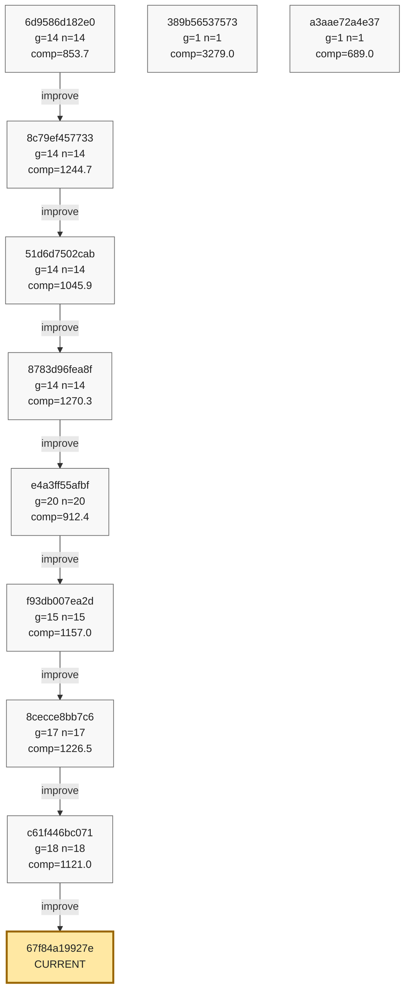

# Strategy Phyrogenetic Tree

- Updated: `2026-03-13 14:46:16 JST`
- Nodes: `491`
- Edges: `676`
- Current: `67f84a19927e`
- Anchor: `633b07c78b7c`
- Solid edge: mutation/improvement
- Dashed edge: rollback
- Older history is backfilled from `git log -- strategy.py` when local rolling data is incomplete.
- GitHub Mermaid size limit is avoided by splitting the full history into multiple smaller diagrams.

## Overview

- Contains tagged nodes and the latest `60` nodes.

```mermaid
flowchart TD
    h_633b07c78b7c["633b07c78b7c<br/>ANCHOR<br/>g=65 n=20<br/>comp=1004.1"]
    h_ecd51266b7af["ecd51266b7af<br/>g=30 n=20<br/>comp=1186.5"]
    h_cf5abc62bca8["cf5abc62bca8<br/>g=93 n=20<br/>comp=1026.1"]
    h_71e92a327b17["71e92a327b17<br/>g=26 n=20<br/>comp=1155.5"]
    h_4e860afd3310["4e860afd3310<br/>g=56 n=20<br/>comp=1030.1"]
    h_0fb4a51dfc30["0fb4a51dfc30<br/>g=18 n=18<br/>comp=1026.8"]
    h_2a1f6e9cb13f["2a1f6e9cb13f<br/>g=11 n=11<br/>comp=1075.7"]
    h_173e15416a89["173e15416a89<br/>g=17 n=17<br/>comp=1181.6"]
    h_64ab1a2a94a2["64ab1a2a94a2<br/>g=30 n=20<br/>comp=1252.9"]
    h_bc73e823fcfb["bc73e823fcfb<br/>g=39 n=20<br/>comp=1034.6"]
    h_061b6937c72a["061b6937c72a<br/>g=54 n=20<br/>comp=1122.6"]
    h_9b507a95939d["9b507a95939d<br/>g=11 n=11<br/>comp=977.3"]
    h_bc20d4e5febe["bc20d4e5febe<br/>g=29 n=20<br/>comp=1081.3"]
    h_b2747866354a["b2747866354a"]
    h_84c8b21cacf1["84c8b21cacf1<br/>g=13 n=13<br/>comp=1087.5"]
    h_7f1093d29bdf["7f1093d29bdf<br/>g=12 n=12<br/>comp=1012.8"]
    h_3b884249b5a4["3b884249b5a4<br/>g=12 n=12<br/>comp=1064.8"]
    h_0908aefcf5b5["0908aefcf5b5<br/>g=14 n=14<br/>comp=1113.7"]
    h_73e857c3b788["73e857c3b788<br/>g=17 n=17<br/>comp=1072.1"]
    h_034f19f91b78["034f19f91b78<br/>g=11 n=11<br/>comp=1009.8"]
    h_32512e084d78["32512e084d78<br/>g=13 n=13<br/>comp=1215.5"]
    h_a05f36cf8761["a05f36cf8761<br/>g=27 n=20<br/>comp=1140.6"]
    h_0585e1dd2376["0585e1dd2376<br/>g=11 n=11<br/>comp=1025.8"]
    h_00463a31abcd["00463a31abcd<br/>g=21 n=20<br/>comp=1186.7"]
    h_59bb28507f23["59bb28507f23<br/>g=56 n=20<br/>comp=1098.1"]
    h_cd9a3414b2ae["cd9a3414b2ae<br/>g=25 n=20<br/>comp=1064.2"]
    h_ec51087092d1["ec51087092d1<br/>g=11 n=11<br/>comp=1100.2"]
    h_e94cc9f2bcc6["e94cc9f2bcc6"]
    h_78db7a926515["78db7a926515<br/>g=11 n=11<br/>comp=779.8"]
    h_8479963ec45c["8479963ec45c<br/>g=14 n=14<br/>comp=1123.3"]
    h_924cfcf7e0d2["924cfcf7e0d2<br/>g=11 n=11<br/>comp=900.4"]
    h_3c4475f0b59d["3c4475f0b59d<br/>g=17 n=17<br/>comp=1055.4"]
    h_900c44e033ca["900c44e033ca<br/>g=58 n=20<br/>comp=976.8"]
    h_26287fbc6945["26287fbc6945<br/>g=23 n=20<br/>comp=1132.2"]
    h_a6f551f457fc["a6f551f457fc<br/>g=13 n=13<br/>comp=1287.7"]
    h_8d2792a50aba["8d2792a50aba<br/>g=73 n=20<br/>comp=1190.8"]
    h_4237be147960["4237be147960<br/>g=12 n=12<br/>comp=1063.8"]
    h_8219f97aba7a["8219f97aba7a<br/>g=12 n=12<br/>comp=849.7"]
    h_a2cb3537b678["a2cb3537b678<br/>g=12 n=12<br/>comp=1028.3"]
    h_23345b5829ed["23345b5829ed<br/>g=12 n=12<br/>comp=1059.4"]
    h_13fdd446d98f["13fdd446d98f<br/>g=15 n=15<br/>comp=1130.3"]
    h_17b90a6091ab["17b90a6091ab<br/>g=16 n=16<br/>comp=1127.5"]
    h_edbe5d85ae1a["edbe5d85ae1a<br/>g=13 n=13<br/>comp=905.8"]
    h_8b0f3c625308["8b0f3c625308<br/>g=14 n=14<br/>comp=1274.6"]
    h_4cfb010e2add["4cfb010e2add<br/>g=14 n=14<br/>comp=923.5"]
    h_e60ffd95cb26["e60ffd95cb26<br/>g=13 n=13<br/>comp=1137.6"]
    h_636722a45a6e["636722a45a6e<br/>g=13 n=13<br/>comp=1154.5"]
    h_56747e968f87["56747e968f87<br/>g=14 n=14<br/>comp=1300.2"]
    h_3ef39a374acf["3ef39a374acf<br/>g=13 n=13<br/>comp=1080.0"]
    h_e2a889360de0["e2a889360de0<br/>g=26 n=20<br/>comp=1082.0"]
    h_6d9586d182e0["6d9586d182e0<br/>g=14 n=14<br/>comp=853.7"]
    h_8c79ef457733["8c79ef457733<br/>g=14 n=14<br/>comp=1244.7"]
    h_51d6d7502cab["51d6d7502cab<br/>g=14 n=14<br/>comp=1045.9"]
    h_8783d96fea8f["8783d96fea8f<br/>g=14 n=14<br/>comp=1270.3"]
    h_e4a3ff55afbf["e4a3ff55afbf<br/>g=20 n=20<br/>comp=912.4"]
    h_f93db007ea2d["f93db007ea2d<br/>g=15 n=15<br/>comp=1157.0"]
    h_8cecce8bb7c6["8cecce8bb7c6<br/>g=17 n=17<br/>comp=1226.5"]
    h_c61f446bc071["c61f446bc071<br/>g=18 n=18<br/>comp=1121.0"]
    h_389b56537573["389b56537573<br/>g=1 n=1<br/>comp=3279.0"]
    h_a3aae72a4e37["a3aae72a4e37<br/>g=1 n=1<br/>comp=689.0"]
    h_67f84a19927e["67f84a19927e<br/>CURRENT"]

    h_ecd51266b7af -->|improve| h_cf5abc62bca8
    h_cf5abc62bca8 -->|improve| h_71e92a327b17
    h_71e92a327b17 -->|improve| h_4e860afd3310
    h_4e860afd3310 -->|improve| h_0fb4a51dfc30
    h_0fb4a51dfc30 -. rollback .-> h_633b07c78b7c
    h_633b07c78b7c -->|improve| h_2a1f6e9cb13f
    h_2a1f6e9cb13f -. rollback .-> h_633b07c78b7c
    h_633b07c78b7c -->|improve| h_173e15416a89
    h_173e15416a89 -->|improve| h_64ab1a2a94a2
    h_64ab1a2a94a2 -->|improve| h_bc73e823fcfb
    h_bc73e823fcfb -->|improve| h_061b6937c72a
    h_061b6937c72a -->|improve| h_9b507a95939d
    h_9b507a95939d -. rollback .-> h_633b07c78b7c
    h_633b07c78b7c -. rollback .-> h_cf5abc62bca8
    h_cf5abc62bca8 -. rollback .-> h_061b6937c72a
    h_4e860afd3310 -. rollback .-> h_64ab1a2a94a2
    h_061b6937c72a -. rollback .-> h_4e860afd3310
    h_4e860afd3310 -->|improve| h_bc20d4e5febe
    h_bc20d4e5febe -->|improve| h_b2747866354a
    h_b2747866354a -. rollback .-> h_bc20d4e5febe
    h_bc20d4e5febe -. rollback .-> h_4e860afd3310
    h_4e860afd3310 -->|improve| h_84c8b21cacf1
    h_7f1093d29bdf -. rollback .-> h_633b07c78b7c
    h_061b6937c72a -->|improve| h_3b884249b5a4
    h_3b884249b5a4 -. rollback .-> h_633b07c78b7c
    h_633b07c78b7c -. rollback .-> h_061b6937c72a
    h_061b6937c72a -. rollback .-> h_cf5abc62bca8
    h_cf5abc62bca8 -->|improve| h_0908aefcf5b5
    h_0908aefcf5b5 -->|improve| h_73e857c3b788
    h_73e857c3b788 -. rollback .-> h_633b07c78b7c
    h_cf5abc62bca8 -->|improve| h_034f19f91b78
    h_034f19f91b78 -. rollback .-> h_633b07c78b7c
    h_633b07c78b7c -. rollback .-> h_bc73e823fcfb
    h_bc73e823fcfb -->|improve| h_32512e084d78
    h_32512e084d78 -->|improve| h_a05f36cf8761
    h_a05f36cf8761 -->|improve| h_0585e1dd2376
    h_0585e1dd2376 -. rollback .-> h_633b07c78b7c
    h_633b07c78b7c -. rollback .-> h_a05f36cf8761
    h_a05f36cf8761 -->|improve| h_00463a31abcd
    h_00463a31abcd -->|improve| h_59bb28507f23
    h_59bb28507f23 -->|improve| h_cd9a3414b2ae
    h_cd9a3414b2ae -->|improve| h_ec51087092d1
    h_ec51087092d1 -. rollback .-> h_633b07c78b7c
    h_633b07c78b7c -. rollback .-> h_cd9a3414b2ae
    h_cd9a3414b2ae -. rollback .-> h_bc73e823fcfb
    h_bc73e823fcfb -. rollback .-> h_633b07c78b7c
    h_633b07c78b7c -. rollback .-> h_59bb28507f23
    h_59bb28507f23 -->|improve| h_e94cc9f2bcc6
    h_e94cc9f2bcc6 -. rollback .-> h_59bb28507f23
    h_59bb28507f23 -->|improve| h_78db7a926515
    h_78db7a926515 -. rollback .-> h_633b07c78b7c
    h_59bb28507f23 -->|improve| h_8479963ec45c
    h_8479963ec45c -->|improve| h_924cfcf7e0d2
    h_924cfcf7e0d2 -. rollback .-> h_633b07c78b7c
    h_633b07c78b7c -. rollback .-> h_64ab1a2a94a2
    h_64ab1a2a94a2 -->|improve| h_3c4475f0b59d
    h_3c4475f0b59d -->|improve| h_900c44e033ca
    h_900c44e033ca -->|improve| h_26287fbc6945
    h_26287fbc6945 -. rollback .-> h_3c4475f0b59d
    h_3c4475f0b59d -. rollback .-> h_26287fbc6945
    h_a6f551f457fc -->|improve| h_8d2792a50aba
    h_8d2792a50aba -->|improve| h_4237be147960
    h_4237be147960 -. rollback .-> h_8d2792a50aba
    h_8d2792a50aba -. rollback .-> h_900c44e033ca
    h_900c44e033ca -->|improve| h_8219f97aba7a
    h_8219f97aba7a -. rollback .-> h_900c44e033ca
    h_900c44e033ca -. rollback .-> h_8d2792a50aba
    h_8d2792a50aba -->|improve| h_a2cb3537b678
    h_a2cb3537b678 -. rollback .-> h_900c44e033ca
    h_8d2792a50aba -->|improve| h_23345b5829ed
    h_23345b5829ed -. rollback .-> h_8d2792a50aba
    h_8d2792a50aba -->|improve| h_13fdd446d98f
    h_13fdd446d98f -->|improve| h_17b90a6091ab
    h_17b90a6091ab -->|improve| h_edbe5d85ae1a
    h_edbe5d85ae1a -->|improve| h_8b0f3c625308
    h_8b0f3c625308 -->|improve| h_4cfb010e2add
    h_4cfb010e2add -->|improve| h_e60ffd95cb26
    h_e60ffd95cb26 -->|improve| h_636722a45a6e
    h_636722a45a6e -->|improve| h_56747e968f87
    h_56747e968f87 -->|improve| h_3ef39a374acf
    h_3ef39a374acf -->|improve| h_e2a889360de0
    h_e2a889360de0 -->|improve| h_6d9586d182e0
    h_6d9586d182e0 -->|improve| h_8c79ef457733
    h_8c79ef457733 -->|improve| h_51d6d7502cab
    h_51d6d7502cab -->|improve| h_8783d96fea8f
    h_8783d96fea8f -->|improve| h_e4a3ff55afbf
    h_e4a3ff55afbf -->|improve| h_f93db007ea2d
    h_f93db007ea2d -->|improve| h_8cecce8bb7c6
    h_8cecce8bb7c6 -->|improve| h_c61f446bc071
    h_c61f446bc071 -->|improve| h_67f84a19927e

    classDef plain fill:#f8f8f8,stroke:#666,stroke-width:1px,color:#222;
    classDef current fill:#ffe8a3,stroke:#9a6700,stroke-width:3px,color:#222;
    classDef anchor fill:#d7f5dd,stroke:#1f6f43,stroke-width:3px,color:#222;
    classDef current_anchor fill:#f3e4a8,stroke:#1f6f43,stroke-width:4px,color:#222;

    class h_633b07c78b7c anchor;
    class h_ecd51266b7af plain;
    class h_cf5abc62bca8 plain;
    class h_71e92a327b17 plain;
    class h_4e860afd3310 plain;
    class h_0fb4a51dfc30 plain;
    class h_2a1f6e9cb13f plain;
    class h_173e15416a89 plain;
    class h_64ab1a2a94a2 plain;
    class h_bc73e823fcfb plain;
    class h_061b6937c72a plain;
    class h_9b507a95939d plain;
    class h_bc20d4e5febe plain;
    class h_b2747866354a plain;
    class h_84c8b21cacf1 plain;
    class h_7f1093d29bdf plain;
    class h_3b884249b5a4 plain;
    class h_0908aefcf5b5 plain;
    class h_73e857c3b788 plain;
    class h_034f19f91b78 plain;
    class h_32512e084d78 plain;
    class h_a05f36cf8761 plain;
    class h_0585e1dd2376 plain;
    class h_00463a31abcd plain;
    class h_59bb28507f23 plain;
    class h_cd9a3414b2ae plain;
    class h_ec51087092d1 plain;
    class h_e94cc9f2bcc6 plain;
    class h_78db7a926515 plain;
    class h_8479963ec45c plain;
    class h_924cfcf7e0d2 plain;
    class h_3c4475f0b59d plain;
    class h_900c44e033ca plain;
    class h_26287fbc6945 plain;
    class h_a6f551f457fc plain;
    class h_8d2792a50aba plain;
    class h_4237be147960 plain;
    class h_8219f97aba7a plain;
    class h_a2cb3537b678 plain;
    class h_23345b5829ed plain;
    class h_13fdd446d98f plain;
    class h_17b90a6091ab plain;
    class h_edbe5d85ae1a plain;
    class h_8b0f3c625308 plain;
    class h_4cfb010e2add plain;
    class h_e60ffd95cb26 plain;
    class h_636722a45a6e plain;
    class h_56747e968f87 plain;
    class h_3ef39a374acf plain;
    class h_e2a889360de0 plain;
    class h_6d9586d182e0 plain;
    class h_8c79ef457733 plain;
    class h_51d6d7502cab plain;
    class h_8783d96fea8f plain;
    class h_e4a3ff55afbf plain;
    class h_f93db007ea2d plain;
    class h_8cecce8bb7c6 plain;
    class h_c61f446bc071 plain;
    class h_389b56537573 plain;
    class h_a3aae72a4e37 plain;
    class h_67f84a19927e current;
```

## Detail 1/7

- Range: `b0936e9e200b` .. `d3f6c63419da`
- Nodes in this diagram: `80`
- Internal edges in this diagram: `83`
- Cross-chunk link: `d3f6c63419da --improve--> 155d2f3c99f8`
- Cross-chunk link: `f95349dcd93f -.rollback.-> f1210d388d1b`
- Cross-chunk link: `f1210d388d1b --improve--> 0b19b373ba4d`
- Cross-chunk link: `b2b45b43facd -.rollback.-> f1210d388d1b`
- Cross-chunk link: `f1210d388d1b --improve--> 96365599213f`
- Cross-chunk link: `03f7524cf920 -.rollback.-> f1210d388d1b`
- Cross-chunk link: `f1210d388d1b -.rollback.-> 03f7524cf920`
- Cross-chunk link: `21ae73918a7d -.rollback.-> f1210d388d1b`
- Cross-chunk link: `f1210d388d1b --improve--> 740922d923ba`
- Cross-chunk link: `b6063324187b -.rollback.-> f1210d388d1b`
- Cross-chunk link: `f1210d388d1b --improve--> 596e96ba354b`
- Cross-chunk link: `596e96ba354b -.rollback.-> f1210d388d1b`
- Cross-chunk link: `... and 5 more`

```mermaid
flowchart TD
    h_b0936e9e200b["b0936e9e200b"]
    h_e4bc59608c67["e4bc59608c67"]
    h_2d1f9a38d00e["2d1f9a38d00e"]
    h_e039059b8d8d["e039059b8d8d"]
    h_fdceff1f6bf5["fdceff1f6bf5"]
    h_c9b196cd1b06["c9b196cd1b06"]
    h_6531f513b51c["6531f513b51c"]
    h_dd76e5e22525["dd76e5e22525"]
    h_3c486868eba8["3c486868eba8"]
    h_f9472aa40675["f9472aa40675"]
    h_57e912814720["57e912814720"]
    h_0f400e55dcef["0f400e55dcef"]
    h_09433570a203["09433570a203"]
    h_de37f45f9fb8["de37f45f9fb8"]
    h_94c92247fae3["94c92247fae3"]
    h_95f998a02a93["95f998a02a93"]
    h_dbc40f74967b["dbc40f74967b"]
    h_0b3a6ab12dbe["0b3a6ab12dbe"]
    h_39546d1ae02a["39546d1ae02a"]
    h_c1848320ea63["c1848320ea63"]
    h_a7c3e3f29132["a7c3e3f29132"]
    h_f0b02b8d5913["f0b02b8d5913"]
    h_7976770d022a["7976770d022a"]
    h_aaa2fbd9c4f0["aaa2fbd9c4f0"]
    h_e2f2ddedd462["e2f2ddedd462"]
    h_799f09359e5e["799f09359e5e"]
    h_44b5d8fdecaa["44b5d8fdecaa"]
    h_31b6dddd1967["31b6dddd1967"]
    h_57ebcaf98924["57ebcaf98924"]
    h_ad1cef65257e["ad1cef65257e"]
    h_20d803959cf9["20d803959cf9"]
    h_873e46ebaa6c["873e46ebaa6c"]
    h_70d2e37e16af["70d2e37e16af"]
    h_f1ce25c980ed["f1ce25c980ed"]
    h_97fed1385efb["97fed1385efb"]
    h_dda27d8bf077["dda27d8bf077"]
    h_84d8f61180c4["84d8f61180c4"]
    h_7b8e05157fe0["7b8e05157fe0"]
    h_102c5c2a0dde["102c5c2a0dde"]
    h_898f42a7166a["898f42a7166a"]
    h_f9c83a79bf99["f9c83a79bf99"]
    h_13749b02e9be["13749b02e9be"]
    h_ab769ecc78fa["ab769ecc78fa"]
    h_dfc6a1058b5d["dfc6a1058b5d"]
    h_3cce155c16ca["3cce155c16ca"]
    h_dcbff9abb0a5["dcbff9abb0a5"]
    h_45e6c92f7948["45e6c92f7948"]
    h_0b9c35838965["0b9c35838965"]
    h_3da291dbd1d1["3da291dbd1d1"]
    h_90eac5f01c92["90eac5f01c92"]
    h_f1210d388d1b["f1210d388d1b<br/>g=13 n=13<br/>comp=931.0"]
    h_bf4a9f45d1d4["bf4a9f45d1d4"]
    h_f040df248b1a["f040df248b1a"]
    h_e3aff4b458c5["e3aff4b458c5"]
    h_db325ac46be1["db325ac46be1"]
    h_096caa6e60e5["096caa6e60e5"]
    h_b9ced5d01685["b9ced5d01685"]
    h_05288cd67986["05288cd67986"]
    h_712ab51231b6["712ab51231b6"]
    h_314f8f06e79a["314f8f06e79a"]
    h_d8e15a466aac["d8e15a466aac"]
    h_5ad20b7a3c69["5ad20b7a3c69"]
    h_ec17cfa3fd50["ec17cfa3fd50"]
    h_7c8bf7070075["7c8bf7070075"]
    h_3eb7c63147ce["3eb7c63147ce"]
    h_e4ae11cd8ad1["e4ae11cd8ad1"]
    h_b1f788954e68["b1f788954e68"]
    h_540082274e98["540082274e98"]
    h_4de801d63903["4de801d63903"]
    h_6b61b12b54a0["6b61b12b54a0"]
    h_8f31d1847d3f["8f31d1847d3f"]
    h_517ecf455d49["517ecf455d49"]
    h_4f9ac51a30d1["4f9ac51a30d1"]
    h_de12063f125e["de12063f125e"]
    h_f7e26af5507d["f7e26af5507d"]
    h_c9d42d442d7e["c9d42d442d7e"]
    h_7d7672c4e6fa["7d7672c4e6fa"]
    h_6dfb2ead5f94["6dfb2ead5f94"]
    h_66d961be6f61["66d961be6f61"]
    h_d3f6c63419da["d3f6c63419da"]

    h_b0936e9e200b -->|improve| h_e4bc59608c67
    h_e4bc59608c67 -->|improve| h_2d1f9a38d00e
    h_2d1f9a38d00e -->|improve| h_e039059b8d8d
    h_e039059b8d8d -->|improve| h_fdceff1f6bf5
    h_fdceff1f6bf5 -->|improve| h_c9b196cd1b06
    h_c9b196cd1b06 -->|improve| h_6531f513b51c
    h_6531f513b51c -->|improve| h_dd76e5e22525
    h_dd76e5e22525 -->|improve| h_3c486868eba8
    h_3c486868eba8 -->|improve| h_f9472aa40675
    h_f9472aa40675 -->|improve| h_57e912814720
    h_57e912814720 -->|improve| h_0f400e55dcef
    h_0f400e55dcef -->|improve| h_09433570a203
    h_09433570a203 -->|improve| h_de37f45f9fb8
    h_de37f45f9fb8 -->|improve| h_94c92247fae3
    h_94c92247fae3 -->|improve| h_95f998a02a93
    h_95f998a02a93 -->|improve| h_dbc40f74967b
    h_dbc40f74967b -->|improve| h_0b3a6ab12dbe
    h_0b3a6ab12dbe -->|improve| h_39546d1ae02a
    h_39546d1ae02a -->|improve| h_c1848320ea63
    h_c1848320ea63 -->|improve| h_a7c3e3f29132
    h_a7c3e3f29132 -->|improve| h_f0b02b8d5913
    h_f0b02b8d5913 -->|improve| h_7976770d022a
    h_7976770d022a -. rollback .-> h_f0b02b8d5913
    h_f0b02b8d5913 -->|improve| h_aaa2fbd9c4f0
    h_aaa2fbd9c4f0 -->|improve| h_e2f2ddedd462
    h_e2f2ddedd462 -->|improve| h_799f09359e5e
    h_799f09359e5e -->|improve| h_44b5d8fdecaa
    h_44b5d8fdecaa -->|improve| h_31b6dddd1967
    h_31b6dddd1967 -->|improve| h_57ebcaf98924
    h_57ebcaf98924 -->|improve| h_ad1cef65257e
    h_ad1cef65257e -->|improve| h_20d803959cf9
    h_20d803959cf9 -->|improve| h_873e46ebaa6c
    h_873e46ebaa6c -->|improve| h_70d2e37e16af
    h_70d2e37e16af -->|improve| h_f1ce25c980ed
    h_f1ce25c980ed -->|improve| h_97fed1385efb
    h_97fed1385efb -->|improve| h_dda27d8bf077
    h_dda27d8bf077 -->|improve| h_84d8f61180c4
    h_84d8f61180c4 -->|improve| h_7b8e05157fe0
    h_7b8e05157fe0 -->|improve| h_102c5c2a0dde
    h_102c5c2a0dde -->|improve| h_898f42a7166a
    h_898f42a7166a -->|improve| h_f9c83a79bf99
    h_f9c83a79bf99 -->|improve| h_13749b02e9be
    h_13749b02e9be -->|improve| h_ab769ecc78fa
    h_ab769ecc78fa -->|improve| h_dfc6a1058b5d
    h_dfc6a1058b5d -->|improve| h_3cce155c16ca
    h_3cce155c16ca -->|improve| h_dcbff9abb0a5
    h_dcbff9abb0a5 -->|improve| h_45e6c92f7948
    h_45e6c92f7948 -->|improve| h_0b9c35838965
    h_0b9c35838965 -->|improve| h_3da291dbd1d1
    h_3da291dbd1d1 -->|improve| h_90eac5f01c92
    h_90eac5f01c92 -->|improve| h_f1210d388d1b
    h_f1210d388d1b -->|improve| h_bf4a9f45d1d4
    h_bf4a9f45d1d4 -->|improve| h_f040df248b1a
    h_f040df248b1a -->|improve| h_e3aff4b458c5
    h_e3aff4b458c5 -->|improve| h_db325ac46be1
    h_db325ac46be1 -->|improve| h_096caa6e60e5
    h_096caa6e60e5 -->|improve| h_b9ced5d01685
    h_b9ced5d01685 -->|improve| h_05288cd67986
    h_05288cd67986 -->|improve| h_712ab51231b6
    h_712ab51231b6 -->|improve| h_314f8f06e79a
    h_314f8f06e79a -->|improve| h_d8e15a466aac
    h_d8e15a466aac -->|improve| h_5ad20b7a3c69
    h_5ad20b7a3c69 -->|improve| h_ec17cfa3fd50
    h_ec17cfa3fd50 -->|improve| h_7c8bf7070075
    h_7c8bf7070075 -->|improve| h_3eb7c63147ce
    h_3eb7c63147ce -->|improve| h_e4ae11cd8ad1
    h_e4ae11cd8ad1 -. rollback .-> h_f1210d388d1b
    h_f1210d388d1b -->|improve| h_b1f788954e68
    h_b1f788954e68 -->|improve| h_540082274e98
    h_540082274e98 -->|improve| h_4de801d63903
    h_4de801d63903 -->|improve| h_6b61b12b54a0
    h_6b61b12b54a0 -. rollback .-> h_f1210d388d1b
    h_f1210d388d1b -->|improve| h_8f31d1847d3f
    h_8f31d1847d3f -. rollback .-> h_3cce155c16ca
    h_3cce155c16ca -->|improve| h_517ecf455d49
    h_517ecf455d49 -->|improve| h_4f9ac51a30d1
    h_4f9ac51a30d1 -->|improve| h_de12063f125e
    h_de12063f125e -->|improve| h_f7e26af5507d
    h_f7e26af5507d -->|improve| h_c9d42d442d7e
    h_c9d42d442d7e -->|improve| h_7d7672c4e6fa
    h_7d7672c4e6fa -->|improve| h_6dfb2ead5f94
    h_6dfb2ead5f94 -->|improve| h_66d961be6f61
    h_66d961be6f61 -->|improve| h_d3f6c63419da

    classDef plain fill:#f8f8f8,stroke:#666,stroke-width:1px,color:#222;
    classDef current fill:#ffe8a3,stroke:#9a6700,stroke-width:3px,color:#222;
    classDef anchor fill:#d7f5dd,stroke:#1f6f43,stroke-width:3px,color:#222;
    classDef current_anchor fill:#f3e4a8,stroke:#1f6f43,stroke-width:4px,color:#222;

    class h_b0936e9e200b plain;
    class h_e4bc59608c67 plain;
    class h_2d1f9a38d00e plain;
    class h_e039059b8d8d plain;
    class h_fdceff1f6bf5 plain;
    class h_c9b196cd1b06 plain;
    class h_6531f513b51c plain;
    class h_dd76e5e22525 plain;
    class h_3c486868eba8 plain;
    class h_f9472aa40675 plain;
    class h_57e912814720 plain;
    class h_0f400e55dcef plain;
    class h_09433570a203 plain;
    class h_de37f45f9fb8 plain;
    class h_94c92247fae3 plain;
    class h_95f998a02a93 plain;
    class h_dbc40f74967b plain;
    class h_0b3a6ab12dbe plain;
    class h_39546d1ae02a plain;
    class h_c1848320ea63 plain;
    class h_a7c3e3f29132 plain;
    class h_f0b02b8d5913 plain;
    class h_7976770d022a plain;
    class h_aaa2fbd9c4f0 plain;
    class h_e2f2ddedd462 plain;
    class h_799f09359e5e plain;
    class h_44b5d8fdecaa plain;
    class h_31b6dddd1967 plain;
    class h_57ebcaf98924 plain;
    class h_ad1cef65257e plain;
    class h_20d803959cf9 plain;
    class h_873e46ebaa6c plain;
    class h_70d2e37e16af plain;
    class h_f1ce25c980ed plain;
    class h_97fed1385efb plain;
    class h_dda27d8bf077 plain;
    class h_84d8f61180c4 plain;
    class h_7b8e05157fe0 plain;
    class h_102c5c2a0dde plain;
    class h_898f42a7166a plain;
    class h_f9c83a79bf99 plain;
    class h_13749b02e9be plain;
    class h_ab769ecc78fa plain;
    class h_dfc6a1058b5d plain;
    class h_3cce155c16ca plain;
    class h_dcbff9abb0a5 plain;
    class h_45e6c92f7948 plain;
    class h_0b9c35838965 plain;
    class h_3da291dbd1d1 plain;
    class h_90eac5f01c92 plain;
    class h_f1210d388d1b plain;
    class h_bf4a9f45d1d4 plain;
    class h_f040df248b1a plain;
    class h_e3aff4b458c5 plain;
    class h_db325ac46be1 plain;
    class h_096caa6e60e5 plain;
    class h_b9ced5d01685 plain;
    class h_05288cd67986 plain;
    class h_712ab51231b6 plain;
    class h_314f8f06e79a plain;
    class h_d8e15a466aac plain;
    class h_5ad20b7a3c69 plain;
    class h_ec17cfa3fd50 plain;
    class h_7c8bf7070075 plain;
    class h_3eb7c63147ce plain;
    class h_e4ae11cd8ad1 plain;
    class h_b1f788954e68 plain;
    class h_540082274e98 plain;
    class h_4de801d63903 plain;
    class h_6b61b12b54a0 plain;
    class h_8f31d1847d3f plain;
    class h_517ecf455d49 plain;
    class h_4f9ac51a30d1 plain;
    class h_de12063f125e plain;
    class h_f7e26af5507d plain;
    class h_c9d42d442d7e plain;
    class h_7d7672c4e6fa plain;
    class h_6dfb2ead5f94 plain;
    class h_66d961be6f61 plain;
    class h_d3f6c63419da plain;
```

## Detail 2/7

- Range: `155d2f3c99f8` .. `b5cd8a7be86d`
- Nodes in this diagram: `80`
- Internal edges in this diagram: `83`
- Cross-chunk link: `d3f6c63419da --improve--> 155d2f3c99f8`
- Cross-chunk link: `f95349dcd93f -.rollback.-> f1210d388d1b`
- Cross-chunk link: `f1210d388d1b --improve--> 0b19b373ba4d`
- Cross-chunk link: `b2b45b43facd -.rollback.-> f1210d388d1b`
- Cross-chunk link: `f1210d388d1b --improve--> 96365599213f`
- Cross-chunk link: `03f7524cf920 -.rollback.-> f1210d388d1b`
- Cross-chunk link: `f1210d388d1b -.rollback.-> 03f7524cf920`
- Cross-chunk link: `21ae73918a7d -.rollback.-> f1210d388d1b`
- Cross-chunk link: `f1210d388d1b --improve--> 740922d923ba`
- Cross-chunk link: `b6063324187b -.rollback.-> f1210d388d1b`
- Cross-chunk link: `f1210d388d1b --improve--> 596e96ba354b`
- Cross-chunk link: `596e96ba354b -.rollback.-> f1210d388d1b`
- Cross-chunk link: `... and 26 more`

```mermaid
flowchart TD
    h_155d2f3c99f8["155d2f3c99f8"]
    h_76750ce3bc91["76750ce3bc91"]
    h_af049000deba["af049000deba"]
    h_6e43379039b7["6e43379039b7"]
    h_137b80b86ae0["137b80b86ae0"]
    h_d2a4001a5cb5["d2a4001a5cb5"]
    h_b4b1fad0af72["b4b1fad0af72"]
    h_96b9174334c3["96b9174334c3"]
    h_1a4875df7f84["1a4875df7f84"]
    h_ac14e5420133["ac14e5420133"]
    h_f95349dcd93f["f95349dcd93f"]
    h_0b19b373ba4d["0b19b373ba4d"]
    h_4206dffdc6a9["4206dffdc6a9"]
    h_ff6414af1d82["ff6414af1d82"]
    h_cd4c8a75ed6f["cd4c8a75ed6f"]
    h_d3f31ef77a32["d3f31ef77a32"]
    h_88fbdca1db21["88fbdca1db21"]
    h_dd74c894ff2c["dd74c894ff2c"]
    h_1d21660f933d["1d21660f933d"]
    h_db97bede877a["db97bede877a"]
    h_91aa7df9c822["91aa7df9c822"]
    h_a6a7ca2b3767["a6a7ca2b3767"]
    h_8ec1c75f54b0["8ec1c75f54b0"]
    h_2758f552da0c["2758f552da0c"]
    h_69b91a20c5a5["69b91a20c5a5"]
    h_b09cfc52736b["b09cfc52736b"]
    h_3d0912ffe7e8["3d0912ffe7e8"]
    h_29699f85e206["29699f85e206"]
    h_d20f0d105236["d20f0d105236"]
    h_b2b45b43facd["b2b45b43facd"]
    h_96365599213f["96365599213f"]
    h_9719f1fe4df0["9719f1fe4df0"]
    h_1355172e74bc["1355172e74bc"]
    h_b76cafcff26a["b76cafcff26a"]
    h_63497d665228["63497d665228"]
    h_1c981acaa1bb["1c981acaa1bb"]
    h_e95c5e5ca60b["e95c5e5ca60b"]
    h_3b4cfec753d6["3b4cfec753d6"]
    h_b525d59f10a3["b525d59f10a3"]
    h_7dfba30e72dc["7dfba30e72dc"]
    h_03f7524cf920["03f7524cf920<br/>g=18 n=18<br/>comp=897.5"]
    h_1a960aadeb8b["1a960aadeb8b"]
    h_1d2ab254c766["1d2ab254c766"]
    h_9f78d1ae4860["9f78d1ae4860"]
    h_efd6456c1390["efd6456c1390"]
    h_548cbf464126["548cbf464126"]
    h_1e8c3113cb4a["1e8c3113cb4a"]
    h_21ae73918a7d["21ae73918a7d"]
    h_740922d923ba["740922d923ba"]
    h_be0e735d8f11["be0e735d8f11"]
    h_6d44a3d2a50f["6d44a3d2a50f"]
    h_d6f554d054d7["d6f554d054d7"]
    h_bfe2f811651c["bfe2f811651c"]
    h_62be6dfb62c1["62be6dfb62c1"]
    h_0254d566dd46["0254d566dd46"]
    h_720e4a7cf279["720e4a7cf279"]
    h_b9da441828e4["b9da441828e4"]
    h_658826b27199["658826b27199"]
    h_d0b41afada2f["d0b41afada2f"]
    h_2e23c3d9329f["2e23c3d9329f"]
    h_a92ea3595895["a92ea3595895"]
    h_d906d8ce74ec["d906d8ce74ec"]
    h_cc738c7952e1["cc738c7952e1"]
    h_ef0217fb36b5["ef0217fb36b5"]
    h_b6063324187b["b6063324187b"]
    h_596e96ba354b["596e96ba354b"]
    h_2d98ed37337d["2d98ed37337d"]
    h_f3da681bc8ed["f3da681bc8ed"]
    h_a88f4a3fd7aa["a88f4a3fd7aa"]
    h_a131b78a5192["a131b78a5192"]
    h_71b35a2913a4["71b35a2913a4"]
    h_229ab640574a["229ab640574a"]
    h_9f137e10711f["9f137e10711f"]
    h_811226ca0556["811226ca0556"]
    h_e24195f7a194["e24195f7a194"]
    h_4eba9dba67d0["4eba9dba67d0"]
    h_2da4858b2c01["2da4858b2c01"]
    h_2512ecc005e1["2512ecc005e1"]
    h_a755765d5b7b["a755765d5b7b"]
    h_b5cd8a7be86d["b5cd8a7be86d"]

    h_155d2f3c99f8 -->|improve| h_76750ce3bc91
    h_76750ce3bc91 -->|improve| h_af049000deba
    h_af049000deba -->|improve| h_6e43379039b7
    h_6e43379039b7 -->|improve| h_137b80b86ae0
    h_137b80b86ae0 -->|improve| h_d2a4001a5cb5
    h_d2a4001a5cb5 -->|improve| h_b4b1fad0af72
    h_b4b1fad0af72 -->|improve| h_96b9174334c3
    h_96b9174334c3 -->|improve| h_1a4875df7f84
    h_1a4875df7f84 -->|improve| h_ac14e5420133
    h_ac14e5420133 -->|improve| h_f95349dcd93f
    h_0b19b373ba4d -->|improve| h_4206dffdc6a9
    h_4206dffdc6a9 -->|improve| h_ff6414af1d82
    h_ff6414af1d82 -->|improve| h_cd4c8a75ed6f
    h_cd4c8a75ed6f -->|improve| h_d3f31ef77a32
    h_d3f31ef77a32 -->|improve| h_88fbdca1db21
    h_88fbdca1db21 -->|improve| h_dd74c894ff2c
    h_dd74c894ff2c -->|improve| h_1d21660f933d
    h_1d21660f933d -->|improve| h_db97bede877a
    h_db97bede877a -->|improve| h_91aa7df9c822
    h_91aa7df9c822 -->|improve| h_a6a7ca2b3767
    h_a6a7ca2b3767 -->|improve| h_8ec1c75f54b0
    h_8ec1c75f54b0 -. rollback .-> h_a6a7ca2b3767
    h_a6a7ca2b3767 -->|improve| h_2758f552da0c
    h_2758f552da0c -->|improve| h_69b91a20c5a5
    h_69b91a20c5a5 -->|improve| h_b09cfc52736b
    h_b09cfc52736b -->|improve| h_3d0912ffe7e8
    h_3d0912ffe7e8 -->|improve| h_29699f85e206
    h_29699f85e206 -->|improve| h_d20f0d105236
    h_d20f0d105236 -->|improve| h_b2b45b43facd
    h_96365599213f -->|improve| h_9719f1fe4df0
    h_9719f1fe4df0 -->|improve| h_1355172e74bc
    h_1355172e74bc -->|improve| h_b76cafcff26a
    h_b76cafcff26a -->|improve| h_63497d665228
    h_63497d665228 -->|improve| h_1c981acaa1bb
    h_1c981acaa1bb -->|improve| h_e95c5e5ca60b
    h_e95c5e5ca60b -->|improve| h_3b4cfec753d6
    h_3b4cfec753d6 -->|improve| h_b525d59f10a3
    h_b525d59f10a3 -->|improve| h_7dfba30e72dc
    h_7dfba30e72dc -->|improve| h_03f7524cf920
    h_03f7524cf920 -->|improve| h_1a960aadeb8b
    h_1a960aadeb8b -. rollback .-> h_03f7524cf920
    h_03f7524cf920 -->|improve| h_1d2ab254c766
    h_1d2ab254c766 -->|improve| h_9f78d1ae4860
    h_9f78d1ae4860 -->|improve| h_efd6456c1390
    h_efd6456c1390 -->|improve| h_548cbf464126
    h_548cbf464126 -->|improve| h_1e8c3113cb4a
    h_1e8c3113cb4a -->|improve| h_21ae73918a7d
    h_740922d923ba -->|improve| h_be0e735d8f11
    h_be0e735d8f11 -->|improve| h_6d44a3d2a50f
    h_6d44a3d2a50f -->|improve| h_d6f554d054d7
    h_d6f554d054d7 -->|improve| h_bfe2f811651c
    h_bfe2f811651c -->|improve| h_62be6dfb62c1
    h_62be6dfb62c1 -. rollback .-> h_03f7524cf920
    h_03f7524cf920 -->|improve| h_0254d566dd46
    h_0254d566dd46 -->|improve| h_720e4a7cf279
    h_720e4a7cf279 -->|improve| h_b9da441828e4
    h_b9da441828e4 -. rollback .-> h_03f7524cf920
    h_03f7524cf920 -->|improve| h_658826b27199
    h_658826b27199 -. rollback .-> h_03f7524cf920
    h_03f7524cf920 -->|improve| h_d0b41afada2f
    h_d0b41afada2f -->|improve| h_2e23c3d9329f
    h_2e23c3d9329f -. rollback .-> h_03f7524cf920
    h_03f7524cf920 -->|improve| h_a92ea3595895
    h_a92ea3595895 -->|improve| h_d906d8ce74ec
    h_d906d8ce74ec -->|improve| h_cc738c7952e1
    h_cc738c7952e1 -->|improve| h_ef0217fb36b5
    h_ef0217fb36b5 -. rollback .-> h_03f7524cf920
    h_03f7524cf920 -->|improve| h_b6063324187b
    h_2d98ed37337d -->|improve| h_f3da681bc8ed
    h_f3da681bc8ed -->|improve| h_a88f4a3fd7aa
    h_a88f4a3fd7aa -. rollback .-> h_03f7524cf920
    h_03f7524cf920 -->|improve| h_a131b78a5192
    h_a131b78a5192 -->|improve| h_71b35a2913a4
    h_71b35a2913a4 -->|improve| h_229ab640574a
    h_229ab640574a -->|improve| h_9f137e10711f
    h_9f137e10711f -->|improve| h_811226ca0556
    h_811226ca0556 -->|improve| h_e24195f7a194
    h_e24195f7a194 -. rollback .-> h_03f7524cf920
    h_03f7524cf920 -->|improve| h_4eba9dba67d0
    h_4eba9dba67d0 -->|improve| h_2da4858b2c01
    h_2da4858b2c01 -->|improve| h_2512ecc005e1
    h_2512ecc005e1 -. rollback .-> h_03f7524cf920
    h_a755765d5b7b -->|improve| h_b5cd8a7be86d

    classDef plain fill:#f8f8f8,stroke:#666,stroke-width:1px,color:#222;
    classDef current fill:#ffe8a3,stroke:#9a6700,stroke-width:3px,color:#222;
    classDef anchor fill:#d7f5dd,stroke:#1f6f43,stroke-width:3px,color:#222;
    classDef current_anchor fill:#f3e4a8,stroke:#1f6f43,stroke-width:4px,color:#222;

    class h_155d2f3c99f8 plain;
    class h_76750ce3bc91 plain;
    class h_af049000deba plain;
    class h_6e43379039b7 plain;
    class h_137b80b86ae0 plain;
    class h_d2a4001a5cb5 plain;
    class h_b4b1fad0af72 plain;
    class h_96b9174334c3 plain;
    class h_1a4875df7f84 plain;
    class h_ac14e5420133 plain;
    class h_f95349dcd93f plain;
    class h_0b19b373ba4d plain;
    class h_4206dffdc6a9 plain;
    class h_ff6414af1d82 plain;
    class h_cd4c8a75ed6f plain;
    class h_d3f31ef77a32 plain;
    class h_88fbdca1db21 plain;
    class h_dd74c894ff2c plain;
    class h_1d21660f933d plain;
    class h_db97bede877a plain;
    class h_91aa7df9c822 plain;
    class h_a6a7ca2b3767 plain;
    class h_8ec1c75f54b0 plain;
    class h_2758f552da0c plain;
    class h_69b91a20c5a5 plain;
    class h_b09cfc52736b plain;
    class h_3d0912ffe7e8 plain;
    class h_29699f85e206 plain;
    class h_d20f0d105236 plain;
    class h_b2b45b43facd plain;
    class h_96365599213f plain;
    class h_9719f1fe4df0 plain;
    class h_1355172e74bc plain;
    class h_b76cafcff26a plain;
    class h_63497d665228 plain;
    class h_1c981acaa1bb plain;
    class h_e95c5e5ca60b plain;
    class h_3b4cfec753d6 plain;
    class h_b525d59f10a3 plain;
    class h_7dfba30e72dc plain;
    class h_03f7524cf920 plain;
    class h_1a960aadeb8b plain;
    class h_1d2ab254c766 plain;
    class h_9f78d1ae4860 plain;
    class h_efd6456c1390 plain;
    class h_548cbf464126 plain;
    class h_1e8c3113cb4a plain;
    class h_21ae73918a7d plain;
    class h_740922d923ba plain;
    class h_be0e735d8f11 plain;
    class h_6d44a3d2a50f plain;
    class h_d6f554d054d7 plain;
    class h_bfe2f811651c plain;
    class h_62be6dfb62c1 plain;
    class h_0254d566dd46 plain;
    class h_720e4a7cf279 plain;
    class h_b9da441828e4 plain;
    class h_658826b27199 plain;
    class h_d0b41afada2f plain;
    class h_2e23c3d9329f plain;
    class h_a92ea3595895 plain;
    class h_d906d8ce74ec plain;
    class h_cc738c7952e1 plain;
    class h_ef0217fb36b5 plain;
    class h_b6063324187b plain;
    class h_596e96ba354b plain;
    class h_2d98ed37337d plain;
    class h_f3da681bc8ed plain;
    class h_a88f4a3fd7aa plain;
    class h_a131b78a5192 plain;
    class h_71b35a2913a4 plain;
    class h_229ab640574a plain;
    class h_9f137e10711f plain;
    class h_811226ca0556 plain;
    class h_e24195f7a194 plain;
    class h_4eba9dba67d0 plain;
    class h_2da4858b2c01 plain;
    class h_2512ecc005e1 plain;
    class h_a755765d5b7b plain;
    class h_b5cd8a7be86d plain;
```

## Detail 3/7

- Range: `e3676607049d` .. `e24d1084d5ef`
- Nodes in this diagram: `80`
- Internal edges in this diagram: `77`
- Cross-chunk link: `b5cd8a7be86d --improve--> e3676607049d`
- Cross-chunk link: `e3676607049d -.rollback.-> 03f7524cf920`
- Cross-chunk link: `03f7524cf920 --improve--> c924c81022f5`
- Cross-chunk link: `c6c5812169bf -.rollback.-> 03f7524cf920`
- Cross-chunk link: `03f7524cf920 --improve--> 5ff6de32e6a5`
- Cross-chunk link: `5ff6de32e6a5 -.rollback.-> 03f7524cf920`
- Cross-chunk link: `03f7524cf920 --improve--> f020b7b4c6ec`
- Cross-chunk link: `f020b7b4c6ec -.rollback.-> 03f7524cf920`
- Cross-chunk link: `03f7524cf920 --improve--> 52dec2d240b4`
- Cross-chunk link: `ae6fa6d87a06 -.rollback.-> 03f7524cf920`
- Cross-chunk link: `03f7524cf920 --improve--> f30307f557e2`
- Cross-chunk link: `31709ff6533d -.rollback.-> 03f7524cf920`
- Cross-chunk link: `... and 17 more`

```mermaid
flowchart TD
    h_e3676607049d["e3676607049d"]
    h_c924c81022f5["c924c81022f5"]
    h_0058714043a7["0058714043a7"]
    h_d6cae27ed802["d6cae27ed802"]
    h_8294dea52a70["8294dea52a70"]
    h_c6c5812169bf["c6c5812169bf"]
    h_5ff6de32e6a5["5ff6de32e6a5"]
    h_f020b7b4c6ec["f020b7b4c6ec"]
    h_52dec2d240b4["52dec2d240b4"]
    h_78921e4f842e["78921e4f842e"]
    h_ae6fa6d87a06["ae6fa6d87a06"]
    h_f30307f557e2["f30307f557e2"]
    h_0961bfe98bc8["0961bfe98bc8<br/>g=8 n=8<br/>comp=1032.6"]
    h_59dbe2e99e83["59dbe2e99e83"]
    h_292b8d838624["292b8d838624"]
    h_aab5cfdabaa9["aab5cfdabaa9"]
    h_178c797a7762["178c797a7762"]
    h_ae0e500b9534["ae0e500b9534"]
    h_4ecccd5b3ce0["4ecccd5b3ce0"]
    h_80963a2974aa["80963a2974aa"]
    h_3793ec65f0a8["3793ec65f0a8"]
    h_9555c5d7b8ed["9555c5d7b8ed"]
    h_491005bdda14["491005bdda14"]
    h_dc79266c4642["dc79266c4642"]
    h_83458ea60e45["83458ea60e45"]
    h_6db63b792b4e["6db63b792b4e"]
    h_1d2f0657ca4f["1d2f0657ca4f"]
    h_1d73791b0408["1d73791b0408"]
    h_43bb9dd7218f["43bb9dd7218f"]
    h_30b1059145b2["30b1059145b2"]
    h_736eaa7a621e["736eaa7a621e"]
    h_0d84c249c34a["0d84c249c34a"]
    h_c94941f9c53c["c94941f9c53c"]
    h_e57c64a0b32f["e57c64a0b32f"]
    h_c0c9d9b71bea["c0c9d9b71bea"]
    h_446f8d51b619["446f8d51b619"]
    h_3d43b5c4b339["3d43b5c4b339"]
    h_31709ff6533d["31709ff6533d"]
    h_f0ce05373605["f0ce05373605"]
    h_e199cc8496ef["e199cc8496ef"]
    h_7e7feffb4acf["7e7feffb4acf"]
    h_2146c1000ebe["2146c1000ebe"]
    h_4266bc4d5404["4266bc4d5404"]
    h_521e2a6f7514["521e2a6f7514"]
    h_a530a40a918f["a530a40a918f"]
    h_17a089b8bb9a["17a089b8bb9a"]
    h_9d672f0df0c7["9d672f0df0c7"]
    h_419ab6257d92["419ab6257d92"]
    h_7297204b0bd5["7297204b0bd5"]
    h_59be602676c6["59be602676c6"]
    h_1bd7aa5a5785["1bd7aa5a5785"]
    h_ede5bfcf82d4["ede5bfcf82d4<br/>g=1 n=1<br/>comp=1681.0"]
    h_5a5c38cc0be2["5a5c38cc0be2<br/>g=3 n=3<br/>comp=531.5"]
    h_fd5fa021e976["fd5fa021e976<br/>g=5 n=5<br/>comp=651.2"]
    h_33f610967019["33f610967019<br/>g=5 n=5<br/>comp=928.6"]
    h_7bf31489e393["7bf31489e393<br/>g=6 n=6<br/>comp=1012.4"]
    h_0606e0423a11["0606e0423a11<br/>g=3 n=3<br/>comp=1038.2"]
    h_68ddbe9c93d1["68ddbe9c93d1<br/>g=4 n=4<br/>comp=1418.8"]
    h_ca8bbfc1d73b["ca8bbfc1d73b<br/>g=3 n=3<br/>comp=1623.3"]
    h_80cc6a42986e["80cc6a42986e<br/>g=3 n=3<br/>comp=1124.2"]
    h_575df14d63ab["575df14d63ab"]
    h_3d3038a910f5["3d3038a910f5<br/>g=3 n=3<br/>comp=536.4"]
    h_f7288a3a5270["f7288a3a5270<br/>g=1 n=1<br/>comp=959.0"]
    h_4694cefc0245["4694cefc0245<br/>g=1 n=1<br/>comp=1045.0"]
    h_39e98cdf0a0a["39e98cdf0a0a<br/>g=14 n=14<br/>comp=1097.1"]
    h_e4ed6ecc175e["e4ed6ecc175e<br/>g=1 n=1<br/>comp=1089.0"]
    h_11809cd47dd4["11809cd47dd4<br/>g=5 n=5<br/>comp=1022.9"]
    h_fcd7bf3cb003["fcd7bf3cb003<br/>g=18 n=18<br/>comp=1163.4"]
    h_2431bfe1b371["2431bfe1b371<br/>g=1 n=1<br/>comp=1188.0"]
    h_1b7384c61008["1b7384c61008<br/>g=18 n=18<br/>comp=916.9"]
    h_07e1f0e9538b["07e1f0e9538b<br/>g=15 n=15<br/>comp=957.7"]
    h_893ac47e50d0["893ac47e50d0<br/>g=17 n=17<br/>comp=918.2"]
    h_332dcb70e676["332dcb70e676<br/>g=1 n=1<br/>comp=1446.0"]
    h_97ffedbeb342["97ffedbeb342<br/>g=1 n=1<br/>comp=1136.0"]
    h_d23b57ac1e1f["d23b57ac1e1f<br/>g=17 n=17<br/>comp=1128.3"]
    h_7bd194238b84["7bd194238b84<br/>g=1 n=1<br/>comp=970.0"]
    h_780869025e24["780869025e24<br/>g=2 n=2<br/>comp=609.9"]
    h_c97cee797739["c97cee797739<br/>g=6 n=6<br/>comp=892.2"]
    h_34edcc78882b["34edcc78882b<br/>g=1 n=1<br/>comp=790.0"]
    h_e24d1084d5ef["e24d1084d5ef<br/>g=1 n=1<br/>comp=674.0"]

    h_c924c81022f5 -->|improve| h_0058714043a7
    h_0058714043a7 -->|improve| h_d6cae27ed802
    h_d6cae27ed802 -->|improve| h_8294dea52a70
    h_8294dea52a70 -->|improve| h_c6c5812169bf
    h_52dec2d240b4 -->|improve| h_78921e4f842e
    h_78921e4f842e -->|improve| h_ae6fa6d87a06
    h_f30307f557e2 -->|improve| h_0961bfe98bc8
    h_0961bfe98bc8 -->|improve| h_59dbe2e99e83
    h_59dbe2e99e83 -->|improve| h_292b8d838624
    h_292b8d838624 -->|improve| h_aab5cfdabaa9
    h_aab5cfdabaa9 -->|improve| h_178c797a7762
    h_178c797a7762 -->|improve| h_ae0e500b9534
    h_ae0e500b9534 -->|improve| h_4ecccd5b3ce0
    h_4ecccd5b3ce0 -->|improve| h_80963a2974aa
    h_80963a2974aa -->|improve| h_3793ec65f0a8
    h_3793ec65f0a8 -->|improve| h_9555c5d7b8ed
    h_9555c5d7b8ed -. rollback .-> h_3793ec65f0a8
    h_3793ec65f0a8 -->|improve| h_491005bdda14
    h_491005bdda14 -->|improve| h_dc79266c4642
    h_dc79266c4642 -->|improve| h_83458ea60e45
    h_83458ea60e45 -->|improve| h_6db63b792b4e
    h_6db63b792b4e -. rollback .-> h_dc79266c4642
    h_dc79266c4642 -->|improve| h_1d2f0657ca4f
    h_1d2f0657ca4f -->|improve| h_1d73791b0408
    h_1d73791b0408 -->|improve| h_43bb9dd7218f
    h_43bb9dd7218f -->|improve| h_30b1059145b2
    h_30b1059145b2 -->|improve| h_736eaa7a621e
    h_736eaa7a621e -->|improve| h_0d84c249c34a
    h_0d84c249c34a -->|improve| h_c94941f9c53c
    h_c94941f9c53c -->|improve| h_e57c64a0b32f
    h_e57c64a0b32f -->|improve| h_c0c9d9b71bea
    h_c0c9d9b71bea -->|improve| h_446f8d51b619
    h_446f8d51b619 -->|improve| h_3d43b5c4b339
    h_3d43b5c4b339 -->|improve| h_31709ff6533d
    h_7e7feffb4acf -->|improve| h_2146c1000ebe
    h_2146c1000ebe -->|improve| h_4266bc4d5404
    h_4266bc4d5404 -->|improve| h_521e2a6f7514
    h_521e2a6f7514 -->|improve| h_a530a40a918f
    h_a530a40a918f -->|improve| h_17a089b8bb9a
    h_17a089b8bb9a -->|improve| h_9d672f0df0c7
    h_9d672f0df0c7 -->|improve| h_419ab6257d92
    h_419ab6257d92 -->|improve| h_7297204b0bd5
    h_7297204b0bd5 -->|improve| h_59be602676c6
    h_1bd7aa5a5785 -->|improve| h_ede5bfcf82d4
    h_ede5bfcf82d4 -->|improve| h_5a5c38cc0be2
    h_5a5c38cc0be2 -->|improve| h_fd5fa021e976
    h_fd5fa021e976 -->|improve| h_33f610967019
    h_33f610967019 -->|improve| h_7bf31489e393
    h_0606e0423a11 -->|improve| h_68ddbe9c93d1
    h_68ddbe9c93d1 -->|improve| h_ca8bbfc1d73b
    h_ca8bbfc1d73b -->|improve| h_80cc6a42986e
    h_80cc6a42986e -->|improve| h_575df14d63ab
    h_575df14d63ab -->|improve| h_3d3038a910f5
    h_3d3038a910f5 -->|improve| h_f7288a3a5270
    h_f7288a3a5270 -->|improve| h_4694cefc0245
    h_4694cefc0245 -->|improve| h_39e98cdf0a0a
    h_39e98cdf0a0a -->|improve| h_e4ed6ecc175e
    h_e4ed6ecc175e -->|improve| h_11809cd47dd4
    h_11809cd47dd4 -->|improve| h_fcd7bf3cb003
    h_fcd7bf3cb003 -->|improve| h_2431bfe1b371
    h_2431bfe1b371 -. rollback .-> h_fcd7bf3cb003
    h_fcd7bf3cb003 -->|improve| h_1b7384c61008
    h_1b7384c61008 -->|improve| h_07e1f0e9538b
    h_07e1f0e9538b -. rollback .-> h_1b7384c61008
    h_07e1f0e9538b -->|improve| h_893ac47e50d0
    h_893ac47e50d0 -->|improve| h_332dcb70e676
    h_332dcb70e676 -. rollback .-> h_893ac47e50d0
    h_893ac47e50d0 -->|improve| h_97ffedbeb342
    h_97ffedbeb342 -. rollback .-> h_893ac47e50d0
    h_893ac47e50d0 -->|improve| h_d23b57ac1e1f
    h_d23b57ac1e1f -->|improve| h_7bd194238b84
    h_7bd194238b84 -. rollback .-> h_d23b57ac1e1f
    h_d23b57ac1e1f -->|improve| h_780869025e24
    h_780869025e24 -. rollback .-> h_d23b57ac1e1f
    h_d23b57ac1e1f -->|improve| h_c97cee797739
    h_c97cee797739 -->|improve| h_34edcc78882b
    h_34edcc78882b -->|improve| h_e24d1084d5ef

    classDef plain fill:#f8f8f8,stroke:#666,stroke-width:1px,color:#222;
    classDef current fill:#ffe8a3,stroke:#9a6700,stroke-width:3px,color:#222;
    classDef anchor fill:#d7f5dd,stroke:#1f6f43,stroke-width:3px,color:#222;
    classDef current_anchor fill:#f3e4a8,stroke:#1f6f43,stroke-width:4px,color:#222;

    class h_e3676607049d plain;
    class h_c924c81022f5 plain;
    class h_0058714043a7 plain;
    class h_d6cae27ed802 plain;
    class h_8294dea52a70 plain;
    class h_c6c5812169bf plain;
    class h_5ff6de32e6a5 plain;
    class h_f020b7b4c6ec plain;
    class h_52dec2d240b4 plain;
    class h_78921e4f842e plain;
    class h_ae6fa6d87a06 plain;
    class h_f30307f557e2 plain;
    class h_0961bfe98bc8 plain;
    class h_59dbe2e99e83 plain;
    class h_292b8d838624 plain;
    class h_aab5cfdabaa9 plain;
    class h_178c797a7762 plain;
    class h_ae0e500b9534 plain;
    class h_4ecccd5b3ce0 plain;
    class h_80963a2974aa plain;
    class h_3793ec65f0a8 plain;
    class h_9555c5d7b8ed plain;
    class h_491005bdda14 plain;
    class h_dc79266c4642 plain;
    class h_83458ea60e45 plain;
    class h_6db63b792b4e plain;
    class h_1d2f0657ca4f plain;
    class h_1d73791b0408 plain;
    class h_43bb9dd7218f plain;
    class h_30b1059145b2 plain;
    class h_736eaa7a621e plain;
    class h_0d84c249c34a plain;
    class h_c94941f9c53c plain;
    class h_e57c64a0b32f plain;
    class h_c0c9d9b71bea plain;
    class h_446f8d51b619 plain;
    class h_3d43b5c4b339 plain;
    class h_31709ff6533d plain;
    class h_f0ce05373605 plain;
    class h_e199cc8496ef plain;
    class h_7e7feffb4acf plain;
    class h_2146c1000ebe plain;
    class h_4266bc4d5404 plain;
    class h_521e2a6f7514 plain;
    class h_a530a40a918f plain;
    class h_17a089b8bb9a plain;
    class h_9d672f0df0c7 plain;
    class h_419ab6257d92 plain;
    class h_7297204b0bd5 plain;
    class h_59be602676c6 plain;
    class h_1bd7aa5a5785 plain;
    class h_ede5bfcf82d4 plain;
    class h_5a5c38cc0be2 plain;
    class h_fd5fa021e976 plain;
    class h_33f610967019 plain;
    class h_7bf31489e393 plain;
    class h_0606e0423a11 plain;
    class h_68ddbe9c93d1 plain;
    class h_ca8bbfc1d73b plain;
    class h_80cc6a42986e plain;
    class h_575df14d63ab plain;
    class h_3d3038a910f5 plain;
    class h_f7288a3a5270 plain;
    class h_4694cefc0245 plain;
    class h_39e98cdf0a0a plain;
    class h_e4ed6ecc175e plain;
    class h_11809cd47dd4 plain;
    class h_fcd7bf3cb003 plain;
    class h_2431bfe1b371 plain;
    class h_1b7384c61008 plain;
    class h_07e1f0e9538b plain;
    class h_893ac47e50d0 plain;
    class h_332dcb70e676 plain;
    class h_97ffedbeb342 plain;
    class h_d23b57ac1e1f plain;
    class h_7bd194238b84 plain;
    class h_780869025e24 plain;
    class h_c97cee797739 plain;
    class h_34edcc78882b plain;
    class h_e24d1084d5ef plain;
```

## Detail 4/7

- Range: `7daa4348391b` .. `57de365479a0`
- Nodes in this diagram: `80`
- Internal edges in this diagram: `114`
- Cross-chunk link: `e24d1084d5ef --improve--> 7daa4348391b`
- Cross-chunk link: `f83ca82c4967 -.rollback.-> f1210d388d1b`
- Cross-chunk link: `f1210d388d1b --improve--> 57b1cc3a6290`
- Cross-chunk link: `f83ca82c4967 -.rollback.-> 03f7524cf920`
- Cross-chunk link: `0961bfe98bc8 --improve--> f06cac30a7a8`
- Cross-chunk link: `f06cac30a7a8 -.rollback.-> 0961bfe98bc8`
- Cross-chunk link: `0961bfe98bc8 --improve--> 4faa93ab3781`
- Cross-chunk link: `57de365479a0 --improve--> 1fa254eca81f`
- Cross-chunk link: `1fa254eca81f -.rollback.-> 2c8a1cdc292f`
- Cross-chunk link: `2c8a1cdc292f --improve--> 4f7f77e9c388`
- Cross-chunk link: `4b307f9145f4 -.rollback.-> 570c0acc1f48`
- Cross-chunk link: `2c8a1cdc292f --improve--> 3434e8b1f997`
- Cross-chunk link: `... and 16 more`

```mermaid
flowchart TD
    h_7daa4348391b["7daa4348391b<br/>g=11 n=11<br/>comp=945.6"]
    h_94011b7212f0["94011b7212f0<br/>g=1 n=1<br/>comp=1336.0"]
    h_71a4babcea76["71a4babcea76<br/>g=1 n=1<br/>comp=1688.0"]
    h_edc49a0733b7["edc49a0733b7<br/>g=18 n=18<br/>comp=872.2"]
    h_fefe71d1927b["fefe71d1927b<br/>g=1 n=1<br/>comp=1126.0"]
    h_b0872a2ce8a2["b0872a2ce8a2<br/>g=14 n=14<br/>comp=821.3"]
    h_611bf1316847["611bf1316847<br/>g=1 n=1<br/>comp=773.0"]
    h_7d3218bdb0b4["7d3218bdb0b4<br/>g=1 n=1<br/>comp=968.0"]
    h_c37fbbfe2d61["c37fbbfe2d61<br/>g=7 n=7<br/>comp=1028.3"]
    h_e1a90f467348["e1a90f467348<br/>g=4 n=4<br/>comp=853.6"]
    h_215d20b343f4["215d20b343f4<br/>g=12 n=12<br/>comp=806.5"]
    h_f83ca82c4967["f83ca82c4967<br/>g=12 n=12<br/>comp=839.2"]
    h_57b1cc3a6290["57b1cc3a6290"]
    h_f06cac30a7a8["f06cac30a7a8<br/>g=4 n=4<br/>comp=872.7"]
    h_4faa93ab3781["4faa93ab3781<br/>g=1 n=1<br/>comp=1354.0"]
    h_01853899494d["01853899494d<br/>g=14 n=14<br/>comp=1116.9"]
    h_ddb0e9cd7c87["ddb0e9cd7c87<br/>g=11 n=11<br/>comp=950.6"]
    h_f77a5d0ca40e["f77a5d0ca40e<br/>g=12 n=12<br/>comp=889.0"]
    h_c3f00169bde1["c3f00169bde1<br/>g=20 n=20<br/>comp=863.6"]
    h_ab5803e4d3f9["ab5803e4d3f9<br/>g=12 n=12<br/>comp=834.9"]
    h_ae39c3c17bba["ae39c3c17bba<br/>g=34 n=20<br/>comp=895.9"]
    h_98b6f5b1e1a5["98b6f5b1e1a5<br/>g=9 n=9<br/>comp=942.5"]
    h_6ebffca5cd79["6ebffca5cd79<br/>g=9 n=9<br/>comp=636.1"]
    h_624cb6ba6eef["624cb6ba6eef<br/>g=7 n=7<br/>comp=629.3"]
    h_7184250eac7f["7184250eac7f"]
    h_c85d9d1989c1["c85d9d1989c1<br/>g=2 n=2<br/>comp=1924.8"]
    h_5d17725cfbc9["5d17725cfbc9<br/>g=10 n=10<br/>comp=914.7"]
    h_0ff5d88e1767["0ff5d88e1767<br/>g=11 n=11<br/>comp=843.3"]
    h_305fc060a340["305fc060a340<br/>g=13 n=13<br/>comp=1137.4"]
    h_dc9a73d0e9ac["dc9a73d0e9ac<br/>g=16 n=16<br/>comp=1027.6"]
    h_d0dc1084ea03["d0dc1084ea03<br/>g=1 n=1<br/>comp=1446.0"]
    h_16dc4eca5732["16dc4eca5732<br/>g=13 n=13<br/>comp=967.1"]
    h_df01ab33e232["df01ab33e232<br/>g=26 n=20<br/>comp=894.8"]
    h_489e140c12f6["489e140c12f6<br/>g=1 n=1<br/>comp=831.0"]
    h_0290083baf6e["0290083baf6e<br/>g=9 n=9<br/>comp=892.2"]
    h_1f879565e86a["1f879565e86a<br/>g=42 n=20<br/>comp=992.3"]
    h_3f8bfb887f91["3f8bfb887f91<br/>g=9 n=9<br/>comp=883.0"]
    h_ec1c724d375a["ec1c724d375a<br/>g=11 n=11<br/>comp=866.1"]
    h_bdd661475d6f["bdd661475d6f<br/>g=22 n=20<br/>comp=902.3"]
    h_fa7f167772ca["fa7f167772ca<br/>g=12 n=12<br/>comp=988.2"]
    h_275c44370cc1["275c44370cc1<br/>g=12 n=12<br/>comp=1000.8"]
    h_2444d816d61d["2444d816d61d<br/>g=21 n=20<br/>comp=1025.4"]
    h_94ffb332c4bd["94ffb332c4bd<br/>g=78 n=20<br/>comp=895.0"]
    h_efa83280c5ee["efa83280c5ee<br/>g=24 n=20<br/>comp=1177.9"]
    h_3707c23e28de["3707c23e28de<br/>g=9 n=9<br/>comp=1115.6"]
    h_c4ac35277b92["c4ac35277b92<br/>g=23 n=20<br/>comp=1016.3"]
    h_6c53cb703cb0["6c53cb703cb0<br/>g=10 n=10<br/>comp=821.4"]
    h_49d1d464b70e["49d1d464b70e<br/>g=14 n=14<br/>comp=1077.6"]
    h_77f44dd4c76f["77f44dd4c76f<br/>g=17 n=17<br/>comp=908.3"]
    h_547c25f1085a["547c25f1085a<br/>g=9 n=9<br/>comp=1046.0"]
    h_066eac67e8d1["066eac67e8d1<br/>g=9 n=9<br/>comp=903.8"]
    h_930be7852ee6["930be7852ee6<br/>g=9 n=9<br/>comp=972.7"]
    h_6f01e1ab6f07["6f01e1ab6f07<br/>g=9 n=9<br/>comp=704.9"]
    h_d28a029231d5["d28a029231d5<br/>g=62 n=20<br/>comp=1138.4"]
    h_4f5dc3ecdfa1["4f5dc3ecdfa1<br/>g=13 n=13<br/>comp=949.3"]
    h_f1a7fe514e71["f1a7fe514e71<br/>g=9 n=9<br/>comp=912.2"]
    h_570c0acc1f48["570c0acc1f48<br/>g=27 n=20<br/>comp=1085.9"]
    h_dc762c50fd79["dc762c50fd79<br/>g=9 n=9<br/>comp=864.7"]
    h_0d44982cc8b8["0d44982cc8b8<br/>g=9 n=9<br/>comp=1212.8"]
    h_9181a8ddd58e["9181a8ddd58e<br/>g=40 n=20<br/>comp=1223.6"]
    h_c83b25d1536c["c83b25d1536c<br/>g=19 n=19<br/>comp=1098.7"]
    h_07626300e5bc["07626300e5bc<br/>g=10 n=10<br/>comp=1137.2"]
    h_7e68deb48ecc["7e68deb48ecc<br/>g=32 n=20<br/>comp=1073.9"]
    h_57db7dea8ffa["57db7dea8ffa<br/>g=9 n=9<br/>comp=1019.3"]
    h_3860da1bac3d["3860da1bac3d<br/>g=11 n=11<br/>comp=945.4"]
    h_2c8a1cdc292f["2c8a1cdc292f<br/>g=39 n=20<br/>comp=1162.5"]
    h_e7d5892fef90["e7d5892fef90<br/>g=5 n=5<br/>comp=827.8"]
    h_ce138f0e5794["ce138f0e5794<br/>g=9 n=9<br/>comp=972.9"]
    h_50bf73635a3b["50bf73635a3b<br/>g=9 n=9<br/>comp=978.6"]
    h_b36cae25fcce["b36cae25fcce<br/>g=24 n=20<br/>comp=1105.7"]
    h_304f6aaeb9f8["304f6aaeb9f8<br/>g=11 n=11<br/>comp=947.2"]
    h_4a9819ed51bf["4a9819ed51bf<br/>g=18 n=18<br/>comp=892.6"]
    h_103eeeb8ca08["103eeeb8ca08<br/>g=11 n=11<br/>comp=890.5"]
    h_3ce33e882fff["3ce33e882fff<br/>g=11 n=11<br/>comp=1116.8"]
    h_1041e616066b["1041e616066b<br/>g=15 n=15<br/>comp=1180.4"]
    h_aa3c82eaaf04["aa3c82eaaf04<br/>g=11 n=11<br/>comp=1115.1"]
    h_e179674c686d["e179674c686d<br/>g=11 n=11<br/>comp=991.5"]
    h_2ad526c6f94f["2ad526c6f94f<br/>g=12 n=12<br/>comp=1016.7"]
    h_57b53c4d7cfc["57b53c4d7cfc<br/>g=11 n=11<br/>comp=947.1"]
    h_57de365479a0["57de365479a0<br/>g=16 n=16<br/>comp=1079.1"]

    h_7daa4348391b -->|improve| h_94011b7212f0
    h_94011b7212f0 -->|improve| h_71a4babcea76
    h_71a4babcea76 -->|improve| h_edc49a0733b7
    h_edc49a0733b7 -->|improve| h_fefe71d1927b
    h_fefe71d1927b -. rollback .-> h_edc49a0733b7
    h_edc49a0733b7 -->|improve| h_b0872a2ce8a2
    h_b0872a2ce8a2 -->|improve| h_611bf1316847
    h_611bf1316847 -->|improve| h_7d3218bdb0b4
    h_7d3218bdb0b4 -->|improve| h_c37fbbfe2d61
    h_c37fbbfe2d61 -->|improve| h_e1a90f467348
    h_e1a90f467348 -->|improve| h_215d20b343f4
    h_215d20b343f4 -->|improve| h_f83ca82c4967
    h_57b1cc3a6290 -. rollback .-> h_f83ca82c4967
    h_4faa93ab3781 -->|improve| h_01853899494d
    h_01853899494d -->|improve| h_ddb0e9cd7c87
    h_ddb0e9cd7c87 -->|improve| h_f77a5d0ca40e
    h_f77a5d0ca40e -->|improve| h_c3f00169bde1
    h_c3f00169bde1 -->|improve| h_ab5803e4d3f9
    h_ab5803e4d3f9 -->|improve| h_ae39c3c17bba
    h_ae39c3c17bba -->|improve| h_98b6f5b1e1a5
    h_98b6f5b1e1a5 -. rollback .-> h_ae39c3c17bba
    h_ae39c3c17bba -->|improve| h_6ebffca5cd79
    h_6ebffca5cd79 -. rollback .-> h_ae39c3c17bba
    h_ae39c3c17bba -->|improve| h_624cb6ba6eef
    h_624cb6ba6eef -. rollback .-> h_7184250eac7f
    h_7184250eac7f -. rollback .-> h_624cb6ba6eef
    h_624cb6ba6eef -->|improve| h_c85d9d1989c1
    h_c85d9d1989c1 -->|improve| h_5d17725cfbc9
    h_5d17725cfbc9 -->|improve| h_0ff5d88e1767
    h_0ff5d88e1767 -->|improve| h_305fc060a340
    h_305fc060a340 -->|improve| h_dc9a73d0e9ac
    h_dc9a73d0e9ac -->|improve| h_d0dc1084ea03
    h_d0dc1084ea03 -->|improve| h_16dc4eca5732
    h_16dc4eca5732 -->|improve| h_df01ab33e232
    h_df01ab33e232 -->|improve| h_489e140c12f6
    h_489e140c12f6 -->|improve| h_0290083baf6e
    h_0290083baf6e -. rollback .-> h_df01ab33e232
    h_df01ab33e232 -->|improve| h_1f879565e86a
    h_1f879565e86a -->|improve| h_3f8bfb887f91
    h_3f8bfb887f91 -. rollback .-> h_1f879565e86a
    h_1f879565e86a -->|improve| h_ec1c724d375a
    h_ec1c724d375a -->|improve| h_bdd661475d6f
    h_bdd661475d6f -->|improve| h_fa7f167772ca
    h_fa7f167772ca -. rollback .-> h_bdd661475d6f
    h_bdd661475d6f -->|improve| h_275c44370cc1
    h_275c44370cc1 -->|improve| h_2444d816d61d
    h_2444d816d61d -->|improve| h_94ffb332c4bd
    h_94ffb332c4bd -->|improve| h_efa83280c5ee
    h_efa83280c5ee -->|improve| h_3707c23e28de
    h_3707c23e28de -. rollback .-> h_efa83280c5ee
    h_efa83280c5ee -. rollback .-> h_94ffb332c4bd
    h_94ffb332c4bd -->|improve| h_c4ac35277b92
    h_c4ac35277b92 -->|improve| h_6c53cb703cb0
    h_6c53cb703cb0 -. rollback .-> h_c4ac35277b92
    h_c4ac35277b92 -->|improve| h_49d1d464b70e
    h_49d1d464b70e -->|improve| h_77f44dd4c76f
    h_77f44dd4c76f -->|improve| h_547c25f1085a
    h_547c25f1085a -. rollback .-> h_94ffb332c4bd
    h_94ffb332c4bd -. rollback .-> h_77f44dd4c76f
    h_77f44dd4c76f -. rollback .-> h_94ffb332c4bd
    h_94ffb332c4bd -->|improve| h_066eac67e8d1
    h_066eac67e8d1 -. rollback .-> h_94ffb332c4bd
    h_94ffb332c4bd -->|improve| h_930be7852ee6
    h_930be7852ee6 -. rollback .-> h_94ffb332c4bd
    h_94ffb332c4bd -->|improve| h_6f01e1ab6f07
    h_6f01e1ab6f07 -->|improve| h_d28a029231d5
    h_d28a029231d5 -->|improve| h_4f5dc3ecdfa1
    h_4f5dc3ecdfa1 -. rollback .-> h_d28a029231d5
    h_d28a029231d5 -->|improve| h_f1a7fe514e71
    h_f1a7fe514e71 -. rollback .-> h_d28a029231d5
    h_d28a029231d5 -->|improve| h_570c0acc1f48
    h_570c0acc1f48 -->|improve| h_dc762c50fd79
    h_dc762c50fd79 -. rollback .-> h_570c0acc1f48
    h_570c0acc1f48 -->|improve| h_0d44982cc8b8
    h_0d44982cc8b8 -. rollback .-> h_570c0acc1f48
    h_570c0acc1f48 -->|improve| h_9181a8ddd58e
    h_9181a8ddd58e -->|improve| h_c83b25d1536c
    h_c83b25d1536c -->|improve| h_07626300e5bc
    h_07626300e5bc -. rollback .-> h_570c0acc1f48
    h_570c0acc1f48 -. rollback .-> h_d28a029231d5
    h_d28a029231d5 -->|improve| h_7e68deb48ecc
    h_7e68deb48ecc -->|improve| h_57db7dea8ffa
    h_57db7dea8ffa -. rollback .-> h_d28a029231d5
    h_d28a029231d5 -. rollback .-> h_6f01e1ab6f07
    h_d28a029231d5 -->|improve| h_3860da1bac3d
    h_3860da1bac3d -. rollback .-> h_d28a029231d5
    h_d28a029231d5 -->|improve| h_2c8a1cdc292f
    h_2c8a1cdc292f -->|improve| h_e7d5892fef90
    h_e7d5892fef90 -->|improve| h_ce138f0e5794
    h_ce138f0e5794 -. rollback .-> h_2c8a1cdc292f
    h_2c8a1cdc292f -->|improve| h_50bf73635a3b
    h_50bf73635a3b -. rollback .-> h_2c8a1cdc292f
    h_2c8a1cdc292f -->|improve| h_b36cae25fcce
    h_b36cae25fcce -->|improve| h_304f6aaeb9f8
    h_304f6aaeb9f8 -. rollback .-> h_2c8a1cdc292f
    h_2c8a1cdc292f -->|improve| h_4a9819ed51bf
    h_4a9819ed51bf -->|improve| h_103eeeb8ca08
    h_103eeeb8ca08 -. rollback .-> h_2c8a1cdc292f
    h_4a9819ed51bf -. rollback .-> h_2c8a1cdc292f
    h_2c8a1cdc292f -->|improve| h_3ce33e882fff
    h_3ce33e882fff -. rollback .-> h_2c8a1cdc292f
    h_2c8a1cdc292f -->|improve| h_1041e616066b
    h_1041e616066b -->|improve| h_aa3c82eaaf04
    h_aa3c82eaaf04 -->|improve| h_e179674c686d
    h_e179674c686d -. rollback .-> h_2c8a1cdc292f
    h_2c8a1cdc292f -->|improve| h_2ad526c6f94f
    h_2ad526c6f94f -. rollback .-> h_d28a029231d5
    h_d28a029231d5 -->|improve| h_57b53c4d7cfc
    h_57b53c4d7cfc -. rollback .-> h_d28a029231d5
    h_d28a029231d5 -. rollback .-> h_b36cae25fcce
    h_b36cae25fcce -. rollback .-> h_d28a029231d5
    h_570c0acc1f48 -->|improve| h_57de365479a0
    h_570c0acc1f48 -. rollback .-> h_2c8a1cdc292f
    h_1041e616066b -. rollback .-> h_2444d816d61d

    classDef plain fill:#f8f8f8,stroke:#666,stroke-width:1px,color:#222;
    classDef current fill:#ffe8a3,stroke:#9a6700,stroke-width:3px,color:#222;
    classDef anchor fill:#d7f5dd,stroke:#1f6f43,stroke-width:3px,color:#222;
    classDef current_anchor fill:#f3e4a8,stroke:#1f6f43,stroke-width:4px,color:#222;

    class h_7daa4348391b plain;
    class h_94011b7212f0 plain;
    class h_71a4babcea76 plain;
    class h_edc49a0733b7 plain;
    class h_fefe71d1927b plain;
    class h_b0872a2ce8a2 plain;
    class h_611bf1316847 plain;
    class h_7d3218bdb0b4 plain;
    class h_c37fbbfe2d61 plain;
    class h_e1a90f467348 plain;
    class h_215d20b343f4 plain;
    class h_f83ca82c4967 plain;
    class h_57b1cc3a6290 plain;
    class h_f06cac30a7a8 plain;
    class h_4faa93ab3781 plain;
    class h_01853899494d plain;
    class h_ddb0e9cd7c87 plain;
    class h_f77a5d0ca40e plain;
    class h_c3f00169bde1 plain;
    class h_ab5803e4d3f9 plain;
    class h_ae39c3c17bba plain;
    class h_98b6f5b1e1a5 plain;
    class h_6ebffca5cd79 plain;
    class h_624cb6ba6eef plain;
    class h_7184250eac7f plain;
    class h_c85d9d1989c1 plain;
    class h_5d17725cfbc9 plain;
    class h_0ff5d88e1767 plain;
    class h_305fc060a340 plain;
    class h_dc9a73d0e9ac plain;
    class h_d0dc1084ea03 plain;
    class h_16dc4eca5732 plain;
    class h_df01ab33e232 plain;
    class h_489e140c12f6 plain;
    class h_0290083baf6e plain;
    class h_1f879565e86a plain;
    class h_3f8bfb887f91 plain;
    class h_ec1c724d375a plain;
    class h_bdd661475d6f plain;
    class h_fa7f167772ca plain;
    class h_275c44370cc1 plain;
    class h_2444d816d61d plain;
    class h_94ffb332c4bd plain;
    class h_efa83280c5ee plain;
    class h_3707c23e28de plain;
    class h_c4ac35277b92 plain;
    class h_6c53cb703cb0 plain;
    class h_49d1d464b70e plain;
    class h_77f44dd4c76f plain;
    class h_547c25f1085a plain;
    class h_066eac67e8d1 plain;
    class h_930be7852ee6 plain;
    class h_6f01e1ab6f07 plain;
    class h_d28a029231d5 plain;
    class h_4f5dc3ecdfa1 plain;
    class h_f1a7fe514e71 plain;
    class h_570c0acc1f48 plain;
    class h_dc762c50fd79 plain;
    class h_0d44982cc8b8 plain;
    class h_9181a8ddd58e plain;
    class h_c83b25d1536c plain;
    class h_07626300e5bc plain;
    class h_7e68deb48ecc plain;
    class h_57db7dea8ffa plain;
    class h_3860da1bac3d plain;
    class h_2c8a1cdc292f plain;
    class h_e7d5892fef90 plain;
    class h_ce138f0e5794 plain;
    class h_50bf73635a3b plain;
    class h_b36cae25fcce plain;
    class h_304f6aaeb9f8 plain;
    class h_4a9819ed51bf plain;
    class h_103eeeb8ca08 plain;
    class h_3ce33e882fff plain;
    class h_1041e616066b plain;
    class h_aa3c82eaaf04 plain;
    class h_e179674c686d plain;
    class h_2ad526c6f94f plain;
    class h_57b53c4d7cfc plain;
    class h_57de365479a0 plain;
```

## Detail 5/7

- Range: `1fa254eca81f` .. `d062adad419a`
- Nodes in this diagram: `80`
- Internal edges in this diagram: `106`
- Cross-chunk link: `57de365479a0 --improve--> 1fa254eca81f`
- Cross-chunk link: `1fa254eca81f -.rollback.-> 2c8a1cdc292f`
- Cross-chunk link: `2c8a1cdc292f --improve--> 4f7f77e9c388`
- Cross-chunk link: `4b307f9145f4 -.rollback.-> 570c0acc1f48`
- Cross-chunk link: `2c8a1cdc292f --improve--> 3434e8b1f997`
- Cross-chunk link: `3434e8b1f997 -.rollback.-> 9181a8ddd58e`
- Cross-chunk link: `9181a8ddd58e --improve--> 633b07c78b7c`
- Cross-chunk link: `e94cff719028 -.rollback.-> 9181a8ddd58e`
- Cross-chunk link: `9181a8ddd58e --improve--> ca5c86778711`
- Cross-chunk link: `47d22fb8e1c8 -.rollback.-> 7e68deb48ecc`
- Cross-chunk link: `7e68deb48ecc --improve--> 7c5ddf2ab986`
- Cross-chunk link: `d062adad419a --improve--> 82d52dfb6031`
- Cross-chunk link: `... and 51 more`

```mermaid
flowchart TD
    h_1fa254eca81f["1fa254eca81f<br/>g=11 n=11<br/>comp=924.9"]
    h_4f7f77e9c388["4f7f77e9c388<br/>g=15 n=15<br/>comp=1149.4"]
    h_4b307f9145f4["4b307f9145f4<br/>g=18 n=18<br/>comp=1068.0"]
    h_3434e8b1f997["3434e8b1f997<br/>g=11 n=11<br/>comp=917.4"]
    h_633b07c78b7c["633b07c78b7c<br/>ANCHOR<br/>g=65 n=20<br/>comp=1004.1"]
    h_a2ef3e1663d0["a2ef3e1663d0<br/>g=49 n=20<br/>comp=1083.5"]
    h_cf161a6bf453["cf161a6bf453<br/>g=13 n=13<br/>comp=917.7"]
    h_ff348585731f["ff348585731f<br/>g=14 n=14<br/>comp=998.9"]
    h_93e147d90306["93e147d90306<br/>g=13 n=13<br/>comp=1172.0"]
    h_35ef58c471da["35ef58c471da<br/>g=42 n=20<br/>comp=1218.8"]
    h_22643c90ebe2["22643c90ebe2<br/>g=11 n=11<br/>comp=1083.3"]
    h_2f70abf898f2["2f70abf898f2<br/>g=159 n=20<br/>comp=948.9"]
    h_5170cbc2db08["5170cbc2db08<br/>g=13 n=13<br/>comp=1146.8"]
    h_c7a8cf98b118["c7a8cf98b118<br/>g=11 n=11<br/>comp=1025.5"]
    h_0fac9e29c7ee["0fac9e29c7ee<br/>g=48 n=20<br/>comp=955.1"]
    h_c3f6b73379b9["c3f6b73379b9<br/>g=28 n=20<br/>comp=1100.1"]
    h_a95c2ebe63d7["a95c2ebe63d7<br/>g=107 n=20<br/>comp=1035.6"]
    h_0c52c9debe03["0c52c9debe03<br/>g=13 n=13<br/>comp=1036.9"]
    h_7fa3a96724fb["7fa3a96724fb<br/>g=11 n=11<br/>comp=1049.1"]
    h_0bca424209e2["0bca424209e2<br/>g=13 n=13<br/>comp=1158.6"]
    h_6b4954ce2d96["6b4954ce2d96<br/>g=6 n=6<br/>comp=828.1"]
    h_7cc3ff27b86f["7cc3ff27b86f<br/>g=7 n=7<br/>comp=1135.3"]
    h_f29cdeb981e4["f29cdeb981e4<br/>g=12 n=12<br/>comp=872.3"]
    h_257d93883650["257d93883650<br/>g=11 n=11<br/>comp=1194.8"]
    h_6b3e65432022["6b3e65432022<br/>g=15 n=15<br/>comp=1177.9"]
    h_bb38531ed624["bb38531ed624<br/>g=30 n=20<br/>comp=1053.1"]
    h_74fdeb0c05a8["74fdeb0c05a8<br/>g=13 n=13<br/>comp=1117.1"]
    h_5af024c7a632["5af024c7a632<br/>g=41 n=20<br/>comp=1036.7"]
    h_a3ba4917a1a9["a3ba4917a1a9<br/>g=15 n=15<br/>comp=1118.0"]
    h_e2d6bfc5caa0["e2d6bfc5caa0<br/>g=52 n=20<br/>comp=1141.3"]
    h_2846744edc29["2846744edc29<br/>g=13 n=13<br/>comp=1075.2"]
    h_c6f303ae2504["c6f303ae2504<br/>g=14 n=14<br/>comp=1056.1"]
    h_569583580ed0["569583580ed0<br/>g=13 n=13<br/>comp=1175.7"]
    h_1a590c69380a["1a590c69380a<br/>g=13 n=13<br/>comp=1164.6"]
    h_c828ff8ed1f4["c828ff8ed1f4<br/>g=29 n=20<br/>comp=1151.7"]
    h_4b478262246c["4b478262246c<br/>g=1 n=1<br/>comp=0.0"]
    h_17c59d580ae6["17c59d580ae6<br/>g=14 n=14<br/>comp=1115.3"]
    h_fef15a82602a["fef15a82602a<br/>g=11 n=11<br/>comp=972.5"]
    h_410eb12ba19a["410eb12ba19a<br/>g=24 n=20<br/>comp=962.8"]
    h_ce89a06098d1["ce89a06098d1<br/>g=17 n=17<br/>comp=1127.9"]
    h_e473e6d8c471["e473e6d8c471<br/>g=39 n=20<br/>comp=1014.8"]
    h_807f556f3b2a["807f556f3b2a<br/>g=58 n=20<br/>comp=1279.7"]
    h_2732e18d6274["2732e18d6274<br/>g=12 n=12<br/>comp=1029.4"]
    h_2c88f2b85387["2c88f2b85387<br/>g=28 n=20<br/>comp=1217.7"]
    h_05fe5ad12cfb["05fe5ad12cfb<br/>g=13 n=13<br/>comp=943.3"]
    h_935d6c33aacf["935d6c33aacf<br/>g=1 n=1<br/>comp=0.0"]
    h_e2c491c41a93["e2c491c41a93<br/>g=18 n=18<br/>comp=1031.2"]
    h_e94cff719028["e94cff719028<br/>g=13 n=13<br/>comp=938.9"]
    h_ca5c86778711["ca5c86778711<br/>g=13 n=13<br/>comp=1123.9"]
    h_e86eec882211["e86eec882211<br/>g=27 n=20<br/>comp=1159.4"]
    h_aa23327b6c8b["aa23327b6c8b<br/>g=13 n=13<br/>comp=1175.1"]
    h_2827c558dddb["2827c558dddb<br/>g=12 n=12<br/>comp=1077.7"]
    h_7974f11184da["7974f11184da<br/>g=14 n=14<br/>comp=1146.9"]
    h_47d22fb8e1c8["47d22fb8e1c8<br/>g=11 n=11<br/>comp=882.4"]
    h_7c5ddf2ab986["7c5ddf2ab986<br/>g=25 n=20<br/>comp=1083.8"]
    h_d319a9731adc["d319a9731adc<br/>g=14 n=14<br/>comp=1104.5"]
    h_8ce084a6af43["8ce084a6af43<br/>g=13 n=13<br/>comp=1073.8"]
    h_7fa35914fb44["7fa35914fb44<br/>g=15 n=15<br/>comp=1135.9"]
    h_83ce9c5bf20d["83ce9c5bf20d<br/>g=11 n=11<br/>comp=984.7"]
    h_4616c26993ec["4616c26993ec<br/>g=15 n=15<br/>comp=951.8"]
    h_50142e222e6b["50142e222e6b<br/>g=16 n=16<br/>comp=1065.9"]
    h_774bcbabc16f["774bcbabc16f<br/>g=17 n=17<br/>comp=1167.9"]
    h_ff510be65274["ff510be65274<br/>g=19 n=19<br/>comp=1067.6"]
    h_1227b1656ac6["1227b1656ac6<br/>g=13 n=13<br/>comp=1068.2"]
    h_d3ece5beec98["d3ece5beec98<br/>g=21 n=20<br/>comp=1043.0"]
    h_114aba9a051c["114aba9a051c<br/>g=13 n=13<br/>comp=969.4"]
    h_3187cbf2ebf2["3187cbf2ebf2<br/>g=47 n=20<br/>comp=1101.1"]
    h_3f4439e3956a["3f4439e3956a<br/>g=1 n=1<br/>comp=0.0"]
    h_a5c9ec05d604["a5c9ec05d604<br/>g=15 n=15<br/>comp=1329.2"]
    h_90c8b1116783["90c8b1116783<br/>g=41 n=20<br/>comp=1218.2"]
    h_136ff0008493["136ff0008493<br/>g=11 n=11<br/>comp=1141.4"]
    h_198e34690dc0["198e34690dc0<br/>g=14 n=14<br/>comp=1104.3"]
    h_9ef713c648df["9ef713c648df<br/>g=13 n=13<br/>comp=1071.8"]
    h_cd20b7ba973d["cd20b7ba973d<br/>g=16 n=16<br/>comp=1166.0"]
    h_ad479cb00afd["ad479cb00afd<br/>g=14 n=14<br/>comp=1042.5"]
    h_78267e7f2835["78267e7f2835<br/>g=41 n=20<br/>comp=1029.5"]
    h_b5e98ff77ba4["b5e98ff77ba4<br/>g=18 n=18<br/>comp=1191.2"]
    h_672ea2ecc04c["672ea2ecc04c<br/>g=13 n=13<br/>comp=1099.2"]
    h_20c7ebbabe2a["20c7ebbabe2a<br/>g=11 n=11<br/>comp=883.6"]
    h_d062adad419a["d062adad419a<br/>g=19 n=19<br/>comp=1042.7"]

    h_4f7f77e9c388 -->|improve| h_4b307f9145f4
    h_633b07c78b7c -->|improve| h_a2ef3e1663d0
    h_a2ef3e1663d0 -->|improve| h_cf161a6bf453
    h_cf161a6bf453 -->|improve| h_ff348585731f
    h_ff348585731f -->|improve| h_93e147d90306
    h_93e147d90306 -->|improve| h_35ef58c471da
    h_35ef58c471da -->|improve| h_22643c90ebe2
    h_22643c90ebe2 -. rollback .-> h_35ef58c471da
    h_35ef58c471da -->|improve| h_2f70abf898f2
    h_2f70abf898f2 -->|improve| h_5170cbc2db08
    h_5170cbc2db08 -->|improve| h_c7a8cf98b118
    h_c7a8cf98b118 -. rollback .-> h_2f70abf898f2
    h_2f70abf898f2 -->|improve| h_0fac9e29c7ee
    h_0fac9e29c7ee -->|improve| h_c3f6b73379b9
    h_c3f6b73379b9 -->|improve| h_a95c2ebe63d7
    h_a95c2ebe63d7 -->|improve| h_0c52c9debe03
    h_0c52c9debe03 -->|improve| h_7fa3a96724fb
    h_7fa3a96724fb -. rollback .-> h_c3f6b73379b9
    h_c3f6b73379b9 -->|improve| h_0bca424209e2
    h_0bca424209e2 -->|improve| h_6b4954ce2d96
    h_6b4954ce2d96 -->|improve| h_7cc3ff27b86f
    h_7cc3ff27b86f -->|improve| h_f29cdeb981e4
    h_f29cdeb981e4 -. rollback .-> h_0fac9e29c7ee
    h_0fac9e29c7ee -->|improve| h_257d93883650
    h_257d93883650 -. rollback .-> h_0fac9e29c7ee
    h_0fac9e29c7ee -. rollback .-> h_35ef58c471da
    h_35ef58c471da -->|improve| h_6b3e65432022
    h_6b3e65432022 -->|improve| h_bb38531ed624
    h_bb38531ed624 -->|improve| h_74fdeb0c05a8
    h_74fdeb0c05a8 -->|improve| h_5af024c7a632
    h_5af024c7a632 -->|improve| h_a3ba4917a1a9
    h_a3ba4917a1a9 -->|improve| h_e2d6bfc5caa0
    h_e2d6bfc5caa0 -->|improve| h_2846744edc29
    h_2846744edc29 -->|improve| h_c6f303ae2504
    h_c6f303ae2504 -->|improve| h_569583580ed0
    h_569583580ed0 -->|improve| h_1a590c69380a
    h_1a590c69380a -->|improve| h_c828ff8ed1f4
    h_c828ff8ed1f4 -->|improve| h_4b478262246c
    h_4b478262246c -. rollback .-> h_c828ff8ed1f4
    h_c828ff8ed1f4 -->|improve| h_17c59d580ae6
    h_17c59d580ae6 -->|improve| h_fef15a82602a
    h_fef15a82602a -. rollback .-> h_e2d6bfc5caa0
    h_e2d6bfc5caa0 -->|improve| h_410eb12ba19a
    h_410eb12ba19a -->|improve| h_ce89a06098d1
    h_ce89a06098d1 -->|improve| h_e473e6d8c471
    h_e473e6d8c471 -->|improve| h_807f556f3b2a
    h_807f556f3b2a -->|improve| h_2732e18d6274
    h_2732e18d6274 -. rollback .-> h_410eb12ba19a
    h_410eb12ba19a -. rollback .-> h_2f70abf898f2
    h_2f70abf898f2 -->|improve| h_2c88f2b85387
    h_2c88f2b85387 -->|improve| h_05fe5ad12cfb
    h_05fe5ad12cfb -. rollback .-> h_5af024c7a632
    h_5af024c7a632 -->|improve| h_935d6c33aacf
    h_935d6c33aacf -. rollback .-> h_5af024c7a632
    h_5af024c7a632 -->|improve| h_e2c491c41a93
    h_e2c491c41a93 -->|improve| h_e94cff719028
    h_ca5c86778711 -->|improve| h_e86eec882211
    h_e86eec882211 -->|improve| h_aa23327b6c8b
    h_aa23327b6c8b -->|improve| h_2827c558dddb
    h_2827c558dddb -. rollback .-> h_e86eec882211
    h_e86eec882211 -->|improve| h_7974f11184da
    h_7974f11184da -->|improve| h_47d22fb8e1c8
    h_7c5ddf2ab986 -->|improve| h_d319a9731adc
    h_d319a9731adc -->|improve| h_8ce084a6af43
    h_8ce084a6af43 -->|improve| h_7fa35914fb44
    h_7fa35914fb44 -->|improve| h_83ce9c5bf20d
    h_83ce9c5bf20d -. rollback .-> h_807f556f3b2a
    h_807f556f3b2a -->|improve| h_4616c26993ec
    h_4616c26993ec -->|improve| h_50142e222e6b
    h_50142e222e6b -->|improve| h_774bcbabc16f
    h_774bcbabc16f -->|improve| h_ff510be65274
    h_ff510be65274 -->|improve| h_1227b1656ac6
    h_1227b1656ac6 -->|improve| h_d3ece5beec98
    h_d3ece5beec98 -->|improve| h_114aba9a051c
    h_114aba9a051c -->|improve| h_3187cbf2ebf2
    h_3187cbf2ebf2 -->|improve| h_3f4439e3956a
    h_3f4439e3956a -. rollback .-> h_3187cbf2ebf2
    h_3187cbf2ebf2 -->|improve| h_a5c9ec05d604
    h_a5c9ec05d604 -->|improve| h_90c8b1116783
    h_90c8b1116783 -->|improve| h_136ff0008493
    h_136ff0008493 -. rollback .-> h_90c8b1116783
    h_90c8b1116783 -->|improve| h_198e34690dc0
    h_198e34690dc0 -->|improve| h_9ef713c648df
    h_9ef713c648df -->|improve| h_cd20b7ba973d
    h_cd20b7ba973d -->|improve| h_ad479cb00afd
    h_ad479cb00afd -. rollback .-> h_90c8b1116783
    h_90c8b1116783 -->|improve| h_78267e7f2835
    h_78267e7f2835 -->|improve| h_b5e98ff77ba4
    h_b5e98ff77ba4 -->|improve| h_672ea2ecc04c
    h_672ea2ecc04c -->|improve| h_20c7ebbabe2a
    h_20c7ebbabe2a -. rollback .-> h_3187cbf2ebf2
    h_3187cbf2ebf2 -->|improve| h_d062adad419a
    h_7c5ddf2ab986 -. rollback .-> h_a2ef3e1663d0
    h_bb38531ed624 -. rollback .-> h_2f70abf898f2
    h_2f70abf898f2 -. rollback .-> h_a95c2ebe63d7
    h_a95c2ebe63d7 -. rollback .-> h_2f70abf898f2
    h_a95c2ebe63d7 -. rollback .-> h_0fac9e29c7ee
    h_0fac9e29c7ee -. rollback .-> h_2f70abf898f2
    h_2f70abf898f2 -. rollback .-> h_e473e6d8c471
    h_e473e6d8c471 -. rollback .-> h_2f70abf898f2
    h_e473e6d8c471 -. rollback .-> h_0fac9e29c7ee
    h_0fac9e29c7ee -. rollback .-> h_e473e6d8c471
    h_e473e6d8c471 -. rollback .-> h_a95c2ebe63d7
    h_a95c2ebe63d7 -. rollback .-> h_e473e6d8c471
    h_807f556f3b2a -. rollback .-> h_35ef58c471da
    h_633b07c78b7c -. rollback .-> h_78267e7f2835

    classDef plain fill:#f8f8f8,stroke:#666,stroke-width:1px,color:#222;
    classDef current fill:#ffe8a3,stroke:#9a6700,stroke-width:3px,color:#222;
    classDef anchor fill:#d7f5dd,stroke:#1f6f43,stroke-width:3px,color:#222;
    classDef current_anchor fill:#f3e4a8,stroke:#1f6f43,stroke-width:4px,color:#222;

    class h_1fa254eca81f plain;
    class h_4f7f77e9c388 plain;
    class h_4b307f9145f4 plain;
    class h_3434e8b1f997 plain;
    class h_633b07c78b7c anchor;
    class h_a2ef3e1663d0 plain;
    class h_cf161a6bf453 plain;
    class h_ff348585731f plain;
    class h_93e147d90306 plain;
    class h_35ef58c471da plain;
    class h_22643c90ebe2 plain;
    class h_2f70abf898f2 plain;
    class h_5170cbc2db08 plain;
    class h_c7a8cf98b118 plain;
    class h_0fac9e29c7ee plain;
    class h_c3f6b73379b9 plain;
    class h_a95c2ebe63d7 plain;
    class h_0c52c9debe03 plain;
    class h_7fa3a96724fb plain;
    class h_0bca424209e2 plain;
    class h_6b4954ce2d96 plain;
    class h_7cc3ff27b86f plain;
    class h_f29cdeb981e4 plain;
    class h_257d93883650 plain;
    class h_6b3e65432022 plain;
    class h_bb38531ed624 plain;
    class h_74fdeb0c05a8 plain;
    class h_5af024c7a632 plain;
    class h_a3ba4917a1a9 plain;
    class h_e2d6bfc5caa0 plain;
    class h_2846744edc29 plain;
    class h_c6f303ae2504 plain;
    class h_569583580ed0 plain;
    class h_1a590c69380a plain;
    class h_c828ff8ed1f4 plain;
    class h_4b478262246c plain;
    class h_17c59d580ae6 plain;
    class h_fef15a82602a plain;
    class h_410eb12ba19a plain;
    class h_ce89a06098d1 plain;
    class h_e473e6d8c471 plain;
    class h_807f556f3b2a plain;
    class h_2732e18d6274 plain;
    class h_2c88f2b85387 plain;
    class h_05fe5ad12cfb plain;
    class h_935d6c33aacf plain;
    class h_e2c491c41a93 plain;
    class h_e94cff719028 plain;
    class h_ca5c86778711 plain;
    class h_e86eec882211 plain;
    class h_aa23327b6c8b plain;
    class h_2827c558dddb plain;
    class h_7974f11184da plain;
    class h_47d22fb8e1c8 plain;
    class h_7c5ddf2ab986 plain;
    class h_d319a9731adc plain;
    class h_8ce084a6af43 plain;
    class h_7fa35914fb44 plain;
    class h_83ce9c5bf20d plain;
    class h_4616c26993ec plain;
    class h_50142e222e6b plain;
    class h_774bcbabc16f plain;
    class h_ff510be65274 plain;
    class h_1227b1656ac6 plain;
    class h_d3ece5beec98 plain;
    class h_114aba9a051c plain;
    class h_3187cbf2ebf2 plain;
    class h_3f4439e3956a plain;
    class h_a5c9ec05d604 plain;
    class h_90c8b1116783 plain;
    class h_136ff0008493 plain;
    class h_198e34690dc0 plain;
    class h_9ef713c648df plain;
    class h_cd20b7ba973d plain;
    class h_ad479cb00afd plain;
    class h_78267e7f2835 plain;
    class h_b5e98ff77ba4 plain;
    class h_672ea2ecc04c plain;
    class h_20c7ebbabe2a plain;
    class h_d062adad419a plain;
```

## Detail 6/7

- Range: `82d52dfb6031` .. `e2a889360de0`
- Nodes in this diagram: `80`
- Internal edges in this diagram: `90`
- Cross-chunk link: `d062adad419a --improve--> 82d52dfb6031`
- Cross-chunk link: `6c7115f48299 -.rollback.-> 807f556f3b2a`
- Cross-chunk link: `807f556f3b2a --improve--> 1d5e98d73854`
- Cross-chunk link: `3bc61278c800 -.rollback.-> d062adad419a`
- Cross-chunk link: `cffc0644c1fb -.rollback.-> 807f556f3b2a`
- Cross-chunk link: `807f556f3b2a --improve--> af010e4e7088`
- Cross-chunk link: `af010e4e7088 -.rollback.-> 7c5ddf2ab986`
- Cross-chunk link: `a2ef3e1663d0 --improve--> 8dd849e1c259`
- Cross-chunk link: `8dd849e1c259 -.rollback.-> a2ef3e1663d0`
- Cross-chunk link: `a2ef3e1663d0 --improve--> 7c37a8c3a71d`
- Cross-chunk link: `7c37a8c3a71d -.rollback.-> e2d6bfc5caa0`
- Cross-chunk link: `e2d6bfc5caa0 --improve--> 261c231383b9`
- Cross-chunk link: `... and 39 more`

```mermaid
flowchart TD
    h_82d52dfb6031["82d52dfb6031<br/>g=30 n=20<br/>comp=1106.3"]
    h_f55c14077c2a["f55c14077c2a<br/>g=26 n=20<br/>comp=1173.2"]
    h_4dddf9d3a5a3["4dddf9d3a5a3<br/>g=1 n=1<br/>comp=0.0"]
    h_8b049c317ab2["8b049c317ab2<br/>g=17 n=17<br/>comp=1027.1"]
    h_81930d7e6afd["81930d7e6afd<br/>g=17 n=17<br/>comp=1206.0"]
    h_d2e7f520aece["d2e7f520aece<br/>g=14 n=14<br/>comp=1083.2"]
    h_6c7115f48299["6c7115f48299<br/>g=11 n=11<br/>comp=580.0"]
    h_1d5e98d73854["1d5e98d73854<br/>g=27 n=20<br/>comp=1148.0"]
    h_dbc8d7316ace["dbc8d7316ace<br/>g=34 n=20<br/>comp=1179.3"]
    h_e3453deddf74["e3453deddf74<br/>g=35 n=20<br/>comp=1022.2"]
    h_116594bc1eee["116594bc1eee<br/>g=11 n=11<br/>comp=804.6"]
    h_13d41b72db24["13d41b72db24<br/>g=14 n=14<br/>comp=1185.5"]
    h_1e936a9bba3e["1e936a9bba3e<br/>g=31 n=20<br/>comp=1072.8"]
    h_f87736092bfd["f87736092bfd<br/>g=18 n=18<br/>comp=1206.3"]
    h_d7e505ff9490["d7e505ff9490<br/>g=11 n=11<br/>comp=1001.7"]
    h_74d2be53d875["74d2be53d875<br/>g=14 n=14<br/>comp=1035.4"]
    h_3bc61278c800["3bc61278c800<br/>g=12 n=12<br/>comp=888.3"]
    h_9d6fe31baf81["9d6fe31baf81<br/>g=14 n=14<br/>comp=1347.9"]
    h_cffc0644c1fb["cffc0644c1fb<br/>g=11 n=11<br/>comp=1028.8"]
    h_af010e4e7088["af010e4e7088<br/>g=11 n=11<br/>comp=1089.0"]
    h_8dd849e1c259["8dd849e1c259<br/>g=27 n=20<br/>comp=1092.8"]
    h_8012bbb93f35["8012bbb93f35<br/>g=11 n=11<br/>comp=1002.0"]
    h_7c37a8c3a71d["7c37a8c3a71d<br/>g=11 n=11<br/>comp=898.6"]
    h_261c231383b9["261c231383b9<br/>g=1 n=1<br/>comp=0.0"]
    h_a775cf40147a["a775cf40147a<br/>g=13 n=13<br/>comp=1123.8"]
    h_c12a1b2f0397["c12a1b2f0397<br/>g=9 n=9<br/>comp=1060.1"]
    h_7963d7bcee94["7963d7bcee94<br/>g=5 n=5<br/>comp=809.5"]
    h_901c41c4e1ed["901c41c4e1ed<br/>g=3 n=3<br/>comp=1374.2"]
    h_b2850c039a20["b2850c039a20<br/>g=3 n=3<br/>comp=1474.9"]
    h_02de1e28ed25["02de1e28ed25<br/>g=19 n=19<br/>comp=1114.0"]
    h_083cba953593["083cba953593<br/>g=22 n=20<br/>comp=999.2"]
    h_ecd51266b7af["ecd51266b7af<br/>g=30 n=20<br/>comp=1186.5"]
    h_cf5abc62bca8["cf5abc62bca8<br/>g=93 n=20<br/>comp=1026.1"]
    h_71e92a327b17["71e92a327b17<br/>g=26 n=20<br/>comp=1155.5"]
    h_4e860afd3310["4e860afd3310<br/>g=56 n=20<br/>comp=1030.1"]
    h_0fb4a51dfc30["0fb4a51dfc30<br/>g=18 n=18<br/>comp=1026.8"]
    h_2a1f6e9cb13f["2a1f6e9cb13f<br/>g=11 n=11<br/>comp=1075.7"]
    h_173e15416a89["173e15416a89<br/>g=17 n=17<br/>comp=1181.6"]
    h_64ab1a2a94a2["64ab1a2a94a2<br/>g=30 n=20<br/>comp=1252.9"]
    h_bc73e823fcfb["bc73e823fcfb<br/>g=39 n=20<br/>comp=1034.6"]
    h_061b6937c72a["061b6937c72a<br/>g=54 n=20<br/>comp=1122.6"]
    h_9b507a95939d["9b507a95939d<br/>g=11 n=11<br/>comp=977.3"]
    h_bc20d4e5febe["bc20d4e5febe<br/>g=29 n=20<br/>comp=1081.3"]
    h_b2747866354a["b2747866354a"]
    h_84c8b21cacf1["84c8b21cacf1<br/>g=13 n=13<br/>comp=1087.5"]
    h_7f1093d29bdf["7f1093d29bdf<br/>g=12 n=12<br/>comp=1012.8"]
    h_3b884249b5a4["3b884249b5a4<br/>g=12 n=12<br/>comp=1064.8"]
    h_0908aefcf5b5["0908aefcf5b5<br/>g=14 n=14<br/>comp=1113.7"]
    h_73e857c3b788["73e857c3b788<br/>g=17 n=17<br/>comp=1072.1"]
    h_034f19f91b78["034f19f91b78<br/>g=11 n=11<br/>comp=1009.8"]
    h_32512e084d78["32512e084d78<br/>g=13 n=13<br/>comp=1215.5"]
    h_a05f36cf8761["a05f36cf8761<br/>g=27 n=20<br/>comp=1140.6"]
    h_0585e1dd2376["0585e1dd2376<br/>g=11 n=11<br/>comp=1025.8"]
    h_00463a31abcd["00463a31abcd<br/>g=21 n=20<br/>comp=1186.7"]
    h_59bb28507f23["59bb28507f23<br/>g=56 n=20<br/>comp=1098.1"]
    h_cd9a3414b2ae["cd9a3414b2ae<br/>g=25 n=20<br/>comp=1064.2"]
    h_ec51087092d1["ec51087092d1<br/>g=11 n=11<br/>comp=1100.2"]
    h_e94cc9f2bcc6["e94cc9f2bcc6"]
    h_78db7a926515["78db7a926515<br/>g=11 n=11<br/>comp=779.8"]
    h_8479963ec45c["8479963ec45c<br/>g=14 n=14<br/>comp=1123.3"]
    h_924cfcf7e0d2["924cfcf7e0d2<br/>g=11 n=11<br/>comp=900.4"]
    h_3c4475f0b59d["3c4475f0b59d<br/>g=17 n=17<br/>comp=1055.4"]
    h_900c44e033ca["900c44e033ca<br/>g=58 n=20<br/>comp=976.8"]
    h_26287fbc6945["26287fbc6945<br/>g=23 n=20<br/>comp=1132.2"]
    h_a6f551f457fc["a6f551f457fc<br/>g=13 n=13<br/>comp=1287.7"]
    h_8d2792a50aba["8d2792a50aba<br/>g=73 n=20<br/>comp=1190.8"]
    h_4237be147960["4237be147960<br/>g=12 n=12<br/>comp=1063.8"]
    h_8219f97aba7a["8219f97aba7a<br/>g=12 n=12<br/>comp=849.7"]
    h_a2cb3537b678["a2cb3537b678<br/>g=12 n=12<br/>comp=1028.3"]
    h_23345b5829ed["23345b5829ed<br/>g=12 n=12<br/>comp=1059.4"]
    h_13fdd446d98f["13fdd446d98f<br/>g=15 n=15<br/>comp=1130.3"]
    h_17b90a6091ab["17b90a6091ab<br/>g=16 n=16<br/>comp=1127.5"]
    h_edbe5d85ae1a["edbe5d85ae1a<br/>g=13 n=13<br/>comp=905.8"]
    h_8b0f3c625308["8b0f3c625308<br/>g=14 n=14<br/>comp=1274.6"]
    h_4cfb010e2add["4cfb010e2add<br/>g=14 n=14<br/>comp=923.5"]
    h_e60ffd95cb26["e60ffd95cb26<br/>g=13 n=13<br/>comp=1137.6"]
    h_636722a45a6e["636722a45a6e<br/>g=13 n=13<br/>comp=1154.5"]
    h_56747e968f87["56747e968f87<br/>g=14 n=14<br/>comp=1300.2"]
    h_3ef39a374acf["3ef39a374acf<br/>g=13 n=13<br/>comp=1080.0"]
    h_e2a889360de0["e2a889360de0<br/>g=26 n=20<br/>comp=1082.0"]

    h_82d52dfb6031 -->|improve| h_f55c14077c2a
    h_f55c14077c2a -->|improve| h_4dddf9d3a5a3
    h_4dddf9d3a5a3 -. rollback .-> h_f55c14077c2a
    h_f55c14077c2a -->|improve| h_8b049c317ab2
    h_8b049c317ab2 -->|improve| h_81930d7e6afd
    h_81930d7e6afd -->|improve| h_d2e7f520aece
    h_d2e7f520aece -->|improve| h_6c7115f48299
    h_1d5e98d73854 -->|improve| h_dbc8d7316ace
    h_dbc8d7316ace -->|improve| h_e3453deddf74
    h_e3453deddf74 -->|improve| h_116594bc1eee
    h_116594bc1eee -. rollback .-> h_dbc8d7316ace
    h_dbc8d7316ace -->|improve| h_13d41b72db24
    h_13d41b72db24 -->|improve| h_1e936a9bba3e
    h_1e936a9bba3e -->|improve| h_f87736092bfd
    h_f87736092bfd -->|improve| h_d7e505ff9490
    h_d7e505ff9490 -. rollback .-> h_1e936a9bba3e
    h_1e936a9bba3e -. rollback .-> h_e3453deddf74
    h_e3453deddf74 -->|improve| h_74d2be53d875
    h_74d2be53d875 -->|improve| h_3bc61278c800
    h_82d52dfb6031 -->|improve| h_9d6fe31baf81
    h_9d6fe31baf81 -->|improve| h_cffc0644c1fb
    h_8dd849e1c259 -->|improve| h_8012bbb93f35
    h_8012bbb93f35 -. rollback .-> h_8dd849e1c259
    h_c12a1b2f0397 -->|improve| h_7963d7bcee94
    h_7963d7bcee94 -->|improve| h_901c41c4e1ed
    h_901c41c4e1ed -->|improve| h_b2850c039a20
    h_b2850c039a20 -->|improve| h_02de1e28ed25
    h_02de1e28ed25 -->|improve| h_083cba953593
    h_083cba953593 -->|improve| h_ecd51266b7af
    h_ecd51266b7af -->|improve| h_cf5abc62bca8
    h_cf5abc62bca8 -->|improve| h_71e92a327b17
    h_71e92a327b17 -->|improve| h_4e860afd3310
    h_4e860afd3310 -->|improve| h_0fb4a51dfc30
    h_173e15416a89 -->|improve| h_64ab1a2a94a2
    h_64ab1a2a94a2 -->|improve| h_bc73e823fcfb
    h_bc73e823fcfb -->|improve| h_061b6937c72a
    h_061b6937c72a -->|improve| h_9b507a95939d
    h_cf5abc62bca8 -. rollback .-> h_061b6937c72a
    h_4e860afd3310 -. rollback .-> h_64ab1a2a94a2
    h_64ab1a2a94a2 -. rollback .-> h_dbc8d7316ace
    h_061b6937c72a -. rollback .-> h_4e860afd3310
    h_4e860afd3310 -->|improve| h_bc20d4e5febe
    h_bc20d4e5febe -->|improve| h_b2747866354a
    h_b2747866354a -. rollback .-> h_bc20d4e5febe
    h_bc20d4e5febe -. rollback .-> h_4e860afd3310
    h_4e860afd3310 -->|improve| h_84c8b21cacf1
    h_061b6937c72a -->|improve| h_3b884249b5a4
    h_061b6937c72a -. rollback .-> h_cf5abc62bca8
    h_cf5abc62bca8 -->|improve| h_0908aefcf5b5
    h_0908aefcf5b5 -->|improve| h_73e857c3b788
    h_cf5abc62bca8 -->|improve| h_034f19f91b78
    h_bc73e823fcfb -->|improve| h_32512e084d78
    h_32512e084d78 -->|improve| h_a05f36cf8761
    h_a05f36cf8761 -->|improve| h_0585e1dd2376
    h_a05f36cf8761 -->|improve| h_00463a31abcd
    h_00463a31abcd -->|improve| h_59bb28507f23
    h_59bb28507f23 -->|improve| h_cd9a3414b2ae
    h_cd9a3414b2ae -->|improve| h_ec51087092d1
    h_cd9a3414b2ae -. rollback .-> h_bc73e823fcfb
    h_59bb28507f23 -->|improve| h_e94cc9f2bcc6
    h_e94cc9f2bcc6 -. rollback .-> h_59bb28507f23
    h_59bb28507f23 -->|improve| h_78db7a926515
    h_59bb28507f23 -->|improve| h_8479963ec45c
    h_8479963ec45c -->|improve| h_924cfcf7e0d2
    h_64ab1a2a94a2 -->|improve| h_3c4475f0b59d
    h_3c4475f0b59d -->|improve| h_900c44e033ca
    h_900c44e033ca -->|improve| h_26287fbc6945
    h_26287fbc6945 -. rollback .-> h_3c4475f0b59d
    h_3c4475f0b59d -. rollback .-> h_26287fbc6945
    h_a6f551f457fc -->|improve| h_8d2792a50aba
    h_8d2792a50aba -->|improve| h_4237be147960
    h_4237be147960 -. rollback .-> h_8d2792a50aba
    h_8d2792a50aba -. rollback .-> h_900c44e033ca
    h_900c44e033ca -->|improve| h_8219f97aba7a
    h_8219f97aba7a -. rollback .-> h_900c44e033ca
    h_900c44e033ca -. rollback .-> h_8d2792a50aba
    h_8d2792a50aba -->|improve| h_a2cb3537b678
    h_a2cb3537b678 -. rollback .-> h_900c44e033ca
    h_8d2792a50aba -->|improve| h_23345b5829ed
    h_23345b5829ed -. rollback .-> h_8d2792a50aba
    h_8d2792a50aba -->|improve| h_13fdd446d98f
    h_13fdd446d98f -->|improve| h_17b90a6091ab
    h_17b90a6091ab -->|improve| h_edbe5d85ae1a
    h_edbe5d85ae1a -->|improve| h_8b0f3c625308
    h_8b0f3c625308 -->|improve| h_4cfb010e2add
    h_4cfb010e2add -->|improve| h_e60ffd95cb26
    h_e60ffd95cb26 -->|improve| h_636722a45a6e
    h_636722a45a6e -->|improve| h_56747e968f87
    h_56747e968f87 -->|improve| h_3ef39a374acf
    h_3ef39a374acf -->|improve| h_e2a889360de0

    classDef plain fill:#f8f8f8,stroke:#666,stroke-width:1px,color:#222;
    classDef current fill:#ffe8a3,stroke:#9a6700,stroke-width:3px,color:#222;
    classDef anchor fill:#d7f5dd,stroke:#1f6f43,stroke-width:3px,color:#222;
    classDef current_anchor fill:#f3e4a8,stroke:#1f6f43,stroke-width:4px,color:#222;

    class h_82d52dfb6031 plain;
    class h_f55c14077c2a plain;
    class h_4dddf9d3a5a3 plain;
    class h_8b049c317ab2 plain;
    class h_81930d7e6afd plain;
    class h_d2e7f520aece plain;
    class h_6c7115f48299 plain;
    class h_1d5e98d73854 plain;
    class h_dbc8d7316ace plain;
    class h_e3453deddf74 plain;
    class h_116594bc1eee plain;
    class h_13d41b72db24 plain;
    class h_1e936a9bba3e plain;
    class h_f87736092bfd plain;
    class h_d7e505ff9490 plain;
    class h_74d2be53d875 plain;
    class h_3bc61278c800 plain;
    class h_9d6fe31baf81 plain;
    class h_cffc0644c1fb plain;
    class h_af010e4e7088 plain;
    class h_8dd849e1c259 plain;
    class h_8012bbb93f35 plain;
    class h_7c37a8c3a71d plain;
    class h_261c231383b9 plain;
    class h_a775cf40147a plain;
    class h_c12a1b2f0397 plain;
    class h_7963d7bcee94 plain;
    class h_901c41c4e1ed plain;
    class h_b2850c039a20 plain;
    class h_02de1e28ed25 plain;
    class h_083cba953593 plain;
    class h_ecd51266b7af plain;
    class h_cf5abc62bca8 plain;
    class h_71e92a327b17 plain;
    class h_4e860afd3310 plain;
    class h_0fb4a51dfc30 plain;
    class h_2a1f6e9cb13f plain;
    class h_173e15416a89 plain;
    class h_64ab1a2a94a2 plain;
    class h_bc73e823fcfb plain;
    class h_061b6937c72a plain;
    class h_9b507a95939d plain;
    class h_bc20d4e5febe plain;
    class h_b2747866354a plain;
    class h_84c8b21cacf1 plain;
    class h_7f1093d29bdf plain;
    class h_3b884249b5a4 plain;
    class h_0908aefcf5b5 plain;
    class h_73e857c3b788 plain;
    class h_034f19f91b78 plain;
    class h_32512e084d78 plain;
    class h_a05f36cf8761 plain;
    class h_0585e1dd2376 plain;
    class h_00463a31abcd plain;
    class h_59bb28507f23 plain;
    class h_cd9a3414b2ae plain;
    class h_ec51087092d1 plain;
    class h_e94cc9f2bcc6 plain;
    class h_78db7a926515 plain;
    class h_8479963ec45c plain;
    class h_924cfcf7e0d2 plain;
    class h_3c4475f0b59d plain;
    class h_900c44e033ca plain;
    class h_26287fbc6945 plain;
    class h_a6f551f457fc plain;
    class h_8d2792a50aba plain;
    class h_4237be147960 plain;
    class h_8219f97aba7a plain;
    class h_a2cb3537b678 plain;
    class h_23345b5829ed plain;
    class h_13fdd446d98f plain;
    class h_17b90a6091ab plain;
    class h_edbe5d85ae1a plain;
    class h_8b0f3c625308 plain;
    class h_4cfb010e2add plain;
    class h_e60ffd95cb26 plain;
    class h_636722a45a6e plain;
    class h_56747e968f87 plain;
    class h_3ef39a374acf plain;
    class h_e2a889360de0 plain;
```

## Detail 7/7

- Range: `6d9586d182e0` .. `67f84a19927e`
- Nodes in this diagram: `11`
- Internal edges in this diagram: `8`
- Cross-chunk link: `e2a889360de0 --improve--> 6d9586d182e0`
- Cross-chunk link: `80cc6a42986e --improve--> 389b56537573`
- Cross-chunk link: `389b56537573 --improve--> 3d3038a910f5`
- Cross-chunk link: `1b7384c61008 --improve--> a3aae72a4e37`

## Transition Notes

### Improve Game#5130 `c61f446b -> 67f84a19`

- scores: `1158 1177 1292 738 935 2289 1482 2761 717 514 1549 1569`
- v199: Reactive pair creation bonus enhancement - 即時併合と盤面圧縮の両立
- 危険局面で即時併合がある場合にもreactive_pairs創出ボーナスを適用し、即時併合と盤面圧縮の両立を図る。
- ワーストゲーム(score0514)の終盤8ターン分析で、max_y=2.57-3.41かつreactive_pairs=3-6あるにもかかわらず
- 即時併合機会を逃している失敗パターンを特定。
- v198のreactive_pairs創出ボーナスは即時併合がない場合にのみ適用されていたが、即時併合がある場合にも適用することで、
- 即時併合を取りつつ将来の盤面圧縮も考慮できる配置を優先する。

### Improve Game#5113 `8cecce8b -> c61f446b`

- scores: `1639 1582 953 1752 870 709 1434 1033 646 1444 1078 1842`
- Decision Logic (13 evaluation axes):
- 1. Merge bonus - High score for immediate merge (DIRECT > NEAR > FAR)
- 1.5. Dangerous situation merge enhancement - Bonus for merge opportunities in dangerous situations
- 1.6. Dangerous situation nextNext enhancement - Bonus when nextNext matches merged type in dangerous situations
- 1.7. Deadline margin based merge priority - In dangerous situations, prioritize merge more aggressively when deadline_margin is small
- 2. Height penalty - Penalty for high landing position (varies by phase)

### Improve Game#5098 `f93db007 -> 8cecce8b`

- scores: `898 1447 1325 1213 1705 1743 953 819 1078 1290 873 1517`
- else:
- 盤面A・nextB・nextNextAの状況で、A上にBを置くとnextNextの併合を逃す問題への対処
- 併合候補がない場合、typeA上へのnextBの配置を回避し、nextNext(typeA)と同じ近くに置くことを優先
- Check if we are blocking nextNext merge
- Find all pieces on board with type == nextNext_type (A)
- If current drop (type next) is dropped on top of type A, it blocks A from merging with nextNext A

### Improve Game#5078 `e4a3ff55 -> f93db007`

- scores: `916 854 586 1039 740 2711 2010 1661 667 1311 597 921`
- 2.6. Dangerous situation danger piece ejection (v197: CORRECTED) - In dangerous situations without immediate merge, eject danger pieces (above deadline) off board with REDUCED prio
- 2.7. nextNext future bonus - Bonus for positioning near nextNext type pieces when immediate merge unavailable
- 3. Drift penalty - Penalty for post-landing drift due to polygon shape
- 4. Left-right balance correction - Bonus for correcting piece count bias
- 5. nextNext centering - Center for next merge opportunity if nextNext same type
- 6. Chain merge bonus - Evaluate possibility of further merges after merge
